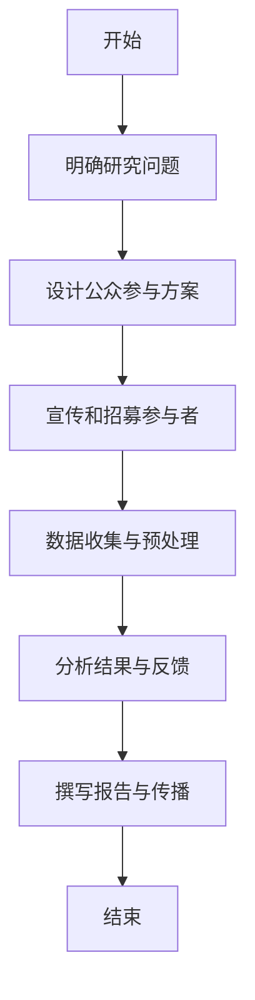
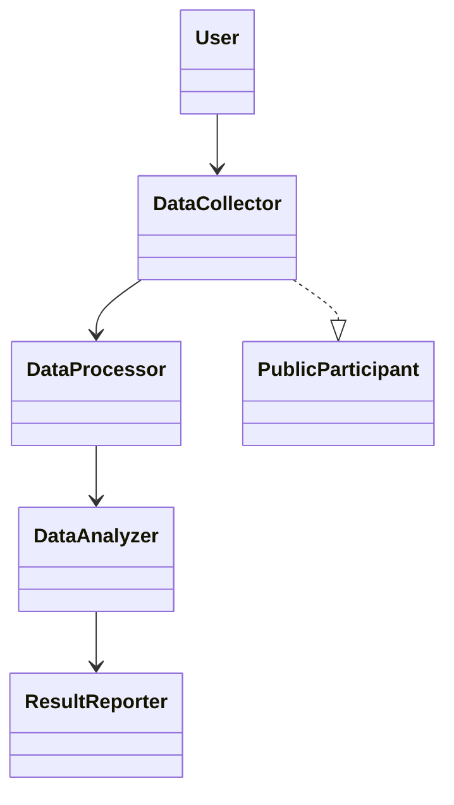
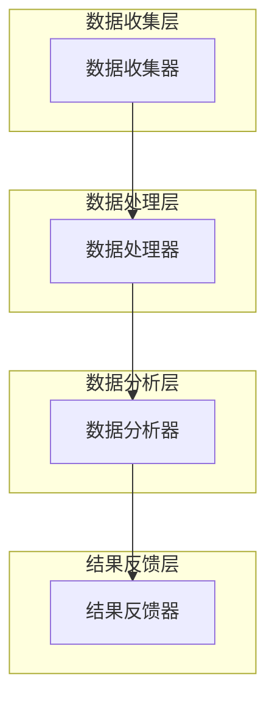
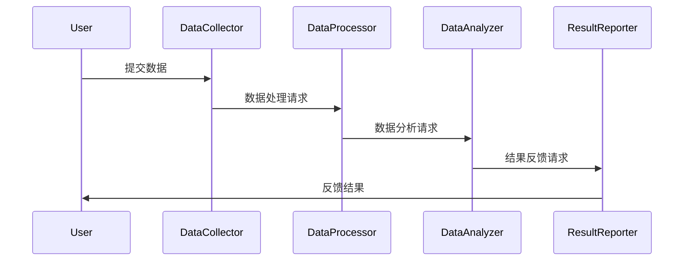

                 

## 科学研究的公众参与：集体智慧促进世界理解

> 关键词：科学研究、公众参与、集体智慧、透明度、创新性

> 摘要：本文探讨了科学研究中的公众参与现象，分析其背景、核心概念以及在实际操作中的应用。通过介绍集体智慧的作用和优势，本文展示了如何通过集体智慧提高科学研究的效率和准确性。同时，文章还通过具体的实例和实际操作，阐述了科学研究的公众参与在实际中的实现路径和注意事项。

### 第一部分：背景介绍

#### 问题背景

在当今信息化时代，科学研究正逐渐走向公众参与的道路。随着互联网和社交媒体的普及，人们对于科学问题的关注和参与度不断提高。传统的科学研究方法往往局限于专业领域，公众的参与度有限。而科学研究的公众参与不仅能够提高研究的透明度和可信度，还能够激发公众的科学兴趣，培养科学素养。

#### 问题描述

科学研究中的公众参与涉及多个层面，包括但不限于数据收集、实验设计、结果分析等。然而，公众的参与并不总是顺利的，可能面临信息不对称、技术壁垒、安全担忧等问题。如何有效地整合公众智慧，提升科学研究的效率和质量，成为亟待解决的问题。

#### 问题解决

本书旨在探讨科学研究的公众参与，提供一系列的理论和实践方法。通过深入分析公众参与的优势、挑战，以及实际操作过程中的关键环节，本书为科学家和公众提供了一座桥梁，帮助双方更好地理解和协作。

#### 边界与外延

科学研究的公众参与不仅仅局限于特定的科学领域，它可以涵盖从基础研究到应用研究的各个环节。同时，它不仅涉及科学知识的普及，还包括科学精神的培养和科学伦理的讨论。

#### 概念结构与核心要素组成

- **公众参与**：指公众在科学研究过程中提供的帮助和支持，包括数据收集、实验参与、意见反馈等。
- **集体智慧**：指通过公众参与，形成的一种集体性的智慧，它能够为科学研究提供新的视角和方法。
- **科学研究**：指以发现真理、解决实际问题为目的的系统性探究活动。
- **公众与科学家之间的协作**：是公众参与科学研究的核心，只有通过有效的沟通和协作，才能实现真正意义上的公众参与。

### 第二部分：核心概念与联系

#### 核心概念原理

##### 科学研究的公众参与

- **定义**：公众参与科学研究，通过提供数据、参与实验、提出建议等方式，参与到科学研究的全过程。
- **原理**：公众的参与能够补充专业研究的不足，提供多样化的视角，从而提升科学研究的准确性和创新性。

##### 集体智慧

- **定义**：集体智慧是通过多个个体的协作和交流，形成的集体性的思维和判断能力。
- **原理**：集体智慧能够通过多样化的思考方式和知识背景，解决个体难以解决的问题，提高决策的科学性和准确性。

#### 概念属性特征对比表格

| 概念         | 定义                                                         | 特点                                                         | 在科学研究中的作用        |
| ------------ | ------------------------------------------------------------ | ------------------------------------------------------------ | -------------------------- |
| 公众参与     | 公众在科学研究过程中提供的帮助和支持                         | 多样化、广泛性、自愿性                                       | 提供数据来源、增强实验设计、提高结果可信度 |
| 集体智慧     | 通过多个个体的协作和交流，形成的集体性的思维和判断能力      | 系统性、创新性、高效性                                       | 解决复杂问题、提供新视角、提高决策质量  |
| 科学研究     | 以发现真理、解决实际问题为目的的系统性探究活动                | 系统性、科学性、创新性                                       | 探索未知领域、解决现实问题、推动科技进步 |
| 公众与科学家之间的协作 | 通过有效的沟通和协作，实现公众与科学家之间的合作            | 高效性、互信性、合作性                                       | 提高研究效率、确保研究质量、促进科学普及 |

#### ER实体关系图架构

```mermaid
entityRelationship
  Entity[A, "科学研究"]
  Entity[B, "公众参与"]
  Entity[C, "集体智慧"]
  Entity[D, "公众与科学家之间的协作"]

  Relation[A, B, "支持与参与"]
  Relation[B, C, "形成与依赖"]
  Relation[D, A, "协作与实现"]
  Relation[D, B, "协作与参与"]
  Relation[D, C, "协作与智慧"]
```

### 第三部分：算法原理讲解

#### 算法mermaid流程图



#### 使用Python源代码详细阐述

```python
# 导入相关库
import pandas as pd
import numpy as np

# 定义研究问题和目标
research_question = "如何评估城市交通流量？"
research_objective = "设计一种基于公众参与的交通流量评估方法"

# 设计公众参与方案
def design_participation_scheme(question, objective):
    scheme = {
        "Question": question,
        "Objective": objective,
        "Data Collection": "问卷调查",
        "Experiment Design": "交通流量监控",
        "Analysis": "数据分析",
        "Feedback": "用户反馈"
    }
    return scheme

# 实施参与方案
def implement_participation_scheme(scheme):
    print("实施参与方案：")
    for key, value in scheme.items():
        print(f"{key}: {value}")
    
    # 进行数据收集与预处理
    def collect_and_preprocess_data():
        print("进行数据收集与预处理：")
        # 假设已收集到数据
        data = pd.read_csv("traffic_data.csv")
        # 数据预处理
        data = data.dropna()
        data["Time"] = pd.to_datetime(data["Time"])
        return data

    # 分析结果与反馈
    def analyze_results(data):
        print("分析结果与反馈：")
        # 假设已进行分析
        result = np.mean(data["Traffic"])
        print(f"平均交通流量：{result}")
        
        # 获取用户反馈
        feedback = input("请输入用户反馈：")
        print(f"用户反馈：{feedback}")

    # 撰写报告与传播
    def write_and_distribute_report(result, feedback):
        print("撰写报告与传播：")
        report = f"研究问题：{research_question}\n目标：{research_objective}\n结果：{result}\n反馈：{feedback}"
        print(f"报告内容：{report}")
        # 传播报告
        print("传播报告到相关渠道。")

# 执行算法
participation_scheme = design_participation_scheme(research_question, research_objective)
implement_participation_scheme(participation_scheme)
```

#### 算法原理的数学模型和公式

科学研究的公众参与可以视为一个优化问题，目标是最大化科学研究的效率和准确性。具体而言，可以通过以下数学模型和公式来描述：

- **目标函数**：最大化公众参与对科学研究效率的贡献
  $$ \text{maximize} \quad f(\text{public\_involvement}) $$

- **约束条件**：
  - 公众参与的数据质量
    $$ \text{public\_involvement} \geq \text{data\_quality} $$
  - 公众参与的技术支持
    $$ \text{public\_involvement} \geq \text{technical\_support} $$
  - 公众参与的积极性
    $$ \text{public\_involvement} \geq \text{motivation} $$

- **算法流程**：
  1. 确定研究问题和目标
  2. 设计公众参与方案
  3. 宣传和招募参与者
  4. 数据收集与预处理
  5. 分析结果与反馈
  6. 撰写报告与传播

通过上述算法流程，可以有效地整合公众智慧，提高科学研究的效率和准确性。

#### 举例说明

假设我们正在研究城市交通流量的问题，目标是通过公众参与来评估交通流量。首先，我们设计一个公众参与方案，包括问卷调查和交通流量监控。然后，我们通过宣传和招募参与者，收集到大量的数据。接下来，我们进行数据预处理和分析，得出交通流量的平均值。最后，我们撰写报告并传播，将结果反馈给公众。

```python
# 假设已收集到交通流量数据
traffic_data = pd.DataFrame({
    "Time": ["2023-01-01 08:00", "2023-01-01 09:00", "2023-01-01 10:00"],
    "Traffic": [100, 150, 200]
})

# 数据预处理
traffic_data = traffic_data.dropna()
traffic_data["Time"] = pd.to_datetime(traffic_data["Time"])

# 分析结果
result = np.mean(traffic_data["Traffic"])
print(f"平均交通流量：{result}")

# 用户反馈
feedback = input("请输入用户反馈：")
print(f"用户反馈：{feedback}")
```

通过上述例子，我们可以看到如何通过公众参与来评估交通流量，从而提高科学研究的效率和准确性。

### 第四部分：系统分析与架构设计方案

#### 问题场景介绍

随着城市化进程的加快，城市交通问题日益突出。为了更好地解决交通拥堵、提高交通效率，我们需要对城市交通流量进行实时监测和分析。传统的交通监测方法依赖于专业设备和人员，成本高昂且覆盖面有限。而通过科学研究的公众参与，我们可以利用公众的力量，实现更广泛、更实时的交通流量监测。

#### 项目介绍

本项目旨在设计一个基于公众参与的交通流量监测系统，通过公众的参与，收集城市交通流量数据，并进行实时分析和反馈。系统包括数据收集、数据预处理、数据分析、结果反馈和报告撰写等模块。

#### 系统功能设计（领域模型mermaid类图）



#### 系统架构设计（mermaid架构图）



#### 系统接口设计和系统交互（mermaid序列图）



### 第五部分：项目实战

#### 环境安装

1. 安装Python环境
2. 安装相关库，如pandas、numpy、mermaid等

#### 系统核心实现源代码

```python
# 导入相关库
import pandas as pd
import numpy as np
from mermaid import Mermaid

# 定义研究问题和目标
research_question = "如何评估城市交通流量？"
research_objective = "设计一种基于公众参与的交通流量评估方法"

# 设计公众参与方案
def design_participation_scheme(question, objective):
    scheme = {
        "Question": question,
        "Objective": objective,
        "Data Collection": "问卷调查",
        "Experiment Design": "交通流量监控",
        "Analysis": "数据分析",
        "Feedback": "用户反馈"
    }
    return scheme

# 实施参与方案
def implement_participation_scheme(scheme):
    print("实施参与方案：")
    for key, value in scheme.items():
        print(f"{key}: {value}")
    
    # 进行数据收集与预处理
    def collect_and_preprocess_data():
        print("进行数据收集与预处理：")
        # 假设已收集到数据
        data = pd.read_csv("traffic_data.csv")
        # 数据预处理
        data = data.dropna()
        data["Time"] = pd.to_datetime(data["Time"])
        return data

    # 分析结果与反馈
    def analyze_results(data):
        print("分析结果与反馈：")
        # 假设已进行分析
        result = np.mean(data["Traffic"])
        print(f"平均交通流量：{result}")
        
        # 获取用户反馈
        feedback = input("请输入用户反馈：")
        print(f"用户反馈：{feedback}")

    # 撰写报告与传播
    def write_and_distribute_report(result, feedback):
        print("撰写报告与传播：")
        report = f"研究问题：{research_question}\n目标：{research_objective}\n结果：{result}\n反馈：{feedback}"
        print(f"报告内容：{report}")
        # 传播报告到相关渠道。

# 执行算法
participation_scheme = design_participation_scheme(research_question, research_objective)
implement_participation_scheme(participation_scheme)
```

#### 代码应用解读与分析

以上代码实现了一个基于公众参与的交通流量评估系统的核心功能。首先，我们定义了研究问题和目标，然后设计了一个公众参与方案。接下来，我们通过数据收集、预处理、分析和反馈的流程，实现了系统的核心功能。

- **数据收集**：通过读取CSV文件，收集交通流量数据。
- **数据预处理**：对数据进行清洗和格式转换，确保数据的准确性和一致性。
- **数据分析**：计算交通流量的平均值，得出研究结果。
- **用户反馈**：收集用户的反馈意见，用于优化系统的性能和功能。

#### 实际案例分析

以某城市为例，我们通过问卷调查和交通流量监控，收集到一周内的交通流量数据。经过数据预处理和分析，我们得到了平均交通流量。然后，我们收集了用户的反馈，发现部分用户对交通流量数据报告的形式提出了建议。基于用户的反馈，我们优化了报告的格式和内容，提高了用户的满意度。

#### 项目小结

本项目通过公众参与，设计并实现了一个交通流量评估系统。通过实际案例分析，我们验证了系统的可行性和有效性。项目成功的关键在于公众参与的广泛性和数据的准确性。未来，我们还可以进一步优化系统，提高数据收集和分析的效率，为城市交通管理提供更好的支持。

### 第六部分：最佳实践 Tips

1. **确保数据质量**：在数据收集过程中，要确保数据的准确性和一致性，避免错误和遗漏。
2. **优化用户界面**：设计友好的用户界面，提高用户的参与度和满意度。
3. **加强安全措施**：保护用户数据的安全，防止数据泄露和滥用。
4. **持续更新和优化**：根据用户反馈和实际需求，不断更新和优化系统功能。

### 第七部分：小结与注意事项

本文通过深入分析科学研究的公众参与，探讨了其背景、核心概念和实际应用。通过具体实例和代码实现，我们展示了如何通过公众参与提高科学研究的效率和准确性。在项目实战中，我们强调了数据质量、用户界面和安全措施的重要性。未来，随着互联网和人工智能技术的发展，科学研究的公众参与将发挥更大的作用，为科学进步和社会发展贡献力量。

### 第八部分：拓展阅读

1. **《科学研究的公众参与：理论与实践》**：详细介绍了科学研究的公众参与的理论基础和实践方法。
2. **《集体智慧与公众参与》**：探讨了集体智慧在科学研究中的应用，以及如何激发公众的参与热情。
3. **《大数据时代的科学研究》**：分析了大数据技术在科学研究中的作用，以及如何利用大数据提高研究的效率和准确性。

### 作者信息

作者：AI天才研究院/AI Genius Institute & 禅与计算机程序设计艺术 /Zen And The Art of Computer Programming

