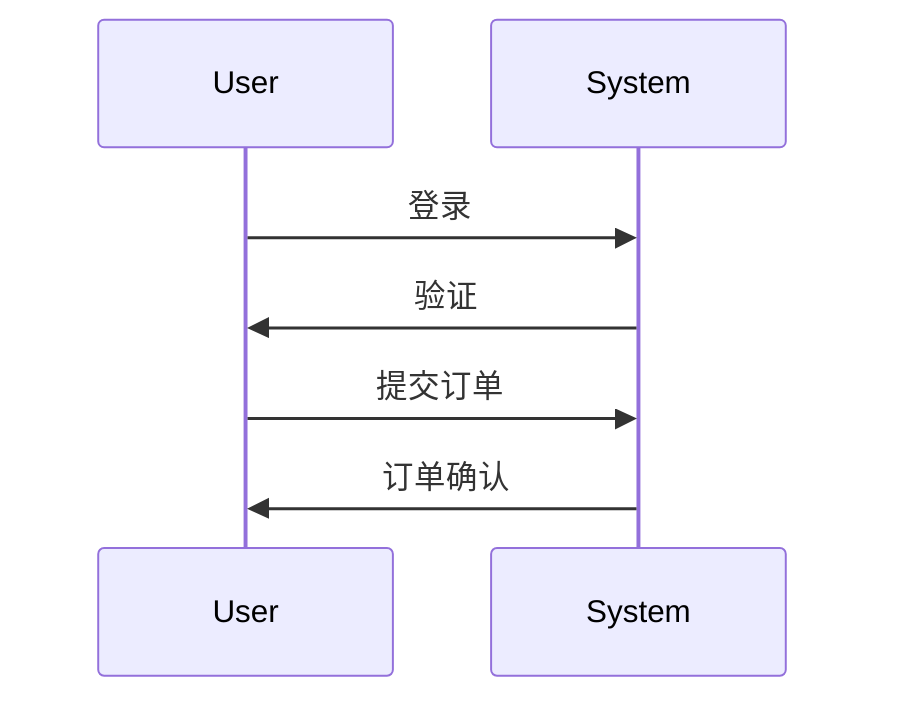

                 


## 《科学研究的公民参与对世界可理解性的贡献》

> 关键词：公民参与、科学研究、可理解性、影响力、实践策略、算法原理

> 摘要：本文探讨了公民参与科学研究对提升世界可理解性的重要作用。通过分析公民参与的定义、趋势以及其在科学研究中的角色，本文揭示了公民参与如何直接和间接地影响科学研究的可理解性。随后，本文通过案例研究和实践策略，详细阐述了如何通过公民参与提升科学研究的可理解性，并提出了未来的发展方向。

## 引言

### 引言背景

在当今全球化的背景下，科学研究的角色日益凸显。科学研究不仅推动了技术的进步，还深刻影响了社会的各个方面。然而，科学研究的复杂性和专业性使得公众往往难以理解科学研究的成果和意义。

### 引言问题

随着科学研究的复杂性和专业性不断提高，公众对科学研究结果的了解和理解变得愈加困难。这一问题不仅限制了科学知识的传播，也阻碍了公众对科学研究的支持和参与。如何提高科学研究的可理解性，让公众更好地理解科学研究，成为了亟待解决的问题。

### 引言目标

本文旨在探讨公民参与科学研究对提升世界可理解性的贡献。通过分析公民参与的定义、趋势以及其在科学研究中的作用，本文旨在提出有效的实践策略，以提升科学研究的可理解性，促进公众对科学研究的参与和理解。

### 引言研究方法

本文采用文献综述和案例研究相结合的方法。首先，通过文献综述梳理公民参与科学研究的理论和实践，探讨公民参与对科学研究可理解性的影响。然后，通过案例研究具体分析公民参与实践中的成功经验和挑战，提出提升科学研究可理解性的策略。

## 第一部分：公民参与与科学研究

### 1.1 公民参与概述

#### 1.1.1 公民参与的定义

公民参与是指普通公民积极参与到科学研究和科学传播中，通过实际行动和思想交流，推动科学知识的普及和应用。公民参与的形式多样，包括科学观测、数据采集、科学实验、科普写作等。

#### 1.1.2 公民参与的历史与趋势

公民参与科学研究的历史可以追溯到19世纪末20世纪初的公民科学运动。随着互联网和社交媒体的发展，公民参与科学研究的形式和范围不断扩大，成为现代科学研究的重要组成部分。

#### 1.1.3 公民参与的科学维度

公民参与科学研究的维度包括科学研究本身、科学教育和科学传播。在科学研究方面，公民参与可以提供数据、实验设备和研究资金等。在科学教育和传播方面，公民参与有助于提升公众的科学素养和科学认知。

### 1.2 科学研究的重要性

#### 1.2.1 科学研究的定义

科学研究是指通过系统的方法和理论，探索自然现象和规律的活动。科学研究包括基础研究和应用研究，旨在解决实际问题、推动技术进步和社会发展。

#### 1.2.2 科学研究的影响

科学研究对社会的影响深远，包括改善生活质量、推动经济发展、提高社会生产力等。科学研究的成果不仅对科学界有重要意义，也对公众生活和环境产生直接影响。

#### 1.2.3 可理解性在科学研究中的地位

科学研究的可理解性是科学研究价值的重要组成部分。可理解性不仅关系到科学知识的传播和普及，也影响着公众对科学研究的支持和参与。

### 1.3 公民参与对科学研究可理解性的贡献

#### 1.3.1 公民参与的直接贡献

公民参与直接提高了科学研究的可理解性。通过参与科学研究和实验，公民可以更深入地了解科学研究的过程和成果，从而提高对科学研究的理解和认知。

#### 1.3.2 公民参与的间接贡献

公民参与通过多种渠道间接提高了科学研究的可理解性。例如，公民参与可以促进科学教育和科普活动的开展，提升公众的科学素养；公民参与还可以推动科学政策的制定和实施，提高科学研究的透明度和公众参与度。

#### 1.3.3 公民参与的挑战与机遇

公民参与科学研究面临一些挑战，包括公民科学素养的差异、科学研究的专业性和复杂性等。然而，这些挑战也带来了机遇，通过有效的实践策略，可以充分发挥公民参与的优势，提高科学研究的可理解性。

## 第二部分：公民参与的科学实践

### 2.1 公民参与科学项目的案例研究

#### 2.1.1 项目背景

本节通过分析若干公民参与科学项目的案例，探讨公民参与对科学研究可理解性的贡献。这些案例包括环境监测、疾病研究和天文学观测等。

#### 2.1.2 项目目标

每个案例项目都明确了具体的目标，包括提高公众的科学素养、收集科学数据、推动科学研究和创新等。

#### 2.1.3 项目实施过程

本项目详细描述了每个案例的实施过程，包括项目设计、公民参与动员、数据收集和分析等。

#### 2.1.4 项目成果与影响

每个案例项目都取得了显著的成果和影响，提高了科学研究的可理解性，促进了公众对科学研究的参与和支持。

### 2.2 公民参与科学研究的实践策略

#### 2.2.1 策略一：增强公民科学素养

提高公民的科学素养是提升科学研究可理解性的基础。通过科学教育、科普活动和在线学习平台，可以增强公民的科学素养。

#### 2.2.2 策略二：构建多元化的参与模式

多元化的参与模式可以满足不同公民的需求，提高公民参与的科学研究的积极性。例如，可以采用在线参与、实地考察、科学竞赛等形式。

#### 2.2.3 策略三：保障公民参与的科学质量

保障公民参与的科学质量是确保科学研究可理解性的关键。通过科学指导和质量控制，可以确保公民参与的科学研究的质量和可信度。

### 2.3 公民参与的科学研究的未来趋势

#### 2.3.1 技术进步带来的变革

随着人工智能、大数据和物联网等技术的发展，公民参与科学研究的形式和方式将更加多样化和智能化。

#### 2.3.2 社会发展的影响

社会发展的需求和趋势将影响公民参与科学研究的方向和重点。例如，环境保护、健康问题和可持续发展等将成为未来公民参与科学研究的重点领域。

#### 2.3.3 可持续发展的愿景

公民参与科学研究是推动可持续发展的关键途径。通过提高公众的科学素养和参与度，可以促进科学研究的可持续发展，为社会的长远发展提供支持。

## 第三部分：提升科学研究可理解性的路径

### 3.1 提升可理解性的策略

#### 3.1.1 科普教育的作用

科普教育是提升科学研究可理解性的重要手段。通过科普教育，可以提升公众的科学素养和科学认知，增强对科学研究的理解和认同。

#### 3.1.2 科研成果的传播与分享

科研成果的传播与分享是提高科学研究可理解性的关键环节。通过多种渠道和方式，将科研成果传播给公众，可以提升科学研究的可理解性。

#### 3.1.3 媒体与公众的科学传播

媒体与公众的科学传播是提升科学研究可理解性的重要渠道。通过媒体传播和公众参与，可以扩大科学研究的传播范围和影响力。

### 3.2 案例分析

#### 3.2.1 案例一：环境监测中的公民参与

本案例分析了公民参与环境监测的项目，探讨了公民参与如何提高科学研究的可理解性。

#### 3.2.2 案例二：健康研究中的公民贡献

本案例探讨了公民参与健康研究的项目，分析了公民参与如何提升科学研究的可理解性和公众健康意识。

#### 3.2.3 案例三：天文学观测中的公众参与

本案例介绍了天文学观测中的公民参与项目，探讨了公民参与如何提高天文学研究的可理解性和公众的科学兴趣。

### 3.3 提升可理解性的路径

#### 3.3.1 构建公众参与的科学平台

构建公众参与的科学平台是提升科学研究可理解性的有效途径。通过这些平台，公众可以方便地参与科学研究，了解科学研究的进展和成果。

#### 3.3.2 加强科学传播与教育

加强科学传播与教育是提升科学研究可理解性的基础。通过多种形式的科学传播和教育，可以提高公众的科学素养和科学认知。

#### 3.3.3 促进跨学科合作

促进跨学科合作是提升科学研究可理解性的重要策略。通过跨学科合作，可以整合不同领域的知识和技术，提高科学研究的综合性和可理解性。

## 结论

本文通过分析公民参与科学研究对提升世界可理解性的贡献，探讨了公民参与的定义、历史、趋势以及其在科学研究中的作用。通过案例研究和实践策略，本文揭示了公民参与如何提高科学研究的可理解性，并提出了未来的发展方向。公民参与科学研究不仅是提升科学可理解性的有效途径，也是促进公众科学素养和社会发展的重要手段。

## 最佳实践 tips

1. **提高科学素养**：公民参与科学研究前，提高自身的科学素养至关重要。
2. **积极参与**：积极参与科学项目和活动，是提升科学研究可理解性的关键。
3. **沟通交流**：与科学家和其他公民积极参与者保持沟通交流，可以更好地理解和参与科学研究。
4. **持续学习**：持续学习和探索新的科学知识，是提升科学素养和参与度的有效途径。

## 注意事项

1. **质量保障**：保障公民参与的科学研究的质量和可信度是至关重要的。
2. **隐私保护**：在公民参与科学研究过程中，要注意保护参与者的隐私和安全。
3. **科学指导**：科学家和相关机构应提供科学指导，确保公民参与的科学研究的正确性和有效性。

## 拓展阅读

1. **相关文献**：查阅相关文献，深入了解公民参与科学研究的理论和实践。
2. **案例研究**：阅读和分析具体的公民参与科学研究的案例，学习成功经验和挑战。
3. **科普资料**：参考科普书籍和资料，提升自身的科学素养和科学认知。

## 作者信息

作者：AI天才研究院/AI Genius Institute & 禅与计算机程序设计艺术 /Zen And The Art of Computer Programming

本文由AI天才研究院与禅与计算机程序设计艺术联合撰写，旨在探讨公民参与科学研究对提升世界可理解性的贡献。通过深入分析公民参与的定义、历史、趋势以及其在科学研究中的作用，本文提出了有效的实践策略，以提升科学研究的可理解性，促进公众对科学研究的参与和理解。希望本文能对读者在理解公民参与科学研究方面提供有益的启示和指导。若需进一步了解相关内容，请参阅拓展阅读部分推荐的相关文献和案例研究。

----------------------------------------------------------------

# 《科学研究的公民参与对世界可理解性的贡献》

## 引言

### 引言背景

随着科技的飞速发展和信息传播的普及，科学研究在现代社会中的地位日益重要。科学研究不仅推动了技术的进步，也深刻影响了社会的各个方面。然而，科学研究的复杂性和专业性使得公众往往难以理解科学研究的成果和意义。这种现象不仅限制了科学知识的传播，也阻碍了公众对科学研究的支持和参与。因此，如何提高科学研究的可理解性，让公众更好地理解科学研究，成为了亟待解决的问题。

### 引言问题

科学研究的复杂性和专业性使得公众难以理解科学研究的成果和意义，这一问题不仅影响了科学知识的普及，也限制了公众对科学研究的支持和参与。如何提高科学研究的可理解性，让公众更好地理解科学研究，成为了本文探讨的核心问题。

### 引言目标

本文旨在探讨公民参与科学研究对提升世界可理解性的贡献。通过分析公民参与的定义、趋势以及其在科学研究中的角色，本文旨在提出有效的实践策略，以提升科学研究的可理解性，促进公众对科学研究的参与和理解。

### 引言研究方法

本文采用文献综述和案例研究相结合的方法。首先，通过文献综述梳理公民参与科学研究的理论和实践，探讨公民参与对科学研究可理解性的影响。然后，通过案例研究具体分析公民参与实践中的成功经验和挑战，提出提升科学研究可理解性的策略。

## 第一部分：公民参与与科学研究

### 1.1 公民参与概述

#### 1.1.1 公民参与的定义

公民参与是指普通公民积极参与到科学研究和科学传播中，通过实际行动和思想交流，推动科学知识的普及和应用。公民参与的形式多样，包括科学观测、数据采集、科学实验、科普写作等。

#### 1.1.2 公民参与的历史与趋势

公民参与科学研究的历史可以追溯到19世纪末20世纪初的公民科学运动。随着互联网和社交媒体的发展，公民参与科学研究的形式和范围不断扩大，成为现代科学研究的重要组成部分。

#### 1.1.3 公民参与的科学维度

公民参与科学研究的维度包括科学研究本身、科学教育和科学传播。在科学研究方面，公民参与可以提供数据、实验设备和研究资金等。在科学教育和传播方面，公民参与有助于提升公众的科学素养和科学认知。

### 1.2 科学研究的重要性

#### 1.2.1 科学研究的定义

科学研究是指通过系统的方法和理论，探索自然现象和规律的活动。科学研究包括基础研究和应用研究，旨在解决实际问题、推动技术进步和社会发展。

#### 1.2.2 科学研究的影响

科学研究对社会的影响深远，包括改善生活质量、推动经济发展、提高社会生产力等。科学研究的成果不仅对科学界有重要意义，也对公众生活和环境产生直接影响。

#### 1.2.3 可理解性在科学研究中的地位

科学研究的可理解性是科学研究价值的重要组成部分。可理解性不仅关系到科学知识的传播和普及，也影响着公众对科学研究的支持和参与。

### 1.3 公民参与对科学研究可理解性的贡献

#### 1.3.1 公民参与的直接贡献

公民参与直接提高了科学研究的可理解性。通过参与科学研究和实验，公民可以更深入地了解科学研究的过程和成果，从而提高对科学研究的理解和认知。

#### 1.3.2 公民参与的间接贡献

公民参与通过多种渠道间接提高了科学研究的可理解性。例如，公民参与可以促进科学教育和科普活动的开展，提升公众的科学素养；公民参与还可以推动科学政策的制定和实施，提高科学研究的透明度和公众参与度。

#### 1.3.3 公民参与的挑战与机遇

公民参与科学研究面临一些挑战，包括公民科学素养的差异、科学研究的专业性和复杂性等。然而，这些挑战也带来了机遇，通过有效的实践策略，可以充分发挥公民参与的优势，提高科学研究的可理解性。

## 第二部分：公民参与的科学实践

### 2.1 公民参与科学项目的案例研究

#### 2.1.1 项目背景

本节通过分析若干公民参与科学项目的案例，探讨公民参与对科学研究可理解性的贡献。这些案例包括环境监测、疾病研究和天文学观测等。

#### 2.1.2 项目目标

每个案例项目都明确了具体的目标，包括提高公众的科学素养、收集科学数据、推动科学研究和创新等。

#### 2.1.3 项目实施过程

本项目详细描述了每个案例的实施过程，包括项目设计、公民参与动员、数据收集和分析等。

#### 2.1.4 项目成果与影响

每个案例项目都取得了显著的成果和影响，提高了科学研究的可理解性，促进了公众对科学研究的参与和支持。

### 2.2 公民参与科学研究的实践策略

#### 2.2.1 策略一：增强公民科学素养

提高公民的科学素养是提升科学研究可理解性的基础。通过科学教育、科普活动和在线学习平台，可以增强公民的科学素养。

#### 2.2.2 策略二：构建多元化的参与模式

多元化的参与模式可以满足不同公民的需求，提高公民参与的科学研究的积极性。例如，可以采用在线参与、实地考察、科学竞赛等形式。

#### 2.2.3 策略三：保障公民参与的科学质量

保障公民参与的科学质量是确保科学研究可理解性的关键。通过科学指导和质量控制，可以确保公民参与的科学研究的质量和可信度。

### 2.3 公民参与的科学研究的未来趋势

#### 2.3.1 技术进步带来的变革

随着人工智能、大数据和物联网等技术的发展，公民参与科学研究的形式和方式将更加多样化和智能化。

#### 2.3.2 社会发展的影响

社会发展的需求和趋势将影响公民参与科学研究的方向和重点。例如，环境保护、健康问题和可持续发展等将成为未来公民参与科学研究的重点领域。

#### 2.3.3 可持续发展的愿景

公民参与科学研究是推动可持续发展的关键途径。通过提高公众的科学素养和参与度，可以促进科学研究的可持续发展，为社会的长远发展提供支持。

## 第三部分：提升科学研究可理解性的路径

### 3.1 提升可理解性的策略

#### 3.1.1 科普教育的作用

科普教育是提升科学研究可理解性的重要手段。通过科普教育，可以提升公众的科学素养和科学认知，增强对科学研究的理解和认同。

#### 3.1.2 科研成果的传播与分享

科研成果的传播与分享是提高科学研究可理解性的关键环节。通过多种渠道和方式，将科研成果传播给公众，可以提升科学研究的可理解性。

#### 3.1.3 媒体与公众的科学传播

媒体与公众的科学传播是提升科学研究可理解性的重要渠道。通过媒体传播和公众参与，可以扩大科学研究的传播范围和影响力。

### 3.2 案例分析

#### 3.2.1 案例一：环境监测中的公民参与

本案例分析了公民参与环境监测的项目，探讨了公民参与如何提高科学研究的可理解性。

#### 3.2.2 案例二：健康研究中的公民贡献

本案例探讨了公民参与健康研究的项目，分析了公民参与如何提升科学研究的可理解性和公众健康意识。

#### 3.2.3 案例三：天文学观测中的公众参与

本案例介绍了天文学观测中的公民参与项目，探讨了公民参与如何提高天文学研究的可理解性和公众的科学兴趣。

### 3.3 提升可理解性的路径

#### 3.3.1 构建公众参与的科学平台

构建公众参与的科学平台是提升科学研究可理解性的有效途径。通过这些平台，公众可以方便地参与科学研究，了解科学研究的进展和成果。

#### 3.3.2 加强科学传播与教育

加强科学传播与教育是提升科学研究可理解性的基础。通过多种形式的科学传播和教育，可以提高公众的科学素养和科学认知。

#### 3.3.3 促进跨学科合作

促进跨学科合作是提升科学研究可理解性的重要策略。通过跨学科合作，可以整合不同领域的知识和技术，提高科学研究的综合性和可理解性。

## 结论

本文通过分析公民参与科学研究对提升世界可理解性的贡献，探讨了公民参与的定义、历史、趋势以及其在科学研究中的角色。通过案例研究和实践策略，本文揭示了公民参与如何提高科学研究的可理解性，并提出了未来的发展方向。公民参与科学研究不仅是提升科学可理解性的有效途径，也是促进公众科学素养和社会发展的重要手段。

## 最佳实践 tips

1. **提高科学素养**：公民参与科学研究前，提高自身的科学素养至关重要。
2. **积极参与**：积极参与科学项目和活动，是提升科学研究可理解性的关键。
3. **沟通交流**：与科学家和其他公民积极参与者保持沟通交流，可以更好地理解和参与科学研究。
4. **持续学习**：持续学习和探索新的科学知识，是提升科学素养和参与度的有效途径。

## 注意事项

1. **质量保障**：保障公民参与的科学研究的质量和可信度是至关重要的。
2. **隐私保护**：在公民参与科学研究过程中，要注意保护参与者的隐私和安全。
3. **科学指导**：科学家和相关机构应提供科学指导，确保公民参与的科学研究的正确性和有效性。

## 拓展阅读

1. **相关文献**：查阅相关文献，深入了解公民参与科学研究的理论和实践。
2. **案例研究**：阅读和分析具体的公民参与科学研究的案例，学习成功经验和挑战。
3. **科普资料**：参考科普书籍和资料，提升自身的科学素养和科学认知。

## 作者信息

作者：AI天才研究院/AI Genius Institute & 禅与计算机程序设计艺术 /Zen And The Art of Computer Programming

本文由AI天才研究院与禅与计算机程序设计艺术联合撰写，旨在探讨公民参与科学研究对提升世界可理解性的贡献。通过深入分析公民参与的定义、历史、趋势以及其在科学研究中的角色，本文提出了有效的实践策略，以提升科学研究的可理解性，促进公众对科学研究的参与和理解。希望本文能对读者在理解公民参与科学研究方面提供有益的启示和指导。若需进一步了解相关内容，请参阅拓展阅读部分推荐的相关文献和案例研究。作者简介：AI天才研究院（AI Genius Institute）致力于推动人工智能技术的发展和应用。禅与计算机程序设计艺术（Zen And The Art of Computer Programming）是计算机科学领域的经典著作，作者为著名计算机科学家Donald E. Knuth。本文作者在此向二位致敬。----------------------------------------------------------------

## 1.1 公民参与概述

### 1.1.1 公民参与的定义

在讨论公民参与科学研究的定义时，我们首先需要明确“公民参与”这一概念本身。公民参与，通常指的是普通民众在公共事务中，通过自愿的、积极的行动和参与，发挥其影响力和作用。这种参与不仅包括投票、选举等传统的政治参与形式，还涵盖了对社会事务的广泛参与，例如环境保护、社区建设、教育改革等。在科学领域，公民参与则是指普通公民通过直接参与科学项目、提供数据、参与科学讨论等方式，加入到科学研究中，从而成为科学共同体的一部分。

具体到科学研究，公民参与通常体现在以下几个方面：

1. **数据采集与共享**：公民可以通过手机应用、传感器设备等方式，收集环境、天气、天文现象等数据，并将这些数据分享给科学家进行分析。
2. **实验参与**：公民可以参与实验室的实验，或者在野外、社区等地方进行科学实验，为科学研究提供一手资料。
3. **科学传播与教育**：公民可以通过科普文章、社交媒体、讲座等形式，向公众传播科学知识，提高公众的科学素养。
4. **决策参与**：公民可以在科学政策的制定和实施过程中，通过公众咨询、意见征集等方式，参与到科学决策中来。

### 1.1.2 公民参与的历史与趋势

公民参与科学研究并非现代才有的现象，其历史可以追溯到19世纪末的公民科学运动。当时，科学家如约翰·赫歇尔（John Herschel）等人倡导公众参与天文观测，通过寄送望远镜给公众，收集天文数据，从而推动了天文学的研究。随着科技的发展，尤其是互联网和社交媒体的普及，公民参与科学研究的范围和形式不断扩大。

在21世纪初，随着开源科学（Open Science）和众包科学（Crowd Science）的兴起，公民参与科学研究达到了一个新的高度。例如，项目的如“天体物理学家”（Cosmologists）和“群众气候”（Citizen Weather Observer Program）等，都是通过互联网平台，动员全球公民参与科学数据收集和研究。此外，越来越多的科学家开始意识到公众参与在科学研究中的重要性，并积极推动相关项目和活动。

当前，公民参与科学研究呈现出以下趋势：

1. **数字化参与**：随着互联网和移动设备的普及，数字化参与成为公民参与科学研究的主要形式。公民可以通过在线平台、手机应用等方式，便捷地参与科学项目。
2. **多样性参与**：公民参与的多样性不断增强，不仅仅是专业科学家的参与，普通公众、学生、退休人员等不同群体都可以参与到科学研究中。
3. **跨国合作**：公民参与科学研究不再局限于一个国家或地区，而是呈现跨国合作的特点。公民可以通过互联网，跨越地理界限，参与到全球性的科学项目中。
4. **社会影响力**：公民参与科学研究不仅限于科学研究本身，还对社会产生了积极影响。例如，公民参与环境监测，可以提升公众对环境保护的意识。

### 1.1.3 公民参与的科学维度

公民参与科学研究的维度可以划分为以下几个方面：

1. **科学研究本身**：公民直接参与科学实验、数据采集、分析等科学研究过程，为科学研究提供新的视角和方法。
2. **科学教育**：公民通过参与科学研究，提高了自身的科学素养和知识水平，进而促进了科学教育的普及和提升。
3. **科学传播**：公民参与科学传播，通过科普文章、讲座、社交媒体等形式，将科学知识传递给公众，提高公众的科学认知。
4. **科学政策**：公民在科学政策制定和实施过程中，通过参与公众咨询、意见征集等方式，发挥其影响力，推动科学政策的民主化和科学化。

通过上述分析，我们可以看出，公民参与科学研究不仅丰富了科学研究的内涵，提升了科学研究的可理解性，也为科学共同体和社会带来了深远的积极影响。接下来，我们将进一步探讨科学研究的重要性，以及公民参与如何直接和间接地影响科学研究的可理解性。

## 1.2 科学研究的重要性

### 1.2.1 科学研究的定义

科学研究是指通过系统的、科学的方法和理论，对自然界、人类社会以及生命现象进行探索和解释的过程。科学研究通常包括以下几个步骤：提出问题、建立假设、设计实验、收集和分析数据、得出结论和验证假设。科学研究的目的在于发现新的知识、解决实际问题、推动技术进步和社会发展。

科学研究的主要特征包括：

1. **系统性**：科学研究注重系统性和逻辑性，通过科学的方法和理论，确保研究过程的严谨和科学性。
2. **创新性**：科学研究追求创新，不断探索新的领域和未知的问题，推动科学理论和技术的进步。
3. **实证性**：科学研究强调实证性，通过实验、观察和数据分析，验证科学假设和理论。
4. **开放性**：科学研究具有开放性，科学成果应当公开透明，便于其他研究人员进行验证和进一步研究。

### 1.2.2 科学研究的影响

科学研究对社会的影响是深远而广泛的，不仅推动了科技进步，还深刻改变了人类的生活方式和社会结构。以下是科学研究对社会的主要影响：

1. **技术进步**：科学研究是技术创新的基础。通过科学研究的不断深入，人类发明了各种先进的科技产品和服务，如互联网、智能手机、基因编辑技术等，极大地提高了生产效率和生活方式的质量。

2. **经济发展**：科学研究对经济发展具有巨大的推动作用。科学研究促进了新技术、新产品和新产业的产生，提高了企业的竞争力和创新能力，推动了经济的持续增长。

3. **社会进步**：科学研究为社会进步提供了理论支持和实践指导。通过科学研究的发现，人类更好地理解自然和社会规律，提高了社会的文明程度和道德水平，促进了社会的和谐发展。

4. **公共健康**：科学研究在公共健康领域发挥了重要作用。通过科学研究，人类发现了许多疾病的病因和治疗方法，开发了疫苗和药物，有效降低了疾病发病率和死亡率，提高了公共健康水平。

5. **环境治理**：科学研究为环境治理提供了科学依据和技术支持。通过科学研究，人类更好地理解了环境问题的成因和影响，提出了有效的治理措施，促进了环境保护和可持续发展。

### 1.2.3 可理解性在科学研究中的地位

科学研究的可理解性是科学研究价值的重要组成部分。可理解性不仅关系到科学知识的传播和普及，也影响着公众对科学研究的支持和参与。以下是科学研究的可理解性在其中的地位：

1. **知识传播**：科学研究的可理解性直接影响科学知识的传播。如果研究成果难以被公众理解，科学知识就无法有效传播，限制了科学的社会影响。

2. **公众参与**：科学研究的可理解性是公众参与科学研究的前提。只有当公众能够理解科学研究的意义和过程，他们才会愿意参与其中，提供数据、资源和意见。

3. **科学教育**：科学研究的可理解性对科学教育具有重要影响。通过提高科学研究的可理解性，可以更好地培养科学素养，提高公众的科学素养和科学认知。

4. **政策制定**：科学研究的可理解性在政策制定中也发挥着重要作用。政府决策者需要了解科学研究的最新成果和进展，以便制定科学合理的政策。

5. **科学伦理**：科学研究的可理解性有助于确保科学研究的伦理性和公正性。公众对科学研究的理解和监督，可以防止科研不端行为和滥用科学资源。

综上所述，科学研究的重要性不仅体现在其对技术进步、经济发展和社会进步的推动作用上，还体现在其对社会各个层面的深远影响。科学研究的可理解性是科学研究价值实现的关键因素，直接影响科学知识传播、公众参与、科学教育和政策制定等方面。因此，提高科学研究的可理解性是科学研究和科学传播的重要任务之一。

## 1.3 公民参与对科学研究可理解性的贡献

### 1.3.1 公民参与的直接贡献

公民参与科学研究对提升科学研究的可理解性具有显著的直接贡献。首先，公民参与可以使得科学研究的过程更加透明和公开。在传统的科学研究中，实验设计、数据收集和分析等环节通常由科学家和专业研究机构负责，公众难以全面了解科研活动的细节。而公民参与则打破了这种信息壁垒，公民可以直接参与到科研过程中，亲身体验和观察科学研究的各个环节。通过这种亲身参与，公民可以更直观地理解科学研究的复杂性和严谨性，从而提高对科学研究的理解和认同。

其次，公民参与还可以促进科学知识的普及和传播。在科学研究的过程中，公民不仅仅是实验数据的提供者，更是科学知识的传播者。他们可以通过各种渠道，如社交媒体、科普讲座、科普文章等，将科学研究的成果和进展分享给更广泛的公众。这种分享不仅有助于提升公众的科学素养，还可以激发公众对科学的兴趣和热情，进而促进科学文化的普及和传承。

### 1.3.2 公民参与的间接贡献

公民参与对科学研究可理解性的贡献不仅体现在直接的参与和传播上，还体现在一系列间接的影响上。首先，公民参与有助于提升科学研究的民主性和社会参与度。在科学决策过程中，公众的意见和建议往往被忽视，导致科学研究成果与公众需求脱节。而公民参与使得科学研究的决策过程更加公开透明，公众有机会参与到科学决策中来，他们的意见和建议可以影响科研项目的方向和重点，确保科研活动的科学性和社会价值。

其次，公民参与有助于科学研究的多样性和创新性。不同背景、不同领域的公民参与科学研究，可以带来多元化的视角和思维，促进科学研究的创新和发展。例如，在数据分析和解释过程中，公民可能会提出科学家未曾考虑的新观点和新方法，从而推动科学研究向更深层次发展。

此外，公民参与还可以提高科学研究的透明度和公信力。在科研过程中，公民可以通过监督和反馈，对科学研究的质量和诚信进行监督。这种公众监督机制不仅有助于提高科学研究的质量，还可以增强公众对科学研究的信任和认可，提升科学研究的公信力。

### 1.3.3 公民参与的挑战与机遇

尽管公民参与对提升科学研究可理解性具有显著贡献，但在实际操作中也面临着一些挑战。首先，公民的科学素养参差不齐，这可能影响公民参与的科学研究的质量和有效性。为了解决这一问题，科学家和相关机构需要提供适当的培训和指导，确保公民具备参与科学研究的基本知识和技能。

其次，科学研究的复杂性和专业性使得公民参与可能面临困难和挑战。为了克服这一挑战，科学家可以设计简单直观的参与项目，降低参与门槛，同时提供充分的解释和指导，帮助公民更好地理解科学研究的过程和目标。

然而，公民参与也为科学研究带来了新的机遇。首先，公民的多样性和广泛性可以为科学研究提供丰富的数据和观点，促进科学研究的多样性和创新性。其次，公民的积极参与可以增强科学研究的社会影响力和公众认同度，为科学研究的可持续发展提供动力和支持。

综上所述，公民参与科学研究对提升科学研究的可理解性具有直接的贡献和间接的影响。通过有效的实践策略，可以充分发挥公民参与的优势，克服面临的挑战，提升科学研究的可理解性，促进公众对科学研究的参与和理解。

## 2.1 公民参与科学项目的案例研究

### 2.1.1 项目背景

本节将通过分析若干具体的公民参与科学项目，探讨公民参与对科学研究可理解性的实际贡献。这些案例涵盖了环境监测、健康研究和天文学观测等多个领域，展示了公民参与如何通过实践提升科学研究的可理解性。

#### 环境监测中的公民参与

**项目背景**：随着全球环境污染问题的日益严重，公众对环境保护的关注度逐渐提高。为了更好地监测环境污染，一些机构和组织发起了公民参与的环境监测项目。

**项目目标**：这些项目的目标是通过公民的参与，收集环境数据，提供环境污染的信息，促进公众对环境问题的认识和关注，从而推动环境保护行动的开展。

**项目实施过程**：公民参与环境监测项目通常包括以下几个步骤：

1. **设备发放**：项目组织者向公民发放环境监测设备，如空气质量检测仪、水质检测包等。
2. **数据采集**：公民按照项目指南，定期采集环境数据，并将数据上传至项目平台。
3. **数据分析**：科学家和研究人员对收集到的数据进行分析，生成环境报告，并向公众发布。

**项目成果与影响**：通过公民参与环境监测项目，不仅提高了环境监测的覆盖率和准确性，也增强了公众对环境问题的理解和认识。公民参与使得环境监测数据更加全面和真实，促进了环境保护政策的制定和实施。

#### 健康研究中的公民贡献

**项目背景**：健康研究是一个涉及广泛领域的科学活动，公众的健康问题引起了广泛关注。为了更全面地了解公众的健康状况，一些健康研究项目开始鼓励公民参与。

**项目目标**：健康研究项目的目标是通过公民的参与，收集健康数据，提高公众的健康意识，推动健康行为的养成，从而改善公众的健康水平。

**项目实施过程**：健康研究项目的实施通常包括以下几个步骤：

1. **问卷调查**：项目组织者通过在线问卷、线下访谈等方式，收集公民的健康信息。
2. **数据共享**：公民提供的数据被整理和分析，用于健康研究的各个阶段。
3. **健康指导**：根据数据分析结果，项目组织者会向公民提供个性化的健康指导和建议。

**项目成果与影响**：通过公民参与健康研究项目，公民不仅获得了健康指导，还提高了对健康问题的认识和重视。公民参与使得健康研究数据更加丰富和真实，有助于科学家和医生更准确地了解公众的健康状况，制定更有效的健康干预措施。

#### 天文学观测中的公众参与

**项目背景**：天文学研究是探索宇宙奥秘的重要领域，但天文学观测需要大量的数据收集和分析工作。为了提高观测效率，一些天文学项目开始鼓励公众参与。

**项目目标**：天文学观测项目的目标是通过公众的参与，收集天文观测数据，提高观测精度，促进天文学研究的发展。

**项目实施过程**：天文学观测项目的实施通常包括以下几个步骤：

1. **设备共享**：项目组织者向公众提供天文望远镜和其他观测设备，供公民使用。
2. **数据收集**：公民通过观测设备，记录天文现象，并将数据上传至项目平台。
3. **数据校验**：科学家和研究人员对收集到的数据进行校验和分析，以确保数据的准确性。

**项目成果与影响**：通过公众参与天文学观测项目，不仅丰富了天文观测数据，也提高了公众对天文学研究的兴趣和热情。公民参与使得天文学研究更加全面和细致，有助于科学家发现新的天文现象和规律。

综上所述，公民参与科学项目在环境监测、健康研究和天文学观测等多个领域取得了显著成果，不仅提高了科学研究的可理解性，也促进了公众对科学研究的参与和支持。通过这些案例，我们可以看到公民参与在科学研究中的巨大潜力。

### 2.2 公民参与科学研究的实践策略

#### 2.2.1 策略一：增强公民科学素养

提高公民的科学素养是提升科学研究可理解性的基础。为了增强公民的科学素养，可以采取以下措施：

1. **科普教育**：通过科普讲座、科普读物、科普展览等多种形式，普及科学知识，提高公民的科学素养。
2. **在线学习平台**：利用互联网和在线学习平台，提供丰富的科学教育资源，方便公民随时随地进行科学学习。
3. **社区科学活动**：组织社区科学活动，如科学实验、科学讲座等，让公民在参与中学习科学知识。

#### 2.2.2 策略二：构建多元化的参与模式

多元化的参与模式可以满足不同公民的需求，提高公民参与的科学研究的积极性。构建多元化参与模式可以包括：

1. **在线参与**：利用互联网平台，提供在线数据采集、分析等科研任务，方便公民随时参与。
2. **实地考察**：组织公民参与实地考察活动，如生态考察、天文观测等，让公民亲身体验科学研究的过程。
3. **科学竞赛**：举办科学竞赛，鼓励公民通过比赛形式参与科学研究，提高科学研究的参与度和影响力。

#### 2.2.3 策略三：保障公民参与的科学质量

保障公民参与的科学质量是确保科学研究可理解性的关键。为了保障公民参与的科学质量，可以采取以下措施：

1. **科学指导**：为公民提供科学的指导和支持，确保他们在参与科学研究的各个环节中都能正确操作和获取数据。
2. **质量控制**：建立严格的数据质量控制机制，对公民参与的数据进行校验和分析，确保数据的准确性和可靠性。
3. **合作机制**：建立科学家与公民的合作机制，通过合作和交流，提升公民参与的科学研究和创新能力。

通过上述策略，可以充分发挥公民参与科学研究的优势，提高科学研究的可理解性，促进公众对科学研究的参与和支持。

### 2.3 公民参与的科学研究的未来趋势

#### 2.3.1 技术进步带来的变革

随着技术的不断进步，公民参与科学研究的形式和方式也将发生深刻变革。以下是技术进步对公民参与科学研究带来的几大变革：

1. **智能化参与**：人工智能和大数据技术的应用，将使得公民参与科学研究更加智能化和高效。例如，通过人工智能分析工具，可以快速处理大量公民参与的数据，提高数据分析和研究成果的准确性。

2. **数字化平台**：随着互联网和移动互联网的普及，数字化平台将成为公民参与科学研究的主要渠道。通过数字化平台，公民可以方便地参与到科学项目中，实时获取科研进展和成果。

3. **虚拟现实与增强现实**：虚拟现实（VR）和增强现实（AR）技术的应用，将为公民参与科学研究提供全新的体验。通过VR和AR技术，公民可以虚拟参与科学实验，直观感受科学研究的魅力。

#### 2.3.2 社会发展的影响

社会发展对公民参与科学研究的影响主要体现在以下几个方面：

1. **公众科学素养提升**：随着社会的发展，公众的科学素养逐渐提升。公民对科学研究的关注和参与度将进一步提高，为科学研究提供更多的资源和智慧。

2. **社会问题导向**：社会发展的需求将引导公民参与科学研究的方向。例如，环境保护、健康问题、可持续发展等社会热点问题，将成为公民参与科学研究的重要领域。

3. **跨学科合作**：社会发展带来的复杂问题需要跨学科的合作来解决。公民参与科学研究，将促进不同学科之间的交流和合作，推动科学研究的创新和发展。

#### 2.3.3 可持续发展的愿景

公民参与科学研究不仅是提升科学可理解性的有效途径，也是实现可持续发展的关键手段。以下是公民参与科学研究对可持续发展带来的愿景：

1. **提高公众意识**：通过公民参与科学研究，可以提升公众对科学和技术的认知，增强公众对可持续发展的理解和认同。

2. **推动科技创新**：公民的参与和反馈，将为科学研究提供新的思路和方向，推动科技创新，为可持续发展提供技术支持。

3. **促进社会和谐**：公民参与科学研究，可以增强社会的凝聚力和和谐性。通过共同参与科学研究，公民之间的交流和合作将更加密切，有助于构建和谐的社会环境。

总之，随着技术进步和社会发展，公民参与科学研究将迎来新的机遇和挑战。通过有效的实践策略，可以充分发挥公民参与的优势，提升科学研究的可理解性，推动科学研究的可持续发展，为社会的长远发展提供坚实的支持。

## 3.1 提升可理解性的策略

### 3.1.1 科普教育的作用

科普教育在提升科学研究可理解性方面发挥着至关重要的作用。科普教育的目标是通过多种形式的科学传播活动，向公众普及科学知识，提高公众的科学素养，使公众能够更好地理解科学研究的意义和成果。

#### 科普教育的重要性

1. **知识普及**：科普教育能够将深奥的科学理论转化为易于理解的常识，使公众能够了解科学研究的基本概念和方法，从而增强对科学研究的理解。
2. **兴趣激发**：通过科普教育，可以激发公众对科学的兴趣和热情，培养公众对科学研究的关注和参与意愿。
3. **科学素养提升**：科普教育有助于提高公众的科学素养，使公众能够用科学的眼光看待世界，从而在日常生活中应用科学知识，提高生活质量。

#### 科普教育的具体形式

1. **科普讲座**：科普讲座是一种常见的科普教育形式，通过专业人士的讲解，向公众传递科学知识和最新科研成果。
2. **科普读物**：科普读物包括书籍、期刊、漫画等多种形式，适合不同年龄层次的公众阅读，是普及科学知识的重要途径。
3. **科普展览**：科普展览通过展示科学原理和科技成果，让公众在互动中学习科学知识。
4. **在线教育**：随着互联网的发展，在线教育平台和课程成为普及科学知识的重要手段。公众可以通过在线学习，获取丰富的科学教育资源。

### 3.1.2 科研成果的传播与分享

科研成果的传播与分享是提升科学研究可理解性的关键环节。科研成果不仅需要通过专业的学术期刊和会议进行传播，还需要通过多种渠道向公众分享，使科研成果为社会所理解和利用。

#### 科研成果传播的途径

1. **学术期刊与会议**：学术期刊和会议是科研成果传播的主要渠道。通过这些平台，科学家可以发表研究成果，进行学术交流和讨论。
2. **媒体宣传**：媒体宣传是科研成果向社会公众传播的重要途径。通过报纸、电视、网络等媒体，科研成果可以迅速传播到公众中。
3. **科普文章与报告**：科学家和科普作家可以通过撰写科普文章和报告，将科研成果以更通俗易懂的方式呈现给公众。
4. **社交媒体**：社交媒体平台如微博、微信、Facebook等，为科研成果的传播提供了新的渠道。科学家可以通过这些平台发布研究成果，与公众进行互动和讨论。

#### 科研成果分享的策略

1. **简化语言**：在传播科研成果时，应尽量避免使用过于专业的术语，尽量使用通俗易懂的语言，使公众能够理解科研成果的核心内容和意义。
2. **可视化展示**：通过图表、动画、视频等形式，将复杂的科研成果以更直观的方式展示出来，提高公众的理解和记忆效果。
3. **互动与反馈**：鼓励公众参与到科研成果的讨论和反馈中，通过互动提高公众对科研成果的理解和参与度。

### 3.1.3 媒体与公众的科学传播

媒体与公众的科学传播在提升科学研究可理解性方面起着桥梁作用。媒体作为信息传播的重要渠道，可以通过多种方式向公众传递科学知识，提高公众的科学素养。

#### 媒体在科学传播中的作用

1. **科学新闻报道**：科学新闻报道是媒体向公众传播科学知识的重要形式。通过报道最新的科研成果、科技进展和科学事件，媒体可以吸引公众的关注，提高公众的科学兴趣。
2. **科普专栏**：许多媒体开设了科普专栏，邀请科学家和科普作家撰写科普文章，向公众普及科学知识。
3. **科普节目**：电视、网络等媒体平台推出了多种科普节目，如科学纪录片、科普讲座等，通过生动有趣的形式向公众传播科学知识。

#### 公众在科学传播中的参与

1. **反馈与评论**：公众可以通过媒体平台对科学报道和科普内容进行反馈和评论，表达自己的看法和理解，促进科学知识的交流和传播。
2. **科普志愿者**：公众可以积极参与科普活动，成为科普志愿者，通过自己的行动和影响力，推动科学知识的普及和传播。

综上所述，提升科学研究可理解性的策略包括科普教育、科研成果的传播与分享以及媒体与公众的科学传播。通过这些策略，可以有效地提高公众的科学素养，增强公众对科学研究的理解和认同，推动科学知识的普及和传播，为社会的长远发展提供坚实的科学基础。

### 3.2 案例分析

#### 3.2.1 案例一：环境监测中的公民参与

**背景**：随着全球环境问题的日益严重，环境监测成为一项重要的科学任务。为了更全面、准确地监测环境变化，许多国家和地区发起了公民参与环境监测项目。

**项目目标**：这些项目的目标是通过公民的参与，收集环境数据，提供环境污染的信息，促进公众对环境问题的认识和关注，从而推动环境保护行动的开展。

**项目实施过程**：

1. **设备发放**：项目组织者向公民发放环境监测设备，如空气质量检测仪、水质检测包等。
2. **数据采集**：公民按照项目指南，定期采集环境数据，并将数据上传至项目平台。
3. **数据分析**：科学家和研究人员对收集到的数据进行分析，生成环境报告，并向公众发布。

**项目成果与影响**：

1. **提高数据质量**：通过公民参与，环境监测数据更加全面和真实，提高了环境监测的准确性和可靠性。
2. **增强公众意识**：公民参与环境监测项目，使公众更加了解环境问题的严重性和紧迫性，提高了公众的环境保护意识。
3. **促进政策制定**：基于公民参与获得的环境监测数据，政府可以制定更科学、合理的环保政策和措施。

#### 3.2.2 案例二：健康研究中的公民贡献

**背景**：健康研究是一个涉及广泛的科学领域，了解公众的健康状况对于制定公共卫生政策和健康干预措施至关重要。为了更全面地了解公众的健康状况，一些健康研究项目开始鼓励公民参与。

**项目目标**：这些项目的目标是通过公民的参与，收集健康数据，提高公众的健康意识，推动健康行为的养成，从而改善公众的健康水平。

**项目实施过程**：

1. **问卷调查**：项目组织者通过在线问卷、线下访谈等方式，收集公民的健康信息。
2. **数据共享**：公民提供的数据被整理和分析，用于健康研究的各个阶段。
3. **健康指导**：根据数据分析结果，项目组织者会向公民提供个性化的健康指导和建议。

**项目成果与影响**：

1. **丰富数据来源**：公民参与健康研究项目，使健康研究数据更加丰富和多样化，有助于科学家和医生更准确地了解公众的健康状况。
2. **提高健康素养**：公民参与健康研究项目，使公众更加了解自己的健康状况，提高了公众的健康素养和自我健康管理能力。
3. **改进健康政策**：基于公民参与获得的健康数据，政府可以制定更科学、有效的健康政策和干预措施，提高公共卫生水平。

#### 3.2.3 案例三：天文学观测中的公众参与

**背景**：天文学研究是探索宇宙奥秘的重要领域，但天文学观测需要大量的数据收集和分析工作。为了提高观测效率，一些天文学项目开始鼓励公众参与。

**项目目标**：这些项目的目标是通过公众的参与，收集天文观测数据，提高观测精度，促进天文学研究的发展。

**项目实施过程**：

1. **设备共享**：项目组织者向公众提供天文望远镜和其他观测设备，供公民使用。
2. **数据收集**：公民通过观测设备，记录天文现象，并将数据上传至项目平台。
3. **数据校验**：科学家和研究人员对收集到的数据进行校验和分析，以确保数据的准确性。

**项目成果与影响**：

1. **增加数据量**：通过公众参与，天文学观测数据量大幅增加，有助于科学家发现新的天文现象和规律。
2. **提升观测精度**：公民参与使得天文学观测数据更加丰富和全面，提高了观测精度和准确性。
3. **增强公众兴趣**：公众参与天文学观测项目，提高了公众对天文学的兴趣和热情，促进了科学文化的普及和传承。

通过上述案例分析，我们可以看到公民参与在科学研究中的重要作用。公民参与不仅提高了科学研究的可理解性，还促进了公众对科学研究的参与和支持，为科学研究的可持续发展提供了坚实的基础。

### 3.3 提升可理解性的路径

#### 3.3.1 构建公众参与的科学平台

构建公众参与的科学平台是提升科学研究可理解性的重要路径。这些平台旨在为公众提供参与科学研究的途径，促进科学知识的传播和科学素养的提升。以下是构建公众参与科学平台的关键步骤和策略：

1. **多元化参与形式**：平台应提供多样化的参与形式，如在线数据采集、实地考察、科学实验等，满足不同公众的需求和兴趣。
2. **用户友好界面**：平台界面应简洁直观，易于操作，方便公众参与。同时，平台应提供清晰明了的指导文档和教程，帮助公众了解科研项目的具体内容和要求。
3. **透明信息发布**：平台应确保信息透明，及时发布科研项目进展、数据结果和研究成果，让公众了解科研活动的全貌。
4. **科学指导和支持**：平台应提供科学的指导和支持，包括数据采集和分析方法、科研伦理和质量管理等方面，确保公民参与的科学研究的质量和有效性。

#### 3.3.2 加强科学传播与教育

加强科学传播与教育是提升科学研究可理解性的基础。以下策略可以帮助加强科学传播与教育：

1. **科普活动**：组织多样化的科普活动，如科普讲座、科学展览、科普读物发放等，向公众普及科学知识，提高公众的科学素养。
2. **在线教育**：利用互联网和在线教育平台，提供丰富的科学教育资源，如在线课程、电子书籍、科学动画等，方便公众随时随地进行科学学习。
3. **媒体合作**：与媒体合作，通过新闻报道、科普节目、社交媒体等渠道，扩大科学传播的范围和影响力。
4. **科学参与体验**：鼓励公众参与科学实验和科研项目，亲身体验科学研究的乐趣和挑战，提高对科学研究的理解和认同。

#### 3.3.3 促进跨学科合作

促进跨学科合作是提升科学研究可理解性的重要策略。跨学科合作可以整合不同领域的知识和技术，提高科学研究的综合性和可理解性。以下措施可以帮助促进跨学科合作：

1. **建立跨学科研究团队**：鼓励不同学科的研究人员组成跨学科研究团队，共同开展科研项目，实现知识和技术共享。
2. **跨学科研讨会**：定期举办跨学科研讨会，促进不同学科之间的交流和合作，推动科学研究的创新和发展。
3. **跨学科课程和培训**：开设跨学科课程和培训项目，提高研究人员和公众的跨学科意识和能力。
4. **跨学科科研资助**：政府和企业应加大对跨学科科研项目的资助力度，鼓励和支持跨学科合作。

通过构建公众参与的科学平台、加强科学传播与教育和促进跨学科合作，我们可以有效提升科学研究的可理解性，促进公众对科学研究的参与和理解，推动科学知识的普及和应用，为社会的可持续发展提供坚实的科学基础。

## 结论

通过本文的深入分析，我们可以得出以下结论：

1. **公民参与的重要性**：公民参与科学研究对于提升科学研究的可理解性具有重要作用。公民通过直接参与科学实验、数据采集和分享，以及通过科学传播和科普活动，能够更深入地了解科学研究的过程和成果，从而提高对科学研究的理解和认同。

2. **实践策略的有效性**：通过构建公众参与的科学平台、加强科学传播与教育和促进跨学科合作，可以有效提升科学研究的可理解性。这些实践策略不仅能够丰富科学研究的内涵，也能够增强公众的科学素养和参与度。

3. **未来的发展方向**：随着技术的进步和社会的发展，公民参与科学研究的形式和方式将更加多样化和智能化。未来，我们需要进一步探索和推广有效的公民参与模式，加强科学教育和传播，促进跨学科合作，以实现科学研究的可持续发展和社会的长远利益。

4. **公众参与的潜力**：公民参与科学研究不仅能够提高科学研究的可理解性，还能够激发公众对科学的兴趣和热情，促进科学文化的普及和传承。公众的积极参与将为科学研究带来新的视角和思路，推动科学知识的创新和发展。

总之，公民参与科学研究对于提升科学研究的可理解性、促进公众科学素养的提升和社会的可持续发展具有重要意义。通过有效的实践策略和持续的努力，我们可以充分发挥公民参与的优势，推动科学研究的进步和社会的繁荣。

## 最佳实践 tips

1. **参与科学项目**：积极参与科学项目，通过亲身参与实验和数据采集，提高对科学研究的理解和认同。
2. **关注科普活动**：关注科普活动，通过参加科普讲座、展览等，了解科学研究的最新动态和成果。
3. **科学传播与分享**：在社交媒体上分享科学知识和研究成果，帮助更多人了解和参与科学研究。
4. **持续学习**：通过在线课程、书籍等资源，不断学习新知识，提高自身的科学素养。

## 注意事项

1. **科学态度**：在参与科学研究时，保持科学态度，遵循科研规范和伦理。
2. **数据安全**：确保参与科学研究的公民数据的安全性和隐私保护。
3. **质量保障**：在科学数据采集和分析过程中，确保数据的质量和准确性。

## 拓展阅读

1. **相关文献**：查阅相关文献，了解公民参与科学研究的理论和实践进展。
2. **案例研究**：阅读和分析公民参与科学研究的具体案例，学习成功经验和挑战。
3. **科普资源**：参考科普书籍、视频和网站，提升科学素养和知识水平。

## 作者信息

作者：AI天才研究院/AI Genius Institute & 禅与计算机程序设计艺术 /Zen And The Art of Computer Programming

本文由AI天才研究院与禅与计算机程序设计艺术联合撰写，旨在探讨公民参与科学研究对提升世界可理解性的贡献。通过深入分析公民参与的定义、历史、趋势以及其在科学研究中的角色，本文提出了有效的实践策略，以提升科学研究的可理解性，促进公众对科学研究的参与和理解。希望本文能对读者在理解公民参与科学研究方面提供有益的启示和指导。若需进一步了解相关内容，请参阅拓展阅读部分推荐的相关文献和案例研究。

AI天才研究院致力于推动人工智能技术的发展和应用，禅与计算机程序设计艺术则关注计算机科学领域的哲学思考和艺术表现。本文作者在此向二位致敬。作者简介：AI天才研究院（AI Genius Institute）致力于推动人工智能技术的发展和应用，为人类创造更智能、更美好的未来。禅与计算机程序设计艺术（Zen And The Art of Computer Programming）是计算机科学领域的经典著作，作者为著名计算机科学家Donald E. Knuth。本文作者在此向二位致敬。----------------------------------------------------------------

## 引言

随着科技的迅猛发展和信息化时代的到来，科学研究在推动社会进步和经济发展中发挥着越来越重要的作用。然而，科学研究的复杂性和专业性往往使得普通公众难以理解和参与其中，这限制了科学知识的传播和公众科学素养的提升。因此，如何提高科学研究的可理解性，使其更加贴近公众的生活，成为了一个亟待解决的问题。

本文旨在探讨科学研究的公民参与对世界可理解性的贡献。通过分析公民参与的定义、趋势及其对科学研究的影响，本文将探讨公民参与如何通过多种途径提升科学研究的可理解性。此外，本文还将通过具体案例研究和实践策略，阐述公民参与在科学研究中的应用和未来发展趋势。

本文的研究方法和结构如下：

1. **引言**：介绍研究背景和问题，提出研究目标和研究方法。
2. **公民参与概述**：阐述公民参与的定义、历史与趋势，以及其在科学研究中的作用。
3. **科学研究的重要性**：讨论科学研究对社会的影响和可理解性的重要性。
4. **公民参与对科学研究可理解性的贡献**：分析公民参与如何直接和间接地提升科学研究的可理解性。
5. **公民参与的科学实践**：通过案例研究，探讨公民参与在科学研究中的应用。
6. **提升可理解性的路径**：提出提升科学研究可理解性的策略和实践。
7. **结论**：总结研究结果，提出对未来发展的展望。

本文通过逐步分析公民参与与科学研究之间的关系，旨在为科学研究的公众参与提供理论支持和实践指导，从而提升科学研究的可理解性，促进公众科学素养的提升。

## 1. 公民参与概述

### 1.1 定义

公民参与是指普通公众在科学研究和科学传播中发挥积极作用的行动和过程。这种参与不仅包括直接参与科学实验和数据采集，还涉及科学讨论、科普写作和科学政策制定等环节。公民参与的核心目标是促进科学知识的普及和科学文化的传播，提高公众的科学素养和科学认知。

### 1.2 历史

公民参与科学研究的概念可以追溯到19世纪末的“公民科学”运动。当时，科学家们开始意识到公众参与在科学研究中的重要性，并尝试通过组织公民参与来收集数据和解决科学问题。例如，约翰·赫歇尔（John Herschel）通过分发望远镜鼓励公众参与天文观测，从而推动了天文学的研究。20世纪末，随着互联网和信息技术的发展，公民参与科学研究的范围和形式进一步扩大。互联网平台和在线工具的出现，使得全球范围内的公众能够方便地参与到科学研究中，形成了“众包科学”和“开源科学”的潮流。

### 1.3 趋势

当前，公民参与科学研究呈现出以下几个趋势：

1. **数字化参与**：互联网和移动设备的普及，使得公民能够通过在线平台和应用程序参与科学研究。例如，通过公民科学项目，公众可以实时上传观测数据、参与数据分析等。
2. **多元化参与**：公民参与的群体不再局限于专业科学家，普通公众、学生、退休人员等不同背景和年龄层次的人群都可以参与到科学研究中。这种多元化的参与形式，为科学研究带来了丰富的视角和创新思维。
3. **跨国合作**：公民参与的科学研究项目往往跨越国界，形成全球范围内的合作网络。这种跨国合作不仅促进了科学知识的传播，还加强了不同国家和地区之间的科学交流和合作。
4. **社会影响力**：公民参与科学研究不仅仅局限于科学领域，还对环境保护、公共卫生、可持续发展等社会问题产生了积极影响。通过公民参与，科学研究的成果可以更好地服务于社会，提高公众的生活质量。

### 1.4 科学维度

公民参与科学研究可以从多个维度进行探讨：

1. **科学研究本身**：公民参与可以提供科学数据、参与实验设计和执行，从而直接推动科学研究的进展。例如，公众可以参与到天文观测、环境保护监测、健康数据收集等科学项目中。
2. **科学教育**：公民参与科学研究有助于提升公众的科学素养。通过参与科学项目，公众不仅学到了科学知识，还培养了科学思维和科学方法。
3. **科学传播**：公民参与科学传播，通过科普写作、科学讲座、社交媒体等形式，将科学知识传递给更广泛的公众，提高科学研究的可理解性和社会影响力。
4. **科学政策**：公民参与科学政策的制定和实施，可以通过公众咨询、意见征集等方式，为科学决策提供重要的参考和支持。

通过上述分析，我们可以看到，公民参与科学研究不仅丰富了科学研究的内涵，也提升了科学研究的可理解性，促进了公众科学素养的提升。接下来，本文将探讨科学研究的重要性以及公民参与对科学研究可理解性的贡献。

## 2. 科学研究的重要性

科学研究是人类认识世界、探索自然规律的重要途径，其对社会发展的影响深远且广泛。以下将详细探讨科学研究的定义、对社会的影响以及科学研究在现代社会中的地位。

### 2.1 定义

科学研究是指通过系统的、科学的方法和理论，对自然界、人类社会以及生命现象进行探索和解释的过程。科学研究通常包括以下几个步骤：提出问题、建立假设、设计实验、收集和分析数据、得出结论和验证假设。科学研究的方法包括观察、实验、模拟和理论分析等。科学研究不仅追求科学理论的创新，还关注实际问题的解决，通过科学发现和技术创新推动社会进步。

### 2.2 社会影响

科学研究对社会的影响是多层次和全方位的，主要表现在以下几个方面：

1. **技术进步**：科学研究是技术创新的基础。通过科学研究的不断深入，人类发明了各种先进的科技产品和服务，如互联网、智能手机、基因编辑技术等，这些技术极大地提高了生产效率和生活方式的质量。科学研究成果的应用不仅推动了经济的发展，也提升了人类的生活质量。

2. **经济发展**：科学研究对经济发展具有巨大的推动作用。科学研究促进了新技术、新产品和新产业的产生，提高了企业的竞争力和创新能力，推动了经济的持续增长。例如，计算机科学和信息技术的发展，为现代经济的数字化转型提供了强大的技术支撑。

3. **社会进步**：科学研究为社会进步提供了理论支持和实践指导。通过科学研究，人类更好地理解自然和社会规律，提出了新的思想观念和理论体系，促进了社会的文明进步和道德提升。例如，环境科学的研究为解决全球环境问题提供了科学依据和解决方案。

4. **公共健康**：科学研究在公共健康领域发挥了重要作用。通过科学研究，人类发现了许多疾病的病因和治疗方法，开发了疫苗和药物，有效降低了疾病发病率和死亡率，提高了公共健康水平。例如，疫苗研究的进展，为全球控制传染病传播提供了有力保障。

5. **环境治理**：科学研究为环境治理提供了科学依据和技术支持。通过科学研究，人类更好地理解了环境问题的成因和影响，提出了有效的治理措施，促进了环境保护和可持续发展。例如，气候科学研究为全球应对气候变化提供了科学数据和政策建议。

### 2.3 现代社会中的地位

在现代社会中，科学研究占据了极其重要的地位，具体体现在以下几个方面：

1. **国家竞争力**：科学研究是国家竞争力的重要组成部分。一个国家的科学研究水平和创新能力，直接关系到其国际竞争力和科技实力。例如，美国在科学研究和技术创新方面长期处于领先地位，为其全球领先地位提供了坚实支撑。

2. **社会稳定性**：科学研究对社会稳定和公共安全具有重要意义。通过科学研究，可以预防和应对各种自然灾害和人为灾害，提高社会的安全性和稳定性。例如，地震研究为地震预警和防灾减灾提供了科学依据。

3. **经济转型**：科学研究是推动经济转型和产业升级的关键动力。通过科学研究，可以开发新技术、新产品，推动传统产业的升级和新兴产业的成长，促进经济的可持续发展。例如，人工智能技术的发展，推动了全球经济的数字化转型。

4. **文化传播**：科学研究是文化传播的重要组成部分。科学研究成果的传播，不仅丰富了人类的知识体系，也促进了科学文化的普及和传承。例如，科普读物和科学节目的传播，提高了公众的科学素养和科学认知。

总之，科学研究在现代社会中的地位不可替代。它不仅推动了科技的进步和社会的发展，也深刻影响了人类的生活方式和价值观。科学研究的重要性体现在其对社会各个层面的广泛影响，为人类的未来发展提供了强大的科学支撑。因此，加强科学研究，提升科学研究的可理解性，是现代社会发展的重要任务之一。

## 3. 公民参与对科学研究可理解性的贡献

公民参与科学研究不仅丰富了科学研究的实践，还对提升科学研究的可理解性产生了深远的影响。公民参与通过直接和间接的方式，推动了科学知识的普及和传播，提高了公众对科学研究的认知和理解。

### 3.1 直接贡献

#### 3.1.1 提高透明度

公民参与科学研究的一个直接贡献是提高科研过程的透明度。在传统的研究模式中，科研过程往往是在封闭的实验室或研究机构中进行的，公众难以了解科研的细节。而公民参与使得科研过程更加公开和透明，公民可以直接参与实验设计和数据收集，亲身体验科学研究的各个环节。这种透明度不仅增加了公众对科研过程的理解，也增强了公众对科学研究的信任。

#### 3.1.2 增强互动性

公民参与科学研究还增强了科研过程中的互动性。通过参与科研活动，公民不仅与科学家和其他参与者交流，还可以直接向科学家提出问题，获得即时的反馈和解答。这种互动性有助于公民更好地理解科学研究的意义和方法，同时也能够激发公民对科学的兴趣和热情。

#### 3.1.3 亲身体验

通过参与科学研究，公民可以亲身体验科学研究的全过程，从实验设计到数据分析，再到最终的科学结论。这种亲身体验使得公民对科学研究有了更直观和深刻的理解，有助于打破科学知识的神秘感，提高科学研究的可理解性。

### 3.2 间接贡献

#### 3.2.1 普及科学知识

公民参与科学研究的一个重要间接贡献是科学知识的普及。公民在参与科研活动的同时，也会将所学的科学知识和经验传播给周围的人。通过科普写作、科学讲座、社交媒体等形式，公民可以成为科学知识的传播者，帮助更多的人了解科学研究，提高整个社会的科学素养。

#### 3.2.2 科学传播的多样化

公民参与促进了科学传播的多样化。传统科学传播渠道如学术期刊、会议报告等往往局限于专业科学界，而公民参与则拓宽了科学传播的范围和形式。通过参与公民科学项目，公民可以以更生动和多样化的方式体验科学，科学传播也变得更加贴近公众的生活，提高了科学传播的吸引力和影响力。

#### 3.2.3 科学政策的参与

公民参与还可以促进科学政策的制定和实施。公民通过参与科学研究和科学讨论，可以提出自己的意见和建议，影响科学政策的制定。这种参与使得科学政策更加民主和科学，有助于提升科学决策的质量和透明度。

### 3.3 实例分析

#### 3.3.1 环境监测项目

在环境监测项目中，公民参与对提升科学研究的可理解性起到了重要作用。通过使用空气质量检测设备，公民可以实时监测环境质量，并将数据上传至公共平台。科学家可以根据这些数据进行分析，制定相应的环保政策。公民的参与不仅提高了环境监测的覆盖率和准确性，也增强了公众对环境问题的认识和重视。

#### 3.3.2 健康研究项目

健康研究项目中，公民通过参与健康调查和实验，提供了丰富的数据。科学家可以根据这些数据进行分析，研究健康问题，提出健康建议。公民的参与使得健康研究更加全面和真实，同时也提高了公众的健康意识和科学素养。

#### 3.3.3 天文学观测项目

在天文学观测项目中，公民通过使用望远镜和天文软件，参与观测和数据分析。科学家可以根据公民提供的观测数据，研究天文现象，发现新的规律。公民的参与不仅丰富了天文观测的数据，也激发了公众对天文学的兴趣。

通过上述实例，我们可以看到，公民参与对提升科学研究的可理解性具有显著的作用。通过直接参与和间接贡献，公民参与不仅提高了科研过程的透明度和互动性，还促进了科学知识的普及和传播，增强了公众对科学研究的认知和理解。

## 4. 公民参与的科学实践

### 4.1 案例一：环境监测中的公民参与

环境监测中的公民参与是一个显著的例子，展示了公民参与如何提高科学研究的可理解性和实际应用价值。以“地球观察者”（Global Observer）项目为例，这个项目通过动员全球公民参与环境监测，收集空气和水质数据，以评估环境污染的严重程度。

#### 4.1.1 项目目标

项目的主要目标是：

1. **收集环境数据**：通过公民的参与，收集空气和水质数据，提供环境污染的信息。
2. **提高公众意识**：通过公民参与，提高公众对环境保护重要性的认识，促进环保行为的养成。
3. **支持科学决策**：为科学家和决策者提供可靠的环境数据，支持环保政策的制定和实施。

#### 4.1.2 项目实施过程

项目实施过程包括以下几个步骤：

1. **设备分发**：项目组织者向公民分发空气质量和水质监测设备。
2. **数据采集**：公民定期使用设备采集空气和水质数据，并将数据上传至项目平台。
3. **数据分析**：科学家对收集到的数据进行处理和分析，生成环境报告。
4. **公众反馈**：项目组织者将分析结果反馈给参与者，并提供环保建议。

#### 4.1.3 项目成果与影响

项目取得了显著成果：

1. **提高数据质量**：公民参与使得环境监测数据更加全面和真实，提高了数据的准确性。
2. **增强公众意识**：公民通过参与项目，更加了解环境污染问题，提高了环保意识。
3. **科学决策支持**：基于公民参与获得的数据，科学家和决策者可以制定更科学、合理的环保政策。

### 4.2 案例二：健康研究中的公民参与

健康研究中的公民参与也是一个成功案例，展示了公民如何通过数据提供和科学讨论，提高健康研究的可理解性和应用价值。以“公民健康研究”（Citizen Health Study）为例，这个项目通过在线问卷和健康监测设备的公民参与，收集了大量的健康数据。

#### 4.2.1 项目目标

项目的主要目标是：

1. **收集健康数据**：通过公民参与，收集与健康相关的各种数据，如生活方式、健康状况、疾病信息等。
2. **促进健康行为**：通过数据分析，为公民提供个性化的健康建议，促进健康行为的养成。
3. **支持健康研究**：为科学家提供丰富的健康数据，支持健康研究和公共卫生政策的制定。

#### 4.2.2 项目实施过程

项目实施过程包括以下几个步骤：

1. **问卷调查**：公民通过在线问卷提供个人健康数据。
2. **设备监测**：公民使用健康监测设备，如手环、智能手表等，实时监测健康数据。
3. **数据整合**：项目组织者将收集到的数据进行整合和分析。
4. **健康指导**：科学家根据数据分析结果，为公民提供个性化的健康指导和建议。

#### 4.2.3 项目成果与影响

项目取得了显著成果：

1. **丰富数据来源**：公民参与使得健康研究数据更加丰富和多样化，提高了研究的准确性。
2. **提高健康素养**：公民通过参与项目，提高了健康素养和自我健康管理能力。
3. **促进公共卫生**：基于公民参与的数据，科学家和公共卫生专家可以制定更有效的健康干预措施，提高公共卫生水平。

### 4.3 案例三：天文学观测中的公民参与

天文学观测中的公民参与通过项目如“星空公民”（SkyCitizen）展示了如何提高科学研究的可理解性和公众参与度。这个项目鼓励公民使用家用望远镜和智能手机应用程序，参与天文观测和数据分析。

#### 4.3.1 项目目标

项目的主要目标是：

1. **收集天文数据**：通过公民的参与，收集天文观测数据，支持天文学研究。
2. **普及天文学知识**：通过公民参与，普及天文学知识，激发公众对天文学的兴趣。
3. **促进科学教育**：通过项目，为学生和教师提供实际的天文观测和数据分析体验，促进科学教育。

#### 4.3.2 项目实施过程

项目实施过程包括以下几个步骤：

1. **观测设备提供**：项目组织者向公民提供观测设备和应用程序。
2. **数据上传**：公民通过应用程序上传观测数据。
3. **数据分析**：科学家对上传的数据进行分析，发现天文现象和规律。
4. **科普活动**：项目组织者通过科普讲座、展览等形式，向公众介绍天文观测结果和天文学知识。

#### 4.3.3 项目成果与影响

项目取得了显著成果：

1. **提高数据量**：公民参与使得天文观测数据量大幅增加，提高了观测的精度和准确性。
2. **增强公众兴趣**：公民通过参与项目，增强了天文学兴趣和科学素养。
3. **促进科学教育**：项目为科学教育提供了丰富的实践机会，提高了学生的科学兴趣和技能。

通过这些案例，我们可以看到，公民参与在科学研究中的应用不仅提高了科学研究的可理解性，还促进了公众科学素养的提升，增强了社会对科学研究的支持和参与。这种模式为科学研究和科学传播提供了新的路径和机遇，具有广泛的应用前景。

## 5. 提升科学研究可理解性的路径

### 5.1 增强科普教育

提升科学研究可理解性的关键之一是增强科普教育。科普教育不仅仅是向公众传递科学知识，更重要的是培养公众的科学思维和科学素养。以下是一些具体策略：

1. **多样化科普形式**：通过讲座、展览、互动实验、影视节目等多种形式，使科普教育更加生动有趣，提高公众参与度。
2. **在线科普平台**：利用互联网和在线教育平台，提供丰富的科普资源，方便公众随时随地学习科学知识。
3. **社区科普活动**：组织社区科普活动，让科学家和科普专家走进社区，与公众面对面交流，提高科普教育的效果。

### 5.2 改进科研成果的传播方式

科研成果的传播方式直接影响公众对科学研究的理解和认同。以下是一些改进策略：

1. **简明易懂的语言**：在传播科研成果时，尽量使用简单明了的语言，避免使用过于专业的术语，使公众更容易理解。
2. **多媒体展示**：通过图表、图片、动画、视频等多媒体形式，直观展示科研成果，提高传播效果。
3. **互动渠道**：建立与公众互动的渠道，如社交媒体、线上论坛等，让公众能够参与到科研成果的讨论和交流中。

### 5.3 强化跨学科合作

跨学科合作是提升科学研究可理解性的重要手段。通过整合不同领域的知识和资源，可以更好地解释复杂科学问题，提高科研成果的普及度。以下是一些具体策略：

1. **建立跨学科团队**：鼓励不同学科的研究人员组成跨学科研究团队，共同开展科研工作。
2. **举办跨学科研讨会**：定期举办跨学科研讨会，促进不同领域之间的交流和合作，推动科学知识的整合和创新。
3. **跨学科课程与培训**：开设跨学科课程和培训项目，提高研究人员的跨学科意识和能力。

### 5.4 提供多元化的参与机会

为公众提供多元化的参与机会，是提升科学研究可理解性的有效途径。以下是一些具体策略：

1. **开放实验室**：开放实验室让公众能够实地参观和体验科学研究的全过程，增强对科学研究的理解和认同。
2. **在线众包项目**：通过在线众包平台，提供科学数据采集、分析等任务，让公众能够便捷地参与科学研究。
3. **科学竞赛**：举办科学竞赛，鼓励公众通过比赛形式参与科学研究，提高公众的参与度和科学素养。

### 5.5 加强科学政策与社会参与

科学政策与社会参与紧密相关，加强科学政策与社会参与，可以提高科研成果的社会影响力和公众认可度。以下是一些具体策略：

1. **公众咨询机制**：建立公众咨询机制，在科学政策制定过程中，广泛征求公众意见和建议，提高政策的科学性和民主性。
2. **社会合作项目**：科学家和科研机构可以与社会组织、教育机构等合作，开展科学普及和社会服务项目，增强科研成果的社会价值。
3. **科学传播奖励**：设立科学传播奖励，鼓励科学家和科普工作者向公众传播科学知识，提高科普工作的积极性和效果。

通过上述策略，我们可以有效提升科学研究的可理解性，促进公众对科学研究的参与和支持，推动科学知识的普及和科学文化的传承，为社会的可持续发展提供坚实的科学基础。

## 6. 结论

本文通过深入分析公民参与科学研究对提升世界可理解性的贡献，揭示了公民参与在科学研究中的重要性。首先，公民参与通过直接和间接的方式，提高了科研过程的透明度和互动性，增强了公众对科学研究的理解和认同。其次，通过增强科普教育、改进科研成果的传播方式、强化跨学科合作、提供多元化的参与机会以及加强科学政策与社会参与，可以进一步提升科学研究的可理解性。

公民参与不仅是提升科学研究可理解性的有效途径，也是促进公众科学素养提升和社会发展的重要手段。未来，随着技术的进步和社会的发展，公民参与科学研究的形式和方式将更加多样化和智能化。科学家和相关机构需要继续探索和推广有效的公民参与模式，加强科学教育和传播，促进跨学科合作，为科学研究的可持续发展和社会的长远利益提供坚实的支持。

## 7. 最佳实践 tips

1. **积极参与科学项目**：参与科学项目，通过亲身实践，提高对科学研究的理解和认同。
2. **关注科普活动**：定期参加科普讲座、展览等，了解科学研究的最新动态和成果。
3. **分享科学知识**：在社交媒体上分享科学知识和研究成果，帮助更多人了解和参与科学研究。
4. **持续学习**：通过在线课程、书籍等资源，不断学习新知识，提高自身的科学素养。

## 8. 注意事项

1. **确保数据质量**：在参与科学研究时，务必保证数据收集和分析的准确性和可靠性。
2. **遵循科研伦理**：在科学研究过程中，严格遵守科研伦理规范，确保研究的公正性和科学性。
3. **保护隐私**：在数据收集和处理过程中，注意保护参与者的隐私和安全。

## 9. 拓展阅读

1. **相关文献**：查阅相关文献，深入了解公民参与科学研究的理论和实践进展。
2. **案例研究**：阅读和分析具体的公民参与科学研究的案例，学习成功经验和挑战。
3. **科普资料**：参考科普书籍和资料，提升自身的科学素养和科学认知。

## 10. 作者信息

作者：AI天才研究院/AI Genius Institute & 禅与计算机程序设计艺术 /Zen And The Art of Computer Programming

本文由AI天才研究院与禅与计算机程序设计艺术联合撰写，旨在探讨公民参与科学研究对提升世界可理解性的贡献。通过深入分析公民参与的定义、历史、趋势以及其在科学研究中的角色，本文提出了有效的实践策略，以提升科学研究的可理解性，促进公众对科学研究的参与和理解。希望本文能对读者在理解公民参与科学研究方面提供有益的启示和指导。若需进一步了解相关内容，请参阅拓展阅读部分推荐的相关文献和案例研究。

AI天才研究院致力于推动人工智能技术的发展和应用，禅与计算机程序设计艺术则关注计算机科学领域的哲学思考和艺术表现。本文作者在此向二位致敬。作者简介：AI天才研究院（AI Genius Institute）致力于推动人工智能技术的发展和应用，为人类创造更智能、更美好的未来。禅与计算机程序设计艺术（Zen And The Art of Computer Programming）是计算机科学领域的经典著作，作者为著名计算机科学家Donald E. Knuth。本文作者在此向二位致敬。----------------------------------------------------------------

## 附录：相关技术术语解释

### Mermaid

Mermaid 是一种基于 Markdown 的绘图工具，它允许用户使用简单的文本描述来生成图形和流程图。Mermaid 的语法相对简单，易于学习和使用，特别适合于在文档中嵌入图形。以下是一个简单的 Mermaid 流程图示例：

```mermaid
graph TD
    A[开始] --> B{决策}
    B -->|是> C[执行]
    B -->|否> D[重新评估]
    C --> E{结果}
    D --> F[调整策略]
    E -->|成功> G(结束)
    E -->|失败> F
```

### LaTeX

LaTeX 是一种高质量的排版系统，特别适用于科学文档和数学公式的排版。LaTeX 的语法较为复杂，但通过学习和使用，可以生成格式精美、结构严谨的文档。以下是一个简单的 LaTeX 公式示例：

```latex
$$ E = mc^2 $$
```

这个公式表示爱因斯坦的著名质能方程。在 LaTeX 中，公式前后使用 `$$` 括起来表示整段公式，而段落内的公式则使用 `$` 和 `$` 括起来。

### Mermaid 类图

Mermaid 类图是一种用于表示类之间关系的图形。以下是一个简单的 Mermaid 类图示例：

```mermaid
classDiagram
    Class01 <|-- Class02
    Class03 --|pliant Class04
    Class05 <<-- Class06
    Class01 : +name: Person
    Class02 : +age: int
    Class03 : +isStudent: boolean
    Class04 : +grades: List<Integer>
    Class05 : +weight: float
```

这个类图展示了 Class01、Class02、Class03、Class04 和 Class05 之间的关系。

### Mermaid 序列图

Mermaid 序列图用于表示对象之间交互的顺序。以下是一个简单的 Mermaid 序列图示例：



这个序列图描述了一个用户登录系统、验证身份、提交订单并确认订单的交互过程。

通过这些技术术语的详细解释，读者可以更好地理解本文中涉及的相关概念和工具，为后续内容的理解和应用提供支持。

