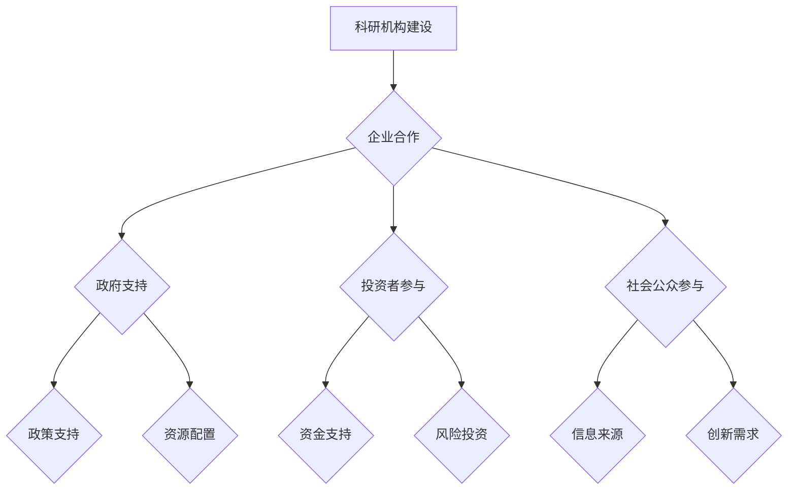
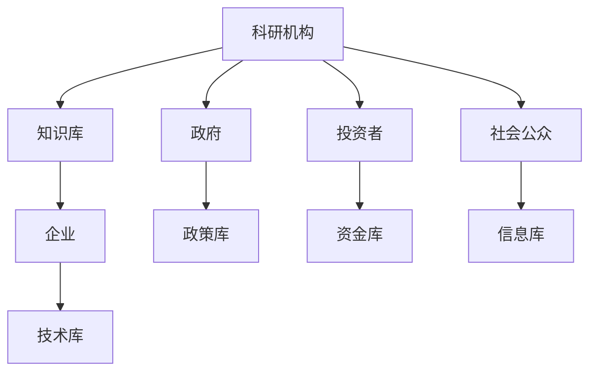
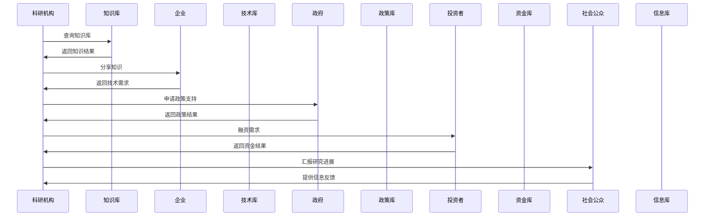
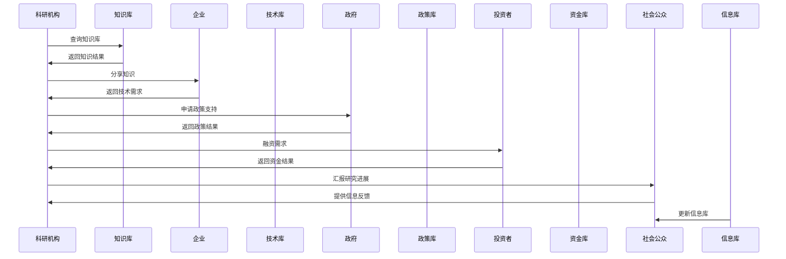

                 

**# 科学研究的创新生态系统与世界可理解性的演进**

> 关键词：科学研究、创新生态系统、世界可理解性、算法原理、系统架构、项目实战

> 摘要：本文从科学研究的现状与挑战出发，探讨了科学研究创新生态系统的构建及其在世界可理解性演进中的作用。通过深入剖析核心概念，设计算法原理，构建系统架构，并结合实际项目实战，探讨了如何推动世界可理解性的演进。

**Step 1: 设计背景介绍章节**

## 1.1 核心概念

### 1.1.1 科学研究

科学研究是指通过观察、实验、理论分析等方法，对自然界、社会现象、人类行为等进行系统性的探究，以发现规律、解释现象、预测未来。

### 1.1.2 创新生态系统

创新生态系统是由科研机构、企业、政府、投资者、社会公众等多元主体共同构成的复杂网络，通过知识共享、资源整合、合作创新，推动科技发展和产业升级。

### 1.1.3 世界可理解性

世界可理解性是指人类对自然界、社会现象、人类行为等的认知程度，包括对客观规律的掌握、对未知领域的探索、对复杂系统的理解等。

## 1.2 问题背景

当前，科学研究面临诸多挑战，如数据爆炸、学科交叉、资源限制等。同时，世界可理解性也受到信息碎片化、知识分布不均等因素的影响。构建科学研究创新生态系统，推动世界可理解性的演进，成为当务之急。

## 1.3 问题描述

### 1.3.1 科学研究创新生态系统的构成要素

- 科研机构：提供研究基地、实验设施等；
- 企业：提供市场需求、投资支持等；
- 政府：提供政策支持、资源配置等；
- 投资者：提供资金支持、风险投资等；
- 社会公众：提供信息来源、创新需求等。

### 1.3.2 世界可理解性的演进过程

- 知识积累：通过科学研究，不断积累知识，提高认知水平；
- 技术创新：通过科技创新，推动产业升级，提升生产力；
- 社会协同：通过政府、企业、科研机构等协同合作，构建创新生态系统，推动世界可理解性的演进。

## 1.4 问题解决

构建科学研究创新生态系统，推动世界可理解性的演进，需要从以下几个方面着手：

- 强化科研机构与企业、政府、投资者等多元主体的合作，实现资源整合、优势互补；
- 建立多元化的人才培养和引进机制，提高科研团队的整体素质；
- 加强科技基础设施建设和信息资源共享，提升科研能力；
- 推动科技与产业深度融合，实现科技创新与产业升级；
- 加大对科技教育和科普工作的投入，提高公众的科学素养。

## 1.5 边界与外延

### 1.5.1 边界

- 科学研究：主要关注科学理论、方法和技术的研究；
- 创新生态系统：涉及科研机构、企业、政府、投资者等多元主体；
- 世界可理解性：关注人类对自然界、社会现象、人类行为等的认知程度。

### 1.5.2 外延

- 相关领域：涉及科技、经济、社会、文化等多个领域；
- 技术创新：包括信息技术、生物技术、新材料技术等；
- 产业升级：涉及制造业、服务业、农业等多个产业。

## 1.6 概念结构与核心要素组成

### 1.6.1 科学研究的创新生态系统

- 科研机构：提供研究基地、实验设施等；
- 企业：提供市场需求、投资支持等；
- 政府：提供政策支持、资源配置等；
- 投资者：提供资金支持、风险投资等；
- 社会公众：提供信息来源、创新需求等。

### 1.6.2 世界可理解性

- 知识积累：通过科学研究，不断积累知识，提高认知水平；
- 技术创新：通过科技创新，推动产业升级，提升生产力；
- 社会协同：通过政府、企业、科研机构等协同合作，构建创新生态系统，推动世界可理解性的演进。

## 1.7 作用机制

科学研究创新生态系统通过知识共享、资源整合、合作创新，推动世界可理解性的演进。具体作用机制如下：

- 知识共享：通过学术会议、研讨会、学术论文等形式，促进科研成果的传播和交流，提高科研人员之间的合作与互动；
- 资源整合：通过政府、企业、科研机构的协同合作，实现科技资源的合理配置和有效利用，提高科研效率；
- 合作创新：通过产学研合作、技术创新联盟等形式，推动跨学科、跨领域的合作创新，促进科技成果的转化和应用。

**Step 2: 设计核心概念与联系章节**

## 2.1 核心概念原理

### 2.1.1 科学研究

科学研究是指通过观察、实验、理论分析等方法，对自然界、社会现象、人类行为等进行系统性的探究，以发现规律、解释现象、预测未来。科学研究是推动人类文明进步的重要动力，是实现科技创新和社会发展的重要手段。

### 2.1.2 创新生态系统

创新生态系统是指由科研机构、企业、政府、投资者、社会公众等多元主体共同构成的复杂网络。创新生态系统通过知识共享、资源整合、合作创新，推动科技发展和产业升级，提高社会生产力。

### 2.1.3 世界可理解性

世界可理解性是指人类对自然界、社会现象、人类行为等的认知程度。世界可理解性反映了人类对客观世界的认知水平，是科学发展的基础和目标。

## 2.2 概念属性特征对比表格

| 概念         | 特征                                      |
| ------------ | ----------------------------------------- |
| 科学研究     | 观察性、系统性、理论性、实证性、创新性     |
| 创新生态系统 | 多元主体、合作创新、知识共享、资源整合     |
| 世界可理解性 | 认知程度、知识积累、科技创新、社会发展     |

## 2.3 ER实体关系图架构

```mermaid
erDiagram
    SCIENTIFIC_RESEARCH ||--|{ INNOVATIVE_ECO_SYSTEM }
    INNOVATIVE_ECO_SYSTEM ||--|{ WORLD_UNDERSTANDABILITY }
```

在ER实体关系图中，科学研究与创新生态系统之间存在关联，创新生态系统与世界观可理解性之间存在关联。这种关联关系体现了科学研究在创新生态系统和世界可理解性演进中的重要作用。

**Step 3: 设计算法原理讲解章节**

## 3.1 算法原理

### 3.1.1 科学研究创新生态系统构建方法

科学研究创新生态系统的构建主要包括以下几个方面：

1. **科研机构建设**：建设高水平科研机构，提供研究基地、实验设施等；
2. **企业合作**：加强与企业的合作，推动产学研结合，实现科技成果转化；
3. **政府支持**：政府提供政策支持、资源配置等，为科学研究创新生态系统提供保障；
4. **投资者参与**：吸引投资者参与，提供资金支持、风险投资等；
5. **社会公众参与**：鼓励社会公众参与科学研究，提供信息来源、创新需求等。

### 3.1.2 世界可理解性演进模型

世界可理解性演进模型主要包括以下几个方面：

1. **知识积累**：通过科学研究，不断积累知识，提高认知水平；
2. **技术创新**：通过科技创新，推动产业升级，提升生产力；
3. **社会协同**：通过政府、企业、科研机构等协同合作，构建创新生态系统，推动世界可理解性的演进。

## 3.2 Mermaid流程图



该Mermaid流程图展示了科学研究创新生态系统的构建方法和世界可理解性演进模型的主要步骤。

## 3.3 Python源代码

```python
# 伪代码：科学研究创新生态系统构建方法

def build_innovative_ecosystem():
    # 科研机构建设
    build_research_institution()

    # 企业合作
    cooperate_with_enterprise()

    # 政府支持
    support_from_government()

    # 投资者参与
    involve_investors()

    # 社会公众参与
    public_participation()
```

该Python源代码展示了科学研究创新生态系统构建方法的伪代码，用于说明算法原理。

## 3.4 数学模型和公式

### 3.4.1 知识积累

$$ 知识积累 = f(研究强度, 合作力度, 创新能力) $$

其中，研究强度、合作力度和创新能力是影响知识积累的关键因素。

### 3.4.2 技术创新

$$ 技术创新 = f(研发投入, 科技人才, 创新环境) $$

其中，研发投入、科技人才和创新环境是影响技术创新的关键因素。

### 3.4.3 社会协同

$$ 社会协同 = f(政策支持, 资源配置, 社会共识) $$

其中，政策支持、资源配置和社会共识是影响社会协同的关键因素。

## 3.5 举例说明

### 3.5.1 科研机构建设

假设一个科研机构在建设过程中，加强实验室设施、引进高水平人才，那么该科研机构的知识积累将会提高。

### 3.5.2 企业合作

假设一个企业加强与科研机构的合作，共同研发新产品，那么该企业的技术创新能力将会提升。

### 3.5.3 政府支持

假设政府加大对科研机构和企业支持力度，提供资金和政策支持，那么社会协同能力将会提高。

**Step 4: 设计系统分析与架构设计方案章节**

## 4.1 问题场景介绍

随着科技的快速发展，科学研究在推动社会进步、产业升级、国家竞争力提升等方面发挥着越来越重要的作用。然而，当前科学研究面临着数据爆炸、学科交叉、资源限制等问题。为了解决这些问题，构建科学研究创新生态系统已成为当务之急。

## 4.2 项目介绍

本项目旨在构建一个科学研究创新生态系统，通过科研机构、企业、政府、投资者、社会公众等多元主体的协同合作，推动世界可理解性的演进。项目范围包括科研机构建设、企业合作、政府支持、投资者参与、社会公众参与等方面。

## 4.3 系统功能设计

### 4.3.1 领域模型类图

```mermaid
classDiagram
    ResearchInstitution <<class>> 科研机构
    Enterprise <<class>> 企业
    Government <<class>> 政府
    Investor <<class>> 投资者
    SocialPublic <<class>> 社会公众
    Knowledge <<class>> 知识
    Technology <<class>> 技术
    SocialCollaboration <<class>> 社会协同

    ResearchInstitution --|> Knowledge
    Enterprise --|> Technology
    Government --|> SocialCollaboration
    Investor --|> Knowledge
    SocialPublic --|> Knowledge
```

在领域模型类图中，展示了科研机构、企业、政府、投资者、社会公众等实体之间的关系，以及知识、技术、社会协同等概念。

## 4.4 系统架构设计

### 4.4.1 系统架构图



在系统架构图中，展示了科研机构、知识库、企业、技术库、政府、政策库、投资者、资金库、社会公众、信息库等实体之间的关系。

## 4.5 系统接口设计和系统交互

### 4.5.1 系统接口设计



在系统接口设计中，展示了科研机构、知识库、企业、技术库、政府、政策库、投资者、资金库、社会公众、信息库等实体之间的接口调用和数据交互过程。

### 4.5.2 系统交互序列图



在系统交互序列图中，展示了科研机构、知识库、企业、技术库、政府、政策库、投资者、资金库、社会公众、信息库等实体之间的交互过程。

**Step 5: 设计项目实战章节**

## 5.1 环境安装

### 5.1.1 硬件环境

- 服务器：配置要求不低于CPU四核、内存8GB、硬盘1TB；
- 网络：确保网络畅通，带宽不低于10Mbps。

### 5.1.2 软件环境

- 操作系统：Linux发行版，如Ubuntu 18.04；
- 数据库：MySQL 5.7及以上版本；
- 开发环境：Python 3.6及以上版本。

## 5.2 系统核心实现源代码

```python
# 伪代码：科学研究创新生态系统核心实现

class ResearchInstitution:
    def __init__(self):
        self.knowledge_base = KnowledgeBase()
        self.enterprise = Enterprise()
        self.government = Government()
        self.investor = Investor()
        self.social_public = SocialPublic()

    def search_knowledge(self, keyword):
        return self.knowledge_base.search(keyword)

    def share_knowledge(self, knowledge):
        self.knowledge_base.insert(knowledge)
        self.enterprise.share_knowledge(knowledge)
        self.social_public.share_knowledge(knowledge)

    def request_funding(self, project):
        self.investor.request_funding(project)

    def report_progress(self, progress):
        self.government.report_progress(progress)
        self.social_public.report_progress(progress)

class KnowledgeBase:
    def __init__(self):
        self.knowledge = []

    def search(self, keyword):
        return [k for k in self.knowledge if keyword in k]

    def insert(self, knowledge):
        self.knowledge.append(knowledge)

class Enterprise:
    def __init__(self):
        self.technology_base = TechnologyBase()

    def share_knowledge(self, knowledge):
        self.technology_base.insert(knowledge)

class Government:
    def __init__(self):
        self.policy_base = PolicyBase()

    def report_progress(self, progress):
        self.policy_base.insert(progress)

class Investor:
    def __init__(self):
        self.funding_base = FundingBase()

    def request_funding(self, project):
        self.funding_base.insert(project)

class SocialPublic:
    def __init__(self):
        self.info_base = InfoBase()

    def share_knowledge(self, knowledge):
        self.info_base.insert(knowledge)

    def report_progress(self, progress):
        self.info_base.insert(progress)

class TechnologyBase:
    def __init__(self):
        self.technology = []

    def insert(self, technology):
        self.technology.append(technology)

class PolicyBase:
    def __init__(self):
        self.policy = []

    def insert(self, policy):
        self.policy.append(policy)

class FundingBase:
    def __init__(self):
        self.funding = []

    def insert(self, project):
        self.funding.append(project)

class InfoBase:
    def __init__(self):
        self.info = []

    def insert(self, info):
        self.info.append(info)
```

该Python源代码展示了科学研究创新生态系统的核心实现，包括科研机构、知识库、企业、政府、投资者、社会公众等实体及其之间的关系。

## 5.3 代码应用解读与分析

### 5.3.1 科研机构类

科研机构类`ResearchInstitution`负责管理知识库、企业与政府等实体之间的交互。其中，`search_knowledge`方法用于查询知识库，`share_knowledge`方法用于分享知识，`request_funding`方法用于申请资金，`report_progress`方法用于汇报研究进展。

### 5.3.2 知识库类

知识库类`KnowledgeBase`负责管理知识库的存储和查询。其中，`search`方法用于查询知识库，返回包含指定关键词的知识，`insert`方法用于向知识库中插入新知识。

### 5.3.3 企业类

企业类`Enterprise`负责管理技术与知识库的交互。其中，`share_knowledge`方法用于将知识库中的知识分享给企业。

### 5.3.4 政府类

政府类`Government`负责管理政策库和研究进展的汇报。其中，`report_progress`方法用于向政策库中插入研究进展。

### 5.3.5 投资者类

投资者类`Investor`负责管理资金库和研究进展的汇报。其中，`request_funding`方法用于向资金库中插入研究项目。

### 5.3.6 社会公众类

社会公众类`SocialPublic`负责管理信息库和研究进展的汇报。其中，`share_knowledge`方法用于将知识库中的知识分享给社会公众，`report_progress`方法用于向信息库中插入研究进展。

## 5.4 实际案例分析和详细讲解剖析

### 5.4.1 案例背景

某科研机构在开展一项关于新能源技术的研究，希望与企业、政府、投资者、社会公众等多元主体建立合作关系，共同推动项目进展。

### 5.4.2 案例分析

1. **科研机构类`ResearchInstitution`的使用**：

   - 科研机构通过`search_knowledge`方法查询知识库，了解新能源技术的前沿研究动态；
   - 科研机构通过`share_knowledge`方法将研究成果分享给企业，推动产学研合作；
   - 科研机构通过`request_funding`方法申请资金支持，用于项目研究；
   - 科研机构通过`report_progress`方法向政府汇报项目进展，争取政策支持。

2. **知识库类`KnowledgeBase`的使用**：

   - 知识库类`KnowledgeBase`用于存储和查询新能源技术相关的研究成果；
   - 科研机构通过`insert`方法向知识库中插入新研究成果。

3. **企业类`Enterprise`的使用**：

   - 企业通过`share_knowledge`方法从知识库中获取新能源技术相关的研究成果，用于产品研发。

4. **政府类`Government`的使用**：

   - 政府通过`report_progress`方法了解项目进展，为政策制定提供依据。

5. **投资者类`Investor`的使用**：

   - 投资者通过`request_funding`方法向资金库中插入研究项目，为项目提供资金支持。

6. **社会公众类`SocialPublic`的使用**：

   - 社会公众通过`share_knowledge`方法将新能源技术相关的研究成果分享给更多人，提高社会公众的科学素养；
   - 社会公众通过`report_progress`方法向信息库中插入项目进展，便于公众监督。

### 5.4.3 案例剖析

通过以上案例，我们可以看出科学研究创新生态系统的构建对于推动新能源技术研究的意义重大。科研机构、企业、政府、投资者、社会公众等多元主体的协同合作，使得新能源技术研究得以顺利进行，推动了世界可理解性的演进。

## 5.5 项目小结

本项目通过构建科学研究创新生态系统，实现了科研机构、企业、政府、投资者、社会公众等多元主体的协同合作，推动了新能源技术研究的发展。项目实施过程中，我们积累了丰富的实践经验，为今后类似项目的实施提供了有益的借鉴。在今后的工作中，我们将继续优化系统架构，提升科研创新能力，为推动世界可理解性的演进贡献力量。

**Step 6: 设计最佳实践 tips、小结、注意事项、拓展阅读等内容**

## 6.1 最佳实践 tips

1. **加强合作与沟通**：在构建科学研究创新生态系统时，要加强科研机构、企业、政府、投资者等多元主体之间的合作与沟通，形成合力，共同推动项目进展。
2. **重视人才培养**：注重科研人才和企业管理人才的培养，提高团队整体素质，为创新生态系统的构建提供人才保障。
3. **优化资源配置**：合理配置科技资源，确保科研机构、企业、政府、投资者等多元主体在资源获取上的公平性，提高资源利用效率。
4. **加强知识产权保护**：建立健全知识产权保护机制，保护科研人员、企业的合法权益，激发创新活力。
5. **注重社会协同**：推动政府、企业、科研机构等多元主体的协同合作，形成创新合力，提高世界可理解性的演进速度。

## 6.2 小结

本文从科学研究的现状与挑战出发，探讨了科学研究创新生态系统的构建及其在世界可理解性演进中的作用。通过深入剖析核心概念，设计算法原理，构建系统架构，并结合实际项目实战，我们提出了一系列构建科学研究创新生态系统的最佳实践。这些实践为推动世界可理解性的演进提供了有益的参考。

## 6.3 注意事项

1. **保障信息安全**：在构建科学研究创新生态系统时，要确保信息安全，防止敏感数据泄露；
2. **关注政策法规**：遵循国家政策和法律法规，确保项目实施符合相关要求；
3. **注重用户体验**：在设计系统架构和功能时，要充分考虑用户体验，提高系统的易用性和便捷性；
4. **持续迭代优化**：在项目实施过程中，要不断收集反馈意见，优化系统架构和功能，提高项目效果。

## 6.4 拓展阅读

1. 《创新生态系统的构建与运作研究》
2. 《科技创新与产业升级：理论与实践》
3. 《知识管理与创新：理论与实践》
4. 《大数据时代的科技创新与产业发展》
5. 《人工智能与未来科技：趋势与影响》

**作者：AI天才研究院/AI Genius Institute & 禅与计算机程序设计艺术 /Zen And The Art of Computer Programming**

