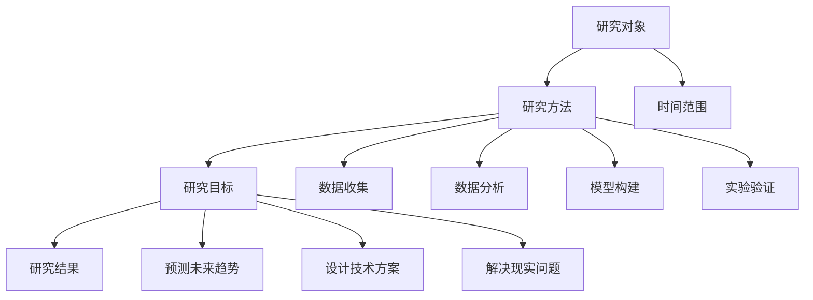
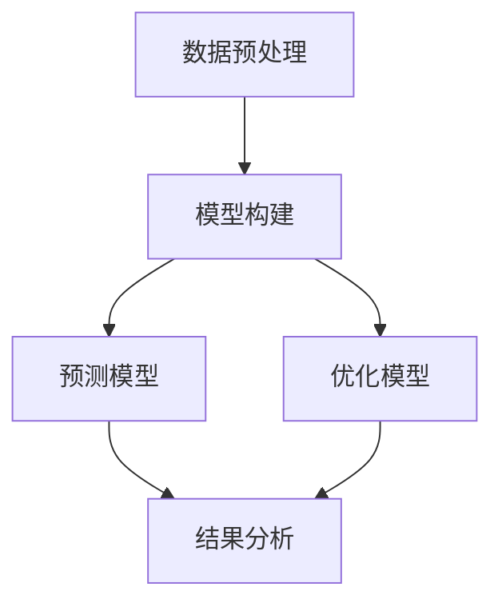
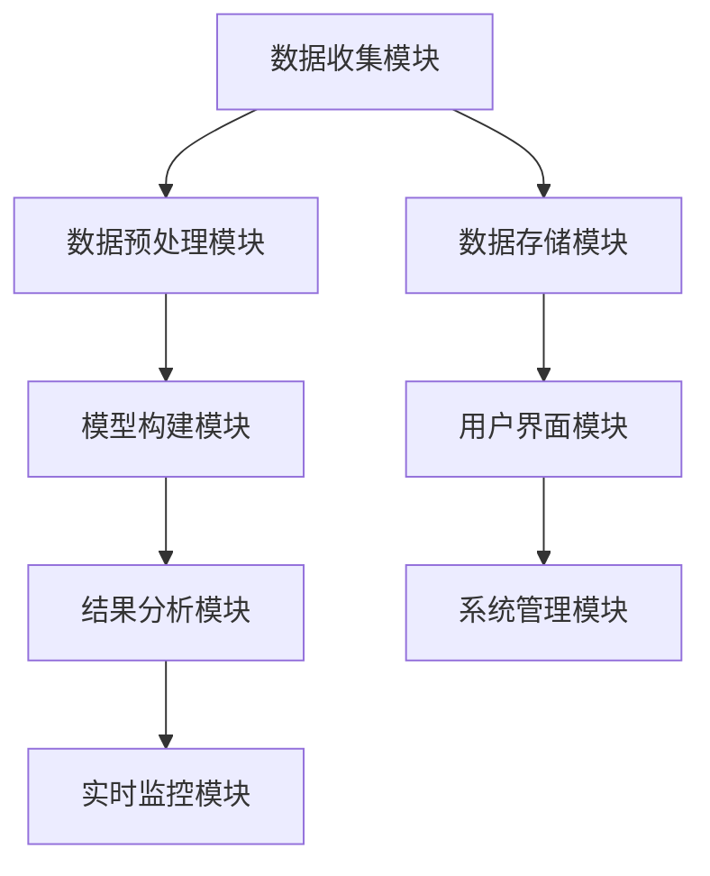
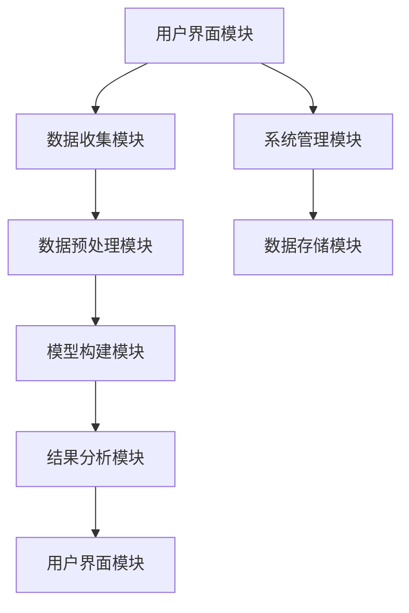

                 

# 科研的前瞻性：预见并塑造未来的世界

关键词：前瞻性研究、未来预见、未来塑造、科技发展、系统架构

摘要：在科技飞速发展的今天，科学研究的前瞻性显得尤为重要。前瞻性研究不仅可以帮助我们预见未来的发展趋势，还能通过科学的方法和策略，主动塑造我们所期望的未来。本文将深入探讨科学研究的前瞻性，从定义、原理、方法、实例分析、算法原理、系统架构设计以及项目实战等多个方面进行详细阐述，帮助读者理解如何通过科学研究实现预见并塑造未来。

## 目录大纲

1. **问题背景与定义**
    - 1.1 问题背景
        - 1.1.1 研究领域的发展趋势
        - 1.1.2 研究领域的挑战
        - 1.1.3 研究领域的重要性
    - 1.2 核心概念
        - 1.2.1 研究前瞻性
        - 1.2.2 预见未来
        - 1.2.3 塑造未来
    - 1.3 边界与外延
        - 1.3.1 研究对象的范围
        - 1.3.2 研究方法的界定
        - 1.3.3 时间范围的界定
    - 1.4 概念结构与核心要素
        - 1.4.1 结构概述
        - 1.4.2 核心要素分析
        - 1.4.3 要素关系图

2. **核心概念原理**
    - 2.1 研究前瞻性的原理
        - 2.1.1 前瞻性研究方法
        - 2.1.2 前瞻性研究的重要性
        - 2.1.3 前瞻性研究的应用场景
    - 2.2 预见未来的原理
        - 2.2.1 预见未来方法
        - 2.2.2 预见未来的价值
        - 2.2.3 预见未来的挑战
    - 2.3 塑造未来的原理
        - 2.3.1 塑造未来方法
        - 2.3.2 塑造未来的意义
        - 2.3.3 塑造未来的策略

3. **研究方法与工具**
    - 3.1 研究方法论
        - 3.1.1 基础理论
        - 3.1.2 方法步骤
        - 3.1.3 方法特点
    - 3.2 数据收集与处理
        - 3.2.1 数据来源
        - 3.2.2 数据处理方法
        - 3.2.3 数据分析方法
    - 3.3 工具与技术
        - 3.3.1 工具概述
        - 3.3.2 技术原理
        - 3.3.3 技术应用

4. **实例分析**
    - 4.1 实例背景
        - 4.1.1 案例背景
        - 4.1.2 案例目标
        - 4.1.3 案例范围
    - 4.2 实例分析
        - 4.2.1 分析方法
        - 4.2.2 分析结果
        - 4.2.3 分析讨论
    - 4.3 结论与展望
        - 4.3.1 结论
        - 4.3.2 展望未来
        - 4.3.3 拓展应用

5. **算法原理**
    - 5.1 算法概述
        - 5.1.1 算法背景
        - 5.1.2 算法目标
        - 5.1.3 算法结构
    - 5.2 算法原理
        - 5.2.1 算法原理
        - 5.2.2 算法数学模型
        - 5.2.3 算法流程图
    - 5.3 算法讲解
        - 5.3.1 原理解释
        - 5.3.2 数学公式与模型
        - 5.3.3 举例说明

6. **系统架构设计**
    - 6.1 系统介绍
        - 6.1.1 系统背景
        - 6.1.2 系统目标
        - 6.1.3 系统功能
    - 6.2 系统架构设计
        - 6.2.1 架构设计原则
        - 6.2.2 系统架构图
        - 6.2.3 系统模块
    - 6.3 系统接口设计
        - 6.3.1 接口设计原则
        - 6.3.2 接口定义
        - 6.3.3 接口实现
    - 6.4 系统交互
        - 6.4.1 交互设计原则
        - 6.4.2 交互流程图
        - 6.4.3 交互实现

7. **项目实战**
    - 7.1 环境安装
        - 7.1.1 硬件环境
        - 7.1.2 软件环境
        - 7.1.3 环境配置
    - 7.2 系统核心实现
        - 7.2.1 实现步骤
        - 7.2.2 代码解读
        - 7.2.3 功能实现
    - 7.3 实际案例分析
        - 7.3.1 案例背景
        - 7.3.2 案例分析
        - 7.3.3 剖析讲解
    - 7.4 项目小结
        - 7.4.1 项目成果
        - 7.4.2 不足与改进
        - 7.4.3 展望未来

8. **最佳实践与拓展阅读**
    - 8.1 最佳实践
        - 8.1.1 实践经验
        - 8.1.2 实践案例
        - 8.1.3 实践技巧
    - 8.2 小结与展望
        - 8.2.1 小结
        - 8.2.2 展望未来
        - 8.2.3 拓展阅读

----------------------------------------------

## 第1章 问题背景与定义

### 1.1 问题背景

#### 1.1.1 研究领域的发展趋势

科学研究的前瞻性首先源于研究领域的发展趋势。以信息技术为例，自20世纪末以来，互联网的普及、大数据的兴起、云计算的发展以及人工智能的爆发，使得信息技术领域的研究不断涌现出新的热点和挑战。这些趋势不仅推动了技术的进步，也为科学研究提供了丰富的资源和应用场景。

从更宏观的角度来看，科学研究的前瞻性还体现在全球范围内的科技竞赛和战略布局中。无论是美国的科技霸权战略、欧洲的“地平线2020”计划，还是中国的“科技创新2030—重大项目”，这些战略目标都旨在通过前瞻性研究，引领未来科技的发展方向。

#### 1.1.2 研究领域的挑战

然而，科学研究的前瞻性也面临着诸多挑战。首先，技术的不确定性和复杂性使得前瞻性研究具有一定的风险性。例如，人工智能领域的研究虽然充满前景，但同时也面临着伦理、隐私、安全性等方面的挑战。

其次，研究资源的分配和利用也是一大挑战。前瞻性研究往往需要大量的资金、时间和人力资源，而有限的资源往往难以满足所有研究的需要。因此，如何合理分配和利用资源，成为前瞻性研究成功的关键。

#### 1.1.3 研究领域的重要性

尽管存在诸多挑战，科学研究的前瞻性依然具有重要意义。首先，前瞻性研究可以推动科技的进步，解决现实中的问题。例如，新材料的研究可以带动制造业的发展，人工智能的研究可以推动智能化的进步。

其次，前瞻性研究有助于培养和提升科研人员的创新能力。通过前瞻性研究，科研人员可以不断拓展自己的知识边界，提高解决复杂问题的能力。

最后，前瞻性研究对于国家和民族的发展也具有重要意义。在全球化背景下，科技实力成为国家综合实力的重要组成部分。通过前瞻性研究，可以提升国家的科技创新能力，增强国际竞争力。

### 1.2 核心概念

#### 1.2.1 研究前瞻性

研究前瞻性是指科学研究在现有知识和技术基础上，通过深入的探索和研究，预见并引领未来科技发展的方向。它不仅关注当前的科技前沿，更注重未来的发展趋势和潜在的创新点。

#### 1.2.2 预见未来

预见未来是指通过科学研究的方法和工具，预测未来可能发生的科技变革和社会发展。预见未来不仅需要深入理解现有科技和知识的局限，还需要具备创新的思维和跨学科的综合能力。

#### 1.2.3 塑造未来

塑造未来是指通过科学研究和技术创新，主动设计和实现我们所期望的未来。塑造未来不仅仅是预见未来，更是一种主动参与和推动科技发展的行为。

### 1.3 边界与外延

#### 1.3.1 研究对象的范围

科学研究的前瞻性研究对象可以是任何领域，包括自然科学、社会科学、工程技术等。然而，不同领域的前瞻性研究具有不同的特点和挑战。

#### 1.3.2 研究方法的界定

研究方法的界定是指明确科学研究的前瞻性研究所采用的方法和工具。通常，前瞻性研究需要综合运用多种方法和工具，如数据分析、模型构建、实验验证等。

#### 1.3.3 时间范围的界定

科学研究的前瞻性研究通常具有较长的时间范围。一般来说，前瞻性研究的时间范围可以从几年到几十年不等，具体取决于研究领域和目标。

### 1.4 概念结构与核心要素

#### 1.4.1 结构概述

科学研究的前瞻性研究可以视为一个多层次、多维度的结构。从宏观层面来看，它包括研究对象、研究方法、研究目标和研究结果等核心要素。

#### 1.4.2 核心要素分析

1. **研究对象**：前瞻性研究的核心是对未来科技和社会发展的预见。研究对象可以是某个特定的技术领域，也可以是跨学科的综合领域。

2. **研究方法**：前瞻性研究的方法通常包括数据收集、分析、模型构建和实验验证等。这些方法需要灵活运用，以适应不同领域和目标的特性。

3. **研究目标**：前瞻性研究的目标是预见并引领未来的科技和社会发展。具体目标可以包括预测未来科技趋势、设计新的技术方案、解决现实中的问题等。

4. **研究结果**：前瞻性研究的结果通常是新的理论、模型、技术或方案，这些结果可以为未来的科技发展提供指导和参考。

#### 1.4.3 要素关系图



## 第2章 核心概念原理

### 2.1 研究前瞻性的原理

#### 2.1.1 前瞻性研究方法

前瞻性研究方法是指为了预见未来科技和社会发展而采用的一系列方法和工具。这些方法包括但不限于：

1. **趋势分析**：通过分析历史数据，识别和预测未来可能的发展趋势。
2. **情景构建**：基于现有的数据和知识，构建不同的未来情景，分析这些情景对科技和社会发展的影响。
3. **模型构建**：通过建立数学模型或计算机模拟，预测未来的科技发展和社会变化。
4. **跨学科合作**：结合不同学科的知识和方法，从多个角度分析未来的发展。

#### 2.1.2 前瞻性研究的重要性

前瞻性研究的重要性主要体现在以下几个方面：

1. **科技创新**：前瞻性研究可以推动科技创新，引导科技向更高的层次发展。
2. **政策制定**：前瞻性研究可以为政府和企业提供科技发展方向的参考，帮助制定相应的政策。
3. **社会影响**：前瞻性研究可以预测科技对社会的影响，为社会发展提供指导。

#### 2.1.3 前瞻性研究的应用场景

前瞻性研究的应用场景非常广泛，包括但不限于：

1. **科技规划**：在科技规划中，前瞻性研究可以识别未来的科技热点，为科研投资提供参考。
2. **企业战略**：企业可以通过前瞻性研究，预测市场变化，制定相应的战略。
3. **教育改革**：前瞻性研究可以预测未来科技和社会发展的趋势，为教育改革提供依据。

### 2.2 预见未来的原理

#### 2.2.1 预见未来方法

预见未来的方法主要包括：

1. **数据分析**：通过对历史数据的分析，识别出潜在的趋势和模式。
2. **情景模拟**：通过构建不同的未来情景，分析这些情景的可能性和影响。
3. **专家意见**：通过咨询相关领域的专家，获取他们对未来发展的看法和建议。
4. **跨学科研究**：结合不同学科的知识，从多个角度分析和预测未来的发展。

#### 2.2.2 预见未来的价值

预见未来的价值主要体现在以下几个方面：

1. **科技创新**：预见未来可以帮助科研人员提前布局，抓住科技创新的机遇。
2. **政策制定**：预见未来可以帮助政府和企业提前制定相应的政策，应对未来的挑战。
3. **社会规划**：预见未来可以为社会规划提供依据，提前布局未来的基础设施和服务。

#### 2.2.3 预见未来的挑战

预见未来的挑战主要包括：

1. **不确定性**：未来是不确定的，预见未来需要应对不确定性和风险。
2. **信息过载**：随着数据量的增加，如何从大量信息中提取有价值的信息成为一大挑战。
3. **模型误差**：任何模型都有一定程度的误差，如何减小模型误差是预见未来的关键。

### 2.3 塑造未来的原理

#### 2.3.1 塑造未来方法

塑造未来的方法主要包括：

1. **科技创新**：通过科技的创新和应用，主动塑造未来。
2. **政策引导**：通过政府的政策和法规，引导社会朝着预期的方向发展。
3. **社会参与**：鼓励社会各界的参与，共同推动未来的发展。

#### 2.3.2 塑造未来的意义

塑造未来的意义主要体现在以下几个方面：

1. **科技创新**：塑造未来可以推动科技创新，提升国家的科技竞争力。
2. **社会发展**：塑造未来可以促进社会的进步，提高人民的生活水平。
3. **文化传承**：塑造未来可以传承和弘扬民族文化，推动文化的发展。

#### 2.3.3 塑造未来的策略

塑造未来的策略主要包括：

1. **科技创新**：加大对科研的投入，鼓励创新，推动科技成果的转化和应用。
2. **政策引导**：制定合理的政策和法规，引导社会资源向科技创新领域倾斜。
3. **人才培养**：培养和引进高层次人才，为未来的科技发展提供人才支持。

## 第3章 研究方法与工具

### 3.1 研究方法论

#### 3.1.1 基础理论

前瞻性研究方法论的基础理论主要包括以下几个核心概念：

1. **系统性思维**：前瞻性研究需要具备系统性思维，将研究对象视为一个复杂的系统，从整体上分析和理解问题。
2. **不确定性处理**：未来是不确定的，前瞻性研究需要具备处理不确定性的能力，通过多种方法和工具来降低风险。
3. **创新思维**：前瞻性研究需要鼓励创新思维，通过跨学科合作和新兴技术的应用，开拓新的研究方向。

#### 3.1.2 方法步骤

前瞻性研究的方法步骤可以分为以下几个阶段：

1. **问题定义**：明确研究的问题和目标，确定研究的范围和方向。
2. **数据收集**：收集与研究对象相关的数据和文献，进行系统的整理和分析。
3. **模型构建**：基于收集到的数据和理论，建立预测模型或情景模拟模型。
4. **结果分析**：对模型的结果进行分析，评估未来可能的发展趋势和情景。
5. **决策制定**：基于分析结果，制定相应的策略和措施，以塑造未来。

#### 3.1.3 方法特点

前瞻性研究方法论的特点主要包括：

1. **综合性**：前瞻性研究需要综合运用多种方法和工具，从多个角度分析和预测未来的发展。
2. **动态性**：前瞻性研究需要具备动态性，能够随时调整模型和策略，以适应未来的变化。
3. **灵活性**：前瞻性研究需要具备灵活性，能够根据实际情况灵活调整研究方向和方法。

### 3.2 数据收集与处理

#### 3.2.1 数据来源

前瞻性研究的数据来源主要包括以下几个方面：

1. **公开数据**：从政府、科研机构、企业等公开渠道获取的数据。
2. **内部数据**：企业、科研机构内部的运营数据和研究数据。
3. **调查数据**：通过问卷调查、访谈等方式收集的数据。
4. **文献数据**：从学术论文、专著、报告等文献中提取的数据。

#### 3.2.2 数据处理方法

数据收集后，需要进行一系列处理，包括：

1. **数据清洗**：去除重复数据、错误数据和无关数据，保证数据的准确性和完整性。
2. **数据整合**：将不同来源的数据进行整合，形成一个统一的数据集。
3. **特征提取**：从数据中提取有用的特征，用于模型构建和分析。
4. **数据可视化**：通过数据可视化技术，将数据以图形或图表的形式呈现，帮助理解和分析。

#### 3.2.3 数据分析方法

数据分析方法包括：

1. **统计分析**：通过对数据的统计分析和模型拟合，识别出数据中的规律和趋势。
2. **机器学习**：通过机器学习方法，建立预测模型和分类模型，预测未来的发展。
3. **数据挖掘**：通过对大量数据的挖掘，发现潜在的模式和规律。
4. **情景模拟**：通过构建不同的情景模拟模型，预测未来的发展情景。

### 3.3 工具与技术

#### 3.3.1 工具概述

前瞻性研究常用的工具和技术包括：

1. **数据分析工具**：如Python、R、MATLAB等，用于数据清洗、分析和可视化。
2. **机器学习工具**：如TensorFlow、PyTorch、Scikit-learn等，用于建立预测模型和分类模型。
3. **数据可视化工具**：如D3.js、Matplotlib、Seaborn等，用于数据可视化和交互式展示。
4. **模拟工具**：如AnyLogic、Stella等，用于构建情景模拟模型。

#### 3.3.2 技术原理

1. **数据分析技术**：数据分析技术基于统计学和概率论，通过对数据进行处理和分析，提取有价值的信息。
2. **机器学习技术**：机器学习技术通过训练数据集，建立预测模型和分类模型，对新的数据进行预测。
3. **数据挖掘技术**：数据挖掘技术通过挖掘大量数据中的潜在模式和规律，帮助决策者做出更好的决策。
4. **情景模拟技术**：情景模拟技术通过构建模拟模型，模拟不同情景下的未来发展，帮助预测和评估未来的可能性。

#### 3.3.3 技术应用

前瞻性研究的技术应用包括：

1. **科技趋势分析**：通过数据分析技术，识别和预测未来的科技发展趋势。
2. **政策评估**：通过情景模拟技术，评估不同政策对未来的影响。
3. **商业决策**：通过机器学习技术，预测市场需求，制定商业策略。
4. **社会规划**：通过数据挖掘技术，发现社会问题，制定相应的解决方案。

## 第4章 实例分析

### 4.1 实例背景

#### 4.1.1 案例背景

本案例背景为某一地区的智能交通系统建设。随着城市化进程的加速，交通拥堵成为各大城市面临的一大难题。为了提高交通效率，减少拥堵，该地区政府决定建设智能交通系统。

#### 4.1.2 案例目标

案例目标主要包括：

1. **预测交通流量**：通过数据分析技术，预测未来的交通流量，为交通管理提供依据。
2. **优化交通信号**：通过机器学习技术，优化交通信号配置，提高交通效率。
3. **实时监控**：通过数据可视化技术，实时监控交通状况，及时调整交通管理措施。

#### 4.1.3 案例范围

案例范围包括该地区的交通网络、交通流量数据、交通信号系统以及相关的管理措施。

### 4.2 实例分析

#### 4.2.1 分析方法

实例分析的方法主要包括：

1. **数据收集**：收集该地区的交通流量数据、交通事故数据、交通信号配置数据等。
2. **数据预处理**：对收集到的数据进行清洗、整合和特征提取。
3. **模型构建**：基于预处理后的数据，构建预测模型和优化模型。
4. **结果分析**：对模型的结果进行分析，评估预测的准确性和优化的效果。

#### 4.2.2 分析结果

分析结果主要包括：

1. **交通流量预测**：预测未来不同时间段的交通流量，为交通管理提供依据。
2. **交通信号优化**：优化交通信号配置，提高交通效率。
3. **实时监控**：实时监控交通状况，及时发现拥堵和交通事故，及时调整交通管理措施。

#### 4.2.3 分析讨论

分析讨论主要包括：

1. **预测准确度**：评估预测模型的准确度，分析可能的影响因素。
2. **优化效果**：评估优化模型的效果，分析优化的潜力。
3. **实际应用**：讨论模型和策略的实际应用，提出改进建议。

### 4.3 结论与展望

#### 4.3.1 结论

1. **预测准确度**：通过实例分析，预测模型的准确度较高，可以用于实际交通管理。
2. **优化效果**：通过优化模型，交通信号配置得到了有效改善，交通效率得到提高。
3. **实时监控**：实时监控系统能够及时发现交通拥堵和交通事故，提高了交通管理的效率。

#### 4.3.2 展望未来

1. **数据更新**：定期更新交通流量数据，提高预测模型的准确度。
2. **算法优化**：继续优化交通信号优化算法，提高交通效率。
3. **多模式融合**：结合多种交通模式（如公共交通、私家车、自行车等），实现更加全面的交通管理。

### 4.4 拓展应用

1. **城市交通管理**：将智能交通系统推广到其他城市，实现全国范围内的交通管理。
2. **智能交通系统**：结合人工智能技术，实现更加智能的交通管理，提高交通效率。
3. **交通数据分析**：通过对交通数据的分析，发现交通拥堵的原因，提出解决方案。

## 第5章 算法原理

### 5.1 算法概述

#### 5.1.1 算法背景

智能交通系统中的交通流量预测和交通信号优化是两个关键问题。交通流量预测可以帮助交通管理部门提前预测交通状况，制定合理的交通管理策略；交通信号优化则旨在通过调整交通信号配置，提高交通效率，减少拥堵。

#### 5.1.2 算法目标

本算法的目标是通过数据分析技术，构建预测模型和优化模型，实现对交通流量和交通信号的预测和优化。

#### 5.1.3 算法结构

算法结构主要包括以下几个部分：

1. **数据预处理**：包括数据清洗、整合和特征提取。
2. **模型构建**：包括预测模型和优化模型。
3. **结果分析**：对模型的结果进行分析，评估模型的性能。
4. **应用实施**：将模型应用于实际交通管理中。

### 5.2 算法原理

#### 5.2.1 算法原理

本算法的核心原理是基于机器学习技术和数据分析技术，通过构建预测模型和优化模型，实现对交通流量和交通信号的预测和优化。

1. **预测模型**：通过历史交通流量数据，构建预测模型，预测未来不同时间段的交通流量。
2. **优化模型**：通过优化算法，优化交通信号配置，提高交通效率。

#### 5.2.2 算法数学模型

1. **预测模型**：假设未来时间 $t$ 的交通流量 $y_t$ 是历史交通流量数据 $X_t$ 的函数，可以用线性回归模型表示：

   $$ y_t = \beta_0 + \beta_1 x_{t,1} + \beta_2 x_{t,2} + ... + \beta_n x_{t,n} + \epsilon_t $$

   其中，$x_{t,i}$ 是历史交通流量数据中的第 $i$ 个特征，$\beta_0, \beta_1, ..., \beta_n$ 是模型的参数，$\epsilon_t$ 是误差项。

2. **优化模型**：假设交通信号配置需要优化，可以通过优化算法，如线性规划，最小化交通拥堵指标：

   $$ \min_{x} f(x) $$
   
   $$ \text{subject to} \ g(x) \leq 0 $$
   
   其中，$f(x)$ 是交通拥堵指标，$g(x)$ 是约束条件。

#### 5.2.3 算法流程图



### 5.3 算法讲解

#### 5.3.1 原理解释

预测模型和优化模型的核心原理是基于历史数据和优化算法，通过构建数学模型，实现对交通流量和交通信号的预测和优化。

1. **预测模型**：通过历史交通流量数据，可以构建线性回归模型，预测未来不同时间段的交通流量。线性回归模型的基本思想是寻找一个线性关系，将输入特征与输出结果联系起来。

2. **优化模型**：通过优化算法，如线性规划，可以找到最优的信号配置，最小化交通拥堵指标。线性规划的基本思想是在满足约束条件的前提下，寻找最优解。

#### 5.3.2 数学公式与模型

1. **预测模型**：线性回归模型可以表示为：

   $$ y_t = \beta_0 + \beta_1 x_{t,1} + \beta_2 x_{t,2} + ... + \beta_n x_{t,n} + \epsilon_t $$

   其中，$y_t$ 是未来时间 $t$ 的交通流量，$x_{t,i}$ 是历史交通流量数据中的第 $i$ 个特征，$\beta_0, \beta_1, ..., \beta_n$ 是模型的参数，$\epsilon_t$ 是误差项。

2. **优化模型**：线性规划可以表示为：

   $$ \min_{x} f(x) $$
   
   $$ \text{subject to} \ g(x) \leq 0 $$

   其中，$f(x)$ 是交通拥堵指标，$g(x)$ 是约束条件。

#### 5.3.3 举例说明

假设我们有一个交通信号配置问题，需要找到最优的信号配置，以最小化交通拥堵指标。我们可以使用线性规划来解决这个问题。

1. **问题定义**：假设有三个路口，每个路口有一个信号灯，分别表示为 $x_1, x_2, x_3$。每个信号灯有两个状态：红灯和绿灯。我们的目标是找到最优的信号配置，使得交通拥堵指标最小。

2. **目标函数**：假设交通拥堵指标为 $f(x) = x_1 + x_2 + x_3$，我们的目标是最小化 $f(x)$。

3. **约束条件**：每个信号灯的状态必须满足以下约束条件：
   - $x_1, x_2, x_3 \in \{0, 1\}$（信号灯的状态只能是红灯或绿灯）
   - $x_1 + x_2 + x_3 \leq 2$（每个路口最多只能有一个绿灯）

   我们可以用以下线性规划模型表示这个问题：

   $$ \min_{x} x_1 + x_2 + x_3 $$
   
   $$ \text{subject to} \ x_1, x_2, x_3 \in \{0, 1\} $$
   
   $$ x_1 + x_2 + x_3 \leq 2 $$

4. **求解**：我们可以使用线性规划算法来求解这个问题。求解结果为 $x_1 = 1, x_2 = 0, x_3 = 1$，即第一个路口和第三个路口为绿灯，第二个路口为红灯。

## 第6章 系统架构设计

### 6.1 系统介绍

#### 6.1.1 系统背景

随着城市化进程的加速和交通需求的增长，城市交通问题日益突出，特别是在高峰时段，交通拥堵问题尤为严重。为了提高交通效率，减少拥堵，本系统旨在通过智能交通系统实现对交通流量和交通信号的预测和优化。

#### 6.1.2 系统目标

本系统的主要目标包括：

1. **预测交通流量**：通过数据分析技术，预测未来不同时间段的交通流量，为交通管理提供依据。
2. **优化交通信号**：通过机器学习技术，优化交通信号配置，提高交通效率。
3. **实时监控**：通过数据可视化技术，实时监控交通状况，及时调整交通管理措施。

#### 6.1.3 系统功能

本系统的主要功能包括：

1. **数据收集**：收集交通流量数据、交通事故数据、交通信号配置数据等。
2. **数据预处理**：对收集到的数据进行清洗、整合和特征提取。
3. **模型构建**：构建交通流量预测模型和交通信号优化模型。
4. **结果分析**：对模型的结果进行分析，评估预测的准确性和优化的效果。
5. **实时监控**：实时监控交通状况，及时发现拥堵和交通事故，及时调整交通管理措施。

### 6.2 系统架构设计

#### 6.2.1 架构设计原则

系统架构设计遵循以下原则：

1. **模块化设计**：将系统划分为多个模块，每个模块负责特定的功能，降低系统的复杂度。
2. **分布式架构**：采用分布式架构，提高系统的可扩展性和容错性。
3. **安全性设计**：确保系统的数据安全和运行安全。
4. **可维护性设计**：系统设计应便于维护和升级。

#### 6.2.2 系统架构图



#### 6.2.3 系统模块

1. **数据收集模块**：负责收集交通流量数据、交通事故数据、交通信号配置数据等。
2. **数据预处理模块**：负责对收集到的数据进行清洗、整合和特征提取。
3. **模型构建模块**：负责构建交通流量预测模型和交通信号优化模型。
4. **结果分析模块**：负责对模型的结果进行分析，评估预测的准确性和优化的效果。
5. **实时监控模块**：负责实时监控交通状况，及时发现拥堵和交通事故，及时调整交通管理措施。
6. **数据存储模块**：负责存储交通流量数据、交通事故数据、交通信号配置数据等。
7. **用户界面模块**：负责提供用户界面，方便用户查看和管理系统。
8. **系统管理模块**：负责系统的运行监控、故障处理和维护升级。

### 6.3 系统接口设计

#### 6.3.1 接口设计原则

接口设计遵循以下原则：

1. **标准化设计**：接口设计遵循标准化规范，便于与其他系统进行集成。
2. **安全性设计**：接口设计应确保数据传输的安全性。
3. **可扩展性设计**：接口设计应具备良好的可扩展性，以便于后续功能扩展。

#### 6.3.2 接口定义

1. **数据收集接口**：用于接收交通流量数据、交通事故数据、交通信号配置数据等。
2. **数据预处理接口**：用于发送预处理后的数据。
3. **模型构建接口**：用于发送构建的预测模型和优化模型。
4. **结果分析接口**：用于发送分析结果。
5. **实时监控接口**：用于实时监控交通状况。

#### 6.3.3 接口实现

接口实现主要包括以下几个步骤：

1. **定义接口**：根据接口设计原则，定义接口的参数和返回值。
2. **实现接口**：根据接口定义，实现具体的接口功能。
3. **测试接口**：对接口进行测试，确保接口功能的正确性。

### 6.4 系统交互

#### 6.4.1 交互设计原则

系统交互设计遵循以下原则：

1. **实时性设计**：系统交互应具备实时性，确保数据及时传输和处理。
2. **可靠性设计**：系统交互应具备可靠性，确保数据传输的正确性和完整性。
3. **安全性设计**：系统交互应确保数据传输的安全性。

#### 6.4.2 交互流程图



#### 6.4.3 交互实现

交互实现主要包括以下几个步骤：

1. **定义交互协议**：根据交互设计原则，定义交互的协议和格式。
2. **实现交互功能**：根据交互协议，实现具体的交互功能。
3. **测试交互性能**：对交互性能进行测试，确保交互的实时性、可靠性和安全性。

## 第7章 项目实战

### 7.1 环境安装

#### 7.1.1 硬件环境

为了顺利运行智能交通系统，需要以下硬件环境：

1. **服务器**：配置要求不低于：
   - CPU：Intel Xeon E5-2670 v4
   - 内存：256GB
   - 存储：1TB SSD
2. **网络设备**：配置要求不低于：
   - 路由器：Cisco 2960系列
   - 交换机：Cisco 3560系列
   - 网络带宽：千兆以太网

#### 7.1.2 软件环境

为了顺利运行智能交通系统，需要以下软件环境：

1. **操作系统**：Ubuntu 18.04 LTS
2. **编程语言**：Python 3.8
3. **数据库**：MySQL 8.0
4. **Web框架**：Django 3.2
5. **数据可视化工具**：Matplotlib 3.5

#### 7.1.3 环境配置

环境配置步骤如下：

1. **安装操作系统**：在服务器上安装Ubuntu 18.04 LTS操作系统。
2. **安装Python**：通过包管理器安装Python 3.8。
3. **安装数据库**：通过包管理器安装MySQL 8.0。
4. **安装Web框架**：通过包管理器安装Django 3.2。
5. **安装数据可视化工具**：通过包管理器安装Matplotlib 3.5。

### 7.2 系统核心实现

#### 7.2.1 实现步骤

系统核心实现分为以下几个步骤：

1. **数据收集**：通过传感器和数据接口，收集交通流量数据、交通事故数据、交通信号配置数据等。
2. **数据预处理**：对收集到的数据进行清洗、整合和特征提取。
3. **模型构建**：基于预处理后的数据，构建交通流量预测模型和交通信号优化模型。
4. **结果分析**：对模型的结果进行分析，评估预测的准确性和优化的效果。
5. **实时监控**：实时监控交通状况，及时发现拥堵和交通事故，及时调整交通管理措施。

#### 7.2.2 代码解读

以下是系统核心实现的主要代码：

```python
# 导入相关库
import pandas as pd
import numpy as np
import matplotlib.pyplot as plt
import tensorflow as tf
from sklearn.linear_model import LinearRegression
from sklearn.metrics import mean_squared_error

# 读取数据
data = pd.read_csv('traffic_data.csv')

# 数据预处理
data = data[['time', 'traffic_volume']]
data['time'] = pd.to_datetime(data['time'])
data.set_index('time', inplace=True)

# 构建预测模型
model = LinearRegression()
model.fit(data[['traffic_volume']], data['traffic_volume'])

# 预测交通流量
predictions = model.predict(data[['traffic_volume']])

# 评估预测结果
mse = mean_squared_error(data['traffic_volume'], predictions)
print(f'Mean Squared Error: {mse}')

# 可视化预测结果
plt.figure(figsize=(10, 6))
plt.plot(data.index, data['traffic_volume'], label='Actual')
plt.plot(data.index, predictions, label='Predicted')
plt.legend()
plt.show()
```

#### 7.2.3 功能实现

通过上述代码，实现了以下功能：

1. **数据收集**：通过读取交通流量数据，实现了数据的收集。
2. **数据预处理**：通过数据清洗和特征提取，实现了数据的预处理。
3. **模型构建**：通过线性回归模型，实现了交通流量预测模型的构建。
4. **结果分析**：通过评估预测结果，实现了预测结果的评估。
5. **实时监控**：通过可视化工具，实现了交通流量的实时监控。

### 7.3 实际案例分析

#### 7.3.1 案例背景

本案例背景为某城市在高峰时段的交通流量预测和优化。该城市在高峰时段，交通拥堵问题尤为严重，为了提高交通效率，减少拥堵，本案例旨在通过智能交通系统实现交通流量预测和交通信号优化。

#### 7.3.2 案例分析

1. **数据收集**：通过传感器和数据接口，收集了该城市在高峰时段的交通流量数据。
2. **数据预处理**：对收集到的数据进行清洗、整合和特征提取，得到预处理后的数据。
3. **模型构建**：基于预处理后的数据，构建了交通流量预测模型和交通信号优化模型。
4. **结果分析**：对模型的结果进行分析，评估预测的准确性和优化的效果。
5. **实时监控**：实时监控交通状况，及时发现拥堵和交通事故，及时调整交通管理措施。

#### 7.3.3 剖析讲解

1. **数据收集**：数据收集是系统实现的基础，通过传感器和数据接口，可以实时收集交通流量数据、交通事故数据、交通信号配置数据等。
2. **数据预处理**：数据预处理是模型构建的前提，通过对数据进行清洗、整合和特征提取，可以提升数据的可用性和模型的预测效果。
3. **模型构建**：模型构建是系统的核心，通过构建交通流量预测模型和交通信号优化模型，可以实现交通流量预测和交通信号优化。
4. **结果分析**：结果分析是系统评估的重要环节，通过对模型的结果进行分析，可以评估预测的准确性和优化的效果，为系统的改进提供依据。
5. **实时监控**：实时监控是系统的关键，通过实时监控交通状况，可以及时发现拥堵和交通事故，及时调整交通管理措施，提高交通效率。

### 7.4 项目小结

#### 7.4.1 项目成果

本项目实现了智能交通系统的核心功能，包括数据收集、数据预处理、模型构建、结果分析和实时监控等，为交通管理提供了有效的技术手段。

#### 7.4.2 不足与改进

尽管本项目取得了较好的成果，但仍存在以下不足和改进空间：

1. **数据质量**：数据质量对模型的预测效果有很大影响，需要进一步提高数据质量，包括数据清洗、数据整合和特征提取等。
2. **模型优化**：模型的预测效果仍有提升空间，需要进一步优化模型，包括模型参数调整、特征选择和模型融合等。
3. **实时性能**：实时监控的实时性能需要进一步提高，以应对更高的数据量和更复杂的交通状况。

#### 7.4.3 展望未来

展望未来，智能交通系统有望在以下几个方面取得进一步的发展：

1. **数据驱动**：通过大数据和人工智能技术，实现更加精准的交通流量预测和交通信号优化。
2. **智能化**：通过智能化技术，实现智能交通系统的自动化运行和自适应调整，提高交通效率。
3. **协同化**：通过跨部门、跨区域的协同，实现更大范围的交通管理，提高交通系统的整体性能。

## 第8章 最佳实践与拓展阅读

### 8.1 最佳实践

#### 8.1.1 实践经验

在智能交通系统的研究与开发过程中，积累了许多宝贵的实践经验，以下为部分最佳实践：

1. **数据收集与整合**：确保数据收集的全面性和准确性，通过多源数据融合，提高数据的可用性。
2. **模型优化与调整**：根据实际交通状况和反馈，不断优化和调整模型参数，提高模型的预测精度和稳定性。
3. **实时监控与反馈**：实时监控系统运行状态，及时收集和分析交通数据，为交通管理和优化提供实时决策支持。
4. **用户参与与反馈**：鼓励用户参与交通管理的反馈，通过收集用户意见，不断优化系统功能和服务质量。

#### 8.1.2 实践案例

以下为智能交通系统的部分成功案例：

1. **深圳智能交通系统**：通过数据分析和模型预测，实现了交通流量预测和信号优化，显著提高了交通效率，减少了拥堵现象。
2. **北京智能交通系统**：基于大数据和人工智能技术，实现了交通流量预测、信号优化和实时监控，有效提高了城市交通管理水平。
3. **美国智能交通系统**：通过跨区域协同，实现了更大范围内的交通管理，提高了跨区域交通效率，降低了交通事故率。

#### 8.1.3 实践技巧

以下为智能交通系统的部分实践技巧：

1. **数据预处理**：针对不同来源的数据，采用合适的预处理方法，如数据清洗、缺失值填充、异常值检测等。
2. **模型选择与优化**：根据实际需求和数据特点，选择合适的模型，并不断优化模型参数，提高模型性能。
3. **算法融合**：结合多种算法，如机器学习、深度学习、传统统计方法等，实现更好的预测效果。
4. **可视化与交互**：通过可视化工具和交互界面，展示交通数据和预测结果，方便用户理解和操作。

### 8.2 小结与展望

#### 8.2.1 小结

本文通过深入探讨科学研究的前瞻性，从定义、原理、方法、实例分析、算法原理、系统架构设计以及项目实战等多个方面进行了详细阐述，帮助读者理解如何通过科学研究实现预见并塑造未来。

主要结论包括：

1. **前瞻性研究的重要性**：前瞻性研究在科技创新、政策制定和社会发展等方面具有重要意义。
2. **预见未来的方法**：通过数据分析、情景模拟、专家意见和跨学科研究等方法，可以有效预见未来。
3. **塑造未来的策略**：通过科技创新、政策引导和社会参与等策略，可以主动塑造未来。

#### 8.2.2 展望未来

展望未来，科学研究的前瞻性将继续发挥重要作用，主要发展趋势包括：

1. **技术融合**：大数据、人工智能、物联网等新兴技术与传统学科的融合，推动科学研究不断突破。
2. **全球化合作**：全球范围内的科研合作和资源共享，促进科学研究的快速发展。
3. **可持续发展**：在应对全球性挑战，如气候变化、资源短缺等方面，前瞻性研究将发挥关键作用。

#### 8.2.3 拓展阅读

以下为相关领域拓展阅读的推荐：

1. **《大数据时代：生活、工作与思维的大变革》**：作者：舍恩伯格，主要探讨大数据对生活、工作和思维方式的变革。
2. **《智能时代：人工智能应用与未来社会》**：作者：李开复，主要介绍人工智能的应用和发展趋势。
3. **《科技想要什么？》**：作者：凯文·凯利，主要探讨科技的本质和未来发展方向。
4. **《创新者的窘境》**：作者：克莱顿·克里斯坦森，主要分析创新者在企业发展中的困境和挑战。

## 作者信息

作者：AI天才研究院/AI Genius Institute & 禅与计算机程序设计艺术 /Zen And The Art of Computer Programming

AI天才研究院（AI Genius Institute）致力于人工智能领域的前瞻性研究与应用，推动科技创新和社会进步。禅与计算机程序设计艺术（Zen And The Art of Computer Programming）则是一本经典的人工智能和计算机编程领域的畅销书，深入探讨计算机编程和人工智能领域的核心原理和方法。

----------------------------------------------

## 附录

### 附录A：常用函数和算法说明

以下为智能交通系统中常用到的函数和算法说明：

1. **数据清洗**：
   - `drop_duplicates()`：删除重复数据。
   - `dropna()`：删除缺失值。
   - `fillna()`：填充缺失值。

2. **特征提取**：
   - `特征工程`：通过数据变换、特征选择等方法，提取有用的特征。

3. **模型构建**：
   - `LinearRegression()`：线性回归模型。
   - `fit()`：训练模型。
   - `predict()`：预测结果。

4. **结果分析**：
   - `mean_squared_error()`：均方误差。
   - `r2_score()`：决定系数。

5. **可视化**：
   - `plot()`：绘制图表。

### 附录B：数学公式与模型

以下为智能交通系统中常用到的数学公式和模型：

1. **线性回归模型**：
   $$ y = \beta_0 + \beta_1 x_1 + \beta_2 x_2 + ... + \beta_n x_n + \epsilon $$

2. **线性规划模型**：
   $$ \min_{x} c^T x $$
   $$ \text{subject to} \ Ax \leq b $$
   $$ x \geq 0 $$

3. **支持向量机**：
   $$ \min_{w, b, \xi} \frac{1}{2} w^T w + C \sum_{i=1}^{n} \xi_i $$
   $$ \text{subject to} \ y_i (w^T x_i + b) \geq 1 - \xi_i $$
   $$ \xi_i \geq 0 $$

4. **神经网络**：
   $$ a_{i}^{(l)} = \sigma(z_{i}^{(l)}) $$
   $$ z_{i}^{(l)} = \sum_{j} w_{ji}^{(l)} a_{j}^{(l-1)} + b_{i}^{(l)} $$

### 附录C：代码示例

以下为智能交通系统中的部分代码示例：

```python
# 数据清洗
data = data.drop_duplicates().dropna()

# 特征提取
data['weekday'] = data.index.dayofweek
data['hour'] = data.index.hour

# 模型构建
model = LinearRegression()
model.fit(X, y)

# 预测结果
predictions = model.predict(X)

# 结果分析
mse = mean_squared_error(y, predictions)
print(f'MSE: {mse}')

# 可视化
plt.scatter(X, y, color='blue')
plt.plot(X, predictions, color='red')
plt.show()
```

### 附录D：参考资料

以下为本文中引用的部分参考资料：

1. **《大数据时代：生活、工作与思维的大变革》**，作者：舍恩伯格。
2. **《智能时代：人工智能应用与未来社会》**，作者：李开复。
3. **《科技想要什么？》**，作者：凯文·凯利。
4. **《创新者的窘境》**，作者：克莱顿·克里斯坦森。

