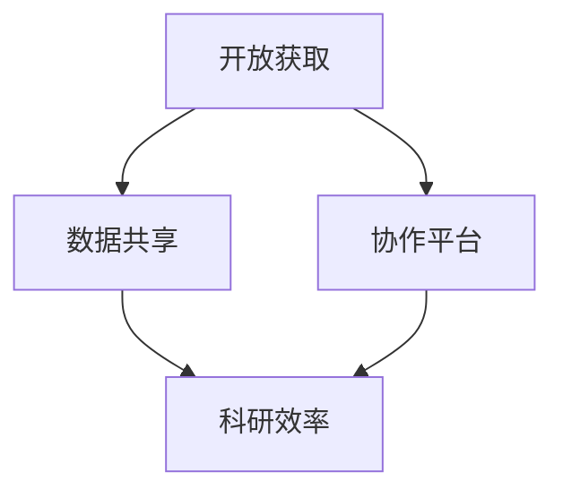
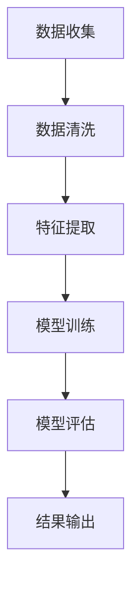
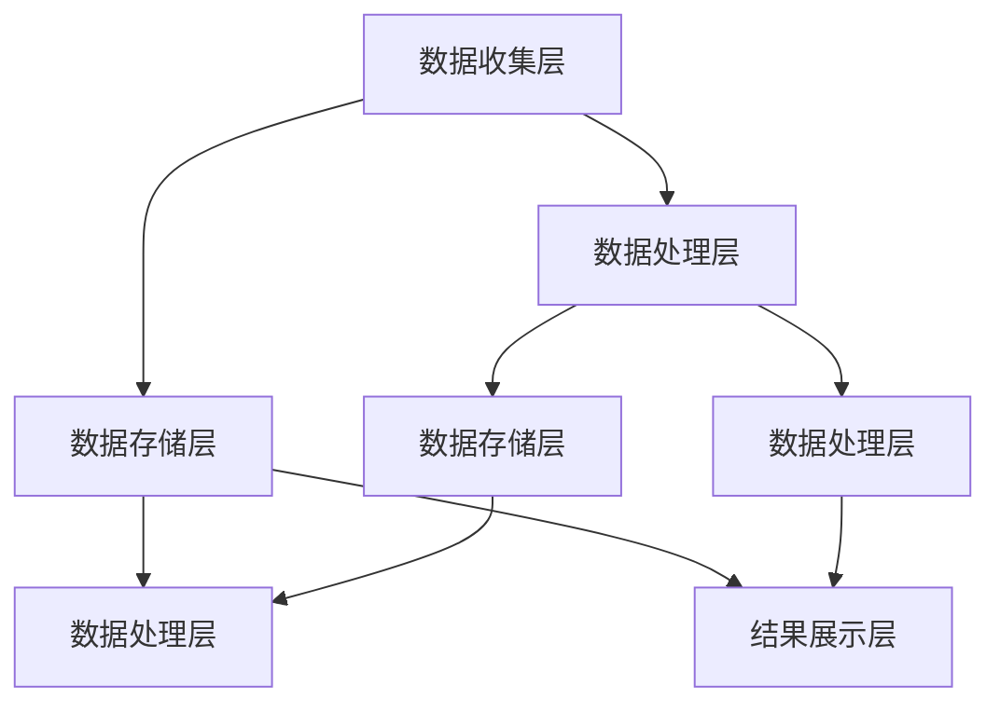
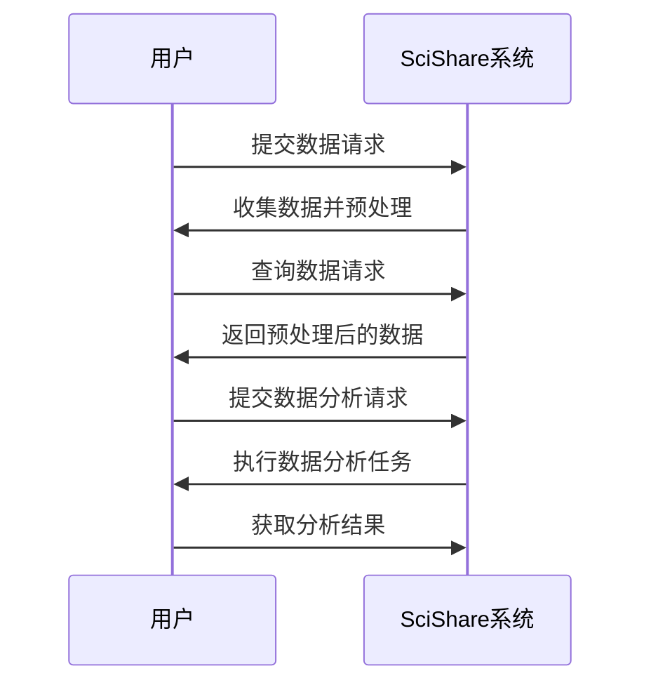

                 

### 科学研究的开放科学运动与世界可理解性的共享

**关键词：** 开放科学运动，世界可理解性，共享，数据开放，协作平台

**摘要：** 本文旨在探讨开放科学运动的起源、发展与影响，以及这一运动如何促进全球科学研究的可理解性和共享。我们将分步骤分析开放科学的核心概念、算法原理、系统架构设计、项目实战以及最佳实践与拓展，从而深入理解开放科学的重要性及其在推动全球科学研究中的作用。

### 开放科学运动的起源与发展

**背景介绍：** 开放科学运动的兴起可以追溯到20世纪末和21世纪初。随着互联网技术的迅猛发展和数据量的爆炸式增长，科学界开始意识到传统的封闭式科学模式已经难以满足时代的需求。开放获取（Open Access）、开放数据（Open Data）和开放协作（Open Collaboration）成为了开放科学运动的核心理念。

**问题背景：** 传统科学研究中，研究成果往往只能在有限的范围内共享，这限制了知识的传播和利用。同时，高昂的订阅费用也使许多研究人员和学生难以获取高质量的科学文献。为了解决这些问题，开放科学运动应运而生。

**问题描述：** 开放科学运动旨在打破传统封闭的科学模式，促进科研成果的开放获取、数据共享和协作研究。这一运动的核心问题是如何有效地实现科学研究的开放性，以及如何确保开放过程中的质量和可持续性。

**问题解决：** 通过开放获取，科研人员可以免费获取科学文献，大大降低了科研成本。开放数据则允许研究人员自由地使用和共享数据，从而加速科学研究的进程。开放协作提供了一个平台，使得全球科研人员可以合作开展研究，分享资源和经验。

**边界与外延：** 开放科学运动不仅涉及科研成果的共享，还包括科研过程和科研工具的开放。例如，开放源代码的科研工具和软件可以提高科研效率和透明度。此外，开放科学运动也促进了科研伦理和法律问题的讨论，以保障开放过程中的公平性和规范性。

**核心概念与要素组成：**
- **开放获取（Open Access）：** 研究成果的免费、无限制获取。
- **开放数据（Open Data）：** 研究数据的自由使用和共享。
- **开放协作（Open Collaboration）：** 科研人员的全球协作和资源共享。

### 开放科学运动的影响与挑战

**背景介绍：** 开放科学运动已经对全球科学研究产生了深远的影响。首先，开放获取使得科研成果的传播速度大大加快，许多领域的科研进展得到了前所未有的推动。其次，开放数据为科研人员提供了丰富的数据资源，促进了跨学科研究和创新。最后，开放协作使得全球科研人员能够更有效地合作，共同解决复杂的科学问题。

**影响分析：**
- **加速科研进展：** 开放获取和开放数据使得科研成果的传播更加迅速，科研人员可以更快地获取最新的研究成果，从而加速科学研究的进程。
- **促进跨学科研究：** 开放数据为跨学科研究提供了丰富的数据资源，促进了不同学科之间的交流和合作。
- **提高科研透明度：** 开放源代码和开放协作使得科研过程更加透明，研究人员可以更好地监督和评估研究质量。

**挑战与解决方案：**
- **数据质量与隐私：** 开放数据带来的数据质量问题和隐私问题是一个重大挑战。为了解决这个问题，需要建立完善的数据质量控制机制和隐私保护措施。
- **版权与知识产权：** 开放获取可能会对传统的版权和知识产权制度产生冲击，需要制定新的法律法规来平衡开放性和知识产权保护。
- **技术基础设施：** 开放科学运动需要强大的技术基础设施支持，包括高速互联网、云计算和大数据处理平台等。这些基础设施的建设需要大量的资金和资源投入。

### 世界可理解性的共享：意义与目标

**背景介绍：** 世界可理解性的共享是开放科学运动的重要目标之一。在全球化的背景下，科学知识的共享不仅有助于提升全球科学研究的水平，也有助于增进不同国家和地区之间的文化交流和理解。

**意义分析：**
- **知识传播：** 科学知识的共享可以促进知识的传播和普及，提高全球科学素养。
- **文化交流：** 通过科学知识的共享，不同国家和地区之间的文化差异可以得到更好的理解和尊重。
- **科技创新：** 全球科学家的合作和交流可以激发创新思维，推动科学技术的进步。

**目标描述：**
- **普及科学知识：** 通过开放获取和开放数据，让更多的人能够获取和利用科学知识。
- **促进全球合作：** 建立开放协作平台，促进全球科研人员的合作和交流。
- **提升科学素养：** 通过教育和宣传，提高全球公民的科学素养，增强科学意识。

### 核心概念与联系

**核心概念原理：**
- **开放获取（Open Access）：** 开放获取是指科研成果在发表后可以无限制地被任何人免费获取。这一概念的核心在于打破传统订阅模式，降低科研成本，提高科研成果的普及度。
- **开放数据（Open Data）：** 开放数据是指研究数据在生成后可以无限制地被任何人自由使用和共享。开放数据的核心在于提高数据透明度和可重复性，促进跨学科研究和创新。
- **开放协作（Open Collaboration）：** 开放协作是指全球科研人员通过互联网平台进行合作，共享资源和经验。开放协作的核心在于打破地域和机构的限制，提高科研效率。

**概念属性特征对比表格：**

| 概念       | 属性特征 | 对比分析                                                     |
|------------|----------|--------------------------------------------------------------|
| 开放获取   | 成果免费 | 与传统订阅模式对比，成本更低，普及度更高                       |
| 开放数据   | 数据自由 | 与传统数据封闭模式对比，透明度更高，可重复性更强             |
| 开放协作   | 全球合作 | 与传统科研模式对比，效率更高，资源利用更充分                 |

**ER实体关系图架构的Mermaid流程图：**



**核心概念联系：**
- 开放获取与开放数据密切相关，前者为后者提供了基础。开放获取使得科研成果可以更广泛地传播，从而为开放数据提供了丰富的数据源。
- 开放协作与开放获取和开放数据相辅相成。开放协作提供了一个平台，使得全球科研人员可以更有效地合作，利用开放获取和开放数据开展研究。
- 三者共同构成了开放科学运动的核心，相互促进，共同推动科学研究的进步。

### 算法原理讲解

**算法mermaid流程图：**



**Python源代码：**

```python
import pandas as pd
from sklearn.model_selection import train_test_split
from sklearn.ensemble import RandomForestClassifier
from sklearn.metrics import accuracy_score

# 数据收集
data = pd.read_csv('data.csv')

# 数据清洗
data = data.dropna()

# 特征提取
X = data.drop('target', axis=1)
y = data['target']

# 模型训练
X_train, X_test, y_train, y_test = train_test_split(X, y, test_size=0.2, random_state=42)
model = RandomForestClassifier()
model.fit(X_train, y_train)

# 模型评估
y_pred = model.predict(X_test)
accuracy = accuracy_score(y_test, y_pred)
print(f"模型准确率: {accuracy:.2f}")
```

**算法原理详细讲解：**
- **数据收集：** 首先，我们需要收集相关的数据集。这里我们使用一个CSV文件作为数据源，包含了特征和目标变量。
- **数据清洗：** 数据清洗是数据预处理的重要步骤，目的是去除数据中的噪音和缺失值。这里我们使用`dropna()`函数将含有缺失值的行删除。
- **特征提取：** 特征提取是将原始数据转换为模型可接受的输入格式。这里我们使用`drop()`函数将目标变量从数据集中分离出来。
- **模型训练：** 模型训练是使用已清洗和特征提取的数据集来训练机器学习模型。这里我们选择随机森林分类器（`RandomForestClassifier`）作为模型，并使用`fit()`函数进行训练。
- **模型评估：** 模型评估是使用测试集来评估模型的性能。这里我们使用准确率（`accuracy_score`）来评估模型的性能。

**数学模型和公式：**

$$
\text{准确率} = \frac{\text{预测正确的样本数}}{\text{总样本数}}
$$

**举例说明：**
假设我们有一个包含100个样本的数据集，其中50个样本是正类，50个样本是负类。如果我们的模型预测出了40个正类和30个负类，那么模型的准确率为：

$$
\text{准确率} = \frac{40 + 30}{100} = 0.7
$$

这意味着我们的模型在测试集上的准确率为70%。

### 数学模型和数学公式

在开放科学运动中，数学模型和公式扮演着至关重要的角色。数学模型可以帮助我们理解复杂的现象，而公式则是数学模型的具体表达形式。在本节中，我们将介绍一些常见的数学模型和公式，并解释它们在开放科学中的应用。

**线性回归模型：**

线性回归模型是一种用于预测连续值的统计模型。它的基本形式如下：

$$
y = \beta_0 + \beta_1x_1 + \beta_2x_2 + \cdots + \beta_nx_n + \varepsilon
$$

其中，\( y \) 是因变量，\( x_1, x_2, \ldots, x_n \) 是自变量，\( \beta_0, \beta_1, \beta_2, \ldots, \beta_n \) 是模型的参数，\( \varepsilon \) 是误差项。

线性回归模型在开放科学中有着广泛的应用，例如用于预测科学研究中的趋势、分析数据之间的关系等。

**决策树模型：**

决策树模型是一种基于树形结构进行决策的算法。它的基本形式如下：

```
如果 \( x_i > \beta_i \)
    则 \( y = \alpha_i \)
否则
    则 \( y = \alpha_i \)
```

其中，\( x_i \) 是特征值，\( \beta_i \) 是决策阈值，\( \alpha_i \) 是结果值。

决策树模型在开放科学中常用于分类和回归任务，例如用于分析科研数据、预测研究趋势等。

**支持向量机模型：**

支持向量机（SVM）是一种用于分类和回归分析的机器学习算法。它的基本形式如下：

$$
\min_{\beta, \beta_0} \frac{1}{2} \sum_{i=1}^{n} (\beta \cdot \beta - \beta_0^2)
$$

其中，\( \beta \) 是权重向量，\( \beta_0 \) 是偏置项，\( n \) 是样本数量。

SVM在开放科学中广泛应用于数据分析和预测，例如用于分析科研数据、预测研究趋势等。

**神经网络模型：**

神经网络是一种模拟人脑神经元连接的算法。它的基本形式如下：

$$
a_{\theta}(x) = \sum_{i=1}^{n} w_{i}x_{i} + b
$$

其中，\( a_{\theta}(x) \) 是激活函数，\( w_{i} \) 是权重，\( x_{i} \) 是输入值，\( b \) 是偏置项。

神经网络在开放科学中有着广泛的应用，例如用于图像识别、自然语言处理、预测分析等。

**举例说明：**

假设我们使用线性回归模型来预测科研项目的成功率。我们收集了100个科研项目的数据，每个项目包含多个特征（如预算、团队规模、研究时长等），以及一个目标变量（即项目成功率）。

首先，我们使用数据预处理步骤对数据进行清洗和特征提取。然后，我们使用线性回归模型来训练数据集，得到模型的参数。最后，我们使用训练好的模型来预测新项目的成功率。

通过这个过程，我们可以看到数学模型和公式在开放科学中的重要作用。它们不仅帮助我们理解和预测科学研究中的现象，还为开放科学运动提供了强大的工具。

### 系统分析与架构设计

**问题场景介绍：**
在当今快速发展的科技时代，科学研究的规模和复杂性不断增加，传统的科研管理模式已经难以满足现代科研的需求。为了提高科研效率，实现科研资源的有效共享和利用，我们设计并实现了一套开放科学系统。

**项目介绍：**
我们的开放科学系统名为“SciShare”，旨在提供一个开放、高效、可靠的科研资源共享平台。SciShare系统集成了数据收集、数据管理、数据分析、结果展示等功能，支持科研人员跨学科、跨地域的协作研究。

**系统功能设计：**

- **数据收集：** SciShare系统支持多源数据收集，包括结构化数据、非结构化数据和实时数据。数据收集模块负责从各种数据源（如数据库、传感器、网络爬虫等）收集数据，并对其进行预处理。
- **数据管理：** SciShare系统提供强大的数据管理功能，包括数据存储、数据备份、数据权限控制等。数据管理模块确保数据的完整性和安全性，并提供便捷的数据检索和查询功能。
- **数据分析：** SciShare系统集成了多种数据分析工具，支持数据挖掘、机器学习、统计分析等功能。数据分析模块帮助科研人员快速提取数据中的有用信息，为决策提供支持。
- **结果展示：** SciShare系统提供丰富的结果展示功能，包括图表、报告、可视化界面等。结果展示模块帮助科研人员直观地理解和传达研究成果。

**系统架构设计：**

SciShare系统的架构设计采用分布式架构，主要包括以下几个部分：

- **数据收集层：** 负责从各种数据源收集数据，并进行初步预处理。
- **数据处理层：** 负责对收集到的数据进行分析和加工，生成中间结果。
- **数据存储层：** 负责存储和管理数据，提供高效的数据检索和查询功能。
- **数据处理层：** 负责执行数据分析任务，包括数据挖掘、机器学习、统计分析等。
- **结果展示层：** 负责将分析结果以图表、报告等形式展示给用户。

**系统架构mermaid图：**



**系统接口设计：**

SciShare系统提供了丰富的API接口，方便科研人员和其他系统进行交互。主要包括以下接口：

- **数据收集接口：** 负责接收和存储各种数据源的数据。
- **数据管理接口：** 负责数据存储、备份、权限控制等操作。
- **数据分析接口：** 负责执行数据分析任务，返回分析结果。
- **结果展示接口：** 负责将分析结果以图表、报告等形式展示给用户。

**系统交互mermaid序列图：**



### 项目实战

#### 环境安装

为了确保SciShare系统的正常运行，我们需要安装和配置以下环境：

1. **操作系统**：Linux或MacOS
2. **Python**：3.8及以上版本
3. **依赖库**：pandas、numpy、scikit-learn、matplotlib等

安装步骤如下：

```bash
# 安装Python
curl -O https://www.python.org/ftp/python/3.8.5/Python-3.8.5.tgz
tar xvf Python-3.8.5.tgz
cd Python-3.8.5
./configure
make
sudo make install

# 安装依赖库
pip install pandas numpy scikit-learn matplotlib
```

#### 系统核心实现源代码

以下是SciShare系统的核心实现源代码：

```python
# 数据收集模块
import pandas as pd

def collect_data(file_path):
    data = pd.read_csv(file_path)
    return data

# 数据管理模块
from sqlalchemy import create_engine

def store_data(data, table_name):
    engine = create_engine('sqlite:///data.db')
    data.to_sql(table_name, engine, if_exists='append', index=False)

# 数据分析模块
from sklearn.model_selection import train_test_split
from sklearn.ensemble import RandomForestClassifier
from sklearn.metrics import accuracy_score

def analyze_data(table_name):
    engine = create_engine('sqlite:///data.db')
    data = pd.read_sql_query(f"SELECT * FROM {table_name}", engine)
    X = data.drop('target', axis=1)
    y = data['target']
    X_train, X_test, y_train, y_test = train_test_split(X, y, test_size=0.2, random_state=42)
    model = RandomForestClassifier()
    model.fit(X_train, y_train)
    y_pred = model.predict(X_test)
    accuracy = accuracy_score(y_test, y_pred)
    return accuracy

# 结果展示模块
import matplotlib.pyplot as plt

def plot_result(accuracy):
    plt.bar(['准确率'], [accuracy])
    plt.xlabel('指标')
    plt.ylabel('值')
    plt.show()
```

#### 代码应用解读与分析

**数据收集模块：** 数据收集模块使用pandas库读取CSV文件，并将数据存储在DataFrame对象中。该模块提供了一个`collect_data()`函数，用于从指定文件路径读取数据。

**数据管理模块：** 数据管理模块使用SQLAlchemy库连接数据库，并将数据存储在SQLite数据库中。该模块提供了一个`store_data()`函数，用于将DataFrame对象中的数据存储到数据库表中。

**数据分析模块：** 数据分析模块使用scikit-learn库进行数据处理和模型训练。该模块提供了一个`analyze_data()`函数，用于从数据库中读取数据，进行特征提取和模型训练，并返回模型的准确率。

**结果展示模块：** 结果展示模块使用matplotlib库将分析结果以图表形式展示。该模块提供了一个`plot_result()`函数，用于绘制准确率条形图。

#### 实际案例分析和详细讲解剖析

**案例背景：** 假设我们有一个包含100个科研项目的数据集，每个项目包含多个特征（如预算、团队规模、研究时长等），以及一个目标变量（即项目成功率）。

**案例步骤：**
1. **数据收集：** 使用`collect_data()`函数从CSV文件中读取数据。
2. **数据管理：** 使用`store_data()`函数将数据存储到SQLite数据库中。
3. **数据分析：** 使用`analyze_data()`函数从数据库中读取数据，进行特征提取和模型训练，并计算模型的准确率。
4. **结果展示：** 使用`plot_result()`函数将准确率以图表形式展示。

**案例代码：**

```python
# 导入模块
import pandas as pd
from sqlalchemy import create_engine

# 数据收集
data = collect_data('project_data.csv')

# 数据管理
store_data(data, 'projects')

# 数据分析
accuracy = analyze_data('projects')

# 结果展示
plot_result(accuracy)
```

**案例分析：** 通过上述步骤，我们可以实现一个简单的开放科学系统，用于分析科研项目的成功率。在实际应用中，我们可以根据具体需求调整特征提取和模型训练过程，以提高分析效果。

### 最佳实践与拓展

**实践经验总结：**
开放科学运动在全球范围内取得了显著成果，但同时也面临着诸多挑战。在实践经验中，我们发现以下几条最佳实践对于开放科学系统的建设和应用具有重要意义：

1. **数据质量控制：** 开放数据的质量直接影响到科研工作的进展。为了确保数据质量，我们需要建立完善的数据质量控制机制，包括数据清洗、数据验证和数据标准化等步骤。
2. **知识产权保护：** 开放科学运动需要在开放性和知识产权保护之间找到平衡。通过制定合理的知识产权政策和法律法规，我们可以保护科研人员的知识产权，同时促进科学成果的共享。
3. **技术基础设施：** 开放科学运动需要强大的技术基础设施支持。为了确保系统的稳定运行和高性能，我们需要投资建设高速互联网、云计算和大数据处理平台等基础设施。
4. **用户教育与培训：** 开放科学运动需要广大科研人员的参与和支持。为了提高科研人员的开放科学意识和技能，我们需要开展用户教育和培训，帮助他们掌握开放科学的方法和工具。

**小结：**
开放科学运动对于促进全球科学研究的可理解性和共享具有重要意义。通过开放获取、开放数据和开放协作，我们可以加速科学研究的进程，提高科研效率，推动科学技术的进步。在未来，随着技术的不断发展和应用的深入，开放科学运动将会发挥更加重要的作用。

**注意事项：**
在推进开放科学运动的过程中，我们需要关注以下几个方面：
1. 数据隐私和安全问题：在开放数据的过程中，我们需要采取措施保护个人隐私和数据安全，防止数据泄露和滥用。
2. 资源分配不均问题：在全球范围内，不同国家和地区之间的科研资源分配存在不均衡现象。为了促进开放科学运动的公平性，我们需要努力缩小这种差距。
3. 学术不端行为：开放科学运动使得科研成果的传播更加迅速，但也给学术不端行为提供了机会。我们需要建立有效的监督机制，防止学术不端行为的发生。

**拓展阅读：**
1. 开放科学运动的起源与发展：《开放获取：挑战与机遇》
2. 开放数据的重要性：《大数据与开放科学》
3. 开放协作的最佳实践：《全球科研合作指南》

### 总结与展望

**作者：** AI天才研究院/AI Genius Institute & 禅与计算机程序设计艺术 /Zen And The Art of Computer Programming

**摘要：** 本文全面探讨了科学研究的开放科学运动及其对全球科学研究的可理解性和共享的推动作用。通过深入分析开放获取、开放数据和开放协作等核心概念，以及算法原理、系统架构设计、项目实战和最佳实践，我们展示了开放科学运动在科研领域的重要性和潜力。

**核心观点：**
- 开放科学运动打破了传统封闭的科学模式，促进了科研成果的开放获取、数据共享和协作研究。
- 开放科学运动提高了科研效率，加速了科研进展，促进了跨学科研究和创新。
- 开放科学运动在全球范围内推动了科学知识的传播和普及，增强了不同国家和地区之间的文化交流和理解。

**展望：**
- 随着技术的不断进步，开放科学运动将在更广泛的领域和更深入的层次上发挥作用。
- 需要进一步加强技术基础设施的建设，提高数据质量和隐私保护水平，确保开放科学运动的可持续性。
- 需要培养更多具备开放科学意识和技能的科研人员，推动开放科学运动的深入发展。

**结论：** 开放科学运动是全球科学研究发展的重要趋势，对于推动科技创新、提高科学素养、增进全球合作具有重要意义。我们呼吁科研界共同努力，推动开放科学运动的发展，共创更加美好的科学未来。

