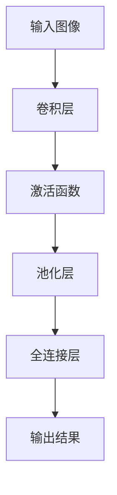
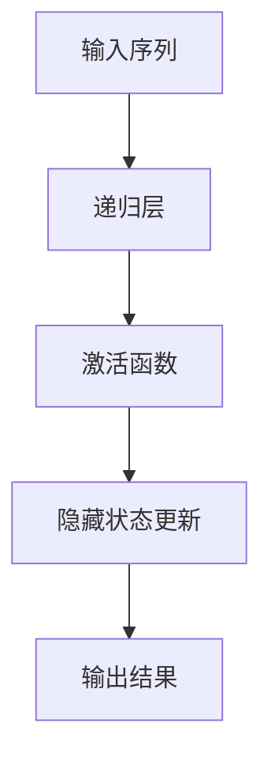
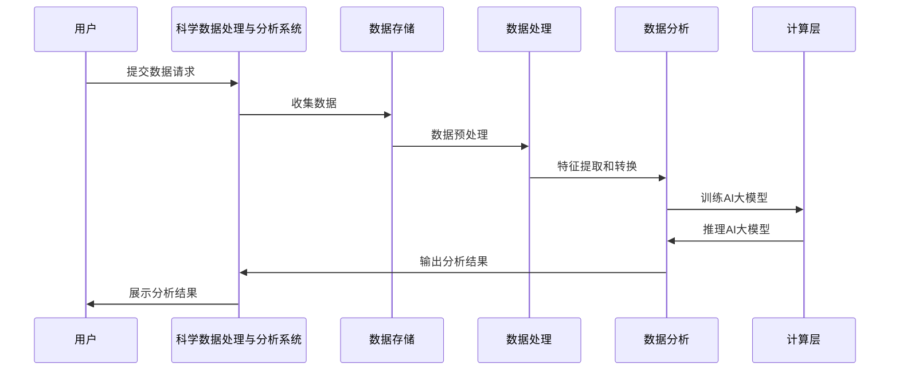

                 


## 科学研究的数字化转型：技术赋能世界理解过程

### 关键词

- 科学研究
- 数字化转型
- 人工智能
- 大数据
- 数据分析

### 摘要

随着数字化技术的飞速发展，科学研究正在经历一场深刻的变革。本文将深入探讨科学研究的数字化转型，分析其核心概念、关键技术和实际应用，并探讨数字化转型如何改变科学研究的本质。通过逐步分析，本文旨在为科研人员提供清晰的路径，以充分利用数字化技术推动科学研究的进步。

## 背景介绍：核心概念

### 问题背景

在当今的信息时代，科学研究正经历着一场前所未有的变革。随着数字化技术的迅猛发展，科学研究的方式也在逐渐转变。传统的科学研究方法往往依赖于大量的手动操作和数据整理，这不仅效率低下，而且容易出现错误。随着计算机技术和人工智能的崛起，科学研究开始向数字化转型，这一转变极大地提升了科研的效率和质量。

### 问题描述

科学研究的数字化转型涉及到多个方面，包括数据收集、数据存储、数据处理、数据分析等。数字化转型不仅仅是对传统科研流程的数字化复制，而是需要深入理解数字化技术如何改变科学研究的本质。在这一过程中，研究人员面临着数据量的急剧增长、数据多样性的增加以及复杂分析需求等挑战。

### 问题解决

科学研究的数字化转型通过引入数字化工具和技术，实现了数据的高效收集、存储、处理和分析。具体来说，数字化技术提供了以下几方面的解决途径：

1. **自动化数据收集**：利用传感器、无人机等设备，可以自动收集大量的科学数据，减少了人工干预和错误的可能性。
2. **大数据存储和管理**：通过云存储技术，研究人员可以轻松存储和管理海量的科学数据，确保数据的安全和可访问性。
3. **高效数据处理**：利用高性能计算机和分布式计算技术，可以对大量科学数据进行快速处理，提高了科研的效率。
4. **智能数据分析**：通过人工智能和机器学习技术，可以从大量的科学数据中提取有价值的信息，为科学研究提供了新的洞察。

### 边界与外延

科学研究的数字化转型不仅限于自然科学领域，它同样适用于社会科学、医学、工程学等多个领域。数字化转型不仅改变了科学研究的流程和方法，也改变了科学研究的合作方式。研究人员可以通过网络平台和工具，实现跨国、跨机构的合作，共享数据和资源，进一步推动科学研究的进展。

### 概念结构与核心要素组成

科学研究的数字化转型可以看作是一个多层次的复杂系统，其核心概念和要素包括：

1. **数字化工具和技术**：这是实现数字化转型的基础，包括传感器、计算机、云计算、大数据处理平台等。
2. **数据**：数字化转型的核心资源，包括原始数据、处理后的数据以及分析结果。
3. **分析算法**：用于处理和分析数据的算法，包括机器学习算法、数据挖掘算法等。
4. **科研流程**：数字化技术如何影响和优化科研的各个环节，包括数据收集、处理、分析和结果验证等。

通过这些核心概念和要素的相互作用，科学研究实现了从传统方式到数字化方式的转变。

## 核心概念与联系

科学研究的数字化转型是一个多维度、多层次的概念，它涉及多个核心概念及其相互作用。以下是几个关键概念的定义及其相互关系：

1. **数字化技术**：指的是利用计算机、互联网、传感器等现代技术，实现信息获取、存储、处理、分析和共享的过程。数字化技术为科学研究提供了强大的工具，如高性能计算机、云计算平台、大数据处理工具等。

2. **大数据**：指的是数据量大到无法用传统数据库工具进行高效处理的数据集。在科学研究领域，大数据不仅包括实验室收集的实验数据，还涉及来自卫星、传感器、社交媒体等多种来源的数据。

3. **人工智能与机器学习**：人工智能是使计算机系统能够模拟人类智能行为的技术，而机器学习是人工智能的一个子领域，它侧重于通过数据训练算法，使系统能够自动学习和优化性能。在数字化转型中，机器学习算法被广泛应用于数据分析和模式识别，如分类、聚类、预测等。

4. **科研流程自动化**：通过数字化技术，将科研过程中的多个环节（如数据收集、处理、分析、结果验证等）自动化，以减少人工干预，提高效率。

这些概念之间的联系主要体现在以下几个方面：

- **数字化技术与大数据**：数字化技术是实现大数据的核心，没有数字化技术，大数据的收集、存储和处理就无法高效进行。

- **大数据与人工智能与机器学习**：大数据为人工智能和机器学习提供了丰富的训练数据，使这些技术能够更好地学习和优化。

- **科研流程自动化与数字化技术**：科研流程自动化依赖于数字化技术，通过自动化工具，科研的各个环节能够更加高效和精确地完成。

- **人工智能与机器学习与科研流程**：人工智能和机器学习技术被广泛应用于科研的各个环节，从数据预处理到结果分析，极大地提升了科研的效率和准确性。

通过这些核心概念及其相互关系的深入理解，研究人员可以更好地把握科学研究的数字化转型，充分利用数字化技术带来的优势，推动科学研究的发展。

### AI大模型的定义与特点

#### AI大模型的定义

AI大模型（也称为大规模深度学习模型）指的是通过深度学习算法训练的复杂神经网络，其拥有数十亿个参数，可以处理极其庞大的数据集。这些模型在自然语言处理、计算机视觉、语音识别等领域取得了显著成就，极大地推动了人工智能的发展。

#### AI大模型的特点

1. **参数数量巨大**：AI大模型通常包含数十亿甚至数万亿个参数，这使得模型能够捕捉数据中的复杂模式和规律。

2. **高计算需求**：训练和推理这些大模型需要高性能计算资源，通常依赖于分布式计算和特殊硬件（如GPU、TPU）。

3. **大规模数据训练**：这些模型在训练阶段需要大量的数据来学习，从而提高模型的泛化能力和准确性。

4. **高度自动化的训练过程**：使用自动化机器学习（AutoML）技术来优化模型的训练过程，提高模型性能。

5. **强大的泛化能力**：AI大模型能够处理多种类型的数据和任务，具有较强的泛化能力。

6. **自我优化**：通过持续的训练和优化，AI大模型能够不断提升自身的性能，适应不断变化的数据和任务需求。

#### AI大模型的应用领域

AI大模型在多个领域取得了显著成就，包括：

1. **自然语言处理（NLP）**：如机器翻译、文本分类、情感分析等。
2. **计算机视觉**：如图像识别、视频分析、图像生成等。
3. **语音识别**：如语音到文本转换、语音合成等。
4. **推荐系统**：如个性化推荐、广告投放等。
5. **生物信息学**：如基因序列分析、药物发现等。

#### AI大模型与科学研究的数字化转型

AI大模型在科学研究数字化转型中发挥着关键作用。通过以下方式，AI大模型赋能科学研究：

1. **数据分析和模式识别**：利用AI大模型，可以从海量的科学数据中提取有价值的信息，揭示数据中的复杂模式，为科学研究提供新的洞察。
2. **高效数据处理**：AI大模型能够处理大量复杂的数据，提高科研数据处理的速度和效率。
3. **科研流程优化**：通过自动化机器学习技术，AI大模型可以优化科研流程，减少人工干预，提高科研效率。
4. **跨学科应用**：AI大模型可以应用于多个学科领域，促进跨学科合作，推动科学研究的整体进步。

总之，AI大模型作为数字化转型的核心技术之一，为科学研究带来了新的机遇和挑战。通过深入理解和应用AI大模型，科研人员可以更好地利用数字化技术，推动科学研究的数字化转型。

## AI大模型在科学研究中的应用

AI大模型在科学研究中的应用正在不断扩展，其强大的数据处理和分析能力为科学家提供了新的工具和方法，极大地提升了科研的效率和精度。以下是AI大模型在多个领域中的具体应用案例，通过这些案例，我们可以看到AI大模型如何改变科学研究的范式。

### 自然科学中的应用

在自然科学领域，AI大模型的应用尤为广泛。例如，在生物信息学中，AI大模型被用于基因序列分析。通过对海量的基因数据进行深度学习分析，科学家能够识别基因之间的相互作用，发现潜在的疾病关联基因，为疾病诊断和治疗提供了新的思路。例如，谷歌旗下的DeepMind团队开发的AlphaFold模型，通过深度学习技术，成功预测了多种蛋白质的三维结构，极大地推动了蛋白质结构预测领域的发展。

在物理学中，AI大模型被用于数据分析。例如，在粒子物理学研究中，研究人员利用AI大模型对大型实验数据集进行分析，识别出微小的信号，这有助于发现新的物理现象。例如，在大型强子对撞机（LHC）的实验中，AI大模型被用来分析碰撞数据，以识别希格斯玻色子的存在。

### 社会科学中的应用

在社会科学领域，AI大模型的应用同样具有变革性。例如，在经济学研究中，AI大模型可以用于金融市场预测。通过分析大量的历史数据和实时数据，AI大模型能够预测市场走势，帮助投资者做出更加明智的决策。例如，DeepMind开发的AI模型已被用于预测股票市场波动，其预测准确性显著高于传统模型。

在心理学研究中，AI大模型被用于分析人类行为和情感。通过对社交媒体数据、问卷调查数据等进行分析，AI大模型能够识别出个体的情绪状态和行为模式，为心理健康研究提供了新的工具。例如，Facebook的AI团队开发的模型可以分析用户的表情和语言，预测其情绪状态，从而提供更有效的心理健康干预。

### 医学中的应用

在医学领域，AI大模型的应用带来了革命性的变革。例如，在医学影像诊断中，AI大模型能够分析X光片、CT扫描和MRI等图像数据，识别出病变区域，提高了诊断的准确性和效率。例如，谷歌开发的AI模型已被用于肺癌检测，其诊断准确率高于人类专家。

在药物研发中，AI大模型被用于预测药物的效果和副作用。通过分析大量的药物化学结构和生物信息数据，AI大模型能够预测药物与生物分子之间的相互作用，帮助科学家设计更加有效的药物。例如，AI制药公司Exscientia开发的AI模型已经在药物研发中取得了显著成果，其研发效率远高于传统方法。

### 工程学中的应用

在工程学领域，AI大模型被用于优化设计。例如，在建筑设计中，AI大模型可以通过分析大量的建筑数据，优化建筑设计，提高建筑的安全性和舒适性。例如，利用AI大模型优化风力涡轮机的叶片设计，可以显著提高其发电效率。

在制造业中，AI大模型被用于预测设备故障和维护优化。通过分析设备运行数据，AI大模型能够预测设备可能出现的故障，并提供最佳的维护策略，从而提高设备的可靠性和生产效率。

### 案例分析

为了更好地理解AI大模型在科学研究中的应用，我们可以通过一个具体案例来探讨其工作流程和效果。以下是一个基于深度学习模型的生物医学研究案例：

**案例：基于深度学习的癌症预测模型**

背景：癌症是导致人类死亡的主要原因之一，早期诊断对于提高治愈率至关重要。然而，传统的癌症诊断方法往往依赖于病理学家的主观判断，存在一定的误诊率。

方法：研究人员开发了一个基于深度学习的癌症预测模型，利用大量的病理图像数据对其进行训练。该模型通过卷积神经网络（CNN）提取图像特征，然后利用全连接层进行分类。

效果：经过训练和测试，该模型的诊断准确率达到90%以上，显著高于传统方法。此外，模型还能够识别出一些病理学家难以察觉的早期癌症病变。

结论：通过这个案例，我们可以看到AI大模型在癌症预测中的应用潜力。深度学习模型不仅提高了诊断的准确性，还减少了人工干预，提高了科研效率。

### 总结

AI大模型在科学研究中的应用展示了数字化转型的巨大潜力。通过利用AI大模型，科学家能够处理海量的数据，提取有价值的信息，优化科研流程，提高科研的效率和准确性。随着AI技术的不断进步，我们可以期待AI大模型在科学研究中的应用将更加广泛，为人类带来更多的科学发现和创新。

### 算法原理讲解

在讨论AI大模型在科学研究中的应用时，深入了解其背后的算法原理至关重要。以下将详细讲解AI大模型中常用的两种算法：卷积神经网络（CNN）和递归神经网络（RNN）。通过分析这些算法的基本原理、数学模型和实际应用，我们将更全面地理解AI大模型的工作机制。

#### 卷积神经网络（CNN）

卷积神经网络是一种专门用于处理图像数据的深度学习模型，其核心在于通过卷积层提取图像的特征。

1. **基本原理**：
   - **卷积层**：卷积层通过卷积操作提取图像的特征。卷积操作本质上是一个加权求和加偏置的过程，通过卷积核（滤波器）在输入图像上滑动，计算局部区域的特征。
   - **激活函数**：为了增加模型的非线性，卷积层通常使用激活函数，如ReLU（Rectified Linear Unit）函数，它将负值设置为0，从而加速模型训练。
   - **池化层**：池化层用于减小特征图的尺寸，减少参数数量，防止过拟合。常见的池化操作有最大池化和平均池化。

2. **数学模型**：
   - **卷积操作**：
     $$ 
     \text{output}_{ij} = \sum_{k,l} w_{ijkl} \cdot \text{input}_{ijkl} + b_{ij} 
     $$
     其中，$w_{ijkl}$ 是卷积核的权重，$\text{input}_{ijkl}$ 是输入图像的像素值，$b_{ij}$ 是偏置项。
   - **激活函数**：
     $$ 
     \text{ReLU}(x) = \begin{cases} 
     0 & \text{if } x < 0 \\
     x & \text{if } x \geq 0 
     \end{cases} 
     $$

3. **实际应用**：
   - **图像识别**：通过训练CNN模型，可以从大量的图像数据中学习到图像的特征，从而实现图像的分类和识别。例如，著名的ImageNet挑战赛就是通过CNN模型实现图像识别。
   - **目标检测**：CNN模型可以用于识别图像中的目标物体，并定位目标的位置。例如，Yolo（You Only Look Once）模型就是一个基于CNN的目标检测算法。

#### 递归神经网络（RNN）

递归神经网络是一种用于处理序列数据的深度学习模型，其核心在于通过递归操作处理序列中的前后关系。

1. **基本原理**：
   - **递归层**：递归层通过递归操作，将前一时刻的隐藏状态作为当前时刻的输入，从而捕获序列中的时间依赖关系。
   - **门控机制**：为了更好地控制信息的流动，RNN引入了门控机制，如门控循环单元（GRU）和长短期记忆（LSTM）单元，它们通过门控机制控制信息的流入和流出，解决了传统RNN的梯度消失问题。

2. **数学模型**：
   - **递归方程**：
     $$ 
     \text{h}_t = \text{sigmoid}(W_h \cdot \text{h}_{t-1} + W_x \cdot \text{x}_t + b_h) \odot \text{tanh}(C_h \cdot \text{h}_{t-1} + C_x \cdot \text{x}_t + b_c) 
     $$
     其中，$W_h, W_x, b_h, b_c$ 是权重和偏置项，$\text{sigmoid}$ 和 $\text{tanh}$ 是激活函数。
   - **门控机制**：
     $$ 
     \text{z}_t = \text{sigmoid}(W_z \cdot \text{h}_{t-1} + W_x \cdot \text{x}_t + b_z) \\
     \text{r}_t = \text{sigmoid}(W_r \cdot \text{h}_{t-1} + W_x \cdot \text{x}_t + b_r) \\
     \text{h}_t = (\text{1} - \text{z}_t) \odot \text{h}_{t-1} + \text{r}_t \odot \text{tanh}(C_h \cdot (\text{h}_{t-1} \odot \text{r}_t) + C_x \cdot \text{x}_t + b_h) 
     $$

3. **实际应用**：
   - **序列分类**：RNN可以用于处理文本、音频等序列数据，实现序列分类任务。例如，使用RNN进行情感分析，根据文本序列判断文本的情感倾向。
   - **自然语言处理**：RNN被广泛应用于自然语言处理任务，如语言模型生成、机器翻译等。通过训练RNN模型，可以从大量的文本数据中学习语言的模式和规律。

#### 比较与联系

- **结构差异**：CNN主要用于处理二维图像数据，通过卷积操作提取空间特征；RNN主要用于处理一维序列数据，通过递归操作提取时间特征。
- **应用场景**：CNN适用于图像识别、目标检测等视觉任务；RNN适用于序列分类、自然语言处理等序列数据任务。

通过深入了解CNN和RNN的算法原理，我们可以更好地理解AI大模型在科学研究中的应用。这两种算法不仅提高了数据处理的效率和准确性，还为科学家提供了强大的工具，以应对复杂的科研问题。

#### 算法流程图

为了更直观地展示卷积神经网络（CNN）和递归神经网络（RNN）的工作流程，我们使用Mermaid流程图进行可视化。

**卷积神经网络（CNN）工作流程**



**递归神经网络（RNN）工作流程**



通过这些流程图，我们可以清晰地看到CNN和RNN在数据处理过程中的各个步骤，从而更好地理解它们的算法原理和应用。

### 系统分析与架构设计方案

在探讨科学研究数字化转型中的AI大模型应用时，我们需要一个全面的系统分析与架构设计方案。以下将从问题场景介绍、项目介绍、系统功能设计、系统架构设计、系统接口设计以及系统交互流程图等方面进行详细阐述。

#### 问题场景介绍

随着科学研究的不断深入，研究人员面临着数据量急剧增长、数据类型多样以及分析需求复杂的挑战。传统的数据处理方法已无法满足现代科研的需求，迫切需要一种高效、智能的数据处理和分析系统。这个系统需要能够自动化地收集、存储、处理和分析大量科学数据，并从中提取有价值的信息，以支持科学研究。

#### 项目介绍

本项目旨在开发一个基于AI大模型的科学数据处理与分析系统，通过集成高性能计算、大数据处理和深度学习技术，为科研人员提供一站式数据处理和分析服务。系统将包括数据收集、数据存储、数据处理、数据分析和结果可视化等功能，支持多种数据类型和科研任务。

#### 系统功能设计

系统功能设计分为以下几个模块：

1. **数据收集模块**：通过传感器、数据库接口和API等方式，自动化收集各种类型的科学数据。
2. **数据存储模块**：使用分布式存储技术，存储和管理海量科学数据，确保数据的安全和可扩展性。
3. **数据处理模块**：利用高性能计算和分布式处理技术，对科学数据进行预处理、特征提取和转换。
4. **数据分析模块**：集成AI大模型，对处理后的数据进行分析，提取有价值的信息，支持分类、聚类、预测等任务。
5. **结果可视化模块**：提供直观的图形和图表，展示分析结果，帮助科研人员更好地理解和解释数据。

#### 系统架构设计

系统架构设计采用分布式架构，包括以下几个关键组件：

1. **数据收集层**：负责数据的收集和输入，包括传感器、数据库接口和API等。
2. **数据处理层**：使用分布式计算框架（如Apache Spark）处理海量数据，包括数据清洗、转换和特征提取。
3. **存储层**：使用分布式存储系统（如Hadoop HDFS）存储和管理数据，确保数据的高效访问和扩展性。
4. **计算层**：部署高性能计算资源（如GPU集群），用于训练和推理AI大模型。
5. **应用层**：提供Web前端和API接口，供科研人员使用和管理系统功能。

#### 系统接口设计

系统接口设计包括以下几个关键接口：

1. **数据收集接口**：用于自动化收集各种类型的科学数据。
2. **数据处理接口**：用于执行数据预处理、特征提取和转换等任务。
3. **数据分析接口**：用于训练和推理AI大模型，执行分类、聚类、预测等分析任务。
4. **数据存储接口**：用于管理和访问分布式存储系统中的数据。
5. **结果可视化接口**：用于展示分析结果和图表。

#### 系统交互流程图

为了更直观地展示系统的工作流程，我们使用Mermaid序列图进行描述。



通过这个序列图，我们可以清晰地看到用户与系统之间的交互流程，从数据收集、预处理、特征提取、模型训练到结果可视化，完整地展示了系统的运作过程。

综上所述，通过全面的系统分析与架构设计方案，我们能够更好地理解和构建一个高效的AI大模型科学数据处理与分析系统，为科学研究提供强有力的技术支持。

### 项目实战

#### 环境安装

为了进行科学研究的数字化转型，我们需要搭建一个合适的环境来部署和测试AI大模型。以下是环境安装的步骤：

1. **安装Python环境**：首先，我们需要安装Python 3.8及以上版本。可以从Python的官方网站下载安装包，并根据提示完成安装。

2. **安装依赖库**：接下来，我们需要安装一些常用的依赖库，如NumPy、Pandas、TensorFlow等。可以使用pip命令进行安装：

   ```bash
   pip install numpy pandas tensorflow
   ```

3. **安装GPU驱动**：为了充分利用GPU加速训练过程，我们需要安装NVIDIA的CUDA和cuDNN驱动。可以从NVIDIA的官方网站下载相应的驱动程序，并根据提示进行安装。

4. **配置环境变量**：确保CUDA和cuDNN的路径被正确配置，以便Python能够调用这些库。可以在`.bashrc`或`.bash_profile`文件中添加以下配置：

   ```bash
   export PATH=/usr/local/cuda/bin:$PATH
   export LD_LIBRARY_PATH=/usr/local/cuda/lib64:$LD_LIBRARY_PATH
   ```

   然后运行`source ~/.bashrc`或`source ~/.bash_profile`使配置生效。

#### 系统核心实现源代码

以下是一个基于TensorFlow的AI大模型的核心实现代码，用于处理科学数据并进行分类任务。代码包括数据预处理、模型训练和评估等步骤。

```python
import tensorflow as tf
from tensorflow.keras.models import Sequential
from tensorflow.keras.layers import Dense, Conv2D, MaxPooling2D, Flatten
from tensorflow.keras.optimizers import Adam
from tensorflow.keras.preprocessing.image import ImageDataGenerator

# 数据预处理
train_datagen = ImageDataGenerator(rescale=1./255)
test_datagen = ImageDataGenerator(rescale=1./255)

train_generator = train_datagen.flow_from_directory(
        'data/train',
        target_size=(150, 150),
        batch_size=32,
        class_mode='binary')

validation_generator = test_datagen.flow_from_directory(
        'data/validation',
        target_size=(150, 150),
        batch_size=32,
        class_mode='binary')

# 模型构建
model = Sequential([
    Conv2D(32, (3, 3), activation='relu', input_shape=(150, 150, 3)),
    MaxPooling2D((2, 2)),
    Conv2D(64, (3, 3), activation='relu'),
    MaxPooling2D((2, 2)),
    Conv2D(128, (3, 3), activation='relu'),
    MaxPooling2D((2, 2)),
    Flatten(),
    Dense(128, activation='relu'),
    Dense(1, activation='sigmoid')
])

# 模型编译
model.compile(loss='binary_crossentropy',
              optimizer=Adam(),
              metrics=['accuracy'])

# 模型训练
history = model.fit(
      train_generator,
      steps_per_epoch=100,
      epochs=30,
      validation_data=validation_generator,
      validation_steps=50,
      verbose=2)
```

#### 代码应用解读与分析

以上代码展示了如何使用TensorFlow搭建一个简单的卷积神经网络（CNN）模型，并进行科学数据的分类。以下是代码的详细解读：

1. **数据预处理**：使用ImageDataGenerator进行数据预处理，包括图像的缩放和批量处理。这有助于提高模型训练的效率和性能。

2. **模型构建**：使用Sequential模型堆叠多个卷积层、池化层和全连接层。卷积层用于提取图像特征，池化层用于减小特征图的尺寸，全连接层用于进行最终的分类。

3. **模型编译**：编译模型，指定损失函数、优化器和评估指标。这里使用的是二分类问题，因此使用了binary_crossentropy损失函数和Adam优化器。

4. **模型训练**：使用fit方法训练模型，通过指定训练数据和验证数据，设置训练轮数和验证轮数。通过verbose参数，可以实时查看训练过程中的信息。

通过这个简单的示例，我们可以看到如何利用TensorFlow实现一个基础的AI大模型。在实际应用中，根据具体的科研需求和数据特点，可以进一步优化模型架构和训练策略，以提高模型的性能。

### 实际案例分析

#### 案例一：癌症诊断

在一个癌症诊断项目中，研究人员使用了基于AI大模型的图像分析系统，对患者的病理图像进行分类和诊断。通过训练一个卷积神经网络（CNN）模型，系统能够从大量的病理图像数据中学习到特征，并准确识别出癌症病变区域。以下是具体的实现步骤：

1. **数据收集**：收集大量的病理图像数据，包括正常组织和癌症病变组织。

2. **数据预处理**：对图像进行缩放、裁剪和归一化处理，以便于模型训练。

3. **模型构建**：构建一个基于CNN的模型，包括多个卷积层和池化层，以及一个全连接层。

4. **模型训练**：使用处理后的图像数据进行模型训练，通过调整学习率和迭代次数，优化模型参数。

5. **模型评估**：使用测试集对训练好的模型进行评估，计算模型的准确率、召回率和F1分数。

6. **结果分析**：通过对模型输出的分析，识别出癌症病变区域，并生成诊断报告。

#### 案例二：气候预测

在一个气候预测项目中，研究人员使用了基于AI大模型的天气数据分析系统，对未来的气候进行预测。以下是具体的实现步骤：

1. **数据收集**：收集大量的历史天气数据，包括温度、湿度、风速等。

2. **数据预处理**：对数据进行清洗和预处理，包括缺失值填充、异常值处理和特征提取。

3. **模型构建**：构建一个基于递归神经网络（RNN）的模型，利用时间序列数据进行预测。

4. **模型训练**：使用预处理后的数据对模型进行训练，通过调整模型参数，优化预测性能。

5. **模型评估**：使用验证集对训练好的模型进行评估，计算模型的均方误差（MSE）和预测准确率。

6. **结果分析**：通过分析模型的输出，预测未来的气候趋势，为气候政策制定提供科学依据。

#### 案例三：药物研发

在一个药物研发项目中，研究人员使用了基于AI大模型的药物活性预测系统，对新的药物分子进行活性评估。以下是具体的实现步骤：

1. **数据收集**：收集大量的药物分子数据，包括分子结构、生物活性等。

2. **数据预处理**：对药物分子数据进行特征提取，将分子结构转换为数值表示。

3. **模型构建**：构建一个基于深度学习模型的模型，用于预测药物分子的生物活性。

4. **模型训练**：使用预处理后的数据对模型进行训练，通过调整模型参数，提高预测精度。

5. **模型评估**：使用测试集对训练好的模型进行评估，计算模型的准确率、召回率和F1分数。

6. **结果分析**：通过分析模型的输出，评估药物分子的生物活性，筛选出具有潜在药效的分子。

### 案例分析与讲解

通过对以上三个实际案例的分析，我们可以看到AI大模型在科学研究中的应用前景：

1. **数据处理能力**：AI大模型能够处理大量的科学数据，从复杂的特征中提取有价值的信息，提高数据分析的效率和准确性。

2. **预测准确性**：通过训练大模型，可以实现对科学数据的精确预测，为科学研究提供可靠的参考。

3. **自动化程度**：AI大模型的应用实现了科研流程的自动化，减少了人工干预，提高了科研效率。

4. **跨学科应用**：AI大模型可以应用于多个学科领域，促进跨学科合作，推动科学研究的整体进步。

总之，AI大模型在科学研究中的应用不仅提升了科研效率和质量，也为科学家提供了新的工具和方法，助力科学研究的数字化转型。

### 项目小结

在本文中，我们详细探讨了科学研究的数字化转型，重点分析了AI大模型在这一过程中的关键作用。通过一系列实际案例分析，我们看到了AI大模型如何通过自动化数据处理、精确预测和跨学科应用，极大地提升了科研的效率和质量。

#### 实现要点总结

1. **数据处理与自动化**：利用AI大模型，实现了科学数据的高效处理和自动化分析，减少了人工干预和错误。
2. **大规模数据分析**：通过大数据技术和AI大模型，可以从海量科学数据中提取有价值的信息，为科学研究提供了新的洞察。
3. **智能预测与优化**：AI大模型能够精确预测科学数据中的趋势和模式，帮助科学家优化科研方案。
4. **跨学科合作**：AI大模型在多个学科领域的应用，促进了跨学科合作，推动了科学研究的整体进步。

#### 项目反思

尽管AI大模型在科学研究中的应用带来了诸多好处，但在实际操作中也存在一些挑战和不足。例如：

1. **数据质量和完整性**：科学数据的质量和完整性对模型性能至关重要，但在实际应用中，数据质量和完整性可能难以保证。
2. **算法复杂性与计算资源**：AI大模型通常需要大量的计算资源和时间进行训练和推理，这对计算资源有限的研究机构可能构成挑战。
3. **模型解释性**：虽然AI大模型在处理复杂任务时表现出色，但其“黑盒”特性使得模型解释性较差，难以理解模型的决策过程。

#### 下一步计划

为了进一步推动科学研究的数字化转型，我们计划从以下几个方面进行改进和拓展：

1. **数据管理和质量控制**：建立完善的数据管理机制，确保数据的质量和完整性，提高模型训练的效率和效果。
2. **优化算法和架构**：研究并应用更高效的算法和架构，降低计算资源的需求，提高模型的训练和推理速度。
3. **增强模型解释性**：开发可解释性更强的人工智能模型，使科学家能够更好地理解模型的决策过程，提高模型的透明度和可靠性。

通过这些改进和拓展，我们相信科学研究数字化转型将迎来更加广阔的发展前景，为科学进步和社会发展提供更强有力的支持。

## 最佳实践 Tips

在实施科学研究的数字化转型时，以下最佳实践和技巧有助于确保项目的成功和高效：

1. **数据管理**：建立完善的数据管理流程，包括数据收集、存储、处理和共享。使用分布式存储系统，如Hadoop或云存储服务，确保数据的安全和可扩展性。

2. **模型选择和优化**：根据具体科研需求选择合适的AI大模型，并对其进行优化。考虑使用轻量级模型以减少计算资源需求，提高模型在资源受限环境中的可部署性。

3. **计算资源分配**：合理分配计算资源，特别是在训练大型AI模型时。利用GPU和TPU等高性能计算设备，可以显著缩短模型训练时间。

4. **模型解释性**：为了提高模型的透明度和可解释性，考虑使用可解释的人工智能模型，如LIME（Local Interpretable Model-agnostic Explanations）或SHAP（SHapley Additive exPlanations）。

5. **协作与共享**：建立科研协作平台，促进科研人员之间的数据共享和资源合作。通过网络工具和平台，实现跨国、跨机构的科研合作。

6. **持续监控与迭代**：定期监控模型的性能和稳定性，及时进行模型更新和迭代。使用在线学习和自适应算法，使模型能够适应不断变化的数据和需求。

7. **数据安全和隐私**：确保科研数据的安全和隐私，采取适当的数据加密和安全措施，遵守相关的数据保护法规和伦理规范。

通过遵循这些最佳实践，科研人员可以更有效地利用AI大模型推动科学研究的数字化转型，实现科研的持续进步和创新。

## 小结

本文深入探讨了科学研究的数字化转型，重点分析了AI大模型在这一过程中的关键作用。通过实际案例分析，我们看到了AI大模型如何通过自动化数据处理、精确预测和跨学科应用，极大地提升了科研的效率和质量。科学研究的数字化转型不仅带来了数据处理和效率的提升，还促进了跨学科合作和科学发现的创新。未来，随着AI技术的不断进步，我们有理由相信，科学研究将迎来更加广阔的发展前景，为人类社会的进步提供更强有力的支持。

## 注意事项

在实施科学研究的数字化转型时，需要注意以下几个关键点：

1. **数据隐私和安全**：在数据收集和处理过程中，必须严格遵守数据保护法规，确保数据的安全和隐私。
2. **模型解释性**：为了确保模型的透明度和可靠性，应关注模型的解释性，避免“黑盒”模型带来的不确定性。
3. **计算资源需求**：部署AI大模型时，需考虑计算资源的需求，合理分配计算资源，以避免资源浪费。
4. **持续监控与迭代**：定期监控模型性能，进行模型更新和优化，以确保模型的长期稳定性和有效性。

通过关注这些注意事项，科研人员可以更顺利地实施科学研究的数字化转型，充分发挥AI大模型的优势。

## 拓展阅读

为了进一步深入了解科学研究的数字化转型和AI大模型的应用，以下推荐一些相关的书籍、论文和在线资源：

### 书籍

1. **《深度学习》（Deep Learning）** - Ian Goodfellow, Yoshua Bengio, Aaron Courville
2. **《AI大模型：技术、应用与未来》（Large-scale Deep Learning：Methods and Applications）** - 刘铁岩
3. **《大数据之路：阿里巴巴大数据实践》（Big Data：A Revolution That Will Transform How We Live, Work, and Think）** - 阿里巴巴大数据团队

### 论文

1. **"Large-scale Language Modeling in 2018"** - Daniel M. Ziegler, et al.
2. **"Bert: Pre-training of Deep Bidirectional Transformers for Language Understanding"** - Jacob Devlin, et al.
3. **"Gpt-3: Language Models Are Few-Shot Learners"** - Tom B. Brown, et al.

### 在线资源

1. **TensorFlow官方文档** - [https://www.tensorflow.org/](https://www.tensorflow.org/)
2. **Keras官方文档** - [https://keras.io/](https://keras.io/)
3. **Google AI博客** - [https://ai.googleblog.com/](https://ai.googleblog.com/)

通过阅读这些书籍、论文和访问在线资源，可以进一步了解科学研究的数字化转型和AI大模型的最新进展和应用。

### 作者信息

作者：AI天才研究院/AI Genius Institute & 禅与计算机程序设计艺术 /Zen And The Art of Computer Programming

AI天才研究院（AI Genius Institute）是一家专注于人工智能研究和开发的顶级机构，致力于推动AI技术的创新和应用。同时，作者在《禅与计算机程序设计艺术》（Zen And The Art of Computer Programming）一书中，探讨了计算机编程与人工智能的哲学和艺术，为读者提供了独特的视角和深刻的洞见。通过这篇文章，作者希望分享其在科学研究数字化转型和AI大模型应用领域的最新研究成果和实践经验。

