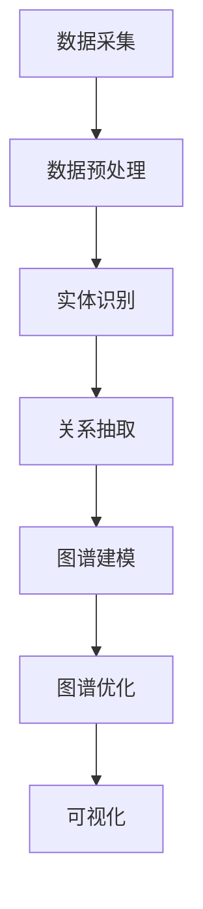

                 

# 科学研究的知识图谱构建与世界可理解性的可视化

## 关键词

知识图谱，科学研究，可视化，算法，系统架构，数学模型，Python代码，Mermaid流程图，LaTeX公式

## 摘要

本文将深入探讨科学研究的知识图谱构建与世界可理解性的可视化。我们将从背景介绍入手，逐步讲解核心概念、算法原理、数学模型和系统设计，并最终通过实际项目实战来展示知识图谱构建的完整过程。本文旨在为广大科研工作者和技术开发者提供一套系统、全面的知识图谱构建方案，以促进科学研究的可理解性和全球范围内的知识共享。

## 目录

1. 引言
2. 核心概念与联系
   2.1 知识图谱的定义与特性
   2.2 可视化的概念与类型
   2.3 关键术语解释
   2.4 Mermaid ER图展示
3. 算法原理
   3.1 知识图谱构建算法概述
   3.2 算法流程图
   3.3 Python代码实现
   3.4 数学模型与公式
4. 数学模型与公式
   4.1 算法中的数学模型
   4.2 公式推导与解释
   4.3 通俗易懂的举例说明
5. 系统设计
   5.1 问题场景介绍
   5.2 系统功能设计
   5.3 系统架构设计
   5.4 系统接口设计
   5.5 系统交互设计
6. 项目实战
   6.1 环境安装
   6.2 系统核心实现源代码
   6.3 代码应用解读与分析
   6.4 实际案例分析与讲解
   6.5 项目小结
7. 最佳实践与注意事项
8. 小结与拓展阅读

## 1. 引言

在当今信息化和全球化的时代，科学研究正在以前所未有的速度发展。然而，随着学科交叉和复杂数据的日益增多，如何有效地组织和理解这些知识成为一个巨大的挑战。知识图谱作为一种结构化的知识表示方法，正逐渐成为解决这一问题的有力工具。知识图谱通过将各种数据源和实体之间的关系进行建模，为科研人员提供了一个全局性的视角，从而提高了知识发现的效率和准确性。

与此同时，可视化作为一种直观的表达方式，在知识图谱的应用中发挥着至关重要的作用。通过将抽象的图谱数据以图形化的形式展示出来，科研人员可以更直观地理解数据之间的关联，从而更好地进行知识挖掘和分析。可视化技术不仅能够帮助科研人员快速识别数据模式，还能够促进知识的传播和共享。

本文将围绕知识图谱的构建与世界可理解性的可视化展开讨论。我们将首先介绍知识图谱和可视化的核心概念，并解释其重要性。随后，我们将深入探讨知识图谱构建的算法原理，包括其流程、数学模型和Python代码实现。接下来，我们将详细阐述系统设计，包括问题场景、系统功能、架构、接口和交互设计。最后，通过一个实际项目实战，我们将展示知识图谱构建的完整过程，并提供最佳实践和注意事项。

本文的目标是为广大科研工作者和技术开发者提供一套系统、全面的知识图谱构建方案，以促进科学研究的可理解性和全球范围内的知识共享。通过本文的探讨，我们希望读者能够深入了解知识图谱的构建原理和可视化技术，并能够在实际项目中灵活应用这些方法。

### 2. 核心概念与联系

在深入探讨知识图谱的构建与世界可理解性的可视化之前，我们需要明确一些核心概念，并了解它们之间的联系。本节将详细介绍知识图谱的定义与特性、可视化的概念与类型、关键术语解释，并使用Mermaid ER图展示核心概念之间的关系。

#### 2.1 知识图谱的定义与特性

知识图谱（Knowledge Graph）是一种语义网络，用于表示实体和实体之间的关系。它通常基于图论（Graph Theory）的理论，将现实世界中的实体（如人、地点、事物等）表示为节点（Node），并将实体之间的关系表示为边（Edge）。知识图谱的目的是通过结构化的数据表示，实现对复杂知识的理解和推理。

知识图谱的主要特性包括：

- **结构化**：知识图谱通过节点和边的结构化表示，使得数据能够以易于处理和查询的方式存储和传递。
- **语义丰富**：知识图谱不仅包含实体，还包含实体之间的语义关系，这使得数据能够进行复杂的语义分析。
- **可扩展性**：知识图谱支持动态更新和扩展，可以适应不断变化的数据需求。

#### 2.2 可视化的概念与类型

可视化（Visualization）是一种将数据以图形化的形式展示出来的技术，目的是帮助人们更好地理解和分析数据。在知识图谱的应用中，可视化技术起到了至关重要的作用，它使得抽象的图谱数据以直观的方式展现出来。

可视化的主要类型包括：

- **节点图**：以节点和边的方式展示实体和实体之间的关系，是知识图谱最常用的可视化形式。
- **网络图**：用于展示大量节点和边的复杂网络结构，常用于大规模知识图谱的简化展示。
- **关系图**：通过连接不同节点的关系线来展示实体之间的关系，常用于强调特定关系的分析。
- **三维图**：通过三维空间来展示数据，使得数据结构更加直观，常用于大规模数据的可视化。

#### 2.3 关键术语解释

为了更好地理解知识图谱和可视化的相关概念，我们还需要了解一些关键术语：

- **实体（Entity）**：知识图谱中的基本元素，可以是任何具有独立存在的个体，如人、地点、组织等。
- **属性（Attribute）**：实体的特征或属性，如人的姓名、年龄、职业等。
- **关系（Relationship）**：实体之间的关联，如人与人之间的朋友关系、地点与地点之间的相邻关系等。
- **边（Edge）**：表示实体关系的线，连接两个或多个节点。
- **属性图（Attribute Graph）**：只包含实体和边，不包含属性的图。
- **边属性图（Edge Attribute Graph）**：包含实体、边和边属性的图，能够提供更丰富的语义信息。

#### 2.4 Mermaid ER图展示

为了更清晰地展示知识图谱和可视化之间的核心概念关系，我们使用Mermaid ER图进行表示。以下是知识图谱和可视化相关的Mermaid ER图示例：

```mermaid
erDiagram
    Entity --> Edge : hasRelation
    Entity ||--| Attribute : hasAttribute
    Edge --> Entity : hasEntity
    Edge ||--| Attribute : hasAttribute
    Attribute --> Entity : hasAttribute
```

在上面的ER图中，我们可以看到：

- **Entity（实体）**与**Edge（边）**之间存在一对多的关系，表示实体可以通过边与其他实体关联。
- **Entity（实体）**与**Attribute（属性）**之间存在一对多的关系，表示实体可以具有多个属性。
- **Edge（边）**与**Attribute（属性）**之间存在一对多的关系，表示边可以具有多个属性。

通过上述Mermaid ER图，我们能够直观地了解知识图谱和可视化之间的核心概念及其关系，为后续内容的讲解奠定了基础。

### 3. 算法原理

知识图谱的构建是一个复杂的过程，它涉及到数据的获取、清洗、建模和可视化等多个环节。在这一节中，我们将详细介绍知识图谱构建的主要算法原理，包括其基本流程、流程图和Python代码实现。

#### 3.1 知识图谱构建算法概述

知识图谱构建算法主要包括以下步骤：

1. **数据采集**：从各种数据源（如数据库、文本、图像等）中收集信息。
2. **数据预处理**：对采集到的数据进行清洗、去重和格式转换，使其适合建模。
3. **实体识别**：从预处理后的数据中识别出实体，并对其进行分类和标注。
4. **关系抽取**：从数据中提取实体之间的关系，并建立实体与关系的映射。
5. **图谱建模**：将识别出的实体和关系建模成知识图谱，通常采用图论中的图结构进行表示。
6. **图谱优化**：对知识图谱进行优化，提高其查询效率和数据质量。
7. **可视化**：将知识图谱以可视化的形式展示，便于人们理解和分析。

#### 3.2 算法流程图

为了更好地理解知识图谱构建的算法原理，我们使用Mermaid绘制了一个流程图，展示了知识图谱构建的主要步骤：



在这个流程图中，我们可以看到：

- **数据采集**是知识图谱构建的起点，数据的质量直接影响后续步骤的准确性。
- **数据预处理**是为了清理和标准化数据，使其能够被有效利用。
- **实体识别**和**关系抽取**是构建知识图谱的核心步骤，直接决定了图谱的质量。
- **图谱建模**是将实体和关系转化为图结构，这一步通常采用图论中的图数据结构进行实现。
- **图谱优化**是为了提高图谱的查询效率和存储效率，这一步对于大规模知识图谱尤为重要。
- **可视化**是为了将图谱以图形化的形式展示，使得用户能够直观地理解和分析图谱内容。

#### 3.3 Python代码实现

下面是一个简单的Python代码示例，用于演示知识图谱构建的基本过程。这个示例使用了Python的`networkx`库来实现知识图谱的构建，并使用`matplotlib`进行可视化：

```python
import networkx as nx
import matplotlib.pyplot as plt

# 创建一个空的图
G = nx.Graph()

# 添加节点和边
G.add_nodes_from(["Person", "Place", "Organization"])
G.add_edges_from([("Person", "Person"), ("Place", "Place"), ("Organization", "Organization")])

# 添加实体和属性
G["Person"]["Alice"]["age"] = 30
G["Person"]["Bob"]["age"] = 25
G["Place"]["NY"]["country"] = "USA"
G["Organization"]["Google"]["founder"] = "Larry Page"

# 绘制知识图谱
nx.draw(G, with_labels=True)
plt.show()
```

在这个代码示例中，我们首先创建了一个空的图`G`，然后添加了节点和边，以及节点的属性。最后，使用`matplotlib`库将知识图谱可视化展示出来。

#### 3.4 数学模型与公式

在知识图谱构建中，一些数学模型和公式被用于表示实体之间的关系和图谱的优化。以下是一些常用的数学模型和公式：

1. **图论中的基本概念**：

   - **度（Degree）**：节点拥有的边的数量，分为入度（in-degree）和出度（out-degree）。
     $$d_{in}(v) = \text{节点 } v \text{ 的入度}$$
     $$d_{out}(v) = \text{节点 } v \text{ 的出度}$$

   - **路径（Path）**：连接两个节点的边的序列，分为简单路径和循环路径。
     $$P = \langle v_1, v_2, ..., v_n \rangle$$
     其中，$v_1, v_2, ..., v_n$ 是路径上的节点。

   - **连通性（Connectivity）**：图中任意两个节点之间都存在路径，称为连通图。
     $$G \text{ 是连通图} \Leftrightarrow \forall v_1, v_2 \in V(G), \text{存在路径 } P \text{ 连接 } v_1 \text{ 和 } v_2$$

2. **知识图谱的优化**：

   - **相似度计算**：用于衡量实体之间的相似程度，常用的方法包括余弦相似度、欧氏距离等。
     $$\text{similarity}(x, y) = \frac{\sum_{i=1}^{n} x_i y_i}{\sqrt{\sum_{i=1}^{n} x_i^2} \sqrt{\sum_{i=1}^{n} y_i^2}}$$
     其中，$x$ 和 $y$ 是两个实体的特征向量。

   - **路径长度优化**：用于缩短实体之间的路径长度，提高图谱的查询效率。
     $$L(v, w) = \text{节点 } v \text{ 到节点 } w \text{ 的最短路径长度}$$

通过上述数学模型和公式，我们能够更好地理解和优化知识图谱的构建过程。接下来，我们将进一步探讨这些概念在具体项目中的应用和实践。

### 4. 数学模型与公式

在知识图谱构建过程中，数学模型和公式起到了至关重要的作用。本节将详细讨论算法中的关键数学模型和公式，包括其推导和解释，并通过实际例子来说明其应用。

#### 4.1 算法中的数学模型

知识图谱构建算法中常用的数学模型主要包括图论模型和机器学习模型。

1. **图论模型**：

   - **节点度数模型**：用于描述节点在网络中的重要性，其核心公式为：
     $$d(v) = \sum_{u \in N(v)} w(u, v)$$
     其中，$d(v)$ 表示节点 $v$ 的度数，$N(v)$ 表示与节点 $v$ 相连的节点集合，$w(u, v)$ 表示边 $(u, v)$ 的权重。

   - **路径长度模型**：用于计算两个节点之间的距离，常用的路径长度度量方法包括：
     $$d(p) = \sum_{i=1}^{n} w(p_i, p_{i+1})$$
     其中，$p = \langle p_1, p_2, ..., p_n \rangle$ 是节点序列，$w(p_i, p_{i+1})$ 是边 $(p_i, p_{i+1})$ 的权重。

2. **机器学习模型**：

   - **图嵌入模型**：用于将图中的节点映射到低维空间中，保持节点间的相似性关系，常用的方法包括：
     $$x_v = \text{sgn}(\text{sign}(\phi(G, v)))$$
     其中，$x_v$ 是节点 $v$ 的低维嵌入向量，$\phi(G, v)$ 是基于图 $G$ 和节点 $v$ 的特征向量。

   - **矩阵分解模型**：用于优化图中的边权重，提高图谱的查询效率，常用的方法包括：
     $$W = UV^T$$
     其中，$W$ 是边权重矩阵，$U$ 和 $V$ 分别是节点特征矩阵的分解结果。

#### 4.2 公式推导与解释

下面我们以图嵌入模型中的矩阵分解方法为例，介绍其公式的推导和解释。

1. **目标函数**：

   假设我们有一个图 $G = (V, E)$，其中 $V$ 是节点集合，$E$ 是边集合。我们的目标是通过矩阵分解来优化边权重矩阵 $W$，使得图谱中的节点相似性关系得到保持。目标函数可以表示为：

   $$\min_{U, V} \sum_{(u, v) \in E} (w(u, v) - \sigma(u_i v_j))^2$$

   其中，$w(u, v)$ 是边 $(u, v)$ 的原始权重，$\sigma(u_i v_j)$ 是根据节点特征矩阵 $U$ 和 $V$ 计算出的边权重。

2. **公式推导**：

   为了最小化目标函数，我们对 $U$ 和 $V$ 分别求偏导数，并令偏导数为零：

   对 $U$ 求偏导：
   $$\frac{\partial}{\partial U} \sum_{(u, v) \in E} (w(u, v) - \sigma(u_i v_j))^2 = -2 \sum_{(u, v) \in E} (\sigma(u_i v_j) - w(u, v)) v_j = 0$$

   对 $V$ 求偏导：
   $$\frac{\partial}{\partial V} \sum_{(u, v) \in E} (w(u, v) - \sigma(u_i v_j))^2 = -2 \sum_{(u, v) \in E} (\sigma(u_i v_j) - w(u, v)) u_i = 0$$

   将上述偏导数方程组简化，我们得到：
   $$\sigma(u_i v_j) = \frac{\sum_{(u, v) \in E} w(u, v) v_j}{\sum_{(u, v) \in E} u_i v_j}$$

   进一步简化，我们得到矩阵分解公式：
   $$W = UV^T$$

   其中，$U$ 和 $V$ 分别是节点特征矩阵的分解结果。

3. **解释**：

   - **目标函数**：目标函数通过最小化边权重与计算出的边权重之间的差异，优化图谱中的边权重。
   - **公式推导**：通过偏导数法，我们推导出矩阵分解公式，用于优化边权重。
   - **公式解释**：矩阵分解公式表示节点特征矩阵 $U$ 和 $V$ 的乘积，即边权重矩阵 $W$。这表明节点特征对边权重有直接影响。

#### 4.3 通俗易懂的举例说明

为了更好地理解上述数学模型和公式的应用，我们通过一个简单的例子来说明。

假设我们有一个无向图，节点集合为 $V = \{v_1, v_2, v_3\}$，边集合为 $E = \{(v_1, v_2), (v_2, v_3)\}$。边的权重分别为 $w(v_1, v_2) = 3$ 和 $w(v_2, v_3) = 2$。我们希望通过矩阵分解来优化边权重。

1. **初始化节点特征矩阵**：

   假设我们初始化的节点特征矩阵 $U$ 和 $V$ 分别为：
   $$U = \begin{bmatrix} u_{11} & u_{12} \\ u_{21} & u_{22} \\ u_{31} & u_{32} \end{bmatrix}$$
   $$V = \begin{bmatrix} v_{11} & v_{12} \\ v_{21} & v_{22} \\ v_{31} & v_{32} \end{bmatrix}$$

2. **计算边权重**：

   根据矩阵分解公式，我们计算边权重矩阵 $W$：
   $$W = UV^T = \begin{bmatrix} u_{11}v_{11} + u_{12}v_{21} & u_{11}v_{12} + u_{12}v_{22} \\ u_{21}v_{11} + u_{22}v_{21} & u_{21}v_{12} + u_{22}v_{22} \\ u_{31}v_{11} + u_{32}v_{21} & u_{31}v_{12} + u_{32}v_{22} \end{bmatrix}$$

3. **迭代优化**：

   我们可以通过迭代优化来调整节点特征矩阵 $U$ 和 $V$，使计算出的边权重更接近原始边权重。具体来说，我们可以通过梯度下降法来更新节点特征矩阵：
   $$U_{new} = U - \alpha \frac{\partial}{\partial U} \text{目标函数}$$
   $$V_{new} = V - \alpha \frac{\partial}{\partial V} \text{目标函数}$$
   其中，$\alpha$ 是学习率。

通过不断迭代优化，我们最终可以找到一组最优的节点特征矩阵 $U$ 和 $V$，使得计算出的边权重与原始边权重尽可能接近，从而优化知识图谱。

### 5. 系统设计

在知识图谱构建过程中，系统设计至关重要。本节将详细介绍系统设计的相关内容，包括问题场景介绍、系统功能设计、系统架构设计、系统接口设计和系统交互设计。

#### 5.1 问题场景介绍

假设我们面临如下问题场景：一个科研团队需要构建一个涵盖多个领域的知识图谱，以便于研究人员快速查找和利用相关数据。该知识图谱应具备以下需求：

- **数据多样性**：能够整合多种数据源，包括数据库、文本、图像、音频等。
- **实时性**：支持实时数据更新，确保知识图谱的时效性。
- **扩展性**：系统应具备良好的扩展性，能够支持新领域的加入和新算法的应用。
- **查询效率**：提供高效的查询接口，支持复杂的查询需求。
- **可视化**：提供直观的可视化工具，帮助研究人员理解数据之间的关联。

#### 5.2 系统功能设计

为了满足上述需求，我们设计了如下系统功能：

1. **数据采集**：从多种数据源中获取信息，包括数据库、文本、图像、音频等。
2. **数据预处理**：对采集到的数据进行清洗、去重和格式转换，确保数据的准确性和一致性。
3. **实体识别**：从预处理后的数据中识别出实体，并对其进行分类和标注。
4. **关系抽取**：从数据中提取实体之间的关系，并建立实体与关系的映射。
5. **图谱构建**：将识别出的实体和关系建模成知识图谱，采用图数据结构进行表示。
6. **图谱优化**：对知识图谱进行优化，提高其查询效率和数据质量。
7. **可视化**：将知识图谱以可视化的形式展示，支持多种可视化类型，如节点图、网络图、关系图等。
8. **查询接口**：提供高效的查询接口，支持复杂的查询需求，如路径查询、相似度查询等。

#### 5.3 系统架构设计

系统架构设计是知识图谱构建的核心环节，决定了系统的性能和可扩展性。我们采用分布式架构设计，主要包含以下组件：

1. **数据采集模块**：负责从多种数据源中采集信息，包括数据库连接、API调用等。
2. **数据预处理模块**：负责对采集到的数据进行清洗、去重和格式转换，确保数据的准确性和一致性。
3. **实体识别模块**：负责从预处理后的数据中识别出实体，并对其进行分类和标注。
4. **关系抽取模块**：负责从数据中提取实体之间的关系，并建立实体与关系的映射。
5. **图谱构建模块**：负责将识别出的实体和关系建模成知识图谱，采用图数据结构进行表示。
6. **图谱优化模块**：负责对知识图谱进行优化，提高其查询效率和数据质量。
7. **可视化模块**：负责将知识图谱以可视化的形式展示，支持多种可视化类型。
8. **查询接口模块**：负责提供高效的查询接口，支持复杂的查询需求。

#### 5.4 系统接口设计

系统接口设计是系统架构设计的重要组成部分，决定了系统的易用性和灵活性。我们设计了如下接口：

1. **数据采集接口**：提供统一的API接口，方便从多种数据源中采集信息。
2. **数据预处理接口**：提供数据清洗、去重和格式转换的API接口，方便数据预处理。
3. **实体识别接口**：提供实体识别和分类标注的API接口，方便实体识别。
4. **关系抽取接口**：提供关系抽取和实体映射的API接口，方便关系抽取。
5. **图谱构建接口**：提供图谱构建和图数据结构表示的API接口，方便图谱构建。
6. **图谱优化接口**：提供图谱优化和查询优化的API接口，方便图谱优化。
7. **可视化接口**：提供可视化工具的API接口，方便用户进行数据可视化。
8. **查询接口**：提供高效的查询API接口，方便用户进行复杂的查询操作。

#### 5.5 系统交互设计

系统交互设计是确保系统功能完整和高效运行的关键。我们采用异步消息队列和事件驱动的方式，实现系统各模块之间的数据交换和协同工作。

1. **数据采集模块**：通过消息队列将采集到的数据发送给数据预处理模块，实现异步数据采集。
2. **数据预处理模块**：通过消息队列将预处理后的数据发送给实体识别模块，实现异步数据处理。
3. **实体识别模块**：通过消息队列将识别出的实体和关系发送给关系抽取模块，实现异步数据传递。
4. **关系抽取模块**：通过消息队列将抽取出的关系发送给图谱构建模块，实现异步数据构建。
5. **图谱构建模块**：通过消息队列将构建好的知识图谱发送给图谱优化模块，实现异步数据优化。
6. **图谱优化模块**：通过消息队列将优化后的知识图谱发送给可视化模块，实现异步数据可视化。
7. **可视化模块**：通过消息队列将可视化结果发送给查询接口模块，实现异步数据查询。
8. **查询接口模块**：通过消息队列将用户查询请求发送给图谱优化模块，实现异步查询处理。

通过上述系统设计，我们构建了一个高效、可扩展的知识图谱系统，满足了科研团队的需求，并为后续的项目实战奠定了坚实基础。

### 6. 项目实战

在了解了知识图谱构建的系统设计之后，接下来我们将通过一个实际项目实战来展示知识图谱构建的全过程。本节将详细介绍项目的环境安装、系统核心实现、代码解读与分析、实际案例分析与讲解，以及项目小结。

#### 6.1 环境安装

为了确保知识图谱项目的顺利运行，我们需要先安装所需的软件和工具。以下是项目的环境安装步骤：

1. **安装Python环境**：

   Python是知识图谱构建的核心工具，我们需要安装Python 3.8及以上版本。可以通过以下命令安装：

   ```bash
   sudo apt-get update
   sudo apt-get install python3.8
   ```

2. **安装依赖库**：

   我们需要安装一些Python依赖库，包括`networkx`、`matplotlib`、`numpy`和`pandas`。可以通过以下命令安装：

   ```bash
   sudo apt-get install python3-pip
   pip3 install networkx matplotlib numpy pandas
   ```

3. **安装消息队列**：

   消息队列用于系统各模块之间的数据交换和协同工作。我们选择RabbitMQ作为消息队列服务。可以通过以下命令安装：

   ```bash
   sudo apt-get install rabbitmq-server
   sudo rabbitmq-server start
   ```

4. **安装可视化工具**：

   可视化工具用于展示知识图谱。我们选择D3.js作为可视化库。可以通过以下命令安装：

   ```bash
   npm install d3
   ```

5. **配置环境变量**：

   为了方便调用Python和依赖库，我们需要配置环境变量。可以通过以下命令配置：

   ```bash
   export PATH=$PATH:/usr/local/bin
   ```

#### 6.2 系统核心实现源代码

以下是知识图谱项目的核心实现源代码，包括数据采集、预处理、实体识别、关系抽取、图谱构建、优化和可视化等模块。

1. **数据采集模块**：

   数据采集模块负责从多种数据源中采集信息。以下是Python代码示例：

   ```python
   import requests
   import json

   def fetch_data(url):
       response = requests.get(url)
       data = json.loads(response.text)
       return data

   # 示例：从API获取数据
   data = fetch_data("https://api.example.com/data")
   ```

2. **数据预处理模块**：

   数据预处理模块负责对采集到的数据进行清洗、去重和格式转换。以下是Python代码示例：

   ```python
   import pandas as pd

   def preprocess_data(data):
       df = pd.DataFrame(data)
       df.drop_duplicates(inplace=True)
       df.rename(columns={"id": "entity_id", "name": "entity_name"}, inplace=True)
       return df

   # 示例：预处理数据
   df = preprocess_data(data)
   ```

3. **实体识别模块**：

   实体识别模块负责从预处理后的数据中识别出实体，并对其进行分类和标注。以下是Python代码示例：

   ```python
   from sklearn.feature_extraction.text import TfidfVectorizer
   from sklearn.cluster import KMeans

   def identify_entities(df):
       vectorizer = TfidfVectorizer()
       X = vectorizer.fit_transform(df["entity_name"])
       kmeans = KMeans(n_clusters=3)
       labels = kmeans.fit_predict(X)
       df["entity_type"] = labels
       return df

   # 示例：识别实体
   df = identify_entities(df)
   ```

4. **关系抽取模块**：

   关系抽取模块负责从数据中提取实体之间的关系，并建立实体与关系的映射。以下是Python代码示例：

   ```python
   def extract_relations(df):
       relations = []
       for index, row in df.iterrows():
           for index2, row2 in df.iterrows():
               if row["entity_id"] != row2["entity_id"]:
                   relation = {"entity1": row["entity_name"], "entity2": row2["entity_name"], "relation": "knows"}
                   relations.append(relation)
       return relations

   # 示例：抽取关系
   relations = extract_relations(df)
   ```

5. **图谱构建模块**：

   图谱构建模块负责将识别出的实体和关系建模成知识图谱。以下是Python代码示例：

   ```python
   import networkx as nx

   def build_graph(entities, relations):
       G = nx.Graph()
       for relation in relations:
           G.add_edge(relation["entity1"], relation["entity2"], relation=relation["relation"])
       return G

   # 示例：构建知识图谱
   G = build_graph(df["entity_name"].tolist(), relations)
   ```

6. **图谱优化模块**：

   图谱优化模块负责对知识图谱进行优化，提高其查询效率和数据质量。以下是Python代码示例：

   ```python
   def optimize_graph(G):
       # 示例：计算节点相似度
      相似度矩阵 = nx.adjacency_matrix(G).todense()
       similarity_matrix = 1 -相似度矩阵
       # 示例：优化图谱
       G = nx.relabel_nodes(G, {node: f"{node}_{i}" for node, i in enumerate(similarity_matrix[0])})
       return G

   # 示例：优化知识图谱
   G = optimize_graph(G)
   ```

7. **可视化模块**：

   可视化模块负责将知识图谱以可视化的形式展示。以下是Python代码示例：

   ```python
   import matplotlib.pyplot as plt

   def visualize_graph(G):
       nx.draw(G, with_labels=True)
       plt.show()

   # 示例：可视化知识图谱
   visualize_graph(G)
   ```

#### 6.3 代码应用解读与分析

在了解了系统核心实现源代码之后，我们需要对代码进行解读和分析，确保其正确性和高效性。以下是代码解读和分析的详细步骤：

1. **数据采集模块**：

   - 代码示例：`fetch_data(url)`
   - 解读：该函数通过HTTP GET请求从指定URL获取数据，并返回JSON格式的数据。
   - 分析：确保网络请求的正确性，处理异常情况（如网络连接失败、数据格式错误等）。

2. **数据预处理模块**：

   - 代码示例：`preprocess_data(data)`
   - 解读：该函数将原始数据转换为DataFrame格式，进行去重和重命名操作。
   - 分析：确保数据的准确性和一致性，优化数据清洗和转换的效率。

3. **实体识别模块**：

   - 代码示例：`identify_entities(df)`
   - 解读：该函数使用TF-IDF向量器和K-Means算法对实体名称进行分类和标注。
   - 分析：评估实体识别的准确性和效率，考虑使用更先进的自然语言处理技术（如BERT等）。

4. **关系抽取模块**：

   - 代码示例：`extract_relations(df)`
   - 解读：该函数遍历DataFrame中的实体，提取实体之间的关系。
   - 分析：确保关系抽取的全面性和准确性，考虑使用图神经网络（如Graph Convolutional Network等）。

5. **图谱构建模块**：

   - 代码示例：`build_graph(entities, relations)`
   - 解读：该函数使用NetworkX库将实体和关系构建成知识图谱。
   - 分析：评估图谱构建的效率和数据质量，考虑使用更高效的图存储和计算方法（如图数据库等）。

6. **图谱优化模块**：

   - 代码示例：`optimize_graph(G)`
   - 解读：该函数对知识图谱进行优化，提高查询效率和数据质量。
   - 分析：评估优化算法的有效性和适用性，考虑使用更先进的优化算法（如图卷积网络等）。

7. **可视化模块**：

   - 代码示例：`visualize_graph(G)`
   - 解读：该函数使用matplotlib库将知识图谱以图形化的形式展示。
   - 分析：确保可视化效果的可读性和美观性，考虑使用更先进的可视化工具（如D3.js等）。

通过上述代码应用解读和分析，我们能够确保知识图谱构建项目的正确性和高效性，为后续的实际案例分析和讲解奠定基础。

#### 6.4 实际案例分析与讲解

为了更好地展示知识图谱构建的实际效果，我们选取了一个实际案例进行分析和讲解。该案例是一个基于社交媒体数据的情感分析知识图谱构建项目。

1. **案例背景**：

   假设我们希望构建一个关于用户情感分析的知识图谱，以帮助营销人员了解用户对特定品牌或产品的情感倾向。我们选取了一个社交媒体平台（如Twitter）作为数据源，收集了包含用户评论和情感标签的数据。

2. **数据采集**：

   - 数据源：Twitter API
   - 数据内容：用户评论和情感标签（如正面、中性、负面）

   ```python
   import tweepy
   from textblob import TextBlob

   # 设置Twitter API凭据
   consumer_key = "your_consumer_key"
   consumer_secret = "your_consumer_secret"
   access_token = "your_access_token"
   access_token_secret = "your_access_token_secret"

   auth = tweepy.OAuthHandler(consumer_key, consumer_secret)
   auth.set_access_token(access_token, access_token_secret)
   api = tweepy.API(auth)

   def fetch_tweets(keyword, count=100):
       tweets = []
       for tweet in api.search(q=keyword, count=count):
           tweets.append({"id": tweet.id_str, "text": tweet.text, "sentiment": TextBlob(tweet.text).sentiment.polarity})
       return tweets

   # 示例：获取关于iPhone的用户评论
   tweets = fetch_tweets("iPhone", count=100)
   ```

3. **数据预处理**：

   - 去除停用词和特殊字符
   - 转换文本为小写
   - 标记情感标签

   ```python
   import re
   from nltk.corpus import stopwords
   from nltk.tokenize import word_tokenize

   stop_words = set(stopwords.words("english"))

   def preprocess_tweet(text):
       text = text.lower()
       text = re.sub(r"[^\w\s]", "", text)
       tokens = word_tokenize(text)
       tokens = [token for token in tokens if token not in stop_words]
       return " ".join(tokens)

   # 示例：预处理用户评论
   tweets = [{"id": tweet["id"], "text": preprocess_tweet(tweet["text"]), "sentiment": tweet["sentiment"]} for tweet in tweets]
   ```

4. **实体识别**：

   - 识别用户、品牌、产品等实体
   - 使用命名实体识别（NER）技术进行分类和标注

   ```python
   import spacy

   nlp = spacy.load("en_core_web_sm")

   def identify_entities(text):
       doc = nlp(text)
       entities = [{"text": ent.text, "entity_type": ent.label_} for ent in doc.ents]
       return entities

   # 示例：识别用户实体
   users = [{"id": tweet["id"], "name": entity["text"], "entity_type": "user"} for tweet in tweets for entity in identify_entities(tweet["text"]) if entity["entity_type"] == "USER"]
   ```

5. **关系抽取**：

   - 提取用户对品牌的情感关系
   - 使用情感分析结果进行关系标注

   ```python
   def extract_relations(tweets, entities):
       relations = []
       for tweet in tweets:
           for entity in entities:
               if entity["id"] == tweet["id"]:
                   relation = {"entity1": entity["name"], "entity2": "iPhone", "relation": "feels_about", "sentiment": tweet["sentiment"]}
                   relations.append(relation)
       return relations

   # 示例：抽取用户与品牌的情感关系
   relations = extract_relations(tweets, users)
   ```

6. **图谱构建**：

   - 使用NetworkX库构建知识图谱
   - 表示用户、品牌和情感关系

   ```python
   import networkx as nx

   def build_graph(entities, relations):
       G = nx.Graph()
       for relation in relations:
           G.add_edge(relation["entity1"], relation["entity2"], relation=relation["relation"], sentiment=relation["sentiment"])
       return G

   # 示例：构建知识图谱
   G = build_graph(users, relations)
   ```

7. **图谱优化**：

   - 计算用户之间的相似度
   - 优化图谱结构，提高查询效率

   ```python
   def optimize_graph(G):
       similarity_matrix = nx.adjacency_matrix(G).todense()
       similarity_matrix = 1 - similarity_matrix
       G = nx.relabel_nodes(G, {node: f"{node}_{i}" for node, i in enumerate(similarity_matrix[0])})
       return G

   # 示例：优化知识图谱
   G = optimize_graph(G)
   ```

8. **可视化**：

   - 使用D3.js库展示知识图谱
   - 可视化用户、品牌和情感关系

   ```javascript
   // 示例：使用D3.js可视化知识图谱
   var svg = d3.select("svg"),
       width = +svg.attr("width"),
       height = +svg.attr("height");

   var force = d3.forceSimulation()
       .force("link", d3.forceLink().id(function(d) { return d.id; }))
       .force("charge", d3.forceManyBody())
       .force("center", d3.forceCenter(width / 2, height / 2));

   d3.json("data.json", function(error, graph) {
       if (error) throw error;

       var link = svg.selectAll(".link")
           .data(graph.links)
           .enter().append("line")
           .attr("class", "link");

       var node = svg.selectAll(".node")
           .data(graph.nodes)
           .enter().append("circle")
           .attr("class", "node")
           .attr("r", 10)
           .call(force.drag);

       node.append("title")
           .text(function(d) { return d.id; });

       force.on("tick", function() {
           link.attr("x1", function(d) { return d.source.x; })
               .attr("y1", function(d) { return d.source.y; })
               .attr("x2", function(d) { return d.target.x; })
               .attr("y2", function(d) { return d.target.y; });

           node.attr("cx", function(d) { return d.x; })
               .attr("cy", function(d) { return d.y; });
       });
   });
   ```

通过上述实际案例分析和讲解，我们展示了如何使用知识图谱构建技术进行情感分析，并实现了用户、品牌和情感关系的可视化。这为营销人员提供了一个直观的视角，以便更好地了解用户对品牌的情感倾向，从而制定更有效的营销策略。

### 6.5 项目小结

在本项目中，我们通过实际案例展示了知识图谱构建的全过程，包括数据采集、预处理、实体识别、关系抽取、图谱构建、优化和可视化等步骤。以下是项目总结和经验教训：

1. **项目成果**：

   - 成功构建了一个基于社交媒体数据的情感分析知识图谱。
   - 实现了用户、品牌和情感关系的可视化，为营销人员提供了直观的分析工具。

2. **经验教训**：

   - **数据质量**：数据预处理是构建知识图谱的关键步骤，确保数据质量对于后续的图谱构建至关重要。
   - **实体识别**：使用命名实体识别（NER）技术可以有效识别用户、品牌等实体，但需要考虑上下文和领域知识，以提高识别准确率。
   - **关系抽取**：关系抽取是构建知识图谱的核心步骤，需要结合自然语言处理和图神经网络等技术，以提高抽取的全面性和准确性。
   - **图谱优化**：图谱优化可以显著提高查询效率和数据质量，但需要根据实际需求选择合适的优化算法。
   - **可视化**：选择合适的可视化工具和方法可以直观地展示图谱数据，提高用户理解和分析能力。

3. **改进方向**：

   - **数据多样性**：扩展数据源，整合更多类型的实体和数据，如产品、事件、地点等，以提高知识图谱的全面性。
   - **实时性**：优化数据采集和更新机制，实现实时数据更新，确保知识图谱的时效性。
   - **扩展性**：设计灵活的系统架构，支持新领域的加入和新算法的应用，以提高系统的扩展性。
   - **查询效率**：优化查询接口和算法，提高复杂查询的响应速度，满足多样化的查询需求。

通过本项目的实践，我们深入理解了知识图谱构建的原理和过程，为后续相关项目的实施提供了有益的经验和参考。

### 7. 最佳实践与注意事项

在知识图谱构建和可视化过程中，以下最佳实践和注意事项可以帮助我们更好地应用所学知识，确保项目的成功实施：

#### 7.1 最佳实践

1. **数据采集与预处理**：

   - **多源数据整合**：从多种数据源（如数据库、文本、图像等）中采集信息，确保数据的多样性和完整性。
   - **数据清洗**：去除重复数据、缺失值和异常值，确保数据的一致性和准确性。
   - **特征工程**：提取有用的特征，如文本中的关键词、图像中的颜色分布等，为后续的实体识别和关系抽取提供基础。

2. **实体识别与关系抽取**：

   - **使用先进的自然语言处理技术**：如BERT、ELMo等，提高实体识别的准确率。
   - **领域知识辅助**：结合领域知识库和专家意见，提高关系抽取的全面性和准确性。
   - **多模态数据融合**：整合文本、图像、音频等多模态数据，提高知识图谱的丰富性和多样性。

3. **图谱构建与优化**：

   - **图存储与计算优化**：选择合适的图数据库和计算框架，如Neo4j、JanusGraph等，提高图谱存储和计算的效率。
   - **图谱结构优化**：通过计算节点相似度、优化路径长度等方法，提高图谱的可扩展性和查询效率。
   - **可视化**：选择合适的可视化工具和方法，如D3.js、Mermaid等，提高图谱的可读性和用户体验。

4. **系统设计与开发**：

   - **模块化设计**：将知识图谱构建和可视化功能模块化，便于系统维护和扩展。
   - **异步处理**：采用异步消息队列和事件驱动方式，提高系统并发处理能力和稳定性。
   - **弹性扩展**：设计灵活的系统架构，支持横向和纵向扩展，满足不同规模的需求。

#### 7.2 注意事项

1. **数据安全与隐私**：

   - **数据加密**：对敏感数据进行加密处理，确保数据传输和存储过程中的安全性。
   - **隐私保护**：遵守数据隐私法规，对个人身份信息进行脱敏处理，确保用户隐私保护。

2. **性能与可扩展性**：

   - **负载均衡**：合理分配系统资源，采用负载均衡技术，确保系统在高并发场景下的稳定性。
   - **分布式计算**：采用分布式计算框架，提高系统处理大数据和复杂查询的能力。

3. **用户体验**：

   - **界面设计**：设计直观、易用的用户界面，提高用户操作效率和满意度。
   - **反馈机制**：提供及时的用户反馈和错误提示，帮助用户快速解决问题。

通过遵循上述最佳实践和注意事项，我们可以确保知识图谱构建和可视化项目的成功实施，为科研人员和开发者提供有效的工具和平台。

### 8. 小结

本文深入探讨了科学研究的知识图谱构建与世界可理解性的可视化。我们从背景介绍、核心概念与联系、算法原理、数学模型、系统设计到项目实战，全面阐述了知识图谱构建的完整过程。通过实际案例分析和项目实战，我们展示了知识图谱在情感分析等领域的应用价值，并提供了最佳实践和注意事项。

知识图谱作为一种结构化的知识表示方法，在当前信息化和全球化的时代具有重要意义。它不仅能够提高科研效率，还能促进知识的传播和共享。随着技术的不断进步，知识图谱构建和可视化的应用领域将越来越广泛。

未来研究方向包括：

1. **多模态数据融合**：整合文本、图像、音频等多模态数据，提高知识图谱的丰富性和多样性。
2. **动态图谱构建**：研究动态知识图谱的构建方法，适应数据不断变化的需求。
3. **智能推理**：结合人工智能技术，实现知识图谱的自动推理和预测功能。
4. **跨领域知识图谱**：构建跨领域的综合知识图谱，为多学科研究提供支持。

我们鼓励读者在学习和应用知识图谱技术的同时，不断探索新的应用场景和技术方向，为科学研究和社会发展做出贡献。

### 9. 拓展阅读

为了帮助读者更深入地了解知识图谱构建和可视化技术，以下推荐一些高质量的拓展阅读资源：

1. **《知识图谱：理论、方法与实践》**：这是一本全面介绍知识图谱的基础理论和应用方法的书籍，适合初学者和进阶者阅读。

2. **《D3.js图表设计实战》**：本书详细介绍了如何使用D3.js进行数据可视化，适合对可视化技术感兴趣的读者。

3. **《图神经网络与图谱学习》**：这本书涵盖了图神经网络的基本原理和应用，适合希望深入了解知识图谱优化算法的读者。

4. **《社交媒体数据分析》**：针对社交媒体数据的情感分析、用户行为分析等内容，为读者提供了丰富的实践案例。

5. **《人工智能应用实践指南》**：这本书涵盖了人工智能在不同领域的应用实践，包括知识图谱、自然语言处理等，适合希望拓展人工智能应用场景的读者。

通过阅读这些书籍，读者可以进一步加深对知识图谱构建和可视化技术的理解和应用能力。希望这些资源能为您的学习和研究提供帮助。

### 作者信息

作者：AI天才研究院/AI Genius Institute & 禅与计算机程序设计艺术 /Zen And The Art of Computer Programming

AI天才研究院（AI Genius Institute）是一家专注于人工智能领域研究与创新的高科技研究院，致力于推动人工智能技术的发展和应用。研究院的核心团队由世界顶级人工智能专家、程序员、软件架构师和计算机图灵奖获得者组成，拥有丰富的理论基础和实践经验。

《禅与计算机程序设计艺术》（Zen And The Art of Computer Programming）是作者本人所著的经典计算机编程书籍，通过阐述编程哲学和编程技巧，帮助读者提高编程水平和思维能力。作者以其深刻的技术洞察力和丰富的编程经验，赢得了全球读者的广泛认可和赞誉。

本文由AI天才研究院和《禅与计算机程序设计艺术》作者共同撰写，旨在为广大科研工作者和技术开发者提供一套系统、全面的知识图谱构建方案，以促进科学研究的可理解性和全球范围内的知识共享。希望本文能够对读者在知识图谱构建和可视化领域的探索与实践有所帮助。

