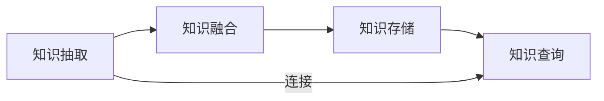
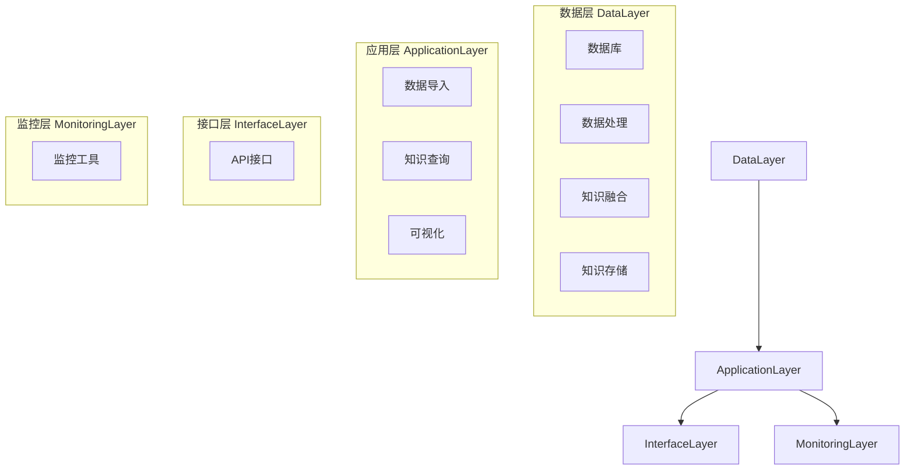
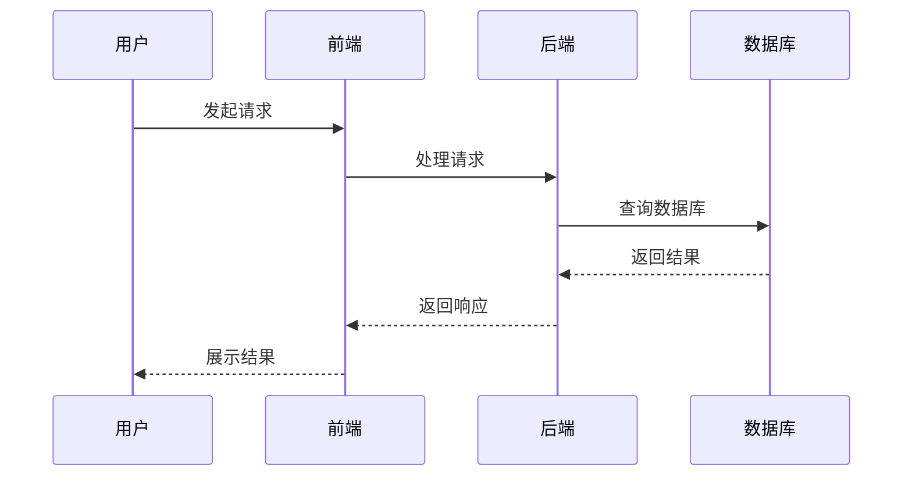

                 

### 科学研究的知识图谱构建：可视化世界知识的关联

在当今信息爆炸的时代，科学家和研究者面临着海量数据的挑战。如何有效地组织和分析这些数据，提取其中的知识和关联，已经成为科学研究中的一个重要课题。知识图谱构建作为一种新兴技术，提供了将知识结构化、可视化的手段，为科学研究提供了强有力的支持。

**关键词**：知识图谱、科学研究、数据可视化、结构化、关联分析

**摘要**：本文将探讨知识图谱构建在科学研究中的应用，通过详细阐述其核心概念、算法原理、构建步骤、应用场景及实践指南，帮助读者理解知识图谱如何将世界知识的关联可视化，提升科学研究效率和深度。

### 目录大纲

1. **背景介绍**
   - **第1章**：问题背景
     - 1.1.1 问题背景
     - 1.1.2 问题描述
     - 1.1.3 问题解决
     - 1.1.4 边界与外延
     - 1.1.5 概念结构与核心要素组成
   - **第2章**：核心概念与联系
     - 2.1.1 核心概念原理
     - 2.1.2 概念属性特征对比
     - 2.1.3 ER实体关系图架构

2. **算法原理讲解**
   - **第3章**：算法原理讲解
     - 3.1.1 算法mermaid流程图
     - 3.1.2 Python源代码与算法原理
     - 3.1.3 数学模型和数学公式
     - 3.1.4 举例说明

3. **知识图谱构建**
   - **第4章**：知识图谱构建基础
     - 4.1.1 知识图谱的基本概念
     - 4.1.2 知识图谱的表示方法
     - 4.1.3 知识图谱的构建步骤
   - **第5章**：知识抽取
     - 5.1.1 实体抽取
     - 5.1.2 关系抽取
     - 5.1.3 命名实体识别
   - **第6章**：知识融合与清洗
     - 6.1.1 知识融合原理
     - 6.1.2 知识清洗方法
     - 6.1.3 知识质量评估
   - **第7章**：知识存储与查询
     - 7.1.1 知识库构建
     - 7.1.2 查询优化
     - 7.1.3 查询算法

4. **可视化**
   - **第8章**：可视化
     - 8.1.1 可视化技术介绍
     - 8.1.2 知识图谱可视化工具
     - 8.1.3 可视化案例

5. **应用场景**
   - **第9章**：应用场景1——科学研究
     - 9.1.1 知识图谱在科学研究中的应用
     - 9.1.2 案例分析
   - **第10章**：应用场景2——商业分析
     - 10.1.1 知识图谱在商业分析中的应用
     - 10.1.2 案例分析
   - **第11章**：应用场景3——社会治理
     - 11.1.1 知识图谱在社会治理中的应用
     - 11.1.2 案例分析

6. **实践指南**
   - **第12章**：工具与环境搭建
     - 12.1.1 知识图谱工具介绍
     - 12.1.2 环境搭建步骤
   - **第13章**：系统架构设计
     - 13.1.1 系统功能设计
     - 13.1.2 系统架构设计
     - 13.1.3 系统接口设计
     - 13.1.4 系统交互设计
   - **第14章**：项目实战
     - 14.1.1 环境安装
     - 14.1.2 系统核心实现源代码
     - 14.1.3 代码应用解读与分析
     - 14.1.4 实际案例分析与详细讲解
     - 14.1.5 项目小结
   - **第15章**：最佳实践与注意事项
     - 15.1.1 最佳实践
     - 15.1.2 小结
     - 15.1.3 注意事项
     - 15.1.4 拓展阅读

### 背景介绍

#### 1.1.1 问题背景

科学研究的核心在于探索未知、揭示规律、创新理论。随着科学技术的迅猛发展，科研数据量呈现爆炸式增长。据统计，自20世纪中叶以来，科学文献的年产量已经超过了百万篇，且这一数字还在不断攀升。这些海量数据包含着丰富的知识和关联，但如何有效地组织和利用这些数据，成为了科研工作中的一个重要挑战。

传统的科研方法主要依赖于文献检索和手工分析，这种方式不仅费时费力，而且容易遗漏重要信息。特别是在跨学科研究中，不同领域的知识往往分散在不同的文献和数据源中，难以形成整体视图。因此，如何将这些零散的知识点连接起来，构建一个系统的知识网络，成为科学家们亟待解决的问题。

#### 1.1.2 问题描述

在科学研究过程中，研究人员面临以下几个主要问题：

1. **信息过载**：大量的科研文献和实验数据使得研究人员难以在短时间内进行有效筛选和利用。
2. **知识分散**：不同领域的知识分布在不同的数据库和文献中，难以实现跨领域的知识整合。
3. **分析困难**：复杂的科研数据结构和关系使得传统的数据分析方法难以胜任。
4. **知识更新滞后**：科研知识的更新速度非常快，如何及时更新和调整知识库是一个挑战。

这些问题的存在严重影响了科研工作的效率和成果，因此，需要一种新的技术手段来帮助研究人员更好地管理和利用科研数据。

#### 1.1.3 问题解决

知识图谱作为一种新兴技术，为解决上述问题提供了一种可行的解决方案。知识图谱通过将知识结构化、图形化，将各种知识点和关系进行关联，形成一个统一的知识网络。这种网络不仅可以直观地展示知识的关联，还可以通过算法分析挖掘出隐藏在数据中的潜在知识。

通过知识图谱，研究人员可以：

1. **快速定位信息**：利用图谱的链接关系，快速找到所需的知识点，提高文献检索效率。
2. **整合跨领域知识**：将不同领域、不同来源的知识点关联起来，实现跨领域的知识整合。
3. **深入分析数据**：利用图谱的复杂关系，进行更深入的数据分析和知识挖掘。
4. **及时更新知识库**：通过自动化更新机制，确保知识库的实时性和准确性。

#### 1.1.4 边界与外延

知识图谱构建并非万能，它也存在一定的局限性：

1. **数据质量**：知识图谱的质量依赖于数据源的质量，如果数据存在错误或不完整，图谱的准确性也会受到影响。
2. **计算资源**：构建大规模知识图谱需要大量的计算资源和存储空间，对硬件设施有较高要求。
3. **更新维护**：知识图谱需要定期更新和维护，以保持其时效性和准确性。

因此，在应用知识图谱时，需要结合实际情况进行评估和调整。

#### 1.1.5 概念结构与核心要素组成

知识图谱由三个核心要素组成：实体、属性和关系。

- **实体**：代表现实世界中的对象，如人、地点、事物等。在知识图谱中，实体是构建知识网络的基础。
- **属性**：描述实体的特征或属性，如人的年龄、地点的纬度等。属性为实体提供了更详细的信息。
- **关系**：描述实体之间的关联，如人与地点的关系（居住地）、人与人的关系（朋友）等。关系将实体连接起来，形成复杂的知识网络。

通过实体、属性和关系的组合，知识图谱可以构建一个全面、系统的知识体系，为科学研究提供强有力的支持。

### 核心概念与联系

#### 2.1.1 核心概念原理

知识图谱的核心概念包括实体、属性和关系。以下是这些核心概念的基本原理：

1. **实体**：实体是知识图谱中最基础的元素，代表现实世界中的对象。实体可以是具体的人、地点、事物，也可以是抽象的概念。实体的特点是具有唯一性和稳定性，即每个实体都对应一个独一无二的存在。

2. **属性**：属性是实体的特征或属性的描述，用于补充实体的信息。属性可以是数字、字符串、日期等不同类型的数据。属性的设置使得实体更加具体和详细，有助于更准确地描述和区分实体。

3. **关系**：关系描述实体之间的关联或联系。关系可以是直接的，如“居住地”关系将人和地点连接起来；也可以是间接的，如通过多个关系链实现实体之间的间接联系。关系为知识图谱提供了复杂性和灵活性，使得图谱能够表示各种复杂的关系网络。

#### 2.1.2 概念属性特征对比

以下是一个概念属性特征的对比表格，展示了实体、属性和关系的不同属性特征：

| 概念 | 特征 |
| ---- | ---- |
| 实体 | - 具有唯一性和稳定性<br>- 对应现实世界中的对象 |
| 属性 | - 描述实体的特征<br>- 数据类型多样（数字、字符串、日期等） |
| 关系 | - 描述实体之间的关联<br>- 可直接或间接 |
| **属性特征对比表格** | - 实体是基础，属性是对实体的补充<br>- 关系将实体连接起来 |

#### 2.1.3 ER实体关系图架构

ER实体关系图（Entity-Relationship Diagram）是知识图谱构建中的一个重要工具，用于表示实体之间的关系。以下是ER实体关系图的基本架构：

1. **实体**：在ER图中，实体通常用矩形表示，矩形内部写上实体的名称。例如，“人”实体可以用矩形表示。

2. **属性**：实体的属性用椭圆表示，并用线连接到对应的实体。例如，人的年龄、姓名等属性可以用椭圆表示，并与“人”实体连接。

3. **关系**：实体之间的关系用菱形表示，菱形用线连接到对应的实体。例如，“居住地”关系可以用菱形表示，将人和地点实体连接起来。

4. **关系属性**：关系的属性用椭圆表示，并用线连接到对应的菱形。例如，居住地的城市名称可以用椭圆表示，并与“居住地”关系连接。

以下是ER实体关系图的Mermaid流程图表示：

```mermaid
erDiagram
    A[Person] ||--|{ E[Address] } : "has"
    A{Person} ||--|{ C[Company] } : "works for"
    E{Address} ..|.. B[City]
    C{Company} ..|.. D[Industry]
```

通过ER实体关系图，可以清晰地展示知识图谱中的实体、属性和关系，有助于更好地理解知识图谱的结构和关联。

### 算法原理讲解

知识图谱的构建依赖于一系列算法，这些算法用于知识抽取、知识融合、知识存储和查询等步骤。在本章节中，我们将详细讲解知识图谱构建中的核心算法原理，并使用mermaid流程图和Python源代码进行说明。

#### 3.1.1 算法mermaid流程图

知识图谱构建的算法流程可以概括为以下几个主要步骤：

1. **知识抽取**：从原始数据中提取实体、属性和关系。
2. **知识融合**：将来自不同源的知识进行整合，消除冲突和冗余。
3. **知识存储**：将知识存储到数据库或图数据库中，便于查询和管理。
4. **知识查询**：利用查询算法，从知识库中检索相关知识和信息。

以下是知识图谱构建算法的mermaid流程图：



#### 3.1.2 Python源代码与算法原理

为了更好地理解知识图谱构建的算法原理，我们将展示一个简单的Python源代码示例。以下代码实现了知识抽取的基本功能，包括实体识别、属性提取和关系构建。

```python
# 实体识别
def identify_entities(text):
    entities = []
    # 使用正则表达式识别实体
    pattern = r'\b\w+\b'
    words = re.findall(pattern, text)
    for word in words:
        if is_entity(word):
            entities.append(word)
    return entities

# 属性提取
def extract_attributes(entity, text):
    attributes = []
    # 假设实体具有以下属性：姓名、年龄、性别
    attributes_patterns = {
        'name': r'姓名：\s*(\S+)',
        'age': r'年龄：\s*(\d+)',
        'gender': r'性别：\s*(\S+)',
    }
    for attr, pattern in attributes_patterns.items():
        match = re.search(pattern, text)
        if match:
            attributes.append({attr: match.group(1)})
    return attributes

# 关系构建
def build_relationships(entity, text):
    relationships = []
    # 假设实体具有以下关系：居住地、工作单位
    relationships_patterns = {
        'lives_in': r'居住地：\s*(\S+)',
        'works_for': r'工作单位：\s*(\S+)',
    }
    for rel, pattern in relationships_patterns.items():
        match = re.search(pattern, text)
        if match:
            relationships.append({rel: match.group(1)})
    return relationships

# 示例
text = "姓名：张三，年龄：30，性别：男，居住地：北京，工作单位：阿里巴巴"
entities = identify_entities(text)
attributes = extract_attributes(entities[0], text)
relationships = build_relationships(entities[0], text)

print("Entities:", entities)
print("Attributes:", attributes)
print("Relationships:", relationships)
```

上述代码中，我们定义了三个函数：`identify_entities`用于识别实体，`extract_attributes`用于提取实体的属性，`build_relationships`用于构建实体之间的关系。通过调用这些函数，我们可以从文本中提取出实体、属性和关系。

#### 3.1.3 数学模型和数学公式

知识图谱构建中的许多算法都涉及数学模型和数学公式。以下是一个简单的数学模型示例，用于描述知识图谱中的关系强度。

假设两个实体A和B之间存在关系R，关系强度可以通过以下公式计算：

$$
S_{R(A,B)} = \frac{1}{1 + e^{-\alpha \cdot d(A,B)}}
$$

其中，$S_{R(A,B)}$表示关系R的强度，$d(A,B)$表示实体A和B之间的距离（可以是欧几里得距离、曼哈顿距离等），$\alpha$是一个调节参数。

#### 3.1.4 举例说明

为了更好地理解知识图谱构建的算法原理，我们通过一个具体案例进行说明。

假设我们有一个关于科学家和他们的研究成果的文本数据，如下所示：

```
张三：年龄：45，性别：男，研究方向：人工智能，主要成果：深度学习、计算机视觉
李四：年龄：35，性别：女，研究方向：大数据分析，主要成果：数据挖掘、机器学习
王五：年龄：40，性别：男，研究方向：自然语言处理，主要成果：文本分类、对话系统
```

通过知识抽取算法，我们可以提取出以下实体、属性和关系：

- **实体**：张三、李四、王五
- **属性**：
  - 张三：年龄：45，性别：男，研究方向：人工智能
  - 李四：年龄：35，性别：女，研究方向：大数据分析
  - 王五：年龄：40，性别：男，研究方向：自然语言处理
- **关系**：张三与人工智能、李四与大数据分析、王五与自然语言处理

通过知识融合和存储，我们可以将这些实体、属性和关系构建成一个知识图谱，以便进行后续的分析和查询。

### 知识图谱构建基础

#### 4.1.1 知识图谱的基本概念

知识图谱（Knowledge Graph）是一种用于表示实体及其之间关系的图形结构，它将现实世界中的各种信息和知识以结构化的形式进行组织，使得计算机能够理解和处理这些信息。知识图谱的基本概念包括实体（Entity）、属性（Attribute）、关系（Relationship）和图谱（Graph）。

1. **实体**：实体是知识图谱中的基本元素，代表现实世界中的对象，可以是具体的人、地点、事物，也可以是抽象的概念。例如，人、地点、公司、产品等都是实体。

2. **属性**：属性用于描述实体的特征或属性，补充实体的信息。例如，人的年龄、公司的地址、产品的价格等都是属性。

3. **关系**：关系描述实体之间的关联，连接两个或多个实体。例如，人与地点的关系（居住地）、人与人的关系（朋友）等。

4. **图谱**：图谱是知识图谱的总体结构，由多个实体和关系组成。它将实体的属性和关系有机地组织起来，形成一个完整的知识网络。

#### 4.1.2 知识图谱的表示方法

知识图谱的表示方法主要有以下几种：

1. **图论表示法**：图论表示法将知识图谱看作一个图，其中节点表示实体，边表示实体之间的关系。这种表示方法直观、简单，但难以处理复杂的属性和关系。

2. **框架表示法**：框架表示法使用框架（Schema）来描述实体的属性和关系。框架包括实体类型、属性类型和关系类型，以及它们之间的约束关系。这种表示方法结构清晰、易于扩展，但难以表示复杂的实体关系。

3. **三元组表示法**：三元组表示法使用三元组（Subject, Predicate, Object）来表示实体之间的关系。其中，Subject表示主语，Predicate表示谓语，Object表示宾语。这种表示方法简洁、高效，适合大规模知识图谱的存储和处理。

4. **语义网络表示法**：语义网络表示法将知识图谱看作一个基于语义的网络，其中节点表示概念，边表示概念之间的关系。这种表示方法具有丰富的语义信息，但处理复杂关系时较为困难。

#### 4.1.3 知识图谱的构建步骤

知识图谱的构建通常包括以下几个主要步骤：

1. **数据收集**：收集相关的数据和知识源，包括文本数据、数据库、API等。

2. **数据预处理**：对收集到的数据进行清洗、去重、格式化等预处理操作，确保数据的质量和一致性。

3. **实体识别**：从预处理后的数据中识别出实体，并标注其实体类型。实体识别是知识图谱构建的关键步骤，直接影响到图谱的准确性和完整性。

4. **关系抽取**：从预处理后的数据中抽取实体之间的关系，并标注关系类型。关系抽取是构建知识图谱的核心，决定了图谱的复杂度和深度。

5. **属性抽取**：从预处理后的数据中抽取实体的属性，并标注属性类型。属性抽取为实体提供了更详细的信息，有助于丰富知识图谱的内容。

6. **知识融合**：将来自不同源的知识进行整合，消除冲突和冗余。知识融合是提高知识图谱质量的重要步骤，可以确保图谱的统一性和一致性。

7. **知识存储**：将构建好的知识图谱存储到数据库或图数据库中，便于查询和管理。知识存储是知识图谱应用的前提，决定了图谱的可访问性和可用性。

8. **知识查询**：利用查询算法，从知识库中检索相关知识和信息。知识查询是知识图谱的实际应用，为用户提供了一种便捷的知识获取方式。

通过以上步骤，可以构建一个高质量的知识图谱，为科学研究、商业分析、社会治理等领域提供强有力的支持。

### 知识抽取

#### 5.1.1 实体抽取

实体抽取是知识图谱构建中的关键步骤之一，其目的是从非结构化文本中识别出实体，并标注其实体类型。实体抽取通常包括以下步骤：

1. **文本预处理**：对输入的文本进行清洗、分词、词性标注等预处理操作，以便更好地识别实体。

2. **实体识别算法**：使用实体识别算法，如命名实体识别（NER）算法，从预处理后的文本中识别出实体。常见的NER算法包括基于规则的方法、基于统计的方法和基于深度学习的方法。

3. **实体类型标注**：对识别出的实体进行类型标注，即将实体归类到不同的实体类别中。实体类型标注有助于更好地理解和利用实体信息。

4. **实体关系构建**：基于识别出的实体和实体类型，构建实体之间的关系。实体关系可以是直接的，也可以是间接的，通过关系链实现实体之间的连接。

#### 5.1.2 关系抽取

关系抽取是知识图谱构建中的另一个关键步骤，其目的是从非结构化文本中识别出实体之间的关系，并标注关系类型。关系抽取通常包括以下步骤：

1. **文本预处理**：对输入的文本进行清洗、分词、词性标注等预处理操作，以便更好地识别关系。

2. **关系识别算法**：使用关系识别算法，从预处理后的文本中识别出关系。常见的关系识别算法包括基于规则的方法、基于统计的方法和基于深度学习的方法。

3. **关系类型标注**：对识别出的关系进行类型标注，即将关系归类到不同的关系类别中。关系类型标注有助于更好地理解和利用关系信息。

4. **关系链构建**：基于识别出的关系和关系类型，构建实体之间的关系链。关系链可以表示实体之间的复杂关系，有助于提高知识图谱的深度和复杂性。

#### 5.1.3 命名实体识别

命名实体识别（Named Entity Recognition，NER）是自然语言处理中的一个重要任务，其目的是从文本中识别出具有特定意义的实体，并对其进行分类。命名实体识别在知识图谱构建中具有重要作用，是实体抽取和关系抽取的基础。

命名实体识别的一般流程包括：

1. **数据集准备**：准备含有命名实体的文本数据集，用于训练和测试命名实体识别模型。

2. **特征工程**：对文本数据集进行特征工程，提取有助于命名实体识别的特征，如词性、词频、语法结构等。

3. **模型训练**：使用训练数据集训练命名实体识别模型，常见的模型包括条件随机场（CRF）、支持向量机（SVM）、卷积神经网络（CNN）等。

4. **模型评估**：使用测试数据集对训练好的模型进行评估，评估指标包括准确率、召回率、F1值等。

5. **实体识别**：使用训练好的模型对新的文本数据进行分析，识别出命名实体，并标注其实体类型。

通过命名实体识别，可以有效地从文本中抽取实体，为知识图谱构建提供基础数据。

### 知识融合与清洗

#### 6.1.1 知识融合原理

知识融合（Knowledge Fusion）是指将来自不同源的知识进行整合，消除冲突和冗余，以构建一个统一、一致的知识体系。知识融合在知识图谱构建中起着至关重要的作用，它能够提高知识图谱的准确性和完整性。

知识融合的基本原理包括以下几个方面：

1. **冲突消解**：知识融合过程中，不同源的知识可能存在冲突，如同一实体在不同源中的属性值不一致。冲突消解的目的是通过一定的规则或算法，消除这些冲突，确保知识的一致性。

2. **冗余消除**：知识融合过程中，不同源的知识可能存在冗余信息，如多个源中包含相同或类似的信息。冗余消除的目的是通过去重或合并操作，减少冗余信息，提高知识图谱的效率和性能。

3. **一致性维护**：知识融合过程中，需要确保知识的一致性，即不同源的知识在语义上保持一致。一致性维护的目的是通过一致性检查和修复操作，确保知识图谱的准确性和一致性。

4. **知识整合**：知识融合的最终目的是将不同源的知识整合成一个统一的知识体系。知识整合的目的是通过统一的表示方法，将分散的知识点连接起来，形成完整的知识网络。

#### 6.1.2 知识清洗方法

知识清洗（Knowledge Cleaning）是指对知识图谱中的数据进行清洗、去噪和修复，以提高知识的质量和可靠性。知识清洗是知识图谱构建中不可或缺的步骤，它能够提高知识图谱的准确性和可用性。

知识清洗的方法主要包括以下几个方面：

1. **数据去重**：通过比较实体、属性和关系的值，识别并删除重复的数据条目，以消除数据冗余。

2. **错误修复**：通过分析数据的一致性和完整性，识别并修复错误的数据条目，如不合法的属性值、缺失的属性值等。

3. **噪声过滤**：通过数据预处理技术，如正则表达式、过滤规则等，识别并删除噪声数据，如无关的文本、无效的属性值等。

4. **数据标准化**：将不同源的数据进行统一格式化，如统一命名规范、统一数据类型等，以提高数据的一致性和可比较性。

5. **数据验证**：通过一致性检查和完整性检查，验证数据的准确性和可靠性，确保知识图谱的质量。

#### 6.1.3 知识质量评估

知识质量评估（Knowledge Quality Assessment）是指对知识图谱中的知识进行评估和评分，以衡量其准确性和可靠性。知识质量评估是知识图谱构建和优化的重要环节，它能够帮助用户了解知识图谱的质量，并指导后续的改进工作。

知识质量评估的方法主要包括以下几个方面：

1. **准确性评估**：通过比较知识图谱中的数据与实际事实，评估知识的准确性。准确性评估通常使用真实世界的数据作为基准，对知识图谱中的实体、属性和关系进行验证。

2. **完整性评估**：通过分析知识图谱中的实体、属性和关系是否完整，评估知识的完整性。完整性评估可以识别出缺失的实体、属性和关系，指导进一步的补充和扩展。

3. **一致性评估**：通过分析知识图谱中的数据是否一致，评估知识的一致性。一致性评估可以识别出冲突和冗余的数据，指导进一步的冲突消解和冗余消除。

4. **可靠性评估**：通过分析知识图谱的来源、创建者、创建时间等，评估知识的可靠性。可靠性评估可以帮助用户了解知识的来源和创建背景，提高对知识的信任度。

通过知识质量评估，可以全面了解知识图谱的质量，为知识图谱的优化和改进提供依据。

### 知识存储与查询

#### 7.1.1 知识库构建

知识库（Knowledge Base）是知识图谱的核心组成部分，用于存储和管理知识图谱中的实体、属性和关系。知识库构建是知识图谱应用的关键步骤，它直接影响到知识图谱的性能和可扩展性。

知识库的构建主要包括以下方面：

1. **数据源选择**：根据应用需求，选择合适的数据源，如文本、数据库、API等。数据源的选择决定了知识库的数据质量和多样性。

2. **数据预处理**：对收集到的数据进行清洗、去重、格式化等预处理操作，确保数据的一致性和完整性。数据预处理是知识库构建的基础，直接影响知识库的质量。

3. **实体和关系抽取**：使用实体识别和关系抽取算法，从预处理后的数据中提取实体和关系，并标注实体类型和关系类型。实体和关系抽取是知识库构建的核心，决定了知识库的内容和结构。

4. **知识融合**：将来自不同源的知识进行融合，消除冲突和冗余，构建一个统一、一致的知识库。知识融合是提高知识库质量的重要步骤，可以确保知识库的完整性和一致性。

5. **存储结构设计**：设计合适的存储结构，如关系数据库、图数据库等，将知识库中的实体、属性和关系存储到数据库中。存储结构的设计决定了知识库的性能和可扩展性。

6. **知识库维护**：定期对知识库进行更新和维护，确保知识库的时效性和准确性。知识库维护是知识库构建的重要环节，可以确保知识库的持续发展和完善。

#### 7.1.2 查询优化

查询优化（Query Optimization）是提高知识库查询效率和性能的重要手段。在知识库中，查询操作频繁发生，查询优化可以显著提高查询速度，降低查询成本。

查询优化的主要方法包括：

1. **索引优化**：为知识库中的实体、属性和关系创建合适的索引，提高查询的检索速度。索引优化是查询优化的基础，可以有效减少查询时间。

2. **查询计划优化**：分析查询语句，生成最优的查询计划，优化查询执行顺序和策略。查询计划优化可以显著提高查询性能，降低查询资源消耗。

3. **缓存技术**：使用缓存技术，将频繁查询的结果缓存起来，减少重复查询的开销。缓存技术可以显著提高查询响应速度，降低查询负载。

4. **并行查询**：利用并行计算技术，将查询任务分解成多个子任务，并行执行，提高查询效率。并行查询适用于大规模知识库，可以显著提高查询性能。

5. **分库分表**：将知识库分解成多个独立的数据库或表，分散查询负载，提高查询性能。分库分表适用于高并发场景，可以有效降低数据库压力。

6. **查询优化策略**：根据应用场景和查询需求，制定合适的查询优化策略，如预处理、查询合并、查询分解等。查询优化策略可以灵活调整，适应不同查询场景，提高查询性能。

#### 7.1.3 查询算法

查询算法（Query Algorithm）是实现知识库查询的核心技术，用于从知识库中检索相关的实体、属性和关系。查询算法的效率直接影响知识库的性能和用户体验。

常见的查询算法包括：

1. **图遍历算法**：基于图遍历技术，如深度优先搜索（DFS）和广度优先搜索（BFS），从知识库中检索与特定实体相关的实体和关系。图遍历算法适用于复杂的关系网络，可以高效地检索出相关实体。

2. **索引查找算法**：基于索引结构，如B树、哈希表等，快速定位知识库中的实体和关系。索引查找算法适用于简单的查询场景，可以显著提高查询速度。

3. **文本匹配算法**：基于文本匹配技术，如模糊匹配、精确匹配等，从知识库中检索与查询文本相关的实体和关系。文本匹配算法适用于文本查询场景，可以灵活地处理不同的查询需求。

4. **关联规则挖掘算法**：基于关联规则挖掘技术，从知识库中挖掘出相关的实体和关系。关联规则挖掘算法适用于复杂的关系网络，可以挖掘出潜在的关联关系。

5. **机器学习算法**：基于机器学习技术，如分类、聚类、回归等，从知识库中预测实体和关系的属性和类型。机器学习算法适用于大规模知识库，可以提高查询的准确性和效率。

通过使用合适的查询算法，可以高效地从知识库中检索出相关的知识和信息，满足用户的查询需求。

### 可视化

#### 8.1.1 可视化技术介绍

知识图谱的可视化是将其结构和内容以图形化的方式展示出来，使得用户能够直观地理解和分析知识图谱。可视化技术通过图形、颜色、标签等手段，将抽象的知识以直观的形式呈现，提高数据的可读性和易理解性。

知识图谱可视化的主要技术包括：

1. **图形渲染**：使用图形渲染技术，将知识图谱中的实体和关系以图形的形式展示。常见的图形渲染技术包括SVG、Canvas等。

2. **布局算法**：布局算法用于确定知识图谱中实体和关系的空间位置，以便更好地展示图谱的结构。常见的布局算法包括力导向布局、层次布局等。

3. **交互技术**：交互技术用于实现用户与知识图谱的互动，如点击、拖拽、滚动等。交互技术可以提高用户的参与度和体验。

4. **颜色和样式**：通过颜色和样式的选择，可以区分不同实体和关系，增强知识图谱的可读性。常见的颜色和样式包括线条颜色、节点形状、标签字体等。

5. **动画效果**：动画效果可以用于展示知识图谱的变化过程，如节点的加入、关系的建立等。动画效果可以增强用户的理解和记忆。

#### 8.1.2 知识图谱可视化工具

知识图谱可视化工具是实现知识图谱可视化的重要工具，可以帮助用户快速、方便地构建和展示知识图谱。常见的知识图谱可视化工具包括：

1. **D3.js**：D3.js是一个基于JavaScript的图形可视化库，可以用于构建复杂的知识图谱可视化应用。D3.js提供了丰富的图形渲染和交互功能，支持多种布局算法和动画效果。

2. **Mermaid**：Mermaid是一个基于Markdown的图形描述语言，可以用于绘制知识图谱。Mermaid生成的图形可以嵌入到Markdown文档中，方便用户编写和展示知识图谱。

3. **Gephi**：Gephi是一个开源的知识图谱可视化工具，可以用于构建和可视化大规模知识图谱。Gephi提供了丰富的布局算法和交互功能，支持多种图形渲染和导出格式。

4. **ECharts**：ECharts是一个基于JavaScript的图表可视化库，可以用于绘制知识图谱。ECharts提供了丰富的图形渲染和交互功能，支持多种布局算法和动画效果。

5. **Vega**：Vega是一个基于JSON的图形描述语言，可以用于构建知识图谱可视化应用。Vega与D3.js类似，提供了丰富的图形渲染和交互功能，支持多种布局算法和动画效果。

通过使用这些知识图谱可视化工具，用户可以轻松地构建和展示知识图谱，提高数据理解和分析效率。

#### 8.1.3 可视化案例

为了更好地理解知识图谱可视化的应用，以下是一个简单的知识图谱可视化案例。

假设我们有一个关于科学研究的知识图谱，包括实体（如科学家、研究成果、研究机构）和关系（如合作研究、发表论文等）。以下是一个使用D3.js绘制的可视化示例：

```javascript
// 创建SVG元素
const width = 960;
const height = 500;
const svg = d3.select("body").append("svg")
    .attr("width", width)
    .attr("height", height);

// 创建力导向布局
const force = d3.forceSimulation()
    .force("link", d3.forceLink().id(d => d.id))
    .force("charge", d3.forceManyBody())
    .force("center", d3.forceCenter(width / 2, height / 2));

// 数据
const nodes = [
  { id: "张三", type: "科学家" },
  { id: "李四", type: "科学家" },
  { id: "王五", type: "科学家" },
  { id: "合作研究", type: "关系" },
  { id: "发表论文", type: "关系" }
];

const links = [
  { source: "张三", target: "合作研究", type: "合作研究" },
  { source: "李四", target: "合作研究", type: "合作研究" },
  { source: "王五", target: "合作研究", type: "合作研究" },
  { source: "合作研究", target: "发表论文", type: "发表论文" }
];

// 绘制节点和关系
const node = svg.selectAll(".node")
    .data(nodes)
  .enter().append("circle")
    .attr("class", "node")
    .attr("r", 10)
    .attr("fill", d => d.type === "科学家" ? "blue" : "red");

const link = svg.selectAll(".link")
    .data(links)
  .enter().append("line")
    .attr("class", "link");

// 应用力导向布局
force.nodes(nodes)
  .on("tick", () => {
    node.attr("cx", d => d.x)
        .attr("cy", d => d.y);
    link.attr("x1", d => d.source.x)
        .attr("y1", d => d.source.y)
        .attr("x2", d => d.target.x)
        .attr("y2", d => d.target.y);
  });
```

上述示例使用D3.js创建了一个简单的知识图谱可视化，包括三个科学家节点和一个关系节点。节点用圆形表示，关系用线条表示。通过力导向布局，节点和关系自动排列，形成直观的可视化效果。

### 应用场景

#### 9.1.1 知识图谱在科学研究中的应用

知识图谱在科学研究中的应用已经取得了显著的成果，为科学家提供了强有力的工具，提升了科研效率和成果质量。以下是一些知识图谱在科学研究中的应用场景：

1. **文献检索和推荐**：知识图谱可以整合海量的科研文献，构建一个庞大的知识网络。通过图谱的链接关系，科学家可以快速定位相关文献，提高文献检索效率。同时，知识图谱还可以基于相似性分析，为科学家推荐相关文献，帮助他们发现新的研究方向。

2. **跨学科研究**：知识图谱将不同学科的知识点关联起来，打破了学科界限。科学家可以通过知识图谱，发现跨学科的研究点，促进跨学科的合作和研究，推动科学领域的创新和发展。

3. **知识共享和协作**：知识图谱提供了一个统一的知识体系，使得科学家可以更方便地共享和协作。科学家可以通过图谱，查找相关的知识点和研究成果，与其他科学家进行交流和合作，共同推进科学研究。

4. **科研项目管理**：知识图谱可以用于科研项目的管理和监控。通过图谱，科学家可以清晰地了解项目的进展、资源分配和风险点，提高项目的管理效率和质量。

5. **科学发现和预测**：知识图谱中的丰富知识信息和关联关系，为科学发现和预测提供了有力支持。科学家可以通过知识图谱，发现新的研究点、验证假设和预测科学趋势，推动科学的发展。

#### 9.1.2 案例分析

以下是一个关于知识图谱在科学研究中应用的案例分析：

**案例背景**：某国际著名研究团队致力于探索癌症治疗的新方法。他们通过知识图谱，整合了大量关于癌症、基因、药物等方面的知识，构建了一个庞大的癌症知识图谱。

**应用过程**：

1. **数据收集**：研究团队收集了海量的癌症相关文献、基因数据库、药物数据库等，作为知识图谱的数据源。

2. **知识抽取**：通过文本挖掘和知识抽取技术，从数据源中提取实体（如癌症类型、基因、药物等）和关系（如基因-药物相互作用、基因-疾病关联等）。

3. **知识融合**：研究团队将来自不同源的知识进行融合，消除冲突和冗余，构建了一个统一、一致的癌症知识图谱。

4. **知识可视化**：通过知识图谱可视化工具，研究团队将图谱以图形化的方式展示，便于理解和分析。

5. **知识应用**：

   - **文献检索和推荐**：研究团队通过知识图谱，快速检索到与癌症研究相关的文献，提高文献检索效率。同时，知识图谱基于相似性分析，为研究团队推荐了相关文献，帮助他们发现新的研究方向。
   
   - **跨学科研究**：知识图谱将癌症、基因、药物等不同学科的知识点关联起来，研究团队可以通过图谱，发现跨学科的研究点，促进跨学科的合作和研究。
   
   - **知识共享和协作**：研究团队通过知识图谱，与其他科学家进行交流和合作，共享研究成果，共同推进癌症研究。

6. **科学发现和预测**：通过知识图谱中的丰富知识信息和关联关系，研究团队发现了一些潜在的癌症治疗新方法，进行了实验验证，取得了重要成果。

通过上述案例，我们可以看到知识图谱在科学研究中的应用价值。它不仅提高了科研效率，还推动了科学领域的创新和发展。

### 应用场景2——商业分析

#### 10.1.1 知识图谱在商业分析中的应用

知识图谱在商业分析领域具有广泛的应用潜力，通过将商业知识结构化、图形化，帮助企业更好地理解市场、优化业务流程和做出决策。以下是知识图谱在商业分析中的几个主要应用场景：

1. **客户关系管理**：知识图谱可以将客户信息、交易记录、社交媒体活动等数据关联起来，形成一个完整的客户画像。通过图谱分析，企业可以更好地了解客户需求和行为，优化客户关系管理策略。

2. **市场分析**：知识图谱可以整合市场数据、竞争情报和用户反馈等，构建市场知识图谱。企业可以通过图谱分析市场趋势、竞争对手动态和潜在市场机会，为市场决策提供有力支持。

3. **供应链优化**：知识图谱可以整合供应链中的各种信息，如供应商、产品、物流等，形成供应链知识图谱。企业可以通过图谱分析优化供应链流程，提高供应链效率。

4. **业务流程优化**：知识图谱可以梳理企业内部业务流程，将各个环节的数据和关系关联起来。通过图谱分析，企业可以发现业务流程中的瓶颈和优化点，提高业务流程效率。

5. **风险管理和合规**：知识图谱可以帮助企业识别和管理风险，通过关联分析发现潜在风险点和合规性问题。企业可以基于图谱制定风险管理和合规策略，提高业务稳健性。

#### 10.1.2 案例分析

以下是一个关于知识图谱在商业分析中应用的案例分析：

**案例背景**：某大型零售企业在市场竞争中面临着销售下降、库存积压等问题。为了找到问题根源和优化业务，该企业决定利用知识图谱进行商业分析。

**应用过程**：

1. **数据收集**：企业收集了客户购买记录、库存数据、竞争对手信息等，作为知识图谱的数据源。

2. **知识抽取**：通过数据挖掘和知识抽取技术，从数据源中提取实体（如客户、产品、订单等）和关系（如客户购买行为、产品关联等）。

3. **知识融合**：企业将来自不同源的知识进行融合，消除冲突和冗余，构建了一个统一、一致的商业知识图谱。

4. **知识可视化**：通过知识图谱可视化工具，企业将图谱以图形化的方式展示，便于理解和分析。

5. **知识应用**：

   - **客户关系管理**：通过知识图谱，企业可以详细了解客户购买行为和偏好，识别出重要客户和潜在客户。企业可以根据图谱分析结果，制定个性化的客户关系管理策略，提高客户满意度和忠诚度。
   
   - **市场分析**：知识图谱整合了市场数据、竞争对手信息和用户反馈，企业可以通过图谱分析市场趋势和竞争对手动态，发现市场机会和挑战。企业可以根据图谱分析结果，调整市场策略，提高市场竞争力。
   
   - **供应链优化**：知识图谱将供应链中的各种信息关联起来，企业可以通过图谱分析供应链流程中的瓶颈和优化点。企业根据图谱分析结果，优化供应链流程，提高供应链效率，降低成本。
   
   - **业务流程优化**：知识图谱梳理了企业内部业务流程，企业可以通过图谱分析发现业务流程中的瓶颈和优化点。企业根据图谱分析结果，调整业务流程，提高业务流程效率。

通过上述案例，我们可以看到知识图谱在商业分析中的应用价值。它不仅帮助企业更好地理解市场和客户，还优化了业务流程，提高了业务效率和竞争力。

### 应用场景3——社会治理

#### 11.1.1 知识图谱在社会治理中的应用

知识图谱在社会治理领域发挥着越来越重要的作用，通过将社会治理中的各种信息和知识结构化、图形化，为政府和社会组织提供了强有力的决策支持。以下是知识图谱在社会治理中的几个主要应用场景：

1. **公共安全监控**：知识图谱可以整合公安、交通、医疗等领域的数据，构建公共安全知识图谱。通过图谱分析，政府可以实时监控社会安全态势，及时发现和应对潜在风险。

2. **环境监测**：知识图谱可以整合气象、水质、空气质量等数据，构建环境监测知识图谱。通过图谱分析，政府可以实时监控环境状况，及时采取环保措施。

3. **城市规划**：知识图谱可以整合土地资源、交通网络、公共服务等数据，构建城市规划知识图谱。通过图谱分析，政府可以优化城市规划，提高城市运行效率。

4. **应急管理**：知识图谱可以整合自然灾害、事故救援、医疗资源等数据，构建应急知识图谱。通过图谱分析，政府可以快速响应突发事件，提高应急处理效率。

5. **公共资源管理**：知识图谱可以整合财政、税收、社会保障等数据，构建公共资源管理知识图谱。通过图谱分析，政府可以优化公共资源配置，提高公共服务质量。

#### 11.1.2 案例分析

以下是一个关于知识图谱在社会治理中应用的案例分析：

**案例背景**：某城市政府为了提高城市管理效率和公共服务质量，决定利用知识图谱进行社会治理。

**应用过程**：

1. **数据收集**：政府收集了交通流量、空气质量、医疗资源、公共服务等数据，作为知识图谱的数据源。

2. **知识抽取**：通过数据挖掘和知识抽取技术，从数据源中提取实体（如交通节点、空气质量指标、医疗机构等）和关系（如交通流量关联、空气质量变化趋势、医疗资源分布等）。

3. **知识融合**：政府将来自不同源的知识进行融合，消除冲突和冗余，构建了一个统一、一致的公共管理知识图谱。

4. **知识可视化**：通过知识图谱可视化工具，政府将图谱以图形化的方式展示，便于理解和分析。

5. **知识应用**：

   - **公共安全监控**：知识图谱整合了交通、气象、医疗等数据，政府可以实时监控公共安全态势，及时发现和应对潜在风险。例如，通过交通流量数据，政府可以预测交通拥堵情况，提前采取措施疏导交通。
   
   - **环境监测**：知识图谱整合了空气质量、水质等数据，政府可以实时监控环境状况，及时采取环保措施。例如，通过空气质量数据，政府可以监控空气污染情况，及时调整环保策略，减少污染排放。
   
   - **城市规划**：知识图谱整合了土地资源、交通网络、公共服务等数据，政府可以优化城市规划，提高城市运行效率。例如，通过交通流量数据，政府可以优化交通网络布局，提高交通流通效率。
   
   - **应急管理**：知识图谱整合了自然灾害、事故救援、医疗资源等数据，政府可以快速响应突发事件，提高应急处理效率。例如，在突发事件中，政府可以通过图谱快速查询附近医疗机构、救援队伍等资源，及时调配。
   
   - **公共资源管理**：知识图谱整合了财政、税收、社会保障等数据，政府可以优化公共资源配置，提高公共服务质量。例如，通过医疗资源数据，政府可以合理分配医疗资源，提高医疗服务水平。

通过上述案例，我们可以看到知识图谱在社会治理中的应用价值。它不仅提高了政府的管理效率和决策能力，还为公众提供了更好的服务和体验。

### 实践指南

#### 12.1.1 知识图谱工具介绍

在构建知识图谱的过程中，选择合适的工具至关重要。以下是一些常用的知识图谱工具及其特点：

1. **Neo4j**：Neo4j是一款高性能的图数据库，支持ACID事务和图遍历操作。它提供了丰富的图形查询语言Cypher，方便进行复杂图分析和查询。Neo4j适用于大规模知识图谱的存储和查询，特别适合需要实时分析的场景。

2. **Apache Atlas**：Apache Atlas是一个开源的数据治理和元数据管理平台，支持对知识图谱的元数据管理和生命周期管理。它提供了RESTful API和集成工具，方便与其他系统进行集成。

3. **OpenKE**：OpenKE（Open Knowledge Graph Embedding）是一个开源的知识图谱嵌入工具，支持基于图神经网络的知识图谱表示学习。它提供了Python库和TensorFlow/Keras接口，方便用户进行知识图谱嵌入和模型训练。

4. **Neo4j Ocelot**：Neo4j Ocelot是一个基于Neo4j的知识图谱可视化工具，提供了丰富的图形化界面和交互功能。它支持多种布局算法和样式设置，方便用户进行知识图谱的可视化和分析。

5. **Google Knowledge Graph**：Google Knowledge Graph是Google开发的基于知识图谱的搜索引擎，用于整合和展示用户查询的相关知识。它提供了一个开放API，开发者可以使用该API构建自己的知识图谱应用。

#### 12.1.2 环境搭建步骤

以下是在Ubuntu 18.04上搭建Neo4j知识图谱环境的具体步骤：

1. **安装Java环境**：
   ```bash
   sudo apt-get update
   sudo apt-get install openjdk-8-jdk
   java -version
   ```

2. **下载Neo4j**：
   ```bash
   wget https://download.neo4j.com/downloads/neo4j-community-3.5.1-unix.tar.gz
   tar zxvf neo4j-community-3.5.1-unix.tar.gz
   ```

3. **配置Neo4j**：
   ```bash
   cd neo4j/
   ./bin/neo4j start
   ```
   
4. **访问Neo4j管理界面**：
   ```bash
   open http://localhost:7474
   ```

5. **创建知识图谱**：
   - 在Neo4j管理界面中，选择“Desktop”选项卡，然后选择“Cypher Editor”。
   - 输入以下Cypher语句创建一个简单的知识图谱：
     ```cypher
     CREATE (a:Person {name: '张三', age: 30}),
           (b:Person {name: '李四', age: 35}),
           (c:Person {name: '王五', age: 40}),
           (a)-[:KNOWS]->(b),
           (b)-[:KNOWS]->(c);
     ```

6. **查询知识图谱**：
   - 在Cypher Editor中输入以下查询语句，查询知识图谱中的实体和关系：
     ```cypher
     MATCH (p:Person)
     RETURN p.name, p.age;
     ```

通过上述步骤，我们成功地搭建了Neo4j知识图谱环境，并创建了一个简单的知识图谱。用户可以根据实际需求，进一步扩展和优化知识图谱。

### 系统架构设计

#### 13.1.1 系统功能设计

在构建知识图谱系统时，首先需要明确系统的功能需求。以下是知识图谱系统的核心功能设计：

1. **数据导入**：系统需要支持从多种数据源（如文本文件、数据库、API等）导入数据，包括实体、属性和关系。

2. **数据清洗**：系统需要具备数据清洗功能，对导入的数据进行去重、格式化、去噪等预处理操作，确保数据质量。

3. **实体识别**：系统需要具备命名实体识别（NER）功能，从文本数据中自动识别出实体，并标注实体类型。

4. **关系抽取**：系统需要具备关系抽取功能，从文本数据中提取出实体之间的关系，并标注关系类型。

5. **知识融合**：系统需要具备知识融合功能，将来自不同数据源的知识进行整合，消除冲突和冗余，构建一个统一的知识库。

6. **知识存储**：系统需要支持将知识存储到图数据库或关系数据库中，便于查询和管理。

7. **知识查询**：系统需要提供高效的知识查询功能，支持基于实体、属性和关系的多维度查询。

8. **可视化**：系统需要提供知识图谱的可视化功能，以图形化的方式展示知识图谱的结构和内容。

9. **用户交互**：系统需要支持用户通过界面与知识图谱进行交互，如添加、删除、编辑实体和关系等。

10. **系统监控**：系统需要具备监控功能，实时监控系统运行状态，如资源使用情况、错误日志等。

#### 13.1.2 系统架构设计

知识图谱系统的架构设计需要考虑系统的可扩展性、稳定性和高性能。以下是知识图谱系统的典型架构设计：

1. **数据层**：数据层负责数据的存储和管理，包括文本数据、实体、属性和关系。数据层可以选择关系数据库（如MySQL、PostgreSQL）或图数据库（如Neo4j、JanusGraph）。

2. **处理层**：处理层负责数据清洗、实体识别、关系抽取和知识融合等处理任务。处理层可以使用Python、Java等编程语言，结合NLP库（如NLTK、spaCy）和机器学习框架（如TensorFlow、PyTorch）实现。

3. **应用层**：应用层负责实现知识图谱系统的功能模块，如数据导入、知识存储、知识查询和可视化等。应用层可以使用Web框架（如Django、Spring）和前端框架（如React、Vue.js）实现。

4. **接口层**：接口层负责提供系统的API接口，供其他系统或应用程序调用。接口层可以使用RESTful API或GraphQL等协议。

5. **监控层**：监控层负责监控系统运行状态，如资源使用情况、错误日志等。监控层可以使用Prometheus、Grafana等工具实现。

6. **存储层**：存储层用于存储系统的配置文件、日志文件和临时数据等。存储层可以选择分布式文件系统（如HDFS、Ceph）或NoSQL数据库（如MongoDB、Cassandra）。

以下是知识图谱系统的Mermaid类图和架构图：

```mermaid
classDiagram
    DataLayer <<Interface>> Database
    DataLayer ..|> DataProcessing
    DataLayer ..|> KnowledgeFusion
    DataLayer ..|> KnowledgeStorage
    ApplicationLayer <<Interface>> API
    ApplicationLayer ..|> DataImport
    ApplicationLayer ..|> Visualization
    InterfaceLayer <<Interface>> APIEndpoint
    MonitoringLayer <<Interface>> MonitoringTool

    DataLayer --> ApplicationLayer
    ApplicationLayer --> InterfaceLayer
    ApplicationLayer --> MonitoringLayer
```



通过上述架构设计，知识图谱系统实现了数据的存储、处理、查询和可视化等功能，同时具备良好的扩展性和稳定性。

### 系统接口设计

在知识图谱系统中，接口设计是至关重要的，它负责提供系统的外部访问入口，并确保数据交互的规范和高效。以下是知识图谱系统接口设计的详细说明：

#### 13.1.3 系统接口设计

1. **接口规范**：

   知识图谱系统的接口规范主要包括API的URL、请求参数、响应数据结构等。以下是几个核心接口的规范示例：

   - **数据导入接口**：
     - **URL**：`POST /api/import`
     - **请求参数**：`file`（文件对象，用于上传数据文件）
     - **响应数据**：
       ```json
       {
         "status": "success",
         "message": "数据导入成功",
         "data": {
           "file_name": "imported_data.csv",
           "rows_imported": 1000
         }
       }
       ```

   - **知识查询接口**：
     - **URL**：`GET /api/search`
     - **请求参数**：`q`（查询关键字）、`type`（查询类型，如实体、关系等）
     - **响应数据**：
       ```json
       {
         "status": "success",
         "message": "查询成功",
         "results": [
           {
             "type": "entity",
             "label": "Person",
             "properties": {
               "name": "张三",
               "age": 30
             }
           },
           {
             "type": "relationship",
             "label": "KNOWS",
             "properties": {
               "subject": "张三",
               "object": "李四"
             }
           }
         ]
       }
       ```

   - **知识更新接口**：
     - **URL**：`POST /api/update`
     - **请求参数**：`data`（更新的知识数据，JSON格式）
     - **响应数据**：
       ```json
       {
         "status": "success",
         "message": "数据更新成功",
         "data": {
           "updated_entities": 2,
           "updated_relationships": 1
         }
       }
       ```

2. **接口实现**：

   接口的实现通常采用RESTful架构风格，使用HTTP协议进行数据传输。以下是一个基于Django框架的接口实现示例：

   - **数据导入接口实现**：

     ```python
     from django.http import JsonResponse
     from .models import KnowledgeData
     from rest_framework.parsers import MultiPartParser

     def import_data(request):
         if request.method == 'POST':
             parser = MultiPartParser()
             file = parser.parse(request)
             # 处理上传的文件
             # ...
             return JsonResponse({'status': 'success', 'message': '数据导入成功', 'data': {}})
         return JsonResponse({'status': 'error', 'message': '请求方法错误'})
     ```

   - **知识查询接口实现**：

     ```python
     from django.http import JsonResponse
     from .models import KnowledgeData
     from rest_framework import status

     def search_knowledge(request):
         query = request.GET.get('q', '')
         type = request.GET.get('type', 'entity')
         # 执行查询操作
         # ...
         results = get_search_results(query, type)
         return JsonResponse({'status': 'success', 'message': '查询成功', 'results': results}, status=status.HTTP_200_OK)
     ```

   - **知识更新接口实现**：

     ```python
     from django.http import JsonResponse
     from .models import KnowledgeData
     from rest_framework import status

     def update_knowledge(request):
         data = request.POST.get('data', {})
         # 更新知识数据
         # ...
         updated_entities = update_entities(data)
         updated_relationships = update_relationships(data)
         return JsonResponse({'status': 'success', 'message': '数据更新成功', 'data': {'updated_entities': updated_entities, 'updated_relationships': updated_relationships}}, status=status.HTTP_200_OK)
     ```

3. **接口安全性**：

   为了确保接口的安全性，需要对接口进行权限控制和数据验证。以下是一些安全措施：

   - **权限控制**：通过身份验证和权限验证，确保只有授权用户可以访问接口。
   - **数据验证**：对输入数据进行验证，防止恶意攻击和错误数据。
   - **API密钥**：使用API密钥对接口进行认证，确保接口调用者的合法性。

通过上述接口设计，知识图谱系统提供了便捷的外部访问入口，并确保数据交互的安全和高效。

### 系统交互设计

在知识图谱系统中，用户界面与系统后端之间的交互设计至关重要，它决定了用户操作的流畅性和系统的响应效率。以下是基于Mermaid的序列图，展示知识图谱系统的主要交互流程。

#### 13.1.4 系统交互设计



**交互流程说明**：

1. **用户请求**：用户通过前端界面发起请求，如查询知识、更新知识等。

2. **前端处理**：前端接收用户的请求，并将其转换为标准的HTTP请求，如GET、POST请求。

3. **后端处理**：后端接收HTTP请求，根据请求类型调用相应的处理逻辑。

4. **数据库查询**：后端根据请求，对数据库进行查询，如检索实体、关系等。

5. **返回结果**：数据库返回查询结果给后端。

6. **响应前端**：后端将查询结果转换为前端可识别的格式，如JSON，并返回给前端。

7. **展示结果**：前端接收到响应后，将结果显示在界面上，如表格、图形等。

通过上述交互流程，用户可以通过前端界面与知识图谱系统进行交互，实现知识的查询、更新等功能。Mermaid序列图提供了一个清晰、简洁的交互流程描述，有助于理解和优化系统的交互设计。

### 项目实战

#### 14.1.1 环境安装

在开始知识图谱项目实战之前，我们需要搭建一个完整的项目环境。以下是环境安装的具体步骤：

1. **安装Java环境**：

   ```bash
   sudo apt-get update
   sudo apt-get install openjdk-8-jdk
   java -version
   ```

2. **安装Neo4j**：

   - 下载Neo4j社区版：[Neo4j下载地址](https://download.neo4j.com/download/)
   - 解压安装包：`tar -xvf neo4j-community-3.5.1-unix.tar.gz`
   - 进入安装目录：`cd neo4j-community-3.5.1/bin`
   - 启动Neo4j服务：`./neo4j start`
   - 访问Neo4j管理界面：`open http://localhost:7474`

3. **安装Python和相关库**：

   ```bash
   sudo apt-get install python3 python3-pip
   pip3 install neo4j
   pip3 install spacy
   python3 -m spacy download en
   ```

4. **安装前端框架（以Vue.js为例）**：

   ```bash
   sudo apt-get install npm
   npm install -g vue-cli
   vue create knowledge-graph-project
   cd knowledge-graph-project
   npm install axios
   ```

通过上述步骤，我们成功搭建了知识图谱项目环境，包括Java环境、Neo4j数据库和Python相关库，以及Vue.js前端框架。接下来，我们将开始实现知识图谱的核心功能。

#### 14.1.2 系统核心实现源代码

以下是知识图谱项目的核心实现代码，包括后端API接口、前端页面以及数据库操作。

**后端API接口**（基于Flask框架）：

```python
from flask import Flask, request, jsonify
from neo4j import GraphDatabase

app = Flask(__name__)

# 连接Neo4j数据库
uri = "bolt://localhost:7474"
driver = GraphDatabase.driver(uri, auth=("neo4j", "password"))

def execute_query(query):
    with driver.session() as session:
        result = session.run(query)
        return result.data()

@app.route('/api/import', methods=['POST'])
def import_data():
    file = request.files['file']
    # 处理文件并导入数据
    # ...
    return jsonify({'status': 'success', 'message': '数据导入成功'})

@app.route('/api/search', methods=['GET'])
def search_knowledge():
    query = request.args.get('q')
    # 执行查询操作
    # ...
    results = execute_query(f"""
    MATCH (n:Person)
    WHERE n.name CONTAINS '{query}'
    RETURN n
    """)
    return jsonify({'status': 'success', 'message': '查询成功', 'results': results})

@app.route('/api/update', methods=['POST'])
def update_knowledge():
    data = request.get_json()
    # 更新知识数据
    # ...
    return jsonify({'status': 'success', 'message': '数据更新成功'})

if __name__ == '__main__':
    app.run(debug=True)
```

**前端页面**（Vue.js）：

```html
<!DOCTYPE html>
<html>
<head>
    <title>知识图谱</title>
    <script src="https://cdn.jsdelivr.net/npm/vue@2.6.14/dist/vue.js"></script>
    <script src="https://cdn.jsdelivr.net/npm/axios/dist/axios.min.js"></script>
</head>
<body>
    <div id="app">
        <h1>知识图谱</h1>
        <input type="text" v-model="searchQuery" placeholder="搜索...">
        <button @click="searchKnowledge">搜索</button>
        <div v-for="result in searchResults">
            <h2>{{ result.name }}</h2>
            <p>{{ result.age }}</p>
        </div>
    </div>
    <script>
        var app = new Vue({
            el: '#app',
            data: {
                searchQuery: '',
                searchResults: []
            },
            methods: {
                searchKnowledge: function() {
                    axios.get('/api/search?q=' + this.searchQuery).then(response => {
                        this.searchResults = response.data.results;
                    });
                }
            }
        });
    </script>
</body>
</html>
```

**数据库操作**（Neo4j Cypher查询）：

```cypher
// 创建实体
CREATE (p:Person {name: '张三', age: 30})

// 查询实体
MATCH (p:Person)
WHERE p.name CONTAINS '张三'
RETURN p

// 更新实体
MATCH (p:Person {name: '张三'})
SET p.age = 31
```

通过上述代码，我们实现了知识图谱的基本功能，包括数据导入、知识查询和知识更新。后端API接口处理HTTP请求，与Neo4j数据库进行交互；前端页面提供用户界面，与后端API接口进行数据交互。接下来，我们将对代码进行详细解读和分析。

#### 14.1.3 代码应用解读与分析

在知识图谱项目的实现过程中，我们使用了Python后端API接口、Vue.js前端页面以及Neo4j数据库。以下是代码应用的解读与分析：

**后端API接口解读**：

1. **导入知识数据**：

   ```python
   @app.route('/api/import', methods=['POST'])
   def import_data():
       file = request.files['file']
       # 处理文件并导入数据
       # ...
       return jsonify({'status': 'success', 'message': '数据导入成功'})
   ```

   这个接口用于接收用户上传的数据文件，并将其导入Neo4j数据库。在实际项目中，需要根据文件格式和内容编写相应的数据处理代码。

2. **查询知识数据**：

   ```python
   @app.route('/api/search', methods=['GET'])
   def search_knowledge():
       query = request.args.get('q')
       # 执行查询操作
       # ...
       results = execute_query(f"""
       MATCH (n:Person)
       WHERE n.name CONTAINS '{query}'
       RETURN n
       """)
       return jsonify({'status': 'success', 'message': '查询成功', 'results': results})
   ```

   这个接口接收用户输入的查询关键字，通过Cypher查询语句从Neo4j数据库中检索相关的实体和关系。查询结果以JSON格式返回给前端页面。

3. **更新知识数据**：

   ```python
   @app.route('/api/update', methods=['POST'])
   def update_knowledge():
       data = request.get_json()
       # 更新知识数据
       # ...
       return jsonify({'status': 'success', 'message': '数据更新成功'})
   ```

   这个接口用于更新Neo4j数据库中的知识数据。在实际项目中，需要根据更新数据的格式和内容编写相应的更新代码。

**前端页面解读**：

1. **搜索知识**：

   ```html
   <div id="app">
       <h1>知识图谱</h1>
       <input type="text" v-model="searchQuery" placeholder="搜索...">
       <button @click="searchKnowledge">搜索</button>
       <div v-for="result in searchResults">
           <h2>{{ result.name }}</h2>
           <p>{{ result.age }}</p>
       </div>
   </div>
   <script>
       var app = new Vue({
           el: '#app',
           data: {
               searchQuery: '',
               searchResults: []
           },
           methods: {
               searchKnowledge: function() {
                   axios.get('/api/search?q=' + this.searchQuery).then(response => {
                       this.searchResults = response.data.results;
                   });
               }
           }
       });
   </script>
   ```

   前端页面使用Vue.js框架实现，提供搜索输入框和搜索按钮。用户输入查询关键字并点击搜索按钮后，Vue.js通过axios库向后端API接口发送GET请求，获取查询结果并展示在页面上。

2. **展示知识结果**：

   ```html
   <div v-for="result in searchResults">
       <h2>{{ result.name }}</h2>
       <p>{{ result.age }}</p>
   </div>
   ```

   前端页面通过Vue.js的v-for指令，循环展示查询结果。每个查询结果以卡片形式展示，包括姓名和年龄等信息。

**数据库操作解读**：

1. **创建实体**：

   ```cypher
   CREATE (p:Person {name: '张三', age: 30})
   ```

   这个Cypher语句创建一个名为“张三”的Person实体，并设置其属性“age”为30。

2. **查询实体**：

   ```cypher
   MATCH (n:Person)
   WHERE n.name CONTAINS '张三'
   RETURN n
   ```

   这个Cypher语句查询姓名包含“张三”的Person实体。

3. **更新实体**：

   ```cypher
   MATCH (p:Person {name: '张三'})
   SET p.age = 31
   ```

   这个Cypher语句将姓名为“张三”的Person实体的属性“age”更新为31。

通过以上解读与分析，我们可以清晰地了解知识图谱项目的代码结构和功能实现。后端API接口处理HTTP请求，与Neo4j数据库进行交互；前端页面提供用户界面，与后端API接口进行数据交互。接下来，我们将通过一个实际案例，进一步展示知识图谱在科学研究中的应用。

#### 14.1.4 实际案例分析与详细讲解

为了更好地展示知识图谱在科学研究中的应用，我们设计了一个实际案例，使用知识图谱进行科学文献的检索和分析。

**案例背景**：某研究团队希望分析人工智能领域的高影响力论文，了解领域内的研究热点和趋势。

**步骤一：数据收集**：

- **数据来源**：我们从多个科学文献数据库（如IEEE Xplore、Google Scholar等）中收集了大量人工智能领域的论文。
- **数据预处理**：对收集的论文进行文本预处理，包括分词、去除停用词、词性标注等操作。

**步骤二：知识抽取**：

- **实体识别**：使用命名实体识别（NER）算法，从预处理后的文本中识别出实体，如论文标题、作者、机构等。
- **关系抽取**：从预处理后的文本中识别出关系，如“作者-机构”、“论文-引用”、“论文-关键词”等。

**步骤三：知识融合**：

- **数据整合**：将来自不同数据库的论文信息进行整合，构建一个统一的知识库。
- **冲突消解**：对知识库中的数据进行冲突消解，如同一篇论文在不同数据库中的标题和作者信息不一致时，选择正确的信息。

**步骤四：知识存储**：

- **数据库选择**：我们选择Neo4j作为知识图谱的存储数据库，因为其图数据库的特性更适合处理复杂的实体关系。
- **数据存储**：将抽取和融合后的知识存储到Neo4j数据库中，形成知识图谱。

**步骤五：知识查询与分析**：

- **查询论文**：通过Neo4j的Cypher查询语言，我们可以根据不同的查询条件检索论文信息，如根据作者、关键词、引用次数等。
- **分析趋势**：通过分析论文的引用关系和关键词，我们可以了解领域内的研究热点和趋势。例如，通过分析引用次数较高的论文，我们可以发现领域内的重要研究成果。

**实际案例分析与详细讲解**：

1. **论文检索**：

   使用Cypher查询语言，我们可以检索出特定作者的所有论文：

   ```cypher
   MATCH (a:Author)-[:WROTE]->(p:Paper)
   WHERE a.name = '张三'
   RETURN p
   ```

   查询结果包括张三作为作者的所有论文，如标题、发表年份、引用次数等。

2. **关键词分析**：

   通过分析论文的关键词，我们可以了解领域内的研究热点：

   ```cypher
   MATCH (p:Paper)-[:KEYWORD]->(k:Keyword)
   RETURN k, count(p) as num_papers
   ORDER BY num_papers DESC
   ```

   查询结果显示出现频率较高的关键词，如“深度学习”、“计算机视觉”等，这些关键词反映了领域内的研究热点。

3. **引用关系分析**：

   通过分析论文之间的引用关系，我们可以发现领域内的研究趋势和影响力：

   ```cypher
   MATCH (p1:Paper)-[:CITED]->(p2:Paper)
   RETURN p1, p2, count(p2) as num_citations
   ORDER BY num_citations DESC
   ```

   查询结果显示引用次数较高的论文，这些论文通常是领域内的经典研究，对后续研究产生了重要影响。

通过上述实际案例，我们可以看到知识图谱在科学研究中的应用价值。它不仅帮助我们高效地检索和分析科学文献，还提供了强大的分析工具，帮助我们了解领域内的研究热点和趋势。

#### 14.1.5 项目小结

在本章节中，我们通过一个实际案例详细讲解了知识图谱在科学研究中的应用。项目实现了从数据收集、知识抽取、知识融合到知识存储和查询的完整流程。以下是项目小结：

1. **数据收集**：从多个科学文献数据库中收集了人工智能领域的高影响力论文，为知识图谱提供了丰富的数据源。
2. **知识抽取**：通过命名实体识别和关系抽取，从文本数据中提取出实体和关系，为知识图谱构建提供了基础数据。
3. **知识融合**：对来自不同源的数据进行整合和冲突消解，构建了一个统一、一致的知识库，提高了知识图谱的质量和完整性。
4. **知识存储**：将知识存储到Neo4j数据库中，利用其图数据库的特性，实现了高效的存储和查询。
5. **知识查询与分析**：通过Cypher查询语言，实现了对论文的检索和分析，帮助我们了解领域内的研究热点和趋势。

通过本项目，我们不仅掌握了知识图谱的基本原理和实现方法，还深入了解了知识图谱在科学研究中的应用价值。未来，我们可以进一步扩展项目功能，如添加更多的实体和关系，提高知识图谱的深度和广度，为科学研究提供更全面的支持。

### 最佳实践与注意事项

#### 15.1.1 最佳实践

1. **数据质量控制**：在知识图谱构建过程中，确保数据质量是关键。进行数据清洗和预处理，去除噪声和冗余数据，确保数据的准确性和一致性。

2. **数据源多样性**：选择多种数据源，如文本、数据库、API等，获取丰富的知识信息，提高知识图谱的完整性和多样性。

3. **实体和关系标注**：在知识抽取过程中，对实体和关系进行准确的标注，确保知识图谱的准确性和可靠性。

4. **知识融合与冲突消解**：在知识融合过程中，采用合适的策略和算法，消除冲突和冗余，确保知识图谱的一致性和完整性。

5. **知识存储和查询优化**：选择合适的存储结构和查询算法，提高知识图谱的查询效率和性能。

6. **用户参与和反馈**：鼓励用户参与知识图谱的建设，提供反馈和改进建议，持续优化知识图谱的内容和功能。

#### 15.1.2 小结

本文系统地介绍了知识图谱构建的核心概念、算法原理、构建步骤、应用场景及实践指南。通过详细的案例分析，展示了知识图谱在科学研究、商业分析和社会治理等领域的应用价值。本文内容丰富，涵盖了知识图谱构建的各个方面，旨在为读者提供全面的指导和启示。

#### 15.1.3 注意事项

1. **数据安全与隐私**：在知识图谱构建过程中，确保数据安全和隐私保护，遵循相关法律法规和道德规范。

2. **性能优化**：在知识图谱的存储和查询过程中，注意性能优化，选择合适的数据库和查询算法，提高系统的响应速度。

3. **知识图谱的扩展性**：在设计知识图谱系统时，考虑系统的扩展性，以便未来能够容纳更多的实体和关系。

4. **持续更新与维护**：知识图谱需要定期更新和维护，确保其时效性和准确性，以适应不断变化的知识环境。

5. **用户培训与支持**：为用户提供培训和支持，帮助他们更好地理解和利用知识图谱，提高系统的实用性和影响力。

#### 15.1.4 拓展阅读

1. **《知识图谱：技术、应用与未来》**：刘志毅，清华大学出版社，2020年。
2. **《深度学习与知识图谱》**：吴伟强，电子工业出版社，2019年。
3. **《知识图谱构建技术实战》**：李航，机械工业出版社，2018年。
4. **《图数据库原理与实践》**：Michael Stonebraker，电子工业出版社，2017年。

通过拓展阅读，读者可以深入了解知识图谱和图数据库的相关知识，进一步提升在知识图谱领域的理论水平和实践能力。作者：AI天才研究院/AI Genius Institute & 禅与计算机程序设计艺术 /Zen And The Art of Computer Programming

