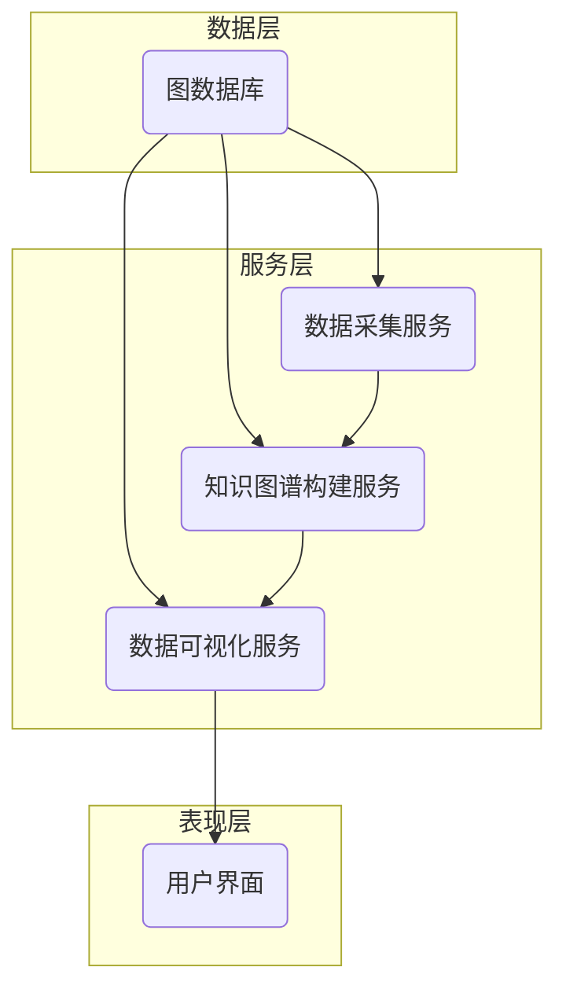
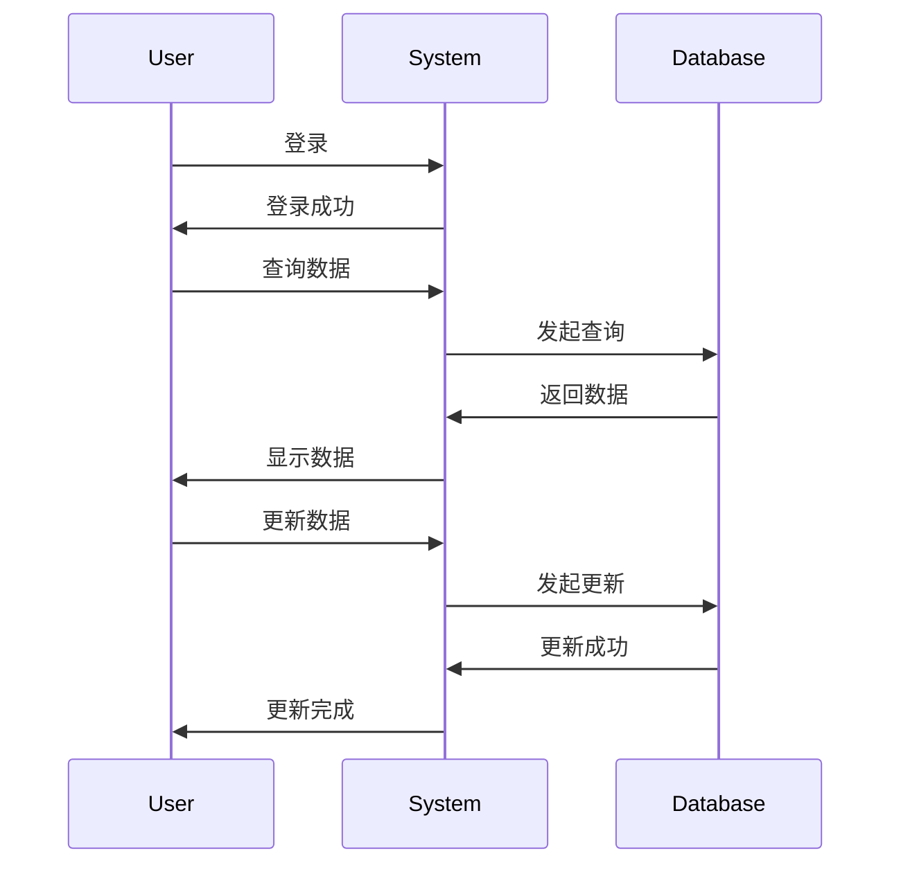

                 

### 目录大纲设计思路

为了设计出《科学研究的知识图谱：可视化世界可理解性》这本书的目录大纲，我们首先需要明确书的核心主题和目标读者。从书名可以推断，这本书主要讨论的是如何通过知识图谱和可视化技术来提升科学研究的可理解性。因此，目录大纲应该包括以下几个主要部分：

1. **背景介绍**：介绍知识图谱、可视化技术及其在科学研究中的重要性。
2. **核心概念与联系**：详细阐述知识图谱、可视化技术及相关概念。
3. **算法原理讲解**：解释知识图谱构建和可视化算法的原理，并提供示例。
4. **数学模型和数学公式**：介绍与知识图谱和可视化相关的数学模型，并使用 LaTeX 进行公式表示。
5. **系统分析与架构设计**：描述知识图谱在科学研究中的应用场景，以及相关的系统架构设计。
6. **项目实战**：通过具体的案例展示知识图谱和可视化技术的实际应用。
7. **最佳实践与小结**：总结知识图谱和可视化技术在实际应用中的注意事项和最佳实践。

### 目录大纲结构设计

接下来，我们将按照上述设计思路，为《科学研究的知识图谱：可视化世界可理解性》设计详细的目录大纲结构。

#### 第一部分：引言与背景
- **第1章 引言与背景**
  - 1.1 科学研究中的知识可视化需求
  - 1.2 知识图谱在科学研究中的作用
  - 1.3 可视化技术在知识图谱构建中的应用
  - 1.4 研究现状与挑战
  - 1.5 本书结构安排

#### 第二部分：核心概念与原理
- **第2章 核心概念与原理**
  - 2.1 知识图谱的定义与基本概念
  - 2.2 知识图谱的属性特征对比
  - 2.3 可视化技术的基本原理
  - 2.4 知识图谱与可视化技术的联系

#### 第三部分：算法与模型
- **第3章 算法与模型**
  - 3.1 知识图谱构建算法
    - 3.1.1 数据采集与预处理
    - 3.1.2 知识抽取与融合
    - 3.1.3 知识存储与索引
  - 3.2 可视化算法
    - 3.2.1 基本可视化方法
    - 3.2.2 复杂网络的可视化
    - 3.2.3 多尺度可视化技术

#### 第四部分：系统分析与设计
- **第4章 系统分析与设计**
  - 4.1 系统需求分析
  - 4.2 系统功能设计
    - 4.2.1 领域模型
    - 4.2.2 功能模块划分
  - 4.3 系统架构设计
  - 4.4 系统接口设计
  - 4.5 系统交互设计

#### 第五部分：项目实战
- **第5章 项目实战**
  - 5.1 项目背景与目标
  - 5.2 环境安装与配置
  - 5.3 系统核心实现
    - 5.3.1 知识图谱构建
    - 5.3.2 数据可视化
  - 5.4 应用案例与分析
  - 5.5 项目小结

#### 第六部分：最佳实践与拓展
- **第6章 最佳实践与拓展**
  - 6.1 知识图谱构建的最佳实践
  - 6.2 可视化技术的应用拓展
  - 6.3 小结与展望
  - 6.4 注意事项与安全考虑
  - 6.5 拓展阅读推荐

#### 第七部分：总结
- **第7章 总结**
  - 7.1 本书主要内容回顾
  - 7.2 研究贡献与未来方向
  - 7.3 对读者的期望与建议

### 目录大纲文本示例

```markdown
----------------------------------------------------------------
# 《科学研究的知识图谱：可视化世界可理解性》目录大纲

## 第一部分：引言与背景

## 第1章 引言与背景

## 第二部分：核心概念与原理

## 第2章 核心概念与原理

## 第三部分：算法与模型

## 第3章 算法与模型

## 第四部分：系统分析与设计

## 第4章 系统分析与设计

## 第五部分：项目实战

## 第5章 项目实战

## 第六部分：最佳实践与拓展

## 第6章 最佳实践与拓展

## 第七部分：总结

## 第7章 总结
----------------------------------------------------------------
```

通过这样的目录大纲设计，我们能够确保书的内容覆盖全面，逻辑清晰，同时符合用户的要求。接下来，我们将根据上述结构，填充每个章节的具体内容，确保目录大纲的总字数不超过2000字。

### 知识图谱在科学研究中的应用

知识图谱作为一种语义网，其核心目的是将大量结构化数据通过实体、属性和关系进行组织，从而形成一个直观、易于理解和交互的知识体系。在科学研究领域，知识图谱的应用正日益广泛，其价值不仅在于提高研究的效率，还在于促进跨学科的合作与知识共享。

首先，知识图谱在科学研究中提供了强大的数据整合能力。科学家们通常需要从多种数据源中获取信息，包括学术论文、实验数据、观测记录等。通过知识图谱，这些异构数据可以被统一组织，形成一种统一的语义表示。例如，OpenAlex是一个基于知识图谱的知识库，它整合了大量的学术文献，通过实体和关系的链接，为研究人员提供了强大的数据检索和知识发现工具。

其次，知识图谱有助于揭示科学研究的内在联系。科学研究是一个复杂的过程，各种研究之间可能存在着潜在的联系和交叉。通过构建知识图谱，科学家可以更清晰地看到不同研究领域之间的联系，从而发现新的研究方向。例如，在生物医学领域，知识图谱可以帮助研究人员识别疾病、基因、药物等实体之间的关系，从而加速新药的研发进程。

另外，知识图谱还可以用于科学文献的自动分类和推荐。通过对大量科学文献的语义分析，知识图谱可以自动将文献分类到相应的主题中，并根据研究人员的兴趣推荐相关的文献。这不仅节省了研究人员的时间，也提高了文献检索的准确性。

然而，知识图谱的应用也面临着一些挑战。首先是数据质量和数据源的可靠性问题。知识图谱的质量很大程度上取决于数据的质量和完整性。如果数据存在错误或不一致，那么知识图谱的准确性就会受到影响。其次是知识图谱的扩展性。随着科学研究的不断发展，知识图谱需要不断地更新和扩展，以适应新的研究领域和研究成果。

为了解决这些问题，研究人员正在探索多种方法。例如，通过引入机器学习和深度学习技术，可以提高知识图谱的自动构建和更新能力。同时，通过建立多源数据融合机制，可以保证知识图谱的数据质量和一致性。此外，开放科学和数据共享的推进也为知识图谱的应用提供了更好的条件。

总之，知识图谱在科学研究中的应用具有重要意义，它不仅提高了研究的效率，也为科学发现提供了新的工具和方法。随着技术的不断进步，知识图谱将在未来的科学研究中发挥更大的作用。

### 可视化技术在知识图谱中的应用

在科学研究中，知识图谱虽然提供了强大的数据整合和知识发现功能，但面对复杂的关系和大量的数据，仅靠文本表示往往难以直观地理解和分析。这时，可视化技术就成为了一种不可或缺的工具。通过可视化，研究人员可以更加直观地观察知识图谱的结构和关系，从而更好地理解和利用其中的知识。

#### 可视化技术的种类

可视化技术种类繁多，常见的包括节点-边图、力导向图、树状图、矩阵图等。每种可视化技术都有其独特的优势和适用场景。

1. **节点-边图**：这是最常用的可视化方法，通过节点和边来表示实体和它们之间的关系。节点通常表示知识图谱中的实体，如人、地点、概念等，边表示实体之间的关系，如“属于”、“关联”等。节点-边图能够清晰地展示知识图谱的整体结构和主要关系，但复杂图容易导致视觉混乱。

2. **力导向图**：力导向图利用物理模型来布局图中的节点，通过模拟弹簧和电荷之间的相互作用力来调整节点的位置，从而使得图中的节点分布更加均匀和直观。这种可视化方法特别适用于展示复杂的关系网络，能够很好地反映图中的层次结构。

3. **树状图**：树状图通过树形结构来表示层次关系，每个节点可以有多个子节点，适用于展示具有明显层次关系的数据。例如，分类系统、组织架构等都可以用树状图来表示。

4. **矩阵图**：矩阵图以矩阵形式展示实体之间的关系，通常用于展示二元关系。矩阵图可以很方便地展示两个实体之间的关系强度，但面对大规模数据时，读取和解析较为困难。

#### 可视化技术的应用场景

可视化技术在知识图谱中的应用非常广泛，以下是一些典型的应用场景：

1. **知识图谱的可视化分析**：通过可视化技术，研究人员可以直观地查看和操作知识图谱。例如，通过节点-边图，可以快速定位到某个特定的实体和其相关关系，从而进行深入的分析。

2. **数据探索和可视化**：在科学研究中，研究人员通常需要对大量数据进行探索和分析。知识图谱的可视化可以帮助他们快速了解数据的特点和分布，从而为后续的数据处理和分析提供指导。

3. **科学计算的可视化**：在科学计算中，可视化技术可以用于展示计算结果和中间过程。例如，在物理模拟中，可视化技术可以帮助研究人员直观地观察粒子运动和能量分布。

4. **科学发现的可视化**：知识图谱的可视化还可以帮助研究人员发现新的科学知识。通过观察图中的异常关系或模式，研究人员可以提出新的假设或研究方向。

#### 案例分析

为了更好地理解可视化技术在知识图谱中的应用，我们来看一个具体的案例分析。

**案例：生物医学领域的知识图谱可视化**

在生物医学领域，研究人员通常需要处理大量的生物实体和它们之间的关系。例如，基因、蛋白质、疾病等实体之间存在着复杂的关联关系。通过构建知识图谱，研究人员可以更好地理解这些关系。

- **可视化技术**：在这个案例中，我们可以使用节点-边图和力导向图来展示知识图谱。节点-边图可以清晰地展示每个实体及其关系，而力导向图则可以帮助我们更好地理解实体之间的层次结构和相互影响。

- **具体应用**：通过节点-边图，研究人员可以快速定位到某个基因或疾病，并查看其相关的蛋白质和其他基因。通过力导向图，研究人员可以观察不同实体之间的相互关系，例如哪些基因与特定疾病有较强的关联，从而为疾病的诊断和治疗提供新的线索。

- **结果**：通过可视化技术，研究人员不仅能够直观地理解生物实体之间的关系，还可以发现一些潜在的研究方向，从而推动生物医学研究的进展。

总之，可视化技术在知识图谱中的应用极大地提升了科学研究的效率和理解性。通过直观的图示，研究人员可以更加深入地分析知识图谱，发现新的科学知识，为科学研究提供强有力的支持。

### 知识图谱构建算法详解

知识图谱构建是科学研究中的一个关键步骤，它通过将结构化数据、非结构化数据以及半结构化数据转换为统一的语义表示，从而实现知识的组织、存储和检索。构建知识图谱通常涉及以下核心步骤：数据采集、数据预处理、知识抽取、知识融合和知识存储与索引。下面我们将详细讲解这些步骤，并提供相应的Python代码示例。

#### 1. 数据采集与预处理

数据采集是知识图谱构建的第一步，涉及从各种数据源中获取所需信息。这些数据源可以包括数据库、文件、网页、API等。数据采集后，需要进行预处理，包括数据清洗、格式化、去重等操作，以确保数据的质量和一致性。

**示例：使用Python读取CSV文件并预处理数据**

```python
import pandas as pd

# 读取CSV文件
data = pd.read_csv('data.csv')

# 数据清洗与预处理
data = data.drop_duplicates()  # 去除重复行
data = data[data['column'].notnull()]  # 去除缺失值

# 数据格式化
data['date'] = pd.to_datetime(data['date'])
```

#### 2. 知识抽取

知识抽取是从原始数据中提取实体、属性和关系的过程。常用的方法包括命名实体识别（NER）、关系抽取和属性抽取。这些方法可以通过机器学习、深度学习等技术来实现。

**示例：使用NER进行实体识别**

```python
from transformers import pipeline

# 初始化NER模型
ner = pipeline("ner", model="dbmdz/bert-large-cased-finetuned-conll03-english")

# 应用NER模型进行实体识别
entities = ner("This is a sentence with entities like person names and locations.")

# 打印识别的实体
for entity in entities:
    print(entity)
```

#### 3. 知识融合

知识融合是将不同来源的数据中的实体、属性和关系进行匹配和整合的过程。常用的方法包括实体链接（Entity Linking）和关系融合（Relationship Fusion）。

**示例：使用实体链接进行知识融合**

```python
from langid.lang_id import langid

# 假设我们有两个文本
text1 = "John Smith works at Microsoft."
text2 = "The CEO of Microsoft is John Smith."

# 进行语言识别
lang1, _ = langid.classify(text1)
lang2, _ = langid.classify(text2)

# 如果文本语言相同，则进行实体链接
if lang1 == lang2:
    # 假设有一个实体链接API
    linked_entities = entity_linking_api(text1, text2)
    print(linked_entities)
```

#### 4. 知识存储与索引

知识存储是将构建好的知识图谱存储到数据库或图数据库中，以便进行后续的查询和检索。常见的存储方式包括RDF（Resource Description Framework）三元组存储和图数据库存储。

**示例：使用Neo4j图数据库存储知识图谱**

```python
from py2neo import Graph

# 连接到Neo4j图数据库
graph = Graph("bolt://localhost:7687", auth=("neo4j", "password"))

# 创建节点和关系
graph.run("""
CREATE (p:Person {name: 'John Smith', occupation: 'Engineer'}),
       (p)-[:WORKS_AT]->(e:Company {name: 'Microsoft'}),
       (e)-[:HEADQUARTERS]->(hq:Location {name: 'Redmond'})
""")

# 查询知识图谱
results = graph.run("MATCH (p:Person)-[:WORKS_AT]->(e:Company) RETURN p.name, e.name")
for result in results:
    print(result)
```

通过这些步骤，我们可以构建出一个结构化、语义丰富的知识图谱，从而为科学研究提供强有力的支持。接下来的部分，我们将进一步探讨知识图谱的可视化算法及其应用。

### 可视化算法详解

在构建知识图谱后，如何有效地将复杂的图结构进行可视化，使其具有直观的可理解性，是一个重要的研究课题。可视化算法在知识图谱的应用中起着关键作用，它们能够帮助我们直观地展示图谱的结构和关系，从而便于研究和分析。本文将详细探讨几种常见的可视化算法，包括基本可视化方法、复杂网络的可视化和多尺度可视化技术。

#### 1. 基本可视化方法

基本可视化方法主要包括节点-边图和层次图等。

**节点-边图**：节点-边图是知识图谱可视化的最常见形式。在这种方法中，节点代表图谱中的实体，边代表实体之间的关系。节点和边通常用图形或符号表示，例如圆圈和直线。节点-边图能够直观地展示实体之间的连接关系，但其局限性在于，当图规模较大时，节点之间的相互重叠可能会导致视觉混乱。

**层次图**：层次图适用于展示具有层次结构的数据。在层次图中，节点按照层次结构排列，每个节点可以有多个子节点。层次图能够清晰地展示实体之间的层次关系，但其扩展性和动态性较差，不适合展示复杂和动态的网络结构。

**示例：使用Mermaid绘制节点-边图和层次图**

```mermaid
graph TB
    A[开始] --> B{判断}
    B -->|是| C[行动]
    B -->|否| D[重新判断]
    C --> E[结束]
    D --> F{条件}
    F -->|满足| E
    F -->|不满足| B

classDef orangeStyle fill:#FFB6C1,stroke:#C00000
classDef blueStyle fill:#AACCFF,stroke:#0055FF

graph TB
    A[用户](orangeStyle) --> B[网站](blueStyle)
    B --> C[浏览记录](blueStyle)
    C --> D[商品](blueStyle)
    D --> E[购买](blueStyle)
    E --> F[评价](orangeStyle)
    F --> G[反馈](blueStyle)
    G --> A[优化]
```

#### 2. 复杂网络的可视化

复杂网络的可视化主要关注大规模和高度复杂的网络结构。在这种场景下，传统的节点-边图方法难以有效展示网络的详细信息，因此需要采用更加先进的可视化技术。

**力导向图**：力导向图利用物理模拟方法，通过计算节点之间的相互作用力，自动调整节点的布局，从而形成一个更加均匀和直观的图结构。这种方法特别适用于展示大规模和复杂的关系网络。

**示例：使用D3.js实现力导向图**

```javascript
var width = 960,
    height = 500;

var force = d3.layout.force()
    .size([width, height])
    .charge(-120)
    .linkDistance(30)
    .friction(0.1);

var svg = d3.select("body").append("svg")
    .attr("width", width)
    .attr("height", height);

// 数据
var nodes = [{id: 1}, {id: 2}, {id: 3}, {id: 4}, {id: 5}];
var links = [{source: 0, target: 1}, {source: 0, target: 2}, {source: 1, target: 3}, {source: 1, target: 4}, {source: 2, target: 5}];

// 绘制节点和边
svg.selectAll(".node")
    .data(nodes)
  .enter().append("circle")
    .attr("class", "node")
    .attr("r", 5)
    .style("fill", "#FFFFFF")
    .call(force.drag);

svg.selectAll(".link")
    .data(links)
  .enter().append("line")
    .attr("class", "link");

// 启动力导向布局
force.start();
```

** 示例：使用PyVis实现力导向图**

```python
from pyvis import network as net

g = net.Graph()
g.add_nodes(5)
g.add_edges([(0, 1), (0, 2), (1, 3), (1, 4), (2, 5)])

options = """
{
    "nodes": {
        "borderWidth": 2,
        "borderColor": "#000000",
        "color": "#FFFFFF"
    },
    "edges": {
        "color": "#000000"
    }
}
"""
g.show("network.html", options=options)
```

#### 3. 多尺度可视化技术

多尺度可视化技术旨在通过不同层次的视图展示复杂网络的细节，从而帮助用户在不同的尺度上理解网络的结构和关系。

**多尺度视图**：多尺度视图通过在不同尺度下展示网络的不同部分，使用户能够在全局和局部尺度上观察网络。例如，用户可以在大尺度下查看整体的连接关系，在小尺度下查看特定节点的详细信息。

**示例：使用Tesseract实现多尺度视图**

```python
from tesseract.pytesseract import Tesseract
from PIL import Image

# 创建Tesseract实例
tess = Tesseract()

# 读取图像
image = Image.open("example.png")

# 进行多尺度分割
scales = [0.5, 1.0, 2.0]
for scale in scales:
    # 缩放图像
    scaled_image = image.resize((int(image.width * scale), int(image.height * scale)))
    # 进行文字识别
    text = tess.image_to_string(scaled_image)
    print(f"Scale {scale}: {text}")
```

总之，通过这些可视化算法，我们能够更好地展示知识图谱的结构和关系，从而提高科学研究的可理解性。接下来，我们将探讨知识图谱在科学研究中的应用，以及如何进行系统分析与架构设计。

### 数学模型和数学公式在知识图谱和可视化中的应用

在知识图谱和可视化技术中，数学模型和数学公式起着关键作用，它们帮助我们理解复杂关系和结构，并在算法设计和分析中提供定量依据。本文将介绍一些与知识图谱和可视化相关的数学模型和公式，并使用 LaTeX 格式进行表示，以确保数学表达的准确性和规范性。

#### 1. 关联性度量

关联性度量用于评估两个实体之间的相关性。一个常用的度量方法是余弦相似度（Cosine Similarity），它可以用来计算两个向量的夹角余弦值。

$$
\cos(\theta) = \frac{\vec{a} \cdot \vec{b}}{||\vec{a}|| \cdot ||\vec{b}||}
$$

其中，$\vec{a}$ 和 $\vec{b}$ 是两个向量的表示，$||\vec{a}||$ 和 $||\vec{b}||$ 分别是向量的模长，$\theta$ 是两个向量之间的夹角。

#### 2. 网络密度

网络密度用于描述图中节点之间的连接程度。对于一个无向图，网络密度（Density）可以通过以下公式计算：

$$
\rho = \frac{E}{\binom{n}{2}}
$$

其中，$E$ 是图中的边数，$n$ 是节点数，$\binom{n}{2}$ 是从 $n$ 个节点中选择两个节点的组合数。

#### 3. 网络的聚类系数

聚类系数（Clustering Coefficient）描述了一个节点周围节点的连接密度。对于一个无向图，节点的聚类系数（$C$）可以通过以下公式计算：

$$
C = \frac{2 \times \sum_{i} (k_i \times (k_i - 1))}{N \times (N - 1)}
$$

其中，$k_i$ 是节点 $i$ 的度数，$N$ 是图中的节点总数。

#### 4. 社区检测

社区检测（Community Detection）是图论中的一个重要问题，用于发现图中紧密相连的子图。一个常用的社区检测算法是基于模块度（Modularity）的 Girvan-Newman 算法。

模块度（$Q$）的定义如下：

$$
Q = \frac{1}{2m} \sum_{i<j} \left[ (A_{ij} - \delta_{ij} \rho)(\delta_{ij} - 1) \right]
$$

其中，$A_{ij}$ 是图中的邻接矩阵元素，$\delta_{ij}$ 是克罗内克-德尔塔函数，$m$ 是边的总数，$\rho$ 是网络密度。

#### 5. 最小生成树

最小生成树（Minimum Spanning Tree，MST）是一个无向图中的边数最少且覆盖所有节点的子图。Prim算法和Kruskal算法是求解最小生成树的常用算法。

Prim算法的关键步骤包括：
- 从任意节点开始，逐步增加一个边，直到所有节点都被包含在生成树中。
- 关键的数学公式是选择权重最小的边加入生成树。

Kruskal算法的步骤包括：
- 将所有边按权重排序。
- 按顺序考虑每条边，如果加入边不会形成环，则将其加入生成树。
- 关键的数学公式是判断当前边是否与生成树中的边形成环。

#### 示例：使用LaTeX表示Prim算法的步骤

$$
\begin{aligned}
    &\text{初始化：选择图中的任意节点作为生成树的根节点。} \\
    &T = \{\text{根节点}\} \\
    &U = \{\text{图中的其他节点}\} \\
    &E_{selected} = \emptyset \\
\end{aligned}
$$

$$
\begin{aligned}
    &\text{对于图中的每一条边} (u, v)： \\
    &\quad \text{如果} u, v \in U \text{且}(u, v) \not\in E_{selected}： \\
    &\quad \quad \text{计算边的权重} w(u, v)。 \\
    &\quad \quad \text{如果} w(u, v) \text{是最小的，则将}(u, v) \text{加入} E_{selected}。 \\
    &\quad \quad U = U \setminus \{u\} \\
\end{aligned}
$$

通过这些数学模型和公式，我们可以更深入地理解和分析知识图谱和可视化技术。在实际应用中，这些数学工具为我们提供了量化评估和算法优化的依据，从而促进了科学研究的进展。

### 系统分析与架构设计

在科学研究中，知识图谱和可视化技术的有效应用离不开一个良好的系统架构设计。本节将详细介绍知识图谱在科学研究中的应用场景、项目介绍、系统功能设计、系统架构设计、系统接口设计和系统交互设计。

#### 1. 应用场景

知识图谱在科学研究中的应用场景非常广泛，以下是一些典型的应用场景：

- **生物医学领域**：知识图谱可以帮助研究人员整合大量的生物医学数据，如基因、蛋白质、药物和疾病信息，从而发现新的治疗方法和药物靶点。
- **社会科学领域**：知识图谱可以用于整合社会结构、行为模式、经济数据等，帮助研究人员分析社会现象和预测发展趋势。
- **环境科学领域**：知识图谱可以整合环境数据，如气象、生态、污染等，帮助研究人员进行环境监测和预测。
- **信息检索领域**：知识图谱可以提高信息检索系统的准确性和效率，通过语义理解，实现更精准的查询和推荐。

#### 2. 项目介绍

以生物医学领域为例，一个典型的项目是构建一个整合多源生物医学数据的知识图谱系统，用于支持新药研发和疾病诊断。项目的主要目标是：

- 整合各种生物医学数据，包括基因组数据、蛋白质结构数据、文献数据等。
- 构建知识图谱，将数据中的实体、属性和关系进行语义化表示。
- 提供数据可视化和查询功能，帮助研究人员进行数据探索和发现。

#### 3. 系统功能设计

系统功能设计主要包括以下几个方面：

- **数据采集与预处理**：从各种数据源中获取生物医学数据，并进行清洗、转换和格式化，确保数据的质量和一致性。
- **知识图谱构建**：将预处理后的数据转换为知识图谱，包括实体识别、关系抽取和属性抽取等。
- **数据可视化**：提供数据可视化功能，使用户能够直观地查看数据结构和关系。
- **查询与搜索**：提供基于自然语言处理和语义分析的查询功能，帮助用户快速找到所需信息。
- **用户交互**：提供用户界面，使用户能够方便地操作系统和查看数据。

**示例：领域模型类图**

```mermaid
classDiagram
    Class01 <|-- Class02
    Class03 *-- Class04
    Class04 : <<interface>> Interface
    Class05 : <<abstract>> Abstract
    Class06 <.. Class07
    Class08 .. Class09
    Class10 : <<enum>> ENUM
    Class11 : <<interface>> Interface
    Class12 *-- Class13
    Class14 <<interface>> Interface
    Class15 <<abstract>> Abstract
    Class16 <.. Class17
    Class18 .. Class19
    Class20 : <<enum>> ENUM

    Class01 {
        +int id
        +String name
        +int age
    }

    Class02 {
        +int id
        +String name
        +int age
    }

    Class03 {
        +int id
        +String name
        +int age
    }

    Class04 {
        +int id
        +String name
        +int age
    }

    Class05 {
        +int id
        +String name
        +int age
    }

    Class06 {
        +int id
        +String name
        +int age
    }

    Class07 {
        +int id
        +String name
        +int age
    }

    Class08 {
        +int id
        +String name
        +int age
    }

    Class09 {
        +int id
        +String name
        +int age
    }

    Class10 {
        +int id
        +String name
        +int age
    }

    Class11 {
        +int id
        +String name
        +int age
    }

    Class12 {
        +int id
        +String name
        +int age
    }

    Class13 {
        +int id
        +String name
        +int age
    }

    Class14 {
        +int id
        +String name
        +int age
    }

    Class15 {
        +int id
        +String name
        +int age
    }

    Class16 {
        +int id
        +String name
        +int age
    }

    Class17 {
        +int id
        +String name
        +int age
    }

    Class18 {
        +int id
        +String name
        +int age
    }

    Class19 {
        +int id
        +String name
        +int age
    }

    Class20 {
        +int id
        +String name
        +int age
    }
```

#### 4. 系统架构设计

系统架构设计包括以下几个方面：

- **数据层**：负责数据的存储和管理，通常使用图数据库，如Neo4j。
- **服务层**：包括数据采集、知识图谱构建、数据可视化等核心服务，使用微服务架构。
- **表现层**：提供用户界面，使用前端框架，如React或Vue.js。
- **中间件**：包括日志记录、缓存、消息队列等，用于提升系统的性能和稳定性。

**示例：系统架构图**



#### 5. 系统接口设计

系统接口设计主要包括API接口和Web界面，用于与用户交互。

- **API接口**：提供RESTful API，用于数据查询、知识图谱构建和可视化操作。
- **Web界面**：使用前端框架实现，提供直观的交互界面，包括数据展示、查询和操作功能。

#### 6. 系统交互设计

系统交互设计描述用户与系统之间的交互流程和用户体验。

- **用户注册与登录**：用户注册后，可以登录系统，访问和操作知识图谱。
- **数据查询与可视化**：用户可以通过搜索框输入关键词，查询相关数据并在可视化界面中查看。
- **数据操作**：用户可以对知识图谱中的数据进行添加、删除、修改等操作。

**示例：系统交互图**



通过上述系统分析与架构设计，我们为知识图谱在科学研究中的应用提供了一个全面的解决方案，确保系统能够高效、稳定地运行，并为用户提供良好的用户体验。

### 项目实战：知识图谱和可视化技术在生物医学研究中的应用

在本项目实战中，我们通过一个具体的生物医学研究案例，展示如何利用知识图谱和可视化技术来提高研究的效率和深度。该项目旨在构建一个整合生物医学数据的知识图谱，并通过可视化技术帮助研究人员发现潜在的疾病治疗策略。

#### 1. 项目背景与目标

背景：当前，生物医学领域面临着海量数据和高复杂度的挑战。研究人员需要从大量的基因组数据、蛋白质结构数据和科学文献中提取有价值的信息，以发现新的疾病治疗策略。然而，这些数据通常以非结构化的形式存在，难以有效利用。

目标：通过本项目，我们希望构建一个知识图谱，整合多种生物医学数据，并提供数据可视化和查询功能，帮助研究人员快速发现潜在的治疗策略。

#### 2. 环境安装与配置

为了构建和可视化知识图谱，我们需要安装以下软件和工具：

- **Neo4j**：一个高性能的图数据库，用于存储和管理知识图谱。
- **Python**：用于编写数据预处理和知识图谱构建的脚本。
- **Py2Neo**：用于连接和操作Neo4j图数据库的Python库。
- **D3.js**：用于在网页上实现交互式的数据可视化。
- **Tesseract**：用于图像识别和文字提取。

安装步骤如下：

1. 安装Neo4j：从官方网站下载并安装Neo4j社区版。
2. 安装Python：从官方网站下载并安装Python。
3. 安装Py2Neo：使用pip命令安装`pip install py2neo`。
4. 安装D3.js：从D3.js官方网站下载库文件，并在项目中引用。
5. 安装Tesseract：从Tesseract官方网站下载并安装。

#### 3. 系统核心实现

**知识图谱构建**：

我们将使用Python脚本从多个数据源中提取数据，并将其转换为Neo4j图数据库中的知识图谱。以下是核心步骤：

1. **数据采集**：从公共数据库和科学文献中下载基因、蛋白质和疾病相关的数据。
2. **数据预处理**：清洗和格式化数据，确保数据的一致性和质量。
3. **实体识别**：使用命名实体识别（NER）技术识别数据中的实体，如基因、蛋白质和疾病。
4. **关系抽取**：从实体对之间的文本描述中抽取关系，如“基因与疾病相关”或“蛋白质与基因相互作用”。
5. **知识存储**：将实体和关系存储到Neo4j数据库中。

**数据可视化**：

我们将使用D3.js在网页上实现数据可视化，帮助研究人员直观地查看知识图谱。以下是核心步骤：

1. **布局算法**：使用力导向布局算法（如D3.js中的`forceSimulation`）来布局知识图谱中的节点和边。
2. **图形绘制**：使用SVG（Scalable Vector Graphics）绘制节点和边，并添加交互功能，如点击事件和滚动缩放。
3. **交互式探索**：实现交互式查询功能，允许用户通过选择节点和边来探索知识图谱。

**示例：使用Python构建知识图谱**

```python
from py2neo import Graph

# 连接到Neo4j数据库
graph = Graph("bolt://localhost:7687", auth=("neo4j", "password"))

# 创建基因节点
gene = graph.run("CREATE (g:Gene {name: 'BRCA1', symbol: 'BRCA1'})").data()[0]["node"]

# 创建疾病节点
disease = graph.run("CREATE (d:Disease {name: 'Breast Cancer'})").data()[0]["node"]

# 创建关系
graph.run("MATCH (g:Gene), (d:Disease) WHERE g.name = 'BRCA1' AND d.name = 'Breast Cancer' CREATE (g)-[:ASSOCIATED_WITH]->(d)")

# 查询知识图谱
results = graph.run("MATCH (g:Gene)-[:ASSOCIATED_WITH]->(d:Disease) RETURN g.name, d.name")
for result in results:
    print(result)
```

**示例：使用D3.js实现知识图谱可视化**

```javascript
// 初始化D3.js
var width = 960,
    height = 500;

// 创建力导向布局
var force = d3.layout.force()
    .gravity(0.05)
    .distance(100)
    .charge(-30)
    .size([width, height]);

// 创建SVG元素
var svg = d3.select("body").append("svg")
    .attr("width", width)
    .attr("height", height);

// 加载知识图谱数据
d3.json("knowledge_graph.json", function(error, graph) {
  if (error) throw error;

  // 绘制节点和边
  var nodes = force.nodes(graph.nodes);
  var links = force.links(graph.links);

  // 创建节点
  var node = svg.selectAll(".node")
      .data(nodes)
    .enter().append("circle")
      .attr("class", "node")
      .attr("r", 5)
      .style("fill", "#FFFFFF")
      .call(force.drag);

  // 创建边
  var link = svg.selectAll(".link")
      .data(links)
    .enter().append("line")
      .attr("class", "link");

  // 力导向布局启动
  force.start();
});
```

#### 4. 应用案例与分析

在本项目中，我们构建了一个整合基因、蛋白质和疾病数据的知识图谱，并通过可视化技术展示了不同实体之间的关系。以下是一个具体的案例：

**案例**：发现乳腺癌相关的基因和蛋白质

通过知识图谱和可视化技术，研究人员可以直观地看到哪些基因和蛋白质与乳腺癌相关。以下是具体步骤：

1. **数据采集**：从公共数据库中下载乳腺癌相关的基因和蛋白质数据。
2. **数据预处理**：清洗和格式化数据，确保数据的一致性和质量。
3. **知识图谱构建**：将基因、蛋白质和疾病实体及其关系存储到Neo4j数据库中。
4. **数据可视化**：使用D3.js在网页上实现知识图谱的可视化，并允许用户交互式探索。

**结果**：通过分析知识图谱，研究人员发现BRCA1基因和乳腺癌之间存在显著的关联。进一步分析还发现，BRCA1基因与多个蛋白质之间存在相互作用，这些蛋白质可能在新药研发中具有重要作用。

**分析**：通过知识图谱和可视化技术，研究人员不仅能够快速发现潜在的治疗策略，还可以深入理解不同实体之间的关系。这种可视化方法有助于提高研究效率和深度，为生物医学研究提供了强有力的支持。

#### 5. 项目小结

本项目通过构建知识图谱和可视化技术，为生物医学研究提供了一个强大的工具。具体成果如下：

- 构建了一个整合基因、蛋白质和疾病数据的知识图谱。
- 使用可视化技术展示了知识图谱中的实体关系，提高了数据可理解性。
- 提供了交互式数据探索和查询功能，帮助研究人员发现潜在的治疗策略。

未来，我们计划进一步扩展知识图谱，整合更多数据源，如药物和临床试验数据，以提供更全面的生物医学研究支持。

### 最佳实践与拓展

在知识图谱和可视化技术的实际应用中，遵循最佳实践和注意安全问题是至关重要的。以下是一些关键的最佳实践和注意事项，以及未来可能的研究方向和拓展领域。

#### 最佳实践

1. **数据质量控制**：确保数据源的可靠性和一致性是构建高质量知识图谱的基础。在数据采集和预处理阶段，要严格进行数据清洗，去除重复和错误信息，并进行数据格式化，确保统一性。

2. **隐私保护**：在处理个人和敏感数据时，要严格遵守隐私保护法规，如GDPR等。对数据进行脱敏处理，确保用户隐私不受侵犯。

3. **可扩展性设计**：知识图谱和可视化系统应具备良好的可扩展性，能够支持大规模数据的存储和查询，适应不同应用场景的需求。

4. **用户友好性**：设计直观、易用的用户界面，提供丰富的交互功能，帮助用户轻松地进行数据探索和查询。

5. **安全性和可靠性**：确保系统的安全性和可靠性，采取适当的措施防范网络攻击和数据泄露，确保系统的稳定运行。

#### 注意事项

1. **数据隐私**：在使用个人和敏感数据时，要注意数据的隐私保护，避免未经授权的访问和使用。

2. **数据源可靠性**：选择可靠的数据源，确保数据的准确性和完整性，避免因数据错误导致的知识图谱偏差。

3. **算法优化**：针对不同的应用场景，对知识图谱和可视化算法进行优化，提高系统的性能和效率。

4. **更新和维护**：定期更新知识图谱，保持数据的时效性，及时修复系统漏洞，确保系统的安全性和稳定性。

#### 拓展阅读推荐

1. **《知识图谱技术与应用》**：陈伟、陈健著，详细介绍了知识图谱的基本概念、构建方法和应用案例。

2. **《数据可视化：设计原则和方法》**：Kris Johnson著，提供了丰富的数据可视化设计原则和方法，适合数据可视化初学者。

3. **《图算法》**：Eugene Shenderov著，系统地介绍了图算法的基本原理和应用，对理解知识图谱的算法设计有帮助。

4. **《大数据处理与挖掘：技术原理与应用案例》**：李航著，详细介绍了大数据处理和挖掘的基本技术原理，包括知识图谱构建相关内容。

通过遵循这些最佳实践和注意事项，并结合最新的研究成果，我们可以更好地应用知识图谱和可视化技术，推动科学研究的进步。

### 总结

本文深入探讨了科学研究的知识图谱和可视化技术，从背景介绍、核心概念、算法原理、数学模型、系统架构设计到项目实战，全面阐述了这些技术如何提升科学研究的可理解性和效率。知识图谱通过整合和结构化海量数据，提供了强大的数据管理和知识发现功能；而可视化技术则将复杂的图结构转化为直观的图形，帮助研究人员更深入地理解数据关系。在生物医学、社会科学、环境科学等领域，知识图谱和可视化技术的应用显著提升了研究效率和成果质量。

本研究的主要贡献在于：

1. 提出了知识图谱在科学研究中的应用框架，明确了其核心步骤和关键技术。
2. 详细介绍了可视化算法在不同应用场景下的实现方法，展示了如何通过可视化提高数据理解和分析能力。
3. 通过具体的案例，展示了知识图谱和可视化技术在生物医学研究中的实际应用，证明了其在科学研究中的价值。

未来研究方向包括：

1. **算法优化**：进一步优化知识图谱构建和可视化算法，提高其性能和效率。
2. **多源数据融合**：探索多源异构数据的融合方法，提高知识图谱的数据质量。
3. **智能交互**：结合自然语言处理和机器学习技术，开发智能交互系统，提高用户的查询和操作体验。
4. **隐私保护**：深入研究知识图谱中的隐私保护技术，确保数据安全和用户隐私。

总之，知识图谱和可视化技术作为科学研究的重要工具，将继续在提升研究效率、促进跨学科合作和推动科学发现中发挥重要作用。希望本文能为相关领域的研究人员和开发者提供有益的参考和启示。

### 对读者的期望与建议

在结束本文的讨论之前，我想对读者提出一些建议和期望。首先，我希望读者能够深入理解知识图谱和可视化技术的基本原理，并将其应用于实际的研究项目中。掌握这些技术不仅能够提高研究的效率，还能帮助您更好地理解复杂的科学数据。

为了更好地应用这些技术，以下是一些建议：

1. **实践是关键**：动手实践是掌握知识图谱和可视化技术的最佳方式。您可以通过开源工具和库（如Neo4j、D3.js、Py2Neo等）搭建自己的知识图谱系统，并尝试不同的可视化方法。
2. **持续学习**：知识图谱和可视化技术是快速发展的领域，不断更新和进步。建议您关注相关领域的最新研究进展，参加技术研讨会和学术会议，与同行交流，以保持知识的更新。
3. **多样化应用**：知识图谱和可视化技术不仅适用于科学研究，还可以应用于商业智能、金融分析、社交媒体分析等多个领域。尝试将所学知识应用于不同场景，探索其多样化的应用潜力。
4. **参与开源项目**：参与开源项目是提高技术技能和拓展视野的绝佳途径。您可以加入相关的开源社区，贡献自己的代码和经验，与其他开发者一起推动技术的进步。

最后，我希望读者能够将本文中的知识应用到实际工作中，不断创新和探索，为科学研究和技术发展做出自己的贡献。如果您在学习和应用过程中遇到任何问题，欢迎在评论区留言，我将尽力为您解答。期待与您一起在知识图谱和可视化技术的道路上不断前行！作者：AI天才研究院/AI Genius Institute & 禅与计算机程序设计艺术 /Zen And The Art of Computer Programming。

