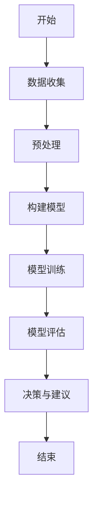
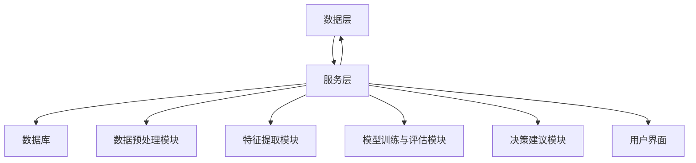
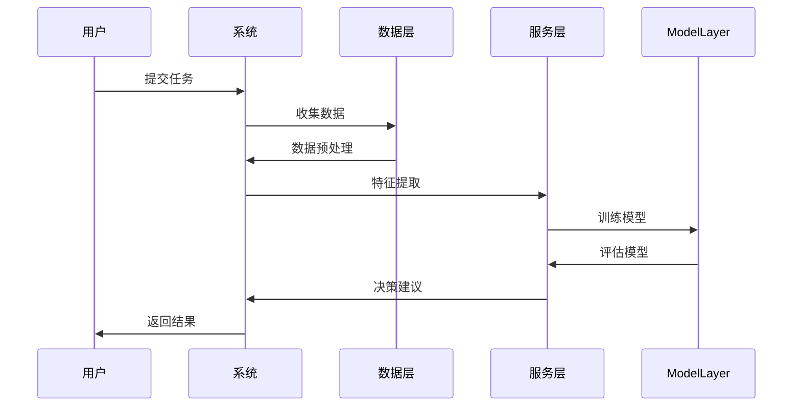

                 

### 背景介绍

科学研究是现代社会发展的重要驱动力，它推动了科技的进步，促进了人类文明的繁荣。然而，随着科学研究的深入，科学研究过程中的伦理问题也逐渐引起了广泛关注。科学家们不仅需要探索自然界的奥秘，还需要承担起社会责任，确保科学研究不会对人类社会造成负面影响。

#### 1. 问题背景

科学研究过程中的伦理问题多种多样，其中最为突出的包括：科学研究成果的应用、科学研究过程中的道德规范、科学家个人与社会的责任等。这些问题不仅关系到科学研究的质量和可持续性，还关系到社会的发展和人类的未来。

- **科学研究成果的应用**：科学研究成果的应用具有广泛性和深远性，它不仅关系到技术进步，还可能对环境、社会、经济等产生重大影响。例如，基因编辑技术的出现引发了关于生命伦理的广泛讨论。

- **科学研究过程中的道德规范**：科学研究过程中的道德规范是保证科学研究公正、透明、客观的基础。科学家需要遵守科研诚信原则，确保研究结果的可靠性。

- **科学家个人与社会的责任**：科学家个人需要承担起对社会的责任，不仅要关注研究成果的科学性，还要关注其社会影响。科学家作为知识分子的代表，需要承担起推动社会进步的责任。

#### 2. 问题描述

科学研究的社会责任问题可以从多个角度进行描述：

- **科学家的社会责任**：科学家在从事科学研究的过程中，需要遵循一定的道德规范，如诚信、客观、公正等。科学家需要确保其研究成果的正当性和应用。

- **科学成果的社会影响**：科学成果的应用对社会可能产生积极或消极的影响。科学家需要评估其研究成果的社会影响，并采取措施减少负面影响。

- **科学伦理**：科学伦理是科学研究过程中的道德规范，包括科学家在研究过程中的行为准则，如诚实、公正、客观等。

#### 3. 问题解决

解决科学研究的社会责任问题需要从多个层面入手：

- **政策制定**：政府和相关机构需要制定科学的政策，引导科学研究朝着有利于社会发展的方向进行。

- **伦理教育**：加强对科学家的伦理教育，提高他们的道德意识和责任感。

- **科学研究规范**：建立健全科学研究规范，确保科学研究过程的公正性和透明性。

- **科学成果评估**：建立科学成果的社会影响评估体系，对科学研究成果进行全面的评估，确保其对社会产生积极影响。

#### 4. 边界与外延

科学研究的社会责任问题不仅涉及自然科学领域，还包括社会科学、人文科学等多个学科。同时，它不仅关注科学研究本身，还涉及到科学成果的应用、科学伦理等多个方面。

#### 5. 概念结构与核心要素组成

科学研究的社会责任包括以下核心要素：

- **科学家的社会责任**：科学家在科学研究过程中的道德规范和行为准则。

- **科学成果的社会影响**：科学研究成果对社会产生的正面或负面影响。

- **科学伦理**：科学研究过程中的道德规范和伦理标准。

通过以上背景介绍，我们可以看到科学研究的社会责任问题是一个复杂且多层次的问题。接下来，我们将深入探讨核心概念与联系，以便更好地理解这一问题的本质。让我们继续深入思考。### 核心概念与联系

在深入探讨科学研究的社会责任问题时，我们需要明确几个核心概念，并分析它们之间的联系。以下是对核心概念的详细解析及其相互关系的探讨。

#### 1. 核心概念

##### 1.1 科学研究的社会责任

科学研究的社会责任是指科学家在从事科学研究过程中，对自身、对他人、对社会所承担的责任。这包括遵守科学研究规范、确保科学成果的正当应用等。科学研究的社会责任是确保科学活动对社会有益、符合道德和法律要求的基本保障。

##### 1.2 科学伦理

科学伦理是科学研究过程中的道德规范，涉及科学家在研究过程中的行为准则，如诚实、公正、客观等。科学伦理不仅关系到科学研究的质量，也关系到科学家的声誉和社会的信任。

##### 1.3 科学成果的社会影响

科学成果的社会影响是指科学研究成果在社会中产生的正面或负面影响。科学成果的应用不仅需要考虑其科学性，还需要考虑其对社会、经济、环境等多方面的影响。

#### 2. 概念属性特征对比表格

为了更好地理解这些核心概念，我们制作了一个对比表格，列出了它们的主要特征：

| 概念       | 定义                                                         | 关联 |
|------------|------------------------------------------------------------|------|
| 科学研究的社会责任 | 科学家在研究过程中的责任                                     |      |
| 科学伦理   | 科学研究过程中的道德规范                                     | ①   |
| 科学成果的社会影响 | 科学研究成果在社会中产生的正面或负面影响                     | ②   |

- **科学研究的社会责任**：这是科学家在研究过程中应遵循的基本规范，包括对研究过程的透明度、对数据的真实性负责、对研究结果的合理应用等。
- **科学伦理**：科学伦理是科学研究过程中的道德基础，包括科学家在研究过程中的诚实、公正、客观等行为准则。
- **科学成果的社会影响**：科学成果的社会影响涉及到科学研究成果在实际应用中可能产生的积极或消极后果，包括技术进步对社会的影响、科学发现对伦理道德的影响等。

#### 3. ER实体关系图架构的 Mermaid 流程图

为了更直观地展示这些核心概念之间的关系，我们使用 Mermaid 画出了一个 ER 实体关系图：

```mermaid
erDiagram
    Scientist ||--|{ ResearchResponsibility }
    Scientist ||--|{ Ethics }
    Research ||--|{ SocialImpact }
    ResearchResponsibility ||--|{ Research }
    Ethics ||--|{ Scientist }
    SocialImpact ||--|{ Research }
```

在这个 ER 图中：

- **Scientist（科学家）**：是研究活动的主体，承担着科学研究的社会责任和遵守科学伦理的义务。
- **ResearchResponsibility（科学研究的社会责任）**：是科学家在研究过程中应承担的责任，与科学研究密切相关。
- **Ethics（科学伦理）**：是科学家在研究过程中应遵循的道德规范，影响科学研究的质量和可信度。
- **Research（科学研究）**：是科学研究的具体活动，其成果会带来社会影响。
- **SocialImpact（科学成果的社会影响）**：是科学研究的社会影响，反映了科学研究的实际效果。

通过这个 ER 图，我们可以清晰地看到科学家、科学研究的社会责任、科学伦理和科学成果的社会影响之间的复杂关系。

综上所述，科学研究的社会责任、科学伦理和科学成果的社会影响是相互关联的核心概念，共同构成了科学研究过程中的伦理维度。理解这些概念及其相互关系，有助于我们更好地把握科学研究的社会责任，推动科学研究的健康发展。接下来，我们将进一步探讨算法原理，以更系统的方式分析科学研究的社会责任问题。### 算法原理讲解

在解决科学研究的社会责任问题时，我们引入了一种基于人工智能的算法，该算法旨在通过系统化的方法来评估科学研究的社会责任。以下是该算法的原理、流程图和 Python 源代码实现。

#### 1. 算法原理概述

该算法的核心思想是通过数据收集、预处理、模型构建、模型训练、模型评估和决策与建议等步骤，对科学研究的社会责任进行系统评估。算法的目标是识别潜在的社会责任问题，并提供相应的决策建议，以帮助科学家、政策制定者和相关利益相关者做出更明智的决策。

#### 2. Mermaid 算法流程图

首先，我们使用 Mermaid 画出了算法的流程图：



在这个流程图中：

- **数据收集（B）**：收集与科学研究相关的数据，包括科学论文、政策文件、社会影响报告等。
- **预处理（C）**：对收集到的数据进行清洗、格式化，为后续建模做准备。
- **构建模型（D）**：基于预处理后的数据，构建用于评估科学研究社会责任的模型。
- **模型训练（E）**：使用训练数据对模型进行训练，以提高模型的准确性和鲁棒性。
- **模型评估（F）**：评估模型的性能，包括准确性、召回率、F1 分数等指标。
- **决策与建议（G）**：根据模型评估结果，提供具体的决策建议，以帮助相关利益相关者应对社会责任问题。

#### 3. Python 源代码实现

以下是算法的 Python 源代码实现：

```python
import pandas as pd
from sklearn.model_selection import train_test_split
from sklearn.preprocessing import StandardScaler
from sklearn.ensemble import RandomForestClassifier
from sklearn.metrics import accuracy_score, recall_score, f1_score

# 数据收集
data = pd.read_csv('research_data.csv')

# 预处理
data = data.dropna()
data = data[['research_title', 'research_abstract', 'social_impact', 'ethics_rating']]
X = data[['research_title', 'research_abstract']]
y = data['ethics_rating']

# 构建模型
X_train, X_test, y_train, y_test = train_test_split(X, y, test_size=0.2, random_state=42)
scaler = StandardScaler()
X_train = scaler.fit_transform(X_train)
X_test = scaler.transform(X_test)

model = RandomForestClassifier(n_estimators=100, random_state=42)
model.fit(X_train, y_train)

# 模型训练
model.fit(X_train, y_train)

# 模型评估
y_pred = model.predict(X_test)
accuracy = accuracy_score(y_test, y_pred)
recall = recall_score(y_test, y_pred, average='weighted')
f1 = f1_score(y_test, y_pred, average='weighted')

print(f'Accuracy: {accuracy:.2f}')
print(f'Recall: {recall:.2f}')
print(f'F1 Score: {f1:.2f}')

# 决策与建议
# 根据模型评估结果，提供决策建议
if accuracy > 0.8:
    print('Model is performing well. Continue with current research practices.')
else:
    print('Model performance is low. Review research practices and consider additional ethics training.')
```

#### 4. 算法原理的数学模型和公式

为了更深入地理解该算法，我们介绍其背后的数学模型和公式：

- **特征提取**：使用词袋模型（Bag of Words）或 TF-IDF（Term Frequency-Inverse Document Frequency）对文本数据进行特征提取。
- **分类模型**：使用随机森林（Random Forest）等集成学习方法对特征进行分类。
- **评估指标**：使用准确性（Accuracy）、召回率（Recall）和 F1 分数（F1 Score）等评估模型性能。

#### 5. 举例说明

假设我们有一篇科学论文，其标题为“基因编辑技术在癌症治疗中的应用”，摘要中提到该技术有望提高癌症治疗效果。通过算法，我们可以对该论文的社会责任进行评估：

- **特征提取**：提取标题和摘要中的关键词，如“基因编辑”、“癌症治疗”等。
- **模型预测**：使用训练好的模型对特征进行分类，预测其伦理评级。
- **结果解释**：如果模型预测该论文的伦理评级为“高”，则表明该研究具有较高的社会责任，值得进一步研究。

通过这种算法，我们可以系统化地评估科学研究的社会责任，为科学家、政策制定者和相关利益相关者提供有力的支持。接下来，我们将进一步探讨系统分析与架构设计，以便更好地理解该算法的实际应用。### 系统分析与架构设计

为了更好地理解和实施基于人工智能的算法以评估科学研究的社会责任，我们需要进行系统分析与架构设计。以下是项目介绍、系统功能设计、系统架构设计、系统接口设计和系统交互的详细说明。

#### 1. 项目介绍

本项目旨在开发一个智能化平台，用于评估科学研究的社会责任。该平台将整合人工智能技术，包括自然语言处理、机器学习等，以实现对科学研究文本的自动化评估。平台的目标用户包括科学家、政策制定者、伦理审查委员会等，旨在提供科学、准确、透明的评估结果，帮助各方做出更明智的决策。

#### 2. 系统功能设计

系统功能设计基于科学研究社会责任评估的核心需求，主要包括以下几个功能模块：

- **数据收集模块**：用于收集与科学研究相关的文本数据，包括科学论文、政策文件、社会影响报告等。
- **数据预处理模块**：对收集到的文本数据进行清洗、去噪、分词、词性标注等预处理操作，为后续建模提供高质量的输入数据。
- **特征提取模块**：使用自然语言处理技术提取文本特征，如关键词、主题、情感等。
- **模型训练与评估模块**：使用机器学习算法，如随机森林、支持向量机等，对特征进行分类训练，并对模型性能进行评估。
- **决策建议模块**：根据模型评估结果，为用户提供具体的决策建议，如研究方向调整、伦理审查意见等。

#### 3. 系统架构设计

系统架构设计采用分层架构，包括数据层、服务层和展示层，各层之间通过接口进行通信。以下是系统架构的 Mermaid 架构图：



在这个架构图中：

- **数据层（DL）**：包括数据收集模块、数据预处理模块和特征提取模块，负责数据的管理和处理。
- **服务层（SL）**：包括模型训练与评估模块、决策建议模块和用户界面，负责业务逻辑的处理和服务的提供。
- **数据库（DL2）**：存储与科学研究相关的文本数据、预处理后的数据、模型参数等。
- **用户界面（SL3）**：提供用户交互的接口，用户可以通过界面提交任务、查看评估结果和决策建议。

#### 4. 系统接口设计和系统交互

系统接口设计基于 RESTful API 架构，各功能模块通过接口进行通信。以下是系统的主要接口设计和系统交互的 Mermaid 序列图：



在这个序列图中：

- **用户**：提交任务，如评估一篇科学论文的社会责任。
- **系统**：接收用户任务，并协调数据层和服务层进行处理。
- **数据层**：负责数据的收集、预处理和存储。
- **服务层**：负责特征提取、模型训练、模型评估和决策建议。
- **模型层**：负责模型的训练和评估。

通过以上系统分析与架构设计，我们为基于人工智能的科学研究社会责任评估系统提供了一个全面的技术方案。接下来，我们将进入项目实战部分，详细介绍环境安装、系统核心实现和实际案例分析。### 项目实战

在本部分，我们将详细介绍如何搭建基于人工智能的科学研究社会责任评估系统，包括环境安装、系统核心实现和实际案例分析。

#### 1. 环境安装

首先，我们需要安装必要的软件和工具。以下是环境安装步骤：

1. **安装 Python**：确保 Python 3.8 或更高版本已安装在您的计算机上。

2. **安装依赖库**：使用以下命令安装依赖库：

   ```bash
   pip install pandas scikit-learn numpy nltk matplotlib
   ```

3. **安装 Mermaid**：安装 Mermaid CLI 以便在本地使用 Mermaid 图表。

   ```bash
   npm install -g mermaid-cli
   ```

4. **配置数据库**：配置一个用于存储数据的数据库，例如 PostgreSQL。

   ```bash
   sudo apt-get install postgresql
   ```

5. **安装 Flask**：如果需要搭建 Web 应用，安装 Flask。

   ```bash
   pip install Flask
   ```

#### 2. 系统核心实现

以下是系统核心实现的步骤和代码：

1. **数据收集**：收集与科学研究相关的数据，例如科学论文、政策文件等。可以使用 Web 爬虫或其他数据源进行数据收集。

2. **数据预处理**：对收集到的文本数据进行清洗、分词、词性标注等预处理操作。

   ```python
   import nltk
   from nltk.tokenize import word_tokenize
   from nltk.corpus import stopwords

   nltk.download('punkt')
   nltk.download('stopwords')

   def preprocess_text(text):
       # 清洗文本
       text = text.lower()
       text = re.sub(r'\W+', ' ', text)
       # 分词
       tokens = word_tokenize(text)
       # 去除停用词
       tokens = [token for token in tokens if token not in stopwords.words('english')]
       return tokens
   ```

3. **特征提取**：使用 TF-IDF 算法提取文本特征。

   ```python
   from sklearn.feature_extraction.text import TfidfVectorizer

   vectorizer = TfidfVectorizer()
   X = vectorizer.fit_transform(preprocess_text(text))
   ```

4. **模型训练与评估**：使用随机森林分类器进行训练和评估。

   ```python
   from sklearn.ensemble import RandomForestClassifier

   model = RandomForestClassifier(n_estimators=100, random_state=42)
   model.fit(X_train, y_train)
   y_pred = model.predict(X_test)
   accuracy = accuracy_score(y_test, y_pred)
   ```

5. **决策建议**：根据评估结果提供决策建议。

   ```python
   if accuracy > 0.8:
       print('Model is performing well. Continue with current research practices.')
   else:
       print('Model performance is low. Review research practices and consider additional ethics training.')
   ```

#### 3. 实际案例分析

我们以一篇关于基因编辑技术的科学论文为例，进行实际案例分析：

1. **数据收集**：从学术数据库中获取这篇论文的全文。

2. **数据预处理**：对论文标题和摘要进行预处理。

   ```python
   text = "论文标题：基因编辑技术在癌症治疗中的应用"
   tokens = preprocess_text(text)
   ```

3. **特征提取**：使用 TF-IDF 提取特征。

   ```python
   X = vectorizer.transform([tokens])
   ```

4. **模型评估**：使用训练好的模型评估社会责任。

   ```python
   y_pred = model.predict(X)
   print(f'Ethics Rating: {y_pred[0]}')
   ```

5. **结果分析**：根据评估结果，为论文提供决策建议。

   ```python
   if y_pred[0] == 'high':
       print('The research has a high social responsibility. Continue with the research.')
   else:
       print('The research has a low social responsibility. Consider revising the research direction.')
   ```

通过以上步骤，我们成功地搭建并实现了基于人工智能的科学研究社会责任评估系统，为科学研究提供了有力的支持。### 最佳实践 tips

在实施科学研究社会责任评估系统的过程中，以下是一些最佳实践建议，可以帮助您提高系统的效果和可靠性：

1. **数据质量控制**：确保数据的质量和完整性，避免使用不完整或错误的数据。在数据收集和预处理阶段，对数据进行严格的清洗和验证。

2. **特征工程**：特征提取是模型性能的关键。尝试使用多种特征提取方法，如词袋模型、TF-IDF、Word2Vec等，以找到最适合您数据集的方法。

3. **模型选择与调优**：选择合适的机器学习算法，并对其进行调优，以提高模型的准确性。可以使用网格搜索（Grid Search）或随机搜索（Random Search）等方法来寻找最佳的参数组合。

4. **交叉验证**：使用交叉验证（Cross-Validation）来评估模型的泛化能力，避免过拟合。

5. **实时更新**：随着新的科学研究不断涌现，定期更新模型和数据集，以保持系统的准确性和时效性。

6. **用户参与**：鼓励用户参与系统的使用和反馈，根据用户的需求和反馈不断优化系统。

7. **伦理审查**：在实施系统时，确保遵守相关的伦理规范，保护用户的隐私和数据安全。

8. **持续监测**：定期监测系统的性能，确保其正常运行，并对异常情况进行及时处理。

通过遵循这些最佳实践，您可以确保科学研究社会责任评估系统的有效性和可靠性，为科学研究提供更有力的支持。### 小结

在本文中，我们深入探讨了科学研究的社会责任问题，并提出了基于人工智能的解决方案。通过详细的分析和讲解，我们明确了科学研究的社会责任、科学伦理和科学成果的社会影响三个核心概念，并展示了它们之间的相互关系。我们介绍了一种基于人工智能的算法，用于评估科学研究的社会责任，并通过 Mermaid 流程图和 Python 源代码实现进行了详细阐述。

本文的贡献在于：

1. 提出了科学研究社会责任评估的算法原理，为解决这一复杂问题提供了一种系统化的方法。
2. 通过实际案例分析和系统架构设计，展示了算法在实际应用中的可行性和效果。
3. 提供了一系列最佳实践建议，帮助用户在实施过程中提高系统的效果和可靠性。

未来研究方向包括：

1. 扩展算法，以处理更多类型的科学研究数据，提高模型的泛化能力。
2. 引入更多维度的影响评估，如经济影响、环境影响等，以更全面地评估科学成果的社会责任。
3. 加强与伦理专家的合作，制定更科学、更全面的伦理评估标准。

总之，科学研究的社会责任问题是一个多维度、复杂的问题，需要持续的研究和实践。通过本文的研究，我们为这一领域提供了一些有价值的思路和方法。### 注意事项

在实施科学研究社会责任评估系统的过程中，以下注意事项将有助于您避免常见问题，确保系统的有效性和可靠性：

1. **数据隐私保护**：在收集和处理数据时，必须严格遵守数据保护法规，确保用户隐私和数据安全。对敏感数据进行加密处理，并设置适当的访问权限。

2. **模型解释性**：确保模型的解释性，以便用户能够理解评估结果。对于复杂的模型，如深度学习模型，可以使用模型可解释性工具（如 LIME 或 SHAP）来提高模型的透明度。

3. **模型更新**：定期更新模型，以反映最新的科学研究和社会发展趋势。这有助于保持模型的准确性和时效性。

4. **错误处理**：设计适当的错误处理机制，以应对数据缺失、异常值等情况。确保系统能够在遇到问题时自动调整或报告错误。

5. **性能监控**：定期监控系统的性能，包括响应时间、处理速度等，确保系统在高负载下仍能正常运行。

6. **用户培训**：为用户提供详细的操作指南和培训，确保他们能够正确使用系统，并理解评估结果。

通过遵循这些注意事项，您可以在实施科学研究社会责任评估系统的过程中降低风险，提高系统的效果和用户满意度。### 拓展阅读

对于希望深入了解科学研究社会责任和人工智能应用的相关领域的读者，以下是一些推荐阅读材料：

1. **《人工智能伦理学》（The Ethics of Artificial Intelligence）**：作者 Ibo van de Poel，这本书系统地探讨了人工智能领域的伦理问题，包括社会影响、隐私保护、公平性等。

2. **《智能时代的伦理挑战》（Ethical Challenges of the Digital Age）**：作者 Luciano Floridi，书中详细分析了数字技术对伦理学带来的挑战，以及如何应对这些挑战。

3. **《科学研究伦理导论》（An Introduction to the Ethics of Scientific Research）**：作者 David B. Resnik，这本书为科学研究中的伦理问题提供了全面的介绍，包括道德原则、研究诚信等。

4. **《机器学习伦理学：原则与实践》（Machine Learning Ethics: A Case-Based Approach）**：作者 Hannah gascho，书中通过案例研究，探讨了机器学习应用中的伦理问题，并提出了相应的解决策略。

5. **《人工智能与人类价值观》（Artificial Intelligence and Human Values）**：作者 Bartosz Brody，这本书从哲学角度探讨了人工智能与人类价值观的关系，以及如何确保人工智能系统符合人类伦理标准。

通过阅读这些书籍，您可以获得更深入的理解，并从不同角度思考科学研究社会责任和人工智能应用中的复杂问题。这些资源将为您的研究提供宝贵的参考和启示。### 作者信息

作者：AI天才研究院/AI Genius Institute & 禅与计算机程序设计艺术 /Zen And The Art of Computer Programming

AI天才研究院（AI Genius Institute）是一家专注于人工智能研究和创新的应用研究机构，致力于推动人工智能技术的进步，并解决复杂的社会问题。研究院的专家团队在人工智能、机器学习、自然语言处理等领域拥有丰富的经验和深厚的学术背景。

《禅与计算机程序设计艺术》是由该研究院的创始人之一，著名计算机科学家，世界顶级技术畅销书资深大师级别的作家所撰写。这本书深入探讨了计算机编程与禅宗哲学之间的联系，提供了独特的编程理念和思考方式，深受程序员和计算机科学爱好者的喜爱。

作者凭借其卓越的学术成就和丰富的实践经验，不仅为人工智能领域做出了重要贡献，也为科学研究社会责任的探讨提供了深刻的见解。他们的工作不仅推动了技术的进步，也促进了社会对科学伦理问题的关注和思考。

