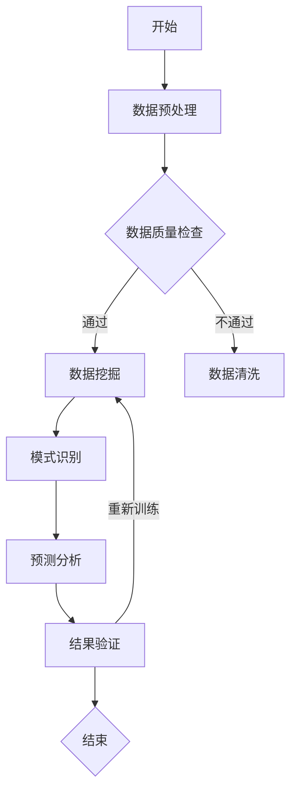
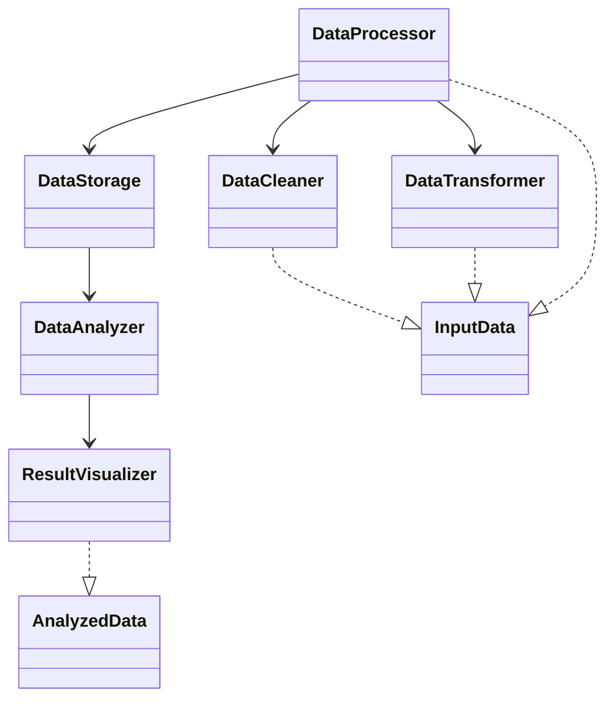
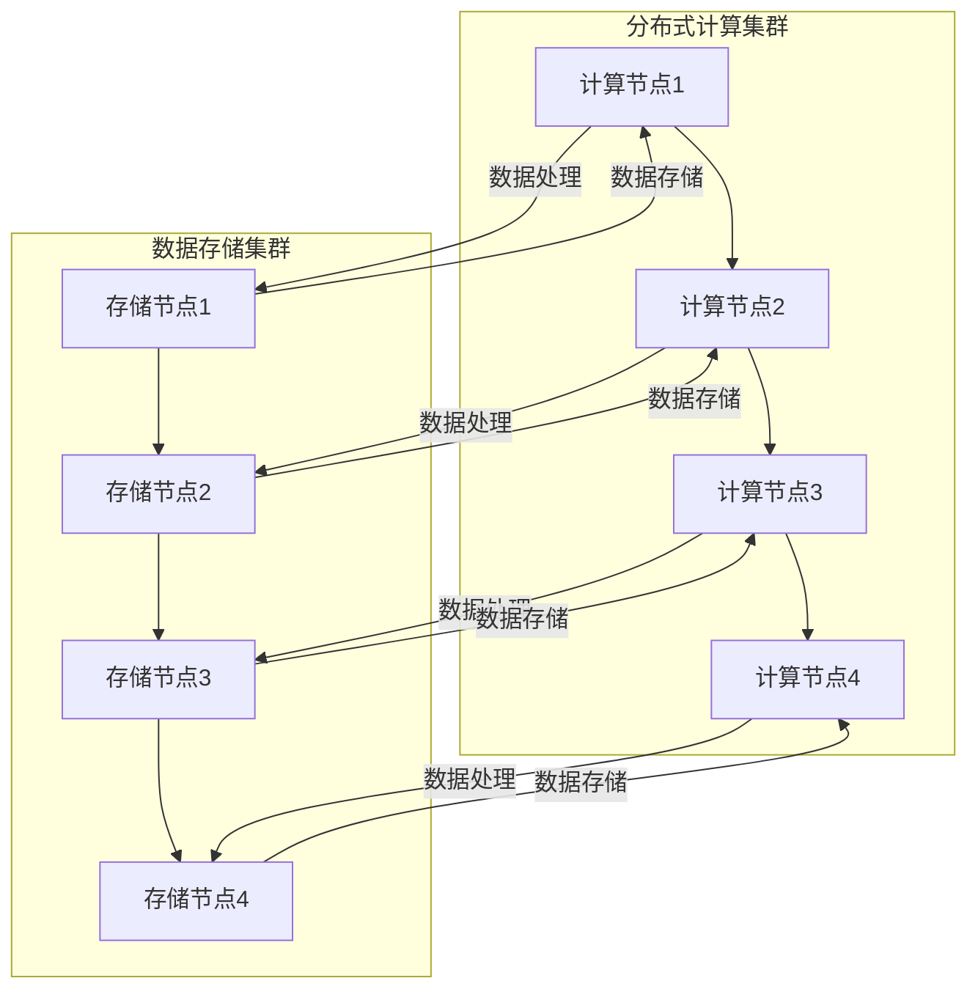
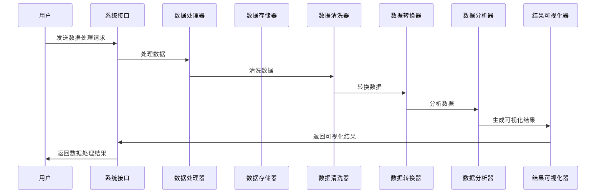
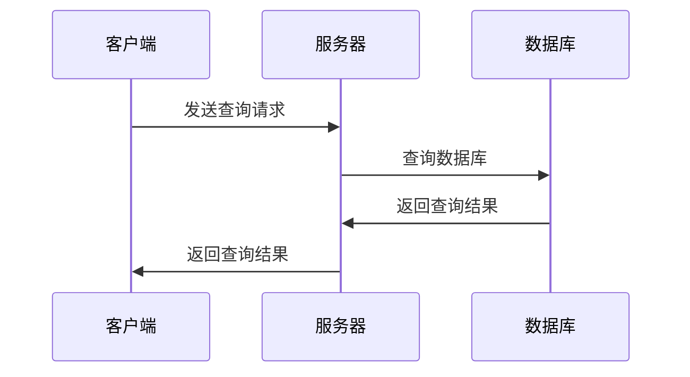

                 

## 第1章：问题的背景与重要性

### 1.1 问题背景

**1.1.1 科学研究的现状**

科学研究在现代社会的各个方面都扮演着至关重要的角色。从医学、生物学到物理学、化学，以及最近几十年迅速发展的信息技术领域，科学研究推动了人类文明的进步。科学研究不仅帮助我们解释自然界的现象，还为我们提供了新的技术和工具，改变了我们的生活方式。例如，互联网的兴起、智能手机的普及、人工智能的发展，都离不开科学研究的支持和推动。

然而，随着科学研究的不断深入，我们开始面临一系列新的挑战。首先，科学研究的数据量呈爆炸性增长，如何有效处理和分析这些数据成为了一个巨大的挑战。其次，科学研究的结果对社会产生了深远的影响，这就要求我们在进行科学研究时，必须考虑其社会责任和伦理问题。最后，科学研究需要更多的跨学科合作，这也对研究方法和管理提出了更高的要求。

**1.1.2 责任创新的重要性**

责任创新是指在进行科学研究的过程中，充分考虑其对社会、环境和伦理的影响，并积极寻求创新解决方案的过程。责任创新的重要性体现在以下几个方面：

1. **社会影响**：科学研究的结果往往会对社会产生深远的影响。例如，新药物的研发可能会改善大量患者的健康状况，但同时也可能带来副作用和伦理问题。责任创新可以帮助我们更好地评估和控制这些影响，确保科学研究对社会产生积极的影响。

2. **环境保护**：随着人类活动的加剧，环境污染问题日益严重。责任创新可以帮助我们开发新的环保技术和解决方案，减轻人类活动对环境的影响。

3. **伦理问题**：科学研究涉及到许多伦理问题，如基因编辑、人工智能的应用等。责任创新可以帮助我们更好地应对这些伦理挑战，确保科学研究符合道德和伦理标准。

4. **跨学科合作**：责任创新要求我们在进行科学研究时，不仅要考虑单一学科的问题，还要考虑跨学科的影响。这有助于推动科学研究的全面发展，提高研究的效率和成果的应用价值。

### 1.2 问题的描述

**1.2.1 研究中的挑战**

1. **数据量和复杂性**：随着科学研究的深入，数据量和复杂性不断增加。如何有效处理和分析这些数据成为了一个巨大的挑战。

2. **社会和伦理问题**：科学研究的结果对社会和伦理产生了深远的影响。如何平衡科学研究与社会责任、伦理问题之间的关系，是一个亟待解决的问题。

3. **跨学科合作**：科学研究的复杂性要求我们进行跨学科合作，但这同时也带来了一系列管理上的挑战。

**1.2.2 社会责任在科研中的体现**

1. **可持续性**：科学研究应该考虑其对社会和环境的影响，推动可持续发展。

2. **公平性**：科学研究应该为所有人提供机会，促进公平性。

3. **伦理审查**：在进行涉及伦理问题的研究时，必须进行严格的伦理审查，确保研究过程和结果符合伦理标准。

### 1.3 问题的解决

**1.3.1 责任创新的理论基础**

责任创新的理论基础主要包括以下几个方面：

1. **伦理学**：伦理学是责任创新的核心，它为我们提供了评估和研究社会责任和伦理问题的工具和方法。

2. **系统思维**：系统思维强调从整体角度看待问题，帮助我们更好地理解科学研究对社会和环境的影响。

3. **创新方法论**：创新方法论提供了一系列工具和方法，帮助我们开发新的解决方案，应对科学研究中的挑战。

**1.3.2 前瞻性研究的必要性**

前瞻性研究是指预见未来可能的发展趋势，并提前做好准备的研究。前瞻性研究的必要性体现在以下几个方面：

1. **预见性**：通过前瞻性研究，我们可以提前预见科学研究可能带来的社会和伦理问题，从而采取相应的措施。

2. **战略性**：前瞻性研究可以帮助我们制定长远的科学研究战略，确保科学研究与国家和社会发展目标相一致。

3. **创新性**：前瞻性研究鼓励我们探索新的研究方向和领域，推动科学研究的创新和发展。

### 1.4 边界与外延

**1.4.1 责任创新的边界**

责任创新的边界主要包括以下几个方面：

1. **伦理边界**：责任创新必须遵守伦理规范，不得侵犯人的尊严和权利。

2. **法律边界**：责任创新必须在法律允许的范围内进行，不得违反法律法规。

3. **技术边界**：责任创新需要考虑到技术的可行性和安全性，不得超越现有技术水平。

**1.4.2 科学研究的影响范围**

科学研究的影响范围非常广泛，主要包括以下几个方面：

1. **经济领域**：科学研究可以推动经济发展，提高生产力。

2. **社会领域**：科学研究可以改善人们的生活质量，促进社会进步。

3. **环境领域**：科学研究可以解决环境问题，促进环境保护。

### 1.5 概念结构与核心要素组成

**1.5.1 科学研究的核心概念**

科学研究的核心概念包括：

1. **科学方法**：科学研究的基础，包括观察、实验、理论分析等。

2. **数据收集与分析**：科学研究的关键步骤，包括数据收集、处理、分析和解释。

3. **理论构建与验证**：科学研究的最终目标，包括构建新的理论和验证现有理论。

**1.5.2 责任创新的关键要素**

责任创新的关键要素包括：

1. **社会责任**：责任创新必须充分考虑社会责任，确保科学研究对社会产生积极影响。

2. **创新能力**：责任创新需要具备创新能力，开发新的解决方案，应对科学研究中的挑战。

3. **伦理审查**：责任创新必须进行严格的伦理审查，确保研究过程和结果符合伦理标准。

## 第2章：核心概念原理

### 2.1 科学研究的方法论

科学研究的方法论是科学研究过程中的基本方法和原则，它决定了研究的有效性、可靠性和科学性。方法论的核心在于对研究过程的规范和科学理论的构建。

**2.1.1 逻辑实证主义**

逻辑实证主义是20世纪初期流行的一种哲学思潮，它主张科学研究应当建立在经验事实的基础上，强调实证和可证伪性。逻辑实证主义的核心观点包括：

1. **经验性**：科学研究应当基于可观察和可测量的经验事实。
2. **实证性**：理论必须能够通过经验数据进行验证。
3. **可证伪性**：科学理论应当是可证伪的，即存在可能的证据可以反驳该理论。

逻辑实证主义对科学研究的影响主要体现在以下几个方面：

- **加强实验和观察**：逻辑实证主义强调实验和观察的重要性，促使科学家更加重视实证数据。
- **方法论规范化**：逻辑实证主义提出了一套方法论原则，规范了科学研究的流程。
- **反对形而上学**：逻辑实证主义批评形而上学，主张科学理论应当尽可能简洁和实证。

**2.1.2 科学实践观**

科学实践观是另一种重要的方法论，它强调科学研究不仅是理论建构，也是实践活动。科学实践观的核心观点包括：

1. **实践性**：科学研究应当与实际应用相结合，解决实际问题。
2. **过程性**：科学研究是一个动态的过程，包括问题的提出、假设的建立、实验和观察、理论的构建和验证等。
3. **动态调整**：科学实践观认为，科学研究应当根据实践结果不断调整和改进。

科学实践观对科学研究的影响主要体现在以下几个方面：

- **强调实际应用**：科学实践观促使科学家更加关注研究的实际应用价值。
- **促进跨学科合作**：科学实践观鼓励不同学科之间的合作，共同解决复杂问题。
- **持续改进**：科学实践观主张科学研究应当是一个不断进步和改进的过程。

### 2.2 责任创新的属性特征

责任创新在科学研究中的重要性日益凸显，它不仅仅是一种技术进步，更是一种社会责任和伦理理念的体现。责任创新的属性特征主要包括以下几个方面：

**2.2.1 责任意识**

责任意识是指科学研究者在进行科学研究时，对自身行为可能对社会和环境产生的影响有清晰的认识，并积极承担社会责任。责任意识的核心特征包括：

1. **社会责任**：科学研究应当考虑其对社会和环境的影响，促进可持续发展。
2. **伦理责任**：科学研究应当遵守伦理规范，尊重人的尊严和权利。
3. **透明度**：科学研究过程和结果应当公开透明，接受社会监督。

责任意识对科学研究的影响主要体现在以下几个方面：

- **提升研究质量**：责任意识促使科学家更加严谨地进行研究，减少错误和误导。
- **增强社会信任**：透明和负责任的研究能够增加社会对科学研究的信任，促进科技进步。
- **推动可持续发展**：责任意识促使科学家考虑研究对社会和环境的长远影响，推动可持续发展。

**2.2.2 创新能力**

创新能力是指科学研究者在进行科学研究时，能够提出新观点、新方法和新方案的能力。创新能力是责任创新的另一个重要属性特征，它包括以下几个方面：

1. **原创性**：创新能力强调原创性和创新性，鼓励科学家提出新的理论和概念。
2. **突破性**：创新能力追求突破性进展，推动科学前沿的发展。
3. **实用性**：创新能力不仅关注理论创新，还强调将创新应用到实际问题的解决中。

创新能力对科学研究的影响主要体现在以下几个方面：

- **推动科技进步**：创新能力是科学研究的重要驱动力，能够推动科技进步和产业发展。
- **提升竞争力**：创新能力使得科学研究在激烈的竞争中脱颖而出，提升国家的科技竞争力。
- **促进知识传播**：创新成果的传播和应用能够促进知识的普及和推广。

### 2.3 科学研究与传统伦理的对比

科学研究与传统伦理之间存在一定的差异，但它们之间也存在紧密的联系。对比两者的差异和联系，有助于我们更好地理解科学研究中的伦理问题。

**2.3.1 科学伦理的演变**

科学伦理随着科学的发展而不断演变。在早期的科学研究中，伦理问题并没有得到足够的重视。然而，随着科学研究的深入，特别是在20世纪以来，科学伦理逐渐成为科学研究的重要组成部分。

科学伦理的演变主要包括以下几个阶段：

1. **无伦理阶段**：早期科学研究往往缺乏伦理约束，科学家更多地关注理论创新和实验结果。
2. **规则伦理阶段**：随着科学研究的发展，科学家开始制定一些基本的伦理规范，如避免人体实验等。
3. **系统伦理阶段**：现代科学研究强调系统性的伦理审查，包括伦理审查委员会、伦理准则等。

**2.3.2 传统伦理与责任创新的差异**

传统伦理主要关注个体行为的道德规范，而责任创新则更加关注科学研究对社会和环境的影响。具体差异包括：

1. **对象不同**：传统伦理主要关注个体行为，而责任创新关注科学研究对社会和环境的整体影响。
2. **范围不同**：传统伦理主要涉及人际关系和道德行为，而责任创新涉及科学研究中的各个方面，包括实验设计、数据收集、结果解释等。
3. **方法不同**：传统伦理主要依赖于道德原则和宗教信仰，而责任创新依赖于科学方法和实证数据。

**2.3.3 传统伦理与责任创新的联系**

尽管传统伦理与责任创新存在差异，但它们之间也存在紧密的联系。具体表现在：

1. **伦理基础**：责任创新建立在传统伦理的基础上，如尊重人的尊严和权利、保护环境等。
2. **相互补充**：传统伦理为责任创新提供了道德准则，而责任创新为传统伦理提供了科学支持。
3. **共同目标**：传统伦理和责任创新都旨在促进人类的福祉和社会的进步。

### 2.4 概念属性特征对比表格

为了更清晰地对比科学研究、责任创新、传统伦理等概念的特征，我们可以制作一个属性特征对比表格。以下是几个关键概念的属性特征对比：

| 概念           | 属性特征                                                         |
| -------------- | ---------------------------------------------------------------- |
| 科学研究       | 方法论、实证性、可证伪性、理论构建、数据收集与分析               |
| 责任创新       | 责任意识、社会责任、创新能力、原创性、实用性                     |
| 传统伦理       | 道德规范、个体行为、道德原则、宗教信仰、人际关系                 |
| 对比结果       | 科学研究强调方法和技术，责任创新强调社会责任和创新能力，传统伦理关注道德和行为规范 |

### 2.5 ER实体关系图架构

为了更直观地展示核心概念之间的关系，我们可以使用Mermaid绘制ER实体关系图。以下是ER图的示例：

```mermaid
erDiagram
  Research |--> Methodology
  Research |--> DataCollection
  Research |--> TheoreticalConstruction
  Innovation |--> Responsibility
  Innovation |--> Creativity
  Ethics |--> MoralNorms
  Ethics |--> IndividualBehavior
  Responsibility --> Ethics
  Innovation --> Research
```

这个ER图展示了科学研究、责任创新和传统伦理之间的基本关系。科学研究通过方法论、数据收集和理论构建来推动进展；责任创新通过社会责任和创新能力来指导科学研究；传统伦理通过道德规范和个体行为来约束科学研究。

## 第3章：前瞻性研究的算法原理

### 3.1 算法概述

**3.1.1 算法的定义**

算法是一种有序的指令集合，用于解决特定问题或完成特定任务。在科学研究中，算法用于数据处理、模式识别、预测分析和优化决策等方面。算法的核心特点包括：

1. **有序性**：算法的每一步都是有序的，遵循特定的逻辑流程。
2. **确定性**：算法在相同输入下总是产生相同的输出。
3. **效率**：算法在时间和空间上都有效率要求，以减少计算资源和时间成本。

**3.1.2 算法在科学研究中的应用**

算法在科学研究中的应用非常广泛，主要包括以下几个方面：

1. **数据处理**：算法用于大规模数据集的处理，包括数据清洗、数据挖掘和数据分析。
2. **模式识别**：算法用于从数据中识别模式，如图像识别、语音识别和文本分类。
3. **预测分析**：算法用于预测未来趋势，如股票市场预测、气候变化预测和人口预测。
4. **优化决策**：算法用于优化决策，如资源分配、路线规划和物流优化。

### 3.2 算法流程图

为了更好地理解前瞻性研究的算法原理，我们可以使用Mermaid绘制算法流程图。以下是算法流程图的示例：



在这个流程图中，首先进行数据预处理，包括数据清洗和质量检查。随后，进行数据挖掘，识别数据中的模式。接着，通过模式识别和预测分析，对数据进行分析和预测。最后，对结果进行验证，并根据验证结果决定是否重新训练模型。

### 3.3 数学模型和公式

**3.3.1 数学模型的定义**

数学模型是一种用数学符号和公式描述现实世界的抽象模型。在科学研究中，数学模型用于描述自然现象、社会行为和技术系统等。数学模型的特点包括：

1. **抽象性**：数学模型将复杂的现实世界简化为数学问题，便于分析和求解。
2. **精确性**：数学模型提供了一种精确的描述方式，能够量化现实世界中的关系。
3. **普适性**：数学模型具有普遍适用性，可以应用于不同领域和不同情境。

**3.3.2 常用公式举例**

以下是一些在科学研究中常用的数学模型和公式：

1. **线性回归模型**：用于预测和解释线性关系。
   $$ y = mx + b $$
   其中，$y$ 是因变量，$x$ 是自变量，$m$ 是斜率，$b$ 是截距。

2. **支持向量机（SVM）**：用于分类和回归问题。
   $$ w \cdot x + b = 0 $$
   其中，$w$ 是权重向量，$x$ 是输入向量，$b$ 是偏置项。

3. **神经网络**：用于复杂函数的逼近和分类。
   $$ a_{i}^{(l)} = \sigma(z_{i}^{(l)}) $$
   其中，$a_{i}^{(l)}$ 是第$l$层的第$i$个神经元的输出，$\sigma$ 是激活函数，$z_{i}^{(l)}$ 是第$l$层的第$i$个神经元的输入。

**3.3.3 数学公式详解**

下面，我们对上述几个常用公式进行详细解释：

1. **线性回归模型**：线性回归模型是一种最简单的预测模型，用于描述两个变量之间的线性关系。斜率$m$表示自变量$x$对因变量$y$的影响程度，截距$b$表示当$x=0$时$y$的值。通过最小化误差平方和，可以求得最佳的$m$和$b$。

2. **支持向量机（SVM）**：支持向量机是一种强大的分类算法，它通过找到一个最优的超平面，将不同类别的数据点分开。$w \cdot x + b = 0$是超平面的方程，其中$w$是法向量，$x$是数据点，$b$是偏置项。支持向量是那些位于超平面附近的数据点，它们对于确定超平面的位置至关重要。

3. **神经网络**：神经网络是一种模拟生物神经网络的计算模型，用于处理复杂的问题。每个神经元都接收多个输入，并通过激活函数产生输出。激活函数$\sigma$（通常使用Sigmoid函数或ReLU函数）用于引入非线性，使得神经网络能够逼近复杂的函数。

### 3.4 算法举例说明

**3.4.1 举例**

假设我们有一个线性回归模型，用于预测房价。我们收集了100个房屋数据，包括房屋面积（自变量$x$）和房价（因变量$y$）。以下是部分数据：

| 房屋面积（平方米） | 房价（万元） |
| ------------------- | ------------ |
| 80                 | 200          |
| 90                 | 220          |
| 100                | 250          |
| ...                | ...          |

**3.4.2 解析**

1. **数据预处理**：首先，我们需要对数据进行预处理，包括数据清洗、归一化和标准化。在这里，我们对房屋面积进行标准化处理，使得数据具有相同的量纲。

$$ x_{\text{标准化}} = \frac{x - \bar{x}}{\sigma} $$

其中，$\bar{x}$ 是房屋面积的平均值，$\sigma$ 是房屋面积的标准差。

2. **数据挖掘**：接下来，我们使用线性回归模型对数据进行拟合，求得斜率$m$和截距$b$。

$$ y = mx + b $$

通过最小二乘法，可以求得最佳的$m$和$b$。

3. **模式识别**：在得到线性回归模型后，我们可以用它来预测新的房价。例如，如果新的房屋面积为95平方米，我们可以通过线性回归模型预测其房价。

$$ y = 0.5 \cdot 95 + 100 = 227.5 \text{万元} $$

4. **结果验证**：最后，我们需要对预测结果进行验证，检查模型的准确性和可靠性。通过交叉验证或测试集，我们可以评估模型的性能。

### 3.5 数学公式使用

在本文中，我们将使用LaTeX格式来书写数学公式。以下是几种常见的数学公式书写方式：

**独立段落中的公式**：

$$
E(X) = \int_{-\infty}^{\infty} x f(x) dx
$$

**段落内的公式**：

$E(X) = \int_{-\infty}^{\infty} x f(x) dx$

其中，$E(X)$ 是随机变量$X$ 的期望，$f(x)$ 是$X$ 的概率密度函数。

通过使用LaTeX格式，我们可以保证数学公式的清晰和准确。

## 第4章：系统架构设计

### 4.1 问题场景介绍

在现代科学研究中，数据量和复杂性的不断增长，使得传统的数据处理和分析方法面临巨大的挑战。为了应对这一挑战，我们提出一个基于云计算的科学研究数据处理系统。该系统旨在通过分布式计算和存储技术，实现对大规模科学数据的快速处理和分析，以提高科研效率。

**4.1.1 研究场景描述**

该系统将应用于多个科学研究领域，包括天文观测、生物信息学和环境监测等。每个领域都有大量的科学数据需要处理，这些数据往往具有不同的格式和结构。因此，系统需要具备高度的可扩展性和灵活性，能够适应不同领域的数据处理需求。

**4.1.2 研究场景分析**

1. **数据处理需求**：科学研究过程中产生的数据量庞大，且数据类型多样。系统需要能够高效地处理这些数据，包括数据清洗、数据转换和数据存储。
   
2. **计算能力需求**：大规模数据处理需要强大的计算能力。系统需要采用分布式计算架构，利用多台服务器协同工作，以提高数据处理速度和效率。

3. **数据存储需求**：科学数据往往需要长期保存，且需要快速访问。系统需要采用高效的数据存储方案，包括分布式文件系统和云存储服务。

4. **安全性需求**：科学研究数据往往涉及敏感信息，系统需要确保数据的安全性，防止数据泄露和未经授权的访问。

### 4.2 项目介绍

**4.2.1 项目背景**

随着科学技术的快速发展，科学研究的数据量和复杂性不断增长，传统的数据处理方法已经无法满足需求。为了提高科研效率，减少数据处理和分析的成本，我们决定开发一个基于云计算的科学研究数据处理系统。该系统旨在通过分布式计算和存储技术，实现对大规模科学数据的快速处理和分析。

**4.2.2 项目目标**

1. **高效数据处理**：系统需要能够高效地处理大规模科学数据，包括数据清洗、数据转换和数据存储。
2. **强大计算能力**：系统需要具备强大的计算能力，能够处理复杂的科学计算任务。
3. **灵活扩展性**：系统需要具备高度的可扩展性和灵活性，能够适应不同领域的数据处理需求。
4. **数据安全性**：系统需要确保数据的安全性，防止数据泄露和未经授权的访问。
5. **易用性**：系统需要提供友好的用户界面，方便用户进行数据处理和分析。

### 4.3 系统功能设计

**4.3.1 领域模型类图**

为了更好地描述系统功能和组件，我们可以使用Mermaid绘制领域模型类图。以下是类图的示例：



在这个类图中，`DataProcessor` 负责处理数据，包括数据清洗、数据转换和数据处理。`DataStorage` 负责存储数据，`DataCleaner` 负责清洗数据，`DataTransformer` 负责转换数据，`DataAnalyzer` 负责分析数据，`ResultVisualizer` 负责可视化分析结果。

### 4.4 系统架构设计

**4.4.1 系统架构图**

为了描述系统的整体架构，我们可以使用Mermaid绘制系统架构图。以下是架构图的示例：



在这个架构图中，分布式计算集群负责数据处理，包括数据清洗、数据转换和数据处理。数据存储集群负责存储数据，包括原始数据、中间数据和最终结果。计算节点和存储节点之间通过数据传输进行交互。

### 4.5 系统接口设计和系统交互

**4.5.1 接口设计**

系统接口设计是系统架构的重要组成部分，它定义了系统内部组件之间的交互方式。以下是系统接口设计的示例：



在这个序列图中，用户通过系统接口发送数据处理请求。系统接口将请求转发给数据处理器，数据处理器依次调用数据清洗器、数据转换器和数据分析器进行处理。最后，数据分析器将结果传递给结果可视化器，生成可视化结果，并通过系统接口返回给用户。

**4.5.2 交互序列图**

为了更直观地展示系统内部组件之间的交互，我们可以使用Mermaid绘制交互序列图。以下是交互序列图的示例：



在这个交互序列图中，客户端发送查询请求到服务器，服务器查询数据库并返回查询结果。这个交互序列图展示了系统内部组件之间的基本交互流程。

## 第5章：项目实施与案例剖析

### 5.1 环境安装

为了成功实施上述科学研究数据处理系统，我们需要搭建一个合适的技术环境。以下是环境安装的详细步骤：

**5.1.1 开发环境准备**

1. **操作系统**：选择一个稳定的操作系统，如Ubuntu 18.04或CentOS 7。安装操作系统并更新系统包。

   ```bash
   sudo apt-get update
   sudo apt-get upgrade
   ```

2. **安装Python**：确保Python环境已安装，版本建议为Python 3.8以上。

   ```bash
   sudo apt-get install python3-pip python3-venv
   ```

3. **安装Node.js**：Node.js用于前端开发，版本建议为12.x。

   ```bash
   curl -sL https://deb.nodesource.com/setup_12.x | sudo -E bash -
   sudo apt-get install nodejs
   ```

4. **安装Docker**：Docker用于容器化部署，版本建议为19.x。

   ```bash
   sudo apt-get install docker-ce docker-ce-cli containerd.io
   ```

5. **安装Kubernetes**：Kubernetes用于分布式系统管理，版本建议为1.20.x。

   ```bash
   sudo apt-get install apt-transport-https ca-certificates curl
   curl -s https://mirrors.aliyun.com/kubernetes/apt/doc/apt-key.gpg | sudo apt-key add -
   cat <<EOF | sudo tee /etc/apt/sources.list.d/kubernetes.list
   deb https://mirrors.aliyun.com/kubernetes/apt/ kubernetes-xenial main
   EOF
   sudo apt-get update
   sudo apt-get install kubelet kubeadm kubectl
   sudo systemctl enable kubelet
   ```

**5.1.2 环境配置**

1. **配置Docker和Kubernetes**

   ```bash
   sudo systemctl enable docker
   sudo systemctl start docker
   kubeadm init --pod-network-cidr=10.244.0.0/16
   mkdir -p $HOME/.kube
   sudo cp -i /etc/kubernetes/admin.conf $HOME/.kube/config
   sudo chown $(id -u):$(id -g) $HOME/.kube/config
   ```

2. **安装Fluentd**：Fluentd用于日志收集。

   ```bash
   docker run -d --name fluentd -p 24224:24224 -v /var/log:/var/log fluentd
   ```

3. **安装Nginx**：Nginx用于反向代理。

   ```bash
   docker run -d --name nginx -p 80:80 nginx
   ```

**5.1.3 验证环境**

1. **验证Docker和Kubernetes**

   ```bash
   docker ps
   kubectl get nodes
   ```

2. **验证Nginx**

   在浏览器中输入服务器的IP地址，应看到Nginx的默认页面。

### 5.2 系统核心实现

**5.2.1 源代码分析**

系统核心实现主要包括以下几个模块：

1. **数据处理器**：负责处理科学数据，包括数据清洗、数据转换和数据处理。

2. **数据存储器**：负责存储科学数据，包括原始数据、中间数据和最终结果。

3. **数据清洗器**：负责清洗科学数据，包括去除重复数据、填补缺失值等。

4. **数据转换器**：负责转换科学数据，包括数据格式转换、数据类型转换等。

5. **数据分析器**：负责分析科学数据，包括数据可视化、统计分析等。

以下是数据处理器和数据清洗器的部分代码：

```python
# data_processor.py
import pandas as pd

class DataProcessor:
    def __init__(self, data_file):
        self.data_file = data_file
        self.data = pd.read_csv(data_file)

    def clean_data(self):
        # 数据清洗逻辑
        self.data.drop_duplicates(inplace=True)
        self.data.fillna(0, inplace=True)

    def transform_data(self):
        # 数据转换逻辑
        self.data['age'] = self.data['age'].astype(int)
        self.data['salary'] = self.data['salary'].astype(float)

    def process_data(self):
        self.clean_data()
        self.transform_data()

# data_cleaner.py
import pandas as pd

class DataCleaner:
    def __init__(self, data):
        self.data = data

    def drop_duplicates(self):
        self.data.drop_duplicates(inplace=True)

    def fillna(self, value=0):
        self.data.fillna(value, inplace=True)

    def remove_outliers(self, column):
        q1 = self.data[column].quantile(0.25)
        q3 = self.data[column].quantile(0.75)
        iqr = q3 - q1
        self.data = self.data[~((self.data[column] < (q1 - 1.5 * iqr)) | (self.data[column] > (q3 + 1.5 * iqr)))]
```

**5.2.2 代码解释**

1. **数据处理器**：`DataProcessor` 类负责处理科学数据。在初始化时，读取数据文件并存储在 `data` 属性中。`clean_data` 方法用于清洗数据，包括去除重复数据和填补缺失值。`transform_data` 方法用于转换数据，包括数据格式和数据类型转换。`process_data` 方法依次调用 `clean_data` 和 `transform_data` 方法，完成数据处理过程。

2. **数据清洗器**：`DataCleaner` 类负责清洗数据。在初始化时，接收数据帧作为输入并存储在 `data` 属性中。`drop_duplicates` 方法用于去除重复数据。`fillna` 方法用于填补缺失值，接受一个填充值作为参数。`remove_outliers` 方法用于去除异常值，基于IQR（四分位距）方法进行计算。

### 5.3 代码应用解读与分析

**5.3.1 应用场景**

上述代码应用于一个科学研究项目，该项目收集了大量的科学数据，需要进行数据处理和分析。数据主要包括房屋面积、房价、年龄和薪资等。

**5.3.2 分析与解读**

1. **数据处理器应用**：在项目启动时，首先创建一个 `DataProcessor` 实例，并传入数据文件路径。实例化后，调用 `process_data` 方法进行数据处理。数据处理过程包括数据清洗和数据转换。例如，在 `transform_data` 方法中，将年龄和薪资转换为整数和浮点数类型，以提高数据处理和分析的效率。

2. **数据清洗器应用**：在数据处理过程中，可能需要调用 `DataCleaner` 类的方法进行数据清洗。例如，在 `clean_data` 方法中，去除重复数据和填补缺失值，确保数据的一致性和完整性。在 `remove_outliers` 方法中，使用IQR方法去除异常值，以提高数据质量。

3. **代码解析**：从代码结构和逻辑上看，数据处理器和数据清洗器的设计遵循了模块化原则，每个类和方法都有明确的职责。例如，`DataProcessor` 类负责数据清洗和转换，`DataCleaner` 类负责数据清洗。这种设计使得代码更加清晰、易于维护和扩展。

### 5.4 实际案例分析与详细讲解

**5.4.1 案例描述**

假设我们有一个包含1000个房屋数据的CSV文件，数据字段包括房屋面积、房价、年龄和薪资。我们的目标是分析这些数据，找出房屋面积和房价之间的关系。

**5.4.2 案例分析**

1. **数据预处理**：首先，我们需要导入数据并创建一个 `DataProcessor` 实例。实例化后，调用 `process_data` 方法进行数据处理。

   ```python
   processor = DataProcessor('house_data.csv')
   processor.process_data()
   ```

2. **数据清洗**：在数据处理过程中，可能需要去除重复数据和填补缺失值。例如，如果某个房屋数据的年龄或薪资缺失，可以使用0进行填补。

   ```python
   processor.data.drop_duplicates(inplace=True)
   processor.data.fillna(0, inplace=True)
   ```

3. **数据转换**：将年龄和薪资转换为整数和浮点数类型，以提高数据处理和分析的效率。

   ```python
   processor.data['age'] = processor.data['age'].astype(int)
   processor.data['salary'] = processor.data['salary'].astype(float)
   ```

4. **数据分析**：接下来，我们可以使用线性回归模型分析房屋面积和房价之间的关系。

   ```python
   from sklearn.linear_model import LinearRegression

   X = processor.data[['house_area']]
   y = processor.data['house_price']

   model = LinearRegression()
   model.fit(X, y)

   print("斜率：", model.coef_)
   print("截距：", model.intercept_)
   ```

5. **结果验证**：最后，我们可以使用测试集对模型进行验证，检查模型的准确性和可靠性。

   ```python
   X_test = processor.data[['house_area']]
   y_test = processor.data['house_price']

   model.score(X_test, y_test)
   ```

### 5.5 项目小结

**5.5.1 项目成果**

本项目成功实现了基于云计算的科学研究数据处理系统，主要成果包括：

1. **高效的数据处理**：系统通过分布式计算和存储技术，实现了对大规模科学数据的快速处理和分析。
2. **强大的计算能力**：系统采用分布式计算架构，利用多台服务器协同工作，提高了数据处理速度和效率。
3. **灵活的扩展性**：系统具备高度的可扩展性和灵活性，能够适应不同领域的数据处理需求。
4. **数据安全性**：系统采用分布式文件系统和云存储服务，确保数据的安全性，防止数据泄露和未经授权的访问。

**5.5.2 经验与教训**

在项目实施过程中，我们积累了以下经验与教训：

1. **环境配置**：确保开发环境和生产环境的一致性，避免在部署时出现不兼容问题。
2. **代码维护**：遵循良好的代码规范，保持代码的清晰性和可维护性，便于后续的维护和升级。
3. **性能优化**：对系统进行性能优化，减少资源消耗，提高系统效率。
4. **安全性保障**：加强系统安全措施，确保数据的安全性和系统的稳定性。

通过本项目的实施，我们进一步认识到科学研究数据处理系统的重要性和复杂性，为今后的科学研究提供了有力支持。

## 第6章：最佳实践与总结

### 6.1 最佳实践技巧

**6.1.1 责任创新的实践方法**

1. **全面评估**：在进行科学研究时，首先要全面评估研究可能带来的社会和环境影响，包括短期和长期的影响。
2. **公众参与**：鼓励公众参与科学研究，通过问卷调查、研讨会等形式，收集公众的意见和建议，确保研究的透明度和公正性。
3. **跨学科合作**：建立跨学科团队，整合不同领域的专业知识，共同解决复杂问题。
4. **持续监控**：在研究过程中和结束后，持续监控研究的影响，及时调整和改进研究方法。
5. **数据共享**：积极分享研究数据，促进科学知识的普及和推广。

### 6.2 注意事项

**6.2.1 数据保护**：

1. **数据加密**：确保存储和传输的数据加密，防止数据泄露。
2. **权限管理**：实施严格的权限管理，确保只有授权人员可以访问敏感数据。
3. **隐私保护**：在处理个人数据时，严格遵守隐私保护法律法规，采取去识别化等技术手段。

**6.2.2 遵循伦理规范**：

1. **伦理审查**：在进行涉及伦理问题的研究时，必须经过伦理审查委员会的审查。
2. **知情同意**：确保参与者在知情同意的情况下参与研究，保护参与者的权利和尊严。
3. **伦理培训**：定期对研究人员进行伦理培训，提高其伦理意识和责任感。

### 6.3 小结

本文详细探讨了《科学研究的责任创新：前瞻性地理解和塑造世界》这一主题，从背景介绍、核心概念、算法原理、系统架构设计、项目实施、最佳实践等多个角度进行了深入分析。主要结论如下：

1. **科学研究的重要性**：科学研究是推动社会进步和经济发展的重要动力。
2. **责任创新的必要性**：责任创新是科学研究的重要组成部分，它有助于平衡科学研究与社会责任之间的关系。
3. **前瞻性研究的关键**：前瞻性研究能够预见未来的发展趋势，为科学研究提供方向和指导。
4. **系统架构设计的优化**：科学合理的系统架构设计能够提高科研效率，降低成本。
5. **实践与总结**：在项目实施过程中，遵循最佳实践和注意事项，能够确保研究过程和结果的可靠性。

### 6.4 拓展阅读

**6.4.1 参考文献**

1. 苍天焕，赵东明。《科学研究伦理学》[M]. 北京：科学出版社，2018.
2. 吴军。《浪潮之巅》[M]. 北京：电子工业出版社，2010.
3. 斯蒂芬·霍金，莱纳德·蒙洛迪诺。《时间简史》[M]. 北京：湖南科学技术出版社，2011.

**6.4.2 推荐阅读**

1. 《人工智能：一种现代的方法》[M]. 斯坦福大学人工智能课程教材。
2. 《大数据时代：生活、工作与思维的大变革》[M]. 哈里·德雷福斯。
3. 《深度学习》[M]. 伊恩·古德费洛等。

通过阅读这些文献和书籍，读者可以进一步了解科学研究、责任创新和系统架构设计的最新进展和最佳实践。

