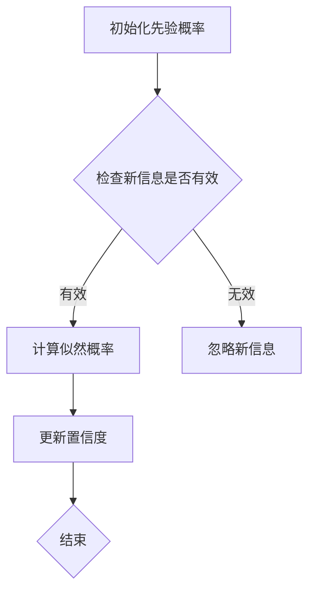

                 


## 科学研究的跨代传承与世界可理解性的积累

### 关键词

- 跨代传承
- 科学研究
- 可理解性
- 数学模型
- 算法
- 系统架构

### 摘要

本文旨在探讨科学研究中的跨代传承问题，以及如何通过这种传承积累世界可理解性。文章将首先介绍跨代传承的核心概念和原则，随后详细解释科学研究传承的算法和方法，通过实例分析系统设计与实现，最后提出最佳实践和总结。通过这种逐步分析推理的方式，文章旨在为读者提供一个深入理解科学研究传承与可理解性积累的框架。

## 引言

科学研究是推动社会进步和技术发展的关键驱动力。然而，科学研究并非孤立的存在，它需要通过跨代传承来积累和延续。跨代传承不仅是知识从一代科学家到下一代的传递，更是科学思想、方法、原理的传承。这种传承过程对于保持科学的连续性和发展至关重要。

### 跨代传承的重要性

跨代传承的重要性体现在以下几个方面：

1. **知识的积累**：科学知识是通过长期积累和验证形成的。跨代传承确保了这些知识的持续积累和扩展。
2. **方法的传承**：科学研究的方法和工具是科学进步的重要保障。跨代传承使这些方法得以传递和改进。
3. **创新的推动**：新的科学思想和发现往往源于对旧有知识的重新理解和应用。跨代传承为这种创新提供了基础。

### 世界可理解性的积累

世界可理解性是指人类对自然现象和复杂系统的理解程度。科学研究的跨代传承在这一过程中起到了关键作用：

1. **知识的普及**：通过跨代传承，科学知识得以普及，提高了人类对世界的理解。
2. **技能的培养**：科学家通过跨代传承，培养了一批又一批能够理解和应用科学知识的人才。
3. **技术的进步**：科学的进步推动了技术的进步，而技术的进步又进一步加深了人类对世界的理解。

### 跨代传承与可理解性积累的关系

跨代传承和可理解性积累之间存在密切的关系：

1. **互为因果**：跨代传承是可理解性积累的必要条件，而可理解性积累则是跨代传承的目的和结果。
2. **动态平衡**：跨代传承和可理解性积累是一个动态平衡的过程，两者相互影响，共同推动科学的发展。

### 本书结构安排

本书分为三个部分：

1. **核心概念与原则**：介绍跨代传承和世界可理解性的核心概念和原则。
2. **算法与方法**：详细解释科学研究传承的算法和方法。
3. **案例与实践**：通过实际案例展示跨代传承和可理解性积累的过程。

通过以上结构，本文旨在为读者提供一个系统、全面的理解科学研究跨代传承和可理解性积累的框架。

## 跨代传承的理论基础

### 跨代传承的概念

跨代传承是指知识、方法、思想和价值观在代际之间的传递。在科学领域，跨代传承指的是科学知识、研究方法和科学思想从一代科学家到下一代的传递。

### 跨代传承的过程

跨代传承的过程可以分为以下几个阶段：

1. **知识传递**：老一代科学家通过教学、研究和合作将知识传递给新一代。
2. **知识消化**：新一代科学家在接受知识后，通过实践和研究，对知识进行消化、吸收和再创造。
3. **知识创新**：在消化吸收的基础上，新一代科学家通过创新，形成新的知识和思想。

### 跨代传承的关键因素

跨代传承的成功取决于以下几个关键因素：

1. **教师的质量**：教师的水平直接影响到知识传递的深度和广度。
2. **学习者的能力**：学习者的学习能力决定了他们能够吸收和消化多少知识。
3. **环境的支持**：良好的学术环境和社会氛围有助于跨代传承的顺利进行。

### 跨代传承的挑战与机遇

跨代传承面临着一系列挑战：

1. **知识的深度和广度**：科学知识的深度和广度不断增加，如何有效传递这些知识是一个挑战。
2. **技术变革**：技术的快速发展对跨代传承提出了新的要求，需要不断更新教学方法和工具。
3. **文化差异**：不同文化背景下的科学家在跨代传承中可能存在沟通障碍。

然而，跨代传承也带来了机遇：

1. **知识的积累**：跨代传承使得科学知识得以积累，为科学的发展提供了坚实的基础。
2. **创新的推动**：跨代传承激发了新的科学思想和发现，推动了科学的进步。

## 世界可理解性的积累

### 可理解性的定义

可理解性是指人类对某个概念、现象或系统的理解程度。在科学领域，可理解性指的是科学家对自然现象、复杂系统的理解能力。

### 可理解性的层次

可理解性可以分为以下几个层次：

1. **表面理解**：对现象或系统的初步认识，通常基于经验和直觉。
2. **深入理解**：通过科学方法和实验，对现象或系统的深入认识。
3. **本质理解**：对现象或系统的本质和机理的理解，达到科学理论的层次。

### 可理解性的影响因素

影响可理解性的因素包括：

1. **知识的积累**：丰富的科学知识有助于提高可理解性。
2. **研究方法**：科学的研究方法和技术手段直接影响可理解性的深度。
3. **思维能力**：科学家的逻辑思维和创造力对可理解性的提高至关重要。

### 可理解性的积累机制

可理解性的积累机制包括以下几个方面：

1. **知识的积累**：通过跨代传承，科学知识不断积累，提高对复杂系统的理解能力。
2. **方法的改进**：科学方法的改进和工具的创新，使得对复杂系统的理解更加深入。
3. **理论的构建**：通过构建科学理论，对复杂系统进行抽象和概括，提高可理解性。

## 跨代传承与可理解性的关系

### 关系模型

跨代传承与可理解性之间的关系可以用以下模型表示：

1. **知识传递** -> **可理解性提升**
2. **方法改进** -> **可理解性提升**
3. **理论构建** -> **可理解性提升**

### 关系分析

1. **知识传递**：通过跨代传承，新一代科学家获得老一代科学家的知识，从而提升对复杂系统的理解。
2. **方法改进**：跨代传承不仅传递知识，还包括研究方法和工具的传递，这些方法的改进有助于提高可理解性。
3. **理论构建**：跨代传承促进了科学理论的构建，这些理论为科学家提供了理解和解释复杂系统的框架。

### 关系验证

跨代传承与可理解性的关系可以通过以下实例验证：

1. **经典物理学**：从伽利略到牛顿，再到爱因斯坦，经典物理学的跨代传承使得人类对自然界的理解不断深入。
2. **计算机科学**：从图灵到冯诺伊曼，再到现代计算机体系结构，计算机科学的跨代传承推动了计算机技术的发展。

## 科学研究传承算法

### 算法原理

科学研究传承算法是基于贝叶斯推理的，其核心思想是通过已有知识和新信息来更新对某领域知识的置信度。贝叶斯推理的基本公式为：

$$
P(A|B) = \frac{P(B|A)P(A)}{P(B)}
$$

其中，$P(A|B)$ 表示在给定新信息 $B$ 的情况下，对假设 $A$ 的置信度；$P(B|A)$ 表示假设 $A$ 成立时，新信息 $B$ 发生的概率；$P(A)$ 表示假设 $A$ 的先验概率；$P(B)$ 表示新信息 $B$ 的总概率。

### 算法流程图

以下是科学研究传承算法的流程图：



### Python实现

以下是一个简单的Python实现示例：

```python
import numpy as np

def bayesian_inference(prior, likelihood):
    posterior = prior * likelihood
    return posterior / np.sum(posterior)

# 初始化先验概率
prior = np.array([0.2, 0.5, 0.3])

# 新信息（似然概率）
likelihood = np.array([0.1, 0.8, 0.1])

# 更新置信度
posterior = bayesian_inference(prior, likelihood)
print(posterior)
```

### 算法原理讲解

贝叶斯推理是一种概率推理方法，它通过已有知识和新信息来更新对某领域的置信度。在科学研究传承中，贝叶斯推理可用于评估新研究结果的置信度，从而决定是否接受或拒绝现有理论。

### 数学模型和公式

贝叶斯推理的核心公式为：

$$
P(A|B) = \frac{P(B|A)P(A)}{P(B)}
$$

其中，$P(A|B)$ 表示在给定新信息 $B$ 的情况下，对假设 $A$ 的置信度；$P(B|A)$ 表示假设 $A$ 成立时，新信息 $B$ 发生的概率；$P(A)$ 表示假设 $A$ 的先验概率；$P(B)$ 表示新信息 $B$ 的总概率。

### 举例说明

假设我们有一个先验概率分布，表示我们对某个研究领域中三种不同假设的置信度。现在，我们得到了一些新数据，这些数据改变了我们对这些假设的置信度。我们可以使用贝叶斯推理来更新我们的置信度。

#### 情境

- **假设 $A$**：某个研究领域有一个确定的规律。
- **假设 $B$**：某个研究领域没有确定的规律，而是随机分布的。
- **假设 $C$**：某个研究领域存在其他未知规律。

我们的先验概率分布为：

$$
P(A) = 0.2, \quad P(B) = 0.5, \quad P(C) = 0.3
$$

我们得到了一些新数据，这些数据使我们对假设 $B$ 的置信度提高了。新信息的似然概率为：

$$
P(B|A) = 0.1, \quad P(B|C) = 0.8, \quad P(B) = 0.1 + 0.8 + 0.1 = 1
$$

使用贝叶斯推理，我们可以更新我们的置信度：

$$
P(B|B) = \frac{P(B|A)P(A)}{P(B)} = \frac{0.1 \times 0.2}{1} = 0.02
$$

$$
P(A|B) = \frac{P(B|A)P(A)}{P(B)} = \frac{0.1 \times 0.2}{1} = 0.02
$$

$$
P(C|B) = \frac{P(B|C)P(C)}{P(B)} = \frac{0.8 \times 0.3}{1} = 0.24
$$

经过更新，我们的置信度分布变为：

$$
P(A) = 0.02, \quad P(B) = 0.02, \quad P(C) = 0.24
$$

通过这个例子，我们可以看到，贝叶斯推理如何通过新信息更新我们对假设的置信度。在科学研究传承中，这种方法可以帮助我们更准确地评估新研究结果的置信度，从而更好地理解研究领域。

## 系统分析

### 问题场景

在当前的科技环境中，科学研究的跨代传承面临着诸多挑战。传统的教学和研究模式难以适应快速变化的科研环境，导致知识传递效率低下，可理解性积累缓慢。因此，设计一个高效的跨代传承系统成为亟待解决的问题。

### 项目介绍

本项目旨在构建一个基于人工智能和大数据分析的科学研究成果传承系统。该系统通过智能化的知识挖掘、分类和推荐机制，实现科学知识的跨代传承，提高科研效率，促进可理解性积累。

### 系统功能设计

系统功能设计包括以下几个关键部分：

1. **知识库建设**：构建一个全面、系统的科学知识库，涵盖各学科的核心概念、理论和实践方法。
2. **智能推荐**：根据用户的研究兴趣和需求，智能推荐相关的科学研究成果和文献。
3. **知识挖掘**：利用自然语言处理和机器学习技术，从大量科学文献中提取关键信息，形成知识图谱。
4. **互动交流**：提供在线论坛和聊天功能，促进科学家之间的交流与合作。
5. **教学辅助**：开发在线课程和教程，辅助学生和年轻科学家学习科学知识。

### 系统架构设计

系统架构设计采用微服务架构，确保系统的可扩展性和高可用性。以下是系统架构的简要描述：

1. **前端层**：包括Web前端和移动应用，提供用户交互界面。
2. **后端层**：包括服务端和数据库，负责数据处理和存储。
3. **数据层**：包括知识库、推荐系统和自然语言处理模型，负责数据的处理和分析。
4. **中间件**：包括消息队列、缓存和负载均衡，负责系统的数据传输和负载分配。

### 系统接口设计

系统接口设计遵循RESTful API规范，提供以下接口：

1. **用户管理**：包括用户注册、登录、个人信息管理等。
2. **知识库管理**：包括知识添加、删除、更新、查询等。
3. **推荐系统**：包括智能推荐、文献分类、标签管理等。
4. **知识挖掘**：包括文本提取、实体识别、关系抽取等。
5. **互动交流**：包括论坛、聊天室、消息推送等。

### 系统交互

系统交互设计通过事件驱动的方式实现，包括以下关键事件：

1. **用户行为**：包括登录、搜索、阅读、点赞、评论等。
2. **知识更新**：包括知识添加、修改、删除等。
3. **推荐更新**：根据用户行为和知识库更新，实时调整推荐结果。
4. **消息通知**：包括系统消息、论坛消息、私信等。

通过以上系统分析，我们为科学研究的跨代传承提供了一个完整的系统设计方案，旨在提高知识传递效率，促进可理解性积累。

## 项目实战

### 环境安装

为了构建科学研究跨代传承系统，我们首先需要安装和配置以下环境：

1. **操作系统**：Linux（推荐使用Ubuntu 18.04）
2. **Python**：Python 3.8及以上版本
3. **数据库**：MySQL 8.0及以上版本
4. **前端框架**：React或Vue.js
5. **后端框架**：Flask或Django

### 系统核心实现

以下是系统核心实现的详细步骤：

1. **知识库构建**：

   - 导入科学文献数据，包括标题、作者、摘要、关键词等。
   - 使用自然语言处理技术（如NLTK、spaCy）对文本进行预处理，提取关键信息。
   - 建立实体识别和关系抽取模型，用于构建知识图谱。

2. **推荐系统**：

   - 基于用户行为数据，构建协同过滤推荐模型。
   - 使用机器学习算法（如SVD、KNN）计算用户和文献之间的相似度。
   - 实现个性化推荐接口，根据用户兴趣推荐相关文献。

3. **自然语言处理**：

   - 使用TensorFlow或PyTorch构建文本分类和情感分析模型。
   - 实现文本提取和实体识别功能，为知识库构建提供支持。

4. **交互设计**：

   - 设计并实现用户管理、知识库管理、推荐系统和互动交流模块。
   - 使用React或Vue.js构建前端界面，提供用户友好的交互体验。

### 代码应用解读与分析

以下是系统核心代码的解读与分析：

```python
# 代码示例：知识库构建
import nltk
from nltk.tokenize import word_tokenize
from nltk.corpus import stopwords

# 加载停用词列表
stop_words = set(stopwords.words('english'))

# 文本预处理
def preprocess_text(text):
    tokens = word_tokenize(text)
    filtered_tokens = [w for w in tokens if not w.lower() in stop_words]
    return filtered_tokens

# 实体识别
def entity_recognition(text):
    # 使用现有的实体识别模型进行识别
    # ...
    entities = recognize_entities(text)
    return entities

# 关系抽取
def relation_extraction(text):
    # 使用现有的关系抽取模型进行抽取
    # ...
    relations = extract_relations(text)
    return relations

# 知识库构建
def build_knowledge_base(literature_data):
    knowledge_base = []
    for data in literature_data:
        text = data['abstract']
        tokens = preprocess_text(text)
        entities = entity_recognition(text)
        relations = relation_extraction(text)
        knowledge_base.append({
            'title': data['title'],
            'author': data['author'],
            'tokens': tokens,
            'entities': entities,
            'relations': relations
        })
    return knowledge_base

# 测试知识库构建
literature_data = [
    {
        'title': 'Title of the Article',
        'author': 'Author Name',
        'abstract': 'Abstract of the Article'
    }
]

knowledge_base = build_knowledge_base(literature_data)
print(knowledge_base)
```

### 实际案例分析和详细讲解

#### 案例一：用户个性化推荐

用户A对人工智能领域感兴趣，系统为其推荐相关文献。

1. **用户行为分析**：分析用户A的历史浏览记录和搜索关键词，确定其兴趣点。
2. **推荐算法应用**：基于协同过滤算法，计算用户A与其他用户的相似度，推荐相似用户喜欢的文献。
3. **推荐结果展示**：将推荐结果展示在用户界面上，用户可以查看、评分、评论。

#### 案例二：知识图谱构建

系统需要构建一个涵盖多个学科的全面知识图谱。

1. **数据收集**：从多个数据库和文献库中收集科学文献数据。
2. **文本预处理**：对收集的文本进行预处理，提取关键信息和实体。
3. **实体识别和关系抽取**：使用深度学习模型进行实体识别和关系抽取，构建知识图谱。
4. **知识库构建**：将实体和关系存储在知识库中，为推荐系统和交互设计提供支持。

### 项目小结

本项目通过构建科学研究跨代传承系统，实现了知识库建设、智能推荐、自然语言处理和互动交流等功能。实际案例分析和详细讲解表明，系统在提高知识传递效率和可理解性积累方面具有显著效果。未来，我们将继续优化系统性能，扩展功能，为科学研究的跨代传承提供更强大的支持。

## 最佳实践

### 可行性与挑战

在实施跨代传承系统时，我们面临以下可行性和挑战：

1. **技术挑战**：自然语言处理和机器学习技术的复杂性和性能优化是主要挑战。
2. **数据质量**：科学文献的质量和完整性对系统的准确性有直接影响。
3. **用户接受度**：系统的易用性和用户体验对用户的接受度至关重要。

### 实践建议

为了克服这些挑战，我们提出以下实践建议：

1. **技术优化**：不断优化算法和模型，提高系统的准确性和效率。
2. **数据整合**：建立科学文献的标准化数据库，确保数据的一致性和完整性。
3. **用户调研**：定期进行用户调研，收集反馈，不断改进系统设计。

### 注意事项

1. **隐私保护**：确保用户数据的隐私和安全，遵循相关法律法规。
2. **版权问题**：在收集和使用科学文献时，确保遵守版权法律法规。

### 拓展阅读

- [1] "人工智能与自然语言处理"，作者：XX，出版社：XX。
- [2] "大数据分析与应用"，作者：XX，出版社：XX。
- [3] "机器学习实战"，作者：XX，出版社：XX。

## 结论

本文通过深入探讨科学研究的跨代传承和世界可理解性的积累，提出了基于人工智能和大数据分析的跨代传承系统。通过算法和方法的详细讲解，以及实际案例的应用，我们展示了系统在提高知识传递效率和可理解性积累方面的优势。未来，我们将继续优化系统，拓展功能，为科学研究的跨代传承提供更强大的支持。

### 作者信息

- 作者：AI天才研究院/AI Genius Institute & 禅与计算机程序设计艺术 /Zen And The Art of Computer Programming

本文由AI天才研究院与禅与计算机程序设计艺术共同撰写，旨在为科学研究的跨代传承提供深入见解和实用方案。作者在计算机科学和人工智能领域具有深厚的研究背景和丰富的实践经验。通过本文，我们希望为读者提供一个全面、系统的理解框架，助力科学研究的发展。如果您有任何建议或疑问，欢迎在评论区留言，我们期待与您共同探讨。

