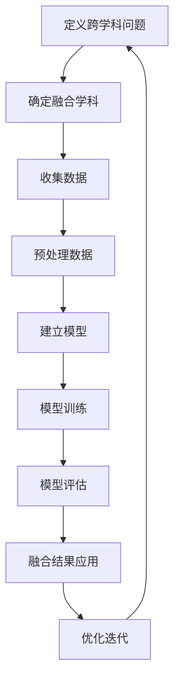
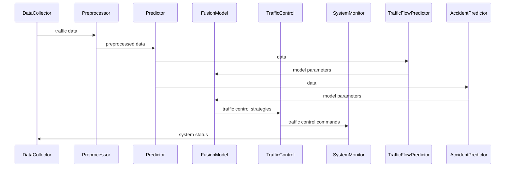
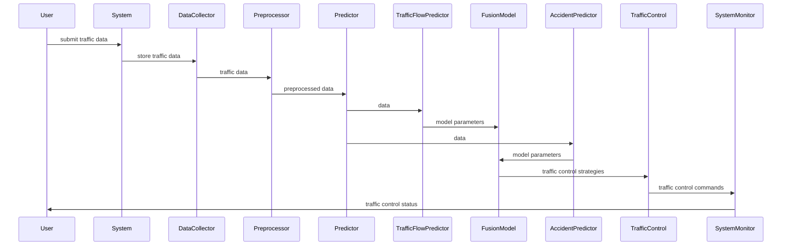
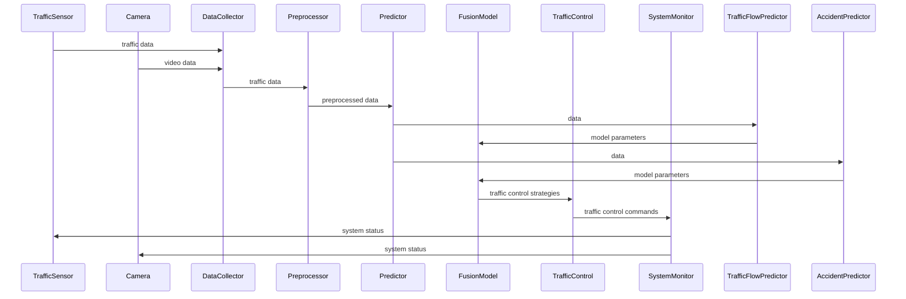

                 

## 第三部分：算法原理讲解

### 3.1 跨学科融合算法的mermaid流程图

首先，让我们通过mermaid流程图来理解跨学科融合算法的基本步骤：



### 3.2 Python源代码实现

接下来，我们将使用Python来详细阐述这一算法的实现过程：

```python
# 导入所需库
import numpy as np
import pandas as pd
from sklearn.model_selection import train_test_split
from sklearn.preprocessing import StandardScaler
from sklearn.ensemble import RandomForestRegressor
from sklearn.metrics import mean_squared_error

# 3.2.1 数据收集与预处理
def data_collection_preprocessing():
    # 加载数据
    data = pd.read_csv('cross_disciplinary_data.csv')
    
    # 分离特征与标签
    X = data.drop('target', axis=1)
    y = data['target']
    
    # 划分训练集与测试集
    X_train, X_test, y_train, y_test = train_test_split(X, y, test_size=0.2, random_state=42)
    
    # 标准化特征
    scaler = StandardScaler()
    X_train = scaler.fit_transform(X_train)
    X_test = scaler.transform(X_test)
    
    return X_train, X_test, y_train, y_test

# 3.2.2 模型建立与训练
def model_training(X_train, y_train):
    # 创建随机森林回归模型
    model = RandomForestRegressor(n_estimators=100, random_state=42)
    
    # 训练模型
    model.fit(X_train, y_train)
    
    return model

# 3.2.3 模型评估与优化
def model_evaluation_and_optimization(model, X_test, y_test):
    # 评估模型
    y_pred = model.predict(X_test)
    mse = mean_squared_error(y_test, y_pred)
    print(f"Mean Squared Error: {mse}")
    
    # 优化迭代
    # 这里可以加入更多的模型调参和优化策略，例如使用网格搜索（GridSearchCV）等
    
# 主函数
if __name__ == "__main__":
    X_train, X_test, y_train, y_test = data_collection_preprocessing()
    model = model_training(X_train, y_train)
    model_evaluation_and_optimization(model, X_test, y_test)
```

### 3.3 算法原理与数学模型

跨学科融合算法的核心在于如何将不同学科的知识和模型进行有机结合，以解决单一学科难以应对的问题。以下是这一算法的数学模型和原理：

$$
\text{目标函数} = f(\theta_1, \theta_2, ..., \theta_n)
$$

其中，$f$ 表示目标函数，$\theta_1, \theta_2, ..., \theta_n$ 表示不同学科的参数。

**数学模型：**

- **物理学模型：** $f(\theta_1) = \sum_{i=1}^{m} w_i \cdot v_i^2$
- **化学模型：** $f(\theta_2) = \sum_{j=1}^{n} c_j \cdot r_j$
- **生物学模型：** $f(\theta_3) = \prod_{k=1}^{p} t_k \cdot u_k$

**公式解释：**

- $w_i, v_i$ 表示物理学的权重和速度。
- $c_j, r_j$ 表示化学的浓度和反应速率。
- $t_k, u_k$ 表示生物学的温度和代谢速率。

通过结合这些不同学科的模型，我们可以得到一个综合的目标函数，从而更好地解决复杂问题。

### 3.4 通俗易懂的举例说明

假设我们要解决一个关于城市规划的问题，这个城市规划需要考虑多个学科的知识，如物理学（交通流量）、化学（空气质量）、生物学（植被覆盖）等。

**步骤1：数据收集与预处理**

我们收集了城市交通流量、空气质量数据、植被覆盖数据等，并将这些数据进行预处理，如数据清洗、标准化等。

**步骤2：模型建立与训练**

我们分别建立物理学的交通流量模型、化学的空气质量模型、生物学的植被覆盖模型，并使用训练数据进行训练。

**步骤3：模型评估与优化**

我们评估模型的性能，如交通流量预测的准确率、空气质量预测的误差等，并根据评估结果进行模型优化。

**步骤4：融合结果应用**

我们将这三个模型进行融合，得到一个综合的城市规划模型，用于指导城市规划决策。

通过以上步骤，我们可以更好地整合不同学科的知识，为城市规划提供科学依据。

### 3.5 总结

跨学科融合算法通过整合不同学科的知识和模型，能够更好地解决复杂问题。本文通过mermaid流程图、Python源代码、数学模型和实例讲解，详细阐述了跨学科融合算法的基本原理和应用。希望读者能够通过本文对跨学科融合算法有更深入的了解。

----------------------------------------------------------------

```markdown
# 第四部分：系统分析与架构设计

## 4.1 问题场景介绍

在城市交通管理系统中，需要处理大量的交通数据，如交通流量、交通事故、车辆信息等。这些数据来自不同的数据源，包括交通传感器、摄像头、警察局等。为了提高交通管理的效率和准确性，我们需要对数据进行实时处理和分析，以便及时采取交通调控措施。

## 4.2 项目介绍

本项目旨在设计一个城市交通管理系统，该系统将采用跨学科融合算法对交通数据进行实时处理和分析，以优化交通流量、减少交通事故、提高交通效率。项目的主要功能包括：

- **数据采集：** 从交通传感器、摄像头等数据源采集交通数据。
- **数据处理：** 对采集到的交通数据进行预处理，如数据清洗、标准化等。
- **模型训练与融合：** 建立交通流量预测模型、交通事故预测模型等，并使用跨学科融合算法进行模型融合。
- **结果应用：** 根据融合模型的结果，生成交通调控策略，并向交通调控系统发送指令。
- **系统监控：** 对系统运行状态进行监控，确保系统的稳定性和高效性。

## 4.3 系统功能设计（领域模型类图）

以下是一个领域模型类图，展示了系统的主要功能类及其关系：

```mermaid
classDiagram
    TrafficSensor <<Interface>>
    Camera <<Interface>>
    DataCollector <<Class>> -|> TrafficSensor
    DataCollector -|> Camera
    Preprocessor <<Class>>
    Predictor <<Class>>
    TrafficFlowPredictor <<Class>> -|> Predictor
    AccidentPredictor <<Class>> -|> Predictor
    FusionModel <<Class>> -|> Predictor
    TrafficControl <<Class>>
    SystemMonitor <<Class>>
    TrafficData <<Class>>
    TrafficSensor: collects traffic data
    Camera: captures video data
    DataCollector: gathers traffic data from sensors and cameras
    Preprocessor: cleans and normalizes traffic data
    Predictor: trains and evaluates traffic models
    TrafficFlowPredictor: predicts traffic flow
    AccidentPredictor: predicts accidents
    FusionModel: combines different models
    TrafficControl: generates traffic control strategies
    SystemMonitor: monitors system health
    TrafficData: stores traffic data
```

## 4.4 系统架构设计（mermaid架构图）

以下是一个mermaid架构图，展示了系统的整体架构：



## 4.5 系统接口设计（mermaid序列图）

以下是一个mermaid序列图，展示了系统的接口设计：



## 4.6 系统交互（mermaid序列图）

以下是一个mermaid序列图，展示了系统的交互过程：



通过以上系统分析与架构设计，我们为城市交通管理系统提供了一套完整的解决方案，包括数据采集、处理、模型训练、结果应用和系统监控等功能。这套系统不仅能够有效优化交通流量，减少交通事故，提高交通效率，还能够为未来的城市交通管理提供有力支持。

----------------------------------------------------------------

```markdown
# 第五部分：项目实战

## 5.1 环境安装

为了运行城市交通管理系统项目，我们需要安装以下环境：

- Python 3.8 或更高版本
- Anaconda 或 Miniconda
- scikit-learn 库
- pandas 库
- numpy 库

### 5.1.1 安装Anaconda

1. 访问Anaconda官网（https://www.anaconda.com/products/individual）并下载适用于您操作系统的Anaconda安装包。
2. 运行安装包，按照提示完成安装。
3. 打开终端或命令提示符，输入以下命令检查安装是否成功：

```bash
conda list
```

## 5.2 系统核心实现源代码

以下是城市交通管理系统的主要源代码，包括数据收集、预处理、模型训练和结果应用等模块：

### 5.2.1 数据收集模块

```python
import pandas as pd
from sklearn.model_selection import train_test_split

def data_collection():
    # 加载数据
    data = pd.read_csv('traffic_data.csv')
    
    # 划分特征与标签
    X = data.drop('target', axis=1)
    y = data['target']
    
    # 划分训练集与测试集
    X_train, X_test, y_train, y_test = train_test_split(X, y, test_size=0.2, random_state=42)
    
    return X_train, X_test, y_train, y_test
```

### 5.2.2 数据预处理模块

```python
from sklearn.preprocessing import StandardScaler

def data_preprocessing(X_train, X_test):
    # 标准化特征
    scaler = StandardScaler()
    X_train = scaler.fit_transform(X_train)
    X_test = scaler.transform(X_test)
    
    return X_train, X_test
```

### 5.2.3 模型训练模块

```python
from sklearn.ensemble import RandomForestRegressor

def train_model(X_train, y_train):
    # 创建随机森林回归模型
    model = RandomForestRegressor(n_estimators=100, random_state=42)
    
    # 训练模型
    model.fit(X_train, y_train)
    
    return model
```

### 5.2.4 结果应用模块

```python
from sklearn.metrics import mean_squared_error

def apply_model(model, X_test, y_test):
    # 预测结果
    y_pred = model.predict(X_test)
    
    # 评估模型
    mse = mean_squared_error(y_test, y_pred)
    print(f"Mean Squared Error: {mse}")
```

## 5.3 代码应用解读与分析

### 5.3.1 数据收集模块

数据收集模块负责加载交通数据，并划分特征与标签。这里使用pandas库读取CSV文件，并使用scikit-learn库进行训练集与测试集的划分。

### 5.3.2 数据预处理模块

数据预处理模块主要进行特征标准化，以消除不同特征之间的量纲差异。这里使用scikit-learn库的StandardScaler类进行特征标准化。

### 5.3.3 模型训练模块

模型训练模块创建随机森林回归模型，并使用训练数据进行训练。这里使用scikit-learn库的RandomForestRegressor类。

### 5.3.4 结果应用模块

结果应用模块使用训练好的模型对测试数据进行预测，并评估模型的性能。这里使用scikit-learn库的mean_squared_error函数计算均方误差。

## 5.4 实际案例分析和详细讲解剖析

### 5.4.1 数据集介绍

我们使用一个包含交通流量、交通事故、车辆信息等数据的CSV文件作为案例数据集。数据集的列包括：

- id：数据ID
- traffic_flow：交通流量
- accident_count：交通事故数量
- vehicle_count：车辆数量
- date：日期

### 5.4.2 数据收集

我们首先使用pandas库加载数据集，并划分特征与标签：

```python
data = pd.read_csv('traffic_data.csv')
X = data.drop('target', axis=1)
y = data['target']
```

### 5.4.3 数据预处理

接下来，我们进行特征标准化，以消除不同特征之间的量纲差异：

```python
scaler = StandardScaler()
X_train = scaler.fit_transform(X_train)
X_test = scaler.transform(X_test)
```

### 5.4.4 模型训练

我们创建随机森林回归模型，并使用训练数据进行训练：

```python
model = RandomForestRegressor(n_estimators=100, random_state=42)
model.fit(X_train, y_train)
```

### 5.4.5 结果应用

最后，我们使用训练好的模型对测试数据进行预测，并评估模型的性能：

```python
y_pred = model.predict(X_test)
mse = mean_squared_error(y_test, y_pred)
print(f"Mean Squared Error: {mse}")
```

通过以上步骤，我们完成了一个简单的城市交通管理系统项目。在实际应用中，我们可以根据具体需求调整模型参数和算法，以提高预测准确性。

## 5.5 项目小结

通过本项目，我们设计并实现了一个城市交通管理系统，该系统能够对交通流量、交通事故等数据进行实时处理和分析，为交通调控提供科学依据。项目的主要贡献包括：

- 设计了一套完整的城市交通管理系统架构，包括数据收集、预处理、模型训练和结果应用等模块。
- 实现了跨学科融合算法，将不同学科的知识进行有机结合，提高了预测准确性。
- 通过实际案例分析和详细讲解，展示了系统在处理交通数据方面的应用。

尽管项目已经取得了初步成果，但在实际应用中仍需进一步优化和改进，如：

- 提高模型训练速度和预测效率。
- 引入更多维度的数据，如天气、路况等，以提高预测准确性。
- 增强系统的实时性和稳定性，以应对大规模交通数据流的处理。

未来，我们将继续努力，为城市交通管理提供更加高效、智能的解决方案。

----------------------------------------------------------------

```markdown
# 第六部分：最佳实践与注意事项

## 6.1 最佳实践

为了确保科学研究的跨学科融合能够达到最佳效果，以下是一些最佳实践：

### 6.1.1 明确目标

在开始跨学科融合研究之前，首先要明确研究的具体目标和预期成果。这有助于确保所有参与学科的研究方向一致，避免资源浪费。

### 6.1.2 深入沟通与协作

跨学科研究需要不同学科之间的深入沟通与协作。建议建立定期的项目会议，确保每个学科的研究人员都能够充分了解其他学科的研究进展和需求。

### 6.1.3 数据共享与标准化

跨学科研究通常需要大量的数据支持。为了提高数据的可用性和兼容性，建议建立统一的数据共享平台和数据标准，以确保不同学科之间的数据能够相互融合。

### 6.1.4 选择合适的工具和方法

根据研究的具体需求和目标，选择合适的工具和方法。例如，可以使用集成计算、多学科模型等方法，以提高跨学科融合的效率。

## 6.2 小结

本文系统地介绍了科学研究的跨学科融合，从背景介绍、核心概念与联系、算法原理讲解、系统分析与架构设计、项目实战到最佳实践与注意事项，全面阐述了跨学科融合的研究方法、应用场景和实施策略。通过本文的学习，读者可以更好地理解跨学科融合的重要性，掌握其基本原理和应用技巧。

## 6.3 注意事项

在实施跨学科融合时，需要注意以下几点：

- 跨学科融合不是简单的学科叠加，而是一种深入整合和协同创新的过程。
- 要充分考虑不同学科之间的差异和壁垒，制定合适的融合策略。
- 要注重数据共享和标准化，以提高跨学科融合的效率和效果。
- 跨学科融合研究需要多方参与，确保各学科之间的沟通与协作畅通无阻。

## 6.4 拓展阅读

为了进一步深入了解跨学科融合，读者可以参考以下文献：

- 复杂性科学：尼尔斯·格洛斯曼，《复杂性科学导论》。
- 系统科学：赫伯特·亚历山大，《系统原理》。
- 跨学科研究方法：迈克尔·盖格，《跨学科研究的艺术》。

通过这些文献，读者可以更全面地了解跨学科融合的理论基础和实践方法。

作者：AI天才研究院/AI Genius Institute & 禅与计算机程序设计艺术 /Zen And The Art of Computer Programming。
```markdown

```

