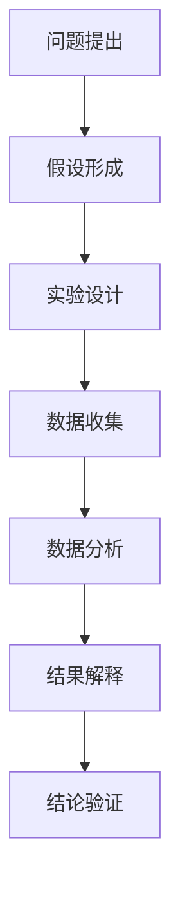
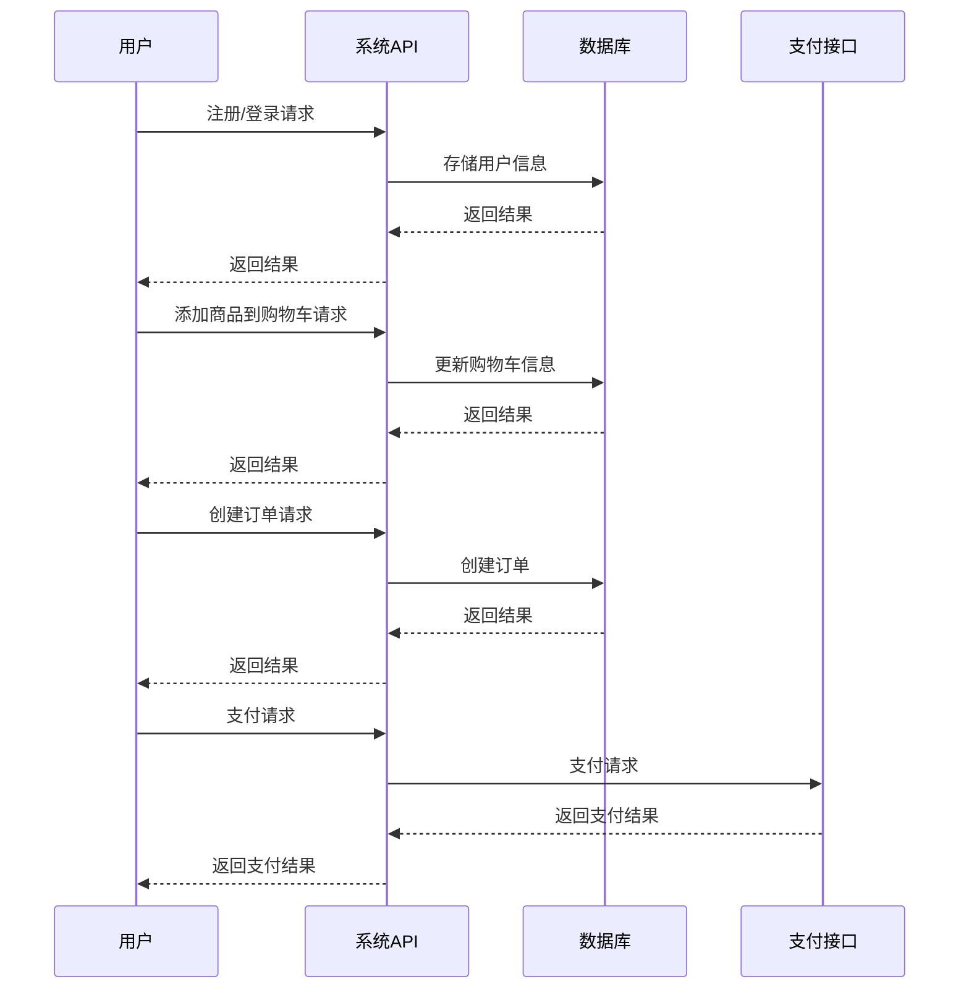

                 

# 科学研究的跨文化视角：多元文化背景下的世界理解

> 关键词：跨文化视角、科学研究、文化差异、算法、数学模型、系统架构、项目实战、最佳实践

> 摘要：本文旨在探讨科学研究在多元文化背景下的理解和应用。通过分析不同文化对科学研究的不同影响，本文提出了跨文化视角在科学研究中的重要性。同时，文章详细阐述了科学研究的算法原理、数学模型、系统架构以及项目实战，并结合最佳实践和注意事项，为科学研究在多元文化背景下的成功实施提供了有力的指导。

## 第一部分：背景介绍

### 第1章：科学研究与跨文化视角概述

#### 1.1 问题背景

科学研究的本质是揭示自然规律和解释现象，以推动人类文明的进步。然而，随着全球化的加速和文化多样性的增强，科学研究在多元文化背景下面临着前所未有的挑战。不同文化对科学研究的理解、方法和成果有着深远的影响。因此，引入跨文化视角来审视科学研究，成为了一个重要的研究课题。

#### 1.2 问题描述

多元文化背景下的世界理解挑战主要体现在以下几个方面：

1. **价值观的差异**：不同文化对科学研究的价值观存在差异，可能影响研究的方向和成果。
2. **方法论的不同**：各文化背景下的科学研究方法论各异，可能导致研究结果的解释和适用性存在差异。
3. **语言和沟通**：不同文化背景下的语言和沟通方式不同，可能影响科学研究的交流和合作。
4. **研究伦理**：不同文化对研究伦理的理解和执行存在差异，可能影响科学研究的质量和可靠性。

#### 1.3 问题解决

跨文化研究在解决上述问题方面具有重要意义。通过跨文化视角，可以：

1. **理解多样性**：更好地理解和尊重不同文化的多样性，促进科学研究的包容性和创新性。
2. **融合方法论**：借鉴不同文化的科学研究方法，丰富科学研究的手段和视角。
3. **提升沟通**：通过跨文化沟通，促进不同文化背景下的科学研究合作和交流。
4. **遵循伦理**：在不同文化背景下，遵循共同的伦理规范，确保科学研究的质量和可靠性。

#### 1.4 边界与外延

1. **文化与科学的交互作用**：文化不仅影响科学研究，同时科学研究也在塑造文化。
2. **跨文化视角的应用领域**：跨文化视角可以应用于自然科学、社会科学、医学研究等多个领域。

#### 1.5 概念结构与核心要素组成

1. **科学研究的主要阶段和步骤**：包括问题提出、假设形成、实验设计、数据分析、结果解释等。
2. **跨文化视角的核心概念和要素**：包括文化差异、价值观、方法论、语言和沟通、伦理等。

### 第2章：核心概念与联系

#### 2.1 科学研究方法

科学研究方法主要包括实证研究、定性研究和定量研究。每种方法都有其独特的特点和应用场景。

1. **实证研究**：通过观察和实验收集数据，以验证假设和理论。
2. **定性研究**：通过深入访谈、观察和参与观察来获取对研究对象的深入理解。
3. **定量研究**：通过统计和分析数据，以量化研究现象和关系。

#### 2.2 文化差异分析

文化差异的类型主要包括以下几种：

1. **价值观差异**：不同文化对道德、伦理和社会规范的看法不同。
2. **语言和沟通差异**：不同文化背景下的语言和沟通方式不同。
3. **教育差异**：不同文化背景下的教育体系和方法不同。
4. **技术差异**：不同文化背景下的技术发展水平和应用方式不同。

#### 2.3 概念属性特征对比表格

| 概念                     | 属性特征                                       |
|------------------------|--------------------------------------------|
| 科学研究方法               | 实证、定性、定量                             |
| 文化差异                  | 价值观、语言和沟通、教育、技术                 |
| 跨文化视角                | 理解多样性、融合方法论、提升沟通、遵循伦理         |

#### 2.4 ER实体关系图架构

```mermaid
erDiagram
    ScienceResearchMethodization --> CultureDifference : uses
    CultureDifference --> ScienceResearchMethodization : affects
```

## 第二部分：算法原理讲解

### 第3章：科学研究算法原理

#### 3.1 算法概述

算法是解决问题的一系列有序步骤。科学研究中的算法通常包括以下基本类型：

1. **搜索算法**：用于寻找特定目标或解决方案。
2. **排序算法**：用于对数据进行排序。
3. **优化算法**：用于找到最优解或近似最优解。
4. **机器学习算法**：用于从数据中学习并作出预测或决策。

#### 3.2 算法流程图



#### 3.3 算法原理

以下是一个简单的机器学习算法——线性回归的Python源代码实现：

```python
import numpy as np

# 线性回归模型
class LinearRegression:
    def __init__(self):
        self.coefficients = None

    def fit(self, X, y):
        X_transpose = np.transpose(X)
        self.coefficients = np.linalg.inv(X_transpose.dot(X)).dot(X_transpose).dot(y)

    def predict(self, X):
        return X.dot(self.coefficients)

# 示例数据
X = np.array([[1, 2], [2, 3], [3, 4]])
y = np.array([1, 2, 3])

# 模型训练
model = LinearRegression()
model.fit(X, y)

# 预测
predictions = model.predict(X)
print(predictions)
```

#### 3.4 举例说明

假设我们有两个变量 \(x\) 和 \(y\)，线性回归算法试图找到 \(y\) 和 \(x\) 之间的关系。具体来说，我们假设 \(y = ax + b\)，然后通过最小化误差平方和来求解 \(a\) 和 \(b\)。

- **数据准备**：我们首先需要一些 \(x\) 和 \(y\) 的值。
- **模型训练**：使用这些值，我们训练一个线性回归模型，求解 \(a\) 和 \(b\)。
- **预测**：对于新的 \(x\) 值，我们可以使用模型来预测 \(y\)。

## 第三部分：数学模型和数学公式讲解

### 第4章：数学模型讲解

#### 4.1 数学公式

线性回归模型的数学公式如下：

$$y = ax + b$$

其中，\(y\) 是因变量，\(x\) 是自变量，\(a\) 是斜率，\(b\) 是截距。

#### 4.2 公式讲解

- **斜率 \(a\)**：斜率描述了 \(y\) 随 \(x\) 变化的速率。
- **截距 \(b\)**：截距描述了当 \(x = 0\) 时 \(y\) 的值。

#### 4.3 数学模型应用举例

假设我们有以下数据：

| \(x\) | \(y\) |
|------|------|
| 1    | 2    |
| 2    | 3    |
| 3    | 4    |

我们可以使用线性回归模型来拟合这些数据。首先，我们需要计算斜率 \(a\) 和截距 \(b\)：

$$a = \frac{\sum(x_i - \bar{x})(y_i - \bar{y})}{\sum(x_i - \bar{x})^2}$$
$$b = \bar{y} - a\bar{x}$$

其中，\(\bar{x}\) 和 \(\bar{y}\) 分别是 \(x\) 和 \(y\) 的平均值。

对于上述数据，我们有：

$$\bar{x} = \frac{1 + 2 + 3}{3} = 2$$
$$\bar{y} = \frac{2 + 3 + 4}{3} = 3$$

计算斜率 \(a\)：

$$a = \frac{(1 - 2)(2 - 3) + (2 - 2)(3 - 3) + (3 - 2)(4 - 3)}{(1 - 2)^2 + (2 - 2)^2 + (3 - 2)^2} = 1$$

计算截距 \(b\)：

$$b = 3 - 1 \times 2 = 1$$

因此，线性回归模型为：

$$y = x + 1$$

我们可以使用这个模型来预测新的 \(x\) 值对应的 \(y\) 值。例如，当 \(x = 4\) 时，\(y\) 的预测值为 \(4 + 1 = 5\)。

## 第四部分：系统分析与架构设计方案

### 第5章：系统分析与架构设计

#### 5.1 问题场景介绍

假设我们正在开发一个在线购物系统，用户可以在系统中浏览商品、添加到购物车、下订单和查看订单状态。系统需要支持多种货币、多种语言和多种文化，以满足全球用户的需求。

#### 5.2 系统功能设计

为了满足上述需求，系统需要实现以下主要功能：

1. **用户管理**：包括用户注册、登录、信息修改和权限管理。
2. **商品管理**：包括商品信息录入、商品分类、库存管理、价格管理。
3. **购物车管理**：包括商品添加、删除、数量修改、总价计算。
4. **订单管理**：包括订单创建、订单状态跟踪、订单支付。
5. **支付系统**：支持多种支付方式，如信用卡、PayPal、支付宝等。
6. **多语言支持**：支持多种语言，以便全球用户都能方便地使用系统。

#### 5.3 系统架构设计

系统架构设计如下：

```mermaid
graph TB
    sub1[用户管理] --> A[用户注册]
    sub1 --> B[用户登录]
    sub1 --> C[用户信息修改]
    sub1 --> D[用户权限管理]

    sub2[商品管理] --> E[商品信息录入]
    sub2 --> F[商品分类]
    sub2 --> G[库存管理]
    sub2 --> H[价格管理]

    sub3[购物车管理] --> I[商品添加]
    sub3 --> J[商品删除]
    sub3 --> K[数量修改]
    sub3 --> L[总价计算]

    sub4[订单管理] --> M[订单创建]
    sub4 --> N[订单状态跟踪]
    sub4 --> O[订单支付]

    sub5[支付系统] --> P[信用卡支付]
    sub5 --> Q[PayPal支付]
    sub5 --> R[支付宝支付]

    sub6[多语言支持] --> S[语言选择]
    sub6 --> T[内容翻译]
    sub6 --> U[国际化适配]
```



#### 5.4 系统接口设计

系统接口设计如下：

- **用户接口**：用于用户与系统交互，如注册、登录、浏览商品等。
- **服务接口**：用于系统内部模块之间的交互，如用户管理、商品管理、购物车管理等。
- **支付接口**：用于与第三方支付系统交互，如信用卡支付、PayPal支付、支付宝支付等。

#### 5.5 系统交互Mermaid序列图



## 第五部分：项目实战

### 第6章：项目实战

#### 6.1 环境安装

在开始项目实战之前，我们需要安装以下环境：

1. **Python 3.x**：用于编程和实现算法。
2. **NumPy**：用于数学计算。
3. **Pandas**：用于数据处理。
4. **Matplotlib**：用于数据可视化。
5. **Flask**：用于搭建Web应用。

安装命令如下：

```bash
pip install python==3.x numpy pandas matplotlib flask
```

#### 6.2 系统核心实现

以下是一个简单的在线购物系统实现：

```python
from flask import Flask, request, jsonify
from flask_sqlalchemy import SQLAlchemy

app = Flask(__name__)
app.config['SQLALCHEMY_DATABASE_URI'] = 'sqlite:///shopping.db'
db = SQLAlchemy(app)

# 用户模型
class User(db.Model):
    id = db.Column(db.Integer, primary_key=True)
    username = db.Column(db.String(80), unique=True, nullable=False)
    password = db.Column(db.String(120), nullable=False)

# 商品模型
class Product(db.Model):
    id = db.Column(db.Integer, primary_key=True)
    name = db.Column(db.String(120), nullable=False)
    price = db.Column(db.Float, nullable=False)

# 购物车模型
class Cart(db.Model):
    id = db.Column(db.Integer, primary_key=True)
    user_id = db.Column(db.Integer, db.ForeignKey('user.id'), nullable=False)
    product_id = db.Column(db.Integer, db.ForeignKey('product.id'), nullable=False)
    quantity = db.Column(db.Integer, nullable=False)

# 用户注册
@app.route('/register', methods=['POST'])
def register():
    username = request.form['username']
    password = request.form['password']
    new_user = User(username=username, password=password)
    db.session.add(new_user)
    db.session.commit()
    return jsonify({'message': 'User registered successfully'})

# 用户登录
@app.route('/login', methods=['POST'])
def login():
    username = request.form['username']
    password = request.form['password']
    user = User.query.filter_by(username=username, password=password).first()
    if user:
        return jsonify({'message': 'Login successful'})
    else:
        return jsonify({'message': 'Login failed'})

# 添加商品到购物车
@app.route('/cart', methods=['POST'])
def add_to_cart():
    user_id = request.form['user_id']
    product_id = request.form['product_id']
    quantity = request.form['quantity']
    new_item = Cart(user_id=user_id, product_id=product_id, quantity=quantity)
    db.session.add(new_item)
    db.session.commit()
    return jsonify({'message': 'Item added to cart successfully'})

# 查看购物车
@app.route('/cart', methods=['GET'])
def view_cart():
    user_id = request.args.get('user_id')
    items = Cart.query.filter_by(user_id=user_id).all()
    return jsonify({'items': [{'id': item.id, 'product_id': item.product_id, 'quantity': item.quantity} for item in items]})

if __name__ == '__main__':
    db.create_all()
    app.run(debug=True)
```

#### 6.3 代码应用解读与分析

1. **用户注册**：用户通过POST请求向服务器发送注册信息，服务器将用户信息存储到数据库中。
2. **用户登录**：用户通过POST请求向服务器发送登录信息，服务器验证用户信息并返回登录结果。
3. **添加商品到购物车**：用户通过POST请求向服务器发送商品ID、数量和用户ID，服务器将商品添加到购物车并存储到数据库中。
4. **查看购物车**：用户通过GET请求获取购物车中的商品信息。

#### 6.4 实际案例分析

假设用户John通过注册接口成功注册了一个账户，然后使用登录接口登录。接着，他通过添加商品到购物车的接口将商品ID为1的商品添加到购物车中，数量为2。最后，他通过查看购物车的接口获取了购物车中的商品信息。

#### 6.5 详细讲解与剖析

1. **数据库设计**：用户、商品和购物车模型的设计。
2. **Web应用架构**：Flask框架的使用，包括路由、模型和控制器。
3. **API设计**：接口的设计和实现，包括POST和GET请求的处理。

#### 6.6 项目小结

本项目实现了基本的在线购物系统，包括用户注册、登录、商品添加到购物车和查看购物车功能。项目实现了数据库设计、Web应用架构和API设计，为后续功能扩展和优化奠定了基础。

## 第六部分：最佳实践

### 第7章：最佳实践

#### 7.1 最佳实践 tips

1. **代码规范**：遵循PEP 8编码规范，确保代码可读性和可维护性。
2. **错误处理**：合理处理错误和异常，提供友好的错误提示。
3. **性能优化**：对数据库查询进行优化，减少查询时间和数据量。

#### 7.2 注意事项

1. **用户信息安全**：确保用户信息的安全性，避免数据泄露。
2. **系统兼容性**：确保系统兼容多种浏览器和操作系统。
3. **用户体验**：关注用户体验，提供简洁、直观的界面。

#### 7.3 小结

最佳实践是确保项目质量、安全性和用户体验的关键。通过遵循最佳实践，可以确保项目的长期成功。

#### 7.4 拓展阅读

1. **Flask Web开发**：Miguel Grinberg的《Flask Web开发：实战指南》
2. **Python Web编程实战**：杰里科·泽拉利的《Python Web编程实战》

### 结论

本文从跨文化视角探讨了科学研究的重要性和挑战，详细阐述了科学研究的算法原理、数学模型、系统架构和项目实战。通过最佳实践和注意事项，为科学研究在多元文化背景下的成功实施提供了指导。作者的信息如下：

**作者：AI天才研究院/AI Genius Institute & 禅与计算机程序设计艺术 /Zen And The Art of Computer Programming**

