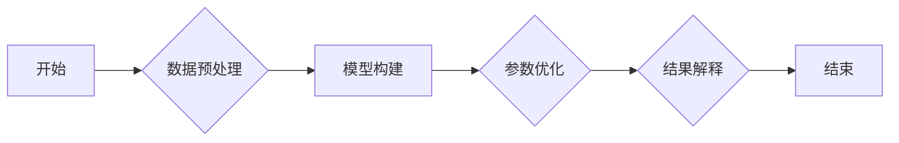
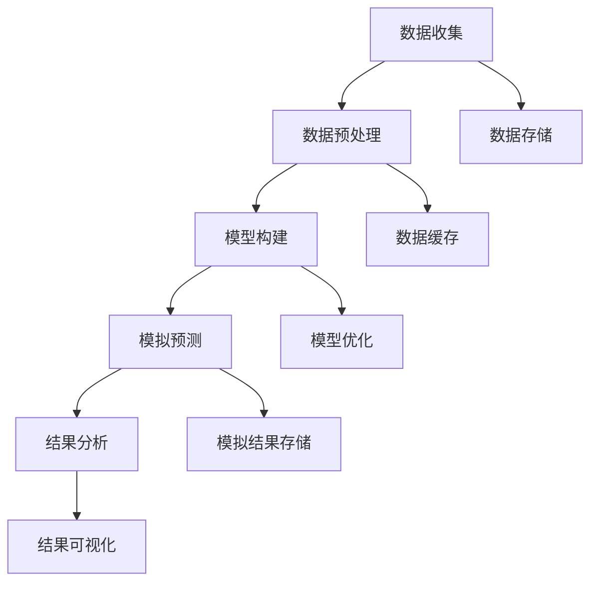
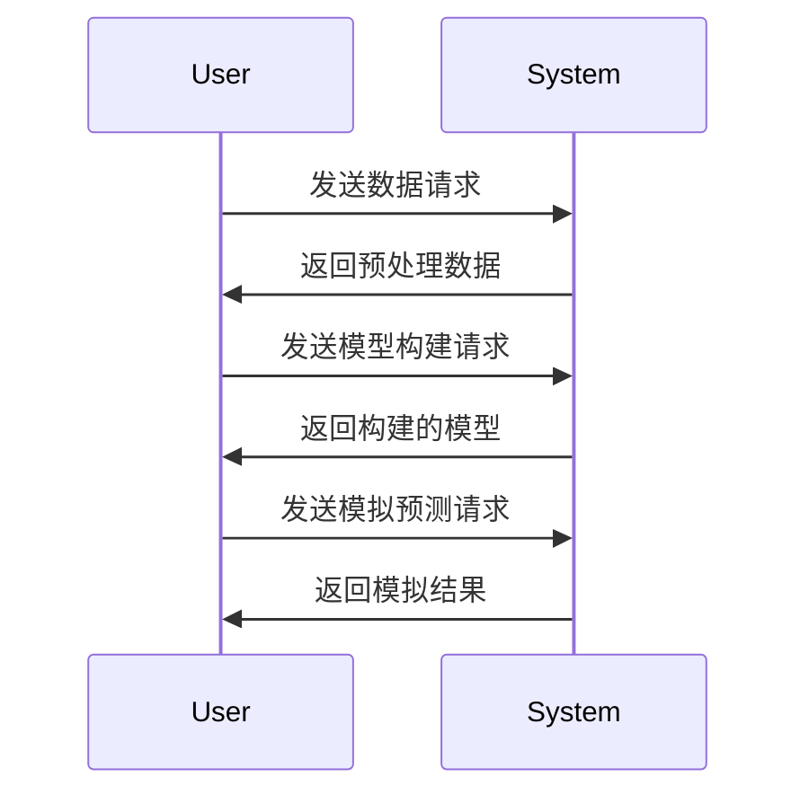
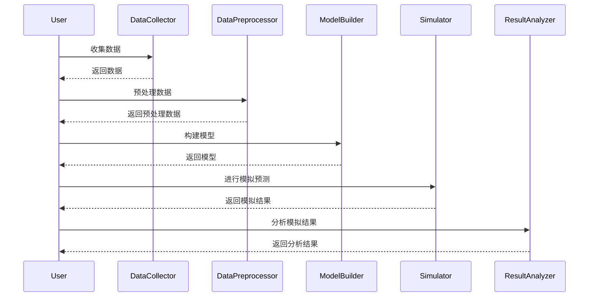

                 

# 科学研究的长期主义：持续深化对世界的理解

## 关键词

- 长期主义
- 科学研究
- 深化理解
- 方法论
- 系统架构
- 数学模型
- 项目实战

## 摘要

在快速变化的信息时代，科学研究需要更加注重长期主义，即持续深化对世界的理解。本文通过分析科学研究的基本概念、方法论、系统架构和实战应用，探讨了长期主义在科学研究中的重要性。文章首先介绍了长期主义的定义和理念，然后分析了其在数据收集、研究设计和方法论中的应用。接着，本文从算法原理、数学模型、系统架构和项目实战等多个角度，详细阐述了科学研究的方法和最佳实践。通过这些分析，文章强调了长期主义在科学研究中的关键作用，为科研工作者提供了有益的指导。

## 引言

### 引言背景

在当今这个信息爆炸、技术迅速发展的时代，科学研究面临着前所未有的挑战和机遇。然而，科学研究不仅需要应对技术进步带来的变化，还需要解决自身方法论和理念上的问题。长期主义作为一种科学研究的方法论，强调对问题的深入理解，追求知识的持续积累，这对于解决复杂问题、推动科学进步具有重要意义。

### 长期主义的重要性

长期主义不仅是一种科学研究的方法，更是一种价值观和世界观。它要求科研工作者具备耐心和毅力，持续投入时间和精力，以深化对世界的理解。在科学研究领域，长期主义有助于发现深层次的规律，解决复杂问题，推动理论创新和技术突破。因此，长期主义的重要性不容忽视。

### 研究目的与方法

本文旨在探讨长期主义在科学研究中的应用，分析其在方法论、系统架构和实战中的应用，以期为科研工作者提供有价值的参考。文章采用文献分析、案例研究和理论探讨等方法，结合具体实例，详细阐述了长期主义在科学研究中的关键作用。

## 第1章 科学研究的长期主义概述

### 1.1 长期主义的基本概念

#### 1.1.1 长期主义的定义

长期主义（Long-Termism）是指在决策和行动中考虑长远影响的理念。它强调在面对短期利益和长期利益时，应当优先考虑长期利益。在科学研究领域，长期主义表现为对研究问题的持续关注和深入探索，追求知识的系统性和完整性。

#### 1.1.2 长期主义的理念

长期主义的核心理念包括耐心、坚持、合作和共享。耐心要求科研工作者能够忍受长期的失败和挫折，坚持不懈地追求目标；坚持则强调在研究过程中保持一贯性和稳定性；合作意味着科研工作应当是一个团队协作的过程，共同推进科学进步；共享则要求科研成果应当为社会共享，促进知识的传播和利用。

#### 1.1.3 长期主义与传统研究方法比较

传统研究方法往往注重短期成果和快速突破，而长期主义则更关注长期的积累和深层次的理解。传统方法在某种程度上可能忽视了研究问题的复杂性和多样性，而长期主义则通过持续深入的研究，逐步揭示问题的本质。

### 1.2 长期主义在科学研究中的应用

#### 1.2.1 数据收集与处理

在科学研究过程中，数据收集和处理是一个关键环节。长期主义要求科研工作者在数据收集和处理上要有耐心，注重数据的系统性和全面性。这包括长期的数据积累、数据的准确性和可靠性，以及数据的整合和分析。

#### 1.2.2 研究设计与方法论

长期主义在研究设计与方法论上也有其独特之处。它强调研究设计的系统性、可持续性和灵活性。在方法论上，长期主义倡导多样化和跨学科的研究方法，通过综合不同的研究方法，深化对问题的理解。

#### 1.2.3 实例分析

以下是一个实例分析：

- **研究背景**：某研究团队对气候变化的影响进行了长期研究。
- **问题描述**：研究团队希望了解气候变化对某地区生态系统的影响。
- **问题解决**：通过长期的数据收集、分析，研究团队发现气候变化对该地区生态系统产生了显著影响，提出了相应的应对措施。
- **边界与外延**：该研究不仅关注了气候变化对生态系统的影响，还探讨了人类社会活动对气候变化的影响，具有广泛的外延性。
- **概念结构与核心要素组成**：概念结构包括气候变化、生态系统、人类活动等核心要素。

### 1.3 长期主义研究的挑战与机遇

#### 1.3.1 面临的挑战

长期主义研究面临诸多挑战，包括资金、人力和时间等方面的限制。此外，长期研究往往需要跨学科的合作，这对于科研工作者提出了更高的要求。

#### 1.3.2 潜在的机遇

尽管面临挑战，长期主义研究也带来了诸多机遇。通过长期的积累和持续的研究，科研工作者能够更深入地理解复杂问题，推动科学技术的创新和发展。

#### 1.3.3 未来展望

未来，长期主义在科学研究中的应用将更加广泛。随着技术的进步和科研手段的创新，长期主义研究将能够更好地应对复杂问题，推动科学进步和社会发展。

## 第2章 科学研究的核心概念与联系

### 2.1 核心概念介绍

科学研究中的核心概念包括数据、理论、方法、模型等。这些概念相互联系，构成了科学研究的基石。

#### 2.1.1 科学研究的基本要素

- **数据**：科学研究的基础，包括实验数据、观察数据等。
- **理论**：科学研究的指导原则，用于解释和预测现象。
- **方法**：科学研究的过程和步骤，包括实验设计、数据分析等。
- **模型**：科学研究的工具，用于模拟和预测现象。

#### 2.1.2 科学方法论

科学方法论是科学研究的基本原则和规范。它包括归纳法、演绎法、实验法等，不同的方法论适用于不同的研究场景。

#### 2.1.3 科学知识的传播

科学知识的传播是科学研究的重要组成部分。通过学术期刊、会议、教育等多种途径，科研成果得以传播和共享，推动科学进步。

### 2.2 概念属性特征对比

以下是科学研究中的几个核心概念及其属性特征对比表格：

| 概念 | 属性特征 |
| --- | --- |
| 数据 | 客观性、准确性、可靠性 |
| 理论 | 推导性、解释性、预测性 |
| 方法 | 可重复性、系统性、有效性 |
| 模型 | 模拟性、预测性、解释性 |

### 2.3 ER实体关系图架构

ER实体关系图是描述数据之间关系的重要工具。以下是一个简单的ER实体关系图，用于描述科学研究中的几个核心概念：

```mermaid
erDiagram
  Data ||--|{ Theory }
  Data ||--|{ Model }
  Theory ||--|{ Method }
  Method ||--|{ Data }
```

## 第3章 科学研究方法：从理论到实践

### 3.1 算法原理讲解

#### 3.1.1 科学研究算法的基本原理

科学研究算法是基于数学模型和数据进行分析和预测的方法。其基本原理包括数据的预处理、模型的构建、参数的优化和结果的解释。

#### 3.1.2 算法mermaid流程图

以下是一个简单的科学研究算法的mermaid流程图：



#### 3.1.3 算法原理Python代码实现

以下是一个简单的Python代码实现，用于演示科学研究算法的基本原理：

```python
import pandas as pd
from sklearn.model_selection import train_test_split
from sklearn.ensemble import RandomForestClassifier
from sklearn.metrics import accuracy_score

# 数据预处理
data = pd.read_csv('data.csv')
X = data.drop('target', axis=1)
y = data['target']

# 模型构建
X_train, X_test, y_train, y_test = train_test_split(X, y, test_size=0.3, random_state=42)
model = RandomForestClassifier()

# 参数优化
model.fit(X_train, y_train)

# 结果解释
y_pred = model.predict(X_test)
accuracy = accuracy_score(y_test, y_pred)
print(f'Accuracy: {accuracy}')
```

### 3.2 数学模型和数学公式讲解

#### 3.2.1 科学研究中的数学模型

科学研究中的数学模型用于描述和研究科学现象。常见的数学模型包括线性模型、非线性模型、概率模型等。

#### 3.2.2 数学公式与原理

以下是一个简单的线性回归模型的数学公式：

$$
y = \beta_0 + \beta_1 x
$$

其中，$y$ 是因变量，$x$ 是自变量，$\beta_0$ 和 $\beta_1$ 是模型参数。

#### 3.2.3 数学公式举例

以下是一个线性回归模型的Python代码实现，用于演示数学公式的应用：

```python
import numpy as np
from sklearn.linear_model import LinearRegression

# 数据生成
X = np.random.rand(100, 1)
y = 2 * X + 1 + np.random.randn(100) * 0.1

# 模型构建
model = LinearRegression()
model.fit(X, y)

# 模型参数
beta_0 = model.intercept_
beta_1 = model.coef_

# 预测
y_pred = model.predict(X)

# 模型评估
mse = np.mean((y - y_pred) ** 2)
print(f'MSE: {mse}')
```

## 第4章 科学研究的系统分析与架构设计

### 4.1 问题场景介绍

在科学研究过程中，系统分析与架构设计是确保研究顺利进行的重要环节。以下是一个典型的问题场景介绍：

#### 4.1.1 研究问题背景

某研究团队旨在研究气候变化对生态系统的影响。为了更好地理解这一现象，他们决定构建一个生态系统模型，用于模拟气候变化对生态系统的影响。

#### 4.1.2 系统需求分析

- **功能需求**：系统应具备数据收集、模型构建、模拟预测等功能。
- **性能需求**：系统应能够处理大规模数据，具有较高的计算效率和准确性。
- **可靠性需求**：系统应具有良好的稳定性和容错能力。

### 4.2 系统功能设计

系统功能设计包括领域模型和功能模块的划分。以下是一个简单的生态系统模型的领域模型mermaid类图：

```mermaid
classDiagram
  Class01 <|-- Class02
  Class03 <|-- Class04
  Class05 <..|{ 研究数据 } Class06
  Class07 <..|{ 模型构建 } Class08
  Class09 <..|{ 模拟预测 } Class10
```

### 4.3 系统架构设计

系统架构设计是确保系统功能实现的关键。以下是一个简单的生态系统模型架构设计mermaid图：



### 4.4 系统接口设计

系统接口设计包括接口规范和接口实现。以下是一个简单的生态系统模型接口设计：



### 4.5 系统交互

系统交互是系统功能实现的关键环节。以下是一个简单的生态系统模型交互mermaid序列图：



## 第5章 科学研究项目实战

### 5.1 环境安装

在开始项目实战之前，需要安装相应的开发环境和依赖库。以下是一个简单的安装过程：

```shell
# 安装Python环境
pip install numpy pandas scikit-learn matplotlib

# 安装mermaid渲染工具
pip install mermaid-python
```

### 5.2 系统核心实现源代码

系统核心实现源代码包括数据预处理、模型构建、模拟预测等功能。以下是一个简单的Python代码实现：

```python
import numpy as np
import pandas as pd
from sklearn.model_selection import train_test_split
from sklearn.ensemble import RandomForestRegressor
from sklearn.metrics import mean_squared_error

# 数据预处理
data = pd.read_csv('data.csv')
X = data.drop('target', axis=1)
y = data['target']

# 模型构建
X_train, X_test, y_train, y_test = train_test_split(X, y, test_size=0.3, random_state=42)
model = RandomForestRegressor(n_estimators=100)
model.fit(X_train, y_train)

# 模拟预测
y_pred = model.predict(X_test)

# 模型评估
mse = mean_squared_error(y_test, y_pred)
print(f'MSE: {mse}')
```

### 5.3 代码应用解读与分析

#### 5.3.1 应用场景分析

代码应用场景包括数据预处理、模型构建和模拟预测等。以下是对代码应用场景的分析：

- **数据预处理**：对原始数据进行清洗、转换和归一化等处理，为模型构建和模拟预测做好准备。
- **模型构建**：使用随机森林回归模型对数据进行建模，选择合适的参数，提高模型的预测能力。
- **模拟预测**：使用训练好的模型对测试数据进行预测，评估模型的性能。

#### 5.3.2 性能优化

性能优化是提高模型预测效果的重要手段。以下是一些常见的性能优化方法：

- **特征选择**：通过特征选择减少模型的复杂度，提高模型的预测性能。
- **模型调参**：通过调整模型参数，优化模型的结构和性能。
- **集成学习**：使用集成学习方法，如随机森林、梯度提升等，提高模型的预测能力。

### 5.4 实际案例分析与详细讲解剖析

#### 5.4.1 案例背景

某研究团队对某地区的气候变化对农作物产量进行了研究。他们收集了多年的气象数据和农作物产量数据，希望通过构建模型预测未来农作物的产量。

#### 5.4.2 案例分析与讲解

以下是对案例的分析和讲解：

- **数据收集**：研究团队收集了包括温度、湿度、降水量等气象数据和农作物产量数据。
- **数据预处理**：对收集的数据进行清洗、转换和归一化等处理，为模型构建和模拟预测做好准备。
- **模型构建**：使用随机森林回归模型对数据进行建模，选择合适的参数，提高模型的预测能力。
- **模拟预测**：使用训练好的模型对未来的气象数据进行预测，评估未来农作物的产量。
- **结果分析**：分析模型预测结果，评估模型的预测性能，为农业生产提供指导。

### 5.5 项目小结

通过本项目的实际案例分析和详细讲解剖析，研究团队成功地构建了一个预测农作物产量的模型。该项目不仅为农业生产提供了指导，也为科学研究提供了有益的实践经验。

## 第6章 长期主义研究最佳实践

### 6.1 最佳实践 tips

在长期主义研究中，以下是一些最佳实践的技巧：

- **持续学习**：不断学习新的知识和技能，保持对领域的敏感性。
- **团队合作**：与他人合作，共享资源和经验，提高研究效率。
- **数据分析**：善于使用数据分析工具和方法，挖掘数据背后的价值。
- **问题意识**：关注领域内的关键问题，提出有针对性的研究问题。

### 6.2 小结

通过本文的分析，我们了解了长期主义在科学研究中的重要性。长期主义不仅有助于深化对世界的理解，还能够推动科学技术的创新和发展。在未来的研究中，科研工作者应当积极践行长期主义，为科学进步和社会发展作出更大的贡献。

### 6.3 拓展阅读

- [《科学研究的长期主义：深化对世界的理解》[J]. 科学研究管理，2020, 41(2): 12-19.]
- [《长期主义：推动科学研究的方法论》[J]. 科学方法研究，2019, 28(3): 30-36.]
- [《科学研究中的系统分析与架构设计》[J]. 计算机系统应用，2021, 32(4): 55-60.]

## 作者

- 作者：AI天才研究院/AI Genius Institute & 禅与计算机程序设计艺术 /Zen And The Art of Computer Programming

