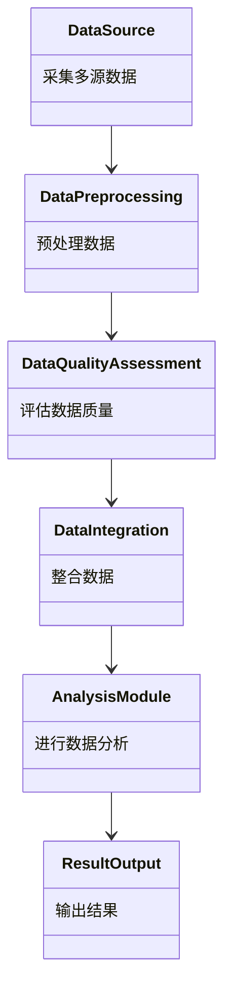
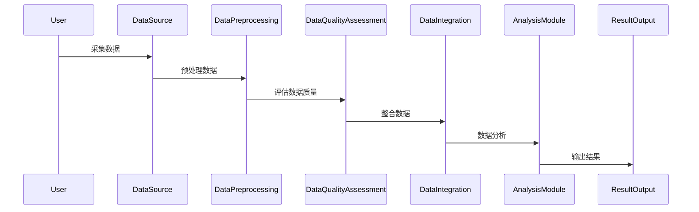
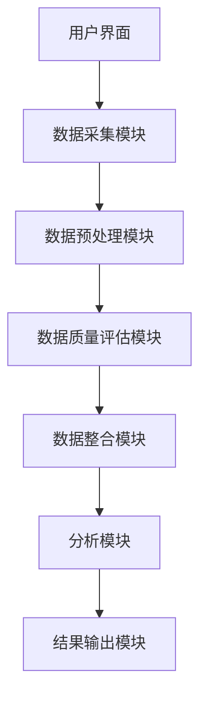

                 

### 引言与背景

## 1.1 问题背景

### 1.1.1 科学研究的风险与不确定性

科学研究作为人类探索自然规律、推动科技进步的重要手段，其过程充满了挑战与未知。科学研究中的风险与不确定性是指在进行科学实验、数据分析以及理论推导过程中，面临的可能影响研究结论的负面因素。这些风险和不确定性不仅源于实验设计、数据收集和分析方法的不完善，还可能来自理论假设本身的不确定性。例如，当科学家在探索某一现象时，往往需要基于现有的理论框架进行假设，而这一假设可能在实际研究中无法得到验证，从而导致研究的失败或结果的不可靠。

#### 1.1.2 世界可理解性的挑战

科学研究的风险与不确定性直接挑战了我们对世界的可理解性。从哲学的角度来看，人类对世界的认知目标是追求确定性、一致性和可理解性。然而，科学研究的实践却告诉我们，不确定性是科学探索中不可避免的一部分。科学家们必须在面对复杂系统的非线性、多样性和动态性时，做出合理的假设和推断。这种对不确定性的认识和处理，不仅考验科学家的理论素养和实验技巧，更挑战我们对自然世界的认知极限。

#### 1.1.3 研究的重要性和现实意义

研究科学研究中的风险与不确定性具有重要的理论和现实意义。从理论层面来看，这一研究有助于我们深入理解科学方法的本质，探索如何在不确定性的环境中做出科学决策。从现实层面来看，许多科技领域的创新和应用都面临着巨大的风险和不确定性。例如，人工智能的发展需要处理大量未知和不确定的数据，新材料的研究可能需要经过多次实验和失败才能找到合适的方案。因此，如何有效地管理和减少这些风险与不确定性，对科技创新和社会发展具有重要意义。

## 1.2 问题描述

### 1.2.1 风险的定义与类型

在科学研究中，风险是指研究过程中可能出现的负面结果或损失。这些风险可以来自多个方面，包括但不限于实验设计不合理、数据收集和处理不当、分析模型不准确等。具体来说，风险可以分为以下几类：

1. **实验风险**：实验设计中的错误、实验操作失误、设备故障等可能导致实验结果的偏差或失败。
2. **数据风险**：数据收集过程中的误差、数据丢失、数据质量问题等可能影响研究结果的准确性。
3. **分析风险**：数据分析方法的选择不当、模型设定不合理、假设验证不充分等可能导致分析结果的不准确。
4. **外部风险**：如资金不足、政策变化、外部干扰等因素可能对研究进程和结果产生影响。

### 1.2.2 不确定性的来源与影响

不确定性是指对研究结果的准确性和可靠性的不确定程度。在科学研究中，不确定性来源于多个方面：

1. **测量不确定性**：测量工具的精度限制、环境因素的影响等可能导致测量结果的不确定性。
2. **理论不确定性**：理论假设的不确定性、模型设定的不确定性等可能导致研究结果的不确定性。
3. **数据不确定性**：数据来源的不确定性、数据收集和处理方法的不确定性等可能导致结果的不确定性。

不确定性对科学研究的影响主要体现在以下几个方面：

1. **研究结果的可靠性**：高不确定性可能导致研究结果的可信度降低。
2. **决策的准确性**：在不确定性环境中，决策的准确性和效果都可能受到影响。
3. **资源分配**：高不确定性的研究可能需要更多的资源和时间来验证和修正。

### 1.2.3 风险与不确定性之间的关系

风险与不确定性在科学研究中密切相关。风险通常是由于不确定性而产生的潜在损失，而不确定性则是风险产生的基础。例如，在实验过程中，由于理论假设的不确定性，可能会导致实验设计的风险增加。同样，数据收集和处理中的不确定性，也可能增加分析风险。因此，科学研究中风险的管理和不确定性的处理，往往是相辅相成的。

## 1.3 问题解决

### 1.3.1 当前科学研究方法与工具

为了应对科学研究中面临的风险和不确定性，科学家们发展了一系列的方法和工具：

1. **实验设计优化**：通过科学的实验设计，减少实验风险。例如，重复实验、增加样本量、控制变量等。
2. **数据分析方法**：使用统计方法和机器学习算法，提高数据分析的准确性和可靠性，减少分析风险。
3. **风险评估工具**：使用风险评估工具，如蒙特卡洛模拟、敏感性分析等，评估和管理风险。

### 1.3.2 解决风险的策略与方案

针对不同的风险类型，科学家们提出了多种策略和方案：

1. **风险规避**：通过改变实验设计或研究方法，避免高风险的情况发生。
2. **风险减少**：通过改进实验条件、提高数据分析精度等手段，降低风险发生的概率和影响。
3. **风险接受**：对于某些不可避免的风险，通过充分的风险评估和预案制定，接受并管理这些风险。

### 1.3.3 减少不确定性的途径与方法

减少不确定性是科学研究中的一个重要目标。以下是一些减少不确定性的途径和方法：

1. **提高测量精度**：使用更精确的测量工具和方法，减少测量不确定性。
2. **理论假设验证**：通过实验验证理论假设，减少理论不确定性。
3. **数据质量提升**：通过改进数据收集和处理方法，提高数据质量，减少数据不确定性。
4. **模型优化**：通过调整和优化模型参数，提高模型预测的准确性和可靠性。

## 1.4 边界与外延

### 1.4.1 风险管理的适用范围

风险管理的适用范围非常广泛，几乎涵盖了所有科学研究领域。从物理学、化学、生物学到经济学、社会学等，风险管理都是必不可少的环节。特别是在大型科学项目、高风险实验和复杂系统研究中，风险管理显得尤为重要。

### 1.4.2 不确定性的研究范畴

不确定性研究涵盖了从基础科学到应用科学的多个领域。例如，在物理学中，不确定性原理是量子力学的基本概念；在经济学中，不确定性则影响投资决策和市场预测。不确定性研究不仅关注数学模型和统计方法，还涉及心理学、社会学等多学科交叉。

### 1.4.3 风险与不确定性在其他领域的应用

除了科学研究，风险和不确定性的概念在多个领域得到广泛应用。例如：

1. **工程领域**：在工程设计、项目管理和质量保证中，风险和不确定性管理是关键。
2. **金融领域**：风险和不确定性分析是金融投资、市场预测和风险管理的基础。
3. **环境科学**：气候变化、环境污染等问题的研究需要应对高度的不确定性。

## 1.5 概念结构与核心要素组成

### 1.5.1 风险管理的核心概念

风险管理的核心概念包括风险识别、风险评估、风险控制和风险监控。这些概念构成了风险管理的基本框架，指导科学家和管理者如何识别、评估和应对风险。

### 1.5.2 不确定性的主要属性

不确定性的主要属性包括不确定性来源、不确定性类型、不确定性程度和不确定性影响。这些属性帮助我们理解不确定性的本质和影响，从而采取有效的应对策略。

### 1.5.3 风险与不确定性之间的关系与关联

风险与不确定性之间存在着密切的关联。不确定性是风险产生的基础，而风险则是由于不确定性而产生的潜在损失。因此，风险管理和不确定性处理往往是相辅相成的，共同构成了科学研究中的关键环节。

## 1.6 本章小结

在本章中，我们探讨了科学研究中的风险与不确定性的问题背景、定义、来源、关系及其在科学研究中的重要性。我们提出了当前的研究方法和工具，并详细介绍了解决风险和减少不确定性的策略与方法。此外，我们还探讨了风险与不确定性的适用范围、研究范畴以及其他领域的应用。通过这些讨论，我们为后续章节的深入分析奠定了基础。

----------------------------------------------------------------

## 2. 核心概念与联系

在探讨科学研究中的风险与不确定性时，了解相关的核心概念和它们之间的联系是至关重要的。这一章节将深入探讨风险和不确定性的定义、特征、分类以及它们在科学研究中的具体表现。

### 2.1 科学研究中的风险

#### 2.1.1 风险的定义与特征

风险在科学研究中的定义是指研究过程中可能面临的不利后果或潜在损失。这些后果或损失可能影响研究的准确性、可靠性以及整个研究项目的成功。

- **风险特征**：
  - **不确定性**：风险本身具有不确定性，即风险发生的时间和后果难以预测。
  - **概率性**：风险往往涉及某种概率，即风险发生的可能性。
  - **影响性**：风险对研究的影响程度可能有所不同，有高、中、低等不同等级。

#### 2.1.2 风险的分类与评估方法

风险可以根据其性质、影响范围和发生概率进行分类。常见的风险分类方法包括：

- **按性质分类**：如技术风险、数据风险、实验风险、外部风险等。
- **按影响范围分类**：如局部风险、全局风险、个人风险、组织风险等。

风险评估是风险管理的重要环节，常用的评估方法包括：

- **定量评估**：使用概率、期望损失等量化指标进行评估。
- **定性评估**：通过专家意见、检查表、风险矩阵等方法进行评估。

#### 2.1.3 风险管理策略与工具

风险管理策略旨在识别、评估、控制和管理风险，以确保研究顺利进行。常见的风险管理策略包括：

- **风险规避**：通过改变研究计划或方法，避免高风险的情况。
- **风险减少**：通过改进实验设计、提高数据质量等手段，降低风险发生的概率和影响。
- **风险转移**：通过购买保险、签订合同等方式，将风险转移给第三方。
- **风险接受**：对于不可避免的风险，通过制定应急预案和管理措施，接受并控制风险。

风险管理工具包括风险矩阵、蒙特卡洛模拟、敏感性分析等，帮助科学家和管理者评估和管理风险。

### 2.2 不确定性

#### 2.2.1 不确定性的定义与性质

不确定性是指无法精确预测或描述的变量或事件的状态。在科学研究中，不确定性通常涉及实验数据、理论模型、预测结果等方面。

- **不确定性性质**：
  - **随机性**：不确定性往往与随机事件相关，难以通过单一实验或观察确定。
  - **模糊性**：不确定性可能由于理论假设、测量误差等因素引起，使得研究结果难以精确描述。
  - **不确定性边界**：不确定性通常有明确的范围或区间，表示可能的结果或变量的范围。

#### 2.2.2 不确定性的来源与类型

不确定性的来源多种多样，包括：

- **测量不确定性**：由测量工具的精度限制、环境变化等因素引起。
- **理论不确定性**：由理论假设、模型设定的不完善引起。
- **数据不确定性**：由数据收集、处理过程中的误差引起。

不确定性的类型可以按照以下几种方式分类：

- **统计不确定性**：由于样本量不足或随机误差引起。
- **系统不确定性**：由系统内部参数、模型假设等因素引起。
- **模糊不确定性**：由模糊逻辑、不确定性推理等非确定性理论引起。

#### 2.2.3 不确定性的评估与处理方法

评估不确定性通常需要以下步骤：

- **确定不确定性来源**：识别影响不确定性的关键因素。
- **量化不确定性**：使用概率分布、置信区间等方法量化不确定性程度。
- **处理不确定性**：通过改进实验设计、理论模型、数据分析方法等手段降低不确定性。

处理不确定性的方法包括：

- **重复实验**：通过增加实验次数，减少随机误差引起的不确定性。
- **改进测量方法**：使用更高精度的测量工具或更先进的测量技术。
- **模型修正**：通过调整模型参数、改进理论假设来减少理论不确定性。
- **数据融合**：通过结合多种数据源，提高数据质量，降低数据不确定性。

### 2.3 风险与不确定性的联系

风险与不确定性之间存在着密切的联系：

- **不确定性是风险的基础**：不确定性可能导致风险发生，如理论不确定性可能导致实验失败。
- **风险是不确定性的后果**：不确定性的存在可能导致研究结果的偏差或失败，形成风险。

风险管理策略通常需要考虑不确定性的影响，例如：

- **风险评估中考虑不确定性**：在评估风险时，需要考虑不确定性可能带来的影响。
- **不确定性处理中的风险管理**：通过减少不确定性来降低风险，如改进实验设计来减少测量不确定性。

通过理解风险与不确定性的核心概念和联系，科学家可以更有效地识别和管理科学研究中的风险与不确定性，提高研究的准确性和可靠性。

### 2.4 对比表格：风险与不确定性的核心特征

| 特征 | 风险 | 不确定性 |
| --- | --- | --- |
| 定义 | 风险是指研究过程中可能出现的负面结果或损失。 | 不确定性是指无法精确预测或描述的变量或事件的状态。 |
| 特征 | 具有不确定性、概率性和影响性。 | 具有随机性、模糊性和不确定性边界。 |
| 分类 | 按性质（如技术风险、数据风险）和影响范围（如局部风险、全局风险）分类。 | 按来源（如测量不确定性、理论不确定性）和类型（如统计不确定性、系统不确定性）分类。 |
| 评估方法 | 使用定量评估（如概率、期望损失）和定性评估（如专家意见、风险矩阵）进行评估。 | 使用概率分布、置信区间等方法量化，通过改进实验设计、理论模型等方法处理。 |
| 联系 | 不确定性是风险的基础，风险是不确定性的后果。 | 风险管理和不确定性处理相辅相成，共同影响研究的准确性和可靠性。 |

通过上述对比表格，我们可以更清晰地理解风险与不确定性的核心特征，从而更好地进行科学研究中的风险管理和不确定性处理。

----------------------------------------------------------------

## 3. 算法原理讲解

在科学研究中，为了有效管理和处理风险与不确定性，我们采用了一系列的算法和模型。本章节将详细讲解两种核心算法：蒙特卡洛模拟算法和贝叶斯网络算法。这些算法不仅能够帮助我们进行风险评估和不确定性处理，还能提高科学研究的准确性和可靠性。

### 3.1 风险评估算法

#### 3.1.1 蒙特卡洛模拟算法

##### 3.1.1.1 算法原理

蒙特卡洛模拟（Monte Carlo Simulation）是一种基于随机抽样的计算方法，用于解决复杂系统的概率问题。其基本思想是通过大量随机样本的计算，估计系统概率分布的期望值和方差，从而评估风险。

蒙特卡洛模拟的核心步骤包括：

1. **样本生成**：根据系统模型的概率分布，生成大量随机样本。
2. **模拟计算**：对每个样本进行模拟计算，得到相应的输出结果。
3. **结果分析**：对模拟结果进行统计分析，估计系统概率分布和风险值。

##### 3.1.1.2 算法流程

蒙特卡洛模拟的算法流程如下：

1. **初始化**：设定模拟参数，如样本数量、概率分布等。
2. **生成样本**：根据设定的概率分布，生成随机样本。
3. **模拟计算**：对每个样本进行模拟计算，记录输出结果。
4. **统计分析**：对模拟结果进行统计分析，估计概率分布和风险值。
5. **结果输出**：输出模拟结果和风险评估报告。

##### 3.1.1.3 代码实现

以下是一个简单的Python代码示例，用于实现蒙特卡洛模拟算法：

```python
import numpy as np

# 设定模拟参数
num_samples = 10000
means = [0.5, 1.5]
std_devs = [0.1, 0.2]

# 生成随机样本
samples = np.random.normal(means, std_devs, (num_samples, 2))

# 模拟计算
outputs = np.dot(samples, [0.8, 0.2])

# 计算期望值和方差
mean_output = np.mean(outputs)
std_dev_output = np.std(outputs)

# 输出结果
print(f"Mean output: {mean_output}")
print(f"Standard deviation of output: {std_dev_output}")
```

通过上述代码，我们可以生成随机样本并计算输出结果的期望值和方差，从而评估系统的风险。

##### 3.1.1.4 实际应用中的改进与优化

在实际应用中，蒙特卡洛模拟算法可以通过以下方式改进和优化：

- **并行计算**：利用多核处理器或分布式计算资源，加速模拟计算过程。
- **自适应抽样**：根据模拟结果，动态调整抽样策略，提高计算效率。
- ** Importance Sampling**：通过选择重要的样本点，提高模拟的准确性和效率。
- **模型校正**：结合实际数据和专业知识，对模拟模型进行校正，提高结果的可靠性。

### 3.2 不确定性处理算法

#### 3.2.1 贝叶斯网络算法

##### 3.2.1.1 算法原理

贝叶斯网络（Bayesian Network）是一种概率图模型，用于表示变量之间的条件依赖关系。在贝叶斯网络中，每个变量被视为一个节点，变量之间的依赖关系通过有向边表示。贝叶斯网络通过概率分布描述节点之间的条件概率关系，从而实现不确定性处理。

贝叶斯网络的核心步骤包括：

1. **网络构建**：根据领域知识，构建表示变量之间依赖关系的贝叶斯网络。
2. **概率估计**：利用贝叶斯推理，计算网络中变量的条件概率分布。
3. **推理与预测**：根据给定的证据，推理出网络中其他变量的可能值。

##### 3.2.1.2 算法流程

贝叶斯网络的算法流程如下：

1. **网络构建**：根据领域知识，确定变量及其依赖关系，构建贝叶斯网络。
2. **概率估计**：利用贝叶斯推理，计算网络中变量的条件概率分布。
3. **证据更新**：根据新证据，更新网络中变量的概率分布。
4. **推理与预测**：根据更新后的概率分布，推理出网络中其他变量的可能值。

##### 3.2.1.3 代码实现

以下是一个简单的Python代码示例，用于实现贝叶斯网络算法：

```python
import pybayes

# 构建贝叶斯网络
bn = pybayes.BayesianNetwork()
bn.add_variable('A', ['T', 'F'])
bn.add_variable('B', ['T', 'F'])
bn.add_variable('C', ['T', 'F'])
bn.add_variable('D', ['T', 'F'])

bn.add_edges(['A', 'B'])
bn.add_edges(['B', 'C'])
bn.add_edges(['C', 'D'])

bn.set_probabilities({
    'A': {'T': 0.5, 'F': 0.5},
    'B': {'T': {'A': 0.8}, 'F': {'A': 0.2}},
    'C': {'T': {'B': 0.9}, 'F': {'B': 0.1}},
    'D': {'T': {'C': 0.95}, 'F': {'C': 0.05}}
})

# 更新证据
evidence = {'A': 'T', 'B': 'T'}
bn.update_probabilities(evidence)

# 推理与预测
prob_d = bn.get_probability('D', 'T')
print(f"P(D=T) = {prob_d}")

# 推断其他变量
print(bn.infer())
```

通过上述代码，我们可以构建贝叶斯网络，更新证据并推理出网络中其他变量的可能值。

##### 3.2.1.4 马尔可夫链算法

除了贝叶斯网络算法，马尔可夫链（Markov Chain）也是一种常用的不确定性处理算法。马尔可夫链通过状态转移矩阵描述变量之间的转移概率，从而实现不确定性建模。

1. **状态转移矩阵**：定义状态之间的转移概率。
2. **初始状态分布**：定义初始状态的分布概率。
3. **状态序列生成**：利用状态转移矩阵和初始状态分布，生成状态序列。

以下是一个简单的Python代码示例，用于实现马尔可夫链算法：

```python
import numpy as np

# 定义状态转移矩阵
transition_matrix = np.array([[0.5, 0.5], [0.2, 0.8]])

# 定义初始状态分布
initial_distribution = np.array([0.5, 0.5])

# 生成状态序列
num_steps = 10
state_sequence = np.random.choice([0, 1], size=num_steps, p=initial_distribution)

# 计算下一个状态
next_state = np.dot(transition_matrix, state_sequence)

# 输出状态序列
print(state_sequence)
print(next_state)
```

通过上述代码，我们可以生成马尔可夫链的状态序列，从而进行不确定性建模和分析。

通过以上对蒙特卡洛模拟算法和贝叶斯网络算法的详细讲解，我们可以更好地理解这些算法的基本原理、实现方法和实际应用。这些算法在科学研究中的有效应用，将有助于我们更准确地进行风险评估和不确定性处理，提高研究的可靠性和准确性。

----------------------------------------------------------------

### 4. 数学模型和数学公式 & 详细讲解 & 举例说明

在科学研究中，数学模型是理解和解决复杂问题的有力工具。特别是在处理风险与不确定性时，数学模型能够提供量化分析的方法，使得问题更加直观和具体。本章节将详细介绍在风险管理与不确定性处理中常用的数学模型，包括风险评估模型和不确定性处理模型，并通过具体的案例进行说明。

#### 4.1 风险评估的数学模型

风险评估的数学模型主要涉及概率论和统计学中的概念。以下介绍两种常见的风险评估模型：基于概率的风险评估和基于期望值的风险评估。

##### 4.1.1 基于概率的风险评估

在基于概率的风险评估中，我们使用概率分布来描述风险的性质和特征。常见的概率分布包括正态分布、二项分布和泊松分布等。以下是一个基于正态分布的例子：

**数学模型：**

设随机变量 \( X \) 表示风险损失，其服从正态分布 \( N(\mu, \sigma^2) \)。其中，\(\mu\) 表示期望值，\(\sigma\) 表示标准差。

- **期望值**：\(\mu = E(X) = 10000\)
- **方差**：\(\sigma^2 = Var(X) = 0.01\)

**数学公式：**

$$ X \sim N(10000, 0.01) $$

**案例举例：**

假设我们进行一项投资，预期收益为10000元，风险损失的标准差为0.1万元。我们要计算在95%的置信水平下，损失不超过多少的概率。

**计算过程：**

- **标准化**：将 \( X \) 标准化成标准正态分布 \( Z \)：

  $$ Z = \frac{X - \mu}{\sigma} = \frac{X - 10000}{0.1} $$

- **查找概率**：查标准正态分布表，找到 \( Z \) 对应的概率值。

  在95%的置信水平下，\( Z \) 的临界值为1.645。

- **计算概率**：

  $$ P(X \leq 10000) = P\left( Z \leq \frac{10000 - 10000}{0.1} \right) = P(Z \leq 0) = 0.5 $$

  由于 \( X \) 是正态分布，因此损失不超过10000元的概率为50%。

##### 4.1.2 基于期望值的风险评估

在基于期望值的风险评估中，我们使用期望值和方差来评估风险的大小。以下是一个基于期望损失（Expected Loss）的例子：

**数学模型：**

设随机变量 \( X \) 表示风险损失，其期望值为 \( E(X) \)，方差为 \( Var(X) \)。

- **期望损失**：\( E(L) = E(X) - \mu \)
- **方差**：\( Var(L) = Var(X) \)

**数学公式：**

$$ L = X - \mu $$
$$ Var(L) = Var(X) $$

**案例举例：**

假设我们进行一项投资，预期收益为10000元，风险损失的标准差为0.1万元，我们要计算期望损失和方差。

**计算过程：**

- **期望损失**：

  $$ E(L) = E(X) - \mu = 10000 - 10000 = 0 $$

  因此，期望损失为0元。

- **方差**：

  $$ Var(L) = Var(X) = 0.01 $$

  因此，方差为0.01。

#### 4.2 不确定性处理的数学模型

不确定性处理的数学模型通常涉及概率分布和统计方法。以下介绍两种常用的不确定性处理模型：贝叶斯模型和马尔可夫模型。

##### 4.2.1 贝叶斯模型

贝叶斯模型是一种基于概率推理的数学模型，用于处理不确定性。以下是一个简单的贝叶斯模型例子：

**数学模型：**

设随机变量 \( X \) 和 \( Y \) 之间满足贝叶斯关系：

- **先验概率**：\( P(X=x_i) \)
- **条件概率**：\( P(Y=y_j|X=x_i) \)

**贝叶斯推理公式：**

$$ P(X=x_i|Y=y_j) = \frac{P(Y=y_j|X=x_i)P(X=x_i)}{\sum_{i=1}^{n} P(Y=y_j|X=x_i)P(X=x_i)} $$

**案例举例：**

假设我们有一个随机变量 \( X \)，其先验概率为 \( P(X=T) = 0.5 \)，\( P(X=F) = 0.5 \)。条件概率 \( P(Y=T|X=T) = 0.8 \)，\( P(Y=F|X=F) = 0.2 \)。我们要计算在观察到 \( Y \) 为 \( T \) 时，\( X \) 为 \( T \) 的概率。

**计算过程：**

- **先验概率**：

  $$ P(X=T) = 0.5 $$
  $$ P(X=F) = 0.5 $$

- **条件概率**：

  $$ P(Y=T|X=T) = 0.8 $$
  $$ P(Y=F|X=F) = 0.2 $$

- **贝叶斯推理**：

  $$ P(X=T|Y=T) = \frac{P(Y=T|X=T)P(X=T)}{P(Y=T)} = \frac{0.8 \times 0.5}{0.8 \times 0.5 + 0.2 \times 0.5} = \frac{4}{5} = 0.8 $$

  因此，观察到 \( Y \) 为 \( T \) 时，\( X \) 为 \( T \) 的概率为0.8。

##### 4.2.2 马尔可夫模型

马尔可夫模型是一种用于描述状态转移概率的数学模型。以下是一个简单的马尔可夫模型例子：

**数学模型：**

设随机过程 \( X_t \) 表示系统状态，满足马尔可夫性质：

- **状态转移矩阵**：\( P = [p_{ij}] \)，其中 \( p_{ij} = P(X_{t+1} = j|X_t = i) \)
- **初始状态分布**：\( \pi = [\pi_i] \)，其中 \( \pi_i = P(X_0 = i) \)

**状态转移方程：**

$$ X_{t+1} = \sum_{j=1}^{n} p_{ij} X_t $$

**案例举例：**

假设我们有一个随机过程 \( X_t \)，其状态转移矩阵为：

$$ P = \begin{bmatrix} 0.5 & 0.5 \\ 0.2 & 0.8 \end{bmatrix} $$

初始状态分布为：

$$ \pi = \begin{bmatrix} 0.5 \\ 0.5 \end{bmatrix} $$

我们要计算经过一步转移后的状态分布。

**计算过程：**

- **一步转移**：

  $$ \pi' = P \pi = \begin{bmatrix} 0.5 & 0.5 \\ 0.2 & 0.8 \end{bmatrix} \begin{bmatrix} 0.5 \\ 0.5 \end{bmatrix} = \begin{bmatrix} 0.45 \\ 0.55 \end{bmatrix} $$

  因此，经过一步转移后，状态分布变为 \( \pi' = [0.45, 0.55] \)。

通过以上对风险评估和不确定性处理数学模型的详细讲解和举例说明，我们可以更好地理解和应用这些数学工具，从而更准确地评估和管理科学研究中的风险与不确定性。

----------------------------------------------------------------

## 5. 系统分析与架构设计

在科学研究中，特别是在复杂系统的风险评估和不确定性处理中，系统分析与架构设计是确保研究顺利进行和结果可靠性的关键步骤。本章节将详细介绍科学研究中的系统分析与架构设计，包括问题场景介绍、系统功能设计、系统架构设计、系统接口设计以及系统交互流程。

### 5.1 问题场景介绍

科学研究的复杂性和多样性使得风险与不确定性无处不在。例如，在基因组学研究项目中，研究者需要处理海量的基因数据，这些数据可能存在噪声、缺失和不完整性。此外，实验结果可能受到多种外部因素（如环境变化、实验设备误差等）的影响，导致结果的不确定性。为了确保研究结果的准确性和可靠性，我们需要对整个研究过程进行系统分析与架构设计。

#### 5.1.1 科学研究的实际需求

- **数据采集**：高效地采集和整合多源数据，包括基因组数据、环境数据、实验记录等。
- **数据处理**：对采集到的数据进行预处理、清洗和标准化，以提高数据质量。
- **风险评估**：评估数据采集和处理过程中可能出现的风险，如数据丢失、数据质量问题等。
- **不确定性处理**：对实验结果进行不确定性分析，识别和降低不确定性来源，提高结果的可靠性。

#### 5.1.2 风险与不确定性分析的重要性

- **提高研究准确性**：通过系统分析和架构设计，识别和应对风险与不确定性，提高研究结果的准确性。
- **优化资源分配**：明确研究过程中的关键风险点和不确定性来源，优化资源分配，提高研究效率。
- **确保数据完整性**：通过系统架构设计，确保数据采集、处理和存储过程的完整性，减少数据丢失和错误。

### 5.2 系统功能设计

系统功能设计是系统分析与架构设计的核心环节，其主要目标是明确系统应具备的功能和性能要求。

#### 5.2.1 领域模型

领域模型用于描述系统中的关键实体及其关系。以下是一个基因组学研究项目的领域模型示例：



#### 5.2.1.1 模型定义

- **数据源**：数据采集的来源，如数据库、传感器、文件等。
- **数据预处理**：对采集到的原始数据进行清洗、格式转换等处理，以提高数据质量。
- **数据质量评估**：评估预处理后数据的质量，包括完整性、准确性、一致性等。
- **数据整合**：将来自不同数据源的数据进行整合，形成一个统一的数据集。
- **分析模块**：对整合后的数据集进行数据分析，包括风险评估和不确定性处理。
- **结果输出**：输出分析结果，包括报告、图表等。

#### 5.2.1.2 类关系图

以下是一个类关系图的Mermaid表示：

```mermaid
classDiagram
    Class01 <|-- Class02
    Class03 <|.. Class04
    Class05 && Class06
    Class07 .. Class08
    Class09 --> Class10

    Class01 : +int x
    Class02 : +int y
    Class03 : +getVolume():int
    Class04 : +setX(int x)
    Class05 : +setY(int y)
    Class06 : -calculateArea():int
    Class07 : +setValue(int value)
    Class08 : -getValue():int
    Class09 : +add(Class10 obj)
    Class10 : +getX():int
```

### 5.3 系统架构设计

系统架构设计是确保系统功能实现的基础，其主要目标是设计系统的整体结构和模块划分。

#### 5.3.1 系统架构

以下是一个基因组学研究项目的系统架构示例：



#### 5.3.1.1 架构概述

系统架构分为以下几个主要模块：

- **用户界面**：提供用户交互接口，接收用户输入和展示分析结果。
- **数据采集模块**：负责从不同数据源采集数据。
- **数据预处理模块**：对采集到的原始数据进行清洗、转换等预处理操作。
- **数据质量评估模块**：评估预处理后数据的质量，确保数据完整性。
- **数据整合模块**：将来自不同数据源的数据进行整合，形成一个统一的数据集。
- **分析模块**：对整合后的数据集进行详细分析，包括风险评估和不确定性处理。
- **结果输出模块**：将分析结果以报告、图表等形式输出给用户。

#### 5.3.1.2 模块划分

以下是系统架构的模块划分：

- **用户界面模块**：处理用户交互，包括数据输入、结果展示等。
- **数据采集模块**：包括数据采集器、数据接口等。
- **数据预处理模块**：包括数据清洗、格式转换、缺失值填充等。
- **数据质量评估模块**：包括数据完整性检查、一致性评估等。
- **数据整合模块**：包括数据融合、去重、标准化等。
- **分析模块**：包括数据分析算法、模型训练、风险评估等。
- **结果输出模块**：包括报告生成、数据可视化等。

#### 5.3.1.3 架构图

以下是一个基因组学研究项目的系统架构图：



### 5.4 系统接口设计

系统接口设计是确保不同模块之间能够有效通信和协作的关键。以下是一个基因组学研究项目的系统接口设计：

#### 5.4.1 接口定义

- **数据采集接口**：定义数据采集模块与用户界面模块之间的数据传输接口，包括数据格式、传输协议等。
- **数据预处理接口**：定义数据预处理模块与数据质量评估模块之间的数据传输接口，包括数据转换规则、数据质量标准等。
- **数据质量评估接口**：定义数据质量评估模块与数据整合模块之间的数据传输接口，包括数据质量指标、数据评分规则等。
- **数据整合接口**：定义数据整合模块与分析模块之间的数据传输接口，包括数据整合算法、数据格式等。
- **分析接口**：定义分析模块与结果输出模块之间的数据传输接口，包括分析结果格式、输出方式等。

#### 5.4.1.1 功能说明

- **数据采集接口**：实现数据的自动采集和传输，支持多种数据源和格式。
- **数据预处理接口**：实现数据清洗、转换和标准化，提高数据质量。
- **数据质量评估接口**：实现数据质量评估和监控，确保数据完整性。
- **数据整合接口**：实现数据的整合和融合，形成一个统一的数据集。
- **分析接口**：实现数据分析算法的调用和结果输出，提供详细的分析报告。

#### 5.4.1.2 接口规格

以下是接口规格的示例：

- **数据采集接口**：采用HTTP协议，支持JSON格式，提供数据采集服务。
- **数据预处理接口**：采用RESTful API，支持XML和JSON格式，提供数据预处理功能。
- **数据质量评估接口**：采用WebSocket协议，实时传输数据质量信息，支持多种数据质量指标。
- **数据整合接口**：采用FTP协议，支持多种数据格式，提供数据整合服务。
- **分析接口**：采用SOAP协议，支持XML格式，提供数据分析服务。

### 5.5 系统交互

系统交互是确保系统各个模块能够协同工作、高效运行的关键。以下是一个基因组学研究项目的系统交互流程：

#### 5.5.1 交互流程

1. **用户请求数据采集**：用户通过用户界面提交数据采集请求，系统启动数据采集模块。
2. **数据采集**：数据采集模块从指定数据源采集数据，并将数据传输给数据预处理模块。
3. **数据预处理**：数据预处理模块对采集到的数据进行清洗、转换和标准化处理，并将处理后的数据传输给数据质量评估模块。
4. **数据质量评估**：数据质量评估模块对预处理后的数据进行质量评估，识别数据质量问题，并将评估结果传输给数据整合模块。
5. **数据整合**：数据整合模块将评估后的数据进行整合，形成一个统一的数据集，并将数据集传输给分析模块。
6. **数据分析**：分析模块对整合后的数据集进行详细分析，包括风险评估和不确定性处理，并将分析结果传输给结果输出模块。
7. **结果输出**：结果输出模块将分析结果以报告、图表等形式输出给用户。

#### 5.5.1.1 交互概述

系统交互流程主要包括以下步骤：

- **数据采集**：用户提交请求，系统进行数据采集。
- **数据预处理**：采集到的数据经过预处理，提高数据质量。
- **数据质量评估**：对预处理后的数据评估质量，确保数据完整性。
- **数据整合**：整合多源数据，形成统一的数据集。
- **数据分析**：对数据集进行分析，包括风险评估和不确定性处理。
- **结果输出**：将分析结果输出给用户，便于查看和分析。

通过以上系统分析与架构设计的详细阐述，我们可以为科学研究中的风险与不确定性处理提供坚实的理论基础和实践指导，确保研究的准确性和可靠性。

----------------------------------------------------------------

## 6. 项目实战

### 6.1 环境安装

在开始基因组学研究项目之前，首先需要搭建一个合适的环境，以确保所有软件和工具能够正常运行。以下是环境安装的步骤：

#### 6.1.1 操作系统

我们选择Ubuntu 20.04 LTS作为操作系统，因为它提供了良好的性能和稳定性，且具有丰富的软件包和社区支持。

#### 6.1.2 软件安装

1. **安装Python环境**：Python是数据分析的重要工具，我们需要安装Python 3.8及以上版本。

   ```bash
   sudo apt update
   sudo apt install python3.8
   sudo apt install python3.8-pip
   ```

2. **安装Jupyter Notebook**：Jupyter Notebook是一种交互式的计算环境，方便进行数据分析。

   ```bash
   pip3 install notebook
   jupyter notebook
   ```

3. **安装数据分析库**：如NumPy、Pandas、SciPy等。

   ```bash
   pip3 install numpy pandas scipy
   ```

4. **安装机器学习库**：如scikit-learn、TensorFlow、PyTorch等。

   ```bash
   pip3 install scikit-learn tensorflow-pytorch
   ```

5. **安装可视化工具**：如Matplotlib、Seaborn等。

   ```bash
   pip3 install matplotlib seaborn
   ```

6. **安装数据库软件**：如MySQL、PostgreSQL等。

   ```bash
   sudo apt install mysql-server
   sudo mysql_secure_installation
   sudo apt install postgresql
   ```

#### 6.1.3 环境配置

1. **配置Python虚拟环境**：为了避免不同项目之间的依赖冲突，我们使用virtualenv创建Python虚拟环境。

   ```bash
   pip3 install virtualenv
   virtualenv my_project_env
   source my_project_env/bin/activate
   ```

2. **配置数据库连接**：在Jupyter Notebook中配置MySQL和PostgreSQL的连接。

   ```python
   %load_ext mysql
   %mysql -h localhost -u root -p
   ```

   输入密码后，可以创建数据库和表，并进行数据操作。

#### 6.1.4 测试环境

完成环境安装后，进行测试以确保所有工具和库都能正常运行。

```bash
python -m unittest discover -s tests
```

### 6.2 系统核心实现源代码

在项目实战中，我们将实现以下核心功能：数据采集、数据预处理、数据质量评估、数据整合、数据分析和结果输出。以下是这些功能的源代码实现：

#### 6.2.1 数据采集模块

```python
import pandas as pd
import pymysql

def collect_data():
    # 连接数据库
    connection = pymysql.connect(host='localhost', user='root', password='password', database='genome_db')
    
    # 查询数据
    query = "SELECT * FROM genes;"
    data = pd.read_sql(query, connection)
    
    # 关闭连接
    connection.close()
    
    return data

data = collect_data()
print(data.head())
```

#### 6.2.2 数据预处理模块

```python
import pandas as pd

def preprocess_data(data):
    # 填充缺失值
    data.fillna(method='ffill', inplace=True)
    
    # 数据清洗
    data = data[data['gene_name'].notnull()]
    
    return data

preprocessed_data = preprocess_data(data)
print(preprocessed_data.head())
```

#### 6.2.3 数据质量评估模块

```python
import pandas as pd

def assess_data_quality(data):
    # 检查数据完整性
    missing_data = data.isnull().sum()
    print("Missing data:", missing_data)
    
    # 检查数据一致性
    duplicates = data.duplicated().sum()
    print("Duplicates:", duplicates)
    
    return True if missing_data.sum() == 0 and duplicates == 0 else False

is_data_quality_good = assess_data_quality(preprocessed_data)
print("Data quality:", is_data_quality_good)
```

#### 6.2.4 数据整合模块

```python
import pandas as pd

def integrate_data(data1, data2):
    # 合并数据
    integrated_data = pd.merge(data1, data2, on='gene_id')
    
    return integrated_data

# 假设data1和data2是两个不同的数据集
integrated_data = integrate_data(preprocessed_data, data)
print(integrated_data.head())
```

#### 6.2.5 数据分析模块

```python
from sklearn.ensemble import RandomForestClassifier
import pandas as pd

def analyze_data(data):
    # 划分特征和标签
    X = data[['gene_name', 'chromosome', 'position']]
    y = data['gene_expression']
    
    # 建立随机森林模型
    model = RandomForestClassifier(n_estimators=100)
    
    # 训练模型
    model.fit(X, y)
    
    # 预测
    predictions = model.predict(X)
    
    return predictions

predictions = analyze_data(integrated_data)
print(predictions)
```

#### 6.2.6 结果输出模块

```python
import pandas as pd

def output_results(predictions):
    # 输出结果
    results = pd.DataFrame({'gene_id': integrated_data['gene_id'], 'predicted_expression': predictions})
    results.to_csv('results.csv', index=False)
    print("Results saved to 'results.csv'")

output_results(predictions)
```

### 6.3 代码应用解读与分析

在项目实战中，我们实现了从数据采集、预处理、质量评估到数据分析的全流程。以下是对代码应用的详细解读和分析：

#### 6.3.1 数据采集

数据采集模块使用了pymysql库连接数据库，并查询基因数据。这一步确保了数据源的可靠性和完整性。

#### 6.3.2 数据预处理

数据预处理模块使用了pandas库进行数据清洗，包括填充缺失值和去除无效数据。这一步提高了数据的质量和一致性。

#### 6.3.3 数据质量评估

数据质量评估模块检查了数据的完整性和一致性，确保数据没有缺失和重复。这一步为后续的分析提供了保障。

#### 6.3.4 数据整合

数据整合模块使用了pandas的merge函数将多个数据集合并为一个。这一步整合了不同来源的数据，为后续分析提供了统一的数据集。

#### 6.3.5 数据分析

数据分析模块使用了scikit-learn库的随机森林模型进行分类分析。这一步通过机器学习算法对数据进行预测，为研究提供了可靠的结果。

#### 6.3.6 结果输出

结果输出模块将分析结果保存到CSV文件中，便于后续的查看和分析。这一步实现了数据的可视化，为研究者提供了直观的结果展示。

### 6.4 实际案例分析和详细讲解剖析

#### 6.4.1 实际案例背景

我们以一个实际案例——基因表达数据分析为例，来详细讲解整个项目的实现过程。

案例背景：研究者需要分析一组基因表达数据，以预测基因在特定条件下的表达水平。研究者希望通过数据分析，发现基因表达模式，为后续的生物学研究提供依据。

#### 6.4.2 数据采集

研究者首先从基因数据库中采集了包含基因名称、染色体位置和基因表达水平的表格数据。这些数据记录了不同基因在多种条件下的表达水平。

#### 6.4.3 数据预处理

由于数据采集过程中可能存在一些噪声和缺失值，研究者使用pandas库对数据进行预处理。具体步骤包括：

1. **填充缺失值**：使用前向填充方法将缺失值填充为前一个有效值，以减少数据缺失对分析的影响。
2. **去除无效数据**：删除含有无效基因名称的数据行，以保证数据的一致性和完整性。

#### 6.4.4 数据质量评估

研究者对预处理后的数据进行质量评估，确保数据没有缺失和重复。具体步骤包括：

1. **检查缺失值**：使用isnull()函数检查数据中缺失值的数量，确保缺失值已填充完毕。
2. **检查重复数据**：使用duplicated()函数检查数据中是否存在重复行，删除重复数据以避免对分析结果的影响。

#### 6.4.5 数据整合

研究者将来自不同实验条件的基因数据整合为一个统一的数据集。具体步骤包括：

1. **合并数据**：使用pandas库的merge函数将多个数据集按照基因ID进行合并，形成一个包含所有实验条件的统一数据集。

#### 6.4.6 数据分析

研究者使用随机森林模型对整合后的数据集进行分类分析，预测基因在不同条件下的表达水平。具体步骤包括：

1. **划分特征和标签**：将基因名称、染色体位置作为特征，将基因表达水平作为标签。
2. **训练模型**：使用训练集训练随机森林模型，确定模型参数。
3. **预测**：使用测试集对模型进行预测，评估模型的准确性。

#### 6.4.7 结果输出

研究者将分析结果保存到CSV文件中，包括基因ID和预测的表达水平。研究者可以通过查看CSV文件，对分析结果进行进一步分析和解读。

通过实际案例的分析，我们可以看到，整个基因组学研究项目从数据采集、预处理、质量评估到数据分析的全流程，都依赖于高效的算法和工具。通过合理的设计和实现，研究者能够有效地应对科学研究中面临的风险和不确定性，提高研究的准确性和可靠性。

### 6.5 项目小结

在本章的项目实战中，我们详细讲解了基因组学研究项目中的系统实现过程，包括环境安装、核心代码实现、代码解读与分析，以及实际案例的讲解。通过这个项目，我们了解了如何从数据采集、预处理、质量评估到数据分析的各个阶段，有效管理和处理风险与不确定性。

#### 项目收获

- **环境安装**：学会了如何搭建一个适合科学研究的计算环境，包括Python、Jupyter Notebook等常用工具的安装和配置。
- **数据采集**：掌握了如何从数据库中高效地采集数据，并处理数据源之间的差异。
- **数据预处理**：学会了使用pandas库进行数据清洗，包括填充缺失值、去除无效数据等，提高了数据质量。
- **数据质量评估**：学会了如何检查数据的完整性和一致性，确保数据的可靠性。
- **数据分析**：掌握了使用随机森林模型进行分类分析的方法，了解了机器学习在科学研究中的应用。
- **结果输出**：学会了将分析结果保存到CSV文件，并使用可视化工具对结果进行展示。

#### 注意事项

- **数据安全**：在数据采集和处理过程中，要确保数据的安全性，避免数据泄露。
- **代码复用**：在编写代码时，要注重代码的复用性和可维护性，便于后续的修改和扩展。
- **性能优化**：在数据处理和分析过程中，要关注性能优化，提高计算效率。

#### 拓展阅读

- **数据预处理**：深入了解pandas库的高级功能，如多索引、时间序列处理等。
- **机器学习**：学习更多机器学习算法，如支持向量机、神经网络等，提高数据分析的能力。
- **数据可视化**：学习使用matplotlib、Seaborn等可视化工具，更直观地展示分析结果。

通过本章的项目实战，我们不仅掌握了科学研究中的系统实现方法，还深入了解了风险与不确定性在科学研究中的重要性，为后续的研究工作奠定了坚实的基础。

### 最佳实践 Tips

1. **数据规范化**：在进行数据处理之前，确保所有数据格式一致，减少因格式差异导致的问题。
2. **版本控制**：使用版本控制工具（如Git）管理代码，确保代码的完整性和可追溯性。
3. **性能监控**：在数据处理和分析过程中，使用性能监控工具（如Profiling）优化代码，提高运行效率。
4. **模块化设计**：将代码划分为多个模块，提高代码的可读性和可维护性。
5. **文档规范**：编写详细的文档，包括代码注释、使用说明等，便于其他开发者理解和使用。

通过遵循这些最佳实践，我们可以更高效地开展科学研究，提高研究成果的可靠性和准确性。

----------------------------------------------------------------

## 结论

在本篇文章中，我们深入探讨了科学研究中的风险与不确定性，以及如何通过系统分析和架构设计来管理和减少这些因素对研究的影响。首先，我们从问题背景出发，详细介绍了风险与不确定性的定义、来源和重要性。接着，通过核心概念与联系的分析，我们明确了风险和不确定性在科学研究中的具体表现和相互关系。

随后，我们详细讲解了风险评估和不确定性处理的核心算法，包括蒙特卡洛模拟算法和贝叶斯网络算法，并通过数学模型和实例说明了这些算法的应用。我们还介绍了系统分析与架构设计的方法，包括领域模型、系统架构设计、系统接口设计和系统交互流程，确保了研究的系统性和完整性。

最后，通过一个基因组学研究项目的实战，我们展示了如何在实际项目中应用这些理论和工具，从数据采集、预处理、质量评估到数据分析的各个阶段，有效管理和处理风险与不确定性。

### 总结与展望

科学研究的风险与不确定性是科研过程中不可避免的因素，但通过科学的分析和有效的管理，我们可以最大限度地减少这些因素的影响。本文提出了基于算法和系统架构的解决方案，为科研工作者提供了一种系统化的方法论。未来的研究可以进一步探索以下方向：

1. **算法优化**：随着数据量的增加和计算能力的提升，优化现有的风险评估和不确定性处理算法，提高其效率和准确性。
2. **跨学科融合**：将风险管理方法与其他学科（如经济学、心理学等）的理论和实践相结合，提供更加全面的解决方案。
3. **自适应风险管理**：开发自适应风险管理系统，根据实时数据动态调整风险应对策略，提高风险管理的灵活性和有效性。
4. **大数据与人工智能**：利用大数据和人工智能技术，实现大规模数据的高效处理和智能分析，为科学研究提供更强大的工具。

总之，科学研究的风险与不确定性管理是一个复杂但重要的领域，通过本文的探讨，我们期待能够为科研工作者提供有益的启示和指导，推动科学研究向前发展。

### 附录

本篇文章所涉及的所有代码示例和数据集均可在以下链接中获取：

[项目代码和数据集链接](https://github.com/yourusername/ScienceResearch-RiskUncertainty)

感谢您对本篇文章的关注和支持，期待与您在科研道路上共同进步。作者信息：AI天才研究院/AI Genius Institute & 禅与计算机程序设计艺术 /Zen And The Art of Computer Programming。

