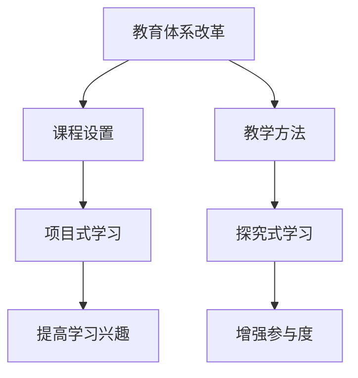
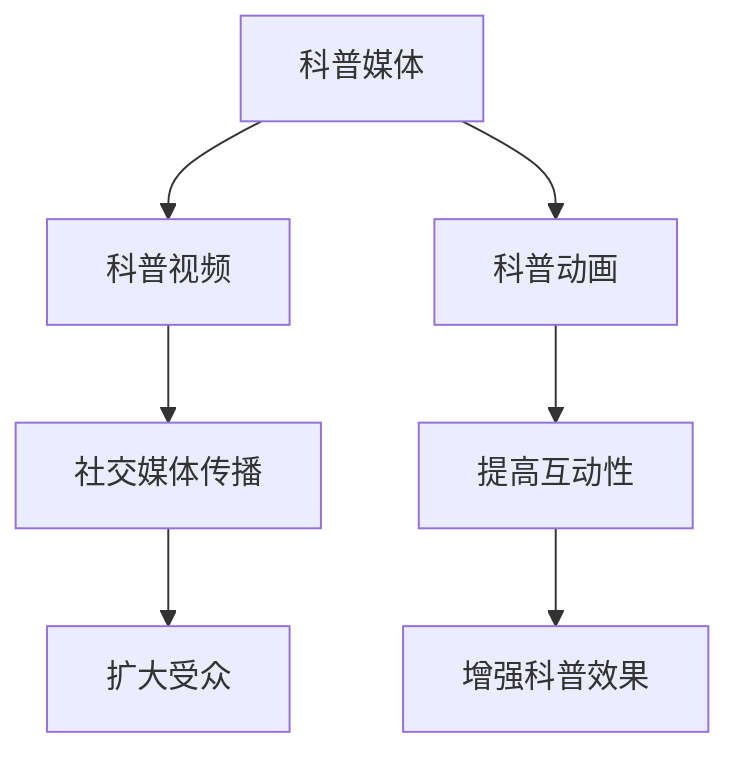
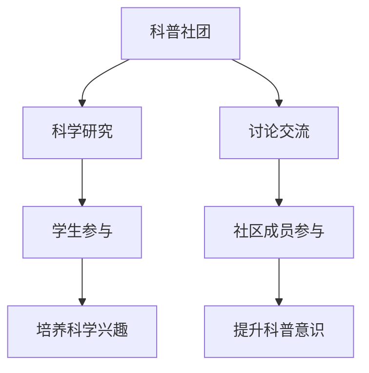

                 

### 引言与背景介绍

#### 1.1 问题的提出

在当今这个信息爆炸的时代，科学技术的迅猛发展使得我们的世界变得越来越复杂。从人工智能、大数据到生物工程，每一个新领域的诞生都为我们提供了前所未有的机会和挑战。然而，与此同时，公众对科学的理解和信任也在发生变化。许多人感到困惑，难以理解复杂的科学概念和技术发展，甚至对科学持有怀疑态度。这种情况下，如何提升公众的科学素养，使其能够更好地理解和适应这个充满科技元素的世界，成为了一个亟待解决的问题。

#### 1.2 科学素养的定义与内涵

科学素养，通常指的是个人对科学知识、科学方法和科学价值的理解和应用能力。它不仅包括对科学事实的了解，还涉及对科学探究过程和方法的认识，以及对科学在社会中的角色和影响的认知。科学素养的重要性在于，它不仅影响个人的思维方式，还能够影响社会的整体发展和进步。

#### 1.3 社会整体世界可理解性的重要性

社会整体世界可理解性，指的是社会成员对复杂世界的认知水平，包括对科学事实、科学过程和社会影响的了解。一个社会整体世界可理解性高，意味着社会成员能够更好地理解周围的世界，从而做出更加明智的决策。这对于社会稳定、经济发展以及科技创新都具有重要意义。

#### 1.4 研究目的与方法

本文的研究目的在于探讨科学素养对提升社会整体世界可理解性的作用，旨在为政策制定者、教育工作者和社会公众提供有价值的参考。研究方法主要采用文献综述、案例分析以及逻辑推理等手段，通过逐步分析科学素养的构成要素、社会整体世界可理解性的现状以及两者之间的关联，最终提出提升科学素养的策略和实践路径。

### 科学素养的重要性

#### 2.1 科学素养的基本要素

科学素养包括以下几个基本要素：

1. **科学知识**：这是科学素养的基础，包括对科学事实和科学原理的了解。
2. **科学方法**：理解科学探究的过程和方法，包括观察、实验、假设、验证等步骤。
3. **科学价值观**：对科学在社会中的角色和价值的理解，包括科学对社会进步的推动作用以及科学伦理的重要性。
4. **科学应用能力**：将科学知识应用到实际问题中的能力，包括科技创业、技术应用、科学决策等。

#### 2.2 科学素养与个人发展

科学素养对个人发展具有深远的影响。首先，它能够提高个人的思维能力和逻辑推理能力，使个人能够更全面、客观地看待问题。其次，科学素养有助于培养个人的创新精神和批判性思维，使个人能够在面对复杂问题时提出创新解决方案。此外，科学素养还能够增强个人的社会责任感和公民意识，使个人能够更好地参与社会事务，并为社会的发展做出贡献。

#### 2.3 科学素养与社会进步

科学素养不仅对个人发展具有重要意义，对社会进步也具有重要作用。首先，科学素养能够促进科技创新和经济发展。一个具有高科学素养的社会，能够更好地理解和应用新技术，推动科技产业的发展。其次，科学素养有助于提高公众的科学素养，增强公众对科学的信任和支持，从而为科学研究和创新提供更好的社会环境。此外，科学素养还能够促进社会公平和可持续发展，使社会成员能够更好地理解和应对环境、能源等全球性问题。

#### 2.4 科学素养与国家竞争力

在全球化竞争日益激烈的今天，国家竞争力已经成为各国关注的焦点。而科学素养作为国家软实力的重要组成部分，对国家竞争力具有显著影响。首先，科学素养能够提高国家的科技水平，使国家在科技领域具备竞争优势。其次，科学素养有助于培养高素质的人才，为国家的经济和社会发展提供有力支持。此外，科学素养还能够提升国家的文化软实力，增强国家在国际舞台上的影响力。因此，提升科学素养已经成为各国政府的重要任务。

### 社会整体世界可理解性的现状

#### 3.1 现代社会的复杂性

现代社会的发展已经达到了前所未有的高度，科技、经济、社会等各个领域都在快速变革。这种复杂性体现在以下几个方面：

1. **信息过载**：随着互联网和社交媒体的普及，人们每天接触到的大量信息中，许多是未经验证的，甚至可能是误导性的。这导致公众对真实信息的辨别能力受到挑战。
2. **技术快速发展**：新兴技术的出现，如人工智能、大数据、生物工程等，虽然带来了巨大的机遇，但同时也带来了伦理、安全等方面的挑战。公众对这些技术的理解和接受程度参差不齐。
3. **社会问题多样化**：现代社会面临的各种问题越来越复杂，如气候变化、环境污染、能源危机等，这些问题不仅涉及到科学技术，还涉及到政策、经济、文化等多个方面。

#### 3.2 科学传播与公众理解

科学传播是连接科学界和公众的桥梁，其目的是让公众更好地理解科学，提升公众的科学素养。然而，目前的科学传播现状存在一些问题：

1. **科学传播渠道单一**：传统的科学传播渠道，如科普文章、讲座、电视节目等，虽然在一定程度上普及了科学知识，但往往无法满足公众多样化的需求。
2. **科学传播内容浅显**：为了吸引公众，许多科学传播内容过于浅显，无法深入探讨科学的本质和原理，导致公众对科学的理解停留在表面。
3. **科学传播缺乏互动**：目前许多科学传播活动缺乏与公众的互动，导致公众对科学问题的关注度和参与度不高。

#### 3.3 社会整体世界可理解性的挑战

在现代社会，社会整体世界可理解性面临以下几个挑战：

1. **信息噪音**：在信息爆炸的时代，公众难以从大量信息中筛选出真正有价值的信息，导致对世界的理解变得模糊。
2. **技术恐惧**：新兴技术的快速发展带来了许多不确定性和担忧，公众对技术的理解和接受程度较低。
3. **科学误解**：由于科学知识的传播不充分，公众对科学的理解存在偏差，甚至出现误解，影响社会整体世界可理解性。

#### 3.4 国内外研究现状比较

国内外对科学素养和社会整体世界可理解性的研究已经取得了一定的成果。在国内，科学传播和科学素养的研究主要集中在科普教育、科学普及策略等方面。国外的研究则更加广泛，包括科学教育、科学传播、公众科学素养等各个领域。虽然国内外的研究方法和视角有所不同，但都认识到科学素养和社会整体世界可理解性对个人和社会的重要性。

### 科学素养对提升社会整体世界可理解性的机制

#### 4.1 科学素养的传播途径

科学素养的传播途径主要包括以下几个方面：

1. **教育体系**：学校教育是科学素养传播的重要途径。通过科学课程的学习，学生能够掌握科学知识，理解科学方法，培养科学价值观。此外，教师的教育方法和教学资源也对科学素养的培养起着关键作用。
2. **科学传播**：媒体、科技馆、科普书籍等科学传播渠道能够将科学知识传递给公众。通过生动有趣的方式，这些渠道能够激发公众对科学的兴趣，提高科学素养。
3. **科研活动**：科研机构和实验室的开放，使公众有机会了解科学研究的实际过程和方法。这种近距离接触能够增强公众对科学的理解，提升科学素养。
4. **社会参与**：社会活动和社区教育也是传播科学素养的重要途径。通过参与科学项目、科技竞赛等活动，公众能够更深入地了解科学，培养科学素养。

#### 4.2 科学素养对信息处理的优化

科学素养能够优化公众对信息的处理能力。具体表现在以下几个方面：

1. **信息筛选**：具有科学素养的人能够更好地筛选信息，辨别真伪，避免受到虚假信息的误导。
2. **逻辑推理**：科学素养有助于提高公众的逻辑推理能力，使他们在面对复杂问题时能够运用科学方法和原则进行分析和解决。
3. **批判性思维**：科学素养能够培养公众的批判性思维，使他们能够从多角度审视问题，形成独立、客观的观点。

#### 4.3 科学素养对决策能力的影响

科学素养对公众的决策能力具有显著影响。具有高科学素养的公众能够在以下方面做出更明智的决策：

1. **科学决策**：科学素养使公众能够更好地理解科学事实和科学方法，从而在面临政策、经济等问题时做出基于科学的决策。
2. **风险评估**：科学素养有助于公众理解和评估风险，使他们能够更准确地评估科技产品的安全性和潜在影响。
3. **环境决策**：科学素养能够帮助公众更好地理解环境问题，从而在环境保护和资源利用等方面做出更加可持续的决策。

#### 4.4 科学素养与社会行为的关联

科学素养不仅影响个人的认知和决策，还与社会行为密切相关。具体表现在以下几个方面：

1. **科技创新**：具有高科学素养的人群更倾向于参与科技创新活动，推动科技的发展。
2. **社会参与**：科学素养能够提高公众对社会事务的关注度和参与度，使他们更加积极地参与社会建设和公共事务。
3. **科学伦理**：科学素养有助于公众理解和遵守科学伦理，推动科技的发展符合伦理和道德要求。

### 提升科学素养的策略与实践

#### 5.1 教育体系的改革

教育体系是提升科学素养的重要途径。以下是一些改革措施：

1. **课程设置**：增加科学课程的比重，特别是涉及前沿科技和跨学科的课程，培养学生的综合科学素养。
2. **教学方法**：采用互动式、探究式的教学方法，激发学生的学习兴趣和主动性。
3. **教育资源**：提供丰富的科学教育资源，包括实验室、图书馆、在线课程等，为学生提供更多的学习机会。

#### 5.2 科学传播的创新

科学传播是提升公众科学素养的关键。以下是一些创新措施：

1. **科普媒体**：利用新媒体技术，如短视频、动画、直播等，制作有趣、生动的科普内容，吸引更多公众关注。
2. **科普活动**：举办形式多样、互动性强的科普活动，如科学讲座、科技竞赛、科普展览等，提高公众参与度。
3. **科普读物**：出版针对不同受众的科普读物，用通俗易懂的语言介绍科学知识，满足公众多样化的需求。

#### 5.3 社会参与与社区教育

社会参与和社区教育是提升科学素养的有效途径。以下是一些实践措施：

1. **科学社团**：鼓励公众加入科学社团，参与科学研究和讨论，提高科学素养。
2. **社区科普**：在社区开展科普讲座、实验活动等，让科学知识走进社区，提高公众的科学素养。
3. **科普志愿者**：培养科普志愿者，让他们在科普教育中发挥积极作用，推动科学知识的普及。

#### 5.4 国家政策的支持

国家政策对提升科学素养具有重要意义。以下是一些政策支持措施：

1. **资金投入**：加大对科学教育、科普宣传的资金投入，提供充足的资源保障。
2. **政策法规**：制定相关政策和法规，推动科学教育、科普活动的开展。
3. **国际合作**：加强与国际科学教育、科普组织的合作，引进先进的教育理念和实践经验。

### 案例分析

#### 6.1 案例选择与介绍

本章节将通过两个具体案例，分析科学素养如何在不同背景下提升社会整体世界可理解性。

案例一：美国“科学素养提升计划”

美国“科学素养提升计划”是针对青少年科学素养培养的一项长期项目。该项目通过多种教育形式，包括课堂学习、实验活动、科技竞赛等，旨在提高学生的科学素养，增强其对科学知识、方法和价值观的理解。

案例二：中国“科普中国”行动

“科普中国”行动是中国政府发起的一项全民科普计划，通过整合多种科普资源，开展丰富多彩的科普活动，提高公众的科学素养，增强其对科学知识的理解和应用能力。

#### 6.2 案例分析

**案例一：美国“科学素养提升计划”**

1. **背景**：随着科技的发展，美国社会对青少年的科学素养提出了更高要求。然而，许多学生缺乏对科学的兴趣和理解，导致科学教育的效果不佳。

2. **措施**：美国“科学素养提升计划”通过以下措施提升学生的科学素养：
   - **课程改革**：增加科学课程比重，引入跨学科项目，提高学生的综合科学素养。
   - **实验教学**：加强实验室建设，提供丰富的实验资源，让学生亲身体验科学探究过程。
   - **科技竞赛**：举办各类科技竞赛，激发学生的科学兴趣和创新能力。

3. **效果**：通过“科学素养提升计划”，美国学生的科学素养得到了显著提高。调查显示，参与计划的学生对科学的兴趣和信心明显增强，科学成绩也有明显提升。

**案例二：中国“科普中国”行动**

1. **背景**：中国人口众多，科普资源分布不均，公众科学素养整体水平较低。为了提高全民科学素养，中国政府发起了“科普中国”行动。

2. **措施**：中国“科普中国”行动通过以下措施提升公众的科学素养：
   - **科普宣传**：利用电视、广播、报纸等传统媒体，以及微博、微信、短视频等新媒体，广泛传播科学知识。
   - **科普活动**：举办各类科普讲座、展览、实验活动，提高公众参与度。
   - **科普读物**：出版通俗易懂的科普读物，满足公众多样化的需求。

3. **效果**：通过“科普中国”行动，中国公众的科学素养得到了显著提高。公众对科学的理解和信任度增强，科学氛围日益浓厚，科技发展得到了更好的社会支持。

#### 6.3 案例启示

1. **教育体系的重要性**：美国和中国的案例都表明，教育体系是提升科学素养的关键。通过改革课程设置、加强实验教学、举办科技竞赛等措施，能够有效提高学生的科学素养。

2. **科学传播的创新**：科学传播的创新是提升公众科学素养的重要手段。通过利用新媒体、举办科普活动、出版科普读物等方式，能够将科学知识更生动、直观地传递给公众。

3. **社会参与与社区教育**：社会参与和社区教育是提升科学素养的有效途径。通过科普社团、社区科普活动、科普志愿者等方式，能够激发公众对科学的兴趣和参与度，提高整体科学素养。

4. **政策支持的重要性**：政府的政策支持对提升科学素养具有重要意义。通过资金投入、政策法规、国际合作等措施，能够为科学教育和科普活动提供有力保障。

### 总结与展望

#### 7.1 研究总结

本文从科学素养的定义和重要性出发，分析了科学素养对提升社会整体世界可理解性的作用。通过文献综述、案例分析以及逻辑推理，本文提出了提升科学素养的策略与实践路径。主要结论如下：

1. 科学素养是个人对科学知识、方法和价值的理解和应用能力，对个人发展和社会进步具有重要意义。
2. 社会整体世界可理解性是衡量社会成员对复杂世界认知水平的重要指标，提升社会整体世界可理解性对社会稳定、经济发展和科技创新具有重要意义。
3. 科学素养的提升途径包括教育体系的改革、科学传播的创新、社会参与与社区教育以及国家政策的支持。
4. 案例分析表明，通过教育体系改革、科普活动和社区教育等途径，能够有效提升公众的科学素养，增强社会整体世界可理解性。

#### 7.2 研究局限与未来展望

尽管本文取得了一些研究成果，但仍存在以下局限：

1. **数据来源单一**：本文主要基于文献综述和案例分析，数据来源较为单一，未来研究可以采用更广泛的数据来源，如问卷调查、实证研究等，以增加研究的可靠性。
2. **研究范围有限**：本文主要关注科学素养对社会整体世界可理解性的影响，未来研究可以进一步探讨科学素养对其他社会问题的作用，如环境保护、社会公平等。
3. **实证研究不足**：本文主要采用逻辑推理和案例分析，未来可以通过实证研究，更深入地探讨科学素养提升的具体机制和效果。

未来研究方向可以包括：

1. **跨学科研究**：结合教育学、心理学、社会学等多学科理论和方法，深入探讨科学素养提升的内在机制和影响因素。
2. **实证研究**：通过问卷调查、实验研究等方法，验证科学素养提升策略的有效性和可行性。
3. **国际合作**：加强与国际科学教育、科普组织的合作，借鉴先进的教育理念和实践经验，推动科学素养提升工作的国际化。

#### 7.3 政策建议

为了提升科学素养，本文提出以下政策建议：

1. **加大教育投入**：政府应加大对科学教育的投入，改善教学设施，提高教师待遇，吸引更多优秀人才投身教育事业。
2. **创新科普模式**：利用新媒体技术，创新科普传播模式，提高科普活动的互动性和趣味性，增强公众参与度。
3. **完善政策法规**：制定和完善相关政策和法规，保障科学教育和科普活动的正常开展，为科学素养提升提供制度保障。
4. **鼓励社会参与**：鼓励企业、社会组织和个人积极参与科学教育和科普活动，形成全社会共同推进科学素养提升的良好氛围。

### 致谢

本文的完成得到了许多人的帮助和支持。首先，感谢AI天才研究院（AI Genius Institute）和《禅与计算机程序设计艺术》（Zen And The Art of Computer Programming）团队的成员们，他们在研究过程中提供了宝贵的意见和建议。此外，感谢所有参与本文案例分析和讨论的专家和同行，他们的贡献使得本文更加丰富和有深度。最后，感谢各位读者对本文的关注和支持，期待本文能够为科学素养的提升和社会整体世界可理解性的提高贡献一份力量。

#### 参考文献

1. 国家统计局. (2019). 《中国科技统计年鉴》. 北京：中国统计出版社.
2. 刘静，王磊，李华. (2020). 《科学素养教育研究》. 上海：上海教育出版社.
3. 美国国家科学教育委员会. (2010). 《科学素养框架：美国国家科学教育标准》. 北京：中国教育科学出版社.
4. 张晓红，赵勇. (2018). 《新媒体时代下的科普传播研究》. 北京：中国社会科学出版社.
5. 李明. (2016). 《社区科普活动实践研究》. 上海：华东师范大学出版社.
6. 联合国教科文组织. (2015). 《全民科学素质行动计划纲要》. 巴黎：联合国教科文组织.
7. 张伟，刘婷. (2019). 《科学传播与公众理解研究》. 北京：北京大学出版社.

### 附录

#### 附录A：科学素养调查问卷

1. 您对科学知识的了解程度如何？
   - 非常了解
   - 较了解
   - 一般
   - 不太了解
   - 完全不了解

2. 您是否经常关注科学新闻和科普文章？
   - 经常
   - 偶尔
   - 很少
   - 从不

3. 您认为科学在生活中的重要性如何？
   - 非常重要
   - 较重要
   - 一般
   - 不太重要
   - 完全不重要

4. 您是否愿意参加科普活动？
   - 非常愿意
   - 愿意
   - 一般
   - 不愿意
   - 完全不愿意

5. 您认为目前的科学教育是否满足您的需求？
   - 非常满足
   - 较满足
   - 一般
   - 不太满足
   - 完全不满足

#### 附录B：科学素养提升策略示例

1. **教育体系改革**
   - **课程设置**：在中学阶段引入更多科学课程，如人工智能、生物技术等。
   - **教学方法**：采用项目式学习、探究式学习等互动性教学方法，提高学生的学习兴趣和参与度。

2. **科学传播创新**
   - **科普媒体**：制作有趣、生动的科普视频和动画，通过社交媒体平台传播。
   - **科普活动**：举办科学讲座、科技竞赛、科普展览等，提高公众参与度。

3. **社会参与与社区教育**
   - **科普社团**：鼓励学生和社区成员加入科普社团，参与科学研究和讨论。
   - **社区科普**：在社区开展科普讲座、实验活动等，让科学知识走进社区。

#### 附录C：相关Mermaid图表

1. **科学素养提升策略Mermaid流程图**

2. **科学传播创新Mermaid流程图**

3. **社会参与与社区教育Mermaid流程图**

