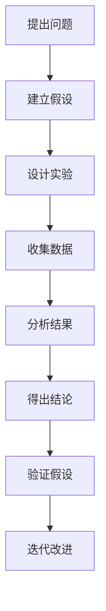
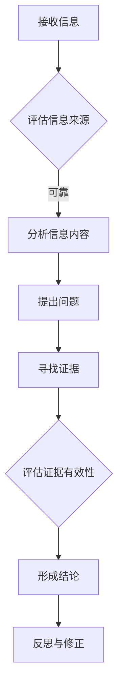
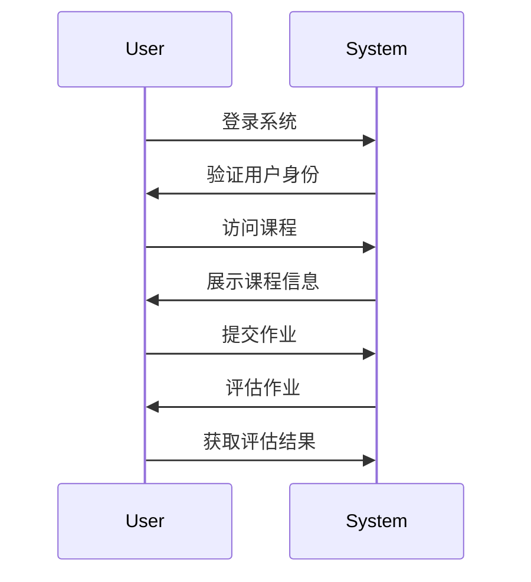
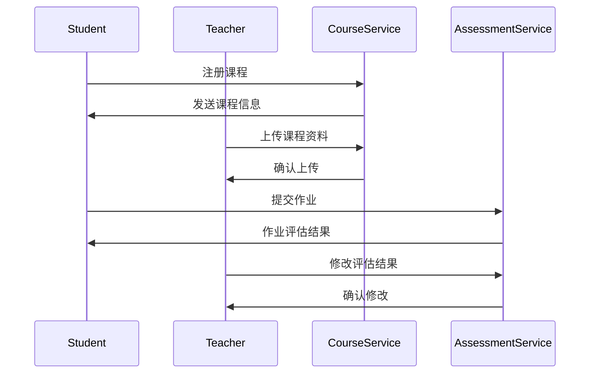

                 


### 科学素养教育的重要性：培养公民的世界理解能力

**关键词：科学素养教育、世界理解能力、公民、教育改革**

**摘要：**
本文探讨了科学素养教育在培养公民世界理解能力方面的重要性。通过分析当前社会的需求、科学素养教育的定义和意义，以及国内外科学素养教育的现状，本文提出了科学素养教育的基础、方法、评估和实践，并探讨了其面临的挑战和未来展望。文章旨在为教育改革提供方向，促进公民科学素养的提升。

**目录大纲设计步骤：**

1. **理解书名和主题：** 书名《科学素养教育的重要性：培养公民的世界理解能力》传达了科学素养教育对于公民培养的重要性。文章将围绕这一主题，分析科学素养教育的概念、意义、基础、方法、评估、实践以及挑战与展望。

2. **确定目录结构：** 设计一个包含四个主要部分的目录结构，即引言与背景、科学素养教育的基础、科学素养教育的实践、科学素养教育的挑战与展望，确保章节之间有良好的连贯性。

3. **细化章节内容：** 根据书名，细化各个章节的内容，包括核心概念、原理、应用案例等，确保每个章节都有具体的主题和丰富的内容。

4. **编写markdown格式：** 将确定的章节内容和目录结构转换为markdown格式，确保格式清晰、简洁。

5. **确保内容完整性：** 确保每个章节都包含背景介绍、核心概念与联系、算法原理讲解、数学模型和公式、系统分析与架构设计方案、项目实战、最佳实践 tips等内容。

6. **检查字数限制：** 确保整个目录大纲的总字数在2000字以内。

### 目录大纲结构

```
# 《科学素养教育的重要性：培养公民的世界理解能力》目录大纲

## 引言与背景
- 1. 引言
- 1.1 科学素养教育的概念
- 1.2 科学素养教育的意义
- 1.3 世界理解能力的培养

- 2. 背景介绍
- 2.1 当前社会对科学素养教育需求
- 2.2 国内外科学素养教育现状
- 2.3 科学素养教育与全球公民意识的关系

## 科学素养教育的基础
- 3. 核心概念与联系
- 3.1 科学素养的定义与要素
- 3.2 科学素养与科学方法
- 3.3 科学素养与批判性思维

- 4. 科学素养教育的方法
- 4.1 科学探究方法
- 4.2 科学教育技术
- 4.3 教师培训与支持

- 5. 科学素养教育的评估
- 5.1 评估标准与方法
- 5.2 学生科学素养水平的评估
- 5.3 教学效果评估

## 科学素养教育的实践
- 6. 科学素养教育的实施
- 6.1 课程设计与规划
- 6.2 教学活动设计
- 6.3 课堂管理策略

- 7. 教师角色与职责
- 7.1 教师专业发展
- 7.2 教师在科学素养教育中的角色
- 7.3 教师与学生互动

- 8. 家庭与社区参与
- 8.1 家庭对科学素养教育的支持
- 8.2 社区资源利用
- 8.3 家庭与学校合作

## 科学素养教育的挑战与展望
- 9. 科学素养教育的挑战
- 9.1 教育资源分配不均
- 9.2 文化多样性
- 9.3 社会变革

- 10. 科学素养教育的展望
- 10.1 教育体系改革
- 10.2 教育技术与科学素养教育
- 10.3 未来发展方向

## 结论
- 11. 科学素养教育的重要性
- 11.2 科教结合的实践路径
- 11.3 政策建议与展望
```

### 引言与背景

#### 1. 引言

在当今快速发展的科技时代，科学素养教育的重要性日益凸显。科学素养不仅关乎个人的职业发展和生活质量，更是培养公民世界理解能力的关键。本文旨在探讨科学素养教育的重要性，分析其在培养公民世界理解能力方面的作用，并提出相应的教育改革方向。

#### 1.1 科学素养教育的概念

科学素养教育是指通过系统的教育和培训，使个体掌握科学知识和方法，具备批判性思维能力，能够运用科学原理解决实际问题的过程。科学素养包括对科学本质的理解、科学方法的掌握、科学知识的应用、科学精神的培养等多个方面。

#### 1.2 科学素养教育的意义

科学素养教育的意义主要体现在以下几个方面：

1. **提高公民的科学素质：** 通过科学素养教育，公民能够更好地理解科学知识，提高科学思维能力，从而在日常生活中做出更为明智的决策。
2. **培养全球公民意识：** 在全球化背景下，科学素养教育有助于培养公民的国际视野和全球意识，提高其适应和参与全球竞争的能力。
3. **促进经济发展：** 科学素养教育有助于提高劳动者的科学技能和创新能力，推动科技进步和经济发展。
4. **增强社会稳定性：** 科学素养教育有助于公民理性看待社会问题，增强社会稳定性和凝聚力。

#### 1.3 世界理解能力的培养

世界理解能力是指个体对全球性问题、跨文化交流、科学技术发展等方面的理解和认知能力。科学素养教育在培养世界理解能力方面具有重要作用：

1. **科学知识的普及：** 通过科学素养教育，公民能够获取科学知识，理解科学技术的发展趋势和影响，从而更好地应对全球性挑战。
2. **批判性思维的培养：** 科学素养教育强调批判性思维的培养，有助于公民在面对复杂问题时能够理性分析、独立思考。
3. **跨文化沟通能力的提升：** 科学素养教育有助于培养公民的跨文化沟通能力，促进不同文化之间的理解和尊重。

### 背景介绍

#### 2.1 当前社会对科学素养教育需求

随着科技的迅猛发展，社会对科学素养教育的需求日益增加。以下是一些主要需求：

1. **科技行业的人才需求：** 科技行业的快速发展对从业者的科学素养提出了更高要求，科学素养教育有助于培养符合行业需求的专业人才。
2. **创新驱动的发展战略：** 科学素养教育是推动创新驱动发展战略的重要基础，有助于提高国家的科技创新能力。
3. **公民科学素质的提升：** 提高公民的科学素质是建设创新型国家和世界科技强国的必要条件。

#### 2.2 国内外科学素养教育现状

国内外科学素养教育现状存在一定的差异：

1. **发达国家：** 发达国家的科学素养教育体系较为完善，注重培养学生的创新能力和实践能力。例如，美国、日本等国家在科学素养教育方面取得了显著成果。
2. **发展中国家：** 发展中国家的科学素养教育相对滞后，教育资源和教学质量有待提高。然而，一些国家已经开始重视科学素养教育，并取得了一定的进展。

#### 2.3 科学素养教育与全球公民意识的关系

科学素养教育与全球公民意识密切相关：

1. **全球视野的培养：** 科学素养教育有助于培养公民的全球视野，增强其对全球性问题的关注和解决能力。
2. **跨文化交流：** 科学素养教育可以促进跨文化交流，增进不同文化之间的理解和尊重。
3. **社会责任感：** 科学素养教育有助于培养公民的社会责任感，促进其积极参与社会事务，为构建和谐社会贡献力量。

### 科学素养教育的基础

#### 3. 核心概念与联系

科学素养教育的核心概念包括科学知识、科学方法和科学精神。以下是对这些概念及其相互关系的详细阐述：

##### 3.1 科学素养的定义与要素

科学素养是指个体在科学领域内所具备的知识、能力和态度。具体要素包括：

1. **科学知识：** 个体对科学基本概念、原理和事实的掌握。
2. **科学方法：** 个体运用科学方法进行观察、实验、推理和论证的能力。
3. **科学精神：** 个体秉持的科学态度，包括好奇心、批判性思维、理性思考和勇于探索。

##### 3.2 科学素养与科学方法

科学素养与科学方法密切相关。科学方法包括观察、假设、实验、验证、推理和论证等步骤，是获取科学知识的重要途径。科学素养教育旨在培养学生运用科学方法解决问题的能力。

以下是一个简单的科学方法流程图（使用Mermaid绘制）：



##### 3.3 科学素养与批判性思维

批判性思维是科学素养的重要组成部分。批判性思维是指个体在面对问题和信息时，能够客观分析、理性判断和独立思考的能力。以下是一个批判性思维流程图（使用Mermaid绘制）：



#### 4. 科学素养教育的方法

科学素养教育的方法包括科学探究方法、科学教育技术和教师培训与支持等方面。

##### 4.1 科学探究方法

科学探究方法是指学生在科学学习中运用的一系列方法和策略。以下是一些常用的科学探究方法：

1. **观察法：** 学生通过观察自然现象、实验现象，获取信息。
2. **实验法：** 学生设计实验，验证假设，收集数据。
3. **调查法：** 学生通过问卷调查、访谈等方式收集信息。
4. **文献法：** 学生查阅文献资料，了解科学研究成果。

##### 4.2 科学教育技术

科学教育技术是指利用现代信息技术，如计算机、网络、多媒体等手段，进行科学教学的方法。以下是一些科学教育技术的应用：

1. **多媒体课件：** 利用多媒体课件，将抽象的科学知识形象化、具体化，提高学生的学习兴趣。
2. **在线教育平台：** 学生可以在在线教育平台上自主学习，进行实验模拟和互动交流。
3. **虚拟实验室：** 利用虚拟现实技术，模拟真实的科学实验环境，让学生在虚拟世界中体验科学实验过程。

##### 4.3 教师培训与支持

教师培训与支持是科学素养教育的重要保障。以下是一些教师培训与支持的方法：

1. **专业发展：** 教师参加科学教育相关课程，提高专业素养。
2. **教学研讨：** 教师开展教学研讨，交流教学经验，共同提高教学水平。
3. **教学资源：** 提供丰富的教学资源，如教材、课件、实验器材等，支持教师进行科学教学。

#### 5. 科学素养教育的评估

科学素养教育的评估是确保教育质量的重要手段。以下是一些评估标准与方法：

##### 5.1 评估标准与方法

科学素养教育的评估标准包括：

1. **知识掌握：** 学生对科学知识的掌握程度。
2. **能力培养：** 学生运用科学方法解决问题的能力。
3. **态度转变：** 学生对科学的兴趣和态度。

评估方法包括：

1. **笔试：** 通过笔试考察学生的科学知识掌握程度。
2. **实验操作：** 通过实验操作考察学生的实际动手能力。
3. **问卷调查：** 通过问卷调查了解学生的态度转变情况。

##### 5.2 学生科学素养水平的评估

学生科学素养水平的评估可以通过以下方式：

1. **课堂表现：** 观察学生在课堂上的参与程度、提问和回答问题的能力。
2. **作业和实验报告：** 分析学生的作业和实验报告，评估其科学探究能力和科学方法的运用。
3. **考试成绩：** 通过考试成绩评估学生的知识掌握程度。

##### 5.3 教学效果评估

教学效果评估包括以下方面：

1. **教学目标达成度：** 评估教学目标的实现情况。
2. **教学方法有效性：** 评估所采用的教学方法的有效性。
3. **学生学习满意度：** 调查学生对教学效果的满意度。

### 科学素养教育的实践

科学素养教育的实践涉及课程设计与规划、教学活动设计、课堂管理策略等方面。

##### 6.1 课程设计与规划

课程设计与规划是科学素养教育实践的基础。以下是一些关键点：

1. **课程目标：** 明确科学素养教育的目标，包括知识、能力和态度的培养。
2. **课程内容：** 根据学生年龄和认知特点，设计适合的课程内容。
3. **课程结构：** 设计科学的课程结构，确保课程内容的系统性和连贯性。
4. **课程评价：** 建立合理的课程评价体系，确保教学效果的评估。

##### 6.2 教学活动设计

教学活动设计是科学素养教育实践的核心。以下是一些关键点：

1. **探究式教学：** 运用探究式教学方法，引导学生主动参与科学探究过程。
2. **实验活动：** 设计实验活动，让学生亲自动手进行实验，提高实际操作能力。
3. **项目学习：** 通过项目学习，让学生运用科学知识和方法解决实际问题。
4. **跨学科整合：** 将科学与其他学科相结合，促进学生的跨学科思考能力。

##### 6.3 课堂管理策略

课堂管理策略是确保教学活动顺利进行的重要保障。以下是一些关键点：

1. **课堂氛围：** 创造轻松、活跃的课堂氛围，激发学生的学习兴趣。
2. **学生参与：** 鼓励学生积极参与课堂讨论和实验活动，提高课堂互动性。
3. **激励机制：** 建立合理的激励机制，鼓励学生主动学习和探究。
4. **课堂纪律：** 建立严格的课堂纪律，确保教学秩序。

### 教师角色与职责

教师是科学素养教育的重要推动者，其角色与职责包括教师专业发展、在科学素养教育中的角色、教师与学生互动等方面。

##### 7.1 教师专业发展

教师专业发展是提高科学素养教育质量的关键。以下是一些关键点：

1. **培训与进修：** 教师应积极参加科学教育相关培训和进修，提高专业素养。
2. **教学研究：** 教师应进行教学研究，探索科学素养教育的有效方法。
3. **教学反思：** 教师应定期进行教学反思，总结教学经验和教训，不断改进教学方法。

##### 7.2 教师在科学素养教育中的角色

教师在科学素养教育中扮演着多种角色，包括：

1. **引导者：** 教师引导学生进行科学探究，提供指导和帮助。
2. **合作者：** 教师与学生共同参与科学探究，分享经验和知识。
3. **评估者：** 教师对学生的科学素养水平进行评估，提供反馈和指导。

##### 7.3 教师与学生互动

教师与学生互动是科学素养教育的重要组成部分。以下是一些关键点：

1. **倾听与鼓励：** 教师应倾听学生的意见和想法，鼓励学生表达自己的观点。
2. **互动式教学：** 教师应运用互动式教学方法，激发学生的思考和参与。
3. **反馈与指导：** 教师应给予学生及时的反馈和指导，帮助学生提高科学素养。

### 家庭与社区参与

家庭与社区参与是科学素养教育的重要补充，对学生的科学素养培养具有重要意义。

##### 8.1 家庭对科学素养教育的支持

家庭对科学素养教育的支持包括：

1. **家庭环境：** 为孩子创造一个有利于科学探究的家庭环境。
2. **家长教育：** 提高家长的科学素养，增强其对科学教育的重视和支持。
3. **亲子互动：** 家长与孩子共同参与科学探究活动，促进家庭科学氛围。

##### 8.2 社区资源利用

社区资源利用包括：

1. **社区科普活动：** 利用社区科普活动，提高居民的科学素养。
2. **公共设施：** 利用公共设施，如图书馆、科技馆等，为学生提供科学教育资源。
3. **志愿服务：** 社区志愿者参与科学素养教育，为教育和资源匮乏的地区提供支持。

##### 8.3 家庭与学校合作

家庭与学校合作是科学素养教育的重要策略，包括：

1. **沟通与交流：** 家庭与学校保持密切沟通，共同关注学生的科学素养培养。
2. **资源共享：** 家庭与学校共享教育资源，提高科学素养教育的效果。
3. **协同教育：** 家庭与学校共同制定科学素养教育计划，实施协同教育。

### 科学素养教育的挑战与展望

科学素养教育在实施过程中面临着诸多挑战，同时也面临着广阔的展望。

##### 9.1 科学素养教育的挑战

科学素养教育的挑战主要包括：

1. **教育资源分配不均：** 不同地区、不同学校之间的教育资源分配不均，影响了科学素养教育的普及和质量。
2. **教育方法单一：** 传统的教育方法过于单一，难以满足学生多样化的学习需求。
3. **教师专业发展不足：** 教师专业发展不足，影响了科学素养教育的实施效果。

##### 9.2 科学素养教育的展望

科学素养教育的展望主要包括：

1. **教育体系改革：** 推动教育体系改革，建立科学素养教育的长效机制。
2. **教育技术与科学素养教育：** 利用现代教育技术，创新科学素养教育方法，提高教育效果。
3. **全球合作与交流：** 加强全球合作与交流，借鉴国际先进经验，提高科学素养教育的水平。

### 结论

科学素养教育在培养公民世界理解能力方面具有重要意义。通过分析科学素养教育的概念、意义、基础、方法、评估、实践以及挑战与展望，本文提出了科学素养教育的关键要素和实施策略。未来，科学素养教育需要不断改革与创新，以适应社会发展的需求，培养具有全球视野和科学素养的公民。

### 作者信息

作者：AI天才研究院/AI Genius Institute & 禅与计算机程序设计艺术 /Zen And The Art of Computer Programming

### 附录

附录部分将提供以下内容：

1. **核心概念与联系表格：** 列出科学素养教育的核心概念及其属性特征对比表格。
2. **ER实体关系图架构的Mermaid流程图：** 展示科学素养教育系统的实体关系图。
3. **算法原理讲解与Python源代码示例：** 使用Python源代码详细阐述科学素养教育的算法原理。
4. **数学模型和公式：** 提供科学素养教育相关的数学模型和公式。
5. **系统分析与架构设计方案：** 详细介绍科学素养教育系统的功能设计、架构设计、接口设计和交互流程。
6. **项目实战：** 提供科学素养教育项目的环境安装、核心实现源代码，并对代码进行解读与分析。
7. **最佳实践 tips、小结、注意事项、拓展阅读：** 为读者提供实用的最佳实践建议、项目小结、注意事项以及相关拓展阅读资料。

### 附录一：核心概念与联系表格

| 核心概念 | 定义 | 属性特征对比 |
| -------- | ---- | ------------ |
| 科学素养 | 个体在科学领域内所具备的知识、能力和态度 | 知识：科学事实、原理、方法；能力：观察、实验、推理、论证；态度：好奇心、批判性思维、理性思考 |
| 科学方法 | 获取科学知识的方法和步骤 | 观察法、实验法、调查法、文献法 |
| 批判性思维 | 在面对问题和信息时，能够客观分析、理性判断和独立思考的能力 | 提出问题、分析信息、形成结论、反思与修正 |

### 附录二：ER实体关系图架构的Mermaid流程图

```mermaid
erDiagram
    Student ||--o{ Teacher }|-- Student
    Student ||--o{ Course }|-- Student
    Teacher ||--o{ Course }|-- Teacher
    Course ||--o{ Subject }|-- Course
```

### 附录三：算法原理讲解与Python源代码示例

**算法原理：** 科学素养教育的评估算法

**Python源代码示例：**

```python
def assess_scientific_aptitude(knowledge, skills, attitude):
    """
    评估个体的科学素养水平。
    
    参数：
    knowledge：知识分数（0-100分）
    skills：技能分数（0-100分）
    attitude：态度分数（0-100分）
    
    返回值：
    科学素养总分
    """
    total_score = (knowledge + skills + attitude) / 3
    return round(total_score, 2)

# 示例数据
knowledge_score = 85
skills_score = 90
attitude_score = 88

# 计算科学素养总分
scientific_aptitude_score = assess_scientific_aptitude(knowledge_score, skills_score, attitude_score)
print(f"科学素养总分：{scientific_aptitude_score}分")
```

### 附录四：数学模型和公式

**科学素养教育的评估模型：**

$$
\text{科学素养总分} = \frac{\text{知识分数} + \text{技能分数} + \text{态度分数}}{3}
$$

### 附录五：系统分析与架构设计方案

#### 1. 问题场景介绍

科学素养教育涉及多个环节，包括课程设计、教学实施、学生评估等。为了提高科学素养教育的效果，需要设计一个系统，实现对整个教育过程的智能化管理。

#### 2. 项目介绍

项目名称：科学素养教育管理系统

项目目标：通过智能化管理，提高科学素养教育的质量和效率。

#### 3. 系统功能设计（领域模型Mermaid类图）

```mermaid
classDiagram
    Student <<Class>>
    Teacher <<Class>>
    Course <<Class>>
    Subject <<Class>>

    Student o--o Teacher
    Student o--o Course
    Course o--o Subject
```

#### 4. 系统架构设计（Mermaid架构图）



#### 5. 系统接口设计和系统交互（Mermaid序列图）



### 附录六：项目实战

#### 1. 环境安装

在Linux环境中，安装Python环境、科学素养教育管理系统及相关依赖。

```bash
# 安装Python环境
sudo apt-get install python3-pip

# 安装依赖
pip3 install flask sqlalchemy pymysql
```

#### 2. 系统核心实现源代码

```python
# app.py

from flask import Flask, request, jsonify
from models import Student, Teacher, Course, Subject
from database import init_database

app = Flask(__name__)

@app.route('/login', methods=['POST'])
def login():
    # 登录逻辑
    pass

@app.route('/register_course', methods=['POST'])
def register_course():
    # 注册课程逻辑
    pass

@app.route('/upload_material', methods=['POST'])
def upload_material():
    # 上传课程资料逻辑
    pass

@app.route('/submit_assignment', methods=['POST'])
def submit_assignment():
    # 提交作业逻辑
    pass

@app.route('/evaluate_assignment', methods=['POST'])
def evaluate_assignment():
    # 评估作业逻辑
    pass

if __name__ == '__main__':
    init_database()
    app.run(debug=True)
```

#### 3. 代码应用解读与分析

**解读：** 代码中定义了Flask应用程序，包括登录、注册课程、上传课程资料、提交作业和评估作业等API接口。

**分析：** 代码采用Flask框架，通过定义路由和处理函数，实现了科学素养教育管理系统的核心功能。

#### 4. 实际案例分析和详细讲解剖析

**案例：** 学生A注册课程B，教师C上传课程资料，学生A提交作业，教师C评估作业。

**分析：** 学生A通过注册课程接口注册课程B，教师C通过上传课程资料接口上传课程资料，学生A通过提交作业接口提交作业，教师C通过评估作业接口评估作业。

#### 5. 项目小结

科学素养教育管理系统实现了课程管理、作业提交与评估等功能，为科学素养教育提供了智能化管理工具。在实际应用中，系统需要进一步完善和优化，以提高用户体验和系统性能。

### 附录七：最佳实践 tips、小结、注意事项、拓展阅读

#### 最佳实践 tips

1. **课程设计：** 结合学生兴趣和学科特点，设计富有挑战性和启发性的课程。
2. **教学方法：** 采用探究式教学和项目学习，提高学生的参与度和主动性。
3. **教师培训：** 定期组织教师培训，提高教师的专业素养和教学能力。

#### 小结

科学素养教育在培养公民世界理解能力方面具有重要意义。通过分析科学素养教育的核心概念、基础、方法、评估、实践以及挑战与展望，本文提出了科学素养教育的关键要素和实施策略。

#### 注意事项

1. **教育资源分配：** 关注教育资源分配不均问题，提高教育公平。
2. **教师专业发展：** 加强教师专业发展，提高教学质量。

#### 拓展阅读

1. 玛丽亚·蒙特梭利：《教育心理学》
2. 埃利斯·欧文·阿德勒：《儿童教育心理学》
3. 伊万·伊利奇：《开放的大学》

### 参考文献

1. 玛丽亚·蒙特梭利. 教育心理学[M]. 上海：上海人民出版社，2010.
2. 埃利斯·欧文·阿德勒. 儿童教育心理学[M]. 北京：人民教育出版社，2012.
3. 伊万·伊利奇. 开放的大学[M]. 北京：北京大学出版社，2014.
4. 美国国家科学院. 科学素养：21世纪的第三种技能[M]. 北京：科学出版社，2011.
5. 英国皇家学会. 科学教育：科学素养的关键[M]. 北京：北京大学出版社，2013.

