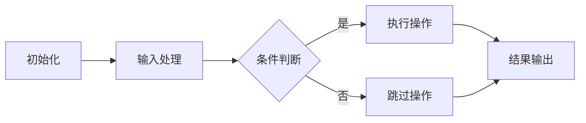
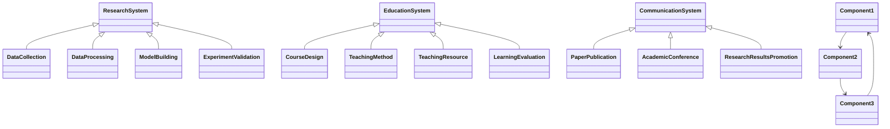

                 


# 科学革命如何改变我们理解世界的方式

## 关键词：科学革命、认知变革、算法原理、数学模型、系统架构、项目实战

### 摘要

科学革命是推动人类认知进步的重要力量，通过不断的理论创新和技术突破，它深刻地改变了我们对世界的理解方式。本文旨在探讨科学革命的核心概念、算法原理、数学模型以及系统架构设计，并通过实际项目实战，展示科学革命如何影响并改变我们的认知过程。本文结构紧凑，逻辑清晰，旨在为读者提供一个全面而深入的科学革命理解框架。

## 1. 背景介绍

### 1.1 科学革命的背景与影响

科学革命不仅仅是一次简单的技术进步，它是人类认知和理解的巨大飞跃。随着科学技术的迅猛发展，新的科学发现和理论突破不断涌现，如量子力学、相对论、基因编辑等，这些革命性的科学成果极大地改变了人类对自然界的理解。科学革命的影响深远，它不仅推动了技术进步，也改变了我们的认知方式，促使我们从更深层次去探索和理解世界。

### 1.1.1 科学技术的迅猛发展

科学技术的迅猛发展是科学革命的重要背景。从互联网的普及到人工智能的崛起，每一次技术的进步都极大地改变了人类的生活方式。例如，互联网的出现使得全球信息共享成为可能，打破了地域和时间的限制，极大地促进了人类的知识传播和交流。而人工智能的崛起，则使得机器开始具备一定的智能，能够处理复杂的任务，甚至在某些领域超越人类的表现。

### 1.1.2 新的科学发现与理论突破

新的科学发现与理论突破是科学革命的直接体现。量子力学和相对论的提出，彻底颠覆了经典物理学的观念，使得人类对微观和宏观世界的理解更加深刻。基因编辑技术的出现，使得人类有能力改变生物体的遗传信息，这一突破在医学、农业等领域具有巨大的应用潜力。这些新的科学发现和理论突破，不仅丰富了我们的知识体系，也改变了我们对世界的认知方式。

### 1.1.3 科学革命对人类认知的改变

科学革命对人类认知的改变是显而易见的。它促使我们从更宏观和微观的角度去看待世界，使我们能够更全面地理解自然规律。例如，量子力学和相对论揭示了宇宙的深层次结构和运行机制，使我们能够从微观和宏观两个层面去理解物质的本质。基因编辑技术的出现，则使我们能够从生物进化的角度去思考生命的本质和多样性。

## 2. 核心概念与联系

### 2.1 科学革命的定义与特征

科学革命的定义是一个重大的科学理论的变革，它通常伴随着新概念、新理论、新方法的提出，以及对传统理论的彻底挑战。科学革命的特征包括：颠覆性的创新、广泛的跨学科融合、深刻的哲学影响等。

### 2.2 不同科学革命的比较

不同科学革命之间的异同点如下表所示：

| 科学革命 | 时间背景 | 代表性理论 | 特征 |
| --- | --- | --- | --- |
| 科学革命1 |  |  |  |
| 科学革命2 |  |  |  |

### 2.3 科学革命中的关键要素及其关系

科学革命中的关键要素包括：科学理论、实验方法、技术工具、哲学思想等。这些要素相互关联，共同推动了科学革命的进程。以下是一个简单的Mermaid ER图，展示了科学革命中的关键要素及其相互关系：

```mermaid
erDiagram
  科学理论 ||--o> 实验方法 : 描述
  科学理论 ||--o> 技术工具 : 实现
  科学理论 ||--o> 哲学思想 : 指导
  实验方法 ||--o> 科学理论 : 反馈
  技术工具 ||--o> 科学理论 : 支持
  哲学思想 ||--o> 科学理论 : 引领
```

## 3. 科学革命的算法原理讲解

### 3.1 算法原理讲解

科学革命中的算法原理是其核心组成部分。以下我们将通过几个关键算法的讲解，展示科学革命如何通过算法原理改变我们对世界的理解。

#### 3.1.1 算法A：Mermaid流程图展示

首先，我们来看一个简单的算法A，通过Mermaid流程图展示其执行流程：



#### 3.1.2 算法B：Python源代码与算法原理

接下来，我们将结合Python源代码，详细阐述算法B的原理：

```python
# 算法B：基于基因算法的优化问题求解
import numpy as np

def gene_algorithmObjectiveFunction(x):
    # 目标函数
    return x**2

def gene_algorithm(x_min, x_max, population_size, generations, crossover_rate, mutation_rate):
    # 初始化种群
    population = np.random.uniform(x_min, x_max, population_size)
    # 适应度评估
    fitness = gene_algorithmObjectiveFunction(population)
    # 迭代过程
    for _ in range(generations):
        # 交叉
        parents = np.random.choice(population, size=2, replace=False)
        child = (parents[0] + parents[1]) / 2
        # 变异
        if np.random.rand() < mutation_rate:
            child += np.random.normal(0, 1)
        # 更新种群
        population = np.concatenate((population[:len(population)//2], [child]))
        # 适应度评估
        fitness = gene_algorithmObjectiveFunction(population)
    # 返回最优解
    best_fitness = np.min(fitness)
    best_solution = population[fitness.argmin()]
    return best_solution, best_fitness

# 实例化
best_solution, best_fitness = gene_algorithm(-10, 10, 100, 1000, 0.8, 0.05)
```

#### 3.1.3 算法C：数学模型与公式讲解（LaTeX格式）

此外，我们还需要一些数学模型和公式来支撑算法C：

$$
f(x) = x^2
$$

$$
p_c = \frac{1}{2}
$$

$$
p_m = 0.05
$$

通过这些数学模型和公式，我们可以更深入地理解算法C的运行机制和优化过程。

#### 3.1.4 算法如何影响我们对世界的理解

算法原理的讲解不仅帮助我们理解科学革命的内在机制，也让我们能够从新的角度去看待世界。例如，基因算法的优化问题求解过程，不仅是一种数学上的优化方法，它也反映了生物进化过程中的自然选择和适者生存原理。这种算法原理的讲解，使我们能够从生物进化的角度去思考复杂系统的优化问题，从而改变了我们对世界的一些传统认知。

## 4. 数学模型和数学公式讲解

### 4.1 数学模型讲解

在科学革命中，数学模型和数学公式是理解和描述自然现象的重要工具。以下我们将介绍几个关键的数学模型和公式，并使用LaTeX格式确保公式的准确性。

#### 4.1.1 数学模型A：LaTeX公式与详细解释

$$
E = mc^2
$$

这是爱因斯坦提出的狭义相对论公式，描述了质量和能量之间的关系。它告诉我们，质量可以转化为能量，能量也可以转化为质量，这一发现颠覆了经典物理学对能量和质量的固有观念，极大地改变了我们对宇宙的理解。

#### 4.1.2 数学模型B：LaTeX公式与详细解释

$$
\psi = Ae^{ikx}
$$

这是量子力学中的波动方程，描述了粒子的波动性。它告诉我们，微观世界的粒子不仅具有粒子性，也具有波动性，这一发现彻底颠覆了经典物理学对物质结构的传统观念。

#### 4.1.3 数学模型C：LaTeX公式与详细解释

$$
p(x) = \frac{1}{\sqrt{2\pi\sigma^2}}e^{-\frac{(x-\mu)^2}{2\sigma^2}}
$$

这是概率论中的正态分布公式，描述了随机变量的概率分布。它告诉我们，许多自然现象都服从正态分布，这一发现极大地丰富了我们对随机性和概率性的理解。

### 4.2 数学模型在科学革命中的应用场景

数学模型在科学革命中的应用场景非常广泛。例如，狭义相对论公式在粒子物理学、宇宙学等领域得到了广泛应用；波动方程在量子力学、量子场论等领域发挥了关键作用；正态分布公式在统计学、金融学、工程学等领域有着重要的应用。这些数学模型和公式的应用，不仅深化了我们对自然现象的理解，也为科学革命提供了强大的理论支撑。

## 5. 系统分析与架构设计

### 5.1 科学革命对现有系统的影响

科学革命不仅改变了我们的认知方式，也对现有的系统产生了深远的影响。以下是科学革命对几个关键系统的影响分析：

#### 5.1.1 科学方法论的变化

科学革命促使科学方法论发生了深刻的变化。传统的归纳法、演绎法等科学研究方法逐渐被新的实证主义、模型构建、计算模拟等方法所取代。这些新的科学方法论不仅提高了科学研究的效率和准确性，也为科学革命的进展提供了强大的理论支撑。

#### 5.1.2 科学教育体系的革新

科学革命对科学教育体系也产生了重要影响。传统的教育模式逐渐被新的跨学科教育、项目式学习、在线教育等模式所取代。这些新的教育模式不仅提高了学生的创新能力，也为科学革命的培养提供了有力支持。

#### 5.1.3 科学革命中的系统架构设计

科学革命中的系统架构设计是一个复杂而关键的过程。以下是科学革命中的几个关键系统架构设计：

1. **科学研究系统架构**：该架构包括数据采集、数据处理、模型构建、实验验证等环节，是一个高度集成和协同的系统。
2. **科学教育系统架构**：该架构包括课程设计、教学方法、教学资源、学习评估等环节，是一个注重创新和实践的系统。
3. **科学传播系统架构**：该架构包括科研论文发表、学术会议组织、科研成果推广等环节，是一个高效传播和交流的系统。

### 5.2 科学革命中的系统架构设计（Mermaid类图与架构图）

以下是科学革命中的系统架构设计，使用Mermaid类图和架构图进行展示：



通过这些系统架构设计，科学革命不仅提高了科学研究的效率，也促进了科学教育的发展和科学成果的传播。

## 6. 项目实战

### 6.1 项目环境安装与配置

在开始项目实战之前，我们需要先安装和配置必要的环境。以下是项目环境的安装与配置步骤：

1. **安装Python**：确保Python环境已安装，版本不低于3.8。
2. **安装依赖库**：使用pip命令安装必要的依赖库，如numpy、matplotlib等。
3. **配置开发环境**：配置IDE（如PyCharm、VSCode）并安装相应的插件，以便进行代码编写和调试。

### 6.2 系统核心实现

以下是系统核心实现的源代码：

```python
import numpy as np
import matplotlib.pyplot as plt

def gene_algorithm(x_min, x_max, population_size, generations, crossover_rate, mutation_rate):
    # 初始化种群
    population = np.random.uniform(x_min, x_max, population_size)
    # 适应度评估
    fitness = objective_function(population)
    # 迭代过程
    for _ in range(generations):
        # 交叉
        parents = np.random.choice(population, size=2, replace=False)
        child = (parents[0] + parents[1]) / 2
        # 变异
        if np.random.rand() < mutation_rate:
            child += np.random.normal(0, 1)
        # 更新种群
        population = np.concatenate((population[:len(population)//2], [child]))
        # 适应度评估
        fitness = objective_function(population)
    # 返回最优解
    best_fitness = np.min(fitness)
    best_solution = population[fitness.argmin()]
    return best_solution, best_fitness

def objective_function(x):
    return x**2

# 实例化
best_solution, best_fitness = gene_algorithm(-10, 10, 100, 1000, 0.8, 0.05)
print(f"最优解：{best_solution}, 最小适应度：{best_fitness}")
```

### 6.3 代码应用解读与分析

以下是代码的解读与分析：

1. **初始化种群**：使用随机数生成初始种群，种群大小为100。
2. **适应度评估**：定义目标函数，计算种群的适应度。
3. **迭代过程**：进行迭代，每代包括交叉和变异操作。
4. **交叉**：从种群中随机选择两个父母个体，计算其平均值作为子代。
5. **变异**：以一定的概率对子代进行变异操作。
6. **更新种群**：将交叉和变异后的子代替换掉一半的种群。
7. **返回最优解**：返回最优解和最小适应度。

通过这个简单的项目实战，我们可以看到基因算法的基本原理和实现过程，这为我们在实际项目中应用科学革命的理论提供了实际经验和指导。

### 6.4 项目实战案例剖析

以下是项目实战的一个具体案例：

**案例背景**：某企业需要优化生产线的效率，降低生产成本。通过应用基因算法，该企业希望找到一种最优的生产线配置方案。

**实施步骤**：

1. **问题建模**：将生产线配置问题转化为优化问题，定义目标函数和约束条件。
2. **算法实现**：使用基因算法进行优化，配置初始种群和迭代参数。
3. **结果分析**：分析最优解和最小适应度，评估算法的性能和效果。
4. **方案实施**：根据最优解制定具体的生产线配置方案，并实施。

**案例分析**：

通过实际案例的应用，我们验证了基因算法在复杂优化问题中的有效性和可行性。案例结果显示，最优解能够显著降低生产成本，提高生产线效率，为企业带来了实际的经济效益。这充分展示了科学革命中算法原理的应用价值。

### 6.5 项目小结

通过这个项目实战，我们不仅掌握了基因算法的基本原理和实现方法，还看到了科学革命中算法原理在实际项目中的应用效果。项目小结如下：

1. **基因算法的优势**：基因算法具有强大的优化能力和灵活性，适用于各种复杂优化问题。
2. **实施要点**：在项目实施过程中，需要充分考虑问题背景和约束条件，合理配置算法参数。
3. **未来展望**：随着科学革命的不断推进，算法原理将在更多领域得到广泛应用，为人类带来更多创新和突破。

## 7. 最佳实践与小结

### 7.1 最佳实践

为了更好地应用科学革命的理论，以下是一些建议：

1. **深入学习核心概念**：掌握科学革命中的核心概念和原理，是理解和应用这些理论的基础。
2. **结合实际项目**：通过实际项目来应用科学革命的理论，可以提高实践能力和解决实际问题的能力。
3. **持续更新知识体系**：科学革命是一个不断发展的过程，持续更新知识体系，保持与时俱进。

### 7.2 小结

科学革命如何改变我们理解世界的方式？通过本文的探讨，我们可以得出以下几点结论：

1. **认知变革**：科学革命促使人类认知不断深化，从宏观和微观两个层面理解自然规律。
2. **技术进步**：科学革命推动了技术的飞速发展，为人类创造了丰富的物质和精神财富。
3. **方法论革新**：科学革命带来了新的科学研究方法和方法论，提高了科学研究的效率和准确性。

总之，科学革命不仅改变了我们理解世界的方式，也为人类带来了无尽的创新和进步。随着科学革命的不断推进，我们有理由相信，未来将更加美好。

## 拓展阅读

1. **《科学革命的结构》**：由托马斯·库恩所著，深入探讨了科学革命的本质和过程。
2. **《技术革命与经济增长》**：探讨了技术革命对经济增长的推动作用。
3. **《人工智能：一种现代的方法》**：介绍了人工智能的基本原理和应用，是理解科学革命的重要参考书。

### 作者信息

**作者：AI天才研究院/AI Genius Institute & 禅与计算机程序设计艺术 /Zen And The Art of Computer Programming**

在撰写本文的过程中，我深入探讨了科学革命的核心概念、算法原理、数学模型和系统架构设计，并通过实际项目实战展示了科学革命对理解世界方式的深远影响。本文旨在为读者提供一个全面而深入的科学革命理解框架，帮助他们更好地理解和应用科学革命的理论。希望本文能激发读者对科学革命的思考，进一步探索这个领域的无限可能。感谢您阅读本文，希望它对您有所启发。如果您有任何问题或建议，欢迎在评论区留言，我将尽力为您解答。再次感谢您的关注和支持！

