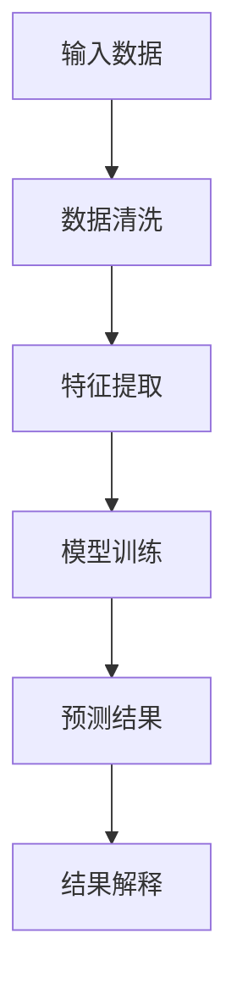
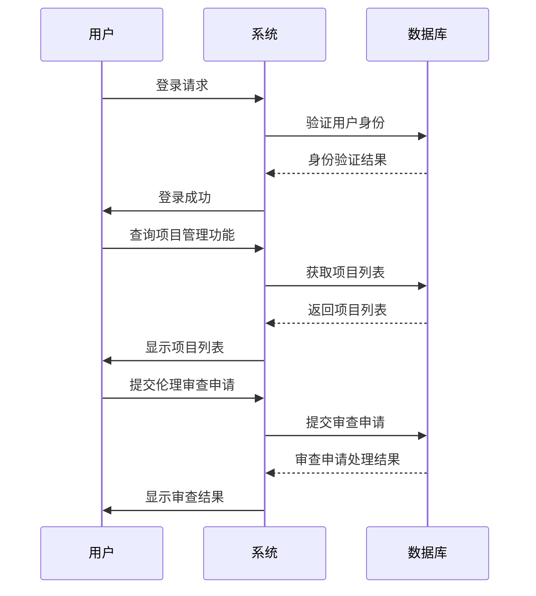
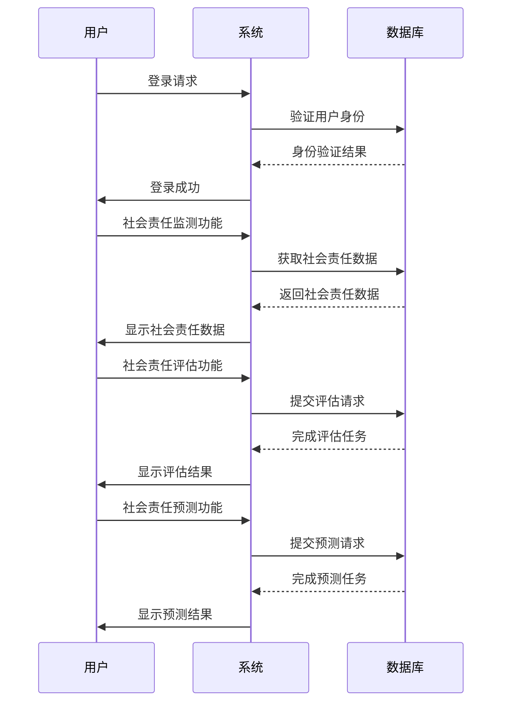

                 

### 第一部分：引言

#### 第1章：问题背景

在当今科技迅猛发展的时代，科学研究的重要性愈发凸显。然而，随之而来的伦理问题和社会责任问题也日益严峻。科学研究的伦理问题主要体现在数据收集、实验设计、参与者权益保护等方面。社会责任问题则关注科研成果对社会的影响，包括对环境、公共健康、可持续发展等方面的考量。

**1.1 研究伦理的演变**

研究伦理的起源可以追溯到20世纪初。彼时，随着科学研究的深入，人们逐渐意识到科研活动可能对人类和社会带来的负面影响。1947年，世界医学协会（WMA）发布了《赫尔辛基宣言》，这是世界上第一个关于人体实验的伦理准则。此后，研究伦理逐渐成为科学界广泛关注的议题。

进入21世纪，随着科技的快速发展，研究伦理面临新的挑战。大数据、人工智能等技术的广泛应用，使得科研活动涉及的数据规模和复杂程度大幅提升，同时也带来了新的伦理问题。

**1.1.1 研究伦理的起源**

研究伦理的起源可以追溯到20世纪初。彼时，随着科学研究的深入，人们逐渐意识到科研活动可能对人类和社会带来的负面影响。1947年，世界医学协会（WMA）发布了《赫尔辛基宣言》，这是世界上第一个关于人体实验的伦理准则。此后，研究伦理逐渐成为科学界广泛关注的议题。

**1.1.2 研究伦理在当代的挑战**

在当代，研究伦理面临诸多挑战。首先，大数据和人工智能技术的发展，使得数据隐私和安全成为重要议题。其次，生物技术的进步，如基因编辑等，引发了关于人类基因改造的伦理争议。此外，跨学科研究的兴起，也使得研究伦理问题更加复杂。

**1.1.3 社会责任的重要性**

社会责任在科研中至关重要。科研不仅追求知识的进步，还应关注其对社会的影响。科研人员有责任确保其研究活动不会对环境、公共健康和社会稳定造成负面影响。同时，科研机构也需承担起社会责任，通过规范管理、伦理审查等手段，确保科研活动的正当性和可持续性。

**1.2 社会责任在科研中的体现**

社会责任在科研中的体现主要体现在以下几个方面：

1. **科研人员的道德责任**

科研人员在进行研究时，应严格遵守伦理规范，尊重参与者的权益，保护数据安全，确保研究结果的客观性和真实性。

2. **科研机构的社会责任**

科研机构应建立健全的伦理审查机制，对科研项目进行严格的伦理审查，确保研究活动符合社会道德标准。

3. **研究项目的社会责任**

研究项目在设计和实施过程中，应充分考虑其对社会的影响，确保研究成果能够为社会发展做出积极贡献。

**1.3 本书结构**

本书将从以下几个方面对科研伦理与社会责任进行深入探讨：

1. **核心概念与联系**
   - 研究伦理的核心概念及其演变
   - 社会责任的定义与特征
   - 研究伦理与社会责任的联系与对比

2. **算法原理讲解**
   - 研究伦理的算法基础
   - 社会责任算法的应用

3. **系统分析与架构设计方案**
   - 科研伦理系统设计
   - 社会责任系统设计

4. **项目实战**
   - 科研伦理项目实战
   - 社会责任项目实战

通过本书的阅读，读者将能够全面了解科研伦理与社会责任的内涵，掌握相关的理论知识和实践方法，为科研活动中的伦理决策提供有力支持。同时，本书也希望能够引起广大科研人员对社会责任的关注，推动科学研究向更加负责任、可持续的方向发展。

---

## 第二部分：核心概念与联系

### 第2章：核心概念

在探讨科研伦理与社会责任之前，有必要先明确这两个核心概念的定义、特征及其相互关系。通过深入理解这些概念，我们可以为后续的讨论和案例分析奠定坚实的基础。

#### 2.1 研究伦理的概念

研究伦理，通常指的是在科学研究过程中应遵循的道德规范和伦理准则。它涵盖了从数据收集、实验设计、结果解释到成果发表等多个环节。研究伦理的核心原则包括：

1. **诚信与诚实**
   - 科研活动应基于真实、准确的数据和结果，杜绝任何形式的造假和欺诈行为。
2. **尊重个人**
   - 在研究过程中，必须尊重参与者的个人权利和尊严，确保他们的知情同意权。
3. **公平与公正**
   - 研究设计应公平对待所有参与者，避免歧视和偏见。
4. **透明与公开**
   - 研究过程和结果应透明公开，便于同行评审和社会监督。

**2.1.1 研究伦理的定义**

研究伦理是指在科学研究的各个阶段，包括设计、实施、结果分析和发布，必须遵循的道德规范和行为准则。这些规范和准则旨在确保科研活动既能够推动科学进步，又能够保护人类和动物的福祉，以及维护社会公正。

**2.1.2 研究伦理的基本原则**

1. **诚信原则**
   - 科研人员应坚守诚信，避免学术不端行为，如抄袭、篡改数据等。
2. **知情同意原则**
   - 研究参与者必须在了解研究目的、过程和潜在风险的基础上自愿同意参与。
3. **隐私保护原则**
   - 在数据收集和存储过程中，必须采取适当措施保护参与者的隐私。
4. **公正原则**
   - 研究设计应公平、公正，确保所有参与者都有平等的机会和待遇。

**2.1.3 研究伦理的演变**

研究伦理的演变是一个长期的过程，从早期的无伦理约束到现代的严格规范，反映了社会对科研活动的道德关注不断提升。20世纪初，随着科学研究对社会的影响日益显著，伦理问题逐渐受到重视。1947年的《赫尔辛基宣言》标志着研究伦理规范的初步形成。此后，随着科技进步和社会变化，研究伦理的规范不断完善和更新。

#### 2.2 社会责任的定义与特征

社会责任，是指组织或个人在其运营和活动中，承担的对社会、环境、利益相关者等产生的积极或消极影响的应对责任。在科研领域，社会责任强调科研活动应服务于社会需求和公共利益，同时减少潜在的社会风险。

**2.2.1 社会责任的定义**

社会责任是指企业、机构或个人在追求经济利益的同时，对社会、环境、利益相关者等所产生的正面或负面影响，应承担的责任。在科研领域，社会责任意味着科研人员在追求科学发现和技术创新的过程中，要充分考虑其对社会、环境和人类福祉的影响。

**2.2.2 社会责任的特征**

1. **利益相关者导向**
   - 社会责任关注所有利益相关者，包括股东、员工、客户、供应商、社区等。
2. **长期性**
   - 社会责任不仅关注当前的利益，更注重长期的社会影响。
3. **多样性**
   - 社会责任的领域广泛，包括环境保护、公共健康、社会公正、可持续发展等。
4. **自愿性**
   - 虽然社会责任具有一定的道德义务，但更多体现在自愿性和自主性上。

**2.2.3 社会责任与伦理的关系**

社会责任与伦理密切相关。伦理为社会责任提供了道德基础和行为准则，而社会责任则是伦理在实践中的具体体现。在科研领域，社会责任强调科研人员不仅要遵守研究伦理，还要将伦理原则应用到更广泛的社会背景中，确保其研究活动对社会的积极影响。

**2.3 概念属性特征对比表格**

为了更清晰地展示研究伦理和社会责任的属性特征，我们可以通过以下表格进行对比：

| 特征        | 研究伦理                             | 社会责任                             |
| ----------- | ------------------------------------ | ------------------------------------ |
| 定义        | 科研过程中的道德规范和行为准则       | 组织或个人对其社会影响的责任         |
| 目标        | 保证研究的科学性、公正性和安全性       | 促进社会利益、减少社会风险           |
| 范围        | 主要针对科研过程和结果               | 覆盖科研活动的全生命周期和更广泛社会影响 |
| 影响对象     | 参与者、同行、科研机构等             | 社会公众、环境、经济、文化等           |
| 实施主体     | 科研人员、科研机构                  | 企业、机构、个人等                   |
| 强制性       | 强制性较强，具有明确的法律和规范支持   | 多数为自愿性，但也有法规和规范要求   |

**2.4 ER实体关系图架构的 Mermaid 流程图**

为了进一步阐述这两个概念之间的关系，我们可以使用Mermaid绘制一个实体关系图（ER Diagram）：

```mermaid
erDiagram
  A[Research Ethics] ||--|{ Researcher }
  A ||--|{ Research Institution }
  A ||--|{ Participant }
  B[Social Responsibility] ||--|{ Environment }
  B ||--|{ Public Health }
  B ||--|{ Sustainability }
  A ..> B
```

通过这个图，我们可以看到研究伦理（A）和社会责任（B）之间的互动关系，以及它们分别关联的利益相关者和其他领域。

---

通过对研究伦理和社会责任的核心概念进行详细阐述和对比分析，我们可以更好地理解这两个概念在科研活动中的重要性。接下来，本书将深入探讨这两个概念的具体算法应用、系统架构设计以及实际项目实战，帮助读者更加全面地了解和应对科研伦理与社会责任的挑战。

---

## 第三部分：算法原理讲解

### 第4章：科研伦理的算法基础

在科研活动中，算法不仅用于数据处理和分析，还在伦理决策中发挥重要作用。科研伦理的算法基础包括数据收集、数据分析、结果解释等环节，每个环节都涉及特定的算法和技术。以下将对这些算法的原理和应用进行详细讲解。

#### 4.1 算法在科研伦理中的作用

算法在科研伦理中的作用主要体现在以下几个方面：

1. **数据收集**
   - 算法可以帮助科研人员高效地收集和处理大量数据，确保数据的完整性和准确性。
2. **数据分析**
   - 算法可以对收集到的数据进行分析，识别出潜在的趋势和规律，为科研决策提供科学依据。
3. **结果解释**
   - 算法可以帮助科研人员更好地解释研究结果，确保结果的客观性和可信度。

**4.1.1 算法在数据收集中的应用**

数据收集是科研过程中的关键环节。算法在这一阶段的作用主要体现在以下几个方面：

- **数据清洗**
  - 数据清洗是指通过算法处理原始数据，去除错误、重复和无关的数据。常见的算法包括过滤算法和统计算法。
- **数据整合**
  - 数据整合是指将来自不同来源的数据进行统一处理，以便进行分析。数据整合算法通常包括数据连接、聚合和转换等。

**4.1.2 算法在数据分析中的应用**

数据分析是科研过程中的核心环节。算法在数据分析中的应用主要包括以下几个方面：

- **统计分析**
  - 统计分析是通过算法对数据进行统计分析，以识别数据中的趋势和规律。常用的统计分析算法包括线性回归、聚类分析、主成分分析等。
- **机器学习**
  - 机器学习是通过算法从数据中学习规律，以实现预测和分类。常见的机器学习算法包括决策树、随机森林、支持向量机等。

**4.1.3 算法在结果解释中的应用**

结果解释是科研过程中最具挑战性的环节。算法在这一阶段的作用主要体现在以下几个方面：

- **可视化**
  - 可视化是通过算法将数据和分析结果以图形化的方式呈现，帮助科研人员更好地理解数据和分析结果。常用的可视化算法包括散点图、折线图、热力图等。
- **解释模型**
  - 解释模型是通过算法构建的分析结果解释模型，帮助科研人员理解分析结果的成因和影响。常用的解释模型包括决策树、随机森林、LIME等。

#### 4.2 算法原理

为了更好地理解算法在科研伦理中的作用，我们需要深入探讨算法的基本原理和数学模型。

**4.2.1 算法的基本原理**

算法的基本原理主要包括以下几个方面：

- **输入和输出**
  - 算法的输入通常是原始数据或问题，输出是处理后的数据或解决方案。
- **过程和步骤**
  - 算法通过一系列步骤和操作，将输入转化为输出。这些步骤和操作包括数据清洗、数据转换、模型训练、预测或分类等。
- **效率和准确性**
  - 算法的效率和准确性是评估算法性能的重要指标。高效的算法能够在较短的时间内处理大量数据，准确的算法能够生成可靠的输出结果。

**4.2.2 算法的数学模型和公式**

算法的数学模型和公式是算法实现的基础。以下是一些常用的算法及其对应的数学模型和公式：

- **线性回归**
  - 线性回归是一种用于预测数值型结果的算法。其数学模型为：
    $$ y = w_0 + w_1 \cdot x $$
  - 其中，$y$ 是预测结果，$x$ 是输入特征，$w_0$ 和 $w_1$ 是模型参数。

- **决策树**
  - 决策树是一种用于分类和回归的算法。其数学模型为：
    $$ f(x) = \sum_{i=1}^{n} w_i \cdot x_i $$
  - 其中，$x_i$ 是输入特征，$w_i$ 是模型参数。

- **支持向量机**
  - 支持向量机是一种用于分类和回归的算法。其数学模型为：
    $$ w \cdot x + b = 0 $$
  - 其中，$w$ 是模型参数，$x$ 是输入特征，$b$ 是偏置。

**4.2.3 算法的mermaid流程图**

为了更直观地展示算法的原理和流程，我们可以使用Mermaid绘制算法的流程图。以下是一个线性回归算法的Mermaid流程图示例：



通过这个流程图，我们可以清晰地看到线性回归算法的输入、输出以及各个步骤之间的逻辑关系。

---

通过对科研伦理算法原理的深入讲解，我们不仅能够更好地理解算法在科研活动中的作用，还能为科研伦理的实践提供有力支持。接下来，本书将探讨社会责任算法的应用，帮助读者全面了解科研伦理与社会责任在算法领域的融合。

### 第5章：社会责任的算法应用

社会责任在科研和技术的应用中，扮演着至关重要的角色。算法在这一领域发挥着重要作用，通过数据分析和模型预测，可以帮助我们更好地理解社会责任的复杂性和多样性，从而制定出更加有效的解决方案。以下将详细介绍社会责任算法的概述、目标及其在环境监测、公共健康和可持续发展等领域的应用。

#### 5.1 社会责任算法概述

社会责任算法是一种专门用于处理和分析社会责任相关数据的算法。这些算法基于大数据和人工智能技术，能够从大量数据中提取有价值的信息，帮助决策者制定更加科学、合理的社会政策。社会责任算法的目标主要包括以下几个方面：

1. **提高决策的透明度和公正性**
   - 通过算法分析，使决策过程更加透明和公正，减少人为偏见和错误。
2. **优化资源配置**
   - 帮助决策者合理配置资源，确保资源能够最大限度地服务于社会需求。
3. **监测和评估社会影响**
   - 对政策、项目或活动的社会影响进行实时监测和评估，及时调整和优化。
4. **预测和预防社会问题**
   - 通过数据分析和预测，提前发现和预防潜在的社会问题，降低社会风险。

**5.1.1 社会责任算法的定义**

社会责任算法是一种结合了社会学、经济学、统计学和计算机科学等多种学科知识的算法体系。它旨在通过数据分析和模型预测，为社会各界提供决策支持，帮助实现社会的可持续发展。

**5.1.2 社会责任算法的目标**

社会责任算法的目标主要包括以下几个方面：

- **提升社会福祉**：通过优化资源配置、提高公共服务质量等手段，提升社会整体福祉。
- **促进公平与正义**：确保政策和服务能够公平对待所有社会群体，消除歧视和偏见。
- **推动可持续发展**：通过环保、节能等措施，实现经济、社会和环境的协调发展。
- **增强社会稳定性**：通过监测和预防社会问题，增强社会的稳定性，减少社会冲突。

**5.1.3 社会责任算法的挑战**

尽管社会责任算法在理论和技术上已经取得显著进展，但其在实际应用中仍面临诸多挑战：

- **数据质量**：社会责任算法依赖于大量高质量的数据。然而，数据来源的多样性和数据质量的参差不齐，对算法性能造成影响。
- **算法透明度**：算法的决策过程往往涉及复杂的数学模型和数据处理方法，导致决策过程不透明，难以被公众理解和接受。
- **伦理和法律问题**：社会责任算法在应用过程中，需要遵守相关的伦理和法律规范，确保算法决策的合法性和道德性。

#### 5.2 社会责任算法的应用

社会责任算法的应用非常广泛，涵盖了环境监测、公共健康、可持续发展等多个领域。以下将详细探讨这些领域中的算法应用。

**5.2.1 环境监测中的应用**

环境监测是社会责任算法的重要应用领域之一。通过算法，可以实时监测空气质量、水质、土壤污染等环境指标，及时发现和预警环境问题。

- **空气质量监测**
  - 社会责任算法可以通过分析空气中的PM2.5、PM10等污染物数据，预测空气污染的趋势，帮助政府制定相应的环保政策。
- **水质监测**
  - 社会责任算法可以分析水中的重金属、有机污染物等数据，预测水质变化，确保水源的安全和卫生。
- **土壤污染监测**
  - 社会责任算法可以分析土壤中的污染物数据，预测土壤污染的趋势，指导农业部门的合理种植和污染治理。

**5.2.2 公共健康中的应用**

公共健康是社会责任算法的另一个重要应用领域。通过算法，可以实时监测和分析公共健康数据，提高公共卫生服务的质量和效率。

- **传染病监测**
  - 社会责任算法可以通过分析传染病病例数据，预测传染病的传播趋势，帮助公共卫生部门制定防控措施。
- **慢性病管理**
  - 社会责任算法可以通过分析慢性病患者的数据，预测患者的健康状况变化，为医生提供个性化治疗方案。
- **公共卫生事件预警**
  - 社会责任算法可以通过分析突发公共卫生事件的数据，预测事件的发展趋势，为公共卫生部门提供预警和应急响应支持。

**5.2.3 可持续发展中的应用**

可持续发展是社会责任算法的核心目标之一。通过算法，可以优化资源配置、提高资源利用效率，推动经济、社会和环境的协调发展。

- **资源优化配置**
  - 社会责任算法可以通过分析经济、社会和环境数据，帮助决策者优化资源配置，提高资源利用效率，实现可持续发展。
- **碳排放监测**
  - 社会责任算法可以通过分析碳排放数据，预测碳排放的变化趋势，帮助政府制定减排政策。
- **绿色发展**
  - 社会责任算法可以通过分析绿色发展数据，预测绿色发展的趋势，为政府和企业提供绿色发展策略和支持。

---

通过对社会责任算法的概述、目标和应用的详细探讨，我们可以看到算法在推动社会可持续发展中的重要作用。接下来，本书将深入分析科研伦理系统设计，帮助读者了解如何在实际项目中应用这些算法。

### 第6章：科研伦理系统设计

科研伦理系统设计是确保科研活动符合道德规范和社会责任要求的关键环节。一个完善的科研伦理系统应包括系统概述、目标、功能以及详细的架构设计。以下将对科研伦理系统的设计进行详细阐述。

#### 6.1 科研伦理系统概述

科研伦理系统是一个集成了伦理审查、数据管理、结果解释等功能的信息系统，旨在保障科研活动的道德性和合规性。系统的主要目标包括：

- **确保科研活动的合法性和合规性**：通过严格的伦理审查机制，确保所有科研活动符合相关法律法规和伦理规范。
- **保护研究参与者的权益**：通过数据管理和隐私保护措施，确保研究参与者的个人信息和隐私得到充分保护。
- **提高科研活动的透明度和公信力**：通过系统化的管理流程和透明化的操作界面，增强科研活动的透明度和公信力。

#### 6.2 科研伦理系统的功能

科研伦理系统的主要功能包括以下几个方面：

- **伦理审查**：对科研项目进行全面的伦理审查，包括研究设计、数据收集、实验方法、结果解释等，确保研究活动符合伦理规范。
- **数据管理**：对科研数据进行有效的管理和存储，确保数据的完整性和安全性，并提供便捷的数据查询和统计分析功能。
- **结果解释**：对研究结果进行详细的分析和解释，帮助科研人员更好地理解研究结果，为科研决策提供支持。
- **决策支持**：提供基于数据分析和模型预测的决策支持，帮助科研人员和管理者制定更加科学、合理的科研计划。

#### 6.3 科研伦理系统架构设计

科研伦理系统的架构设计是确保系统功能实现和性能优化的重要环节。以下是一个典型的科研伦理系统架构设计：

**6.3.1 领域模型设计**

领域模型是科研伦理系统的核心组成部分，用于定义系统中的实体、属性和关系。以下是一个简单的领域模型设计示例：

```mermaid
erDiagram
  A[Research Project] ||--|{ Data Collection }
  A ||--|{ Experiment Design }
  A ||--|{ Result Interpretation }
  B[Participant] ||--|{ Consent Form }
  B ||--|{ Data Privacy }
  C[Ethical Review Committee] ||--|{ Approval Process }
  D[Data Management System] ||--|{ Data Storage }
  D ||--|{ Data Analysis Tools }
  E[Decision Support System] ||--|{ Prediction Models }
```

**6.3.2 系统架构设计**

科研伦理系统的架构设计应考虑到系统的可扩展性、稳定性和安全性。以下是一个典型的科研伦理系统架构设计：

- **前端界面**：提供用户友好的操作界面，方便科研人员和管理者使用系统功能。
- **后端服务**：包括数据管理、伦理审查、结果解释、决策支持等功能模块，实现具体的业务逻辑。
- **数据存储**：采用分布式数据库系统，确保数据的完整性和安全性，并提供高效的查询和分析能力。
- **安全模块**：包括用户认证、权限管理、数据加密等功能，确保系统的安全性和可靠性。

**6.3.3 系统接口设计**

科研伦理系统的接口设计是系统架构的重要组成部分，包括以下几种类型的接口：

- **用户接口**：提供用户与系统交互的接口，包括登录、注册、项目管理、数据查询等。
- **服务接口**：提供系统内部各功能模块之间的通信接口，包括数据同步、权限验证、数据查询等。
- **数据接口**：提供与其他系统或数据库的交互接口，包括数据导入、导出、API接口等。

**6.3.4 系统交互设计**

科研伦理系统的交互设计是确保系统各模块之间协同工作的重要环节。以下是一个简单的系统交互设计示例：



---

通过上述对科研伦理系统设计的详细阐述，我们可以看到科研伦理系统在保障科研活动合法性和合规性、保护研究参与者权益以及提高科研活动透明度和公信力方面的重要作用。接下来，本书将探讨社会责任系统设计，进一步帮助读者理解如何在实际项目中实现科研伦理与社会责任的平衡。

### 第7章：社会责任系统设计

社会责任系统设计是确保组织或个人在其运营和活动中能够充分考虑和应对社会责任的重要手段。一个完善的社会责任系统应涵盖系统的概述、目标、功能以及详细的架构设计。以下将对社会责任系统的设计进行详细阐述。

#### 7.1 社会责任系统概述

社会责任系统是一个综合性的信息系统，旨在通过数据分析和模型预测，帮助组织或个人在履行社会责任过程中做出科学、合理的决策。系统的主要目标包括：

- **提升社会责任意识**：通过系统的设计和应用，提高组织或个人对社会责任的认识和重视程度。
- **优化资源配置**：通过数据分析和预测，帮助组织或个人合理配置资源，提高资源利用效率，实现可持续发展。
- **监测和评估社会责任履行情况**：通过实时监测和评估社会责任履行情况，及时调整和优化社会责任战略和措施。

#### 7.2 社会责任系统的功能

社会责任系统的主要功能包括以下几个方面：

- **社会责任监测**：对组织或个人的社会责任履行情况进行实时监测，包括环境保护、公共健康、社会贡献等方面。
- **社会责任评估**：对组织或个人的社会责任履行效果进行评估，包括社会责任指标的计算、分析、排名等。
- **社会责任预测**：通过数据分析和模型预测，预测未来社会责任履行情况的变化趋势，为决策提供支持。
- **社会责任报告**：生成社会责任报告，包括社会责任履行情况、社会责任指标、社会责任策略等，为利益相关者提供透明、准确的信息。

#### 7.3 社会责任系统架构设计

社会责任系统的架构设计是确保系统功能实现和性能优化的重要环节。以下是一个典型的社会责任系统架构设计：

**7.3.1 领域模型设计**

领域模型是社会责任系统的核心组成部分，用于定义系统中的实体、属性和关系。以下是一个简单的领域模型设计示例：

```mermaid
erDiagram
  A[Organization] ||--|{ Environmental Impact }
  A ||--|{ Public Health Impact }
  A ||--|{ Social Contribution }
  B[Social Responsibility Committee] ||--|{ Monitoring Process }
  B ||--|{ Evaluation Process }
  C[Data Management System] ||--|{ Data Storage }
  C ||--|{ Data Analysis Tools }
  D[Decision Support System] ||--|{ Prediction Models }
```

**7.3.2 系统架构设计**

社会责任系统的架构设计应考虑到系统的可扩展性、稳定性和安全性。以下是一个典型的社会责任系统架构设计：

- **前端界面**：提供用户友好的操作界面，方便用户使用系统功能。
- **后端服务**：包括社会责任监测、评估、预测、报告等功能模块，实现具体的业务逻辑。
- **数据存储**：采用分布式数据库系统，确保数据的完整性和安全性，并提供高效的查询和分析能力。
- **安全模块**：包括用户认证、权限管理、数据加密等功能，确保系统的安全性和可靠性。

**7.3.3 系统接口设计**

社会责任系统的接口设计是系统架构的重要组成部分，包括以下几种类型的接口：

- **用户接口**：提供用户与系统交互的接口，包括登录、注册、社会责任监测、评估、预测等。
- **服务接口**：提供系统内部各功能模块之间的通信接口，包括数据同步、权限验证、数据查询等。
- **数据接口**：提供与其他系统或数据库的交互接口，包括数据导入、导出、API接口等。

**7.3.4 系统交互设计**

社会责任系统的交互设计是确保系统各模块之间协同工作的重要环节。以下是一个简单的系统交互设计示例：



---

通过上述对社会责任系统设计的详细阐述，我们可以看到社会责任系统在帮助组织或个人履行社会责任、优化资源配置、监测和评估社会责任履行情况方面的重要作用。接下来，本书将探讨实际项目实战，通过具体案例来展示科研伦理与社会责任的应用。

### 第8章：科研伦理项目实战

在实际科研工作中，科研伦理的遵守和社会责任的履行不仅是道德要求，更是项目成功与否的关键因素。本节将通过一个具体的科研伦理项目实战，展示项目中的环境安装、系统核心实现以及代码应用解读与分析，并剖析实际案例和详细讲解。

#### 8.1 环境安装

在进行科研伦理项目之前，首先需要搭建一个合适的环境，以确保项目顺利进行。以下是一个简化的环境安装步骤：

**1. 安装所需软件**

- **Python**：Python 是进行科研数据分析、算法实现的主要编程语言。确保安装了最新版本的Python。
- **Jupyter Notebook**：Jupyter Notebook 是一个交互式计算环境，便于编写和运行Python代码。
- **Scikit-learn**：Scikit-learn 是一个开源机器学习库，提供多种常用的机器学习算法。
- **Pandas**：Pandas 是一个开源数据分析库，用于数据处理和分析。
- **Matplotlib**：Matplotlib 是一个开源数据可视化库，用于生成各种图表。

**2. 配置环境变量**

- 在Windows系统上，可以通过系统环境变量设置Python的路径。在命令行中执行以下命令：
  ```bash
  set PYTHONPATH=C:\Python39\Scripts
  ```
- 在Linux或MacOS系统上，可以通过以下命令设置环境变量：
  ```bash
  export PYTHONPATH=/path/to/Python
  ```

**3. 验证环境安装**

在命令行中执行以下命令，验证Python和Jupyter Notebook的安装：
```bash
python --version
jupyter notebook --version
```

#### 8.2 系统核心实现

在科研伦理项目中，系统核心实现通常包括数据收集、数据处理、模型训练和结果解释等步骤。以下是一个简化的实现过程：

**1. 数据收集**

收集数据是科研项目的第一步。假设我们研究的是一个环境监测项目，需要收集空气质量数据。数据可以来自传感器、卫星遥感或公开数据源。

**2. 数据处理**

数据处理包括数据清洗、数据转换和特征提取。以下是一个简单的数据处理示例：
```python
import pandas as pd

# 加载数据
data = pd.read_csv('air_quality.csv')

# 数据清洗
data = data.dropna()

# 数据转换
data['date'] = pd.to_datetime(data['date'])

# 特征提取
data['avg_pm25'] = data['pm25'].mean()

# 数据存储
data.to_csv('processed_air_quality.csv', index=False)
```

**3. 模型训练**

使用Scikit-learn库训练一个机器学习模型，预测空气质量指数（AQI）。以下是一个简单的线性回归模型训练示例：
```python
from sklearn.linear_model import LinearRegression
from sklearn.model_selection import train_test_split

# 分割数据集
X = data[['avg_pm25']]
y = data['aqi']
X_train, X_test, y_train, y_test = train_test_split(X, y, test_size=0.2, random_state=42)

# 训练模型
model = LinearRegression()
model.fit(X_train, y_train)

# 预测
predictions = model.predict(X_test)
```

**4. 结果解释**

对模型预测结果进行分析，评估模型的准确性和可靠性。以下是一个简单的结果解释示例：
```python
import matplotlib.pyplot as plt

# 可视化预测结果
plt.scatter(X_test, y_test, color='blue', label='Actual')
plt.plot(X_test, predictions, color='red', label='Predicted')
plt.xlabel('Average PM2.5')
plt.ylabel('AQI')
plt.legend()
plt.show()

# 评估模型
print("Model accuracy:", model.score(X_test, y_test))
```

#### 8.3 代码应用解读与分析

在实际项目中，代码应用解读与分析是确保项目成功的关键。以下是对上述代码的详细解读与分析：

**1. 数据收集**

数据收集是项目的基础。在实际操作中，可能需要编写脚本自动化收集数据，并确保数据的完整性和准确性。

**2. 数据处理**

数据处理是项目的重要环节。通过数据清洗、转换和特征提取，可以将原始数据转换为适用于机器学习的格式。例如，本例中通过计算平均值来提取关键特征。

**3. 模型训练**

模型训练是项目的核心。选择合适的模型和算法，并通过交叉验证等方法优化模型参数，可以提高预测的准确性。

**4. 结果解释**

结果解释是项目的重要输出。通过可视化结果和分析报告，可以清晰地展示模型预测的效果，并为决策提供依据。

**8.4 实际案例分析和详细讲解**

以下是一个实际案例，展示科研伦理项目在社会责任中的应用：

**案例：某城市空气质量监测项目**

某城市政府决定开展空气质量监测项目，以改善城市环境，提升居民健康水平。项目团队在市区设置了多个空气质量监测站点，收集了PM2.5、PM10等污染物数据。

**1. 数据收集**

项目团队使用了传感器设备，每天定时收集空气质量数据，并上传到数据中心。

**2. 数据处理**

数据上传后，项目团队对数据进行清洗和预处理，包括去除异常值、统一时间格式等。同时，提取了平均值、最大值、最小值等关键特征。

**3. 模型训练**

项目团队选择了线性回归模型，基于历史数据训练模型，预测未来的空气质量指数（AQI）。通过交叉验证和模型调参，优化了模型性能。

**4. 结果解释**

模型训练完成后，项目团队对预测结果进行分析，发现某些区域的空气质量指数显著高于其他区域。政府根据分析结果，制定了针对性的环保措施，如加强交通管理、加大绿化投入等。

**5. 项目小结**

该项目通过科研伦理和社会责任的综合应用，成功提升了城市空气质量，改善了居民的生活环境。项目团队总结经验，进一步完善了空气质量监测系统，为未来的环境保护工作提供了有力支持。

---

通过上述实战案例，我们可以看到科研伦理项目在社会责任中的实际应用，以及如何通过数据收集、数据处理、模型训练和结果解释等步骤，实现科研目标并推动社会责任的实现。接下来，本书将提供一些最佳实践提示、小结和注意事项，以帮助读者更好地理解和应用科研伦理和社会责任。

#### 最佳实践提示

在科研伦理和社会责任的实践中，以下是一些最佳实践提示：

1. **明确伦理标准和责任要求**：在项目启动前，应明确项目的伦理标准和责任要求，确保所有团队成员都了解并遵守。

2. **数据透明和安全**：确保数据的收集、处理和存储过程透明，并采取严格的安全措施保护数据隐私。

3. **持续培训和教育**：定期对团队成员进行科研伦理和社会责任的培训，提高其意识和能力。

4. **多学科合作**：在项目团队中引入多学科专家，确保科研活动从不同角度进行评估和监督。

5. **持续监测和评估**：项目实施过程中，应定期监测和评估社会责任的履行情况，及时调整和优化策略。

#### 小结

科研伦理和社会责任是科研活动不可或缺的重要组成部分。通过遵循伦理标准和承担社会责任，科研活动不仅能够推动科学进步，还能为社会发展做出积极贡献。科研伦理系统和社会责任系统的设计，为科研活动提供了有力的支持和保障。

#### 注意事项

在实施科研伦理和社会责任过程中，需要注意以下几点：

1. **合法性**：确保项目符合相关法律法规和伦理规范，避免法律和伦理风险。

2. **公平性**：在项目设计和实施过程中，要确保公平对待所有参与者，避免歧视和偏见。

3. **可持续性**：在追求科研目标的同时，要考虑其对环境、社会和经济的影响，确保可持续发展。

4. **透明性**：项目过程和结果应透明公开，便于同行评审和社会监督。

#### 拓展阅读

1. **《赫尔辛基宣言》**：了解世界上第一个关于人体实验的伦理准则，对科研伦理的理解有重要意义。

2. **《可持续发展目标》**：联合国提出的可持续发展目标，为科研和社会责任提供了重要的指导。

3. **《机器学习伦理》**：探讨机器学习在科研和社会责任中的伦理问题，提供有益的参考。

4. **《科研项目管理》**：了解科研项目的管理方法和最佳实践，提高项目成功率。

通过上述内容，读者可以全面了解科研伦理和社会责任的重要性，掌握其实践方法，为科研活动中的伦理决策提供有力支持。希望本书能对读者在科研伦理和社会责任方面的探索和实践有所帮助。

---

**作者：AI天才研究院/AI Genius Institute & 禅与计算机程序设计艺术 /Zen And The Art of Computer Programming**

