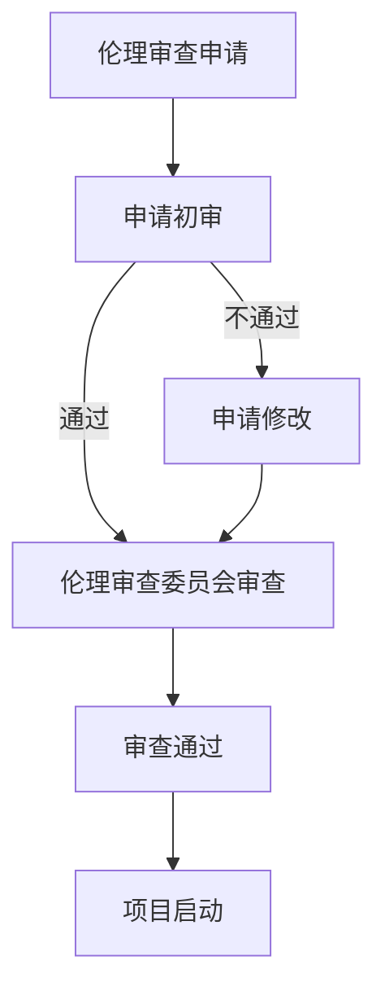

                 

### 引言

#### 科研伦理的重要性

在科学探索的道路上，科研伦理如同指南针，指引着科研人员遵循正确的道德准则，确保科研活动的公正性和科学性。随着科技的飞速发展，科研活动日益复杂，涉及伦理问题的范围也越来越广泛。从学术不端行为、数据隐私保护，到生物伦理、人工智能伦理，科研伦理已经成为科学研究不可忽视的重要组成部分。

**本书的目的和结构**

本书旨在构建一个全面的科研伦理新框架，为科研人员提供一套明确的道德指引，确保在探索世界真理的过程中，遵循伦理原则，维护科研的纯洁性和科学性。全书分为五个主要部分：

1. **科研伦理概述**：介绍科研伦理的基本概念、意义和当前面临的主要问题。
2. **科研伦理的理论基础**：阐述伦理学的基本概念和科研伦理的核心原则。
3. **新框架的构建**：详细描述新框架的提出背景、核心要素和实施策略。
4. **道德指引在实际科研中的应用**：探讨道德指引在科研选题、实验管理、论文发表等环节的具体应用。
5. **案例分析**：通过具体案例，分析科研伦理在实际科研中的实施和面临的争议。

通过以上五个部分，本书旨在为科研人员提供一个系统、全面的科研伦理指南，帮助他们更好地理解科研伦理的重要性，并在实际科研活动中践行伦理原则。

### 第1章：科研伦理概述

#### 1.1 问题背景与描述

科研伦理问题的出现并非偶然，而是科技进步、社会变迁和人类行为复杂化的必然结果。随着科学研究领域的不断扩展，科研活动涉及的伦理问题也日益多样和复杂。以下是几个典型的问题背景与描述：

**学术不端行为**：学术不端行为包括抄袭、伪造数据和篡改实验结果等。这种行为不仅损害了学术界的诚信，还浪费了大量的科研资源，导致科研成果的不可信。

**数据隐私保护**：在许多科研项目中，研究人员需要收集和处理大量的个人数据。如何保护这些数据不被滥用，确保个人隐私不受侵犯，成为科研伦理的一个重要问题。

**生物伦理**：随着基因编辑技术、克隆技术等生物技术的发展，科研人员在探索这些技术的同时，也面临如何平衡科技进步和伦理道德的挑战。

**人工智能伦理**：人工智能的快速发展带来了新的伦理问题，如算法偏见、隐私侵犯、道德责任等。如何确保人工智能系统在符合伦理规范的前提下运行，成为科研伦理研究的一个重要课题。

**环境伦理**：科研活动往往需要大量的资源和能源，对环境产生一定的影响。如何在追求科研进步的同时，减少对环境的破坏，是环境伦理研究的重要问题。

这些问题的普遍性和严重性，使得科研伦理在现代社会中具有重要的现实意义。科研伦理不仅关系到科学研究的质量和可信度，还关乎社会的公平、公正和可持续发展。

#### 1.1.1 科研伦理的意义

科研伦理在科学探索中的重要性不容忽视。首先，科研伦理是保障科学研究质量和可信度的基石。只有遵循伦理原则，科研人员才能确保其研究的公正性、客观性和可靠性，避免学术不端行为，维护科学研究的纯洁性。

其次，科研伦理有助于构建良好的科研环境，促进学术合作与交流。科研伦理原则强调公正、公平和诚信，有助于建立信任和合作关系，推动科学技术的共同进步。

第三，科研伦理对于保护参与者权益具有重要作用。在涉及人类和动物实验的科研项目中，科研伦理要求确保参与者的知情同意和隐私保护，减少实验风险，保障参与者的权益。

此外，科研伦理还关乎社会的公平与正义。在科研资源分配、科技政策制定等方面，遵循伦理原则有助于实现资源的公平利用，减少社会不公，促进社会的可持续发展。

总之，科研伦理是科学研究不可或缺的一部分，是科研人员职业道德和学术责任的重要体现。在科研活动中，遵循科研伦理原则不仅有助于提高科学研究的质量和可信度，还有助于构建一个公正、公平、诚信的科研环境，推动科学技术的可持续发展。

#### 1.1.2 当前科研伦理面临的问题

尽管科研伦理在科学探索中具有重要意义，但当前科研伦理仍然面临着诸多挑战和问题。以下是几个关键问题和其具体表现：

**学术不端行为**：学术不端行为包括抄袭、伪造数据和篡改实验结果等，这些行为严重损害了学术界的诚信和科研质量。近年来，学术不端行为的曝光率不断提高，但仍然难以完全杜绝。

**数据隐私保护**：随着大数据和人工智能技术的发展，科研活动中涉及的数据量越来越大，如何确保这些数据的隐私和安全成为一个重要问题。尽管一些科研机构和学者已经采取了措施来保护数据隐私，但现有的保护机制仍不够完善。

**生物伦理问题**：生物技术的发展，如基因编辑和克隆技术，带来了许多新的伦理挑战。例如，基因编辑技术可能引发基因歧视和伦理争议，克隆技术的伦理问题也备受关注。

**人工智能伦理**：人工智能技术的广泛应用引发了诸多伦理问题，如算法偏见、隐私侵犯和道德责任等。虽然一些公司和学者已经开始探讨如何确保人工智能系统的伦理合规性，但当前的研究和解决方案仍存在许多不足。

**环境伦理问题**：科研活动对环境的影响日益显著，如何平衡科研进步与环境保护成为环境伦理研究的重要课题。许多科研机构和项目在执行过程中，对环境的影响评估和风险管理仍不够充分。

这些问题的存在，不仅影响了科学研究的质量和可信度，还可能对科研人员的职业道德和公众信任产生负面影响。因此，解决这些科研伦理问题具有重要的现实意义和紧迫性。

### 1.2 伦理学基础

#### 1.2.1 伦理学的基本概念

伦理学（Ethics）是研究道德行为、道德原则和道德价值的学科。其基本概念包括道德（Morality）、道德规范（Moral Norms）、道德判断（Moral Judgments）等。道德是指人们关于对与错、善与恶的内在信念和行为准则，它指导人们在社会生活中如何行事。道德规范是伦理学中的具体规定，用于指导人们在不同情境下如何做出道德决策。道德判断则是人们根据道德规范对具体行为进行的评价和判断。

伦理学的主要研究领域包括道德哲学、应用伦理学、规范伦理学等。道德哲学探讨道德的本质、基础和原则，旨在理解道德的概念和理论。应用伦理学则将道德原则应用于具体领域，如医学伦理、环境伦理、科技伦理等，解决实际道德问题。规范伦理学研究道德规范的形成和实施，探讨如何制定和遵守道德规范。

#### 1.2.2 伦理学的研究方法

伦理学的研究方法多种多样，主要包括规范分析、案例研究、实证研究、伦理理论分析等。

**规范分析**：规范分析是伦理学研究中的一种基本方法，它通过分析道德规范、伦理原则和道德准则，探讨道德行为的合理性和正当性。规范分析可以帮助研究者理解道德规范的内涵和适用范围，为实际道德决策提供理论依据。

**案例研究**：案例研究是通过对具体道德案例的分析，探讨伦理问题的实际情况和处理方法。这种方法有助于研究者深入了解伦理问题的复杂性和多样性，发现和总结道德实践中的经验和教训。

**实证研究**：实证研究通过收集和分析实际数据，探讨道德行为和道德决策的影响因素和结果。这种方法可以帮助研究者验证伦理理论的假设，评估道德规范的实践效果。

**伦理理论分析**：伦理理论分析是伦理学研究的重要方法，通过分析不同伦理理论的优缺点，探讨道德原则和道德规范的理论基础。这种方法有助于研究者构建和评估不同的伦理理论体系，为道德决策提供理论支持。

综上所述，伦理学的研究方法多样且相互补充，通过规范分析、案例研究、实证研究和伦理理论分析等方法，研究者可以全面、深入地探讨伦理问题，为科学研究和实际应用提供伦理指导。

### 2.1 道德哲学与伦理学的关系

#### 2.1.1 道德哲学的历史与演变

道德哲学是伦理学的基础，其历史可以追溯到古希腊时期。在古希腊，哲学家如苏格拉底、柏拉图和亚里士多德开始探讨道德的本质和道德行为的原则。苏格拉底强调道德与知识的关系，认为道德行为是基于正确知识的；柏拉图则通过理想国理论探讨道德原则在社会中的作用；亚里士多德则提出中庸之道，强调道德行为需要在适当的时间和场合中找到平衡。

进入中世纪，道德哲学在基督教神学中占据重要地位。托马斯·阿奎那等神学家将道德哲学与宗教教义相结合，探讨道德行为的宗教意义。文艺复兴时期，道德哲学逐渐从宗教束缚中解放出来，回归到对人类自由意志和道德责任的探讨。

现代道德哲学的发展则主要体现在18世纪的启蒙运动和19世纪的伦理学变革。启蒙运动强调理性和个人自由，倡导通过理性思考来解决道德问题；19世纪的伦理学家，如康德、边沁和密尔等，提出了不同的伦理理论，如义务论、功利主义和自由主义，为现代道德哲学奠定了基础。

#### 2.1.2 伦理学的基本原则

伦理学的基本原则是道德哲学的核心内容，指导人们在面对道德困境时做出正确的决策。以下是几个主要的伦理学基本原则：

**公正原则**：公正原则强调在分配资源和评价行为时，应当公平对待每一个人。公正包括形式公正和实质公正，形式公正强调程序公平，而实质公正则关注结果的公平性。

**尊重原则**：尊重原则要求人们尊重他人的自主权和尊严。尊重原则体现在对他人隐私的保护、知情同意权的保障以及对他人的平等对待。

**义务原则**：义务原则强调个体有责任履行其道德义务，无论是否获得回报。义务原则源于康德的道德哲学，认为道德行为应当基于义务感，而非功利或情感驱动。

**后果原则**：后果原则认为道德评价应当基于行为的后果，而非行为本身。功利主义和效果论是后果原则的主要代表，它们强调行为的价值在于其产生的最大幸福或最佳结果。

**权利原则**：权利原则认为每个人都享有某些基本权利，如生命权、自由权和财产权。权利原则要求在道德决策时，应当优先考虑保护这些基本权利。

这些基本原则在不同伦理理论和实践中具有不同的应用和解释，但它们共同构成了道德哲学的核心框架，为道德决策提供了理论依据。

### 2.2 科研伦理的核心原则

科研伦理的核心原则是确保科研活动的公正性、科学性和可信性。以下是科研伦理的几个主要核心原则：

#### 2.2.1 真实性原则

真实性原则要求科研人员必须诚实、客观地报告研究结果。在科研过程中，任何伪造、篡改或隐瞒数据的行为都是不可接受的。真实性原则是科研伦理的基础，它保障了科研成果的可信度和科学性。

#### 2.2.2 客观性原则

客观性原则要求科研人员在进行研究设计、数据收集和分析过程中，应当保持客观、中立的态度。科研活动应当基于严谨的科学研究方法和科学证据，避免主观偏见和情感因素的干扰。

#### 2.2.3 公平性原则

公平性原则要求科研人员在研究设计和实施过程中，公平对待所有参与者。特别是在涉及人类和动物实验的研究中，应当确保参与者的知情同意和权益保护，避免因实验设计不当或操作不规范而造成的不公平对待。

#### 2.2.4 责任原则

责任原则要求科研人员对其研究成果负有道德责任，并对研究过程中可能产生的负面影响承担责任。科研人员应当认真对待其研究的潜在影响，采取适当措施减轻负面影响，并在必要时公开道歉和纠正错误。

#### 2.2.5 公开性原则

公开性原则要求科研人员应当公开发表其研究成果，促进科学知识的传播和共享。公开性不仅有助于提升科研成果的可信度，还有助于同行评审和科学验证，推动科学技术的进步。

通过遵守真实性、客观性、公平性、责任和公开性等核心原则，科研人员可以确保其研究的质量和可信度，为科学探索提供坚实的道德基础。

#### 2.3 科研伦理的理论体系

科研伦理的理论体系是建立在伦理学基础上的，它通过系统化的原则和规范，为科研活动提供道德指导。以下是科研伦理理论体系的主要构成部分：

**三大支柱**：科研伦理的理论体系主要建立在三大支柱之上，即公正性、责任感和透明度。

**公正性**：公正性是科研伦理的核心原则之一，强调科研过程中的公平对待和资源合理分配。公正性包括形式公正和实质公正，前者关注程序的公平，后者关注结果的公平。在科研活动中，公正性要求确保所有参与者有平等的机会和待遇，避免歧视和偏见。

**责任感**：责任感要求科研人员对其研究活动及其后果承担道德责任。责任感包括对研究过程的责任和对研究结果的负责。科研人员应当在研究设计、数据收集、分析以及结果报告等各个环节中，严格遵守科研规范和道德准则，确保研究的科学性和可信性。

**透明度**：透明度是科研伦理的重要原则，强调科研活动的公开性和可追溯性。科研人员应当公开其研究方法、数据和结果，接受同行的审查和验证，确保科研过程的透明和可重复性。透明度有助于提升科研成果的公信力，促进科学知识的共享和进步。

**道德原则**：科研伦理的理论体系还包括一系列具体的道德原则，如诚信、尊重、公正和责任。诚信要求科研人员保持诚实、真实和透明；尊重要求对研究参与者、同事和科学共同体的尊重；公正要求在科研活动中坚持公正性和公平性；责任要求科研人员对其研究活动承担道德责任。

**规范和指导方针**：科研伦理的理论体系还包括一系列规范和指导方针，如国际科研伦理准则、各国科研机构的伦理指南等。这些规范和指导方针为科研人员提供了具体的行动指南，帮助他们在科研活动中遵循道德原则，避免伦理风险。

通过构建和完善科研伦理的理论体系，可以为科研活动提供坚实的道德基础，促进科学技术的健康发展和社会的可持续发展。

### 2.3.1 科研伦理的三大支柱

科研伦理的三大支柱——公正性、责任感和透明度，是确保科研活动道德规范和实践的重要原则。这三个支柱不仅构成了科研伦理的基础，还指导科研人员在各个研究阶段做出符合伦理的决策。

**公正性**：公正性是科研伦理的首要原则，强调在科研过程中应公平对待所有参与者。具体体现在：

1. **资源分配**：科研资源，如资金、设备和人力，应公平分配，避免因资源不均导致的利益冲突和研究偏差。
2. **数据收集**：在数据收集和分析过程中，应确保数据的真实性和完整性，避免选择性报告或篡改数据。
3. **同行评审**：科研成果应接受同行的严格评审，确保研究质量，防止学术不端行为。

**责任感**：责任感要求科研人员对其研究及其影响承担道德责任。具体包括：

1. **研究设计**：在设计研究时，应考虑研究的可行性和潜在风险，确保研究方案的科学性和道德性。
2. **数据安全**：保护研究过程中收集的敏感数据，确保数据隐私和保密性，避免数据泄露。
3. **成果发布**：公开发表研究成果时，应确保数据的真实性和完整性，及时纠正发现的研究错误。

**透明度**：透明度强调科研活动的公开性和可追溯性，包括：

1. **方法公开**：公开研究方法、数据和分析过程，确保研究结果的可重复性和验证性。
2. **成果共享**：鼓励科研人员分享研究成果和知识，促进科学知识的传播和应用。
3. **责任追溯**：确保科研活动的责任可追溯，一旦出现伦理问题，可以及时进行调查和处理。

通过公正性、责任感和透明度这三个支柱，科研伦理体系能够有效地指导科研人员的道德行为，确保科研活动的诚信性和科学性。

#### 2.3.2 科研伦理的发展趋势

随着科技进步和社会变迁，科研伦理面临着不断演变的挑战和机遇。以下是科研伦理的几个主要发展趋势：

**技术创新带来的新伦理问题**：随着基因编辑、人工智能、大数据等新兴技术的出现，科研伦理面临着新的挑战。例如，基因编辑技术引发了关于基因修改的伦理争议，人工智能的算法偏见和数据隐私问题也引起了广泛关注。科研伦理需要不断更新和完善，以应对这些新兴技术的伦理挑战。

**全球科研合作与伦理协调**：全球化使得科研合作日益频繁，不同国家和地区在科研伦理标准和实践上存在差异。为了确保全球科研的伦理一致性，国际组织和科研机构需要加强合作与协调，制定统一的伦理规范和指南。

**科技伦理意识的普及与提升**：科研伦理的教育和宣传对于提升科研人员的伦理素养至关重要。未来，需要通过多种渠道和形式，加强对科研人员的伦理培训，提高他们的伦理意识和责任感。

**多元文化背景下的伦理考量**：随着全球化进程的加快，科研活动往往涉及多元文化背景。不同文化对伦理问题的认知和态度存在差异，科研伦理需要充分考虑这些文化差异，确保研究的公平性和包容性。

**政策法规的完善与实施**：科研伦理的发展离不开政策法规的支持。各国政府和科研机构需要不断完善科研伦理的法律法规，加强执法和监督，确保科研活动符合伦理要求。

通过技术创新、全球合作、伦理意识普及、多元文化考量以及政策法规完善，科研伦理将不断适应新时代的需求，为科学探索提供坚实的道德保障。

### 3.1 新框架的提出

#### 3.1.1 新框架的必要性

在当前的科研环境中，传统的科研伦理框架已难以满足日益复杂和多变的科研活动需求。首先，新兴技术的快速发展带来了新的伦理挑战，如基因编辑、人工智能和大数据等技术的广泛应用，使得科研活动涉及到的伦理问题更加复杂。其次，全球化背景下的科研合作增加了跨国界、跨文化伦理协调的难度。最后，科研资源的竞争加剧，导致科研活动中的不公正现象频发。这些问题凸显了现有科研伦理框架的不足，需要一个新的、更为全面和灵活的科研伦理框架。

新框架的提出旨在解决上述问题，确保科研活动的伦理合规性和科学性。新框架不仅关注新兴技术带来的伦理挑战，还强调全球合作和多元文化背景下的伦理考量。通过系统化的原则和规范，新框架为科研人员提供明确的道德指引，帮助他们更好地应对科研活动中的伦理困境。

#### 3.1.2 新框架的基本框架

新框架的基本框架包括以下几个核心组成部分：

**核心原则**：新框架的核心理念是公正性、责任感和透明度。公正性强调科研过程中的公平对待和资源合理分配；责任感要求科研人员对其研究及其影响承担道德责任；透明度强调科研活动的公开性和可追溯性。

**规范和指导方针**：新框架提供一系列具体规范和指导方针，涵盖科研设计、数据收集、分析、结果报告等各个环节。这些规范旨在确保科研活动的科学性和伦理合规性。

**实施策略**：新框架提出一系列实施策略，包括伦理审查、科研人员的伦理培训、伦理监督和责任追究等。通过这些策略，确保新框架的有效实施和持续改进。

**伦理委员会**：新框架设立专门的伦理委员会，负责科研项目的伦理审查和监督，确保科研活动符合伦理要求。

**国际合作机制**：新框架强调全球合作，建立国际合作机制，促进不同国家和地区在科研伦理规范和指南上的协调和统一。

通过这些核心组成部分，新框架为科研人员提供了一套全面、系统、灵活的科研伦理指导，帮助他们在科研活动中遵循道德准则，确保科研活动的公正性和科学性。

### 3.2 新框架的核心要素

新框架的核心要素是确保科研活动的伦理合规性和科学性，为科研人员提供明确的道德指引。以下是新框架的核心要素及其具体内容：

#### 3.2.1 伦理责任

**伦理责任**是科研人员在进行科研活动时必须承担的道德责任。它包括以下几个方面：

1. **个人责任**：科研人员应当对自己的研究活动及其结果负责，确保研究过程和结果的科学性和真实性。
2. **团队合作**：在科研团队中，每位成员都应承担起自身的伦理责任，相互监督和协作，确保整个团队的研究活动符合伦理要求。
3. **责任追究**：一旦出现伦理违规行为，科研人员应当承担相应的责任，包括公开道歉、纠正错误和接受惩罚。

#### 3.2.2 伦理审查

**伦理审查**是新框架中的重要组成部分，确保科研项目的伦理合规性。伦理审查包括以下几个关键环节：

1. **项目申请**：在科研项目开始前，研究者需提交伦理审查申请，详细说明研究目的、方法、预期风险和伦理考量。
2. **审查流程**：伦理委员会对申请进行审查，评估研究设计的伦理可行性和科学性，确保研究过程符合伦理要求。
3. **持续监督**：在研究过程中，伦理委员会应进行定期监督，确保研究活动持续符合伦理规范。

#### 3.2.3 伦理培训

**伦理培训**是提升科研人员伦理意识和素养的重要手段。伦理培训包括以下几个方面：

1. **基础知识**：为科研人员提供伦理学基础知识，包括伦理原则、道德规范和案例研究等。
2. **实际应用**：通过案例分析和工作坊等形式，帮助科研人员理解和掌握如何在科研活动中应用伦理原则。
3. **持续教育**：定期更新伦理培训内容，确保科研人员始终具备最新的伦理知识和技能。

通过伦理责任、伦理审查和伦理培训这三个核心要素，新框架为科研人员提供了一套系统、全面的伦理指引，确保科研活动在道德和科学上的双重保障。

### 3.3 新框架的实施与评估

新框架的实施与评估是确保科研伦理规范有效落实的关键步骤。以下是新框架实施与评估的几个关键环节：

#### 3.3.1 新框架的推广与实施

1. **政策支持**：政府和科研机构应出台相关政策，支持新框架的推广和实施。政策应明确科研伦理的重要性，并提供必要的资源和支持。
2. **培训与宣传**：通过组织伦理培训、研讨会和宣传活动，提高科研人员的伦理意识和素养，确保他们理解并遵守新框架的要求。
3. **激励机制**：建立激励机制，鼓励科研人员积极参与科研伦理活动，如设立伦理奖、表彰在伦理方面做出突出贡献的个人或团队。

#### 3.3.2 新框架的评估与改进

1. **定期评估**：定期对新框架的实施效果进行评估，包括伦理审查的通过率、科研人员的遵守情况以及伦理违规事件的减少等。
2. **反馈机制**：建立反馈机制，收集科研人员和伦理委员会的反馈意见，及时发现和解决新框架实施中的问题。
3. **持续改进**：根据评估结果和反馈意见，对新框架进行持续改进，确保其适应科研环境的变化和发展。

通过政策支持、培训与宣传、激励机制以及定期评估和持续改进，新框架的实施与评估可以确保科研伦理规范的有效落实，为科研活动提供坚实的道德保障。

### 3.4 道德指引在科研过程中的应用

科研活动涉及多个环节，每个环节都需要遵循严格的道德指引，以确保研究结果的科学性、公正性和可信性。以下是道德指引在科研过程中的具体应用：

#### 3.4.1 科研选题的伦理考量

在科研选题阶段，科研人员需要从伦理角度对研究主题进行评估。以下是一些关键考量因素：

1. **伦理问题识别**：识别研究主题中可能涉及的伦理问题，如人类基因编辑、动物实验、隐私保护等。
2. **利益评估**：评估研究对参与者可能带来的利益和风险，确保研究对参与者是有益的，且风险可控。
3. **公平性考量**：确保研究设计公平，避免对特定人群的歧视或不公平对待。

#### 3.4.2 科研实验的伦理管理

在科研实验阶段，道德指引要求科研人员严格遵守伦理规范，确保实验过程的伦理合规性。以下是一些具体措施：

1. **知情同意**：确保实验参与者完全了解研究的目的、方法、风险和收益，并在充分知情的情况下自愿同意参与。
2. **隐私保护**：保护参与者的隐私，确保实验数据不会被滥用或泄露。
3. **数据记录与保存**：详细记录实验过程和结果，确保数据的真实性和完整性，便于后续的审查和验证。

#### 3.4.3 科研论文发表的伦理要求

科研论文发表是科研过程的重要环节，道德指引在这一阶段要求科研人员做到：

1. **数据真实**：确保论文中报告的数据真实可靠，避免伪造或篡改数据。
2. **公正评估**：接受同行评审，确保论文的科学性和公正性。
3. **透明披露**：公开研究方法和结果，详细描述研究的伦理考量，避免伦理争议。

通过在科研选题、实验管理和论文发表等环节中遵循道德指引，科研人员可以确保研究活动的伦理合规性，提升科研成果的质量和可信度。

### 3.5 道德指引在科技项目中的实践

#### 3.5.1 科技项目的伦理审查流程

科技项目的伦理审查是确保项目合规性和伦理安全性的关键步骤。以下是科技项目伦理审查的基本流程：

1. **项目申报**：项目团队在项目启动前需提交伦理审查申请，详细描述项目目标、方法、预期风险和伦理考量。
2. **初步审查**：伦理委员会对申请材料进行初步审查，评估项目的基本合规性和可行性。
3. **深入审查**：伦理委员会对项目进行深入审查，包括风险评估、利益评估和伦理考量等方面。审查过程中，委员会可能要求项目团队提供额外信息或修改方案。
4. **决定与反馈**：伦理委员会根据审查结果做出批准、修改后批准或拒绝的决定，并将反馈意见告知项目团队。

#### 3.5.2 科技项目的伦理管理策略

科技项目的伦理管理策略包括以下几个方面：

1. **伦理培训**：为项目团队提供伦理培训，确保团队成员了解和遵守相关伦理规范。
2. **伦理监督**：在项目执行过程中，定期进行伦理监督，确保项目活动符合伦理要求。
3. **伦理决策机制**：建立伦理决策机制，在项目遇到伦理问题时，及时进行评估和决策。
4. **利益冲突管理**：制定利益冲突管理政策，确保项目团队成员在项目中的利益冲突得到妥善处理。

通过伦理审查流程和伦理管理策略，科技项目可以在确保合规性和伦理安全性的同时，推动科学技术的健康发展。

#### 3.5.3 科技项目的伦理风险评估

科技项目的伦理风险评估是确保项目在实施过程中符合伦理要求的重要环节。以下是科技项目伦理风险评估的几个关键步骤：

1. **识别潜在风险**：项目团队需要识别项目实施过程中可能涉及的伦理风险，如数据隐私保护、实验伦理、社会影响等。
2. **风险分类**：根据风险的严重程度和发生概率，将潜在风险进行分类，确定优先级。
3. **风险评估**：对每个风险进行详细评估，包括风险的概率、影响程度和可能采取的应对措施。
4. **风险控制**：制定风险控制策略，包括风险规避、风险减轻和风险接受等。
5. **持续监控**：在项目执行过程中，定期监控风险的变化，及时调整风险控制策略。

通过系统化的伦理风险评估，科技项目可以更好地识别和管理伦理风险，确保项目实施过程中的伦理合规性。

### 第5章：案例分析

#### 5.1 案例分析的目的与意义

案例分析法在科研伦理研究中具有重要意义。通过具体案例的分析，我们可以深入了解科研伦理问题在实际科研活动中的具体表现和解决方法，从而为科研伦理的理论研究和实践提供实证依据。以下是本章节通过具体案例分析，探讨科研伦理问题的目的与意义：

1. **揭示伦理问题的复杂性**：通过分析具体案例，揭示科研伦理问题的多样性和复杂性，帮助研究者理解不同伦理问题在具体情境中的表现。
2. **总结经验与教训**：通过案例中的成功与失败，总结科研伦理实践中的经验和教训，为未来的科研活动提供指导。
3. **提升伦理意识**：通过案例分析，提高科研人员对伦理问题的认识和敏感性，增强他们在科研活动中的伦理责任感。
4. **探讨解决方案**：分析案例中的伦理争议和解决方法，为未来科研伦理问题的处理提供参考。

#### 5.1.1 案例分析的定位

案例分析在本章节中的定位是实际科研伦理问题的探讨与解决。具体而言，每个案例将围绕一个或多个具体的伦理问题展开，通过以下步骤进行分析：

1. **问题识别**：识别案例中的伦理问题，包括学术不端、数据隐私、生物伦理和人工智能伦理等。
2. **情境描述**：详细描述案例中的研究背景、过程和结果，帮助读者理解问题的发生和影响。
3. **伦理分析**：运用伦理学理论和方法，对案例中的伦理问题进行深入分析，探讨问题的成因和影响。
4. **解决策略**：提出具体的解决策略和建议，评估这些策略的可行性和有效性。

通过这种结构化的案例分析，读者可以更清晰地理解科研伦理问题，并从中获得实践经验和启示。

### 5.2 案例一：学术不端行为的伦理分析

#### 5.2.1 案例背景

**案例背景**：某知名大学的一位教授在其发表的论文中被发现存在严重的抄袭行为。这篇论文是教授与其博士生共同完成的，发表在某国际知名学术期刊上。抄袭行为包括直接复制其他研究者的研究成果，未进行任何改动，甚至未注明引用来源。

#### 5.2.2 案例描述

**案例描述**：在该案例中，教授和博士生在撰写论文过程中，未能遵守学术诚信的基本规范。他们不仅未对他人成果进行充分引用，还直接将他人的研究成果作为自己的成果发表。这种行为严重违反了学术不端行为的定义和标准。

#### 5.2.3 伦理分析

**伦理分析**：

1. **学术不端行为的定义**：学术不端行为包括抄袭、伪造数据、篡改实验结果、重复发表、不当引用等。这些行为不仅违反了学术规范，还损害了学术界的诚信和声誉。

2. **案例中的伦理问题**：在这个案例中，教授和博士生的主要伦理问题在于抄袭和不当引用。他们的行为违背了学术诚信的基本原则，破坏了学术环境的公正性和科学性。

3. **伦理原则的违反**：学术不端行为违反了真实性原则、公正性原则和责任感原则。真实性原则要求研究结果的诚实和准确，抄袭行为直接违反了这一原则；公正性原则要求在学术活动中公平对待他人成果，抄袭行为破坏了这一原则；责任感原则要求科研人员对其研究活动承担责任，抄袭行为显然违背了这一原则。

#### 5.2.4 解决策略

**解决策略**：

1. **学术惩罚**：对于学术不端行为，学术机构和期刊通常会有明确的惩罚措施。在这个案例中，教授和博士生可能面临论文撤稿、学术处分，甚至撤销学位等处罚。

2. **教育预防**：加强学术伦理教育，提高科研人员的学术诚信意识。可以通过培训、研讨会和案例学习等形式，帮助科研人员理解和遵守学术规范。

3. **制度完善**：完善学术监督机制，建立有效的学术诚信体系。学术机构和期刊应加强对论文的审核，确保研究成果的诚实和准确。

4. **伦理审查**：在研究项目的初期，进行全面的伦理审查，确保研究设计、方法和结果的伦理合规性。伦理审查应包括对研究参与者、实验动物和实验数据的保护措施。

#### 5.2.5 案例启示

**案例启示**：

1. **加强学术诚信教育**：通过案例学习和培训，提高科研人员的学术诚信意识，防止学术不端行为的发生。

2. **强化伦理审查制度**：在研究项目的各个环节，加强伦理审查，确保研究活动符合伦理规范。

3. **建立有效的监督机制**：学术机构和期刊应加强对论文的审核和监督，确保研究成果的真实性和可靠性。

4. **提升科研人员的责任感**：科研人员应自觉遵守学术规范，对其研究活动承担责任，维护学术界的诚信和声誉。

通过这个案例，我们可以看到学术不端行为对学术界的严重危害。通过加强学术诚信教育、完善伦理审查制度、建立有效的监督机制和提升科研人员的责任感，可以有效预防和解决学术不端行为。

### 5.2.2 案例二：人类基因编辑的伦理争议

**案例背景**：人类基因编辑技术，如CRISPR-Cas9，因其革命性的技术突破而引起了广泛关注。然而，这一技术的应用也引发了严重的伦理争议，尤其是在人类胚胎基因编辑方面。

**案例描述**：2018年，中国科学家贺建奎宣布成功利用CRISPR技术编辑了一对双胞胎的基因，使其具备抵御艾滋病的能力。这一宣布引起了全球科学界和伦理学界的强烈反响。

**伦理分析**：

1. **技术突破与伦理困境**：基因编辑技术具有巨大的医学潜力，可以治疗一些遗传性疾病。然而，其应用也引发了伦理争议，如基因编辑对后代的影响、技术滥用和基因歧视等问题。

2. **伦理问题**：在这个案例中，伦理问题主要集中在以下几个方面：
   - **后代影响**：基因编辑可能会对后代产生不可预见的影响，长期后果未知。
   - **技术滥用**：基因编辑技术可能被滥用，用于非医学目的，如优化人类基因，导致基因歧视和社会不公。
   - **知情同意**：参与者的知情同意问题，尤其是胚胎基因编辑，涉及伦理和法律的复杂问题。

3. **伦理原则的违反**：基因编辑案例违反了以下几个伦理原则：
   - **公正性原则**：基因编辑可能导致社会分层，影响社会公平。
   - **尊重原则**：对人类胚胎进行基因编辑，未充分尊重胚胎的尊严和生命权。
   - **责任原则**：基因编辑技术尚未成熟，对其潜在风险了解不足，科研人员对可能的后果负有责任。

**解决策略**：

1. **国际共识与规范**：建立国际共识和规范，明确基因编辑技术的应用范围和伦理要求，防止技术滥用。
2. **加强伦理审查**：在基因编辑项目中，加强伦理审查，确保研究设计和实施符合伦理规范。
3. **技术监管**：建立有效的技术监管机制，确保基因编辑技术的安全和合规性。
4. **公众教育**：加强公众教育，提高社会对基因编辑技术的了解和认识，减少恐慌和误解。

**案例启示**：

1. **谨慎使用基因编辑技术**：在人类基因编辑技术的应用中，需要谨慎评估其伦理风险，确保其符合伦理原则。
2. **加强国际合作与协调**：基因编辑技术是全球性的问题，需要国际社会共同努力，制定统一的规范和标准。
3. **完善伦理审查机制**：加强伦理审查，确保基因编辑项目在科学和伦理上的双重保障。
4. **提升公众伦理意识**：通过公众教育，提高社会对基因编辑技术的伦理认识，减少技术滥用和伦理争议。

通过这个案例，我们可以看到人类基因编辑技术带来的巨大潜力与伦理挑战。在推动科技进步的同时，我们需要谨慎评估其伦理风险，确保科技发展符合伦理原则，造福人类社会。

### 5.2.3 案例三：大数据时代的隐私保护问题

**案例背景**：在大数据时代，数据收集和利用已成为科学研究和社会管理的重要手段。然而，这也引发了对个人隐私保护的广泛关注。以下是一个关于大数据隐私保护的典型案例。

**案例描述**：某大型科技公司在其产品和服务中广泛收集用户数据，用于个性化推荐和广告投放。然而，该公司在数据收集过程中未充分告知用户，也未获得用户明确的同意，导致用户隐私泄露。

**伦理分析**：

1. **隐私权的重要性**：个人隐私权是基本人权之一，涉及个人的自由、尊严和信息安全。在数据驱动的时代，隐私保护显得尤为重要。

2. **伦理问题**：在这个案例中，伦理问题主要集中在以下几个方面：
   - **知情同意**：用户未被告知数据收集的具体目的和方式，也未明确同意其数据被用于商业目的。
   - **数据安全**：公司未采取有效措施保护用户数据，导致数据泄露和滥用。
   - **透明度**：公司在数据收集和使用过程中的透明度不足，未向用户充分披露其隐私权可能受到的影响。

3. **伦理原则的违反**：该案例违反了以下几个伦理原则：
   - **尊重原则**：未充分尊重用户的知情权和选择权。
   - **公正性原则**：数据收集和使用过程中存在利益冲突，未能公平对待用户。
   - **责任原则**：公司未能承担其数据收集和使用的责任，未采取有效措施保护用户隐私。

**解决策略**：

1. **加强隐私保护法规**：政府应制定严格的隐私保护法规，明确数据收集、使用和共享的合法边界。
2. **透明告知与同意**：公司应向用户明确告知数据收集的目的、方式和范围，并获取用户的明确同意。
3. **数据加密与保护**：采取有效的数据加密和保护措施，防止数据泄露和滥用。
4. **用户权益保障**：建立用户隐私投诉和救济机制，保障用户的合法权益。

**案例启示**：

1. **加强隐私保护意识**：企业和机构应高度重视用户隐私保护，将隐私保护作为企业社会责任的重要组成部分。
2. **提升技术安全水平**：通过技术创新，提升数据保护能力，防止数据泄露和滥用。
3. **强化法律法规监管**：政府应加强对企业和机构数据收集和使用的监管，确保其符合隐私保护法规。
4. **用户参与与监督**：提高用户对隐私保护的认知，鼓励用户参与隐私保护过程，形成全社会共同维护隐私权的氛围。

通过这个案例，我们可以看到大数据时代隐私保护面临的挑战。在利用大数据推动科技和社会进步的同时，我们需要加强对隐私保护的重视，确保科技发展符合伦理原则，保护个人隐私权。

### 6.1 当前科研伦理的争议

#### 6.1.1 科研伦理困境的成因

当前科研伦理困境的成因复杂多样，主要包括以下几个方面：

1. **科技进步的速度**：科技的快速发展使得科研伦理问题层出不穷，例如基因编辑、人工智能等新兴技术带来了新的伦理挑战。传统伦理框架往往难以适应这些快速变化的技术，导致伦理困境的出现。

2. **全球科研合作的增加**：全球化背景下的科研合作增加了跨国界、跨文化伦理协调的难度。不同国家和地区在科研伦理规范和执行上存在差异，导致伦理争议和冲突。

3. **科研资源的竞争**：科研资源的有限性导致竞争加剧，可能引发不公正现象，如科研资源的分配不均、学术不端行为的增加等，这些现象对科研伦理构成了挑战。

4. **学术不端行为的普遍性**：学术不端行为，如抄袭、伪造数据和篡改实验结果等，依然存在且难以根除。这些行为严重损害了学术界的诚信和科研质量，加剧了科研伦理困境。

5. **伦理意识的不足**：部分科研人员对科研伦理的重要性认识不足，缺乏伦理培训和指导，导致在科研活动中未能充分遵循伦理原则。

6. **法规和政策的滞后**：尽管各国政府和科研机构在不断完善科研伦理法规和政策，但现有法规和政策在某些方面仍然滞后，无法及时应对新兴科技带来的伦理挑战。

这些成因相互交织，共同构成了当前科研伦理困境的复杂背景。

#### 6.1.2 科研伦理争议的解决策略

为了解决当前科研伦理争议，需要采取一系列综合性的解决策略：

1. **完善科研伦理法规**：政府应加快制定和完善科研伦理法规，确保法规能够及时适应新兴科技的发展。法规应明确科研活动的伦理要求和责任，提高科研人员对伦理问题的认识和遵守度。

2. **加强伦理审查制度**：建立严格的科研伦理审查制度，确保科研项目的伦理合规性。伦理审查应涵盖项目的设计、执行和结果发布等各个环节，确保研究活动符合伦理要求。

3. **提升科研人员的伦理素养**：通过培训和教育活动，提高科研人员的伦理素养。应将科研伦理教育纳入科研人员培养的必修课程，帮助他们理解和掌握科研伦理原则和规范。

4. **促进国际科研合作**：加强国际科研合作，推动全球科研伦理规范的协调和统一。可以通过建立国际科研伦理委员会、举办跨国界科研伦理研讨会等形式，促进国际间的交流与合作。

5. **建立透明的反馈机制**：建立透明的反馈机制，鼓励科研人员、公众和利益相关者参与科研伦理监督和评估。通过公开举报渠道、设立伦理咨询委员会等方式，确保科研伦理争议能够及时得到处理和解决。

6. **加强科研诚信建设**：建立科研诚信体系，加强对学术不端行为的监督和惩处。通过建立黑名单制度、公开学术不端行为记录等方式，提高科研人员的诚信意识和责任感。

通过上述策略，可以有效地解决当前科研伦理争议，提升科研活动的伦理质量和公信力。

### 6.2 伦理争议的未来展望

#### 6.2.1 伦理争议的发展趋势

随着科技的不断进步和社会的快速变化，科研伦理争议的发展趋势呈现出以下几个明显特点：

1. **科技伦理问题的多样化**：新兴技术的不断涌现，如人工智能、基因编辑、纳米技术等，将带来更多的伦理争议。这些技术不仅涉及传统伦理问题，还引发了一系列新的伦理挑战，如数据隐私保护、算法偏见、人类增强等。

2. **全球伦理协调的需求**：全球科研合作的增加，使得各国在科研伦理规范和执行上需要更多的协调和统一。国际社会需要共同制定和推广全球适用的科研伦理标准，确保不同国家和地区的科研活动在伦理上的一致性。

3. **伦理意识的提升**：随着公众对科研伦理问题的关注增加，科研人员的伦理意识也在逐步提升。未来，科研伦理教育将更加普及和深入，科研人员的伦理素养将得到显著提高，有助于减少伦理争议的发生。

4. **技术创新与伦理适应的同步**：科技的发展速度远超伦理规范的更新速度，未来需要建立更加灵活和高效的伦理适应机制，确保新技术在应用过程中能够及时纳入伦理考量。

5. **技术监管的加强**：面对日益复杂的伦理争议，各国政府和科研机构将加强对科研活动的监管，通过立法和政策手段，确保科研活动的伦理合规性。

#### 6.2.2 伦理争议的未来影响

未来，科研伦理争议将对科研活动和社会产生深远影响：

1. **科研质量与可信度**：伦理争议的解决将直接影响科研活动的质量和可信度。通过建立和完善科研伦理体系，可以提升科研活动的透明度和公正性，增强科研成果的可信度和影响力。

2. **科研环境与合作关系**：良好的科研伦理环境将促进学术合作与交流，减少因伦理争议导致的合作障碍和信任危机，有助于构建更加和谐和高效的科研环境。

3. **社会公平与正义**：科研伦理争议的解决有助于实现社会公平和正义。在涉及人类和动物实验、数据隐私保护等领域，遵循伦理原则可以确保参与者的权益得到保障，减少社会不公。

4. **科技进步与风险防范**：通过有效的伦理争议解决机制，可以确保科技进步在符合伦理规范的前提下进行，减少因伦理问题引发的科技风险和社会冲突。

5. **公众信任与支持**：科研伦理争议的解决将增强公众对科研活动的信任和支持。透明、公正的科研伦理实践将提高科研的公众形象，为科技发展提供良好的社会氛围。

#### 6.2.3 伦理争议的未来解决方案

为了应对未来科研伦理争议的挑战，以下是一些潜在的解决方案：

1. **建立全球伦理框架**：国际社会应共同建立一套全球适用的科研伦理框架，包括基本原则、规范指南和协调机制，确保全球科研活动在伦理上的一致性。

2. **加强伦理教育与培训**：通过全球范围内的伦理教育和培训，提高科研人员的伦理素养和道德责任感，从源头上减少伦理问题的发生。

3. **完善伦理审查机制**：在科研项目的各个环节中，加强伦理审查，确保研究设计和实施符合伦理规范，及时发现和解决伦理问题。

4. **推动技术创新与伦理适应**：鼓励科技界与伦理学界的合作，通过技术创新和伦理适应，确保新技术在应用过程中能够及时纳入伦理考量。

5. **强化法律监管与问责机制**：通过立法和政策手段，加强对科研活动的法律监管，建立完善的问责机制，确保科研人员对其伦理责任承担应有的法律责任。

通过全球伦理框架的建立、伦理教育与培训的加强、伦理审查机制的完善、技术创新与伦理适应的推进以及法律监管与问责机制的强化，可以有效应对未来科研伦理争议的挑战，确保科研活动在符合伦理规范的前提下顺利进行，为科学探索和社会进步提供坚实的道德基础。

### 结语

#### 6.3.1 科研伦理的重要性

科研伦理在科学探索中的重要性不言而喻。首先，科研伦理是保障科学研究质量和可信度的基石。只有遵循伦理原则，科研人员才能确保其研究的公正性、客观性和可靠性，避免学术不端行为，维护科学研究的纯洁性。其次，科研伦理有助于构建良好的科研环境，促进学术合作与交流。科研伦理原则强调公正、公平和诚信，有助于建立信任和合作关系，推动科学技术的共同进步。此外，科研伦理对于保护参与者权益、维护社会公平正义也具有重要作用。通过遵循科研伦理原则，科研人员可以在追求科研成果的同时，确保研究的道德正当性和社会责任感，为科学探索提供坚实的道德保障。

#### 6.3.2 科研伦理的未来发展方向

展望未来，科研伦理的发展方向将从以下几个方面展开：

1. **国际协作与规范统一**：随着全球化进程的加快，国际科研合作日益频繁，科研伦理的国际协作和规范统一将成为重要议题。国际社会需要共同努力，建立一套统一的科研伦理规范，确保全球科研活动在伦理上的一致性和可操作性。

2. **科技与伦理的同步发展**：未来科技的发展速度将远超伦理规范的更新速度，因此，科研伦理需要与科技进步同步发展，确保新技术在应用过程中能够及时纳入伦理考量。通过建立灵活、高效的伦理适应机制，可以确保科技发展在符合伦理规范的前提下进行。

3. **伦理教育与培训的普及**：提升科研人员的伦理素养是解决科研伦理问题的关键。未来，科研伦理教育和培训将更加普及和深入，通过全球范围内的伦理教育和培训，提高科研人员的伦理意识和道德责任感，从源头上减少伦理问题的发生。

4. **科技创新与伦理适应的结合**：科技界与伦理学界的合作将成为未来科研伦理发展的一个重要趋势。通过鼓励科技界与伦理学界的合作，共同探讨新技术带来的伦理挑战和解决方案，确保科技创新在符合伦理规范的前提下进行。

5. **法律监管与问责机制的完善**：加强科研活动的法律监管和问责机制是保障科研伦理的重要手段。未来，各国政府和科研机构将进一步完善科研伦理法律体系和问责机制，通过立法和政策手段，确保科研人员对其伦理责任承担应有的法律责任。

总之，科研伦理的未来发展将围绕国际协作、科技与伦理同步发展、伦理教育与培训普及、科技创新与伦理适应结合以及法律监管与问责机制完善等方向展开，为科学探索提供坚实的道德基础。

### 6.4 拓展阅读

#### 6.4.1 推荐阅读材料

1. **《科学研究的伦理指南》**（The Ethics of Scientific Research），作者：美国国家科学研究委员会（National Academy of Sciences）。本书详细介绍了科研伦理的基本原则和实践指南，为科研人员提供了实用的伦理指导。

2. **《生物医学研究的伦理问题》**（Ethical Issues in Biomedical Research），作者：世界卫生组织（World Health Organization）。本书探讨了生物医学研究中的伦理问题，包括人类实验、动物实验、数据隐私保护等，对生物医学科研伦理具有重要的参考价值。

3. **《人工智能伦理导论》**（An Introduction to Ethics of Artificial Intelligence），作者：艾伦·福特（Allen F. Ford）。本书从伦理学角度探讨了人工智能的发展及其带来的伦理挑战，包括算法偏见、隐私侵犯和道德责任等。

4. **《大数据伦理学》**（Big Data Ethics），作者：迈克尔·马库斯（Michael Markus）。本书深入分析了大数据时代伦理问题，包括隐私保护、数据安全和数据滥用等，对大数据领域的伦理研究和实践提供了有价值的参考。

#### 6.4.2 进一步研究方向

1. **新兴技术伦理问题**：随着基因编辑、人工智能、量子计算等新兴技术的发展，如何应对这些技术带来的伦理挑战，需要进一步研究。具体研究方向包括新兴技术的伦理风险评估、伦理规范制定和国际协作等。

2. **跨学科伦理研究**：科研伦理问题具有跨学科性，需要多学科合作进行深入研究。未来可以探讨伦理学、计算机科学、生物医学、社会学等领域的交叉研究，以全面理解和解决科研伦理问题。

3. **伦理教育与培训**：提高科研人员的伦理素养是解决科研伦理问题的关键。未来研究方向可以关注伦理教育课程的设计与实施、培训效果评估和伦理素养提升策略等。

4. **伦理法规与政策**：完善科研伦理法规和政策是保障科研伦理的重要手段。研究方向可以包括科研伦理法规的制定与修订、政策实施的评估与改进以及国际科研伦理法规的协调与统一等。

5. **公众参与与伦理监督**：如何有效促进公众参与科研伦理监督，提高社会对科研伦理问题的关注和理解，是未来需要深入研究的问题。研究方向可以包括公众参与机制的设计、伦理咨询委员会的作用和公众监督策略等。

### 附录

#### 附录A：伦理审查流程图

#### 附录B：科研伦理相关法规汇总

1. **《中华人民共和国科学技术进步法》**：规定科研活动应遵循的伦理原则和道德规范，明确了科研人员的法律责任。
2. **《中华人民共和国生物安全法》**：对涉及生物技术的科研活动进行了详细规定，包括人类基因编辑、动物实验等方面的伦理要求。
3. **《中华人民共和国数据安全法》**：明确数据收集、存储、处理和传输过程中的伦理要求和安全保护措施。
4. **《中华人民共和国信息安全法》**：对信息安全进行了规定，涉及科研数据和个人隐私保护。
5. **《国际科研合作伦理准则》**：由多个国际组织共同制定，为跨国科研合作提供了伦理指导。

#### 附录C：学术不端行为判例分析

**案例一**：某大学教授因其论文被多次发现抄袭他人成果而被撤销职务。此案例表明，学术不端行为将受到严肃处理，不仅影响个人职业生涯，还损害了学术界的信誉。

**案例二**：某公司因在其大数据分析中涉嫌数据滥用和侵犯用户隐私而被起诉。此案例说明，数据隐私保护是大数据时代科研伦理的重要问题，企业应严格遵守相关法律法规。

**案例三**：某研究人员因伪造实验数据被撤销博士学位。此案例强调了实验数据的真实性和完整性在科研活动中的重要性，任何伪造行为都应受到严厉惩罚。

