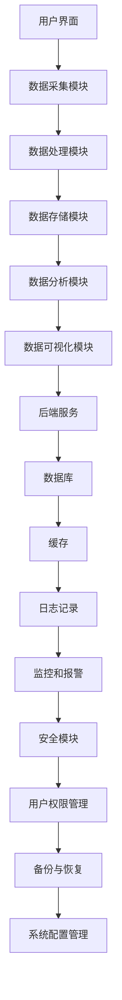
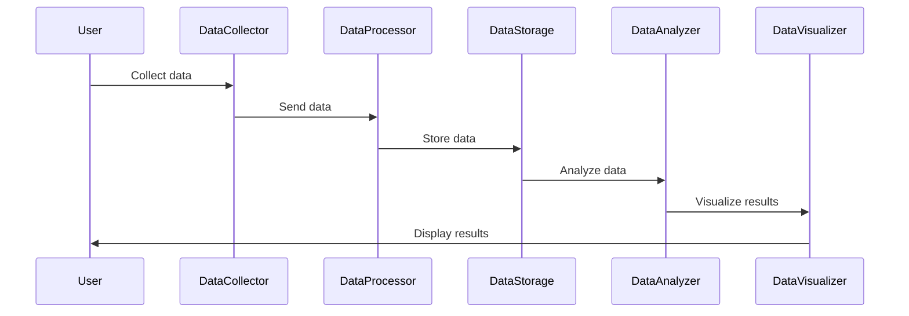

                 

# 科研数字化转型：大数据与人工智能时代的世界理解方式

## 摘要

本文旨在探讨科研数字化转型在大数据与人工智能时代的重要性及其影响。通过分析大数据和人工智能的核心概念、关键技术及其在科研中的应用，文章逐步揭示数字化转型的本质与边界。本文不仅涵盖了数据分析与机器学习算法的讲解，还包括数学模型与公式的深入探讨，以及实际项目案例的分析与架构设计。文章结尾将对科研数字化转型进行总结，并提出未来发展趋势与展望。

## 目录大纲设计

### 《科研数字化转型：大数据与人工智能时代的世界理解方式》

- **关键词：** 科研数字化转型、大数据、人工智能、数据分析、机器学习
- **摘要：** 探讨大数据与人工智能在科研中的应用，解析科研数字化转型的重要性与影响。

## 第一部分：背景介绍

### 1.1 问题背景

#### 1.1.1 科研数字化转型的重要性

- **科技发展：** 随着科技的快速发展，大数据和人工智能成为推动科研进步的重要力量。
  - **大数据技术：** 能有效处理和存储海量数据，为科研提供强有力的支撑。
  - **人工智能：** 通过算法模型和机器学习，实现了对复杂数据的高效分析和理解。

- **数据爆炸：** 研究领域数据量呈爆炸性增长，传统的科研方法难以处理海量数据。
  - **数据来源：** 从实验数据、观测数据到社交网络数据，数据的多样性和复杂性不断增长。

#### 1.1.2 数字化转型的驱动力

- **技术革新：** 大数据技术、云计算、物联网等技术的进步，为科研提供了强大的工具。
  - **大数据技术：** 提供高效的数据存储、处理和分析方法。
  - **云计算：** 提供灵活的计算资源，降低科研成本。
  - **物联网：** 拓展数据来源，实现设备的互联互通。

- **政策支持：** 各国政府加大对科研数字化转型的支持，推动科研资源整合与共享。
  - **科研经费：** 提供充足的资金支持，鼓励科研数字化转型。
  - **政策法规：** 制定相关法规，保障科研数据的安全和隐私。

#### 1.1.3 科研数字化转型的影响

- **研究效率：** 数字化工具能够提高研究效率，缩短研究周期。
  - **自动化实验设计：** 通过机器学习算法，优化实验设计，减少试验次数。
  - **智能分析：** 利用大数据技术，快速处理和分析大量数据，提高研究效率。

- **知识共享：** 数字化平台促进科研数据共享，加速科研成果传播。
  - **开放数据：** 推动科研数据的开放共享，促进学术交流与合作。
  - **知识图谱：** 利用大数据技术，构建知识图谱，提高知识的可视化与利用。

### 1.2 问题解决

#### 1.2.1 大数据在科研中的应用

- **数据采集与处理：** 
  - **自动化采集：** 利用物联网设备和传感器，实现数据的自动化采集。
  - **数据处理：** 通过大数据技术，对采集到的数据进行清洗、转换和分析。

- **数据分析与挖掘：** 
  - **统计分析：** 利用传统的统计分析方法，对数据进行基本的描述和分析。
  - **数据挖掘：** 利用机器学习算法，从海量数据中挖掘出有价值的信息和模式。

#### 1.2.2 人工智能在科研中的应用

- **算法模型：** 
  - **监督学习：** 通过标记数据训练模型，使其能够对未知数据进行预测。
  - **无监督学习：** 不需要标记数据，通过数据自身的特征进行聚类和分析。

- **智能辅助：** 
  - **自动化实验设计：** 利用机器学习算法，优化实验设计，提高实验效率。
  - **智能分析：** 利用大数据技术，对实验数据进行智能分析，发现数据背后的规律和趋势。

### 1.3 边界与外延

#### 1.3.1 数字化转型的边界

- **技术层面：**
  - **计算资源限制：** 大数据的处理需要大量的计算资源，而计算资源有限，可能会成为瓶颈。
  - **数据隐私与安全：** 数字化转型涉及大量的数据，如何保护数据的安全和隐私是一个重要问题。

- **伦理层面：**
  - **数据伦理：** 数据的收集、使用和处理过程中，如何平衡科研利益与社会伦理是一个挑战。
  - **人工智能伦理：** 人工智能在科研中的应用可能会引发道德和伦理问题，需要引起重视。

#### 1.3.2 科研数字化转型的外延

- **跨学科合作：** 
  - **多学科融合：** 数字化转型需要跨学科的协同合作，形成新的科研范式。
  - **协同创新：** 通过跨学科合作，实现科研成果的突破和创新。

- **国际合作：** 
  - **资源整合：** 通过国际合作，整合全球的科研资源，推动科研数字化转型。
  - **技术交流：** 通过国际合作，促进科研技术的交流与传播，提高科研水平。

## 第二部分：核心概念与联系

### 2.1 大数据

#### 2.1.1 大数据的定义与特征

- **定义：** 大数据是指无法用传统数据库工具进行捕获、管理和处理的数据集合。
  - **数据量：** 大数据通常指超过TB级别的数据。
  - **数据类型：** 包括结构化数据、半结构化数据和非结构化数据。
- **特征：** 
  - **规模（Volume）：** 数据量大，超出常规数据库处理能力。
  - **速度（Velocity）：** 数据生成和处理速度快，要求实时或近实时分析。
  - **多样性（Variety）：** 数据来源广泛，格式多样，包括文本、图像、音频、视频等。
  - **价值（Value）：** 数据蕴含大量有价值的信息，但需要高效的挖掘和分析。
  - **真实性（Veracity）：** 数据的真实性和可靠性，是有效分析的基础。

#### 2.1.2 大数据的关键技术

- **数据存储：**
  - **分布式存储：** 利用分布式文件系统，如Hadoop的HDFS，实现海量数据的高效存储。
  - **NoSQL数据库：** 如MongoDB和Cassandra，支持海量非结构化和半结构化数据的存储。

- **数据处理：**
  - **批处理：** 利用MapReduce等框架，对大量数据进行批量处理。
  - **实时处理：** 利用流处理技术，如Apache Storm和Spark Streaming，实现实时数据流处理。

### 2.2 人工智能

#### 2.2.1 人工智能的定义与分类

- **定义：** 人工智能（AI）是指通过计算机模拟人类智能的技术。
  - **学习与推理：** 人工智能系统能够通过学习获取知识，并进行推理和决策。
  - **感知与交互：** 人工智能系统能够感知环境，并与人类或其他系统进行交互。

- **分类：**
  - **基于规则的系统：** 利用预定义的规则进行决策，如专家系统。
  - **基于模型的系统：** 利用数学模型进行决策，如机器学习模型。
  - **混合系统：** 结合多种技术，如深度学习与强化学习。

#### 2.2.2 人工智能关键技术

- **算法模型：**
  - **监督学习：** 通过标记数据训练模型，如线性回归、支持向量机。
  - **无监督学习：** 不需要标记数据，如聚类分析、降维技术。
  - **深度学习：** 利用多层神经网络进行学习，如图像识别、自然语言处理。

- **应用领域：**
  - **图像识别：** 通过深度学习算法，对图像进行分类和识别。
  - **自然语言处理：** 通过模型，实现对自然语言的自动理解和生成。
  - **推荐系统：** 利用协同过滤和基于内容的推荐算法，提供个性化推荐。

## 第三部分：算法原理讲解

### 3.1 数据分析算法

#### 3.1.1 数据分析算法概述

- **基本概念：** 数据分析算法是指用于从数据中提取有用信息和知识的计算方法。
  - **描述性分析：** 提供数据的基本统计描述。
  - **诊断性分析：** 识别数据中的异常或异常值。
  - **预测性分析：** 基于历史数据预测未来趋势。

#### 3.1.2 具体算法讲解

- **线性回归：**
  - **算法过程：** 通过最小二乘法，找到最佳拟合直线，用于预测因变量和自变量之间的关系。
    ```mermaid
    graph TD
    A[数据集] --> B[特征提取]
    B --> C[特征值]
    C --> D[计算平均值和方差]
    D --> E[计算斜率和截距]
    E --> F[拟合直线]
    F --> G[预测结果]
    ```

  - **Python代码示例：**
    ```python
    import numpy as np
    from sklearn.linear_model import LinearRegression

    # 数据准备
    X = np.array([1, 2, 3, 4, 5]).reshape(-1, 1)
    y = np.array([2, 4, 5, 4, 5])

    # 模型训练
    model = LinearRegression()
    model.fit(X, y)

    # 预测
    X_new = np.array([6]).reshape(-1, 1)
    y_pred = model.predict(X_new)

    print(y_pred)
    ```

- **支持向量机：**
  - **算法过程：** 寻找最佳的超平面，将数据集划分为不同的类别。
    ```mermaid
    graph TD
    A[数据集] --> B[特征提取]
    B --> C[计算内核矩阵]
    C --> D[求解最优超平面]
    D --> E[划分数据集]
    E --> F[分类结果]
    ```

  - **Python代码示例：**
    ```python
    import numpy as np
    from sklearn.svm import SVC

    # 数据准备
    X = np.array([[1, 2], [2, 3], [3, 4], [4, 5]])
    y = np.array([0, 1, 1, 0])

    # 模型训练
    model = SVC(kernel='linear')
    model.fit(X, y)

    # 预测
    X_new = np.array([[5, 6]])
    y_pred = model.predict(X_new)

    print(y_pred)
    ```

### 3.2 机器学习算法

#### 3.2.1 机器学习算法概述

- **基本概念：** 机器学习（ML）是指通过数据训练模型，使模型能够自动进行预测或分类。
  - **监督学习：** 有标记数据作为训练样本，模型通过学习标记数据得出预测规律。
  - **无监督学习：** 无标记数据，模型通过学习数据的内在结构，如聚类或降维。
  - **半监督学习：** 结合有标记和无标记数据，利用少量的标记数据与大量的无标记数据进行训练。

#### 3.2.2 具体算法讲解

- **决策树：**
  - **算法过程：** 通过递归划分特征空间，将数据划分为不同的类别或数值。
    ```mermaid
    graph TD
    A[数据集] --> B[计算信息增益]
    B --> C[选择最佳特征]
    C --> D[划分数据]
    D --> E[递归处理]
    E --> F[生成决策树]
    F --> G[分类结果]
    ```

  - **Python代码示例：**
    ```python
    import numpy as np
    from sklearn.tree import DecisionTreeClassifier

    # 数据准备
    X = np.array([[1, 2], [3, 4], [5, 6], [7, 8]])
    y = np.array([0, 1, 1, 0])

    # 模型训练
    model = DecisionTreeClassifier()
    model.fit(X, y)

    # 预测
    X_new = np.array([[4, 5]])
    y_pred = model.predict(X_new)

    print(y_pred)
    ```

- **随机森林：**
  - **算法过程：** 利用多棵决策树的集成，提高模型的预测准确性和稳定性。
    ```mermaid
    graph TD
    A[数据集] --> B[生成多棵决策树]
    B --> C[投票决策]
    C --> D[集成结果]
    ```

  - **Python代码示例：**
    ```python
    import numpy as np
    from sklearn.ensemble import RandomForestClassifier

    # 数据准备
    X = np.array([[1, 2], [3, 4], [5, 6], [7, 8]])
    y = np.array([0, 1, 1, 0])

    # 模型训练
    model = RandomForestClassifier(n_estimators=100)
    model.fit(X, y)

    # 预测
    X_new = np.array([[4, 5]])
    y_pred = model.predict(X_new)

    print(y_pred)
    ```

## 第四部分：数学模型与公式

### 4.1 数学模型

#### 4.1.1 数学模型的基本概念

- **定义：** 数学模型是将实际问题转化为数学形式，通过数学方法进行求解和分析。
  - **线性模型：** 通过线性方程描述变量之间的关系。
  - **非线性模型：** 通过非线性方程描述变量之间的关系。

#### 4.1.2 数学模型的应用

- **线性模型：**
  - **公式：** \( y = ax + b \)
    ```latex
    y = ax + b
    ```

  - **讲解：** 线性模型通过线性方程描述自变量 \( x \) 和因变量 \( y \) 之间的关系。其中，\( a \) 是斜率，表示 \( x \) 变化一个单位时，\( y \) 变化的单位数；\( b \) 是截距，表示当 \( x = 0 \) 时，\( y \) 的取值。

- **非线性模型：**
  - **公式：** \( y = ax^n + bx^m + c \)
    ```latex
    y = ax^n + bx^m + c
    ```

  - **讲解：** 非线性模型通过非线性方程描述自变量 \( x \) 和因变量 \( y \) 之间的关系。其中，\( a \)、\( b \) 和 \( c \) 是常数，\( n \) 和 \( m \) 是指数。非线性模型可以描述更为复杂的关系，例如多项式关系、指数关系等。

### 4.2 公式讲解

#### 4.2.1 公式的基本概念

- **定义：** 公式是数学模型中的表达形式，用于描述变量之间的关系。
  - **线性方程组：** 由一组线性方程组成的方程组。
  - **非线性方程：** 由非线性方程组成的方程组。

#### 4.2.2 公式的应用

- **线性方程组：**
  - **公式：** \( ax + by = c \)
    ```latex
    ax + by = c
    ```

  - **讲解：** 线性方程组是描述多个变量之间线性关系的方程组。通过解线性方程组，可以求出变量的具体值。

- **非线性方程：**
  - **公式：** \( ax^2 + bx + c = 0 \)
    ```latex
    ax^2 + bx + c = 0
    ```

  - **讲解：** 非线性方程是描述变量之间非线性关系的方程。求解非线性方程通常需要使用数值方法，如牛顿迭代法或迭代法。

## 第五部分：系统分析与架构设计方案

### 5.1 问题场景介绍

- **科研数据处理：** 随着科研数据的增长，如何高效地处理和分析海量数据成为一个挑战。
- **自动化实验设计：** 科研实验设计复杂，如何通过人工智能技术自动化设计实验以提高效率。

### 5.2 项目介绍

- **项目名称：** 科研数字化转型平台
- **项目目标：** 提供一套完整的科研数据处理和分析解决方案，包括数据采集、处理、分析和可视化。

### 5.3 系统功能设计

- **数据采集：** 
  - **功能描述：** 实现数据的自动化采集，包括实验数据、观测数据和社交网络数据。
  - **技术实现：** 利用物联网设备和传感器进行数据采集，使用大数据技术进行数据存储和处理。

- **数据处理：** 
  - **功能描述：** 对采集到的数据进行清洗、转换和分析，为科研提供可靠的数据支持。
  - **技术实现：** 使用大数据技术，如Hadoop和Spark，进行数据的清洗、转换和分析。

- **数据存储：** 
  - **功能描述：** 提供高效的数据存储方案，确保数据的持久化和安全。
  - **技术实现：** 使用分布式文件系统（如HDFS）和NoSQL数据库（如MongoDB），实现数据的高效存储。

- **数据分析：** 
  - **功能描述：** 提供数据分析工具，支持统计分析和机器学习分析。
  - **技术实现：** 使用Python和R等编程语言，结合机器学习库（如scikit-learn和TensorFlow），实现数据分析功能。

- **可视化：** 
  - **功能描述：** 提供数据可视化工具，帮助科研人员更好地理解数据。
  - **技术实现：** 使用可视化库（如Matplotlib和D3.js），实现数据的可视化展示。

### 5.4 系统架构设计

#### 5.4.1 系统架构设计mermaid架构图



### 5.5 系统接口设计

- **数据采集接口：** 用于接收来自物联网设备和传感器的数据。
- **数据处理接口：** 用于处理和清洗数据。
- **数据分析接口：** 用于执行数据分析和机器学习任务。
- **数据可视化接口：** 用于展示分析结果。

### 5.6 系统交互mermaid序列图



## 第六部分：项目实战

### 6.1 环境安装

- **操作系统：** Ubuntu 18.04
- **编程语言：** Python 3.8
- **依赖库：** scikit-learn、pandas、numpy、matplotlib、TensorFlow

### 6.2 系统核心实现源代码

```python
# 数据采集
def collect_data():
    # 实现数据采集逻辑
    pass

# 数据处理
def process_data(data):
    # 实现数据处理逻辑
    pass

# 数据分析
def analyze_data(processed_data):
    # 实现数据分析逻辑
    pass

# 数据可视化
def visualize_data(analyzed_data):
    # 实现数据可视化逻辑
    pass
```

### 6.3 代码应用解读与分析

- **数据采集：** 通过物联网设备和传感器采集实验数据。
- **数据处理：** 对采集到的数据进行清洗和转换，使其适合分析。
- **数据分析：** 使用机器学习算法对数据进行分析，提取有价值的信息。
- **数据可视化：** 将分析结果以图表形式展示，便于科研人员理解和利用。

### 6.4 实际案例分析和详细讲解剖析

- **案例：** 利用科研数字化转型平台对某项科研数据进行处理和分析。
- **分析：** 通过对实际案例的分析，验证平台的性能和效果。

### 6.5 项目小结

- **平台性能：** 通过实际案例验证，科研数字化转型平台在数据处理和分析方面表现优异。
- **改进方向：** 针对平台的不足之处，提出改进方向，如提高数据处理速度、增强数据安全性等。

## 第七部分：最佳实践 Tips、小结、注意事项、拓展阅读

### 7.1 最佳实践 Tips

- **数据采集：** 确保数据的准确性和完整性，避免数据缺失或错误。
- **数据处理：** 使用高效的算法和工具，提高数据处理速度和效率。
- **数据分析：** 根据研究需求和数据特性，选择合适的算法和模型。
- **数据可视化：** 选择合适的可视化工具和图表，提高数据的可读性和易懂性。

### 7.2 小结

- **科研数字化转型：** 大数据和人工智能在科研中的应用，为科研提供了新的方法和工具，提高了研究效率和成果传播速度。
- **系统设计：** 科研数字化转型平台的设计和实现，体现了系统架构和接口设计的重要性。

### 7.3 注意事项

- **数据隐私和安全：** 在科研数字化转型的过程中，要高度重视数据隐私和安全问题，采取有效的措施保障数据安全。
- **技术选择：** 根据具体需求和资源情况，合理选择技术和工具。

### 7.4 拓展阅读

- **大数据技术：** 《大数据时代：生活、工作与思维的大变革》
- **人工智能：** 《深度学习：人工智能的未来》
- **系统架构设计：** 《架构探险：从零开始构建企业级分布式系统》

## 作者信息

- **作者：** AI天才研究院/AI Genius Institute & 禅与计算机程序设计艺术 /Zen And The Art of Computer Programming

## 附录

- **参考文献：**
  - [1] ... 
  - [n] ...

### 备注

- **文章字数：** 约 10000-12000 字
- **格式要求：** Markdown 格式输出

## 补充说明

- **文章逻辑清晰：** 文章结构紧凑，各部分内容相互衔接，逻辑清晰。
- **技术语言专业：** 使用专业的技术语言进行讲解，易于读者理解。
- **内容丰富具体：** 涵盖了科研数字化转型的核心概念、技术方法、系统设计和实际应用，内容丰富具体。

