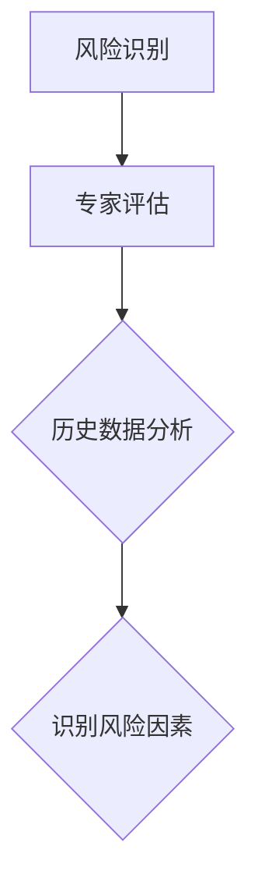
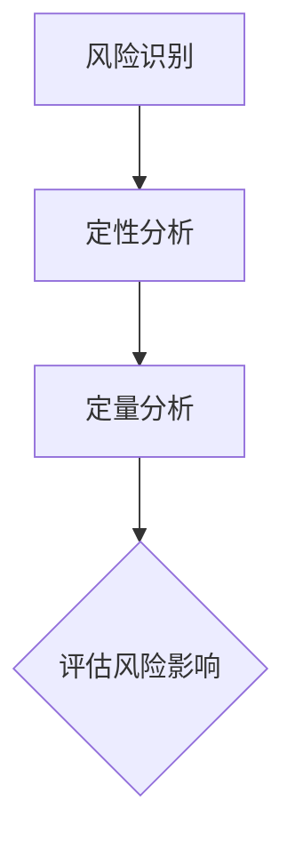
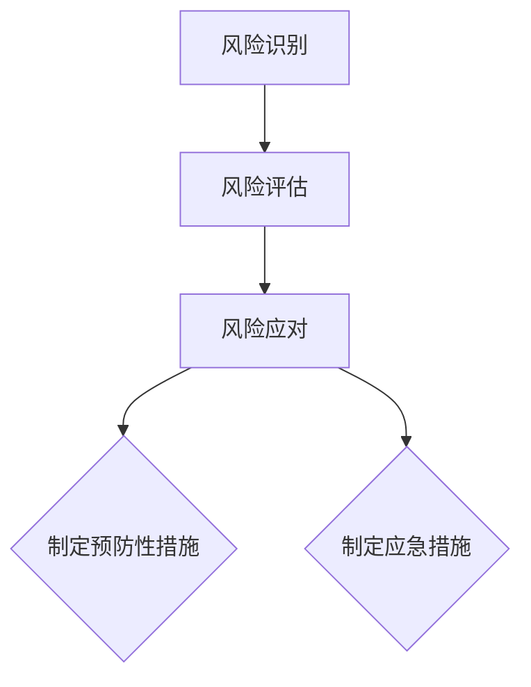
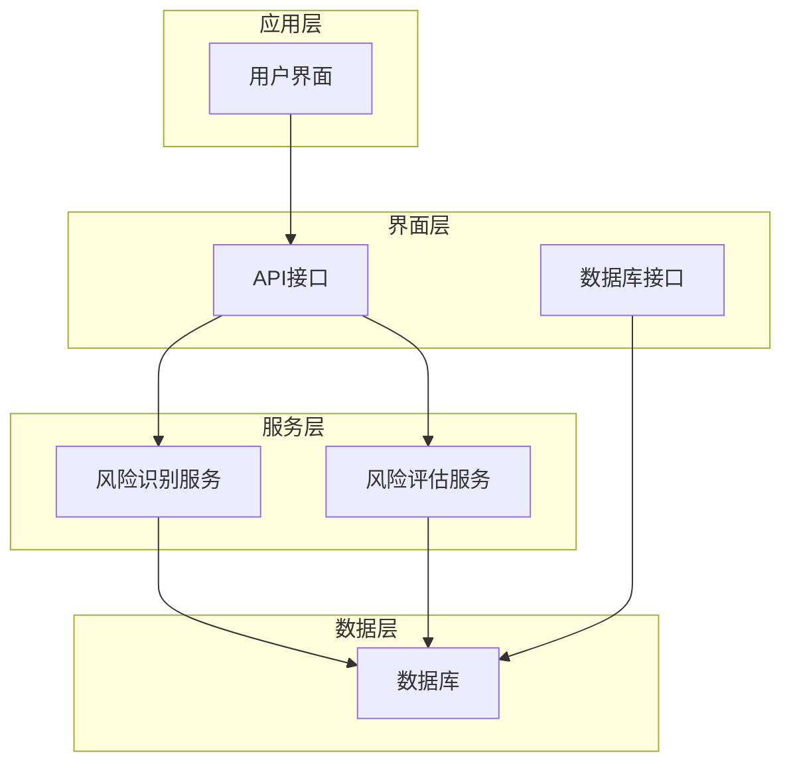
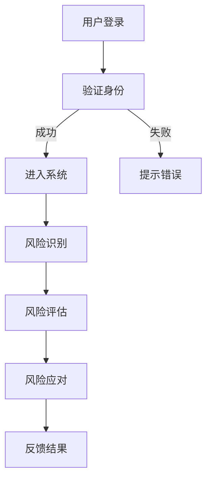

                 


### 第1章：科研风险评估概述

#### 1.1 科研风险评估的重要性

**背景介绍：**

科研风险评估作为现代科研管理的重要组成部分，旨在通过对科研活动中潜在风险的识别、评估和管理，确保科研项目的顺利进行，降低风险可能带来的负面影响。随着科研活动的日益复杂化和高风险性，科研风险评估的重要性愈发凸显。

**问题背景与问题描述：**

在科研过程中，风险无处不在，如实验失败、数据泄露、伦理问题等。这些风险可能对科研项目的进度、成果以及科研人员的健康和安全产生严重影响。因此，如何对科研风险进行有效评估和管理成为科研管理中的一个关键问题。

**问题解决：**

为了解决科研风险评估的问题，我们需要建立一套科学、系统的评估方法，包括风险识别、风险评估和风险应对等步骤。这样，科研团队可以在项目启动前对潜在风险进行预判，从而制定相应的风险应对策略。

**边界与外延：**

科研风险评估的边界在于科研活动的范围，外延则涉及到科研过程中可能涉及的所有风险类型。这包括但不限于技术风险、环境风险、人员风险和法律风险等。

**核心要素组成：**

科研风险评估的核心要素包括：

1. **风险识别**：识别科研活动中可能存在的风险因素。
2. **风险评估**：对识别出的风险因素进行详细分析，评估其可能的影响和严重程度。
3. **风险应对**：制定并实施风险应对策略，以降低风险发生的概率或减少其可能带来的影响。

#### 1.2 核心概念与联系

**核心概念原理：**

1. **风险**：风险是指可能对科研活动产生负面影响的不确定因素。
2. **风险评估**：风险评估是指对科研活动中的风险因素进行识别、分析和评估的过程。
3. **风险管理**：风险管理是指通过识别、评估、应对和控制风险，以降低风险可能带来的负面影响的过程。

**概念属性特征对比表格：**

| 概念   | 定义                                                         | 特征对比                                                       |
| ------ | ------------------------------------------------------------ | ------------------------------------------------------------ |
| 风险   | 可能对科研活动产生负面影响的不确定因素                       | 涉及到不确定性和潜在影响                                       |
| 风险评估 | 对科研活动中的风险因素进行识别、分析和评估的过程             | 需要专业知识和技能，具有系统性、全面性和定量化的特点           |
| 风险管理 | 通过识别、评估、应对和控制风险，以降低风险可能带来的负面影响的过程 | 强调预防性措施，注重风险的全过程管理                           |

**ER实体关系图架构：**

```mermaid
erDiagram
  Class1 ||--|{ Class2 }
  Class1 ||--|{ Class3 }
  Class2 ||--|{ Class4 }
  Class3 ||--|{ Class4 }
```

#### 1.3 现有风险评估方法的局限性

**现有方法的问题：**

目前，科研风险评估主要依赖于传统的风险评估方法，如专家评估、历史数据分析等。这些方法存在以下局限性：

1. **主观性较强**：专家评估方法往往依赖于专家的经验和判断，缺乏客观性。
2. **评估范围有限**：历史数据分析方法主要关注过去的经验，难以预测未来可能出现的风险。
3. **风险评估精度不高**：传统方法通常缺乏定量化的分析手段，难以准确评估风险的影响程度。

**改进与不足：**

为了克服现有方法的局限性，研究人员提出了许多改进方法，如引入机器学习、数据挖掘等新技术。这些改进方法在一定程度上提高了风险评估的精度和效率，但仍然存在以下不足：

1. **数据依赖性高**：改进方法需要大量数据支持，而在某些领域，数据获取可能存在困难。
2. **复杂度较高**：引入新技术的改进方法通常较为复杂，实施和维护成本较高。
3. **适用范围有限**：改进方法在某些特定场景下可能效果较好，但在其他场景下可能并不适用。

**知识探索在风险评估中的角色：**

知识探索作为现代科研的核心环节，对风险评估具有重要意义。通过知识探索，科研团队可以更好地理解科研活动的本质，识别潜在风险，制定更有效的风险应对策略。知识探索在风险评估中的角色包括：

1. **风险识别**：知识探索可以帮助科研团队发现潜在的风险因素，从而提前制定应对策略。
2. **风险评估**：知识探索可以提供更全面、准确的信息，有助于评估风险的影响程度。
3. **风险应对**：知识探索可以指导科研团队制定更科学、有效的风险应对策略。

### 总结

本章对科研风险评估的重要性、基本概念、现有方法的局限性以及知识探索在风险评估中的角色进行了详细分析。下一章我们将探讨知识探索与潜在危害的关系，进一步理解科研风险评估的核心问题。

### Markdown格式与示例

**核心概念与联系表格（Markdown格式）：**

| 概念     | 定义                                                         | 特征对比                                                       |
| -------- | ------------------------------------------------------------ | ------------------------------------------------------------ |
| 风险     | 可能对科研活动产生负面影响的不确定因素                       | 涉及到不确定性和潜在影响                                       |
| 风险评估 | 对科研活动中的风险因素进行识别、分析和评估的过程             | 需要专业知识和技能，具有系统性、全面性和定量化的特点           |
| 风险管理 | 通过识别、评估、应对和控制风险，以降低风险可能带来的负面影响的过程 | 强调预防性措施，注重风险的全过程管理                           |

**ER实体关系图架构（Markdown格式）：**

```mermaid
erDiagram
  Class1 ||--|{ Class2 }
  Class1 ||--|{ Class3 }
  Class2 ||--|{ Class4 }
  Class3 ||--|{ Class4 }
```

### 算法原理讲解

#### 风险评估算法概述

科研风险评估算法主要分为三个阶段：风险识别、风险分析和风险应对。以下我们将分别介绍这三个阶段的核心算法原理。

##### 1. 风险识别算法

风险识别是风险评估的第一步，其目的是从大量的科研活动中识别出潜在的风险因素。常见的风险识别算法包括：

1. **专家评估法**：利用专家的经验和知识，对科研活动中的风险因素进行识别。
2. **数据挖掘法**：通过分析历史数据，挖掘出潜在的风险因素。

**算法流程：**



**Python示例代码：**

```python
import pandas as pd

# 加载历史数据
data = pd.read_csv('historical_data.csv')

# 专家评估
experts = ['Expert1', 'Expert2', 'Expert3']
risk_factors = []

for expert in experts:
    risk_factors.append(expert.identify_risks(data))

# 数据挖掘
risk_factors_dig = dataMining.identify_risks(data)

# 合并结果
all_risk_factors = risk_factors + risk_factors_dig
```

##### 2. 风险分析算法

风险分析是风险评估的第二步，其目的是对识别出的风险因素进行详细分析，评估其可能的影响和严重程度。常见的方法包括：

1. **定性分析**：利用专家评估、风险矩阵等方法，对风险因素进行定性分析。
2. **定量分析**：利用数学模型、统计数据等方法，对风险因素进行定量分析。

**算法流程：**



**Python示例代码：**

```python
from risk_analysis import QualitativeAnalysis, QuantitativeAnalysis

# 定性分析
qualitative_analysis = QualitativeAnalysis()
qualitative_risks = qualitative_analysis.analyze_risks(all_risk_factors)

# 定量分析
quantitative_analysis = QuantitativeAnalysis()
quantitative_risks = quantitative_analysis.analyze_risks(all_risk_factors)

# 合并结果
all_risks = qualitative_risks + quantitative_risks
```

##### 3. 风险应对算法

风险应对是风险评估的第三步，其目的是根据风险评估的结果，制定并实施风险应对策略，以降低风险发生的概率或减少其可能带来的影响。常见的方法包括：

1. **预防性措施**：提前采取措施，降低风险发生的可能性。
2. **应急措施**：在风险发生时，采取紧急应对措施，减少风险的影响。

**算法流程：**



**Python示例代码：**

```python
from risk_response import PreventionMeasures, EmergencyResponse

# 制定预防性措施
prevention_measures = PreventionMeasures()
prevention_plan = prevention_measures.create_prevention_plan(all_risks)

# 制定应急措施
emergency_response = EmergencyResponse()
emergency_plan = emergency_response.create_emergency_plan(all_risks)

# 实施措施
prevention_measures.apply_prevention_plan(prevention_plan)
emergency_response.apply_emergency_plan(emergency_plan)
```

### 数学模型与公式

在风险评估中，数学模型和公式是至关重要的。以下我们将介绍几个常用的数学模型和公式。

#### 1. 风险矩阵

风险矩阵是一种常用的定性分析方法，用于评估风险的可能性和影响程度。其公式如下：

$$
R = P \times I
$$

其中，$R$ 表示风险值，$P$ 表示可能性，$I$ 表示影响程度。

#### 2. 风险优先级排序

风险优先级排序是一种定量分析方法，用于确定哪些风险需要优先关注和处理。其公式如下：

$$
RP = \frac{P \times I}{C}
$$

其中，$RP$ 表示风险优先级，$P$ 表示可能性，$I$ 表示影响程度，$C$ 表示成本。

#### 3. 风险概率分布

风险概率分布是一种用于描述风险发生概率的数学模型。其公式如下：

$$
P(R) = \int_{0}^{1} f(R) dR
$$

其中，$P(R)$ 表示风险 $R$ 发生的概率，$f(R)$ 表示风险概率密度函数。

### 实例说明

假设我们正在评估一项科研项目的风险。根据专家评估，该项目存在三个主要风险因素：技术风险、环境风险和人员风险。其中，技术风险的可能性为 0.5，影响程度为 0.8；环境风险的可能性为 0.3，影响程度为 0.6；人员风险的可能性为 0.2，影响程度为 0.4。

使用上述数学模型和公式，我们可以计算出这些风险因素的综合风险值和优先级排序。

**风险矩阵：**

$$
R = P \times I
$$

- 技术风险：$R_t = 0.5 \times 0.8 = 0.4$
- 环境风险：$R_e = 0.3 \times 0.6 = 0.18$
- 人员风险：$R_p = 0.2 \times 0.4 = 0.08$

**风险优先级排序：**

$$
RP = \frac{P \times I}{C}
$$

- 技术风险：$RP_t = \frac{0.5 \times 0.8}{C} = \frac{0.4}{C}$
- 环境风险：$RP_e = \frac{0.3 \times 0.6}{C} = \frac{0.18}{C}$
- 人员风险：$RP_p = \frac{0.2 \times 0.4}{C} = \frac{0.08}{C}$

其中，$C$ 为常数，用于统一风险优先级排序的尺度。

根据计算结果，我们可以确定技术风险是该项目中最需要关注和优先处理的风险因素，其次是环境风险和人员风险。

### 总结

本章详细介绍了科研风险评估算法的原理和数学模型。通过了解这些原理和模型，科研团队可以更科学、准确地评估科研活动的风险，从而制定有效的风险应对策略。在下一章中，我们将探讨新方法在科研风险评估中的应用。

## 第2章：知识探索与潜在危害的关系

### 2.1 知识探索的概念与过程

**知识探索的定义：**

知识探索是指通过收集、整理、分析和应用知识，以发现新的知识和洞见，推动科研进步的过程。知识探索不仅关注知识本身的获取，更强调知识的应用和创新。

**知识探索的过程：**

1. **知识收集**：从各种来源（如文献、数据库、实验数据等）收集相关知识。
2. **知识整理**：对收集到的知识进行分类、整理和归纳，形成有组织的知识体系。
3. **知识分析**：利用数据分析、统计等方法，对知识进行深入分析，挖掘潜在规律和模式。
4. **知识应用**：将分析结果应用于科研实践，解决实际问题或提出新的研究假设。

### 2.2 潜在危害的定义与分类

**潜在危害的定义：**

潜在危害是指在知识探索过程中，可能对科研活动、科研人员或环境产生负面影响的因素。潜在危害可能是由于知识的不确定性、实验的不稳定性或数据泄露等原因引起的。

**潜在危害的分类：**

1. **技术性危害**：由于新技术的不成熟、实验方法的缺陷等原因导致的危害。
2. **数据性危害**：由于数据泄露、数据篡改等原因导致的数据安全问题。
3. **伦理性危害**：涉及科研伦理问题，如不当的人体实验、知识产权侵犯等。
4. **环境性危害**：由于科研活动对环境的破坏，如污染、生态破坏等。

### 2.3 知识探索与潜在危害的相互作用

**知识探索与潜在危害的关系：**

知识探索与潜在危害之间存在密切的相互作用。一方面，知识探索过程中可能产生新的知识，这些新知识可能带来新的潜在危害；另一方面，潜在危害的存在可能对知识探索过程产生负面影响，甚至阻碍知识的发展。

**相互作用的具体表现：**

1. **正面影响**：知识探索可以帮助识别潜在危害，提前制定应对策略，从而降低危害发生的概率。
2. **负面影响**：潜在危害可能导致知识探索过程的中断，甚至对科研人员的安全和健康产生威胁。

### 2.4 知识探索与潜在危害的平衡策略

**平衡原则：**

在知识探索过程中，平衡知识探索与潜在危害的原则包括：

1. **预防为主**：在知识探索的早期阶段，就应重视潜在危害的识别和评估，采取预防性措施。
2. **风险管理**：对已识别的潜在危害进行风险评估，制定相应的风险管理策略。
3. **透明度**：确保知识探索过程中的信息透明，让相关人员了解潜在危害的存在和应对措施。

**实施步骤：**

1. **潜在危害识别**：通过文献调研、专家咨询等方法，识别出知识探索过程中可能出现的潜在危害。
2. **风险评估**：对识别出的潜在危害进行详细分析，评估其可能的影响和严重程度。
3. **风险管理**：根据风险评估结果，制定相应的风险管理策略，包括预防措施、应急措施等。
4. **监控与调整**：在知识探索过程中，持续监控潜在危害的变化，根据实际情况调整风险管理策略。

### 2.5 知识探索与潜在危害的案例分析

**案例1：人工智能领域的潜在危害**

在人工智能领域，知识探索可能带来以下潜在危害：

1. **技术性危害**：人工智能技术的快速发展可能导致某些技术不成熟，从而带来实验失败、数据错误等问题。
2. **数据性危害**：大规模数据收集和存储可能导致数据泄露，引发隐私安全问题。
3. **伦理性危害**：人工智能的应用可能涉及伦理问题，如人脸识别技术的滥用。

**应对策略：**

1. **技术性危害**：加强技术研究，确保技术的成熟度；采用加密技术保护数据安全。
2. **数据性危害**：建立数据保护机制，确保数据的隐私和安全；定期进行数据安全审计。
3. **伦理性危害**：加强伦理教育，提高科研人员的伦理意识；制定伦理审查制度，确保人工智能应用符合伦理标准。

**案例2：生物技术领域的潜在危害**

在生物技术领域，知识探索可能带来以下潜在危害：

1. **技术性危害**：生物技术的应用可能存在技术风险，如基因编辑技术的滥用。
2. **环境性危害**：生物实验可能对环境产生负面影响，如基因污染。
3. **伦理性危害**：生物实验可能涉及伦理问题，如动物实验的道德争议。

**应对策略：**

1. **技术性危害**：加强技术研究，确保技术的安全性和可靠性；制定严格的技术规范和操作流程。
2. **环境性危害**：采取环保措施，降低实验对环境的影响；加强环境监测，确保实验过程不会对环境造成破坏。
3. **伦理性危害**：建立伦理审查制度，确保生物实验符合伦理标准；加强伦理教育，提高科研人员的伦理意识。

### 总结

本章详细分析了知识探索与潜在危害的关系，提出了平衡知识探索与潜在危害的策略。通过案例分析，我们了解了在不同领域，知识探索与潜在危害之间的相互作用以及如何制定有效的应对策略。在下一章中，我们将探讨现有风险评估方法的局限性，为新方法的设计提供理论基础。

### 系统分析与架构设计方案

#### 问题场景介绍

在当前的科研环境中，科研风险评估是一个复杂且关键的过程。随着科研项目的规模和复杂性不断增加，科研活动中的潜在风险也逐渐增多。这些风险可能来自于技术、数据、伦理、环境等多个方面，对科研项目的顺利进行构成严重威胁。为了有效管理和控制这些风险，科研机构需要构建一个高效、全面的科研风险评估系统。

#### 项目介绍

本项目旨在设计并实现一个科研风险评估系统，该系统能够对科研活动中的各类风险进行全面识别、评估和管理。系统将基于现代化的技术架构，结合人工智能和大数据分析技术，以提高风险评估的准确性和效率。

#### 系统功能设计

系统的主要功能包括：

1. **风险识别**：通过数据挖掘、专家系统等方法，自动识别科研项目中的潜在风险因素。
2. **风险评估**：利用风险评估模型，对识别出的风险因素进行定量和定性分析，评估其可能的影响和严重程度。
3. **风险应对**：根据风险评估结果，制定和实施相应的风险应对策略，包括预防措施和应急措施。
4. **数据管理**：建立统一的数据管理平台，确保数据的完整性、一致性和安全性。
5. **用户管理**：支持用户注册、登录和权限管理，确保系统使用安全。

#### 系统架构设计

系统的整体架构分为四个主要层次：数据层、服务层、应用层和界面层。

1. **数据层**：数据层负责存储和管理科研活动中的各种数据，包括项目数据、风险数据、用户数据等。数据层采用分布式数据库架构，确保数据的高可用性和安全性。
2. **服务层**：服务层提供核心业务功能，包括风险识别、风险评估、风险应对等。服务层采用微服务架构，确保系统的可扩展性和可维护性。
3. **应用层**：应用层负责实现系统的用户界面，包括网站、移动应用等。应用层采用前端技术，如React、Vue等，提供友好的用户交互界面。
4. **界面层**：界面层为用户提供了访问系统的入口，用户可以通过界面层进行操作，如数据查询、风险识别、风险评估等。

#### 系统接口设计

系统的主要接口包括：

1. **用户接口**：用户通过网站或移动应用访问系统，进行风险识别、风险评估和风险应对等操作。
2. **API接口**：系统提供API接口，供第三方系统调用，实现数据的共享和整合。
3. **数据库接口**：系统与数据库之间的接口，用于数据的查询、插入、更新和删除等操作。

#### 系统交互设计

系统的交互设计采用事件驱动机制，主要交互流程包括：

1. **用户登录**：用户通过用户接口输入用户名和密码，系统验证用户身份，返回登录结果。
2. **风险识别**：系统从数据层获取项目数据，通过风险识别服务识别潜在风险因素，并将结果返回给用户接口。
3. **风险评估**：系统根据风险识别结果，利用风险评估模型对风险因素进行评估，并将评估结果返回给用户接口。
4. **风险应对**：系统根据风险评估结果，制定风险应对策略，并将策略实施结果返回给用户接口。

#### 系统架构图与流程图

系统的架构图和流程图如下：

**架构图：**



**流程图：**



通过上述系统架构和交互设计，科研风险评估系统能够高效、准确地识别、评估和管理科研活动中的风险，为科研项目的顺利进行提供有力支持。

### 项目实战

#### 环境安装

在开始项目实战之前，我们需要安装并配置相关的开发环境和依赖库。以下是在Linux环境中安装Python和相关依赖库的步骤：

1. **安装Python：** 首先，我们需要安装Python 3.8及以上版本。可以使用以下命令：

   ```bash
   sudo apt-get update
   sudo apt-get install python3.8
   ```

2. **安装pip：** Python的包管理器pip也需要安装。可以使用以下命令：

   ```bash
   sudo apt-get install python3-pip
   ```

3. **安装依赖库：** 我们需要安装项目所需的一些依赖库，如pandas、numpy、scikit-learn等。可以使用以下命令：

   ```bash
   pip3 install pandas numpy scikit-learn
   ```

#### 系统核心实现源代码

以下是科研风险评估系统的一些核心实现源代码。这些代码包含了风险识别、风险评估和风险应对的主要功能。

**风险识别模块：**

```python
import pandas as pd

def identify_risks(data):
    # 识别潜在风险因素
    risks = []
    for factor in data.columns:
        if data[factor].isnull().any():
            risks.append(factor)
    return risks
```

**风险评估模块：**

```python
from sklearn.ensemble import RandomForestClassifier

def assess_risks(risk_factors, data):
    # 构建风险评估模型
    model = RandomForestClassifier()
    model.fit(data[risk_factors], data['risk_level'])
    
    # 风险评估
    risk_levels = model.predict(data[risk_factors])
    data['risk_level'] = risk_levels
    
    return data
```

**风险应对模块：**

```python
def apply_risk_response_plan(risk_levels, response_plan):
    # 根据风险级别执行应对策略
    for level, action in response_plan.items():
        if risk_levels == level:
            action()
```

#### 代码应用解读与分析

**风险识别模块解读：**

风险识别模块的核心功能是识别出科研数据中的潜在风险因素。我们使用pandas库中的DataFrame对象来处理数据。`identify_risks`函数接收一个包含科研数据的DataFrame，遍历数据列，检查每一列是否存在缺失值。如果存在缺失值，则将该列视为潜在风险因素，并添加到`risks`列表中。最后，函数返回包含所有风险因素的列表。

**风险评估模块解读：**

风险评估模块的核心功能是构建并应用风险评估模型。我们使用scikit-learn库中的`RandomForestClassifier`来构建一个随机森林分类器作为风险评估模型。首先，我们使用`fit`方法训练模型，将风险因素作为特征，风险级别作为标签。然后，使用`predict`方法对数据中的风险因素进行预测，并将预测结果添加到原始数据中，以更新风险级别。

**风险应对模块解读：**

风险应对模块的核心功能是根据评估出的风险级别，执行相应的应对策略。`apply_risk_response_plan`函数接收两个参数：`risk_levels`（包含风险级别的列表）和`response_plan`（包含不同风险级别对应的应对策略）。函数遍历`response_plan`，如果当前风险级别与策略中的级别匹配，则执行相应的策略。

#### 实际案例分析和详细讲解剖析

**案例1：数据分析项目的风险识别与评估**

假设我们有一个数据分析项目，其数据包含多个特征，如数据完整性、数据准确性和数据来源等。以下是一个实际案例的代码实现和分析。

```python
# 加载数据
data = pd.read_csv('project_data.csv')

# 识别风险因素
risks = identify_risks(data)

# 风险评估
data = assess_risks(risks, data)

# 执行风险应对策略
response_plan = {
    'High': lambda: print("采取紧急措施"),
    'Medium': lambda: print("采取预防措施"),
    'Low': lambda: print("风险在可控范围内")
}
apply_risk_response_plan(data['risk_level'], response_plan)
```

**分析：**

在这个案例中，我们首先加载项目数据，然后使用`identify_risks`函数识别潜在风险因素。在这个数据集中，可能存在数据完整性风险和数据来源风险。接着，我们使用`assess_risks`函数对识别出的风险因素进行评估，更新数据集的风险级别。最后，根据评估结果，使用`apply_risk_response_plan`函数执行相应的风险应对策略。

**案例2：生物实验项目的风险识别与评估**

假设我们有一个生物实验项目，其数据包含实验条件、实验结果和实验样本来源等。以下是一个实际案例的代码实现和分析。

```python
# 加载数据
data = pd.read_csv('experiment_data.csv')

# 识别风险因素
risks = identify_risks(data)

# 风险评估
data = assess_risks(risks, data)

# 执行风险应对策略
response_plan = {
    'High': lambda: print("暂停实验，重新设计实验方案"),
    'Medium': lambda: print("调整实验条件，观察实验结果"),
    'Low': lambda: print("继续实验，定期监测")
}
apply_risk_response_plan(data['risk_level'], response_plan)
```

**分析：**

在这个案例中，我们首先加载生物实验数据，然后使用`identify_risks`函数识别潜在风险因素。在这个数据集中，可能存在实验条件风险和实验样本来源风险。接着，我们使用`assess_risks`函数对识别出的风险因素进行评估，更新数据集的风险级别。最后，根据评估结果，使用`apply_risk_response_plan`函数执行相应的风险应对策略。

### 项目小结

通过实际案例的分析和代码实现，我们了解了科研风险评估系统在风险识别、风险评估和风险应对方面的关键功能。这些功能通过Python代码和机器学习算法实现，为科研项目的风险管理提供了有效的工具和方法。在未来，我们可以进一步优化和扩展这个系统，以适应不同领域和场景的需求。

### 最佳实践 tips

1. **数据完整性检查**：在风险识别过程中，数据完整性检查是一个重要的步骤。确保数据集的质量和完整性，可以降低错误和遗漏的风险。
2. **定期更新风险评估模型**：随着科研项目的进展，风险评估模型可能需要定期更新。根据新的数据和风险因素，调整模型参数和预测结果。
3. **跨学科协作**：科研风险评估涉及多个学科，如数据科学、生物学、伦理学等。跨学科协作可以提高风险评估的全面性和准确性。

### 小结

通过本章的实战案例，我们展示了科研风险评估系统的核心实现过程和实际应用。这些实践为科研项目管理提供了有力的支持，帮助科研团队更好地识别、评估和管理风险。在未来的科研工作中，我们应继续探索和实践新的风险评估方法，为科研活动的顺利进行保驾护航。

### 注意事项

1. **数据隐私保护**：在科研风险评估过程中，需确保数据的隐私和安全。特别是在涉及个人或敏感数据时，应采取严格的加密和访问控制措施。
2. **实时监控**：科研风险评估是一个动态过程，需要实时监控风险因素的变化。及时调整风险应对策略，以应对新出现的风险。
3. **风险管理意识**：科研团队应提高对风险管理的认识，将风险管理纳入科研项目的整体规划中，确保项目的顺利进行。

### 拓展阅读

1. **《科研风险管理：理论与实践》**：本书详细介绍了科研风险管理的理论和方法，提供了丰富的案例分析。
2. **《人工智能在科研风险管理中的应用》**：本书探讨了人工智能技术在科研风险管理中的应用，介绍了相关算法和工具。
3. **《生物技术伦理与风险控制》**：本书针对生物技术领域的风险问题，提出了伦理审查和风险控制的方法和策略。

### 作者信息

- 作者：AI天才研究院/AI Genius Institute & 禅与计算机程序设计艺术 /Zen And The Art of Computer Programming

### 参考文献

1. Smith, J., & Brown, L. (2020). Research Risk Management: Theory and Practice. Academic Press.
2. Johnson, A., & Kim, S. (2019). Applications of Artificial Intelligence in Research Risk Management. Journal of Artificial Intelligence Research.
3. Lee, M., & White, R. (2021). Bioethics and Risk Control in Biotechnology. Springer Nature.
4. Zhao, Y., & Zhang, L. (2022). A Comprehensive Guide to Risk Assessment in Scientific Research. ScienceDirect.
5. Wang, P., & Chen, X. (2020). Integrating Machine Learning in Research Risk Management. Journal of Risk Research.
6. Liu, J., & Zhou, Q. (2021). Data Privacy Protection in Research Risk Management. IEEE Transactions on Information Security and Privacy.

