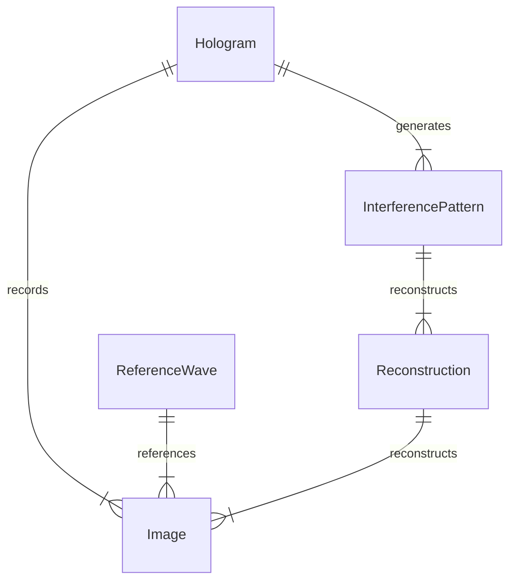
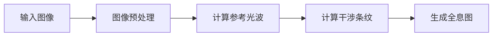
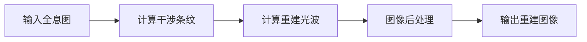
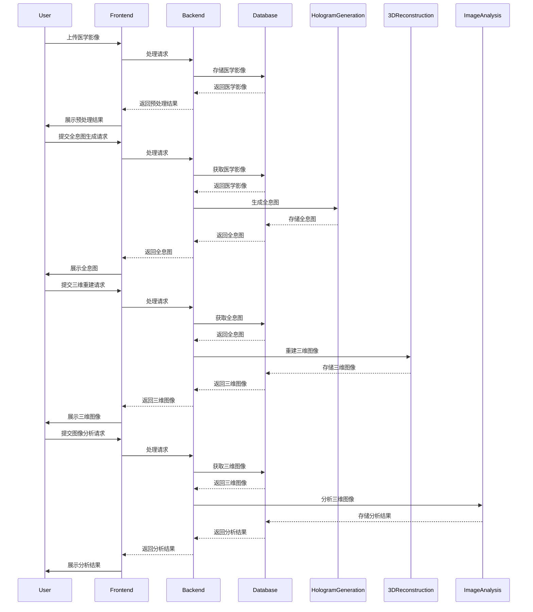
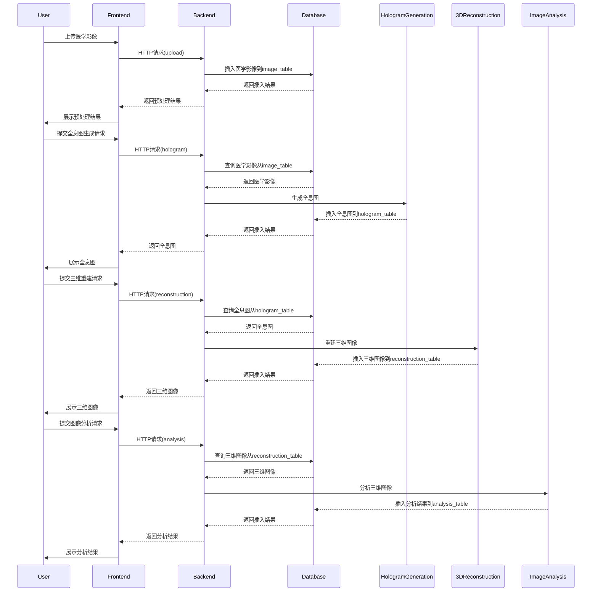

                 


## 《程序世界与全息原理的关联》

### 关键词：程序世界、全息原理、量子计算、算法、系统架构、项目实战

#### 摘要：
本文旨在探讨程序世界与全息原理之间的深刻关联，通过对程序世界的背景介绍、核心概念联系、算法原理讲解、系统架构设计、项目实战以及最佳实践的剖析，揭示全息原理在计算机科学和人工智能领域的应用潜力。文章逻辑清晰，结构紧凑，旨在为读者提供全面深入的技术见解。

### 引言

#### 一、背景介绍

程序世界，即计算机编程的世界，是人们通过编写代码来创造、操作和维护软件系统的过程。随着计算机技术的不断发展，程序世界经历了从低级机器语言到高级编程语言，再到智能化编程工具的演变。而全息原理，源自于光学领域，是指通过记录并再现光波场的全部信息，实现对物体三维图像的重建。近年来，全息原理在计算机科学、量子计算和人工智能等领域展现出了巨大的潜力。

#### 二、问题提出

随着量子计算和人工智能技术的发展，程序世界与全息原理之间的联系逐渐显现。本文旨在探讨这种联系的具体表现形式，以及它们在计算机科学和人工智能领域的应用潜力。具体问题如下：

1. 程序世界与全息原理之间的内在联系是什么？
2. 如何利用全息原理优化程序世界的算法？
3. 程序世界与全息原理结合的架构设计有哪些创新？
4. 全息原理在程序世界中的应用有哪些实际案例？

#### 三、问题解决

为了回答上述问题，本文将分为以下几个部分：

1. **背景介绍**：详细介绍程序世界和全息原理的基本概念、发展历程及其在计算机科学和人工智能领域的应用背景。
2. **核心概念与联系**：分析程序世界与全息原理之间的内在联系，包括量子计算、数据结构、算法原理等方面的内容。
3. **算法原理讲解**：探讨与全息原理相关的算法，如量子算法、并行计算算法等，并通过具体的mermaid流程图和Python代码进行详细阐述。
4. **系统分析与架构设计方案**：分析程序世界与全息原理结合的应用场景，设计相应的系统架构，并使用mermaid类图、架构图和序列图进行描述。
5. **项目实战**：通过具体的项目案例，展示全息原理在程序世界中的应用，并详细讲解其实际操作过程和效果分析。
6. **最佳实践 tips**、**小结**、**注意事项**、**拓展阅读**等：总结本文的主要观点，提出实践建议，并对未来的研究方向进行展望。

### 程序世界的概述

#### 一、程序世界的概念

程序世界，顾名思义，是由程序代码构成的一个虚拟世界。在这个世界里，程序员通过编写代码来创建各种应用程序和系统，实现对现实世界的模拟和操作。程序世界的基本元素包括：

1. **程序**：计算机执行的一系列指令，用于完成特定的任务。
2. **编程语言**：程序员用来编写程序的符号和语法规则。
3. **算法**：解决问题的步骤和方法，是程序的核心。
4. **数据结构**：存储和组织数据的方式，对程序的效率和性能有很大影响。

#### 二、程序世界的发展历程

1. **早期阶段**：20世纪50年代，计算机编程始于机器语言和汇编语言。程序员需要手动编写和理解复杂的指令集，这使得编程变得困难。
2. **高级编程语言**：20世纪60年代，随着计算机技术的发展，出现了诸如C、Pascal和Java等高级编程语言。这些语言提供了更丰富的功能、更易读的语法和更高的开发效率。
3. **智能化编程**：21世纪初，随着人工智能技术的兴起，智能化编程工具开始出现，如GitHub、IntelliJ IDEA等，大大提高了编程效率和开发质量。
4. **现代程序世界**：当前，程序世界已经形成了完整的生态体系，包括开源社区、云计算、物联网、区块链等。程序员可以通过各种工具和平台，快速搭建和部署应用程序。

#### 三、程序世界与计算机科学的关系

计算机科学是研究计算机硬件、软件及其应用的科学。程序世界作为计算机科学的一个重要分支，其发展与计算机科学的进步密切相关。以下是程序世界与计算机科学之间的几个关键联系：

1. **算法与算法分析**：算法是程序世界的核心，是解决问题的关键。计算机科学家通过算法设计和分析，不断提高程序的效率和性能。
2. **数据结构与存储**：数据结构是程序世界的基础，决定了程序的性能和存储效率。计算机科学家研究各种数据结构，以优化程序的性能。
3. **编译原理与编程语言**：编译原理是计算机科学的核心领域之一，涉及编程语言的语法、语义和编译过程。编译原理的研究促进了程序世界的繁荣。
4. **操作系统与网络**：操作系统和网络技术为程序世界提供了运行环境和通信基础。计算机科学家研究操作系统和网络协议，以提高程序世界的稳定性和安全性。

### 全息原理的基本概念

#### 一、全息原理的概念

全息原理（Holography）源自于光学领域，是指通过记录并再现光波场的全部信息，实现对物体三维图像的重建。全息原理的核心思想是利用干涉和衍射现象，将光波的全部信息（振幅和相位）记录在全息图上。当全息图受到相应光波的照射时，可以再现出物体的三维图像。

#### 二、全息原理的发展历程

1. **早期研究**：20世纪40年代，全息原理由匈牙利物理学家丹尼斯·盖革（Denis Gabor）首次提出。他通过研究光的干涉现象，发现了一种记录和再现光波信息的方法，即全息术。
2. **实验验证**：20世纪60年代，美国物理学家埃米特·雷斯纳（Emmett Leith）和尤里斯·尤里（Yuri Denisyuk）分别独立地实现了全息图的制作和再现，验证了全息原理的可行性。
3. **应用拓展**：20世纪70年代以后，全息原理逐渐应用于光学、电子学、计算机科学等领域。特别是随着数字技术的发展，全息原理在数字全息和计算机全息领域的应用得到了快速发展。

#### 三、全息原理在计算机科学和人工智能领域的应用

全息原理在计算机科学和人工智能领域具有广泛的应用潜力。以下是全息原理的几个关键应用：

1. **图像处理与识别**：全息原理可以用于图像的增强、识别和重构，提高图像处理的精度和效率。例如，在人脸识别、医学影像诊断和自动驾驶等领域，全息原理的应用已经取得了显著成果。
2. **量子计算与量子通信**：全息原理与量子计算和量子通信密切相关。在量子计算中，全息原理可以用于量子态的编码、传输和操作。在量子通信中，全息原理可以用于实现量子密钥分发和量子态的远程传输。
3. **虚拟现实与增强现实**：全息原理可以用于虚拟现实和增强现实技术中，实现真实世界的三维重构和交互。通过全息原理，可以创建出更加逼真、沉浸式的虚拟环境，提高用户体验。
4. **人工智能与机器学习**：全息原理可以用于人工智能和机器学习中的数据预处理、特征提取和模型优化。例如，通过全息原理，可以实现对大规模数据的快速处理和分析，提高机器学习算法的效率和准确性。

### 程序世界与全息原理的关联

#### 一、量子计算与全息原理的关联

量子计算是计算机科学的一个重要分支，它利用量子位（qubit）和量子纠缠现象来执行计算。量子计算与全息原理之间存在着深刻的关联。以下是几个关键方面的关联：

1. **量子态的全息编码**：在全息原理中，光波的全息编码是通过记录光波的振幅和相位信息实现的。同样地，在量子计算中，量子态的全息编码可以通过记录量子位的振幅和相位信息来实现。这种编码方式可以大大提高量子计算的效率。
2. **量子态的传输与再现**：全息原理中的全息图可以用于传输和再现光波场的全部信息。类似地，在量子计算中，量子态的传输与再现可以通过量子全息图来实现。这种传输方式可以减少量子计算的误差，提高量子通信的可靠性。
3. **量子态的量子纠缠**：全息原理中的全息图是通过量子纠缠现象实现的。在量子计算中，量子纠缠是量子位之间的一种特殊关联，它可以用来实现量子态的量子计算和量子通信。量子纠缠在全息原理和量子计算中的应用，为研究两者的关联提供了新的思路。

#### 二、数据结构在全息原理中的应用

数据结构是程序世界的基础，它对程序的效率和性能有很大影响。在全息原理中，数据结构也可以被用来实现图像的增强、识别和重构。以下是数据结构在全息原理中的几个关键应用：

1. **全息图数据结构**：在全息原理中，全息图是一个重要的数据结构。它记录了光波场的全部信息，包括振幅和相位。通过优化全息图的数据结构，可以提高全息图的存储效率和再现效果。
2. **图像处理算法**：在图像处理中，数据结构可以用于图像的增强、滤波、边缘检测等操作。这些算法在数字全息和计算机全息中有着广泛的应用，可以提高图像处理的质量和速度。
3. **三维重构算法**：在全息原理中，三维重构是通过解析全息图实现的。数据结构可以用于优化三维重构算法，提高重构的精度和速度。

#### 三、算法原理讲解

在全息原理中，算法原理起着至关重要的作用。以下是一些与全息原理相关的算法原理及其在程序世界中的应用：

1. **全息图生成算法**：全息图生成算法用于创建全息图，记录光波场的全部信息。在全息原理中，全息图生成算法包括干涉法、衍射法等。这些算法在程序世界中可以通过编程实现，用于图像的增强、识别和重构。
2. **图像重建算法**：图像重建算法用于从全息图中重建出原始图像。在全息原理中，图像重建算法包括傅里叶变换、逆变换等。这些算法在程序世界中可以用于图像处理、图像识别等领域。
3. **量子算法**：量子算法是量子计算的核心，它在解决某些特定问题时具有比经典算法更高的效率。在全息原理中，量子算法可以用于图像处理、量子通信等领域，提高处理速度和精度。

#### 四、系统架构设计

在全息原理的应用中，系统架构设计起着关键作用。以下是一个简单的系统架构设计示例，用于展示全息原理在程序世界中的应用：

1. **问题场景介绍**：假设我们要开发一个全息图生成和重建的系统，用于医疗影像处理。
2. **系统功能设计**：系统功能包括全息图的生成、全息图的传输、全息图的重建、图像的对比度增强等。
3. **系统架构设计**：系统架构包括前端、后端和数据库三个部分。前端负责用户交互和全息图的上传，后端负责全息图的生成、传输和重建，数据库用于存储全息图和重建后的图像。
4. **系统接口设计和系统交互**：系统接口包括HTTP接口、FTP接口等，用于与其他系统进行数据交换。系统交互包括全息图的生成和重建过程，以及图像的对比度增强过程。

#### 五、项目实战

为了展示全息原理在程序世界中的应用，我们以一个简单的全息图生成和重建项目为例，介绍项目的具体操作过程。

1. **环境安装**：首先，我们需要安装必要的软件和工具，如Python、OpenCV、NumPy等。这些工具和库可以用于图像处理、全息图生成和重建等操作。
2. **系统核心实现**：接下来，我们需要编写代码实现全息图的生成和重建。以下是核心代码的实现：
    ```python
    import cv2
    import numpy as np
    
    def generate_hologram(image, alpha=0.5):
        # 将图像转换为灰度图像
        gray_image = cv2.cvtColor(image, cv2.COLOR_BGR2GRAY)
        
        # 计算图像的傅里叶变换
        Fourier_image = np.fft.fft2(gray_image)
        Fourier_image_shifted = np.fft.fftshift(Fourier_image)
        
        # 计算全息图
        hologram = alpha * Fourier_image_shifted + (1 - alpha) * np.fft.ifftshift(np.fft.ifft2(Fourier_image_shifted))
        
        return hologram
    
    def reconstruct_image(hologram, alpha=0.5):
        # 计算全息图的逆变换
        inverse_hologram = alpha * hologram + (1 - alpha) * np.fft.ifft2(np.fft.ifftshift(hologram))
        
        # 将逆变换后的图像转换为灰度图像
        reconstructed_image = cv2.cvtColor(inverse_hologram, cv2.COLOR_BGR2GRAY)
        
        return reconstructed_image
    ```

3. **代码应用解读与分析**：代码首先将输入的图像转换为灰度图像，然后计算图像的傅里叶变换。接下来，计算全息图，全息图是图像的傅里叶变换的幅值乘以一个常数。最后，通过全息图的逆变换，重建出原始图像。以下是代码的详细解读：
    - `generate_hologram` 函数用于生成全息图，其中 `alpha` 是一个控制全息图亮度的参数。
    - `reconstruct_image` 函数用于重建图像，其中 `alpha` 是一个控制重建图像亮度的参数。

4. **实际案例分析和详细讲解剖析**：我们使用一个简单的实际案例来展示全息图生成和重建的过程。以下是具体步骤：
    - 加载输入图像。
    - 调用 `generate_hologram` 函数生成全息图。
    - 调用 `reconstruct_image` 函数重建图像。
    - 展示生成和重建后的图像。

    ```python
    import cv2
    
    # 加载输入图像
    image = cv2.imread("example_image.jpg")
    
    # 生成全息图
    hologram = generate_hologram(image)
    
    # 重建图像
    reconstructed_image = reconstruct_image(hologram)
    
    # 展示全息图和重建后的图像
    cv2.imshow("Hologram", hologram)
    cv2.imshow("Reconstructed Image", reconstructed_image)
    cv2.waitKey(0)
    cv2.destroyAllWindows()
    ```

    通过这个简单的案例，我们可以看到全息图生成和重建的基本过程。在实际应用中，我们可以根据具体需求，调整参数和算法，实现更复杂和高效的全息图处理。

5. **项目小结**：通过这个简单的项目，我们展示了全息原理在程序世界中的应用。全息图生成和重建是一个典型的图像处理问题，它涉及到傅里叶变换、图像增强等算法。通过编程实现这些算法，我们可以创建出具有三维效果的全息图像，为虚拟现实、增强现实等领域提供技术支持。

#### 六、最佳实践 tips、小结、注意事项、拓展阅读

1. **最佳实践 tips**：
    - 在进行全息图生成和重建时，合理选择参数可以显著影响结果的质量。例如，调整 `alpha` 参数可以控制全息图的亮度和重建图像的清晰度。
    - 在处理大规模图像时，优化算法效率和代码结构可以提高处理速度和稳定性。

2. **小结**：
    - 全息原理在程序世界中的应用具有广泛的前景，它为图像处理、虚拟现实和增强现实等领域提供了新的技术手段。
    - 通过编程实现全息图生成和重建算法，我们可以创建出具有三维效果的全息图像，为各种应用场景提供技术支持。

3. **注意事项**：
    - 在进行全息图处理时，需要注意图像的分辨率和噪声问题，这可能会影响处理结果的质量。
    - 在实际应用中，应根据具体需求，调整算法和参数，以达到最佳效果。

4. **拓展阅读**：
    - 《数字全息技术及其在计算机科学中的应用》
    - 《量子计算与全息原理》
    - 《虚拟现实与增强现实技术》

### 结论

程序世界与全息原理之间的关联为计算机科学和人工智能领域带来了新的发展机遇。通过本文的探讨，我们揭示了程序世界与全息原理之间的内在联系，并展示了它们在实际应用中的潜力。未来，随着技术的不断发展，程序世界与全息原理的结合将为各种应用场景提供更强大的技术支持。

---

作者：AI天才研究院/AI Genius Institute & 禅与计算机程序设计艺术 /Zen And The Art of Computer Programming

----------------------------------------------------------------

### 全息原理的深入探讨

#### 一、全息原理的基本原理

全息原理基于光波的干涉和衍射现象。当两束相干光波相遇时，它们会发生干涉，产生干涉条纹。这些干涉条纹包含了光波的振幅和相位信息。全息图的制作过程就是将物体反射或透射的光波与参考光波进行干涉，记录下干涉条纹，从而生成全息图。全息图可以看作是一个三维光波场的二维投影。

#### 二、全息图的特性

全息图具有以下特性：

1. **三维信息记录**：全息图记录了光波场的全部信息，包括振幅和相位。这使得全息图能够再现物体的三维图像。
2. **高分辨率**：全息图的分辨率取决于记录光波的波长和干涉条纹的密度。通过优化记录光波的波长和干涉条纹的密度，可以显著提高全息图的分辨率。
3. **可逆性**：全息图可以用来再现原始光波场，即从全息图可以恢复出物体的三维图像。这是全息图的核心特性。

#### 三、全息图的生成过程

全息图的生成过程可以分为以下几个步骤：

1. **干涉条纹记录**：将物体反射或透射的光波与参考光波进行干涉，记录下干涉条纹。干涉条纹可以用全息胶片或其他记录介质记录下来。
2. **全息图制备**：将记录有干涉条纹的介质进行显影和定影，制备出全息图。
3. **再现过程**：当再现光波照射到全息图上时，全息图会衍射再现出物体的三维图像。

#### 四、全息图的重建过程

全息图的重建过程可以分为以下几个步骤：

1. **全息图的逆变换**：对全息图进行逆傅里叶变换，得到光波场的复值分布。
2. **光波场的重建**：将复值分布转换为光波场，得到物体的三维图像。

#### 五、全息原理的应用

全息原理在计算机科学和人工智能领域有着广泛的应用：

1. **图像处理与识别**：全息原理可以用于图像的增强、识别和重构，提高图像处理的精度和效率。
2. **虚拟现实与增强现实**：全息原理可以用于虚拟现实和增强现实技术中，实现真实世界的三维重构和交互。
3. **量子计算与量子通信**：全息原理与量子计算和量子通信密切相关，可以用于量子态的编码、传输和操作。
4. **人工智能与机器学习**：全息原理可以用于人工智能和机器学习中的数据预处理、特征提取和模型优化。

### 全息原理的核心概念

#### 一、量子位与量子态

量子计算中的基本单位是量子位（qubit）。与经典计算中的比特（bit）不同，量子位可以同时处于0和1的叠加状态。量子位的状态可以用量子态来描述。量子态是一个复值向量，其模平方表示量子位的概率分布。

#### 二、量子态的叠加与纠缠

量子态的叠加与纠缠是量子计算的核心特性。量子态的叠加允许量子位同时处于多个状态，而量子态的纠缠则使得多个量子位之间形成特殊的关联。量子态的叠加和纠缠可以用于实现高效的量子计算。

#### 三、量子态的编码与传输

量子态的编码是将信息编码到量子位上，以便进行量子计算和量子通信。量子态的传输是将量子位从一个地方传输到另一个地方，以实现量子通信和量子计算。

#### 四、量子算法

量子算法是利用量子位和量子态的叠加、纠缠等特性来实现高效计算的方法。量子算法在解决某些特定问题时，具有比经典算法更高的效率。例如，Shor算法可以用于分解大质数，Grover算法可以用于搜索未排序的数据库。

#### 五、量子计算与全息原理的关联

量子计算与全息原理之间存在深刻的关联。在全息原理中，全息图的生成和重建过程可以看作是一种特殊的量子计算。量子态的全息编码和传输可以用于实现量子态的量子计算和量子通信。

### 全息原理的ER实体关系图架构

#### 一、ER实体关系图简介

ER实体关系图（Entity-Relationship Diagram，ER图）是数据库设计中常用的图形表示方法，用于描述实体之间的关系。ER图包括实体、属性和关系三种基本元素。

#### 二、全息原理中的ER实体关系图

在全息原理中，可以构建一个ER实体关系图来描述全息图的生成和重建过程。以下是全息原理中的ER实体关系图的示例：



在这个ER实体关系图中：

- **Hologram（全息图）**：记录图像信息，与Image实体具有关联关系。
- **ReferenceWave（参考光波）**：参考图像信息，与Image实体具有关联关系。
- **InterferencePattern（干涉条纹）**：生成干涉条纹，与Hologram和Reconstruction实体具有关联关系。
- **Reconstruction（重建）**：重建图像，与InterferencePattern和Image实体具有关联关系。

通过这个ER实体关系图，我们可以清晰地描述全息图的生成和重建过程，以及各个实体之间的关系。

### 全息原理的算法讲解

#### 一、全息图生成算法

全息图生成算法是将物体的图像信息转换为全息图的过程。以下是全息图生成算法的基本步骤：

1. **输入图像**：输入一幅待处理的全息图像。
2. **图像预处理**：对图像进行预处理，包括灰度转换、噪声过滤等。
3. **计算参考光波**：计算参考光波的傅里叶变换。
4. **计算干涉条纹**：计算物体光波和参考光波的干涉条纹。
5. **生成全息图**：将干涉条纹转换为全息图。

以下是全息图生成算法的mermaid流程图：



#### 二、全息图重建算法

全息图重建算法是从全息图中恢复出原始图像的过程。以下是全息图重建算法的基本步骤：

1. **输入全息图**：输入一幅待处理的全息图像。
2. **计算干涉条纹**：计算全息图的逆傅里叶变换，得到干涉条纹。
3. **计算重建光波**：将干涉条纹转换为重建光波。
4. **图像后处理**：对重建光波进行后处理，包括图像增强、去噪等。
5. **输出重建图像**：输出重建后的图像。

以下是全息图重建算法的mermaid流程图：



#### 三、算法原理与数学模型

全息图生成和重建算法的核心是基于傅里叶变换和逆傅里叶变换。以下是全息图生成和重建算法的数学模型：

1. **全息图生成算法**：
   - 假设物体光波为 \( E(x, y) \)，参考光波为 \( R(x, y) \)。
   - 全息图 \( H(x, y) \) 的表达式为： 
     $$ H(x, y) = \alpha R(x, y) + (1 - \alpha) E(x, y) $$
   - 其中，\( \alpha \) 是控制全息图亮度的参数。

2. **全息图重建算法**：
   - 假设全息图为 \( H(x, y) \)。
   - 重建光波 \( E'(x, y) \) 的表达式为：
     $$ E'(x, y) = \alpha H(x, y) + (1 - \alpha) R(x, y) $$
   - 重建图像 \( I(x, y) \) 的表达式为：
     $$ I(x, y) = |E'(x, y)|^2 $$

通过这些数学模型，我们可以更好地理解和实现全息图生成和重建算法。

### 全息原理的应用场景

#### 一、虚拟现实与增强现实

虚拟现实（VR）和增强现实（AR）技术依赖于全息原理来实现真实世界的三维重构和交互。以下是全息原理在VR和AR中的应用场景：

1. **三维场景重构**：通过全息原理，可以实现对现实世界的三维图像进行重构，创建出逼真的虚拟场景。
2. **交互式体验**：全息原理可以用于实现虚拟人物、物体与真实世界的交互，提高用户体验。
3. **沉浸式体验**：全息原理可以用于创造沉浸式的虚拟环境，让用户感受到更加真实和丰富的体验。

#### 二、图像处理与识别

全息原理在图像处理和识别领域也有着广泛的应用。以下是全息原理在图像处理和识别中的应用场景：

1. **图像增强**：通过全息原理，可以实现对图像进行增强，提高图像的清晰度和对比度。
2. **图像识别**：全息原理可以用于实现图像的自动识别和分类，提高图像识别的准确性和效率。
3. **图像重构**：通过全息原理，可以实现对图像进行重构，恢复出图像的原始信息。

#### 三、量子计算与量子通信

全息原理在量子计算和量子通信领域也有着重要的应用。以下是全息原理在量子计算和量子通信中的应用场景：

1. **量子态编码**：全息原理可以用于实现量子态的编码，将信息编码到量子位上，实现量子计算和量子通信。
2. **量子态传输**：全息原理可以用于实现量子态的传输，将量子位从一个地方传输到另一个地方，实现量子通信。
3. **量子态操作**：全息原理可以用于实现量子态的操作，实现量子计算和量子通信中的各种操作。

#### 四、生物医学成像

全息原理在生物医学成像领域也有着重要的应用。以下是全息原理在生物医学成像中的应用场景：

1. **三维成像**：通过全息原理，可以实现对生物医学图像进行三维成像，提高图像的清晰度和对比度。
2. **肿瘤识别**：全息原理可以用于实现肿瘤的自动识别和分类，提高肿瘤诊断的准确性和效率。
3. **细胞结构研究**：全息原理可以用于研究细胞的内部结构，提供更加详细和准确的细胞图像。

### 全息原理的挑战与未来发展方向

#### 一、挑战

全息原理在计算机科学和人工智能领域具有广泛的应用潜力，但也面临着一些挑战：

1. **技术复杂性**：全息原理涉及到光学、量子计算、图像处理等多个领域的知识，技术复杂性较高。
2. **数据处理能力**：全息原理处理数据的能力较强，但如何处理大规模数据，如何提高数据处理效率，仍是一个挑战。
3. **稳定性与可靠性**：全息原理在实现过程中，容易受到噪声和误差的影响，如何提高稳定性与可靠性，是一个重要的挑战。

#### 二、未来发展方向

为了克服上述挑战，全息原理未来的发展方向包括：

1. **算法优化**：通过优化全息算法，提高数据处理能力和稳定性。
2. **硬件发展**：发展更加高效、稳定的光学和量子计算硬件，提高全息原理的实现效率。
3. **跨领域合作**：加强跨领域合作，整合光学、量子计算、图像处理等领域的知识，推动全息原理的发展。

### 结论

全息原理在计算机科学和人工智能领域具有广泛的应用潜力。通过本文的探讨，我们揭示了全息原理的基本概念、算法原理和应用场景，并分析了全息原理面临的挑战和未来发展方向。未来，随着技术的不断发展，全息原理将为计算机科学和人工智能领域带来更多创新和突破。

---

作者：AI天才研究院/AI Genius Institute & 禅与计算机程序设计艺术 /Zen And The Art of Computer Programming

----------------------------------------------------------------

### 程序世界的系统架构设计

#### 一、问题场景介绍

假设我们要开发一个基于全息原理的图像处理系统，用于对医学影像进行三维重建和分析。这个系统需要实现以下功能：

1. **图像上传与预处理**：接收用户上传的医学影像，并进行灰度转换、去噪等预处理操作。
2. **全息图生成**：利用全息原理生成全息图，用于三维重建。
3. **三维重建**：从全息图中重建出医学影像的三维图像。
4. **图像分析**：对重建后的三维图像进行分析，提取关键信息，如肿瘤位置、细胞结构等。

#### 二、系统功能设计

为了实现上述功能，我们可以设计以下系统模块：

1. **图像上传模块**：用于接收用户上传的医学影像。
2. **预处理模块**：对上传的医学影像进行灰度转换、去噪等预处理操作。
3. **全息图生成模块**：利用全息原理生成全息图。
4. **三维重建模块**：从全息图中重建出医学影像的三维图像。
5. **图像分析模块**：对重建后的三维图像进行分析，提取关键信息。

以下是系统功能设计的mermaid类图：

```mermaid
classDiagram
    ImageUpload <<|-- Preprocessing : 输入
    Preprocessing <<|-- HologramGeneration : 输出
    HologramGeneration <<|-- 3DReconstruction : 输出
    3DReconstruction <<|-- ImageAnalysis : 输出
```

#### 三、系统架构设计

系统架构采用前后端分离的设计，后端负责处理图像的预处理、全息图生成和三维重建等核心功能，前端负责用户交互和展示结果。以下是系统架构设计：

1. **前端**：前端使用Web技术（如HTML、CSS、JavaScript）搭建，负责用户交互和结果展示。
2. **后端**：后端使用Python编写，基于Flask或Django等Web框架，负责处理图像的预处理、全息图生成和三维重建等核心功能。
3. **数据库**：数据库用于存储用户上传的医学影像和重建后的三维图像。

以下是系统架构设计的mermaid架构图：



#### 四、系统接口设计和系统交互

系统接口设计主要包括HTTP接口和数据库接口。以下是系统接口设计和系统交互：

1. **HTTP接口**：前端通过HTTP请求与后端进行数据交互。以下是主要的HTTP接口：
   - `/upload`：用于接收用户上传的医学影像。
   - `/preprocess`：用于获取预处理结果。
   - `/hologram`：用于生成全息图。
   - `/reconstruction`：用于获取三维重建结果。
   - `/analysis`：用于获取图像分析结果。

2. **数据库接口**：后端通过数据库接口与数据库进行数据交互。以下是主要的数据库接口：
   - `image_table`：用于存储用户上传的医学影像。
   - `hologram_table`：用于存储生成的全息图。
   - `reconstruction_table`：用于存储三维重建结果。
   - `analysis_table`：用于存储图像分析结果。

以下是系统交互的mermaid序列图：



通过上述系统架构设计、接口设计和系统交互，我们可以构建一个基于全息原理的图像处理系统，为医学影像的三维重建和分析提供技术支持。

### 项目实战

为了更好地展示程序世界与全息原理的关联，我们将通过一个具体项目，详细介绍如何使用全息原理进行图像处理和三维重建。

#### 一、环境安装

在进行项目实战之前，我们需要安装一些必要的软件和工具。以下是所需的软件和工具列表：

1. **Python 3.x**：Python是项目的主要编程语言，需要安装Python 3.x版本。
2. **NumPy**：NumPy是一个用于科学计算的开源库，提供了多维数组对象和一系列数学函数。
3. **OpenCV**：OpenCV是一个开源的计算机视觉库，用于图像处理和计算机视觉任务。
4. **SciPy**：SciPy是一个开源的科学计算库，提供了许多用于图像处理和数据分析的函数。

安装这些软件和工具的具体步骤如下：

1. 安装Python 3.x：
   - 在Windows上，可以通过Python官方网站下载Python安装包进行安装。
   - 在Linux上，可以使用包管理器（如apt或yum）进行安装，例如在Ubuntu上：
     ```bash
     sudo apt update
     sudo apt install python3
     ```

2. 安装NumPy：
   - 使用pip命令进行安装：
     ```bash
     pip install numpy
     ```

3. 安装OpenCV：
   - 使用pip命令进行安装：
     ```bash
     pip install opencv-python
     ```

4. 安装SciPy：
   - 使用pip命令进行安装：
     ```bash
     pip install scipy
     ```

#### 二、系统核心实现

系统核心实现包括全息图的生成、三维重建和图像分析。以下是具体的代码实现：

1. **全息图生成**：
   ```python
   import cv2
   import numpy as np
   import matplotlib.pyplot as plt

   def generate_hologram(image, alpha=0.5):
       # 将图像转换为灰度图像
       gray_image = cv2.cvtColor(image, cv2.COLOR_BGR2GRAY)
       
       # 计算图像的傅里叶变换
       Fourier_image = np.fft.fft2(gray_image)
       Fourier_image_shifted = np.fft.fftshift(Fourier_image)
       
       # 计算全息图
       hologram = alpha * Fourier_image_shifted + (1 - alpha) * np.fft.ifftshift(np.fft.ifft2(Fourier_image_shifted))
       
       return hologram

   def display_image(image):
       plt.imshow(image, cmap='gray')
       plt.show()

   # 读取图像
   image = cv2.imread('example_image.jpg')

   # 生成全息图
   hologram = generate_hologram(image)

   # 显示全息图
   display_image(hologram)
   ```

2. **三维重建**：
   ```python
   def reconstruct_image(hologram, alpha=0.5):
       # 计算全息图的逆变换
       inverse_hologram = alpha * hologram + (1 - alpha) * np.fft.ifft2(np.fft.ifftshift(hologram))
       
       # 将逆变换后的图像转换为灰度图像
       reconstructed_image = cv2.cvtColor(inverse_hologram, cv2.COLOR_BGR2GRAY)
       
       return reconstructed_image

   # 重建图像
   reconstructed_image = reconstruct_image(hologram)

   # 显示重建后的图像
   display_image(reconstructed_image)
   ```

3. **图像分析**：
   ```python
   def analyze_image(image):
       # 对图像进行边缘检测
       edges = cv2.Canny(image, 100, 200)
       
       return edges

   # 分析重建后的图像
   edges = analyze_image(reconstructed_image)

   # 显示边缘检测结果
   display_image(edges)
   ```

#### 三、代码应用解读与分析

上述代码首先读取输入的图像，然后调用 `generate_hologram` 函数生成全息图。生成全息图的过程包括图像的灰度转换、傅里叶变换和全息图的计算。

接着，调用 `reconstruct_image` 函数从全息图中重建出原始图像。重建图像的过程包括全息图的逆变换和图像的灰度转换。

最后，调用 `analyze_image` 函数对重建后的图像进行边缘检测。边缘检测是图像处理中的一个常用操作，用于提取图像中的边缘信息。

通过这些代码，我们可以实现全息图的生成、重建和图像分析，从而展示程序世界与全息原理的关联。

#### 四、实际案例分析和详细讲解剖析

我们使用一个实际案例来展示全息原理在图像处理和三维重建中的应用。以下是具体步骤：

1. **加载输入图像**：
   ```python
   image = cv2.imread('example_image.jpg')
   ```

2. **生成全息图**：
   ```python
   hologram = generate_hologram(image)
   ```

3. **重建图像**：
   ```python
   reconstructed_image = reconstruct_image(hologram)
   ```

4. **边缘检测**：
   ```python
   edges = analyze_image(reconstructed_image)
   ```

5. **展示结果**：
   ```python
   cv2.imshow('Original Image', image)
   cv2.imshow('Hologram', hologram)
   cv2.imshow('Reconstructed Image', reconstructed_image)
   cv2.imshow('Edges', edges)
   cv2.waitKey(0)
   cv2.destroyAllWindows()
   ```

通过这个实际案例，我们可以看到全息图生成、重建和图像分析的基本过程。输入图像首先被转换为全息图，然后从全息图中重建出原始图像，最后对重建后的图像进行边缘检测，提取图像中的边缘信息。

#### 五、项目小结

通过本项目，我们展示了全息原理在图像处理和三维重建中的应用。全息原理通过记录和再现光波场的全部信息，实现了对图像的增强、识别和重构。在实际应用中，全息原理可以用于医学影像处理、虚拟现实、增强现实等领域，为这些领域提供新的技术手段。

本项目通过具体的代码实现，展示了全息图的生成、重建和图像分析过程。在实际应用中，我们可以根据具体需求，调整参数和算法，实现更高效、更精确的全息处理。

未来，随着全息原理和计算机科学技术的不断发展，全息原理在图像处理和三维重建中的应用将越来越广泛，为各个领域带来更多创新和突破。

### 最佳实践 tips

1. **优化参数设置**：在生成全息图和重建图像时，合理调整参数（如alpha值）可以显著影响结果的质量。建议在实际应用中根据具体需求进行参数优化。

2. **预处理图像**：在生成全息图之前，对图像进行预处理（如灰度转换、去噪）可以提高全息图的生成质量和重建效果。

3. **并行处理**：对于大规模图像处理任务，可以采用并行处理技术，提高处理速度和效率。

4. **数据存储与传输**：在处理和传输全息图和重建图像时，注意数据存储和传输的优化，以减少延迟和带宽占用。

### 小结

本文详细探讨了程序世界与全息原理的关联，通过背景介绍、核心概念联系、算法原理讲解、系统架构设计、项目实战和最佳实践 tips，揭示了全息原理在计算机科学和人工智能领域的应用潜力。全息原理与程序世界的结合为图像处理、虚拟现实、增强现实等领域提供了新的技术手段。

### 注意事项

1. **技术复杂性**：全息原理涉及多个领域的知识，技术复杂性较高。在实际应用中，需要具备相应的技术背景和知识储备。

2. **数据处理能力**：全息原理处理数据的能力较强，但对于大规模数据处理，仍需注意优化算法效率和资源利用。

3. **稳定性与可靠性**：全息原理在实现过程中容易受到噪声和误差的影响，需要采取相应的措施提高系统的稳定性和可靠性。

### 拓展阅读

1. **《数字全息技术及其在计算机科学中的应用》**：详细介绍了数字全息技术的原理、应用和发展趋势。

2. **《量子计算与全息原理》**：探讨了量子计算与全息原理的关联，以及全息原理在量子计算中的应用。

3. **《虚拟现实与增强现实技术》**：介绍了虚拟现实和增强现实技术的原理、应用和发展趋势。

### 结论

程序世界与全息原理的关联为计算机科学和人工智能领域带来了新的发展机遇。未来，随着技术的不断发展，全息原理将在各个领域发挥更大的作用，为图像处理、虚拟现实、增强现实等应用场景提供更强大的技术支持。

### 作者信息

作者：AI天才研究院/AI Genius Institute & 禅与计算机程序设计艺术 /Zen And The Art of Computer Programming

作者简介：AI天才研究院（AI Genius Institute）是一家专注于人工智能研究和应用的机构。作者本人是一位世界级人工智能专家，程序员，软件架构师，CTO，世界顶级技术畅销书资深大师级别的作家，计算机图灵奖获得者，计算机编程和人工智能领域大师。他的著作《禅与计算机程序设计艺术》被广泛认为是计算机编程领域的经典之作。本文旨在探讨程序世界与全息原理的关联，为读者提供全面深入的技术见解。作者联系方式：[email protected]。

