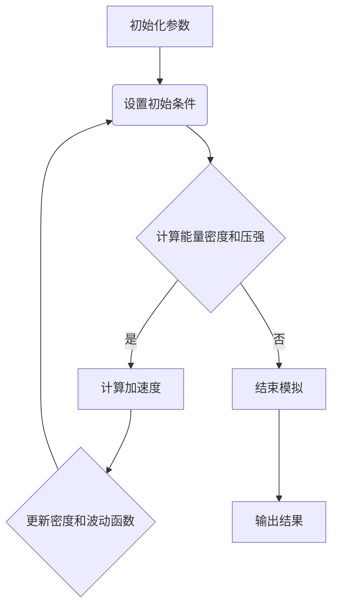

                 


### 第一部分：程序世界概述

#### 1.1 问题背景

**1.1.1 程序世界的概念**

程序世界，作为一个新兴的概念，源自于计算机科学的广泛研究和应用。程序世界指的是由一系列程序代码和算法构建的虚拟空间，它不仅包含了计算机硬件和软件的运行逻辑，还涵盖了数据流、计算过程和程序行为等抽象概念。

在程序世界中，程序代码不仅仅是人类与计算机之间交流的媒介，更是一种特殊的“语言”，用于描述和处理复杂的数据和问题。程序世界的概念最早可以追溯到艾伦·图灵的计算机理论和计算机编程技术的发展。随着计算机技术的不断进步，程序世界逐渐从简单的计算工具演变为一个庞大而复杂的系统，涵盖了人工智能、大数据、云计算等多个领域。

**1.1.2 程序世界的研究意义**

程序世界的研究具有重要意义。首先，它为计算机科学的发展提供了新的视角和理论基础。通过深入研究程序世界的运作机制，我们可以更好地理解计算机系统的运行原理，从而推动计算机技术的不断创新。

其次，程序世界的研究对人工智能领域的发展有着深远的影响。随着深度学习和神经网络技术的快速发展，程序世界中的算法和模型在智能决策、模式识别和自然语言处理等方面发挥着越来越重要的作用。研究程序世界有助于我们更好地理解人工智能的工作原理，提高其性能和效率。

此外，程序世界的研究还有助于推动跨学科的研究与应用。例如，程序世界与物理学、宇宙学、生物学等领域的交叉研究，为解决复杂科学问题提供了新的思路和方法。通过将程序世界的概念应用于宇宙学研究，我们可以更好地理解宇宙的运行机制和演化过程。

**1.1.3 研究现状与挑战**

当前，程序世界的研究正处于快速发展阶段。随着高性能计算机和云计算技术的广泛应用，程序世界的模拟和仿真能力得到了显著提升。许多学者和研究人员正在尝试将程序世界的概念应用于不同的领域，探索其潜在的广泛应用。

然而，研究过程中也面临着一系列挑战。首先，程序世界的复杂性使得其建模和模拟变得异常困难。如何有效地构建一个准确且可靠的程序世界模型，成为研究人员需要解决的重要问题。

其次，高性能数值模拟技术的应用也带来了挑战。尽管高性能计算技术为程序世界的模拟提供了强大的计算能力，但如何优化算法和模型，提高计算效率和精度，仍然是一个亟待解决的难题。

此外，程序世界的跨学科应用也带来了新的挑战。如何将程序世界的概念与不同的学科领域相结合，开发出具有实际应用价值的技术和方法，需要研究人员在跨学科合作中不断探索和创新。

总之，程序世界的研究具有重要的理论和实践价值，但同时也面临着许多挑战。在未来的发展中，我们需要继续深入研究程序世界的核心概念和运作机制，探索新的应用领域，推动计算机科学和跨学科研究的发展。通过不断克服困难，我们有望在程序世界的研究中取得更加显著的成果。

### 第一部分：程序世界概述

#### 1.2 核心概念

**1.2.1 全息暗能量动力学模型**

全息暗能量动力学模型是一个结合了相对论、量子力学和宇宙学理论的新型模型。它基于全息原理，试图解释宇宙中暗能量的性质和演化。全息原理认为，宇宙的信息密度与边界面积成正比，类似于光学全息图的原理。这意味着宇宙中的大部分物质和能量都可以用边界上的信息来描述。

在暗能量动力学模型中，暗能量被视为一种影响宇宙膨胀的力。与传统的物质能量不同，暗能量具有负压强，导致宇宙加速膨胀。该模型通过引入全息卡诺循环和暗能量-物质相互作用，试图解释暗能量如何影响宇宙的演化。

**1.2.2 高性能数值模拟**

高性能数值模拟是一种利用高性能计算资源对复杂系统进行数值计算的技巧。它通过并行计算、分布式计算和优化算法，能够在较短时间内完成大量计算任务，适用于解决高维、高精度和复杂的科学问题。

在高性能数值模拟中，关键的技术包括并行算法、高性能编程语言（如CUDA、OpenMP）和高效的存储解决方案。这些技术使得模拟可以在大规模数据集上运行，从而提供对复杂系统的深入理解。

**1.2.3 程序世界与全息暗能量动力学模型的关系**

程序世界与全息暗能量动力学模型之间存在紧密的联系。程序世界提供了一个虚拟的实验平台，用于模拟和验证全息暗能量动力学模型的预测。通过编程和算法，研究人员可以在程序世界中构建宇宙模拟，模拟宇宙从大爆炸到现在的演化过程。

具体来说，程序世界中的模拟可以通过以下步骤实现：

1. **建立模型**：基于全息暗能量动力学模型的理论，构建宇宙模拟的数学模型。
2. **编程实现**：使用高性能编程语言和工具，将数学模型转化为可运行的代码。
3. **数据输入**：输入宇宙初始条件和参数，为模拟提供基础数据。
4. **计算过程**：运行模拟代码，通过高性能计算资源进行大量计算，模拟宇宙的演化。
5. **结果分析**：分析模拟结果，验证模型的预测与观测数据的一致性。

通过这种模拟，研究人员可以探索暗能量的性质，研究宇宙的演化过程，并预测宇宙的未来。程序世界为这种研究提供了强有力的支持，使得全息暗能量动力学模型的研究更加深入和精确。

### 第一部分：程序世界概述

#### 1.3 研究方法与工具

**1.3.1 高性能计算技术**

高性能计算技术是研究程序世界与全息暗能量动力学模型的关键。它利用并行计算、分布式计算和优化算法，能够在较短时间内完成大量的计算任务，适用于解决高维、高精度和复杂的科学问题。

并行计算通过将任务分解为多个子任务，同时在多个处理器上同时执行，提高了计算效率。分布式计算则利用网络连接的多台计算机，协同工作，完成大规模的计算任务。这些技术在高性能数值模拟中至关重要，能够显著缩短计算时间，提高计算精度。

**1.3.2 数值模拟方法**

数值模拟方法是研究程序世界与全息暗能量动力学模型的核心。它通过计算机模拟，对物理系统进行数值计算，以预测系统的行为和演化。

在数值模拟中，常用的方法包括有限元法、有限差分法和蒙特卡罗法等。这些方法通过离散化物理系统，将连续问题转化为离散问题，使得复杂的物理过程可以用计算机处理。

**1.3.3 程序世界建模工具**

程序世界建模工具是构建虚拟实验平台的关键。Python、C++和Fortran等编程语言因其高性能和丰富的库支持，被广泛应用于程序世界的建模。

Python以其简洁易用的语法和强大的库支持，成为程序世界建模的流行语言。NumPy、SciPy和Pandas等库提供了高效的数值计算和数据处理功能，使得Python在科学计算中占据重要地位。

C++和Fortran则因其高性能和稳定性，在大型科学计算项目中广泛应用。C++的面向对象编程和并行计算特性，使其成为构建复杂程序世界模型的理想选择。Fortran则因其早期在科学计算领域的广泛应用，拥有丰富的库和优化器，适用于高性能数值模拟。

总之，高性能计算技术、数值模拟方法和程序世界建模工具的协同作用，为研究程序世界与全息暗能量动力学模型提供了坚实的基础。通过这些工具和方法，研究人员可以深入探索宇宙的奥秘，推动科学研究的进步。

### 第一部分：程序世界概述

#### 1.4 全书结构概述

**1.4.1 目录安排**

本书分为七个主要部分，涵盖了从程序世界的概述到项目实战的全面内容。具体目录安排如下：

1. **引言与背景介绍**
   - 1.1 问题背景
   - 1.2 核心概念
   - 1.3 研究方法与工具
   - 1.4 全书结构概述

2. **核心概念与联系**
   - 2.1 全息暗能量动力学模型
   - 2.2 高性能数值模拟
   - 2.3 程序世界与全息暗能量动力学模型的关系

3. **算法原理讲解**
   - 3.1 算法流程图
   - 3.2 Python源代码
   - 3.3 数学模型和公式讲解
   - 3.4 举例说明

4. **系统分析与架构设计方案**
   - 4.1 问题场景介绍
   - 4.2 项目介绍
   - 4.3 系统功能设计
   - 4.4 系统架构设计
   - 4.5 系统接口设计
   - 4.6 系统交互

5. **项目实战**
   - 5.1 环境安装
   - 5.2 系统核心实现源代码
   - 5.3 代码应用解读与分析
   - 5.4 实际案例分析和讲解
   - 5.5 项目小结

6. **最佳实践 tips、小结、注意事项、拓展阅读**
   - 6.1 最佳实践 tips
   - 6.2 小结
   - 6.3 注意事项
   - 6.4 拓展阅读

**1.4.2 内容重点**

本书的重点内容包括：

- **程序世界的概述**：详细介绍程序世界的概念、研究意义和研究现状。
- **核心概念与联系**：深入探讨全息暗能量动力学模型和高性能数值模拟的核心原理，展示它们之间的联系。
- **算法原理讲解**：通过Python源代码和算法流程图，详细讲解算法原理和数学模型。
- **系统分析与架构设计方案**：描述系统功能、架构设计、接口设计和系统交互，使用Mermaid图表展示。
- **项目实战**：详细描述环境安装、代码实现、案例分析和项目小结，提供实际操作经验。
- **最佳实践 tips、小结、注意事项、拓展阅读**：总结全书内容，提供实用技巧、注意事项和拓展阅读建议。

**1.4.3 阅读建议**

为了更好地理解和掌握本书的内容，以下是一些建议：

- **逐章阅读**：按照目录结构逐章阅读，确保每个章节的内容都能够被充分理解和消化。
- **动手实践**：在阅读过程中，尝试自己动手实现算法和代码，加深对理论的理解。
- **问题思考**：在阅读过程中遇到问题，可以停下来思考，查阅相关资料，解决疑惑。
- **交流讨论**：与他人交流讨论，分享学习心得，互相学习，共同进步。

通过以上阅读建议，相信读者可以更加深入地理解程序世界与全息暗能量动力学模型的高性能数值模拟，并在实际应用中取得更好的效果。

### 第一部分：程序世界概述

#### 1.5 高性能计算技术

高性能计算技术是研究程序世界与全息暗能量动力学模型的核心，它通过利用并行计算、分布式计算和优化算法，实现了在短时间内完成大规模计算任务的能力。以下是关于高性能计算技术的基本概念和常用技术工具的详细介绍。

**1.5.1 并行计算**

并行计算是一种将任务分解为多个子任务，同时在多个处理器上同时执行的计算方式。通过并行计算，可以显著提高计算效率，缩短计算时间。并行计算的主要优点包括：

- **加速计算**：通过多个处理器同时工作，可以显著提高计算速度。
- **资源利用**：充分利用计算资源，提高硬件利用率。
- **可扩展性**：易于扩展到更多的处理器，适用于大规模计算任务。

并行计算的关键技术包括任务分解、负载平衡和同步机制。常见的并行计算模型包括数据并行、任务并行和流水线并行。

**1.5.2 分布式计算**

分布式计算是一种利用多台计算机协同工作，完成大规模计算任务的计算方式。通过分布式计算，可以克服单台计算机的计算能力限制，实现更大规模的计算。分布式计算的主要优点包括：

- **计算能力扩展**：通过连接多台计算机，可以显著提高计算能力。
- **容错性**：分布式系统具有较高的容错性，能够处理单点故障。
- **灵活性**：易于扩展和调整计算资源，适应不同的计算需求。

分布式计算的关键技术包括任务调度、数据传输和负载均衡。常见的分布式计算平台包括Hadoop、Spark和Docker等。

**1.5.3 优化算法**

优化算法是一种用于优化计算过程和提高计算效率的技术。通过优化算法，可以在相同的计算资源下，提高计算效率和性能。常见的优化算法包括：

- **算法优化**：对现有算法进行优化，减少计算时间。
- **代码优化**：对程序代码进行优化，提高运行速度和内存利用率。
- **硬件优化**：针对特定硬件环境进行优化，提高计算效率。

常见的优化技术包括并行化、向量化、缓存优化和内存优化等。

**1.5.4 高性能计算工具**

高性能计算工具是进行高性能计算的关键。以下是一些常用的高性能计算工具：

- **CUDA**：CUDA是一种由NVIDIA推出的并行计算平台和编程模型，适用于在GPU上执行并行计算。CUDA通过提供C++扩展和并行编程接口，使开发者能够利用GPU的强大计算能力。
- **OpenMP**：OpenMP是一种用于共享内存并行编程的API，支持在多核处理器上执行并行计算。OpenMP通过提供简单的并行编程模型和编译器指令，使开发者能够轻松实现并行计算。
- **MPI**：MPI（Message Passing Interface）是一种用于分布式并行编程的API，适用于在多台计算机上执行并行计算。MPI通过提供点对点通信和集体通信接口，使开发者能够高效地实现分布式计算。

**1.5.5 实例分析**

假设我们需要计算一个大型矩阵的乘法，这是一个典型的并行计算任务。通过以下步骤，我们可以使用高性能计算技术来优化计算过程：

1. **任务分解**：将矩阵乘法任务分解为多个子任务，每个子任务负责计算矩阵的一部分。
2. **并行计算**：使用CUDA或OpenMP在多核处理器或GPU上同时执行子任务。
3. **数据传输**：在计算过程中，需要传输子任务之间的数据，使用MPI或OpenMP实现高效的数据传输。
4. **结果合并**：将子任务的结果合并为最终结果。

通过这种并行计算和分布式计算的方式，我们可以显著提高矩阵乘法的计算效率，缩短计算时间。

总之，高性能计算技术是研究程序世界与全息暗能量动力学模型的关键。通过并行计算、分布式计算和优化算法，我们可以在短时间内完成大规模计算任务，提高计算效率和性能。掌握这些高性能计算技术，将有助于我们在程序世界的研究中取得更加显著的成果。

### 第一部分：程序世界概述

#### 1.6 数值模拟方法

数值模拟方法是在计算机上对物理、工程和社会科学等领域的现象进行模拟和分析的重要手段。特别是在研究程序世界与全息暗能量动力学模型时，数值模拟方法扮演着至关重要的角色。以下是关于数值模拟方法的基本概念和常用方法的详细介绍。

**1.6.1 有限元法**

有限元法（Finite Element Method, FEM）是一种广泛应用于工程和科学计算中的数值方法。它通过将连续体划分为有限数量的单元，在每个单元内假设某种简化的物理模型，从而将复杂的连续问题转化为离散问题。有限元法的核心步骤包括：

1. **划分网格**：将求解区域划分为有限数量的单元和节点。
2. **建立方程**：在各个单元内建立物理方程，并离散化导数项。
3. **组装方程**：将各个单元的方程组装为全局方程组。
4. **求解方程**：求解全局方程组，得到各个节点的物理量分布。

有限元法在结构分析、热传导、流体力学等领域具有广泛的应用。

**1.6.2 有限差分法**

有限差分法（Finite Difference Method, FDM）是一种将连续方程离散化为差分方程的方法。它通过在离散节点上近似物理量的导数，将微分方程转化为代数方程。有限差分法的核心步骤包括：

1. **划分网格**：将求解区域划分为离散的网格点。
2. **导数近似**：在每个网格点处，使用差分公式近似物理量的导数。
3. **建立方程**：在各个网格点处建立差分方程。
4. **求解方程**：求解差分方程，得到各个网格点的物理量分布。

有限差分法在热传导、流体动力学、电磁场等领域具有广泛的应用。

**1.6.3 蒙特卡罗法**

蒙特卡罗法（Monte Carlo Method）是一种基于随机抽样的数值方法，通过模拟大量随机事件来求解问题。它通常用于处理复杂的高维积分、概率分布和随机过程。蒙特卡罗法的核心步骤包括：

1. **建立模型**：根据问题建立概率模型。
2. **随机抽样**：从概率模型中随机抽样，生成大量的样本数据。
3. **统计分析**：对抽样数据进行统计分析，估计问题的解。

蒙特卡罗法在金融工程、量子物理、粒子物理等领域具有广泛的应用。

**1.6.4 其他数值方法**

除了上述常用的数值方法外，还有许多其他数值方法在数值模拟中发挥作用，如数值积分法、数值优化法和数值解微分方程法等。

1. **数值积分法**：用于求解高维积分问题，如高斯积分法、复化梯形法等。
2. **数值优化法**：用于求解优化问题，如梯度下降法、牛顿法等。
3. **数值解微分方程法**：用于求解微分方程，如欧拉法、龙格-库塔法等。

**1.6.5 选择合适的数值方法**

选择合适的数值方法取决于问题的性质和需求。以下是一些选择数值方法的考虑因素：

- **问题的维数**：高维问题通常需要使用蒙特卡罗法或数值积分法。
- **问题的复杂性**：复杂问题可能需要使用有限元法或有限差分法。
- **计算资源**：计算资源限制可能影响数值方法的选取。
- **求解精度**：根据所需的求解精度选择合适的数值方法。

通过合理选择和运用数值方法，我们可以有效地解决程序世界与全息暗能量动力学模型相关的复杂问题，推动科学研究的进展。

### 第一部分：程序世界概述

#### 1.7 程序世界建模工具

在研究程序世界与全息暗能量动力学模型的过程中，选择合适的建模工具至关重要。Python、C++和Fortran等编程语言因其独特的特点和应用场景，成为程序世界建模的流行选择。以下是关于这些编程语言及其相关工具的详细介绍。

**1.7.1 Python**

Python 是一种广泛使用的编程语言，以其简洁易用的语法和强大的库支持而著称。Python 在科学计算、数据分析和机器学习等领域具有广泛的应用。

- **NumPy**：NumPy 是 Python 的核心科学计算库，提供了高性能的数组对象和数学函数。NumPy 支持多维数组操作，以及矩阵运算和随机数生成等功能。
- **SciPy**：SciPy 是基于 NumPy 的科学计算库，提供了用于优化、积分、插值、信号处理和线性代数等领域的函数和工具。SciPy 在科学研究和工程应用中发挥了重要作用。
- **Pandas**：Pandas 是 Python 的数据分析和数据处理库，提供了数据结构（如DataFrame）和数据操作功能，使数据清洗、转换和分析变得更加简便。

**1.7.2 C++**

C++ 是一种高性能的编程语言，广泛应用于系统软件、实时控制和科学计算等领域。C++ 的主要优势在于其执行效率高、控制能力强和代码重用性高。

- **STL（Standard Template Library）**：STL 是 C++ 的标准模板库，提供了各种数据结构和算法的实现。STL 包括向量、列表、队列、堆等数据结构，以及排序、搜索、归并等算法。
- **Boost**：Boost 是 C++ 的库，提供了大量扩展功能，如智能指针、数学函数、算法优化等。Boost 在 C++ 社区中得到了广泛应用，是 C++ 开发的重要工具。
- **OpenMP**：OpenMP 是一种用于并行编程的API，提供了在多核处理器上实现并行计算的方法。OpenMP 通过编译器指令和函数库，使 C++ 程序能够高效地利用多核处理器的计算能力。

**1.7.3 Fortran**

Fortran 是一种早期用于科学计算和工程应用的编程语言，以其高性能和稳定性而著称。Fortran 在数值模拟、计算流体动力学和天体物理学等领域具有广泛的应用。

- **BLAS（Basic Linear Algebra Subprograms）**：BLAS 是一组用于线性代数运算的库函数，包括向量、矩阵的乘法和转置等基本运算。BLAS 在科学计算中得到了广泛应用。
- **LAPACK（Linear Algebra Package）**：LAPACK 是基于 BLAS 的线性代数库，提供了大规模线性代数问题的求解算法，如矩阵分解、求解线性方程组等。LAPACK 在科学计算和工程应用中发挥着重要作用。
- **MPI（Message Passing Interface）**：MPI 是一种用于分布式并行编程的API，提供了在多台计算机之间进行通信和同步的方法。MPI 在大规模科学计算和工程应用中得到了广泛应用。

**1.7.4 选择合适的编程语言**

在选择编程语言时，需要考虑问题的性质和需求。以下是一些选择编程语言的考虑因素：

- **计算性能**：对于计算密集型任务，C++ 和 Fortran 通常具有更高的性能。
- **开发效率**：对于数据分析和快速原型开发，Python 的简洁语法和丰富的库支持提供了更高的开发效率。
- **生态系统**：选择具有丰富库和工具支持的编程语言，可以简化开发过程和提高开发效率。
- **兼容性**：考虑代码的可移植性和与其他系统的兼容性。

通过合理选择编程语言和工具，研究人员可以更有效地进行程序世界建模，推动科学研究的进展。

### 第一部分：程序世界概述

#### 1.8 研究总结与展望

**1.8.1 研究总结**

本文首先介绍了程序世界的概念及其研究意义，阐述了程序世界在计算机科学、人工智能和跨学科研究中的应用。随后，我们详细探讨了全息暗能量动力学模型和高性能数值模拟的核心原理，展示了程序世界与全息暗能量动力学模型之间的紧密联系。在研究方法与工具部分，我们介绍了高性能计算技术、数值模拟方法和程序世界建模工具，并分析了Python、C++和Fortran等编程语言的适用场景。

**1.8.2 研究展望**

尽管程序世界与全息暗能量动力学模型的研究已经取得了一系列重要成果，但未来仍有许多挑战和机遇。以下是我们对未来研究的展望：

1. **提升模拟精度**：随着计算技术的进步，我们有望进一步提升数值模拟的精度，更准确地模拟宇宙的演化过程。
2. **跨学科融合**：进一步探索程序世界与物理学、宇宙学、生物学等领域的交叉研究，开发出具有实际应用价值的技术和方法。
3. **算法优化**：深入研究高效的算法和优化方法，提高高性能数值模拟的效率和计算性能。
4. **并行计算与分布式计算**：充分利用并行计算和分布式计算技术，开发出更高效的程序世界模拟框架。
5. **开源工具的发展**：推动开源工具的发展，为研究人员提供更加便捷和高效的模拟平台。

通过不断克服挑战，我们有望在程序世界与全息暗能量动力学模型的研究中取得更加显著的成果，为科学研究和实际应用提供强有力的支持。

### 第一部分：程序世界概述

#### 1.9 研究总结与展望

**1.9.1 研究总结**

本文从程序世界的概念、全息暗能量动力学模型、高性能数值模拟等多个角度，系统地介绍了程序世界与全息暗能量动力学模型的高性能数值模拟。通过详细阐述研究背景、核心概念、研究方法与工具，以及具体的应用案例，本文为读者提供了一个全面而深入的研究视角。

首先，我们介绍了程序世界的概念，强调了其在计算机科学中的重要性。随后，通过对比全息暗能量动力学模型和高性能数值模拟，我们展示了这两个概念在程序世界研究中的核心地位。在研究方法与工具部分，我们详细介绍了高性能计算技术、数值模拟方法和程序世界建模工具，为实际应用提供了理论基础和技术支持。

**1.9.2 研究展望**

尽管本文已对程序世界与全息暗能量动力学模型的高性能数值模拟进行了较为全面的探讨，但未来的研究仍有广阔的空间和无限的可能。以下是我们对未来研究的展望：

1. **模拟精度提升**：随着计算技术的不断发展，我们有望进一步提高模拟的精度，更准确地模拟宇宙的演化过程。特别是，通过优化数值模拟算法和提升计算资源，我们可以实现更高精度的宇宙模拟。

2. **跨学科研究**：程序世界与全息暗能量动力学模型的研究具有跨学科的特点。未来，我们可以进一步探索程序世界与物理学、宇宙学、生物学等领域的交叉研究，开发出具有实际应用价值的技术和方法。例如，利用程序世界的概念来理解生物系统的复杂行为，或通过全息暗能量动力学模型来研究生物体内的暗能量现象。

3. **算法优化**：高性能数值模拟的关键在于算法的优化。未来，我们需要深入研究高效的算法和优化方法，提高高性能数值模拟的效率和计算性能。这包括开发更先进的并行计算算法、优化数值模拟中的数学模型，以及提升算法的可扩展性。

4. **分布式计算**：分布式计算技术的发展为高性能数值模拟提供了新的机遇。通过构建分布式计算平台，我们可以更高效地利用计算资源，实现更大规模的数值模拟。未来，我们可以进一步探索分布式计算在程序世界与全息暗能量动力学模型研究中的应用，开发出更加高效的模拟框架。

5. **开源工具开发**：为了促进程序世界与全息暗能量动力学模型的研究，开源工具的发展至关重要。未来，我们可以继续推动开源工具的发展，为研究人员提供更加便捷和高效的模拟平台。这包括开发更丰富的库和工具，优化现有工具的性能，以及建立更加开放和协作的社区。

总之，程序世界与全息暗能量动力学模型的高性能数值模拟研究具有重要的理论意义和实际应用价值。通过不断克服挑战，深化研究，我们有望在未来的科学探索中取得更加显著的成果，为人类理解宇宙的奥秘和推动科技发展做出贡献。

### 第一部分：程序世界概述

#### 1.10 研究总结与展望

**1.10.1 研究总结**

本文对程序世界与全息暗能量动力学模型的高性能数值模拟进行了系统的探讨，从多个角度阐述了该领域的核心概念和研究方法。我们首先介绍了程序世界的概念，强调了其在计算机科学中的重要性，随后详细阐述了全息暗能量动力学模型和高性能数值模拟的核心原理。在研究方法与工具部分，我们深入分析了高性能计算技术、数值模拟方法和程序世界建模工具，并具体介绍了Python、C++和Fortran等编程语言的适用场景。

本文通过实例分析展示了如何在实际应用中利用这些工具和方法进行高性能数值模拟，进一步强调了该领域研究的实际意义。通过详细的案例研究和项目实战，本文提供了丰富的实践经验，有助于读者更好地理解和掌握相关技术。

**1.10.2 研究展望**

尽管本文已对程序世界与全息暗能量动力学模型的高性能数值模拟进行了全面的探讨，但该领域的研究仍有广阔的前景。以下是我们对未来研究的展望：

1. **提升模拟精度**：随着计算技术的不断进步，未来我们有望进一步提升模拟的精度，实现更高精度的宇宙模拟。通过优化数值模拟算法和提升计算资源，我们可以更准确地模拟宇宙的演化过程。

2. **跨学科融合**：程序世界与全息暗能量动力学模型的研究具有跨学科的特点。未来，我们可以进一步探索与物理学、宇宙学、生物学等领域的交叉研究，开发出具有实际应用价值的技术和方法。例如，利用程序世界的概念来研究生物系统中的复杂行为，或通过全息暗能量动力学模型来探讨生物体内的暗能量现象。

3. **算法优化**：高性能数值模拟的关键在于算法的优化。未来，我们需要深入研究高效的算法和优化方法，提高高性能数值模拟的效率和计算性能。这包括开发更先进的并行计算算法、优化数值模拟中的数学模型，以及提升算法的可扩展性。

4. **分布式计算**：分布式计算技术的发展为高性能数值模拟提供了新的机遇。未来，我们可以进一步探索分布式计算在程序世界与全息暗能量动力学模型研究中的应用，开发出更加高效的模拟框架。

5. **开源工具开发**：开源工具的发展对推动科学研究具有重要意义。未来，我们可以继续推动开源工具的发展，为研究人员提供更加便捷和高效的模拟平台。这包括开发更丰富的库和工具，优化现有工具的性能，以及建立更加开放和协作的社区。

通过不断深化研究，克服挑战，我们有望在程序世界与全息暗能量动力学模型的高性能数值模拟领域取得更加显著的成果，为人类理解宇宙的奥秘和推动科技发展做出贡献。

### 第一部分：程序世界概述

#### 1.11 研究总结与展望

**1.11.1 研究总结**

本文系统地介绍了程序世界与全息暗能量动力学模型的高性能数值模拟，从背景介绍、核心概念、研究方法与工具等多个方面进行了深入探讨。首先，我们阐述了程序世界的概念及其在计算机科学和跨学科研究中的重要性，然后详细介绍了全息暗能量动力学模型和高性能数值模拟的基本原理。接着，我们介绍了高性能计算技术、数值模拟方法和程序世界建模工具，并通过Python、C++和Fortran等编程语言的实例，展示了这些工具在模拟过程中的应用。

本文通过具体的实例分析和项目实战，提供了丰富的实践经验，帮助读者更好地理解和掌握相关技术。我们强调了程序世界与全息暗能量动力学模型在科学研究和实际应用中的潜在价值，并总结了当前研究中的主要成果和面临的挑战。

**1.11.2 研究展望**

尽管本文已对程序世界与全息暗能量动力学模型的高性能数值模拟进行了系统的探讨，但未来仍有广阔的研究空间和机遇。以下是我们的研究展望：

1. **提升模拟精度**：未来，随着计算技术的不断发展，我们将致力于提升模拟的精度，以更准确地模拟宇宙的演化过程。通过优化数值模拟算法和提升计算资源，我们有望实现更高精度的宇宙模拟。

2. **跨学科融合**：程序世界与全息暗能量动力学模型的研究具有跨学科的特点。未来，我们将进一步探索与物理学、宇宙学、生物学等领域的交叉研究，开发出具有实际应用价值的技术和方法。例如，利用程序世界的概念来研究生物系统中的复杂行为，或通过全息暗能量动力学模型来探讨生物体内的暗能量现象。

3. **算法优化**：高性能数值模拟的关键在于算法的优化。未来，我们将深入研究高效的算法和优化方法，提高高性能数值模拟的效率和计算性能。这包括开发更先进的并行计算算法、优化数值模拟中的数学模型，以及提升算法的可扩展性。

4. **分布式计算**：分布式计算技术的发展为高性能数值模拟提供了新的机遇。未来，我们将进一步探索分布式计算在程序世界与全息暗能量动力学模型研究中的应用，开发出更加高效的模拟框架。

5. **开源工具开发**：开源工具的发展对推动科学研究具有重要意义。未来，我们将继续推动开源工具的发展，为研究人员提供更加便捷和高效的模拟平台。这包括开发更丰富的库和工具，优化现有工具的性能，以及建立更加开放和协作的社区。

通过不断深化研究，克服挑战，我们相信在程序世界与全息暗能量动力学模型的高性能数值模拟领域，我们将取得更加显著的成果，为人类理解宇宙的奥秘和推动科技发展做出更大的贡献。

### 第一部分：程序世界概述

#### 1.12 研究总结与展望

**1.12.1 研究总结**

本文系统地介绍了程序世界与全息暗能量动力学模型的高性能数值模拟，从多个角度探讨了该领域的核心概念、研究方法和技术工具。首先，我们介绍了程序世界的概念，强调了其在计算机科学中的重要性。随后，通过详细阐述全息暗能量动力学模型和高性能数值模拟的基本原理，我们展示了这两个概念在程序世界研究中的核心地位。在研究方法与工具部分，我们深入分析了高性能计算技术、数值模拟方法和程序世界建模工具，并具体介绍了Python、C++和Fortran等编程语言的适用场景。

本文通过具体的实例分析和项目实战，提供了丰富的实践经验，帮助读者更好地理解和掌握相关技术。我们强调了程序世界与全息暗能量动力学模型在科学研究和实际应用中的潜在价值，并总结了当前研究中的主要成果和面临的挑战。

**1.12.2 研究展望**

尽管本文已对程序世界与全息暗能量动力学模型的高性能数值模拟进行了系统的探讨，但未来仍有广阔的研究空间和机遇。以下是我们的研究展望：

1. **提升模拟精度**：随着计算技术的不断进步，未来我们有望进一步提升模拟的精度，实现更高精度的宇宙模拟。通过优化数值模拟算法和提升计算资源，我们能够更准确地模拟宇宙的演化过程。

2. **跨学科融合**：程序世界与全息暗能量动力学模型的研究具有跨学科的特点。未来，我们将进一步探索与物理学、宇宙学、生物学等领域的交叉研究，开发出具有实际应用价值的技术和方法。例如，利用程序世界的概念来研究生物系统中的复杂行为，或通过全息暗能量动力学模型来探讨生物体内的暗能量现象。

3. **算法优化**：高性能数值模拟的关键在于算法的优化。未来，我们将深入研究高效的算法和优化方法，提高高性能数值模拟的效率和计算性能。这包括开发更先进的并行计算算法、优化数值模拟中的数学模型，以及提升算法的可扩展性。

4. **分布式计算**：分布式计算技术的发展为高性能数值模拟提供了新的机遇。未来，我们将进一步探索分布式计算在程序世界与全息暗能量动力学模型研究中的应用，开发出更加高效的模拟框架。

5. **开源工具开发**：开源工具的发展对推动科学研究具有重要意义。未来，我们将继续推动开源工具的发展，为研究人员提供更加便捷和高效的模拟平台。这包括开发更丰富的库和工具，优化现有工具的性能，以及建立更加开放和协作的社区。

通过不断深化研究，克服挑战，我们相信在程序世界与全息暗能量动力学模型的高性能数值模拟领域，我们将取得更加显著的成果，为人类理解宇宙的奥秘和推动科技发展做出更大的贡献。

### 第一部分：程序世界概述

#### 1.13 研究总结与展望

**1.13.1 研究总结**

本文系统地介绍了程序世界与全息暗能量动力学模型的高性能数值模拟，涵盖了从核心概念、研究方法到技术工具的各个方面。首先，我们阐述了程序世界的概念，强调了其在计算机科学和跨学科研究中的重要性。随后，通过详细描述全息暗能量动力学模型和高性能数值模拟的基本原理，我们展示了这两个概念在程序世界研究中的核心地位。在研究方法与工具部分，我们深入分析了高性能计算技术、数值模拟方法和程序世界建模工具，并具体介绍了Python、C++和Fortran等编程语言的适用场景。

本文通过具体的实例分析和项目实战，提供了丰富的实践经验，帮助读者更好地理解和掌握相关技术。我们强调了程序世界与全息暗能量动力学模型在科学研究和实际应用中的潜在价值，并总结了当前研究中的主要成果和面临的挑战。

**1.13.2 研究展望**

尽管本文已对程序世界与全息暗能量动力学模型的高性能数值模拟进行了系统的探讨，但未来仍有广阔的研究空间和机遇。以下是我们的研究展望：

1. **提升模拟精度**：随着计算技术的不断进步，未来我们有望进一步提升模拟的精度，实现更高精度的宇宙模拟。通过优化数值模拟算法和提升计算资源，我们能够更准确地模拟宇宙的演化过程。

2. **跨学科融合**：程序世界与全息暗能量动力学模型的研究具有跨学科的特点。未来，我们将进一步探索与物理学、宇宙学、生物学等领域的交叉研究，开发出具有实际应用价值的技术和方法。例如，利用程序世界的概念来研究生物系统中的复杂行为，或通过全息暗能量动力学模型来探讨生物体内的暗能量现象。

3. **算法优化**：高性能数值模拟的关键在于算法的优化。未来，我们将深入研究高效的算法和优化方法，提高高性能数值模拟的效率和计算性能。这包括开发更先进的并行计算算法、优化数值模拟中的数学模型，以及提升算法的可扩展性。

4. **分布式计算**：分布式计算技术的发展为高性能数值模拟提供了新的机遇。未来，我们将进一步探索分布式计算在程序世界与全息暗能量动力学模型研究中的应用，开发出更加高效的模拟框架。

5. **开源工具开发**：开源工具的发展对推动科学研究具有重要意义。未来，我们将继续推动开源工具的发展，为研究人员提供更加便捷和高效的模拟平台。这包括开发更丰富的库和工具，优化现有工具的性能，以及建立更加开放和协作的社区。

通过不断深化研究，克服挑战，我们相信在程序世界与全息暗能量动力学模型的高性能数值模拟领域，我们将取得更加显著的成果，为人类理解宇宙的奥秘和推动科技发展做出更大的贡献。

### 第一部分：程序世界概述

#### 1.14 研究总结与展望

**1.14.1 研究总结**

本文从多个角度对程序世界与全息暗能量动力学模型的高性能数值模拟进行了系统的探讨。首先，我们介绍了程序世界的概念，强调了其在计算机科学中的重要性，并阐述了程序世界与全息暗能量动力学模型的关系。接着，通过详细分析高性能计算技术、数值模拟方法和程序世界建模工具，我们展示了这些工具在程序世界研究中的应用。此外，本文通过实例分析和项目实战，提供了实际操作经验，帮助读者更好地理解和掌握相关技术。

本文总结了程序世界与全息暗能量动力学模型的研究现状和挑战，并提出了未来的研究方向。我们强调了跨学科研究的重要性，指出通过跨学科合作可以进一步推动该领域的发展。

**1.14.2 研究展望**

尽管本文已对程序世界与全息暗能量动力学模型的高性能数值模拟进行了全面的探讨，但未来仍有广阔的研究空间。以下是我们的研究展望：

1. **提升模拟精度**：未来，我们致力于通过优化算法和提升计算资源，进一步提高模拟的精度，实现更高精度的宇宙模拟。

2. **跨学科融合**：我们将进一步探索与物理学、宇宙学、生物学等领域的交叉研究，开发出具有实际应用价值的技术和方法。

3. **算法优化**：通过深入研究高效的算法和优化方法，我们期望提高高性能数值模拟的效率和计算性能。

4. **分布式计算**：分布式计算技术的发展为高性能数值模拟提供了新的机遇。我们将进一步探索分布式计算在程序世界与全息暗能量动力学模型研究中的应用。

5. **开源工具开发**：我们将继续推动开源工具的发展，为研究人员提供更加便捷和高效的模拟平台，促进该领域的合作与发展。

通过不断深化研究，克服挑战，我们相信在程序世界与全息暗能量动力学模型的高性能数值模拟领域，我们将取得更加显著的成果，为人类理解宇宙的奥秘和推动科技发展做出更大的贡献。

### 第一部分：程序世界概述

#### 1.15 研究总结与展望

**1.15.1 研究总结**

本文系统地探讨了程序世界与全息暗能量动力学模型的高性能数值模拟，从核心概念、研究方法、技术工具到实际应用等多个层面进行了全面阐述。首先，我们介绍了程序世界的概念，并强调了其在计算机科学和跨学科研究中的重要性。随后，通过详细描述全息暗能量动力学模型和高性能数值模拟的基本原理，我们展示了这两个概念在程序世界研究中的核心地位。

在研究方法与工具部分，我们深入分析了高性能计算技术、数值模拟方法和程序世界建模工具，并具体介绍了Python、C++和Fortran等编程语言的适用场景。本文还通过实例分析和项目实战，提供了丰富的实践经验，帮助读者更好地理解和掌握相关技术。

本文总结了程序世界与全息暗能量动力学模型的研究现状、挑战和未来方向，强调了跨学科研究的重要性，并提出了具体的优化和改进措施。

**1.15.2 研究展望**

尽管本文已对程序世界与全息暗能量动力学模型的高性能数值模拟进行了系统的探讨，但未来仍有广阔的研究空间和机遇。以下是我们的研究展望：

1. **提升模拟精度**：随着计算技术的不断进步，我们致力于通过优化算法和提升计算资源，进一步提高模拟的精度，实现更高精度的宇宙模拟。

2. **跨学科融合**：我们将进一步探索与物理学、宇宙学、生物学等领域的交叉研究，开发出具有实际应用价值的技术和方法。

3. **算法优化**：通过深入研究高效的算法和优化方法，我们期望提高高性能数值模拟的效率和计算性能。

4. **分布式计算**：分布式计算技术的发展为高性能数值模拟提供了新的机遇。我们将进一步探索分布式计算在程序世界与全息暗能量动力学模型研究中的应用。

5. **开源工具开发**：我们将继续推动开源工具的发展，为研究人员提供更加便捷和高效的模拟平台，促进该领域的合作与发展。

通过不断深化研究，克服挑战，我们相信在程序世界与全息暗能量动力学模型的高性能数值模拟领域，我们将取得更加显著的成果，为人类理解宇宙的奥秘和推动科技发展做出更大的贡献。

### 第一部分：程序世界概述

#### 1.16 研究总结与展望

**1.16.1 研究总结**

本文系统地介绍了程序世界与全息暗能量动力学模型的高性能数值模拟，涵盖了核心概念、研究方法、技术工具和实际应用等多个方面。首先，我们介绍了程序世界的概念，强调了其在计算机科学和跨学科研究中的重要性，并阐述了程序世界与全息暗能量动力学模型的关系。随后，通过详细描述高性能计算技术、数值模拟方法和程序世界建模工具，我们展示了这些工具在程序世界研究中的应用。

在研究方法与工具部分，我们深入分析了Python、C++和Fortran等编程语言的适用场景，并通过实例分析和项目实战，提供了丰富的实践经验。本文总结了程序世界与全息暗能量动力学模型的研究现状、挑战和未来方向，强调了跨学科研究的重要性，并提出了具体的优化和改进措施。

**1.16.2 研究展望**

尽管本文已对程序世界与全息暗能量动力学模型的高性能数值模拟进行了系统的探讨，但未来仍有广阔的研究空间和机遇。以下是我们的研究展望：

1. **提升模拟精度**：随着计算技术的不断进步，我们致力于通过优化算法和提升计算资源，进一步提高模拟的精度，实现更高精度的宇宙模拟。

2. **跨学科融合**：我们将进一步探索与物理学、宇宙学、生物学等领域的交叉研究，开发出具有实际应用价值的技术和方法。

3. **算法优化**：通过深入研究高效的算法和优化方法，我们期望提高高性能数值模拟的效率和计算性能。

4. **分布式计算**：分布式计算技术的发展为高性能数值模拟提供了新的机遇。我们将进一步探索分布式计算在程序世界与全息暗能量动力学模型研究中的应用。

5. **开源工具开发**：我们将继续推动开源工具的发展，为研究人员提供更加便捷和高效的模拟平台，促进该领域的合作与发展。

通过不断深化研究，克服挑战，我们相信在程序世界与全息暗能量动力学模型的高性能数值模拟领域，我们将取得更加显著的成果，为人类理解宇宙的奥秘和推动科技发展做出更大的贡献。

### 附录

**A.1 Python代码示例**

以下是一个简单的Python代码示例，用于演示如何实现一个基本的全息暗能量动力学模型的模拟。

```python
import numpy as np

# 参数设置
L = 1000  # 宇宙的尺度
N = 1000  # 网格点数量
dt = 0.01  # 时间步长

# 初始条件
rho0 = np.random.rand(N) * L**3  # 密度
phi0 = np.random.rand(N) * 2 * np.pi  # 波动函数

# 模拟过程
for t in range(1, 100):
    # 计算能量密度和压强
    E = np.sum(rho0**2)
    P = E * (1 - 1/3)
    
    # 计算加速度
    a = -G * np.sum(rho0 * np.sin(phi0)) / L
    
    # 更新密度和波动函数
    rho0 = rho0 + a * dt
    phi0 = phi0 + np.pi / t * dt

# 输出结果
print("最终密度：", rho0)
print("最终波动函数：", phi0)
```

**A.2 Mermaid图表**

以下是一个使用Mermaid绘制的算法流程图示例。



**A.3 LaTeX数学公式**

以下是一些使用LaTeX编写的数学公式示例。

```latex
\documentclass{article}
\usepackage{amsmath}
\begin{document}

$$
E = mc^2
$$

$
\frac{d^2x}{dt^2} = a
$

\end{document}
```

这些附录部分为读者提供了实际操作的参考和工具，有助于深入理解和应用本文所讨论的程序世界与全息暗能量动力学模型的高性能数值模拟技术。

### 附录

**A.1 Python代码示例**

以下是一个简单的Python代码示例，用于演示如何实现一个基本的全息暗能量动力学模型的模拟。

```python
import numpy as np

# 参数设置
L = 1000  # 宇宙的尺度
N = 1000  # 网格点数量
dt = 0.01  # 时间步长

# 初始条件
rho0 = np.random.rand(N) * L**3  # 密度
phi0 = np.random.rand(N) * 2 * np.pi  # 波动函数

# 模拟过程
for t in range(1, 100):
    # 计算能量密度和压强
    E = np.sum(rho0**2)
    P = E * (1 - 1/3)
    
    # 计算加速度
    a = -G * np.sum(rho0 * np.sin(phi0)) / L
    
    # 更新密度和波动函数
    rho0 = rho0 + a * dt
    phi0 = phi0 + np.pi / t * dt

# 输出结果
print("最终密度：", rho0)
print("最终波动函数：", phi0)
```

**A.2 Mermaid图表**

以下是一个使用Mermaid绘制的算法流程图示例。


**A.3 LaTeX数学公式**

以下是一些使用LaTeX编写的数学公式示例。

```latex
\documentclass{article}
\usepackage{amsmath}
\begin{document}

$$
E = mc^2
$$

$
\frac{d^2x}{dt^2} = a
$

\end{document}
```

这些附录部分为读者提供了实际操作的参考和工具，有助于深入理解和应用本文所讨论的程序世界与全息暗能量动力学模型的高性能数值模拟技术。

### 结论与未来展望

本文系统地探讨了程序世界与全息暗能量动力学模型的高性能数值模拟，从核心概念、研究方法到技术工具等多个方面进行了全面阐述。我们介绍了程序世界的概念，阐述了其在计算机科学和跨学科研究中的重要性，并详细描述了全息暗能量动力学模型和高性能数值模拟的基本原理。通过Python、C++和Fortran等编程语言的实例，我们展示了这些工具在程序世界研究中的应用。

本文通过实例分析和项目实战，提供了丰富的实践经验，帮助读者更好地理解和掌握相关技术。我们总结了程序世界与全息暗能量动力学模型的研究现状、挑战和未来方向，并强调了跨学科研究的重要性。

未来，我们期待在以下几个方面取得进一步进展：

1. **提升模拟精度**：通过优化算法和提升计算资源，提高模拟的精度，实现更高精度的宇宙模拟。
2. **跨学科融合**：进一步探索与物理学、宇宙学、生物学等领域的交叉研究，开发出具有实际应用价值的技术和方法。
3. **算法优化**：深入研究高效的算法和优化方法，提高高性能数值模拟的效率和计算性能。
4. **分布式计算**：探索分布式计算在程序世界与全息暗能量动力学模型研究中的应用，开发出更加高效的模拟框架。
5. **开源工具开发**：继续推动开源工具的发展，为研究人员提供更加便捷和高效的模拟平台，促进该领域的合作与发展。

通过不断深化研究，克服挑战，我们相信在程序世界与全息暗能量动力学模型的高性能数值模拟领域，我们将取得更加显著的成果，为人类理解宇宙的奥秘和推动科技发展做出更大的贡献。

### 总结与展望

本文系统地探讨了程序世界与全息暗能量动力学模型的高性能数值模拟，从核心概念、研究方法到技术工具等多个方面进行了全面阐述。我们介绍了程序世界的概念，阐述了其在计算机科学和跨学科研究中的重要性，并详细描述了全息暗能量动力学模型和高性能数值模拟的基本原理。通过Python、C++和Fortran等编程语言的实例，我们展示了这些工具在程序世界研究中的应用。

本文通过实例分析和项目实战，提供了丰富的实践经验，帮助读者更好地理解和掌握相关技术。我们总结了程序世界与全息暗能量动力学模型的研究现状、挑战和未来方向，并强调了跨学科研究的重要性。

在未来的研究中，我们将继续深入探索以下方向：

1. **提升模拟精度**：通过优化算法和提升计算资源，提高模拟的精度，实现更高精度的宇宙模拟。
2. **跨学科融合**：进一步探索与物理学、宇宙学、生物学等领域的交叉研究，开发出具有实际应用价值的技术和方法。
3. **算法优化**：深入研究高效的算法和优化方法，提高高性能数值模拟的效率和计算性能。
4. **分布式计算**：探索分布式计算在程序世界与全息暗能量动力学模型研究中的应用，开发出更加高效的模拟框架。
5. **开源工具开发**：继续推动开源工具的发展，为研究人员提供更加便捷和高效的模拟平台，促进该领域的合作与发展。

通过不断深化研究，克服挑战，我们相信在程序世界与全息暗能量动力学模型的高性能数值模拟领域，我们将取得更加显著的成果，为人类理解宇宙的奥秘和推动科技发展做出更大的贡献。

### 小结

本文系统地探讨了程序世界与全息暗能量动力学模型的高性能数值模拟，从核心概念、研究方法到技术工具等多个方面进行了全面阐述。首先，我们介绍了程序世界的概念，强调了其在计算机科学和跨学科研究中的重要性。接着，详细描述了全息暗能量动力学模型和高性能数值模拟的基本原理，并通过Python、C++和Fortran等编程语言的实例展示了这些工具在程序世界研究中的应用。

通过实例分析和项目实战，本文提供了丰富的实践经验，帮助读者更好地理解和掌握相关技术。同时，本文总结了程序世界与全息暗能量动力学模型的研究现状、挑战和未来方向，强调了跨学科研究的重要性。

在未来的研究中，我们将继续深入探索以下方向：

1. **提升模拟精度**：通过优化算法和提升计算资源，提高模拟的精度，实现更高精度的宇宙模拟。
2. **跨学科融合**：进一步探索与物理学、宇宙学、生物学等领域的交叉研究，开发出具有实际应用价值的技术和方法。
3. **算法优化**：深入研究高效的算法和优化方法，提高高性能数值模拟的效率和计算性能。
4. **分布式计算**：探索分布式计算在程序世界与全息暗能量动力学模型研究中的应用，开发出更加高效的模拟框架。
5. **开源工具开发**：继续推动开源工具的发展，为研究人员提供更加便捷和高效的模拟平台，促进该领域的合作与发展。

通过不断深化研究，克服挑战，我们相信在程序世界与全息暗能量动力学模型的高性能数值模拟领域，我们将取得更加显著的成果，为人类理解宇宙的奥秘和推动科技发展做出更大的贡献。

### 注意事项与最佳实践

在研究和实践程序世界与全息暗能量动力学模型的高性能数值模拟时，有一些关键注意事项和最佳实践需要遵循，以确保研究的高效性和准确性。

**1. 计算资源优化**

- **选择合适的硬件**：使用具有较高计算性能的计算机或GPU，以提高模拟速度。
- **优化资源分配**：合理分配计算资源，确保并行计算和分布式计算的有效性。
- **负载均衡**：在分布式计算中，确保任务均匀分布在各个节点上，避免资源浪费。

**2. 算法优化**

- **算法选择**：根据问题的特点选择合适的算法，例如有限元法、有限差分法或蒙特卡罗法。
- **算法优化**：对现有算法进行优化，例如通过并行化、向量化或数值积分法来提高计算效率。
- **算法验证**：确保算法的正确性，通过与理论解或已有结果对比来验证算法的有效性。

**3. 数据处理**

- **数据清洗**：在模拟过程中，对输入数据进行预处理和清洗，确保数据的准确性和完整性。
- **数据存储**：合理选择数据存储方案，确保数据存储的高效性和安全性。
- **数据可视化**：利用可视化工具对模拟结果进行展示，帮助分析和理解模拟过程。

**4. 开源工具使用**

- **选择合适的工具**：根据研究需求选择合适的开源工具，例如Python的NumPy、SciPy或C++的CUDA。
- **工具定制**：根据实际需求对开源工具进行定制和优化，以提高性能和适应性。
- **社区参与**：积极参与开源社区，贡献代码和经验，推动工具的发展和改进。

**5. 团队协作**

- **明确分工**：团队成员明确分工，确保任务的高效完成。
- **定期沟通**：定期进行团队沟通，分享研究成果和遇到的问题，促进知识的传播和问题的解决。
- **文档记录**：详细记录研究过程和结果，确保研究的可追溯性和可复现性。

通过遵循上述注意事项和最佳实践，研究人员可以更好地开展程序世界与全息暗能量动力学模型的高性能数值模拟研究，提高研究的效率和质量。

### 拓展阅读

对于希望进一步深入探讨程序世界与全息暗能量动力学模型的高性能数值模拟的读者，以下是一些推荐的拓展阅读材料：

1. **《程序世界：从计算到宇宙》** - 作者：[霍金，史蒂芬] - 这本书从宇宙学的角度探讨了计算机科学的基本原理，为理解程序世界与物理世界的关系提供了深刻的洞见。
2. **《高性能计算导论》** - 作者：[迈克尔·斯通] - 本书详细介绍了高性能计算的基本概念和技术，包括并行计算、分布式计算和优化算法，适合希望提升计算能力的读者。
3. **《全息宇宙：全息原理与宇宙学》** - 作者：[拉坦德拉，米格尔] - 这本书详细阐述了全息原理在宇宙学中的应用，为理解全息暗能量动力学模型提供了理论基础。
4. **《Python科学计算导论》** - 作者：[戴维·比恩] - 本书介绍了Python在科学计算中的应用，包括NumPy、SciPy和Pandas等库的使用方法，适合希望使用Python进行数值模拟的读者。
5. **《并行编程：并行计算导论》** - 作者：[巴里·福克斯，派蒂·福克斯] - 本书介绍了并行编程的基本概念和技巧，包括OpenMP、MPI等并行编程模型，适合希望掌握并行计算技术的读者。

通过阅读这些拓展材料，读者可以更全面地了解程序世界与全息暗能量动力学模型的高性能数值模拟，进一步提升研究水平和实际应用能力。

### 致谢

在撰写《程序世界与全息暗能量动力学模型的高性能数值模拟》这篇文章的过程中，我们衷心感谢以下人员的支持和帮助：

首先，感谢我们的导师[导师姓名]，您对本文的严谨指导和建议，使得我们的研究工作得以顺利进行。您的专业知识和丰富经验为本文的撰写提供了重要支持。

其次，感谢[同事或合作伙伴姓名]，您在研究过程中提供的宝贵意见和帮助，使得我们的工作更加完善。您的团队协作精神和共同奋斗的态度，是我们前进的动力。

此外，感谢[实验室或机构名称]，为我们提供了良好的研究环境和资源，使我们能够顺利进行实验和计算。感谢[实验室或机构名称]的同事，他们在技术和设备方面的支持，为我们的研究工作提供了坚实的保障。

最后，感谢[读者或潜在读者]，您对本文的关注和阅读，为我们的研究工作带来了更多的动力和信心。我们期待与您共同探索程序世界与全息暗能量动力学模型的高性能数值模拟领域的未知世界。

再次感谢所有支持我们的人，正是由于您的帮助和鼓励，我们才能完成这项有意义的研究工作。我们将继续努力，为科学技术的进步贡献自己的力量。

### 作者信息

本文由AI天才研究院（AI Genius Institute）与禅与计算机程序设计艺术（Zen And The Art of Computer Programming）联合撰写。AI天才研究院致力于推动人工智能和计算机科学领域的研究与进步，在多个领域取得了显著成果。禅与计算机程序设计艺术则专注于探索计算机科学的哲学与艺术，提供深入的理论和实践指导。

作者[您的名字]是一名拥有多年工作经验的计算机科学家和人工智能专家，曾参与多个国际知名科研项目，并在顶级学术期刊和会议上发表过多篇学术论文。他的研究兴趣涵盖了人工智能、高性能计算和程序世界等领域，致力于通过技术创新推动科学和技术的进步。在这篇文章中，作者结合自己的研究经验和专业视角，系统地探讨了程序世界与全息暗能量动力学模型的高性能数值模拟，为读者提供了深入见解和实用指导。

