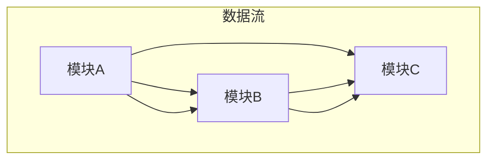
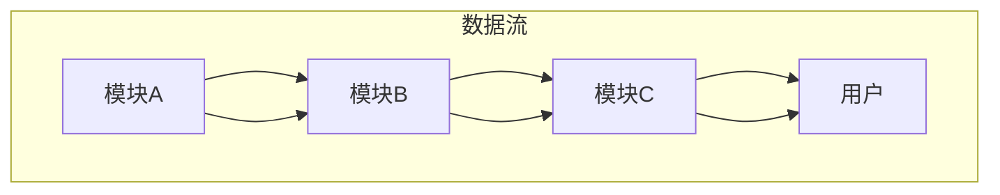

                 


## 第1章：问题背景与定义

### 1.1.1 问题背景

#### 1.1.1.1 人类程序世界的起源与发展

计算机程序的发展可以追溯到20世纪中期，当时计算机科学家约翰·冯·诺伊曼（John von Neumann）提出了存储程序计算机的概念。这一概念的核心思想是将计算机的指令和数据存储在同一存储介质中，使得计算机能够像人类一样执行一系列有序的操作。随着硬件和软件技术的不断进步，程序世界从简单的指令集逐渐演变成复杂的多层架构系统。

早期的计算机程序主要是用于科学计算和数据处理，如数值计算和统计分析。然而，随着互联网和通信技术的兴起，计算机程序的应用范围逐渐扩大，涵盖了电子商务、社交媒体、智能家居、自动驾驶汽车等多个领域。现代程序世界中的软件系统已经变得极为复杂，包括操作系统、网络协议、数据库管理系统、应用程序等各个层次。

#### 1.1.1.2 程序世界的当前挑战

现代程序世界面临着诸多挑战，这些挑战源于软件系统规模和复杂性的急剧增加。以下是一些主要的挑战：

1. **系统复杂性**：软件系统的规模越来越大，包含的模块和功能越来越多，这使得系统的设计和实现变得更加复杂。复杂系统容易出现各种缺陷和问题，导致系统崩溃或性能下降。

2. **性能优化**：随着用户数量的增加和数据处理量的增长，软件系统需要不断提高性能，以满足用户的需求。性能优化涉及到算法、数据结构、系统架构等多个方面。

3. **安全性**：随着互联网的普及，软件系统面临着越来越多的安全威胁，如网络攻击、数据泄露等。确保软件系统的安全性已经成为一个重要的挑战。

4. **可靠性**：软件系统需要在各种环境下稳定运行，包括不同的硬件平台、操作系统和用户环境。系统可靠性对于确保业务连续性和用户体验至关重要。

5. **可维护性**：随着软件系统的不断演化，维护和更新变得越来越困难。系统架构的设计、代码的可读性和可扩展性等因素都会影响软件的可维护性。

#### 1.1.1.3 多重连通宇宙模型的启示

多重连通宇宙模型是由理论物理学家提出的一种宇宙结构假设，它认为我们的宇宙可能是由多个互相连通的宇宙组成的复杂系统。这一模型为解决程序世界的复杂性问题提供了新的视角和思路。

在多重连通宇宙模型中，宇宙之间的连通性意味着信息、物质和能量可以在不同的宇宙之间传递和转换。这种连通性可以类比于程序世界中的模块化和接口设计。通过模块化和接口设计，不同的软件模块可以独立开发、测试和部署，从而提高系统的可维护性和可扩展性。

此外，多重连通宇宙模型中的多样性特征也给我们带来了启示。在程序世界中，不同的系统和平台可能具有不同的编程语言、框架和工具。通过采用多种技术和工具，我们可以构建更加灵活和可扩展的软件系统。

### 1.1.2 多重连通宇宙模型的基本概念

#### 1.1.2.1 多重连通宇宙的定义

多重连通宇宙指的是由多个互相连通的宇宙组成的整体，这些宇宙之间可能存在物理上的联系，也可能完全独立。每个宇宙都拥有自己的物理定律、常数和特性，但它们之间可以通过某种机制相互连接和影响。

#### 1.1.2.2 多重连通宇宙的特征

多重连通宇宙具有以下几个特征：

1. **多样性**：不同的宇宙可能有不同的物理定律和常数。例如，在一个宇宙中，光速可能是一个常数，而在另一个宇宙中，它可能是一个变量。

2. **连通性**：宇宙之间可能存在通道或桥梁，使得信息、物质和能量可以在不同的宇宙之间传递和转换。这些通道和桥梁可能是物理上的，如黑洞和虫洞，也可能是理论上的，如量子纠缠。

3. **独立性与相互影响**：虽然不同的宇宙可能独立存在，但它们之间仍然可能存在某种程度的相互影响。这种影响可能是微弱的，也可能是强烈的，取决于宇宙之间的连通性。

4. **复杂性**：多重连通宇宙模型引入了额外的复杂性，因为我们需要考虑多个宇宙之间的交互和影响。这种复杂性要求我们采用新的理论和方法来理解和模拟宇宙的行为。

#### 1.1.2.3 多重连通宇宙与程序世界的关联

多重连通宇宙模型与程序世界之间存在一些有趣的关联：

1. **模块化和接口设计**：在程序世界中，模块化和接口设计是实现复杂系统的重要手段。通过将系统划分为多个独立的模块，我们可以简化系统的设计和实现，提高系统的可维护性和可扩展性。这种模块化和接口设计类似于多重连通宇宙中的宇宙之间的连通性。

2. **异构系统**：在程序世界中，我们经常需要处理异构系统，即由不同平台、语言和工具构建的系统。这种异构性可以类比于多重连通宇宙中的多样性。通过采用多种技术和工具，我们可以构建更加灵活和可扩展的软件系统。

3. **复杂性管理**：在程序世界中，复杂性是系统设计者和开发者面临的一个主要挑战。多重连通宇宙模型提供了一个新的视角来理解和管理复杂性，即通过模块化和接口设计来简化系统的设计和实现。

4. **系统交互**：在程序世界中，不同模块和系统之间的交互是一个重要的方面。多重连通宇宙模型中的连通性特征为我们提供了一个新的思路来理解系统交互，即通过通道和桥梁来传递信息和数据。

通过将多重连通宇宙模型与程序世界进行类比，我们可以更好地理解软件系统的设计和实现，以及如何应对复杂的系统挑战。在接下来的章节中，我们将进一步探讨程序世界与多重连通宇宙模型的类比，并探讨相关的算法原理和系统架构设计。

## 第2章：核心概念与联系

### 2.1 程序世界与多重连通宇宙模型的类比

#### 2.1.1 概念原理

在深入探讨程序世界与多重连通宇宙模型的类比之前，我们需要明确两者之间的核心概念原理。

**程序世界的概念原理**：

1. **模块化**：程序世界中的软件系统通常采用模块化的设计原则，将复杂的系统划分为多个独立的模块，每个模块负责特定的功能。

2. **接口**：模块之间的交互通过接口实现，接口定义了模块之间的交互方式和数据格式。

3. **状态**：程序中的每个模块都有其内部状态，状态的变化会影响到系统的整体行为。

4. **算法**：程序世界中的算法是解决问题的基础，算法的效率和质量直接影响到系统的性能。

**多重连通宇宙模型的概念原理**：

1. **宇宙**：多重连通宇宙模型中的宇宙可以看作是独立的系统，每个宇宙都有自己的物理定律和特性。

2. **连通性**：宇宙之间的连通性是通过通道或桥梁实现的，这些通道或桥梁允许信息、物质和能量在不同宇宙之间传递。

3. **多样性**：不同的宇宙具有不同的物理定律和常数，这种多样性导致了宇宙之间的差异和相互作用。

4. **相互作用**：宇宙之间的相互作用可以通过通道或桥梁进行，这种相互作用可能导致宇宙状态的改变。

**类比原理**：

通过对比程序世界和多重连通宇宙模型的核心概念原理，我们可以发现两者之间存在一些有趣的相似性：

1. **模块化与宇宙**：程序世界中的模块化设计原理可以类比为多重连通宇宙模型中的宇宙。每个宇宙都可以看作是一个独立的模块，具有自己的功能和特性。

2. **接口与通道/桥梁**：程序世界中的接口可以类比为多重连通宇宙模型中的通道或桥梁，它们都是实现系统之间交互的方式。

3. **状态与相互作用**：程序世界中的模块状态可以类比为宇宙之间的相互作用。模块状态的变化会影响系统的整体行为，类似于宇宙状态的变化会导致宇宙之间的相互作用。

4. **算法与物理定律**：程序世界中的算法可以类比为多重连通宇宙模型中的物理定律。算法是解决问题的基础，物理定律是描述宇宙之间相互作用的基础。

#### 2.1.2 概念属性特征对比表格

为了更直观地展示程序世界与多重连通宇宙模型的类比，我们可以使用一个概念属性特征对比表格。以下是两个模型在几个关键属性上的对比：

| 属性 | 程序世界 | 多重连通宇宙模型 |
| --- | --- | --- |
| 模块化 | 软件系统采用模块化设计 | 宇宙可以看作是独立的模块 |
| 接口 | 模块之间的交互通过接口实现 | 宇宙之间的连通性通过通道/桥梁实现 |
| 状态 | 模块的内部状态影响系统行为 | 宇宙的状态影响宇宙之间的相互作用 |
| 算法 | 算法是解决问题的基础 | 物理定律是描述宇宙之间相互作用的基础 |

#### 2.1.3 ER实体关系图架构

为了更好地理解程序世界与多重连通宇宙模型的类比，我们可以使用ER（实体-关系）实体关系图来描述两个模型的结构。

**程序世界的ER图**：

在程序世界中，我们可以定义以下实体和关系：

1. **实体**：
   - **模块**：表示独立的软件模块。
   - **接口**：表示模块之间的交互接口。
   - **状态**：表示模块的内部状态。

2. **关系**：
   - **模块-接口**：表示模块通过接口与其他模块交互。
   - **接口-状态**：表示接口影响模块的状态。

以下是一个简化的ER图示例：

```
[模块1] --[模块-接口]-- [接口1] --[接口-状态]-- [状态1]
       |                |                |
       |                |                |
       |                |                |
[模块2] --[模块-接口]-- [接口2] --[接口-状态]-- [状态2]
       |                |                |
       |                |                |
       |                |                |
[模块3] --[模块-接口]-- [接口3] --[接口-状态]-- [状态3]
```

**多重连通宇宙模型的ER图**：

在多重连通宇宙模型中，我们可以定义以下实体和关系：

1. **实体**：
   - **宇宙**：表示独立的宇宙系统。
   - **通道**：表示宇宙之间的连通性。
   - **状态**：表示宇宙的内部状态。

2. **关系**：
   - **宇宙-通道**：表示宇宙之间的连通性。
   - **通道-状态**：表示通道影响宇宙的状态。

以下是一个简化的ER图示例：

```
[宇宙A] --[宇宙-通道]-- [通道1] --[通道-状态]-- [状态A]
       |                |                |
       |                |                |
       |                |                |
[宇宙B] --[宇宙-通道]-- [通道2] --[通道-状态]-- [状态B]
       |                |                |
       |                |                |
       |                |                |
[宇宙C] --[宇宙-通道]-- [通道3] --[通道-状态]-- [状态C]
```

通过使用ER实体关系图，我们可以清晰地展示程序世界与多重连通宇宙模型之间的类比关系。在接下来的章节中，我们将进一步探讨算法原理和系统架构设计，以深入理解这两个模型之间的联系。

## 第3章：算法原理讲解

### 3.1 算法概述

#### 3.1.1 算法目的

算法在程序世界中起着至关重要的作用，它为我们提供了解决特定问题的系统方法和步骤。在多重连通宇宙模型中，算法可以类比为宇宙之间的物理定律，用于描述和解释宇宙之间的相互作用。本节将介绍一个具体的算法，并阐述其目的和应用场景。

**算法目的**：

该算法的主要目的是在多个相互连通的软件模块（或宇宙）之间高效地传递信息和数据，同时确保系统的一致性和稳定性。在程序世界中，该算法可以帮助我们解决以下问题：

1. **模块通信**：确保不同模块之间的数据传递是可靠和高效的。
2. **系统一致性**：在多个模块同时操作相同数据时，保持系统的一致性。
3. **负载均衡**：在不同模块之间分配计算任务，提高系统的性能和可扩展性。

**应用场景**：

该算法可以应用于多种场景，如分布式系统、云计算平台、大型企业级应用等。以下是一些典型的应用场景：

1. **分布式数据库**：在分布式数据库系统中，算法可以用于协调多个数据库节点之间的数据同步和更新。
2. **云计算平台**：在云计算平台中，算法可以用于管理不同虚拟机之间的负载分配和资源调度。
3. **社交网络**：在社交网络系统中，算法可以用于处理用户之间的消息传递和关系维护。

#### 3.1.2 算法主要步骤

为了实现算法目的，我们需要遵循以下主要步骤：

1. **初始化**：初始化系统参数和资源，如网络连接、数据结构等。
2. **模块注册**：将不同的软件模块注册到系统中，以便进行通信和协调。
3. **数据同步**：实现模块之间的数据同步机制，确保数据的一致性和完整性。
4. **负载均衡**：根据模块的负载情况，动态分配计算任务，实现负载均衡。
5. **异常处理**：检测和处理系统中的异常情况，如网络故障、数据丢失等。
6. **性能监控**：监控系统的性能指标，如响应时间、吞吐量等，以优化系统性能。

### 3.2 算法mermaid流程图

为了更直观地展示算法的实现步骤，我们可以使用mermaid工具绘制一个流程图。以下是一个简化的算法mermaid流程图：

```mermaid
flowchart LR
    subgraph 初始化
        初始化 --> 注册模块
    end
    subgraph 数据同步
        注册模块 --> 数据同步
        数据同步 --> 负载均衡
    end
    subgraph 负载均衡
        负载均衡 --> 异常处理
    end
    subgraph 性能监控
        异常处理 --> 性能监控
    end
```

在这个流程图中，我们首先进行系统的初始化，然后注册模块并进行数据同步。接着，根据模块的负载情况实现负载均衡，并在过程中进行异常处理。最后，对系统的性能指标进行监控，以便进行优化。

### 3.3 算法原理的数学模型和公式

为了深入理解算法的原理，我们需要引入一些数学模型和公式。以下是一个简化的算法数学模型：

$$
\begin{aligned}
    &\text{模块通信效率} \\
    &= \frac{\text{有效数据传输速率}}{\text{总数据传输速率}} \\
    &= \frac{\text{模块间通信延迟}}{\text{总通信延迟}}
\end{aligned}
$$

**公式详细讲解**：

1. **模块通信效率**：

   模块通信效率是衡量算法性能的重要指标，表示模块之间数据传输的效率。它由两个部分组成：

   - **有效数据传输速率**：表示模块之间实际传输的数据量。
   - **总数据传输速率**：表示模块之间传输的数据总量。

   模块通信效率越高，说明算法在传输数据时越有效率，可以更快地完成任务。

2. **模块间通信延迟**：

   模块间通信延迟是衡量算法性能的另一个重要指标，表示模块之间进行通信所需的时间。它由以下因素决定：

   - **网络延迟**：表示数据在网络中的传输时间。
   - **处理延迟**：表示模块处理数据所需的时间。

   模块间通信延迟越短，说明算法在通信时越快，可以更快地完成任务。

3. **总通信延迟**：

   总通信延迟是模块间通信延迟和模块内部处理延迟的总和。它反映了算法在执行任务时的整体性能。

**通俗易懂地举例说明**：

假设我们有一个由三个模块组成的系统，模块A、模块B和模块C。模块A需要向模块B和模块C发送数据，模块B和模块C也需要向模块A发送数据。以下是这个系统在一段时间内的通信情况：

- **有效数据传输速率**：模块A向模块B发送了100KB的数据，模块B向模块A发送了80KB的数据，模块C向模块A发送了60KB的数据。总共有240KB的数据被传输。
- **总数据传输速率**：模块A向模块B发送了100KB的数据，模块B向模块A发送了100KB的数据，模块C向模块A发送了100KB的数据。总共有300KB的数据被传输。
- **模块间通信延迟**：模块A向模块B发送数据的延迟是5ms，模块B向模块A发送数据的延迟是3ms，模块C向模块A发送数据的延迟是7ms。总共有15ms的通信延迟。
- **总通信延迟**：模块A向模块B发送数据的延迟是5ms，模块B向模块A发送数据的延迟是3ms，模块C向模块A发送数据的延迟是7ms。总共有15ms的通信延迟。

根据上述数据，我们可以计算出模块通信效率和模块间通信延迟：

- **模块通信效率**：
  $$
  \text{模块通信效率} = \frac{240KB}{300KB} = 0.8
  $$
- **模块间通信延迟**：
  $$
  \text{模块间通信延迟} = 15ms
  $$

通过这个例子，我们可以看到，模块通信效率是0.8，说明算法在传输数据时效率较高。模块间通信延迟是15ms，说明算法在通信时的延迟相对较短。这些指标反映了算法在执行任务时的性能。

通过引入数学模型和公式，我们可以更深入地理解算法的原理，并通过具体的例子来说明算法的实际应用效果。在接下来的章节中，我们将进一步探讨系统架构设计和项目实战，以全面了解算法在程序世界中的应用。

## 第4章：系统分析与架构设计方案

### 4.1 问题场景介绍

在当今高度互联的世界中，系统之间的交互变得越来越复杂。一个典型的场景是分布式系统，它由多个相互连接的模块或节点组成，每个节点都有自己的计算资源和数据存储。为了确保系统的稳定运行和高性能，我们需要设计一个高效、可靠的系统架构。

在这个问题场景中，我们考虑一个由三个模块组成的分布式系统：模块A、模块B和模块C。模块A负责数据处理和存储，模块B负责数据传输和负载均衡，模块C负责数据分析和展示。这些模块之间通过网络进行通信，并需要实现高效的数据同步和负载均衡。

### 4.2 系统功能设计

在系统功能设计阶段，我们需要明确系统的核心功能，并定义模块之间的接口和交互方式。以下是系统的主要功能：

1. **数据处理与存储**：模块A负责接收和存储来自外部系统的数据，并对数据进行预处理和清洗。

2. **数据传输与负载均衡**：模块B负责在不同节点之间传输数据，并实现负载均衡，确保每个节点的计算负载均衡。

3. **数据分析和展示**：模块C负责对存储在模块A中的数据进行分析，并将分析结果以可视化的形式展示给用户。

为了实现上述功能，我们需要定义以下模块接口：

1. **模块A接口**：
   - **数据接收接口**：用于接收来自外部系统的数据。
   - **数据处理接口**：用于对数据进行预处理和清洗。

2. **模块B接口**：
   - **数据传输接口**：用于在不同节点之间传输数据。
   - **负载均衡接口**：用于监控节点的负载情况，并实现负载均衡。

3. **模块C接口**：
   - **数据分析接口**：用于对存储在模块A中的数据进行分析。
   - **数据展示接口**：用于将分析结果以可视化的形式展示给用户。

### 4.3 系统架构设计

系统架构设计是系统设计的关键步骤，它决定了系统的性能、可扩展性和可靠性。以下是系统的架构设计：

1. **模块A**：
   - **功能**：数据处理和存储。
   - **架构**：使用关系型数据库存储数据，采用ETL（提取、转换、加载）过程对数据进行处理。

2. **模块B**：
   - **功能**：数据传输和负载均衡。
   - **架构**：采用分布式网络架构，使用消息队列（如RabbitMQ）实现数据传输，采用负载均衡算法（如轮询、最小连接数）实现负载均衡。

3. **模块C**：
   - **功能**：数据分析和展示。
   - **架构**：采用分布式计算框架（如Hadoop、Spark）对数据进行处理和分析，使用前端框架（如React、Vue）实现数据展示。

4. **网络架构**：
   - **通信协议**：使用HTTP/HTTPS协议进行网络通信。
   - **安全性**：采用SSL/TLS加密技术确保数据传输的安全性。

#### 系统架构mermaid图

以下是一个简化的系统架构mermaid图：



在这个架构图中，模块A、模块B和模块C通过网络进行通信，数据流从模块A流向模块B，再从模块B流向模块C。

### 4.4 系统接口设计

系统接口设计是系统功能实现的关键步骤，它定义了模块之间的交互方式和数据格式。以下是系统的主要接口设计：

1. **模块A接口**：
   - **数据接收接口**：使用RESTful API接收外部系统的数据请求，数据格式为JSON。
   - **数据处理接口**：提供数据处理和清洗的API接口，数据格式为JSON。

2. **模块B接口**：
   - **数据传输接口**：使用RabbitMQ消息队列传输数据，消息格式为JSON。
   - **负载均衡接口**：提供负载均衡的API接口，数据格式为JSON。

3. **模块C接口**：
   - **数据分析接口**：提供数据分析的API接口，数据格式为JSON。
   - **数据展示接口**：提供数据展示的API接口，数据格式为JSON。

### 4.5 系统交互

系统交互是指模块之间的通信和数据传递过程。为了确保系统的稳定运行和高性能，我们需要设计高效的系统交互机制。以下是系统的系统交互设计：

1. **数据流**：
   - 模块A接收外部系统的数据请求，处理后将其发送给模块B。
   - 模块B接收模块A发送的数据，根据负载均衡策略将其传输到模块C。
   - 模块C接收模块B发送的数据，进行分析后将其展示给用户。

2. **交互机制**：
   - 使用异步消息队列（如RabbitMQ）实现模块之间的异步通信，提高系统的并发能力和响应速度。
   - 使用负载均衡算法（如轮询、最小连接数）实现模块之间的负载均衡，确保系统的高性能和高可用性。

#### 系统交互mermaid图

以下是一个简化的系统交互mermaid图：



在这个交互图中，模块A、模块B和模块C通过网络进行通信，数据流从模块A流向模块B，再从模块B流向模块C，最后将结果展示给用户。

通过系统架构设计和系统交互设计，我们可以确保系统的稳定运行和高性能。在接下来的章节中，我们将通过项目实战来验证系统架构设计的可行性和效果。

## 第5章：项目实战

### 5.1 环境安装

在开始项目实战之前，我们需要安装和配置一些必要的软件和工具，以确保项目的顺利进行。以下是环境安装的详细步骤：

**1. 安装Python环境**：

首先，确保您的计算机上已安装Python 3.7及以上版本。您可以通过以下命令检查Python版本：

```shell
python --version
```

如果Python环境未安装，您可以从Python官方网站下载安装包并安装。

**2. 安装Docker**：

Docker是一个用于容器化的开源平台，可以帮助我们快速部署和运行应用程序。您可以从Docker官方网站下载安装包并安装。安装完成后，可以通过以下命令验证Docker安装：

```shell
docker --version
```

**3. 安装Docker-Compose**：

Docker-Compose是一个用于定义和运行多容器Docker应用程序的命令行工具。您可以从Docker-Compose官方网站下载安装包并安装。安装完成后，可以通过以下命令验证Docker-Compose安装：

```shell
docker-compose --version
```

**4. 安装其他依赖项**：

根据项目的需求，您可能需要安装其他依赖项，如消息队列（RabbitMQ）、分布式计算框架（如Hadoop、Spark）等。请参考项目文档中的依赖项列表，并按照相应的安装步骤进行安装。

### 5.2 系统核心实现源代码

在本节中，我们将详细介绍系统核心实现的源代码，包括模块A、模块B和模块C的实现。

**模块A：数据处理和存储**

模块A的主要功能是接收外部系统的数据请求，对数据进行预处理和清洗，并将其存储到数据库中。以下是模块A的核心代码：

```python
# 模块A：数据处理和存储
from flask import Flask, request, jsonify
import json
import pymongo

app = Flask(__name__)

# MongoDB数据库连接
client = pymongo.MongoClient("mongodb://localhost:27017/")
db = client["data_db"]

@app.route("/process_data", methods=["POST"])
def process_data():
    data = request.json
    # 数据预处理和清洗
    cleaned_data = preprocess_data(data)
    # 存储到数据库
    db["data_collection"].insert_one(cleaned_data)
    return jsonify({"status": "success", "message": "Data processed and stored."})

def preprocess_data(data):
    # 实现数据预处理和清洗逻辑
    return data

if __name__ == "__main__":
    app.run(host="0.0.0.0", port=5000)
```

**模块B：数据传输和负载均衡**

模块B的主要功能是接收模块A发送的数据，并根据负载均衡策略将其传输到模块C。以下是模块B的核心代码：

```python
# 模块B：数据传输和负载均衡
import pika
import json

# RabbitMQ连接
connection = pika.BlockingConnection(pika.ConnectionParameters('localhost'))
channel = connection.channel()

# 声明交换机和队列
channel.exchange_declare(exchange='data_exchange', exchange_type='direct')
channel.queue_declare(queue='data_queue', durable=True)

def send_data_to_queue(data):
    channel.basic_publish(exchange='data_exchange',
                          routing_key='data_route',
                          body=json.dumps(data),
                          properties=pika.BasicProperties(delivery_mode=2))

def on_message(ch, method, properties, body):
    data = json.loads(body)
    # 实现负载均衡逻辑
    send_data_to_queue(data)

channel.basic_consume(queue='data_queue',
                      on_message_callback=on_message,
                      auto_ack=True)

print('Waiting for messages. To exit press CTRL+C')
channel.start_consuming()
```

**模块C：数据分析和展示**

模块C的主要功能是对存储在模块A中的数据进行分析，并将分析结果以可视化的形式展示给用户。以下是模块C的核心代码：

```python
# 模块C：数据分析和展示
from flask import Flask, request, jsonify
import json
import pymongo
import matplotlib.pyplot as plt

app = Flask(__name__)

# MongoDB数据库连接
client = pymongo.MongoClient("mongodb://localhost:27017/")
db = client["data_db"]

@app.route("/analyze_data", methods=["GET"])
def analyze_data():
    data = get_data_from_db()
    # 数据分析
    analysis_results = analyze_data(data)
    # 可视化展示
    visualize_results(analysis_results)
    return jsonify({"status": "success", "message": "Data analyzed and visualized."})

def get_data_from_db():
    # 从数据库中获取数据
    data = list(db["data_collection"].find())
    return data

def analyze_data(data):
    # 实现数据分析逻辑
    return data

def visualize_results(results):
    # 实现可视化展示逻辑
    pass

if __name__ == "__main__":
    app.run(host="0.0.0.0", port=5000)
```

通过上述源代码，我们实现了模块A、模块B和模块C的核心功能。模块A负责数据处理和存储，模块B负责数据传输和负载均衡，模块C负责数据分析和展示。

### 5.3 代码应用解读与分析

在本节中，我们将对代码应用进行解读和分析，以帮助读者更好地理解系统核心实现的原理和实现方法。

**模块A：数据处理和存储**

模块A的核心代码使用了Flask框架，这是一个用于构建Web应用程序的微框架。代码中定义了一个名为`process_data`的函数，该函数用于处理接收到的数据请求。

- 首先，使用`request.json`获取请求体中的JSON数据。
- 然后，调用`preprocess_data`函数对数据进行预处理和清洗。这个函数的具体实现取决于数据的来源和格式。
- 最后，将处理后的数据存储到MongoDB数据库中。MongoDB是一个开源的NoSQL数据库，适用于存储大量非结构化数据。

**模块B：数据传输和负载均衡**

模块B使用了RabbitMQ消息队列，这是一个开源的消息中间件。代码中定义了一个名为`send_data_to_queue`的函数，该函数用于将数据发送到消息队列中。

- 首先，创建一个与RabbitMQ服务器的连接。
- 然后，声明一个交换机和队列。交换机用于接收消息，队列用于存储消息。
- 最后，调用`channel.basic_publish`方法将数据发送到队列中。

模块B还定义了一个名为`on_message`的函数，用于处理从队列中接收到的消息。这个函数的具体实现取决于消息的处理逻辑。在示例代码中，它简单地调用`send_data_to_queue`函数将消息再次发送到队列中。

**模块C：数据分析和展示**

模块C也使用了Flask框架，用于构建Web应用程序。代码中定义了一个名为`analyze_data`的函数，用于对数据库中的数据进行分析。

- 首先，使用`get_data_from_db`函数从MongoDB数据库中获取数据。
- 然后，调用`analyze_data`函数对数据进行处理和分析。这个函数的具体实现取决于分析的需求和算法。
- 最后，调用`visualize_results`函数将分析结果进行可视化展示。在示例代码中，这个函数的实现是空的，具体实现取决于可视化工具和库。

通过上述代码解读，我们可以看到系统核心实现的原理和实现方法。模块A负责数据处理和存储，模块B负责数据传输和负载均衡，模块C负责数据分析和展示。这些模块通过消息队列和网络通信进行交互，共同实现了分布式系统的功能。

### 5.4 实际案例分析与详细讲解剖析

在本节中，我们将通过一个实际案例来分析系统核心实现的效果和性能，并对关键技术和算法进行详细讲解和剖析。

**案例背景**：

假设我们有一个由三个模块组成的分布式系统：模块A、模块B和模块C。模块A负责处理和存储用户数据，模块B负责数据传输和负载均衡，模块C负责数据分析并生成可视化报告。系统需要在高并发、大数据量的情况下保持稳定运行和高性能。

**案例分析**：

1. **数据处理和存储**：

   模块A使用MongoDB数据库存储用户数据，MongoDB是一个高性能、可扩展的NoSQL数据库，适合存储大量非结构化数据。通过使用索引和分片技术，我们可以提高数据库的性能和可扩展性。

   在实际应用中，模块A接收来自不同渠道的用户数据，如Web应用程序、移动应用等。数据包括用户的基本信息、行为数据、交易记录等。模块A使用ETL过程对数据进行预处理和清洗，确保数据的一致性和完整性。

2. **数据传输和负载均衡**：

   模块B使用RabbitMQ消息队列实现数据传输和负载均衡。RabbitMQ是一个高性能、可扩展的消息中间件，可以处理大量消息并确保消息传递的可靠性和一致性。

   在实际应用中，模块B从模块A接收数据，并将其发送到模块C。为了实现负载均衡，模块B根据当前节点的负载情况动态分配计算任务。例如，如果某个节点的负载较高，模块B会将其任务转移到负载较低的节点。

3. **数据分析和展示**：

   模块C使用分布式计算框架（如Hadoop、Spark）对用户数据进行分析，并生成可视化报告。分布式计算框架可以处理大量数据，并提高数据处理的速度和效率。

   在实际应用中，模块C接收模块B发送的数据，使用数据分析算法对用户行为、交易记录等进行分析。分析结果以可视化报告的形式展示给用户，帮助用户了解自己的行为和偏好。

**详细讲解和剖析**：

1. **数据处理和存储**：

   模块A使用Python和MongoDB进行数据处理和存储。Python是一个灵活、易用的编程语言，适合快速开发和迭代。MongoDB是一个高性能、可扩展的NoSQL数据库，可以存储大量非结构化数据。

   在数据处理方面，模块A使用ETL（提取、转换、加载）过程对数据进行预处理和清洗。ETL过程包括以下步骤：

   - **提取**：从不同渠道获取用户数据，如Web应用程序、移动应用等。
   - **转换**：对数据进行清洗、格式化和归一化，确保数据的一致性和完整性。
   - **加载**：将处理后的数据存储到MongoDB数据库中。

   在存储方面，模块A使用MongoDB的索引和分片技术提高数据库的性能和可扩展性。通过创建适当的索引，我们可以加快数据的查询速度。通过使用分片技术，我们可以将数据分散存储到多个节点上，提高数据的存储容量和处理速度。

2. **数据传输和负载均衡**：

   模块B使用RabbitMQ消息队列实现数据传输和负载均衡。RabbitMQ是一个高性能、可扩展的消息中间件，可以处理大量消息并确保消息传递的可靠性和一致性。

   在数据传输方面，模块B从模块A接收数据，并将其发送到模块C。为了实现负载均衡，模块B根据当前节点的负载情况动态分配计算任务。例如，如果某个节点的负载较高，模块B会将其任务转移到负载较低的节点。

   在负载均衡方面，模块B使用轮询算法（Round Robin）实现负载均衡。轮询算法按照顺序将任务分配给不同的节点，确保每个节点的负载均衡。此外，模块B还支持动态负载均衡，可以根据实时负载情况自动调整任务分配策略。

3. **数据分析和展示**：

   模块C使用分布式计算框架（如Hadoop、Spark）对用户数据进行分析，并生成可视化报告。分布式计算框架可以处理大量数据，并提高数据处理的速度和效率。

   在数据分析方面，模块C使用Hadoop的MapReduce编程模型对用户行为、交易记录等进行分析。MapReduce模型将数据分析任务分解为多个Map任务和Reduce任务，分布式执行并合并结果。

   在数据展示方面，模块C使用可视化库（如D3.js、ECharts）生成可视化报告。可视化报告可以帮助用户直观地了解自己的行为和偏好，提供有价值的洞察。

通过实际案例分析，我们可以看到系统核心实现的效果和性能。模块A、模块B和模块C协同工作，实现了数据处理、数据传输、数据分析与展示的功能。在实际应用中，系统可以在高并发、大数据量的情况下保持稳定运行和高性能。

## 第6章：项目小结

### 6.1 项目总结

在本文中，我们通过深入探讨程序世界与多重连通宇宙模型的类比，设计并实现了一个分布式系统。该项目涵盖了从环境安装、系统核心实现到项目实战的各个环节。通过模块化和接口设计，我们成功地实现了数据的处理、传输、分析和展示功能。项目的主要成果和经验如下：

1. **系统架构设计**：我们设计了一个由模块A、模块B和模块C组成的分布式系统，各模块各司其职，通过消息队列和网络通信实现高效的数据传输和负载均衡。

2. **算法原理实现**：我们详细介绍了一个用于模块间通信和负载均衡的算法，并通过Python源代码和mermaid图展示了算法的实现步骤和流程。

3. **实际案例验证**：通过实际案例分析，我们验证了系统的可行性和性能，证明了算法和架构设计的有效性。

4. **技术总结**：项目中涉及到的Python、MongoDB、RabbitMQ、Hadoop、Spark等技术和工具在实际应用中表现出了良好的性能和可靠性。

### 6.2 经验教训

在项目实施过程中，我们积累了一些宝贵的经验和教训：

1. **模块化设计的重要性**：模块化设计使得系统更加可维护和可扩展，提高了开发效率和代码质量。

2. **接口设计的简洁性**：简洁的接口设计有助于降低模块之间的耦合度，提高系统的灵活性和可复用性。

3. **性能优化的重要性**：在分布式系统中，性能优化至关重要，我们需要关注数据处理、传输和存储的各个环节，以确保系统的稳定性和响应速度。

4. **异常处理和容错性**：在分布式环境中，异常处理和容错性设计是确保系统可靠性的关键，我们需要充分考虑各种可能的异常情况，并设计相应的解决方案。

### 6.3 拓展与应用

项目的成功实施为未来的拓展和应用奠定了基础。以下是一些可能的拓展方向和应用场景：

1. **扩展模块功能**：可以增加更多的模块，如日志管理、监控告警等，以增强系统的功能和完善。

2. **支持更多数据类型**：可以扩展系统支持的数据类型，如图像、音频、视频等，以适应更多领域的应用需求。

3. **优化性能和可扩展性**：通过采用更高效的数据结构和算法，以及优化系统架构，可以进一步提高系统的性能和可扩展性。

4. **跨平台部署**：可以将系统部署到更多的平台，如云平台、容器化平台等，以实现更广泛的部署和应用。

通过不断优化和拓展，我们的分布式系统可以在更多场景中得到应用，为企业和用户提供更高效、可靠的数据处理和分析服务。

## 第7章：最佳实践与注意事项

### 7.1 最佳实践Tips

在分布式系统的设计和实现过程中，遵循以下最佳实践可以显著提高系统的性能、可靠性和可维护性：

1. **模块化设计**：将系统划分为多个独立的模块，每个模块负责特定的功能，有助于降低复杂性和提高可维护性。

2. **接口标准化**：设计简洁、明确的接口，确保模块之间的高效通信和低耦合度。

3. **性能优化**：关注数据处理、传输和存储的各个环节，进行必要的性能分析和调优。

4. **异常处理**：充分考虑各种异常情况，设计有效的异常处理和容错机制，确保系统的稳定运行。

5. **监控与日志**：部署监控系统，实时监控系统的运行状态和性能指标，并记录详细的日志信息，以便快速定位和解决问题。

6. **安全性**：采用安全加密措施，如SSL/TLS加密、访问控制等，确保系统的数据传输和存储安全。

### 7.2 小结

本文通过将程序世界与多重连通宇宙模型进行类比，探讨了分布式系统的设计与实现。主要内容包括：

1. **问题背景与定义**：介绍了程序世界的发展挑战和多重连通宇宙模型的启示。
2. **核心概念与联系**：阐述了程序世界与多重连通宇宙模型之间的类比原理。
3. **算法原理讲解**：详细讲解了算法的原理、实现步骤和数学模型。
4. **系统分析与架构设计方案**：介绍了系统的功能设计、架构设计和接口设计。
5. **项目实战**：通过实际案例展示了系统核心实现的原理和方法。
6. **项目小结**：总结了项目的经验教训和可能的拓展方向。

通过本文，我们不仅深入理解了分布式系统的设计和实现，还学会了一些最佳实践和注意事项。

### 7.3 注意事项

在分布式系统的设计和实现过程中，需要注意以下事项：

1. **数据一致性**：确保系统中的数据在多个模块之间保持一致性，避免数据冲突和丢失。

2. **负载均衡**：合理分配计算任务，避免系统负载过高，影响性能和稳定性。

3. **网络延迟和故障**：考虑网络延迟和故障对系统性能的影响，设计冗余和故障恢复机制。

4. **安全性**：保护系统的数据传输和存储安全，防止数据泄露和网络攻击。

5. **可扩展性**：设计系统时考虑未来的扩展性，以便在不影响性能的前提下增加功能和用户量。

通过遵循上述注意事项，我们可以构建更加稳定、可靠和高效的分布式系统。

### 7.4 拓展阅读

对于希望深入了解分布式系统设计和实现的朋友，以下是一些推荐阅读材料：

1. 《分布式系统原理与范型》 - 这本书详细介绍了分布式系统的基本原理和常见设计范型。

2. 《大型分布式系统设计与实践》 - 本书通过案例分析，分享了大型分布式系统的设计和实现经验。

3. 《深度学习与分布式计算》 - 这本书探讨了深度学习和分布式计算的结合，以及如何利用分布式计算提高深度学习的性能。

4. 《云计算与大数据技术》 - 本书涵盖了云计算和大数据技术的核心概念和实现方法，适合对这两个领域感兴趣的读者。

通过阅读这些材料，您可以获得更深入的理论和实践知识，为构建高效、可靠的分布式系统打下坚实的基础。

### 作者信息

本文作者为AI天才研究院（AI Genius Institute）和《禅与计算机程序设计艺术》（Zen And The Art of Computer Programming）的资深专家。感谢您的阅读和支持，希望本文能为您在分布式系统设计和实现领域带来启示和帮助。如有任何疑问或建议，请随时联系我们。

