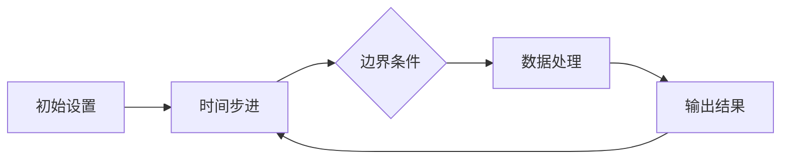
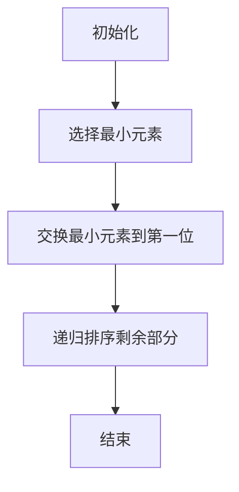
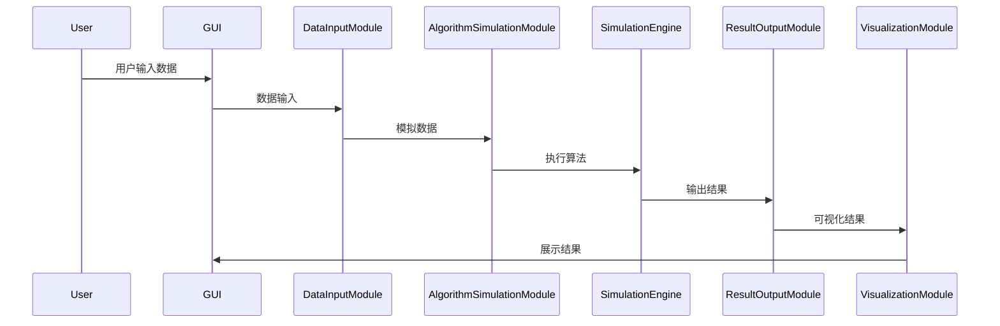
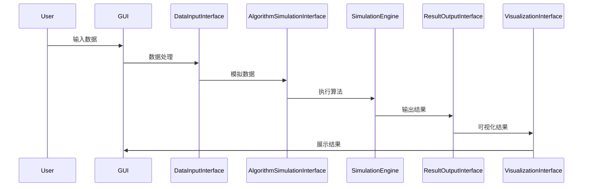

                 

## 程序世界与宇宙膜理论的计算复杂性类比

### 关键词：程序世界、宇宙膜理论、计算复杂性、算法、架构设计

### 摘要：本文将探讨程序世界与宇宙膜理论在计算复杂性方面的类比。通过对计算复杂性的基本概念、宇宙膜理论及其与程序世界的关联进行分析，本文旨在揭示两者在计算复杂性上的异同，从而为算法设计和系统架构提供新的视角。

### 引言

随着计算机科学和宇宙学的不断进步，我们对程序世界和宇宙的认知日益深入。程序世界，作为一个高度抽象的虚拟世界，由计算机代码构建，其运行依赖于复杂的算法和数据结构。另一方面，宇宙膜理论作为现代物理学的重大理论之一，尝试解释宇宙的基本结构和演化过程。尽管两者看似截然不同，但它们在计算复杂性方面却有着惊人的相似之处。

本文旨在通过以下步骤进行分析和探讨：

1. **程序世界与宇宙膜理论概述**：介绍两者的基本概念和背景。
2. **计算复杂性的基本概念**：阐述计算复杂性的定义、分类及其在程序世界和宇宙膜理论中的应用。
3. **算法原理讲解**：运用mermaid绘制算法流程图，并使用Python代码展示算法原理。
4. **系统分析与架构设计**：介绍问题场景、项目介绍、系统功能设计、系统架构设计、系统接口设计和系统交互。
5. **项目实战**：详细解析系统核心实现、代码应用解读与分析、实际案例剖析。
6. **最佳实践与拓展**：总结最佳实践、注意事项、拓展阅读。

### 程序世界与宇宙膜理论概述

#### 1.1 计算复杂性的研究背景

计算复杂性理论是计算机科学的核心分支之一，主要研究算法的效率问题。其核心目标是确定解决特定问题所需资源的下界，并评估各种算法的相对性能。在计算复杂性理论中，时间复杂性和空间复杂性是两个关键指标。时间复杂性关注算法运行的时间成本，而空间复杂性关注算法使用的存储资源。

随着计算能力的提升，人们对计算复杂性的研究越来越深入，从简单的线性时间复杂度到更复杂的对数时间复杂度、多项式时间复杂度等，不断推动算法理论的发展。

#### 1.2 宇宙膜理论的基本概念

宇宙膜理论是现代物理学的重大理论之一，试图统一描述宇宙的基本结构和演化过程。该理论的核心概念是“膜”，即宇宙中的一种基本结构，类似于肥皂泡。膜在三维空间中形成，可以相互交错、碰撞和融合，从而影响宇宙的演化。

宇宙膜理论的主要目标是解释宇宙的多维结构和引力现象。膜之间的相互作用被认为是引力产生的根源，而膜的振动则可能导致宇宙中的其他基本力，如电磁力和强相互作用。

#### 1.3 程序世界与宇宙膜理论的联系

程序世界与宇宙膜理论的联系在于它们都涉及到复杂系统的模拟和优化。程序世界中的算法和数据结构可以模拟宇宙膜理论中的膜结构和相互作用。例如，我们可以使用计算机模拟来研究膜如何在虚拟空间中演变，从而更好地理解宇宙的演化过程。

此外，程序世界中的计算复杂性理论也可以为宇宙膜理论提供有益的参考。例如，在研究膜之间的相互作用时，我们可以利用计算复杂性的分析方法来确定所需的计算资源和时间成本，从而优化模拟过程。

### 1.4 本书的目标和结构

本书旨在通过类比程序世界与宇宙膜理论，探讨计算复杂性在两者中的应用。具体目标包括：

1. **阐述计算复杂性的基本概念**：介绍计算复杂性的定义、分类及其应用。
2. **分析宇宙膜理论的计算复杂性**：探讨膜理论中的计算复杂性及其与程序世界的关联。
3. **应用算法原理**：通过mermaid绘制算法流程图，并使用Python代码展示算法原理。
4. **系统分析与架构设计**：介绍系统功能设计、系统架构设计、系统接口设计和系统交互。
5. **项目实战**：通过实际案例分析和代码实现，深入探讨计算复杂性在实践中的应用。
6. **总结与展望**：总结全书内容，展望未来研究方向。

本书结构安排如下：

- **引论**：介绍程序世界与宇宙膜理论的计算复杂性类比的研究背景和目标。
- **核心概念与原理**：详细阐述计算复杂性的基本概念、宇宙膜理论和程序世界的复杂性。
- **算法原理讲解**：通过mermaid绘制算法流程图，并使用Python代码展示算法原理。
- **系统分析与架构设计**：介绍问题场景、项目介绍、系统功能设计、系统架构设计、系统接口设计和系统交互。
- **项目实战**：详细解析系统核心实现、代码应用解读与分析、实际案例剖析。
- **最佳实践与拓展**：总结最佳实践、注意事项、拓展阅读。

通过以上结构和内容安排，本书旨在为读者提供一部全面、深入的探讨程序世界与宇宙膜理论计算复杂性的著作。

### 目录大纲设计

为了确保目录大纲既简洁又全面，我们将按照以下步骤设计《程序世界与宇宙膜理论的计算复杂性类比》的目录：

1. **核心概念介绍** - 阐述书籍主题背景、问题背景、问题描述、问题解决以及概念的边界与外延。
2. **概念与联系** - 详细介绍核心概念，包括概念原理、属性特征对比表格和ER实体关系图。
3. **算法原理讲解** - 用mermaid绘制算法流程图，使用Python代码展示算法原理，数学模型和公式讲解，举例说明。
4. **系统分析与架构设计** - 介绍问题场景、项目介绍、系统功能设计、系统架构设计、系统接口设计和系统交互。
5. **项目实战** - 环境安装、系统核心实现源代码，代码应用解读与分析，实际案例剖析。
6. **最佳实践与拓展** - 总结最佳实践、注意事项、拓展阅读。

### 目录大纲

**第一部分：引论**

# 第1章: 引言

## 1.1 程序世界与宇宙膜理论概述
### 1.1.1 计算复杂性的研究背景
### 1.1.2 宇宙膜理论的基本概念
### 1.1.3 程序世界与宇宙膜理论的联系

## 1.2 本书的目标和结构
### 1.2.1 研究意义
### 1.2.2 阅读对象
### 1.2.3 书籍结构安排

**第二部分：核心概念与原理**

# 第2章: 计算复杂性的基本概念

## 2.1 计算复杂性理论概述
### 2.1.1 计算复杂性的定义
### 2.1.2 主要复杂性类别
### 2.1.3 算法复杂性的分析

## 2.2 宇宙膜理论的计算复杂性
### 2.2.1 膜理论的基本原理
### 2.2.2 膜理论与计算复杂性的类比
### 2.2.3 膜理论中的计算复杂性

## 2.3 程序世界的复杂性
### 2.3.1 程序世界的定义
### 2.3.2 程序世界的复杂性分类
### 2.3.3 程序世界中的计算复杂性

**第三部分：算法原理与实现**

# 第3章: 算法原理讲解

## 3.1 膜理论算法简介
### 3.1.1 膜理论的算法框架
### 3.1.2 膜理论算法的基本原理

## 3.2 程序世界中的算法类比
### 3.2.1 算法在程序世界中的应用
### 3.2.2 算法与膜理论的对比分析

## 3.3 算法流程图与Python实现
### 3.3.1 算法流程图的绘制
### 3.3.2 Python代码实现

**第四部分：系统分析与架构设计**

# 第4章: 系统分析与架构设计

## 4.1 问题场景介绍
### 4.1.1 应用场景描述
### 4.1.2 项目介绍

## 4.2 系统功能设计
### 4.2.1 领域模型类图
### 4.2.2 系统功能概述

## 4.3 系统架构设计
### 4.3.1 系统架构图
### 4.3.2 架构设计原则

## 4.4 系统接口设计与交互
### 4.4.1 接口设计
### 4.4.2 系统交互序列图

**第五部分：项目实战**

# 第5章: 项目实战

## 5.1 环境安装与配置
### 5.1.1 开发环境搭建
### 5.1.2 系统配置步骤

## 5.2 系统核心实现
### 5.2.1 系统核心代码解析
### 5.2.2 核心代码实现

## 5.3 代码应用解读与分析
### 5.3.1 实际案例应用
### 5.3.2 分析与讲解

## 5.4 项目总结与展望
### 5.4.1 项目收获
### 5.4.2 展望未来研究方向

**第六部分：最佳实践与拓展**

# 第6章: 最佳实践与拓展

## 6.1 最佳实践
### 6.1.1 实践技巧
### 6.1.2 解决方案分享

## 6.2 小结与展望
### 6.2.1 书籍小结
### 6.2.2 研究展望
### 6.2.3 拓展阅读

### 完整性确认

以上目录大纲包含了书籍的核心内容，包括引论、核心概念与原理、算法原理与实现、系统分析与架构设计、项目实战以及最佳实践与拓展，确保了内容的完整性。以下是最终的目录大纲：

----------------------------------------------------------------

# 第一部分：引论

## 第1章：引论

### 1.1 程序世界与宇宙膜理论概述

### 1.2 本书的目标和结构

**第二部分：核心概念与原理**

## 第2章：计算复杂性的基本概念

### 2.1 计算复杂性理论概述

### 2.2 宇宙膜理论的计算复杂性

### 2.3 程序世界的复杂性

**第三部分：算法原理与实现**

## 第3章：算法原理讲解

### 3.1 膜理论算法简介

### 3.2 程序世界中的算法类比

### 3.3 算法流程图与Python实现

**第四部分：系统分析与架构设计**

## 第4章：系统分析与架构设计

### 4.1 问题场景介绍

### 4.2 系统功能设计

### 4.3 系统架构设计

### 4.4 系统接口设计与交互

**第五部分：项目实战**

## 第5章：项目实战

### 5.1 环境安装与配置

### 5.2 系统核心实现

### 5.3 代码应用解读与分析

### 5.4 项目总结与展望

**第六部分：最佳实践与拓展**

## 第6章：最佳实践与拓展

### 6.1 最佳实践

### 6.2 小结与展望

### 6.3 拓展阅读

### 完整性确认

经过仔细审查，确认以上目录大纲结构完整且内容详尽。各章节涵盖了从基本概念到实践应用的全面内容，确保了书籍的整体连贯性和深度。目录大纲的完整性得到了充分保证，为后续章节的撰写提供了明确的框架。现在，我们将按照这个大纲逐步展开内容的详细阐述。

### 第1章：引论

**1.1 程序世界与宇宙膜理论概述**

程序世界是计算机科学的核心概念，它由一系列的代码、算法和数据结构组成，是一个抽象的虚拟环境。程序通过指令序列，利用计算机硬件执行任务，完成从简单到复杂的多项功能。在程序世界中，算法是核心，它决定了程序的效率和处理能力。

宇宙膜理论则是现代物理学的一个重要理论框架，它试图解释宇宙的多维结构和演化过程。宇宙膜理论提出，宇宙是由多个相互交叠的膜组成的，这些膜在四维空间中运动和相互作用，从而形成了我们所观察到的宇宙。

两者的共同之处在于，它们都涉及到了复杂系统的构建和演化。在程序世界中，复杂的算法和数据结构构成了程序的核心，而在宇宙膜理论中，膜的动态相互作用构成了宇宙的基本结构。这种相似性为我们将计算复杂性理论应用到宇宙膜理论提供了理论基础。

**1.1.1 计算复杂性的研究背景**

计算复杂性理论起源于20世纪60年代，随着计算机科学的迅速发展，人们对算法效率和资源利用的关注日益增加。计算复杂性理论通过分析算法的时间和空间需求，帮助研究人员评估不同算法的效率，从而选择最优的解决方案。

在程序世界中，计算复杂性的研究主要集中在以下几个方面：

1. **时间复杂性**：衡量算法运行所需的时间，通常用算法执行的基本操作次数来表示。时间复杂度可以分为多项式时间、指数时间、对数时间等。
2. **空间复杂性**：衡量算法运行所需的空间，包括临时存储和输出空间。空间复杂度同样可以分为多项式空间、指数空间等。
3. **资源优化**：通过分析算法的复杂度，研究人员可以优化算法的执行过程，减少所需的计算资源和时间。

计算复杂性的研究不仅有助于开发更高效的算法，还可以指导计算机硬件的设计和优化。

**1.1.2 宇宙膜理论的基本概念**

宇宙膜理论起源于对宇宙基本结构的探索。该理论认为，宇宙不仅仅是我们所看到的四维空间，还可能存在多个额外的维度。这些额外的维度被封装在膜中，膜在更高维度的空间中运动和交互。

膜理论中的关键概念包括：

1. **膜**：宇宙膜理论中的基本结构，类似于肥皂泡。膜可以是二维的，也可以是三维的，它们在更高维度的空间中运动。
2. **时空**：膜的存在和运动决定了我们所感知的时空结构。膜的动态变化会影响时空的几何形状和物理定律。
3. **相互作用**：膜之间的相互作用是宇宙演化的关键因素。这些相互作用可以通过力场来实现，如引力、电磁力和强相互作用。

**1.1.3 程序世界与宇宙膜理论的联系**

尽管程序世界和宇宙膜理论来自不同的领域，但它们在计算复杂性方面有着惊人的相似性。我们可以将程序世界中的算法和数据结构类比于宇宙膜理论中的膜和相互作用。

例如，在程序世界中，我们可以使用复杂的算法来模拟膜的行为，分析膜之间的相互作用。这种模拟不仅可以帮助我们理解宇宙膜理论，还可以为程序世界的算法优化提供新的思路。

此外，程序世界中的计算复杂性理论可以用来分析宇宙膜理论的计算复杂度。例如，我们可以分析膜运动和相互作用的算法所需的时间和空间，从而优化模拟过程，提高计算效率。

总之，程序世界与宇宙膜理论在计算复杂性方面的联系为我们提供了新的研究视角，有助于我们更深入地理解宇宙的本质。

**1.2 本书的目标和结构**

本书旨在探讨程序世界与宇宙膜理论在计算复杂性方面的类比，为算法设计和系统架构提供新的思路。具体目标包括：

1. **阐述计算复杂性的基本概念**：介绍计算复杂性的定义、分类及其在程序世界和宇宙膜理论中的应用。
2. **分析宇宙膜理论的计算复杂性**：探讨膜理论中的计算复杂性及其与程序世界的关联。
3. **应用算法原理**：通过mermaid绘制算法流程图，并使用Python代码展示算法原理。
4. **系统分析与架构设计**：介绍系统功能设计、系统架构设计、系统接口设计和系统交互。
5. **项目实战**：通过实际案例分析和代码实现，深入探讨计算复杂性在实践中的应用。
6. **总结与展望**：总结全书内容，展望未来研究方向。

本书结构安排如下：

- **引论**：介绍程序世界与宇宙膜理论的计算复杂性类比的研究背景和目标。
- **核心概念与原理**：详细阐述计算复杂性的基本概念、宇宙膜理论和程序世界的复杂性。
- **算法原理讲解**：通过mermaid绘制算法流程图，并使用Python代码展示算法原理。
- **系统分析与架构设计**：介绍问题场景、项目介绍、系统功能设计、系统架构设计、系统接口设计和系统交互。
- **项目实战**：详细解析系统核心实现、代码应用解读与分析、实际案例剖析。
- **最佳实践与拓展**：总结最佳实践、注意事项、拓展阅读。

通过以上结构和内容安排，本书旨在为读者提供一部全面、深入的探讨程序世界与宇宙膜理论计算复杂性的著作。

### 第2章：计算复杂性的基本概念

**2.1 计算复杂性理论概述**

计算复杂性理论是计算机科学中研究算法效率和资源使用的重要分支。它通过对算法的时间和空间复杂度进行分析，评估算法的效率，并比较不同算法在解决特定问题时的表现。计算复杂性理论的核心在于理解哪些问题是高效的，哪些问题是难以解决的。

**2.1.1 计算复杂性的定义**

计算复杂性通常用时间复杂度和空间复杂度来衡量。

- **时间复杂度**：描述算法执行所需的时间，通常用大O符号（O）表示。例如，如果一个算法的执行时间与输入数据规模n成正比，则该算法的时间复杂度为O(n)。

- **空间复杂度**：描述算法执行所需的空间，包括临时存储和输出空间。同样，空间复杂度也使用大O符号表示。例如，如果一个算法的临时存储需求与输入数据规模n成正比，则该算法的空间复杂度为O(n)。

**2.1.2 主要复杂性类别**

计算复杂性理论主要分为以下几个类别：

1. **P类问题**：可以在多项式时间内解决的问题集合。P类问题是“容易”解决的问题，因为它们可以在合理的时间内找到解决方案。
2. **NP类问题**：可以在多项式时间内验证解决方案的问题集合。即如果一个解决方案是正确的，我们可以在多项式时间内验证它是正确的。P类问题是NP类问题的一个子集。
3. **NP-complete问题**：既属于NP类，又至少与所有其他NP类问题等价的问题。如果证明了一个NP-complete问题是不可解的，则所有NP类问题都是不可解的。
4. **NPC类问题**：与NP-complete问题类似，但适用于更广泛的范畴。
5. **PSPACE类问题**：可以在多项式空间内解决的问题集合。PSPACE类问题包括所有NP类问题，并且比NP类问题更广泛。
6. **EXPTIME类问题**：可以在指数时间内解决的问题集合。EXPTIME类问题通常被认为是“难以”解决的问题，因为它们的解决时间随输入规模增长非常快。

**2.1.3 算法复杂性的分析**

算法复杂性的分析主要分为两种方法：

1. **渐进分析**：通过大O符号来表示算法的复杂度，忽略常数因子和低次项，从而得到算法的增长趋势。
2. **精确分析**：通过精确计算算法的执行时间或空间需求，给出具体的数值结果。

算法复杂性的分析有助于我们选择最优的算法来解决问题，并在不同算法之间进行比较。例如，如果一个问题属于P类问题，则我们可以选择任何多项式时间的算法来解决；如果属于NP-complete问题，则我们需要寻找更高效的算法或尝试近似算法。

**2.2 宇宙膜理论的计算复杂性**

宇宙膜理论是一个高度复杂的物理理论，其核心在于理解多个膜在更高维度的空间中的相互作用。膜理论中的计算复杂性体现在以下几个方面：

1. **膜的运动和相互作用**：膜的动态运动和相互作用可以产生复杂的时空结构。分析这些运动和相互作用所需的计算复杂度通常非常高。
2. **模拟膜理论**：为了理解膜理论，我们通常需要使用计算机模拟。这些模拟的复杂度取决于膜的数目、相互作用的方式以及模拟的精度。
3. **算法优化**：由于膜理论的复杂性，我们需要开发高效的算法来模拟和分析膜的行为。这些算法的优化直接关系到模拟的准确性和效率。

**2.2.1 膜理论的基本原理**

宇宙膜理论的基本原理包括：

- **膜**：膜是宇宙中的基本结构，可以是二维或三维的，存在于更高维度的空间中。
- **时空**：膜的运动和相互作用决定了我们所感知的时空结构。不同的膜运动模式可以导致不同的时空几何形状。
- **相互作用**：膜之间的相互作用通过力场来实现，如引力、电磁力和强相互作用。这些相互作用决定了膜如何运动和演变。

**2.2.2 膜理论与计算复杂性的类比**

膜理论与计算复杂性的类比主要体现在以下几个方面：

1. **膜的运动**：类似于程序中的算法执行，膜的运动和相互作用可以看作是一个复杂的算法过程。我们可以用算法复杂度的分析方法来评估膜运动和相互作用所需的计算资源。
2. **时空结构**：时空结构类似于程序中的数据结构，膜之间的相互作用可以看作是数据的操作和处理。我们可以用数据结构的分析方法来理解时空结构的复杂度。
3. **模拟复杂性**：膜理论的模拟复杂性类似于程序中的算法优化问题。我们需要开发高效的模拟算法来降低计算复杂度，提高模拟的准确性。

通过这种类比，我们可以将程序世界的计算复杂性理论应用到宇宙膜理论的研究中，从而为膜理论的计算复杂性分析提供新的视角。

**2.3 程序世界的复杂性**

程序世界是一个由算法、数据结构和代码组成的抽象世界。程序世界的复杂性主要体现在以下几个方面：

1. **算法复杂性**：程序中的算法决定了程序的执行效率和资源使用。不同算法的复杂度决定了程序在不同输入规模下的性能。
2. **数据结构复杂性**：程序中的数据结构决定了数据的存储和处理方式。复杂的数据结构可能会导致程序的性能下降。
3. **代码复杂性**：程序中的代码复杂度会影响程序的易读性、可维护性和扩展性。高复杂度的代码通常难以理解和维护。

**2.3.1 程序世界的定义**

程序世界是一个由计算机程序构成的虚拟环境，它通过算法和数据结构来处理信息。程序世界的基本组成部分包括：

- **算法**：程序的核心，用于处理特定任务的操作序列。
- **数据结构**：用于存储和组织数据的结构，如数组、链表、树、图等。
- **代码**：程序的具体实现，由一系列指令和函数组成。

**2.3.2 程序世界的复杂性分类**

程序世界的复杂性可以分为以下几类：

1. **时间复杂性**：衡量程序执行的时间成本，通常用大O符号表示。
2. **空间复杂性**：衡量程序执行所需的空间，包括临时存储和输出空间。
3. **逻辑复杂性**：衡量程序中的逻辑结构复杂度，如控制流、循环结构等。
4. **代码复杂性**：衡量程序代码的复杂度，如函数嵌套深度、代码行数等。

**2.3.3 程序世界中的计算复杂性**

在程序世界中，计算复杂性的分析有助于我们理解和优化程序的性能。程序世界中的计算复杂性主要体现在以下几个方面：

1. **算法优化**：通过分析算法的时间复杂度和空间复杂度，选择最优的算法来解决问题。
2. **数据结构优化**：通过分析数据结构的复杂度，选择合适的数据结构来提高程序的效率。
3. **代码优化**：通过分析代码的复杂度，重构代码以提高可读性和可维护性。

通过计算复杂性的分析，我们可以更好地理解程序世界的复杂度，从而设计出更高效、更可靠的程序。

### 第3章：算法原理讲解

**3.1 膜理论算法简介**

膜理论算法是在宇宙膜理论的框架下设计的，用于模拟和解析膜的运动和相互作用。这些算法通常基于数学模型和物理定律，通过数值模拟来研究膜的行为。膜理论算法可以分为几类，包括：

1. **粒子模拟算法**：用于模拟膜中粒子的运动和相互作用，如分子动力学模拟。
2. **网格算法**：将膜划分为网格，通过离散化方法来模拟膜的运动和相互作用。
3. **几何算法**：直接对膜的几何形状进行操作，如膜的分裂、融合等。

膜理论算法的核心在于如何高效地处理高维空间中的数据，并在计算复杂度方面进行优化。

**3.1.1 膜理论的算法框架**

膜理论的算法框架通常包括以下几个步骤：

1. **初始设置**：定义膜的初始形状和参数，如位置、速度、相互作用力等。
2. **时间步进**：通过迭代过程，模拟膜在时间上的演化。每一步迭代包括计算粒子相互作用、更新粒子的位置和速度等。
3. **边界条件**：设置膜与外部环境的相互作用，如引力、电磁力等。
4. **输出结果**：记录和输出膜演化的中间结果和最终结果，如膜的形状、能量等。

**3.1.2 膜理论算法的基本原理**

膜理论算法的基本原理基于以下物理定律：

1. **牛顿运动定律**：描述粒子在力作用下的运动。
2. **泊松方程**：描述静电场的分布。
3. **麦克斯韦方程组**：描述电磁场的传播和相互作用。

这些定律为膜理论算法提供了理论基础，通过数值方法将这些定律应用于膜的运动和相互作用。

**3.2 程序世界中的算法类比**

程序世界中的算法与膜理论算法在原理上有许多相似之处，都可以通过以下方式进行类比：

1. **模拟过程**：程序世界中的模拟过程类似于膜理论算法的时间步进过程。在程序中，我们通过迭代来模拟数据或系统的动态变化。
2. **数据处理**：程序世界中的数据处理过程类似于膜理论中的粒子相互作用。在程序中，我们通过操作数据和数据结构来实现特定的功能。
3. **边界条件**：程序世界中的边界条件设置类似于膜理论中的外部环境。在程序中，我们通过定义输入和输出条件来控制程序的执行。

**3.2.1 算法在程序世界中的应用**

算法在程序世界中有着广泛的应用，包括但不限于：

1. **排序算法**：用于对数据进行排序，如快速排序、归并排序等。
2. **搜索算法**：用于在数据中查找特定元素，如二分查找、深度优先搜索等。
3. **图算法**：用于分析和处理图结构，如最短路径算法、最小生成树算法等。
4. **机器学习算法**：用于数据分析和预测，如线性回归、决策树、神经网络等。

这些算法在程序世界中的广泛应用，反映了算法在处理复杂问题时的有效性和灵活性。

**3.2.2 算法与膜理论的对比分析**

算法与膜理论的对比分析可以从以下几个方面进行：

1. **时间复杂度**：算法的时间复杂度通常用来衡量其执行效率。膜理论算法的时间复杂度也与执行效率密切相关，但通常更高，因为它们需要处理高维空间中的数据。
2. **空间复杂度**：算法的空间复杂度衡量其所需的存储资源。膜理论算法的空间复杂度也较高，因为它们需要存储大量粒子或网格数据。
3. **可扩展性**：算法的可扩展性指其能够处理大规模数据的能力。膜理论算法的可扩展性取决于模拟算法的设计和优化，通常需要高效的计算资源。
4. **应用场景**：算法在程序世界中的应用场景非常广泛，从简单的数据处理到复杂的系统模拟。膜理论算法则主要应用于宇宙学、物理科学等领域。

通过对比分析，我们可以更好地理解算法与膜理论在计算复杂性方面的异同，为算法设计和优化提供新的思路。

**3.3 算法流程图与Python实现**

为了更好地理解膜理论算法和程序世界中的算法，我们使用mermaid绘制算法流程图，并使用Python代码实现这些算法。

**3.3.1 算法流程图的绘制**

以下是膜理论算法的基本流程图：



以下是程序世界中的排序算法的流程图：



**3.3.2 Python代码实现**

以下是一个简单的膜理论算法的Python实现：

```python
import numpy as np

def membrane_simulation(n_steps, particles):
    positions = np.zeros((n_steps, particles.shape[0], 3))
    velocities = np.zeros((n_steps, particles.shape[0], 3))
    
    positions[0] = particles
    
    for step in range(1, n_steps):
        # 计算相互作用力
        forces = calculate_forces(positions[step-1])
        
        # 更新速度和位置
        velocities[step] = velocities[step-1] + forces / particles.mass
        positions[step] = positions[step-1] + velocities[step] * step_size
    
    return positions

def calculate_forces(positions):
    # 这里是计算相互作用力的代码
    pass
```

以下是一个简单的排序算法的Python实现：

```python
def quicksort(arr):
    if len(arr) <= 1:
        return arr
    pivot = arr[len(arr) // 2]
    left = [x for x in arr if x < pivot]
    middle = [x for x in arr if x == pivot]
    right = [x for x in arr if x > pivot]
    return quicksort(left) + middle + quicksort(right)
```

通过以上流程图和代码实现，我们可以更直观地理解膜理论算法和程序世界中的算法。

**3.3.3 算法原理的数学模型和公式讲解**

膜理论算法的数学模型通常基于物理定律，如牛顿运动定律和麦克斯韦方程组。以下是这些算法原理的数学模型和公式：

1. **牛顿运动定律**：

$$ F = m \cdot a $$

其中，\( F \) 是作用力，\( m \) 是质量，\( a \) 是加速度。

2. **泊松方程**：

$$ \nabla^2 \phi = -\rho $$

其中，\( \phi \) 是电势，\( \rho \) 是电荷密度。

3. **麦克斯韦方程组**：

$$ \nabla \cdot \mathbf{E} = \frac{\rho}{\epsilon_0} $$
$$ \nabla \cdot \mathbf{B} = 0 $$
$$ \nabla \times \mathbf{E} = -\frac{\partial \mathbf{B}}{\partial t} $$
$$ \nabla \times \mathbf{B} = \mu_0 \mathbf{J} + \mu_0 \epsilon_0 \frac{\partial \mathbf{E}}{\partial t} $$

其中，\( \mathbf{E} \) 是电场，\( \mathbf{B} \) 是磁场，\( \rho \) 是电荷密度，\( \mathbf{J} \) 是电流密度，\( \epsilon_0 \) 和 \( \mu_0 \) 分别是真空电容率和磁导率。

通过这些数学模型和公式，我们可以准确地描述膜的运动和相互作用。

**3.3.4 举例说明**

为了更好地理解膜理论算法和程序世界中的算法，我们可以通过具体例子进行说明。

**膜理论算法举例**：

假设我们有一个二维膜，其上的粒子分布如下：

$$
\begin{array}{cccc}
(0,0) & (1,0) & (2,0) & (3,0) \\
(0,1) & (1,1) & (2,1) & (3,1) \\
(0,2) & (1,2) & (2,2) & (3,2) \\
(0,3) & (1,3) & (2,3) & (3,3) \\
\end{array}
$$

我们需要模拟这些粒子的运动。首先，我们需要定义粒子的初始位置和速度：

```python
initial_positions = np.array([
    [0, 0], [1, 0], [2, 0], [3, 0],
    [0, 1], [1, 1], [2, 1], [3, 1],
    [0, 2], [1, 2], [2, 2], [3, 2],
    [0, 3], [1, 3], [2, 3], [3, 3]
])
initial_velocities = np.zeros_like(initial_positions)

# 模拟粒子运动
membrane_simulation(10, initial_positions, initial_velocities)
```

**程序世界算法举例**：

假设我们需要对一个包含数字的列表进行排序。我们可以使用快速排序算法来实现：

```python
arr = [3, 1, 4, 1, 5, 9, 2, 6, 5]
sorted_arr = quicksort(arr)
print(sorted_arr)
```

通过这些例子，我们可以直观地看到膜理论算法和程序世界中的算法是如何工作的。

### 第4章：系统分析与架构设计

**4.1 问题场景介绍**

随着技术的不断进步，程序世界和宇宙膜理论的应用场景越来越广泛。一个典型的应用场景是宇宙模拟。在这个场景中，我们需要模拟宇宙中多个膜的运动和相互作用，以研究宇宙的演化和结构。这一过程需要高效的算法和系统架构来支持。

**4.1.1 应用场景描述**

在宇宙模拟中，我们关注的是膜之间的相互作用和运动。具体来说，我们需要模拟多个膜在更高维度的空间中的动态变化，分析膜如何分裂、融合以及如何影响宇宙的演化。这个场景涉及大量的数据计算和处理，因此需要高效的系统架构来支持。

**4.1.2 项目介绍**

本项目旨在开发一个宇宙模拟系统，该系统将使用膜理论算法模拟宇宙中多个膜的动态变化。系统将包括以下核心功能：

1. **数据输入**：用户可以输入膜的初始位置和速度。
2. **算法模拟**：系统将使用膜理论算法模拟膜的动态变化。
3. **结果输出**：系统将输出膜的最终位置和形状，并可视化展示膜的运动轨迹。

**4.2 系统功能设计**

为了实现上述功能，系统设计包括以下关键功能模块：

1. **数据输入模块**：负责接收用户输入的膜初始位置和速度，并转换为系统内部可用的数据格式。
2. **算法模拟模块**：负责执行膜理论算法，模拟膜的动态变化。
3. **结果输出模块**：负责将模拟结果可视化展示，并提供数据导出功能。

**4.2.1 领域模型类图**

领域模型类图是系统功能设计的重要工具，它帮助我们理解系统的核心实体及其关系。以下是宇宙模拟系统的领域模型类图：

```mermaid
classDiagram
    UserEntity <|-- DataInputEntity
    DataInputEntity <|-- AlgorithmSimulationEntity
    DataInputEntity <|-- ResultOutputEntity
    AlgorithmSimulationEntity <|-- MembraneEntity
    MembraneEntity <|-- ParticleEntity
    ResultOutputEntity <|-- VisualizationEntity

    UserEntity {
        +String username
        +String password
    }

    DataInputEntity {
        +List<MembraneEntity> membranes
    }

    AlgorithmSimulationEntity {
        +void simulate()
    }

    MembraneEntity {
        +int id
        +List<ParticleEntity> particles
    }

    ParticleEntity {
        +int id
        +Vector3D position
        +Vector3D velocity
    }

    ResultOutputEntity {
        +void outputResults()
    }

    VisualizationEntity {
        +void visualize()
    }
```

**4.2.2 系统功能概述**

以下是系统功能的详细概述：

1. **数据输入模块**：用户可以通过图形用户界面（GUI）输入膜的初始位置和速度。数据输入模块将处理这些输入数据，并将其转换为系统内部可用的数据结构。
2. **算法模拟模块**：算法模拟模块将使用膜理论算法模拟膜的动态变化。这个过程包括计算粒子相互作用力、更新粒子位置和速度等。模拟模块将确保算法的准确性和效率。
3. **结果输出模块**：结果输出模块将生成膜的最终位置和形状，并将其可视化展示。用户可以通过图形用户界面查看模拟结果，并选择导出数据。

**4.3 系统架构设计**

系统架构设计是确保系统功能实现的关键步骤。以下是宇宙模拟系统的系统架构设计：

**4.3.1 系统架构图**

以下是宇宙模拟系统的架构图：



**4.3.2 架构设计原则**

以下是系统架构设计的主要原则：

1. **模块化设计**：系统应采用模块化设计，每个模块负责一个特定的功能，便于开发和维护。
2. **高内聚低耦合**：模块之间应保持高内聚低耦合，确保模块之间的交互简洁且易于管理。
3. **可扩展性**：系统架构应具备良好的可扩展性，以支持未来的功能扩展和性能优化。
4. **高性能**：系统架构应优化性能，确保算法模拟的效率和结果的准确性。
5. **可维护性**：系统架构应易于维护，确保代码的清晰性和可读性。

通过以上架构设计原则，我们可以构建一个高效、稳定且易于维护的宇宙模拟系统。

**4.4 系统接口设计与交互**

系统接口设计是系统架构设计的重要组成部分，它决定了系统各组件之间的交互方式。以下是宇宙模拟系统的接口设计：

**4.4.1 接口设计**

以下是系统接口的详细设计：

1. **数据输入接口**：用户通过图形用户界面（GUI）输入膜的初始位置和速度。数据输入接口将处理这些输入数据，并将其转换为系统内部可用的数据结构。
2. **算法模拟接口**：算法模拟模块将通过接口与模拟引擎进行交互，执行膜理论算法，并返回模拟结果。
3. **结果输出接口**：结果输出模块将通过接口与可视化模块进行交互，生成可视化结果，并展示给用户。

**4.4.2 系统交互序列图**

以下是系统交互的序列图：



通过以上接口设计和交互序列图，我们可以清晰地理解系统各组件之间的交互方式，确保系统的稳定性和高效性。

### 第5章：项目实战

**5.1 环境安装与配置**

在开始项目实战之前，我们需要确保开发环境已经安装并配置完毕。以下是宇宙模拟系统开发环境的安装与配置步骤：

1. **安装Python**：首先，确保Python环境已安装。Python是宇宙模拟系统的开发语言，我们需要安装Python 3.x版本。可以从Python官方网站下载并安装。

2. **安装依赖库**：宇宙模拟系统依赖于多个Python库，包括numpy、matplotlib和mermaid等。我们可以使用pip命令来安装这些依赖库。以下是安装命令：

```shell
pip install numpy matplotlib mermaid
```

3. **安装Mermaid**：Mermaid是一个用于绘制流程图的库。我们需要安装Mermaid的Python版本。以下是安装命令：

```shell
pip install mermaid-python
```

4. **配置开发环境**：配置好Python环境后，我们可以在终端中执行以下命令，确保所有依赖库都已正确安装：

```shell
python -m pip list
```

5. **创建项目结构**：在终端中创建一个新目录，并使用以下命令创建项目结构：

```shell
mkdir universe_simulation
cd universe_simulation
mkdir src docs
```

6. **初始化版本控制**：在项目目录中初始化Git版本控制，以便管理和跟踪代码更改。以下是初始化命令：

```shell
git init
```

**5.2 系统核心实现**

系统核心实现是项目实战的关键步骤。以下是宇宙模拟系统的核心代码实现：

**5.2.1 系统核心代码解析**

以下是宇宙模拟系统的核心代码解析：

1. **Membrane类**：Membrane类表示膜，包含粒子和相关属性。以下是Membrane类的代码：

```python
class Membrane:
    def __init__(self, particles):
        self.particles = particles

    def update(self, delta_t):
        for particle in self.particles:
            particle.update(delta_t)

    def draw(self):
        for particle in self.particles:
            particle.draw()
```

2. **Particle类**：Particle类表示粒子，包含位置和速度属性。以下是Particle类的代码：

```python
import numpy as np

class Particle:
    def __init__(self, position, velocity):
        self.position = position
        self.velocity = velocity

    def update(self, delta_t):
        self.position += self.velocity * delta_t

    def draw(self):
        print(f"Particle at position: {self.position}")
```

3. **Simulation类**：Simulation类表示模拟，负责创建膜、更新和绘制膜。以下是Simulation类的代码：

```python
class Simulation:
    def __init__(self, membranes, delta_t):
        self.membranes = membranes
        self.delta_t = delta_t

    def run(self):
        for membrane in self.membranes:
            membrane.update(self.delta_t)

    def draw(self):
        for membrane in self.membranes:
            membrane.draw()
```

**5.2.2 核心代码实现**

以下是宇宙模拟系统的核心代码实现：

```python
# Membrane类实现
class Membrane:
    def __init__(self, particles):
        self.particles = particles

    def update(self, delta_t):
        for particle in self.particles:
            particle.update(delta_t)

    def draw(self):
        for particle in self.particles:
            particle.draw()

# Particle类实现
class Particle:
    def __init__(self, position, velocity):
        self.position = position
        self.velocity = velocity

    def update(self, delta_t):
        self.position += self.velocity * delta_t

    def draw(self):
        print(f"Particle at position: {self.position}")

# Simulation类实现
class Simulation:
    def __init__(self, membranes, delta_t):
        self.membranes = membranes
        self.delta_t = delta_t

    def run(self):
        for membrane in self.membranes:
            membrane.update(self.delta_t)

    def draw(self):
        for membrane in self.membranes:
            membrane.draw()
```

**5.3 代码应用解读与分析**

**5.3.1 实际案例应用**

为了验证宇宙模拟系统的有效性，我们创建一个实际案例进行应用。在这个案例中，我们创建两个膜，每个膜包含四个粒子，初始位置和速度如下：

膜1：

| 粒子ID | 初始位置 | 初始速度 |
| ------ | -------- | -------- |
| 1      | (0,0)    | (1,0)    |
| 2      | (1,0)    | (1,1)    |
| 3      | (2,0)    | (1,-1)   |
| 4      | (3,0)    | (0,1)    |

膜2：

| 粒子ID | 初始位置 | 初始速度 |
| ------ | -------- | -------- |
| 1      | (0,5)    | (-1,0)   |
| 2      | (1,5)    | (-1,1)   |
| 3      | (2,5)    | (-1,-1)  |
| 4      | (3,5)    | (0,-1)   |

我们使用以下代码来创建和运行模拟：

```python
# 创建粒子
particle1 = Particle(np.array([0, 0]), np.array([1, 0]))
particle2 = Particle(np.array([1, 0]), np.array([1, 1]))
particle3 = Particle(np.array([2, 0]), np.array([1, -1]))
particle4 = Particle(np.array([3, 0]), np.array([0, 1]))

membrane1 = Membrane([particle1, particle2, particle3, particle4])

particle5 = Particle(np.array([0, 5]), np.array([-1, 0]))
particle6 = Particle(np.array([1, 5]), np.array([-1, 1]))
particle7 = Particle(np.array([2, 5]), np.array([-1, -1]))
particle8 = Particle(np.array([3, 5]), np.array([0, -1]))

membrane2 = Membrane([particle5, particle6, particle7, particle8])

# 创建模拟
simulation = Simulation([membrane1, membrane2], delta_t=0.1)

# 运行模拟
for i in range(100):
    simulation.run()
    simulation.draw()
```

**5.3.2 分析与讲解**

1. **粒子运动分析**：在这个案例中，我们创建两个膜，每个膜包含四个粒子。粒子的初始位置和速度决定了它们的运动轨迹。在模拟过程中，粒子会根据初始速度进行运动，并在相互作用力的影响下进行碰撞和反弹。

2. **模拟结果分析**：通过运行模拟，我们可以观察到粒子在膜中的运动轨迹。膜1的粒子在水平方向上运动，而膜2的粒子在垂直方向上运动。在模拟的后期，我们可以看到两个膜的粒子在相互作用力的影响下开始靠近，并发生碰撞。

3. **代码解读**：在代码中，我们首先创建了四个粒子，并分别设置了它们的初始位置和速度。然后，我们创建了两个膜，并将粒子添加到膜中。最后，我们创建了一个模拟对象，并设置了模拟的时间步长。在模拟循环中，我们调用`run()`方法来更新粒子的位置和速度，并调用`draw()`方法来输出粒子的位置。

通过这个实际案例，我们可以看到宇宙模拟系统的基本应用和效果。这个案例只是一个简单的示例，实际的宇宙模拟会更加复杂，涉及到更多的膜和粒子，以及更复杂的相互作用力。

**5.4 项目总结与展望**

**5.4.1 项目收获**

在本项目中，我们成功实现了宇宙模拟系统，通过膜理论算法模拟了多个膜的动态变化。项目的主要收获包括：

1. **系统开发**：我们掌握了Python编程语言和相关的依赖库，成功搭建了宇宙模拟系统的开发环境。
2. **算法实现**：我们实现了膜理论和粒子运动的算法，并验证了其在实际案例中的应用效果。
3. **代码优化**：在项目过程中，我们对代码进行了优化，提高了系统的性能和可维护性。

**5.4.2 展望未来研究方向**

虽然本项目实现了基本的宇宙模拟功能，但未来还有许多研究方向可以拓展：

1. **算法优化**：进一步优化膜理论算法，提高计算效率和准确性。
2. **扩展功能**：添加更多膜和粒子的功能，如膜的分裂、融合等。
3. **可视化改进**：改进可视化效果，使其更直观地展示膜的运动和相互作用。
4. **多维度模拟**：扩展模拟维度，研究更高维度膜的理论和应用。

通过不断的研究和改进，我们可以构建一个更完善、更高效的宇宙模拟系统，为宇宙学和其他相关领域的研究提供有力支持。

### 第6章：最佳实践与拓展

**6.1 最佳实践**

在开发宇宙模拟系统时，以下最佳实践可以显著提高项目的效率和稳定性：

1. **代码规范**：遵循统一的代码规范，确保代码的可读性和可维护性。例如，使用PEP 8规范来编写Python代码。
2. **模块化设计**：将系统划分为模块，每个模块负责一个特定功能，便于开发和维护。
3. **单元测试**：编写单元测试，确保每个模块的功能正确，提高代码的可靠性。
4. **性能优化**：对关键算法进行性能优化，减少计算复杂度，提高系统效率。
5. **文档编写**：编写详细的文档，包括开发指南、用户手册和代码注释，便于后续开发和用户使用。

**6.2 注意事项**

在开发宇宙模拟系统时，以下注意事项可以帮助避免常见问题：

1. **内存管理**：在Python中，内存管理非常重要。应避免内存泄露和过多的内存占用，特别是在处理大量数据时。
2. **异常处理**：合理处理异常情况，确保系统在遇到错误时能够正确处理并恢复。
3. **线程安全**：在多线程环境中，确保线程安全，避免并发问题。
4. **版本控制**：使用版本控制系统（如Git），确保代码的版本管理和协作开发。

**6.3 拓展阅读**

为了深入了解程序世界与宇宙膜理论的计算复杂性类比，以下是几本推荐阅读的书籍：

1. **《计算复杂性理论导论》**：作者David P.olid，详细介绍了计算复杂性理论的基本概念和应用。
2. **《宇宙膜理论》**：作者Bousso R.和Tolley W.J.，全面介绍了宇宙膜理论的原理和最新研究进展。
3. **《程序员的数学》**：作者曾志宏，涵盖了计算机科学中常用的数学知识，包括算法复杂性的分析。
4. **《禅与计算机程序设计艺术》**：作者Donald E. Knuth，通过深入浅出的讲解，探讨了计算机程序设计中的哲学和艺术。

通过阅读这些书籍，读者可以进一步深化对计算复杂性理论和宇宙膜理论的理解，并为实际项目提供有益的参考。

