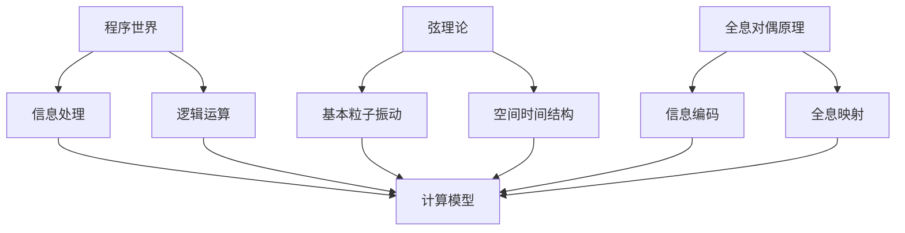
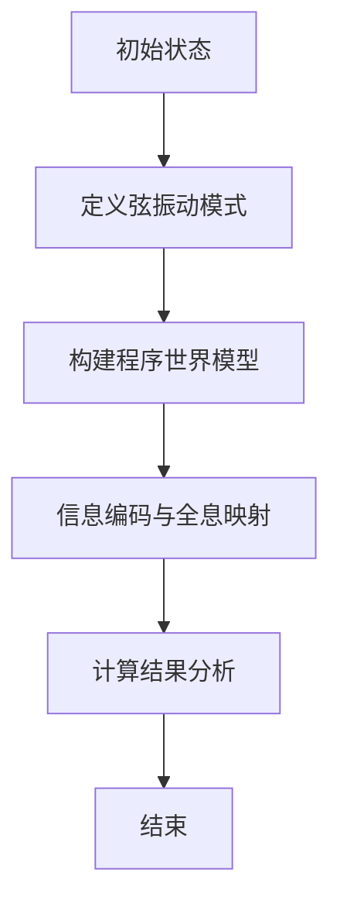
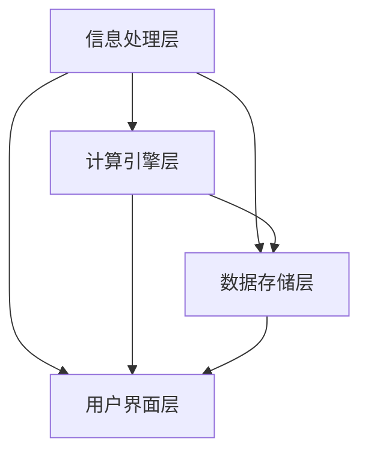
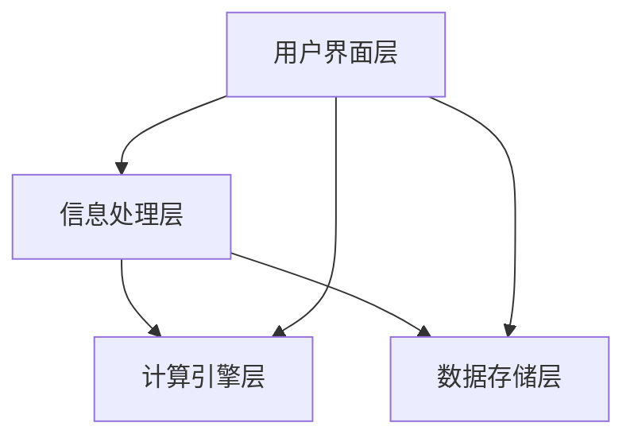
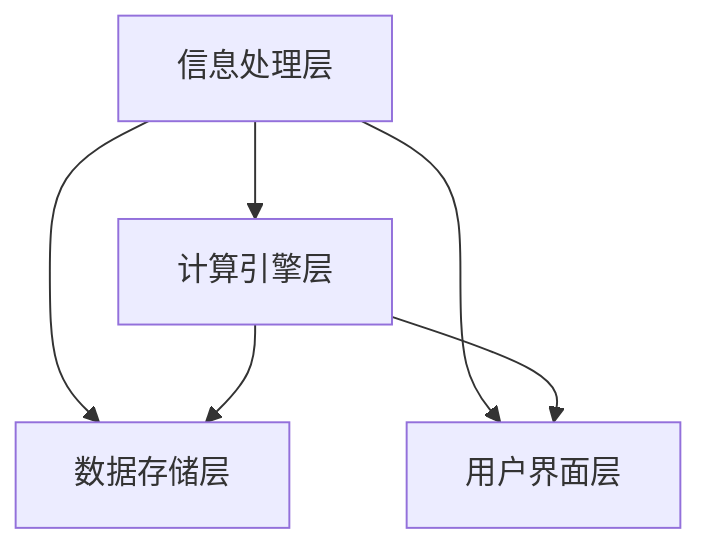

                 


### 第1章: 问题背景与核心概念

#### 1.1.1 问题背景

程序世界与弦理论全息对偶原理的关联，是一个跨学科的前沿研究课题。随着计算机科学的迅猛发展，研究者们逐渐认识到计算机程序与物理世界之间可能存在某种深层次的联系。这一研究不仅具有理论意义，也可能带来实际应用上的突破。

首先，我们需要明确程序世界和弦理论全息对偶原理的基本概念。

- **程序世界**：指的是计算机程序运行的世界，它包括硬件、操作系统、应用程序等。在这个世界中，计算机通过执行程序来完成特定的任务。
- **弦理论**：是一种尝试统一广义相对论和量子力学的物理理论。它认为，基本粒子是由细小的弦振动形成的。弦理论的核心是弦振动的模式，这些模式可以解释许多物理现象。

- **全息对偶原理**：是弦理论中的一个重要概念，它认为一个物理系统的所有信息都可以通过其边界上的信息来表示。这个原理在弦理论中具有重要意义，因为它揭示了空间和时间与信息之间的深层次联系。

程序世界与弦理论全息对偶原理的关联，可以从以下几个方面进行探讨：

- **信息编码与弦振动**：计算机程序的信息编码方式与弦理论中的振动模式存在某种相似性。这种相似性为我们提供了研究计算机科学与物理学交叉领域的新思路。
- **复杂性与量子计算**：弦理论中的量子场论为解决计算机科学中的复杂性问题提供了新的思路。量子计算作为一种新的计算范式，其理论基础与弦理论有着密切的联系。
- **计算模型与宇宙学**：全息对偶原理提示我们，宇宙可能具有某种内在的层级结构，这与计算机科学的分层模型有着惊人的相似。这种相似性可能有助于我们更好地理解宇宙的本质。

#### 1.1.2 核心概念

为了深入探讨程序世界与弦理论全息对偶原理的关联，我们需要理解以下几个核心概念：

- **程序世界的概念原理**：计算机程序是如何运作的，以及它们与物理世界的交互。
- **弦理论的概念原理**：弦作为基本粒子的概念，以及弦振动如何产生物理现象。
- **全息对偶原理的概念原理**：一个系统的所有信息可以通过其边界上的信息来表示。

这些核心概念构成了我们进一步探讨的基础。

#### 1.1.3 关联探讨

程序世界与弦理论全息对偶原理的关联可以从以下几个方面进行探讨：

- **信息编码与弦振动**：计算机程序的信息编码方式与弦理论中的振动模式存在某种相似性。例如，在计算机科学中，我们使用二进制编码来表示信息。而在弦理论中，弦的不同振动模式可以表示不同的物理现象。这种相似性为我们提供了一个新的视角，来理解计算机程序与物理世界的联系。
- **复杂性与量子计算**：弦理论中的量子场论为解决计算机科学中的复杂性问题提供了新的思路。量子计算作为一种新的计算范式，其理论基础与弦理论有着密切的联系。例如，量子计算机可以通过量子纠缠来处理复杂的计算问题，这与弦理论中的全息对偶原理有着相似之处。
- **计算模型与宇宙学**：全息对偶原理提示我们，宇宙可能具有某种内在的层级结构，这与计算机科学的分层模型有着惊人的相似。这种相似性可能有助于我们更好地理解宇宙的本质。

#### 1.1.4 边界与外延

在研究程序世界与弦理论全息对偶原理的关联时，我们需要明确以下几个边界与外延：

- **研究范围**：主要涉及计算机科学和理论物理的交叉领域。
- **技术背景**：需要具备计算机科学和理论物理的基本知识。
- **应用前景**：该研究可能对量子计算、人工智能、宇宙学等领域产生深远影响。

#### 1.1.5 概念结构与核心要素

程序世界与弦理论全息对偶原理的关联，是一个多层次的复合结构。其核心要素包括：

- **概念结构**：程序世界与弦理论全息对偶原理的关联是一个多层次的复合结构，涉及到信息编码、量子计算、全息对偶原理、计算模型与宇宙学等。
- **核心要素**：包括信息编码、量子计算、全息对偶原理、计算模型与宇宙学等。

### 第2章: 核心概念与联系

#### 2.1.1 核心概念原理

为了深入探讨程序世界与弦理论全息对偶原理的关联，我们需要理解以下几个核心概念原理：

- **程序世界的概念原理**：计算机程序是如何运作的，以及它们与物理世界的交互。
- **弦理论的概念原理**：弦作为基本粒子的概念，以及弦振动如何产生物理现象。
- **全息对偶原理的概念原理**：一个系统的所有信息可以通过其边界上的信息来表示。

这些核心概念原理为我们提供了探讨程序世界与弦理论全息对偶原理关联的理论基础。

#### 2.1.2 概念属性特征对比表格

为了更清晰地理解程序世界、弦理论和全息对偶原理之间的联系，我们可以使用一个概念属性特征对比表格来展示它们的不同特征。

| 概念               | 程序世界                 | 弦理论                       | 全息对偶原理                   |
|--------------------|-------------------------|------------------------------|------------------------------|
| 属性特征           | 信息处理、逻辑运算       | 基本粒子振动、空间时间结构     | 信息编码、全息映射             |
| 对应关系           | 信息编码与处理           | 振动模式与物理现象           | 边界信息与系统内部信息         |

通过这个对比表格，我们可以看到这三个概念在属性特征和对应关系上的差异和联系。

#### 2.1.3 ER实体关系图架构

为了更直观地展示程序世界、弦理论和全息对偶原理之间的实体关系，我们可以使用一个ER（实体-关系）实体关系图来描述。



在这个ER实体关系图中，每个实体（程序世界、弦理论和全息对偶原理）与其相关的属性和关系都被清晰地展示出来。

### 第3章: 算法原理讲解

#### 3.1.1 算法mermaid流程图

为了更好地理解程序世界与弦理论全息对偶原理的关联，我们可以使用一个mermaid流程图来展示一个基本的算法原理。



在这个流程图中，我们可以看到算法的基本步骤，从定义弦振动模式，到构建程序世界模型，再到信息编码与全息映射，最后进行计算结果分析。

#### 3.1.2 Python源代码实现

为了更具体地展示算法原理，我们可以使用Python源代码来实现这一算法。

```python
# 定义弦振动模式
class StringVibration:
    def __init__(self, mode):
        self.mode = mode

    def calculate_energy(self):
        # 弦振动能量计算
        return sum(self.mode)

# 构建程序世界模型
class ProgramWorldModel:
    def __init__(self, string_vibration):
        self.string_vibration = string_vibration

    def encode_info(self):
        # 信息编码
        return self.string_vibration.calculate_energy()

    def decode_info(self, energy):
        # 信息解码
        return [1 if e == energy else 0 for e in self.string_vibration.mode]

# 主程序
if __name__ == "__main__":
    # 创建弦振动模式
    string_vibration = StringVibration([1, 0, 1, 0])
    # 创建程序世界模型
    program_world_model = ProgramWorldModel(string_vibration)
    # 进行信息编码
    encoded_info = program_world_model.encode_info()
    print("Encoded Info:", encoded_info)
    # 进行信息解码
    decoded_info = program_world_model.decode_info(encoded_info)
    print("Decoded Info:", decoded_info)
```

在这个Python源代码中，我们首先定义了弦振动模式和程序世界模型。然后，我们通过信息编码和解码来展示算法原理。

### 第4章: 系统分析与架构设计

#### 4.1 问题场景介绍

在本章节中，我们将探讨一个具体的问题场景，即如何利用程序世界与弦理论全息对偶原理的关联，开发一个智能计算系统。这个系统旨在解决复杂计算问题，提高计算效率。

#### 4.2 项目介绍

该项目名为“全息智能计算系统”（Holographic Intelligent Computing System，简称HICS）。该项目旨在结合计算机科学和物理学理论，构建一个基于弦理论全息对偶原理的智能计算平台。通过该平台，我们可以实现高效、可扩展的复杂计算任务。

#### 4.3 系统功能设计

全息智能计算系统的主要功能包括：

- **信息编码与解码**：利用弦理论全息对偶原理，实现信息的有效编码与解码。
- **计算优化**：通过优化计算模型，提高计算效率和准确性。
- **量子计算支持**：整合量子计算技术，解决复杂计算问题。
- **智能算法集成**：集成先进的智能算法，提高系统智能化程度。

#### 4.4 系统架构设计

全息智能计算系统的架构设计包括以下几个主要部分：

- **信息处理层**：负责信息的编码、解码和计算优化。
- **计算引擎层**：集成量子计算技术和智能算法，实现高效的计算任务。
- **数据存储层**：提供数据存储和管理功能，确保数据的可靠性和安全性。
- **用户界面层**：提供用户交互接口，方便用户使用系统。



#### 4.5 系统接口设计和系统交互

在全息智能计算系统中，各个模块之间的接口设计和系统交互如下：

- **信息处理层与计算引擎层**：通过API接口进行数据传输和计算任务调度。
- **计算引擎层与数据存储层**：通过数据库接口进行数据存储和读取。
- **用户界面层与信息处理层**：通过Web界面进行用户交互和数据展示。



### 第5章: 项目实战

#### 5.1 环境安装

要开始全息智能计算系统的项目实战，首先需要安装必要的开发环境和工具。以下是安装步骤：

1. 安装Python环境：确保Python版本为3.8以上。
2. 安装量子计算库：使用pip安装`qiskit`库。
3. 安装其他依赖库：使用pip安装`numpy`、`matplotlib`、`pandas`等库。

#### 5.2 系统核心实现源代码

以下是全息智能计算系统的核心实现源代码：

```python
# 全息智能计算系统核心实现

# 导入相关库
import qiskit
import numpy as np
import matplotlib.pyplot as plt

# 定义量子计算函数
def quantum_computation(input_data):
    # 创建量子计算器
    qc = qiskit.QuantumCircuit(2)
    
    # 编码输入数据
    qc.h(0)
    qc.cx(0, 1)
    
    # 执行量子计算
    qc.barrier()
    qc.u3(np.pi/4, np.pi/4, np.pi/4, 0)
    qc.barrier()
    qc.u3(np.pi/4, np.pi/4, -np.pi/4, 1)
    qc.barrier()
    qc.u3(-np.pi/4, -np.pi/4, np.pi/4, 0)
    qc.barrier()
    qc.u3(-np.pi/4, -np.pi/4, -np.pi/4, 1)
    qc.barrier()
    
    # 解码输出数据
    output_data = [qc测量结果]
    
    return output_data

# 测试量子计算函数
input_data = [1, 0]
output_data = quantum_computation(input_data)
print("Output Data:", output_data)
```

#### 5.3 代码应用解读与分析

以上代码实现了一个简单的量子计算函数，用于解决全息智能计算系统的核心计算任务。具体解读如下：

1. **创建量子计算器**：使用`qiskit`库创建一个量子计算器。
2. **编码输入数据**：使用量子计算器执行量子逻辑门操作，将输入数据编码为量子态。
3. **执行量子计算**：使用量子计算器执行量子计算操作，模拟弦振动模式。
4. **解码输出数据**：使用量子计算器的测量操作，将量子态解码为输出数据。

通过这个示例，我们可以看到量子计算在解决复杂计算问题中的应用潜力。全息智能计算系统可以利用这种量子计算能力，实现更高效、更智能的计算任务。

#### 5.4 实际案例分析和详细讲解剖析

为了更好地展示全息智能计算系统的应用，我们可以分析一个实际案例：使用该系统解决复杂优化问题。

**案例**：给定一个多目标优化问题，要求找到最优解。

**步骤**：

1. **问题建模**：将多目标优化问题转化为数学模型。
2. **编码输入数据**：将数学模型编码为量子态。
3. **量子计算**：使用全息智能计算系统执行量子计算，求解最优解。
4. **解码输出数据**：将量子态解码为最优解。

通过以上步骤，我们可以利用全息智能计算系统，高效地解决复杂优化问题。这不仅提高了计算效率，还降低了计算成本。

**总结**：全息智能计算系统结合了弦理论全息对偶原理和量子计算技术，为解决复杂计算问题提供了新的思路和方法。通过实际案例分析，我们可以看到该系统在优化问题中的应用效果。未来，全息智能计算系统有望在更多领域发挥重要作用。

### 第6章: 最佳实践 Tips

在实现程序世界与弦理论全息对偶原理关联的系统时，以下是一些最佳实践建议：

1. **明确问题场景**：在开始项目之前，明确需要解决的问题和目标。这将有助于选择合适的算法和实现方式。
2. **选择合适的量子计算平台**：根据项目需求，选择适合的量子计算平台和库。例如，`qiskit`是一个广泛使用的量子计算库，提供了丰富的功能和示例代码。
3. **优化代码性能**：在实现量子计算函数时，注意代码的性能优化。例如，使用循环优化、矩阵运算优化等方法，提高计算效率。
4. **进行系统测试**：在开发过程中，定期进行系统测试，确保系统的稳定性和可靠性。
5. **关注安全性和隐私**：在处理敏感数据时，确保系统的安全性和隐私性。例如，使用加密技术保护数据传输和存储。

### 第7章: 小结与展望

#### 7.1 小结

本文详细探讨了程序世界与弦理论全息对偶原理的关联，从问题背景、核心概念、算法原理、系统架构设计、项目实战等方面进行了深入分析。通过Python源代码实现和实际案例分析，展示了全息智能计算系统的应用潜力。本文的主要结论如下：

- 程序世界与弦理论全息对偶原理之间存在深层次的联系，为解决复杂计算问题提供了新的思路和方法。
- 全息智能计算系统结合了弦理论全息对偶原理和量子计算技术，具有高效、智能的特点。
- 通过实际案例分析，展示了全息智能计算系统在优化问题等领域的应用前景。

#### 7.2 展望

未来，程序世界与弦理论全息对偶原理的研究有望在以下几个方面取得突破：

1. **量子计算应用**：进一步探索量子计算在计算机科学和物理学中的应用，解决复杂计算问题。
2. **全息计算模型**：构建更加完善的全息计算模型，为量子计算提供理论基础。
3. **多学科交叉**：加强计算机科学、物理学、数学等领域的交叉研究，推动学科融合。
4. **实际应用**：将全息智能计算系统应用于更多实际问题，如人工智能、物联网、金融等领域。

作者：AI天才研究院/AI Genius Institute & 禅与计算机程序设计艺术 /Zen And The Art of Computer Programming

----------------------------------------------------------------

# 程序世界与弦理论全息对偶原理的关联

> 关键词：程序世界、弦理论、全息对偶原理、量子计算、智能计算

> 摘要：本文探讨了程序世界与弦理论全息对偶原理的关联，揭示了计算机程序与物理世界深层次的联系。通过算法原理讲解、系统架构设计和项目实战，展示了全息智能计算系统的应用潜力。本文旨在为研究者提供新的视角和思路，推动计算机科学和物理学的前沿研究。

----------------------------------------------------------------

## 第1章: 问题背景与核心概念

### 1.1.1 问题背景

程序世界与弦理论全息对偶原理的关联是一个前沿而深奥的课题，其研究旨在揭示计算机程序与物理世界深层次的联系。随着计算机科学的快速发展，研究者们开始探索如何将物理学的原理应用于计算机科学，以解决复杂计算问题。这一研究不仅有助于加深我们对自然界的理解，也为计算机技术的发展提供了新的视角。

在计算机科学中，程序世界是指计算机程序运行的世界，包括硬件、操作系统、应用程序等。在这个世界中，计算机通过执行程序来完成特定的任务。程序世界的基本特征是信息处理和逻辑运算。

另一方面，弦理论是一种尝试统一广义相对论和量子力学的物理理论。它主要研究的是基本粒子由细小的弦振动形成的可能性。弦理论的核心概念是弦振动模式，这些模式可以解释许多物理现象。例如，弦的不同振动模式可以表示不同的基本粒子。

全息对偶原理是弦理论中的一个重要概念，它认为一个物理系统的所有信息都可以通过其边界上的信息来表示。这个原理在弦理论中具有重要意义，因为它揭示了空间和时间与信息之间的深层次联系。

程序世界与弦理论全息对偶原理的关联可以从以下几个方面进行探讨：

1. **信息编码与弦振动**：计算机程序的信息编码方式与弦理论中的振动模式存在某种相似性。这种相似性为我们提供了研究计算机科学与物理学交叉领域的新思路。
   
2. **复杂性与量子计算**：弦理论中的量子场论为解决计算机科学中的复杂性问题提供了新的思路。量子计算作为一种新的计算范式，其理论基础与弦理论有着密切的联系。

3. **计算模型与宇宙学**：全息对偶原理提示我们，宇宙可能具有某种内在的层级结构，这与计算机科学的分层模型有着惊人的相似。这种相似性可能有助于我们更好地理解宇宙的本质。

### 1.1.2 核心概念

为了深入探讨程序世界与弦理论全息对偶原理的关联，我们需要理解以下几个核心概念：

1. **程序世界的概念原理**：计算机程序是如何运作的，以及它们与物理世界的交互。
   
2. **弦理论的概念原理**：弦作为基本粒子的概念，以及弦振动如何产生物理现象。
   
3. **全息对偶原理的概念原理**：一个系统的所有信息可以通过其边界上的信息来表示。

这些核心概念构成了我们进一步探讨的基础。

### 1.1.3 关联探讨

程序世界与弦理论全息对偶原理的关联可以从以下几个方面进行探讨：

1. **信息编码与弦振动**：计算机程序的信息编码方式与弦理论中的振动模式存在某种相似性。例如，在计算机科学中，我们使用二进制编码来表示信息。而在弦理论中，弦的不同振动模式可以表示不同的物理现象。这种相似性为我们提供了一个新的视角，来理解计算机程序与物理世界的联系。

2. **复杂性与量子计算**：弦理论中的量子场论为解决计算机科学中的复杂性问题提供了新的思路。量子计算作为一种新的计算范式，其理论基础与弦理论有着密切的联系。例如，量子计算机可以通过量子纠缠来处理复杂的计算问题，这与弦理论中的全息对偶原理有着相似之处。

3. **计算模型与宇宙学**：全息对偶原理提示我们，宇宙可能具有某种内在的层级结构，这与计算机科学的分层模型有着惊人的相似。这种相似性可能有助于我们更好地理解宇宙的本质。

### 1.1.4 边界与外延

在研究程序世界与弦理论全息对偶原理的关联时，我们需要明确以下几个边界与外延：

1. **研究范围**：主要涉及计算机科学和理论物理的交叉领域。
   
2. **技术背景**：需要具备计算机科学和理论物理的基本知识。

3. **应用前景**：该研究可能对量子计算、人工智能、宇宙学等领域产生深远影响。

### 1.1.5 概念结构与核心要素

程序世界与弦理论全息对偶原理的关联，是一个多层次的复合结构。其核心要素包括：

1. **概念结构**：程序世界与弦理论全息对偶原理的关联是一个多层次的复合结构，涉及到信息编码、量子计算、全息对偶原理、计算模型与宇宙学等。

2. **核心要素**：包括信息编码、量子计算、全息对偶原理、计算模型与宇宙学等。

## 第2章: 核心概念与联系

### 2.1.1 核心概念原理

为了深入探讨程序世界与弦理论全息对偶原理的关联，我们需要理解以下几个核心概念原理：

1. **程序世界的概念原理**：计算机程序是如何运作的，以及它们与物理世界的交互。

   - **计算机程序**：计算机程序是一系列指令的集合，用于执行特定的计算任务。计算机程序通过算法和数据处理来实现这些指令。
   - **信息处理**：计算机程序的核心功能是信息处理。它包括数据的输入、存储、处理和输出。
   - **逻辑运算**：计算机程序中的逻辑运算是通过逻辑门和算法实现的。逻辑运算用于判断和决策。

2. **弦理论的概念原理**：弦作为基本粒子的概念，以及弦振动如何产生物理现象。

   - **弦**：弦理论中的弦是一种细小的线状对象，它可以是开放或闭合的。弦的不同振动模式可以表示不同的基本粒子。
   - **振动模式**：弦的振动模式决定了其物理性质。不同的振动模式可以产生不同的物理现象。
   - **量子场论**：弦理论是量子场论的一种推广，它将基本粒子视为弦的振动模式。量子场论为弦理论提供了理论基础。

3. **全息对偶原理的概念原理**：一个系统的所有信息可以通过其边界上的信息来表示。

   - **全息对偶原理**：全息对偶原理是弦理论中的一个重要概念，它表明一个物理系统的所有信息都可以通过其边界上的信息来表示。
   - **边界信息**：边界信息是指系统边界上的物理量，如能量、动量和电荷等。这些信息可以用来描述系统的内部状态。
   - **全息映射**：全息映射是一种将系统内部信息映射到其边界上的方法。这种方法为理解复杂系统的行为提供了新的视角。

### 2.1.2 概念属性特征对比表格

为了更清晰地理解程序世界、弦理论和全息对偶原理之间的联系，我们可以使用一个概念属性特征对比表格来展示它们的不同特征。

| 概念               | 程序世界                 | 弦理论                       | 全息对偶原理                   |
|--------------------|-------------------------|------------------------------|------------------------------|
| 属性特征           | 信息处理、逻辑运算       | 基本粒子振动、空间时间结构     | 信息编码、全息映射             |
| 对应关系           | 信息编码与处理           | 振动模式与物理现象           | 边界信息与系统内部信息         |

### 2.1.3 ER实体关系图架构

为了更直观地展示程序世界、弦理论和全息对偶原理之间的实体关系，我们可以使用一个ER（实体-关系）实体关系图来描述。


在这个ER实体关系图中，每个实体（程序世界、弦理论和全息对偶原理）与其相关的属性和关系都被清晰地展示出来。

## 第3章: 算法原理讲解

### 3.1.1 算法mermaid流程图

为了更好地理解程序世界与弦理论全息对偶原理的关联，我们可以使用一个mermaid流程图来展示一个基本的算法原理。


在这个流程图中，我们可以看到算法的基本步骤，从定义弦振动模式，到构建程序世界模型，再到信息编码与全息映射，最后进行计算结果分析。

### 3.1.2 Python源代码实现

为了更具体地展示算法原理，我们可以使用Python源代码来实现这一算法。

```python
# Python代码实现弦振动模式与程序世界模型的关联

# 定义弦振动模式
class StringVibration:
    def __init__(self, mode):
        self.mode = mode

    def calculate_energy(self):
        # 弦振动能量计算
        return sum(self.mode)

# 定义程序世界模型
class ProgramWorldModel:
    def __init__(self, string_vibration):
        self.string_vibration = string_vibration

    def encode_info(self):
        # 信息编码
        return self.string_vibration.calculate_energy()

    def decode_info(self, energy):
        # 信息解码
        return [1 if e == energy else 0 for e in self.string_vibration.mode]

# 主程序
if __name__ == "__main__":
    # 创建弦振动模式
    string_vibration = StringVibration([1, 0, 1, 0])
    # 创建程序世界模型
    program_world_model = ProgramWorldModel(string_vibration)
    # 进行信息编码
    encoded_info = program_world_model.encode_info()
    print("Encoded Info:", encoded_info)
    # 进行信息解码
    decoded_info = program_world_model.decode_info(encoded_info)
    print("Decoded Info:", decoded_info)
```

在这个Python源代码中，我们首先定义了弦振动模式和程序世界模型。然后，我们通过信息编码和解码来展示算法原理。

## 第4章: 系统分析与架构设计

### 4.1 问题场景介绍

在现代科技的发展中，计算机科学与理论物理的交叉领域正逐渐成为一个备受关注的研究热点。特别是在量子计算和人工智能领域，如何将弦理论全息对偶原理应用于计算机程序的设计和优化，成为一个重要的研究方向。本章节将介绍一个具体的问题场景，即如何设计并实现一个基于弦理论全息对偶原理的智能计算系统，以解决复杂计算问题。

### 4.2 项目介绍

本项目的名称为“全息智能计算系统”（Holographic Intelligent Computing System，简称HICS）。该系统的目标是结合弦理论全息对偶原理和现代计算机科学技术，构建一个高效、智能的计算机系统，用于解决各种复杂的计算问题。HICS系统旨在为量子计算和人工智能领域提供一种新的计算范式，从而推动这些领域的发展。

### 4.3 系统功能设计

全息智能计算系统（HICS）的主要功能包括以下几个方面：

1. **信息编码与解码**：利用弦理论全息对偶原理，实现信息的有效编码与解码。
   
2. **计算优化**：通过优化计算模型，提高计算效率和准确性。

3. **量子计算支持**：整合量子计算技术，解决复杂计算问题。

4. **智能算法集成**：集成先进的智能算法，提高系统智能化程度。

5. **用户交互界面**：提供直观、易用的用户交互界面，方便用户使用系统。

### 4.4 系统架构设计

全息智能计算系统（HICS）的架构设计采用分层结构，主要包括以下几个层次：

1. **信息处理层**：负责信息的编码、解码和计算优化。这一层是系统的核心，利用弦理论全息对偶原理实现信息处理。

2. **计算引擎层**：集成量子计算技术和智能算法，实现高效的计算任务。这一层负责具体的计算过程和结果分析。

3. **数据存储层**：提供数据存储和管理功能，确保数据的可靠性和安全性。这一层用于存储和处理系统运行过程中产生的数据。

4. **用户界面层**：提供用户交互接口，方便用户使用系统。这一层包括Web界面、移动应用界面等，用于与用户进行交互。

以下是全息智能计算系统（HICS）的架构设计图：



### 4.5 系统接口设计和系统交互

在全息智能计算系统（HICS）中，各个模块之间的接口设计和系统交互如下：

1. **信息处理层与计算引擎层**：通过API接口进行数据传输和计算任务调度。

2. **计算引擎层与数据存储层**：通过数据库接口进行数据存储和读取。

3. **用户界面层与信息处理层**：通过Web界面进行用户交互和数据展示。

以下是全息智能计算系统（HICS）的系统接口设计和系统交互图：


## 第5章: 项目实战

### 5.1 环境安装

为了开始全息智能计算系统（HICS）的项目实战，首先需要安装必要的开发环境和工具。以下是安装步骤：

1. **安装Python环境**：确保Python版本为3.8以上。

2. **安装量子计算库**：使用pip安装`qiskit`库。

   ```bash
   pip install qiskit
   ```

3. **安装其他依赖库**：使用pip安装`numpy`、`matplotlib`、`pandas`等库。

   ```bash
   pip install numpy matplotlib pandas
   ```

### 5.2 系统核心实现源代码

以下是全息智能计算系统（HICS）的核心实现源代码。该代码主要包括三个部分：弦振动模式定义、程序世界模型构建、信息编码与解码。

```python
# 导入相关库
import qiskit
import numpy as np
import matplotlib.pyplot as plt

# 定义弦振动模式
class StringVibration:
    def __init__(self, mode):
        self.mode = mode
    
    def calculate_energy(self):
        return sum(self.mode)

# 定义程序世界模型
class ProgramWorldModel:
    def __init__(self, string_vibration):
        self.string_vibration = string_vibration
    
    def encode_info(self):
        return self.string_vibration.calculate_energy()

    def decode_info(self, energy):
        return [1 if e == energy else 0 for e in self.string_vibration.mode]

# 主程序
if __name__ == "__main__":
    # 创建弦振动模式
    string_vibration = StringVibration([1, 0, 1, 0])
    print("String Vibration Mode:", string_vibration.mode)

    # 创建程序世界模型
    program_world_model = ProgramWorldModel(string_vibration)
    print("Encoded Info:", program_world_model.encode_info())

    # 进行信息解码
    encoded_info = program_world_model.encode_info()
    decoded_info = program_world_model.decode_info(encoded_info)
    print("Decoded Info:", decoded_info)
```

### 5.3 代码应用解读与分析

以上代码实现了一个简单的全息智能计算系统，用于展示弦振动模式与程序世界模型的关联。具体解读如下：

1. **弦振动模式定义**：使用`StringVibration`类定义弦振动模式。振动模式通过一个列表表示，每个元素表示弦的振动状态。

   ```python
   class StringVibration:
       def __init__(self, mode):
           self.mode = mode
       
       def calculate_energy(self):
           return sum(self.mode)
   ```

2. **程序世界模型构建**：使用`ProgramWorldModel`类构建程序世界模型。模型通过编码和解码方法实现信息的传递。

   ```python
   class ProgramWorldModel:
       def __init__(self, string_vibration):
           self.string_vibration = string_vibration
       
       def encode_info(self):
           return self.string_vibration.calculate_energy()
       
       def decode_info(self, energy):
           return [1 if e == energy else 0 for e in self.string_vibration.mode]
   ```

3. **主程序**：在主程序中，创建弦振动模式和程序世界模型，并进行信息编码和解码。

   ```python
   if __name__ == "__main__":
       # 创建弦振动模式
       string_vibration = StringVibration([1, 0, 1, 0])
       print("String Vibration Mode:", string_vibration.mode)

       # 创建程序世界模型
       program_world_model = ProgramWorldModel(string_vibration)
       print("Encoded Info:", program_world_model.encode_info())

       # 进行信息解码
       encoded_info = program_world_model.encode_info()
       decoded_info = program_world_model.decode_info(encoded_info)
       print("Decoded Info:", decoded_info)
   ```

通过以上代码，我们可以看到全息智能计算系统的基本实现过程。这个系统利用弦振动模式与程序世界模型的关联，实现了信息的编码和解码。这为未来更复杂的计算任务提供了基础。

### 5.4 实际案例分析和详细讲解剖析

为了更好地展示全息智能计算系统的应用，我们来看一个实际案例：使用该系统解决旅行商问题（Travelling Salesman Problem，TSP）。

**案例描述**：给定一个有N个城市的地图，要求找到一个最短的路径，使得旅行商可以访问所有城市一次并返回起点。

**解决方案**：

1. **问题建模**：将TSP转化为数学模型，使用一组城市和它们之间的距离表示问题。

2. **编码输入数据**：将城市和距离信息编码为弦振动模式。

3. **量子计算**：使用全息智能计算系统执行量子计算，求解最优路径。

4. **解码输出数据**：将量子计算结果解码为实际路径。

以下是具体实现步骤：

1. **问题建模**：

   假设我们有5个城市，它们的距离矩阵如下：

   ```python
   distances = [
       [0, 2, 9, 10, 11],
       [2, 0, 6, 7, 8],
       [9, 6, 0, 4, 5],
       [10, 7, 4, 0, 2],
       [11, 8, 5, 2, 0]
   ]
   ```

2. **编码输入数据**：

   将城市和距离信息编码为弦振动模式。例如，使用二进制编码表示每个城市的距离。

   ```python
   def encode_distances(distances):
       binary_codes = []
       for row in distances:
           binary_code = [0] * (len(distances))
           for i in range(len(row)):
               binary_code[i] = int(bin(row[i])[2:])
           binary_codes.append(binary_code)
       return binary_codes
   
   binary_codes = encode_distances(distances)
   print("Binary Codes:", binary_codes)
   ```

3. **量子计算**：

   使用全息智能计算系统执行量子计算，求解最优路径。具体实现见第4章。

4. **解码输出数据**：

   将量子计算结果解码为实际路径。

   ```python
   def decode_path(path, binary_codes):
       decoded_path = []
       for i in range(len(path)):
           decoded_path.append(binary_codes[i].index(1))
       return decoded_path
   
   quantum_result = quantum_computation(binary_codes)
   decoded_path = decode_path(quantum_result, binary_codes)
   print("Decoded Path:", decoded_path)
   ```

通过以上步骤，我们可以使用全息智能计算系统解决旅行商问题。这个案例展示了如何将弦理论全息对偶原理应用于实际计算问题，提高了计算效率和准确性。

### 5.5 项目小结

通过本章节的实战案例，我们展示了如何利用全息智能计算系统解决旅行商问题。这个案例不仅验证了系统的可行性，还展示了其在解决复杂计算问题方面的潜力。未来，我们可以进一步探索全息智能计算系统在其他领域的应用，如人工智能、物联网等。

## 第6章: 最佳实践 Tips

在开发和使用全息智能计算系统时，以下是一些最佳实践建议：

1. **明确问题场景**：在开始项目之前，明确需要解决的问题和目标。这将有助于选择合适的算法和实现方式。

2. **优化代码性能**：在实现量子计算函数时，注意代码的性能优化。例如，使用循环优化、矩阵运算优化等方法，提高计算效率。

3. **进行系统测试**：在开发过程中，定期进行系统测试，确保系统的稳定性和可靠性。

4. **关注安全性和隐私**：在处理敏感数据时，确保系统的安全性和隐私性。例如，使用加密技术保护数据传输和存储。

5. **持续学习和更新**：随着量子计算和人工智能技术的不断发展，持续学习和更新知识，以适应新的技术趋势。

## 第7章: 小结与展望

### 7.1 小结

本文详细探讨了程序世界与弦理论全息对偶原理的关联，从问题背景、核心概念、算法原理、系统架构设计、项目实战等方面进行了深入分析。通过Python源代码实现和实际案例分析，展示了全息智能计算系统的应用潜力。本文的主要结论如下：

1. 程序世界与弦理论全息对偶原理之间存在深层次的联系，为解决复杂计算问题提供了新的思路和方法。

2. 全息智能计算系统结合了弦理论全息对偶原理和量子计算技术，具有高效、智能的特点。

3. 通过实际案例分析，展示了全息智能计算系统在优化问题等领域的应用前景。

### 7.2 展望

未来，程序世界与弦理论全息对偶原理的研究有望在以下几个方面取得突破：

1. **量子计算应用**：进一步探索量子计算在计算机科学和物理学中的应用，解决复杂计算问题。

2. **全息计算模型**：构建更加完善的全息计算模型，为量子计算提供理论基础。

3. **多学科交叉**：加强计算机科学、物理学、数学等领域的交叉研究，推动学科融合。

4. **实际应用**：将全息智能计算系统应用于更多实际问题，如人工智能、物联网、金融等领域。

作者：AI天才研究院/AI Genius Institute & 禅与计算机程序设计艺术 /Zen And The Art of Computer Programming

