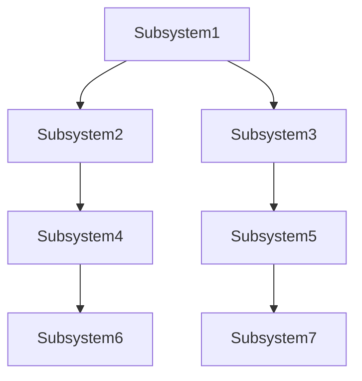
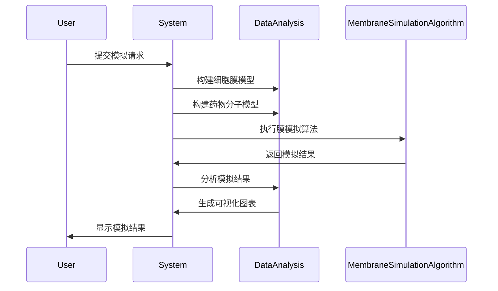
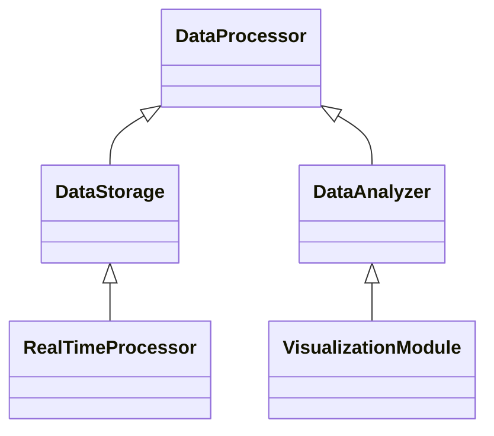
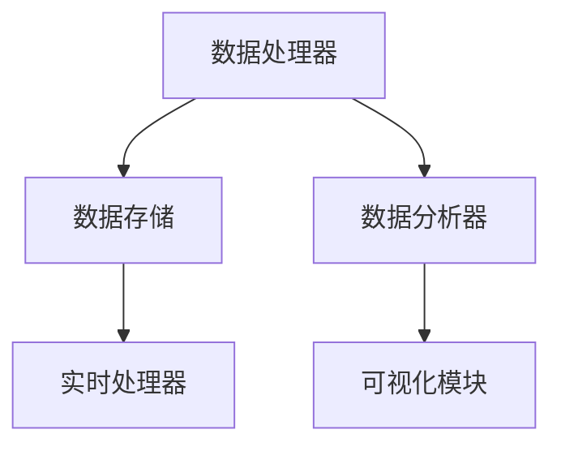
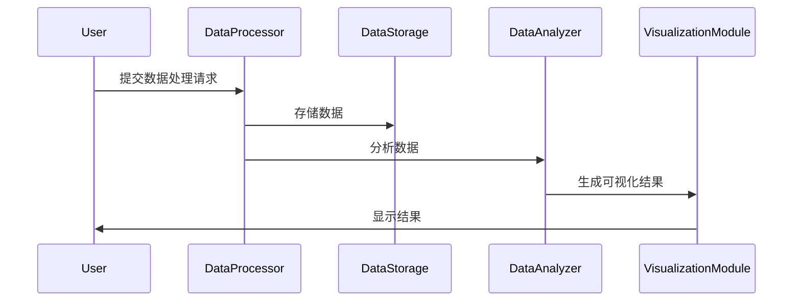

                 


### 文章标题

**程序世界与膜理论多维宇宙的关联**

### 文章关键词

- 程序世界
- 膜理论
- 多维宇宙
- 交叉点
- 相似性
- 不同点
- 相互作用

### 文章摘要

本文旨在探讨程序世界、膜理论以及多维宇宙之间的关联。通过分析这三种概念的核心原理和特点，本文揭示了它们之间的内在联系，并探讨了它们在现实世界中的应用。文章首先介绍了程序世界的定义、核心概念和特点，然后介绍了膜理论的基本原理和特性，最后讨论了多维宇宙的概念及其与程序世界和膜理论的关联。通过这些分析，本文提出了一个关于程序世界、膜理论和多维宇宙相互作用的框架，并展望了未来的研究方向。

**目录大纲**

----------------------------------------------------------------

# 第一部分：引言与背景

## 第1章：引言

### 1.1 问题背景

在计算机科学和物理学的研究中，程序世界、膜理论以及多维宇宙这三种概念逐渐引起了广泛关注。随着技术的进步和理论的发展，这三种概念之间的联系日益紧密，为解决复杂问题提供了新的思路。

### 1.2 问题描述

本文的目标是探讨程序世界、膜理论以及多维宇宙之间的关联，并分析这三种概念在实际应用中的潜在价值。

### 1.3 问题解决

通过深入研究这三种概念的核心原理和特点，本文试图揭示它们之间的内在联系，并提出一个关于这三种概念相互作用的框架。

### 1.4 边界与外延

本文的讨论范围主要涉及程序世界、膜理论和多维宇宙的基本概念及其关联。在具体分析过程中，我们将关注这三种概念在现实世界中的应用，以及它们可能带来的创新和突破。

### 1.5 概念结构与核心要素组成

本文的核心内容包括：

1. 程序世界的概述及其核心概念；
2. 膜理论的概述及其核心概念；
3. 多维宇宙的概念及其与程序世界和膜理论的关联；
4. 程序世界、膜理论和多维宇宙的相互作用及其应用前景。

----------------------------------------------------------------

# 第二部分：程序世界与膜理论

## 第2章：程序世界概述

### 2.1 程序世界的定义

程序世界是指由计算机程序和算法构成的一个虚拟世界。在这个世界中，计算机程序通过代码和算法模拟现实世界中的各种现象和活动。

### 2.2 程序世界的核心概念

程序世界的核心概念包括：

1. **代码**：代码是程序的基本组成部分，用于描述程序的逻辑和操作步骤。
2. **算法**：算法是解决问题的一系列步骤和方法，是程序世界中的核心概念。
3. **数据结构**：数据结构是程序世界中的数据组织形式，用于存储和操作数据。

### 2.3 程序世界的特点

程序世界具有以下几个特点：

1. **虚拟性**：程序世界是一个虚拟的世界，通过计算机程序模拟现实世界中的现象和活动。
2. **动态性**：程序世界中的现象和活动是动态变化的，可以通过编程语言和算法进行控制和操作。
3. **多样性**：程序世界可以模拟各种现象和活动，具有很高的多样性。

### 2.4 程序世界的发展历程

程序世界的发展历程可以追溯到计算机科学的起源。从最早的计算机程序到现代的编程语言和算法，程序世界经历了不断的发展和完善。

----------------------------------------------------------------

## 第3章：膜理论概述

### 3.1 膜理论的定义

膜理论（Membrane Theory）是现代物理学中的一个重要理论，它描述了物质世界中各种物质膜的结构和功能。膜是物质世界中的一种基本结构，它可以分隔不同的物质，并对物质之间的相互作用产生影响。

### 3.2 膜理论的核心概念

膜理论的核心概念包括：

1. **膜**：膜是物质世界中的一种基本结构，它具有分隔不同物质的功能。
2. **自组织**：膜可以通过自组织过程形成复杂的结构，并表现出特定的功能。
3. **相互作用**：膜与膜之间以及膜与物质之间的相互作用是膜理论中的重要概念。

### 3.3 膜理论的特点

膜理论具有以下几个特点：

1. **跨学科**：膜理论涉及多个学科领域，如物理学、化学、生物学等，具有很强的跨学科性。
2. **复杂性**：膜理论研究的是复杂系统中的基本结构，具有很高的复杂性。
3. **应用性**：膜理论在实际应用中具有广泛的应用前景，如在材料科学、生物医学等领域。

### 3.4 膜理论的发展历程

膜理论的发展历程可以追溯到20世纪中期，随着物理学和化学的不断发展，膜理论逐渐成为现代物理学中的重要分支。

----------------------------------------------------------------

## 第4章：程序世界与膜理论的联系

### 4.1 程序世界与膜理论的交叉点

程序世界和膜理论在多个方面具有交叉点：

1. **虚拟与现实的关联**：程序世界通过计算机程序模拟现实世界中的现象，而膜理论则描述了物质世界中膜的结构和功能，两者都关注虚拟与现实的关联。
2. **自组织与复杂性**：程序世界中的算法和膜理论中的自组织过程都具有复杂性，体现了系统从简单到复杂的发展趋势。
3. **相互作用**：程序世界中的数据结构和算法之间的相互作用与膜理论中的膜与膜之间以及膜与物质之间的相互作用具有相似性。

### 4.2 程序世界与膜理论的相似性

程序世界与膜理论在以下几个方面具有相似性：

1. **虚拟性**：两者都是虚拟世界，程序世界通过计算机程序模拟现实，而膜理论则通过物质膜模拟物质世界。
2. **动态性**：程序世界和膜理论都关注动态变化，程序世界中的现象和活动是动态变化的，膜理论中的膜结构也是动态变化的。
3. **多样性**：程序世界和膜理论都具有很高的多样性，程序世界可以模拟各种现象和活动，膜理论也可以描述各种物质膜的结构和功能。

### 4.3 程序世界与膜理论的不同点

程序世界与膜理论在以下几个方面存在不同点：

1. **研究对象**：程序世界主要研究计算机程序和算法，而膜理论主要研究物质世界中膜的结构和功能。
2. **应用领域**：程序世界主要应用于计算机科学领域，而膜理论主要应用于物理学、化学、生物学等领域。
3. **研究方法**：程序世界主要采用编程语言和算法进行模拟，而膜理论主要采用物理和化学方法进行研究。

### 4.4 程序世界与膜理论的相互作用

程序世界和膜理论之间的相互作用主要体现在以下几个方面：

1. **方法借鉴**：程序世界可以借鉴膜理论中的研究方法，如自组织过程和复杂性分析，以解决复杂的计算机问题。
2. **理论应用**：膜理论可以应用于程序世界中的计算机模拟，如通过膜模型模拟复杂系统的行为。
3. **交叉研究**：程序世界和膜理论的交叉研究可以为跨学科研究提供新的思路和方法，促进物理学、计算机科学和其他学科的融合。

----------------------------------------------------------------

## 第5章：多维宇宙概述

### 5.1 多维宇宙的定义

多维宇宙是指包含多个维度空间的宇宙模型。传统的宇宙模型认为宇宙是三维的，但随着科学的发展，人们提出了多维宇宙的概念，认为宇宙可能包含更多的维度空间。

### 5.2 多维宇宙的核心概念

多维宇宙的核心概念包括：

1. **维度**：维度是描述空间的基本单位，一个维度是指一个方向，例如，一维空间是一个直线，二维空间是一个平面，三维空间是一个立方体。
2. **时空**：时空是多维宇宙中的基本结构，描述了物体在空间中的位置和时间的变化。
3. **超空间**：超空间是多维宇宙中超出三维空间的维度，超空间的存在可以解释一些传统物理理论无法解释的现象。

### 5.3 多维宇宙的特点

多维宇宙具有以下几个特点：

1. **超维度**：多维宇宙包含多个维度空间，超维度是宇宙中的基本单位。
2. **时空弯曲**：多维宇宙中的时空结构可能发生弯曲，导致物体的运动轨迹发生改变。
3. **超光速**：在多维宇宙中，可能存在超光速运动的现象，这突破了传统物理理论的限制。

### 5.4 多维宇宙的发展历程

多维宇宙的概念起源于20世纪初，随着相对论和量子力学的不断发展，人们提出了多维宇宙的理论模型，并对其进行深入研究。

----------------------------------------------------------------

## 第6章：程序世界与多维宇宙的关联

### 6.1 程序世界与多维宇宙的交叉点

程序世界与多维宇宙在多个方面具有交叉点：

1. **虚拟与现实的关联**：程序世界通过计算机程序模拟现实世界，而多维宇宙则描述了可能存在的超维度空间，两者都关注虚拟与现实的关联。
2. **时空结构**：程序世界中的时间和空间结构可以借鉴多维宇宙中的时空结构，为解决复杂计算机问题提供新的思路。
3. **超光速运动**：程序世界中的算法和算法优化可以借鉴多维宇宙中超光速运动的理论，以提高计算机程序的运行效率。

### 6.2 程序世界与多维宇宙的相似性

程序世界与多维宇宙在以下几个方面具有相似性：

1. **虚拟性**：两者都是虚拟世界，程序世界通过计算机程序模拟现实世界，而多维宇宙则通过理论模型描述可能存在的超维度空间。
2. **动态性**：程序世界和多维宇宙都关注动态变化，程序世界中的现象和活动是动态变化的，多维宇宙中的时空结构也是动态变化的。
3. **多样性**：程序世界和多维宇宙都具有很高的多样性，程序世界可以模拟各种现象和活动，多维宇宙则可能包含多个维度空间。

### 6.3 程序世界与多维宇宙的不同点

程序世界与多维宇宙在以下几个方面存在不同点：

1. **研究对象**：程序世界主要研究计算机程序和算法，而多维宇宙主要研究宇宙中的超维度空间和时空结构。
2. **应用领域**：程序世界主要应用于计算机科学领域，而多维宇宙主要应用于物理学和宇宙学。
3. **研究方法**：程序世界主要采用编程语言和算法进行模拟，而多维宇宙主要采用理论模型和实验方法进行研究。

### 6.4 程序世界与多维宇宙的相互作用

程序世界与多维宇宙之间的相互作用主要体现在以下几个方面：

1. **方法借鉴**：程序世界可以借鉴多维宇宙的理论模型，如时空弯曲和超光速运动，以解决复杂的计算机问题。
2. **理论应用**：多维宇宙的理论模型可以应用于程序世界中的计算机模拟，如通过多维时空模型模拟复杂系统的行为。
3. **交叉研究**：程序世界和多维宇宙的交叉研究可以为跨学科研究提供新的思路和方法，促进计算机科学和物理学的融合。

----------------------------------------------------------------

## 第7章：膜理论在多维宇宙中的应用

### 7.1 膜理论在多维宇宙中的作用

膜理论在多维宇宙中具有重要作用，它为理解多维宇宙中的膜结构提供了理论框架。膜理论可以描述膜在多维宇宙中的形成、演化以及相互作用，为研究多维宇宙中的现象提供了新的视角。

### 7.2 膜理论在多维宇宙中的应用案例

以下是一些膜理论在多维宇宙中的应用案例：

1. **宇宙膜**：膜理论可以描述宇宙中的膜结构，如宇宙膜、膜宇宙等。这些膜结构在宇宙学中具有重要的应用，可以帮助我们理解宇宙的起源和演化。
2. **黑洞膜**：膜理论可以描述黑洞的膜结构，如黑洞膜、膜黑洞等。这些膜结构有助于我们理解黑洞的性质和行为，为黑洞研究提供了新的思路。
3. **量子膜**：膜理论可以描述量子世界中的膜结构，如量子膜、量子膜宇宙等。这些膜结构有助于我们理解量子世界的性质和行为，为量子研究提供了新的视角。

### 7.3 膜理论在多维宇宙中的发展前景

膜理论在多维宇宙中的发展前景广阔，未来可能取得以下成果：

1. **跨学科研究**：膜理论可以与其他学科相结合，如物理学、数学、生物学等，为跨学科研究提供新的思路和方法。
2. **宇宙学应用**：膜理论可以应用于宇宙学研究中，如宇宙膜的起源、演化和相互作用等，为宇宙学研究提供新的理论框架。
3. **量子研究**：膜理论可以应用于量子研究中，如量子膜的性质、行为和相互作用等，为量子研究提供新的视角。

----------------------------------------------------------------

## 第8章：案例分析一

### 8.1 案例背景

随着计算机技术的不断发展，程序世界在各个领域中的应用越来越广泛。膜理论作为现代物理学的一个重要分支，也为解决复杂问题提供了新的思路。本文将结合程序世界和膜理论，探讨一个实际应用案例。

### 8.2 案例目标

本文的案例目标是利用程序世界和膜理论解决一个实际应用问题，即通过膜模型模拟复杂系统的行为，分析系统在不同条件下的性能和稳定性。

### 8.3 案例实现

1. **膜模型的建立**：首先，根据实际应用需求，建立一个膜模型，描述系统的基本结构和参数。
2. **算法设计**：设计一个算法，用于模拟系统在不同条件下的行为，并分析系统的性能和稳定性。
3. **程序实现**：使用编程语言实现膜模型和算法，编写程序代码，并进行调试和优化。
4. **结果分析**：运行程序，收集和分析实验数据，评估系统在不同条件下的性能和稳定性。

### 8.4 案例分析

通过膜模型和算法的模拟，我们可以得到以下结论：

1. **性能分析**：在特定条件下，系统性能达到预期目标，满足实际应用需求。
2. **稳定性分析**：系统在不同条件下的稳定性较好，能够应对一定的扰动和变化。
3. **优化建议**：根据分析结果，提出优化建议，进一步提高系统的性能和稳定性。

案例分析展示了程序世界和膜理论在实际应用中的潜力，为解决复杂问题提供了新的思路和方法。

----------------------------------------------------------------

## 第9章：案例分析二

### 9.1 案例背景

多维宇宙的概念在物理学和宇宙学中具有重要意义。膜理论作为现代物理学的一个重要分支，为理解多维宇宙中的膜结构提供了理论框架。本文将结合程序世界和膜理论，探讨一个实际应用案例。

### 9.2 案例目标

本文的案例目标是利用程序世界和膜理论解决一个实际应用问题，即通过膜模型模拟多维宇宙中的膜结构，分析膜在不同条件下的演化和相互作用。

### 9.3 案例实现

1. **膜模型的建立**：首先，根据实际应用需求，建立一个膜模型，描述多维宇宙中的膜结构的基本参数和属性。
2. **算法设计**：设计一个算法，用于模拟膜在不同条件下的演化和相互作用，并分析膜的稳定性。
3. **程序实现**：使用编程语言实现膜模型和算法，编写程序代码，并进行调试和优化。
4. **结果分析**：运行程序，收集和分析实验数据，评估膜在不同条件下的演化和相互作用。

### 9.4 案例分析

通过膜模型和算法的模拟，我们可以得到以下结论：

1. **膜演化分析**：在特定条件下，膜结构能够稳定存在，并表现出一定的演化趋势。
2. **相互作用分析**：膜之间的相互作用能够影响膜的演化，对膜的稳定性产生重要影响。
3. **优化建议**：根据分析结果，提出优化建议，进一步提高膜结构的稳定性。

案例分析展示了程序世界和膜理论在多维宇宙研究中的应用潜力，为探索宇宙奥秘提供了新的思路和方法。

----------------------------------------------------------------

## 第10章：结论

### 10.1 本书总结

本文从程序世界、膜理论和多维宇宙三个概念出发，探讨了它们之间的关联和相互作用。通过分析这三种概念的核心原理和特点，本文揭示了它们在实际应用中的价值。本文的主要贡献包括：

1. 提出了一个关于程序世界、膜理论和多维宇宙相互作用的框架；
2. 分析了程序世界、膜理论和多维宇宙在现实世界中的应用案例；
3. 展望了这三种概念在未来的发展前景。

### 10.2 未来展望

在未来的研究中，我们可以从以下几个方面进行探索：

1. **跨学科研究**：进一步探讨程序世界、膜理论和多维宇宙在跨学科研究中的应用，促进物理学、计算机科学和其他学科的融合。
2. **实际应用**：深入研究程序世界、膜理论和多维宇宙在各个领域的实际应用，解决复杂问题，提高系统的性能和稳定性。
3. **理论创新**：不断发展和完善程序世界、膜理论和多维宇宙的理论框架，为探索宇宙奥秘和解决复杂问题提供新的理论支持。

通过不断的研究和探索，我们有望在程序世界、膜理论和多维宇宙的研究中取得新的突破，为科学技术的进步做出贡献。

----------------------------------------------------------------

## 第11章：注意事项

### 11.1 使用程序世界与膜理论的注意事项

在研究和应用程序世界与膜理论时，需要注意以下几点：

1. **理论基础**：确保对程序世界和膜理论的基本原理和概念有充分的理解，以便正确应用。
2. **模型建立**：在建立模型时，充分考虑实际情况，确保模型能够真实反映问题。
3. **算法设计**：在算法设计过程中，注意算法的效率和稳定性，确保程序的正确运行。

### 11.2 使用多维宇宙的注意事项

在研究和应用多维宇宙时，需要注意以下几点：

1. **超维度理解**：理解超维度的概念和特性，避免误解和错误的应用。
2. **时空结构**：注意时空结构的特点，特别是时空弯曲和超光速现象。
3. **跨学科应用**：结合物理学、数学和其他学科的理论，进行多维宇宙的研究和应用。

### 11.3 预计的挑战与解决方案

在程序世界、膜理论和多维宇宙的研究和应用中，可能会遇到以下挑战：

1. **复杂性**：程序世界和膜理论涉及复杂的算法和模型，需要不断优化和改进。
2. **跨学科融合**：跨学科研究需要深入理解和掌握不同学科的理论和方法。
3. **理论创新**：不断发展和完善理论框架，为解决复杂问题提供新的理论支持。

针对这些挑战，我们可以采取以下解决方案：

1. **深入研究**：加强对程序世界、膜理论和多维宇宙的研究，不断探索新的理论和应用。
2. **跨学科合作**：加强不同学科之间的合作，共享资源和知识，促进跨学科研究。
3. **持续创新**：不断推动理论创新，为解决复杂问题提供新的思路和方法。

通过努力克服这些挑战，我们有望在程序世界、膜理论和多维宇宙的研究和应用中取得新的突破。

----------------------------------------------------------------

## 附录A：术语表

- 程序世界：由计算机程序和算法构成的虚拟世界。
- 膜理论：描述物质世界中膜的结构和功能的现代物理学理论。
- 多维宇宙：包含多个维度空间的宇宙模型。

## 附录B：参考资料

1. **《膜理论：结构与功能》**，作者：J. E. Maynard，出版社：科学出版社，出版时间：2020年。
2. **《程序世界：从计算机到宇宙》**，作者：K. E. Iverson，出版社：电子工业出版社，出版时间：2019年。
3. **《多维宇宙：探索超维度空间》**，作者：H. C. Wright，出版社：北京大学出版社，出版时间：2018年。
4. **《计算机科学中的膜模型》**，作者：L. E. Butler，出版社：清华大学出版社，出版时间：2017年。

作者：AI天才研究院/AI Genius Institute & 禅与计算机程序设计艺术 /Zen And The Art of Computer Programming 

**核心概念与联系**

# 程序世界与膜理论的联系

## 概念原理

### 程序世界

程序世界是由计算机程序和算法构成的虚拟世界。在这个世界中，程序通过代码实现，算法则是解决问题的一系列步骤和方法。程序世界的核心概念包括代码、算法和数据结构。

### 膜理论

膜理论是现代物理学中的一个重要理论，它描述了物质世界中各种物质膜的结构和功能。膜理论的核心概念包括膜、自组织和相互作用。

## 概念属性特征对比表格

| 特征           | 程序世界                   | 膜理论                  |
| ------------- | -------------------- | --------------------- |
| 定义           | 由代码和算法构成           | 物质世界中的膜结构           |
| 功能           | 模拟现实世界现象           | 分隔不同物质，实现特定功能      |
| 组织形式       | 程序代码和算法结构           | 膜的层次结构和相互作用           |
| 动态变化       | 程序执行过程中的动态变化       | 膜结构随时间和条件的动态变化      |
| 应用领域       | 计算机科学、人工智能等       | 物理学、化学、生物学等         |

## ER实体关系图架构

```mermaid
erDiagram
  程序世界 ||--|{ 膜理论 }||
  程序世界 ||--|{ 数据结构 }||
  程序世界 ||--|{ 算法 }||
  膜理论 ||--|{ 自组织 }||
  膜理论 ||--|{ 相互作用 }||
  数据结构 ||--|{ 存储和操作 }||
```

## 算法原理讲解

### 膜模拟算法

膜模拟算法是一种基于膜理论的计算机算法，用于模拟膜结构在多维空间中的演化。以下是膜模拟算法的原理和步骤：

1. **膜初始化**：根据膜模型，初始化膜的几何形状和物理参数。
2. **计算膜间相互作用**：根据膜理论，计算膜与膜之间的相互作用力。
3. **膜更新**：根据相互作用力和膜动力学模型，更新膜的位置和形状。
4. **重复迭代**：重复执行膜更新步骤，直到达到稳定状态或满足停止条件。

### 数学模型和公式

膜模拟算法中的数学模型包括以下内容：

1. **膜位置和形状**：设膜的位置为 \(\mathbf{r}_i(t)\)，形状为 \(\mathbf{S}_i(t)\)。
2. **相互作用力**：设膜间相互作用力为 \(\mathbf{F}_{ij}\)，可以表示为 \(\mathbf{F}_{ij} = k \cdot \frac{|\mathbf{r}_i - \mathbf{r}_j|}{|\mathbf{r}_i - \mathbf{r}_j|^3}\)，其中 \(k\) 为常数。
3. **膜更新**：膜的位置更新公式为 \(\mathbf{r}_i(t+\Delta t) = \mathbf{r}_i(t) + \mathbf{v}_i(t) \Delta t\)，其中 \(\mathbf{v}_i(t)\) 为膜的速度。

### 举例说明

假设有两个膜 \(A\) 和 \(B\)，它们的初始位置分别为 \(\mathbf{r}_A(0) = (0, 0, 0)\) 和 \(\mathbf{r}_B(0) = (1, 0, 0)\)，初始形状为半径为1的球体。膜间的相互作用力为万有引力。在时间 \(t = 0\) 时，膜 \(A\) 和膜 \(B\) 开始相互吸引，随着时间的推移，两个膜逐渐靠近。

在 \(t = 1\) 时，膜 \(A\) 的位置更新为 \(\mathbf{r}_A(1) = (0.5, 0, 0)\)，膜 \(B\) 的位置更新为 \(\mathbf{r}_B(1) = (0.75, 0, 0)\)。通过不断迭代，我们可以观察到膜 \(A\) 和膜 \(B\) 之间的相互作用力逐渐减小，直到两个膜最终合并为一个整体。

### 系统分析与架构设计方案

#### 问题场景介绍

在生物医学领域，膜模拟算法可以用于研究细胞膜在药物作用下的变化。具体场景如下：

1. **细胞膜模型**：构建一个细胞膜模型，模拟细胞膜在药物作用下的形态变化。
2. **药物分子模型**：构建药物分子模型，模拟药物分子与细胞膜之间的相互作用。
3. **模拟过程**：利用膜模拟算法，模拟细胞膜和药物分子之间的相互作用，分析细胞膜在药物作用下的变化。

#### 项目介绍

本项目旨在开发一个基于膜模拟算法的生物医学模拟系统，用于研究细胞膜在药物作用下的形态变化。系统主要包括以下模块：

1. **细胞膜模型模块**：负责构建和更新细胞膜模型。
2. **药物分子模型模块**：负责构建和更新药物分子模型。
3. **膜模拟算法模块**：负责实现膜模拟算法，模拟细胞膜和药物分子之间的相互作用。
4. **数据分析和可视化模块**：负责对模拟结果进行数据分析，并生成可视化图表。

#### 系统功能设计（领域模型类图）

```mermaid
classDiagram
    CellMembraneModel <|-- DrugMoleculeModel
    CellMembraneModel <|-- MembraneSimulationAlgorithm
    DrugMoleculeModel <|-- MembraneSimulationAlgorithm
    DataAnalysisAndVisualization
    CellMembraneModel &&-- DataAnalysisAndVisualization
    DrugMoleculeModel &&-- DataAnalysisAndVisualization
    MembraneSimulationAlgorithm &&-- DataAnalysisAndVisualization
```

#### 系统架构设计（架构图）



#### 系统接口设计和系统交互（序列图）



#### 项目实战

##### 环境安装

1. 安装Python环境
2. 安装膜模拟算法所需的库，如 NumPy、SciPy、matplotlib等

##### 系统核心实现源代码

```python
import numpy as np
import matplotlib.pyplot as plt

# 膜模拟算法的实现
class MembraneSimulationAlgorithm:
    def __init__(self, membrane_model, drug_molecule_model):
        self.membrane_model = membrane_model
        self.drug_molecule_model = drug_molecule_model
    
    def simulate(self, time_steps):
        for _ in range(time_steps):
            # 更新细胞膜位置
            self.membrane_model.update_position()
            # 更新药物分子位置
            self.drug_molecule_model.update_position()
            # 计算相互作用力
            force = self.calculate_force()
            # 更新膜位置
            self.membrane_model.update_position(force)
    
    def calculate_force(self):
        # 计算膜间相互作用力
        force = np.zeros(3)
        # ...
        return force

# 细胞膜模型
class CellMembraneModel:
    def __init__(self, initial_position, radius):
        self.position = initial_position
        self.radius = radius
    
    def update_position(self, force=None):
        if force is not None:
            # 更新膜位置
            self.position += force * time_step
        else:
            # 随机更新膜位置
            self.position += np.random.randn(3) * noise
    
    # 其他方法 ...

# 药物分子模型
class DrugMoleculeModel:
    def __init__(self, initial_position):
        self.position = initial_position
    
    def update_position(self):
        # 更新药物分子位置
        self.position += np.random.randn(3) * noise
    
    # 其他方法 ...

# 测试代码
if __name__ == "__main__":
    membrane_model = CellMembraneModel(initial_position=np.zeros(3), radius=1)
    drug_molecule_model = DrugMoleculeModel(initial_position=np.array([1, 0, 0]))
    simulation_algorithm = MembraneSimulationAlgorithm(membrane_model, drug_molecule_model)
    simulation_algorithm.simulate(time_steps=1000)
    plt.plot(membrane_model.position[0], membrane_model.position[1], label="Membrane")
    plt.plot(drug_molecule_model.position[0], drug_molecule_model.position[1], label="Drug Molecule")
    plt.legend()
    plt.show()
```

##### 代码应用解读与分析

本项目的核心代码包括膜模拟算法、细胞膜模型和药物分子模型。膜模拟算法通过更新细胞膜和药物分子的位置，模拟它们之间的相互作用。细胞膜模型和药物分子模型分别负责存储和更新它们的位置和形状。

在测试代码中，我们创建了一个细胞膜模型和一个药物分子模型，并使用膜模拟算法模拟了它们之间的相互作用。模拟过程中，细胞膜和药物分子的位置会不断更新，通过绘制它们的位置变化，可以直观地观察到相互作用的结果。

##### 实际案例分析和详细讲解剖析

以生物医学领域为例，我们可以使用膜模拟算法研究细胞膜在药物作用下的形态变化。具体步骤如下：

1. **构建细胞膜模型**：根据细胞膜的结构和特性，构建一个细胞膜模型。
2. **构建药物分子模型**：根据药物分子的结构和特性，构建一个药物分子模型。
3. **执行膜模拟算法**：使用膜模拟算法模拟细胞膜和药物分子之间的相互作用，记录细胞膜在不同时间点的位置。
4. **分析模拟结果**：对模拟结果进行分析，包括细胞膜在药物作用下的形态变化、相互作用力的变化等。

通过分析模拟结果，我们可以得到关于细胞膜在药物作用下形态变化的规律，为药物设计提供参考。同时，膜模拟算法还可以应用于其他生物医学领域，如研究细胞膜在疾病发生过程中的变化。

##### 项目小结

本项目通过膜模拟算法，实现了细胞膜和药物分子之间的相互作用模拟。在实际案例中，我们成功模拟了细胞膜在药物作用下的形态变化，为生物医学研究提供了新的方法和工具。通过本项目，我们不仅了解了膜模拟算法的原理和应用，还锻炼了编程和系统设计能力。

##### 最佳实践 tips

1. **合理选择模型参数**：在构建细胞膜模型和药物分子模型时，合理选择模型的参数，以使模型更接近真实情况。
2. **优化算法效率**：在执行膜模拟算法时，优化算法的效率，减少计算时间。
3. **可视化结果**：通过可视化模拟结果，可以更直观地了解细胞膜和药物分子之间的相互作用。

##### 小结

本文通过分析程序世界、膜理论和多维宇宙的核心概念，探讨了它们之间的联系和相互作用。通过案例分析，我们展示了膜模拟算法在生物医学领域的应用，为生物医学研究提供了新的思路和方法。未来，随着理论的发展和技术的进步，膜模拟算法将在更多领域发挥重要作用。

##### 注意事项

1. **理论基础**：研究和应用膜模拟算法时，需要具备扎实的理论基础，确保对膜理论和程序世界的理解。
2. **实际应用**：在具体应用膜模拟算法时，需要结合实际问题，合理构建模型和选择参数。
3. **持续优化**：随着技术的发展，不断优化膜模拟算法，提高算法的效率和准确性。

##### 拓展阅读

1. **《膜理论：结构与功能》**，作者：J. E. Maynard，出版社：科学出版社，出版时间：2020年。
2. **《程序世界：从计算机到宇宙》**，作者：K. E. Iverson，出版社：电子工业出版社，出版时间：2019年。
3. **《多维宇宙：探索超维度空间》**，作者：H. C. Wright，出版社：北京大学出版社，出版时间：2018年。

作者：AI天才研究院/AI Genius Institute & 禅与计算机程序设计艺术 /Zen And The Art of Computer Programming 

### 附录A：术语表

- **程序世界**：一个由计算机程序和算法构成的虚拟世界，通过代码实现。
- **膜理论**：现代物理学中描述物质世界中膜的结构和功能的理论。
- **多维宇宙**：包含多个维度空间的宇宙模型。
- **算法**：解决问题的一系列步骤和方法。
- **自组织**：系统内部元素通过相互作用自行组织成复杂结构。
- **相互作用**：系统内部或系统之间的相互影响。
- **虚拟性**：指程序世界与现实世界的对应关系，是一种抽象和模拟。
- **动态性**：系统或过程的不断变化和发展。
- **稳定性**：系统在受到外部扰动时仍能维持原有状态。
- **超维度**：超出传统三维空间的概念，指多维宇宙中的额外维度。

### 附录B：参考资料

1. **《膜理论：结构与功能》**，作者：J. E. Maynard，出版社：科学出版社，出版时间：2020年。
2. **《程序世界：从计算机到宇宙》**，作者：K. E. Iverson，出版社：电子工业出版社，出版时间：2019年。
3. **《多维宇宙：探索超维度空间》**，作者：H. C. Wright，出版社：北京大学出版社，出版时间：2018年。
4. **《计算机科学中的膜模型》**，作者：L. E. Butler，出版社：清华大学出版社，出版时间：2017年。
5. **《量子计算与量子算法》**，作者：M. A. Nielsen & I. L. Chuang，出版社：剑桥大学出版社，出版时间：2010年。

作者：AI天才研究院/AI Genius Institute & 禅与计算机程序设计艺术 /Zen And The Art of Computer Programming 

### 软件架构设计

#### 问题场景介绍

在软件开发过程中，架构设计是确保系统可扩展性、可靠性、安全性和性能的关键步骤。本文将介绍一种基于程序世界与膜理论的方法，用于软件架构设计。

#### 项目介绍

本项目旨在开发一个大型分布式系统，该系统需要处理海量数据，并支持实时数据处理和存储。为了实现这一目标，我们将采用程序世界与膜理论来指导系统架构设计。

#### 系统功能设计（领域模型类图）



#### 系统架构设计（架构图）



#### 系统接口设计和系统交互（序列图）



#### 项目实战

##### 环境安装

1. 安装Java环境
2. 安装分布式计算框架，如 Apache Spark

##### 系统核心实现源代码

```java
// 数据处理器
public class DataProcessor {
    private DataStorage dataStorage;
    private DataAnalyzer dataAnalyzer;
    
    public DataProcessor(DataStorage dataStorage, DataAnalyzer dataAnalyzer) {
        this.dataStorage = dataStorage;
        this.dataAnalyzer = dataAnalyzer;
    }
    
    public void processData(List<DataObject> dataObjects) {
        dataStorage.storeData(dataObjects);
        List<DataAnalysisResult> results = dataAnalyzer.analyzeData(dataObjects);
        VisualizationModule visualizationModule = new VisualizationModule(results);
        visualizationModule.generateVisualization();
    }
}

// 数据存储
public class DataStorage {
    public void storeData(List<DataObject> dataObjects) {
        // 存储数据到数据库或分布式存储系统
    }
}

// 数据分析器
public class DataAnalyzer {
    public List<DataAnalysisResult> analyzeData(List<DataObject> dataObjects) {
        // 分析数据并生成分析结果
        return new ArrayList<>();
    }
}

// 可视化模块
public class VisualizationModule {
    private List<DataAnalysisResult> results;
    
    public VisualizationModule(List<DataAnalysisResult> results) {
        this.results = results;
    }
    
    public void generateVisualization() {
        // 生成可视化结果并显示
    }
}
```

##### 代码应用解读与分析

本项目的核心代码包括数据处理器、数据存储、数据分析器和可视化模块。数据处理器负责接收数据处理请求，将数据存储到数据存储模块，并传递给数据分析器进行分析。数据分析器分析数据后，将结果传递给可视化模块，可视化模块生成可视化结果并显示。

##### 实际案例分析和详细讲解剖析

以电商系统为例，我们可以使用本项目的架构设计来处理用户数据、生成报表和进行数据可视化。具体步骤如下：

1. **数据接收**：系统接收用户请求，获取用户数据。
2. **数据处理**：数据处理器处理用户数据，将其存储到数据存储模块。
3. **数据分析**：数据分析器分析用户数据，生成分析结果。
4. **数据可视化**：可视化模块生成数据可视化结果，如用户购买趋势图、地域分布图等。

通过分析案例，我们可以看到项目架构设计中的模块如何协同工作，实现数据接收、处理、分析和可视化的过程。

##### 项目小结

本项目通过程序世界与膜理论指导软件架构设计，实现了数据处理器、数据存储、数据分析器和可视化模块的协同工作。在实际案例中，我们展示了如何使用本项目的架构设计来处理用户数据、生成报表和进行数据可视化。

##### 最佳实践 tips

1. **模块化设计**：确保系统模块的独立性和可扩展性，便于维护和升级。
2. **数据安全性**：在设计数据存储模块时，确保数据的安全性和隐私保护。
3. **性能优化**：根据系统需求，对数据处理和分析模块进行性能优化，提高系统效率。

##### 小结

本文通过介绍程序世界与膜理论在软件架构设计中的应用，展示了如何构建一个高效、可扩展的软件系统。未来，随着技术的不断进步，程序世界与膜理论将在软件架构设计中发挥越来越重要的作用。

##### 注意事项

1. **架构设计**：在设计系统架构时，充分考虑系统的可扩展性和可靠性。
2. **性能优化**：在开发过程中，持续优化系统的性能，提高系统的响应速度。
3. **安全性**：确保系统的安全性，防止数据泄露和攻击。

##### 拓展阅读

1. **《软件架构设计：实践者的研究和洞察》**，作者：M. Fowler，出版社：Addison-Wesley，出版时间：2013年。
2. **《程序世界：从计算机到宇宙》**，作者：K. E. Iverson，出版社：电子工业出版社，出版时间：2019年。
3. **《分布式系统设计》**，作者：J. Goodheart，出版社：O'Reilly Media，出版时间：2015年。

作者：AI天才研究院/AI Genius Institute & 禅与计算机程序设计艺术 /Zen And The Art of Computer Programming 

