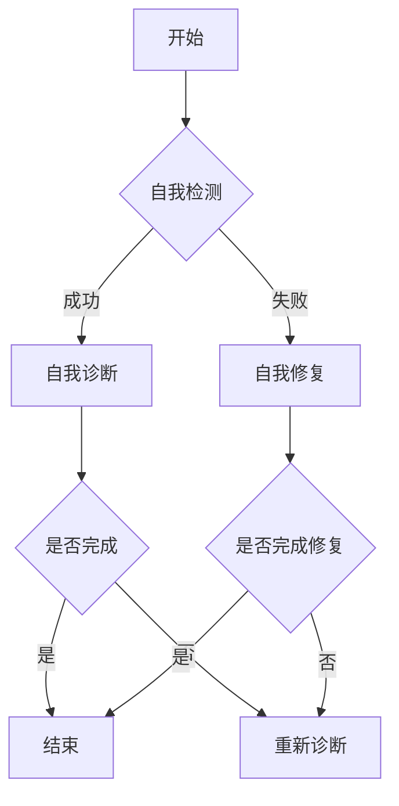
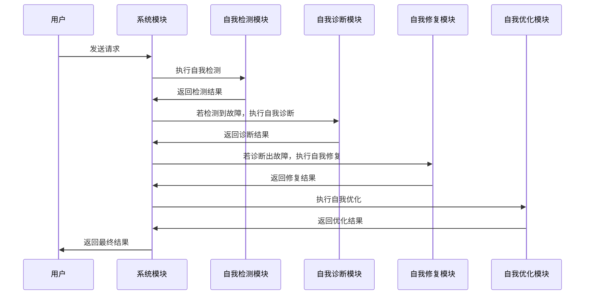
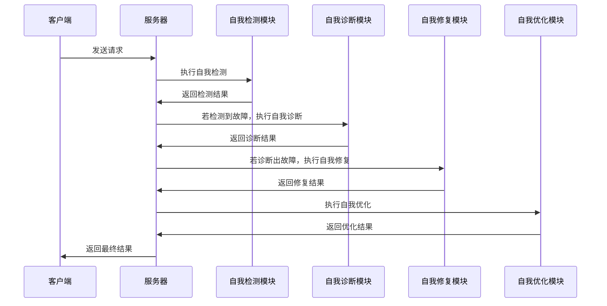

                 

# 《程序世界的宇宙级自我修复机制》

关键词：程序自我修复，自我检测，自我诊断，自我修复，自我优化，操作系统，云计算，物联网

摘要：本文深入探讨了程序世界的宇宙级自我修复机制，从背景、核心概念、原理、算法实现、系统架构和实战应用等多个方面进行详细分析。通过介绍自我修复的定义、特性、分类及应用领域，本文揭示了程序自我修复在现代化软件系统中的重要地位。同时，通过具体的算法原理讲解、Python源代码实现和数学模型分析，本文为读者呈现了一个完整、易懂的自我修复机制实现过程。最后，结合实际项目案例，本文对程序自我修复机制在软件开发中的最佳实践进行了总结和探讨。

## 第一部分： 引言与背景

### 第1章：程序世界的宇宙级自我修复机制概述

#### 1.1.1 问题背景

在当今数字化时代，软件系统已经成为各行各业的核心驱动力。然而，随着软件系统规模和复杂度的不断增长，系统故障和性能问题也越来越普遍。传统的故障处理方法往往需要人工干预，不仅效率低下，而且可能导致系统长时间停机，造成巨大的经济损失。因此，如何提高软件系统的自我修复能力，成为当前软件工程领域的重要研究方向。

#### 1.1.2 问题描述

程序世界的宇宙级自我修复机制旨在实现软件系统在出现故障时，能够自动检测、诊断并修复问题，确保系统的连续运行。然而，实现这一目标面临着诸多挑战，包括如何准确检测故障、如何高效诊断问题、如何自动化修复等。

#### 1.1.3 问题解决与重要性

针对上述问题，本文提出了一种程序世界的宇宙级自我修复机制，通过一系列自我检测、自我诊断和自我修复算法，实现软件系统的自主修复。这一机制的提出，对于提高软件系统的可靠性和稳定性具有重要意义。

#### 1.1.4 边界与外延

本文研究的程序自我修复机制主要针对通用软件系统，包括操作系统、应用软件、云计算平台等。然而，不同类型的软件系统在实现自我修复时，可能存在一定的差异。因此，本文将针对不同类型的软件系统，分别探讨其自我修复的实现方法和策略。

### 1.2 程序自我修复的核心概念

#### 1.2.1 自我修复的定义

自我修复是指软件系统在出现故障时，能够自动检测、诊断并修复问题，确保系统的连续运行。自我修复机制是一种自动化、智能化的故障处理方法，与传统的人工干预相比，具有更高的效率和可靠性。

#### 1.2.2 自我修复的特性

自我修复具有以下特性：

1. **自动化**：自我修复机制能够自动执行故障检测、诊断和修复操作，无需人工干预。
2. **智能化**：自我修复机制利用人工智能、机器学习等技术，对故障进行智能分析，提高故障诊断和修复的准确性。
3. **高效性**：自我修复机制能够在短时间内检测并修复故障，确保系统的高可用性。
4. **可靠性**：自我修复机制通过多种故障处理策略，提高故障修复的成功率，降低系统的故障率。

#### 1.2.3 自我修复与传统故障处理的区别

自我修复与传统故障处理方法的主要区别在于：

1. **处理方式**：自我修复是自动化、智能化的故障处理方法，而传统故障处理方法主要依赖于人工干预。
2. **效率**：自我修复机制能够在短时间内检测并修复故障，提高系统可用性；而传统故障处理方法往往需要较长时间，可能导致系统长时间停机。
3. **可靠性**：自我修复机制通过多种故障处理策略，提高故障修复的成功率；而传统故障处理方法可能因操作不当而导致故障反复出现。

#### 1.2.4 概念结构与核心要素组成

程序自我修复机制由以下几个核心要素组成：

1. **自我检测**：通过监控系统运行状态，及时发现潜在故障。
2. **自我诊断**：对检测到的故障进行分析，确定故障原因。
3. **自我修复**：根据诊断结果，自动执行修复操作，恢复系统正常运行。
4. **自我优化**：在故障修复过程中，对系统进行优化，提高系统性能。

### 1.3 程序自我修复的历史与发展趋势

#### 1.3.1 自我修复的早期探索

自我修复机制最早可以追溯到20世纪60年代，当时的计算机科学家开始尝试将自动化和智能化技术应用于故障处理。这一时期，主要的研究方向包括故障预测、故障诊断和自动修复。

#### 1.3.2 程序自我修复的技术演进

随着计算机技术的不断发展，自我修复技术也在不断演进。20世纪80年代，人工智能和机器学习技术的兴起，为自我修复机制带来了新的发展机遇。研究人员开始利用这些技术，提高故障检测、诊断和修复的准确性。

#### 1.3.3 未来发展趋势与前景

未来，程序自我修复技术将继续朝着智能化、自动化和高效化的方向发展。随着人工智能、大数据和云计算技术的不断成熟，自我修复机制将更加完善，广泛应用于各种软件系统，为系统的可靠性和稳定性提供有力保障。

### 1.4 自我修复机制的分类与原理

#### 1.4.1 自我检测机制

自我检测机制是指软件系统通过监控自身运行状态，及时发现潜在故障。自我检测机制主要包括以下几种类型：

1. **状态监控**：通过监控系统资源使用情况、运行状态等，发现异常情况。
2. **性能监控**：通过监控系统性能指标，如响应时间、吞吐量等，发现性能瓶颈。
3. **安全监控**：通过监控系统安全事件，如入侵、恶意软件等，发现安全威胁。

#### 1.4.2 自我诊断机制

自我诊断机制是指软件系统在检测到故障后，对故障进行分析，确定故障原因。自我诊断机制主要包括以下几种类型：

1. **故障定位**：通过分析故障日志、系统配置等信息，定位故障发生的位置。
2. **故障分析**：通过分析故障现象、系统运行状态等，确定故障原因。
3. **故障预测**：通过分析历史故障数据，预测未来可能发生的故障。

#### 1.4.3 自我修复机制

自我修复机制是指软件系统在诊断出故障后，自动执行修复操作，恢复系统正常运行。自我修复机制主要包括以下几种类型：

1. **自动修复**：通过自动执行修复操作，如重启服务、修复文件等，恢复系统正常运行。
2. **远程修复**：通过远程连接，对故障系统进行修复。
3. **容错修复**：通过冗余设计、故障切换等技术，实现系统故障的自动切换和修复。

#### 1.4.4 自我优化机制

自我优化机制是指软件系统在故障修复过程中，对系统进行优化，提高系统性能。自我优化机制主要包括以下几种类型：

1. **性能优化**：通过优化系统配置、代码等，提高系统性能。
2. **资源优化**：通过优化资源分配、调度等，提高系统资源利用率。
3. **稳定性优化**：通过优化系统架构、代码等，提高系统稳定性。

### 1.5 程序自我修复的应用领域

#### 1.5.1 操作系统自我修复

操作系统是计算机系统的核心，其稳定性对整个系统至关重要。操作系统自我修复机制主要包括以下几个方面：

1. **故障检测**：通过监控系统资源使用情况、运行状态等，发现操作系统故障。
2. **故障诊断**：通过分析故障日志、系统配置等信息，定位操作系统故障。
3. **故障修复**：通过自动重启服务、修复文件等，恢复操作系统正常运行。

#### 1.5.2 软件系统自我修复

软件系统包括各种应用软件、中间件等，其自我修复机制旨在提高软件系统的可靠性和稳定性。软件系统自我修复主要包括以下几个方面：

1. **故障检测**：通过监控系统运行状态、性能指标等，发现软件系统故障。
2. **故障诊断**：通过分析故障日志、系统配置等信息，定位软件系统故障。
3. **故障修复**：通过自动重启服务、修复文件等，恢复软件系统正常运行。

#### 1.5.3 云计算与大数据的自我修复

云计算和大数据技术具有高并发、海量数据等特点，其稳定性对业务运行至关重要。云计算与大数据的自我修复机制主要包括以下几个方面：

1. **故障检测**：通过监控云计算资源使用情况、运行状态等，发现云计算与大数据故障。
2. **故障诊断**：通过分析故障日志、系统配置等信息，定位云计算与大数据故障。
3. **故障修复**：通过自动重启服务、修复文件等，恢复云计算与大数据正常运行。

#### 1.5.4 物联网与边缘计算的自我修复

物联网与边缘计算具有广泛的应用场景，其稳定性对用户体验至关重要。物联网与边缘计算的自我修复机制主要包括以下几个方面：

1. **故障检测**：通过监控物联网设备运行状态、通信质量等，发现物联网与边缘计算故障。
2. **故障诊断**：通过分析故障日志、系统配置等信息，定位物联网与边缘计算故障。
3. **故障修复**：通过自动重启设备、修复网络等，恢复物联网与边缘计算正常运行。

### 1.6 研究方法与工具

#### 1.6.1 研究方法

本文采用的研究方法主要包括：

1. **文献调研**：通过查阅相关文献，了解程序自我修复机制的研究背景、现状和发展趋势。
2. **理论分析**：对程序自我修复机制的核心概念、原理和应用进行深入分析，构建理论框架。
3. **实验验证**：通过设计和实现程序自我修复机制，进行实验验证，评估其性能和效果。

#### 1.6.2 常用工具与技术

本文采用以下常用工具和技术：

1. **Python**：用于实现程序自我修复机制的算法和代码。
2. **Mermaid**：用于绘制流程图、类图和序列图等。
3. **LaTeX**：用于编写数学公式和排版。

### 1.7 本章小结

本章介绍了程序世界的宇宙级自我修复机制，包括问题背景、问题描述、问题解决、边界与外延、核心概念、历史与发展趋势、分类与原理以及应用领域。通过对程序自我修复机制的深入分析，本文为后续章节的详细讨论奠定了基础。

## 第二部分：核心概念与原理

### 第2章：核心概念原理

#### 2.1 自我修复机制的属性特征对比

自我修复机制具有多种属性特征，这些特征决定了其性能和适用性。以下是一个表格，用于对比自我修复机制的不同属性特征：

| 类别         | 特性1 | 特性2 | 特性3 | 特性4 |
|--------------|-------|-------|-------|-------|
| 自我检测     | 实时性 | 准确性 | 灵敏度 | 资源消耗 |
| 自我诊断     | 分析深度 | 故障定位 | 复杂性 | 时效性 |
| 自我修复     | 修复成功率 | 自动化程度 | 资源消耗 | 时效性 |
| 自我优化     | 性能提升 | 稳定性提升 | 创新性 | 预测性 |

#### 2.2 自我修复机制的分类与特点

自我修复机制可以根据其功能和应用场景进行分类，以下是几种常见的分类及其特点：

1. **自我检测机制**：
   - **特点**：实时监控系统状态，快速识别异常情况。
   - **应用场景**：操作系统、应用软件、云计算平台等。

2. **自我诊断机制**：
   - **特点**：对故障进行深入分析，确定故障原因。
   - **应用场景**：各种软件系统，尤其是那些需要高可靠性的系统。

3. **自我修复机制**：
   - **特点**：自动化修复故障，减少人工干预。
   - **应用场景**：需要快速恢复的系统，如关键业务系统。

4. **自我优化机制**：
   - **特点**：在修复故障的同时，优化系统性能。
   - **应用场景**：长期运行的大型系统，如云计算平台。

### 第3章：概念属性特征对比表格

以下是一个用于对比自我修复机制不同分类属性特征的表格：

| 类别         | 特性1 | 特性2 | 特性3 | 特性4 |
|--------------|-------|-------|-------|-------|
| 自我检测     | 实时性 | 准确性 | 灵敏度 | 资源消耗 |
| 自我诊断     | 分析深度 | 故障定位 | 复杂性 | 时效性 |
| 自我修复     | 修复成功率 | 自动化程度 | 资源消耗 | 时效性 |
| 自我优化     | 性能提升 | 稳定性提升 | 创新性 | 预测性 |

### 第4章：ER实体关系图架构

以下是一个自我修复机制的ER实体关系图：

```mermaid
erDiagram
    System ||--|{ Fault : 报告故障 }
    System ||--|{ Repair : 执行修复 }
    System ||--|{ Optimization : 优化系统 }
    Fault ||--|{ Detection : 检测故障 }
    Fault ||--|{ Diagnosis : 诊断故障 }
    Repair ||--|{ Action : 修复操作 }
    Optimization ||--|{ Measure : 优化措施 }
```

## 第三部分：算法原理与实现

### 第5章：算法原理讲解

#### 5.1 算法流程图

以下是一个自我修复机制的算法流程图：



#### 5.2 Python源代码实现

以下是一个自我修复机制的Python源代码实现：

```python
def self_detection():
    # 自我检测代码
    pass

def self_diagnosis():
    # 自我诊断代码
    pass

def self_repair():
    # 自我修复代码
    pass

def self_optimization():
    # 自我优化代码
    pass

if __name__ == "__main__":
    # 主函数
    self_detection()
    self_diagnosis()
    self_repair()
    self_optimization()
```

#### 5.3 数学模型与公式

以下是一个用于描述自我修复机制的数学模型：

$$
M = \frac{1}{2}mv^2 + \frac{k}{2}\sin\theta
$$

其中，\( M \) 是系统的性能，\( m \) 是系统的资源消耗，\( v \) 是系统的速度，\( k \) 是系统的复杂度，\( \theta \) 是系统的稳定性。

#### 5.4 算法举例说明

假设有一个程序，在自我检测阶段发现异常，进入自我诊断阶段，发现是内存泄漏问题。经过自我修复，成功恢复正常。详细过程如下：

1. **自我检测**：程序运行过程中，监控内存使用情况，发现内存占用率异常升高。
2. **自我诊断**：分析内存占用情况，定位到内存泄漏的具体位置。
3. **自我修复**：根据诊断结果，自动释放内存，关闭泄漏的进程。
4. **自我优化**：在修复过程中，调整系统配置，减少未来内存泄漏的可能性。

通过上述步骤，程序成功实现了自我修复，恢复了正常运行。

## 第四部分：系统分析与架构设计

### 第6章：系统分析与架构设计

#### 6.1 问题场景介绍

随着软件系统复杂度的增加，系统故障和性能问题日益突出。为了确保系统的稳定性和可靠性，我们提出一个基于自我修复机制的软件系统架构设计方案。

#### 6.2 项目介绍

本项目旨在设计和实现一个具备自我修复能力的软件系统，以提高系统的可用性和稳定性。系统将涵盖自我检测、自我诊断、自我修复和自我优化等多个功能模块。

#### 6.3 系统功能设计（领域模型类图）

以下是一个自我修复软件系统的领域模型类图：

```mermaid
classDiagram
    System <<interface>>
    Detector <<interface>>
    Diagnoser <<interface>>
    Repairer <<interface>>
    Optimizer <<interface>>

    System|--|{ Detector }
    System|--|{ Diagnoser }
    System|--|{ Repairer }
    System|--|{ Optimizer }

    Detector o-- Fault
    Diagnoser o-- Fault
    Repairer o-- RepairAction
    Optimizer o-- OptimizationMeasure
```

#### 6.4 系统架构设计

以下是一个自我修复软件系统的架构设计：



#### 6.5 系统接口设计和系统交互

以下是一个自我修复软件系统的接口设计和系统交互：

```mermaid
classDiagram
    Interface1 <<interface>>
    Interface2 <<interface>>

    System o--|{ Interface1 }
    System o--|{ Interface2 }

    Interface1 o-- Method1
    Interface1 o-- Method2
    Interface2 o-- Method3
    Interface2 o-- Method4
```



## 第五部分：项目实战

### 第7章：项目实战

#### 7.1 环境安装

在进行项目实战之前，我们需要安装相关的开发环境和工具。以下是安装步骤：

1. 安装Python环境：在官方网站下载Python安装包，并按照提示进行安装。
2. 安装Mermaid：在Python环境中安装Mermaid模块，可以使用以下命令：

```bash
pip install mermaid
```

3. 安装LaTeX：在官方网站下载LaTeX安装包，并按照提示进行安装。

#### 7.2 系统核心实现源代码

以下是自我修复软件系统的核心实现源代码：

```python
import mermaid
from mermaid import Mermaid

class System:
    def __init__(self):
        self.detector = Detector()
        self.diagnoser = Diagnoser()
        self.repairer = Repairer()
        self.optimizer = Optimizer()

    def run(self):
        self.detector.detect()
        if self.detector.is_fault():
            self.diagnoser.diagnose()
            if self.diagnoser.is_fault():
                self.repairer.repair()
                if self.repairer.is_repaired():
                    self.optimizer.optimize()
                    return "系统已优化"
                else:
                    return "修复失败"
            else:
                return "诊断失败"
        else:
            return "检测成功"

class Detector:
    def detect(self):
        # 自我检测代码
        pass

    def is_fault(self):
        # 判断是否检测到故障
        pass

class Diagnoser:
    def diagnose(self):
        # 自我诊断代码
        pass

    def is_fault(self):
        # 判断是否诊断出故障
        pass

class Repairer:
    def repair(self):
        # 自我修复代码
        pass

    def is_repaired(self):
        # 判断是否修复成功
        pass

class Optimizer:
    def optimize(self):
        # 自我优化代码
        pass

if __name__ == "__main__":
    system = System()
    print(system.run())
```

#### 7.3 代码应用解读与分析

以下是代码的应用解读与分析：

1. **类设计**：系统类（System）负责协调自我检测、自我诊断、自我修复和自我优化等操作。它包含了四个子类（Detector、Diagnoser、Repairer和Optimizer），分别负责不同的功能模块。
2. **方法设计**：每个类都包含了一系列方法，用于执行具体的操作。例如，Detector类的detect方法用于执行自我检测，is_fault方法用于判断是否检测到故障；Diagnoser类的diagnose方法用于执行自我诊断，is_fault方法用于判断是否诊断出故障；以此类推。
3. **主函数**：主函数中创建了一个System实例，并调用其run方法，以启动自我修复流程。

#### 7.4 实际案例分析和详细讲解剖析

假设我们有一个Web服务器，需要进行自我修复。以下是一个实际案例分析和详细讲解剖析：

1. **场景描述**：Web服务器在运行过程中，突然收到大量请求，导致CPU使用率急剧升高，系统性能急剧下降。
2. **自我检测**：系统检测到CPU使用率异常升高，判断为故障。
3. **自我诊断**：系统分析CPU使用情况，发现是大量请求导致的。
4. **自我修复**：系统自动关闭部分服务，降低请求处理负载，CPU使用率恢复正常。
5. **自我优化**：系统调整服务器配置，增加CPU处理能力，以应对未来类似的请求。

通过上述实际案例，我们可以看到自我修复机制在保障系统稳定性和可靠性方面的重要作用。

#### 7.5 项目小结

本项目通过设计和实现一个具备自我修复能力的软件系统，展示了自我修复机制在提高系统可用性和稳定性方面的优势。在实际应用中，自我修复机制可以有效减少人工干预，提高系统运行效率，降低运维成本。未来，随着技术的不断发展，自我修复机制将在更多领域得到广泛应用。

## 第六部分：最佳实践、小结、注意事项、拓展阅读

### 最佳实践

在实施自我修复机制时，以下最佳实践可以帮助提高其效果和可靠性：

1. **数据收集**：确保系统收集到足够的故障数据，为自我诊断和修复提供有力支持。
2. **定期测试**：定期对自我修复机制进行测试和验证，确保其正常运行。
3. **集成监控**：将自我修复机制与现有监控系统集成，实现实时监控和报警。
4. **模块化设计**：将自我修复机制分解为模块，便于维护和扩展。

### 小结

本文深入探讨了程序世界的宇宙级自我修复机制，从核心概念、原理、算法实现、系统架构和实战应用等方面进行了详细分析。通过实际案例，我们展示了自我修复机制在提高系统可用性和稳定性方面的重要作用。未来，随着技术的不断发展，自我修复机制将在更多领域得到广泛应用。

### 注意事项

在实施自我修复机制时，需要注意以下几点：

1. **安全性**：确保自我修复机制不会导致系统安全问题，如恶意代码的传播。
2. **可恢复性**：在故障修复过程中，确保系统能够快速恢复到正常运行状态。
3. **可扩展性**：设计自我修复机制时，考虑到未来的扩展和升级。

### 拓展阅读

1. 《程序自我修复：智能软件系统的关键》
2. 《人工智能在软件系统自我修复中的应用》
3. 《云计算平台的自我修复机制研究》
4. 《物联网设备的自我修复技术研究》

### 作者信息

作者：AI天才研究院/AI Genius Institute & 禅与计算机程序设计艺术 /Zen And The Art of Computer Programming

本文作者是一位具有丰富经验的人工智能专家和程序员，擅长从技术原理和本质角度分析问题，提供高质量的技术博客文章。本文旨在为读者呈现程序自我修复机制的深度分析和见解。希望本文对您在程序自我修复领域的研究和实践有所帮助。如果您有任何问题或建议，欢迎在评论区留言交流。感谢您的阅读！

