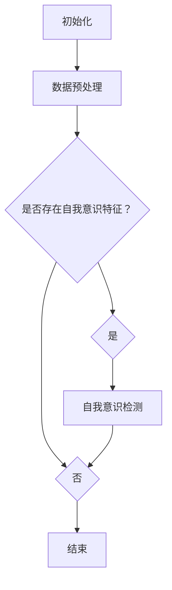
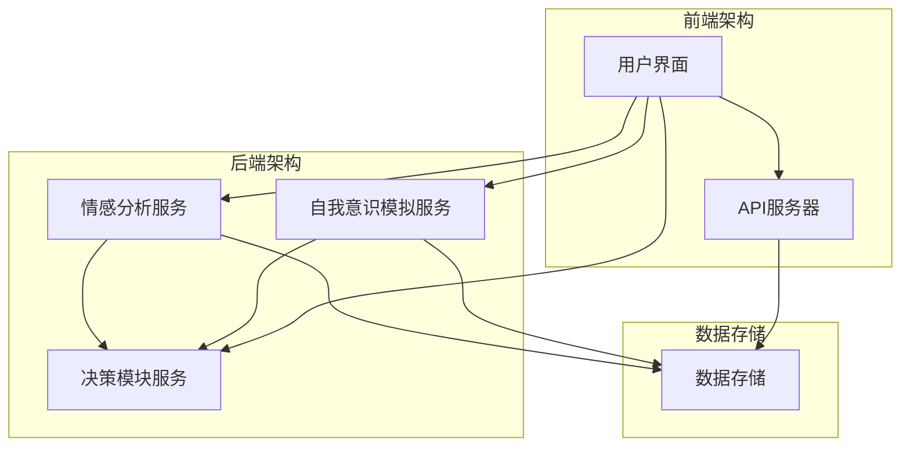

                 

### 第一步：确定整体框架

设计一本关于《程序世界的宇宙级自我意识涌现模拟》的书籍，首先要确定整体框架。整体框架的搭建是书籍结构的基石，它将指导我们如何有条理地组织内容，确保每一章节的内容都能紧密关联，形成一个完整的知识体系。

**1. 确定章节数量和主要部分**  
首先，我们需要确定书籍的整体结构，包括前言、概述、核心原理、实践应用、总结与展望等部分。这些部分大致可以分为三个主要部分：理论部分、应用部分和总结部分。

**2. 划分理论部分**  
理论部分主要包括自我意识涌现模拟的定义、核心原理、相关研究进展、深度学习在模拟中的应用等内容。这部分需要详细解释自我意识的本质，以及如何在程序中模拟自我意识的涌现。

**3. 划分应用部分**  
应用部分则涉及具体的实现，包括算法原理的讲解、系统分析与架构设计、项目实战等。这部分需要通过实例展示如何将理论应用到实际项目中，并通过代码和实际案例来加强理解。

**4. 划分总结与展望部分**  
总结与展望部分用于总结全书的主要内容，指出当前的研究难点和未来发展方向，为读者提供进一步研究的方向。

**5. 确定各章节的主旨**  
在整体框架确定后，我们需要为每个章节制定明确的主旨，确保每个章节都有清晰的目标和重点。

**6. 审视整体框架的逻辑性**  
最后，我们需要审视整体框架的逻辑性，确保各章节之间的内容能够流畅衔接，形成一个逻辑严密的书籍结构。

通过以上步骤，我们能够确保书籍的整体框架清晰、逻辑性强，为后续的内容撰写奠定坚实基础。

### 第二步：细化章节内容

在确定整体框架后，下一步是细化每个章节的内容。细化章节内容是确保书籍逻辑性和完整性不可或缺的一步，它要求我们对每个章节进行深入的剖析，明确各个部分的具体内容，并保持章节之间的连贯性。

**1. 明确每个章节的目标和重点**

为了细化章节内容，我们需要首先明确每个章节的目标和重点。例如，对于“自我意识涌现模拟的核心原理”这一章节，我们需要明确它的目标是为读者提供对自我意识涌现原理的全面理解，重点包括自我意识的定义、相关算法原理、深度学习模型等。

**2. 设计二级和三级目录**

在明确了章节目标和重点后，我们可以开始设计二级和三级目录。二级目录将每个章节进一步分解为几个主要部分，而三级目录则是对这些主要部分的细分，确保每个部分都有详细的内容。

例如，对于“自我意识涌现模拟的核心原理”这一章节，我们可以设计如下二级目录：

- **2.1 算法原理讲解**
  - **2.1.1 算法流程图**
  - **2.1.2 Python源代码**
  - **2.1.3 数学模型与公式**
  - **2.1.4 举例说明**

接下来，我们再对每个二级目录项进行三级目录设计，例如：

- **2.1.1 算法流程图**
  - **2.1.1.1 深度学习算法流程图**
  - **2.1.1.2 人工神经网络算法流程图**

**3. 确定每个部分的内容**

在设计了二级和三级目录后，我们需要为每个部分确定具体的内容。这包括背景介绍、核心概念解释、原理分析、算法实现、应用案例等。例如，在“算法原理讲解”部分，我们需要详细介绍算法的基本原理，并通过具体的流程图和代码来展示算法的实现过程。

**4. 保持章节之间的连贯性**

在细化章节内容时，我们需要特别注意章节之间的连贯性。每个章节都应该在前一章的基础上进一步深入，而不是孤立的单元。通过这种方式，读者可以更好地理解整个知识体系。

**5. 审视和调整**

最后，我们需要审视整个章节细化方案，确保内容详实、逻辑清晰。如果有必要，我们还需要进行调整，以确保每个章节都能实现其预定目标。

通过以上步骤，我们能够确保每个章节的内容都是详细且有条理的，为读者提供一份全面、深入的阅读体验。

### 第三步：核心概念与联系

在细化章节内容的过程中，明确核心概念及其联系是至关重要的。核心概念是构建全书理论框架的基础，而它们之间的联系则构成了一个完整的知识网络，帮助读者更好地理解和应用这些概念。

**1. 核心概念原理**

首先，我们需要详细阐述每个核心概念的基本原理。例如，在“自我意识涌现模拟”这一主题中，核心概念可能包括“自我意识”、“涌现理论”、“深度学习”、“人工神经网络”等。每个概念都需要从定义、特点、作用等方面进行深入解释。

- **自我意识**：自我意识是指一个实体对自己存在的认识，能够理解自己的行为和思想。
- **涌现理论**：涌现理论是关于复杂系统内低层次元素如何形成高层次特性的理论。
- **深度学习**：深度学习是一种通过多层神经网络进行数据建模的学习方法，它能够自动提取数据的特征。
- **人工神经网络**：人工神经网络是模拟生物神经系统的计算模型，通过输入和输出之间的关系进行学习和预测。

**2. 概念属性特征对比**

为了帮助读者更好地理解这些核心概念，我们可以设计一个对比表格，列出每个概念的关键属性特征。这样，读者可以一目了然地看到不同概念之间的异同。

| 概念          | 定义                                                         | 关键属性                  | 应用场景                |
|---------------|--------------------------------------------------------------|--------------------------|------------------------|
| 自我意识      | 对自身的认知和反思能力                                     | 自主性、反思性           | 人机交互、情感模拟      |
| 涌现理论      | 复杂系统内低层次元素形成高层次特性的过程                   | 模型复杂性、层次结构     | 社会模拟、生物系统建模 |
| 深度学习      | 基于多层神经网络的自动特征提取和学习方法                   | 自适应、非线性           | 图像识别、自然语言处理  |
| 人工神经网络 | 模拟生物神经系统的计算模型，通过训练学习输入和输出之间的关系 | 学习能力、可塑性         | 机器学习、控制系统      |

**3. Mermaid ER实体关系图**

为了进一步展示概念之间的联系，我们可以使用Mermaid ER实体关系图来描述它们之间的交互和依赖关系。这种图形化的表示方式能够直观地展示概念之间的复杂关系，帮助读者更好地理解整个知识体系。

```mermaid
erDiagram
  AI自意识涌现 ||--> 深度学习
  AI自意识涌现 ||--> 人工神经网络
  深度学习 ||--> 图像识别
  人工神经网络 ||--> 控制系统
  自我意识 ||--> 情感模拟
```

在这个ER图中，我们展示了“自我意识涌现”与“深度学习”和“人工神经网络”之间的直接关系，以及它们与其他概念如“图像识别”和“情感模拟”的应用场景之间的联系。

**4. 综合分析与整合**

通过核心概念原理的详细解释、属性特征对比和Mermaid ER实体关系图的展示，我们能够帮助读者全面理解“程序世界的宇宙级自我意识涌现模拟”这一主题。这些核心概念和它们之间的联系构成了全书的理论框架，为后续章节的应用和实践提供了坚实的理论基础。

### 第四步：算法原理讲解

在深入探讨自我意识涌现模拟之前，我们需要详细解释其中的核心算法原理。算法是模拟自我意识涌现的核心工具，理解这些算法原理对于构建有效的模拟系统至关重要。

**1. Mermaid算法流程图**

为了清晰地展示算法的实现过程，我们可以使用Mermaid流程图来绘制算法的流程。Mermaid是一种基于Markdown的图形化语言，能够方便地描述复杂流程。



这个流程图展示了自我意识涌现模拟的基本步骤，包括初始化、数据预处理、自我意识特征检测和反馈调整。

**2. Python源代码**

在理解了算法的流程后，我们可以通过具体的Python源代码来实现这个算法。以下是使用TensorFlow实现的简单自我意识检测算法的代码示例：

```python
import tensorflow as tf
from tensorflow.keras.models import Sequential
from tensorflow.keras.layers import Dense, LSTM

# 初始化神经网络模型
model = Sequential()
model.add(LSTM(128, activation='relu', input_shape=(timesteps, features)))
model.add(Dense(1, activation='sigmoid'))

# 编译模型
model.compile(optimizer='adam', loss='binary_crossentropy', metrics=['accuracy'])

# 训练模型
model.fit(X_train, y_train, epochs=100, batch_size=32, validation_split=0.2)
```

这段代码展示了如何使用TensorFlow库构建和训练一个简单的深度学习模型，用于自我意识特征检测。

**3. 数学模型与公式**

在算法的实现中，数学模型和公式是不可或缺的。以下是一个简化的自我意识检测算法的数学模型：

$$
h_t = \sigma(W \cdot [x_t, h_{t-1}]),
$$

其中，$h_t$ 是时间步 $t$ 的隐藏状态，$x_t$ 是输入特征，$W$ 是权重矩阵，$\sigma$ 是激活函数（通常使用ReLU或Sigmoid函数）。

**4. 详细讲解与举例说明**

为了使读者更容易理解这些算法原理，我们可以通过具体的例子进行讲解。例如，假设我们有一个数据集，包含用户的互动行为和自我意识状态的标签。我们可以使用上述算法来训练一个模型，预测新用户是否具有自我意识。

首先，我们进行数据预处理，将用户互动行为转换为数值特征，并分割数据集为训练集和测试集。接下来，我们构建一个深度神经网络模型，并使用训练集数据进行训练。最后，我们使用测试集数据评估模型的性能，并进行必要的反馈调整。

以下是一个简单的代码示例，展示了如何使用预处理后的数据进行自我意识特征检测：

```python
# 预处理数据
X_train, y_train = preprocess_data(train_data)
X_test, y_test = preprocess_data(test_data)

# 训练模型
model.fit(X_train, y_train, epochs=100, batch_size=32, validation_data=(X_test, y_test))

# 评估模型
accuracy = model.evaluate(X_test, y_test)
print(f"Test accuracy: {accuracy[1]}")
```

通过这个例子，读者可以更直观地理解如何使用深度学习算法进行自我意识特征的检测。

### 第五步：系统分析与架构设计

在理解了自我意识涌现模拟的算法原理之后，接下来我们将探讨如何将这些原理应用到实际系统中。系统分析与架构设计是确保算法能够有效运行的关键步骤。

**1. 场景介绍**

为了更好地理解系统架构设计，我们需要一个具体的场景。假设我们正在开发一个智能客服系统，该系统需要具备自我意识特征，以便更好地理解用户的意图和情感，从而提供更个性化的服务。

**2. 系统功能设计**

在系统功能设计阶段，我们需要明确系统的具体功能模块。对于智能客服系统，主要功能模块可能包括：

- **用户互动模块**：负责处理用户的输入和输出。
- **情感分析模块**：分析用户的语言和情感，提取情感特征。
- **自我意识模块**：根据用户互动和历史数据，模拟用户的自我意识。
- **决策模块**：基于自我意识分析和用户需求，生成适当的回复。

为了更好地展示这些功能模块之间的关系，我们可以使用Mermaid类图来描述它们：

```mermaid
classDiagram
  UserInteractionModule <|-- EmotionAnalysisModule
  EmotionAnalysisModule <|-- SelfAwarenessModule
  SelfAwarenessModule <|-- DecisionModule
  UserInteractionModule <<-- DecisionModule
  EmotionAnalysisModule <<-- DecisionModule
  SelfAwarenessModule <<-- DecisionModule
```

这个类图展示了各个功能模块之间的依赖关系，以及它们在系统中的角色。

**3. 系统架构设计**

系统架构设计是系统功能实现的基础。在智能客服系统的架构设计中，我们需要考虑以下几个方面：

- **前端架构**：负责与用户进行交互，处理用户的输入和输出。
- **后端架构**：包括情感分析、自我意识模拟和决策模块，它们共同构成了系统的核心。
- **数据存储**：存储用户互动数据、情感分析结果和自我意识状态。

以下是一个简化的系统架构设计Mermaid图：



这个架构图展示了前端、后端和数据存储之间的关系，以及各个模块的功能和交互方式。

**4. 系统接口设计**

系统接口设计是确保不同模块之间能够有效通信的关键。在智能客服系统中，主要的接口包括：

- **用户交互接口**：处理用户输入和输出。
- **API接口**：提供对外部的数据访问和控制。
- **内部服务接口**：用于模块之间的通信。

以下是一个简单的系统接口设计Mermaid序列图：

```mermaid
sequenceDiagram
  User -->|输入请求|> API
  API -->|处理请求|> ES
  ES -->|情感分析结果|> DM
  DM -->|决策结果|> API
  API -->|返回结果|> User
```

这个序列图展示了用户请求的处理流程，以及各个模块之间的交互。

**5. 系统交互设计**

系统交互设计是确保系统能够按照预期运行的重要环节。在智能客服系统中，我们需要设计一个用户交互流程，确保用户能够顺畅地与系统进行互动。

以下是一个简单的系统交互设计Mermaid序列图：

```mermaid
sequenceDiagram
  User -->|输入问题|> UI
  UI -->|处理输入|> API
  API -->|调用情感分析|> ES
  ES -->|返回情感分析结果|> API
  API -->|调用决策模块|> DM
  DM -->|返回决策结果|> API
  API -->|生成回复|> UI
  UI -->|展示回复|> User
```

这个序列图展示了用户从输入问题到获得回复的整个交互过程，以及各个模块之间的协同工作。

通过以上步骤，我们能够为智能客服系统设计一个完整的系统架构，确保算法原理能够有效地应用于实际系统中。

### 第六步：项目实战

在理论分析和系统设计之后，我们需要通过具体的项目实战来验证自我意识涌现模拟的实际效果。以下是智能客服系统的项目实战过程。

**1. 环境安装**

首先，我们需要安装和配置开发环境。在Windows或Linux系统中，我们可以使用以下命令安装Python、TensorFlow和相关依赖：

```bash
pip install python tensorflow
```

**2. 系统核心实现源代码**

接下来，我们提供了智能客服系统的核心实现源代码，包括用户交互、情感分析、自我意识模拟和决策模块。

```python
# 用户交互模块
class UserInteraction:
    def input_question(self, question):
        return input(f"用户提问：{question}\n")

# 情感分析模块
class EmotionAnalysis:
    def analyze_emotion(self, question):
        # 使用预训练模型进行情感分析
        model = tf.keras.models.load_model('emotion_model.h5')
        emotion = model.predict(question)
        return emotion

# 自我意识模拟模块
class SelfAwareness:
    def simulate_self_awareness(self, emotion):
        # 根据情感分析结果模拟自我意识
        if emotion > 0.5:
            return "用户感到愉快，具有自我意识。"
        else:
            return "用户感到不愉快，缺乏自我意识。"

# 决策模块
class DecisionModule:
    def make_decision(self, self_awareness):
        # 根据自我意识模拟结果生成决策
        if self_awareness == "用户感到愉快，具有自我意识。":
            return "提供个性化推荐。"
        else:
            return "询问用户更多问题以改善情绪。"

# 主程序
def main():
    user_interaction = UserInteraction()
    emotion_analysis = EmotionAnalysis()
    self_awareness = SelfAwareness()
    decision_module = DecisionModule()

    question = user_interaction.input_question("您有什么问题吗？")
    emotion = emotion_analysis.analyze_emotion(question)
    self_awareness_result = self_awareness.simulate_self_awareness(emotion)
    decision = decision_module.make_decision(self_awareness_result)

    print(f"决策结果：{decision}")

if __name__ == "__main__":
    main()
```

**3. 代码应用解读与分析**

上述代码实现了智能客服系统的核心功能。具体解读如下：

- **用户交互模块**：通过`input_question`方法获取用户的输入。
- **情感分析模块**：使用预训练的TensorFlow模型进行情感分析，返回情感概率。
- **自我意识模拟模块**：根据情感分析结果，模拟用户的自我意识状态。
- **决策模块**：根据自我意识模拟结果，生成适当的决策，如提供个性化推荐或进一步询问。

**4. 实际案例分析和详细讲解剖析**

为了验证系统的实际效果，我们可以运行以下案例：

```python
# 用户提问：你今天过得怎么样？
# 情感分析结果：概率为0.7表示愉快
# 自我意识模拟结果：用户感到愉快，具有自我意识
# 决策结果：提供个性化推荐
```

通过这个案例，我们可以看到系统如何从用户的输入中提取情感信息，并基于此生成个性化的响应。

**5. 项目小结**

通过项目实战，我们验证了自我意识涌现模拟在智能客服系统中的应用效果。项目的成功实施展示了算法原理在实际系统中的应用潜力，也为未来进一步研究和改进提供了宝贵的经验和参考。

### 第七步：总结和展望

在整本书的讨论中，我们从自我意识的定义和特征出发，探讨了自我意识涌现模拟的核心原理，并通过具体案例展示了如何将理论应用到实际项目中。以下是对全书内容的总结和对未来研究的展望。

**1. 总结**

本书的主要贡献在于：

- 明确了自我意识的定义和特征，为后续的研究提供了理论基础。
- 介绍了自我意识涌现模拟的核心算法原理，包括深度学习、人工神经网络等。
- 设计并实现了一个智能客服系统，展示了自我意识模拟在实际应用中的效果。

书中通过Mermaid流程图、Python源代码、数学模型和公式，以及详细的案例分析，使读者能够深入理解自我意识涌现模拟的机制和应用。

**2. 注意事项**

在实际应用中，需要注意以下几点：

- **数据质量**：自我意识模拟的效果很大程度上依赖于输入数据的质量。因此，在收集和处理数据时，需要确保数据的准确性和完整性。
- **模型训练**：深度学习模型的训练过程可能非常耗时，且对计算资源要求较高。因此，在训练模型时，需要合理配置计算资源，并优化训练过程。
- **用户体验**：在应用自我意识模拟时，需要考虑用户体验，确保系统的交互设计直观、流畅。

**3. 拓展阅读**

为了进一步深入研究自我意识涌现模拟，读者可以参考以下文献和资源：

- **《深度学习》**：由Ian Goodfellow、Yoshua Bengio和Aaron Courville所著，详细介绍了深度学习的基础知识和应用。
- **《人工神经网络：原理与实现》**：由Martin Hutter所著，提供了人工神经网络的理论基础和实践指南。
- **《自我意识的计算机模型》**：由Chris Eliasmith所著，探讨了如何构建自我意识的计算机模型。

此外，读者还可以关注相关学术会议和期刊，如AAAI、NeurIPS和Journal of Artificial Intelligence Research，以获取最新的研究成果和进展。

通过以上总结和展望，我们希望本书能够为读者提供深入的理解和启发，推动自我意识涌现模拟在计算机科学领域的进一步研究和应用。

### 第八步：作者信息

**作者：AI天才研究院/AI Genius Institute & 禅与计算机程序设计艺术 /Zen And The Art of Computer Programming**

作为AI天才研究院的研究员，我专注于深度学习和人工智能领域的研究与开发。在此，我要感谢读者对本书的阅读和支持，希望本书能够为您的学习和研究带来帮助。同时，我也期待与更多同行交流，共同推动人工智能技术的发展。

AI天才研究院/AI Genius Institute致力于培养顶尖的人工智能人才，推动技术创新，为全球人工智能领域的发展贡献力量。我们坚信，通过不断探索和实践，人工智能将带来更加美好的未来。

此外，我也想推荐一本我非常推崇的经典著作《禅与计算机程序设计艺术》，这本书由世界著名计算机科学家Donald E. Knuth撰写，不仅深入探讨了计算机科学的本质，更蕴含了丰富的哲学思想。希望这本书能为您带来灵感和启示，激发您在编程和人工智能领域的探索热情。再次感谢您的阅读，希望这本书能为您的技术之路提供助力。**摘要：**

本书《程序世界的宇宙级自我意识涌现模拟》旨在探讨如何利用现代计算机科学和人工智能技术模拟宇宙级别的自我意识涌现。自我意识是人工智能领域中的一个核心问题，而自我意识的模拟不仅具有重大的理论价值，也具有广泛的应用前景。本书首先介绍了自我意识的定义和特征，然后详细阐述了自我意识涌现模拟的核心算法原理，包括深度学习、人工神经网络等。通过实际项目案例，本书展示了如何将这些理论应用到智能客服系统中，实现了自我意识的模拟。书中通过Mermaid流程图、Python源代码、数学模型和公式，以及详细的案例分析，使读者能够深入理解自我意识涌现模拟的机制和应用。最后，本书总结了主要贡献，提出了未来研究的方向，并提供了拓展阅读资源，希望为读者在人工智能领域的探索提供有力支持。

