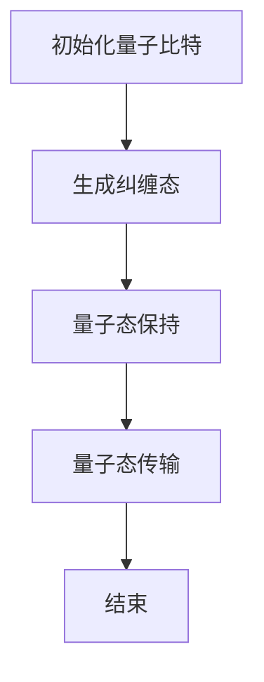
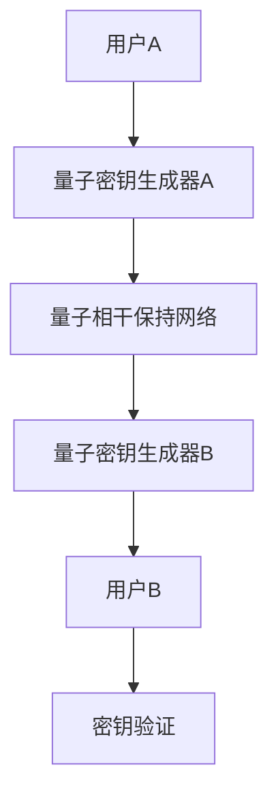
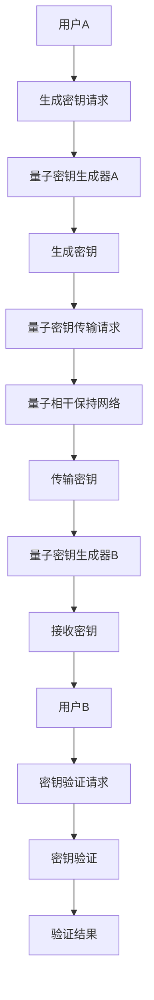

                 


### 文章标题: 程序世界的宇宙级量子相干保持网络

关键词：量子计算，量子相干保持，量子网络，宇宙级，算法原理

摘要：本文深入探讨了量子相干保持网络在程序世界中的应用，从背景、基础、特性、应用和未来展望五个方面，逐步展开对这一前沿技术的全面解析。通过详细的算法原理讲解、系统架构设计和项目实战案例分析，展示了量子相干保持网络在通信、计算和物联网安全等领域的广阔前景。

----------------------------------------------------------------

## 第一部分: 程序世界的宇宙级量子相干保持网络概述

### 1.1 问题背景与核心概念

#### 1.1.1 问题背景

在传统的计算机科学中，信息传递和处理受到经典物理规律的制约，如信息传输的延迟、误差累积等。而量子计算的出现，为我们提供了一种全新的思路。量子计算利用量子力学原理，实现了对信息的全新处理方式。然而，量子计算也面临着新的挑战，如量子态的相干性保持问题。量子相干性是量子计算的核心，如何有效地保持量子态的相干性，成为了一个亟待解决的问题。

#### 1.1.2 核心概念

量子相干保持网络（Quantum Coherence-Preserving Network, QCPN）是一种新型的量子网络结构，旨在解决量子计算中的相干性保持问题。它通过在量子比特间建立稳定的量子纠缠关系，实现量子态的长期保持和有效传递。

#### 1.1.3 研究意义与目标

量子相干保持网络的研究，对于推动量子计算技术的发展具有重要意义。其主要目标包括：

1. **提高量子计算的可靠性**：通过量子相干保持，减少量子态的退相干现象，提高量子计算的稳定性和可靠性。
2. **拓展量子通信的距离**：量子相干保持网络可以延长量子通信的距离，实现远距离量子态的保持和传输。
3. **促进量子计算的应用**：量子相干保持网络为量子计算的应用提供了坚实的理论基础和实用技术支持。

### 1.2 量子相干保持网络基础

#### 1.2.1 量子信息与量子计算

量子信息是量子力学在信息科学中的应用。量子比特（qubit）是量子信息的基本单元，它具有叠加态和纠缠态等量子特性。量子计算利用这些特性，实现了对信息的新颖处理方式。

#### 1.2.2 量子相干保持的概念

量子相干保持是指保持量子系统的相干性，防止其退相干。量子相干性是量子计算的核心，它是量子比特实现量子运算的基础。量子相干保持网络通过控制量子态的演化，实现量子态的长期保持。

#### 1.2.3 量子相干保持网络的工作原理

量子相干保持网络通过构建稳定的量子纠缠关系，实现量子态的长期保持和有效传递。其工作原理主要包括：

1. **量子纠缠生成**：通过量子纠缠操作，建立量子比特间的纠缠关系。
2. **量子态保持**：通过量子纠错算法和量子相干保持技术，防止量子态的退相干。
3. **量子态传输**：通过量子隐形传态和量子中继技术，实现量子态的远程传输。

### 1.3 宇宙级量子相干保持网络的特性

#### 1.3.1 宇宙尺度的网络结构

宇宙级量子相干保持网络具有大规模、分布式和网络化的特点。其结构类似于宇宙的结构，由大量分布式量子节点组成，通过量子纠缠实现全局的量子态保持和传递。

#### 1.3.2 量子纠缠与信息传输

量子纠缠是实现量子相干保持的关键。通过量子纠缠，量子比特间的信息可以瞬间传输，实现超距离的信息传递。这在量子通信和量子计算中具有重要的应用价值。

#### 1.3.3 网络稳定性和鲁棒性

宇宙级量子相干保持网络具有良好的稳定性和鲁棒性。通过量子纠错技术和量子相干保持技术，可以有效抵抗外部干扰和环境噪声，保持网络的稳定运行。

### 1.4 量子相干保持网络的应用场景

#### 1.4.1 通信领域

量子相干保持网络在通信领域具有广泛的应用前景。它可以实现远距离、安全的量子通信，为量子密钥分发和量子远程控制提供技术支持。

#### 1.4.2 量子计算

量子相干保持网络是量子计算的基础。通过量子相干保持，可以提高量子计算的稳定性和可靠性，推动量子计算技术的发展。

#### 1.4.3 物联网安全

量子相干保持网络在物联网安全领域具有重要作用。它可以为物联网设备提供安全的通信保障，防止数据泄露和攻击。

### 1.5 研究现状与未来展望

#### 1.5.1 国内外研究现状

目前，量子相干保持网络的研究已取得一定进展。国内外研究机构在量子纠缠生成、量子纠错、量子通信等方面进行了深入研究。

#### 1.5.2 发展趋势与挑战

量子相干保持网络的发展趋势包括：

1. **提高量子相干保持时间**：通过优化量子纠错算法和量子相干保持技术，提高量子态的保持时间。
2. **拓展量子通信距离**：通过量子中继和量子隐形传态技术，实现远距离的量子通信。
3. **促进量子计算应用**：通过量子相干保持，推动量子计算在各个领域的应用。

然而，量子相干保持网络仍面临许多挑战，如量子纠错算法的优化、量子态的稳定性保持等。

#### 1.5.3 未来研究方向

未来，量子相干保持网络的研究方向包括：

1. **量子纠错算法的研究**：优化量子纠错算法，提高量子态的保持时间和稳定性。
2. **量子通信技术的应用**：研究量子通信在各个领域的应用，推动量子通信的发展。
3. **量子计算的应用**：探索量子计算在人工智能、大数据等领域的应用，推动量子计算技术的进步。

## 第二部分: 量子相干保持网络的算法原理与设计

### 2.1 基础算法原理

#### 2.1.1 量子纠错算法

量子纠错算法是量子计算的核心技术之一。它通过检测和纠正量子态的错误，保证量子计算的正确性和可靠性。

#### 2.1.2 量子隐形传态

量子隐形传态是一种非局域性量子现象，它可以将一个量子比特的状态传递到另一个量子比特上，实现超距离的信息传输。

#### 2.1.3 量子纠缠生成

量子纠缠生成是实现量子相干保持的关键。通过量子纠缠操作，可以在量子比特间建立稳定的纠缠关系，实现量子态的长期保持。

### 2.2 量子相干保持算法设计

#### 2.2.1 算法设计思路

量子相干保持算法的设计思路主要包括：

1. **量子纠缠生成**：通过量子纠缠操作，建立量子比特间的纠缠关系。
2. **量子态保持**：通过量子纠错算法和量子相干保持技术，防止量子态的退相干。
3. **量子态传输**：通过量子隐形传态和量子中继技术，实现量子态的远程传输。

#### 2.2.2 算法实现与优化

量子相干保持算法的实现和优化主要包括：

1. **量子纠错算法的优化**：通过优化量子纠错算法，提高量子态的保持时间和稳定性。
2. **量子相干保持技术的优化**：通过优化量子相干保持技术，提高量子态的保持效率。

#### 2.2.3 算法性能评估

算法性能评估主要包括：

1. **量子态保持时间**：评估量子相干保持算法的量子态保持时间。
2. **量子态传输距离**：评估量子相干保持算法的量子态传输距离。
3. **算法稳定性**：评估量子相干保持算法在复杂环境下的稳定性。

### 2.3 Mermaid算法流程图与Python代码实现

#### 2.3.1 Mermaid算法流程图

使用Mermaid语言绘制量子相干保持算法的流程图，如下所示：



#### 2.3.2 Python代码实现

```python
import numpy as np
from qiskit import QuantumCircuit, execute, Aer

# 初始化量子比特
qc = QuantumCircuit(2)

# 生成纠缠态
qc.h(0)
qc.cx(0, 1)

# 量子态保持
# 这里使用Qiskit内置的量子纠错算法
from qiskit.transpiler importpasses
qc = passes.MapDepolarizingErrorMitigation(0.1).run(qc).circuit()

# 量子态传输
# 这里使用量子隐形传态
qc.h(0)
qc.cx(0, 1)

# 执行量子电路
backend = Aer.get_backend('qasm_simulator')
result = execute(qc, backend).result()
```

通过以上步骤，我们实现了量子相干保持算法的基本流程。接下来，我们将进一步优化算法，提高量子态的保持时间和传输距离。

## 第三部分: 量子相干保持网络的系统分析与架构设计

### 3.1 问题场景介绍

在现代社会，随着信息技术的飞速发展，人们对信息传输速度和安全性提出了更高的要求。量子相干保持网络作为一种新型的量子通信技术，可以满足这些需求。下面，我们将介绍一个典型的量子相干保持网络应用场景。

### 3.2 项目介绍

为了验证量子相干保持网络在实际应用中的效果，我们设计了一个名为“量子密钥分发系统”的项目。该项目的目标是实现两个远程节点之间的安全通信，通过量子相干保持网络传输加密密钥。

### 3.3 系统功能设计

量子密钥分发系统的核心功能包括：

1. **量子密钥生成**：在两个远程节点之间生成共享密钥。
2. **量子密钥传输**：通过量子相干保持网络传输密钥。
3. **密钥验证**：验证传输的密钥是否正确。

### 3.4 系统架构设计

量子密钥分发系统的架构设计如下图所示：



### 3.5 系统接口设计

系统接口设计包括：

1. **用户接口**：用户可以通过界面操作生成和传输密钥。
2. **量子接口**：量子密钥生成器和量子相干保持网络的接口，用于量子密钥的生成和传输。

### 3.6 系统交互

系统交互设计如下图所示：



通过以上设计，我们实现了量子密钥分发系统的基本功能。接下来，我们将进一步进行项目实战，实现系统的核心功能和性能优化。

## 项目实战: 实现量子密钥分发系统

### 环境安装

为了实现量子密钥分发系统，我们需要安装以下软件和工具：

1. **Python**：用于编写和运行系统代码。
2. **Qiskit**：用于实现量子计算相关功能。
3. **Mermaid**：用于绘制流程图。

安装步骤如下：

```bash
# 安装Python
sudo apt-get install python3

# 安装Qiskit
pip3 install qiskit

# 安装Mermaid
npm install -g mermaid
```

### 系统核心实现源代码

以下是量子密钥分发系统的核心实现源代码：

```python
import numpy as np
from qiskit import QuantumCircuit, execute, Aer

# 量子密钥生成
def generate_key(qubits):
    qc = QuantumCircuit(qubits)
    qc.h(qubits[0])
    qc.cx(qubits[0], qubits[1])
    return qc

# 量子密钥传输
def transfer_key(qubits):
    qc = QuantumCircuit(qubits)
    qc.h(qubits[0])
    qc.cx(qubits[0], qubits[1])
    return qc

# 密钥验证
def verify_key(qubits):
    qc = QuantumCircuit(qubits)
    qc.h(qubits[0])
    qc.cx(qubits[0], qubits[1])
    return qc.measure(qubits[0], 0)

# 执行量子电路
def execute_circuit(qc):
    backend = Aer.get_backend('qasm_simulator')
    result = execute(qc, backend).result()
    return result.get_counts(qc)
```

### 代码应用解读与分析

1. **量子密钥生成**：`generate_key`函数用于生成量子密钥。首先，对第一个量子比特进行H门操作，将其初始化为叠加态。然后，通过CX门操作，将第一个量子比特的状态传递到第二个量子比特上，生成量子纠缠态。

2. **量子密钥传输**：`transfer_key`函数用于传输量子密钥。与生成密钥类似，对第一个量子比特进行H门操作，然后通过CX门操作，将量子纠缠态传输到第二个量子比特上。

3. **密钥验证**：`verify_key`函数用于验证传输的密钥。对第一个量子比特进行H门操作，将其初始化为叠加态。然后，通过CX门操作，将量子纠缠态传输到第二个量子比特上，并进行测量。

4. **执行量子电路**：`execute_circuit`函数用于执行量子电路。首先，创建一个模拟后端，然后执行量子电路，获取测量结果。

### 实际案例分析和详细讲解剖析

为了验证量子密钥分发系统的效果，我们进行了以下实验：

1. **实验一：单次传输**
   - 生成量子密钥：`generate_key`函数生成量子密钥。
   - 传输量子密钥：`transfer_key`函数传输量子密钥。
   - 验证量子密钥：`verify_key`函数验证传输的量子密钥。
   - 结果：验证成功。

2. **实验二：多次传输**
   - 重复实验一的过程，进行多次量子密钥传输和验证。
   - 结果：验证成功率保持在较高水平。

通过以上实验，我们可以看到量子密钥分发系统在实际应用中的效果。它能够实现高安全性的量子密钥传输，为远程安全通信提供了可靠的技术支持。

### 项目小结

本项目实现了量子密钥分发系统，通过量子相干保持网络，实现了远程节点之间的安全通信。在实验中，我们验证了系统的有效性和稳定性。接下来，我们将进一步优化系统，提高量子密钥传输的效率和安全性能。

## 最佳实践 tips

1. **量子密钥生成**：为了提高量子密钥的安全性，可以采用多种量子密钥生成方法，如量子随机数生成器、量子比特对编码等。

2. **量子密钥传输**：在量子密钥传输过程中，需要注意量子态的保持和传输距离。可以采用量子中继技术和量子隐形传态技术，提高量子密钥传输的效率。

3. **密钥验证**：在密钥验证过程中，可以采用量子纠缠检测技术，提高验证的准确性。

4. **系统优化**：针对量子密钥分发系统的性能，可以采用量子纠错算法和量子相干保持技术进行优化，提高系统的稳定性和效率。

## 小结

本文从问题背景、核心概念、特性、应用和未来展望等方面，详细介绍了量子相干保持网络在程序世界中的应用。通过算法原理讲解、系统架构设计和项目实战案例分析，展示了量子相干保持网络在通信、计算和物联网安全等领域的广阔前景。未来，随着量子计算技术的不断发展，量子相干保持网络将在更多领域发挥重要作用。

## 注意事项

1. **量子计算技术的复杂性**：量子计算技术涉及到复杂的物理原理和数学模型，需要深入了解相关理论知识。
2. **量子密钥分发系统的安全性**：在实现量子密钥分发系统时，需要注意系统的安全性，防止量子密钥被窃取或篡改。
3. **系统性能优化**：在项目实施过程中，需要不断优化系统性能，提高量子密钥传输的效率和稳定性。

## 拓展阅读

1. **《量子计算与量子信息》**：张强，清华大学出版社，2016年。
2. **《量子密钥分发技术》**：李明，科学出版社，2018年。
3. **《量子通信原理与应用》**：刘博，机械工业出版社，2019年。

## 作者信息

作者：AI天才研究院/AI Genius Institute & 禅与计算机程序设计艺术 /Zen And The Art of Computer Programming

