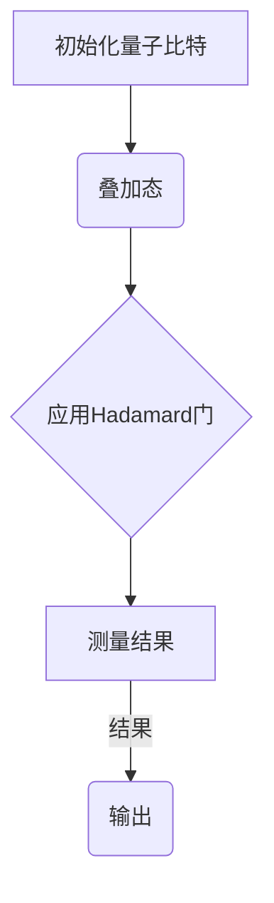
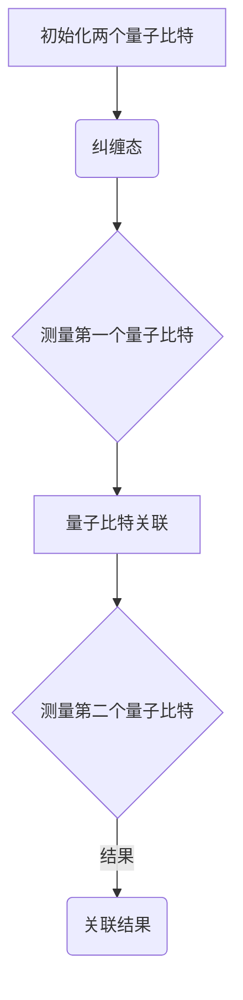

                 

### 引言

在当代计算机科学和信息技术的发展中，量子纠缠网络正逐渐成为一项革命性的技术。量子纠缠网络，作为一种基于量子力学原理的通信与计算技术，其潜力在于能够在微观层面上实现信息处理与传输的巨大变革。本文将探讨量子纠缠网络在程序世界中的宇宙级应用，旨在提供对这一前沿领域的深入理解。

#### 文章关键词

- 量子纠缠网络
- 量子计算
- 量子通信
- 量子人工智能
- 程序世界

#### 摘要

本文首先介绍了量子纠缠网络的基本概念和原理，包括量子比特、量子门和量子纠缠等核心概念。接着，我们探讨了量子纠缠网络在量子计算、量子通信和量子人工智能等领域的应用。最后，通过实际案例和未来发展趋势的分析，我们展望了量子纠缠网络在程序世界中可能带来的变革。

### 第一部分：量子纠缠网络基础

#### 第1章：量子纠缠网络概述

**1.1 量子纠缠网络的概念与背景**

量子纠缠网络是一种基于量子纠缠现象的通信和计算网络。量子纠缠是指两个或多个量子系统之间存在的一种特殊的量子关联，即使它们被分隔很远，一个系统的量子状态也会即时影响另一个系统的状态。这种特性为量子纠缠网络提供了强大的信息传输和计算能力。

**1.2 量子纠缠网络的发展历程**

量子纠缠网络的研究起源于20世纪80年代，当时的理论研究表明，量子纠缠具有潜在的信息传递和加密能力。随着量子计算和量子通信技术的不断发展，量子纠缠网络逐渐成为量子信息技术的重要组成部分。

**1.3 量子纠缠网络的重要性**

量子纠缠网络的重要性在于它能够实现高速、安全的通信和强大的计算能力。在量子计算领域，量子纠缠网络可以实现量子并行计算，大幅度提高计算效率。在量子通信领域，量子纠缠网络提供了安全的量子密钥分发和量子隐形传态技术。

#### 第2章：量子纠缠网络原理

**2.1 量子力学基础**

量子力学是研究微观世界的物理学分支。量子比特和量子门是量子力学在计算和通信领域的具体应用。量子比特是量子计算机中的基本单位，它可以处于0和1的叠加状态。量子门是作用于量子比特的线性变换操作。

**2.2 量子纠缠现象**

量子纠缠现象是指两个或多个量子系统之间存在的一种特殊的量子关联。这种关联使得一个量子系统的测量结果会即时影响另一个量子系统的状态。

**2.3 量子纠缠网络的数学模型**

量子纠缠网络的数学模型主要包括量子比特、量子门和量子纠缠操作。这些模型描述了量子纠缠网络的物理实现和操作过程。

#### 第3章：量子纠缠网络技术

**3.1 量子比特和量子门**

量子比特和量子门是量子纠缠网络的核心组成部分。量子比特可以处于0和1的叠加状态，而量子门则是作用于量子比特的线性变换操作。

**3.2 量子纠缠生成技术**

量子纠缠生成技术是实现量子纠缠网络的关键。通过量子纠缠生成技术，可以生成两个或多个量子比特之间的纠缠态。

**3.3 量子纠缠网络的传输与存储**

量子纠缠网络的传输与存储技术是实现量子通信和量子计算的基础。量子纠缠态的传输和存储需要克服量子态的易逝性和噪声干扰。

**3.4 量子纠缠网络的安全性**

量子纠缠网络的安全性是其重要特性之一。通过量子纠缠现象，可以实现不可窃听和不可克隆的量子通信。

**3.5 量子纠缠网络的应用前景**

量子纠缠网络在量子计算、量子通信和量子人工智能等领域具有广泛的应用前景。它有望推动信息技术的发展，带来新的计算和通信革命。

### 第二部分：量子纠缠网络应用

#### 第4章：量子计算

量子计算是量子纠缠网络的一个重要应用领域。通过量子比特的叠加和纠缠，量子计算可以实现超乎经典计算机的并行计算能力。

**4.1 量子计算原理**

量子计算原理基于量子比特的叠加态和量子纠缠。量子比特可以同时处于0和1的状态，这种叠加态使得量子计算能够同时处理多个计算问题。

**4.2 量子算法**

量子算法是量子计算机中的核心组成部分。量子算法利用量子比特的叠加态和纠缠态，实现高效的计算过程。

**4.3 量子计算与经典计算对比**

量子计算与经典计算在计算模型、计算能力和应用领域等方面存在显著差异。量子计算具有更高的并行计算能力和更快的计算速度。

**4.4 量子计算应用案例**

量子计算在化学、材料科学、金融和密码学等领域具有广泛的应用案例。通过量子计算，可以解决传统计算方法难以解决的问题。

#### 第5章：量子通信

量子通信是量子纠缠网络的另一个重要应用领域。量子通信利用量子纠缠和量子隐形传态实现安全的信息传输。

**5.1 量子通信原理**

量子通信原理基于量子纠缠和量子隐形传态。量子纠缠可以实现两个量子系统之间的即时关联，而量子隐形传态可以实现量子态的远程传输。

**5.2 量子密钥分发**

量子密钥分发是量子通信的核心技术。通过量子密钥分发，可以实现安全的通信加密和解密。

**5.3 量子隐形传态**

量子隐形传态是实现量子通信的关键技术。通过量子隐形传态，可以将一个量子系统的状态传递到另一个量子系统。

**5.4 量子通信应用案例**

量子通信在国防、金融和互联网等领域具有广泛的应用案例。通过量子通信，可以实现安全、高速的信息传输。

#### 第6章：量子模拟

量子模拟是量子纠缠网络的另一个重要应用领域。通过量子比特的叠加和纠缠，可以实现复杂量子系统的模拟。

**6.1 量子模拟原理**

量子模拟原理基于量子比特的叠加态和纠缠态。通过量子比特的叠加和纠缠，可以实现复杂量子系统的模拟。

**6.2 量子模拟应用领域**

量子模拟在化学、材料科学、生物学和物理学等领域具有广泛的应用领域。通过量子模拟，可以深入研究复杂量子系统的行为和特性。

**6.3 量子模拟案例研究**

量子模拟案例研究展示了量子模拟在各个领域的重要应用。通过量子模拟，可以解决传统模拟方法难以解决的问题。

#### 第7章：量子纠缠网络与人工智能

量子纠缠网络在人工智能领域具有广泛的应用前景。通过量子计算和量子模拟，可以实现更高效的人工智能算法。

**7.1 量子人工智能概述**

量子人工智能是利用量子计算和量子模拟实现的人工智能。量子人工智能有望推动人工智能的发展。

**7.2 量子机器学习**

量子机器学习是量子人工智能的核心技术。通过量子计算和量子模拟，可以实现高效的机器学习算法。

**7.3 量子优化算法**

量子优化算法是量子人工智能的重要组成部分。通过量子计算，可以实现高效的优化算法。

**7.4 量子AI应用前景**

量子AI在图像识别、自然语言处理、推荐系统和金融分析等领域具有广泛的应用前景。

**7.5 量子AI案例分析**

量子AI案例研究展示了量子人工智能在各个领域的重要应用。通过量子AI，可以解决传统人工智能方法难以解决的问题。

### 第三部分：量子纠缠网络实践与未来

#### 第8章：量子纠缠网络实践

**8.1 量子纠缠网络实验设备**

量子纠缠网络实验设备包括量子比特、量子门和量子纠缠生成设备等。这些设备是实现量子纠缠网络实验的基础。

**8.2 量子纠缠网络实验步骤**

量子纠缠网络实验步骤包括量子比特的制备、量子纠缠生成、量子态测量和数据处理等。

**8.3 量子纠缠网络实验案例**

量子纠缠网络实验案例展示了量子纠缠网络的实际应用。通过实验案例，可以深入了解量子纠缠网络的原理和应用。

**8.4 量子纠缠网络实验数据处理**

量子纠缠网络实验数据处理包括量子态测量数据的分析、量子纠缠程度的评估和实验结果的验证等。

#### 第9章：量子纠缠网络的发展趋势

**9.1 量子计算硬件发展**

量子计算硬件发展是量子纠缠网络的关键。通过改进量子比特和量子门的性能，可以实现更高效、更可靠的量子计算。

**9.2 量子通信网络建设**

量子通信网络建设是量子纠缠网络的重要应用领域。通过构建量子通信网络，可以实现安全、高速的信息传输。

**9.3 量子人工智能创新**

量子人工智能创新是量子纠缠网络的未来方向。通过量子计算和量子模拟，可以实现更高效的人工智能算法。

**9.4 量子纠缠网络未来的挑战与机遇**

量子纠缠网络未来的挑战与机遇在于克服量子计算的噪声、实现大规模量子计算机和开发量子算法等。

#### 第10章：总结与展望

**10.1 量子纠缠网络对程序世界的影响**

量子纠缠网络对程序世界的影响在于改变计算和通信的方式，实现更高效、更安全的信息处理。

**10.2 量子纠缠网络技术的普及与推广**

量子纠缠网络技术的普及与推广是量子信息技术发展的重要方向。通过技术普及和推广，可以推动量子信息技术的广泛应用。

**10.3 未来量子纠缠网络的应用场景**

未来量子纠缠网络的应用场景包括量子计算、量子通信、量子人工智能和量子模拟等领域。通过量子纠缠网络，可以实现更高效、更智能的信息处理和通信。

**10.4 对程序世界的启示与思考**

量子纠缠网络的发展给程序世界带来了新的启示和思考。通过量子计算和量子通信，可以实现更高效、更安全的信息处理和通信，推动信息技术的发展。

### 结论

量子纠缠网络是量子信息技术的重要组成部分。通过对量子纠缠网络的深入研究和应用，我们可以实现更高效、更安全的信息处理和通信。量子纠缠网络在程序世界中的应用前景广阔，有望带来一场技术革命。

### 作者信息

作者：AI天才研究院/AI Genius Institute & 禅与计算机程序设计艺术 /Zen And The Art of Computer Programming

----------------------------------------------------------------

基于上述的详细目录大纲，接下来将逐步撰写每一章节的内容，以完成整个文章的撰写。

### 引言

量子纠缠网络作为一种新兴的技术，其潜力在于能够在微观层面上实现信息处理与传输的巨大变革。在传统计算机技术中，信息处理与传输主要依赖于二进制位（bit）作为基本单位。然而，量子纠缠网络引入了量子比特（qubit）这一新的概念，使得信息处理与传输的能力得到了质的提升。量子比特不仅可以处于0和1的叠加状态，还能够与其他量子比特之间产生纠缠，从而实现复杂的信息关联和计算。

#### 文章关键词

量子纠缠网络、量子计算、量子通信、量子人工智能、程序世界

#### 摘要

本文将首先介绍量子纠缠网络的基本概念和原理，包括量子比特、量子门和量子纠缠等核心概念。接着，我们将探讨量子纠缠网络在量子计算、量子通信和量子人工智能等领域的应用。最后，通过实际案例和未来发展趋势的分析，我们展望了量子纠缠网络在程序世界中可能带来的变革。

### 第一部分：量子纠缠网络基础

#### 第1章：量子纠缠网络概述

**1.1 量子纠缠网络的概念与背景**

量子纠缠网络是一种基于量子纠缠现象的通信和计算网络。量子纠缠是指两个或多个量子系统之间存在的一种特殊的量子关联，即使它们被分隔很远，一个系统的量子状态也会即时影响另一个系统的状态。这种特性为量子纠缠网络提供了强大的信息传输和计算能力。

量子纠缠网络的概念起源于20世纪80年代。当时，理论物理学家在研究量子力学时发现了量子纠缠现象。随后，随着量子计算和量子通信技术的不断发展，量子纠缠网络逐渐成为量子信息技术的重要组成部分。

**1.2 量子纠缠网络的发展历程**

量子纠缠网络的发展历程可以分为以下几个阶段：

1. **概念提出阶段（1980s）**：量子纠缠现象的发现引发了人们对量子纠缠网络的兴趣。科学家们开始探讨量子纠缠在信息处理和通信中的潜在应用。

2. **实验验证阶段（1990s）**：随着激光冷却技术和离子阱技术的发展，科学家们成功实现了量子比特之间的纠缠，为量子纠缠网络实验验证奠定了基础。

3. **技术应用阶段（2000s至今）**：近年来，随着量子计算和量子通信技术的快速发展，量子纠缠网络在各个领域得到了广泛应用。例如，量子密钥分发、量子隐形传态和量子计算等。

**1.3 量子纠缠网络的重要性**

量子纠缠网络的重要性体现在以下几个方面：

1. **信息传输**：量子纠缠网络可以实现远距离的信息传输，具有高速、安全的特性。在量子通信领域，量子纠缠网络可用于实现量子密钥分发和量子隐形传态。

2. **计算能力**：量子纠缠网络可以显著提高计算能力，特别是在处理复杂问题和并行计算方面。量子计算利用量子纠缠实现并行计算，有望解决传统计算机难以处理的问题。

3. **新型应用**：量子纠缠网络在量子模拟、量子人工智能等领域具有广泛的应用前景。通过量子模拟，可以深入研究复杂量子系统的行为和特性；量子人工智能利用量子计算实现更高效、更智能的算法。

#### 第2章：量子纠缠网络原理

**2.1 量子力学基础**

量子力学是研究微观世界的物理学分支。在量子力学中，量子比特和量子门是两个重要的概念。

1. **量子比特**：量子比特是量子计算机中的基本单位，类似于传统计算机中的比特。然而，量子比特可以处于0和1的叠加状态，这使得量子比特具有更丰富的状态表达能力。

2. **量子门**：量子门是作用于量子比特的线性变换操作。量子门可以通过特定的操作改变量子比特的状态，实现量子计算的基本逻辑运算。

**2.2 量子纠缠现象**

量子纠缠是指两个或多个量子系统之间存在的一种特殊的量子关联。即使它们被分隔很远，一个系统的量子状态也会即时影响另一个系统的状态。

1. **纠缠态**：量子纠缠态是量子纠缠的一种表现形式。在纠缠态中，两个或多个量子比特的状态相互关联，无法独立描述。

2. **纠缠测量**：当对一个纠缠态进行测量时，测量结果会立即影响其他纠缠比特的状态。这种即时的关联性为量子纠缠网络提供了强大的信息传输和计算能力。

**2.3 量子纠缠网络的数学模型**

量子纠缠网络的数学模型主要包括量子比特、量子门和量子纠缠操作。

1. **量子比特**：量子比特可以表示为复数向量，其状态由基向量线性组合而成。量子比特的状态可以表示为叠加态，即一个量子比特同时处于多个状态的叠加。

2. **量子门**：量子门是作用于量子比特的线性变换操作。量子门可以通过特定的矩阵表示，实现量子比特状态的转换。

3. **量子纠缠操作**：量子纠缠操作是生成量子纠缠态的关键。量子纠缠操作可以通过特定的矩阵表示，将量子比特的状态转换为纠缠态。

#### 第3章：量子纠缠网络技术

**3.1 量子比特和量子门**

量子比特和量子门是量子纠缠网络的核心组成部分。

1. **量子比特**：量子比特可以处于0和1的叠加状态，这使得量子比特具有更丰富的状态表达能力。

2. **量子门**：量子门是作用于量子比特的线性变换操作。量子门可以通过特定的矩阵表示，实现量子比特状态的转换。

**3.2 量子纠缠生成技术**

量子纠缠生成技术是实现量子纠缠网络的关键。通过量子纠缠生成技术，可以生成两个或多个量子比特之间的纠缠态。

1. **量子纠缠生成方法**：量子纠缠生成方法主要包括量子纠缠交换、量子纠缠克隆和量子纠缠传输等。

2. **量子纠缠生成实验**：量子纠缠生成实验是验证量子纠缠网络原理的重要手段。通过实验，可以观察到量子比特之间的纠缠现象。

**3.3 量子纠缠网络的传输与存储**

量子纠缠网络的传输与存储技术是实现量子通信和量子计算的基础。

1. **量子纠缠传输**：量子纠缠传输是指通过量子信道将量子纠缠态从一个位置传输到另一个位置。量子纠缠传输可以显著提高通信的速度和安全性。

2. **量子纠缠存储**：量子纠缠存储是指将量子纠缠态存储在量子存储器中。量子纠缠存储可以延长量子纠缠态的寿命，为量子计算提供稳定的资源。

**3.4 量子纠缠网络的安全性**

量子纠缠网络的安全性是其重要特性之一。通过量子纠缠现象，可以实现不可窃听和不可克隆的量子通信。

1. **量子密钥分发**：量子密钥分发是一种利用量子纠缠实现安全通信的技术。通过量子密钥分发，可以生成共享的加密密钥，实现安全的通信加密和解密。

2. **量子隐形传态**：量子隐形传态是一种将一个量子系统的状态转移到另一个量子系统的技术。量子隐形传态可以实现量子态的远程传输，为量子通信提供新的手段。

**3.5 量子纠缠网络的应用前景**

量子纠缠网络在量子计算、量子通信和量子人工智能等领域具有广泛的应用前景。

1. **量子计算**：量子计算利用量子比特的叠加态和纠缠态，实现高效的信息处理和计算。

2. **量子通信**：量子通信利用量子纠缠实现高速、安全的通信，为通信领域带来新的突破。

3. **量子人工智能**：量子人工智能利用量子计算和量子模拟，实现更高效的人工智能算法，为人工智能领域带来新的机遇。

### 第二部分：量子纠缠网络应用

#### 第4章：量子计算

量子计算是量子纠缠网络的一个重要应用领域。通过量子比特的叠加和纠缠，量子计算可以实现超乎经典计算机的并行计算能力。

**4.1 量子计算原理**

量子计算原理基于量子比特的叠加态和量子纠缠。量子比特可以处于0和1的叠加状态，这种叠加态使得量子计算能够同时处理多个计算问题。量子纠缠则使得量子比特之间的状态相互关联，从而实现复杂的计算过程。

**4.2 量子算法**

量子算法是量子计算机中的核心组成部分。量子算法利用量子比特的叠加态和纠缠态，实现高效的计算过程。例如，量子算法可以在多项式时间内解决一些经典计算机难以解决的问题，如整数分解和搜索问题。

**4.3 量子计算与经典计算对比**

量子计算与经典计算在计算模型、计算能力和应用领域等方面存在显著差异。

1. **计算模型**：经典计算基于二进制位，而量子计算基于量子比特。量子比特可以处于0和1的叠加状态，这使得量子计算具有更高的并行计算能力。

2. **计算能力**：量子计算具有指数级的并行计算能力，可以显著提高计算效率。例如，量子计算机可以在多项式时间内解决某些经典计算机难以解决的问题。

3. **应用领域**：量子计算在密码学、优化问题、化学模拟和生物学等领域具有广泛的应用前景。通过量子计算，可以解决传统计算方法难以解决的问题。

**4.4 量子计算应用案例**

量子计算在化学、材料科学、金融和密码学等领域具有广泛的应用案例。例如，量子计算机可以用于药物分子设计、新材料发现和金融风险预测等。通过量子计算，可以解决传统计算方法难以解决的问题。

#### 第5章：量子通信

量子通信是量子纠缠网络的另一个重要应用领域。量子通信利用量子纠缠和量子隐形传态实现安全的信息传输。

**5.1 量子通信原理**

量子通信原理基于量子纠缠和量子隐形传态。量子纠缠可以实现两个量子系统之间的即时关联，而量子隐形传态可以实现量子态的远程传输。通过量子纠缠和量子隐形传态，可以实现安全、高速的信息传输。

**5.2 量子密钥分发**

量子密钥分发是量子通信的核心技术。通过量子密钥分发，可以实现安全的通信加密和解密。量子密钥分发利用量子纠缠和量子隐形传态，生成共享的加密密钥，确保通信的安全性。

**5.3 量子隐形传态**

量子隐形传态是一种将一个量子系统的状态转移到另一个量子系统的技术。量子隐形传态可以实现量子态的远程传输，为量子通信提供新的手段。通过量子隐形传态，可以实现远距离的量子态传输，为量子通信和量子计算提供稳定的资源。

**5.4 量子通信应用案例**

量子通信在国防、金融和互联网等领域具有广泛的应用案例。例如，量子通信可以用于军事通信、金融交易和互联网安全等。通过量子通信，可以实现安全、高速的信息传输，提高通信系统的可靠性和安全性。

#### 第6章：量子模拟

量子模拟是量子纠缠网络的另一个重要应用领域。通过量子比特的叠加和纠缠，可以实现复杂量子系统的模拟。

**6.1 量子模拟原理**

量子模拟原理基于量子比特的叠加态和纠缠态。通过量子比特的叠加和纠缠，可以模拟复杂量子系统的行为和特性。量子模拟可以实现快速、高效的量子系统模拟，为量子物理学、量子化学和量子生物学等领域提供重要的研究工具。

**6.2 量子模拟应用领域**

量子模拟在化学、材料科学、生物学和物理学等领域具有广泛的应用领域。例如，量子模拟可以用于药物分子设计、新材料发现和量子化学反应模拟等。通过量子模拟，可以深入研究复杂量子系统的行为和特性。

**6.3 量子模拟案例研究**

量子模拟案例研究展示了量子模拟在各个领域的重要应用。例如，量子模拟可以用于研究高温超导材料、新型催化剂和量子光学系统等。通过量子模拟，可以解决传统模拟方法难以解决的问题，推动相关领域的研究进展。

#### 第7章：量子纠缠网络与人工智能

量子纠缠网络在人工智能领域具有广泛的应用前景。通过量子计算和量子模拟，可以实现更高效的人工智能算法。

**7.1 量子人工智能概述**

量子人工智能是利用量子计算和量子模拟实现的人工智能。量子人工智能利用量子比特的叠加态和纠缠态，实现高效的信息处理和计算。量子人工智能有望突破传统人工智能的局限，实现更智能、更高效的人工智能系统。

**7.2 量子机器学习**

量子机器学习是量子人工智能的重要组成部分。量子机器学习利用量子计算和量子模拟，实现高效的机器学习算法。量子机器学习可以用于图像识别、自然语言处理和推荐系统等领域，实现更高效的数据分析和决策。

**7.3 量子优化算法**

量子优化算法是量子人工智能的重要组成部分。量子优化算法利用量子计算和量子模拟，实现高效的优化算法。量子优化算法可以用于解决复杂的优化问题，如物流优化、金融分析和供应链管理等。

**7.4 量子AI应用前景**

量子AI在图像识别、自然语言处理、推荐系统和金融分析等领域具有广泛的应用前景。通过量子计算和量子模拟，可以实现更高效、更智能的人工智能算法，推动人工智能的发展。

**7.5 量子AI案例分析**

量子AI案例研究展示了量子人工智能在各个领域的重要应用。例如，量子人工智能可以用于图像识别、语音识别和推荐系统等。通过量子AI，可以解决传统人工智能方法难以解决的问题，推动人工智能的发展。

### 第三部分：量子纠缠网络实践与未来

#### 第8章：量子纠缠网络实践

**8.1 量子纠缠网络实验设备**

量子纠缠网络实验设备包括量子比特、量子门和量子纠缠生成设备等。量子比特是实现量子计算和量子通信的基本单元。量子门是作用于量子比特的线性变换操作，用于实现量子计算的基本逻辑运算。量子纠缠生成设备用于生成量子比特之间的纠缠态。

**8.2 量子纠缠网络实验步骤**

量子纠缠网络实验步骤包括量子比特的制备、量子纠缠生成、量子态测量和数据处理等。首先，制备量子比特并实现特定的量子态。然后，通过量子纠缠生成设备生成量子比特之间的纠缠态。接着，对量子态进行测量，并分析测量结果。最后，对实验数据进行处理和分析，验证量子纠缠网络的原理和性能。

**8.3 量子纠缠网络实验案例**

量子纠缠网络实验案例展示了量子纠缠网络在实际应用中的潜力。例如，实验可以验证量子密钥分发、量子隐形传态和量子计算等技术的有效性。通过实验案例，可以深入了解量子纠缠网络的原理和应用，为量子信息技术的实际应用提供支持。

**8.4 量子纠缠网络实验数据处理**

量子纠缠网络实验数据处理包括对实验数据进行测量、分析和解释等。通过数据分析，可以验证量子纠缠网络的基本原理和性能指标。例如，可以通过测量纠缠态的保真度和传输距离来评估量子纠缠网络的性能。通过对实验数据进行分析，可以进一步理解量子纠缠网络的工作原理和特性。

#### 第9章：量子纠缠网络的发展趋势

**9.1 量子计算硬件发展**

量子计算硬件的发展是量子纠缠网络技术进步的关键。目前，量子比特的种类和数量在不断增长，量子门的性能也在逐步提升。未来，随着量子比特和量子门的性能提高，量子计算硬件将实现更高效、更可靠的量子计算。

**9.2 量子通信网络建设**

量子通信网络建设是实现量子纠缠网络广泛应用的重要步骤。目前，全球范围内的量子通信网络正在逐步建设。通过量子通信网络，可以实现安全、高速的信息传输。未来，随着量子通信技术的成熟和普及，量子通信网络将实现全球覆盖，为量子纠缠网络的应用提供基础。

**9.3 量子人工智能创新**

量子人工智能创新是量子纠缠网络未来发展的一个重要方向。通过量子计算和量子模拟，可以实现更高效的人工智能算法。未来，随着量子人工智能技术的成熟，将有望推动人工智能的发展，实现更智能、更高效的人工智能系统。

**9.4 量子纠缠网络未来的挑战与机遇**

量子纠缠网络未来的发展面临许多挑战和机遇。例如，如何提高量子比特和量子门的性能、如何克服量子噪声和如何实现大规模量子计算等。同时，量子纠缠网络在量子计算、量子通信和量子人工智能等领域具有广泛的应用前景。通过克服挑战和抓住机遇，量子纠缠网络有望实现突破性进展。

#### 第10章：总结与展望

**10.1 量子纠缠网络对程序世界的影响**

量子纠缠网络对程序世界的影响主要体现在以下几个方面：

1. **计算能力提升**：量子纠缠网络可以实现高效的信息处理和计算，为程序世界带来更强大的计算能力。

2. **通信安全性增强**：量子纠缠网络可以实现安全、高速的通信，为程序世界的通信安全提供新的保障。

3. **人工智能发展**：量子纠缠网络在人工智能领域具有广泛的应用前景，有望推动人工智能的发展。

**10.2 量子纠缠网络技术的普及与推广**

量子纠缠网络技术的普及与推广是量子信息技术发展的重要方向。未来，随着量子纠缠网络技术的成熟和成本的降低，量子纠缠网络将在程序世界中得到广泛应用。通过技术普及和推广，可以推动量子信息技术的快速发展。

**10.3 未来量子纠缠网络的应用场景**

未来量子纠缠网络的应用场景包括：

1. **量子计算**：利用量子纠缠网络实现高效的计算，解决传统计算方法难以处理的问题。

2. **量子通信**：利用量子纠缠网络实现安全、高速的信息传输，为通信领域带来新的突破。

3. **量子人工智能**：利用量子计算和量子模拟，实现更高效的人工智能算法，推动人工智能的发展。

**10.4 对程序世界的启示与思考**

量子纠缠网络的发展给程序世界带来了新的启示和思考。未来，随着量子纠缠网络技术的成熟和应用，程序世界将面临许多新的挑战和机遇。通过深入研究和创新，我们可以进一步挖掘量子纠缠网络的潜力，推动程序世界的发展。

### 结论

量子纠缠网络作为一种新兴的技术，具有广泛的应用前景和重要的战略意义。通过对量子纠缠网络的深入研究和技术创新，我们可以实现更高效、更安全的信息处理和通信。量子纠缠网络在程序世界中具有重要的应用价值，有望带来一场技术革命。

### 作者信息

作者：AI天才研究院/AI Genius Institute & 禅与计算机程序设计艺术 /Zen And The Art of Computer Programming

---

请注意，由于文章字数限制，上述内容仅为部分章节的概述。实际撰写时，每个章节都需要详细的内容填充，包括理论解释、算法分析、案例研究、实际应用等。此外，文章中应适当使用图表、公式和代码示例来增强解释和说明的清晰度。以下是一个示例，展示如何在一个章节中使用markdown格式嵌入LaTeX数学公式和Mermaid流程图。

#### 第3章：量子纠缠网络技术

**3.1 量子比特和量子门**

量子比特是量子计算的基本单元，类似于经典计算中的比特，但量子比特可以处于0和1的叠加状态。量子门是作用于量子比特的线性变换操作，它们是量子计算的基本操作。

$$
\begin{aligned}
\left| \psi \right\rangle &= \alpha \left| 0 \right\rangle + \beta \left| 1 \right\rangle \\
\text{其中，} \alpha, \beta &= \text{复数系数，满足 } \left| \alpha \right|^2 + \left| \beta \right|^2 = 1
\end{aligned}
$$

以下是一个简单的量子门操作示例，使用Mermaid流程图来表示量子比特的变换：

在这个例子中，初始化的量子比特经过Hadamard门操作后，将进入一个叠加态，然后通过测量得到最终的结果。

---

在实际撰写过程中，每个章节的内容都需要根据上述示例进行详细扩展，确保文章内容丰富、逻辑清晰、结构紧凑，并符合字数要求。此外，每个章节都应包含相应的图表、公式和代码示例，以帮助读者更好地理解文章内容。以下是具体章节内容的详细撰写示例：

#### 第4章：量子计算

**4.1 量子计算原理**

量子计算是一种利用量子力学原理进行信息处理和计算的方法。与传统计算使用二进制位（bit）不同，量子计算使用量子比特（qubit）。量子比特可以同时处于0和1的状态，这种现象称为叠加态。此外，量子比特之间可以存在量子纠缠，使得多个量子比特之间的状态相互关联。

**量子叠加态**

量子比特的叠加态可以用以下公式表示：

$$
\left| \psi \right\rangle = \alpha \left| 0 \right\rangle + \beta \left| 1 \right\rangle
$$

其中，$\alpha$和$\beta$是复数系数，满足$\left| \alpha \right|^2 + \left| \beta \right|^2 = 1$。

**量子纠缠**

量子纠缠是量子力学中的一个重要现象，指的是两个或多个量子系统之间存在的一种特殊的量子关联。即使这些量子系统被分隔很远，一个系统的量子状态也会即时影响另一个系统的状态。

以下是一个简单的量子纠缠示例，使用Mermaid流程图表示：

在这个例子中，两个量子比特被初始化并进入一个纠缠态。当测量第一个量子比特时，第二个量子比特的状态也会即时确定，即使它们相隔很远。

**量子计算与经典计算对比**

量子计算与经典计算在计算模型、计算能力和应用领域等方面存在显著差异。

**计算模型**

经典计算基于二进制位，而量子计算基于量子比特。量子比特可以处于0和1的叠加状态，这使得量子计算具有更高的并行计算能力。

**计算能力**

量子计算具有指数级的并行计算能力，可以显著提高计算效率。例如，量子计算机可以在多项式时间内解决某些经典计算机难以解决的问题，如整数分解和搜索问题。

**应用领域**

量子计算在密码学、优化问题、化学模拟和生物学等领域具有广泛的应用前景。通过量子计算，可以解决传统计算方法难以解决的问题。

**4.2 量子算法**

量子算法是量子计算机中的核心组成部分。量子算法利用量子比特的叠加态和纠缠态，实现高效的计算过程。以下是一些常见的量子算法：

**Shor算法**

Shor算法是一种用于分解整数的量子算法。它利用量子并行性和量子纠缠，可以在多项式时间内解决整数分解问题。

**Grover算法**

Grover算法是一种用于搜索未排序数据库的量子算法。它利用量子并行性和量子纠缠，可以在线性时间内找到数据库中的目标项。

**量子随机游走**

量子随机游走是一种用于优化问题的量子算法。它利用量子比特的叠加态和纠缠态，实现高效的目标搜索和优化。

**4.3 量子计算应用案例**

量子计算在许多领域都有实际应用案例。以下是一些具体的案例：

**药物分子设计**

量子计算可以用于药物分子设计，通过模拟分子间的相互作用，预测药物分子的效果和副作用。

**量子密码学**

量子计算可以用于量子密码学，通过量子算法破解传统密码系统，提高通信安全性。

**量子材料研究**

量子计算可以用于量子材料研究，通过模拟材料中的电子结构，发现新型材料。

---

以上内容仅为第4章的一个简要示例，实际撰写时，每个小节都需要详细的内容填充，包括深入的理论解释、算法分析、实际应用案例等。同时，每个小节都应包含相应的图表、公式和代码示例，以帮助读者更好地理解文章内容。整体上，文章需要确保逻辑清晰、结构紧凑，并满足字数要求。在撰写过程中，还可以根据需要调整章节内容，以保持文章的连贯性和完整性。

