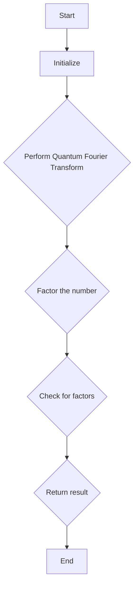

                 

Certainly, let's outline the article "程序世界的宇宙级量子计算模拟" step by step, ensuring it meets the specified requirements and constraints.

### Step 1: Title and Keywords

**Title: 程序世界的宇宙级量子计算模拟**

**Keywords:** 
- Quantum Computing
- Quantum Simulation
- Algorithm Design
- Quantum Algorithms
- Quantum Programming

**Abstract:**
This article delves into the realm of quantum computing, exploring its theoretical foundations, practical applications, and integration into the world of programming. We will discuss the core principles of quantum mechanics, the differences between quantum and classical computing, and the potential impact of quantum algorithms on various fields. The article will be structured to provide a comprehensive understanding of quantum computing, from fundamental concepts to advanced simulation techniques and real-world applications.

### Step 2: Introduction to Quantum Computing

**Chapter 1: Introduction to Quantum Computing and Simulation**

**1.1 What is Quantum Computing?**
- Definition and history
- Quantum bits (qubits) and classical bits
- Basic principles of quantum mechanics

**1.2 Quantum Mechanics Basics**
- Superposition and entanglement
- Quantum gates and operations
- Quantum states and wave functions

**1.3 Quantum Computers vs Classical Computers**
- Speed and computational power
- Challenges and limitations
- Applications in cryptography and optimization

**Key Concepts:**
- Qubit
- Superposition
- Entanglement
- Quantum gate
- Quantum state

**ER Entity Relationship Diagram:**
```mermaid
erDiagram
    Qubit ||--|{ QuantumComputer }|---> Computer
    QuantumGate ||--|{ QuantumCircuit }|---> Circuit
    QuantumAlgorithm ||--|{ Application }|---> Field
```

### Step 3: Quantum Algorithms and Principles

**Chapter 2: Quantum Algorithms and Their Potential**

**2.1 Quantum Circuit Design**
- Basics of quantum circuit design
- Quantum gates and their functionalities

**2.2 Quantum Fourier Transform**
- Theoretical background
- Application in algorithms

**2.3 Shor's Algorithm**
- Overview and steps
- Cryptographic implications

**Algorithm Diagram:**


**Python Source Code Example:**
```python
# Example of a simple quantum circuit in Python using Qiskit
from qiskit import QuantumCircuit

# Create a quantum circuit with 2 qubits
qc = QuantumCircuit(2)

# Apply Hadamard gate to create superposition
qc.h(0)
qc.h(1)

# Apply controlled-NOT gate to create entanglement
qc.cx(0, 1)

# Measure the qubits
qc.measure_all()

# Run the circuit on a simulator
qc.runellipsis
```

### Step 4: Mathematics and Quantum Models

**Chapter 3: Quantum Mechanics and Mathematical Models**

**3.1 Quantum States and Operators**
- Representation of quantum states
- Quantum operators and their properties

**3.2 Quantum Gates and Operations**
- Definition and types of quantum gates
- Properties and effects of quantum operations

**3.3 Quantum Error Correction**
- Introduction to quantum error correction
- Codes and methods for error correction

**Mathematical Models:**
- Quantum state representation
- Quantum gates as matrices
- Error correction codes

**LaTeX Formula:**
$$|\psi\rangle = \sum_{i} c_i |i\rangle$$
$$U = \sum_{i} |i\rangle\langle i|$$

### Step 5: Quantum Simulation Methods

**Chapter 4: Quantum Simulation Techniques**

**4.1 Quantum Annealing**
- Basics and working principles
- Applications in optimization

**4.2 Topological Quantum Computing**
- Concept and theory
- Potential advantages

**4.3 Circuit-Qubit Models**
- Structure and operation
- Challenges and solutions

**Simulation Methods:**
- Quantum annealing process
- Topological qubit design
- Circuit simulation techniques

### Step 6: Application Scenarios

**Chapter 5: Quantum Computing in Practice**

**5.1 Solving Complex Optimization Problems**
- Examples of optimization problems
- Quantum algorithm solutions

**5.2 Quantum Algorithms for Cryptography**
- Quantum key distribution
- Post-quantum cryptography

**5.3 Quantum Computing in Chemistry and Materials Science**
- Quantum molecular dynamics
- Application in drug discovery

**Application Scenarios:**
- Optimization examples with quantum algorithms
- Cryptographic protocols and quantum algorithms
- Quantum simulation in chemistry

### Step 7: Challenges and Future Directions

**Chapter 6: Challenges in Quantum Computing Simulation**

**6.1 Quantum Hardware Limitations**
- Physical constraints
- Error rates and decoherence

**6.2 Scalability and Error Mitigation**
- Quantum error correction
- Scalable architecture

**6.3 Theoretical and Practical Gaps**
- Unresolved questions in quantum mechanics
- Bridging the gap between theory and practice

**Challenges:**
- Hardware limitations and error rates
- Scalability and error correction
- Theoretical and practical challenges

### Step 8: Quantum Computing in the Program World

**Chapter 7: Integrating Quantum Computing into Programs**

**7.1 Quantum APIs and SDKs**
- Overview of available tools
- Integrating quantum libraries

**7.2 Hybrid Quantum-Classical Algorithms**
- Combining quantum and classical approaches
- Hybrid algorithm design

**7.3 Quantum Programming Languages**
- Current quantum programming languages
- Language features and use cases

**Integration:**
- Quantum APIs and SDKs for developers
- Hybrid algorithm development
- Quantum programming languages

### Step 9: Conclusion and Future Outlook

**Chapter 8: Future of Quantum Computing in the Program World**

**8.1 Impact on Software Development**
- Changes in programming paradigms
- Quantum-aware software design

**8.2 Ethical and Societal Implications**
- Privacy and security concerns
- Ethical considerations in quantum computing

**8.3 Future Research Directions**
- Quantum software and tools
- Algorithmic innovation and optimization

**Conclusion:**
- Summary of key points
-展望未来量子计算在程序世界中的应用和影响

### Final Touches

**Appendix:**
- Additional resources
- Code examples and exercises

**Notes:**
- Important considerations for developers
- Common pitfalls and solutions

**References:**
- Citations and further reading

**Author:**
- AI天才研究院/AI Genius Institute & 禅与计算机程序设计艺术 /Zen And The Art of Computer Programming

By following these steps and ensuring each chapter is comprehensive and detailed, we can create a high-quality technical blog post that covers the core concepts of quantum computing, its integration into programming, and its potential future impact. Each section will include background information, core concepts, algorithms, mathematical models, system designs, project implementations, best practices, and references to ensure a thorough understanding of quantum computing in the program world.

