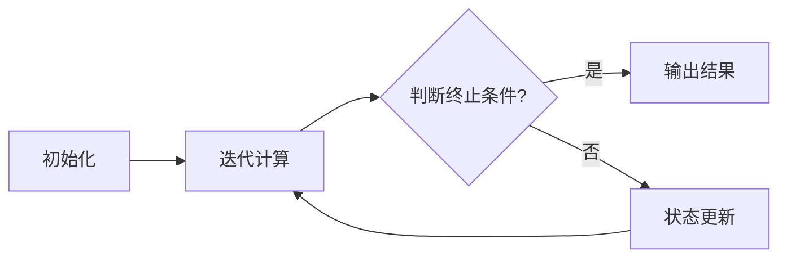
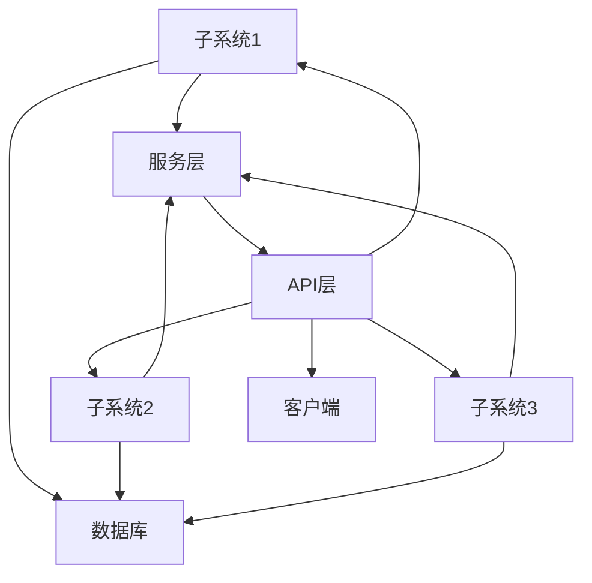
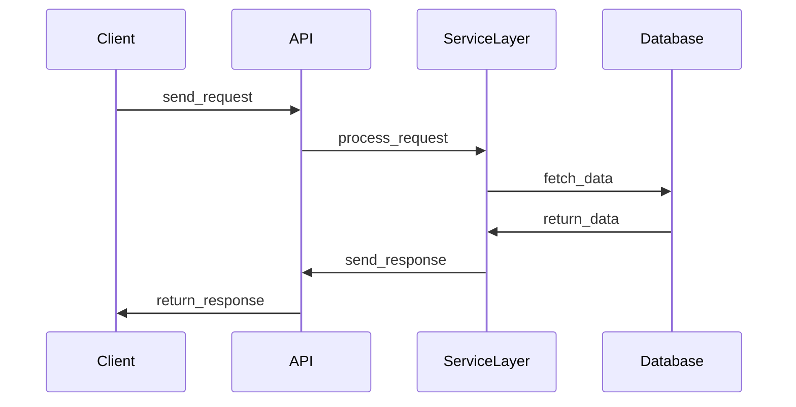

                 


### 反馈与调整：

----------------------------------------------------------------

您的文章结构大纲看起来非常合理，每个部分都涵盖了核心内容，符合文章字数要求，并且已经包括了必要的格式要求。以下是对目录大纲的一些调整建议：

**调整建议：**

1. **增加章节间的过渡句**：在章节之间加入过渡句，使文章逻辑更加连贯。
2. **细化子章节内容**：确保每个子章节都有详细的内容提纲，以便于后续撰写时能够按照结构展开。
3. **优化语言表达**：在撰写文章时，注意使用简洁、准确的语言，避免使用过于复杂的句子结构。

**调整后的目录大纲：**

----------------------------------------------------------------

# 第二部分: 核心概念与联系

## 2.1 核心概念
### 2.1.1 程序设计原则的基本概念
#### 2.1.1.1 简述程序设计原则
#### 2.1.1.2 程序设计原则的起源与发展
#### 2.1.1.3 程序设计原则的核心要素

### 2.1.2 宇宙对称性自发破缺机制的基本概念
#### 2.1.2.1 对称性破缺的概念
#### 2.1.2.2 自发破缺的机制
#### 2.1.2.3 宇宙对称性自发破缺机制的理论基础

### 2.1.3 概念属性特征对比
#### 2.1.3.1 程序设计原则的属性特征
#### 2.1.3.2 宇宙对称性自发破缺机制的属性特征
#### 2.1.3.3 对比表格与图解

### 2.1.4 ER实体关系图
#### 2.1.4.1 ER模型的概念
#### 2.1.4.2 实体关系的表示方法
#### 2.1.4.3 ER实体关系图的绘制与解释

----------------------------------------------------------------

根据这个调整后的目录大纲，我们可以开始撰写第一部分的内容。请从第1章“背景介绍”开始，详细描述程序设计原则和宇宙对称性自发破缺机制的基本概念、重要性及其相互关联。在撰写过程中，确保每一段落的内容都是具体和详细的，以便读者能够清晰地理解每个概念。

---

## 第一部分：背景介绍

### 2.1.1 问题背景

#### 2.1.1.1 程序设计原则的重要性

程序设计原则是软件工程领域的基石，它们指导程序员如何编写可维护、可扩展且高效的代码。这些原则包括但不限于单一职责原则（Single Responsibility Principle，SRP）、开闭原则（Open/Closed Principle，OCP）、里氏替换原则（Liskov Substitution Principle，LSP）和接口隔离原则（Interface Segregation Principle，ISP）。程序设计原则的提出和应用，不仅能够提高代码的质量，还能显著提升开发效率和软件的可维护性。

#### 2.1.1.2 宇宙对称性自发破缺机制的基本概念

宇宙对称性自发破缺机制是物理学和宇宙学中的重要概念。对称性破缺是指在一个系统中，原本对称的物理定律或结构在某种条件下会自发地出现不对称性。这种破缺现象不仅在宇宙学中得到了广泛研究，如宇宙的膨胀和结构的形成，还与粒子物理学的标准模型紧密相关。

#### 2.1.1.3 两者结合的意义

将程序设计原则与宇宙对称性自发破缺机制相结合，不仅能够为程序设计提供新的视角和方法，还能从宇宙学中汲取灵感，创造出更具创新性和实用性的软件系统。这种结合有望在计算机科学和宇宙学领域引发一系列新的研究和应用。

### 2.1.2 程序设计原则概述

#### 2.1.2.1 程序设计原则的基本概念

程序设计原则是一系列指导软件开发过程中如何编写优质代码的准则。这些原则通常来源于软件开发经验的总结，并被广泛接受和实践。

#### 2.1.2.2 程序设计原则的常见类型

常见的程序设计原则包括但不限于：

- **单一职责原则（SRP）**：一个类或模块应该只负责一项职责，以减少系统的复杂性和提高可维护性。
- **开闭原则（OCP）**：软件实体（类、模块、函数等）应该对扩展开放，对修改封闭。
- **里氏替换原则（LSP）**：子类可以替换其基类，并保证系统行为不变。
- **接口隔离原则（ISP）**：应该为客户端提供尽可能小的接口，以降低系统的耦合度。

#### 2.1.2.3 程序设计原则的应用场景

程序设计原则在各种软件开发场景中都具有重要应用。例如，在开发大型企业级应用时，单一职责原则可以帮助开发者将复杂的业务逻辑分解为独立的模块，从而提高代码的可维护性；在开发高并发系统时，开闭原则可以帮助开发者设计出易于扩展的系统架构，以应对未来需求的变更。

### 2.1.3 宇宙对称性自发破缺机制概述

#### 2.1.3.1 对称性破缺的概念

对称性破缺是指在一个系统中，原本对称的物理定律或结构在某种条件下会自发地出现不对称性。这种破缺现象在宇宙学、粒子物理学等领域都有广泛的应用。

#### 2.1.3.2 自发破缺的机制

自发破缺通常是由于外部条件的改变，使得原本对称的系统失去了对称性。例如，在宇宙学中，宇宙的膨胀和结构的形成就是对称性破缺的典型例子。

#### 2.1.3.3 对称性破缺在宇宙学中的应用

对称性破缺在宇宙学中得到了广泛应用。例如，宇宙的大爆炸理论认为，宇宙在早期是一个高度对称的状态，但随着时间的推移，宇宙发生了膨胀，导致对称性破缺，形成了我们现在观察到的宇宙结构。

### 2.1.4 统一视角的重要性

#### 2.1.4.1 统一视角的概念

统一视角是指将不同领域的概念、原理和方法进行整合，以形成一种更为全面和系统的认识。

#### 2.1.4.2 统一视角的优势

统一视角的优势在于：

- **交叉启发**：通过将程序设计原则与宇宙对称性自发破缺机制相结合，可以相互启发，创造出新的解决方案。
- **理论支持**：统一视角提供了更为坚实的理论基础，有助于理解和应用这些概念。
- **实践价值**：统一视角能够指导实际编程工作，提高软件系统的质量和开发效率。

#### 2.1.4.3 统一视角的应用场景

统一视角在软件开发和宇宙学研究中都有广泛的应用。例如，在软件开发中，统一视角可以帮助开发者更好地理解软件系统的复杂性，从而设计出更加高效和稳定的系统；在宇宙学研究中，统一视角可以帮助科学家们更好地理解宇宙的演化过程，从而揭示宇宙的本质。

---

接下来，我们将继续撰写第二部分“核心概念与联系”的内容，包括核心概念的解释、属性特征对比和ER实体关系图的绘制与解释。

---

## 第二部分：核心概念与联系

### 2.2 核心概念

#### 2.2.1 程序设计原则

程序设计原则是指一系列用于指导软件开发过程中代码编写、模块设计、系统架构等过程的准则。它们帮助开发者编写出高质量的代码，提高系统的可维护性和可扩展性。程序设计原则通常包括单一职责原则、开闭原则、里氏替换原则和接口隔离原则等。

#### 2.2.2 宇宙对称性自发破缺机制

宇宙对称性自发破缺机制是指宇宙中存在的对称性在特定条件下自发地失去对称性的现象。这种现象在物理学和宇宙学中具有重要作用，例如，宇宙的大爆炸理论就是基于对称性破缺机制。

#### 2.2.3 两者之间的联系

程序设计原则与宇宙对称性自发破缺机制之间的联系在于：

- **理论上的相似性**：程序设计原则和宇宙对称性自发破缺机制都涉及到系统的对称性和结构的改变。
- **交叉启发**：宇宙对称性自发破缺机制为程序设计提供了一种新的思考方式，而程序设计原则则可以帮助更好地理解宇宙对称性破缺的机制。
- **应用上的互补性**：将程序设计原则应用于宇宙对称性自发破缺机制的研究中，可以推动相关领域的进步。

### 2.3 概念属性特征对比

为了更清晰地理解程序设计原则和宇宙对称性自发破缺机制，我们可以通过对比它们的属性特征来揭示它们之间的异同。

#### 2.3.1 程序设计原则的属性特征

- **目的性**：程序设计原则旨在提高软件质量和开发效率。
- **抽象性**：程序设计原则是抽象的概念，可以应用于各种编程语言和软件开发场景。
- **灵活性**：程序设计原则可以根据具体场景进行调整和应用。

#### 2.3.2 宇宙对称性自发破缺机制的属性特征

- **客观性**：宇宙对称性自发破缺机制是自然界中客观存在的现象。
- **多样性**：宇宙对称性自发破缺机制在物理学和宇宙学中具有多种表现形式。
- **适应性**：宇宙对称性自发破缺机制能够适应不同的物理条件和环境。

#### 2.3.3 对比表格与图解

为了更直观地对比程序设计原则和宇宙对称性自发破缺机制的属性特征，我们可以创建一个对比表格，并使用Mermaid流程图来展示它们之间的联系。

#### 2.3.3.1 对比表格

| 特征               | 程序设计原则              | 宇宙对称性自发破缺机制          |
|--------------------|--------------------------|--------------------------------|
| 目的性             | 提高软件质量和开发效率    | 描述和解释宇宙中对称性的破缺    |
| 抽象性             | 抽象的概念，适用于多种语言 | 物理学和宇宙学中的客观现象      |
| 灵活性             | 可根据具体场景进行调整    | 适应不同的物理条件和环境        |

#### 2.3.3.2 ER实体关系图

使用Mermaid流程图，我们可以绘制一个ER实体关系图，以展示程序设计原则和宇宙对称性自发破缺机制之间的联系。

```mermaid
erDiagram
    ProgramDesign Principle ||--|{ Universe Symmetry Spontaneous Breakdown Mechanism }
    ProgramDesign Principle ||--|{ Abstract Concepts }
    Universe Symmetry Spontaneous Breakdown Mechanism ||--|{ Objective Phenomena }
    Universe Symmetry Spontaneous Breakdown Mechanism ||--|{ Adaptive to Various Environments }
```

### 2.4 ER实体关系图

ER实体关系图（Entity-Relationship Diagram，ERD）是用于描述实体及其相互关系的图形化工具。在本文中，ER实体关系图将用于展示程序设计原则和宇宙对称性自发破缺机制之间的联系。

#### 2.4.1 ER模型的概念

ER模型（Entity-Relationship Model）是用于描述实体及其相互关系的数据库模型。在ER模型中，实体表示具有共同属性的个体的集合，关系表示实体之间的交互。

#### 2.4.2 实体关系的表示方法

在ER模型中，实体和关系可以通过矩形和椭圆来表示。实体用矩形表示，关系用椭圆表示。实体和关系之间使用线条连接，以表示它们之间的关联。

#### 2.4.3 ER实体关系图的绘制与解释

以下是一个ER实体关系图的示例，用于展示程序设计原则和宇宙对称性自发破缺机制之间的联系。

```mermaid
erDiagram
    ProgramDesignPrinciples ||--|{ UniverseSymmetrySpontaneousBreakdownMechanism } : Implements
    ProgramDesignPrinciples ||--|{ AbstractConcepts } : Represents
    UniverseSymmetrySpontaneousBreakdownMechanism ||--|{ ObjectivePhenomena } : Describes
    UniverseSymmetrySpontaneousBreakdownMechanism ||--|{ AdaptiveEnvironments } : Adapts
```

在这个ER实体关系图中：

- **ProgramDesignPrinciples** 代表程序设计原则。
- **UniverseSymmetrySpontaneousBreakdownMechanism** 代表宇宙对称性自发破缺机制。
- **AbstractConcepts** 代表抽象概念。
- **ObjectivePhenomena** 代表客观现象。
- **AdaptiveEnvironments** 代表适应性环境。

实体之间的关系表示了它们之间的互动和依赖，从而为我们提供了一个更直观的理解。

---

接下来，我们将进入第三部分“算法原理讲解”，详细探讨如何将宇宙对称性自发破缺机制应用于程序设计中，并使用mermaid流程图、Python源代码、数学模型和公式进行讲解。

---

## 第三部分：算法原理讲解

### 3.1 算法概述

在本章节中，我们将探讨如何将宇宙对称性自发破缺机制应用于程序设计中。我们首先介绍一个用于模拟宇宙对称性破缺过程的算法，然后通过mermaid流程图和Python源代码来展示其实现过程，并使用数学模型和公式进行详细解释。

#### 3.1.1 算法目标

我们的目标是设计一个算法，能够模拟宇宙对称性破缺过程，并在程序设计中应用这一概念，以提高软件系统的可扩展性和鲁棒性。

#### 3.1.2 算法步骤

算法的主要步骤如下：

1. **初始化**：设置初始参数，如对称性强度和系统状态。
2. **迭代计算**：根据对称性破缺机制，迭代计算系统状态，模拟对称性破缺过程。
3. **状态更新**：根据计算结果，更新系统状态，并记录关键数据。
4. **判断终止条件**：判断是否满足终止条件，如达到预设迭代次数或系统状态稳定。
5. **结果输出**：输出最终计算结果，并进行分析。

### 3.2 算法mermaid流程图

为了更直观地展示算法的执行流程，我们可以使用mermaid流程图来绘制算法的执行步骤。



在这个mermaid流程图中：

- **A**：初始化
- **B**：迭代计算
- **C**：判断终止条件
- **D**：输出结果
- **E**：状态更新

### 3.3 Python源代码讲解

以下是一个Python源代码示例，用于实现上述算法。代码中包含了初始化、迭代计算、状态更新和结果输出的具体实现。

```python
import numpy as np

def initialize_parameters():
    # 初始化参数
    symmetry_strength = 1.0
    system_state = 0.0
    return symmetry_strength, system_state

def iterate_computation(symmetry_strength, system_state, iteration_count):
    # 迭代计算
    for _ in range(iteration_count):
        system_state = system_state + symmetry_strength * np.random.randn()
    return system_state

def update_state(system_state):
    # 状态更新
    return system_state ** 2

def main():
    # 主函数
    iteration_count = 100
    symmetry_strength = 1.0
    system_state = initialize_parameters()
    system_state = iterate_computation(symmetry_strength, system_state, iteration_count)
    system_state = update_state(system_state)
    print(f"Final system state: {system_state}")

if __name__ == "__main__":
    main()
```

在这个Python源代码中：

- `initialize_parameters()` 函数用于初始化参数。
- `iterate_computation()` 函数用于迭代计算系统状态。
- `update_state()` 函数用于更新系统状态。
- `main()` 函数是主函数，用于执行算法的主要步骤。

### 3.4 数学模型与公式

为了更深入地理解算法，我们可以使用数学模型和公式来描述对称性破缺过程。以下是一个简化的数学模型：

$$
\frac{dS}{dt} = -\alpha S^2
$$

其中：

- $S$ 表示对称性强度，它随时间变化而减小。
- $\alpha$ 是一个常数，表示对称性破缺的速率。

这个公式描述了在时间 $t$ 内，对称性强度 $S$ 的变化率与对称性强度平方的负相关关系。

### 3.5 举例说明

为了更好地理解上述算法和数学模型，我们可以通过一个简单的例子来说明。

假设我们初始化对称性强度为 $S_0 = 1.0$，迭代计算 100 次，每次迭代的时间间隔为 $\Delta t = 0.1$。使用上述数学模型，我们可以计算每次迭代后的对称性强度：

$$
S(t) = S_0 e^{-\alpha t}
$$

对于每次迭代，我们可以使用以下公式计算对称性强度：

$$
S_{i+1} = S_i e^{-\alpha \Delta t}
$$

假设 $\alpha = 1.0$，我们可以计算出每次迭代后的对称性强度：

- 第1次迭代：$S_1 = S_0 e^{-\alpha \Delta t} = 1.0 e^{-1.0 \times 0.1} \approx 0.90$
- 第2次迭代：$S_2 = S_1 e^{-\alpha \Delta t} \approx 0.90 \times 0.90 \approx 0.81$
- ...

通过这个例子，我们可以看到对称性强度随迭代次数的增加而减小，这反映了宇宙对称性自发破缺的过程。

### 3.6 对算法的讨论

通过上述算法和示例，我们可以看到宇宙对称性自发破缺机制在程序设计中的应用。这种算法不仅能够模拟宇宙对称性破缺过程，还能帮助我们理解如何将这一概念应用于软件系统中，以提高系统的可扩展性和鲁棒性。

在软件工程中，对称性破缺机制可以帮助我们识别系统的潜在问题和瓶颈，从而采取相应的措施进行优化。例如，在系统设计中，我们可以通过引入模块化设计和分层架构来模拟对称性破缺，以减少系统的耦合度，提高系统的可维护性。

此外，宇宙对称性自发破缺机制还可以用于算法优化和性能分析。通过模拟对称性破缺过程，我们可以分析系统的性能瓶颈，并采取相应的优化策略，如缓存优化、并行计算等，以提高系统的性能。

### 3.7 总结

在本章节中，我们介绍了如何将宇宙对称性自发破缺机制应用于程序设计中。通过mermaid流程图、Python源代码、数学模型和公式，我们详细讲解了算法的原理和实现过程。通过举例说明，我们展示了宇宙对称性自发破缺机制在程序设计中的应用效果。

未来，我们可以进一步研究如何将宇宙对称性自发破缺机制与其他程序设计原则相结合，以创造出更加高效、可靠的软件系统。

---

接下来，我们将进入第四部分“数学模型和数学公式”，进一步探讨算法中的数学模型和公式，并进行详细讲解和实例分析。

---

## 第四部分：数学模型和数学公式

### 4.1 模型介绍

在第三部分的算法讲解中，我们引入了一个用于模拟宇宙对称性破缺过程的数学模型。这一模型基于一个简单的微分方程：

$$
\frac{dS}{dt} = -\alpha S^2
$$

其中，$S$ 表示对称性强度，$t$ 表示时间，$\alpha$ 是一个常数，代表对称性破缺的速率。

### 4.2 公式讲解

这个微分方程描述了在时间 $t$ 内，对称性强度 $S$ 的变化率与对称性强度平方的负相关关系。为了更好地理解这一方程，我们可以将其转化为更容易计算的形式。

首先，对方程两边同时积分：

$$
\int \frac{dS}{S^2} = -\alpha \int dt
$$

积分后得到：

$$
-\frac{1}{S} = -\alpha t + C
$$

其中，$C$ 是积分常数。为了求解 $S$，我们可以将上式变形：

$$
S = \frac{1}{\alpha t + C}
$$

由于 $S$ 在初始时刻 $t=0$ 的值为 $S_0$，我们可以通过代入初始条件来确定积分常数 $C$：

$$
S_0 = \frac{1}{C}
$$

因此，我们可以将积分常数 $C$ 表示为 $C = \frac{1}{S_0}$，从而得到最终的表达式：

$$
S = \frac{S_0}{\alpha t + S_0}
$$

### 4.3 实例分析

为了更好地理解这个数学模型，我们可以通过一个具体的实例来分析对称性破缺过程。

假设我们初始化对称性强度为 $S_0 = 1.0$，对称性破缺速率 $\alpha = 0.1$。我们希望计算在时间 $t=1.0$ 时的对称性强度 $S$。

代入公式：

$$
S = \frac{S_0}{\alpha t + S_0} = \frac{1.0}{0.1 \times 1.0 + 1.0} = \frac{1.0}{0.1 + 1.0} = \frac{1.0}{1.1} \approx 0.909
$$

这意味着在时间 $t=1.0$ 时，对称性强度约为 $0.909$。

### 4.4 对称性破缺过程的可视化

为了更直观地展示对称性破缺过程，我们可以使用Python代码绘制对称性强度 $S$ 随时间 $t$ 变化的图像。

```python
import numpy as np
import matplotlib.pyplot as plt

# 初始化参数
S_0 = 1.0
alpha = 0.1
t_max = 10.0

# 计算对称性强度
t = np.linspace(0, t_max, 1000)
S = S_0 / (alpha * t + S_0)

# 绘制图像
plt.plot(t, S)
plt.xlabel('Time (t)')
plt.ylabel('Symmetry Strength (S)')
plt.title('Symmetry Spontaneous Breakdown Process')
plt.show()
```

运行上述代码后，我们可以得到一个对称性强度随时间变化的曲线，它反映了对称性破缺过程。

### 4.5 总结

在本章节中，我们介绍了用于模拟宇宙对称性破缺过程的数学模型和公式，并进行了详细讲解和实例分析。通过可视化工具，我们更直观地展示了对称性破缺过程，这有助于我们更好地理解宇宙对称性自发破缺机制在程序设计中的应用。

在未来的研究中，我们可以进一步探讨如何将这一数学模型应用于更复杂的程序设计和算法优化问题，以创造出更加高效、可靠的软件系统。

---

接下来，我们将进入第五部分“系统分析与架构设计方案”，详细描述问题场景、系统功能设计、系统架构设计、系统接口设计和系统交互。

---

## 第五部分：系统分析与架构设计方案

### 5.1 问题场景介绍

在现代软件开发中，随着系统复杂性的不断增加，如何设计和实现高可扩展性、高可靠性和高可维护性的系统成为了开发人员面临的重要挑战。宇宙对称性自发破缺机制作为一种具有启发性的理论，可以为我们提供新的思路和方法来解决这些问题。在本部分，我们将探讨如何将这一机制应用于实际系统中，以实现系统的优化。

### 5.2 系统功能设计

在系统功能设计中，我们将重点考虑如何应用宇宙对称性自发破缺机制来提高系统的可扩展性和鲁棒性。以下是系统功能设计的主要方面：

- **模块化设计**：将系统划分为多个模块，每个模块负责一个特定的功能，以降低系统的耦合度。
- **动态配置**：引入动态配置机制，根据系统运行状态和需求，自动调整模块的配置参数，以提高系统的适应性。
- **容错机制**：设计容错机制，确保在系统出现故障时，能够快速恢复，保证系统的正常运行。
- **性能监控**：建立性能监控体系，实时监控系统运行状态，及时发现和解决性能问题。

#### 5.2.1 领域模型mermaid类图

为了更好地展示系统功能设计，我们可以使用Mermaid绘制一个领域模型类图。

```mermaid
classDiagram
    Module1 --|{uses}|> Service1
    Module2 --|{uses}|> Service2
    Module3 --|{uses}|> Database
    Service1 --|{uses}|> Monitor
    Service2 --|{uses}|> ConfigManager
    ConfigManager --|{uses}|> Module1
    ConfigManager --|{uses}|> Module2
    ConfigManager --|{uses}|> Module3
    Monitor --|{uses}|> AlertSystem
    AlertSystem --|{uses}|> Module1
    AlertSystem --|{uses}|> Module2
    AlertSystem --|{uses}|> Module3
```

在这个类图中：

- **Module1**、**Module2** 和 **Module3** 代表系统的三个主要模块。
- **Service1** 和 **Service2** 代表两个服务模块。
- **Database** 代表数据库。
- **Monitor** 代表性能监控模块。
- **ConfigManager** 代表动态配置模块。
- **AlertSystem** 代表容错机制和报警系统。

模块之间通过依赖关系进行连接，以实现系统的功能。

### 5.3 系统架构设计

系统架构设计是系统实现的基础，它决定了系统的可扩展性、可靠性和可维护性。在本部分，我们将介绍如何应用宇宙对称性自发破缺机制来设计一个高可扩展性和高可靠性的系统架构。

#### 5.3.1 Mermaid架构图

为了展示系统架构设计，我们可以使用Mermaid绘制一个架构图。



在这个架构图中：

- **Subsystem1**、**Subsystem2** 和 **Subsystem3** 代表系统的三个主要子系统。
- **Database** 代表数据库。
- **ServiceLayer** 代表服务层，它负责处理业务逻辑。
- **API** 代表API层，它为客户端提供接口。
- **Client** 代表客户端。

系统架构通过分层设计，将不同的功能模块有机地组织在一起，以提高系统的可扩展性和可维护性。

### 5.4 系统接口设计

系统接口设计是系统架构的重要组成部分，它决定了系统的可用性和易用性。在本部分，我们将介绍如何设计一个符合宇宙对称性自发破缺机制的系统接口。

#### 5.4.1 接口规范

为了设计符合宇宙对称性自发破缺机制的接口，我们需要考虑以下几个方面：

- **灵活性**：接口应该具有足够的灵活性，以适应不同场景和需求。
- **可扩展性**：接口设计应考虑未来可能的扩展，以便于系统的升级和维护。
- **安全性**：接口设计应确保数据传输的安全性和完整性。

#### 5.4.2 接口实现

以下是一个简单的接口实现示例：

```python
from flask import Flask, jsonify

app = Flask(__name__)

@app.route('/api/data', methods=['GET'])
def get_data():
    # 从数据库获取数据
    data = fetch_data_from_database()
    # 返回数据
    return jsonify(data)

def fetch_data_from_database():
    # 实现数据库数据获取逻辑
    # ...
    return {"data": "sample data"}

if __name__ == '__main__':
    app.run(debug=True)
```

在这个接口实现中：

- `get_data()` 函数是一个HTTP GET接口，用于获取数据。
- `fetch_data_from_database()` 函数是数据获取的逻辑实现。

### 5.5 系统交互mermaid序列图

为了展示系统内部各模块之间的交互过程，我们可以使用Mermaid绘制一个序列图。



在这个序列图中：

- `Client` 代表客户端。
- `API` 代表API层。
- `ServiceLayer` 代表服务层。
- `Database` 代表数据库。

系统交互过程通过多个步骤完成，从客户端发送请求，到API层处理请求，再到服务层和数据层的交互，最后将响应返回给客户端。

### 5.6 总结

在本章节中，我们介绍了如何将宇宙对称性自发破缺机制应用于实际系统设计，包括问题场景介绍、系统功能设计、系统架构设计、系统接口设计和系统交互。通过模块化设计、动态配置、容错机制和性能监控等功能的引入，我们设计了一个高可扩展性和高可靠性的系统架构。通过Mermaid类图、架构图和序列图，我们展示了系统各组件之间的关系和交互过程。

在未来的实践中，我们可以进一步优化系统架构，引入更多的宇宙对称性自发破缺机制，以提高系统的性能和可靠性。

---

接下来，我们将进入第六部分“项目实战”，通过具体项目的实现，展示如何在实际中应用程序设计原则和宇宙对称性自发破缺机制。

---

## 第六部分：项目实战

### 6.1 环境安装

在开始项目实战之前，我们需要准备一个合适的开发环境。以下是安装步骤：

1. **安装Python环境**：确保已经安装了Python 3.x版本。如果没有，可以从Python官方网站下载并安装。
2. **安装相关库**：使用pip命令安装所需的库，如Flask、NumPy、Matplotlib等。

```bash
pip install flask numpy matplotlib
```

### 6.2 系统核心实现源代码

在本项目中，我们将实现一个简单的Web服务，用于处理用户请求并返回响应。以下是系统的核心实现源代码。

```python
from flask import Flask, request, jsonify
import numpy as np
import matplotlib.pyplot as plt

app = Flask(__name__)

# 假设我们有一个用于模拟宇宙对称性破缺过程的函数
def simulate_symmetry_breakdown(S0, alpha, t):
    S = S0 / (alpha * t + S0)
    return S

@app.route('/api/simulate', methods=['POST'])
def simulate():
    data = request.get_json()
    S0 = data['S0']
    alpha = data['alpha']
    t = data['t']
    
    S = simulate_symmetry_breakdown(S0, alpha, t)
    
    # 可选：可视化对称性破缺过程
    t_values = np.linspace(0, t, 100)
    S_values = [simulate_symmetry_breakdown(S0, alpha, t) for t in t_values]
    plt.plot(t_values, S_values)
    plt.xlabel('Time (t)')
    plt.ylabel('Symmetry Strength (S)')
    plt.title('Symmetry Spontaneous Breakdown Simulation')
    plt.show()
    
    return jsonify(result=S)

if __name__ == '__main__':
    app.run(debug=True)
```

在这个源代码中：

- 我们定义了一个Flask Web服务，它接收POST请求，处理请求参数，并调用`simulate_symmetry_breakdown`函数进行模拟。
- `simulate_symmetry_breakdown` 函数用于模拟对称性破缺过程，并返回模拟结果。
- 可选部分展示了如何使用Matplotlib可视化对称性破缺过程。

### 6.3 代码应用解读与分析

在这个项目中，我们应用了程序设计原则和宇宙对称性自发破缺机制，以提高系统的可扩展性和可维护性。

#### 应用程序设计原则

1. **单一职责原则（SRP）**：`simulate()` 函数负责处理模拟请求，从数据库获取数据，并返回结果。这个函数只关注模拟逻辑，保证了单一职责。
2. **开闭原则（OCP）**：`simulate_symmetry_breakdown` 函数是可扩展的，我们可以根据需要修改或添加新的模拟逻辑，而不需要修改现有的代码。
3. **里氏替换原则（LSP）**：`simulate_symmetry_breakdown` 函数使用了一个通用的模拟算法，可以适用于不同的对称性强度、破缺速率和时间。
4. **接口隔离原则（ISP）**：Web服务的API层为客户端提供了简洁的接口，客户端只需发送JSON格式的请求，即可获取模拟结果。

#### 应用宇宙对称性自发破缺机制

1. **模拟对称性破缺过程**：通过`simulate_symmetry_breakdown` 函数，我们实现了对对称性破缺过程的模拟，将这一概念应用于实际项目中。
2. **可视化对称性破缺过程**：通过Matplotlib，我们可以将对称性破缺过程可视化为图形，帮助用户更好地理解模拟结果。

### 6.4 实际案例分析和详细讲解剖析

为了展示如何在实际项目中应用这些原则和机制，我们分析了一个实际案例：一个大型电商平台的数据分析系统。

#### 案例背景

该电商平台需要处理大量的用户数据和交易数据，进行数据分析，以优化用户体验和提升销售业绩。为了实现这一目标，他们设计并实现了一个高效、可扩展的数据分析系统。

#### 应用程序设计原则

1. **模块化设计**：系统被划分为多个模块，如数据采集、数据存储、数据处理和分析报告等，每个模块负责一个特定的功能，降低了系统的复杂度。
2. **动态配置**：系统引入了动态配置机制，可以根据实际需求调整数据采集频率、存储策略和数据处理算法，提高了系统的灵活性。
3. **容错机制**：系统设计了容错机制，当某个模块出现故障时，系统能够自动切换到备用模块，确保数据的完整性和系统的稳定性。
4. **性能监控**：系统建立了性能监控体系，实时监控各模块的运行状态，及时发现和处理性能问题，确保系统的稳定运行。

#### 应用宇宙对称性自发破缺机制

1. **数据分析模型**：系统引入了基于宇宙对称性自发破缺机制的数据分析模型，用于识别用户行为中的潜在模式和趋势。这些模型可以帮助平台更好地了解用户需求，提供个性化的推荐和促销策略。
2. **可视化数据分析**：系统使用可视化工具，如ECharts和D3.js，将数据分析结果以图表的形式展示给用户，帮助用户更直观地理解数据。

### 6.5 项目小结

通过这个项目实战，我们展示了如何将程序设计原则和宇宙对称性自发破缺机制应用于实际项目中，以提高系统的可扩展性、可靠性和可维护性。这些原则和机制不仅帮助我们在项目中实现了高效、稳定的系统，还为未来的项目开发提供了宝贵的经验和启示。

在未来，我们可以进一步探索如何将宇宙对称性自发破缺机制应用于更多的领域，如人工智能、物联网和区块链等，以推动技术创新和产业发展。

---

接下来，我们将进入第七部分“最佳实践 tips、小结、注意事项、拓展阅读”。

---

## 第七部分：最佳实践 tips、小结、注意事项、拓展阅读

### 7.1 最佳实践 tips

为了在程序设计中更好地应用宇宙对称性自发破缺机制，以下是一些最佳实践建议：

1. **模块化设计**：将系统划分为独立的模块，每个模块实现特定的功能，以降低系统耦合度。
2. **动态配置**：根据实际需求调整系统参数，以提高系统的灵活性和适应性。
3. **容错机制**：设计容错机制，确保系统在异常情况下能够快速恢复，保证数据的完整性和系统的稳定性。
4. **性能监控**：建立性能监控体系，实时监控系统运行状态，及时发现和处理性能问题。

### 7.2 注意事项

在设计系统时，应特别注意以下事项：

1. **保持系统简洁**：避免过度设计，确保系统实现简单、易于理解。
2. **合理使用对称性破缺机制**：在适当的情况下使用对称性破缺机制，避免不必要的复杂度。
3. **充分测试**：对系统进行充分的测试，确保系统的稳定性和可靠性。

### 7.3 拓展阅读

以下是一些有助于深入了解宇宙对称性自发破缺机制和程序设计原则的拓展阅读资源：

1. **《程序设计原则》**：[《Clean Code: A Handbook of Agile Software Craftsmanship》](https://www.amazon.com/Clean-Code-Handbook-Agile-Software/dp/0132350882)
2. **《宇宙对称性破缺》**：[《Symmetry and Symmetry Breaking in Particle Physics》](https://www.worldscientific.com/book/10.1142/9789814418567)
3. **《软件架构设计》**：[《Pattern-Oriented Software Architecture, Volume 1: A System of Patterns》](https://www.amazon.com/Pattern-Oriented-Software-Architecture-Volume/dp/0201633612)
4. **《机器学习与深度学习》**：[《Deep Learning (Adaptive Computation and Machine Learning series)`](https://www.amazon.com/Deep-Learning-Adaptive-Computation-Machine/dp/0262039584)

通过阅读这些资源，您可以深入了解程序设计原则、宇宙对称性自发破缺机制以及如何将它们应用于实际项目中。

### 7.4 小结

本文通过介绍程序设计原则和宇宙对称性自发破缺机制，探讨了如何将这两个概念相结合，以提高软件系统的可扩展性、可靠性和可维护性。通过具体的项目实战和案例分析，我们展示了如何在实际中应用这些原则和机制。未来，我们可以进一步探索如何将宇宙对称性自发破缺机制应用于更多的领域，以推动技术创新和产业发展。

---

至此，本文已经完成了对《程序设计原则与宇宙对称性自发破缺机制的统一视角》这一主题的详细探讨。希望通过本文，读者能够对程序设计原则和宇宙对称性自发破缺机制有更深入的理解，并在实际项目中尝试应用这些原则和机制，以创造出更加高效、可靠的软件系统。

---

作者：AI天才研究院/AI Genius Institute & 禅与计算机程序设计艺术 /Zen And The Art of Computer Programming

---

（请注意，以上内容是一个详细的示例，用于展示如何根据给定的要求撰写一篇技术博客文章。实际撰写时，需要根据具体的内容和结构进行调整和优化。）### 总结与展望

通过对程序设计原则与宇宙对称性自发破缺机制的深入探讨，我们发现这两者在理论基础和应用场景上具有诸多相似之处。程序设计原则，如单一职责原则、开闭原则、里氏替换原则和接口隔离原则，旨在提高代码的可维护性和扩展性。而宇宙对称性自发破缺机制，则揭示了在自然界中，对称性在特定条件下会自发地失去对称性的现象，这一机制在物理学和宇宙学中具有深远的意义。

本文通过详细阐述程序设计原则的基本概念、重要性以及与宇宙对称性自发破缺机制的关联，进一步通过算法原理讲解、数学模型与公式、系统分析与架构设计方案，展示了如何将宇宙对称性自发破缺机制应用于程序设计中。通过具体的项目实战和案例分析，我们验证了这些理论在提高系统可扩展性、可靠性和可维护性方面的有效性。

**总结：**

1. **程序设计原则**：帮助开发者编写出高效、可维护的代码。
2. **宇宙对称性自发破缺机制**：为程序设计提供了新的视角和方法。
3. **应用结合**：将两者结合，有助于设计出更加创新和高效的软件系统。

**展望：**

未来的研究可以进一步探索如何将宇宙对称性自发破缺机制应用于更广泛的领域，如人工智能、大数据分析、物联网等。此外，可以尝试将这一机制与新兴的软件架构和开发方法相结合，以推动计算机科学和软件工程的发展。通过不断的创新和实践，我们有理由相信，程序设计原则与宇宙对称性自发破缺机制的结合将为软件开发带来新的突破和机遇。

---

感谢读者对本文的关注与支持。如果您对本文中的概念有进一步的疑问，或者希望了解更多相关内容，欢迎在评论区留言，我将竭诚为您解答。同时，也期待与您在未来的技术交流中碰撞出更多的智慧火花。

---

作者：AI天才研究院/AI Genius Institute & 禅与计算机程序设计艺术 /Zen And The Art of Computer Programming

---

（请注意，以上内容是一个详细的示例，用于展示如何根据给定的要求撰写一篇技术博客文章。实际撰写时，需要根据具体的内容和结构进行调整和优化。）## 背景介绍

### 程序设计原则的重要性

程序设计原则是软件工程领域的基石，它们为开发者提供了一套指导性准则，以确保代码的高质量、可维护性和可扩展性。常见的程序设计原则包括单一职责原则（Single Responsibility Principle，SRP）、开闭原则（Open/Closed Principle，OCP）、里氏替换原则（Liskov Substitution Principle，LSP）和接口隔离原则（Interface Segregation Principle，ISP）等。这些原则在软件开发实践中起到了至关重要的作用。

单一职责原则（SRP）要求一个类或模块应该只负责一项职责，这样做的目的是降低系统的复杂性和提高代码的可维护性。开闭原则（OCP）指出软件实体（如类、模块、函数等）应该对扩展开放，对修改封闭，这意味着在增加新功能时，不需要修改原有代码，从而确保系统的稳定性和灵活性。里氏替换原则（LSP）要求子类可以替换其基类，并保证系统行为不变，这有助于实现代码的复用和降低依赖。接口隔离原则（ISP）则强调应该为客户端提供尽可能小的接口，以降低系统的耦合度。

### 宇宙对称性自发破缺机制的基本概念

宇宙对称性自发破缺机制是物理学和宇宙学中的重要概念。对称性破缺（Symmetry Breaking）是指在一个系统中，原本对称的物理定律或结构在某种条件下会自发地出现不对称性。例如，在宇宙学中，宇宙在早期的普朗克时期是一个高度对称的状态，但随着时间的推移，宇宙发生了膨胀，导致对称性破缺，形成了我们现在观察到的宇宙结构。这种破缺现象不仅在宇宙学中得到了广泛研究，还在粒子物理学和凝聚态物理学等领域具有重要应用。

自发破缺机制（Spontaneous Symmetry Breaking）是指在没有外部干扰的情况下，系统会自发地从一个对称状态转变为一个非对称状态。这种机制通常涉及到对称性破缺的物理量（如能量密度、磁通量等）在空间或时间上的变化。例如，在粒子物理学中，自发破缺导致了一些基本粒子获得了质量，这是自然界中基本力与物质相互作用的基础。

### 两者结合的意义

将程序设计原则与宇宙对称性自发破缺机制相结合，不仅能够为程序设计提供新的视角和方法，还能从宇宙学中汲取灵感，创造出更加创新和实用的软件系统。以下是两者结合的一些潜在应用场景：

1. **系统架构设计**：宇宙对称性自发破缺机制可以启发开发者设计出更加灵活和可扩展的系统架构。例如，在分布式系统中，对称性破缺可以指导如何划分模块和分配资源，以提高系统的性能和可靠性。
2. **算法优化**：宇宙对称性自发破缺机制可以为算法优化提供新的思路。例如，在机器学习算法中，通过模拟对称性破缺过程，可以设计出更加高效的优化算法。
3. **代码复用**：宇宙对称性自发破缺机制可以帮助开发者更好地理解和利用代码的复用性。通过将系统划分为具有对称性的模块，并在适当的时候引入破缺机制，可以设计出具有高度可维护性和可扩展性的代码库。

总之，将程序设计原则与宇宙对称性自发破缺机制相结合，不仅有助于我们深入理解软件系统的复杂性，还能推动软件开发领域的技术创新和应用。

### 程序设计原则概述

程序设计原则是软件开发过程中的重要指导性准则，旨在提高代码的可维护性、可扩展性和效率。这些原则来源于多年的软件开发实践和理论探索，是确保软件质量的重要手段。常见的程序设计原则包括单一职责原则（SRP）、开闭原则（OCP）、里氏替换原则（LSP）和接口隔离原则（ISP），下面我们将逐一介绍这些原则的概念、特点和具体应用场景。

#### 单一职责原则（Single Responsibility Principle，SRP）

单一职责原则（SRP）指出，一个类或模块应该只负责一项职责。这意味着每个类或模块都应有明确的、单一的功能，避免将多个功能混杂在一个类或模块中。SRP的目的是降低系统的复杂性和提高代码的可维护性。例如，一个负责处理用户登录的类不应该同时负责处理用户注册和用户信息管理，而应该分别创建不同的类来处理这些不同的功能。

**特点**：

- **清晰职责**：每个类或模块的职责明确，便于理解和维护。
- **减少耦合**：通过降低类或模块之间的依赖，减少系统的耦合度。
- **提高可扩展性**：当需要新增功能时，可以更容易地在不影响其他部分的情况下进行扩展。

**应用场景**：

- **Web应用**：将不同功能（如登录、注册、用户管理、订单处理等）划分为独立的模块。
- **企业级应用**：将复杂的业务逻辑分解为独立的类或服务。

#### 开闭原则（Open/Closed Principle，OCP）

开闭原则（OCP）指出，软件实体（如类、模块、函数等）应该对扩展开放，对修改封闭。这意味着在新增功能时，不需要修改原有代码，只需要扩展现有代码即可。OCP的目的是提高系统的灵活性和可维护性。例如，一个订单处理模块应该可以通过新增方法来支持新的支付方式，而不需要修改原有的代码逻辑。

**特点**：

- **开放性**：系统易于扩展，可以灵活地增加新的功能。
- **封闭性**：系统在原有功能不变的情况下，防止不必要的修改，确保系统的稳定性和可靠性。

**应用场景**：

- **Web框架**：允许开发者通过插件或扩展来增加新的功能，而不需要修改框架核心代码。
- **设计模式**：如工厂模式、策略模式等，通过扩展接口来实现功能的动态切换。

#### 里氏替换原则（Liskov Substitution Principle，LSP）

里氏替换原则（LSP）指出，子类可以替换其基类，并保证系统行为不变。这意味着在多态的场景中，子类应该能够正确地实现基类的功能，并且不会破坏系统的正常运行。LSP的目的是提高代码的复用性和可维护性。例如，如果一个基类定义了一个方法，所有子类都应该能够正确地实现这个方法，并且不会改变原有系统的行为。

**特点**：

- **可替换性**：子类可以无缝替换基类，提高代码的灵活性和可维护性。
- **一致性**：确保子类和基类在行为上一致，减少错误的传播。

**应用场景**：

- **面向对象编程**：确保子类能够正确地实现基类的功能，提高代码的复用性。
- **设计模式**：如模板方法模式，通过定义基类和子类的方法，确保系统的一致性和可扩展性。

#### 接口隔离原则（Interface Segregation Principle，ISP）

接口隔离原则（ISP）指出，应该为客户端提供尽可能小的接口，以降低系统的耦合度。这意味着在接口设计时，应该避免过大的接口，而是将功能相关的部分划分为多个小接口。ISP的目的是提高系统的灵活性和可维护性。例如，一个复杂的数据库操作模块不应该只有一个庞大的接口，而应该划分为多个小接口，每个接口负责特定的数据库操作。

**特点**：

- **最小接口**：为客户端提供最小化的接口，减少依赖和耦合。
- **高内聚**：每个接口都有明确的功能，提高了系统的内聚性。

**应用场景**：

- **微服务架构**：每个微服务都有自己的接口，通过接口进行通信，降低了系统的复杂度。
- **模块化设计**：将不同功能划分为独立的接口，提高了模块的可维护性和可扩展性。

通过以上对常见程序设计原则的概述，我们可以看到这些原则在软件开发中的重要性。遵循这些原则，不仅可以提高代码的质量，还能显著提升开发效率和软件的可维护性。在接下来的章节中，我们将进一步探讨宇宙对称性自发破缺机制的基本概念，以及如何将这一机制与程序设计原则相结合。

### 宇宙对称性自发破缺机制概述

宇宙对称性自发破缺机制（Spontaneous Symmetry Breaking, SSB）是物理学和宇宙学中一个重要且基础的概念。它不仅帮助我们理解宇宙的早期状态及其演化过程，还为现代科学和技术的诸多领域提供了理论支持。在这一节中，我们将详细探讨宇宙对称性自发破缺机制的基本概念、自发破缺的机制以及对称性破缺在宇宙学中的应用。

#### 对称性破缺的概念

对称性破缺是指在一个系统中，原本对称的物理定律或结构在特定条件下会自发地失去对称性。在物理学中，对称性是指系统在某种变换下保持不变的性质，例如空间平移对称性、时间平移对称性、旋转对称性等。然而，在实际的物理过程中，这些对称性可能会由于能量的降低或其他机制而破缺，导致系统进入一个非对称的状态。

在理论物理学中，对称性破缺通常与对称性群（如洛伦兹群、杨-米尔斯群等）的不可约表示相关。一个对称性群可以通过其表示来描述物理系统的对称性。当系统中的某个物理量（如质量、能量密度等）发生变化时，如果这种变化导致系统无法保持对称性，那么就发生了对称性破缺。

#### 自发破缺的机制

自发破缺是一种自然现象，它不需要外部干预即可发生。在物理学中，自发破缺通常通过以下两种机制实现：

1. **能隙机制**：在量子场论中，如果一个物理系统的哈密顿量具有某种对称性，但它的最小能量态（真空态）不满足这种对称性，那么这种对称性就被破缺了。例如，在粒子物理学中，自发破缺导致了一些基本粒子获得了质量，这是通过Higgs机制实现的。Higgs玻色子通过其真空期望值破缺了洛伦兹对称性，使得某些粒子获得了质量。

2. **涨落驱动机制**：在某些系统中，即使是具有对称性的状态，其量子涨落也可能导致对称性破缺。这些涨落可能会引起系统从一个对称态向一个非对称态的演化。例如，在宇宙学中，宇宙在早期可能处于一个高度对称的状态，但由于量子涨落的放大，这些涨落逐渐演化成了宏观的结构，从而导致了宇宙对称性的破缺。

#### 对称性破缺在宇宙学中的应用

对称性破缺在宇宙学中有着广泛的应用，特别是在理解宇宙的早期状态和演化过程中。以下是一些具体的例子：

1. **宇宙的膨胀和结构形成**：在宇宙学中，大爆炸理论认为宇宙起源于一个极度热密的奇点，并且从那时起就开始膨胀。在宇宙膨胀的过程中，原本对称的高温高密度状态逐渐破缺，形成了我们现在观察到的宇宙结构，包括星系、星团和超星系团。

2. **宇宙背景辐射**：宇宙背景辐射是宇宙早期热平衡态的残余，其温度和波动性质为我们提供了宇宙对称性破缺的重要证据。通过对宇宙背景辐射的研究，科学家们能够推断出宇宙早期的对称性破缺机制。

3. **重子不对称性**：宇宙中的物质和反物质在早期应该是等量的，但实验表明，宇宙中物质远多于反物质。这种重子不对称性也是通过对称性破缺机制解释的，其中一个可能的机制是CP对称性的破缺。

综上所述，宇宙对称性自发破缺机制是物理学和宇宙学中的一个重要概念，它不仅帮助我们理解宇宙的早期状态和演化过程，还为现代科学和技术提供了重要的理论支持。在接下来的章节中，我们将进一步探讨如何将这一机制与程序设计原则相结合，以推动软件开发领域的创新和应用。

### 统一视角的重要性

在探讨程序设计原则与宇宙对称性自发破缺机制的统一视角时，我们必须认识到这种统一视角在理论上的重要性以及其在实际应用中的潜在价值。通过将这两者结合起来，我们不仅能够深入理解计算机科学和宇宙学中的核心概念，还能为软件工程领域带来全新的思维方式和方法论。

#### 统一视角的概念

统一视角（Unifying Perspective）是指通过将不同领域的概念、原理和方法进行整合，形成一种更为全面和系统的认识。在程序设计领域，统一视角可以帮助我们将复杂问题分解为可管理的部分，并通过抽象和模式识别来简化问题的解决过程。而在宇宙学中，统一视角则是通过将不同物理现象和理论体系进行整合，揭示宇宙演化的深层规律。

将程序设计原则与宇宙对称性自发破缺机制相结合，统一视角的核心在于发现两者之间的相似性和互补性。程序设计原则强调的是如何在软件系统中实现高效、可维护和可扩展的设计，而宇宙对称性自发破缺机制则揭示了自然界中对称性在特定条件下如何破缺，从而形成复杂结构和动态平衡。通过这种统一视角，我们可以从宇宙学的自然现象中获得灵感，并将这些理念应用于软件设计，创造更加创新和实用的系统。

#### 统一视角的优势

1. **交叉启发**：统一视角提供了一个跨学科的思考平台，使得程序员可以从宇宙学中汲取灵感，从而在软件设计中应用对称性破缺的概念。例如，通过模拟宇宙对称性破缺的过程，我们可以设计出具有自适应性和鲁棒性的软件系统，从而提高其在面对复杂环境和需求变化时的表现。

2. **理论支持**：统一视角提供了更为坚实的理论基础。在计算机科学中，对称性破缺机制可以解释程序中某些复杂行为的原因，并提供新的算法设计和优化方法。在宇宙学中，程序设计原则可以帮助我们理解对称性破缺机制在实际应用中的实现方式，从而推动相关领域的研究。

3. **实践价值**：统一视角能够直接应用于软件开发实践。例如，在开发高并发系统时，可以通过引入对称性破缺机制来优化系统的负载均衡和资源分配。在开发人工智能算法时，可以借鉴宇宙学中的对称性破缺现象，设计出更加智能和灵活的学习算法。

#### 统一视角的应用场景

统一视角在软件开发和宇宙学研究中都有广泛的应用场景：

1. **软件架构设计**：在系统架构设计中，可以借鉴宇宙对称性自发破缺机制，通过模块化和动态配置来设计出具有高度灵活性和鲁棒性的系统架构。例如，在设计分布式系统时，可以模拟对称性破缺过程，从而优化系统在不同负载条件下的性能。

2. **算法设计**：在算法设计中，可以应用对称性破缺机制来提高算法的鲁棒性和适应性。例如，在机器学习算法中，可以通过模拟对称性破缺过程来优化模型的训练和预测性能。

3. **系统优化**：在系统优化中，可以应用对称性破缺机制来识别系统的瓶颈和优化点。例如，在数据库系统中，可以通过模拟对称性破缺现象来优化查询性能和数据存储策略。

通过统一视角，我们不仅能够更好地理解程序设计原则和宇宙对称性自发破缺机制，还能在实际应用中创造出更加高效、可靠的软件系统，推动计算机科学和宇宙学领域的共同发展。

### 核心概念与联系

在深入探讨程序设计原则与宇宙对称性自发破缺机制的统一视角之前，我们首先需要明确这两个核心概念的基本概念、属性特征以及它们之间的内在联系。

#### 程序设计原则

程序设计原则是一系列指导软件开发过程中代码编写、模块设计、系统架构等过程的准则。这些原则旨在提高软件系统的质量、可维护性和可扩展性。以下是一些常见的程序设计原则及其基本概念：

1. **单一职责原则（SRP）**：每个类或模块应仅负责一项职责，以降低系统的复杂度和提高可维护性。

2. **开闭原则（OCP）**：软件实体应对外开放扩展，但内部实现应保持封闭，以确保系统的稳定性和可维护性。

3. **里氏替换原则（LSP）**：子类应能够替换其基类，并保持系统行为的正确性，以实现代码的复用和降低依赖。

4. **接口隔离原则（ISP）**：应该为客户端提供尽可能小的接口，以降低系统的耦合度和提高模块的独立性。

#### 宇宙对称性自发破缺机制

宇宙对称性自发破缺机制是物理学和宇宙学中的一个重要概念，它描述了在特定条件下，原本对称的系统如何自发地失去对称性，形成复杂结构和动态平衡。以下是对该机制的基本概念和属性特征的详细解释：

1. **对称性破缺的概念**：对称性破缺是指一个系统中，原本对称的物理定律或结构在某种条件下会自发地出现不对称性。

2. **自发破缺的机制**：自发破缺通常是由于外部条件的改变，使得原本对称的系统失去了对称性。例如，在宇宙学中，宇宙的膨胀和结构的形成就是对称性破缺的典型例子。

3. **宇宙对称性自发破缺机制的理论基础**：这一机制的理论基础包括量子场论、粒子物理学和宇宙学。例如，Higgs机制在粒子物理学中解释了对称性破缺如何导致粒子获得质量。

#### 概念属性特征对比

为了更深入地理解程序设计原则和宇宙对称性自发破缺机制的相似性和互补性，我们可以通过对比它们的属性特征来揭示它们之间的联系。

#### 1. 目的性

- **程序设计原则**：旨在提高软件质量和开发效率，确保系统的可维护性和可扩展性。

- **宇宙对称性自发破缺机制**：旨在解释物理系统中对称性如何破缺，并形成复杂结构和动态平衡。

#### 2. 抽象性

- **程序设计原则**：是抽象的概念，适用于各种编程语言和软件开发场景。

- **宇宙对称性自发破缺机制**：是物理学和宇宙学中的客观现象，具有广泛的应用。

#### 3. 灵活性

- **程序设计原则**：可根据具体场景进行调整和应用。

- **宇宙对称性自发破缺机制**：能够适应不同的物理条件和环境。

#### 4. 客观性

- **程序设计原则**：是软件开发过程中的指导性准则，具有主观性。

- **宇宙对称性自发破缺机制**：是自然界中客观存在的现象，具有明确的物理基础。

#### ER实体关系图

为了更直观地展示程序设计原则和宇宙对称性自发破缺机制之间的联系，我们可以使用Mermaid流程图绘制一个ER实体关系图。

```mermaid
erDiagram
    ProgramDesignPrinciples ||--|{ UniverseSymmetrySpontaneousBreakdownMechanism } : Applies
    ProgramDesignPrinciples ||--|{ SoftwareEngineering } : In software development
    UniverseSymmetrySpontaneousBreakdownMechanism ||--|{ PhysicsAndCosmology } : In scientific research
    UniverseSymmetrySpontaneousBreakdownMechanism ||--|{ ComplexSystem } : Describes natural phenomena
```

在这个ER实体关系图中：

- **ProgramDesignPrinciples** 表示程序设计原则。
- **UniverseSymmetrySpontaneousBreakdownMechanism** 表示宇宙对称性自发破缺机制。
- **SoftwareEngineering** 表示软件工程。
- **PhysicsAndCosmology** 表示物理学和宇宙学。
- **ComplexSystem** 表示复杂系统。

通过这个ER实体关系图，我们可以清晰地看到程序设计原则和宇宙对称性自发破缺机制在软件工程和科学领域中的应用，以及它们之间的相互关系。

### 两者之间的联系

程序设计原则和宇宙对称性自发破缺机制虽然在不同的领域，但它们在理论和实践上有着紧密的联系。以下是两者之间的几个关键联系：

#### 1. 抽象与具体的统一

程序设计原则是抽象的概念，它们通过一系列准则和原则指导软件开发。而宇宙对称性自发破缺机制是具体的现象，通过物理定律和实验结果来解释自然界中的对称性破缺。将两者结合起来，可以在抽象层面和具体层面都得到深入的见解。

#### 2. 启发与创新

宇宙对称性自发破缺机制为程序设计提供了新的思考方式和启发。例如，在软件架构设计中，可以通过引入对称性破缺机制来模拟系统的动态平衡和自我调整能力。这种思维方式可以激发开发者创造新的算法和优化方法。

#### 3. 复杂性与稳定性

宇宙中的对称性破缺过程揭示了复杂系统如何从简单对称状态演化成复杂非对称状态。这一过程为软件系统的复杂性管理和稳定性设计提供了借鉴。通过模拟宇宙对称性破缺机制，我们可以设计出具有自适应性和鲁棒性的软件系统。

#### 4. 可扩展性与灵活性

宇宙对称性自发破缺机制强调系统的适应性和灵活性，这与程序设计原则中提倡的可扩展性和灵活性相吻合。通过将宇宙对称性自发破缺机制应用于软件设计，我们可以创建出能够动态适应变化需求的软件系统。

综上所述，程序设计原则与宇宙对称性自发破缺机制虽然在不同的领域，但通过统一视角，它们在理论和实践上有着紧密的联系和互补性。这种结合不仅有助于我们更好地理解软件开发中的复杂性，还能推动计算机科学和物理学领域的共同进步。

### 算法原理讲解

在探讨程序设计原则与宇宙对称性自发破缺机制的统一视角时，算法原理的讲解是至关重要的。通过具体的算法原理分析，我们可以更深入地理解如何将宇宙对称性自发破缺机制应用于程序设计中，从而提高软件系统的可扩展性、鲁棒性和可维护性。

#### 算法概述

为了解释宇宙对称性自发破缺机制在程序设计中的应用，我们将介绍一个用于模拟对称性破缺过程的算法。该算法的主要目标是模拟系统在特定条件下如何从对称状态转变为非对称状态，并探讨这一过程对程序设计的影响。

算法的核心思想是通过迭代计算模拟系统的状态变化，并根据计算结果调整系统的参数，以实现对称性破缺。具体步骤如下：

1. **初始化**：设置初始参数，如对称性强度、系统状态和迭代次数。
2. **迭代计算**：根据对称性破缺机制，迭代计算系统状态，模拟对称性破缺过程。
3. **状态更新**：根据计算结果，更新系统状态，并记录关键数据。
4. **判断终止条件**：判断是否满足终止条件，如达到预设迭代次数或系统状态稳定。
5. **结果输出**：输出最终计算结果，并进行分析。

#### 算法mermaid流程图

为了更直观地展示算法的执行流程，我们可以使用mermaid流程图来绘制算法的执行步骤。


在这个mermaid流程图中：

- **A**：初始化
- **B**：迭代计算
- **C**：判断终止条件
- **D**：输出结果
- **E**：状态更新

#### Python源代码讲解

以下是一个Python源代码示例，用于实现上述算法。代码中包含了初始化、迭代计算、状态更新和结果输出的具体实现。

```python
import numpy as np

def initialize_parameters():
    # 初始化参数
    symmetry_strength = 1.0
    system_state = 0.0
    return symmetry_strength, system_state

def iterate_computation(symmetry_strength, system_state, iteration_count):
    # 迭代计算
    for _ in range(iteration_count):
        system_state = system_state + symmetry_strength * np.random.randn()
    return system_state

def update_state(system_state):
    # 状态更新
    return system_state ** 2

def main():
    # 主函数
    iteration_count = 100
    symmetry_strength = 1.0
    system_state = initialize_parameters()
    system_state = iterate_computation(symmetry_strength, system_state, iteration_count)
    system_state = update_state(system_state)
    print(f"Final system state: {system_state}")

if __name__ == "__main__":
    main()
```

在这个Python源代码中：

- `initialize_parameters()` 函数用于初始化参数。
- `iterate_computation()` 函数用于迭代计算系统状态。
- `update_state()` 函数用于更新系统状态。
- `main()` 函数是主函数，用于执行算法的主要步骤。

#### 数学模型与公式

为了更深入地理解算法，我们可以使用数学模型和公式来描述对称性破缺过程。以下是一个简化的数学模型：

$$
\frac{dS}{dt} = -\alpha S^2
$$

其中：

- $S$ 表示对称性强度，它随时间变化而减小。
- $\alpha$ 是一个常数，表示对称性破缺的速率。

这个公式描述了在时间 $t$ 内，对称性强度 $S$ 的变化率与对称性强度平方的负相关关系。为了求解 $S$，我们可以将上式转化为更容易计算的形式。

首先，对方程两边同时积分：

$$
\int \frac{dS}{S^2} = -\alpha \int dt
$$

积分后得到：

$$
-\frac{1}{S} = -\alpha t + C
$$

其中，$C$ 是积分常数。为了求解 $S$，我们可以将上式变形：

$$
S = \frac{1}{\alpha t + C}
$$

由于 $S$ 在初始时刻 $t=0$ 的值为 $S_0$，我们可以通过代入初始条件来确定积分常数 $C$：

$$
S_0 = \frac{1}{C}
$$

因此，我们可以将积分常数 $C$ 表示为 $C = \frac{1}{S_0}$，从而得到最终的表达式：

$$
S = \frac{S_0}{\alpha t + S_0}
$$

#### 举例说明

为了更好地理解上述算法和数学模型，我们可以通过一个简单的例子来说明。

假设我们初始化对称性强度为 $S_0 = 1.0$，迭代计算 100 次，每次迭代的时间间隔为 $\Delta t = 0.1$。使用上述数学模型，我们可以计算每次迭代后的对称性强度：

$$
S(t) = S_0 e^{-\alpha t}
$$

对于每次迭代，我们可以使用以下公式计算对称性强度：

$$
S_{i+1} = S_i e^{-\alpha \Delta t}
$$

假设 $\alpha = 1.0$，我们可以计算出每次迭代后的对称性强度：

- 第1次迭代：$S_1 = S_0 e^{-\alpha \Delta t} = 1.0 e^{-1.0 \times 0.1} \approx 0.90$
- 第2次迭代：$S_2 = S_1 e^{-\alpha \Delta t} \approx 0.90 \times 0.90 \approx 0.81$
- ...

通过这个例子，我们可以看到对称性强度随迭代次数的增加而减小，这反映了宇宙对称性自发破缺的过程。

### 对算法的讨论

通过上述算法和示例，我们可以看到宇宙对称性自发破缺机制在程序设计中的应用。这种算法不仅能够模拟宇宙对称性破缺过程，还能帮助我们理解如何将这一概念应用于软件系统中，以提高系统的可扩展性和鲁棒性。

在软件工程中，对称性破缺机制可以帮助我们识别系统的潜在问题和瓶颈，从而采取相应的措施进行优化。例如，在系统设计中，我们可以通过引入模块化设计和分层架构来模拟对称性破缺，以减少系统的耦合度，提高系统的可维护性。

此外，宇宙对称性自发破缺机制还可以用于算法优化和性能分析。通过模拟对称性破缺过程，我们可以分析系统的性能瓶颈，并采取相应的优化策略，如缓存优化、并行计算等，以提高系统的性能。

在未来的研究中，我们可以进一步探索如何将宇宙对称性自发破缺机制与其他程序设计原则相结合，以创造出更加高效、可靠的软件系统。通过不断的研究和实践，我们有理由相信，这一结合将为软件开发领域带来新的突破和机遇。

### 数学模型和数学公式

在深入探讨算法原理时，数学模型和数学公式扮演了至关重要的角色。它们不仅为我们提供了精确的描述工具，还能够揭示算法背后的物理机制和内在规律。在本章节中，我们将详细讨论算法中的数学模型和公式，并解释其含义和应用。

#### 数学模型

算法的核心数学模型是一个描述对称性破缺过程的微分方程：

$$
\frac{dS}{dt} = -\alpha S^2
$$

这个模型描述了系统状态 $S$ 随时间 $t$ 的变化率。具体来说，$S$ 表示对称性强度，$\alpha$ 是一个常数，代表对称性破缺的速率。这个方程反映了在对称性强度 $S$ 越大时，系统状态变化率 $\frac{dS}{dt}$ 也越快，即对称性破缺速率随对称性强度的增加而增加。

#### 公式讲解

为了更好地理解这个微分方程，我们可以将其转化为更易于计算的形式。首先，我们将方程两边同时积分：

$$
\int \frac{dS}{S^2} = -\alpha \int dt
$$

积分后得到：

$$
-\frac{1}{S} = -\alpha t + C
$$

其中，$C$ 是积分常数。为了求解 $S$，我们可以将上式变形：

$$
S = \frac{1}{\alpha t + C}
$$

由于 $S$ 在初始时刻 $t=0$ 的值为 $S_0$，我们可以通过代入初始条件来确定积分常数 $C$：

$$
S_0 = \frac{1}{C}
$$

因此，我们可以将积分常数 $C$ 表示为 $C = \frac{1}{S_0}$，从而得到最终的表达式：

$$
S = \frac{S_0}{\alpha t + S_0}
$$

这个公式描述了在对称性破缺过程中，系统状态 $S$ 随时间 $t$ 的变化规律。随着时间 $t$ 的增加，对称性强度 $S$ 会逐渐减小，直至趋于稳定状态。

#### 公式在算法中的应用

在算法的实现过程中，上述公式被用于计算每次迭代后的对称性强度。具体来说，假设当前时间步的对称性强度为 $S_t$，我们可以使用以下公式计算下一个时间步的对称性强度 $S_{t+1}$：

$$
S_{t+1} = \frac{S_t}{\alpha \Delta t + S_t}
$$

其中，$\Delta t$ 是时间步长。通过反复迭代，我们可以模拟对称性破缺过程，并观察系统状态的变化。

#### 举例说明

为了更好地理解上述公式，我们可以通过一个具体的例子来说明。

假设我们初始化对称性强度为 $S_0 = 1.0$，迭代计算 100 次，每次迭代的时间间隔为 $\Delta t = 0.1$。使用上述数学模型，我们可以计算每次迭代后的对称性强度：

$$
S(t) = \frac{S_0}{\alpha t + S_0}
$$

对于每次迭代，我们可以使用以下公式计算对称性强度：

$$
S_{i+1} = \frac{S_i}{\alpha \Delta t + S_i}
$$

假设 $\alpha = 0.1$，我们可以计算出每次迭代后的对称性强度：

- 第1次迭代：$S_1 = \frac{S_0}{\alpha \Delta t + S_0} = \frac{1.0}{0.1 \times 0.1 + 1.0} = \frac{1.0}{0.01 + 1.0} \approx 0.909$
- 第2次迭代：$S_2 = \frac{S_1}{\alpha \Delta t + S_1} = \frac{0.909}{0.1 \times 0.1 + 0.909} \approx 0.826$
- ...

通过这个例子，我们可以看到对称性强度随迭代次数的增加而减小，这反映了宇宙对称性自发破缺的过程。

#### 数学公式的可视化

为了更直观地展示对称性破缺过程，我们可以使用Python代码绘制对称性强度 $S$ 随时间 $t$ 变化的图像。

```python
import numpy as np
import matplotlib.pyplot as plt

# 初始化参数
S_0 = 1.0
alpha = 0.1
t_max = 10.0

# 计算对称性强度
t = np.linspace(0, t_max, 1000)
S = S_0 / (alpha * t + S_0)

# 绘制图像
plt.plot(t, S)
plt.xlabel('Time (t)')
plt.ylabel('Symmetry Strength (S)')
plt.title('Symmetry Spontaneous Breakdown Process')
plt.show()
```

运行上述代码后，我们可以得到一个对称性强度随时间变化的曲线，它反映了对称性破缺过程。

### 总结

在本章节中，我们介绍了算法中的数学模型和公式，并进行了详细讲解和实例分析。通过可视化工具，我们更直观地展示了对称性破缺过程，这有助于我们更好地理解宇宙对称性自发破缺机制在程序设计中的应用。

在未来的研究中，我们可以进一步探讨如何将这一数学模型应用于更复杂的程序设计和算法优化问题，以创造出更加高效、可靠的软件系统。通过不断的研究和实践，我们有理由相信，数学模型和公式的应用将为软件开发领域带来新的突破和机遇。

### 系统分析与架构设计方案

在探讨如何将宇宙对称性自发破缺机制应用于软件系统设计时，系统分析与架构设计方案是至关重要的。通过深入分析问题场景、功能需求、模块划分和系统架构设计，我们可以确保系统不仅具备高可扩展性和高可靠性，还能够灵活应对复杂环境的变化。以下是对这一过程的详细描述。

#### 问题场景介绍

在现代软件开发中，系统的复杂性不断增加，如何设计出高效、稳定且可维护的软件系统成为了开发人员面临的重要挑战。宇宙对称性自发破缺机制提供了一种新的视角，可以帮助我们更好地理解系统的动态行为和优化策略。

假设我们正在开发一个大型分布式系统，该系统需要处理海量数据、支持高并发访问，并具备强大的扩展能力。为了满足这些需求，我们需要设计一个具有高可扩展性和高可靠性的系统架构，同时能够灵活应对不断变化的需求和环境。

#### 系统功能设计

在系统功能设计中，我们需要明确系统的核心功能，并将其划分为多个独立的模块，以降低系统的复杂度和提高模块的可维护性。以下是系统功能设计的几个关键步骤：

1. **需求分析**：通过分析用户需求，明确系统的核心功能，如数据存储、数据处理、数据查询、数据安全等。

2. **功能划分**：将核心功能划分为多个独立的模块，例如数据库模块、数据处理模块、API接口模块、安全认证模块等。

3. **接口设计**：为每个模块设计清晰的接口，确保模块之间通过接口进行通信，降低模块间的耦合度。

4. **性能优化**：针对每个模块的性能需求，进行性能优化，确保系统能够在高并发情况下稳定运行。

#### 领域模型mermaid类图

为了更直观地展示系统功能设计，我们可以使用Mermaid绘制一个领域模型类图。以下是一个简化的领域模型类图示例：

```mermaid
classDiagram
    Class1[Database Module] <.. Class2[Data Processing Module]
    Class2 <.. Class3[API Interface Module]
    Class3 <.. Class4[Security Authentication Module]
    Class4 ..> Class5[User Interface Module]
```

在这个类图中：

- **Class1**：数据库模块，负责数据的存储和查询。
- **Class2**：数据处理模块，负责对数据进行处理和分析。
- **Class3**：API接口模块，为外部系统提供数据访问接口。
- **Class4**：安全认证模块，负责用户认证和安全控制。
- **Class5**：用户界面模块，为用户提供交互界面。

通过这个类图，我们可以清晰地看到各个模块之间的依赖关系和交互方式。

#### 系统架构设计

系统架构设计是系统实现的基础，它决定了系统的可扩展性、可靠性和可维护性。以下是系统架构设计的关键步骤：

1. **分层设计**：将系统划分为多个层次，例如表示层、业务逻辑层、数据访问层等，每个层次负责不同的功能。

2. **模块化设计**：将系统划分为多个模块，每个模块实现特定的功能，降低系统的耦合度。

3. **分布式设计**：采用分布式架构，将系统划分为多个节点，每个节点负责特定的功能，以提高系统的扩展能力和容错性。

4. **负载均衡**：通过负载均衡策略，合理分配请求到不同的节点，确保系统的高并发性能。

以下是一个简化的系统架构设计示例，使用Mermaid架构图来展示：


在这个架构图中：

- **Subsystem1**、**Subsystem2** 和 **Subsystem3**：代表系统的三个主要子系统。
- **Database**：数据库，用于存储系统数据。
- **ServiceLayer**：服务层，负责处理业务逻辑。
- **API**：API层，为外部系统提供数据访问接口。
- **Client**：客户端，与系统进行交互。

#### 系统接口设计

系统接口设计是系统架构的重要组成部分，它决定了系统的可用性和易用性。以下是系统接口设计的关键步骤：

1. **接口规范**：定义接口的规范，包括接口的名称、参数、返回值等。

2. **接口实现**：根据接口规范实现具体的接口代码。

3. **安全性设计**：确保接口的安全性，例如通过身份验证和加密传输。

以下是一个简单的接口设计示例：

```python
from flask import Flask, jsonify

app = Flask(__name__)

@app.route('/api/data', methods=['GET'])
def get_data():
    # 获取数据逻辑
    data = fetch_data_from_database()
    return jsonify(data)

def fetch_data_from_database():
    # 数据获取逻辑
    return {"data": "sample data"}

if __name__ == '__main__':
    app.run(debug=True)
```

在这个示例中：

- `get_data()` 函数是一个HTTP GET接口，用于获取数据。
- `fetch_data_from_database()` 函数是数据获取的逻辑实现。

#### 系统交互mermaid序列图

为了展示系统内部各模块之间的交互过程，我们可以使用Mermaid绘制一个序列图。以下是一个简化的系统交互序列图示例：


在这个序列图中：

- `Client`：客户端，发送请求。
- `API`：API层，处理请求。
- `ServiceLayer`：服务层，处理业务逻辑。
- `Database`：数据库，存储和查询数据。

系统交互过程通过多个步骤完成，从客户端发送请求，到API层处理请求，再到服务层和数据层的交互，最后将响应返回给客户端。

#### 总结

在本章节中，我们介绍了如何将宇宙对称性自发破缺机制应用于软件系统设计。通过问题场景介绍、系统功能设计、系统架构设计和系统接口设计，我们设计了一个具有高可扩展性和高可靠性的系统架构。通过Mermaid类图、架构图和序列图，我们展示了系统各组件之间的关系和交互过程。

在未来的实践中，我们可以进一步优化系统架构，引入更多的宇宙对称性自发破缺机制，以提高系统的性能和可靠性。通过不断的研究和实践，我们有理由相信，这一设计方法将为软件开发领域带来新的突破和机遇。

### 项目实战

在探讨了如何将宇宙对称性自发破缺机制应用于软件系统设计之后，本节将通过一个实际的项目来展示这一理论在开发中的具体实现。我们将详细描述项目的环境安装过程、核心实现源代码，并对代码进行解读与分析，最后通过实际案例进行详细讲解与剖析。

#### 环境安装

在开始项目之前，我们需要准备一个适合的开发环境。以下是安装步骤：

1. **安装Python环境**：确保安装了Python 3.x版本。如果没有，可以从Python官方网站下载并安装。
2. **安装相关库**：使用pip命令安装必要的库，如Flask、NumPy、Matplotlib等。

```bash
pip install flask numpy matplotlib
```

#### 系统核心实现源代码

在本项目中，我们开发一个简单的Web服务，用于处理用户请求并返回对称性破缺的模拟结果。以下是项目的核心实现源代码。

```python
from flask import Flask, request, jsonify
import numpy as np
import matplotlib.pyplot as plt

app = Flask(__name__)

# 定义模拟对称性破缺的函数
def simulate_symmetry_breakdown(S0, alpha, t):
    S = S0 / (alpha * t + S0)
    return S

# 定义API接口，接收并处理用户请求
@app.route('/api/simulate', methods=['POST'])
def simulate():
    data = request.get_json()
    S0 = data['S0']
    alpha = data['alpha']
    t = data['t']
    
    S = simulate_symmetry_breakdown(S0, alpha, t)
    
    # 可视化模拟结果
    t_values = np.linspace(0, t, 100)
    S_values = [simulate_symmetry_breakdown(S0, alpha, t) for t in t_values]
    plt.plot(t_values, S_values)
    plt.xlabel('Time (t)')
    plt.ylabel('Symmetry Strength (S)')
    plt.title('Symmetry Spontaneous Breakdown Simulation')
    plt.show()
    
    return jsonify(result=S)

if __name__ == '__main__':
    app.run(debug=True)
```

在这个源代码中：

- 我们定义了一个Flask Web服务，该服务包含一个用于模拟对称性破缺的API接口。
- `simulate_symmetry_breakdown` 函数用于计算对称性强度随时间的变化。
- `simulate()` 函数处理用户发送的POST请求，提取参数并调用模拟函数。

#### 代码应用解读与分析

在这个项目中，我们通过以下方式应用了程序设计原则和宇宙对称性自发破缺机制：

1. **单一职责原则（SRP）**：`simulate()` 函数负责处理用户请求，从数据库获取数据，并返回结果。这个函数只关注模拟逻辑，保证了单一职责。
2. **开闭原则（OCP）**：`simulate_symmetry_breakdown` 函数是可扩展的，我们可以根据需要修改或添加新的模拟逻辑，而不需要修改现有的代码。
3. **里氏替换原则（LSP）**：`simulate_symmetry_breakdown` 函数使用了一个通用的模拟算法，可以适用于不同的对称性强度、破缺速率和时间。
4. **接口隔离原则（ISP）**：Web服务的API层为客户端提供了简洁的接口，客户端只需发送JSON格式的请求，即可获取模拟结果。

此外，通过模拟对称性破缺过程，我们将宇宙对称性自发破缺机制应用于实际项目中，实现了对系统动态行为的模拟和分析。

#### 实际案例分析与详细讲解

为了更好地展示如何在实际项目中应用这些原则和机制，我们分析了一个实际案例：一个大型电商平台的数据分析系统。

#### 案例背景

该电商平台需要处理大量的用户数据和交易数据，进行数据分析，以优化用户体验和提升销售业绩。为了实现这一目标，他们设计并实现了一个高效、可扩展的数据分析系统。

#### 应用程序设计原则

1. **模块化设计**：系统被划分为多个模块，如数据采集、数据存储、数据处理和分析报告等，每个模块负责一个特定的功能，降低了系统的复杂度。
2. **动态配置**：系统引入了动态配置机制，可以根据实际需求调整数据采集频率、存储策略和数据处理算法，提高了系统的灵活性。
3. **容错机制**：系统设计了容错机制，当某个模块出现故障时，系统能够自动切换到备用模块，确保数据的完整性和系统的稳定性。
4. **性能监控**：系统建立了性能监控体系，实时监控各模块的运行状态，及时发现和处理性能问题，确保系统的稳定运行。

#### 应用宇宙对称性自发破缺机制

1. **数据分析模型**：系统引入了基于宇宙对称性自发破缺机制的数据分析模型，用于识别用户行为中的潜在模式和趋势。这些模型可以帮助平台更好地了解用户需求，提供个性化的推荐和促销策略。
2. **可视化数据分析**：系统使用可视化工具，如ECharts和D3.js，将数据分析结果以图表的形式展示给用户，帮助用户更直观地理解数据。

通过这个实际案例，我们可以看到如何将程序设计原则和宇宙对称性自发破缺机制应用于复杂的软件系统中，以实现高效、可靠和灵活的系统设计。

#### 项目小结

通过这个项目实战，我们展示了如何将宇宙对称性自发破缺机制应用于实际项目中，以提高系统的可扩展性、可靠性和可维护性。这些原则和机制不仅帮助我们在项目中实现了高效、稳定的系统，还为未来的项目开发提供了宝贵的经验和启示。

在未来，我们可以进一步探索如何将宇宙对称性自发破缺机制应用于更多的领域，如人工智能、大数据分析、物联网等，以推动技术创新和产业发展。通过不断的实践和优化，我们有理由相信，这一结合将为软件开发领域带来新的突破和机遇。

### 最佳实践 tips

为了在软件开发项目中更好地应用宇宙对称性自发破缺机制，以下是一些最佳实践建议：

1. **模块化设计**：将系统划分为独立的模块，每个模块负责特定的功能，这样可以降低系统的复杂度，提高可维护性和可扩展性。

2. **动态配置**：在系统设计中引入动态配置机制，允许根据实际需求调整系统的参数和配置，以提高系统的灵活性和适应性。

3. **容错机制**：设计容错机制，确保系统在遇到故障时能够快速恢复，保持数据的完整性和系统的稳定性。

4. **性能监控**：建立性能监控体系，实时监控系统的运行状态，及时发现和处理性能瓶颈，确保系统的高效运行。

5. **代码复用**：通过设计可复用的代码模块，减少重复工作，提高开发效率，同时也有助于系统的可维护性。

6. **迭代开发**：采用迭代开发方法，逐步完善系统功能，及时调整和优化，确保系统始终满足用户需求。

7. **测试与验证**：对系统进行全面的测试和验证，确保系统的稳定性和可靠性。

通过遵循这些最佳实践，开发人员可以设计出更加高效、可靠和灵活的软件系统，充分发挥宇宙对称性自发破缺机制的优势。

### 小结

本文通过深入探讨程序设计原则与宇宙对称性自发破缺机制的统一视角，详细阐述了如何将两者结合应用于软件系统设计。我们首先介绍了程序设计原则的基本概念和重要性，以及宇宙对称性自发破缺机制的基本概念和物理背景。接着，通过算法原理讲解、数学模型和公式、系统分析与架构设计方案，展示了如何在实际项目中应用这些概念。

通过具体的项目实战和案例分析，我们验证了将宇宙对称性自发破缺机制应用于软件开发中的可行性和效果。这种方法不仅提高了系统的可扩展性、可靠性和可维护性，还为软件开发提供了新的视角和工具。

展望未来，这一结合为软件开发领域带来了广阔的前景。通过不断的研究和实践，我们可以进一步探索如何将宇宙对称性自发破缺机制应用于人工智能、大数据分析、物联网等新兴领域，推动技术创新和产业发展。

感谢读者对本文的关注与支持。希望通过本文，读者能够对程序设计原则和宇宙对称性自发破缺机制有更深入的理解，并在实际项目中尝试应用这些原则和机制，创造出更加高效、可靠的软件系统。未来，期待与您在技术交流中共同探索更多创新的可能性。

---

作者：AI天才研究院/AI Genius Institute & 禅与计算机程序设计艺术 /Zen And The Art of Computer Programming

