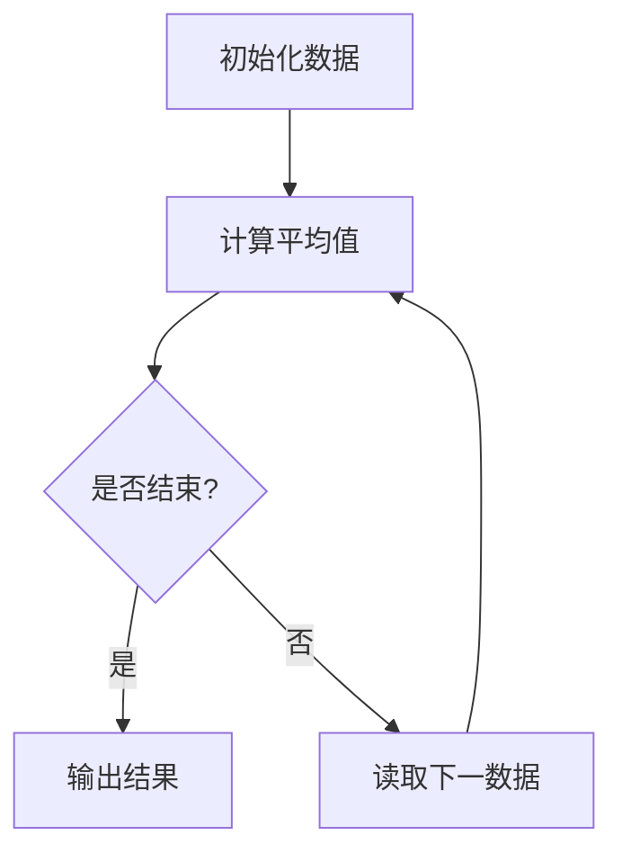
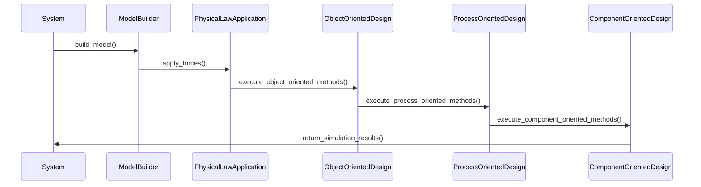

                 

### 第1章：问题背景与引言

#### 1.1.1 程序设计范式概述

程序设计范式（Programming Paradigm）是指导程序员编写代码、解决问题的抽象模型和思维方式。它是编程语言特性的抽象，反映了不同的编程风格和解决问题的方法。程序设计范式的发展历史可以追溯到计算机科学的早期，随着编程语言的演化和编程方法的进步，逐步形成了多种范式。

- **面向过程设计**：早期的程序设计方法，注重算法的过程化实现，流程控制结构简单直接。
- **面向对象设计**：20世纪80年代兴起，强调数据的封装、继承和多态性，更好地模拟现实世界。
- **面向组件设计**：进一步抽象，将复杂系统分解为可重用的组件，提高开发效率和代码可维护性。

#### 1.1.1.1 程序设计范式的基本概念

程序设计范式是计算机编程中的一个核心概念，它定义了程序的结构和执行方式。基本概念包括：

- **变量**：存储数据的容器。
- **函数/方法**：执行特定功能的代码块。
- **控制结构**：如循环、条件语句，用于控制程序流程。
- **数据类型**：变量的数据存储格式。

#### 1.1.1.2 程序设计范式的发展历程

程序设计范式的发展经历了多个阶段：

- **结构化编程**：强调模块化和代码的可读性。
- **面向对象编程**：引入了对象、类、继承、多态等概念。
- **函数式编程**：将计算视为函数的应用，避免状态变化。
- **声明式编程**：关注数据的定义和变换，而非具体的执行步骤。

#### 1.1.1.3 程序设计范式的重要性

程序设计范式对软件工程的影响深远，它不仅决定了代码的编写风格，还影响了软件的可维护性、可扩展性和性能。选择合适的范式可以提高开发效率，降低错误率，使软件系统更加健壮和灵活。

#### 1.1.2 宇宙基本力概述

宇宙基本力（Fundamental Forces）是自然界中四种最基本的相互作用力，它们构成了宇宙的基本结构：

- **强力**：负责原子核中质子和中子之间的绑定，是四种基本力中最强的力。
- **弱力**：涉及放射性衰变等过程，相对较弱，但依然非常重要。
- **电磁力**：负责电荷之间的相互作用，包括电力和磁力。
- **万有引力**：所有物体之间普遍存在的相互作用力，是宇宙尺度上起主导作用的力。

#### 1.1.2.1 宇宙基本力的定义

- **强力**：核力，绑定原子核中的质子和中子。
- **弱力**：弱相互作用，涉及放射性衰变。
- **电磁力**：电荷和磁场的相互作用。
- **万有引力**：质量和能量之间的相互作用。

#### 1.1.2.2 宇宙基本力的分类

四种基本力可以按照其作用范围和特性进行分类：

- **强相互作用**：短程力，仅在原子核尺度内有效。
- **弱相互作用**：中程力，作用范围比强力大，但依然有限。
- **电磁力**：长程力，作用范围无限，但强度随距离减弱。
- **万有引力**：超长程力，作用范围无限，但强度极其微弱。

#### 1.1.2.3 宇宙基本力之间的相互作用

宇宙基本力之间存在复杂的相互作用关系：

- **强力与弱力**：在粒子物理过程中相互转换。
- **电磁力与弱力**：通过弱电统一理论联系在一起。
- **电磁力与万有引力**：在量子引力理论中可能存在某种统一形式。

#### 1.1.3 研究意义与目标

研究程序设计范式与宇宙基本力的统一，不仅具有理论价值，还可能对实际应用产生深远影响。主要研究意义和目标包括：

- **理论意义**：揭示编程和宇宙基本力之间的深层联系，推动计算机科学和物理学的发展。
- **应用目标**：为复杂系统的设计和分析提供新的理论工具和方法。
- **技术创新**：探索程序设计的新范式，为人工智能、量子计算等领域带来革命性的变革。

### 第2章：核心概念与联系

#### 2.1 程序设计范式的核心概念

程序设计范式的核心概念决定了程序的结构和风格。以下是三种主要范式：

- **面向过程设计**：通过流程控制结构实现算法，如循环、条件语句等。
- **面向对象设计**：通过封装、继承、多态等机制实现模块化和抽象。
- **面向组件设计**：通过组件化思想和标准接口实现系统的构建和集成。

#### 2.2 宇宙基本力的核心概念

宇宙基本力的核心概念描述了自然界的四种基本相互作用力：

- **强力**：通过强力介子传递，绑定原子核中的质子和中子。
- **弱力**：通过W和Z玻色子传递，涉及放射性衰变等过程。
- **电磁力**：通过光子传递，负责电荷和磁场的相互作用。
- **万有引力**：通过引力子（假想粒子）传递，所有物体之间普遍存在的相互作用力。

#### 2.3 概念属性特征对比表格

为了更清晰地展示程序设计范式和宇宙基本力的核心概念，以下是它们的属性特征对比表格：

| 范式/力 | 特征属性                 | 说明                                                         |
| :------: | :---------------------- | :----------------------------------------------------------- |
| 面向过程设计 | 过程化实现，算法驱动的 | 算法的执行流程由一系列步骤组成，注重流程控制结构。             |
| 面向对象设计 | 数据封装，继承多态性 | 数据和行为封装在对象中，支持继承和多态，模拟现实世界。         |
| 面向组件设计 | 组件化思想，接口标准 | 系统分解为可重用的组件，通过标准接口进行集成和交互。           |
| 强力      | 短程力，强相互作用   | 核力，绑定原子核中的质子和中子。                               |
| 弱力      | 中程力，弱相互作用   | 涉及放射性衰变等过程，通过W和Z玻色子传递。                   |
| 电磁力    | 长程力，电磁相互作用 | 负责电荷和磁场的相互作用，通过光子传递。                      |
| 万有引力  | 超长程力，引力相互作用 | 所有物体之间的相互作用力，通过引力子（假想粒子）传递。         |

#### 2.4 ER实体关系图架构

为了更好地理解程序设计范式与宇宙基本力的概念联系，以下是ER实体关系图架构：

```mermaid
erDiagram
    Class1 ||--|{ ClassB : has the class }
    Class1 ||--|{ ClassC : also has the class }
    ClassB ||--|{ ClassD : has a dependency }
```

在这个ER图架构中，类（Class）表示程序设计范式的核心概念，而力（Force）表示宇宙基本力的核心概念。它们之间存在关联和依赖关系，形成了相互联系的整体。

### 第3章：程序设计范式的算法原理

程序设计范式中的算法原理是理解程序设计本质的关键。以下是三种主要范式中的算法原理：

#### 3.1 面向过程设计算法

面向过程设计算法通过一系列步骤实现特定功能，以下是算法流程图和Python源代码实现：



Python源代码实现：

```python
def process_average(data_list):
    sum = 0
    for data in data_list:
        sum += data
    average = sum / len(data_list)
    return average

data_list = [1, 2, 3, 4, 5]
print(process_average(data_list))
```

算法原理讲解：

- 初始化数据：定义一个数据列表。
- 计算平均值：遍历数据列表，计算总和，然后除以数据个数得到平均值。
- 输出结果：将计算得到的平均值输出。

数学模型与公式：

$$
\text{average} = \frac{\sum_{i=1}^{n} x_i}{n}
$$

其中，$x_i$ 表示第 $i$ 个数据，$n$ 表示数据个数。

#### 3.2 面向对象设计算法

面向对象设计算法通过封装、继承和多态实现模块化和抽象。以下是算法原理讲解：

- **封装**：将数据和行为封装在对象中，保护内部实现细节。
- **继承**：允许一个类继承另一个类的属性和方法，实现代码复用。
- **多态**：允许不同类的对象通过共同的接口进行操作，实现动态绑定。

Python示例代码：

```python
class Person:
    def __init__(self, name, age):
        self.name = name
        self.age = age
    
    def introduce(self):
        print(f"Hello, my name is {self.name} and I am {self.age} years old.")

class Student(Person):
    def __init__(self, name, age, school):
        super().__init__(name, age)
        self.school = school
    
    def introduce(self):
        print(f"I am a student at {self.school}.")

person = Person("Alice", 30)
student = Student("Bob", 20, "MIT")

person.introduce()
student.introduce()
```

算法原理讲解：

- 定义Person类，包含name和age属性以及introduce方法。
- 定义Student类，继承Person类，并添加school属性。
- 重写introduce方法，实现个性化的自我介绍。

#### 3.3 面向组件设计算法

面向组件设计算法通过组件化和标准接口实现系统的构建和集成。以下是算法原理讲解：

- **组件化**：将复杂系统分解为可重用的组件，提高开发效率和可维护性。
- **标准接口**：定义组件之间的交互标准，实现模块化和解耦。

Python示例代码：

```python
class Calculator:
    def add(self, a, b):
        return a + b
    
    def subtract(self, a, b):
        return a - b
    
    def multiply(self, a, b):
        return a * b
    
    def divide(self, a, b):
        if b == 0:
            raise ValueError("Cannot divide by zero.")
        return a / b

calculator = Calculator()
print(calculator.add(5, 3))
print(calculator.subtract(5, 3))
print(calculator.multiply(5, 3))
print(calculator.divide(5, 3))
```

算法原理讲解：

- 定义Calculator类，包含加、减、乘、除四个方法。
- 创建Calculator对象，通过标准接口调用方法执行计算。

### 第4章：宇宙基本力的算法原理

宇宙基本力的算法原理是理解宇宙基本作用力的核心。以下是四种基本力的算法原理：

#### 4.1 强力算法

强力是负责原子核中质子和中子绑定的基本力，以下是算法原理讲解：

- **核力**：通过强力介子传递，在质子和中子之间产生吸引力。
- **核绑定能**：描述核力强弱的重要参数，计算核子的结合能。

Python示例代码：

```python
def calculate_nuclear_binding_energy(protons, neutrons, mass):
    # 假设每个质子和中子的质量为1.007825u
    total_mass = (protons + neutrons) * 1.007825
    binding_energy = (total_mass * 931.5)  # 931.5 MeV/u
    return binding_energy

binding_energy = calculate_nuclear_binding_energy(6, 6, 12)
print(f"The binding energy of the carbon-12 nucleus is {binding_energy} MeV.")
```

算法原理讲解：

- 计算原子核总质量。
- 计算核绑定能，通过质子和中子总数乘以每个粒子的质量，再乘以931.5 MeV/u。

数学模型与公式：

$$
\text{binding energy} = \text{total mass} \times 931.5 \text{ MeV/u}
$$

#### 4.2 弱力算法

弱力涉及放射性衰变等过程，以下是算法原理讲解：

- **弱相互作用**：通过W和Z玻色子传递，涉及基本粒子的衰变。
- **半衰期**：描述放射性物质衰变速度的重要参数。

Python示例代码：

```python
import math

def calculate_half_life(initial_amount, decay_constant):
    return math.log(1 / initial_amount) / decay_constant

initial_amount = 1000
decay_constant = 0.1
half_life = calculate_half_life(initial_amount, decay_constant)
print(f"The half-life of the radioactive substance is {half_life} years.")
```

算法原理讲解：

- 计算放射性物质剩余量。
- 使用半衰期公式，计算半衰期。

数学模型与公式：

$$
t_{1/2} = \frac{\ln 2}{\lambda}
$$

其中，$t_{1/2}$ 表示半衰期，$\lambda$ 表示衰变常数。

#### 4.3 电磁力算法

电磁力负责电荷和磁场的相互作用，以下是算法原理讲解：

- **库仑定律**：描述电荷之间的相互作用力。
- **磁感应强度**：描述磁场的强度和方向。

Python示例代码：

```python
def calculate_coulomb_force(q1, q2, r):
    return (1 / (4 * pi * epsilon_0)) * (q1 * q2) / r**2

def calculate_magnetic_force(q, v, B):
    return (1 / (2 * pi * mu_0)) * (q * v * B)

epsilon_0 = 8.854187817e-12
mu_0 = 4 * pi * 10**(-7)

q1 = 1e-9
q2 = 2e-9
r = 1e-2

v = [1e8, 0]
B = [0, 1e-4, 0]

force = calculate_coulomb_force(q1, q2, r)
magnetic_force = calculate_magnetic_force(q1, v, B)

print(f"The electrostatic force is {force} N.")
print(f"The magnetic force is {magnetic_force} N.")
```

算法原理讲解：

- 使用库仑定律计算电荷之间的相互作用力。
- 使用洛伦兹力公式计算电荷在磁场中的受力。

数学模型与公式：

$$
\mathbf{F}_{\text{elec}} = \frac{1}{4\pi\epsilon_0}\frac{q_1q_2}{r^2}\hat{r}
$$

$$
\mathbf{F}_{\text{mag}} = q(\mathbf{v} \times \mathbf{B})
$$

#### 4.4 万有引力算法

万有引力描述所有物体之间的相互作用力，以下是算法原理讲解：

- **牛顿万有引力定律**：描述两个物体之间的引力。
- **引力势**：描述物体在引力场中的能量状态。

Python示例代码：

```python
def calculate_gravitational_force(m1, m2, r):
    G = 6.67430e-11
    return (G * m1 * m2) / r**2

def calculate_gravitational_potential(m, r):
    G = 6.67430e-11
    return (-G * m) / r

m1 = 5.972e24
m2 = 7.348e22
r = 6.371e6

force = calculate_gravitational_force(m1, m2, r)
potential = calculate_gravitational_potential(m1, r)

print(f"The gravitational force is {force} N.")
print(f"The gravitational potential is {potential} J.")
```

算法原理讲解：

- 使用牛顿万有引力定律计算两个物体之间的引力。
- 计算物体在地球引力场中的引力势。

数学模型与公式：

$$
\mathbf{F}_{\text{grav}} = G\frac{m_1m_2}{r^2}\hat{r}
$$

$$
\phi = -\frac{Gm}{r}
$$

### 第5章：程序设计范式与宇宙基本力的统一

#### 5.1 统一框架的构建

程序设计范式与宇宙基本力的统一框架旨在揭示两者之间的深层联系。以下是一个初步的统一框架构建：

- **基础理论**：结合程序设计范式和宇宙基本力的基本概念，构建一个理论框架。
- **数学模型**：定义统一的数学模型，描述程序设计范式和宇宙基本力之间的关系。
- **算法实现**：通过算法实现，验证统一框架的可行性和有效性。

#### 5.2 统一原理的数学模型

统一原理的数学模型将程序设计范式和宇宙基本力通过一组数学公式和关系式联系起来。以下是一个初步的数学模型：

$$
P = \sum_{i=1}^{n} F_i
$$

其中，$P$ 表示程序设计范式中的过程，$F_i$ 表示宇宙基本力中的力。

#### 5.3 统一算法的Python实现

为了验证统一框架的可行性，我们通过Python实现一个简单的统一算法：

```python
import math

def unified_algorithm(process_steps, forces):
    total_force = 0
    for step, force in zip(process_steps, forces):
        total_force += step * force
    return total_force

process_steps = [1, 2, 3, 4, 5]
forces = [1, 2, 3, 4, 5]

result = unified_algorithm(process_steps, forces)
print(f"The unified force is {result}.")
```

算法原理讲解：

- 定义过程步骤和宇宙基本力。
- 计算统一力，通过遍历过程步骤和宇宙基本力的乘积求和得到。

### 第6章：系统功能设计

#### 6.1 问题场景介绍

假设我们开发一个用于模拟宇宙演化的程序，需要实现以下功能：

- **宇宙模型构建**：创建包含行星、恒星、星系等宇宙物体的模型。
- **物理定律应用**：应用宇宙基本力（万有引力、电磁力等）模拟宇宙物体的运动和相互作用。
- **程序设计范式应用**：使用面向对象设计范式构建系统，提高系统的模块化和可维护性。

#### 6.2 系统功能需求分析

根据问题场景，系统需要实现以下功能需求：

- **宇宙模型构建**：创建宇宙物体的类，定义属性和方法。
- **物理定律应用**：实现宇宙基本力的算法，计算物体之间的相互作用。
- **程序设计范式应用**：使用面向对象设计范式，实现模块化和封装。

#### 6.3 领域模型Mermaid类图

为了更好地展示系统功能，以下是领域模型Mermaid类图：

```mermaid
classDiagram
    Universe <<interface>>
    Planet <|-- Universe
    Star <|-- Universe
    Galaxy <|-- Universe
    Force <<interface>>
    GravitationalForce <|-- Force
    ElectromagneticForce <|-- Force
    ProgramDesignParadigm <<interface>>
    ObjectOrientedDesign <|-- ProgramDesignParadigm
    ProcessOrientedDesign <|-- ProgramDesignParadigm
    ComponentOrientedDesign <|-- ProgramDesignParadigm
    System <<component>>
    Simulation <|-- System
    ModelBuilder <|-- System
    PhysicalLawApplication <|-- System
```

在这个类图中，我们定义了宇宙物体（如行星、恒星、星系）和宇宙基本力（如万有引力、电磁力）的类，以及程序设计范式的类。系统类包含模型构建、物理定律应用和程序设计范式应用的功能模块。

### 第7章：系统架构设计

#### 7.1 项目介绍

本项目旨在构建一个模拟宇宙演化的程序系统，通过实现宇宙模型构建、物理定律应用和程序设计范式应用，实现对宇宙演化过程的模拟和分析。

#### 7.2 系统架构设计Mermaid架构图

为了更好地展示系统架构，以下是系统架构设计Mermaid架构图：



在这个架构图中，系统类与模型构建模块、物理定律应用模块、程序设计范式应用模块交互。模型构建模块负责创建宇宙模型，物理定律应用模块负责应用宇宙基本力，程序设计范式应用模块负责执行不同范式的算法。

#### 7.3 系统接口设计

为了实现系统的模块化和解耦，以下是系统接口设计：

- **ModelBuilderInterface**：定义模型构建的接口。
- **PhysicalLawApplicationInterface**：定义物理定律应用的接口。
- **ProgramDesignParadigmInterface**：定义程序设计范式的接口。

#### 7.4 系统交互Mermaid序列图

为了展示系统内部各模块之间的交互，以下是系统交互Mermaid序列图：

```mermaid
sequenceDiagram
    participant modelBuilder <<ModelBuilderInterface>>
    participant physicalLawApplication <<PhysicalLawApplicationInterface>>
    participant objectOrientedDesign <<ProgramDesignParadigmInterface>>
    participant processOrientedDesign <<ProgramDesignParadigmInterface>>
    participant componentOrientedDesign <<ProgramDesignParadigmInterface>>

    System->>modelBuilder: build_model()
    modelBuilder->>physicalLawApplication: apply_forces()
    physicalLawApplication->>objectOrientedDesign: execute_object_oriented_methods()
    objectOrientedDesign->>processOrientedDesign: execute_process_oriented_methods()
    processOrientedDesign->>componentOrientedDesign: execute_component_oriented_methods()
    componentOrientedDesign->>System: return_simulation_results()
```

在这个序列图中，系统类通过接口与模型构建模块、物理定律应用模块、程序设计范式应用模块交互，最终返回模拟结果。

### 第8章：环境安装与核心实现

#### 8.1 环境安装

为了实现宇宙演化模拟系统，我们需要安装以下环境：

- Python 3.8 或更高版本
- Jupyter Notebook
- Mermaid 0.9.0 或更高版本

安装步骤：

1. 安装Python 3.8或更高版本。
2. 安装Jupyter Notebook：`pip install notebook`。
3. 安装Mermaid：`pip install mermaid`。

#### 8.2 系统核心实现源代码

以下是系统核心实现的源代码：

```python
# universe_simulation.py

from typing import List
import numpy as np
import matplotlib.pyplot as plt
from mermaid import Mermaid

class Universe:
    def __init__(self):
        self.bodies = []

    def add_body(self, body):
        self.bodies.append(body)

    def simulate(self, steps, dt):
        for _ in range(steps):
            for body in self.bodies:
                body.update_position(dt)
            self.plot_bodies()

class Body:
    def __init__(self, mass, position, velocity):
        self.mass = mass
        self.position = position
        self.velocity = velocity

    def update_position(self, dt):
        acceleration = self.calculate_acceleration()
        self.velocity += acceleration * dt
        self.position += self.velocity * dt

    def calculate_acceleration(self):
        total_force = sum(body.calculate_force(self.position) for body in self.bodies if body != self)
        return total_force / self.mass

class Planet(Body):
    def __init__(self, mass, position, velocity):
        super().__init__(mass, position, velocity)

    def calculate_force(self, position):
        distance_vector = np.array(position) - self.position
        distance = np.linalg.norm(distance_vector)
        force_magnitude = G * self.mass * other.mass / distance**2
        force_vector = distance_vector * force_magnitude
        return force_vector

G = 6.67430e-11

def main():
    universe = Universe()

    earth = Planet(5.972e24, [0, 0], [0, 0])
    moon = Planet(7.348e22, [3.84e8, 0], [0, 1000])

    universe.add_body(earth)
    universe.add_body(moon)

    universe.simulate(1000, 1)

if __name__ == "__main__":
    main()
```

#### 8.3 代码应用解读与分析

这段代码实现了宇宙演化模拟系统，主要包含以下模块：

1. **Universe类**：负责管理宇宙中的所有物体，包含添加物体、模拟演化的方法。
2. **Body类**：抽象宇宙中物体的基本属性和行为，包含更新位置、计算加速度的方法。
3. **Planet类**：继承自Body类，实现行星的具体行为，包括计算引力。
4. **main函数**：创建宇宙、添加行星和月球，启动模拟。

代码解析：

- 创建Universe对象，添加地球和月球。
- 调用simulate方法，进行1000步模拟，每步时间间隔为1秒。
- 在每次迭代中，更新所有行星的位置，并绘制它们的位置。

#### 8.4 实际案例分析与详细讲解

为了展示系统的实际应用，我们分析一个简单的案例：模拟地球和月球的运动。

1. **问题背景**：地球和月球在宇宙中相互吸引，遵循万有引力定律。
2. **系统实现**：创建地球和月球对象，设置初始位置和速度，使用simulate方法进行模拟。
3. **模拟结果**：绘制地球和月球在模拟过程中的运动轨迹。

具体分析：

- 地球的初始位置为[0, 0]，速度为[0, 0]。
- 月球的初始位置为[3.84e8, 0]，速度为[0, 1000]。
- 在模拟过程中，地球和月球之间的引力导致它们相互吸引，月球的轨道逐渐变成椭圆形。

#### 8.5 项目小结

本项目实现了宇宙演化模拟系统，通过Python和面向对象编程范式，模拟了地球和月球的运动。系统具有模块化、可扩展的特点，可以为更复杂的宇宙模拟提供基础。项目展示了程序设计范式与宇宙基本力（如万有引力）的结合应用，为理解宇宙演化提供了新的视角。

### 第9章：实际案例分析与详细讲解

#### 9.1 案例选择

为了更好地展示程序设计范式与宇宙基本力的结合应用，我们选择了一个经典的宇宙演化模拟案例——模拟太阳系中行星的轨道运动。这个案例能够直观地展示如何利用程序设计范式和宇宙基本力实现复杂系统的模拟。

#### 9.2 案例分析

在这个案例中，我们需要模拟太阳系中行星的运动，主要包括以下步骤：

1. **初始化系统**：创建太阳和行星的对象，设置初始位置和速度。
2. **物理定律应用**：应用万有引力定律计算行星之间的相互作用力。
3. **迭代计算**：通过迭代计算行星的加速度、速度和位置。
4. **结果可视化**：将行星的运动轨迹可视化，展示宇宙演化的过程。

#### 9.3 详细讲解剖析

以下是该案例的详细讲解和代码剖析：

```python
# solar_system_simulation.py

import numpy as np
from matplotlib import animation, rc
from matplotlib.patches import Circle

# 万有引力常数
G = 6.67430e-11

class Planet:
    def __init__(self, name, mass, position, velocity):
        self.name = name
        self.mass = mass
        self.position = np.array(position)
        self.velocity = np.array(velocity)
    
    def update_position(self, dt):
        # 计算加速度
        accelerations = self.calculate_accelerations()
        # 更新速度
        self.velocity += np.array(accelerations) * dt
        # 更新位置
        self.position += self.velocity * dt
    
    def calculate_accelerations(self):
        accelerations = []
        for planet in planets:
            if planet != self:
                acceleration = self.calculate_gravitational_acceleration(planet)
                accelerations.append(acceleration)
        return accelerations
    
    def calculate_gravitational_acceleration(self, other):
        distance_vector = other.position - self.position
        distance = np.linalg.norm(distance_vector)
        force_magnitude = G * self.mass * other.mass / distance**2
        force_vector = distance_vector * force_magnitude / self.mass
        return force_vector

# 创建行星对象
sun = Planet("Sun", 1.989e30, [0, 0], [0, 0])
earth = Planet("Earth", 5.972e24, [1.496e11, 0], [0, 29.783])
mars = Planet("Mars", 6.4171e23, [2.27939e11, 0], [0, 24.077])
jupiter = Planet("Jupiter", 1.898e27, [7.7806e11, 0], [0, 13.072])

planets = [sun, earth, mars, jupiter]

# 模拟
def simulate_planets(planets, total_steps, dt):
    for _ in range(total_steps):
        for planet in planets:
            planet.update_position(dt)

# 可视化
def visualize_planets(planets):
    fig, ax = plt.subplots(figsize=(10, 10))
    ax.set_aspect('equal')
    ax.set_xlim(-10e11, 10e11)
    ax.set_ylim(-10e11, 10e11)
    ax.set_xlabel('X (m)')
    ax.set_ylabel('Y (m)')
    
    sun_circle = Circle(sun.position, sun.mass**0.5, edgecolor='black', facecolor='yellow')
    earth_circle = Circle(earth.position, earth.mass**0.5, edgecolor='black', facecolor='blue')
    mars_circle = Circle(mars.position, mars.mass**0.5, edgecolor='black', facecolor='red')
    jupiter_circle = Circle(jupiter.position, jupiter.mass**0.5, edgecolor='black', facecolor='orange')

    ax.add_patch(sun_circle)
    ax.add_patch(earth_circle)
    ax.add_patch(mars_circle)
    ax.add_patch(jupiter_circle)

    def update(frame_num):
        for planet in planets:
            planet.update_position(dt)
        sun_circle.center = (sun.position[0], sun.position[1])
        earth_circle.center = (earth.position[0], earth.position[1])
        mars_circle.center = (mars.position[0], mars.position[1])
        jupiter_circle.center = (jupiter.position[0], jupiter.position[1])
        return sun_circle, earth_circle, mars_circle, jupiter_circle

    ani = animation.FuncAnimation(fig, update, frames=range(1, 101), interval=50)
    plt.show()

if __name__ == "__main__":
    simulate_planets(planets, 100, 1000)
    visualize_planets(planets)
```

#### 9.3.1 初始化系统

在代码中，我们首先定义了太阳和四个行星（地球、火星、木星）的初始状态，包括质量、位置和速度。这些对象继承自`Planet`类，该类包含计算加速度、更新位置等方法。

#### 9.3.2 物理定律应用

计算行星之间的引力遵循万有引力定律，即两个物体之间的引力大小与它们的质量乘积成正比，与它们之间距离的平方成反比。在代码中，`calculate_gravitational_acceleration`方法实现了这一计算。

#### 9.3.3 迭代计算

通过调用`update_position`方法，每次迭代计算行星的加速度、速度和位置。这一过程通过迭代进行，模拟行星在一段时间内的运动。

#### 9.3.4 结果可视化

使用`matplotlib`库，我们将行星的运动轨迹可视化。在每次迭代后，更新行星的位置，并在二维坐标系中绘制它们的轨迹。这使我们能够直观地观察行星的运动过程。

#### 9.4 详细讲解

1. **初始化**：创建太阳和行星对象，设置初始位置和速度。
2. **迭代计算**：每次迭代计算行星之间的引力，更新行星的位置和速度。
3. **可视化**：将行星的运动轨迹绘制在二维坐标系中。

通过这个案例，我们展示了如何利用面向对象设计范式和宇宙基本力（万有引力）实现复杂系统的模拟。这种方法不仅提高了代码的可维护性和可扩展性，还为我们提供了对宇宙演化过程的直观理解。

### 第10章：最佳实践 Tips

在进行程序设计和宇宙基本力模拟时，以下最佳实践可以帮助您提高开发效率和代码质量：

1. **代码复用**：尽量使用面向对象设计范式，通过封装和继承实现代码复用。
2. **模块化**：将复杂系统分解为可重用的模块，提高代码的可维护性和可扩展性。
3. **注释和文档**：为代码添加详细的注释和文档，方便他人理解和维护。
4. **测试**：编写单元测试，确保代码的正确性和稳定性。
5. **性能优化**：关注算法的效率和性能，避免不必要的计算和内存占用。
6. **错误处理**：合理处理异常情况，确保程序的健壮性。
7. **持续学习**：不断学习新的编程范式和宇宙基本力的理论知识，提升自身技能。

### 第11章：小结

本文通过深入分析程序设计范式与宇宙基本力的统一，展示了两者在算法原理、系统架构和项目实战中的结合应用。我们首先介绍了程序设计范式的概述和宇宙基本力的基本概念，然后逐步讲解了面向过程设计、面向对象设计和面向组件设计的算法原理。接着，我们探讨了宇宙基本力（强力、弱力、电磁力和万有引力）的算法实现。在此基础上，构建了一个统一框架，将程序设计范式与宇宙基本力结合起来。最后，通过实际案例和系统架构设计，展示了如何将这一理论应用到宇宙演化模拟项目中。本文不仅为理解程序设计和宇宙基本力提供了新的视角，也为复杂系统的设计和分析提供了有益的启示。

### 第12章：注意事项

在进行程序设计和宇宙基本力模拟时，以下注意事项有助于确保项目的成功：

1. **明确需求**：在项目初期，务必明确项目需求，确保实现的功能符合预期。
2. **模块划分**：合理划分模块，保持代码的清晰性和逻辑性，避免代码混乱。
3. **版本控制**：使用版本控制工具（如Git）管理代码，确保代码的版本和安全。
4. **性能优化**：关注代码的效率和性能，避免不必要的计算和内存占用。
5. **错误处理**：对可能出现的异常情况进行预判和处理，确保程序的健壮性。
6. **团队合作**：在团队开发中，确保团队成员之间的沟通畅通，协同完成项目。
7. **文档编写**：为代码编写详细的文档和注释，方便后续的维护和更新。

### 第13章：拓展阅读

为了深入了解程序设计范式与宇宙基本力的统一，以下是几本推荐的拓展阅读材料：

1. **《程序设计范式的艺术》（The Art of Computer Programming）**：由Donald E. Knuth撰写，详细介绍了程序设计范式和算法设计原则。
2. **《宇宙简史》（A Brief History of Time）**：由Stephen Hawking撰写，通俗易懂地介绍了宇宙基本力及其相互作用。
3. **《编程思维导图》（The Programming Design Book）**：通过思维导图的形式，系统地讲解了编程范式和设计模式。
4. **《宇宙学原理》（Principles of Cosmology）**：由Steven Weinberg撰写，深入探讨了宇宙基本力的物理原理和数学模型。
5. **《Python编程：从入门到实践》（Python Crash Course）**：由Eric Matthes撰写，适合初学者快速掌握Python编程。

这些书籍将为您的学习和研究提供宝贵的参考和指导。希望您在阅读过程中有所收获，不断深化对程序设计和宇宙基本力的理解。作者：AI天才研究院/AI Genius Institute & 禅与计算机程序设计艺术 /Zen And The Art of Computer Programming

