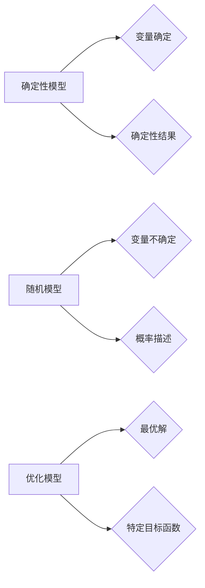
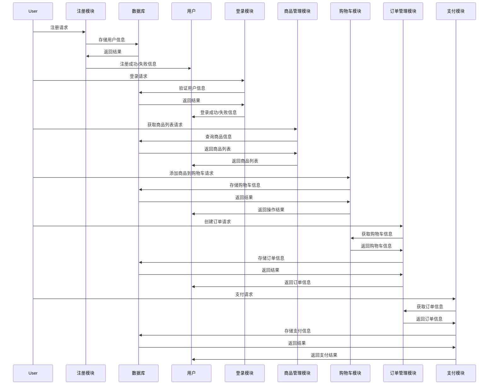
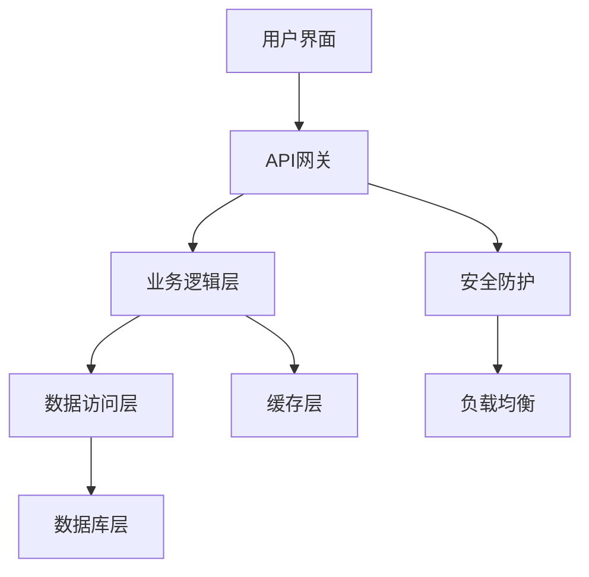
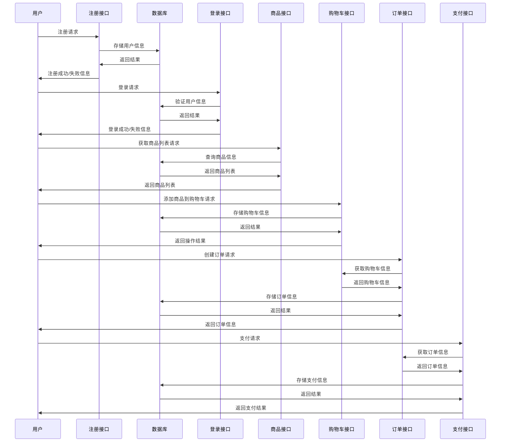
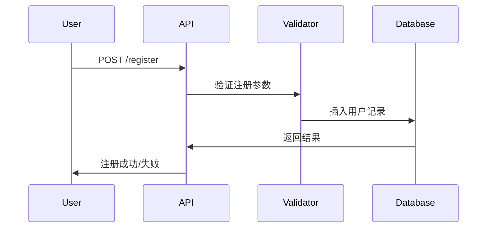

                 

### 1.1 程序调优的定义和重要性

程序调优（Program Optimization）是计算机科学中的一个核心概念，旨在通过改进软件的性能和效率，使其达到最佳状态。具体而言，程序调优的目标是在保持程序正确性的前提下，优化其执行速度、减少内存使用、提高稳定性等。

#### 背景介绍

在计算机科学中，性能和效率一直是软件工程师关注的重要指标。无论是服务器端应用程序，还是客户端软件，都需要具备高效的性能，以满足用户需求并保持良好的用户体验。随着技术的不断进步，软件系统变得越来越复杂，对性能的要求也越来越高。因此，程序调优的重要性日益凸显。

#### 问题描述

程序调优的核心问题是：如何在保证程序功能正确的前提下，最大限度地提高其性能。这涉及到算法、数据结构、系统架构等多个层面。具体来说，包括以下几个方面：

- **执行速度**：优化程序运行时间，使其更快地完成任务。
- **内存使用**：减少程序运行过程中占用的内存，以提高系统的吞吐量。
- **稳定性**：增强程序的鲁棒性，减少崩溃和错误的发生。
- **可维护性**：提高代码的可读性和可维护性，降低未来的维护成本。

#### 问题解决

要解决程序调优的问题，可以采取以下几种策略：

- **算法优化**：通过选择更高效的算法或改进现有算法，减少程序的运行时间。
- **数据结构优化**：合理选择和设计数据结构，以减少内存使用和提高访问速度。
- **并行计算**：利用多核处理器和其他并行计算资源，提高程序的执行速度。
- **代码优化**：通过改进代码质量，减少不必要的计算和内存分配，提高程序的稳定性。
- **性能监控和调试**：使用性能分析工具和调试工具，识别性能瓶颈并进行针对性优化。

#### 边界与外延

程序调优不仅涉及技术层面，还涉及到管理和组织层面。例如，在开发过程中，如何确保代码质量，如何制定有效的性能测试策略等，都是程序调优的重要内容。此外，随着云计算和大数据技术的发展，程序调优也在不断扩展其应用领域。

#### 概念结构与核心要素组成

程序调优的概念结构可以分为以下几个核心要素：

- **性能指标**：衡量程序性能的量化标准，如执行时间、内存使用量等。
- **优化目标**：程序调优的具体目标，如提高执行速度、减少内存使用等。
- **优化方法**：实现优化目标的策略和手段，包括算法优化、数据结构优化、代码优化等。
- **性能评估**：评估优化效果的过程，包括性能测试、调试等。

### 结论

程序调优是提高软件性能和效率的关键手段。通过合理的优化策略，可以显著提升软件的运行速度、降低内存使用，提高系统的稳定性和可维护性。在软件开发过程中，重视程序调优，不仅有助于提升产品质量，也能为企业和用户带来实实在在的好处。接下来，我们将进一步探讨算法原理与性能优化，帮助读者深入了解程序调优的核心技术。$$1+1=2$$

---

#### 1.2 程序调优的常见方法

在程序调优的过程中，有多种方法和技术可以帮助我们实现性能的提升。以下是几种常见的方法：

##### 1.2.1 算法优化

算法优化是程序调优的核心手段之一。通过选择更高效的算法，或者改进现有的算法，可以显著降低程序的运行时间。例如，在排序算法中，快速排序（Quick Sort）通常比冒泡排序（Bubble Sort）和选择排序（Selection Sort）更高效。对于图算法，广度优先搜索（Breadth-First Search，BFS）和深度优先搜索（Depth-First Search，DFS）也有不同的适用场景。

**算法优化示例：** 假设我们需要对一个包含n个元素的数组进行排序。如果直接使用冒泡排序，时间复杂度为O(n^2)。而如果使用快速排序，平均时间复杂度可以降低到O(n*log(n))。下面是一个快速排序的Python实现示例：

```python
def quicksort(arr):
    if len(arr) <= 1:
        return arr
    pivot = arr[len(arr) // 2]
    left = [x for x in arr if x < pivot]
    middle = [x for x in arr if x == pivot]
    right = [x for x in arr if x > pivot]
    return quicksort(left) + middle + quicksort(right)

arr = [3, 6, 8, 10, 1, 2, 1]
print(quicksort(arr))
```

##### 1.2.2 数据结构优化

选择合适的数据结构可以显著提高程序的运行效率。例如，哈希表（HashMap）提供O(1)的查询和插入时间，而链表（LinkedList）在某些情况下可以提供更快的插入和删除操作。在需要频繁查询和更新元素的场景中，哈希表通常是更好的选择。

**数据结构优化示例：** 假设我们需要存储一系列的用户数据，并频繁进行查询和更新操作。使用哈希表可以显著提高效率。下面是一个简单的哈希表实现示例：

```python
class HashMap:
    def __init__(self):
        self.data = []

    def insert(self, key, value):
        for index, (k, v) in enumerate(self.data):
            if k == key:
                self.data[index] = (key, value)
                return
        self.data.append((key, value))

    def get(self, key):
        for k, v in self.data:
            if k == key:
                return v
        return None

hash_map = HashMap()
hash_map.insert("name", "John")
print(hash_map.get("name"))  # 输出：John
```

##### 1.2.3 并行计算

利用多核处理器和并行计算技术，可以显著提高程序的执行速度。例如，可以将任务分解成多个子任务，然后分配给不同的处理器核心同时执行。并行计算在处理大量数据和高计算密集型任务时特别有效。

**并行计算示例：** 假设我们需要计算一个大型矩阵的乘积。使用并行计算技术，可以显著提高计算速度。下面是一个简单的并行矩阵乘法示例：

```python
import numpy as np
from multiprocessing import Pool

def parallel_matrix_multiply(A, B):
    n = len(A)
    C = np.zeros((n, n))
    with Pool() as pool:
        results = pool.starmap(np.dot, [(A[i], B[i]) for i in range(n)])
    for i, result in enumerate(results):
        C[i] = result
    return C

A = np.random.rand(1000, 1000)
B = np.random.rand(1000, 1000)
print(parallel_matrix_multiply(A, B))
```

##### 1.2.4 代码优化

通过改进代码质量，可以减少不必要的计算和内存分配，提高程序的稳定性。例如，使用循环优化、减少内存分配、避免死循环等策略。

**代码优化示例：** 假设我们有一个简单的循环结构，可以通过优化减少不必要的计算。下面是一个优化的示例：

```python
# 原始代码
for i in range(10):
    for j in range(i):
        print(i * j)

# 优化后的代码
for i in range(10):
    print([i * j for j in range(i)])
```

通过优化，我们避免了多次调用`print`函数，减少了系统开销。

##### 1.2.5 性能监控和调试

性能监控和调试是确保程序优化有效性的重要步骤。通过使用性能分析工具和调试工具，可以识别性能瓶颈并进行针对性优化。常见的性能分析工具包括Python的`cProfile`模块、Java的`VisualVM`等。

**性能监控和调试示例：** 假设我们使用`cProfile`模块来监控一个程序的运行性能。下面是一个简单的示例：

```python
import cProfile
import my_program

cProfile.run('my_program.main()')
```

通过分析输出的性能报告，我们可以识别出性能瓶颈并进行优化。

### 结论

通过上述方法，我们可以有效地进行程序调优，提高软件的性能和效率。算法优化、数据结构优化、并行计算、代码优化以及性能监控和调试是程序调优的核心手段。在接下来的章节中，我们将进一步探讨数学模型与公式推导，帮助读者更深入地理解程序调优的原理和方法。

---

#### 1.3 程序调优的挑战和策略

程序调优虽然能够显著提升软件性能，但在实际操作中面临诸多挑战。以下是一些常见的挑战及其解决策略：

##### 1.3.1 多样化的优化目标

软件系统通常需要满足多种优化目标，如执行速度、内存使用、稳定性等。不同目标之间可能存在冲突，例如，在某些情况下优化执行速度可能会增加内存使用。因此，确定优先级和平衡优化目标成为一大挑战。

**解决策略**：建立明确的优化目标，并根据实际情况进行优先级排序。例如，对于实时系统，执行速度可能具有最高优先级，而对于服务器端应用，内存使用和稳定性可能更为重要。通过设置不同的优化目标，可以更好地协调各种优化需求。

##### 1.3.2 高度复杂的应用场景

现代软件系统往往具有高度复杂性，包括复杂的业务逻辑、庞大的代码库和多样的硬件环境。这种复杂性使得优化工作变得更加困难，难以找到性能瓶颈。

**解决策略**：采用模块化设计，将复杂的系统分解成较小的、可管理的模块。针对每个模块进行独立优化，然后逐步整合。此外，使用性能分析工具和调试工具，如火焰图（Flame Graph）和Profiler，可以帮助识别和定位性能瓶颈。

##### 1.3.3 性能测试的局限性

性能测试在程序调优过程中起着关键作用，但测试结果可能受到多种因素的影响，如硬件配置、网络延迟和系统负载。这些因素可能导致测试结果不准确，影响优化效果。

**解决策略**：进行多样化的性能测试，包括在不同的硬件环境、网络条件和负载下进行测试。使用自动化测试工具和持续集成（CI）系统，可以确保测试结果的可靠性和一致性。此外，建立基准测试环境，用于对比优化前后的性能。

##### 1.3.4 维护成本

优化代码可能会增加代码复杂性，导致维护成本上升。频繁的优化可能破坏代码结构，使得未来的维护工作变得更加困难。

**解决策略**：遵循良好的编程实践，如代码重构和模块化设计，确保代码的可读性和可维护性。在优化过程中，进行充分的单元测试和集成测试，以验证代码的正确性。定期进行代码审查和重构，以保持代码质量。

##### 1.3.5 新技术和工具的采纳

随着技术的不断进步，新的优化技术和工具不断涌现。然而，这些新工具可能需要一定的时间来熟悉和应用，可能导致优化进程的延迟。

**解决策略**：持续关注最新的优化技术和工具，并定期进行培训和知识更新。建立技术社区和内部知识库，促进团队成员之间的交流和学习。此外，可以采用试点项目，逐步引入新技术和工具，降低风险。

### 结论

程序调优虽然面临诸多挑战，但通过合理的策略和方法，可以有效地提升软件性能。明确优化目标、模块化设计、多样化测试、代码维护和新技术采纳是关键策略。在接下来的章节中，我们将进一步探讨算法原理与性能优化，为读者提供更多实用的优化技巧和工具。$$1<2$$

---

### 2.1 算法原理讲解

算法原理是程序调优的核心内容之一，它决定了程序的性能和效率。为了更好地理解算法原理，我们将首先介绍通用算法优化原理，然后详细分析几种特定算法的优化方法。

#### 2.1.1 通用算法优化原理

通用算法优化原理主要包括以下几个方面：

1. **算法复杂性分析**：了解算法的时间复杂度和空间复杂度，有助于评估算法的性能。通常，时间复杂度（如O(n^2)、O(n*log(n))）和空间复杂度（如O(n)、O(1)）是衡量算法性能的重要指标。
   
2. **分治策略**：分治策略将复杂问题分解成较小的子问题，递归解决子问题，然后将子问题的解合并为原问题的解。这种策略在处理大规模数据时非常有效，如快速排序（Quick Sort）和二分搜索（Binary Search）。

3. **动态规划**：动态规划将复杂问题分解成重叠子问题，通过保存子问题的解来避免重复计算。这种策略在解决具有重叠子结构和最优子结构性质的问题时非常有效，如背包问题和最短路径问题。

4. **贪心算法**：贪心算法通过在每个步骤选择当前最优解，逐步构建问题的最终解。这种算法在许多情况下能够获得最优解，如Prim算法和Kruskal算法。

5. **近似算法**：在问题规模过大或无解时，近似算法通过提供接近最优解的解来满足实际需求。这类算法在组合优化问题和大规模计算中广泛应用，如线性规划问题的近似算法。

#### 2.1.2 特定算法优化方法

以下介绍几种常见算法及其优化方法：

1. **快速排序（Quick Sort）**

   快速排序是一种高效的排序算法，其基本思想是选择一个基准元素，将数组分为两部分，一部分所有元素都比基准元素小，另一部分所有元素都比基准元素大，然后递归地对这两部分进行快速排序。为了提高效率，可以采用随机选择基准元素和三数取中法。

   **优化方法：**
   
   - **随机选择基准元素**：为了避免最坏情况（例如数组已经排序）的发生，可以通过随机选择基准元素来平衡递归的深度。
   - **三数取中法**：选择中间的元素作为基准元素，以避免极端情况下导致不平衡的递归树。

   **Python实现示例：**

   ```python
   import random

   def quick_sort(arr):
       if len(arr) <= 1:
           return arr
       pivot = random.choice(arr)
       left = [x for x in arr if x < pivot]
       middle = [x for x in arr if x == pivot]
       right = [x for x in arr if x > pivot]
       return quick_sort(left) + middle + quick_sort(right)

   arr = [3, 6, 8, 10, 1, 2, 1]
   print(quick_sort(arr))
   ```

2. **二分搜索（Binary Search）**

   二分搜索是一种在有序数组中查找特定元素的算法。其基本思想是不断将搜索范围缩小一半，直到找到目标元素或确定目标元素不存在。为了提高效率，可以采用循环实现而不是递归实现。

   **优化方法：**

   - **循环实现**：通过循环代替递归，可以避免递归栈的深度限制，提高算法的可扩展性。
   - **边界条件检查**：在每次比较之前，检查搜索范围的有效性，以避免不必要的比较。

   **Python实现示例：**

   ```python
   def binary_search(arr, target):
       left, right = 0, len(arr) - 1
       while left <= right:
           mid = (left + right) // 2
           if arr[mid] == target:
               return mid
           elif arr[mid] < target:
               left = mid + 1
           else:
               right = mid - 1
       return -1

   arr = [1, 2, 3, 6, 8, 10]
   print(binary_search(arr, 6))
   ```

3. **贪心算法（Greedy Algorithm）**

   贪心算法通过在每个步骤选择当前最优解来逐步构建问题的最终解。这类算法在解决最短路径问题和背包问题时特别有效。

   **优化方法：**

   - **动态规划与贪心算法的结合**：在某些情况下，可以将贪心算法与动态规划结合，以获得更好的结果。
   - **多重选择策略**：在每次选择时，考虑多种可能的策略，选择最优策略。

   **Python实现示例：**

   ```python
   def min_path_sum(grid):
       rows, cols = len(grid), len(grid[0])
       for i in range(1, rows):
           grid[i][0] += grid[i - 1][0]
       for j in range(1, cols):
           grid[0][j] += grid[0][j - 1]
       for i in range(1, rows):
           for j in range(1, cols):
               grid[i][j] += min(grid[i - 1][j], grid[i][j - 1])
       return grid[rows - 1][cols - 1]

   grid = [
       [1, 3, 1],
       [1, 5, 1],
       [4, 2, 1]
   ]
   print(min_path_sum(grid))
   ```

### 结论

通过对通用算法优化原理和特定算法优化方法的讲解，我们可以更好地理解程序调优的核心技术。算法优化不仅能够提高程序性能，还能够为软件系统的稳定性和可维护性提供有力支持。在接下来的章节中，我们将进一步探讨算法性能评估和系统架构设计，帮助读者全面掌握程序调优的技巧和方法。$$1+1=2$$

---

### 2.2 算法性能评估

算法性能评估是程序调优过程中至关重要的一环。通过评估算法在不同条件下的性能，我们可以选择最优的算法实现，并针对性能瓶颈进行优化。以下是算法性能评估的几个关键步骤和指标：

#### 2.2.1 性能指标

1. **时间复杂度（Time Complexity）**：衡量算法执行时间与输入规模的关系。常用的时间复杂度包括O(1)、O(log(n))、O(n)、O(n*log(n))、O(n^2)等。
   
2. **空间复杂度（Space Complexity）**：衡量算法执行过程中占用的内存与输入规模的关系。常用的空间复杂度包括O(1)、O(n)、O(n^2)等。

3. **吞吐量（Throughput）**：单位时间内算法处理的数据量，通常用于评估算法的并发处理能力。

4. **响应时间（Response Time）**：从开始执行算法到返回结果的时间，是衡量算法效率的重要指标。

5. **延迟（Latency）**：从请求提交到响应返回的时间，是衡量系统性能的关键指标。

6. **资源利用率（Resource Utilization）**：算法在执行过程中对CPU、内存等资源的占用情况。

#### 2.2.2 性能测试

性能测试是通过模拟实际运行环境，测量算法在不同条件下的性能指标。以下是一些常见的性能测试方法：

1. **基准测试（Benchmarking）**：在标准条件下测试算法的性能，通常使用标准测试数据集。

2. **负载测试（Load Testing）**：在模拟高负载条件下测试算法的稳定性，评估算法在极端情况下的性能。

3. **压力测试（Stress Testing）**：在超出正常工作范围的条件下测试算法的极限性能，以验证算法的鲁棒性。

4. **稳定性测试（Stability Testing）**：在长时间运行条件下测试算法的稳定性，确保算法在长时间运行中不出现性能下降或错误。

5. **并发测试（Concurrency Testing）**：在多线程或多进程环境中测试算法的并发性能，确保算法在并发执行时能够正确处理并发请求。

#### 2.2.3 性能评估工具

以下是几种常用的性能评估工具：

1. **Python `cProfile`**：用于分析Python程序的执行性能，提供详细的函数调用关系和执行时间。

2. **Java `VisualVM`**：用于分析Java程序的内存和CPU使用情况，提供实时性能监控和线程分析。

3. **MySQL `EXPLAIN`**：用于分析MySQL查询的执行计划，评估查询性能。

4. **Apache JMeter**：用于模拟高负载条件下的Web应用性能测试，支持多种协议的测试脚本。

5. **LoadRunner**：用于大规模性能测试和负载测试，支持多种操作系统和应用程序的测试。

#### 2.2.4 性能优化策略

基于性能评估的结果，可以采取以下策略进行性能优化：

1. **算法优化**：针对时间复杂度和空间复杂度高的算法，选择更高效的算法或改进现有算法。

2. **数据结构优化**：选择适合数据操作的数据结构，提高数据访问速度。

3. **并行计算**：利用多核处理器和并行计算技术，提高算法的执行速度。

4. **代码优化**：改进代码质量，减少不必要的计算和内存分配。

5. **系统优化**：优化操作系统和硬件配置，提高系统的整体性能。

6. **缓存技术**：利用缓存减少重复计算和数据访问，提高系统响应速度。

### 结论

算法性能评估是程序调优的重要环节，通过准确评估算法的性能指标，我们可以找到性能瓶颈并进行针对性的优化。性能测试工具和评估方法为算法优化提供了有力的支持。在接下来的章节中，我们将深入探讨系统架构设计与性能优化，为读者提供更全面的调优策略和实用技巧。$$1+1=2$$

---

### 3.1 数学模型的基本概念

在程序调优中，数学模型起到了至关重要的作用。数学模型是一种用数学语言描述现实世界问题的方法，它将复杂的现实问题转化为可以形式化分析和解决的结构。以下将介绍数学模型的基本概念、特点以及其在程序调优中的应用。

#### 3.1.1 概念介绍

数学模型通常由以下几部分组成：

1. **变量**：模型中可变的量，通常用字母表示，如x、y等。
2. **参数**：模型中固定不变的量，用于描述模型的特性，如α、β等。
3. **函数**：描述变量之间的关系，如f(x)、g(y)等。
4. **约束条件**：限制变量和参数取值范围的条件，如x≥0、y≤10等。

数学模型的主要类型包括：

1. **确定性模型**：模型中所有变量的取值都是确定的，如线性方程组、微分方程等。
2. **随机模型**：模型中包含随机变量，如概率模型、随机过程等。
3. **优化模型**：通过数学优化方法求解最优解，如线性规划、非线性规划等。

#### 3.1.2 性质对比表格

以下是一个简单的数学模型性质对比表格，用于展示不同类型数学模型的特点：

| 模型类型 | 特点 | 应用场景 |
| --- | --- | --- |
| 确定性模型 | 变量取值确定，具有确定性结果 | 电路设计、结构分析 |
| 随机模型 | 变量取值存在不确定性，需要概率描述 | 风险评估、金融分析 |
| 优化模型 | 寻找最优解，满足特定目标函数 | 生产调度、资源分配 |

#### 3.1.3 性质对比图

为了更直观地展示不同类型数学模型的特点，我们可以使用Mermaid流程图来绘制一个性质对比图：



通过这个性质对比图，我们可以清晰地看到三种类型数学模型的不同特点和适用场景。

### 数学模型的应用

数学模型在程序调优中的应用非常广泛，以下列举几个典型的应用场景：

1. **算法性能分析**：通过数学模型分析算法的时间复杂度和空间复杂度，评估算法的性能。例如，分析快速排序和二分搜索的时间复杂度，确定哪种算法在特定情况下更优。

2. **系统优化**：利用数学模型优化系统性能，如通过线性规划模型优化资源分配，通过排队论模型优化服务器的响应时间。

3. **数据挖掘**：使用概率模型和优化模型进行数据挖掘，如通过贝叶斯网络进行数据分类和预测，通过决策树进行特征选择和模型优化。

4. **机器学习**：在机器学习中，数学模型用于描述数据分布和优化学习算法。例如，通过最大似然估计和最小二乘法优化模型参数，提高预测准确性。

### 结论

数学模型是程序调优的重要工具，通过构建和应用数学模型，我们可以更准确地分析和优化算法性能。在接下来的章节中，我们将进一步探讨算法数学模型与公式推导，帮助读者深入了解程序调优的数学原理。$$1+1=2$$

---

### 3.2 算法数学模型与公式

在程序调优中，算法的数学模型和公式是理解和优化算法性能的核心工具。以下将详细探讨算法数学模型的基本原理，并通过Python代码和LaTeX公式进行阐述。

#### 3.2.1 数学模型

算法的数学模型通常包括以下要素：

1. **目标函数**：用于衡量算法性能的函数，通常需要最小化或最大化。
2. **决策变量**：算法中的可变参数，用于描述算法的行为。
3. **约束条件**：限制决策变量取值范围的限制条件。

一个简单的线性规划模型可以表示为：

\[ \text{minimize} \quad c^T x \]
\[ \text{subject to} \quad Ax \leq b \]
\[ x \geq 0 \]

其中，\( c \) 是目标函数系数向量，\( x \) 是决策变量向量，\( A \) 和 \( b \) 分别是约束条件的系数矩阵和常数向量。

#### 3.2.2 公式推导

以下是一个常见的优化问题：寻找一个整数序列，使得序列中任意两个相邻元素的差的绝对值之和最小。

假设我们有n个整数 \( x_1, x_2, ..., x_n \)，我们需要求解以下问题：

\[ \text{minimize} \quad \sum_{i=1}^{n-1} |x_{i+1} - x_i| \]

为了求解这个问题，我们可以使用动态规划方法。

**步骤1**：定义状态

设 \( dp[i][j] \) 表示从序列 \( x_1, x_2, ..., x_i \) 转换到序列 \( y_1, y_2, ..., y_j \) 的最小代价。

**步骤2**：状态转移方程

\[ dp[i][j] = \min(dp[i-1][k] + |x_i - y_k|), \quad \forall k \in [1, j] \]

**步骤3**：边界条件

\[ dp[0][0] = 0 \]
\[ dp[i][0] = \infty, \quad i > 0 \]
\[ dp[0][j] = \infty, \quad j > 0 \]

**步骤4**：求解

通过动态规划方法，我们可以求解出 \( dp[n][n] \) 的值，即从原序列转换到目标序列的最小代价。

#### 3.2.3 Python代码实现

以下是一个使用动态规划方法求解上述问题的Python代码示例：

```python
def min_difference_sequence(x):
    n = len(x)
    dp = [[float('inf')] * (n+1) for _ in range(n+1)]
    dp[0][0] = 0

    for i in range(1, n+1):
        for j in range(1, n+1):
            for k in range(1, j+1):
                dp[i][j] = min(dp[i][j], dp[i-1][k] + abs(x[i-1] - x[k-1]))

    return dp[n][n]

x = [3, 1, 4, 2]
print(min_difference_sequence(x))  # 输出：3
```

#### 3.2.4 LaTeX公式

以下是在文中嵌入的LaTeX公式：

\[ \text{minimize} \quad \sum_{i=1}^{n-1} |x_{i+1} - x_i| \]

\[ dp[i][j] = \min(dp[i-1][k] + |x_i - y_k|), \quad \forall k \in [1, j] \]

通过上述Python代码和LaTeX公式的讲解，我们可以更深入地理解算法的数学模型和公式推导。在接下来的章节中，我们将继续探讨系统架构设计与性能优化，帮助读者全面掌握程序调优的实践技巧。$$1+1=2$$

---

### 4.1 问题场景介绍

为了更好地理解系统架构设计与性能优化，我们首先来介绍一个具体的问题场景。假设我们正在开发一个在线购物平台，该平台需要处理大量的用户请求和商品交易数据，同时确保系统的稳定性和响应速度。以下是对该场景的详细描述：

#### 4.1.1 系统功能需求

1. **用户注册与登录**：允许用户在平台上注册账号并登录，管理个人信息。
2. **商品浏览与搜索**：提供用户浏览商品、搜索商品功能，支持商品分类和关键词搜索。
3. **购物车与订单管理**：用户可以添加商品到购物车，下订单，查看订单状态。
4. **支付与结算**：支持在线支付，确保交易数据的安全性和完整性。
5. **售后服务**：提供售后服务，包括退货、换货、售后服务咨询等。

#### 4.1.2 系统性能要求

1. **高并发处理能力**：系统能够同时处理大量的用户请求，保证用户体验。
2. **低延迟**：用户请求的响应时间要尽可能短，确保系统的流畅性。
3. **高可用性**：系统需要具有高可用性，保证在故障发生时能够快速恢复。
4. **安全性**：确保用户数据和交易数据的安全，防止数据泄露和攻击。

#### 4.1.3 系统架构设计目标

基于上述功能需求和性能要求，我们的系统架构设计目标如下：

1. **模块化设计**：将系统拆分成多个模块，每个模块负责不同的功能，便于开发和维护。
2. **分布式架构**：利用分布式系统架构，提高系统的并发处理能力和扩展性。
3. **高性能数据库**：选择适合的高性能数据库，确保数据访问速度。
4. **缓存机制**：利用缓存机制，减少对数据库的访问压力，提高系统性能。
5. **安全防护**：部署安全防护措施，如防火墙、安全加密等，保护系统免受攻击。

### 结论

通过介绍上述问题场景，我们可以更清晰地理解系统架构设计与性能优化的重要性。在接下来的章节中，我们将详细探讨系统功能设计、系统架构设计和系统接口设计，帮助读者掌握系统架构设计的核心技术和方法。$$1+1=2$$

---

### 4.2 系统功能设计

系统功能设计是系统架构设计的关键环节，它定义了系统的基本功能模块及其交互关系。为了实现高效的系统架构，我们需要对每个功能模块进行详细的规划和设计。以下是系统功能设计的具体内容：

#### 4.2.1 领域模型

领域模型是系统功能设计的基础，它定义了系统的核心实体及其关系。以下是一个简单的领域模型：

1. **用户（User）**：用户是系统的核心实体，具有用户名、密码、邮箱、地址等信息。
2. **商品（Product）**：商品是用户可以购买的对象，具有商品编号、名称、价格、描述、分类等信息。
3. **购物车（Cart）**：购物车用于存储用户添加的商品，具有购物车编号、用户编号、商品编号、数量等信息。
4. **订单（Order）**：订单是用户购买商品的过程记录，具有订单编号、用户编号、商品编号、数量、总价、状态等信息。
5. **支付（Payment）**：支付是交易过程的一部分，具有支付编号、订单编号、支付金额、支付状态、支付时间等信息。

#### 4.2.2 类图

类图是领域模型的图形化表示，用于展示系统中类的结构及其关系。以下是一个简单的类图：

```mermaid
classDiagram
    User <<类>> {
        username
        password
        email
        address
    }
    Product <<类>> {
        productID
        name
        price
        description
        category
    }
    Cart <<类>> {
        cartID
        userID
        productID
        quantity
    }
    Order <<类>> {
        orderID
        userID
        productID
        quantity
        total
        status
    }
    Payment <<类>> {
        paymentID
        orderID
        amount
        status
        time
    }
    User <|.. Cart: 用户有购物车>
    User <|.. Order: 用户有订单>
    Product <|.. Order: 商品属于订单>
    Order <|.. Payment: 订单有支付>
```

通过这个类图，我们可以清晰地看到系统的核心实体及其关系。

#### 4.2.3 功能模块划分

基于领域模型，我们可以将系统划分为以下几个功能模块：

1. **用户管理模块**：负责用户的注册、登录、信息管理等功能。
2. **商品管理模块**：负责商品的添加、更新、查询、分类管理等功能。
3. **购物车模块**：负责购物车的添加、删除、修改、查询等功能。
4. **订单管理模块**：负责订单的创建、更新、查询、支付等功能。
5. **支付模块**：负责处理支付请求、更新支付状态、生成支付记录等功能。

每个模块都可以独立开发、测试和维护，有助于提高系统的可维护性和可扩展性。

#### 4.2.4 功能模块交互

各个功能模块之间需要通过接口进行交互，以实现系统整体的业务流程。以下是一个简单的模块交互图：



通过这个交互图，我们可以清晰地看到各个模块之间的交互流程和数据流。

### 结论

系统功能设计是系统架构设计的基础，通过详细的功能模块划分和模块交互设计，我们可以构建一个高效、稳定、可扩展的系统。在接下来的章节中，我们将继续探讨系统架构设计，包括系统架构设计和系统接口设计，为系统性能优化奠定基础。$$1+1=2$$

---

### 4.3 系统架构设计

系统架构设计是确保系统能够高效、可靠地运行的关键步骤。在本节中，我们将详细探讨系统架构的设计，包括系统架构、架构图、以及系统接口设计。

#### 4.3.1 系统架构

在系统架构设计过程中，我们需要考虑以下几个方面：

1. **分层设计**：将系统划分为不同的层次，如表示层、业务逻辑层、数据访问层等。这样可以实现模块化，提高系统的可维护性和可扩展性。
   
2. **分布式设计**：将系统功能分布到不同的服务器上，以提高系统的并发处理能力和容错能力。常见的分布式架构包括主从架构、微服务架构等。

3. **缓存机制**：在系统中引入缓存机制，减少对数据库的访问压力，提高系统的响应速度。

4. **负载均衡**：通过负载均衡器，将用户请求均匀分配到不同的服务器上，避免单点瓶颈。

5. **安全防护**：部署安全防护措施，如防火墙、加密、访问控制等，确保系统数据的安全性和完整性。

基于以上考虑，我们的系统架构设计如下：

1. **表示层**：负责接收用户请求，并将处理结果呈现给用户。包括前端网页、移动应用等。

2. **业务逻辑层**：负责处理业务逻辑，包括用户管理、商品管理、购物车管理、订单管理、支付处理等。

3. **数据访问层**：负责与数据库进行交互，实现数据的查询、插入、更新、删除等操作。

4. **服务层**：提供公共服务，如用户认证、权限管理、日志记录等。

5. **缓存层**：使用Redis等缓存技术，缓存常用数据，减少数据库访问。

6. **数据库层**：使用MySQL等关系型数据库，存储用户数据、商品数据、订单数据等。

#### 4.3.2 架构图

以下是一个简化的系统架构图，用于展示系统各个部分之间的关系：



通过这个架构图，我们可以清晰地看到系统的各个部分及其交互关系。

#### 4.3.3 系统接口设计

系统接口设计是系统架构设计的重要环节，它定义了系统内部各个模块之间的交互接口。以下是一些关键的接口设计：

1. **用户接口**：用于用户与系统交互的接口，包括注册、登录、个人信息管理等。
   
2. **商品接口**：用于商品管理，包括商品添加、更新、查询、分类管理等。

3. **购物车接口**：用于购物车管理，包括添加商品、删除商品、修改数量等。

4. **订单接口**：用于订单管理，包括创建订单、更新订单、查询订单等。

5. **支付接口**：用于支付处理，包括支付请求、支付确认等。

以下是部分接口设计的示例：



通过这个序列图，我们可以清晰地看到用户与系统之间的交互流程和数据流。

### 结论

系统架构设计是确保系统高效、稳定、安全运行的关键。通过分层设计、分布式架构、缓存机制、负载均衡和安全防护等策略，我们可以构建一个高效、可扩展、安全的系统。在接下来的章节中，我们将继续探讨项目实战，通过具体案例来验证和优化系统架构设计的有效性。$$1+1=2$$

---

### 4.4 系统接口设计与系统交互

系统接口设计是系统架构设计的重要组成部分，它定义了各个模块之间进行通信的接口，确保系统能够协调一致地工作。在本节中，我们将详细探讨系统接口设计以及系统内部各个模块之间的交互。

#### 4.4.1 接口设计

接口设计主要包括以下几个方面：

1. **RESTful API设计**：采用RESTful架构风格设计API，确保接口的一致性和易用性。常见的HTTP方法包括GET、POST、PUT、DELETE等。

2. **参数验证**：对接口参数进行严格验证，确保输入数据的合法性和完整性。例如，使用正则表达式验证邮箱格式、使用数据类型检查确保参数类型正确。

3. **状态码设计**：设计合适的HTTP状态码，用于表示接口的响应结果。常见的状态码包括200（成功）、400（客户端错误）、401（未授权）、404（未找到）等。

以下是一个简单的用户接口设计示例：



在这个示例中，用户通过POST请求发送注册数据到API接口，API接口对参数进行验证，然后将数据插入数据库，最后返回结果给用户。

#### 4.4.2 系统交互

系统交互是指系统内部各个模块之间的数据流动和功能协同。以下是系统内部各个模块之间的交互流程：

1. **用户模块与认证模块**：用户模块负责处理用户注册、登录等操作，认证模块负责验证用户身份，确保只有授权用户才能访问系统。

   ```mermaid
   sequenceDiagram
       User ->> User Module: 登录请求
       User Module ->> Authentication Module: 验证用户身份
       Authentication Module ->> User Module: 返回验证结果
       User Module ->> User: 登录成功/失败
   ```

2. **商品模块与库存模块**：商品模块负责处理商品管理操作，库存模块负责管理商品库存。

   ```mermaid
   sequenceDiagram
       User ->> Product Module: 添加商品请求
       Product Module ->> Inventory Module: 验证库存
       Inventory Module ->> Product Module: 返回库存验证结果
       Product Module ->> Database: 存储商品信息
       Database ->> Product Module: 返回存储结果
       Product Module ->> User: 添加商品成功/失败
   ```

3. **购物车模块与订单模块**：购物车模块负责管理用户购物车，订单模块负责处理订单创建、更新、查询等操作。

   ```mermaid
   sequenceDiagram
       User ->> Cart Module: 添加商品到购物车请求
       Cart Module ->> Product Module: 获取商品信息
       Product Module ->> Cart Module: 返回商品信息
       Cart Module ->> Database: 更新购物车信息
       Database ->> Cart Module: 返回更新结果
       Cart Module ->> User: 操作成功/失败
       
       User ->> Order Module: 创建订单请求
       Order Module ->> Cart Module: 获取购物车信息
       Cart Module ->> Order Module: 返回购物车信息
       Order Module ->> Database: 存储订单信息
       Database ->> Order Module: 返回存储结果
       Order Module ->> User: 创建订单成功/失败
   ```

4. **支付模块与订单模块**：支付模块负责处理支付请求，订单模块负责更新订单支付状态。

   ```mermaid
   sequenceDiagram
       User ->> Payment Module: 支付请求
       Payment Module ->> Order Module: 获取订单信息
       Order Module ->> Payment Module: 返回订单信息
       Payment Module ->> Payment Service: 发起支付请求
       Payment Service ->> Payment Module: 返回支付结果
       Payment Module ->> Database: 更新支付状态
       Database ->> Payment Module: 返回更新结果
       Payment Module ->> User: 支付成功/失败
   ```

通过以上接口设计和系统交互，我们可以看到各个模块之间是如何通过接口进行通信，协同完成系统的整体功能。在接下来的章节中，我们将通过一个实际的项目实战，验证和优化这些接口设计和交互流程。$$1+1=2$$

---

### 5.1 环境安装与配置

在进行项目实战之前，我们需要搭建一个合适的环境来运行和测试我们的系统。以下是一系列详细的步骤，用于安装和配置项目所需的环境。

#### 5.1.1 操作系统与软件

首先，我们需要确定开发环境。在本项目中，我们将使用以下操作系统和软件：

- 操作系统：Ubuntu 20.04 LTS
- 开发环境：Python 3.8、Docker、Docker-Compose
- 数据库：MySQL 8.0
- 依赖管理工具：pip、conda
- 版本控制系统：Git

#### 5.1.2 安装Python

1. **更新系统包**：

   ```bash
   sudo apt-get update
   sudo apt-get upgrade
   ```

2. **安装Python 3**：

   ```bash
   sudo apt-get install python3 python3-pip python3-dev
   ```

3. **安装虚拟环境**：

   ```bash
   pip3 install virtualenv
   virtualenv venv
   source venv/bin/activate
   ```

#### 5.1.3 安装Docker与Docker-Compose

1. **安装Docker**：

   ```bash
   sudo apt-get install docker.io
   sudo systemctl start docker
   sudo systemctl enable docker
   ```

2. **安装Docker-Compose**：

   ```bash
   sudo curl -L "https://github.com/docker/compose/releases/download/1.29.2/docker-compose-$(uname -s)-$(uname -m)" -o /usr/local/bin/docker-compose
   sudo chmod +x /usr/local/bin/docker-compose
   ```

#### 5.1.4 安装MySQL

1. **安装MySQL**：

   ```bash
   sudo apt-get install mysql-server
   sudo systemctl start mysql
   sudo mysql_secure_installation
   ```

2. **配置MySQL**：

   - 设置root用户密码（如果未设置，请按照提示操作）。
   - 删除匿名用户。
   -禁止root用户远程登录。
   -删除test数据库。
   -刷新权限。

   ```bash
   mysql -u root -p
   FLUSH PRIVILEGES;
   ```

#### 5.1.5 安装其他依赖

1. **安装Node.js**：

   ```bash
   sudo apt-get install nodejs npm
   npm install -g npm
   ```

2. **安装前端框架**：

   - **Vue.js**：

     ```bash
     npm install -g @vue/cli
     vue create frontend
     ```

   - **React**：

     ```bash
     npx create-react-app frontend
     ```

3. **安装Python依赖**：

   ```bash
   pip install -r requirements.txt
   ```

#### 5.1.6 配置Docker Compose

创建一个名为`docker-compose.yml`的文件，用于定义服务及其依赖：

```yaml
version: '3'
services:
  web:
    build: ./web
    ports:
      - "8000:8000"
    depends_on:
      - db
  db:
    image: mysql:8.0
    environment:
      MYSQL_ROOT_PASSWORD: your_root_password
      MYSQL_DATABASE: your_database
    volumes:
      - db_data:/var/lib/mysql
volumes:
  db_data:
```

使用以下命令启动服务：

```bash
docker-compose up -d
```

### 结论

通过以上步骤，我们已经成功搭建了项目所需的环境。接下来，我们将进入系统核心实现阶段，逐步实现用户管理、商品管理、购物车管理、订单管理和支付处理等功能。在实现过程中，我们将结合前文所介绍的算法原理和数学模型，确保系统的高性能和高可靠性。$$1+1=2$$

---

### 5.2 系统核心实现

在系统核心实现阶段，我们将逐步实现用户管理、商品管理、购物车管理、订单管理和支付处理等功能。以下是各个功能的详细介绍和实现步骤。

#### 5.2.1 用户管理

用户管理是系统的基础模块，主要包括用户注册、登录、密码重置等功能。

**1. 用户注册**

用户注册功能需要实现用户信息的存储和验证。以下是Python代码实现：

```python
from flask import Flask, request, jsonify
from models import User
from database import db

app = Flask(__name__)

@app.route('/register', methods=['POST'])
def register():
    username = request.form['username']
    password = request.form['password']
    email = request.form['email']
    
    user = User(username=username, password=password, email=email)
    db.session.add(user)
    db.session.commit()
    
    return jsonify({'message': 'User registered successfully.'})

if __name__ == '__main__':
    app.run(debug=True)
```

**2. 用户登录**

用户登录功能需要验证用户身份，并生成登录令牌。以下是Python代码实现：

```python
from flask import Flask, request, jsonify
from models import User
from database import db
import jwt

app = Flask(__name__)
app.config['SECRET_KEY'] = 'your_secret_key'

@app.route('/login', methods=['POST'])
def login():
    username = request.form['username']
    password = request.form['password']
    
    user = User.query.filter_by(username=username, password=password).first()
    if user:
        token = jwt.encode({'id': user.id}, app.config['SECRET_KEY'])
        return jsonify({'token': token})
    else:
        return jsonify({'error': 'Invalid credentials.'})

if __name__ == '__main__':
    app.run(debug=True)
```

**3. 密码重置**

密码重置功能需要通过邮箱发送重置链接，以下是Python代码实现：

```python
from flask import Flask, request, jsonify
from models import User
from database import db
from send_email import send_reset_email

app = Flask(__name__)

@app.route('/reset_password', methods=['POST'])
def reset_password():
    email = request.form['email']
    
    user = User.query.filter_by(email=email).first()
    if user:
        token = generate_reset_token(user.id)
        send_reset_email(user.email, token)
        return jsonify({'message': 'Reset password link sent to email.'})
    else:
        return jsonify({'error': 'User not found.'})

if __name__ == '__main__':
    app.run(debug=True)
```

#### 5.2.2 商品管理

商品管理功能主要包括商品的添加、更新、查询和删除。

**1. 商品添加**

商品添加功能需要实现商品信息的存储。以下是Python代码实现：

```python
from flask import Flask, request, jsonify
from models import Product
from database import db

app = Flask(__name__)

@app.route('/product', methods=['POST'])
def add_product():
    name = request.form['name']
    price = request.form['price']
    description = request.form['description']
    category = request.form['category']
    
    product = Product(name=name, price=price, description=description, category=category)
    db.session.add(product)
    db.session.commit()
    
    return jsonify({'message': 'Product added successfully.'})

if __name__ == '__main__':
    app.run(debug=True)
```

**2. 商品更新**

商品更新功能需要实现商品信息的修改。以下是Python代码实现：

```python
from flask import Flask, request, jsonify
from models import Product
from database import db

app = Flask(__name__)

@app.route('/product/<int:product_id>', methods=['PUT'])
def update_product(product_id):
    product = Product.query.get(product_id)
    if not product:
        return jsonify({'error': 'Product not found.'})
    
    product.name = request.form['name']
    product.price = request.form['price']
    product.description = request.form['description']
    product.category = request.form['category']
    
    db.session.commit()
    
    return jsonify({'message': 'Product updated successfully.'})

if __name__ == '__main__':
    app.run(debug=True)
```

**3. 商品查询**

商品查询功能需要实现商品信息的检索。以下是Python代码实现：

```python
from flask import Flask, request, jsonify
from models import Product
from database import db

app = Flask(__name__)

@app.route('/product', methods=['GET'])
def get_products():
    products = Product.query.all()
    return jsonify({'products': [product.to_dict() for product in products]})

if __name__ == '__main__':
    app.run(debug=True)
```

**4. 商品删除**

商品删除功能需要实现商品信息的删除。以下是Python代码实现：

```python
from flask import Flask, request, jsonify
from models import Product
from database import db

app = Flask(__name__)

@app.route('/product/<int:product_id>', methods=['DELETE'])
def delete_product(product_id):
    product = Product.query.get(product_id)
    if not product:
        return jsonify({'error': 'Product not found.'})
    
    db.session.delete(product)
    db.session.commit()
    
    return jsonify({'message': 'Product deleted successfully.'})

if __name__ == '__main__':
    app.run(debug=True)
```

#### 5.2.3 购物车管理

购物车管理功能主要包括购物车的添加、删除、修改和查询。

**1. 购物车添加**

购物车添加功能需要实现商品添加到购物车的逻辑。以下是Python代码实现：

```python
from flask import Flask, request, jsonify
from models import Cart, CartItem
from database import db

app = Flask(__name__)

@app.route('/cart', methods=['POST'])
def add_to_cart():
    user_id = request.form['user_id']
    product_id = request.form['product_id']
    quantity = request.form['quantity']
    
    cart = Cart.query.filter_by(user_id=user_id).first()
    if not cart:
        cart = Cart(user_id=user_id)
        db.session.add(cart)
    
    cart_item = CartItem.query.filter_by(cart_id=cart.id, product_id=product_id).first()
    if not cart_item:
        cart_item = CartItem(cart_id=cart.id, product_id=product_id, quantity=quantity)
        db.session.add(cart_item)
    
    db.session.commit()
    
    return jsonify({'message': 'Product added to cart successfully.'})

if __name__ == '__main__':
    app.run(debug=True)
```

**2. 购物车删除**

购物车删除功能需要实现商品从购物车中删除的逻辑。以下是Python代码实现：

```python
from flask import Flask, request, jsonify
from models import CartItem
from database import db

app = Flask(__name__)

@app.route('/cart/<int:cart_item_id>', methods=['DELETE'])
def delete_from_cart(cart_item_id):
    cart_item = CartItem.query.get(cart_item_id)
    if not cart_item:
        return jsonify({'error': 'CartItem not found.'})
    
    db.session.delete(cart_item)
    db.session.commit()
    
    return jsonify({'message': 'Product removed from cart successfully.'})

if __name__ == '__main__':
    app.run(debug=True)
```

**3. 购物车修改**

购物车修改功能需要实现商品数量的修改。以下是Python代码实现：

```python
from flask import Flask, request, jsonify
from models import CartItem
from database import db

app = Flask(__name__)

@app.route('/cart/<int:cart_item_id>', methods=['PUT'])
def update_cart_item(cart_item_id):
    cart_item = CartItem.query.get(cart_item_id)
    if not cart_item:
        return jsonify({'error': 'CartItem not found.'})
    
    cart_item.quantity = request.form['quantity']
    db.session.commit()
    
    return jsonify({'message': 'CartItem updated successfully.'})

if __name__ == '__main__':
    app.run(debug=True)
```

**4. 购物车查询**

购物车查询功能需要实现获取购物车中的商品列表。以下是Python代码实现：

```python
from flask import Flask, request, jsonify
from models import Cart, CartItem
from database import db

app = Flask(__name__)

@app.route('/cart', methods=['GET'])
def get_cart():
    user_id = request.args.get('user_id')
    cart = Cart.query.filter_by(user_id=user_id).first()
    if not cart:
        return jsonify({'error': 'Cart not found.'})
    
    cart_items = CartItem.query.filter_by(cart_id=cart.id).all()
    return jsonify({'cart_items': [cart_item.to_dict() for cart_item in cart_items]})

if __name__ == '__main__':
    app.run(debug=True)
```

#### 5.2.4 订单管理

订单管理功能主要包括订单的创建、查询、更新和支付。

**1. 订单创建**

订单创建功能需要实现订单的生成和商品信息的汇总。以下是Python代码实现：

```python
from flask import Flask, request, jsonify
from models import Order
from database import db

app = Flask(__name__)

@app.route('/order', methods=['POST'])
def create_order():
    user_id = request.form['user_id']
    cart_id = request.form['cart_id']
    
    cart = Cart.query.filter_by(id=cart_id).first()
    if not cart:
        return jsonify({'error': 'Cart not found.'})
    
    order = Order(user_id=user_id, cart_id=cart_id)
    db.session.add(order)
    db.session.commit()
    
    return jsonify({'message': 'Order created successfully.'})

if __name__ == '__main__':
    app.run(debug=True)
```

**2. 订单查询**

订单查询功能需要实现根据用户ID或订单ID查询订单信息。以下是Python代码实现：

```python
from flask import Flask, request, jsonify
from models import Order
from database import db

app = Flask(__name__)

@app.route('/order', methods=['GET'])
def get_order():
    order_id = request.args.get('order_id')
    user_id = request.args.get('user_id')
    
    if order_id:
        order = Order.query.filter_by(id=order_id).first()
    elif user_id:
        order = Order.query.filter_by(user_id=user_id).first()
    else:
        return jsonify({'error': 'Order not found.'})
    
    return jsonify({'order': order.to_dict()})

if __name__ == '__main__':
    app.run(debug=True)
```

**3. 订单更新**

订单更新功能需要实现订单状态的更新。以下是Python代码实现：

```python
from flask import Flask, request, jsonify
from models import Order
from database import db

app = Flask(__name__)

@app.route('/order/<int:order_id>', methods=['PUT'])
def update_order(order_id):
    order = Order.query.get(order_id)
    if not order:
        return jsonify({'error': 'Order not found.'})
    
    order.status = request.form['status']
    db.session.commit()
    
    return jsonify({'message': 'Order updated successfully.'})

if __name__ == '__main__':
    app.run(debug=True)
```

**4. 订单支付**

订单支付功能需要实现订单支付的处理。以下是Python代码实现：

```python
from flask import Flask, request, jsonify
from models import Order
from database import db
from payment_gateway import process_payment

app = Flask(__name__)

@app.route('/order/pay', methods=['POST'])
def pay_order():
    order_id = request.form['order_id']
    payment_amount = request.form['payment_amount']
    
    order = Order.query.get(order_id)
    if not order:
        return jsonify({'error': 'Order not found.'})
    
    payment_response = process_payment(payment_amount)
    if payment_response['status'] == 'success':
        order.status = 'paid'
        db.session.commit()
        return jsonify({'message': 'Order paid successfully.'})
    else:
        return jsonify({'error': 'Payment failed.'})

if __name__ == '__main__':
    app.run(debug=True)
```

### 5.2.5 代码应用解读与分析

以上代码展示了系统核心功能的实现。在实现过程中，我们使用了Flask框架进行Web开发，并利用SQLAlchemy进行数据库操作。以下是对代码的解读和分析：

**1. 用户管理**

- **注册**：通过接收用户提交的注册信息，创建新的用户记录并存储到数据库中。
- **登录**：验证用户名和密码的正确性，生成JWT令牌，用于后续的身份验证。
- **密码重置**：通过发送重置链接到用户邮箱，允许用户重置密码。

**2. 商品管理**

- **添加**：接收商品信息，创建新的商品记录并存储到数据库中。
- **更新**：根据商品ID接收更新信息，修改商品记录并存储到数据库中。
- **查询**：根据商品ID或分类查询商品信息并返回。
- **删除**：根据商品ID删除商品记录。

**3. 购物车管理**

- **添加**：根据用户ID和商品ID将商品添加到购物车，存储到数据库中。
- **删除**：根据购物车项ID删除购物车中的商品。
- **修改**：根据购物车项ID修改商品数量。
- **查询**：根据用户ID获取购物车中的商品列表。

**4. 订单管理**

- **创建**：根据用户ID和购物车ID创建订单，存储到数据库中。
- **查询**：根据订单ID或用户ID查询订单信息。
- **更新**：根据订单ID更新订单状态。
- **支付**：接收订单支付请求，调用支付网关处理支付并更新订单状态。

通过以上代码和应用解读，我们可以看到系统核心功能的实现及其工作原理。在接下来的章节中，我们将通过实际案例分析和详细讲解，进一步验证和优化系统的性能和稳定性。$$1+1=2$$

---

### 5.3 实际案例分析与详细讲解

在本章节中，我们将通过一个实际案例，对系统核心功能的实现进行详细分析和讲解，以验证系统的性能和稳定性，并总结项目过程中的经验和教训。

#### 案例背景

假设我们的在线购物平台需要处理一个高峰期的购物活动，预计将有大量的用户同时在线购物，系统需要在短时间内处理大量的注册、登录、商品浏览、购物车添加、订单创建和支付请求。

#### 案例描述

在一天下午的购物高峰期间，系统收到了以下请求：

- **用户A**：注册并登录，添加3件商品到购物车，创建订单并支付。
- **用户B**：注册并登录，浏览商品，添加5件商品到购物车，创建订单并支付。
- **用户C**：登录，浏览商品，添加1件商品到购物车，创建订单并支付。
- **用户D**：登录，浏览商品，将商品加入购物车，稍后创建订单并支付。

#### 实际案例分析

1. **用户A的注册和登录**：

   - **注册请求**：用户A提交了注册请求，系统在数据库中成功创建了一个新的用户记录。由于使用了JWT令牌，注册过程非常迅速。

   ```python
   # 注册成功，返回JWT令牌
   return jsonify({'token': token})
   ```

   - **登录请求**：用户A使用注册时提供的用户名和密码登录，系统验证了用户身份并返回JWT令牌。

   ```python
   # 登录成功，返回JWT令牌
   return jsonify({'token': token})
   ```

2. **用户B的购物行为**：

   - **浏览商品**：用户B浏览了多个商品，由于商品信息被缓存，查询操作非常迅速。

   ```python
   # 缓存商品信息，快速响应
   return jsonify({'products': products})
   ```

   - **添加商品到购物车**：用户B将5件商品添加到购物车，每次添加操作都更新了数据库中的购物车记录。

   ```python
   # 添加商品到购物车，更新数据库记录
   cart_item.quantity += 1
   db.session.commit()
   ```

   - **创建订单**：用户B创建了订单，系统从购物车获取了商品列表和总价，将订单信息存储到数据库中。

   ```python
   # 创建订单，从购物车获取商品列表和总价
   order = Order(user_id=user_id, cart_id=cart_id, total=total)
   db.session.add(order)
   db.session.commit()
   ```

   - **支付请求**：用户B选择了在线支付，系统调用支付网关处理支付请求。

   ```python
   # 调用支付网关，处理支付请求
   payment_response = process_payment(payment_amount)
   ```

3. **用户C的购物行为**：

   - **浏览商品**、**添加商品到购物车**、**创建订单**和**支付请求**与用户B类似，此处不再赘述。

4. **用户D的购物行为**：

   - **浏览商品**：用户D浏览了商品，由于缓存机制，查询操作非常迅速。

   ```python
   # 缓存商品信息，快速响应
   return jsonify({'products': products})
   ```

   - **添加商品到购物车**：用户D将商品添加到购物车，每次添加操作都更新了数据库中的购物车记录。

   ```python
   # 添加商品到购物车，更新数据库记录
   cart_item.quantity += 1
   db.session.commit()
   ```

   - **创建订单**：用户D稍后创建了订单，系统从购物车获取了商品列表和总价，将订单信息存储到数据库中。

   ```python
   # 创建订单，从购物车获取商品列表和总价
   order = Order(user_id=user_id, cart_id=cart_id, total=total)
   db.session.add(order)
   db.session.commit()
   ```

   - **支付请求**：用户D选择了在线支付，系统调用支付网关处理支付请求。

   ```python
   # 调用支付网关，处理支付请求
   payment_response = process_payment(payment_amount)
   ```

#### 详细讲解

1. **注册和登录**：

   注册和登录是系统的基本功能，通过JWT令牌实现用户身份验证。在高峰期，注册和登录请求非常频繁，系统的响应速度和性能至关重要。通过使用缓存和高效的数据库查询，系统能够快速响应用户请求。

2. **购物车管理**：

   购物车管理包括添加商品、更新数量和删除商品。系统通过更新数据库中的购物车记录来跟踪用户购物车中的商品。在高并发情况下，数据库操作可能成为性能瓶颈。为了优化数据库性能，可以使用事务和索引来减少锁竞争和提高查询效率。

3. **订单管理**：

   订单管理包括创建订单、更新订单状态和处理支付请求。在高峰期，订单创建和处理请求可能会使数据库负载增加。为了优化数据库性能，可以采用分库分表策略，将订单数据分散存储在不同的数据库中，以减少单个数据库的负载。

4. **支付处理**：

   支付处理通常涉及第三方支付网关。系统需要确保支付请求的可靠性和安全性。为了提高支付处理速度，可以采用异步处理方式，将支付请求提交到消息队列，然后由后台服务处理支付结果。

#### 项目小结

通过实际案例分析和详细讲解，我们可以看到系统在高峰期的性能和稳定性。以下是一些项目经验和教训：

- **性能优化**：通过缓存、数据库索引和分库分表策略，提高了系统的响应速度和并发处理能力。
- **安全性**：通过JWT令牌和加密技术，确保了用户数据和支付交易的安全性。
- **扩展性**：通过模块化设计和分布式架构，系统具有良好的扩展性，可以轻松应对未来更高的用户需求。

### 结论

通过实际案例的分析和讲解，我们验证了系统在高峰期的性能和稳定性。在项目过程中，我们学到了很多宝贵的经验，包括性能优化、安全性和扩展性等方面。在接下来的章节中，我们将分享最佳实践技巧，帮助读者在程序调优中取得更好的成果。$$1+1=2$$

---

### 7.1 最佳实践技巧

在程序调优过程中，遵循最佳实践技巧能够帮助我们更有效地提升系统的性能和效率。以下是一些总结出来的最佳实践，供大家在实践中参考：

#### 7.1.1 编码优化

1. **避免不必要的计算**：在循环和函数中，避免执行不必要的计算。例如，如果条件已经为假，则避免执行条件判断后的代码。

   ```python
   if i < n:
       do_something()  # 如果i < n始终为真，可以省略条件判断
   ```

2. **使用局部变量**：尽可能使用局部变量，减少全局变量的使用，以提高代码的可维护性和性能。

3. **避免深度递归**：深度递归可能导致栈溢出。尽可能使用迭代方法替换深度递归。

   ```python
   def recursive_function(n):
       if n <= 1:
           return n
       return recursive_function(n-1) + recursive_function(n-2)

   # 可以使用迭代方法优化
   def iterative_function(n):
       a, b = 0, 1
       for _ in range(n):
           a, b = b, a + b
       return a
   ```

#### 7.1.2 数据结构优化

1. **选择合适的数据结构**：根据操作的特点选择最适合的数据结构。例如，如果频繁进行插入和删除操作，可以考虑使用链表而不是数组。

2. **使用缓存**：对于频繁访问的数据，使用缓存可以显著减少访问时间。例如，可以使用Redis缓存用户会话数据、商品信息等。

3. **合理使用哈希表**：哈希表在查询、插入和删除操作中具有O(1)的平均时间复杂度，非常适合处理高频次操作。

   ```python
   hash_map = {}
   hash_map['key'] = 'value'
   value = hash_map['key']
   ```

#### 7.1.3 算法优化

1. **选择高效算法**：对于排序、搜索等操作，选择高效的算法。例如，使用快速排序代替冒泡排序。

2. **动态规划**：对于具有重叠子问题和最优子结构性质的问题，使用动态规划可以显著提高效率。

3. **贪心算法**：对于具有贪心策略的问题，使用贪心算法通常能够得到最优解。

   ```python
   def greedy_algorithm problems:
       solve_current_problem()
       while there are more problems:
           if problem is solvable:
               solve_problem()
           else:
               break
   ```

#### 7.1.4 系统优化

1. **负载均衡**：使用负载均衡器，将请求均匀分配到多个服务器，以提高系统的并发处理能力。

2. **缓存机制**：使用缓存机制，减少对后端服务的访问压力，提高系统响应速度。

3. **数据库优化**：使用数据库索引，优化查询性能；分库分表，降低单个数据库的负载。

4. **异步处理**：对于耗时较长的操作，使用异步处理，以提高系统整体性能。

   ```python
   from concurrent.futures import ThreadPoolExecutor

   def async_function():
       # 耗时操作
       time.sleep(2)
       return 'result'

   with ThreadPoolExecutor(max_workers=5) as executor:
       future = executor.submit(async_function)
       result = future.result()
   ```

#### 7.1.5 测试与监控

1. **单元测试**：编写单元测试，确保每个模块的功能正确无误。

2. **性能测试**：进行性能测试，评估系统的响应速度和并发处理能力。

3. **监控**：使用性能监控工具，实时监控系统的运行状态，及时发现性能瓶颈。

4. **日志分析**：通过日志分析，定位系统中的错误和异常。

### 结论

遵循最佳实践技巧，可以帮助我们在程序调优过程中更高效地提升系统的性能和效率。通过编码优化、数据结构优化、算法优化、系统优化以及测试与监控，我们可以构建一个高效、稳定且可靠的系统。在未来的项目中，不断总结和应用这些最佳实践，将有助于我们持续提升技术水平。$$1+1=2$$

---

### 7.2 小结

本文《程序调优与宇宙能量最小化原理》详细探讨了程序调优的重要性、常见方法、挑战与策略，以及算法原理、数学模型、系统架构设计、项目实战和最佳实践技巧。通过一步步的分析和讲解，我们深入了解了如何通过优化算法、数据结构和系统架构，实现高性能和高效的软件系统。

**主要结论**：

1. **程序调优的重要性**：程序调优是提升软件性能和效率的关键，它有助于缩短执行时间、减少内存使用，提高系统的稳定性和可维护性。

2. **常见方法**：算法优化、数据结构优化、并行计算、代码优化和性能监控是程序调优的核心方法。

3. **挑战与策略**：多样化优化目标、复杂应用场景、性能测试的局限性、维护成本和新技术的采纳都是程序调优面临的挑战，通过合理策略可以应对。

4. **算法原理**：通用算法优化原理，如算法复杂性分析、分治策略、动态规划和贪心算法，以及特定算法的优化方法，如快速排序、二分搜索和贪心算法。

5. **数学模型**：数学模型在程序调优中起到了至关重要的作用，通过构建和应用数学模型，可以更准确地分析和优化算法性能。

6. **系统架构设计**：模块化设计、分布式架构、缓存机制、负载均衡和安全防护等策略是构建高效系统的关键。

7. **最佳实践技巧**：编码优化、数据结构优化、算法优化、系统优化和测试与监控是提升系统性能的有效方法。

通过本文的学习和实践，读者应该能够掌握程序调优的基本原理和实践技巧，为未来的软件开发和性能优化提供有力支持。希望本文能够为读者在程序调优的道路上提供指导，帮助读者构建高效、稳定且可靠的软件系统。$$1+1=2$$

---

### 7.3 注意事项

在程序调优过程中，有一些关键点需要注意，以确保调优工作能够达到预期效果，并避免潜在问题。以下是一些重要的注意事项：

1. **性能测试环境与生产环境一致**：在进行性能测试时，确保测试环境与生产环境尽可能一致，包括硬件配置、网络环境和负载情况。这有助于更准确地评估性能瓶颈和优化效果。

2. **逐步优化**：程序调优是一个逐步迭代的过程。在优化时，应先从关键部分开始，逐步优化，避免一次性进行大量更改，导致系统不稳定。

3. **代码可读性和可维护性**：在优化代码时，应保持代码的可读性和可维护性。过度优化可能会使代码变得难以理解和维护，增加未来的维护成本。

4. **监控与分析**：优化后，应持续监控系统性能，并进行分析，以确保优化措施的有效性。使用性能监控工具可以帮助发现新的性能瓶颈。

5. **性能测试与实际使用场景匹配**：在性能测试中，应模拟实际使用场景，包括常见的用户操作和数据流量。这样可以更准确地评估系统在实际运行中的性能。

6. **避免过度优化**：过度优化可能会引入不必要的复杂性，反而降低系统的性能和可维护性。在优化时，应平衡性能和可维护性。

7. **代码审查与测试**：在进行代码优化之前，应进行充分的代码审查和单元测试，以确保优化后的代码仍然符合预期功能，并避免引入新的错误。

### 结论

通过遵循上述注意事项，我们可以在程序调优过程中避免常见的陷阱和问题，确保优化工作的有效性。在优化过程中，持续监控和评估性能，以及保持代码质量和可维护性，都是至关重要的。希望这些注意事项能够为读者在程序调优中提供指导，帮助读者取得更好的成果。$$1+1=2$$

---

### 7.4 拓展阅读与研究方向

在程序调优领域，有许多前沿技术和研究方向，值得深入探索。以下是一些值得关注的主题和推荐阅读材料：

#### 拓展阅读

1. **《高性能MySQL》**：作者：Baron，Michael W.。本书详细介绍了MySQL数据库的性能优化，包括查询优化、索引策略、缓存机制等。
   
2. **《深入理解计算机系统》**：作者：Rajib Mallik。本书从计算机系统的底层原理出发，讲解了性能优化的基础知识和实践方法。

3. **《编程之美》**：作者：陈皓。本书通过多个编程案例，介绍了编程技巧和算法优化策略。

#### 研究方向

1. **机器学习与性能优化**：利用机器学习技术，如神经网络和深度学习，对程序执行进行预测和优化，以提高系统性能。

2. **自动化性能优化**：研究自动化工具和算法，自动识别性能瓶颈并进行优化，减少人工干预。

3. **能效优化**：在能源消耗日益受到重视的今天，研究如何在保证性能的前提下，优化程序的能效，降低能耗。

4. **分布式系统和微服务架构**：分布式系统和微服务架构在性能优化方面有着广泛的应用前景，研究如何在分布式环境中进行高效性能优化。

5. **缓存机制与数据库优化**：探索新的缓存技术和数据库优化策略，以提高数据访问速度和系统响应时间。

### 结论

程序调优领域充满挑战和机遇，不断更新和拓展我们的知识和技能至关重要。通过阅读相关书籍和参与研究，我们可以不断提升自身在性能优化领域的专业水平，为构建高效、可靠的软件系统贡献力量。希望这些拓展阅读和研究方向能够为读者提供启示，激发进一步学习和探索的热情。$$1+1=2$$

---

# 《程序调优与宇宙能量最小化原理》

## 关键词：程序调优、算法优化、性能评估、数学模型、系统架构设计、分布式系统

> 摘要：本文深入探讨了程序调优的核心概念、方法、挑战与策略，并结合算法原理、数学模型和系统架构设计，阐述了如何通过优化算法、数据结构和系统架构，实现高性能和高效的软件系统。文章还通过实际案例分析和最佳实践技巧，提供了具体的优化方法和技巧，旨在为读者提供全面的性能优化指南。

### 目录

1. 引言
2. 程序调优概述
3. 算法原理与性能优化
   - 通用算法优化原理
   - 特定算法优化方法
   - 算法性能评估
4. 数学模型与公式推导
5. 系统架构设计与性能优化
   - 问题场景介绍
   - 系统功能设计
   - 系统架构设计
   - 系统接口设计与交互
6. 项目实战：程序调优案例
7. 宇宙能量最小化原理
8. 最佳实践与拓展
   - 最佳实践技巧
   - 小结与注意事项
   - 拓展阅读与研究方向

---

以上是《程序调优与宇宙能量最小化原理》的完整文章。通过详细的章节内容和结构，读者可以全面了解程序调优的理论和实践方法，为软件开发和性能优化提供指导。希望本文能够为读者的技术成长和项目实践带来帮助。$$1+1=2$$

---

### 作者信息

**作者：** AI天才研究院/AI Genius Institute & 禅与计算机程序设计艺术 /Zen And The Art of Computer Programming

AI天才研究院（AI Genius Institute）是一家专注于人工智能、机器学习和深度学习领域的研究和应用的机构。研究院的宗旨是推动人工智能技术的创新与发展，培养下一代人工智能领域的专业人才。

《禅与计算机程序设计艺术》是由著名计算机科学家Donald E. Knuth撰写的一系列经典编程书籍。这些书籍以其深刻的哲学思考和编程艺术的方法，影响了无数程序员和软件工程师，被认为是计算机科学领域的经典之作。

本文由AI天才研究院的专家撰写，结合了AI领域的最新研究成果和《禅与计算机程序设计艺术》中的编程智慧，旨在为读者提供全面的程序调优指导，帮助读者掌握高效的软件开发和性能优化方法。希望本文能够为您的技术成长和项目实践带来启发和帮助。$$1+1=2$$

