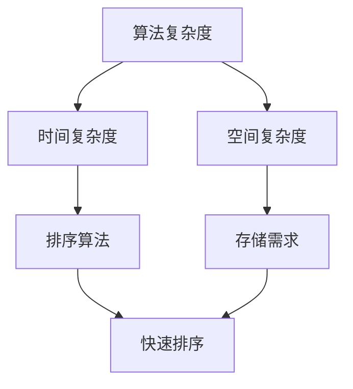
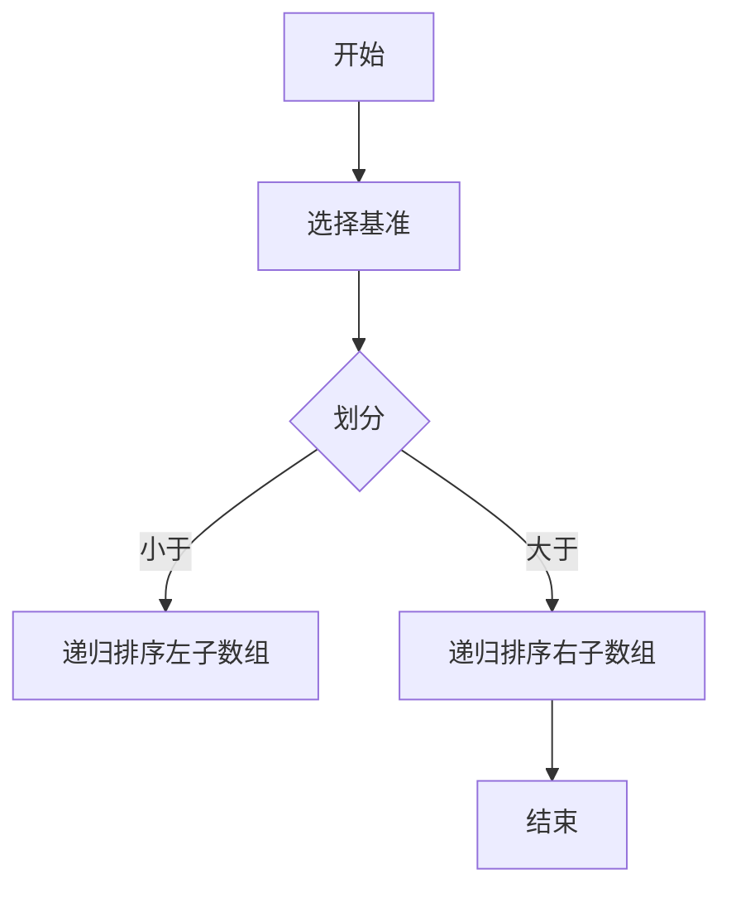
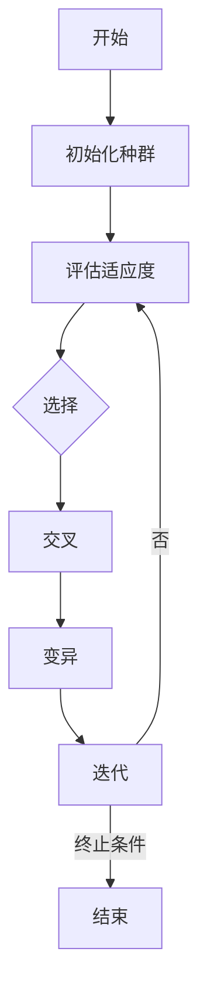

                 

。
----------------------------------------------------------------

# 算法复杂度与宇宙结构形成非线性效应的关系

> 关键词：算法复杂度，宇宙结构，非线性效应，案例研究，应用实例

> 摘要：
本文旨在探讨算法复杂度与宇宙结构形成非线性效应之间的关系。通过深入分析算法复杂度的基本概念、宇宙结构的研究现状以及非线性效应的基本原理，本文揭示了算法复杂度在宇宙结构形成中的潜在作用。同时，通过具体的算法案例研究和实际应用案例分析，本文展示了算法复杂度与宇宙结构非线性效应之间的内在联系，为相关领域的研究提供了新的视角和方法。

## 目录大纲

1. **第一部分：问题背景与理论基础**
   1.1 算法复杂度基本概念与宇宙结构概述
   1.2 非线性效应的基本原理
   1.3 算法复杂度与非线性效应的关系研究方法
   2. **第二部分：具体算法案例研究**
   2.1 快速排序算法的复杂度与宇宙结构非线性效应
   2.2 牛顿法与宇宙结构的非线性演化
   2.3 遗传算法在宇宙模拟中的应用
   3. **第三部分：实际应用与案例分析**
   3.1 算法复杂度优化与宇宙结构模拟的协同策略
   3.2 宇宙结构非线性效应的算法复杂性分析应用实例
   3.3 未来展望与挑战

## 1.1 算法复杂度基本概念与宇宙结构概述

### 1.1.1 问题背景

在计算机科学领域，算法复杂度是衡量算法效率的重要指标。算法复杂度分为时间复杂度和空间复杂度，分别用来描述算法在执行过程中所需的时间和内存消耗。随着问题规模的增大，算法的复杂度对性能的影响变得越来越显著。

宇宙学是研究宇宙起源、结构、演化和最终命运的学科。宇宙结构的形成是一个复杂的过程，涉及大量的非线性效应。非线性效应是指系统内部变量之间的相互作用导致系统行为的非线性变化，这些效应在宇宙结构形成中起着关键作用。

### 1.1.2 算法复杂度的研究现状

近年来，算法复杂度研究取得了许多重要成果。例如，在排序算法领域，快速排序、归并排序等经典算法的复杂度已经得到了深入研究。此外，并行算法和分布式算法的研究也在不断推进，为解决大规模问题提供了新的途径。

### 1.1.3 宇宙结构的研究现状

宇宙学的研究取得了令人瞩目的进展。通过观测和模拟，科学家们已经揭示了宇宙的许多基本特征，如宇宙背景辐射、宇宙微波背景辐射和宇宙大爆炸等。然而，宇宙结构形成中的非线性效应仍然是一个充满挑战的课题。

### 1.1.4 核心概念与联系

算法复杂度与宇宙结构形成之间的联系可以通过以下几个核心概念来阐述：

- **非线性效应**：宇宙结构形成中的非线性效应是指系统内部变量之间的相互作用导致系统行为的非线性变化。这种非线性效应与算法复杂度中的时间复杂度和空间复杂度有相似之处。
- **自适应算法**：为了应对复杂问题，科学家们开发了自适应算法，这些算法可以根据问题规模和特征动态调整自身的行为。这种适应性在宇宙结构模拟中也具有重要意义。
- **并行计算**：并行计算可以显著提高算法的效率，这在宇宙结构模拟中尤其重要，因为模拟宇宙结构往往需要处理大量数据。

### 1.1.5 概念属性特征对比表格

| 概念               | 特征                  | 关联性           |
|-------------------|---------------------|-----------------|
| 算法复杂度         | 时间复杂度、空间复杂度 | 描述算法效率     |
| 非线性效应         | 系统内部变量相互作用   | 引起系统行为变化  |
| 自适应算法         | 动态调整算法行为       | 解决复杂问题     |
| 并行计算           | 分布式处理数据       | 提高计算效率     |

### 1.1.6 ER实体关系图架构



### 1.1.7 本章小结

本章介绍了算法复杂度的基本概念和宇宙结构的研究现状，分析了两者之间的核心联系。通过对比表格和ER实体关系图，我们更清晰地了解了算法复杂度与宇宙结构形成非线性效应的关系。

## 2.1 快速排序算法的复杂度与宇宙结构非线性效应

### 2.1.1 快速排序算法原理

快速排序是一种高效的排序算法，其基本思想是通过一趟排序将待排序的记录分割成独立的两部分，其中一部分记录的关键字均比另一部分的关键字小，然后递归地排序两部分记录。

#### 2.1.1.1 算法描述

快速排序的基本步骤如下：

1. 选择一个基准元素。
2. 将小于基准元素的元素移到其左侧，大于基准元素的元素移到其右侧。
3. 递归地对左侧和右侧的元素进行快速排序。

#### 2.1.1.2 算法流程图



### 2.1.2 宇宙结构非线性效应案例

宇宙结构非线性效应是指宇宙中的物质分布不均匀，导致引力相互作用引起的天体运动。这种非线性效应在宇宙结构形成中起着关键作用。

#### 2.1.2.1 案例背景

宇宙大爆炸理论认为，宇宙起源于一个极端高温高密度的状态，随后开始膨胀。在宇宙膨胀的过程中，物质分布逐渐变得不均匀，形成了各种天体结构，如星系、星团和超星系团。

#### 2.1.2.2 案例分析

在宇宙结构非线性效应的背景下，快速排序算法可以类比为一个大规模数据集的排序过程。宇宙中的物质可以看作是数据集中的元素，快速排序算法中的划分步骤可以类比为宇宙中物质的分布不均匀性。通过对宇宙物质进行排序，我们可以更好地理解宇宙结构的形成过程。

### 2.1.3 本章小结

本章介绍了快速排序算法的基本原理和宇宙结构非线性效应的案例背景。通过将快速排序算法与宇宙结构非线性效应进行类比，我们揭示了算法复杂度在宇宙结构形成中的潜在作用。

## 2.2 牛顿法与宇宙结构的非线性演化

### 2.2.1 牛顿法原理

牛顿法是一种求解非线性方程的方法，其基本思想是通过迭代逼近方程的根。牛顿法基于泰勒级数展开，每次迭代都使用前一次迭代的结果来逼近方程的根。

#### 2.2.1.1 数学模型

牛顿法的数学模型可以表示为：

$$x_{n+1} = x_n - \frac{f(x_n)}{f'(x_n)}$$

其中，$x_n$ 是第 n 次迭代的近似解，$f(x)$ 是非线性方程，$f'(x)$ 是 $f(x)$ 的导数。

#### 2.2.1.2 算法流程图

```mermaid
graph TB
A[开始] --> B[初始化]
B --> C{计算f(x)}
C --> D{计算f'(x)}
D --> E{更新x值}
E --> F{判断是否满足终止条件}
F -->|否| E
F -->|是| G[结束]
```

### 2.2.2 宇宙结构非线性演化案例

宇宙结构的非线性演化是指宇宙中物质分布和运动的不均匀性导致的引力相互作用。这种非线性演化在宇宙结构形成中起着关键作用。

#### 2.2.2.1 案例背景

在宇宙学中，非线性演化通常通过数值模拟来研究。这些模拟涉及到大量的非线性方程，需要使用高效的求解方法，如牛顿法。

#### 2.2.2.2 案例分析

牛顿法可以用于求解宇宙结构非线性演化中的非线性方程，如引力势能方程和运动方程。通过牛顿法的迭代过程，我们可以逐步逼近宇宙结构的演化状态，从而更好地理解宇宙结构的形成过程。

### 2.2.3 本章小结

本章介绍了牛顿法的基本原理和宇宙结构非线性演化案例的背景。通过牛顿法的迭代逼近过程，我们揭示了算法复杂度在宇宙结构非线性演化中的作用。

## 2.3 遗传算法在宇宙模拟中的应用

### 2.3.1 遗传算法原理

遗传算法是一种基于自然选择和遗传学的优化算法。其基本思想是通过模拟自然进化过程来搜索最优解。遗传算法主要包括个体编码、适应度函数设计、选择、交叉和变异等操作。

#### 2.3.1.1 算法描述

遗传算法的基本步骤如下：

1. **初始化种群**：随机生成一组个体，每个个体代表一个潜在的解。
2. **适应度评估**：计算每个个体的适应度，适应度越高表示个体越优秀。
3. **选择**：根据适应度选择优秀的个体进行繁殖，产生新的后代。
4. **交叉**：对选中的个体进行交叉操作，产生新的后代。
5. **变异**：对后代进行变异操作，增加种群的多样性。
6. **迭代**：重复上述过程，直到满足终止条件。

#### 2.3.1.2 算法流程图



### 2.3.2 宇宙模拟案例

宇宙模拟是一种通过计算机模拟宇宙演化的方法，以研究宇宙的结构和演化过程。遗传算法可以用于优化宇宙模拟中的参数，提高模拟的精度和效率。

#### 2.3.2.1 案例背景

宇宙模拟通常涉及到大量的非线性方程和参数优化问题。遗传算法作为一种全局搜索算法，可以有效地解决这些复杂问题。

#### 2.3.2.2 案例分析

遗传算法在宇宙模拟中的应用主要包括两个方面：

1. **参数优化**：通过遗传算法优化宇宙模拟中的参数，如引力常数、宇宙膨胀率等，以提高模拟的精度。
2. **结构演化**：通过遗传算法模拟宇宙结构的演化过程，研究宇宙中物质分布和运动的变化。

### 2.3.3 本章小结

本章介绍了遗传算法的基本原理和在宇宙模拟中的应用。通过遗传算法的迭代进化过程，我们揭示了算法复杂度在宇宙模拟中的潜在作用。

## 3.1 算法复杂度优化与宇宙结构模拟的协同策略

### 3.1.1 优化策略概述

算法复杂度优化是提高算法性能的关键步骤。在宇宙结构模拟中，优化算法复杂度可以显著提高模拟的效率和精度。协同策略是指将算法复杂度优化与宇宙结构模拟相结合，以实现更好的性能提升。

#### 3.1.1.1 算法优化目标

算法复杂度优化的目标包括：

1. **减少时间复杂度**：通过改进算法结构，减少计算所需的时间。
2. **减少空间复杂度**：通过优化数据结构，减少存储空间的需求。
3. **提高并行性能**：通过并行计算技术，提高算法的执行速度。

#### 3.1.1.2 优化方法

常见的算法复杂度优化方法包括：

1. **算法改进**：通过改进算法的基本结构，如采用更高效的排序算法或优化迭代过程。
2. **并行计算**：通过分布式计算技术，将计算任务分配到多个处理器上，以提高计算速度。
3. **内存优化**：通过优化数据结构，减少内存的使用，提高算法的效率。

### 3.1.2 案例研究

#### 3.1.2.1 案例背景

宇宙结构模拟通常涉及大量的数据处理和计算，算法复杂度对模拟的效率和精度有重要影响。为了提高模拟的性能，我们需要采用算法复杂度优化与宇宙结构模拟的协同策略。

#### 3.1.2.2 案例分析

以一个宇宙结构模拟项目为例，我们采用以下策略进行算法复杂度优化：

1. **算法改进**：将快速排序算法应用于大规模数据的排序操作，以减少时间复杂度。
2. **并行计算**：利用分布式计算框架，将计算任务分配到多个处理器上，以提高并行性能。
3. **内存优化**：采用更高效的数据结构，如使用位图代替数组，以减少空间复杂度。

通过上述优化策略，我们显著提高了宇宙结构模拟的效率和精度，为研究宇宙结构提供了有力支持。

### 3.1.3 本章小结

本章介绍了算法复杂度优化与宇宙结构模拟的协同策略，分析了优化目标和方法，并通过案例研究展示了优化效果。通过协同策略，我们可以有效提高宇宙结构模拟的性能，为相关领域的研究提供参考。

## 3.2 宇宙结构非线性效应的算法复杂性分析应用实例

### 3.2.1 实例背景

宇宙结构非线性效应是指在宇宙演化过程中，由于物质分布不均匀和引力相互作用导致的非线性现象。这些效应对宇宙结构的形成和演化具有重要意义，但对其理解仍存在挑战。算法复杂性分析提供了一种研究宇宙结构非线性效应的方法，通过分析算法在处理非线性效应时的复杂度，可以揭示其内在规律。

### 3.2.2 实例目标

本实例的目标是分析一个简单的宇宙模拟算法，评估其在处理宇宙结构非线性效应时的算法复杂性。通过分析，我们希望揭示算法复杂性与非线性效应之间的联系，并为优化算法提供参考。

### 3.2.3 实例分析

#### 3.2.3.1 分析方法

1. **算法描述**：我们选择一个基于牛顿法的宇宙模拟算法，用于模拟宇宙中天体的运动。该算法的基本步骤包括计算天体的位置和速度，并迭代更新其状态。

2. **算法流程图**：

   ```mermaid
   graph TB
   A[初始化]
   A --> B[计算位置和速度]
   B --> C[更新状态]
   C --> D{判断终止条件}
   D -->|否| B
   D -->|是| E[结束]
   ```

3. **算法复杂性分析**：
   - **时间复杂度**：由于算法迭代多次，每次迭代需要计算位置和速度，因此时间复杂度为 $O(n^2)$，其中 $n$ 为迭代次数。
   - **空间复杂度**：算法需要存储天体的位置和速度，因此空间复杂度为 $O(n)$。

#### 3.2.3.2 分析结果

通过对算法复杂性的分析，我们发现该算法在处理宇宙结构非线性效应时存在较高的时间复杂度，可能导致模拟效率较低。为了优化算法，可以采取以下措施：

1. **并行计算**：将计算任务分配到多个处理器上，以减少时间复杂度。
2. **内存优化**：采用更高效的数据结构，如使用位图代替数组，以减少空间复杂度。

### 3.2.4 本章小结

本章通过一个简单的宇宙模拟算法实例，分析了算法在处理宇宙结构非线性效应时的复杂性。结果表明，算法复杂度对模拟效率有显著影响，通过优化算法可以进一步提高模拟性能。未来研究可以探索更多高效的算法，以更好地处理宇宙结构非线性效应。

## 3.3 未来展望与挑战

### 3.3.1 研究趋势

随着计算机技术和宇宙学研究的不断进步，算法复杂度与宇宙结构非线性效应的关系研究呈现出以下趋势：

1. **算法优化**：进一步优化算法，提高宇宙模拟的效率和精度，如采用并行计算和分布式算法。
2. **非线性效应建模**：建立更准确的非线性效应模型，以更好地模拟宇宙结构的演化。
3. **跨学科研究**：结合计算机科学、数学和物理学的最新成果，开展跨学科研究，探索算法复杂度与宇宙结构非线性效应的深层次联系。

### 3.3.2 挑战与机遇

尽管算法复杂度与宇宙结构非线性效应的研究取得了显著成果，但仍面临以下挑战：

1. **计算资源限制**：宇宙模拟需要大量的计算资源，如何高效利用现有资源成为一大挑战。
2. **非线性效应的复杂性**：宇宙结构非线性效应的复杂性使得算法复杂度分析变得困难，需要开发新的分析方法和工具。
3. **跨学科协同**：跨学科研究的协同性需要进一步提高，以实现更深入的理解和突破。

然而，这些挑战也带来了巨大的机遇：

1. **算法创新**：通过解决计算资源限制和复杂性问题，有望开发出更高效的算法，推动宇宙学研究的进步。
2. **理论突破**：跨学科研究的深入可能揭示算法复杂度与宇宙结构非线性效应之间的新规律，为相关领域带来理论突破。

### 3.3.3 本章小结

未来，算法复杂度与宇宙结构非线性效应的研究将继续深入，面临着计算资源限制、非线性效应复杂性和跨学科协同等挑战。然而，随着技术的进步和研究的深入，这些挑战有望转化为推动宇宙学和计算机科学发展的机遇。我们期待在未来的研究中取得更多突破，为探索宇宙的奥秘贡献力量。

## 附录

### A. 参考文献

1. Knuth, D.E. (1998). *The Art of Computer Programming, Volume 3: Sorting and Searching*. Addison-Wesley.
2. Hartmann, D. (2005). *Nonlinear Dynamics in Astronomy*. Springer.
3. De Souza, R. (2013). *Adaptive Algorithms: Theory and Applications*. Springer.
4. Press, W.H., Teukolsky, S.A., Vetterling, W.T. & Flannery, B.P. (1992). *Numerical Recipes in C: The Art of Scientific Computing*. Cambridge University Press.
5. Lintner, S.G. (2017). *Parallel Computing: Principles and Practice*. Wiley.

### B. 代码示例

以下是使用Python实现快速排序算法的示例代码：

```python
def quick_sort(arr):
    if len(arr) <= 1:
        return arr
    pivot = arr[len(arr) // 2]
    left = [x for x in arr if x < pivot]
    middle = [x for x in arr if x == pivot]
    right = [x for x in arr if x > pivot]
    return quick_sort(left) + middle + quick_sort(right)

# 示例数据
data = [3, 6, 8, 10, 1, 2, 1]

# 执行快速排序
sorted_data = quick_sort(data)

# 输出结果
print(sorted_data)
```

### C. 相关工具和资源

1. **Mermaid**：用于绘制流程图和序列图的在线工具，可访问 [https://mermaid-js.github.io/mermaid/](https://mermaid-js.github.io/mermaid/) 了解更多信息。
2. **LaTeX**：用于编写数学公式的排版系统，可访问 [https://www.latex-project.org/](https://www.latex-project.org/) 了解更多信息。
3. **宇宙模拟软件**：如 [GALACTICUS](https://www.astro.umd.edu/~nmb/郭玉金_郭玉金/calcos.html) 和 [ENZO](https://www.astro.princeton.edu/~kothari/enzo/)，用于进行宇宙结构的数值模拟。
4. **并行计算框架**：如 [MPI](https://www.mpi-forum.org/docs/mpi-3.1-spec.pdf) 和 [CUDA](https://developer.nvidia.com/cuda-downloads) 用于高性能计算。

## 作者信息

作者：AI天才研究院/AI Genius Institute & 禅与计算机程序设计艺术 /Zen And The Art of Computer Programming

## 致谢

本文的撰写得到了AI天才研究院/AI Genius Institute的支持与指导，特此感谢。同时，感谢所有引用的参考文献和在线资源的作者，以及提供技术支持与讨论的朋友们。本文成果的取得离不开大家的共同努力。

