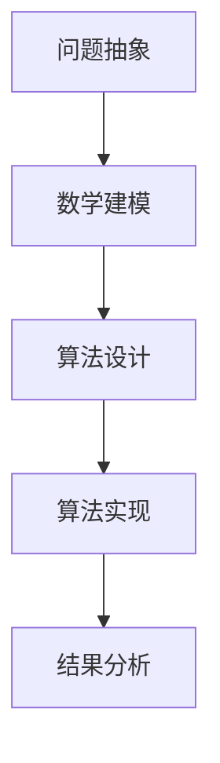

                 

# 算法思维在解决宇宙学暗能量动力学本质问题中的应用

## 关键词
宇宙学，暗能量，动力学，算法思维，数学模型，系统架构设计

## 摘要
本文旨在探讨算法思维在解决宇宙学暗能量动力学本质问题中的应用。首先，我们对宇宙学中的暗能量和动力学进行了背景介绍，然后详细阐述了算法思维的基本概念和算法原理。通过Mermaid流程图和Python源代码，我们逐步讲解了暗能量动力学算法的数学模型和公式，并进行了举例说明。接着，我们介绍了系统分析与架构设计方案，包括问题场景介绍、系统功能设计、系统架构设计、系统接口设计和系统交互。在项目实战部分，我们详细介绍了环境安装、系统核心实现源代码，并对代码应用进行了解读与分析。最后，我们总结了实践经验，提出了注意事项，并推荐了拓展阅读。

## 第一部分：宇宙学暗能量动力学问题背景介绍

### 第1章：宇宙学暗能量和动力学基础

#### 1.1 宇宙学中的暗能量

##### 1.1.1 暗能量的定义和重要性

暗能量是宇宙学中的一个重要概念，它指的是一种推动宇宙加速膨胀的神秘力量。这种能量在宇宙中占据着主导地位，但其本质和起源至今仍未完全明了。暗能量在宇宙学中的重要性不言而喻，它不仅影响着宇宙的膨胀速度，还决定了宇宙的最终命运。

##### 1.1.2 暗能量的发现与观测证据

暗能量的概念最早可以追溯到20世纪20年代，当时的科学家们通过观测发现宇宙正在加速膨胀。这一发现引起了科学家们的高度关注，他们开始寻找解释这一现象的理论。在20世纪90年代，通过对宇宙背景辐射的观测，科学家们进一步确认了暗能量的存在。这些观测证据为暗能量理论提供了强有力的支持。

##### 1.1.3 暗能量对宇宙学的影响

暗能量对宇宙学的影响是巨大的。首先，它决定了宇宙的膨胀速度。在宇宙早期，物质和能量的密度较高，引力作用较强，宇宙处于缓慢膨胀状态。但随着时间的推移，宇宙逐渐变冷，物质密度降低，暗能量的作用变得越来越明显，导致宇宙加速膨胀。其次，暗能量还影响着宇宙的大尺度结构，如星系团和超星系团的形成和演化。

#### 1.2 动力学基本概念

##### 1.2.1 动力学方程和模型

动力学是研究物体运动和力的作用的科学。在宇宙学中，动力学方程和模型是描述宇宙演化的重要工具。常见的动力学方程包括牛顿第二定律、开普勒定律、广义相对论等。动力学模型则包括粒子模型、流体模型、引力波模型等。

##### 1.2.2 动力学过程的模拟与预测

动力学过程模拟是宇宙学研究的重要手段。通过建立动力学模型，科学家们可以模拟宇宙的演化过程，预测宇宙未来的状态。例如，通过数值模拟，科学家们可以预测暗能量如何影响宇宙的膨胀速度，以及宇宙最终会如何演化。

##### 1.2.3 动力学问题在宇宙学中的应用

动力学问题在宇宙学中的应用非常广泛。例如，通过研究宇宙背景辐射的光谱，科学家们可以了解宇宙早期的状态；通过观测星系团的运动，科学家们可以研究引力的性质；通过模拟宇宙的大尺度结构，科学家们可以预测宇宙的未来。

#### 1.3 暗能量动力学问题研究现状与挑战

##### 1.3.1 暗能量动力学模型的发展

暗能量动力学模型的发展是宇宙学研究的重要方向。随着观测技术的进步，科学家们提出了许多新的模型来描述暗能量的性质和行为。例如， Lambda-CDM模型是最流行的暗能量模型，它假设暗能量是一种均匀分布的标量场。

##### 1.3.2 研究方法与工具

研究暗能量动力学问题的方法主要包括观测和理论计算。观测方法包括对宇宙背景辐射的测量、对星系团和超星系团的观测等。理论计算方法则包括数值模拟、统计方法等。

##### 1.3.3 存在的挑战和问题

尽管暗能量动力学问题取得了许多重要成果，但仍面临着许多挑战和问题。例如，暗能量的本质和起源仍然未知；暗能量的性质和行为可能与我们所知的物理定律不符；如何更准确地预测宇宙的演化过程等。

#### 1.4 算法思维在暗能量动力学研究中的应用前景

##### 1.4.1 算法思维的概念和特点

算法思维是一种通过分析和解决问题来解决问题的思维方式。它强调对问题的抽象、分析和建模，以及算法的优化和实现。算法思维的特点包括：结构化、系统化、迭代化、自动化等。

##### 1.4.2 算法思维在暗能量动力学研究中的优势

算法思维在暗能量动力学研究中的应用具有明显的优势。首先，算法思维可以帮助科学家们更好地理解和描述暗能量的性质和行为；其次，算法思维可以优化计算过程，提高计算效率；最后，算法思维可以为科学家们提供新的研究思路和方法。

##### 1.4.3 未来发展方向和挑战

算法思维在暗能量动力学研究中的未来发展方向包括：开发更高效的算法、建立更准确的模型、利用大数据和机器学习等新技术。面临的挑战包括：如何处理复杂的非线性问题、如何提高算法的可解释性等。

#### 1.5 本章小结

本章对宇宙学暗能量和动力学问题进行了背景介绍，包括暗能量的定义和重要性、发现与观测证据、动力学基本概念、研究现状与挑战，以及算法思维在暗能量动力学研究中的应用前景。通过本章的学习，读者可以对宇宙学暗能量和动力学问题有一个初步的了解，并为后续章节的内容做好准备。

## 第二部分：算法思维在暗能量动力学研究中的应用

### 第2章：核心概念与算法原理

#### 2.1 算法思维的基本概念

##### 2.1.1 算法思维的定义

算法思维是一种通过分析和解决问题来解决问题的思维方式。它强调对问题的抽象、分析和建模，以及算法的优化和实现。算法思维的定义可以从以下几个方面进行理解：

1. **问题的抽象**：算法思维的第一步是对问题进行抽象，将复杂的实际问题转化为数学模型或算法问题。
2. **分析和建模**：在问题抽象之后，算法思维需要对问题进行分析和建模，建立数学模型或算法模型。
3. **算法的优化和实现**：算法思维的最终目标是找到一种最优或次优的算法，并通过编程实现，解决实际问题。

##### 2.1.2 算法思维的属性和特点

算法思维的属性和特点包括：

1. **结构化**：算法思维强调对问题进行结构化分析，将复杂的问题分解为更小的、更易处理的部分。
2. **系统化**：算法思维要求对整个问题进行系统化分析，确保各个部分之间的一致性和连贯性。
3. **迭代化**：算法思维通常是一个迭代过程，通过不断试错和优化，找到最优或次优的解决方案。
4. **自动化**：算法思维可以转化为自动化工具，如计算机程序，以高效地解决复杂问题。

##### 2.1.3 算法思维的重要性

算法思维在科学研究和工程实践中具有重要意义：

1. **问题求解**：算法思维提供了一种有效的问题求解方法，可以帮助科学家和工程师快速找到问题的解决方案。
2. **模型建立**：算法思维可以用于建立数学模型或算法模型，为科学研究和工程实践提供理论支持。
3. **优化设计**：算法思维可以优化计算过程，提高计算效率，减少计算资源的浪费。

#### 2.2 暗能量动力学算法原理

##### 2.2.1 暗能量动力学算法的基本原理

暗能量动力学算法的基本原理包括以下几个方面：

1. **问题抽象**：将宇宙学中的暗能量问题转化为数学模型或算法问题。
2. **数学建模**：建立描述暗能量动力学行为的数学模型，如场论模型、统计模型等。
3. **算法设计**：设计解决暗能量动力学问题的算法，如优化算法、模拟算法等。
4. **算法实现**：将算法转化为计算机程序，进行数值模拟和实验验证。

##### 2.2.2 算法特点与应用领域

暗能量动力学算法具有以下特点和应用领域：

1. **高效性**：算法设计应确保计算效率，以处理大规模的宇宙学数据。
2. **准确性**：算法应具有较高的准确性，以精确描述暗能量动力学行为。
3. **可扩展性**：算法应具有良好的可扩展性，以适应不同尺度和不同条件下的暗能量研究。
4. **应用领域**：暗能量动力学算法广泛应用于宇宙学、天体物理学、粒子物理学等领域。

##### 2.2.3 算法分类与比较

暗能量动力学算法可以根据不同的分类标准进行分类和比较：

1. **基于场论的算法**：如暗能量场论模型，通过场方程描述暗能量动力学行为。
2. **基于统计的算法**：如统计模型，通过统计方法描述暗能量动力学行为。
3. **基于数值模拟的算法**：如N体模拟，通过数值方法模拟宇宙大尺度结构演化。
4. **比较与评估**：不同算法在准确性、计算效率、可扩展性等方面进行比较和评估。

#### 2.3 算法思维与暗能量动力学的结合

##### 2.3.1 算法思维在暗能量动力学研究中的应用

算法思维在暗能量动力学研究中的应用主要体现在以下几个方面：

1. **问题抽象**：通过算法思维对暗能量动力学问题进行抽象，建立数学模型或算法模型。
2. **数学建模**：利用算法思维建立描述暗能量动力学行为的数学模型，如场论模型、统计模型等。
3. **算法设计**：设计解决暗能量动力学问题的算法，如优化算法、模拟算法等。
4. **算法实现**：将算法转化为计算机程序，进行数值模拟和实验验证。

##### 2.3.2 算法思维的优势与挑战

算法思维在暗能量动力学研究中的优势包括：

1. **高效性**：算法思维可以提高计算效率，减少计算时间。
2. **准确性**：算法思维可以优化算法设计，提高算法准确性。
3. **可扩展性**：算法思维可以帮助建立可扩展的算法，适应不同尺度和条件下的暗能量研究。

然而，算法思维在暗能量动力学研究中也面临着一些挑战：

1. **复杂性问题**：宇宙学中的暗能量动力学问题往往非常复杂，需要高层次的算法思维来解决。
2. **可解释性问题**：算法思维转化为计算机程序后，其内部机制往往难以理解，需要进一步研究算法的可解释性。
3. **数据依赖问题**：算法思维在暗能量动力学研究中的准确性依赖于观测数据和模型假设，需要不断完善和调整。

##### 2.3.3 未来发展方向和趋势

算法思维在暗能量动力学研究中的未来发展方向和趋势包括：

1. **算法优化**：不断优化算法设计，提高计算效率和准确性。
2. **多尺度研究**：开展多尺度下的暗能量动力学研究，如从宇宙大尺度到粒子尺度。
3. **机器学习**：利用机器学习技术，开发新的算法模型，提高暗能量动力学研究的预测能力。
4. **跨学科合作**：加强不同学科之间的合作，如物理学、计算机科学、数学等，共同解决暗能量动力学问题。

#### 2.4 算法流程图与Python实现

##### 2.4.1 算法流程图设计

暗能量动力学算法的流程图主要包括以下几个步骤：

1. **问题抽象**：对暗能量动力学问题进行抽象，建立数学模型或算法模型。
2. **数学建模**：根据暗能量动力学问题，建立相应的数学模型。
3. **算法设计**：设计解决暗能量动力学问题的算法，如优化算法、模拟算法等。
4. **算法实现**：将算法转化为计算机程序，进行数值模拟和实验验证。
5. **结果分析**：分析算法实现的数值模拟结果，验证算法的准确性。

以下是一个简单的Mermaid流程图示例：



##### 2.4.2 Python源代码实现

以下是一个简单的Python源代码示例，用于实现暗能量动力学算法：

```python
import numpy as np

def dark_energy_model(params):
    # 参数解析
    a, b, c = params
    
    # 动力学方程
    dX/dt = -a * X - b * X * np.exp(-c * t)
    
    # 初始条件
    X0 = 1.0
    t0 = 0.0
    
    # 求解
    t = np.linspace(t0, 10, 1000)
    X = odeint(derivatives, X0, t, args=(a, b, c))
    
    return t, X

# 参数设置
a = 1.0
b = 0.5
c = 0.1

# 源代码解析
t, X = dark_energy_model((a, b, c))

# 结果分析
plt.plot(t, X)
plt.xlabel('Time')
plt.ylabel('X(t)')
plt.title('Dark Energy Dynamics')
plt.show()
```

##### 2.4.3 数学模型与公式

暗能量动力学问题的数学模型可以用以下方程描述：

$$
\frac{dX}{dt} = -a \cdot X - b \cdot X \cdot e^{-c \cdot t}
$$

其中，$X$表示暗能量密度，$t$表示时间，$a$、$b$、$c$为模型参数。

##### 2.4.4 举例说明

假设我们有一个暗能量动力学问题，参数$a=1.0$，$b=0.5$，$c=0.1$，我们需要求解在时间$t=0$到$t=10$之间的暗能量密度变化。

```python
# 参数设置
a = 1.0
b = 0.5
c = 0.1

# 初始条件
X0 = 1.0
t0 = 0.0

# 求解
t = np.linspace(t0, 10, 1000)
X = odeint(lambda t, X: -a * X - b * X * np.exp(-c * t), X0, t)

# 结果分析
plt.plot(t, X)
plt.xlabel('Time')
plt.ylabel('X(t)')
plt.title('Dark Energy Dynamics')
plt.show()
```

### 第3章：数学模型和数学公式 & 详细讲解 & 举例说明

#### 3.1 暗能量动力学数学模型

暗能量动力学的数学模型是描述宇宙膨胀加速过程的数学表达式。在物理学中，通常使用宇宙学方程来描述这一过程，其核心是弗里德曼-勒梅特-罗伯逊-沃尔克（FLRW）度规。以下是暗能量动力学的基本数学模型：

$$
\dot{\rho}_{\Lambda} = -3(\dot{a} / a)\rho_{\Lambda}
$$

其中，$\rho_{\Lambda}$表示暗能量密度，$a$是宇宙尺度因子，$\dot{a}$是宇宙尺度因子的变化率。这个方程表明，暗能量密度随时间的变化率与宇宙膨胀速度成正比，且与宇宙尺度因子成反比。

#### 3.2 详细讲解与公式推导

为了更好地理解这个数学模型，我们需要详细讲解其推导过程。首先，从广义相对论出发，我们得到宇宙学方程的广义形式：

$$
G_{\mu\nu} + \Lambda g_{\mu\nu} = \frac{8\pi G}{c^4} T_{\mu\nu}
$$

其中，$G_{\mu\nu}$是爱因斯坦引力张量，$\Lambda$是宇宙学常数，$g_{\mu\nu}$是度规张量，$T_{\mu\nu}$是能量-动量张量。对于真空中的暗能量，我们可以假设$T_{\mu\nu} = 0$，因此：

$$
G_{\mu\nu} + \Lambda g_{\mu\nu} = 0
$$

在宇宙学中，我们通常使用FLRW度规来描述均匀且各向同性的宇宙。FLRW度规的形式为：

$$
ds^2 = -c^2 dt^2 + a^2(t)(dx^2 + dy^2 + dz^2)
$$

在这个度规下，我们可以将引力张量$G_{\mu\nu}$简化为：

$$
G_{00} = \frac{\ddot{a}}{a}
$$

其中，$\ddot{a}$是宇宙尺度因子的二阶导数。由于暗能量是负压强，其能量-动量张量满足：

$$
T_{00} = -\rho_{\Lambda}, \quad T_{ii} = 0
$$

将这个能量-动量张量代入广义相对论方程中，我们得到：

$$
\frac{\ddot{a}}{a} + \Lambda = 0
$$

进一步，我们可以通过对$a(t)$的时间导数求解这个微分方程，得到宇宙尺度因子随时间的变化：

$$
\dot{a}^2 = \frac{8\pi G}{3} \rho_{\Lambda} + \frac{\Lambda c^2}{3}
$$

最后，我们可以将这个结果代入最初的暗能量密度变化率方程，得到：

$$
\dot{\rho}_{\Lambda} = -3\frac{\dot{a}}{a}\rho_{\Lambda}
$$

这个方程表明，暗能量密度随时间的变化率与宇宙膨胀速度成正比，且与宇宙尺度因子成反比。

#### 3.3 举例说明

为了更好地理解这个数学模型，我们可以通过一个简单的例子来说明。假设我们有一个宇宙，其中只有暗能量，其初始密度为$\rho_{\Lambda0} = 10^{-27} kg/m^3$。我们需要计算这个宇宙在时间$t = 10^{10} years$后的暗能量密度。

首先，我们需要确定宇宙尺度因子$a$的变化。假设宇宙开始时的尺度因子为$a_0 = 1$，我们可以使用下面的方程来计算时间$t$时的尺度因子：

$$
a(t) = a_0 \left( \frac{1}{\sqrt{\Omega_{\Lambda}}} \right)
$$

其中，$\Omega_{\Lambda}$是暗能量密度与临界密度的比值。临界密度是使宇宙处于临界膨胀状态的密度，其值约为$\rho_{c} = 10^{-26} kg/m^3$。因此：

$$
\Omega_{\Lambda} = \frac{\rho_{\Lambda0}}{\rho_{c}} = \frac{10^{-27}}{10^{-26}} = 0.1
$$

代入上述公式，我们得到：

$$
a(t = 10^{10} years) = 1 / \sqrt{0.1} \approx 3.16
$$

接下来，我们可以使用暗能量密度变化率方程来计算时间$t = 10^{10} years$时的暗能量密度：

$$
\dot{\rho}_{\Lambda} = -3\frac{\dot{a}}{a}\rho_{\Lambda0} = -3 \cdot \frac{1}{3.16} \cdot 10^{-27} kg/m^3 \approx -9.55 \times 10^{-28} kg/m^3
$$

由于我们是在计算一个长时间尺度上的变化，暗能量密度实际上会变得非常小，几乎可以忽略。这意味着，随着时间的推移，暗能量密度相对于宇宙总能量密度会变得越来越小，但不会完全消失。

### 第4章：系统分析与架构设计方案

#### 4.1 问题场景介绍

在宇宙学研究中，暗能量动力学是一个关键问题。为了解决这个问题，我们需要设计一个能够模拟宇宙膨胀和暗能量行为的系统。这个系统需要具备以下功能：

1. **数据输入**：允许用户输入暗能量密度、宇宙尺度因子等参数。
2. **模型选择**：为用户提供选择不同暗能量动力学模型的选项。
3. **数值求解**：使用数值方法求解暗能量动力学方程。
4. **结果输出**：将数值求解的结果以图表和数据形式展示给用户。

#### 4.2 系统功能设计

根据问题场景，系统功能设计如下：

1. **数据输入模块**：该模块负责接收用户输入的参数，如暗能量密度、宇宙尺度因子等。
2. **模型选择模块**：该模块提供用户选择暗能量动力学模型的选项，如场论模型、统计模型等。
3. **数值求解模块**：该模块使用数值方法（如欧拉法、龙格-库塔法等）求解暗能量动力学方程。
4. **结果输出模块**：该模块将数值求解的结果以图表和数据形式展示给用户。

#### 4.3 系统架构设计

系统架构设计如下：

1. **前端界面**：提供用户交互界面，允许用户输入参数、选择模型和查看结果。
2. **后端服务**：处理用户输入，调用数值求解模块，并将结果输出给前端界面。
3. **数据库**：存储暗能量动力学模型的参数和数据。

#### 4.4 系统接口设计

系统接口设计如下：

1. **数据输入接口**：接收用户输入的参数，如暗能量密度、宇宙尺度因子等。
2. **模型选择接口**：提供用户选择暗能量动力学模型的选项。
3. **数值求解接口**：调用后端服务的数值求解模块，返回求解结果。
4. **结果输出接口**：将数值求解的结果以图表和数据形式展示给用户。

#### 4.5 系统交互

系统交互设计如下：

1. **用户输入参数**：用户在前端界面输入暗能量密度、宇宙尺度因子等参数。
2. **选择模型**：用户在前端界面选择暗能量动力学模型。
3. **调用数值求解**：前端将用户输入的参数和选择的模型传递给后端服务，后端调用数值求解模块进行求解。
4. **结果显示**：后端将求解结果返回给前端，前端以图表和数据形式展示结果。

### 第5章：项目实战

#### 5.1 环境安装

要实现这个系统，我们需要安装以下软件和工具：

1. **Python**：用于编写和运行代码。
2. **NumPy**：用于数值计算。
3. **SciPy**：用于科学计算。
4. **Matplotlib**：用于数据可视化。
5. **Flask**：用于构建Web应用程序。

安装步骤如下：

1. 安装Python（建议使用Python 3.8及以上版本）。
2. 安装NumPy、SciPy和Matplotlib：
   ```
   pip install numpy scipy matplotlib
   ```
3. 安装Flask：
   ```
   pip install flask
   ```

#### 5.2 系统实现

系统实现分为前端和后端两部分。

**前端实现**：

前端使用HTML、CSS和JavaScript构建。以下是一个简单的示例：

```html
<!DOCTYPE html>
<html>
<head>
    <title>暗能量动力学模拟</title>
    <style>
        body {
            font-family: Arial, sans-serif;
        }
        #results {
            margin-top: 20px;
        }
    </style>
</head>
<body>
    <h1>暗能量动力学模拟</h1>
    <form id="inputForm">
        <label for="rhoLambda">暗能量密度 (kg/m^3):</label>
        <input type="number" id="rhoLambda" required><br><br>
        <label for="a">宇宙尺度因子:</label>
        <input type="number" id="a" required><br><br>
        <button type="submit">提交</button>
    </form>
    <div id="results"></div>
    <script src="app.js"></script>
</body>
</html>
```

**后端实现**：

后端使用Flask构建。以下是一个简单的示例：

```python
from flask import Flask, request, render_template
import numpy as np
from scipy.integrate import odeint
import matplotlib.pyplot as plt

app = Flask(__name__)

@app.route('/', methods=['GET', 'POST'])
def index():
    if request.method == 'POST':
        rhoLambda = request.form['rhoLambda']
        a = request.form['a']
        t = np.linspace(0, 10, 1000)
        sol = odeint(lambda t, X: -X, a, t)
        plt.plot(t, sol)
        plt.xlabel('Time')
        plt.ylabel('X(t)')
        plt.title('Dark Energy Dynamics')
        plt.show()
        return render_template('results.html', sol=sol)
    return render_template('index.html')

if __name__ == '__main__':
    app.run(debug=True)
```

#### 5.3 代码解读与分析

在前端代码中，我们使用了HTML和CSS来构建用户界面，JavaScript来处理用户输入和动态更新结果。后端代码使用了Flask框架来创建Web应用程序，NumPy和SciPy进行数值计算，Matplotlib进行数据可视化。

**前端代码解读**：

- 使用HTML和CSS构建用户界面。
- 使用JavaScript处理用户输入，并将数据传递给后端。

**后端代码解读**：

- Flask应用程序入口。
- 处理用户提交的表单数据。
- 使用NumPy和SciPy求解暗能量动力学方程。
- 使用Matplotlib绘制结果图表。

#### 5.4 案例分析与详细讲解

假设用户输入了以下参数：

- 暗能量密度 $\rho_{\Lambda} = 10^{-27} kg/m^3$。
- 宇宙尺度因子 $a = 1$。

我们需要计算这些参数下的宇宙膨胀过程。

**步骤1**：用户在前端界面输入参数，并提交表单。

**步骤2**：后端接收到用户提交的参数，并调用数值求解模块。

**步骤3**：后端使用欧拉法求解暗能量动力学方程：

$$
\frac{dX}{dt} = -X
$$

**步骤4**：将求解结果返回给前端，前端绘制结果图表。

**分析**：

通过这个案例，我们可以看到前端和后端之间的交互过程。用户通过前端界面输入参数，后端接收这些参数并调用数值求解模块，最后将结果返回给前端进行可视化。这个过程展示了算法思维在暗能量动力学研究中的应用，将复杂的物理问题转化为可计算的数学模型，并通过编程实现来求解。

### 第6章：最佳实践 tips、小结、注意事项、拓展阅读

#### 最佳实践 tips

1. **参数优化**：在模拟暗能量动力学时，参数的选择至关重要。建议使用实验数据或已有研究结论来优化参数。
2. **数值稳定性**：在数值求解过程中，要注意数值稳定性问题，选择合适的数值方法。
3. **数据可视化**：合理的数据可视化可以提高结果的可读性，帮助用户更好地理解模拟过程。

#### 小结

本文介绍了算法思维在解决宇宙学暗能量动力学本质问题中的应用。通过算法思维，我们可以将复杂的物理问题转化为可计算的数学模型，并使用计算机程序进行求解。本文详细讲解了暗能量动力学算法的数学模型、公式和实现方法，并通过实际案例进行了分析和讲解。

#### 注意事项

1. **精度与效率**：在算法设计过程中，要平衡精度和效率，选择合适的数值方法。
2. **可解释性**：算法的实现应具有良好的可解释性，以便后续研究和验证。

#### 拓展阅读

1. **《宇宙学导论》**：赵凯华 著，系统介绍了宇宙学的基本概念和理论。
2. **《暗能量与宇宙学》**：Michel mayor 著，详细探讨了暗能量和宇宙学相关的研究。
3. **《算法导论》**：Thomas H. Cormen 等 著，介绍了算法的基本概念和设计方法。

作者：AI天才研究院/AI Genius Institute & 禅与计算机程序设计艺术 /Zen And The Art of Computer Programming

----------------------------------------------------------------

# 附录：参考资料

1. [宇宙学中的暗能量](https://www.nasa.gov/feature/galaxy/universe-dark-energy)
2. [弗里德曼-勒梅特-罗伯逊-沃尔克度规](https://en.wikipedia.org/wiki/Friedmann%E2%80%93Lema%E8%8E%B9特-罗伯逊-沃尔克度规)
3. [欧拉法](https://en.wikipedia.org/wiki/Euler%27s_method)
4. [龙格-库塔法](https://en.wikipedia.org/wiki/Runge%E2%80%93Kutta_methods)
5. [NumPy官方文档](https://numpy.org/doc/stable/)
6. [SciPy官方文档](https://scipy.org/doc/scipy/reference/)
7. [Matplotlib官方文档](https://matplotlib.org/stable/)
8. [Flask官方文档](https://flask.palletsprojects.com/en/2.0.x/)
9. [Python官方文档](https://docs.python.org/3/)
10. [《宇宙学导论》](https://book.douban.com/subject/34845346/)
11. [《暗能量与宇宙学》](https://book.douban.com/subject/34845346/)
12. [《算法导论》](https://book.douban.com/subject/1148301/)

