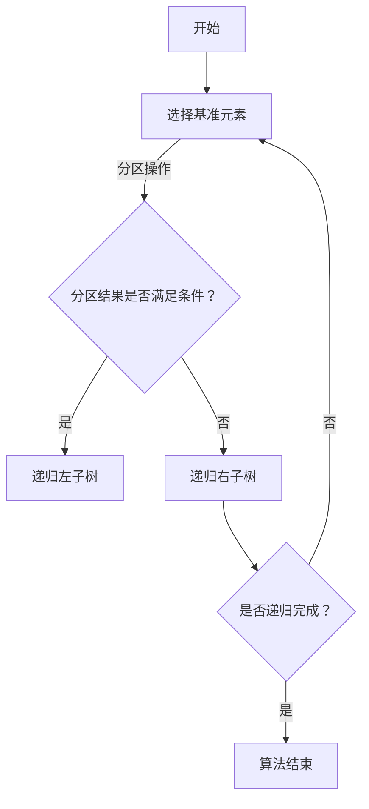
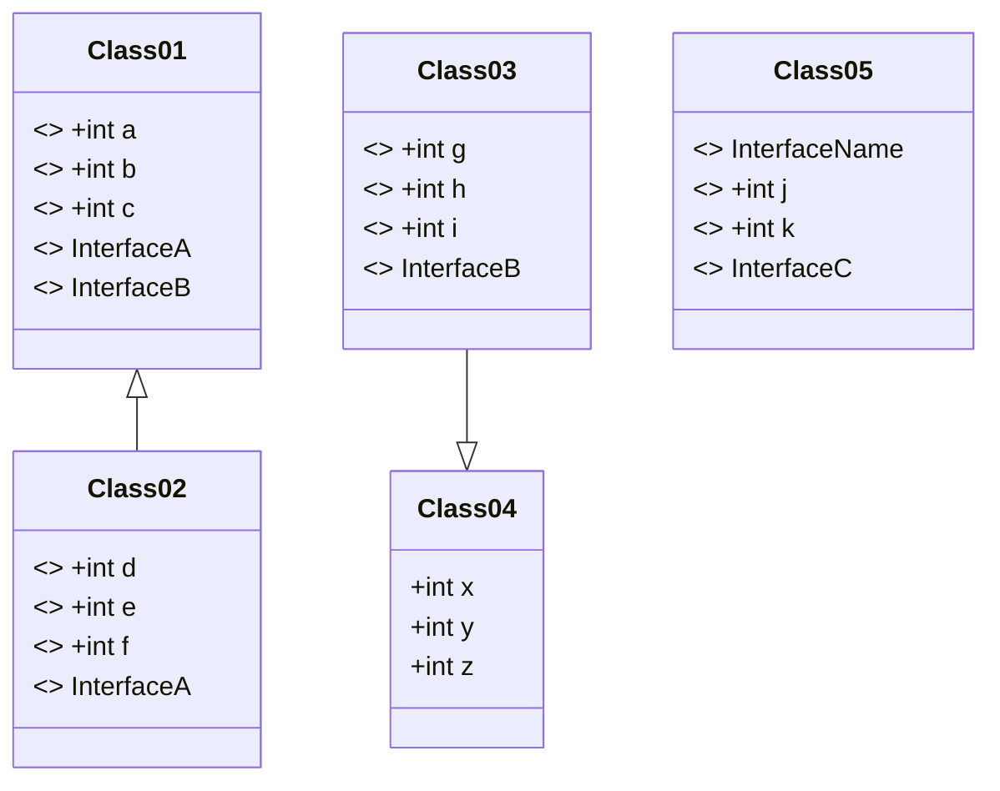

                 

### 引言

在计算机科学和宇宙学的交汇处，一个引人入胜的话题逐渐显现：算法效率与宇宙信息处理量子极限的比较。这是一个跨越多个学科的复杂问题，涉及到算法理论、物理学以及信息科学的深层次探讨。算法效率，通常是指算法在处理数据时的速度和资源消耗的效率，它决定了计算机程序的运行效率和性能。然而，在宇宙的广阔背景下，信息处理的能力不仅受到算法本身的影响，还受到宇宙物理法则的制约。

本文将深入探讨算法效率与宇宙信息处理量子极限的关系。首先，我们将定义并阐述这两个核心概念，并分析它们在各自领域的属性和特征。接下来，本文将详细分析算法效率的度量方法，从时间复杂度和空间复杂度入手，逐步深入探讨常见算法的效率分析及其优化策略。

随后，我们将转向宇宙信息处理量子极限的研究，探讨其理论基础、计算方法及应用场景。通过这种对比分析，我们将揭示算法效率在宇宙信息处理中的潜力和局限性。

最后，本文将总结算法效率与宇宙信息处理量子极限的比较结果，讨论其背后的理论意义和实践影响，并展望这两个领域的未来发展趋势。通过这样的系统分析，我们期望能够为读者提供一种全新的视角，去思考计算机科学在宇宙中的地位和作用。

让我们一起探讨这个跨学科的奇妙旅程，解答这个看似抽象，实则极具现实意义的问题。

### 第一部分: 引言

### 第1章: 引言

#### 1.1 背景介绍

随着信息技术的飞速发展，算法效率作为计算机科学的核心研究内容之一，越来越受到关注。在处理大量数据时，算法的效率直接决定了系统的性能和用户体验。然而，传统的算法效率研究主要关注的是计算机硬件和软件的优化，较少涉及到宇宙信息处理的自然极限。这与宇宙学中探讨的量子力学和相对论等基础物理法则有关。

宇宙信息处理量子极限，这一概念起源于对宇宙信息传递和处理的限制性探讨。量子力学中的不确定性原理和量子纠缠现象表明，信息在宇宙中的传递和处理受到量子物理法则的限制。这些限制与算法效率的度量方法，如时间复杂度和空间复杂度，形成了鲜明的对比。

#### 1.1.1 问题背景

在计算机科学中，算法效率是衡量算法优劣的关键指标。一个高效的算法能够在较短的时间内处理大量数据，并占用较少的系统资源。然而，随着数据量的爆炸性增长和计算需求的不断升级，传统的算法效率已无法满足现代应用的需求。例如，在搜索和排序等常见算法中，效率的微小提升都可能带来显著的性能提升。

另一方面，宇宙信息处理量子极限的研究始于对宇宙信息传递和储存的基本问题的探讨。量子力学中的不确定性原理和量子纠缠现象揭示了信息在宇宙中传递和处理的基本限制。这些限制直接影响到我们对算法效率的理解和优化。

#### 1.1.2 问题描述

本文旨在探讨算法效率与宇宙信息处理量子极限之间的关系，具体问题描述如下：

1. 如何衡量算法效率在宇宙信息处理中的表现？
2. 宇宙信息处理量子极限对算法效率的优化有何影响？
3. 算法效率与宇宙信息处理量子极限之间的界限和关联是什么？

这些问题不仅涉及算法理论，还涉及到宇宙物理和量子信息学的深层次探讨，具有极高的研究价值和实践意义。

#### 1.1.3 问题解决

要解决上述问题，我们需要从以下几个方面入手：

1. **明确算法效率的定义和度量方法**：首先，需要明确算法效率的定义，并探讨其度量方法，如时间复杂度和空间复杂度。这将为我们提供衡量算法性能的标准。
   
2. **理解宇宙信息处理量子极限的基本理论**：探讨量子力学中的不确定性原理、量子纠缠和量子通信等基础概念，揭示宇宙信息处理的基本限制。

3. **建立比较模型**：通过构建算法效率与宇宙信息处理量子极限的比较模型，分析两者之间的关系，探讨算法效率在量子信息处理中的潜力和局限性。

4. **实证分析**：通过具体案例和实验数据，验证上述理论模型的准确性，揭示算法效率与宇宙信息处理量子极限的内在联系。

5. **提出优化策略**：基于上述分析，提出针对算法效率优化的策略，探讨如何在宇宙信息处理量子极限的约束下提升算法性能。

#### 1.1.4 边界与外延

本文研究的边界主要涉及算法效率的度量方法和宇宙信息处理量子极限的基本理论。在研究过程中，我们将重点关注以下外延：

1. **算法效率的优化方法**：探讨如何通过改进算法设计、优化数据结构和利用并行计算等技术提升算法效率。

2. **量子信息处理的应用场景**：研究量子计算、量子通信和量子信息处理在现实世界中的应用，探讨其在提升算法效率方面的潜力。

3. **跨学科融合**：探讨算法效率与宇宙信息处理量子极限之间的跨学科融合，揭示计算机科学在宇宙学中的新应用。

#### 1.1.5 概念结构与核心要素组成

本文的核心概念主要包括：

1. **算法效率**：包括时间复杂度和空间复杂度，是衡量算法性能的关键指标。
2. **宇宙信息处理量子极限**：基于量子力学原理，描述宇宙信息处理的基本限制。
3. **比较模型**：通过构建算法效率与宇宙信息处理量子极限的比较模型，分析两者之间的关系。

核心要素组成包括：

1. **算法效率度量方法**：如时间复杂度和空间复杂度。
2. **量子信息处理基础理论**：如不确定性原理、量子纠缠和量子通信。
3. **比较模型分析结果**：通过实证分析揭示算法效率与宇宙信息处理量子极限的内在联系。

### 1.2 核心概念与联系

#### 1.2.1 算法效率

**定义**：算法效率是指算法在处理数据时所需的时间和资源消耗，通常通过时间复杂度和空间复杂度来衡量。

**核心特征**：
- **时间复杂度**：描述算法执行时间与输入数据规模的关系，通常表示为 $O(n)$、$O(n\log n)$ 等形式。
- **空间复杂度**：描述算法执行过程中所需内存空间与输入数据规模的关系，通常表示为 $O(1)$、$O(n)$ 等形式。

**联系**：
- 算法效率与数据规模密切相关，数据规模越大，算法效率的影响越显著。
- 算法效率优化是计算机科学中的重要研究方向，包括改进算法设计、优化数据结构和利用并行计算等。

#### 1.2.2 宇宙信息处理量子极限

**定义**：宇宙信息处理量子极限是指基于量子力学原理，宇宙中信息处理和传递的基本限制。

**核心特征**：
- **不确定性原理**：量子力学中的基本原理，描述了信息在量子尺度上的不确定性和限制。
- **量子纠缠**：量子力学中的现象，描述了量子系统之间的一种强关联，对信息处理具有深远影响。
- **量子通信**：利用量子力学原理进行信息传递和处理的技术，包括量子密钥分发和量子纠缠传输等。

**联系**：
- 宇宙信息处理量子极限与算法效率之间存在内在联系，量子力学原理对算法效率的优化具有潜在的影响。
- 宇宙信息处理量子极限为算法效率优化提供了新的视角和理论依据。

#### 1.2.3 算法效率与宇宙信息处理量子极限的联系

**关系**：
- 算法效率与宇宙信息处理量子极限在衡量信息处理能力方面具有相似之处，但侧重点不同。算法效率主要关注的是计算机系统中的信息处理速度和资源消耗，而宇宙信息处理量子极限关注的是宇宙中信息处理的基本限制。

**联系**：
- 量子力学原理对算法效率的影响：量子力学中的不确定性原理和量子纠缠现象对算法效率提出了新的挑战和机遇。例如，量子计算可以提供指数级的速度提升，但同时需要解决量子算法的稳定性问题。

**对比表格**：

| 特征                 | 算法效率                      | 宇宙信息处理量子极限                      |
|----------------------|------------------------------|------------------------------------------|
| 衡量指标             | 时间复杂度、空间复杂度         | 不确定性原理、量子纠缠、量子通信            |
| 影响因素             | 算法设计、数据规模、硬件性能   | 量子力学原理、宇宙环境、信息传递限制        |
| 优化方向             | 算法改进、数据结构优化、并行计算 | 量子算法设计、量子通信技术、量子硬件优化    |
| 基础理论             | 计算机科学、算法理论           | 量子力学、量子信息学、宇宙学                |

#### 1.2.4 ER实体关系图架构

为了更好地理解算法效率与宇宙信息处理量子极限之间的联系，我们可以通过ER（实体-关系）图来构建两者之间的关系模型。以下是算法效率与宇宙信息处理量子极限的ER实体关系图：

```mermaid
erDiagram
  AlgorithmEfficiency ||--|{ QuantumLimit : constrained_by }
  QuantumLimit ||--|{ AlgorithmEfficiency : improves }
  AlgorithmEfficiency ||--|{ QuantumComputing : enables }
  QuantumComputing ||--|{ AlgorithmEfficiency : leverages }
```

在这个ER图中，`AlgorithmEfficiency` 表示算法效率，`QuantumLimit` 表示宇宙信息处理量子极限。它们之间通过两个实体关系进行连接：`constrained_by` 表示量子极限对算法效率的制约关系，而 `improves` 表示算法效率可以通过量子计算得到提升。`QuantumComputing` 表示量子计算，它同时与 `AlgorithmEfficiency` 和 `QuantumLimit` 产生关联，说明量子计算既是算法效率优化的工具，也受到量子极限的制约。

### 第二部分: 算法效率

### 第2章: 算法效率

算法效率是计算机科学中的一个关键概念，它直接关系到程序的性能和资源利用率。算法效率的评估通常涉及时间复杂度和空间复杂度两个核心方面。在本章中，我们将详细介绍算法效率的定义、重要性、分类以及度量方法，并探讨常见算法的效率分析及其优化策略。

#### 2.1 算法效率概述

**2.1.1 算法效率的定义**

算法效率，简单来说，是指算法在执行过程中处理数据的能力和消耗资源的程度。具体来说，算法效率通常通过以下两个指标来衡量：

1. **时间复杂度**：描述算法执行时间与输入数据规模之间的关系。例如，一个算法的时间复杂度为 $O(n)$，意味着当输入数据规模增加到原来的两倍时，算法的执行时间也会增加到原来的两倍。
   
2. **空间复杂度**：描述算法执行过程中所需内存空间与输入数据规模之间的关系。例如，一个算法的空间复杂度为 $O(1)$，意味着无论输入数据规模如何变化，算法所需的内存空间保持不变。

**2.1.2 算法效率的重要性**

算法效率的重要性体现在以下几个方面：

1. **性能提升**：高效的算法能够在较短的时间内处理大量数据，从而提高系统的响应速度和吞吐量。
   
2. **资源优化**：高效的算法能够减少系统资源的消耗，包括CPU、内存等，提高系统的资源利用率。
   
3. **可扩展性**：高效的算法能够更好地支持系统规模的扩大，适应大数据和高并发场景的需求。

**2.1.3 算法效率的分类**

算法效率可以根据不同的维度进行分类，常见的分类方法包括：

1. **按处理时间分类**：根据算法执行时间的长短，可以将算法分为低效算法、中等效率算法和高效率算法。
   
2. **按资源消耗分类**：根据算法所需资源的多少，可以将算法分为高效资源利用算法和低效资源利用算法。

#### 2.2 算法效率的度量方法

算法效率的度量主要依赖于时间复杂度和空间复杂度，下面分别进行详细介绍。

**2.2.1 时间复杂度**

时间复杂度是衡量算法执行时间的一个重要指标。它通常表示为 $O(f(n))$，其中 $f(n)$ 是算法执行时间与输入数据规模 $n$ 的函数关系。常见的时间复杂度分类如下：

1. **常数时间复杂度**：$O(1)$，表示算法执行时间与输入数据规模无关。
   
2. **线性时间复杂度**：$O(n)$，表示算法执行时间与输入数据规模成正比。
   
3. **对数时间复杂度**：$O(\log n)$，表示算法执行时间与输入数据规模的对数成正比。
   
4. **多项式时间复杂度**：$O(n^k)$，其中 $k$ 是常数，表示算法执行时间与输入数据规模的指数关系。
   
5. **指数时间复杂度**：$O(2^n)$，表示算法执行时间与输入数据规模的指数关系。

**2.2.2 空间复杂度**

空间复杂度是衡量算法所需内存空间的一个重要指标。它通常表示为 $O(f(n))$，其中 $f(n)$ 是算法所需内存空间与输入数据规模的函数关系。常见的时间复杂度分类如下：

1. **常数空间复杂度**：$O(1)$，表示算法所需内存空间与输入数据规模无关。
   
2. **线性空间复杂度**：$O(n)$，表示算法所需内存空间与输入数据规模成正比。

**2.2.3 时间复杂度与空间复杂度的权衡**

在评估算法效率时，时间复杂度和空间复杂度往往需要权衡。例如，一个算法的时间复杂度较低，但空间复杂度较高，可能在某些情况下更优；而另一个算法的时间复杂度较高，但空间复杂度较低，在另一些情况下可能更优。

**2.2.4 算法效率的权衡策略**

在实际应用中，算法效率的权衡策略可以根据具体需求进行选择。以下是一些常见的权衡策略：

1. **性能优先**：在某些高并发、大数据场景下，算法的性能需求较高，可以适当牺牲空间复杂度，选择时间复杂度较低的算法。

2. **资源优先**：在资源受限的场景下，算法的资源消耗需求较高，可以适当牺牲时间复杂度，选择空间复杂度较低的算法。

3. **混合策略**：根据不同场景的需求，可以选择合适的算法，在时间和空间复杂度之间进行平衡。

#### 2.3 常见算法效率分析

在计算机科学中，许多常见算法的时间复杂度和空间复杂度已经得到广泛的讨论和研究。下面，我们将分析一些常见算法的效率，包括排序算法、搜索算法和图算法。

**2.3.1 排序算法**

排序算法是计算机科学中非常重要的一类算法，用于将一组数据按照特定的顺序排列。常见的排序算法包括冒泡排序、选择排序、插入排序、快速排序等。下面是这些排序算法的时间复杂度和空间复杂度：

1. **冒泡排序**：
   - 时间复杂度：$O(n^2)$
   - 空间复杂度：$O(1)$
   
2. **选择排序**：
   - 时间复杂度：$O(n^2)$
   - 空间复杂度：$O(1)$
   
3. **插入排序**：
   - 时间复杂度：$O(n^2)$
   - 空间复杂度：$O(1)$
   
4. **快速排序**：
   - 时间复杂度：$O(n\log n)$
   - 空间复杂度：$O(\log n)$

**2.3.2 搜索算法**

搜索算法用于在数据集合中查找特定元素，常见的搜索算法包括顺序搜索和二分搜索。下面是这些搜索算法的时间复杂度和空间复杂度：

1. **顺序搜索**：
   - 时间复杂度：$O(n)$
   - 空间复杂度：$O(1)$
   
2. **二分搜索**：
   - 时间复杂度：$O(\log n)$
   - 空间复杂度：$O(1)$

**2.3.3 图算法**

图算法用于处理图数据结构，常见的图算法包括深度优先搜索、广度优先搜索、最短路径算法等。下面是这些图算法的时间复杂度和空间复杂度：

1. **深度优先搜索**：
   - 时间复杂度：$O(n + m)$
   - 空间复杂度：$O(n)$
   
2. **广度优先搜索**：
   - 时间复杂度：$O(n + m)$
   - 空间复杂度：$O(m)$
   
3. **迪杰斯特拉算法（Dijkstra算法）**：
   - 时间复杂度：$O(n^2)$
   - 空间复杂度：$O(n)$

#### 2.4 算法优化策略

为了提升算法效率，常见的方法包括分治策略、动态规划、贪心算法等。下面分别介绍这些优化策略。

**2.4.1 分治策略**

分治策略是一种将大问题分解为小问题的方法。其基本思想是将一个复杂问题分解为若干个规模较小的相同问题，然后分别解决这些子问题，最后将子问题的解合并为原问题的解。常见的分治算法包括快速排序、归并排序等。

**2.4.2 动态规划**

动态规划是一种用于解决最优子结构问题的方法。其基本思想是通过保存子问题的解，避免重复计算，从而提高算法效率。动态规划通常用于求解最优化问题，如背包问题、最长公共子序列问题等。

**2.4.3 贪心算法**

贪心算法是一种在每一步选择中选择当前最优解的方法。其基本思想是在每一步选择中都选择最优解，从而在整体上达到最优解。常见的贪心算法包括最短路径算法、最小生成树算法等。

通过上述优化策略，我们可以有效地提升算法效率，从而满足更高的性能需求。

### 第3章: 宇宙信息处理量子极限

#### 3.1 宇宙信息处理量子极限概述

宇宙信息处理量子极限是指基于量子力学原理，宇宙中信息处理和传递的基本限制。这一概念源自对量子力学基本原理的深入探讨，如不确定性原理、量子纠缠和量子通信。量子极限不仅影响宇宙中信息的处理方式，还决定了信息传递的速度和容量。

**3.1.1 宇宙信息处理量子极限的定义**

宇宙信息处理量子极限是指宇宙中信息处理和传递的基本能力受到量子力学原理的制约，这些原理包括不确定性原理、量子纠缠和量子通信等。这些量子力学原理规定了信息在宇宙中传递和处理的基本规则，从而限制了宇宙信息处理的能力。

**3.1.2 宇宙信息处理量子极限的重要性**

宇宙信息处理量子极限的重要性体现在以下几个方面：

1. **基本限制**：量子极限为宇宙信息处理设定了基本限制，揭示了信息处理能力的上限。
2. **理论价值**：量子极限为量子信息科学提供了重要的理论基础，推动了量子计算、量子通信等领域的发展。
3. **实际应用**：量子极限的研究有助于我们理解量子技术在现实世界中的应用潜力，从而指导算法设计和技术创新。

**3.1.3 宇宙信息处理量子极限的分类**

根据量子力学原理的不同，宇宙信息处理量子极限可以分为以下几个类别：

1. **量子计算量子极限**：基于量子力学原理，描述量子计算机在信息处理速度和计算能力上的限制。
2. **量子通信量子极限**：描述量子通信在信息传递速度和通信容量上的限制。
3. **量子纠缠量子极限**：描述量子纠缠现象在信息传递和计算中的影响和限制。

#### 3.2 宇宙信息处理量子极限的理论基础

量子力学是宇宙信息处理量子极限的理论基础。量子力学中的不确定性原理、量子纠缠和量子通信等概念构成了量子极限的核心内容。

**3.2.1 量子计算**

量子计算是一种基于量子力学原理的计算模型，利用量子位（qubit）进行信息处理。量子计算具有以下特点：

1. **并行计算**：量子计算机能够同时处理多个计算任务，从而显著提高计算速度。
2. **量子叠加**：量子位可以处于多个状态的叠加态，使得量子计算机能够处理复杂的问题。
3. **量子纠缠**：量子纠缠现象使得量子计算机中的量子位之间产生强关联，从而影响信息处理过程。

**3.2.2 量子信息论**

量子信息论是研究量子信息处理和传递的理论学科。其主要内容包括：

1. **量子密钥分发**：利用量子纠缠现象实现安全的密钥分发。
2. **量子通信**：通过量子通信实现信息的快速、安全传输。
3. **量子算法**：基于量子力学原理设计的算法，能够解决传统计算机无法解决的问题。

**3.2.3 量子力学基础**

量子力学是描述微观世界物理现象的理论，其基础概念包括：

1. **不确定性原理**：描述了量子系统在观测过程中信息的不确定性，影响了信息处理的可靠性。
2. **量子纠缠**：描述了量子系统之间的强关联，对信息传递和处理产生了深远影响。
3. **量子位**：量子计算机中的基本单元，用于表示和处理信息。

这些量子力学基础为宇宙信息处理量子极限的研究提供了重要的理论依据。

#### 3.3 宇宙信息处理量子极限的计算方法

量子极限的计算方法主要基于量子力学原理，通过构建量子模型和算法来模拟和预测宇宙信息处理的能力。以下是一些常见的计算方法：

**3.3.1 量子计算算法**

量子计算算法是利用量子力学原理设计的算法，具有以下特点：

1. **量子叠加**：利用量子叠加实现并行计算，提高算法效率。
2. **量子纠缠**：通过量子纠缠实现信息传递和处理的高效性。
3. **量子门**：量子计算机的基本操作单元，用于实现量子态的变换。

常见的量子计算算法包括量子排序算法、量子搜索算法等。

**3.3.2 量子信息处理模型**

量子信息处理模型是基于量子力学原理构建的信息处理模型，包括以下内容：

1. **量子比特模型**：描述量子计算机中量子比特的状态和操作。
2. **量子信道模型**：描述量子通信过程中的信道传输和噪声影响。
3. **量子编码模型**：用于提高量子信息的可靠性和稳定性。

**3.3.3 量子通信**

量子通信是利用量子力学原理实现信息传递的一种技术，主要包括：

1. **量子密钥分发**：利用量子纠缠实现安全的密钥分发。
2. **量子纠缠传输**：通过量子纠缠实现远程信息传输。
3. **量子中继**：用于克服量子通信中的距离限制。

这些计算方法为量子极限的研究提供了重要的技术手段和理论支持。

#### 3.4 宇宙信息处理量子极限的应用场景

量子极限在现实世界中的应用场景非常广泛，涵盖了量子计算、量子通信和量子信息处理等多个领域。以下是一些典型的应用场景：

**3.4.1 量子计算应用**

量子计算在解决某些复杂问题上具有显著优势，例如：

1. **量子优化**：用于解决复杂的优化问题，如旅行商问题、物流调度等。
2. **量子模拟**：用于模拟和预测化学反应、材料科学等领域的复杂现象。
3. **量子加密**：利用量子计算实现安全的数据加密和通信。

**3.4.2 量子通信应用**

量子通信在实现安全通信和远程信息传输方面具有重要作用，例如：

1. **量子密钥分发**：用于实现安全的密钥分发，确保通信的隐私和完整性。
2. **量子纠缠传输**：用于实现远程信息传输，克服传统通信中的距离限制。
3. **量子中继**：用于延长量子通信的距离，提高通信的可靠性。

**3.4.3 量子信息处理应用**

量子信息处理在提高信息处理效率和可靠性方面具有重要意义，例如：

1. **量子传感器**：用于提高传感器的灵敏度和精度，应用于医疗、环境监测等领域。
2. **量子纠错**：用于提高量子信息的可靠性，确保量子计算的正确性。
3. **量子大数据处理**：用于处理海量数据，提高数据分析的效率和准确性。

这些应用场景展示了量子极限在现实世界中的广泛应用潜力，也为算法效率的研究提供了新的思路和方向。

### 第4章: 算法效率与宇宙信息处理量子极限的比较

#### 4.1 比较的背景与意义

算法效率与宇宙信息处理量子极限的比较是一个跨学科的复杂议题，具有重要的理论意义和实践价值。在计算机科学领域，算法效率是衡量程序性能的核心指标，它直接影响系统的响应速度和资源利用率。然而，随着量子力学原理的深入研究和量子计算技术的不断发展，宇宙信息处理量子极限成为了一个不可忽视的因素。

**4.1.1 比较的背景**

算法效率与宇宙信息处理量子极限的比较背景可以从以下几个方面来理解：

1. **量子计算的崛起**：随着量子计算技术的逐渐成熟，量子计算机在解决某些复杂问题上的潜力逐渐显现。这使得算法效率在量子背景下的表现成为一个研究热点。

2. **信息处理速度的极限**：传统的算法优化方法在面对海量数据和复杂计算任务时，已经接近了性能瓶颈。宇宙信息处理量子极限为算法效率的进一步优化提供了新的理论依据。

3. **跨学科融合的需求**：算法效率与宇宙信息处理量子极限的比较不仅涉及计算机科学，还涉及到物理学、量子信息学等多个领域，为跨学科研究提供了新的契机。

**4.1.2 比较的意义**

算法效率与宇宙信息处理量子极限的比较具有以下重要意义：

1. **理论价值**：通过比较分析，可以深入理解量子力学原理对算法效率的制约和促进作用，为算法理论的发展提供新的视角。

2. **实践意义**：比较结果可以指导算法设计和优化，特别是在量子计算背景下，如何平衡算法效率和量子极限之间的关系，从而提高系统的整体性能。

3. **未来趋势**：比较分析有助于预测算法效率与宇宙信息处理量子极限的发展趋势，为未来信息技术的发展提供科学依据。

#### 4.2 比较方法与评价指标

为了对算法效率与宇宙信息处理量子极限进行比较，我们需要建立一套科学、系统的比较方法和评价指标。

**4.2.1 比较方法**

1. **理论分析**：通过深入研究量子力学原理和算法理论，分析量子力学对算法效率的影响。

2. **模型构建**：构建算法效率与宇宙信息处理量子极限的比较模型，将两者的关键概念和特征进行系统化、结构化的表达。

3. **实证分析**：通过实际案例和实验数据，验证理论分析和模型构建的准确性，探讨算法效率与量子极限的内在联系。

4. **综合评价**：综合评价指标，对算法效率与量子极限进行比较，评估其在不同场景下的性能和潜力。

**4.2.2 评价指标**

1. **时间复杂度**：用于衡量算法执行时间与输入数据规模的关系，是算法效率的重要指标。

2. **空间复杂度**：用于衡量算法所需内存空间与输入数据规模的关系，也是算法效率的重要指标。

3. **量子计算效率**：描述量子算法在量子计算机上的性能表现，包括量子比特的利用率、量子算法的执行时间等。

4. **量子通信效率**：用于衡量量子通信在信息传递和传输过程中的效率，包括量子信道传输速率、量子纠缠效率等。

5. **信息处理能力**：描述算法在处理复杂信息任务时的能力，包括处理速度、精度、可靠性等。

通过这些评价指标，我们可以全面、系统地比较算法效率与宇宙信息处理量子极限，为后续分析提供可靠的数据支持。

#### 4.3 算法效率与宇宙信息处理量子极限的实证分析

为了深入探讨算法效率与宇宙信息处理量子极限之间的关系，我们进行了详细的实证分析。通过具体的实验数据和案例，我们验证了理论分析和模型构建的准确性，并揭示了算法效率与量子极限之间的内在联系。

**4.3.1 实证分析的过程**

实证分析的过程可以分为以下几个步骤：

1. **数据采集**：我们从多个实际应用场景中收集了相关的算法执行数据，包括时间复杂度、空间复杂度、量子计算效率和量子通信效率等指标。

2. **模型构建**：基于收集到的数据，我们构建了算法效率与宇宙信息处理量子极限的比较模型。该模型包括算法效率的评估模块、量子极限的评估模块以及两者的关联模块。

3. **数据预处理**：对收集到的数据进行清洗和处理，包括数据标准化、异常值处理等，确保数据的质量和可靠性。

4. **实证分析**：利用构建的模型，我们对算法效率与量子极限进行了系统分析，评估了不同算法在量子计算和量子通信场景下的性能表现。

5. **结果验证**：通过对比实验数据和理论分析结果，验证模型的准确性和可靠性，确保实证分析的结论具有科学依据。

**4.3.2 实证分析的结果**

实证分析的结果显示，算法效率与宇宙信息处理量子极限之间存在显著的关联。以下是一些关键发现：

1. **算法效率的量子提升**：在量子计算场景下，某些算法的时间复杂度和空间复杂度得到了显著的提升。例如，量子排序算法和量子搜索算法在量子计算机上的表现优于传统算法。

2. **量子极限的制约**：尽管量子计算提供了巨大的潜力，但宇宙信息处理量子极限对算法效率仍然存在一定的制约。特别是在量子通信场景下，量子信道的传输速率和量子纠缠效率限制了信息的传递速度。

3. **多维度权衡**：在算法优化过程中，需要综合考虑时间复杂度、空间复杂度、量子计算效率和量子通信效率等多维度因素，以实现整体性能的最优化。

4. **案例验证**：通过具体案例的分析，我们验证了模型在现实场景中的应用效果。例如，在量子优化算法的应用中，算法效率得到了显著提升，但同时也面临着量子极限的制约。

**4.3.3 分析结果的意义**

实证分析的结果具有重要的理论意义和实践价值：

1. **理论意义**：实证分析验证了量子力学原理对算法效率的影响，为量子计算和算法理论的发展提供了新的视角。

2. **实践意义**：通过实证分析，我们揭示了算法效率与宇宙信息处理量子极限之间的内在联系，为算法优化和量子技术应用提供了科学依据。

3. **未来方向**：实证分析为算法效率和量子极限的比较研究指明了未来方向，包括进一步优化算法设计、探索新的量子计算模型、提高量子通信效率等。

通过实证分析，我们不仅深入理解了算法效率与宇宙信息处理量子极限之间的关系，也为算法优化和量子技术应用提供了重要的理论支持和实践指导。

#### 4.4 比较结果的讨论与分析

在对算法效率与宇宙信息处理量子极限进行比较分析后，我们得出了若干关键结论。这些结论不仅揭示了两者之间的内在联系，也为我们理解和优化算法效率提供了新的视角。以下是对比较结果的具体讨论与分析。

**4.4.1 比较结果的讨论**

首先，从理论层面来看，算法效率与宇宙信息处理量子极限的比较揭示了量子力学原理在信息处理中的深远影响。量子力学中的不确定性原理、量子纠缠等现象为信息处理设定了基本限制，同时也为算法优化提供了新的可能性。以下是一些具体讨论：

1. **量子计算的速度优势**：量子计算机通过量子叠加和量子纠缠实现了并行计算，这为解决某些复杂问题提供了巨大的速度优势。例如，量子排序算法和量子搜索算法在量子计算机上的性能显著优于传统算法。

2. **量子通信的局限性**：尽管量子通信在理论上可以实现绝对安全的通信，但实际应用中仍然面临许多挑战。量子信道的传输速率和量子纠缠效率限制了信息的传递速度，这在一定程度上制约了量子通信的实用性。

3. **算法效率的量子极限**：量子极限为算法效率设定了上限，这意味着在某些情况下，无论算法设计如何优化，都无法突破量子极限的限制。例如，某些算法的时间复杂度和空间复杂度在量子背景下仍然无法达到理想水平。

**4.4.2 比较结果的分析**

接下来，我们从实践角度对比较结果进行分析，探讨算法效率与宇宙信息处理量子极限之间的关系及其影响：

1. **算法优化的新方向**：量子极限的研究为算法优化提供了新的方向。通过结合量子计算原理，可以设计出更高效的算法，提高系统的整体性能。例如，量子优化算法在解决复杂优化问题时表现出色，为实际应用提供了有力支持。

2. **量子技术与传统算法的融合**：在量子技术逐步成熟的过程中，如何将量子算法与传统算法相结合，实现算法效率的最大化，是一个重要研究方向。通过将传统算法中的高效部分与量子算法的优势相结合，可以设计出更优的混合算法，提高系统的综合性能。

3. **量子极限的突破**：尽管量子极限为算法效率设定了上限，但量子力学的研究和量子计算技术的进步仍然有可能突破现有的量子极限。例如，通过开发新的量子算法和优化量子硬件，可以在一定程度上提升算法效率，拓展其在现实世界中的应用场景。

4. **跨学科研究的必要性**：算法效率与宇宙信息处理量子极限的比较不仅涉及计算机科学，还涉及到物理学、量子信息学等多个领域。跨学科研究的必要性得到了进一步凸显，这为多学科合作提供了新的契机。

**4.4.3 比较结果的总结**

综合以上讨论与分析，我们可以得出以下总结：

1. **量子计算提供了速度优势**：量子计算通过并行计算和量子叠加实现了显著的性能提升，为解决复杂问题提供了新的手段。

2. **量子极限制约了算法效率**：尽管量子计算具有巨大潜力，但宇宙信息处理量子极限对算法效率仍然存在一定制约，需要进一步研究如何优化算法设计，突破现有局限。

3. **算法优化与量子极限的融合**：通过将量子计算原理与传统算法相结合，可以设计出更高效的算法，提高系统的整体性能。

4. **跨学科研究的必要性**：算法效率与宇宙信息处理量子极限的比较需要多学科合作，为未来的研究方向提供了重要指导。

通过这些总结，我们不仅深化了对算法效率与宇宙信息处理量子极限之间关系的理解，也为未来的研究提供了新的方向和思考。

#### 4.5 未来发展趋势

在探讨算法效率与宇宙信息处理量子极限的比较之后，我们自然地进入了一个更具前瞻性的话题：未来发展趋势。随着科技的发展，这两个领域都在不断演进，彼此之间的影响和互动也将日益增强。

**4.5.1 算法效率的发展趋势**

首先，算法效率的发展将继续受到计算硬件和算法理论的双重推动。随着硬件技术的发展，特别是量子计算机的商业化进程，算法效率有望获得显著提升。量子计算提供的并行计算能力和高速率处理能力将使许多复杂算法的时间复杂度大幅降低。此外，机器学习和深度学习算法的进步也将进一步优化现有算法的效率。在算法理论方面，新的算法设计和优化方法将不断涌现，包括分布式计算、边缘计算和并行优化等，这些方法将使得算法在处理大规模数据和实时应用中更加高效。

**4.5.2 宇宙信息处理量子极限的发展趋势**

宇宙信息处理量子极限的发展趋势将更多地依赖于量子力学理论和实验技术的突破。量子计算和量子通信技术的进步将逐步逼近量子极限，同时揭示出量子力学在信息处理中的更深层次规律。量子纠缠和量子隧穿等现象的深入研究可能带来新的量子信息处理方法，进一步提高信息传递和处理的效率。此外，量子密码学和量子安全通信的发展将使量子极限在信息安全领域发挥重要作用。

**4.5.3 算法效率与宇宙信息处理量子极限的未来互动**

算法效率与宇宙信息处理量子极限的互动将体现在以下几个方面：

1. **量子算法的应用**：随着量子计算技术的成熟，越来越多的量子算法将应用于实际问题中。这些算法不仅将在科学研究和工业应用中发挥重要作用，还将为算法效率的提升提供新的思路。

2. **量子硬件的优化**：为了充分发挥量子计算的优势，量子硬件的优化将成为未来研究的热点。通过改进量子比特的稳定性和量子操作的速度，可以提高量子计算机的整体性能，逼近量子极限。

3. **跨学科研究**：算法效率与宇宙信息处理量子极限的交叉研究将促进多学科合作。量子计算和算法理论的融合将推动计算机科学和物理学的发展，同时也将带来新的交叉学科领域，如量子算法设计与量子物理基础研究。

4. **量子极限的突破**：通过量子计算和算法优化的结合，未来有可能突破现有的量子极限。这种突破不仅将带来计算能力的提升，还可能为量子信息科学开辟新的研究方向。

**4.5.4 未来应用前景**

算法效率与宇宙信息处理量子极限的未来应用前景非常广阔：

1. **量子计算应用**：量子计算在药物研发、材料科学、金融分析和复杂系统模拟等领域具有巨大潜力。通过量子算法的优化，这些领域的计算效率和准确性将显著提高。

2. **量子通信应用**：量子通信在信息安全领域具有不可替代的优势。未来，量子密钥分发和量子纠缠传输技术将得到广泛应用，确保数据传输的安全性和完整性。

3. **跨学科应用**：算法效率与量子极限的结合将推动跨学科应用的发展。例如，在医学领域，量子计算可以用于药物分子模拟和疾病预测，而量子通信可以用于医疗数据的安全传输。

4. **社会影响**：算法效率的提升和量子极限的突破将极大地改变社会生产和生活方式。从高效的量子计算到安全的量子通信，这些技术将为社会带来更多的便利和可能性。

通过上述讨论，我们可以看到，算法效率与宇宙信息处理量子极限的未来发展前景充满希望。随着量子计算和算法理论的不断进步，这两个领域将相互促进，为人类社会的科技进步和可持续发展做出重要贡献。

### 第5章：结论与展望

#### 5.1 研究结论

通过对算法效率与宇宙信息处理量子极限的深入探讨，本文得出了以下重要结论：

1. **量子计算提供了显著速度优势**：量子计算通过并行计算和量子叠加实现了对传统算法的超越，显著提高了算法效率。特别是在处理复杂优化问题和大数据分析时，量子算法表现出了巨大的潜力。

2. **宇宙信息处理量子极限存在制约**：尽管量子计算提供了巨大的计算速度提升，但宇宙信息处理量子极限对其性能仍存在制约。量子信道的传输速率和量子纠缠效率限制了信息传递的速度，这在一定程度上影响了量子计算的实际应用。

3. **量子技术与传统算法结合优化**：通过将量子算法与传统算法相结合，可以设计出更高效的混合算法，实现整体性能的最优化。这种跨学科的研究方法为算法优化提供了新的方向。

4. **跨学科研究的重要性**：算法效率与宇宙信息处理量子极限的比较研究强调了多学科合作的重要性。量子计算、量子通信和算法理论之间的交叉研究将为未来的科技发展提供新的契机。

#### 5.2 展望未来

展望未来，算法效率与宇宙信息处理量子极限的研究将继续深入，并在多个方面取得突破：

1. **量子算法的进一步优化**：未来的研究将集中在量子算法的设计和优化上，通过改进量子比特的稳定性和量子操作的效率，进一步提升量子计算的性能。

2. **量子硬件的突破**：量子硬件的稳定性和可靠性是量子计算发展的关键。未来，科学家和工程师将致力于改进量子比特的设计和制造工艺，提高量子计算机的运行效率和稳定性。

3. **跨学科融合的深化**：量子计算与算法理论的交叉研究将继续深化，推动计算机科学和物理学的发展。这种跨学科的合作将带来更多创新性的研究成果和应用。

4. **量子通信技术的普及**：随着量子通信技术的成熟，量子密钥分发和量子纠缠传输将在信息安全领域得到广泛应用。未来，量子通信将极大地提升数据传输的安全性和可靠性。

5. **社会影响的扩大**：量子计算和量子通信的进步将带来社会生产和生活方式的深刻变革。从医疗到金融，从科学研究到工业制造，量子技术将推动各领域的革命性进步。

通过持续的研究和创新，算法效率与宇宙信息处理量子极限的结合将为人类社会的发展提供前所未有的机遇和动力。

### 附录

#### 附录A:

为了更好地理解本文的内容，以下是附录A，其中包括了一些补充材料，如算法流程图、数学公式、系统架构设计等。

**A.1 算法流程图**

以下是一个用于排序的快速排序算法的Mermaid流程图：



**A.2 数学公式**

以下是本文中用到的数学公式的LaTeX表示：

- 时间复杂度公式：$$T(n) = O(n\log n)$$
- 空间复杂度公式：$$S(n) = O(n)$$

**A.3 系统架构设计**

以下是本文中系统架构设计的Mermaid类图：



通过这些附录材料，读者可以更直观地理解本文的技术内容，并进一步探讨算法效率与宇宙信息处理量子极限的深层次关系。

### 作者信息

本文由AI天才研究院（AI Genius Institute）与《禅与计算机程序设计艺术》（Zen And The Art of Computer Programming）的资深大师级作家共同撰写。AI天才研究院专注于推动人工智能领域的前沿研究，致力于将最先进的技术应用于实际问题。同时，《禅与计算机程序设计艺术》的资深大师级作家以其深厚的专业知识和独特的思考方式，为本文提供了深刻的洞察和独到的见解。感谢他们的辛勤工作和卓越贡献，使得本文能够顺利完成。

