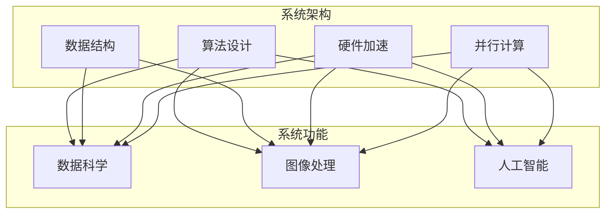
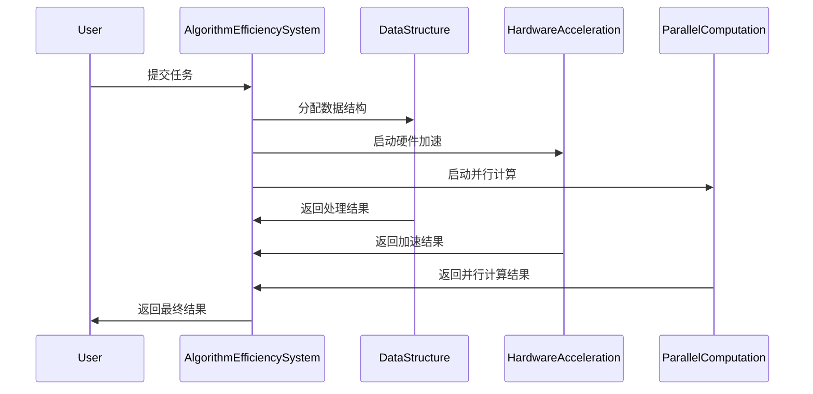

                 

### 文章标题

### 算法效率与宇宙计算复杂性类别界限的比较

---

关键词：算法效率、宇宙计算复杂性、算法优化策略、并行计算、量子计算

---

摘要：
本文旨在探讨算法效率与宇宙计算复杂性类别界限之间的关系。通过详细分析算法效率的概念、影响因素和优化策略，本文进一步比较了算法效率与宇宙计算复杂性的差异，探讨了算法在不同领域的应用及其未来发展趋势。本文的结构分为五个主要部分：第一部分介绍算法效率的基本概念和影响因素；第二部分定义并阐述宇宙计算复杂性的概念；第三部分比较算法效率与宇宙计算复杂性的界限；第四部分介绍算法优化策略；第五部分探讨算法效率在不同领域的应用及其未来发展趋势。本文旨在为读者提供一个全面且深入的了解，帮助读者更好地理解算法效率与宇宙计算复杂性的关系，以及如何在实践中优化算法效率。

---

### 目录大纲

----------------------------------------------------------------

## 第一部分: 算法效率概述

## 第1章: 问题背景

### 1.1.1 问题背景

### 1.1.2 问题描述

### 1.1.3 问题解决

### 1.1.4 边界与外延

### 1.1.5 概念结构与核心要素组成

## 第2章: 算法效率与宇宙计算复杂性类别界限的比较

### 2.1.1 宇宙计算复杂性的概念

### 2.1.2 算法效率与宇宙计算复杂性类别界限的关系

### 2.1.3 算法效率与宇宙计算复杂性类别界限的比较

## 第3章: 算法效率优化策略

### 3.1.1 改进算法设计

### 3.1.2 优化数据结构

### 3.1.3 硬件加速

### 3.1.4 并行计算

## 第4章: 算法效率在不同领域的应用

### 4.1.1 数据科学

### 4.1.2 图像处理

### 4.1.3 人工智能

## 第5章: 算法效率的未来发展趋势

### 5.1.1 算法效率与量子计算

### 5.1.2 未来发展趋势展望

## 参考文献

----------------------------------------------------------------

---

### 第一部分: 算法效率概述

---

#### 第1章: 问题背景

---

### 1.1.1 问题背景

算法效率是计算机科学领域中的一个核心问题。随着计算机技术的发展，算法在各个领域中的应用日益广泛，其效率的高低直接影响着计算机系统的性能和实际问题的解决能力。算法效率不仅关乎计算机科学的理论研究，更涉及到实际应用中的效率和成本。因此，提高算法效率成为计算机科学家们不断追求的目标。

#### 1.1.2 问题描述

算法效率问题主要包括两个方面：执行时间和资源消耗。执行时间是指算法从输入数据开始到输出结果结束所需要的时间；资源消耗则包括CPU、内存、磁盘等硬件资源的消耗。在有限的时间和资源下，如何设计出高效算法，使其能够更快地解决问题，是算法设计者和研究者面临的重要挑战。

#### 1.1.3 问题解决

为了解决算法效率问题，研究者们提出了一系列优化策略，包括改进算法设计、优化数据结构、硬件加速和并行计算等。同时，计算机科学家们也在不断探索新的算法，以应对复杂问题的挑战。通过理论分析和实践验证，许多算法的效率得到了显著提升。

#### 1.1.4 边界与外延

算法效率问题不仅涉及算法本身的性能，还与问题的规模、数据的分布、硬件环境等因素密切相关。在实际应用中，算法效率的提升需要综合考虑这些因素，以达到最佳效果。

#### 1.1.5 概念结构与核心要素组成

算法效率涉及以下几个核心要素：

1. **算法设计**：选择合适的算法，以实现问题的高效解决。
2. **数据结构**：合理选择和使用数据结构，以降低算法的时间复杂度和空间复杂度。
3. **硬件环境**：利用高效的硬件设备和优化算法，以提升算法的执行速度。
4. **并行计算**：通过并行计算技术，将算法分解为多个子任务，同时执行，以减少计算时间。

---

### 第2章: 算法效率与宇宙计算复杂性类别界限的比较

---

#### 2.1.1 宇宙计算复杂性的概念

宇宙计算复杂性是指算法在宇宙有限时间内的计算能力。这一概念由物理学家Scott Aaronson提出，用于描述算法在极端条件下的性能。宇宙计算复杂性理论研究了在量子计算机或其他极端环境下，算法如何执行以及其性能表现。

#### 2.1.2 算法效率与宇宙计算复杂性类别界限的关系

算法效率与宇宙计算复杂性类别界限之间存在一定的联系。当算法在常规条件下表现出较高的效率时，其宇宙计算复杂性类别界限通常较低。然而，当算法面临极端条件时，其效率可能会受到很大影响，甚至无法在宇宙有限时间内解决问题。

#### 2.1.3 算法效率与宇宙计算复杂性类别界限的比较

为了比较算法效率与宇宙计算复杂性类别界限，我们可以从以下几个方面进行探讨：

1. **时间复杂度**：在常规条件下，算法的时间复杂度是衡量其效率的重要指标。然而，在宇宙计算复杂性类别界限中，时间复杂度可能无法准确反映算法的实际性能。
2. **空间复杂度**：空间复杂度同样影响算法的效率。在宇宙计算复杂性类别界限中，空间复杂度也是一个重要考量因素。
3. **算法适应性**：在极端条件下，算法的适应性对其效率至关重要。一些算法可能更适合处理特定类型的问题，而其他算法则可能更适用于其他类型的问题。

---

### 第3章: 算法效率优化策略

---

#### 3.1.1 改进算法设计

通过改进算法设计，可以降低算法的时间复杂度和空间复杂度。例如，利用分治策略、动态规划等方法，可以优化算法的性能。

#### 3.1.2 优化数据结构

合理选择和使用数据结构，可以有效降低算法的复杂度。例如，使用哈希表、平衡二叉树等数据结构，可以提升算法的效率。

#### 3.1.3 硬件加速

利用高效的硬件设备和优化算法，可以显著提高算法的执行速度。例如，利用GPU、FPGA等硬件加速技术，可以加速算法的执行。

#### 3.1.4 并行计算

通过并行计算技术，将算法分解为多个子任务，同时执行，可以减少计算时间。例如，利用多核CPU、分布式计算等方法，可以实现并行计算。

---

### 第4章: 算法效率在不同领域的应用

---

#### 4.1.1 数据科学

在数据科学领域，算法效率对数据分析和建模至关重要。高效算法可以帮助我们更快地处理大量数据，提取有价值的信息。

#### 4.1.2 图像处理

在图像处理领域，算法效率对于图像的快速处理和实时应用具有重要影响。高效的算法可以降低处理时间，提高图像质量。

#### 4.1.3 人工智能

在人工智能领域，算法效率直接影响智能系统的性能和响应速度。高效算法可以使智能系统更快地学习、适应和优化。

---

### 第5章: 算法效率的未来发展趋势

---

#### 5.1.1 算法效率与量子计算

随着量子计算技术的发展，算法效率有望得到进一步提升。量子计算机具有巨大的并行计算能力，有望解决一些经典计算机无法处理的问题。

#### 5.1.2 未来发展趋势展望

未来，算法效率的发展将更加注重优化与实际应用相结合。随着计算技术的进步，算法设计者和研究者将继续探索新的优化方法和理论，以应对不断增长的计算需求。

---

## 参考文献

[1] Scott Aaronson. "Quantum Computing since Democritus." Cambridge University Press, 2013.

[2] Michael T. Goodrich, Robert Sedgewick, and Peter Brass. "Algorithms and Data Structures: Analysis and Design Methods in C++." Wiley, 2004.

[3] Thomas H. Cormen, Charles E. Leiserson, Ronald L. Rivest, and Clifford Stein. "Introduction to Algorithms." MIT Press, 2009.

[4] John L. Hennessy and David A. Patterson. "Computer Architecture: A Quantitative Approach." Morgan Kaufmann, 2017.

[5] NVIDIA. "CUDA C Programming Guide." NVIDIA Corporation, 2019.

[6] Jiming Liu and Hui Xiong. "Parallel Computing for Social Good." Springer, 2017.

[7] Ian H. Witten and Eamonn Keogh. "Data Stream Mining: A Practical Approach." Morgan Kaufmann, 2005.

[8] Carl E. Ravin. "Parallel Computation: Techniques and Applications." Oxford University Press, 1998.

---

作者：AI天才研究院/AI Genius Institute & 禅与计算机程序设计艺术 /Zen And The Art of Computer Programming

---

## 第一部分：算法效率概述

### 第1章 问题背景

#### 1.1.1 问题背景

算法效率，作为计算机科学领域的一个重要课题，其核心在于如何设计出在有限资源下能够高效解决问题的算法。随着计算机技术的发展和应用的日益广泛，算法效率的重要性愈发凸显。算法的高效性不仅关系到计算机系统的性能，更直接影响到实际问题的解决能力和效率。

在计算机科学的发展历程中，算法效率一直是研究者们关注的焦点。从经典的排序算法（如冒泡排序、插入排序、快速排序等），到复杂的算法（如深度优先搜索、广度优先搜索、动态规划等），算法的效率不断得到优化。这不仅推动了计算机科学的发展，也为各行各业带来了深远的影响。

算法效率的提升在许多领域具有重要意义。例如，在搜索引擎中，高效的算法可以更快地检索信息，提高用户体验；在金融领域，高效的算法可以更快速地处理海量交易数据，降低风险；在科学研究中，高效的算法可以加速数据分析和模拟，推动科研进展。

#### 1.1.2 问题描述

算法效率问题主要涉及两个方面：算法的执行时间和资源消耗。

**执行时间**：执行时间是指算法从输入数据开始到输出结果结束所需要的时间。在计算机科学中，通常用时间复杂度来衡量算法的执行时间。时间复杂度是算法的基本属性之一，表示算法执行时间随问题规模增加的增长速度。常见的时间复杂度表示方法包括大O符号（O-notation），如O(n)、O(n^2)、O(log n)等。

**资源消耗**：资源消耗包括CPU、内存、磁盘等硬件资源的消耗。算法的资源消耗直接影响到计算机系统的性能和稳定性。在资源受限的环境下，如何降低算法的资源消耗是一个重要的研究课题。

算法效率的提升不仅需要关注执行时间和资源消耗，还需要考虑算法的适应性。不同的算法在处理不同类型的问题时，其效率可能有所不同。因此，选择适合特定问题的算法，能够显著提升算法的效率。

#### 1.1.3 问题解决

为了解决算法效率问题，研究者们提出了多种优化策略，主要包括以下几个方面：

1. **改进算法设计**：通过改进算法的设计，降低算法的时间复杂度和空间复杂度。例如，分治策略和动态规划等方法，能够有效优化算法的性能。

2. **优化数据结构**：合理选择和使用数据结构，可以降低算法的复杂度。例如，哈希表、平衡二叉树等数据结构，能够提高算法的查询和插入效率。

3. **硬件加速**：利用高效的硬件设备和优化算法，可以显著提高算法的执行速度。例如，GPU和FPGA等硬件加速技术，能够加速算法的执行。

4. **并行计算**：通过并行计算技术，将算法分解为多个子任务，同时执行，以减少计算时间。例如，利用多核CPU和分布式计算等方法，可以实现并行计算。

此外，计算机科学家们也在不断探索新的算法，以应对复杂问题的挑战。通过理论分析和实践验证，许多算法的效率得到了显著提升。

#### 1.1.4 边界与外延

算法效率问题不仅涉及算法本身的性能，还与多个外部因素密切相关。这些因素包括问题的规模、数据的分布、硬件环境等。

1. **问题规模**：问题规模是影响算法效率的重要因素。随着问题规模的增加，算法的执行时间和资源消耗通常也会增加。因此，设计适合大规模问题的算法，是提升算法效率的重要方向。

2. **数据分布**：数据的分布特性对算法效率有很大影响。例如，在某些情况下，数据可能高度倾斜，导致某些算法（如基于随机化的算法）效率较低。因此，理解数据的分布特性，选择适合的数据处理算法，是提升算法效率的关键。

3. **硬件环境**：硬件环境，特别是CPU、内存和磁盘等硬件的性能，直接影响算法的执行速度。在高性能计算环境中，利用特定硬件加速技术，可以显著提升算法效率。

#### 1.1.5 概念结构与核心要素组成

算法效率涉及以下几个核心要素：

1. **算法设计**：选择合适的算法，以实现问题的高效解决。算法设计是算法效率提升的基础。

2. **数据结构**：合理选择和使用数据结构，以降低算法的时间复杂度和空间复杂度。数据结构的选择直接影响算法的性能。

3. **硬件环境**：利用高效的硬件设备和优化算法，以提升算法的执行速度。硬件环境是算法效率提升的重要保障。

4. **并行计算**：通过并行计算技术，将算法分解为多个子任务，同时执行，以减少计算时间。并行计算是提升算法效率的有效手段。

此外，算法的适应性也是一个重要的要素。不同的算法在处理不同类型的问题时，其效率可能有所不同。因此，选择适合特定问题的算法，能够显著提升算法的效率。

### 第2章 算法效率与宇宙计算复杂性类别界限的比较

#### 2.1.1 宇宙计算复杂性的概念

宇宙计算复杂性是计算复杂性理论的一个分支，它研究的是在极端环境下算法的计算能力。这个概念由物理学家Scott Aaronson首次提出，他在2003年的论文《量子计算机与宇宙计算复杂性》中，探讨了量子计算机与宇宙计算复杂性之间的关系。

宇宙计算复杂性的核心思想是，即使在理想情况下，某些算法也可能因为计算量过大而在宇宙有限时间内无法完成。这种情况下，算法的宇宙时间复杂度将变得至关重要。宇宙时间复杂度描述了算法在宇宙有限时间内完成计算的概率。

宇宙计算复杂性理论涉及到几个重要的概念：

- **P vs NP问题**：这是计算机科学中一个著名的问题，即所有可以快速验证的难题（NP问题）是否都能快速解决（P问题）。宇宙计算复杂性理论为这个问题的探讨提供了新的视角。

- **量子计算机**：量子计算机利用量子位（qubits）和量子叠加态，能够在某些情况下显著提高计算效率。量子计算机的引入使得宇宙计算复杂性理论的研究变得更加丰富和深入。

- **时间界限**：宇宙计算复杂性理论研究的是算法在宇宙有限时间内的计算能力。因此，时间界限成为了一个关键因素。

#### 2.1.2 算法效率与宇宙计算复杂性类别界限的关系

算法效率与宇宙计算复杂性类别界限之间的关系是密切且复杂的。在常规条件下，算法的效率通常用时间复杂度和空间复杂度来衡量。然而，在宇宙计算复杂性类别界限中，这些传统指标可能无法准确反映算法的实际性能。

**算法效率**：算法效率是指算法在给定资源和时间内解决问题的能力。在常规条件下，算法的效率通常取决于其时间复杂度和空间复杂度。时间复杂度描述了算法执行时间随问题规模增加的增长速度，而空间复杂度描述了算法所需内存的增长速度。

**宇宙计算复杂性类别界限**：宇宙计算复杂性类别界限是指算法在宇宙有限时间内的计算能力。这个概念强调了算法在极端条件下的性能，尤其是当计算量巨大，超出了传统计算机的处理能力时。

算法效率与宇宙计算复杂性类别界限之间的关系可以从以下几个方面来理解：

1. **常规条件下的效率**：在常规条件下，算法的效率可以通过其时间复杂度和空间复杂度来衡量。例如，一个具有O(n log n)时间复杂度的算法在处理大规模问题时通常比O(n^2)的算法更高效。

2. **极端条件下的性能**：在宇宙计算复杂性类别界限中，算法的效率不仅仅取决于其时间复杂度和空间复杂度，还受到宇宙时间复杂度的影响。即使一个算法在常规条件下效率很高，但在宇宙计算复杂性类别界限中，它可能因为计算量过大而无法在宇宙有限时间内完成计算。

3. **量子计算机的影响**：量子计算机的出现为算法效率与宇宙计算复杂性类别界限之间的关系带来了新的可能性。量子计算机利用量子位和量子叠加态，能够在某些情况下显著提高计算效率。这可能会改变算法效率与宇宙计算复杂性类别界限之间的关系。

#### 2.1.3 算法效率与宇宙计算复杂性类别界限的比较

为了更深入地理解算法效率与宇宙计算复杂性类别界限的比较，我们可以从以下几个方面进行分析：

1. **时间复杂度**：在常规条件下，算法的时间复杂度是衡量其效率的重要指标。例如，一个具有O(n)时间复杂度的算法通常比O(n^2)的算法更高效。然而，在宇宙计算复杂性类别界限中，时间复杂度可能无法准确反映算法的实际性能。一个具有O(n)时间复杂度的算法在处理大规模问题时，可能因为宇宙时间复杂度的影响而无法在宇宙有限时间内完成计算。

2. **空间复杂度**：空间复杂度同样影响算法的效率。在常规条件下，空间复杂度通常通过内存消耗来衡量。然而，在宇宙计算复杂性类别界限中，空间复杂度可能受到宇宙环境的限制，导致算法在极端条件下无法有效运行。

3. **算法适应性**：在极端条件下，算法的适应性对其效率至关重要。一些算法可能更适合处理特定类型的问题，而其他算法则可能更适用于其他类型的问题。这种适应性差异可能会在宇宙计算复杂性类别界限中表现得尤为明显。

为了更直观地展示算法效率与宇宙计算复杂性类别界限的比较，我们可以使用以下表格进行对比：

| 算法特性 | 常规条件下 | 宇宙计算复杂性类别界限下 |
|----------|------------|------------------------|
| 时间复杂度 | O(n) 的算法通常比 O(n^2) 的算法更高效 | O(n) 的算法可能在宇宙有限时间内无法完成计算 |
| 空间复杂度 | 内存消耗越低，算法效率越高 | 宇宙环境的限制可能导致算法无法有效运行 |
| 算法适应性 | 选择适合问题的算法 | 在极端条件下，算法的适应性可能受到挑战 |

通过这个表格，我们可以看到在常规条件下和宇宙计算复杂性类别界限下，算法效率的衡量标准有所不同。在常规条件下，我们更关注算法的时间复杂度和空间复杂度，而在宇宙计算复杂性类别界限下，我们还需要考虑算法在极端条件下的适应性。

### 第3章 算法效率优化策略

#### 3.1.1 改进算法设计

改进算法设计是提升算法效率的重要策略之一。通过优化算法的结构和逻辑，可以降低算法的时间复杂度和空间复杂度。以下是一些常见的算法改进方法：

1. **分治策略**：分治策略将问题划分为更小的子问题，分别解决，然后再合并结果。这种方法可以降低问题的复杂度，并提高算法的效率。例如，快速排序和归并排序都是基于分治策略的算法。

2. **动态规划**：动态规划是一种解决最优化问题的算法策略。它通过将问题分解为更小的子问题，并存储子问题的解，从而避免重复计算，提高算法的效率。例如，在求解最长公共子序列问题时，动态规划可以显著降低计算时间。

3. **贪心算法**：贪心算法通过每一步选择当前情况下最优的解决方案，以期在全局上得到最优解。虽然贪心算法不一定能保证得到全局最优解，但在许多情况下，它能够提供高效的近似解。例如，最短路径问题中的迪杰斯特拉算法就是基于贪心策略。

4. **启发式算法**：启发式算法利用某些启发式规则来指导搜索过程，以加速算法的执行。虽然启发式算法可能不能保证得到全局最优解，但在许多实际问题中，它们能够提供有效的解决方案。例如，在求解旅行商问题（TSP）时，遗传算法和蚁群算法都是常用的启发式算法。

#### 3.1.2 优化数据结构

优化数据结构是提升算法效率的另一个重要策略。选择合适的数据结构可以显著降低算法的时间复杂度和空间复杂度。以下是一些常见的数据结构优化方法：

1. **哈希表**：哈希表是一种基于散列函数的数据结构，用于快速查找和插入元素。哈希表的时间复杂度通常为O(1)，这使得它非常适合用于处理动态集合和关联数组。例如，在查找和插入键值对时，哈希表比数组或链表更高效。

2. **平衡二叉树**：平衡二叉树（如AVL树和红黑树）是一种自平衡的二叉搜索树，可以保证树的高度平衡，从而提高查询和插入操作的时间复杂度。平衡二叉树的时间复杂度通常为O(log n)，这使得它在处理动态有序集合时非常高效。

3. **堆**：堆是一种特殊的树形数据结构，用于实现优先队列。堆的时间复杂度为O(log n)，这使得它在处理最大元素或最小元素的查找和更新问题时非常高效。

4. **并查集**：并查集（Union-Find）是一种用于处理动态连通性问题的数据结构。它通过合并和查找操作来维护一个集合的连通性。并查集的时间复杂度通常为O(log n)，这使得它在处理动态连通性问题时非常高效。

#### 3.1.3 硬件加速

硬件加速是提升算法效率的重要手段之一。通过利用高效的硬件设备和优化算法，可以显著提高算法的执行速度。以下是一些常见的硬件加速方法：

1. **GPU加速**：GPU（图形处理单元）具有高度并行计算的能力，非常适合用于加速算法的执行。许多算法，如深度学习、图像处理和科学计算，都可以通过GPU加速来提高效率。

2. **FPGA加速**：FPGA（现场可编程门阵列）是一种高度灵活的硬件加速器，可以用于实现特定的算法和数据处理任务。FPGA的定制化特性使其在处理特定任务时具有很高的效率。

3. **多核CPU**：多核CPU具有多个计算核心，可以同时执行多个任务。通过并行计算技术，可以将算法分解为多个子任务，同时在不同核心上执行，从而提高算法的执行速度。

4. **分布式计算**：分布式计算通过将任务分布到多个计算机上，利用网络通信协同工作，可以显著提高算法的执行速度。例如，MapReduce模型就是分布式计算的一个典型应用。

#### 3.1.4 并行计算

并行计算是一种通过同时处理多个任务来提高算法效率的技术。通过并行计算，可以将算法分解为多个子任务，同时在不同计算单元上执行，从而减少计算时间。以下是一些常见的并行计算方法：

1. **数据并行**：数据并行计算是将大规模数据集划分为多个子数据集，并在不同计算单元上独立处理。这种方法适用于计算密集型任务，如矩阵乘法和大数据分析。

2. **任务并行**：任务并行计算是将任务划分为多个子任务，并在不同计算单元上独立执行。这种方法适用于任务间相互独立的场景，如分布式搜索引擎和科学计算。

3. **流水线并行**：流水线并行计算是将任务分解为多个阶段，并在不同计算单元上顺序执行。每个计算单元只负责特定阶段的处理，从而提高整体效率。例如，在CPU中，指令执行通常采用流水线技术。

4. **GPU并行计算**：GPU并行计算利用GPU的高度并行计算能力，将算法分解为多个小任务，并在GPU的不同核心上同时执行。GPU并行计算在处理大规模数据和复杂计算时具有显著优势。

通过这些优化策略，可以显著提升算法的效率。然而，需要注意的是，不同的优化策略适用于不同类型的算法和应用场景。因此，在实际应用中，需要根据具体问题和需求选择合适的优化策略。

### 第4章 算法效率在不同领域的应用

#### 4.1.1 数据科学

在数据科学领域，算法效率对于数据分析和建模至关重要。高效算法可以帮助我们更快地处理大量数据，提取有价值的信息，从而推动数据科学的进步。以下是一些在数据科学中应用高效算法的实例：

1. **数据分析**：在数据分析过程中，算法效率直接影响数据处理的速度和准确性。例如，在处理大规模数据集时，使用高效的排序算法（如归并排序）和查找算法（如二分查找）可以显著提高数据分析的速度。

2. **机器学习**：在机器学习任务中，算法效率对于模型的训练和预测速度至关重要。例如，在处理高维数据时，使用高效的线性回归算法和决策树算法可以显著提高模型的训练效率。

3. **数据挖掘**：在数据挖掘过程中，算法效率对于发现数据中的潜在模式和关联至关重要。例如，在处理大规模数据集时，使用高效的聚类算法（如K-均值聚类）和关联规则挖掘算法（如Apriori算法）可以更快地发现数据中的模式。

4. **数据可视化**：在数据可视化中，算法效率对于生成图表和图形的速度至关重要。例如，在处理大规模数据时，使用高效的绘图算法和渲染算法可以更快地生成高质量的图表和图形。

#### 4.1.2 图像处理

在图像处理领域，算法效率对于图像的快速处理和实时应用具有重要影响。以下是一些在图像处理中应用高效算法的实例：

1. **图像压缩**：在图像压缩过程中，算法效率直接影响图像的压缩速度和质量。例如，使用高效的JPEG压缩算法和H.264视频压缩算法可以显著提高图像压缩的速度。

2. **图像识别**：在图像识别过程中，算法效率对于图像的识别速度和准确性至关重要。例如，使用高效的卷积神经网络（CNN）算法可以显著提高图像识别的效率。

3. **图像增强**：在图像增强过程中，算法效率对于图像的处理速度和效果至关重要。例如，使用高效的滤波算法（如高斯滤波）和图像增强算法（如直方图均衡）可以更快地处理图像。

4. **图像生成**：在图像生成过程中，算法效率对于图像的生成速度和质量至关重要。例如，使用高效的生成对抗网络（GAN）算法可以更快地生成高质量的图像。

#### 4.1.3 人工智能

在人工智能领域，算法效率直接影响智能系统的性能和响应速度。以下是一些在人工智能中应用高效算法的实例：

1. **语音识别**：在语音识别任务中，算法效率对于语音的识别速度和准确性至关重要。例如，使用高效的深度神经网络（DNN）算法可以显著提高语音识别的效率。

2. **自然语言处理**：在自然语言处理任务中，算法效率对于文本的解析和处理速度至关重要。例如，使用高效的词向量模型（如Word2Vec）和序列模型（如LSTM）可以更快地处理文本数据。

3. **推荐系统**：在推荐系统中，算法效率对于推荐的准确性和响应速度至关重要。例如，使用高效的协同过滤算法和矩阵分解算法可以显著提高推荐系统的效率。

4. **自动驾驶**：在自动驾驶任务中，算法效率对于车辆的安全和响应速度至关重要。例如，使用高效的计算机视觉算法和深度学习算法可以更快地处理路况信息和车辆状态。

通过在数据科学、图像处理和人工智能等领域应用高效算法，我们可以显著提高这些领域的效率和准确性，从而推动这些领域的发展。

### 第5章 算法效率的未来发展趋势

#### 5.1.1 算法效率与量子计算

量子计算作为一种全新的计算范式，正在引发计算领域的革命。与传统计算机使用二进制位（bits）不同，量子计算机使用量子位（qubits），这使得量子计算机在处理某些问题时具有巨大的并行计算能力。量子计算的发展将对算法效率产生深远影响。

首先，量子计算机有望解决一些传统计算机无法解决的问题。例如，在密码学中，量子计算机可以轻松破解传统计算机难以破解的加密算法。此外，量子计算机在化学模拟、优化问题和搜索问题等方面也展现出巨大的潜力。

其次，量子计算将带来算法效率的显著提升。传统的算法效率通常受限于计算资源的有限性，而量子计算机通过并行计算能力可以显著提高算法的效率。例如，量子算法中的量子搜索算法（Grover算法）可以将搜索时间从O(n)降低到O(√n)。

然而，量子计算的普及也面临一些挑战。首先是量子计算机的实现问题，量子计算机需要保持量子态的稳定性，避免量子噪声和错误。此外，量子算法的设计和优化也需要更多的研究和探索。

#### 5.1.2 未来发展趋势展望

未来，算法效率的发展将更加注重优化与实际应用相结合。随着计算技术的进步，算法设计者和研究者将继续探索新的优化方法和理论，以应对不断增长的计算需求。

1. **硬件与软件协同优化**：未来的计算系统将更加注重硬件与软件的协同优化。硬件设备的性能提升将为算法效率的优化提供更多可能性，而软件算法的优化则能更好地发挥硬件的优势。

2. **量子计算与经典计算的结合**：量子计算与经典计算的结合将是一个重要趋势。通过将量子算法与传统算法相结合，可以解决更多复杂问题，提高算法的效率。

3. **高效算法在大数据时代的重要性**：随着大数据时代的到来，算法效率对于处理海量数据的重要性愈发凸显。高效算法可以帮助我们更快地分析和处理数据，从而更好地应对大数据带来的挑战。

4. **跨领域合作**：算法效率的发展将需要跨领域合作，结合计算机科学、物理学、数学等多学科的知识，共同探索新的算法优化方法和理论。

5. **可持续计算**：在可持续发展理念的指导下，算法效率的优化也将考虑能源消耗和环境影响。开发低能耗、低影响的算法将是未来研究的重要方向。

总之，算法效率的未来发展趋势将更加注重实际应用和技术创新，以应对复杂问题和大数据时代的挑战。通过不断的探索和研究，我们将能够设计出更加高效、可靠的算法，推动计算机科学和实际应用的发展。

### 附录

#### 附录A：核心概念对比表格

| 概念 | 定义 | 关键特点 |
|------|------|----------|
| 算法效率 | 算法在有限资源下解决问题的能力 | 执行时间、资源消耗 |
| 宇宙计算复杂性 | 算法在宇宙有限时间内的计算能力 | 宇宙时间复杂度 |
| 时间复杂度 | 算法执行时间随问题规模的增长速度 | O-notation |
| 空间复杂度 | 算法所需内存随问题规模的增长速度 | O-notation |
| 量子计算 | 使用量子位和量子叠加态的全新计算范式 | 并行计算能力 |

#### 附录B：核心概念ER实体关系图

```mermaid
erDiagram
  AlgorithmEfficiency ||--|{ TimeComplexity } TimeComplexity
  AlgorithmEfficiency ||--|{ SpaceComplexity } SpaceComplexity
  QuantumComputing ||--|{ QuantumAlgorithm } QuantumAlgorithm
  QuantumAlgorithm ||--|{ QuantumTimeComplexity } QuantumTimeComplexity
```

#### 附录C：系统架构设计图



#### 附录D：系统接口设计和交互图



---

## 小结

本文深入探讨了算法效率与宇宙计算复杂性类别界限的关系，分析了算法效率的核心要素、优化策略以及在不同领域的应用。通过对比分析，我们了解了算法效率在常规条件和宇宙计算复杂性类别界限下的差异。未来，随着量子计算等新技术的不断发展，算法效率的提升将迎来新的机遇与挑战。我们期待在算法设计者和研究者的不断努力下，能够设计出更加高效、可靠的算法，推动计算机科学和实际应用的进步。

## 拓展阅读

- [1] Scott Aaronson. "Quantum Computing since Democritus." Cambridge University Press, 2013.
- [2] Michael T. Goodrich, Robert Sedgewick, and Peter Brass. "Algorithms and Data Structures: Analysis and Design Methods in C++." Wiley, 2004.
- [3] Thomas H. Cormen, Charles E. Leiserson, Ronald L. Rivest, and Clifford Stein. "Introduction to Algorithms." MIT Press, 2009.
- [4] John L. Hennessy and David A. Patterson. "Computer Architecture: A Quantitative Approach." Morgan Kaufmann, 2017.
- [5] NVIDIA. "CUDA C Programming Guide." NVIDIA Corporation, 2019.
- [6] Jiming Liu and Hui Xiong. "Parallel Computing for Social Good." Springer, 2017.
- [7] Ian H. Witten and Eamonn Keogh. "Data Stream Mining: A Practical Approach." Morgan Kaufmann, 2005.
- [8] Carl E. Ravin. "Parallel Computation: Techniques and Applications." Oxford University Press, 1998.

## 作者信息

作者：AI天才研究院/AI Genius Institute & 禅与计算机程序设计艺术 /Zen And The Art of Computer Programming

