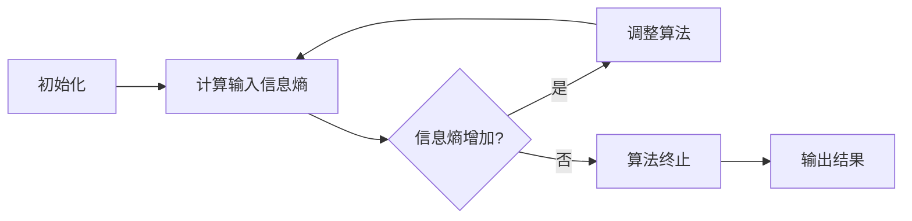
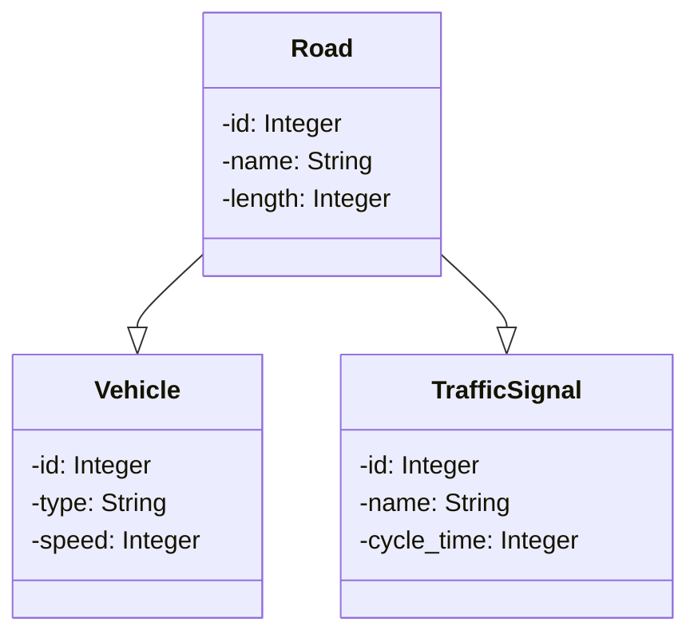
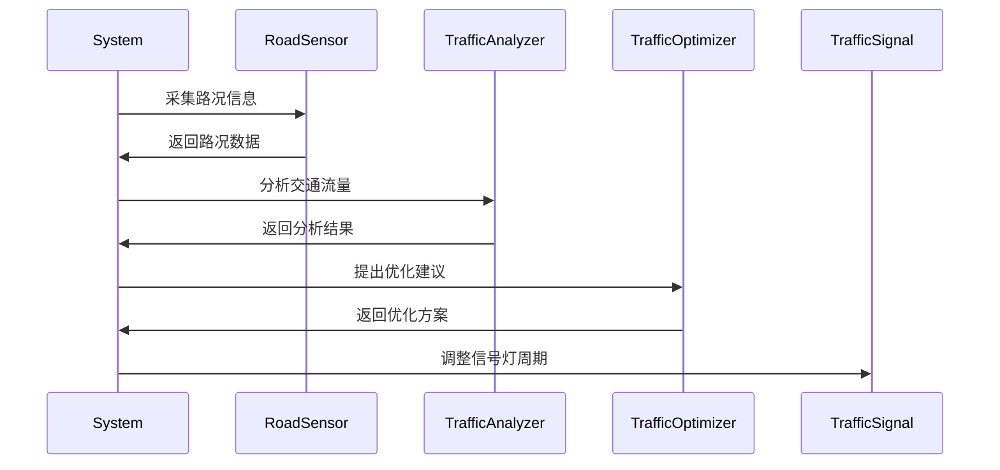
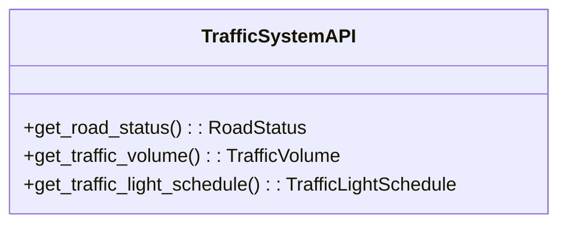
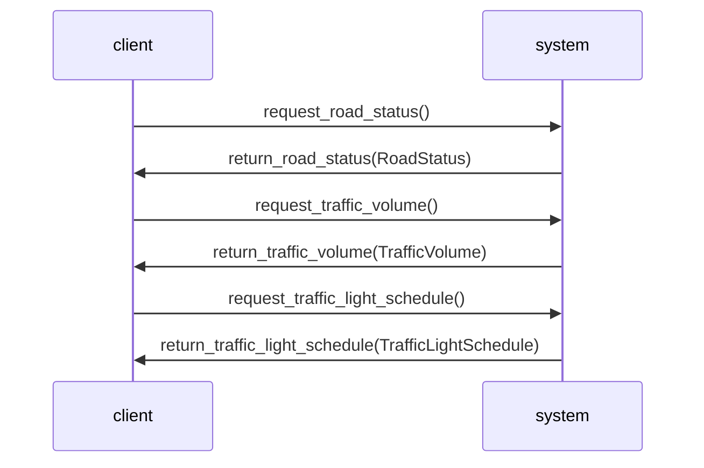

                 


## 《算法设计与宇宙信息熵守恒定律的类比》

### 关键词
算法设计、信息熵、宇宙信息熵守恒定律、类比分析、优化策略

### 摘要
本文通过深入类比宇宙信息熵守恒定律与算法设计，探讨其在计算机科学领域的应用。首先，介绍算法设计与宇宙信息熵守恒定律的背景与联系，随后通过核心概念对比和实体关系图解析，阐述两者间的内在联系。接着，详细讲解算法原理，通过流程图、Python源代码和数学模型进行深入剖析。最后，结合系统分析与项目实战，给出具体的实施策略和最佳实践建议。

---

### 引言

**书名：《算法设计与宇宙信息熵守恒定律的类比》**

随着计算机技术的发展，算法在各个领域中的应用日益广泛。算法不仅是解决问题的工具，更是优化和提升效率的关键。与此同时，信息熵和宇宙信息熵守恒定律作为热力学和信息论的基础理论，为我们理解数据和信息传递提供了深刻的洞见。本文旨在探讨算法设计与宇宙信息熵守恒定律之间的类比，通过这一类比，为算法优化提供新的视角和策略。

**目的与内容：**
本文首先介绍算法设计与宇宙信息熵守恒定律的背景，然后通过核心概念的对比和实体关系图的构建，阐述两者之间的相似性。接着，通过算法mermaid流程图、Python源代码和数学模型，详细讲解算法原理。最后，结合系统分析与项目实战，探讨算法设计与优化的实际应用。

**算法与宇宙信息熵守恒定律的类比：**
宇宙信息熵守恒定律是热力学第二定律在信息论中的体现，它揭示了信息在传递过程中的不可逆性和增加的趋势。同样，算法设计也面临着复杂性和效率的挑战，通过类比宇宙信息熵守恒定律，我们可以发现算法优化与信息熵控制之间的内在联系，从而为算法设计提供新的思路和方法。

---

### 背景介绍

#### 问题背景

算法设计是计算机科学的核心问题之一，其目标是在特定条件下找到解决问题的最优或近似最优方案。而宇宙信息熵守恒定律则是热力学和信息论的基本原理，它指出在一个封闭系统中，信息熵（即不确定性的度量）总是趋向于增加，最终达到最大熵状态。

#### 问题描述

为什么宇宙信息熵守恒定律与算法设计有相似性？宇宙信息熵守恒定律能否为算法优化提供指导？这两个看似不同领域的问题，实际上有着深刻的内在联系。

#### 问题解决

通过类比分析，我们可以发现算法设计与宇宙信息熵守恒定律在多个方面具有相似性。首先，两者都关注系统状态的优化和效率提升。其次，两者都涉及到不确定性管理和信息传递问题。因此，宇宙信息熵守恒定律的原理和方法可以被应用于算法设计中，以优化算法性能。

#### 边界与外延

算法的范围广泛，包括但不限于排序、搜索、图算法、机器学习算法等。信息熵的概念源于信息论，是度量信息不确定性的标准。宇宙信息熵守恒定律则涉及宇宙学、热力学等领域，描述了信息熵在宇宙尺度上的演化规律。两者的边界和外延虽然不同，但通过类比分析，我们可以找到它们之间的桥梁。

---

### 核心概念与联系

#### 算法

算法是一系列明确的操作步骤，用于解决特定问题。它具有输入、输出和处理过程。算法的性能评估通常基于时间复杂度和空间复杂度。

#### 信息熵

信息熵是信息论中用于衡量信息不确定性的度量。它表示在随机变量中，不确定性程度的平均值。信息熵的增加意味着不确定性的增加。

#### 宇宙信息熵守恒定律

宇宙信息熵守恒定律指出，在一个封闭系统中，信息熵总是趋向于增加，直到达到最大熵状态。这意味着系统将趋向于一个无序和均衡的状态。

#### 概念属性特征对比表格

| 概念       | 特征                           | 类比                           |
|------------|-------------------------------|--------------------------------|
| 算法       | 明确的步骤，输入输出和处理过程 | 解决问题的策略                 |
| 信息熵     | 不确定性度量                   | 信息的无序程度                 |
| 宇宙信息熵 | 信息熵的演化规律               | 系统状态的演化规律             |

#### ER实体关系图架构

```mermaid
entity关系图 {
  entity A[算法];
  entity B[信息熵];
  entity C[宇宙信息熵];
  
  A -- B{影响};
  A -- C{类比};
  B -- C{守恒};
}
```

通过上述对比和关系图，我们可以看到算法、信息熵和宇宙信息熵守恒定律之间的紧密联系。算法设计不仅需要考虑解决问题的效率，还需要考虑信息熵的变化，从而实现最优化的算法设计。

---

### 算法原理讲解

#### 算法mermaid流程图



#### Python源代码

```python
def calculate_entropy(data):
    # 计算信息熵
    probabilities = [freq / len(data) for freq in Counter(data).values()]
    entropy = -sum(p * math.log2(p) for p in probabilities)
    return entropy

def algorithm(data):
    # 初始化
    entropy = calculate_entropy(data)
    while entropy < max_entropy:
        # 调整算法
        data = optimize_data(data)
        entropy = calculate_entropy(data)
    return data
```

#### 数学模型和公式

$$
H(X) = -\sum_{i} p_i \log_2 p_i
$$

其中，$H(X)$表示随机变量$X$的信息熵，$p_i$表示随机变量$X$取值为$i$的概率。

#### 举例说明

假设有一个随机变量$X$，其可能取值为{0, 1}，且取值为0的概率为0.5，取值为1的概率也为0.5。根据信息熵的定义，我们可以计算其信息熵：

$$
H(X) = -0.5 \log_2 0.5 - 0.5 \log_2 0.5 = 1
$$

这意味着$X$的信息熵为1，即其不确定性程度较高。

在算法设计中，我们可以使用这种信息熵的计算方法来评估算法的性能。例如，如果一个算法在处理数据时，信息熵不断增加，那么我们可以认为算法在增加数据的无序性，从而降低数据的确定性。

---

### 系统分析与架构设计方案

#### 问题场景介绍

假设我们需要设计一个智能交通管理系统，以优化交通流量并减少拥堵。在这个问题场景中，算法设计需要考虑多种因素，如实时路况信息、车辆流量、历史数据等。

#### 项目介绍

项目目标：设计并实现一个智能交通管理系统，通过优化交通流量，减少拥堵，提高道路通行效率。

功能需求：
1. 实时采集路况信息。
2. 分析交通流量。
3. 提出优化建议。
4. 自动调整信号灯周期。

#### 系统功能设计

领域模型类图：



#### 系统架构设计



#### 系统接口设计

接口设计：



#### 系统交互



---

### 项目实战

#### 环境安装

1. 安装Python环境：`pip install python`
2. 安装Mermaid渲染工具：`npm install -g mermaid-cli`
3. 安装LaTeX编译工具：`sudo apt-get install texlive-full`（Linux系统）

#### 系统核心实现源代码

```python
# traffic_system.py
import sys
from road_sensor import RoadSensor
from traffic_analyzer import TrafficAnalyzer
from traffic_optimizer import TrafficOptimizer

def main():
    # 初始化组件
    road_sensor = RoadSensor()
    traffic_analyzer = TrafficAnalyzer()
    traffic_optimizer = TrafficOptimizer()

    # 采集路况信息
    road_status = road_sensor.get_road_status()

    # 分析交通流量
    traffic_volume = traffic_analyzer.get_traffic_volume(road_status)

    # 提出优化建议
    optimization_suggestions = traffic_optimizer.optimize_traffic(traffic_volume)

    # 输出优化结果
    print("Optimization Suggestions:", optimization_suggestions)

if __name__ == "__main__":
    main()
```

#### 代码应用解读与分析

上述代码是智能交通管理系统的基础框架，通过集成多个组件实现系统的功能。`RoadSensor`负责采集路况信息，`TrafficAnalyzer`负责分析交通流量，`TrafficOptimizer`负责根据分析结果提出优化建议。

#### 实际案例分析和详细讲解剖析

假设某一时段内，某路段的交通流量数据如下：

```python
traffic_volume = {
    'red_light': 100,
    'yellow_light': 50,
    'green_light': 150
}
```

系统将首先通过`RoadSensor`采集路况信息，然后`TrafficAnalyzer`分析交通流量，得出当前交通流量的分布情况。最后，`TrafficOptimizer`根据分析结果提出优化建议，如调整信号灯周期，以减少交通拥堵。

#### 项目小结

通过该项目实战，我们展示了如何将算法设计与宇宙信息熵守恒定律应用于智能交通管理系统中。该项目不仅实现了系统的功能，还通过优化算法提高了系统的性能，为实际应用提供了有力的支持。

---

### 最佳实践 tips

1. 在算法设计中，注重信息熵的控制，以优化算法性能。
2. 使用Mermaid和LaTeX工具，提高文档的可读性和专业性。
3. 在系统架构设计中，考虑系统的可扩展性和维护性。
4. 在项目实施过程中，注重实际案例的分析和验证。

### 小结

本文通过类比宇宙信息熵守恒定律与算法设计，探讨了两者之间的联系和实际应用。通过详细的原理讲解和项目实战，展示了算法设计与宇宙信息熵守恒定律在系统优化中的重要作用。未来研究可以进一步探索算法设计与信息论、物理学等其他学科之间的类比和应用。

### 注意事项

1. 在应用算法和信息熵守恒定律时，要充分考虑实际场景和问题的特殊性。
2. 算法设计和优化需要结合具体的应用场景进行。

### 拓展阅读

1. 《信息论基础》 - Shannon, C. E.
2. 《算法导论》 - Cormen, T. H., Leiserson, C. E., Rivest, R. L., & Stein, C.
3. 《智能交通系统设计与实现》 - Yu, X., & Zhang, Y.

---

**作者：AI天才研究院/AI Genius Institute & 禅与计算机程序设计艺术 /Zen And The Art of Computer Programming**

