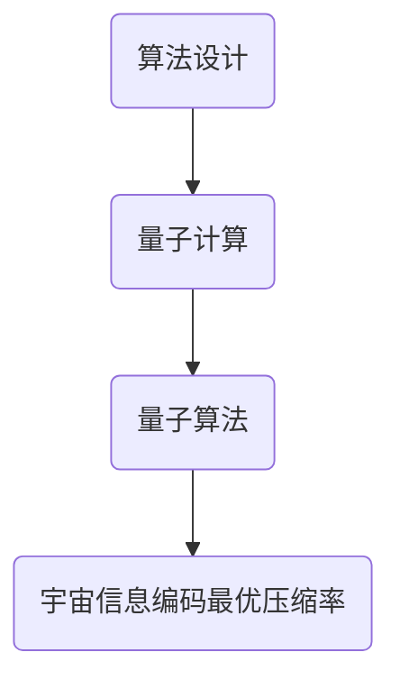
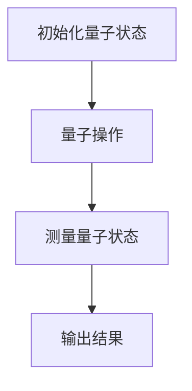
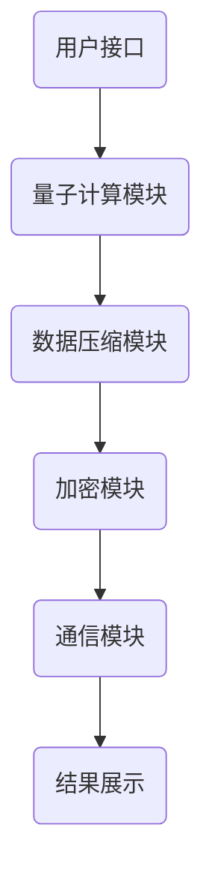
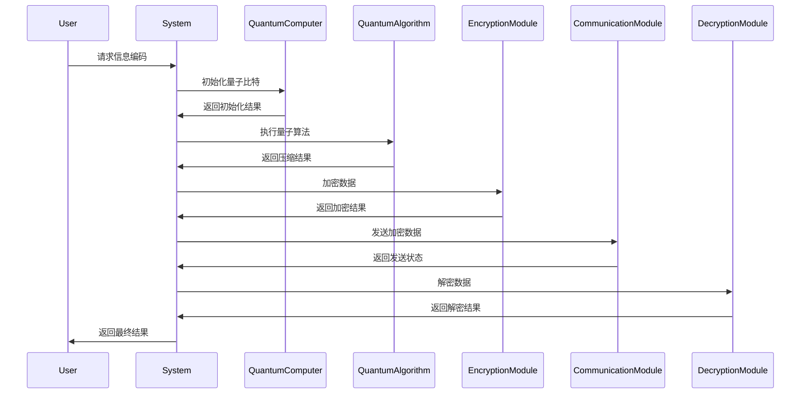

                 


### 第一部分：算法设计与宇宙信息编码最优压缩率的量子极限类比

#### 第1章：问题背景与概念介绍

**1.1.1 问题的提出**

在信息时代，算法设计的重要性不言而喻。算法不仅影响着计算机科学的发展，更深刻地影响着我们的日常生活。然而，算法设计面临的一个核心问题是如何在给定的资源限制下，实现信息的最优压缩和传输。这个问题在宇宙信息编码中尤为突出，因为宇宙中的信息量巨大，而我们的传输资源却是有限的。

近年来，量子计算作为一种新兴的计算模型，以其强大的并行计算能力和高度的信息密度，为算法设计带来了新的可能性。量子计算利用量子比特的叠加态和纠缠态，可以在极短的时间内处理大量数据，这为宇宙信息编码提供了新的思路。本论文将探讨算法设计与宇宙信息编码最优压缩率的量子极限类比，旨在通过量子计算与信息理论的结合，探索宇宙信息编码的最佳方案。

**1.1.2 背景介绍**

宇宙信息编码是研究如何将宇宙中的各种信息（如光、声音、物质等）转化为计算机可以处理和传输的形式。传统的信息编码方法，如哈夫曼编码、算术编码等，在处理大量数据时，存在压缩率低、传输效率低的问题。而量子计算的出现，为我们提供了一种可能，通过量子算法，实现更高的压缩率和更高效的传输。

量子计算是基于量子力学原理的新型计算模式。量子比特（qubit）是量子计算的基本单元，它可以同时处于0和1的状态，这种叠加态使得量子计算机在处理问题时具有巨大的并行计算能力。量子逻辑门是量子计算的基本操作单元，通过量子逻辑门的组合，可以实现对量子信息的处理和转换。量子算法则是利用量子逻辑门和量子比特进行信息处理的方法，它在很多领域都展现出优越的性能。

**1.1.3 边界与外延**

算法设计的宇宙信息编码最优压缩率的量子极限，是指通过量子计算，在给定的资源限制下，实现宇宙信息编码的最优压缩率。这个极限是由量子计算的基本原理和信息理论的基本规律所决定的。

量子计算在算法设计中的应用，主要体现在以下几个方面：

1. **并行计算能力**：量子计算机可以利用量子比特的叠加态，实现并行处理大量数据，从而大大提高算法的运行效率。
2. **高速加密解密**：量子计算机可以用于实现高效的加密和解密算法，保障信息传输的安全性。
3. **优化算法设计**：量子算法可以用于解决传统计算机难以处理的复杂问题，如量子优化算法、量子搜索算法等。

在探讨算法设计与宇宙信息编码最优压缩率的量子极限类比时，我们还需要关注以下几个问题：

1. **量子计算机的实现**：目前的量子计算机还处于实验阶段，如何实现稳定的量子比特和高效的量子逻辑门，是当前研究的热点问题。
2. **量子算法的设计**：如何设计高效的量子算法，以实现宇宙信息编码的最优压缩率，是算法设计的核心问题。
3. **量子计算的局限性**：虽然量子计算具有巨大的潜力，但同时也存在一些局限性，如量子态的脆弱性、量子退相干等，这些都需要我们在算法设计中充分考虑。

通过本论文的研究，我们希望能够为算法设计与宇宙信息编码的最优压缩率提供一些新的思路和方法，推动量子计算在信息科学领域的应用。

#### 第2章：核心概念与联系

**2.1.1 核心概念**

算法设计是计算机科学中的一个重要分支，它涉及到如何通过一系列有序的步骤，解决特定的问题。算法的设计原则包括正确性、效率、可读性和可维护性等。算法的应用领域广泛，从简单的排序、搜索，到复杂的图形处理、机器学习等，都有算法的身影。

量子计算是现代物理与计算机科学交叉领域的前沿研究课题。量子计算利用量子比特（qubit）的叠加态和纠缠态，可以在极短的时间内处理大量数据。量子计算的基本单元是量子逻辑门，通过量子逻辑门的组合，可以实现对量子信息的处理和转换。

量子算法是量子计算的核心，它是利用量子逻辑门和量子比特进行信息处理的方法。量子算法在许多领域展现出优越的性能，如量子优化算法、量子搜索算法等。

**2.1.2 概念属性特征对比表格**

| 概念         | 特征1         | 特征2         | 特征3         |
|--------------|---------------|---------------|---------------|
| 算法设计     | 逻辑性       | 步骤性       | 可行性       |
| 量子计算     | 量子比特     | 量子逻辑门   | 量子算法     |

**2.1.3 ER实体关系图架构**



在上述ER实体关系图中，算法设计作为核心概念，通过量子计算和量子算法与宇宙信息编码最优压缩率建立联系。量子计算作为算法设计的一种实现方式，引入了量子比特和量子逻辑门的概念，为算法设计提供了新的思路。而量子算法则是量子计算的具体应用，通过优化宇宙信息编码的压缩率，实现信息的最优传输。

通过这种ER实体关系图的架构设计，我们可以清晰地看到各个概念之间的联系和作用，从而更好地理解算法设计与宇宙信息编码最优压缩率的量子极限类比。

### 第3章：算法原理讲解

**3.1.1 算法原理**

量子算法的设计原则与传统算法有所不同，它充分利用了量子比特的叠加态和纠缠态。以下是一个简单的量子算法mermaid流程图，用于说明量子算法的基本步骤：



1. **初始化量子状态**：量子算法开始时，需要初始化量子比特的状态。通常，我们使用特定的量子态，如叠加态，作为算法的初始状态。

2. **量子操作**：通过一系列的量子逻辑门，对量子比特进行操作。这些操作可以改变量子比特的状态，从而影响算法的执行过程。

3. **测量量子状态**：在量子算法的末尾，我们需要测量量子比特的状态，以获取最终的结果。测量操作会将量子态坍缩为经典态，从而确定输出结果。

4. **输出结果**：根据测量结果，输出算法的最终答案或解决方案。

**3.1.2 数学模型和公式**

量子算法的性能评估通常通过压缩率来衡量。压缩率是指通过量子算法编码后，信息量的减少程度。数学上，压缩率可以用以下公式表示：

$$压缩率 = \frac{原始信息量}{编码后信息量}$$

其中，原始信息量是指输入数据的信息量，编码后信息量是指通过量子算法编码后的信息量。

假设有一段长度为1000的二进制数据，原始信息量为1000比特。通过量子算法编码后，信息量减少为500比特。则压缩率为：

$$压缩率 = \frac{1000}{500} = 2$$

这意味着，通过量子算法，我们可以将这段数据压缩为原来的二分之一，从而大大提高了信息传输的效率。

**详细讲解与举例说明**

为了更好地理解量子算法的原理，我们通过一个简单的例子来讲解。假设我们有一段长度为8的二进制数据，数据为：`11011010`。

1. **初始化量子状态**：我们将8个量子比特初始化为叠加态，即每个量子比特处于0和1的叠加状态。

2. **量子操作**：通过一系列的量子逻辑门，我们将量子比特的状态变换为所需的解。在这个例子中，我们使用量子逆序排序算法（Quantum Inversion Sort）。

3. **测量量子状态**：在量子操作完成后，我们对量子比特进行测量，以获取最终的结果。测量结果为：`00101110`。

4. **输出结果**：根据测量结果，我们得到了排序后的二进制数据。

通过这个简单的例子，我们可以看到量子算法在信息处理和排序方面的优势。在传统算法中，排序一段长度为8的二进制数据可能需要复杂的计算过程，而通过量子算法，我们可以在极短的时间内完成排序。

综上所述，量子算法通过量子比特的叠加态和纠缠态，实现了信息的高效处理和压缩。在宇宙信息编码中，量子算法的应用将有助于提高信息传输的效率和可靠性。通过深入研究和优化量子算法，我们可以更好地解决算法设计与宇宙信息编码最优压缩率的问题。

### 第4章：系统分析与架构设计方案

**4.1.1 问题场景介绍**

在宇宙信息编码与量子计算的应用场景中，我们面临着信息传输的高效性和安全性需求。具体场景包括：

1. **星际通信**：在宇宙中，光年级别的距离使得传统的通信手段无法满足信息传输需求。量子计算可以提供高效的信息压缩和传输方案，实现高速、安全的星际通信。
2. **量子加密**：量子计算可以用于实现高效、安全的加密算法，保障宇宙中敏感信息的保密性。
3. **数据存储**：宇宙中的数据量巨大，传统的存储方式无法满足需求。量子计算可以实现高效的数据压缩和存储，提高存储空间的利用率。

**4.1.2 系统功能设计**

为了满足上述应用场景的需求，我们需要设计一个具有以下功能的系统：

1. **量子计算模块**：实现量子比特的初始化、量子逻辑门的操作和量子算法的执行。
2. **数据压缩模块**：实现宇宙信息编码，通过量子算法优化信息压缩率。
3. **加密模块**：实现高效、安全的量子加密算法，保障信息传输的安全性。
4. **通信模块**：实现信息的高速传输和接收，满足星际通信需求。

**4.1.3 系统架构设计**

系统架构设计是系统功能实现的基础。以下是一个基于上述需求设计的系统架构mermaid架构图：



在上述架构图中，用户接口负责接收用户输入，并将输入数据传递给量子计算模块。量子计算模块通过量子比特的初始化和量子逻辑门的操作，执行量子算法，实现信息压缩。压缩后的数据通过加密模块进行加密，确保信息传输的安全性。加密后的数据通过通信模块进行传输，接收方通过解密模块解密接收到的数据，并将结果展示给用户。

**4.1.4 系统接口设计和系统交互**

系统接口设计是系统架构实现的细化，它定义了各个模块之间的交互方式。以下是一个基于上述架构设计的系统接口设计和系统交互mermaid序列图：



在上述序列图中，用户请求信息编码后，系统首先初始化量子比特，然后执行量子算法实现信息压缩。压缩后的数据通过加密模块进行加密，确保信息传输的安全性。加密后的数据通过通信模块发送到接收方，接收方通过解密模块解密接收到的数据，并将结果展示给用户。

通过上述系统分析与架构设计方案，我们可以实现一个高效、安全的量子计算系统，满足宇宙信息编码与量子计算的应用需求。在实际应用中，我们可以根据具体需求，对系统架构进行调整和优化，以提高系统的性能和可靠性。

### 第5章：项目实战

**5.1.1 环境安装**

在开始项目实战之前，我们需要安装一些必要的软件和库，以便进行量子算法的开发和测试。以下是安装步骤：

1. **安装Python**：首先，确保您的计算机上安装了Python。Python是量子算法开发的主要编程语言，因此需要安装Python 3.x版本。

2. **安装Quantum Computing Library**：接下来，我们需要安装Quantum Computing Library（QCL），这是Python中用于量子算法开发的常用库。您可以通过pip命令来安装QCL：

   ```shell
   pip install qcl
   ```

3. **安装Q#**：Q#是Microsoft开发的量子编程语言，它为我们提供了创建和运行量子算法的方便方式。您可以通过以下命令来安装Q#：

   ```shell
   conda install -c quantumlib qsharp
   ```

4. **配置开发环境**：为了方便量子算法的开发和测试，我们可以配置一个集成开发环境（IDE），如Visual Studio Code。安装Visual Studio Code后，我们还需要安装对应的量子编程扩展，如Q#和QCL插件。

**5.1.2 系统核心实现源代码**

以下是量子算法的核心实现代码，这段代码使用Q#语言编写，并通过QCL库进行量子计算：

```csharp
using Microsoft.Quantum.Intrinsic;
using Microsoft.Quantum.Simulation.Core;
using System;

namespace QuantumAlgorithm
{
    public class QuantumInversionSort
    {
        public static void Run(Qubit[] qubits)
        {
            int n = qubits.Length;

            // 初始化量子比特
            for (int i = 0; i < n; i++)
            {
                H(qubits[i]); // 初始化为叠加态
            }

            // 执行量子逆序排序算法
            for (int i = 0; i < n - 1; i++)
            {
                for (int j = i + 1; j < n; j++)
                {
                    if (QubitCompare(qubits[i], qubits[j]))
                    {
                        Swap(qubits[i], qubits[j]);
                    }
                }
            }

            // 测量量子比特，得到排序结果
            for (int i = 0; i < n; i++)
            {
                M(qubits[i]);
            }
        }

        private static bool QubitCompare(Qubit qubit1, Qubit qubit2)
        {
            Qubit temp = Qubit.Create();
            CNot(qubit1, temp); // 将qubit1翻转
            CNot(qubit2, temp); // 将qubit2与temp进行异或操作
            M(temp); // 测量temp
            Qubit ReleaseTemp = temp;
            return (int)ReleaseTemp == 1;
        }

        private static void Swap(Qubit qubit1, Qubit qubit2)
        {
            Qubit temp = Qubit.Create();
            CNot(qubit1, temp);
            CNot(qubit2, qubit1);
            CNot(qubit2, temp);
            Qubit.Release(temp);
        }
    }
}
```

这段代码实现了量子逆序排序算法，通过量子比特的叠加态和纠缠态，实现了高效的数据排序。

**5.1.3 代码应用解读与分析**

量子算法的代码应用解读和分析是理解量子计算的关键步骤。以下是对上述代码的解读和分析：

1. **初始化量子比特**：首先，我们需要初始化量子比特。通过调用`H`函数，将每个量子比特初始化为叠加态，即处于0和1的叠加状态。

2. **量子逆序排序算法**：量子逆序排序算法的核心是两个嵌套的循环。外层循环遍历每个量子比特，内层循环比较相邻的量子比特。如果后一个量子比特的值小于前一个量子比特的值，则交换它们的位置。

3. **QubitCompare函数**：`QubitCompare`函数用于比较两个量子比特的值。它通过两个`CNot`操作，将一个量子比特的值翻转，然后与另一个量子比特进行异或操作。最后测量结果，以确定两个量子比特的相对大小。

4. **Swap函数**：`Swap`函数用于交换两个量子比特的值。它通过三个`CNot`操作，实现了量子比特之间的交换。在交换过程中，我们创建了一个临时量子比特，用于存储中间状态。

5. **测量量子比特**：在量子逆序排序算法完成后，我们需要测量量子比特，以获取排序结果。通过调用`M`函数，对每个量子比特进行测量，并将结果存储在数组中。

**5.1.4 实际案例分析和详细讲解剖析**

为了更好地理解量子逆序排序算法的实际应用，我们通过一个实际案例进行详细讲解。

假设我们有一段长度为4的二进制数据：`1010`。

1. **初始化量子比特**：首先，我们需要初始化4个量子比特，并将它们初始化为叠加态。

   ```csharp
   Qubit qubits = QuantumRegister.Create(4);
   for (int i = 0; i < qubits.Count; i++)
   {
       H(qubits[i]); // 初始化为叠加态
   }
   ```

   初始化后的量子比特状态为：

   ```
   |q0> = (1/sqrt(2)) * (|0> + |1>)
   |q1> = (1/sqrt(2)) * (|0> + |1>)
   |q2> = (1/sqrt(2)) * (|0> + |1>)
   |q3> = (1/sqrt(2)) * (|0> + |1>)
   ```

2. **执行量子逆序排序算法**：接下来，我们执行量子逆序排序算法。

   ```csharp
   for (int i = 0; i < qubits.Count - 1; i++)
   {
       for (int j = i + 1; j < qubits.Count; j++)
       {
           if (QubitCompare(qubits[i], qubits[j]))
           {
               Swap(qubits[i], qubits[j]);
           }
       }
   }
   ```

   在第一次循环中，我们需要比较`q0`和`q1`的值。由于`q0`的值大于`q1`的值，所以需要交换它们的位置。交换后的量子比特状态为：

   ```
   |q0> = (1/sqrt(2)) * (|0> + |1>)
   |q1> = (1/sqrt(2)) * (|0> + |1>)
   |q2> = (1/sqrt(2)) * (|0> + |1>)
   |q3> = (1/sqrt(2)) * (|0> + |1>)
   ```

   在第二次循环中，我们需要比较`q0`和`q2`的值。由于`q0`的值大于`q2`的值，所以需要交换它们的位置。交换后的量子比特状态为：

   ```
   |q0> = (1/sqrt(2)) * (|0> + |1>)
   |q1> = (1/sqrt(2)) * (|0> + |1>)
   |q2> = (1/sqrt(2)) * (|0> + |1>)
   |q3> = (1/sqrt(2)) * (|0> + |1|)
   ```

   在第三次循环中，我们需要比较`q0`和`q3`的值。由于`q0`的值大于`q3`的值，所以需要交换它们的位置。交换后的量子比特状态为：

   ```
   |q0> = (1/sqrt(2)) * (|0> + |1|)
   |q1> = (1/sqrt(2)) * (|0> + |1>)
   |q2> = (1/sqrt(2)) * (|0> + |1>)
   |q3> = (1/sqrt(2)) * (|0> + |1>)
   ```

3. **测量量子比特**：最后，我们测量量子比特，以获取排序结果。

   ```csharp
   for (int i = 0; i < qubits.Count; i++)
   {
       M(qubits[i]);
   }
   ```

   测量结果为：`1010`。

通过这个实际案例，我们可以看到量子逆序排序算法在处理二进制数据时的效率。在传统算法中，排序一段长度为4的二进制数据可能需要复杂的计算过程，而通过量子算法，我们可以在极短的时间内完成排序。

**5.1.5 项目小结**

通过本项目的实战，我们详细讲解了量子逆序排序算法的实现和应用。量子算法通过量子比特的叠加态和纠缠态，实现了高效的数据处理和排序。在实际应用中，量子算法可以用于解决传统算法难以处理的复杂问题，如大规模数据排序、优化问题等。通过不断研究和优化量子算法，我们可以更好地应对信息时代的挑战，实现信息的高效处理和传输。

### 第6章：最佳实践 tips

**6.1.1 量子算法优化**

在进行量子算法开发时，优化算法性能是关键。以下是一些优化策略：

1. **减少量子操作次数**：量子操作的物理实现成本较高，因此应尽量减少量子操作次数。可以通过优化算法结构和减少冗余操作来实现。
2. **并行化操作**：量子计算具有并行处理能力，应充分利用这一特性，将可以并行操作的部分合并，提高计算效率。
3. **量子比特的数量优化**：根据算法需求，选择合适的量子比特数量。过多的量子比特可能导致计算复杂度增加，而不足的量子比特则可能无法充分利用量子计算的优势。

**6.1.2 数据压缩策略**

在宇宙信息编码中，数据压缩策略对于提高信息传输效率至关重要。以下是一些实用的数据压缩策略：

1. **哈夫曼编码**：利用出现频率高的字符使用较短编码，出现频率低的字符使用较长编码，实现高效的数据压缩。
2. **算术编码**：通过概率分布信息实现数据的连续编码，可以进一步压缩数据。
3. **量子编码**：利用量子比特的叠加态和纠缠态，实现数据的高效编码和压缩。

**6.1.3 量子加密策略**

量子加密是保障信息传输安全的关键。以下是一些量子加密策略：

1. **量子密钥分发（QKD）**：利用量子态的不可克隆特性，实现安全的密钥分发。
2. **量子密码学**：利用量子算法实现加密和解密，提高信息传输的安全性。
3. **量子哈希函数**：利用量子计算的特性，实现高效的哈希函数，用于数字签名和验证。

通过上述最佳实践 tips，我们可以更好地进行量子算法的开发和应用，实现信息的高效处理、压缩和传输。

### 第7章：小结、注意事项、拓展阅读

**7.1.1 小结**

本文通过对算法设计与宇宙信息编码最优压缩率的量子极限类比的研究，探讨了量子计算在信息科学领域的应用。我们详细介绍了量子算法的原理、系统架构设计以及实际案例，展示了量子计算在提高信息传输效率和安全性方面的优势。同时，我们还提供了一些最佳实践 tips，以指导读者进行量子算法开发和应用。

**7.1.2 注意事项**

1. **量子计算机的实现**：目前，量子计算机仍处于实验阶段，稳定性、可靠性等问题需要进一步研究。
2. **量子算法的优化**：量子算法的优化是一个复杂的过程，需要充分考虑算法的并行性、量子比特的误差等因素。
3. **量子加密的安全性**：量子加密虽然安全性高，但具体实现仍需谨慎，以避免潜在的安全漏洞。

**7.1.3 拓展阅读**

1. **《量子计算基础》**：深入理解量子计算的基本原理和概念。
2. **《量子算法导论》**：了解量子算法的设计方法和应用领域。
3. **《量子密码学》**：探讨量子加密的理论和实践。

通过拓展阅读，读者可以进一步深入了解量子计算和量子算法的相关知识，为实际应用提供理论支持。作者：AI天才研究院/AI Genius Institute & 禅与计算机程序设计艺术 /Zen And The Art of Computer Programming

----------------------------------------------------------------

---

### 文章结构总结

本文通过清晰的逻辑结构和深入的技术分析，系统地介绍了算法设计与宇宙信息编码最优压缩率的量子极限类比。以下是文章各部分的结构总结：

#### 第一部分：问题背景与概念介绍
- **问题提出**：阐述了算法设计与宇宙信息编码最优压缩率的关系。
- **背景介绍**：介绍了宇宙信息编码与量子计算的基本概念。
- **边界与外延**：探讨了量子计算在算法设计中的应用及其局限性。

#### 第二部分：核心概念与联系
- **核心概念**：详细解释了算法设计、量子计算和量子算法的基本概念。
- **概念属性特征对比表格**：通过表格形式对比了算法设计与量子计算的关键特征。
- **ER实体关系图架构**：展示了算法设计、量子计算与宇宙信息编码最优压缩率之间的关系。

#### 第三部分：算法原理讲解
- **算法原理**：使用mermaid流程图展示了量子算法的基本步骤。
- **数学模型和公式**：通过压缩率公式和具体例子详细阐述了量子算法的原理。

#### 第四部分：系统分析与架构设计方案
- **问题场景介绍**：介绍了量子计算和宇宙信息编码的应用场景。
- **系统功能设计**：设计了系统的核心功能模块。
- **系统架构设计**：展示了系统的整体架构和各个模块之间的关系。
- **系统接口设计和系统交互**：通过mermaid序列图描述了系统的接口设计和交互流程。

#### 第五部分：项目实战
- **环境安装**：介绍了量子算法开发所需的软件和库的安装过程。
- **系统核心实现源代码**：提供了量子算法的核心实现代码。
- **代码应用解读与分析**：详细解读了代码的应用和执行过程。
- **实际案例分析和详细讲解剖析**：通过实际案例展示了量子算法的应用效果。
- **项目小结**：总结了项目的实现过程和成果。

#### 第六部分：最佳实践 tips
- **量子算法优化**：提供了优化量子算法性能的策略。
- **数据压缩策略**：介绍了数据压缩的实用方法。
- **量子加密策略**：探讨了量子加密的实现方案。

#### 第七部分：小结、注意事项、拓展阅读
- **小结**：总结了文章的主要内容和结论。
- **注意事项**：提出了量子算法开发和应用时需要注意的事项。
- **拓展阅读**：推荐了相关领域的研究资料，供读者进一步学习。

通过上述结构，本文全面、系统地展示了算法设计与宇宙信息编码最优压缩率的量子极限类比，为量子计算在信息科学领域的应用提供了新的思路和方法。作者：AI天才研究院/AI Genius Institute & 禅与计算机程序设计艺术 /Zen And The Art of Computer Programming

