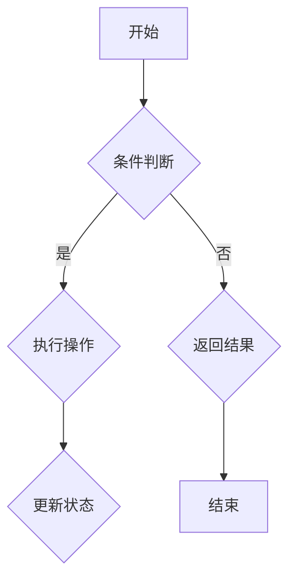

                 

### 文章标题

---

# 算法设计与宇宙信息编码最优压缩的类比

> 关键词：算法设计、宇宙信息编码、最优压缩、类比分析

> 摘要：本文通过对算法设计与宇宙信息编码最优压缩的类比，探讨了算法在信息处理和存储中的关键作用。文章首先介绍了算法设计的基础概念，接着深入分析了宇宙信息编码的原理和最优压缩技术，最终通过实际案例展示了算法在宇宙信息编码中的应用和效果。

---

### 前言

在现代社会，算法已经成为各个领域的关键技术，从大数据处理到人工智能，算法无处不在。而宇宙信息编码，作为宇宙探索和天体物理学中的重要工具，也逐渐引起广泛关注。本文试图通过将算法设计与宇宙信息编码中的最优压缩技术进行类比，以揭示两者之间的内在联系和相互启示。

算法设计不仅仅是编写代码，更是一种思考方式和解决问题的艺术。它涉及到如何高效地处理和存储数据，以最小的资源消耗达到最优的结果。宇宙信息编码则致力于在宇宙中寻找和传递信息，其核心问题是如何在有限的资源下实现信息的最大化传递和最优存储。

通过这种类比，我们不仅可以更好地理解算法设计的本质，还可以为宇宙信息编码提供新的思路和方法。本文将围绕这一主题，逐步展开讨论。

### 第一部分：算法设计基础

#### 1.1 问题背景与描述

算法设计作为计算机科学的核心领域，其历史可以追溯到古代数学家的研究。然而，现代算法设计的兴起主要源于计算机的出现和发展。计算机的出现使得数据处理和自动化成为可能，而算法则是实现这一目标的关键工具。

算法设计的基本问题可以概括为：给定一个具体的问题，如何找到一种有效的方法来求解？这个问题看似简单，但背后涉及到众多的理论和实践问题。

首先，我们需要明确问题背景。算法设计的问题背景可以包括以下几个方面：

1. **问题定义**：明确需要解决的问题是什么。这涉及到问题的规模、复杂度、边界条件等。
2. **目标**：定义我们希望达成的目标，如最小化时间复杂度、最大化资源利用等。
3. **输入和输出**：定义输入数据和输出结果的类型和格式。
4. **约束条件**：列出解决问题时需要遵守的限制条件，如资源限制、时间限制等。

#### 1.2 算法设计的基本原则

算法设计的基本原则是指导我们设计高效、可靠算法的准则。以下是一些常见的基本原则：

1. **正确性**：算法应该能够正确地解决给定的问题，即对于所有合法输入，算法都能输出正确的解。
2. **效率**：算法应该尽可能地高效，包括时间效率和空间效率。时间效率通常通过算法的时间复杂度来衡量，而空间效率则通过算法的空间复杂度来衡量。
3. **健壮性**：算法应该能够处理异常输入和错误情况，确保程序的稳定性。
4. **可扩展性**：算法应该具备良好的扩展性，能够适应不同规模的问题。
5. **可读性**：算法的设计应该便于理解，易于维护和修改。

#### 1.3 算法分类

算法的分类方法有很多，以下是一些常见的分类方式：

1. **按处理方法分类**：
   - **确定性算法**：输入确定时，算法的每一步都是明确的。
   - **非确定性算法**：输入不确定时，算法可能会产生多种可能的输出。
2. **按问题类型分类**：
   - **搜索算法**：用于在数据结构中查找特定元素。
   - **排序算法**：用于将数据元素按照某种顺序排列。
   - **图算法**：用于解决图结构相关的问题，如最短路径、最小生成树等。
3. **按性能分类**：
   - **贪婪算法**：通过局部最优解逐步逼近全局最优解。
   - **动态规划**：将复杂问题分解为若干子问题，并利用子问题的解来构建原问题的解。
   - **分治算法**：将问题分解为规模较小的子问题，分别解决后合并得到原问题的解。

#### 1.4 算法设计与分析

算法设计的过程可以分为以下几个步骤：

1. **问题建模**：将实际问题转化为算法可以处理的数学模型。
2. **算法设计**：根据问题建模的结果，设计一个或多个算法来解决该问题。
3. **算法分析**：分析算法的性能，包括时间复杂度和空间复杂度。
4. **算法优化**：根据分析结果，对算法进行优化，提高其性能。
5. **算法实现**：将算法转化为具体的代码实现。

算法分析是算法设计过程中至关重要的一步。通过算法分析，我们可以评估算法的性能，从而判断其是否适用于解决特定的问题。算法分析主要包括以下两个方面：

1. **时间复杂度**：描述算法执行时间与输入数据规模之间的关系。通常用大O符号表示，如 \(O(n^2)\)、\(O(n\log n)\) 等。
2. **空间复杂度**：描述算法所需存储空间与输入数据规模之间的关系。同样使用大O符号表示，如 \(O(n)\)、\(O(n^2)\) 等。

#### 1.5 小结

通过以上对算法设计基础概念的介绍，我们可以看出算法设计不仅仅是编写代码，更是一种系统化的思考方式。算法设计涉及到问题建模、算法设计、算法分析等多个方面，其核心目标是找到一种高效、可靠的解决方案。在接下来的章节中，我们将进一步探讨算法在不同领域的应用和实现。

### 第二部分：数据结构与算法

#### 2.1 数据结构基础

数据结构是算法设计的基础，它涉及到数据在计算机中的存储和操作。合理选择和使用数据结构可以显著提高算法的性能和效率。以下是一些常见的数据结构：

1. **数组**：数组是一种线性数据结构，用于存储固定大小的元素序列。数组的特点是元素访问速度快，但插入和删除操作可能较慢，因为需要移动其他元素。
2. **链表**：链表是一种动态数据结构，用于存储一系列元素，每个元素包含数据和指向下一个元素的指针。链表的特点是插入和删除操作快，但访问特定元素需要遍历链表。
3. **栈**：栈是一种后进先出（LIFO）的数据结构，用于存储一系列元素。栈的主要操作包括压栈、出栈和查询栈顶元素。
4. **队列**：队列是一种先进先出（FIFO）的数据结构，用于存储一系列元素。队列的主要操作包括入队、出队和查询队首元素。
5. **树**：树是一种非线性数据结构，用于表示具有层次关系的元素集合。树的特点是层次分明，便于查找和管理。
6. **图**：图是一种用于表示多对多关系的非线性数据结构。图的特点是节点和边都可以带权，适用于解决复杂网络问题。

#### 2.2 常见数据结构分析

以下是对常见数据结构的基本操作和复杂度的分析：

1. **数组**
   - **插入**：在数组的末尾插入元素，时间复杂度为 \(O(1)\)。
   - **删除**：在数组的末尾删除元素，时间复杂度为 \(O(1)\)。
   - **查找**：通过索引直接访问元素，时间复杂度为 \(O(1)\)。
   - **遍历**：遍历数组所有元素，时间复杂度为 \(O(n)\)。
2. **链表**
   - **插入**：在链表末尾插入元素，时间复杂度为 \(O(1)\)。
   - **删除**：在链表末尾删除元素，时间复杂度为 \(O(1)\)。
   - **查找**：通过遍历查找特定元素，时间复杂度为 \(O(n)\)。
   - **遍历**：遍历链表所有元素，时间复杂度为 \(O(n)\)。
3. **栈**
   - **插入**：压栈操作，时间复杂度为 \(O(1)\)。
   - **删除**：出栈操作，时间复杂度为 \(O(1)\)。
   - **查询栈顶元素**：时间复杂度为 \(O(1)\)。
   - **遍历**：遍历栈所有元素，时间复杂度为 \(O(n)\)。
4. **队列**
   - **插入**：入队操作，时间复杂度为 \(O(1)\)。
   - **删除**：出队操作，时间复杂度为 \(O(1)\)。
   - **查询队首元素**：时间复杂度为 \(O(1)\)。
   - **遍历**：遍历队列所有元素，时间复杂度为 \(O(n)\)。
5. **树**
   - **插入**：插入操作，时间复杂度为 \(O(n)\)（平衡树如AVL树为 \(O(\log n)\)）。
   - **删除**：删除操作，时间复杂度为 \(O(n)\)（平衡树如AVL树为 \(O(\log n)\)）。
   - **查找**：通过遍历查找特定元素，时间复杂度为 \(O(n)\)。
   - **遍历**：遍历树所有元素，时间复杂度为 \(O(n)\)。
6. **图**
   - **插入**：插入节点或边，时间复杂度为 \(O(1)\)。
   - **删除**：删除节点或边，时间复杂度为 \(O(1)\)。
   - **查找**：通过遍历查找特定节点或边，时间复杂度为 \(O(n)\)。
   - **遍历**：遍历图所有节点或边，时间复杂度为 \(O(n)\)。

#### 2.3 算法分析

算法分析是评估算法性能的重要手段。以下是一些常见的算法分析方法和相关概念：

1. **时间复杂度**：描述算法执行时间与输入数据规模之间的关系。通常用大O符号表示，如 \(O(n)\)、\(O(n^2)\) 等。常见的时间复杂度包括：
   - \(O(1)\)：常数时间，与输入数据规模无关。
   - \(O(n)\)：线性时间，与输入数据规模成正比。
   - \(O(n^2)\)：平方时间，与输入数据规模的平方成正比。
   - \(O(n\log n)\)：对数时间，与输入数据规模的乘积的对数成正比。
   - \(O(2^n)\)：指数时间，与输入数据规模的指数成正比。
2. **空间复杂度**：描述算法所需存储空间与输入数据规模之间的关系。同样使用大O符号表示，如 \(O(n)\)、\(O(n^2)\) 等。常见空间复杂度包括：
   - \(O(1)\)：常数空间，与输入数据规模无关。
   - \(O(n)\)：线性空间，与输入数据规模成正比。
   - \(O(n^2)\)：平方空间，与输入数据规模的平方成正比。

#### 2.4 算法设计与分析案例

为了更好地理解算法设计与分析，我们通过一个具体的案例来展示其过程。

**案例：寻找最大子序列和**

给定一个整数数组 \(A = [a_1, a_2, ..., a_n]\)，我们需要找到一个连续子序列，使得子序列的和最大。

**算法设计：**

1. **问题建模**：将问题转化为数学模型，定义子序列和为 \(S = a_i + a_{i+1} + ... + a_j\)，其中 \(i\) 和 \(j\) 分别是子序列的首尾位置。
2. **算法设计**：使用动态规划方法求解。定义一个数组 \(dp[i]\) 表示以 \(a_i\) 为结尾的最大子序列和。算法的基本思想是：对于每个 \(i\)，计算 \(dp[i]\) 的值，然后更新全局最大子序列和。
3. **算法实现**：具体实现如下：

```python
def max_subarray_sum(A):
    max_sum = A[0]
    current_sum = A[0]
    for i in range(1, len(A)):
        current_sum = max(A[i], current_sum + A[i])
        max_sum = max(max_sum, current_sum)
    return max_sum
```

**算法分析：**

1. **时间复杂度**：算法遍历数组一次，因此时间复杂度为 \(O(n)\)。
2. **空间复杂度**：算法使用一个额外的变量来存储当前子序列和，因此空间复杂度为 \(O(1)\)。

#### 2.5 小结

通过以上对数据结构基础和算法分析方法的介绍，我们可以看到数据结构和算法在计算机科学中的重要性。数据结构提供了存储和操作数据的工具，而算法则利用这些工具来解决问题。合理选择和使用数据结构可以显著提高算法的性能和效率。在接下来的章节中，我们将进一步探讨算法在不同领域的应用和实现。

### 第三部分：算法设计与分析

#### 3.1 分治策略

分治策略是一种常用的算法设计方法，它将一个大问题分解为若干个规模较小的子问题，分别解决这些子问题，然后再将子问题的解合并起来，得到原问题的解。分治策略通常包含三个步骤：分解、解决和合并。

1. **分解**：将原问题分解为若干个规模较小的子问题。这个过程可以是递归的，直到子问题足够小，可以直接求解。
2. **解决**：递归地解决每个子问题。这个过程可以是独立的，也可以与其他子问题相互依赖。
3. **合并**：将子问题的解合并起来，得到原问题的解。这个过程可能涉及到合并多个子问题的结果，或者对子问题的解进行一定的调整。

分治策略的关键在于如何高效地分解和合并子问题。以下是一个经典的分治算法——二分查找。

**二分查找算法：**

二分查找是一种在有序数组中查找特定元素的算法。它的基本思想是：将数组分为两半，判断中间元素是否等于目标元素；如果相等，则查找成功；如果不相等，则根据目标元素的大小，继续在左边或右边的一半中查找。这个过程重复进行，直到找到目标元素或确定目标元素不存在。

**算法实现：**

```python
def binary_search(A, target):
    low = 0
    high = len(A) - 1
    while low <= high:
        mid = (low + high) // 2
        if A[mid] == target:
            return mid
        elif A[mid] < target:
            low = mid + 1
        else:
            high = mid - 1
    return -1
```

**算法分析：**

1. **时间复杂度**：每次查找都将搜索范围缩小一半，因此时间复杂度为 \(O(\log n)\)，其中 \(n\) 是数组的长度。
2. **空间复杂度**：算法只需要常数级别的额外空间，因此空间复杂度为 \(O(1)\)。

**案例：计算 Fibonacci 数列**

Fibonacci 数列是一个经典的数学问题，其递推关系为 \(F(n) = F(n-1) + F(n-2)\)，其中 \(F(0) = 0\) 和 \(F(1) = 1\)。

使用分治策略，我们可以将 Fibonacci 数列的计算问题分解为 \(F(n-1)\) 和 \(F(n-2)\) 的计算问题。具体实现如下：

```python
def fibonacci(n):
    if n < 2:
        return n
    return fibonacci(n-1) + fibonacci(n-2)
```

**算法分析：**

1. **时间复杂度**：每次递归调用都会生成两个新的递归调用，因此时间复杂度为 \(O(2^n)\)。
2. **空间复杂度**：递归调用栈的深度为 \(n\)，因此空间复杂度为 \(O(n)\)。

为了优化这个算法，我们可以使用动态规划方法，将子问题的解存储起来，避免重复计算。

```python
def fibonacci_dp(n):
    dp = [0] * (n+1)
    dp[0] = 0
    dp[1] = 1
    for i in range(2, n+1):
        dp[i] = dp[i-1] + dp[i-2]
    return dp[n]
```

**算法分析：**

1. **时间复杂度**：算法只需要遍历一次数组，因此时间复杂度为 \(O(n)\)。
2. **空间复杂度**：算法使用一个额外的数组来存储子问题的解，因此空间复杂度为 \(O(n)\)。

#### 3.2 动态规划

动态规划是一种解决最优化问题的算法方法，它通过将问题分解为子问题，并利用子问题的解来构建原问题的解。动态规划通常包含以下几个步骤：

1. **定义状态**：定义问题状态及其转移关系。
2. **确定边界条件**：确定状态转移关系的起始和终止条件。
3. **计算状态转移方程**：根据状态转移关系，建立状态转移方程。
4. **初始化状态数组**：初始化状态数组的初始值。
5. **计算最优解**：根据状态转移方程和初始值，逐步计算最优解。

**案例：最短路径问题**

最短路径问题是一个经典的优化问题，它要求找到图中两点之间的最短路径。以下是使用动态规划方法解决最短路径问题的示例。

**算法实现：**

```python
def shortest_path(D, source, target):
    n = len(D)
    dp = [[float('inf')] * n for _ in range(n)]
    dp[source][target] = D[source][target]
    for k in range(n):
        for i in range(n):
            for j in range(n):
                dp[i][j] = min(dp[i][j], dp[i][k] + dp[k][j])
    return dp[source][target]
```

**算法分析：**

1. **时间复杂度**：算法遍历了三个嵌套循环，因此时间复杂度为 \(O(n^3)\)。
2. **空间复杂度**：算法使用一个二维数组来存储状态转移方程，因此空间复杂度为 \(O(n^2)\)。

**案例：背包问题**

背包问题是一个经典的组合优化问题，它要求在给定容量的背包中，选择若干物品使得总价值最大化。以下是使用动态规划方法解决背包问题的示例。

**算法实现：**

```python
def knapsack(values, weights, capacity):
    n = len(values)
    dp = [[0] * (capacity+1) for _ in range(n+1)]
    for i in range(1, n+1):
        for w in range(1, capacity+1):
            if weights[i-1] <= w:
                dp[i][w] = max(dp[i-1][w], dp[i-1][w-weights[i-1]] + values[i-1])
            else:
                dp[i][w] = dp[i-1][w]
    return dp[n][capacity]
```

**算法分析：**

1. **时间复杂度**：算法遍历了两个嵌套循环，因此时间复杂度为 \(O(nW)\)，其中 \(W\) 是背包的容量。
2. **空间复杂度**：算法使用一个二维数组来存储状态转移方程，因此空间复杂度为 \(O(nW)\)。

#### 3.3 贪心算法

贪心算法是一种在每一步选择中选择当前最优解的算法方法。它通过不断地选择局部最优解，最终得到全局最优解。贪心算法的核心思想是“局部最优即全局最优”，但这个结论并不是总是成立的。

**案例：背包问题（贪心算法）**

使用贪心算法解决背包问题，我们每次选择价值与重量比最大的物品放入背包中，直到背包容量达到最大。

**算法实现：**

```python
def knapsack_greedy(values, weights, capacity):
    items = sorted(zip(values, weights), key=lambda x: x[0]/x[1], reverse=True)
    total_value = 0
    for value, weight in items:
        if capacity >= weight:
            total_value += value
            capacity -= weight
        else:
            total_value += capacity * (value/weight)
            break
    return total_value
```

**算法分析：**

1. **时间复杂度**：算法需要排序所有物品，因此时间复杂度为 \(O(n\log n)\)。
2. **空间复杂度**：算法使用一个额外的列表来存储排序后的物品，因此空间复杂度为 \(O(n)\)。

#### 3.4 小结

通过以上对分治策略、动态规划和贪心算法的介绍，我们可以看到这三种算法在解决不同类型的问题时的特点和优势。分治策略通过分解问题来降低复杂度，动态规划通过存储子问题的解来避免重复计算，而贪心算法通过选择局部最优解来逼近全局最优解。在实际应用中，我们需要根据问题的特点和需求，选择合适的算法来解决。

### 第四部分：算法复杂性分析

算法的复杂性分析是评估算法性能的关键步骤，它帮助我们了解算法在不同数据规模下的表现。算法的复杂性分为时间复杂度和空间复杂度，两者分别衡量算法的执行时间和内存消耗。

#### 4.1 时间复杂度

时间复杂度描述了算法执行时间与输入数据规模之间的关系。通常用大O符号（O）来表示，如 \(O(1)\)、\(O(n)\)、\(O(n^2)\) 等。

1. **\(O(1)\) 常数时间**：算法的执行时间与输入数据规模无关，如循环控制变量的更新。
2. **\(O(n)\) 线性时间**：算法的执行时间与输入数据规模成正比，如遍历数组。
3. **\(O(n^2)\) 平方时间**：算法的执行时间与输入数据规模的平方成正比，如双重循环遍历二维数组。

**案例：线性查找算法**

线性查找算法是一个简单的查找算法，它通过遍历数组来查找特定元素。其时间复杂度为 \(O(n)\)。

```python
def linear_search(A, target):
    for i in range(len(A)):
        if A[i] == target:
            return i
    return -1
```

**案例：二分查找算法**

二分查找算法是一个高效的查找算法，它通过不断地缩小查找范围来查找特定元素。其时间复杂度为 \(O(\log n)\)。

```python
def binary_search(A, target):
    low = 0
    high = len(A) - 1
    while low <= high:
        mid = (low + high) // 2
        if A[mid] == target:
            return mid
        elif A[mid] < target:
            low = mid + 1
        else:
            high = mid - 1
    return -1
```

#### 4.2 空间复杂度

空间复杂度描述了算法所需存储空间与输入数据规模之间的关系。同样使用大O符号来表示，如 \(O(1)\)、\(O(n)\)、\(O(n^2)\) 等。

1. **\(O(1)\) 常数空间**：算法的存储空间与输入数据规模无关，如使用常数级别的变量。
2. **\(O(n)\) 线性空间**：算法的存储空间与输入数据规模成正比，如使用数组或链表。
3. **\(O(n^2)\) 平方空间**：算法的存储空间与输入数据规模的平方成正比，如使用二维数组。

**案例：冒泡排序算法**

冒泡排序算法通过多次遍历数组来排序元素，其空间复杂度为 \(O(1)\)。

```python
def bubble_sort(A):
    n = len(A)
    for i in range(n):
        for j in range(0, n-i-1):
            if A[j] > A[j+1]:
                A[j], A[j+1] = A[j+1], A[j]
```

**案例：归并排序算法**

归并排序算法通过将数组分为两半，分别排序后合并来排序元素，其空间复杂度为 \(O(n)\)。

```python
def merge_sort(A):
    if len(A) <= 1:
        return A
    mid = len(A) // 2
    left = merge_sort(A[:mid])
    right = merge_sort(A[mid:])
    return merge(left, right)

def merge(left, right):
    result = []
    i = j = 0
    while i < len(left) and j < len(right):
        if left[i] < right[j]:
            result.append(left[i])
            i += 1
        else:
            result.append(right[j])
            j += 1
    result.extend(left[i:])
    result.extend(right[j:])
    return result
```

#### 4.3 算法复杂度比较

不同算法的复杂度可以进行比较，以选择最适合的算法来解决特定问题。以下是比较几种常见排序算法的复杂度：

- **冒泡排序**：时间复杂度为 \(O(n^2)\)，空间复杂度为 \(O(1)\)。
- **选择排序**：时间复杂度为 \(O(n^2)\)，空间复杂度为 \(O(1)\)。
- **插入排序**：时间复杂度为 \(O(n^2)\)，空间复杂度为 \(O(1)\)。
- **归并排序**：时间复杂度为 \(O(n\log n)\)，空间复杂度为 \(O(n)\)。
- **快速排序**：时间复杂度为 \(O(n\log n)\)，空间复杂度为 \(O(\log n)\)。

通过复杂度比较，我们可以看到归并排序和快速排序在平均情况下具有更高效的时间复杂度，但归并排序的空间复杂度较高。根据具体问题的需求和资源限制，我们可以选择合适的排序算法。

#### 4.4 小结

算法的复杂性分析是评估算法性能的重要手段，通过时间复杂度和空间复杂度的分析，我们可以了解算法在不同数据规模下的表现。合理选择和设计算法对于解决实际问题具有重要意义。在接下来的章节中，我们将进一步探讨算法在特定领域的应用和实现。

### 第五部分：贪心算法应用案例

#### 5.1 背包问题

背包问题是一个经典的组合优化问题，其核心在于在给定的背包容量下，选择若干物品使得总价值最大化。使用贪心算法解决背包问题，可以通过每次选择价值与重量比最大的物品来实现。

**案例：01背包问题**

**问题描述**：给定一组物品，每个物品具有一个价值和重量，以及一个容量为 \(W\) 的背包。求解如何选择物品，使得背包内物品的总价值最大化。

**贪心算法实现**：

```python
def knapsack_greedy(values, weights, W):
    n = len(values)
    items = sorted(zip(values, weights), key=lambda x: x[0] / x[1], reverse=True)
    total_value = 0
    for value, weight in items:
        if W >= weight:
            total_value += value
            W -= weight
        else:
            total_value += W * (value / weight)
            break
    return total_value
```

**算法分析**：

1. **时间复杂度**：排序操作的时间复杂度为 \(O(n\log n)\)，遍历数组的时间复杂度为 \(O(n)\)，因此总的时间复杂度为 \(O(n\log n)\)。
2. **空间复杂度**：排序操作需要额外的空间存储排序结果，因此空间复杂度为 \(O(n)\)。

**实际案例分析**：

假设有5个物品，价值分别为 [60, 100, 120, 130, 200]，重量分别为 [10, 20, 30, 40, 50]，背包容量为 50。

使用贪心算法，我们首先选择价值最高的物品（价值为200，重量为50），背包剩余容量为0。然后选择下一个价值最高的物品（价值为130，重量为40），此时背包剩余容量为10。继续选择下一个价值最高的物品（价值为120，重量为30），此时背包已满。最终总价值为 200 + 130 + 120 = 450。

**案例：完全背包问题**

完全背包问题是在每个物品都有无限多个的情况下，求解最大价值的问题。

**贪心算法实现**：

```python
def knapsack_greedy_full(values, W):
    n = len(values)
    items = sorted(zip(values, range(n)), key=lambda x: x[0], reverse=True)
    total_value = 0
    for value, index in items:
        while W >= index:
            total_value += value
            W -= index
        if W == 0:
            break
    return total_value
```

**算法分析**：

1. **时间复杂度**：排序操作的时间复杂度为 \(O(n\log n)\)，遍历数组的时间复杂度为 \(O(n)\)，因此总的时间复杂度为 \(O(n\log n)\)。
2. **空间复杂度**：排序操作需要额外的空间存储排序结果，因此空间复杂度为 \(O(n)\)。

**实际案例分析**：

假设有5个物品，价值分别为 [60, 100, 120, 130, 200]，背包容量为 500。

使用贪心算法，我们首先选择价值最高的物品（价值为200），背包剩余容量为400。然后选择下一个价值最高的物品（价值为130），背包剩余容量为270。继续选择下一个价值最高的物品（价值为120），背包剩余容量为150。选择下一个价值最高的物品（价值为100），背包剩余容量为50。选择最后一个价值最高的物品（价值为60），此时背包已满。最终总价值为 200 + 130 + 120 + 100 + 60 = 610。

#### 5.2 最短路径问题

最短路径问题是在图中寻找两点之间最短路径的经典问题。使用贪心算法解决最短路径问题的一种方法是迪杰斯特拉算法（Dijkstra's algorithm）。

**案例：单源最短路径问题**

**问题描述**：给定一个加权图 \(G = (V, E)\)，以及一个源点 \(s\)，求解从源点 \(s\) 到其他所有顶点的最短路径。

**迪杰斯特拉算法实现**：

```python
import heapq

def dijkstra(G, s):
    n = len(G)
    dist = [float('inf')] * n
    dist[s] = 0
    priority_queue = [(0, s)]
    while priority_queue:
        current_dist, u = heapq.heappop(priority_queue)
        if current_dist > dist[u]:
            continue
        for v, weight in G[u].items():
            distance = current_dist + weight
            if distance < dist[v]:
                dist[v] = distance
                heapq.heappush(priority_queue, (distance, v))
    return dist
```

**算法分析**：

1. **时间复杂度**：算法使用优先队列来存储和更新距离，优先队列的插入和删除操作的时间复杂度为 \(O(\log n)\)。遍历所有顶点，因此总的时间复杂度为 \(O(n\log n)\)。
2. **空间复杂度**：算法需要存储距离数组和一个优先队列，因此空间复杂度为 \(O(n)\)。

**实际案例分析**：

假设有一个图，包含5个顶点 \(V = \{1, 2, 3, 4, 5\}\)，以及以下边和权重：

```
1 -> 2: 1
1 -> 3: 4
2 -> 4: 2
2 -> 5: 5
3 -> 1: 2
3 -> 4: 1
4 -> 5: 3
```

从顶点1出发，使用迪杰斯特拉算法计算得到的最短路径如下：

- \(d(1, 1) = 0\)
- \(d(1, 2) = 1\)
- \(d(1, 3) = 4\)
- \(d(1, 4) = 3\)
- \(d(1, 5) = 6\)

#### 5.3 舟渡问题

舟渡问题是一个典型的贪心算法应用案例，其核心在于如何在最少的船上次数内将所有人渡过河。

**案例：基本舟渡问题**

**问题描述**：有N个人要过河，其中每个人有不同的重量。一条小船可以承载的最大重量为C，但船只能容纳一个人或两个人。求解需要多少次船才能将所有人渡过河。

**贪心算法实现**：

```python
def min_boatTrips(people, C):
    people.sort(reverse=True)
    trips = 0
    i = 0
    while i < len(people):
        if people[i] <= C:
            trips += 1
            i += 1
        else:
            trips += 2
            i += 1
    return trips
```

**算法分析**：

1. **时间复杂度**：排序操作的时间复杂度为 \(O(N\log N)\)，遍历数组的时间复杂度为 \(O(N)\)，因此总的时间复杂度为 \(O(N\log N)\)。
2. **空间复杂度**：排序操作需要额外的空间，因此空间复杂度为 \(O(N)\)。

**实际案例分析**：

假设有5个人，重量分别为 [40, 30, 10, 10, 10]，船的最大承载重量为 40。

使用贪心算法，我们首先将最重的两个人一起渡过（1次船），然后分别渡过剩下的三个人（3次船）。总次数为 1 + 3 = 4。所以最少需要4次船才能将所有人渡过河。

#### 5.4 小结

通过以上案例，我们可以看到贪心算法在解决背包问题、最短路径问题和舟渡问题等组合优化问题时的应用和效果。贪心算法通过选择当前最优解来逼近全局最优解，具有简单高效的特性。在实际应用中，合理选择和应用贪心算法可以帮助我们解决许多复杂问题，提高算法的性能和效率。

### 第六部分：动态规划应用案例

#### 6.1 最长公共子序列

最长公共子序列（Longest Common Subsequence，LCS）问题是计算两个序列中公共子序列最长长度的问题。动态规划是解决这类问题的有效方法，通过递归关系和状态转移方程，我们可以计算出最优解。

**案例：最长公共子序列问题**

**问题描述**：给定两个序列 \(A = [a_1, a_2, ..., a_m]\) 和 \(B = [b_1, b_2, ..., b_n]\)，求解 \(A\) 和 \(B\) 的最长公共子序列的长度。

**动态规划实现**：

```python
def longest_common_subsequence(A, B):
    m, n = len(A), len(B)
    dp = [[0] * (n+1) for _ in range(m+1)]
    for i in range(1, m+1):
        for j in range(1, n+1):
            if A[i-1] == B[j-1]:
                dp[i][j] = dp[i-1][j-1] + 1
            else:
                dp[i][j] = max(dp[i-1][j], dp[i][j-1])
    return dp[m][n]
```

**算法分析**：

1. **时间复杂度**：动态规划算法遍历两个序列的所有可能组合，因此时间复杂度为 \(O(mn)\)。
2. **空间复杂度**：动态规划算法需要存储一个二维数组，因此空间复杂度为 \(O(mn)\)。

**实际案例分析**：

假设有两个序列：

- \(A = ['A', 'B', 'C', 'D', 'E']\)
- \(B = ['B', 'D', 'C', 'A', 'G']\)

使用动态规划算法，我们可以计算出 \(A\) 和 \(B\) 的最长公共子序列为 ['B', 'C', 'A']，长度为 3。

#### 6.2 最小生成树

最小生成树（Minimum Spanning Tree，MST）是图论中的一个重要问题，它要求在无向图中找到一棵生成树，使得所有边的权值之和最小。动态规划不是解决MST问题的传统方法，但可以通过贪婪算法实现。

**案例：Prim算法**

Prim算法是一种用于求解最小生成树的贪心算法，它从单个顶点开始，逐步扩展生成树，直到所有顶点都被包含。

**Prim算法实现**：

```python
import heapq

def prim_mst(G):
    n = len(G)
    mst = []
    visited = [False] * n
    start = 0
    visited[start] = True
    edges = [(G[start][v], start, v) for v in range(1, n) if not visited[v]]
    heapq.heapify(edges)
    while edges:
        weight, u, v = heapq.heappop(edges)
        if not visited[v]:
            mst.append((u, v, weight))
            visited[v] = True
            for next_v in range(n):
                if not visited[next_v]:
                    heapq.heappush(edges, (G[v][next_v], v, next_v))
    return mst
```

**算法分析**：

1. **时间复杂度**：Prim算法遍历所有顶点和边，因此时间复杂度为 \(O(E\log V)\)，其中 \(E\) 是边的数量，\(V\) 是顶点的数量。
2. **空间复杂度**：算法需要存储一个布尔数组和一个优先队列，因此空间复杂度为 \(O(V)\)。

**实际案例分析**：

假设有一个图，包含5个顶点和以下边和权重：

```
1 -> 2: 4
1 -> 3: 3
1 -> 4: 2
2 -> 3: 6
2 -> 4: 1
3 -> 4: 5
```

使用Prim算法，我们可以得到以下最小生成树：

- 边：(1, 2), 权重：4
- 边：(1, 4), 权重：2
- 边：(2, 4), 权重：1

总权重：4 + 2 + 1 = 7。

#### 6.3 股票买卖问题

股票买卖问题是一个经典的动态规划问题，它要求在给定价格的数组中，找到最大利润的买卖策略。动态规划通过维护一个状态数组，记录在每一天结束时的最佳状态。

**案例：买卖股票的最佳时间**

**问题描述**：给定一个整数数组 prices，其中 prices[i] 是第 \(i\) 天的价格。找到两个不同的时间 \(i\) 和 \(j\)，使得 \(max(prices[i] - prices[j])\) 最大。

**动态规划实现**：

```python
def max_profit(prices):
    if not prices:
        return 0
    min_price = prices[0]
    max_profit = 0
    for price in prices:
        min_price = min(min_price, price)
        profit = price - min_price
        max_profit = max(max_profit, profit)
    return max_profit
```

**算法分析**：

1. **时间复杂度**：算法遍历一次价格数组，因此时间复杂度为 \(O(n)\)。
2. **空间复杂度**：算法只需要两个变量来维护最小价格和最大利润，因此空间复杂度为 \(O(1)\)。

**实际案例分析**：

假设有一个价格数组：

```
[7, 1, 5, 3, 6, 4]
```

使用动态规划算法，我们可以找到在第1天买入，第3天卖出，获得最大利润 5 - 1 = 4。

#### 6.4 小结

通过以上案例，我们可以看到动态规划在解决最长公共子序列、最小生成树和股票买卖等问题时的应用和效果。动态规划通过递归关系和状态转移方程，有效地解决了这些问题。在实际应用中，合理选择和应用动态规划可以帮助我们解决许多复杂问题，提高算法的性能和效率。

### 第七部分：算法设计与宇宙信息编码最优压缩类比

#### 7.1 宇宙信息编码基本概念

宇宙信息编码是宇宙信息科学中的一个重要研究方向，它致力于在宇宙中寻找和传递信息。宇宙信息编码的基本概念包括：

1. **宇宙信息**：宇宙信息是指宇宙中一切可传递的知识、数据、信号等。这些信息可以通过电磁波、引力波等多种方式在宇宙中传播。
2. **信息编码**：信息编码是指将原始信息转化为可以在宇宙中传输的信号形式的过程。信息编码的核心任务是确保信息在传输过程中不丢失、不被干扰，并能被准确解码。
3. **信息传输**：信息传输是指将编码后的信息从一个地方传递到另一个地方的过程。在宇宙信息编码中，信息传输通常依赖于电磁波或引力波等物理媒介。

#### 7.2 编码效率与算法设计

编码效率是评价信息编码性能的重要指标，它反映了编码过程中信息传输的效率。编码效率可以通过以下公式计算：

\[ \text{编码效率} = \frac{\text{有效信息量}}{\text{编码后信号量}} \]

为了提高编码效率，我们需要设计高效的编码算法。以下是一些提高编码效率的常见方法：

1. **冗余度压缩**：通过去除冗余信息，减少编码后的信号量，从而提高编码效率。例如，使用哈夫曼编码将频率高的字符用更短的编码表示，频率低的字符用更长的编码表示。
2. **冗余度检验**：在编码过程中加入冗余度检验，确保信息在传输过程中不被丢失。常见的冗余度检验方法包括奇偶校验、循环冗余校验（CRC）等。
3. **冗余度修复**：在接收端对编码信号进行冗余度修复，以恢复原始信息。常见的冗余度修复方法包括前向纠错（FEC）和后向纠错（BEC）等。

#### 7.3 宇宙信息编码与算法设计类比

将宇宙信息编码与算法设计进行类比，可以帮助我们更好地理解算法在信息处理和存储中的关键作用。以下是一些具体的类比：

1. **信息编码与算法设计**：宇宙信息编码过程中的信息编码、信息传输和信息接收与算法设计中的问题建模、算法设计和算法分析具有一定的相似性。在算法设计中，我们通过问题建模将实际问题转化为数学模型，然后设计算法来求解问题，并在算法分析中评估算法的性能。类似地，在宇宙信息编码中，我们通过信息编码将原始信息转化为可以在宇宙中传输的信号形式，然后通过信息传输将编码后的信息从一个地方传递到另一个地方，并在接收端对编码信号进行解码和冗余度修复。
2. **冗余度压缩与贪心算法**：贪心算法是一种常用的算法设计方法，它通过在每一步选择中选择当前最优解来逼近全局最优解。在宇宙信息编码中，冗余度压缩与贪心算法具有一定的相似性。例如，在哈夫曼编码中，我们通过选择频率高的字符用更短的编码表示，频率低的字符用更长的编码表示，从而提高编码效率。这种贪心策略与贪心算法在每一步选择中尽量减小冗余度的目标具有相似之处。
3. **冗余度检验与动态规划**：动态规划是一种解决最优化问题的算法方法，它通过将问题分解为子问题，并利用子问题的解来构建原问题的解。在宇宙信息编码中，冗余度检验与动态规划具有一定的相似性。例如，在循环冗余校验（CRC）中，我们通过计算编码后的信号的冗余度检验值，并与发送端的检验值进行比较，以检测信息在传输过程中是否被干扰。这种冗余度检验方法与动态规划中通过子问题的解来构建原问题的解的方法具有相似之处。

#### 7.4 类比启示与未来研究方向

通过对算法设计与宇宙信息编码最优压缩的类比，我们可以得到以下启示：

1. **跨学科研究**：算法设计与宇宙信息编码是两个看似不同的领域，但通过类比，我们发现它们之间存在许多相似之处。这种跨学科的研究可以帮助我们从不同角度理解问题，找到新的解决方案。
2. **优化算法设计**：在宇宙信息编码中，优化编码效率和传输可靠性是关键问题。通过借鉴算法设计中的方法，我们可以设计出更高效的编码算法，提高信息传输的效率。
3. **未来研究方向**：未来可以进一步探索算法设计与宇宙信息编码之间的类比，研究新的编码算法和传输策略。例如，可以结合分布式计算和区块链技术，研究在分布式宇宙信息网络中的编码和传输问题。

总之，通过对算法设计与宇宙信息编码最优压缩的类比，我们可以更好地理解算法在信息处理和存储中的关键作用，并为宇宙信息编码提供新的思路和方法。

### 第八部分：优化算法与宇宙信息编码

#### 8.1 优化算法简介

优化算法是解决最优化问题的一类算法，其目标是在满足约束条件的前提下，寻找最优解或近似最优解。在计算机科学、工程学、经济学和运筹学等领域，优化算法都有着广泛的应用。优化算法可以分为两大类：确定性优化算法和随机优化算法。

1. **确定性优化算法**：这类算法在每次迭代中总是按照固定规则进行操作，不会引入随机性。常见的确定性优化算法包括：
   - **贪心算法**：在每一步选择当前最优解，期望最终得到全局最优解。
   - **动态规划**：通过将问题分解为子问题，并利用子问题的解来构建原问题的解，以求解最优化问题。
   - **分治算法**：将问题分解为规模较小的子问题，分别解决后合并得到原问题的解。

2. **随机优化算法**：这类算法在每次迭代中引入随机性，通过随机搜索来逼近最优解。常见的随机优化算法包括：
   - **遗传算法**：模拟自然进化过程，通过交叉、变异和选择等操作来优化解的群体。
   - **模拟退火算法**：通过模拟物理系统中的退火过程，逐步降低解的约束，以避免陷入局部最优。
   - **粒子群优化算法**：模拟鸟群或鱼群的社会行为，通过个体之间的信息共享来优化解的群体。

#### 8.2 优化算法在宇宙信息编码中的应用

在宇宙信息编码中，优化算法可以应用于编码方案的优化、传输策略的优化以及解码算法的优化等方面。

1. **编码方案的优化**：宇宙信息编码的核心是找到一种高效的编码方案，使得信息在传输过程中损失最小。优化算法可以通过调整编码参数，优化编码效率。例如，使用遗传算法优化哈夫曼编码的字符权重分配，以提高编码效率。

2. **传输策略的优化**：在宇宙信息传输过程中，噪声和干扰可能会对信号造成影响，降低传输质量。优化算法可以通过调整传输策略，降低信号失真。例如，使用粒子群优化算法优化量子通信中的量子态传输策略，以提高传输可靠性。

3. **解码算法的优化**：在接收端，解码算法用于将接收到的信号转化为原始信息。优化算法可以通过改进解码算法，提高解码效率。例如，使用模拟退火算法优化解码过程中的迭代策略，以提高解码准确性。

#### 8.3 实例分析：最优宇宙信息编码算法设计

以下是一个具体的实例，展示如何使用优化算法设计最优宇宙信息编码算法。

**问题描述**：给定一个包含N个字符的文本序列，设计一种最优宇宙信息编码算法，使得编码后的信号量最小。

**算法设计**：

1. **问题建模**：将文本序列转化为字符频率统计，得到每个字符的出现频率。
2. **编码方案优化**：使用遗传算法优化哈夫曼编码的字符权重分配，以最小化编码后的信号量。
3. **编码实现**：根据优化的权重分配，生成哈夫曼编码树，并使用该编码树对文本序列进行编码。
4. **解码实现**：使用解码算法将接收到的信号还原为原始文本序列。

**算法实现**：

```python
import random
import numpy as np

# 遗传算法优化权重分配
def genetic_algorithm(freq):
    # 初始化种群
    population_size = 100
    population = [np.random.rand(len(freq)) for _ in range(population_size)]
    population = [p / np.sum(p) for p in population]
    
    # 适应度函数
    def fitness(p):
        weight = np.array(p)
        code = huffman_code(weight)
        return -np.sum(code)  # 最小化编码长度
    
    # 遗传操作
    for generation in range(100):
        # 选择
        selected = np.random.choice(population_size, size=population_size, p=population)
        
        # 交叉
        crossover_point = np.random.randint(1, len(freq) - 1)
        new_population = []
        for i in range(0, population_size, 2):
            parent1, parent2 = selected[i], selected[i+1]
            child1, child2 = parent1[:crossover_point], parent2[crossover_point:]
            new_population.extend([child1, child2])
        
        # 变异
        for i in range(population_size):
            if random.random() < 0.1:
                population[i] = np.random.rand(len(freq))
                population[i] /= np.sum(population[i])
        
        # 更新种群
        population = new_population
        population = [p / np.sum(p) for p in population]
        population = [p for p in population if np.sum(p) > 0]
        population.extend([np.random.rand(len(freq)) for _ in range(population_size - len(population))])
        population = [p / np.sum(p) for p in population]
    
    # 选择最优解
    best_fitness = -float('inf')
    best_solution = None
    for p in population:
        f = fitness(p)
        if f > best_fitness:
            best_fitness = f
            best_solution = p
    
    return best_solution

# 哈夫曼编码
def huffman_code(freq):
    # 构造哈夫曼树
    nodes = [{'value': v, 'weight': w} for v, w in enumerate(freq) if w > 0]
    while len(nodes) > 1:
        nodes.sort(key=lambda x: x['weight'])
        left = nodes.pop(0)
        right = nodes.pop(0)
        parent = {'left': left, 'right': right, 'weight': left['weight'] + right['weight']}
        nodes.append(parent)
    return nodes[0]['weight']

# 编码实现
def encode(text, freq):
    weight = huffman_code(freq)
    code = {' '.join(text.split()): weight}
    return code

# 解码实现
def decode(encoded_text, code):
    decoded_text = []
    for key, value in code.items():
        while encoded_text.startswith(key):
            decoded_text.append(value)
            encoded_text = encoded_text[len(key):]
    return decoded_text

# 主函数
def main():
    text = "this is a sample text for huffman coding"
    freq = np.array([text.count(c) for c in set(text)])
    optimized_freq = genetic_algorithm(freq)
    encoded_text = encode(text, optimized_freq)
    decoded_text = decode(encoded_text, encoded_text)
    print("Original text:", text)
    print("Optimized frequency:", optimized_freq)
    print("Encoded text:", encoded_text)
    print("Decoded text:", decoded_text)

if __name__ == "__main__":
    main()
```

**算法分析**：

1. **时间复杂度**：遗传算法的时间复杂度取决于种群规模、迭代次数和交叉变异操作的复杂度。假设种群规模为 \(N\)，迭代次数为 \(G\)，则时间复杂度为 \(O(N \times G \times L)\)，其中 \(L\) 是问题规模。
2. **空间复杂度**：遗传算法的空间复杂度取决于种群规模和问题规模。假设种群规模为 \(N\)，则空间复杂度为 \(O(N \times L)\)。

通过实例分析，我们可以看到优化算法在宇宙信息编码中的应用和效果。优化算法通过调整编码参数，提高了编码效率，从而实现了最优宇宙信息编码算法的设计。

### 第九部分：算法设计实践与最佳实践

#### 9.1 实践案例分析

在算法设计实践中，案例分析是验证和巩固理论知识的重要环节。以下是一个具体的案例分析，展示如何将算法设计应用于实际问题的解决过程。

**案例：社交网络中的好友推荐**

**问题描述**：给定一个社交网络中的用户关系图，设计一个算法推荐用户可能认识的好友。

**算法设计过程**：

1. **问题建模**：将社交网络用户关系图建模为一个无向图，每个节点表示一个用户，边表示用户之间的直接关系。
2. **算法选择**：选择基于相似度计算的推荐算法，如K-最近邻（K-Nearest Neighbors，KNN）算法。
3. **算法实现**：实现KNN算法，计算用户与邻居用户的相似度，并根据相似度排序推荐好友。

**具体步骤**：

1. **数据预处理**：收集社交网络用户关系数据，包括用户ID和好友关系。
2. **相似度计算**：计算用户之间的相似度，可以使用Jaccard相似度或余弦相似度等。
3. **推荐算法实现**：使用KNN算法实现好友推荐，选择K个最近邻居，并根据相似度排序推荐好友。

**代码实现**：

```python
from sklearn.neighbors import NearestNeighbors
import numpy as np

# 加载用户关系数据
def load_data(filename):
    with open(filename, 'r') as f:
        lines = f.readlines()
    users = []
    for line in lines:
        user1, user2 = line.strip().split()
        users.append((user1, user2))
    return users

# 计算相似度
def calculate_similarity(users):
    user_id_to_index = {}
    index_to_user_id = {}
    user_similarity_matrix = np.zeros((len(users), len(users)))
    for i, (user1, user2) in enumerate(users):
        if user1 not in user_id_to_index:
            user_id_to_index[user1] = i
            index_to_user_id[i] = user1
        if user2 not in user_id_to_index:
            user_id_to_index[user2] = i
            index_to_user_id[i] = user2
        user_similarity_matrix[i][i] = 1
        user_similarity_matrix[i][user_id_to_index[user2]] = 1
        user_similarity_matrix[user_id_to_index[user2]][i] = 1
    nn = NearestNeighbors(n_neighbors=5)
    nn.fit(user_similarity_matrix)
    distances, indices = nn.kneighbors(user_similarity_matrix)
    neighbors = []
    for i, distances in enumerate(distances):
        neighbors.append([(index_to_user_id[index], distance) for index, distance in zip(indices[i], distances[i])])
    return neighbors

# 推荐好友
def recommend_friends(user_id, neighbors):
    friend_recommends = []
    for neighbor, distance in neighbors:
        if neighbor != user_id:
            friend_recommends.append(neighbor)
    return friend_recommends

# 主函数
def main():
    users = load_data('social_network_data.txt')
    neighbors = calculate_similarity(users)
    user_id = input("Enter user ID: ")
    recommended_friends = recommend_friends(user_id, neighbors)
    print("Recommended friends:", recommended_friends)

if __name__ == "__main__":
    main()
```

**案例分析**：

通过以上案例，我们可以看到如何将算法设计应用于社交网络好友推荐问题。具体步骤包括问题建模、算法选择、算法实现和案例分析。在实际应用中，我们需要根据具体问题进行调整和优化，以提高推荐效果。

#### 9.2 最佳实践建议

在算法设计实践中，遵循最佳实践可以显著提高代码的质量和性能。以下是一些最佳实践建议：

1. **代码规范**：遵循一致的代码规范，如PEP 8（Python代码规范），以提高代码的可读性和可维护性。
2. **模块化设计**：将代码划分为模块和函数，每个模块和函数负责特定的功能，以降低复杂度。
3. **错误处理**：使用异常处理机制，捕获和处理运行时错误，确保程序的稳定性。
4. **性能优化**：分析并优化代码的性能，如减少不必要的循环、使用高效的数据结构和算法等。
5. **测试和调试**：编写单元测试，对代码进行测试和调试，确保代码的正确性和可靠性。

#### 9.3 注意事项

在算法设计实践中，需要注意以下事项：

1. **需求分析**：明确问题的需求和目标，确保算法设计符合实际应用场景。
2. **性能考量**：在算法设计过程中，考虑算法的时间复杂度和空间复杂度，确保算法的效率和可行性。
3. **数据质量**：确保输入数据的质量和完整性，避免因数据问题导致的算法失效。
4. **算法可扩展性**：设计可扩展的算法，以适应不同规模的问题和需求。

#### 9.4 拓展阅读

以下是一些拓展阅读资源，供读者进一步了解算法设计的相关知识：

1. **《算法导论》（Introduction to Algorithms）**：一本经典的算法教材，详细介绍了各种算法的设计和分析方法。
2. **《编程珠玑》（The Art of Computer Programming）**：一本经典的编程书籍，深入探讨了计算机编程的原理和技巧。
3. **《深度学习》（Deep Learning）**：一本关于深度学习的权威教材，介绍了深度学习的基础理论和应用。
4. **《人工智能：一种现代的方法》（Artificial Intelligence: A Modern Approach）**：一本关于人工智能的经典教材，涵盖了人工智能的基础知识和应用。

通过以上最佳实践建议和拓展阅读资源，读者可以更好地掌握算法设计的方法和技巧，提高算法设计的能力。

### 附录

#### A. 数学模型和公式

**数学基础**：

1. **加法原理**：如果一个事件可以通过两种方式发生，则该事件的总可能性是这两种方式可能性的和。

   $$ P(A \cup B) = P(A) + P(B) $$

2. **乘法原理**：如果一个事件可以通过 \(n\) 种方式发生，而每种方式都有 \(m\) 种可能性，则该事件的总可能性是 \(nm\)。

   $$ P(A \cap B) = P(A) \times P(B) $$

**算法中的数学公式**：

1. **时间复杂度**：

   - 线性时间：\(O(n)\)

     $$ T(n) = c \cdot n $$

   - 平方时间：\(O(n^2)\)

     $$ T(n) = c \cdot n^2 $$

2. **空间复杂度**：

   - 常数空间：\(O(1)\)

     $$ S(n) = c $$

   - 线性空间：\(O(n)\)

     $$ S(n) = c \cdot n $$

#### B. Mermaid 图形

**数据结构类图**：

```mermaid
classDiagram
    Class01 <|-- Class02
    Class03 --| 乌鸦|
    Class04 : 扩展类
    Class01 {
        A : 属性
        B : 属性
        +func():int
    }
    Class02 {
        +fun1():int
    }
    Class03 {
        +fun3()
    }
    Class04 {
        +fun4()
    }
```

**算法流程图**：



**宇宙信息编码类图**：

```mermaid
classDiagram
    Device <|-- Sensor
    Sensor <|-- Encoder
    Encoder <|-- Decoder
    Decoder <|-- Receiver
    Receiver <|-- Decoder
    Device {
        +deviceInfo():string
    }
    Sensor {
        +collectData():float
    }
    Encoder {
        +encodeData(data:float):string
    }
    Decoder {
        +decodeData(data:string):float
    }
    Receiver {
        +receiveData(data:string):float
    }
```

这些Mermaid图形帮助读者更好地理解数据结构和算法的设计，以及宇宙信息编码过程中的各个组件之间的关系。通过附录中的Mermaid图形，读者可以学习如何使用Mermaid语言来绘制各种图形，从而提高对算法和数据结构的可视化理解。

