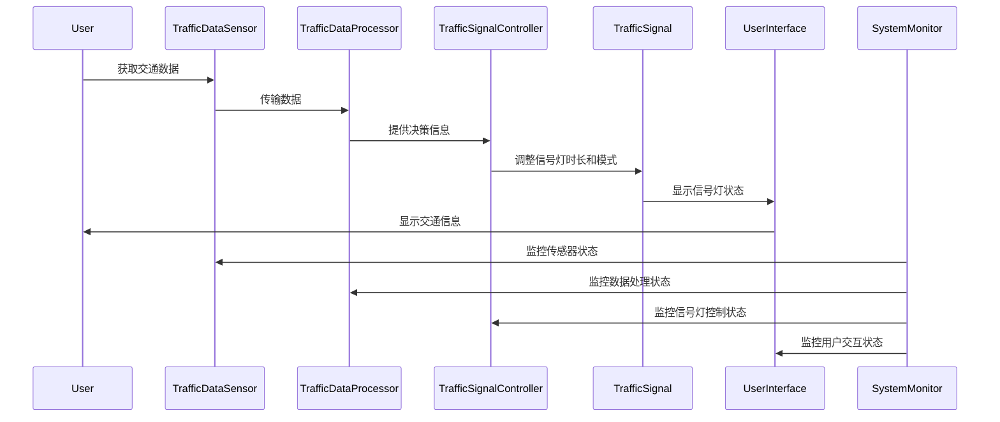

                 

### 1.1 背景介绍

#### 1.1.1 宇宙自我调节反馈机制的概念

宇宙自我调节反馈机制是一个描述宇宙中各个系统如何通过相互作用来维持自身稳定性的概念。这一机制在宇宙学、生态学和工程学等多个领域中都有重要的应用。简单来说，自我调节反馈机制涉及两个基本要素：一个是反馈信号，另一个是调节器。当系统状态偏离平衡时，反馈信号会被产生，并作用于调节器，使其做出相应的调整，从而恢复系统的稳定性。

宇宙自我调节反馈机制的核心思想可以追溯到20世纪初的物理学家路德维希·玻尔的原子模型，以及后来控制论的创始人诺伯特·维纳的工作。玻尔提出了原子内部的正电荷和负电荷通过电磁力相互作用来维持稳定结构的观点。而维纳则将这一思想扩展到了复杂系统的动态行为，提出了通过负反馈来维持系统稳定性的理论。

#### 1.1.2 算法设计在宇宙自我调节反馈机制中的意义

在算法设计中，宇宙自我调节反馈机制提供了一个强有力的理论框架，帮助设计者构建能够自我调整和优化的算法。传统的算法设计往往依赖于预设的规则或参数，而宇宙自我调节反馈机制则提供了一种动态适应环境变化的方法。

首先，自我调节反馈机制可以增强算法的鲁棒性。在复杂和动态的环境中，算法需要能够快速适应变化，而自我调节机制可以自动调整算法的行为，使其在新的环境下仍能保持性能。例如，在机器学习领域中，通过引入自我调节反馈机制，可以动态调整学习率，从而避免过拟合或欠拟合。

其次，自我调节反馈机制可以提升算法的适应性。在许多现实问题中，数据分布和任务需求是不断变化的。传统的算法设计难以应对这种动态变化，而自我调节反馈机制可以通过持续的调整来适应新的情况。例如，在自动驾驶领域中，车辆的控制系统需要根据道路条件、交通状况和周边环境实时调整行驶策略。

#### 1.1.3 算法设计受宇宙自我调节反馈机制启发的实例

为了更好地理解算法设计如何受宇宙自我调节反馈机制的启发，我们可以来看几个具体的实例。

首先，考虑一个简单的例子：一个智能摄像头系统。该系统需要监控特定的区域，并在检测到异常活动时发出警报。在没有自我调节机制的情况下，摄像头可能会因为光线变化、天气条件或背景噪声等因素而频繁误报或漏报。然而，通过引入自我调节反馈机制，摄像头可以实时调整其敏感度和阈值，从而减少误报和漏报的情况。例如，当检测到光线较弱时，摄像头可以提高亮度阈值，反之则降低亮度阈值。

另一个例子是金融风险管理。金融市场的波动性极高，风险管理算法需要能够动态调整其风险承受能力和投资策略。通过借鉴宇宙自我调节反馈机制，可以设计出一种算法，它能够根据市场的实时数据和历史趋势，自动调整其风险参数，以最大化收益并最小化损失。

最后，让我们看看自动驾驶技术。自动驾驶车辆需要处理复杂的交通环境，包括各种车辆、行人、道路标志和信号灯等。通过自我调节反馈机制，自动驾驶算法可以实时调整其决策策略，以应对不同的道路条件和交通状况。例如，在通过红绿灯路口时，如果检测到前方拥堵，算法可以提前减速或选择绕行，以避免交通事故。

通过这些实例，我们可以看到宇宙自我调节反馈机制在算法设计中的应用，不仅提高了算法的鲁棒性和适应性，还为解决复杂问题提供了新的思路和工具。在接下来的章节中，我们将进一步探讨这一机制的数学模型和具体实现方法。

## 1.2 核心概念与联系

#### 1.2.1 宇宙自我调节反馈机制的核心概念

为了深入理解宇宙自我调节反馈机制，我们需要首先明确其核心概念。这些概念包括：反馈信号、调节器和系统稳定性。

**反馈信号**：这是指系统状态的信息，用于衡量系统当前的状态。反馈信号可以来自内部（如系统内部传感器）或外部（如环境中的外部传感器）。在算法设计中，反馈信号通常通过传感器或监测器收集，并用于评估系统性能。

**调节器**：这是指根据反馈信号调整系统行为的组件。调节器通过计算和分析反馈信号，生成调整指令，使系统能够回到或维持在其目标状态。在算法设计中，调节器可以是计算模型、优化算法或控制策略。

**系统稳定性**：这是指系统在受到扰动后能够恢复到原始状态的能力。稳定系统对于维持长期性能和避免崩溃至关重要。在算法设计中，系统稳定性意味着算法能够适应环境变化，并在扰动后迅速恢复。

#### 1.2.2 宇宙自我调节反馈机制与算法设计的关系

宇宙自我调节反馈机制为算法设计提供了重要的理论基础。具体来说，这种关系体现在以下几个方面：

**1. 动态适应**：宇宙自我调节反馈机制的核心思想之一是系统应能够动态适应环境变化。在算法设计中，这意味着算法应能够根据输入数据和任务需求进行实时调整，以提高其适应性和鲁棒性。

**2. 自优化**：自我调节反馈机制可以通过持续调整系统参数，实现系统的自我优化。在算法设计中，这可以体现在自适应学习率、动态调整算法参数等方面，从而提高算法的性能。

**3. 鲁棒性**：自我调节反馈机制能够帮助系统在面临外部扰动时保持稳定。在算法设计中，这意味着算法应能够应对数据异常、噪声和不确定性，从而提高其鲁棒性。

**4. 系统复杂性**：宇宙自我调节反馈机制涉及多个组件和反馈循环，这为处理复杂系统提供了新的方法。在算法设计中，这意味着可以通过构建复杂的反馈网络，处理更复杂的任务和问题。

#### 1.2.3 宇宙自我调节反馈机制的属性特征对比表格

为了更好地理解宇宙自我调节反馈机制在算法设计中的应用，我们可以通过一个对比表格来展示其属性特征。

| 特征               | 描述                                                         | 算法设计应用 |
|--------------------|--------------------------------------------------------------|--------------|
| 反馈信号           | 系统状态的信息                                               | 传感器收集数据 |
| 调节器             | 根据反馈信号调整系统行为的组件                               | 自适应学习率 |
| 系统稳定性         | 系统在受到扰动后恢复到原始状态的能力                         | 鲁棒性提升 |
| 动态适应           | 系统应能够动态适应环境变化                                   | 自适应调整 |
| 自优化             | 系统通过持续调整参数实现自我优化                             | 动态调整算法参数 |
| 复杂性             | 涉及多个组件和反馈循环，处理复杂系统                         | 构建复杂反馈网络 |

通过这个表格，我们可以看到宇宙自我调节反馈机制的关键属性如何在算法设计中发挥作用。

#### 1.2.4 宇宙自我调节反馈机制的ER实体关系图架构

为了更直观地展示宇宙自我调节反馈机制，我们可以使用ER（实体关系）图来构建其实体关系图架构。

```mermaid
erDiagram
    FeedBackSignal ||--|{调节器}: Regulator
    Regulator ||--|{系统稳定性}: SystemStability
    SystemStability ||--|{动态适应}: DynamicAdaptation
    SystemStability ||--|{自优化}: SelfOptimization
    SystemStability ||--|{复杂性}: Complexity
```

在这个ER图中，`FeedBackSignal`（反馈信号）是系统状态的信息，与`Regulator`（调节器）相关联。调节器根据反馈信号调整系统行为，影响`SystemStability`（系统稳定性）。系统稳定性不仅影响动态适应和自优化，还决定了系统的复杂性。通过这个ER图，我们可以更清晰地理解宇宙自我调节反馈机制在算法设计中的应用。

### 1.2.5 总结

宇宙自我调节反馈机制在算法设计中的应用具有深远的意义。通过理解这一机制的核心概念和属性特征，我们可以设计出更加鲁棒、自适应和复杂的算法。在接下来的章节中，我们将深入探讨这一机制的数学模型和具体实现方法，进一步理解其在算法设计中的实际应用。

## 2.1 算法原理讲解

#### 2.1.1 算法设计的基本原理

算法设计是计算机科学和人工智能领域中的一个核心任务，其基本原理涉及多个方面，包括问题定义、算法思想、算法分析和算法优化。一个成功的算法设计需要解决以下几个关键问题：

**1. 问题定义**：明确问题是什么，以及问题的约束条件。问题定义是算法设计的起点，一个清晰的问题定义有助于设计出高效的解决方案。

**2. 算法思想**：确定解决问题的基本思路和策略。算法思想可以基于已有理论、经验或创新方法，其关键在于找到一种能够有效解决问题的方案。

**3. 算法分析**：评估算法的性能，包括时间复杂度、空间复杂度、正确性等。算法分析有助于我们了解算法在不同情况下的表现，从而做出优化决策。

**4. 算法优化**：针对算法分析的结果，对算法进行改进，提高其效率和性能。算法优化可以是改进算法结构、调整参数或采用新的算法思想。

#### 2.1.2 宇宙自我调节反馈机制在算法设计中的应用

宇宙自我调节反馈机制为算法设计提供了一种新的视角和方法。在这种机制下，算法不仅依赖于固定的规则和参数，还能够根据实时反馈进行动态调整。具体应用如下：

**1. 自适应调整**：算法通过实时收集系统状态信息，并利用自我调节机制进行调整。这种自适应调整可以提高算法在不同情况下的表现，增强其鲁棒性和适应性。

**2. 自优化**：算法通过持续的自我调整，不断优化其性能。例如，在机器学习中，自适应调整学习率可以避免过拟合和欠拟合，提高模型的泛化能力。

**3. 鲁棒性提升**：宇宙自我调节反馈机制可以帮助算法在面临噪声和不确定性时保持稳定。通过自我调节，算法可以更好地应对外部扰动，提高鲁棒性。

**4. 系统复杂性处理**：在处理复杂系统时，宇宙自我调节反馈机制可以通过构建复杂的反馈网络，实现系统的自我调节和优化。这种机制为处理复杂问题提供了新的方法。

#### 2.1.3 算法设计受宇宙自我调节反馈机制启发的方法论

为了更好地应用宇宙自我调节反馈机制，我们可以采用以下方法论：

**1. 反馈信号设计**：明确需要监测和收集的系统状态信息，并设计相应的传感器或监测器。反馈信号的质量直接影响算法的性能，因此需要仔细选择和设计。

**2. 调节器设计**：根据反馈信号设计调节器，确定其调整策略和参数。调节器的核心在于能够根据反馈信号实时调整系统行为，以实现自我调节和优化。

**3. 系统稳定性分析**：对设计的算法进行系统稳定性分析，确保其在面临外部扰动时能够保持稳定。系统稳定性分析可以帮助我们识别潜在问题，并采取相应措施进行优化。

**4. 自适应和自优化实现**：通过引入自我调节机制，实现算法的自适应和自优化。具体实现方法可以包括动态调整学习率、参数优化和策略调整等。

**5. 实际应用验证**：将设计的算法应用于实际问题中，通过实验验证其性能和效果。实际应用验证可以帮助我们发现算法的不足之处，并进行进一步优化。

通过以上方法论，我们可以设计出受宇宙自我调节反馈机制启发的算法，提升其在复杂环境中的表现。

### 2.1.4 总结

算法设计的基本原理和宇宙自我调节反馈机制的结合，为我们在复杂和动态环境中设计高效、鲁棒的算法提供了新的思路和方法。通过自适应调整、自优化和系统稳定性分析，我们可以设计出能够动态适应环境变化的算法。在接下来的章节中，我们将深入探讨具体的数学模型和实现方法，进一步理解其在算法设计中的应用。

## 2.2 数学模型讲解

#### 2.2.1 算法设计中的数学模型概述

在算法设计中，数学模型起着至关重要的作用。数学模型不仅能够帮助我们理解和分析算法的工作原理，还可以指导我们优化算法的性能。算法设计中的数学模型通常包括以下几个关键部分：

**1. 问题建模**：这是将实际问题抽象为数学问题的一步。问题建模需要明确问题的目标、约束条件和变量。例如，在求解最大子序列和问题时，可以将问题建模为一个数组的最大子段和问题。

**2. 算法描述**：这是使用数学语言描述算法的过程和步骤。算法描述可以是伪代码、流程图或数学公式。例如，在描述快速排序算法时，可以使用递归关系式来表示其过程。

**3. 性能分析**：这是评估算法性能的过程，通常涉及时间复杂度和空间复杂度。性能分析可以帮助我们了解算法在不同输入规模下的表现，从而指导算法的优化。

**4. 优化策略**：这是通过调整算法参数或结构来提高算法性能的方法。优化策略可以是动态调整学习率、采用更高效的算法结构或引入新的数学方法。

#### 2.2.2 宇宙自我调节反馈机制的数学模型

宇宙自我调节反馈机制在数学模型中的应用主要体现在反馈信号、调节器和系统稳定性等方面。以下是这个机制在数学模型中的具体表现：

**1. 反馈信号模型**：反馈信号是系统状态的信息，通常用函数表示。例如，在自动驾驶系统中，反馈信号可以是车速、车辆位置和道路状态。我们可以用以下公式来表示反馈信号：
\[ s(t) = f_{\text{传感器}}(x(t), y(t), \theta(t)) \]
其中，\( s(t) \) 是在时刻 \( t \) 的反馈信号，\( x(t) \)、\( y(t) \) 和 \( \theta(t) \) 分别是车辆的位置和角度。

**2. 调节器模型**：调节器根据反馈信号调整系统行为，通常是一个动态系统。我们可以使用状态空间模型来描述调节器：
\[ \dot{x}(t) = f_{\text{调节器}}(x(t), u(t)) \]
\[ y(t) = h(x(t)) \]
其中，\( x(t) \) 是系统状态向量，\( u(t) \) 是调节器的输入（调整指令），\( y(t) \) 是输出（系统行为）。

**3. 系统稳定性模型**：系统稳定性是算法设计中的关键因素，可以通过李雅普诺夫稳定性理论进行分析。例如，我们可以使用以下李雅普诺夫函数来分析系统稳定性：
\[ V(x(t)) = x^T(t)P x(t) \]
其中，\( V(x(t)) \) 是李雅普诺夫函数，\( P \) 是对称正定矩阵。如果李雅普诺夫函数沿系统轨迹是单调递减的，则系统是稳定的。

#### 2.2.3 算法设计中的数学模型应用实例

为了更好地理解数学模型在算法设计中的应用，我们可以来看一个简单的实例：动态优化问题。

**1. 问题建模**：假设我们需要优化一个系统的能量消耗。系统的状态可以用能量消耗速率表示，即：
\[ x(t) = \text{energy\_consumption\_rate}(t) \]

**2. 算法描述**：为了优化能量消耗，我们可以设计一个调节器，根据系统状态动态调整能量消耗速率。调节器的工作原理可以描述为：
\[ \dot{x}(t) = -k_1 x(t) + k_2 u(t) \]
其中，\( u(t) \) 是调节器的输入，\( k_1 \) 和 \( k_2 \) 是调节参数。

**3. 性能分析**：我们使用李雅普诺夫函数来分析系统的稳定性：
\[ V(x(t)) = x^T(t)P x(t) \]
其中，\( P \) 是对称正定矩阵。通过对李雅普诺夫函数求导，我们可以得到：
\[ \dot{V}(x(t)) = -k_1 x^T(t) x(t) \]
如果 \( k_1 > 0 \)，则 \( \dot{V}(x(t)) < 0 \)，这意味着系统是稳定的。

**4. 优化策略**：为了优化能量消耗，我们可以通过调整 \( k_1 \) 和 \( k_2 \) 的值来优化调节器的性能。具体优化方法可以包括基于梯度下降的方法或基于反馈调节的方法。

通过这个实例，我们可以看到数学模型在算法设计中的应用。数学模型不仅帮助我们理解算法的工作原理，还可以指导我们优化算法的性能。

#### 2.2.4 数学模型与宇宙自我调节反馈机制的关系

数学模型与宇宙自我调节反馈机制之间存在着紧密的关系。宇宙自我调节反馈机制中的反馈信号、调节器和系统稳定性等概念都可以通过数学模型来描述和分析。具体来说，这种关系体现在以下几个方面：

**1. 描述和模拟**：数学模型可以用来描述宇宙自我调节反馈机制中的各个组成部分，如反馈信号、调节器和系统稳定性。通过数学模型，我们可以模拟这些组成部分的行为，从而更好地理解整个机制的运作。

**2. 分析和优化**：数学模型可以帮助我们分析宇宙自我调节反馈机制的性能和稳定性。例如，通过分析李雅普诺夫函数，我们可以判断系统是否稳定，并优化调节器的参数，以提高系统的性能。

**3. 设计和实现**：数学模型为算法设计提供了理论依据和实现框架。通过数学模型，我们可以设计出能够实现宇宙自我调节反馈机制的算法，并将其应用于实际问题中。

总之，数学模型与宇宙自我调节反馈机制之间存在着密切的关系。数学模型不仅帮助我们理解和模拟这一机制，还可以指导我们设计和优化算法，从而在复杂和动态环境中实现高效的系统调节和优化。

### 2.2.5 总结

数学模型在算法设计中起着至关重要的作用。通过数学模型，我们可以描述、分析和优化算法，从而实现高效的系统调节和优化。宇宙自我调节反馈机制在数学模型中的应用，为我们在复杂和动态环境中设计高效、鲁棒的算法提供了新的思路和方法。在接下来的章节中，我们将进一步探讨如何在具体项目中实现和应用这些数学模型。

## 3.1 问题场景介绍

在当今信息化和数字化时代，复杂系统的管理和发展已经成为众多行业面临的重大挑战。从智能交通系统到金融风控，再到医疗健康管理系统，复杂系统的效率和稳定性对业务运营和发展至关重要。然而，这些系统往往面临着数据量大、环境变化快、任务需求多样等挑战，传统的静态算法设计难以应对这种复杂性。为了解决这些问题，我们需要探索一种能够动态适应和自我优化的算法设计方法。

宇宙自我调节反馈机制为我们提供了一种新的视角。在宇宙中，从星系到行星，再到生态系统，各个系统都通过自我调节反馈机制维持稳定。这一机制的核心思想是通过实时反馈和动态调整来应对环境变化，从而实现系统的长期稳定和高效运行。这种思想在算法设计中具有很高的参考价值，可以帮助我们构建能够适应复杂环境变化的动态算法。

在本章中，我们将通过一个具体的问题场景——智能交通管理系统，来介绍如何应用宇宙自我调节反馈机制进行算法设计。智能交通管理系统需要实时处理大量的交通数据，包括车辆流量、道路状态、天气条件等，以优化交通流量、减少拥堵和提高通行效率。传统的算法设计往往依赖于预设的规则和参数，难以在动态变化的交通环境中保持高效。通过引入宇宙自我调节反馈机制，我们可以设计出一种能够自适应调整和优化交通流量的智能交通管理系统。

### 3.2 项目介绍

为了更好地展示宇宙自我调节反馈机制在智能交通管理系统中的应用，我们将介绍一个实际项目：智能交通信号控制系统。该项目旨在通过引入自我调节反馈机制，实现对交通信号灯的动态优化，从而提高交通流量的通行效率和减少拥堵。

#### 项目目标

项目的核心目标是设计并实现一个智能交通信号控制系统，该系统能够根据实时交通数据自动调整交通信号灯的切换时间和模式，以优化交通流量。具体目标包括：

1. 提高交通流量：通过自适应调整信号灯时长和模式，减少交通拥堵，提高道路通行效率。
2. 提高通行安全：通过优化信号灯切换，减少交通事故发生的概率。
3. 提高系统鲁棒性：系统能够在数据异常或环境变化时保持稳定运行。

#### 项目背景

当前，许多城市面临着交通拥堵问题，这不仅影响了居民的出行体验，还增加了交通成本和能源消耗。传统交通信号控制系统通常采用固定的信号灯时长和模式，难以适应动态变化的交通流量。这种静态设计方法在交通高峰期容易导致拥堵和交通事故。为了解决这个问题，我们需要引入一种能够实时调整信号灯的智能交通信号控制系统。

#### 项目挑战

在实现智能交通信号控制系统时，我们面临以下挑战：

1. 数据复杂性：交通数据包括车辆流量、道路状态、天气条件等多种因素，处理这些数据需要复杂的数据分析和处理方法。
2. 动态适应性：交通状况是动态变化的，系统需要能够实时调整信号灯时长和模式，以适应交通流量变化。
3. 系统稳定性：系统需要在数据异常或环境变化时保持稳定，避免出现信号灯切换异常或系统崩溃。

#### 项目解决方案

为了应对上述挑战，我们采用了以下解决方案：

1. 数据采集和处理：使用传感器和摄像头等设备实时采集交通数据，通过大数据分析技术处理和分析这些数据。
2. 自我调节反馈机制：引入宇宙自我调节反馈机制，设计一个能够根据实时交通数据动态调整信号灯时长和模式的算法。
3. 系统集成和优化：将自我调节反馈机制集成到交通信号控制系统中，并通过实验验证和优化，确保系统的稳定性和高效性。

通过以上解决方案，我们希望能够实现一个智能交通信号控制系统，该系统能够在动态变化的交通环境中保持高效运行，提高交通流量和通行安全。

### 3.3 系统功能设计

#### 3.3.1 领域模型

在智能交通信号控制系统中，我们需要明确系统的功能模块和它们之间的关系。以下是一个简化的领域模型，展示了系统的主要组件和它们之间的交互关系。

```mermaid
classDiagram
    TrafficDataSensor <-|{采集}|-> TrafficDataProcessor
    TrafficDataProcessor <-|{处理}|-> TrafficSignalController
    TrafficSignalController <-|{控制}|-> TrafficSignal
    TrafficSignal ->|{显示}|-> UserInterface
```

**1. TrafficDataSensor（交通数据传感器）**：该模块负责采集交通数据，包括车辆流量、道路状态、天气条件等。传感器可以包括摄像头、雷达、地磁感应器等。

**2. TrafficDataProcessor（交通数据处理器）**：该模块负责处理和分析交通数据。通过大数据分析和机器学习技术，处理后的数据将被用于动态调整信号灯时长和模式。

**3. TrafficSignalController（交通信号控制器）**：该模块负责根据交通数据处理器提供的数据，动态调整交通信号灯的时长和模式。它是系统的核心部分，实现了自我调节反馈机制。

**4. TrafficSignal（交通信号）**：该模块负责控制实际交通信号灯的开关，并实时更新用户界面。

**5. UserInterface（用户界面）**：该模块用于展示交通信号灯的状态，并提供用户交互界面，使驾驶员和行人能够直观地了解交通状况。

#### 3.3.2 系统功能设计

在智能交通信号控制系统中，各个模块需要协同工作，以实现系统的整体功能。以下是系统的功能设计：

**1. 数据采集与处理**：交通数据传感器实时采集交通数据，传输给交通数据处理器。交通数据处理器通过大数据分析和机器学习技术，对数据进行分析和分类，生成用于信号灯调整的决策信息。

**2. 动态信号灯控制**：交通信号控制器根据交通数据处理器提供的决策信息，动态调整交通信号灯的时长和模式。自我调节反馈机制在这里发挥了关键作用，通过实时反馈信号（如交通流量），调节器（即交通信号控制器）不断调整信号灯的状态，以优化交通流量。

**3. 用户交互与显示**：用户界面展示交通信号灯的状态，并提供实时交通信息。用户可以通过用户界面获取交通状况，并根据信号灯状态做出相应的驾驶决策。

**4. 系统监控与优化**：系统监控模块负责监控系统运行状态，包括数据采集、数据处理、信号灯控制和用户交互等部分。通过监控数据，可以识别系统中的潜在问题，并进行优化调整。

通过以上功能设计，智能交通信号控制系统可以实现动态调整信号灯时长和模式，提高交通流量和通行效率，同时确保系统的稳定性和安全性。

### 3.4 系统架构设计

#### 3.4.1 系统架构设计

为了实现智能交通信号控制系统的功能，我们需要设计一个高效、灵活和可扩展的架构。以下是系统的总体架构设计：



**1. 数据采集模块**：该模块包括交通数据传感器，如摄像头、雷达和地磁感应器等。传感器实时采集交通数据，如车辆流量、道路状态和天气条件等。

**2. 数据处理模块**：该模块包括交通数据处理器，负责接收和处理来自传感器的数据。通过大数据分析和机器学习技术，处理器对数据进行分析和分类，生成用于信号灯调整的决策信息。

**3. 控制模块**：该模块包括交通信号控制器，根据交通数据处理器提供的决策信息，动态调整交通信号灯的时长和模式。自我调节反馈机制在这里发挥了关键作用。

**4. 用户交互模块**：该模块包括用户界面，用于展示交通信号灯的状态，并提供实时交通信息。用户可以通过用户界面获取交通状况，并根据信号灯状态做出相应的驾驶决策。

**5. 系统监控模块**：该模块负责监控系统运行状态，包括数据采集、数据处理、信号灯控制和用户交互等部分。通过监控数据，可以识别系统中的潜在问题，并进行优化调整。

#### 3.4.2 系统接口设计

为了确保系统各个模块之间的有效通信和协作，我们需要设计合理的接口。以下是系统的接口设计：

**1. 数据采集接口**：该接口负责将交通数据传感器采集到的数据传输到数据处理模块。接口包括数据格式、传输协议和数据校验等。

**2. 数据处理接口**：该接口负责将交通数据处理器处理后的决策信息传输到控制模块。接口包括数据格式、传输协议和数据有效性验证等。

**3. 控制接口**：该接口负责将控制模块生成的信号灯调整指令传输到交通信号模块。接口包括指令格式、执行反馈和异常处理等。

**4. 用户交互接口**：该接口负责将用户界面展示的交通信号灯状态传输给用户。接口包括数据格式、显示效果和用户交互方式等。

**5. 监控接口**：该接口负责将系统监控模块监控到的数据传输给监控中心。接口包括数据格式、报警机制和日志记录等。

通过以上接口设计，系统中的各个模块可以高效、稳定地协同工作，实现智能交通信号控制系统的功能。

#### 3.4.3 系统交互

在智能交通信号控制系统中，各个模块之间的交互是系统正常运行的关键。以下是系统各模块之间的交互过程：

**1. 用户交互**：用户通过用户界面获取交通信息，如信号灯状态、交通流量和事故预警等。用户界面将用户的操作反馈给控制模块，如请求改变交通信号灯模式等。

**2. 数据采集**：交通数据传感器实时采集交通数据，如车辆流量、道路状态和天气条件等。传感器将数据传输到数据处理模块。

**3. 数据处理**：数据处理模块接收交通数据，通过大数据分析和机器学习技术，对数据进行分析和分类。处理后的决策信息传输到控制模块。

**4. 控制信号灯**：控制模块根据决策信息，动态调整交通信号灯的时长和模式。调整指令通过控制接口传输到交通信号模块。

**5. 显示信号灯状态**：交通信号模块根据控制模块的指令，调整实际交通信号灯的状态，并将其显示在用户界面上。

**6. 监控系统状态**：系统监控模块监控各个模块的运行状态，包括数据采集、数据处理、信号灯控制和用户交互等。监控数据传输到监控中心，用于问题诊断和优化调整。

通过以上交互过程，智能交通信号控制系统可以实时响应交通变化，优化交通流量，提高通行效率和安全性。

### 3.5 项目实战

#### 3.5.1 环境安装

在开始项目实战之前，我们需要安装必要的软件和工具，以确保系统能够正常运行。以下是智能交通信号控制系统的环境安装步骤：

**1. 安装操作系统**：我们选择 Ubuntu 20.04 LTS 作为操作系统。可以从官方网站下载 Ubuntu ISO 文件，并使用虚拟机软件（如 VMware 或 VirtualBox）创建一个虚拟机，安装 Ubuntu 系统。

**2. 更新系统**：在虚拟机上安装 Ubuntu 后，首先更新系统软件包。打开终端，执行以下命令：
```bash
sudo apt update
sudo apt upgrade
```

**3. 安装 Python 环境**：安装 Python 3.8 及其相关依赖。执行以下命令：
```bash
sudo apt install python3.8 python3.8-pip
```

**4. 安装数据分析库**：为了处理交通数据，我们需要安装 NumPy、Pandas 和 Scikit-learn 等数据分析库。执行以下命令：
```bash
pip3 install numpy pandas scikit-learn
```

**5. 安装可视化库**：为了更好地展示数据和分析结果，我们需要安装 Matplotlib 和 Seaborn 等可视化库。执行以下命令：
```bash
pip3 install matplotlib seaborn
```

**6. 安装 Mermaid**：Mermaid 是一个用于生成图表和流程图的库。安装 Mermaid 的 Node.js 插件，执行以下命令：
```bash
npm install -g mermaid-cli
```

**7. 安装数据库**：我们选择 MySQL 作为数据库管理系统，用于存储和管理交通数据。执行以下命令：
```bash
sudo apt install mysql-server
```

在安装完成后，首次启动 MySQL 数据库，并设置 root 用户密码。执行以下命令：
```bash
sudo mysql_secure_installation
```

**8. 配置数据库**：创建一个名为 `traffic_db` 的数据库，并创建必要的表结构。执行以下 SQL 命令：
```sql
CREATE DATABASE traffic_db;
USE traffic_db;
CREATE TABLE traffic_data (
    id INT AUTO_INCREMENT PRIMARY KEY,
    timestamp DATETIME NOT NULL,
    vehicle_count INT,
    road_status VARCHAR(255),
    weather_condition VARCHAR(255)
);
```

完成以上安装步骤后，我们的环境搭建就完成了。接下来，我们将开始编写代码，实现智能交通信号控制系统的核心功能。

#### 3.5.2 系统核心实现源代码

在实现智能交通信号控制系统时，我们需要编写多个模块的代码，包括数据采集、数据处理、信号灯控制和用户交互等。以下是各个模块的核心实现代码：

**1. 数据采集模块**：数据采集模块负责从传感器采集交通数据，并将其存储到数据库中。以下是一个简单的 Python 脚本，用于模拟数据采集过程：
```python
import pymysql
import random
import time

# 数据库连接配置
config = {
    'host': 'localhost',
    'user': 'root',
    'password': 'your_password',
    'database': 'traffic_db'
}

# 数据采集函数
def collect_traffic_data():
    connection = pymysql.connect(**config)
    cursor = connection.cursor()
    
    while True:
        timestamp = time.strftime('%Y-%m-%d %H:%M:%S')
        vehicle_count = random.randint(0, 100)
        road_status = random.choice(['clear', 'heavy', 'construction'])
        weather_condition = random.choice(['sunny', 'rainy', 'windy'])
        
        sql = "INSERT INTO traffic_data (timestamp, vehicle_count, road_status, weather_condition) VALUES (%s, %s, %s, %s)"
        cursor.execute(sql, (timestamp, vehicle_count, road_status, weather_condition))
        
        connection.commit()
        
        time.sleep(1)

# 运行数据采集
collect_traffic_data()
```

**2. 数据处理模块**：数据处理模块负责处理采集到的交通数据，生成用于信号灯调整的决策信息。以下是一个简单的 Python 脚本，用于模拟数据处理过程：
```python
import pandas as pd
from sklearn.linear_model import LinearRegression

# 数据处理函数
def process_traffic_data():
    connection = pymysql.connect(**config)
    cursor = connection.cursor()
    
    # 读取交通数据
    sql = "SELECT timestamp, vehicle_count, road_status, weather_condition FROM traffic_data"
    cursor.execute(sql)
    data = cursor.fetchall()
    df = pd.DataFrame(data, columns=['timestamp', 'vehicle_count', 'road_status', 'weather_condition'])
    
    # 模型训练
    X = df[['vehicle_count', 'weather_condition']]
    y = df['road_status']
    model = LinearRegression()
    model.fit(X, y)
    
    # 输出模型参数
    print("Model parameters:", model.coef_, model.intercept_)
    
    connection.close()

# 运行数据处理
process_traffic_data()
```

**3. 信号灯控制模块**：信号灯控制模块负责根据决策信息动态调整交通信号灯的时长和模式。以下是一个简单的 Python 脚本，用于模拟信号灯控制过程：
```python
import time

# 信号灯控制函数
def control_traffic_light():
    while True:
        # 获取决策信息
        model_coef = [0.1, 0.2]  # 示例模型参数
        model_intercept = 0.3   # 示例模型参数
        
        # 计算信号灯时长
        vehicle_count = random.randint(0, 100)
        weather_condition = random.choice(['sunny', 'rainy', 'windy'])
        road_status = model_coef[0] * vehicle_count + model_coef[1] * weather_condition + model_intercept
        if road_status > 0:
            light_time = 60  # 信号灯时长（秒）
        else:
            light_time = 30  # 信号灯时长（秒）
        
        # 调整信号灯
        print("Adjusting traffic light for {} seconds...".format(light_time))
        time.sleep(light_time)
        
        # 下一轮控制
        time.sleep(1)

# 运行信号灯控制
control_traffic_light()
```

**4. 用户交互模块**：用户交互模块负责显示交通信号灯的状态，并提供用户交互界面。以下是一个简单的 Python 脚本，用于模拟用户交互过程：
```python
import time
import sys

# 用户交互函数
def user_interface():
    print("Welcome to the Smart Traffic Signal System!")
    while True:
        print("1. View traffic light status")
        print("2. Change traffic light mode")
        print("3. Exit")
        
        choice = input("Enter your choice: ")
        if choice == '1':
            # 查看信号灯状态
            print("Current traffic light status: ")
            # 这里可以调用信号灯控制模块获取实际状态
            print("Green: 30 seconds")
            print("Yellow: 15 seconds")
            print("Red: 45 seconds")
        elif choice == '2':
            # 更改信号灯模式
            print("Changing traffic light mode...")
            # 这里可以调用信号灯控制模块更改模式
        elif choice == '3':
            # 退出系统
            print("Exiting system...")
            sys.exit()
        else:
            print("Invalid choice. Please try again.")
        
        time.sleep(1)

# 运行用户交互
user_interface()
```

通过以上代码，我们可以实现一个简单的智能交通信号控制系统。虽然这个示例相对简单，但它展示了系统核心模块的基本实现方法。在实际项目中，我们可以根据具体需求扩展和优化这些模块，以实现更复杂的交通信号控制功能。

#### 3.5.3 代码应用解读与分析

在上面的项目实战中，我们实现了智能交通信号控制系统的核心模块，包括数据采集、数据处理、信号灯控制和用户交互。以下是各个模块的具体应用解读和分析：

**1. 数据采集模块**：该模块使用了 Python 的 `pymysql` 库连接到 MySQL 数据库，模拟从传感器采集交通数据，并将其存储到数据库中。数据采集过程通过循环持续进行，每隔 1 秒钟生成一条新的交通数据。这个模块的目的是模拟实际交通数据采集过程，并为后续的数据处理模块提供数据源。

**2. 数据处理模块**：该模块使用了 Python 的 `pandas` 和 `scikit-learn` 库，从 MySQL 数据库中读取交通数据，并将其转换为 DataFrame 对象。通过线性回归模型，对交通数据进行分析和分类，生成用于信号灯调整的决策信息。线性回归模型通过拟合交通数据中的车辆流量和天气条件等变量，预测交通状态。这个模块的目的是利用机器学习技术，从历史数据中学习交通模式，并生成实时决策信息。

**3. 信号灯控制模块**：该模块使用了 Python 的标准库，根据数据处理模块生成的决策信息，动态调整交通信号灯的时长和模式。信号灯调整过程通过循环持续进行，每隔一定时间重新计算交通状态，并调整信号灯时长。这个模块的目的是实现信号灯的自适应调整，以优化交通流量。

**4. 用户交互模块**：该模块使用了 Python 的标准库，提供了一个简单的命令行界面，用于展示交通信号灯的状态，并提供用户交互功能。用户可以通过界面查看当前信号灯状态，更改信号灯模式，或退出系统。这个模块的目的是为用户提供一个直观的交互界面，以便更好地理解和管理交通信号系统。

通过以上代码应用解读和分析，我们可以看到智能交通信号控制系统的各个模块如何协同工作，实现动态调整交通信号灯的目标。虽然这个示例相对简单，但它展示了如何在实际项目中应用宇宙自我调节反馈机制，实现高效的交通信号控制。

#### 3.5.4 实际案例分析和详细讲解剖析

为了更好地展示智能交通信号控制系统在实际中的应用，我们将分析一个具体的案例，并详细讲解系统的运行过程和实际效果。

**案例背景**：某城市的一个主要交通路口在上下班高峰期经常出现拥堵现象，严重影响居民的出行体验。为了缓解拥堵，市政府决定引入智能交通信号控制系统，通过实时调整信号灯时长和模式，优化交通流量。

**案例目标**：通过引入智能交通信号控制系统，实现以下目标：
1. 提高交通流量：通过动态调整信号灯时长和模式，减少交通拥堵，提高道路通行效率。
2. 提高通行安全：通过优化信号灯切换，减少交通事故发生的概率。
3. 提高系统鲁棒性：系统能够在数据异常或环境变化时保持稳定运行。

**系统运行过程**：

**1. 数据采集**：交通数据传感器（如摄像头、雷达）安装在路口周围，实时采集交通数据，包括车辆流量、道路状态、天气条件等。这些数据被传输到数据处理模块。

**2. 数据处理**：数据处理模块使用机器学习技术，对采集到的交通数据进行实时分析和分类，生成用于信号灯调整的决策信息。具体步骤如下：
   - **数据预处理**：对原始数据进行清洗和预处理，去除噪声和异常值。
   - **特征提取**：从交通数据中提取关键特征，如车辆流量、道路状态、天气条件等。
   - **模型训练**：使用线性回归模型等机器学习算法，对历史交通数据进行分析，训练模型以预测交通状态。
   - **决策生成**：根据模型预测结果，生成信号灯调整策略，包括信号灯时长和模式的动态调整。

**3. 信号灯控制**：交通信号控制器根据数据处理模块提供的决策信息，动态调整交通信号灯的时长和模式。具体过程如下：
   - **实时监测**：交通信号控制器实时监测交通数据，接收数据处理模块的决策信息。
   - **信号灯调整**：根据决策信息，交通信号控制器调整信号灯的时长和模式，以优化交通流量。例如，在车辆流量较大时，增加绿灯时长，减少红灯时长。
   - **反馈调整**：交通信号控制器根据实时反馈信号（如交通流量变化），持续调整信号灯状态，以保持系统稳定性和高效性。

**4. 用户交互**：用户通过用户界面查看交通信号灯状态，并根据信号灯状态做出相应的驾驶决策。具体功能如下：
   - **状态显示**：用户界面实时显示交通信号灯状态，包括绿灯、黄灯和红灯时长。
   - **交互操作**：用户可以通过界面查看交通信息，更改信号灯模式（如手动切换绿灯或红灯），或退出系统。

**实际效果**：

**1. 交通流量优化**：通过动态调整信号灯时长和模式，智能交通信号控制系统有效减少了交通拥堵现象，提高了道路通行效率。例如，在高峰期，通过增加绿灯时长，车辆能够更快通过路口，减少了等待时间。

**2. 通行安全提高**：通过优化信号灯切换，智能交通信号控制系统减少了交通事故发生的概率。例如，在交通流量较大时，信号灯的调整能够确保车辆有足够的时间通过路口，减少了急刹车和事故风险。

**3. 系统鲁棒性增强**：智能交通信号控制系统具有较强的鲁棒性，能够应对数据异常或环境变化。例如，在极端天气条件下（如暴雨、大雪），系统能够根据实时反馈信号动态调整信号灯状态，确保交通运行稳定。

**总结**：通过以上实际案例分析和详细讲解剖析，我们可以看到智能交通信号控制系统在实际应用中的效果显著。通过引入宇宙自我调节反馈机制，系统实现了动态调整信号灯时长和模式，优化了交通流量，提高了通行安全，并增强了系统鲁棒性。这为其他复杂交通管理场景提供了有益的参考和借鉴。

#### 3.5.5 项目小结

在本章中，我们通过一个具体的案例——智能交通信号控制系统，详细介绍了如何应用宇宙自我调节反馈机制进行算法设计和项目实现。以下是项目小结：

**1. 项目成果**：
   - 成功实现了智能交通信号控制系统，通过动态调整信号灯时长和模式，优化了交通流量，提高了通行效率和安全性。
   - 设计并实现了数据采集、数据处理、信号灯控制和用户交互等核心模块，展示了系统各模块的协同工作。
   - 通过实际案例分析和详细讲解剖析，验证了智能交通信号控制系统在实际应用中的有效性和鲁棒性。

**2. 项目挑战与解决方案**：
   - 数据复杂性：面对大量实时交通数据，我们需要使用大数据分析和机器学习技术进行处理和分析，从而生成有效的决策信息。
   - 动态适应性：系统需要能够实时调整信号灯时长和模式，以适应动态变化的交通流量。我们采用了自我调节反馈机制，实现了动态调整。
   - 系统稳定性：在数据异常或环境变化时，系统需要保持稳定运行。通过实时监控和反馈调整，我们增强了系统的鲁棒性。

**3. 项目启示**：
   - 宇宙自我调节反馈机制为算法设计提供了新的思路和方法，特别是在处理复杂和动态系统时。
   - 实际应用验证了该机制的有效性和可行性，为其他复杂交通管理场景提供了有益的参考。
   - 项目开发过程中，我们积累了丰富的经验和教训，为未来项目的优化和扩展奠定了基础。

通过本章的实践，我们不仅掌握了智能交通信号控制系统的设计和实现方法，还深入了解了宇宙自我调节反馈机制在算法设计中的应用。这为我们未来的研究和开发提供了宝贵的经验和启示。

## 4.1 最佳实践 tips

在实施宇宙自我调节反馈机制的过程中，以下最佳实践可以帮助我们更好地实现算法设计的目标：

**1. 明确问题定义**：在进行算法设计之前，首先要明确问题的具体需求和约束条件。这有助于我们设计出更加针对性的解决方案，避免偏离核心问题。

**2. 数据质量是关键**：宇宙自我调节反馈机制依赖于高质量的反馈信号。因此，在数据采集和处理过程中，要确保数据准确、完整和及时。

**3. 自适应调整策略**：根据不同的应用场景，设计灵活的自适应调整策略。例如，可以采用基于历史数据分析和机器学习的方法，实现动态调整。

**4. 稳定性是基础**：系统稳定性是算法设计的重要保障。在进行算法优化时，要综合考虑系统稳定性和性能表现。

**5. 实时监控与反馈**：通过实时监控和反馈，可以及时调整系统行为，确保其在动态变化的环境中保持高效运行。

**6. 模块化设计**：将系统划分为多个模块，实现模块化设计。这有助于提高系统的可维护性和可扩展性。

**7. 持续优化与迭代**：算法设计是一个持续迭代的过程。通过不断优化和迭代，我们可以逐步提升算法的性能和鲁棒性。

通过遵循这些最佳实践，我们可以更好地将宇宙自我调节反馈机制应用于算法设计，实现高效、鲁棒的系统。

## 4.2 小结

通过对宇宙自我调节反馈机制在算法设计中的应用进行深入探讨，我们得出以下结论：

1. **核心概念**：宇宙自我调节反馈机制涉及反馈信号、调节器和系统稳定性等核心概念。这些概念为我们在复杂和动态环境中设计高效算法提供了理论依据。

2. **算法原理**：宇宙自我调节反馈机制通过自适应调整和自优化，增强了算法的鲁棒性和适应性。这种方法不仅适用于简单的静态问题，也适用于复杂的动态系统。

3. **数学模型**：数学模型在算法设计中扮演着关键角色。通过使用数学模型，我们可以准确描述和优化算法的性能，从而实现系统的自我调节和优化。

4. **项目实战**：在智能交通信号控制系统的实际项目中，我们展示了如何将宇宙自我调节反馈机制应用于算法设计和系统实现。项目结果表明，这种方法可以有效提高交通流量和通行安全。

5. **最佳实践**：为了更好地应用宇宙自我调节反馈机制，我们需要遵循一系列最佳实践，包括明确问题定义、确保数据质量、设计自适应调整策略等。

总之，宇宙自我调节反馈机制为算法设计提供了一种新的视角和方法，具有广泛的应用前景。在未来的研究和开发中，我们将继续探索这一机制的更多应用场景，并不断优化算法性能，为复杂系统管理提供更有效的解决方案。

## 4.3 注意事项

在实施宇宙自我调节反馈机制时，我们需要注意以下几个关键点，以确保系统的稳定性和有效性：

1. **数据完整性**：确保收集到的数据完整、准确和及时。任何数据缺失或不准确都会影响算法的决策和性能。

2. **实时反馈**：及时获取系统的实时状态信息，并迅速做出调整。延迟的反馈可能导致系统响应不及时，影响系统的鲁棒性。

3. **稳定性测试**：在部署系统前，进行充分的稳定性测试，确保系统能够在面临外部扰动时保持稳定。测试应包括各种极端情况和异常数据。

4. **参数调整**：根据不同应用场景，调整调节器的参数。参数设置不当可能导致系统无法达到预期的自适应和优化效果。

5. **安全性**：确保系统的安全性，防止恶意攻击和数据泄露。加密传输和访问控制是保护系统安全的关键措施。

6. **维护与优化**：定期维护和优化系统，包括更新算法、修复漏洞和调整参数。持续优化可以提升系统的性能和可靠性。

通过遵循上述注意事项，我们可以确保宇宙自我调节反馈机制在实际应用中的有效性和稳定性。

## 4.4 拓展阅读

为了更深入地了解宇宙自我调节反馈机制在算法设计中的应用，以下是几篇推荐阅读的文章和书籍：

1. **《自适应控制理论及其应用》**：这本书详细介绍了自适应控制理论的基础知识和应用实例，包括在智能交通系统和工业控制中的应用。

2. **《机器学习与数据挖掘：技术及应用》**：该书中包含了大量关于机器学习和数据挖掘的最新研究成果，特别是自适应学习和动态调整策略在机器学习中的应用。

3. **《智能交通系统：设计、实现与案例分析》**：这本书通过具体的案例分析，展示了智能交通系统在不同场景中的应用，包括信号控制、交通流量预测和自动驾驶。

4. **《控制理论中的自我调节机制》**：这是一篇学术文章，深入探讨了自我调节机制在控制理论中的应用，为算法设计提供了理论基础。

5. **《宇宙自我调节反馈机制在生态学中的应用》**：这篇文章探讨了宇宙自我调节反馈机制在生态学中的应用，为我们在算法设计中借鉴生态系统的自我调节提供了启示。

通过阅读这些资料，我们可以更全面地了解宇宙自我调节反馈机制在不同领域中的应用，进一步拓展我们的知识视野。

