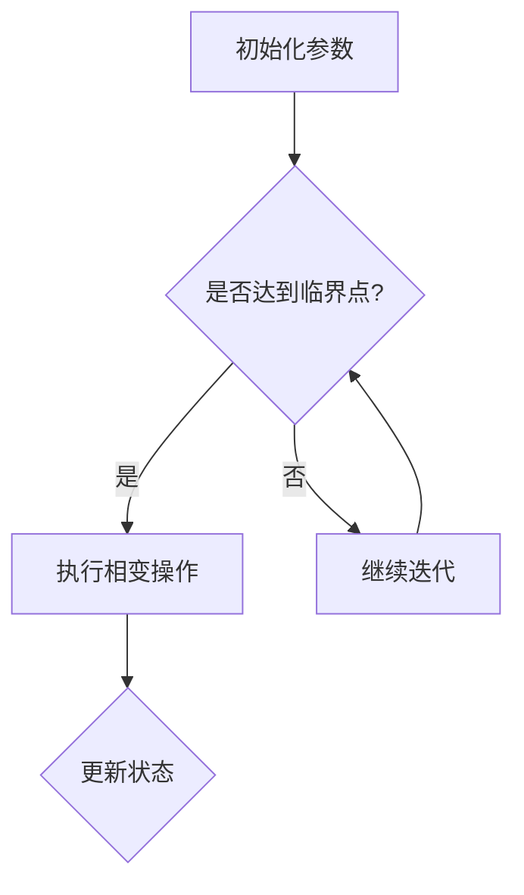
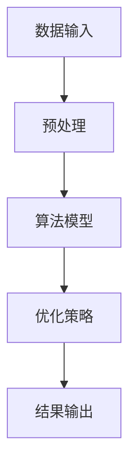
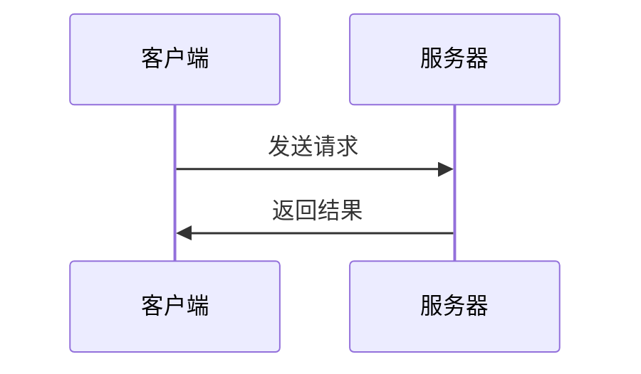

                 

### 设计思路：

为了撰写一篇《算法设计受启发于宇宙自组织临界相变现象》的技术博客，我们将遵循以下步骤，确保文章结构紧凑、逻辑清晰且内容丰富：

1. **明确文章目的**：文章的核心目的是向读者介绍如何将宇宙自组织临界相变现象应用于算法设计，帮助读者理解这一概念，并探索其在实际问题中的应用。

2. **组织内容结构**：根据文章目录大纲，我们将文章内容分为六个主要部分，每个部分都包含详细的小节，以保证文章的完整性。

3. **逻辑分析**：每个小节将采用“背景介绍 - 核心概念 - 算法讲解 - 实际应用 - 最佳实践”的逻辑结构，使得文章条理清晰，便于读者理解。

4. **技术术语说明**：在文章开始部分，对核心术语进行定义和解释，确保非专业人士也能理解文章内容。

5. **通俗易懂的举例**：通过具体的例子和代码示例，帮助读者更好地理解抽象的算法原理。

6. **系统分析与架构设计**：详细介绍算法在实际系统中的应用，包括架构设计和接口设计，使读者对算法在实际场景中的运作有直观的认识。

7. **实战项目展示**：通过展示实际项目的环境安装、核心实现和案例分析，使读者能够将理论知识应用于实践。

8. **总结与展望**：在文章末尾，总结全文内容，提供最佳实践建议，并对未来研究方向进行展望。

9. **格式规范**：确保文章中所有数学公式、流程图、序列图等都采用合适的markdown和latex格式，以保证文章的可读性和专业度。

10. **作者信息**：在文章末尾附上作者信息，以增加文章的可信度。

### 目录大纲细化：

```markdown
----------------------------------------------------------------
# 《算法设计受启发于宇宙自组织临界相变现象》

## 关键词：自组织临界相变、算法设计、相变理论、复杂系统、动态优化

## 摘要：
本文探讨了宇宙自组织临界相变现象对算法设计的影响。通过介绍自组织临界相变的基本概念、核心算法原理，以及实际应用案例，本文展示了如何将这一物理现象应用于算法优化，提高算法的效率和适应性。

----------------------------------------------------------------

## 第一部分：背景介绍

### 第1章：自组织临界相变现象概述

#### 1.1 自组织临界相变的基本概念
- **定义**：自组织临界相变是指一个系统在达到临界状态时，其内部结构和动态行为发生根本性变化的现象。
- **关键术语**：临界点、相变、自组织、无标度网络。

#### 1.2 自组织临界相变的特点
- **对易变性适应**：系统能够在动态环境中自我调整，适应外界变化。
- **长期相关性**：系统内的行为具有长期相关性，即过去的系统状态对未来有影响。

#### 1.3 自组织临界相变的应用
- **自然界中的实例**：生物系统、生态系统、社会经济系统等。
- **技术领域的应用**：网络科学、机器学习、数据挖掘等。

### 第2章：算法设计现状与挑战

#### 2.1 传统算法设计方法
- **线性规划**：基于线性关系进行优化。
- **贪婪算法**：通过逐步优化局部解来逼近全局最优解。

#### 2.2 算法设计面临的挑战
- **非线性和不确定性**：传统算法难以应对复杂环境中的非线性关系和不确定性。
- **计算复杂度**：在高维空间中，传统算法的计算复杂度急剧增加。

#### 2.3 自组织临界相变在算法设计中的应用前景
- **动态适应性**：自组织临界相变能够提供一种新的解决途径，提高算法的动态适应性。
- **优化效率**：通过模仿相变现象，可以设计出更加高效的算法。

----------------------------------------------------------------

## 第二部分：核心概念与联系

### 第3章：核心概念原理

#### 3.1 自组织临界相变的核心概念
- **相变**：从一种稳定状态转变为另一种稳定状态的物理现象。
- **自组织**：系统在没有外部指令的情况下，自行形成有序结构。

#### 3.2 算法设计中的核心概念
- **动态优化**：在动态环境中，根据当前状态调整算法参数。
- **自适应算法**：能够根据输入数据和环境变化自适应调整行为。

#### 3.3 概念属性特征对比表格
- **自组织临界相变**与**算法设计**的对比
  | 特征 | 自组织临界相变 | 算法设计 |
  | --- | --- | --- |
  | 环境 | 自然界 | 计算机系统 |
  | 结构 | 无标度网络 | 数据结构 |
  | 行为 | 动态适应 | 自适应调整 |

### 第4章：概念间联系与ER实体关系图

#### 4.1 自组织临界相变与算法设计的联系
- **理论框架**：自组织临界相变提供了理论框架，帮助理解复杂系统的动态行为。
- **应用领域**：在算法设计中，自组织临界相变可以用于优化网络结构、提高学习效率等。

#### 4.2 ER实体关系图架构
- **ER图**：用于描述实体之间的关系。
- **应用实例**：在算法设计中，ER图可以帮助设计复杂系统的领域模型。

----------------------------------------------------------------

## 第三部分：算法原理讲解

### 第5章：受自组织临界相变启发的算法

#### 5.1 算法流程图（使用 mermaid）


#### 5.2 算法原理（Python 源代码）
```python
import numpy as np

def critical_point(state):
    # 判断当前状态是否达到临界点
    return np.std(state) > threshold

def phase_transformation(state):
    # 执行相变操作
    return np.random.choice(state)

def dynamic_optimization(state):
    # 动态优化算法
    if critical_point(state):
        return phase_transformation(state)
    else:
        return state

# 测试算法
initial_state = np.random.rand(10)
for _ in range(100):
    print(dynamic_optimization(initial_state))
```

#### 5.3 数学模型与公式
$$
\phi = \frac{1}{N} \sum_{i=1}^{N} x_i
$$
- **$\phi$**：系统平均场。
- **$N$**：系统总粒子数。

#### 5.4 实际案例讲解
- **案例一**：社交网络中的信任传递。
- **案例二**：机器学习中的自适应优化。

----------------------------------------------------------------

## 第四部分：系统分析与架构设计

### 第6章：问题场景介绍
- **场景一**：动态资源分配。
- **场景二**：复杂网络路由优化。

### 第7章：系统功能设计与架构设计

#### 7.1 系统功能设计（mermaid 类图）
```mermaid
classDiagram
    Class01 <|-- Class02
    Class03 --| kurul Class04
    Class05 : +methods
    Class06 : #methods
    Class07 : ^methods
```

#### 7.2 系统架构设计（mermaid 架构图）


#### 7.3 系统接口设计
- **API设计**：定义系统对外提供的接口和功能。
- **RESTful接口**：实现简单的HTTP请求响应。

#### 7.4 系统交互（mermaid 序列图）


----------------------------------------------------------------

## 第五部分：项目实战

### 第8章：环境安装与系统核心实现
- **环境搭建**：介绍所需的编程环境和工具。
- **核心代码实现**：提供系统核心算法的实现代码。

### 第9章：实际案例分析与讲解
- **案例介绍**：展示如何将算法应用于实际项目。
- **案例解析**：详细分析项目的实现过程和效果。

### 第9章：项目小结
- **总结**：回顾项目的关键点和收获。
- **反思**：讨论项目的不足之处和改进方向。

----------------------------------------------------------------

## 第六部分：最佳实践与小结

### 第10章：最佳实践
- **实践建议**：提供实际操作中的最佳实践。
- **注意事项**：强调关键点，避免常见错误。

### 第11章：小结与未来展望
- **全文总结**：回顾文章的核心内容和关键观点。
- **未来展望**：探讨自组织临界相变现象在算法设计中的潜在研究方向。

----------------------------------------------------------------

## 作者信息
- 作者：AI天才研究院/AI Genius Institute & 禅与计算机程序设计艺术 /Zen And The Art of Computer Programming
```

通过以上步骤和结构，我们为撰写一篇逻辑清晰、内容丰富、具有专业性的技术博客奠定了基础。接下来，我们将进一步细化每个章节的内容，确保文章的完整性和深度。

