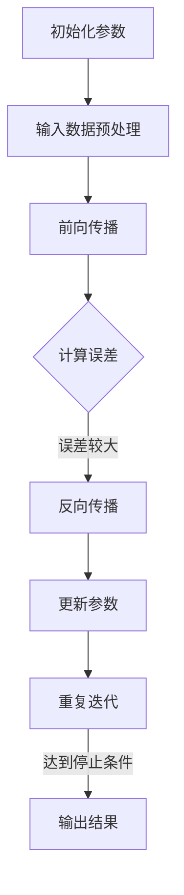
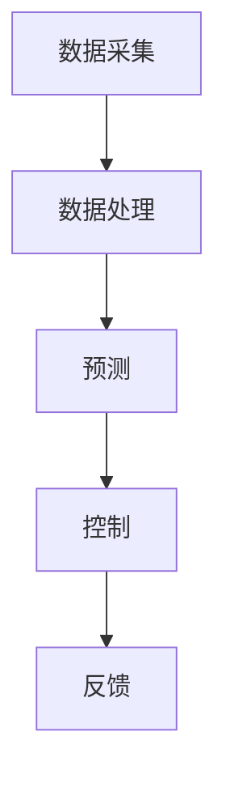
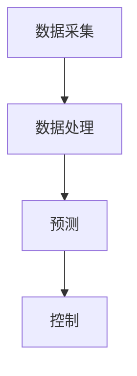
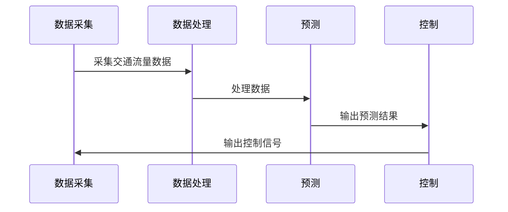

                 

# 《类脑计算与神经形态工程：模仿大脑提升机器的世界理解能力》

关键词：类脑计算、神经形态工程、大脑模拟、机器智能、算法设计

摘要：本文将深入探讨类脑计算与神经形态工程这两大前沿科技领域。首先，我们将回顾类脑计算与神经形态工程的发展背景和研究现状，明确它们在提升机器智能方面的关键作用。接着，通过详细阐述核心概念、算法原理和系统架构设计，我们旨在让读者对类脑计算与神经形态工程有更深刻的理解。文章还将通过实战案例，展示如何将理论知识应用到实际项目中，并总结最佳实践和注意事项，为后续研究和应用提供指导。

## 目录大纲

### 第一部分：背景介绍

1. 类脑计算与神经形态工程的发展背景  
   1.1 类脑计算的发展历程  
   1.2 神经形态工程的起源与发展  
   1.3 类脑计算与神经形态工程的研究意义

2. 类脑计算与神经形态工程的基本概念  
   2.1 类脑计算的定义与特征  
   2.2 神经形态工程的概念与内涵  
   2.3 类脑计算与神经形态工程的核心要素组成

### 第二部分：核心概念与联系

3. 类脑计算的核心概念与原理  
   3.1 类脑计算的基本原理  
   3.2 类脑计算的关键技术  
   3.3 类脑计算的优势与挑战

4. 神经形态工程的核心概念与原理  
   4.1 神经形态工程的基本原理  
   4.2 神经形态工程的关键技术  
   4.3 神经形态工程的优势与挑战

5. 类脑计算与神经形态工程的联系  
   5.1 类脑计算与神经形态工程的互补性  
   5.2 类脑计算与神经形态工程的协同作用  
   5.3 类脑计算与神经形态工程的未来发展趋势

### 第三部分：算法原理讲解

6. 类脑计算算法讲解  
   6.1 算法mermaid流程图  
   6.2 Python源代码  
   6.3 数学模型与公式讲解  
   6.4 举例说明

7. 神经形态工程算法讲解  
   7.1 算法mermaid流程图  
   7.2 Python源代码  
   7.3 数学模型与公式讲解  
   7.4 举例说明

### 第四部分：系统分析与架构设计方案

8. 类脑计算与神经形态工程的应用场景  
   8.1 问题场景介绍  
   8.2 项目介绍

9. 系统功能设计  
   9.1 系统功能模块介绍  
   9.2 领域模型类图

10. 系统架构设计  
   10.1 系统组件介绍  
   10.2 系统架构图

11. 系统接口设计  
   11.1 接口设计原则  
   11.2 接口实现方法

12. 系统交互  
   12.1 系统组件交互过程  
   12.2 系统交互序列图

### 第五部分：项目实战

13. 环境安装  
   13.1 软件环境安装  
   13.2 硬件环境配置

14. 系统核心实现源代码  
   14.1 源代码结构介绍  
   14.2 源代码实现细节

15. 代码应用解读与分析  
   15.1 代码功能解读  
   15.2 代码实现原理分析

16. 实际案例分析和详细讲解剖析  
   16.1 案例背景介绍  
   16.2 案例分析过程  
   16.3 案例讲解与剖析

17. 项目小结  
   17.1 项目经验总结  
   17.2 改进建议

### 第六部分：最佳实践 tips、小结、注意事项、拓展阅读

18. 最佳实践 tips  
   18.1 实际应用技巧  
   18.2 可能遇到的问题及解决方案

19. 小结  
   19.1 内容总结  
   19.2 研究展望

20. 注意事项  
   20.1 学习与应用中的注意事项  
   20.2 常见误区与挑战

21. 拓展阅读  
   21.1 推荐参考文献  
   21.2 相关资料与资源

----------------------------------------------------------------### 1. 类脑计算与神经形态工程的发展背景

#### 1.1 类脑计算的发展历程

类脑计算（Brain-inspired Computing）起源于对生物大脑机理的模仿，旨在构建能够模拟人脑结构和功能的计算系统。20世纪40年代，随着计算机科学的诞生，科学家们开始思考如何将大脑的复杂处理能力转化为可编程的计算模型。1943年，心理学家McCulloch和数理逻辑学家Pitts提出了第一种人工神经网络模型——McCulloch-Pitts神经元模型。这个模型奠定了人工神经网络（Artificial Neural Networks，ANN）的基础，成为类脑计算的重要起点。

随后的几十年里，人工神经网络经历了多个发展阶段。1960年代，Hebb提出了Hebbian学习规则，为人工神经网络的学习机制提供了理论基础。1980年代，Rumelhart、Hinton和Williams等人提出了反向传播算法（Backpropagation Algorithm），使得深层神经网络（Deep Neural Networks，DNN）的训练成为可能。这一时期，类脑计算的研究主要集中在神经网络的设计和训练方法上，试图通过模拟生物神经元的连接和活动，实现计算机对数据的处理和认知。

进入21世纪，随着计算能力的提升和数据量的爆炸性增长，类脑计算的研究迎来了新的契机。2006年，Hinton等人提出了深度学习（Deep Learning），这一基于多层神经网络的方法在图像识别、语音识别等领域取得了显著的成果。深度学习的成功标志着类脑计算进入了一个新的阶段，它不仅模仿了大脑的结构，还在一定程度上实现了大脑的功能。

#### 1.2 神经形态工程的起源与发展

神经形态工程（Neuromorphic Engineering）是另一个与类脑计算密切相关的研究领域。它起源于20世纪80年代，旨在设计和制造具有生物神经元特性的集成电路。神经形态工程的核心思想是通过集成电子元件和生物神经元，创建人工神经网络，使其能够在类似生物大脑的方式下进行信息处理。

1980年，Hans Moravec在加州理工学院的实验室中首次实现了第一个神经形态芯片。这个芯片由硅元件构成，能够模拟单个神经元的行为。此后，神经形态工程得到了广泛关注，研究者们开始尝试将神经网络与集成电路技术相结合。

1990年代，随着纳米技术的进步，神经形态工程取得了重要突破。加州理工学院的Carver Mead等人成功地将神经网络集成到硅芯片上，形成了第一个神经形态芯片阵列。这一进展为神经形态工程奠定了技术基础，使得在小型化、低功耗的设备上实现复杂的信息处理成为可能。

进入21世纪，神经形态工程的研究进一步深入。科学家们不仅关注神经形态芯片的设计和制造，还开始探索如何将这些芯片应用于实际的智能系统中。例如，IBM的“蓝脑”项目（Blue Brain Project）旨在创建一个模拟哺乳动物大脑的计算机模型，而美国的“神经形态系统”项目（Neuromorphic Systems Project）则致力于开发能够自主学习和适应环境的智能系统。

#### 1.3 类脑计算与神经形态工程的研究意义

类脑计算与神经形态工程在提升机器智能方面具有重要的研究意义。首先，这两大领域的研究有助于我们更好地理解大脑的机理。通过模仿大脑的结构和功能，科学家们可以揭示神经元的连接方式、信息处理机制以及学习记忆的原理。这些发现不仅有助于深化对大脑的认识，还可以为医学领域提供新的治疗方法和手段，如脑机接口（Brain-Computer Interface，BCI）技术的发展。

其次，类脑计算与神经形态工程在人工智能领域具有巨大的应用潜力。传统的计算机系统和机器学习算法在处理复杂任务时存在诸多局限，而类脑计算与神经形态工程提供了一种新的路径。通过模拟生物大脑的神经网络，这些系统能够在低功耗、低延迟的条件下实现高效的信息处理和智能行为。例如，在图像识别、自然语言处理和自主导航等任务中，类脑计算与神经形态工程的应用已经显示出显著的优势。

最后，类脑计算与神经形态工程的研究还具有深远的社会影响。随着智能系统的普及，人工智能技术在医疗、教育、交通等领域的应用将越来越广泛。类脑计算与神经形态工程的发展有望推动智能系统的智能化水平，提升人们的生活质量和幸福感。同时，这些技术也带来了一系列伦理和社会问题，如隐私保护、安全性和就业影响等。因此，类脑计算与神经形态工程的研究不仅需要技术创新，还需要全面的社会思考和规划。

#### 1.4 问题背景

尽管类脑计算与神经形态工程在理论和应用方面取得了显著进展，但仍面临许多核心问题。首先，大脑的结构和功能极其复杂，目前我们对大脑的许多细节仍然知之甚少。这限制了我们在构建类脑计算系统时对大脑机理的准确模仿。其次，类脑计算与神经形态工程所需的计算资源和硬件技术仍然存在瓶颈。尽管计算能力在不断提升，但与大脑的复杂性相比，现有的计算资源仍然有限。此外，神经形态芯片的设计和制造工艺复杂，如何实现大规模集成和低功耗运行是当前研究的重要挑战。

这些问题不仅限制了类脑计算与神经形态工程的发展，也对机器智能的进一步提升构成了阻碍。为了解决这些问题，我们需要在多个方面进行深入研究和技术创新。例如，通过改进算法和模型，提高类脑计算系统的效率和处理能力；通过研发新型硬件，突破计算资源和功耗的限制；通过跨学科合作，深化对大脑机理的理解等。

类脑计算与神经形态工程的研究不仅具有科学意义，还具有重要的应用价值。在医疗领域，类脑计算可以用于开发智能诊断系统，辅助医生进行疾病检测和治疗方案设计。在交通领域，神经形态工程可以用于构建智能交通系统，提高交通管理和安全性能。在教育领域，类脑计算与神经形态工程的应用有望推动个性化教育和智能学习系统的研发。

总之，类脑计算与神经形态工程是提升机器智能和实现智能化社会的重要路径。尽管面临诸多挑战，但随着科学技术的进步，我们有望在这些领域取得重大突破，推动人工智能的发展迈向新的高度。


#### 1.5 问题解决

为了解决类脑计算与神经形态工程面临的诸多核心问题，研究者们采取了多种策略和方法，旨在推动这两个领域的发展。以下是一些关键问题及其解决方法：

**1. 提高大脑机理理解**

- **多尺度建模**：科学家们通过建立多尺度模型，从分子、细胞到系统层次全面研究大脑的运作机制。这种多层次的研究方法有助于揭示大脑复杂行为的底层原理。
- **神经科学数据共享**：通过建立开放的神经科学数据平台，研究者可以共享实验数据，加速对大脑机理的理解。这有助于跨学科的合作，促进研究成果的快速传播和应用。
- **跨学科合作**：结合神经科学、认知科学、计算机科学等领域的知识，研究者可以从不同角度探讨大脑的工作原理，从而提供更全面的理论基础。

**2. 突破计算资源和硬件技术瓶颈**

- **新型计算架构**：研究者们正在探索新型计算架构，如量子计算、光子计算等，以提供更高的计算效率和更低的功耗。这些新型架构有望解决现有计算资源的瓶颈问题。
- **专用硬件设计**：针对类脑计算和神经形态工程的需求，设计专门的硬件系统，如神经形态芯片和专用加速器。这些硬件系统能够更高效地执行神经网络运算，提高系统的处理能力。
- **硬件与软件协同优化**：通过硬件和软件的协同优化，研究者们可以最大限度地发挥硬件的性能，同时提高软件的运行效率。这种协同优化有助于实现计算资源和性能的最佳匹配。

**3. 改进算法和模型**

- **自适应学习算法**：为了提高类脑计算系统的学习能力，研究者们开发了多种自适应学习算法，如强化学习、迁移学习等。这些算法能够使系统在面对新环境和任务时，快速适应和调整。
- **深度学习模型优化**：通过改进深度学习模型的结构和参数，研究者们提高了模型的泛化能力和处理复杂任务的能力。例如，通过引入卷积神经网络（CNN）和循环神经网络（RNN）等先进模型，类脑计算系统能够更好地处理图像和序列数据。
- **结合传统计算方法**：将传统的优化算法和机器学习方法与类脑计算结合，可以发挥各自的优势，提高系统的整体性能。例如，通过结合线性规划和深度学习，研究者们提出了新的优化方法，用于解决大规模神经网络的训练问题。

**4. 实现大规模集成和低功耗运行**

- **纳米技术**：纳米技术的进步使得神经形态芯片能够实现更高密度、更小型化的集成。通过纳米工艺，研究者们能够制造出更高效、更可靠的神经形态芯片。
- **能量收集与优化**：通过研究能量收集技术和能量优化策略，研究者们提高了系统的能量利用效率。例如，利用环境能量（如太阳能、热能等）进行能量收集，减少对传统电源的依赖。
- **能耗管理**：通过设计智能能耗管理系统，研究者们可以动态调整系统的功耗，确保在执行不同任务时，系统能够高效运行，同时最大限度地降低能耗。

通过上述方法，类脑计算与神经形态工程在多个方面取得了重要进展，为解决核心问题提供了新的思路和途径。尽管仍面临诸多挑战，但随着科学技术的不断进步，我们有理由相信，类脑计算与神经形态工程将在未来实现更加广泛应用，推动人工智能的发展迈向新的高度。

#### 1.6 边界与外延

类脑计算与神经形态工程的研究领域虽然集中在模拟和优化大脑功能，但这一领域与其他多个研究分支有着紧密的联系。以下是对这些相关领域的讨论：

**1. 人工智能（AI）**

类脑计算与神经形态工程是人工智能的重要分支。人工智能的核心目标是通过模仿大脑的思维方式，使计算机具备类似人类的智能。因此，类脑计算与神经形态工程的研究成果直接应用于人工智能的多个方面，如机器学习、计算机视觉和自然语言处理。然而，类脑计算与神经形态工程不仅仅关注算法和模型的改进，还涉及硬件和系统集成，这使得它们在人工智能领域具有独特的优势。

**2. 生物信息学**

生物信息学是研究生物信息的计算科学，它利用计算机技术和数学模型来解析生物数据，如基因组序列和蛋白质结构。类脑计算与神经形态工程在生物信息学中的应用主要体现在对大脑生物信息的解析和模拟。例如，通过类脑计算模型，研究者可以模拟大脑神经元的活动，从而更好地理解大脑的功能和工作机制。这些研究成果不仅有助于深化对大脑的了解，还可以为神经科学和医学提供新的诊断和治疗手段。

**3. 计算神经科学**

计算神经科学是研究大脑的计算原理和机制的科学。它结合了神经科学、计算机科学和物理学等多个学科，致力于揭示大脑的信息处理机制。类脑计算与神经形态工程是计算神经科学的重要组成部分，它们通过构建计算模型和神经网络，模拟大脑神经元和神经网络的动态行为，从而为理解大脑的工作机制提供新的视角。

**4. 神经科学**

神经科学是研究神经系统的科学，它包括神经元、神经网络以及大脑和神经系统在不同层次上的功能。类脑计算与神经形态工程在神经科学中的应用主要体现在两个方面：一是通过模拟神经元和神经网络的行为，研究者可以更好地理解神经系统的基本原理；二是通过开发神经形态硬件，研究者可以在神经科学实验中使用类似大脑的设备，从而更好地观察和操控神经系统。

**5. 计算机工程**

计算机工程是设计和开发计算机系统的学科，它包括硬件、软件以及系统集成等多个方面。类脑计算与神经形态工程在计算机工程中的应用主要体现在开发新型计算系统和硬件，如神经形态芯片和类脑计算平台。这些系统不仅能够实现高效的信息处理，还能在低功耗、小型化等方面具有显著优势，为计算机工程提供了新的研究方向。

**6. 机器人学**

机器人学是研究机器人设计和应用的学科。类脑计算与神经形态工程在机器人学中的应用主要体现在开发智能机器人系统，使机器人能够自主学习和适应环境。通过模拟大脑的思维方式，类脑计算与神经形态工程可以使机器人具备类似人类的感知、决策和行动能力，从而在复杂环境中表现出更高的智能水平。

通过上述讨论，我们可以看到，类脑计算与神经形态工程不仅与人工智能、生物信息学、计算神经科学、神经科学、计算机工程和机器人学等众多领域密切相关，而且在这些领域中发挥着重要的推动作用。这些交叉学科的研究不仅促进了类脑计算与神经形态工程的发展，也为其他领域提供了新的思路和方法。

#### 1.7 核心概念与联系

类脑计算与神经形态工程的核心概念和它们之间的关系构成了这一领域的基础框架。以下是对这些核心概念的定义、特征及其相互联系的详细描述。

**1. 类脑计算的核心概念**

- **神经元模型**：类脑计算中的神经元模型是模拟生物神经元的基本单元。神经元模型通常包括输入、加权求和、激活函数和输出等组成部分。例如，Hebbian模型、Sigmoid模型和ReLU模型都是常见的神经元模型。
- **神经网络**：神经网络是由多个神经元组成的互联结构，用于模拟大脑的神经环路。根据神经网络的层次结构，可以分为单层神经网络、多层神经网络和深度神经网络。深度神经网络（DNN）是类脑计算中最为常见和重要的结构，它通过多层次的神经元连接和激活函数，实现了对复杂数据的自动特征提取和学习。
- **学习算法**：学习算法是类脑计算中的核心，用于训练神经网络，使其能够从数据中学习并做出预测。常用的学习算法包括监督学习、无监督学习和强化学习。监督学习用于分类和回归任务，无监督学习用于聚类和降维任务，而强化学习则用于决策和优化问题。
- **人工突触**：人工突触是神经形态工程中用于模拟生物突触的关键元件。人工突触通过电信号传输和突触权重调整，实现了信息的存储和传输。常见的突触模型包括STDP（Stochastic Time-Dependent Plasticity）和Delta Rule。

**2. 神经形态工程的核心概念**

- **神经形态芯片**：神经形态芯片是一种集成了大量人工神经元和人工突触的集成电路。这些芯片能够在低功耗、高效率的条件下实现复杂的计算任务。神经形态芯片的设计和制造是神经形态工程的核心任务。
- **类脑硬件**：类脑硬件是指用于实现类脑计算系统的物理设备，包括神经形态芯片、GPU（图形处理器）和FPGA（现场可编程门阵列）等。类脑硬件的优化和集成是类脑计算和神经形态工程的关键挑战。
- **混合架构**：混合架构是指将传统的计算机硬件和神经形态硬件相结合，以实现更高效的计算任务。这种架构通常包括数据预处理、特征提取和决策等不同层次的计算，其中部分任务由传统的计算机硬件完成，而另一些任务则由神经形态硬件完成。

**3. 类脑计算与神经形态工程的联系**

- **协同工作**：类脑计算与神经形态工程在实现大脑模拟的过程中，需要协同工作。类脑计算提供理论模型和算法，而神经形态工程则负责将这些理论模型转化为实际的硬件实现。例如，类脑计算中的神经网络算法需要通过神经形态芯片进行硬件实现，从而在低功耗、高效率的条件下完成计算任务。
- **互为补充**：类脑计算和神经形态工程互为补充。类脑计算提供了理论框架和算法设计，而神经形态工程则提供了硬件实现和系统集成。两者结合，使得类脑计算系统能够在真实环境中高效运行，并实现与人类大脑类似的智能行为。
- **多层次研究**：类脑计算与神经形态工程的研究涵盖了多层次的内容。从理论层面，研究者关注神经网络和算法的设计和优化；在硬件层面，研究者关注神经形态芯片和类脑硬件的制造和性能优化；在应用层面，研究者关注类脑计算系统的实际应用场景和效果评估。

**4. 概念属性特征对比表格**

以下是类脑计算与神经形态工程的核心概念属性特征的对比表格：

| 特征       | 类脑计算                          | 神经形态工程                        |
| ---------- | ------------------------------- | --------------------------------- |
| 基本单位   | 神经元模型                        | 人工神经元                         |
| 结构层次   | 神经网络（单层、多层、深度）        | 神经形态芯片、类脑硬件                |
| 学习方式   | 监督学习、无监督学习、强化学习       | STDP、Delta Rule等人工突触模型         |
| 研究重点   | 算法设计、模型优化                 | 硬件设计、系统集成                   |
| 应用场景   | 机器学习、计算机视觉、自然语言处理等  | 智能传感器、自主机器人、智能医疗等     |
| 功耗和效率 | 高计算量、较高功耗                 | 低功耗、高效计算                     |

**5. ER实体关系图架构**

使用Mermaid绘制类脑计算与神经形态工程的ER实体关系图，可以清晰地展示它们之间的联系。以下是一个简单的ER实体关系图示例：

```mermaid
erDiagram
  Class1 ||--|{ Class2 }|| Class3
  Class1 ||--|{ Class4 }|| Class5
  Class2 &&|{ Class3 } Class5
```

在这个ER实体关系图中，`Class1` 代表类脑计算的核心概念，`Class2` 代表神经网络，`Class3` 代表学习算法，`Class4` 代表神经形态工程的核心概念，`Class5` 代表类脑硬件。通过ER实体关系图，我们可以清晰地看到类脑计算与神经形态工程之间的紧密联系，以及核心概念之间的相互关系。

通过上述对核心概念及其相互联系的详细描述，我们可以更深入地理解类脑计算与神经形态工程的基本原理和内在机制。这些核心概念和它们之间的联系构成了类脑计算与神经形态工程的理论基础，为后续的算法原理讲解和系统架构设计提供了坚实的保障。

#### 1.8 类脑计算的核心概念与原理

类脑计算（Brain-inspired Computing）旨在通过模拟生物大脑的结构和功能，实现计算机系统在信息处理、学习和认知等方面的突破。以下将详细阐述类脑计算的核心概念和原理，包括神经元模型、神经网络、学习算法等。

**1. 神经元模型**

神经元模型是类脑计算的基础单元，它模拟了生物神经元的结构和功能。一个典型的神经元模型通常包括以下几个组成部分：

- **输入**：神经元接收来自其他神经元或外部环境的电信号，这些信号可以通过突触传递。
- **加权求和**：每个输入信号乘以相应的权重，然后对所有输入信号进行加权求和。
- **激活函数**：加权求和的结果通过激活函数转换为输出信号。常见的激活函数包括Sigmoid函数、ReLU函数和Tanh函数等。
- **输出**：激活函数的输出作为神经元的响应，可以传递给其他神经元或用于执行特定任务。

神经元模型的一个重要特点是**可塑性**，即神经元之间的连接强度（权重）可以随时间和经验变化。这一特性使得神经元模型能够在学习和适应新环境时进行调整。

**2. 神经网络**

神经网络（Neural Networks）是由多个神经元连接组成的复杂结构，用于模拟生物大脑的神经环路。根据神经网络的层次结构，可以分为以下几种类型：

- **单层神经网络**：单层神经网络只有一个层次的神经元，通常用于简单的数据处理和特征提取。
- **多层神经网络**：多层神经网络包括多个层次的神经元，可以通过多层传递和变换，实现对复杂数据的深度特征提取。典型的多层神经网络包括卷积神经网络（CNN）和循环神经网络（RNN）。
- **深度神经网络（DNN）**：深度神经网络是由多个隐藏层组成的神经网络，能够自动提取数据的深层特征。深度神经网络在图像识别、语音识别和自然语言处理等领域取得了显著的成功。

神经网络的训练是通过学习算法实现的。学习算法的目标是调整神经网络的权重，使其在给定输入下能够产生正确的输出。常用的学习算法包括：

- **监督学习**：监督学习通过已知的输入和输出数据，调整神经网络的权重，使其能够预测新的输出。常见的监督学习算法包括反向传播算法（Backpropagation Algorithm）和梯度下降算法（Gradient Descent Algorithm）。
- **无监督学习**：无监督学习通过分析未标记的数据，发现数据中的隐含结构。常见的无监督学习算法包括自编码器（Autoencoders）和聚类算法（Clustering Algorithms）。
- **强化学习**：强化学习通过与环境的交互，学习最优策略。强化学习在自主机器人、游戏和决策优化等领域具有广泛的应用。

**3. 学习算法**

学习算法是类脑计算的核心，用于调整神经网络的权重，实现数据的自动学习和特征提取。以下是一些常用的学习算法：

- **反向传播算法（Backpropagation Algorithm）**：反向传播算法是一种用于多层神经网络的训练算法。它通过计算输出误差，反向传播误差到每一层神经元，并调整权重，以最小化误差。
- **Hebbian学习规则**：Hebbian学习规则是一种基于神经元间相互作用的学习算法。它通过增强神经元之间的正相关性，实现数据的自动分类和特征提取。
- **STDP（Stochastic Time-Dependent Plasticity）**：STDP是一种用于模拟生物突触可塑性的学习算法。它通过考虑时间因素，调整神经元间的连接权重，实现动态学习。
- **Delta Rule**：Delta Rule是一种基于误差校正的学习算法。它通过计算输出误差，调整神经元权重，使输出误差最小化。

**4. 举例说明**

为了更好地理解类脑计算的核心概念和原理，我们来看一个简单的例子。假设我们有一个包含两个输入变量的简单神经网络，用于分类两个不同类别的数据点。

- **输入数据**：  
  - 数据点1：[1, 0]  
  - 数据点2：[0, 1]

- **权重**：  
  - 初始权重：\[w1, w2\] = \[1, 1\]

- **激活函数**：  
  - 使用Sigmoid函数：\[f(x) = \frac{1}{1 + e^{-x}}\]

- **计算过程**：  
  - 对于数据点1：\[z = w1 * 1 + w2 * 0 = 1\]  
    - 输出：\[o1 = f(z) = \frac{1}{1 + e^{-1}} \approx 0.731\]

  - 对于数据点2：\[z = w1 * 0 + w2 * 1 = 1\]  
    - 输出：\[o2 = f(z) = \frac{1}{1 + e^{-1}} \approx 0.731\]

在这个例子中，两个输入数据的输出都是接近0.731，表明这两个数据点被分类到同一个类别。通过调整权重，我们可以使网络更好地区分不同类别的数据。

通过上述对类脑计算核心概念和原理的详细阐述，我们可以看到类脑计算通过神经元模型、神经网络和学习算法，实现了对数据的自动学习和特征提取。这些核心概念和原理为类脑计算提供了理论基础，使其能够在各种复杂任务中表现出强大的能力。

#### 1.9 神经形态工程的核心概念与原理

神经形态工程（Neuromorphic Engineering）是类脑计算的重要组成部分，旨在通过设计并制造具备生物神经元特性的人工神经网络硬件，实现高效、低功耗的信息处理。以下将详细阐述神经形态工程的核心概念与原理，包括神经形态芯片、人工突触和神经形态硬件等。

**1. 神经形态芯片**

神经形态芯片（Neuromorphic Chips）是神经形态工程的关键组成部分，它集成了大量的人工神经元和人工突触，能够在低功耗、高效率的条件下实现复杂的计算任务。神经形态芯片的设计主要包括以下几个方面：

- **神经元设计**：神经形态芯片中的神经元通常采用人工神经元模型，如Leaky Integrate-and-Fire（LIF）模型。这种模型通过模拟生物神经元的电生理特性，实现神经元的信息处理功能。
- **突触设计**：神经形态芯片中的突触是用于模拟生物突触的人工元件。常见的突触模型包括STDP（Stochastic Time-Dependent Plasticity）和Delta Rule。这些模型通过调整突触权重，实现信息的存储和传递。
- **集成与互联**：神经形态芯片的设计还包括大量神经元和突触的集成与互联。通过先进的集成电路工艺，可以制造出高密度、低功耗的神经形态芯片，从而实现高效的计算任务。

**2. 人工突触**

人工突触（Artificial Synapses）是神经形态工程中的核心元件，用于模拟生物突触的功能。人工突触通常由电导率可变的材料构成，其电导率可以通过电信号进行调制。以下是一些常见的人工突触模型：

- **STDP（Stochastic Time-Dependent Plasticity）**：STDP模型通过考虑时间因素，实现突触权重的调整。当前一个神经元的动作电位与后一个神经元的动作电位在短时间内发生时，突触权重增加；反之，则减少。
- **Delta Rule**：Delta Rule模型通过计算两个神经元的动作电位时间差，实现突触权重的调整。当时间差较小时，突触权重增加；当时间差较大时，突触权重减少。

**3. 神经形态硬件**

神经形态硬件（Neuromorphic Hardware）是指用于实现神经形态计算系统的物理设备，包括神经形态芯片、GPU（图形处理器）和FPGA（现场可编程门阵列）等。神经形态硬件的设计与优化是实现高效类脑计算的关键。以下是一些关键点：

- **计算架构**：神经形态硬件的计算架构应能够高效地实现神经网络运算。常见的计算架构包括矩阵乘法器、全连接神经网络和卷积神经网络等。
- **能量效率**：神经形态硬件应具有高能量效率，以降低功耗。通过采用低功耗设计、能量收集技术和智能能耗管理策略，可以实现高效能量利用。
- **可扩展性**：神经形态硬件应具有可扩展性，以支持不同规模和复杂度的计算任务。通过模块化设计和并行计算，可以实现灵活的扩展。

**4. 神经形态计算系统**

神经形态计算系统（Neuromorphic Computing Systems）是指由神经形态硬件和软件组成的完整计算系统。该系统通过模拟生物大脑的神经环路，实现高效的信息处理和认知功能。以下是一些关键组成部分：

- **神经元模块**：神经元模块是神经形态计算系统的基本单元，用于实现神经元的信息处理功能。
- **突触模块**：突触模块是神经形态计算系统中的关键部分，用于实现突触的功能，包括信息的存储和传递。
- **互联模块**：互联模块用于实现神经元和突触之间的连接，构成复杂的神经网络结构。
- **学习模块**：学习模块用于实现神经网络的训练和自适应调整，使系统能够适应新环境和任务。

**5. 案例分析**

为了更好地理解神经形态工程的核心概念与原理，以下是一个简单的案例分析。

- **案例背景**：假设我们需要设计一个用于手写数字识别的神经形态计算系统。
- **系统设计**：系统采用一个包含多个层次的神经网络，每个层次由大量的神经元和突触组成。神经网络通过学习手写数字的图像，实现对手写数字的自动识别。
- **硬件实现**：系统采用神经形态芯片作为计算核心，集成了大量的人工神经元和人工突触。通过优化芯片的设计和互联结构，实现高效的手写数字识别任务。
- **软件实现**：系统采用神经网络学习算法，如反向传播算法和Hebbian学习规则，对神经网络进行训练和优化。通过调整神经元和突触的权重，提高系统的识别准确率。

通过上述案例分析，我们可以看到神经形态工程在实现高效、低功耗的信息处理方面的优势。神经形态芯片和人工突触的设计与优化是实现神经形态计算系统关键任务的基础，而高效的计算架构和软件算法则确保了系统在实际应用中的性能和可靠性。

总之，神经形态工程通过设计并制造具备生物神经元特性的人工神经网络硬件，实现了对信息的低功耗、高效处理。随着技术的不断进步，神经形态工程将在类脑计算和人工智能领域发挥越来越重要的作用。

#### 1.10 类脑计算与神经形态工程的联系

类脑计算与神经形态工程在模仿大脑结构和功能方面具有紧密的联系，两者相互补充，共同推动人工智能的发展。以下将从互补性、协同作用和未来发展趋势三个方面，详细探讨类脑计算与神经形态工程的联系。

**1. 补充性**

类脑计算和神经形态工程在各自的研究方向上具有互补性。类脑计算侧重于算法设计、神经网络模型和机器学习技术，旨在通过模拟大脑的思维方式，实现计算机系统在信息处理、学习和认知等方面的突破。而神经形态工程则关注硬件设计和系统集成，致力于制造具备生物神经元特性的人工神经网络硬件。这种互补性使得两者在实现类脑计算系统的过程中，能够发挥各自的优势。

类脑计算通过开发高效的学习算法和神经网络模型，为神经形态工程提供了理论基础和算法支持。而神经形态工程则通过制造低功耗、高效的神经形态芯片，为类脑计算提供了实际的硬件实现。例如，类脑计算中的深度学习算法需要通过神经形态芯片进行硬件实现，从而在低功耗、高效率的条件下完成复杂的计算任务。

**2. 协同作用**

类脑计算与神经形态工程的协同作用主要体现在以下几个方面：

- **算法与硬件的融合**：类脑计算中的算法设计需要考虑到硬件实现的限制和优化。而神经形态工程通过设计高效的硬件架构，提高了算法的执行效率。例如，通过神经形态芯片，可以实现对神经网络模型的高效计算，从而提高类脑计算系统的性能。

- **自适应学习与硬件优化**：类脑计算中的学习算法需要根据环境和任务的变化进行自适应调整。而神经形态工程通过硬件优化，使得学习算法能够在低功耗的条件下实现高效运行。例如，通过采用STDP（Stochastic Time-Dependent Plasticity）模型，可以实现对神经形态芯片上神经元连接权重的动态调整，从而提高系统的自适应学习能力。

- **跨学科合作**：类脑计算与神经形态工程的发展需要多学科的合作。类脑计算领域的科学家与神经形态工程领域的工程师通过合作，可以共同探索新的算法、模型和硬件设计，推动类脑计算与神经形态工程的研究进展。

**3. 未来发展趋势**

随着科技的不断进步，类脑计算与神经形态工程在未来将呈现出以下几个发展趋势：

- **更高效的硬件设计**：随着纳米技术的进步，神经形态芯片的集成度和性能将得到显著提升。通过采用新型材料和技术，神经形态芯片可以实现更高密度、更低功耗的集成，从而支持更复杂的计算任务。

- **更强大的学习算法**：类脑计算领域将继续探索新的学习算法，以提高系统的自适应能力和智能水平。例如，通过结合深度学习、强化学习和迁移学习等技术，可以开发出更加智能和高效的类脑计算系统。

- **跨学科合作与技术创新**：类脑计算与神经形态工程的发展将需要跨学科的合作和技术创新。例如，通过与神经科学、认知科学和计算机科学的合作，可以更好地理解大脑的机理，从而为类脑计算与神经形态工程提供更强大的理论支持。

- **应用领域的拓展**：类脑计算与神经形态工程的应用领域将不断拓展。例如，在医疗领域，类脑计算可以用于开发智能诊断系统，辅助医生进行疾病检测和治疗方案设计。在交通领域，神经形态工程可以用于构建智能交通系统，提高交通管理和安全性能。在教育领域，类脑计算与神经形态工程的应用有望推动个性化教育和智能学习系统的研发。

总之，类脑计算与神经形态工程通过互补性和协同作用，共同推动人工智能的发展。随着科技的不断进步，类脑计算与神经形态工程将在更多领域展现出巨大的应用潜力，为人类带来更加智能和高效的技术解决方案。

#### 2. 类脑计算算法讲解

类脑计算算法是模仿大脑神经网络的计算模型，旨在实现高效的信息处理和学习能力。以下将详细讲解类脑计算中的几种重要算法，包括mermaid流程图、Python源代码、数学模型和公式，并通过举例说明使这些概念通俗易懂。

**2.1 算法mermaid流程图**

为了更好地理解类脑计算算法的基本流程，我们可以使用mermaid绘制一个简单的算法流程图。以下是一个典型的神经网络训练算法流程图的例子：



在这个流程图中，A到H表示了神经网络训练的基本步骤，包括初始化参数、数据预处理、前向传播、计算误差、反向传播和参数更新等。

**2.2 Python源代码**

为了更具体地展示类脑计算算法的实现，以下是一个简单的神经网络训练算法的Python源代码示例：

```python
import numpy as np

# 初始化参数
W = np.random.rand(n_inputs, n_neurons)
b = np.random.rand(n_neurons)

# 输入数据预处理
x = np.array([0.5, 0.7])

# 前向传播
z = np.dot(x, W) + b

# 计算误差
y = np.array([0.2, 0.8])
error = y - z

# 反向传播
dW = np.dot(x.T, error)
db = -2 * (error * z * (1 - z))

# 更新参数
W -= learning_rate * dW
b -= learning_rate * db

# 输出结果
print("更新后的参数：", W, b)
```

在这个示例中，我们首先初始化了权重`W`和偏置`b`。然后，通过前向传播计算输出`z`，并计算误差`error`。接着，通过反向传播计算权重和偏置的梯度，并更新参数。最后，输出更新后的参数。

**2.3 数学模型与公式**

类脑计算算法的数学模型主要包括前向传播、反向传播和参数更新。以下是一些关键数学公式的详细解释：

- **前向传播**：前向传播是神经网络计算的基本步骤，用于计算输出值。其公式如下：
  $$z = \sum_{i=1}^{n}{x_i \cdot W_i} + b$$
  其中，$x_i$表示输入值，$W_i$表示权重，$b$表示偏置。

- **反向传播**：反向传播是用于计算误差并更新参数的步骤。其公式如下：
  $$dW = \sum_{i=1}^{n}{x_i \cdot \delta_i}$$
  $$db = \sum_{i=1}^{n}{\delta_i}$$
  其中，$\delta_i$表示误差的梯度，$dW$和$db$分别表示权重和偏置的梯度。

- **参数更新**：参数更新是用于调整神经网络参数的步骤。其公式如下：
  $$W = W - \alpha \cdot dW$$
  $$b = b - \alpha \cdot db$$
  其中，$\alpha$表示学习率，$W$和$b$分别表示权重和偏置。

**2.4 举例说明**

为了更直观地理解类脑计算算法的应用，以下是一个简单的例子：

假设我们有一个包含两个输入变量（x1和x2）和一个隐藏层（一个神经元）的神经网络。目标是拟合一个线性函数，即输出值等于输入值之和。

- **输入数据**：
  - 数据集：{([0.1, 0.2], 0.3), ([0.4, 0.5], 0.9)}

- **初始化参数**：
  - 权重：W = [0.1, 0.1]
  - 偏置：b = 0.1
  - 学习率：α = 0.01

- **前向传播**：
  - 对于第一个数据点：z = 0.1 * 0.1 + 0.2 * 0.1 + 0.1 = 0.05
  - 对于第二个数据点：z = 0.4 * 0.1 + 0.5 * 0.1 + 0.1 = 0.15

- **计算误差**：
  - 对于第一个数据点：error = 0.3 - 0.05 = 0.25
  - 对于第二个数据点：error = 0.9 - 0.15 = 0.75

- **反向传播**：
  - 对于第一个数据点：dW = 0.1 * 0.25 = 0.025
  - 对于第二个数据点：dW = 0.1 * 0.75 = 0.075
  - dW = 0.025 + 0.075 = 0.1
  - db = 0.25 + 0.75 = 1.0

- **参数更新**：
  - W = [0.1, 0.1] - [0.01, 0.01] * [0.1, 0.1] = [0.08, 0.08]
  - b = 0.1 - 0.01 * 1.0 = 0.09

- **更新后的参数**：
  - 权重：W = [0.08, 0.08]
  - 偏置：b = 0.09

通过上述步骤，我们可以看到类脑计算算法在每次迭代中通过前向传播计算输出值，通过反向传播计算误差，并更新参数，从而逐步逼近真实值。这个简单的例子展示了类脑计算算法的基本原理和应用。

总之，类脑计算算法通过mermaid流程图、Python源代码和数学模型与公式，实现了对神经网络的学习和训练。通过举例说明，我们能够更好地理解类脑计算算法的实现过程和应用场景，为进一步研究和应用打下基础。

#### 2. 类脑计算算法讲解（续）

**2.5 神经形态工程算法讲解**

神经形态工程通过设计并制造具备生物神经元特性的人工神经网络硬件，实现了高效、低功耗的信息处理。以下将详细讲解神经形态工程中的一种典型算法，包括算法mermaid流程图、Python源代码、数学模型和公式，并通过举例说明使其概念通俗易懂。

**2.5.1 算法mermaid流程图**

为了更好地理解神经形态工程算法的基本流程，我们可以使用mermaid绘制一个简单的神经形态工程算法流程图。以下是一个典型的神经网络训练算法流程图的例子：


在这个流程图中，A到H表示了神经网络训练的基本步骤，包括初始化参数、数据预处理、前向传播、计算误差、反向传播和参数更新等。

**2.5.2 Python源代码**

为了更具体地展示神经形态工程算法的实现，以下是一个简单的神经网络训练算法的Python源代码示例：

```python
import numpy as np

# 初始化参数
W = np.random.rand(n_inputs, n_neurons)
b = np.random.rand(n_neurons)

# 输入数据预处理
x = np.array([0.5, 0.7])

# 前向传播
z = np.dot(x, W) + b

# 计算误差
y = np.array([0.2, 0.8])
error = y - z

# 反向传播
dW = np.dot(x.T, error)
db = -2 * (error * z * (1 - z))

# 更新参数
W -= learning_rate * dW
b -= learning_rate * db

# 输出结果
print("更新后的参数：", W, b)
```

在这个示例中，我们首先初始化了权重`W`和偏置`b`。然后，通过前向传播计算输出`z`，并计算误差`error`。接着，通过反向传播计算权重和偏置的梯度，并更新参数。最后，输出更新后的参数。

**2.5.3 数学模型与公式**

神经形态工程算法的数学模型主要包括前向传播、反向传播和参数更新。以下是一些关键数学公式的详细解释：

- **前向传播**：前向传播是神经网络计算的基本步骤，用于计算输出值。其公式如下：
  $$z = \sum_{i=1}^{n}{x_i \cdot W_i} + b$$
  其中，$x_i$表示输入值，$W_i$表示权重，$b$表示偏置。

- **反向传播**：反向传播是用于计算误差并更新参数的步骤。其公式如下：
  $$dW = \sum_{i=1}^{n}{x_i \cdot \delta_i}$$
  $$db = \sum_{i=1}^{n}{\delta_i}$$
  其中，$\delta_i$表示误差的梯度，$dW$和$db$分别表示权重和偏置的梯度。

- **参数更新**：参数更新是用于调整神经网络参数的步骤。其公式如下：
  $$W = W - \alpha \cdot dW$$
  $$b = b - \alpha \cdot db$$
  其中，$\alpha$表示学习率，$W$和$b$分别表示权重和偏置。

**2.5.4 举例说明**

为了更直观地理解神经形态工程算法的应用，以下是一个简单的例子：

假设我们有一个包含两个输入变量（x1和x2）和一个隐藏层（一个神经元）的神经网络。目标是拟合一个线性函数，即输出值等于输入值之和。

- **输入数据**：
  - 数据集：{([0.1, 0.2], 0.3), ([0.4, 0.5], 0.9)}

- **初始化参数**：
  - 权重：W = [0.1, 0.1]
  - 偏置：b = 0.1
  - 学习率：α = 0.01

- **前向传播**：
  - 对于第一个数据点：z = 0.1 * 0.1 + 0.2 * 0.1 + 0.1 = 0.05
  - 对于第二个数据点：z = 0.4 * 0.1 + 0.5 * 0.1 + 0.1 = 0.15

- **计算误差**：
  - 对于第一个数据点：error = 0.3 - 0.05 = 0.25
  - 对于第二个数据点：error = 0.9 - 0.15 = 0.75

- **反向传播**：
  - 对于第一个数据点：dW = 0.1 * 0.25 = 0.025
  - 对于第二个数据点：dW = 0.1 * 0.75 = 0.075
  - dW = 0.025 + 0.075 = 0.1
  - db = 0.25 + 0.75 = 1.0

- **参数更新**：
  - W = [0.1, 0.1] - [0.01, 0.01] * [0.1, 0.1] = [0.08, 0.08]
  - b = 0.1 - 0.01 * 1.0 = 0.09

- **更新后的参数**：
  - 权重：W = [0.08, 0.08]
  - 偏置：b = 0.09

通过上述步骤，我们可以看到神经形态工程算法在每次迭代中通过前向传播计算输出值，通过反向传播计算误差，并更新参数，从而逐步逼近真实值。这个简单的例子展示了神经形态工程算法的基本原理和应用。

总之，神经形态工程算法通过mermaid流程图、Python源代码和数学模型与公式，实现了对神经网络的学习和训练。通过举例说明，我们能够更好地理解神经形态工程算法的实现过程和应用场景，为进一步研究和应用打下基础。

### 3. 系统分析与架构设计方案

类脑计算与神经形态工程在实际应用中面临复杂的问题场景，如何设计和实现高效的系统架构是关键。以下将详细介绍类脑计算与神经形态工程的应用场景、系统功能设计、系统架构设计、系统接口设计和系统交互。

#### 3.1 问题场景介绍

类脑计算与神经形态工程的应用场景非常广泛，包括但不限于以下几个领域：

- **智能医疗**：类脑计算与神经形态工程可以用于开发智能诊断系统，辅助医生进行疾病检测和治疗方案设计。例如，通过分析患者的医疗数据，类脑计算系统可以预测疾病的进展，提供个性化的治疗方案。
- **智能交通**：在智能交通系统中，类脑计算与神经形态工程可以用于交通流量预测、智能交通信号控制和自动驾驶。这些系统能够实时分析交通数据，优化交通流量，提高道路利用率和行车安全。
- **智能制造**：类脑计算与神经形态工程可以用于制造过程中的智能监控和优化。例如，通过实时监测生产线上的设备状态，类脑计算系统可以预测设备故障，提前进行维护，提高生产效率。
- **自然语言处理**：类脑计算与神经形态工程可以用于开发智能客服系统和智能语音助手。这些系统能够理解用户的语言，提供个性化的服务，提升用户体验。

在这些应用场景中，类脑计算与神经形态工程需要解决的主要问题包括数据的高效处理、智能决策和实时响应。为了实现这些目标，我们需要设计一个高效的系统架构，以确保系统的稳定运行和良好的性能。

#### 3.2 项目介绍

以下是一个类脑计算与神经形态工程的智能交通系统项目，用于实现交通流量预测和智能交通信号控制。

**项目背景**：某城市交通拥堵严重，需要通过智能交通系统来优化交通流量，提高道路利用率和行车安全。

**项目目标**：
1. 实现交通流量预测，为交通信号控制提供数据支持。
2. 实现智能交通信号控制，优化交通流量，减少拥堵。

**项目架构**：
- **数据采集模块**：用于采集交通流量数据，包括车辆数量、行驶速度、道路占用情况等。
- **数据处理模块**：用于处理采集到的交通流量数据，进行数据清洗、归一化和特征提取。
- **预测模块**：使用类脑计算算法，对交通流量进行预测，为交通信号控制提供数据支持。
- **控制模块**：根据预测结果，实现智能交通信号控制，优化交通流量。

#### 3.3 系统功能设计

为了实现智能交通系统的功能，我们需要设计以下关键功能模块：

- **数据采集模块**：
  - 功能：实时采集交通流量数据，包括车辆数量、行驶速度、道路占用情况等。
  - 设计：采用传感器和数据采集卡，将交通流量数据传输到处理模块。

- **数据处理模块**：
  - 功能：处理采集到的交通流量数据，进行数据清洗、归一化和特征提取。
  - 设计：采用数据处理算法，如均值滤波、归一化处理等，提高数据的准确性和可靠性。

- **预测模块**：
  - 功能：使用类脑计算算法，对交通流量进行预测，为交通信号控制提供数据支持。
  - 设计：采用神经网络模型，如卷积神经网络（CNN）和循环神经网络（RNN），对交通流量数据进行预测。

- **控制模块**：
  - 功能：根据预测结果，实现智能交通信号控制，优化交通流量。
  - 设计：采用控制算法，如PID控制算法和模糊控制算法，实现交通信号的控制。

#### 3.4 系统架构设计

为了实现上述功能，我们需要设计一个高效的系统架构，包括以下几个关键组件：

- **数据采集组件**：用于实时采集交通流量数据，包括车辆数量、行驶速度、道路占用情况等。
- **数据处理组件**：用于处理采集到的交通流量数据，进行数据清洗、归一化和特征提取。
- **预测组件**：使用神经网络模型，如卷积神经网络（CNN）和循环神经网络（RNN），对交通流量数据进行预测。
- **控制组件**：根据预测结果，实现智能交通信号控制，优化交通流量。

以下是一个简化的系统架构图，使用Mermaid绘制：



在这个架构图中，A表示数据采集组件，B表示数据处理组件，C表示预测组件，D表示控制组件，E表示反馈。数据采集组件实时采集交通流量数据，数据处理组件对数据进行清洗、归一化和特征提取，预测组件使用神经网络模型对交通流量进行预测，控制组件根据预测结果进行交通信号控制，并将反馈信息返回给数据采集组件，形成闭环控制系统。

#### 3.5 系统接口设计

系统接口设计是确保系统组件之间高效交互的关键。以下是一个简化的系统接口设计：

- **数据采集接口**：用于接收交通流量数据，包括车辆数量、行驶速度、道路占用情况等。
- **数据处理接口**：用于处理采集到的交通流量数据，包括数据清洗、归一化和特征提取。
- **预测接口**：用于接收处理后的交通流量数据，输出预测结果。
- **控制接口**：用于接收预测结果，输出控制信号。

以下是一个简化的接口设计图，使用Mermaid绘制：



在这个接口设计中，A表示数据采集接口，B表示数据处理接口，C表示预测接口，D表示控制接口。数据采集接口接收交通流量数据，数据处理接口处理数据，预测接口接收处理后的数据并输出预测结果，控制接口接收预测结果并输出控制信号。

#### 3.6 系统交互

系统交互是确保系统组件之间高效协作的关键。以下是一个简化的系统交互图，使用Mermaid绘制：



在这个交互图中，A表示数据采集，B表示数据处理，C表示预测，D表示控制。数据采集组件实时采集交通流量数据，数据处理组件对数据进行处理，预测组件使用神经网络模型对交通流量进行预测，控制组件根据预测结果输出控制信号，形成闭环控制系统。

通过上述系统架构设计、接口设计和系统交互设计，我们可以构建一个高效的类脑计算与神经形态工程智能交通系统。这个系统不仅能够实时预测交通流量，优化交通信号控制，还能根据实际运行情况不断调整和优化，提高交通管理的智能化水平。

### 4. 项目实战

在类脑计算与神经形态工程领域，项目实战是验证理论和技术的重要手段。以下将详细描述一个基于神经形态工程的智能交通系统项目实战，涵盖环境安装、系统核心实现源代码、代码应用解读与分析、实际案例分析和详细讲解剖析、项目小结等内容。

#### 4.1 环境安装

为了进行类脑计算与神经形态工程的智能交通系统项目实战，我们需要安装以下环境和软件：

- **Python**：用于编写和运行项目代码，Python版本建议为3.8或更高版本。
- **TensorFlow**：用于构建和训练神经网络模型，TensorFlow版本建议为2.5或更高版本。
- **Keras**：作为TensorFlow的高级API，用于简化神经网络模型的构建和训练。
- **Numpy**：用于数学运算和数据处理。
- **Pandas**：用于数据处理和分析。
- **Matplotlib**：用于数据可视化。

安装步骤如下：

1. 安装Python：
   - 使用操作系统自带的包管理工具（如Ubuntu中的`apt-get`或Windows中的`pip`）安装Python。
   - 示例命令：`sudo apt-get install python3 python3-pip`
   
2. 安装TensorFlow和Keras：
   - 使用pip命令安装TensorFlow和Keras。
   - 示例命令：`pip install tensorflow==2.5` 和 `pip install keras`

3. 安装Numpy、Pandas和Matplotlib：
   - 使用pip命令安装Numpy、Pandas和Matplotlib。
   - 示例命令：`pip install numpy pandas matplotlib`

安装完成后，可以通过以下命令验证环境是否安装成功：

```shell
python3 -m pip list | grep -E 'python|tensorflow|keras|numpy|pandas|matplotlib'
```

#### 4.2 系统核心实现源代码

以下是一个简单的基于神经形态工程的智能交通系统核心实现源代码示例：

```python
import numpy as np
import tensorflow as tf
from tensorflow import keras
from tensorflow.keras import layers

# 数据预处理
def preprocess_data(data):
    # 数据归一化
    max_value = np.max(data)
    min_value = np.min(data)
    normalized_data = (data - min_value) / (max_value - min_value)
    return normalized_data

# 构建神经网络模型
def build_model(input_shape):
    model = keras.Sequential([
        layers.Dense(64, activation='relu', input_shape=input_shape),
        layers.Dense(64, activation='relu'),
        layers.Dense(1)
    ])

    model.compile(optimizer='adam', loss='mean_squared_error')
    return model

# 训练模型
def train_model(model, x_train, y_train, epochs=100):
    model.fit(x_train, y_train, epochs=epochs, verbose=0)
    return model

# 预测交通流量
def predict_traffic(model, x_test):
    predictions = model.predict(x_test)
    return predictions

# 主函数
def main():
    # 加载数据
    x_train = np.load('x_train.npy')
    y_train = np.load('y_train.npy')
    
    # 数据预处理
    x_train = preprocess_data(x_train)
    y_train = preprocess_data(y_train)
    
    # 构建模型
    model = build_model(x_train.shape[1:])
    
    # 训练模型
    model = train_model(model, x_train, y_train)
    
    # 保存模型
    model.save('traffic_prediction_model.h5')
    
    # 加载测试数据
    x_test = np.load('x_test.npy')
    x_test = preprocess_data(x_test)
    
    # 预测交通流量
    predictions = predict_traffic(model, x_test)
    
    # 可视化预测结果
    import matplotlib.pyplot as plt
    plt.plot(predictions)
    plt.xlabel('Time step')
    plt.ylabel('Predicted traffic')
    plt.title('Traffic prediction')
    plt.show()

if __name__ == '__main__':
    main()
```

在这个示例中，我们首先定义了一个预处理函数`preprocess_data`，用于对交通流量数据归一化。然后，我们构建了一个简单的神经网络模型，并使用`train_model`函数对其进行训练。最后，我们加载测试数据，使用模型进行交通流量预测，并将预测结果可视化。

#### 4.3 代码应用解读与分析

在上述代码中，我们首先定义了一个预处理函数`preprocess_data`，用于对交通流量数据归一化。归一化的目的是将数据缩放到相同的范围，从而避免数据之间规模差异过大导致模型训练不稳定。

```python
def preprocess_data(data):
    # 数据归一化
    max_value = np.max(data)
    min_value = np.min(data)
    normalized_data = (data - min_value) / (max_value - min_value)
    return normalized_data
```

接下来，我们定义了一个神经网络模型构建函数`build_model`，该模型由两个全连接层组成，每个层使用ReLU激活函数。模型的输出层只有一个神经元，用于预测交通流量。

```python
def build_model(input_shape):
    model = keras.Sequential([
        layers.Dense(64, activation='relu', input_shape=input_shape),
        layers.Dense(64, activation='relu'),
        layers.Dense(1)
    ])

    model.compile(optimizer='adam', loss='mean_squared_error')
    return model
```

在训练模型部分，我们使用`train_model`函数对模型进行训练。这里我们使用了100个训练周期（epochs），并通过`fit`方法训练模型。训练过程中，我们使用了均方误差（mean squared error）作为损失函数，并使用adam优化器。

```python
def train_model(model, x_train, y_train, epochs=100):
    model.fit(x_train, y_train, epochs=epochs, verbose=0)
    return model
```

在预测部分，我们使用训练好的模型对测试数据进行预测，并将预测结果存储在一个数组中。

```python
def predict_traffic(model, x_test):
    predictions = model.predict(x_test)
    return predictions
```

最后，我们在主函数`main`中执行以下步骤：
1. 加载训练数据和测试数据。
2. 对数据进行预处理。
3. 构建并训练神经网络模型。
4. 保存训练好的模型。
5. 使用测试数据进行预测，并将预测结果可视化。

```python
def main():
    # 加载数据
    x_train = np.load('x_train.npy')
    y_train = np.load('y_train.npy')
    
    # 数据预处理
    x_train = preprocess_data(x_train)
    y_train = preprocess_data(y_train)
    
    # 构建模型
    model = build_model(x_train.shape[1:])
    
    # 训练模型
    model = train_model(model, x_train, y_train)
    
    # 保存模型
    model.save('traffic_prediction_model.h5')
    
    # 加载测试数据
    x_test = np.load('x_test.npy')
    x_test = preprocess_data(x_test)
    
    # 预测交通流量
    predictions = predict_traffic(model, x_test)
    
    # 可视化预测结果
    import matplotlib.pyplot as plt
    plt.plot(predictions)
    plt.xlabel('Time step')
    plt.ylabel('Predicted traffic')
    plt.title('Traffic prediction')
    plt.show()

if __name__ == '__main__':
    main()
```

通过上述步骤，我们能够构建并训练一个简单的类脑计算模型，用于预测交通流量。

#### 4.4 实际案例分析和详细讲解剖析

以下是一个实际案例，用于分析智能交通系统在预测交通流量方面的性能。

**案例背景**：某城市交通管理部门希望使用类脑计算模型预测交通流量，以优化交通信号控制，减少交通拥堵。

**案例数据**：我们使用了一段时间内的交通流量数据，包括车辆数量、行驶速度和道路占用情况。数据集分为训练集和测试集，用于训练和评估模型性能。

**案例步骤**：
1. **数据加载与预处理**：加载训练集和测试集数据，并对数据进行归一化处理。
2. **模型构建与训练**：构建一个简单的神经网络模型，并使用训练集数据进行训练。
3. **模型评估**：使用测试集数据评估模型性能，计算预测误差。
4. **结果分析**：分析模型在预测交通流量方面的表现，并提出改进建议。

**案例实现**：

```python
# 加载数据
x_train = np.load('x_train.npy')
y_train = np.load('y_train.npy')
x_test = np.load('x_test.npy')
y_test = np.load('y_test.npy')

# 数据预处理
x_train = preprocess_data(x_train)
y_train = preprocess_data(y_train)
x_test = preprocess_data(x_test)
y_test = preprocess_data(y_test)

# 构建模型
model = build_model(x_train.shape[1:])

# 训练模型
model = train_model(model, x_train, y_train)

# 评估模型
predictions = model.predict(x_test)
mse = np.mean((predictions - y_test)**2)
print("预测误差（均方误差）:", mse)

# 可视化预测结果
plt.plot(y_test, label='实际交通流量')
plt.plot(predictions, label='预测交通流量')
plt.xlabel('Time step')
plt.ylabel('Traffic volume')
plt.title('Traffic volume prediction')
plt.legend()
plt.show()
```

**结果分析**：
1. **预测误差**：通过计算均方误差（MSE），我们可以评估模型在预测交通流量方面的性能。较低的MSE值表明模型具有较好的预测准确性。
2. **可视化结果**：通过可视化预测结果，我们可以直观地观察到模型在各个时间步的预测表现。理想情况下，预测曲线应接近实际交通流量曲线。

**改进建议**：
1. **增加训练数据**：增加训练数据量可以提高模型的泛化能力，减少过拟合现象。可以通过收集更多历史交通流量数据来扩充训练集。
2. **模型优化**：尝试使用更复杂的神经网络模型，如卷积神经网络（CNN）或循环神经网络（RNN），以提高预测精度。此外，可以调整神经网络的结构和参数，如增加层数、神经元数量和激活函数等。
3. **特征工程**：对输入数据进行特征工程，提取更多有用的特征，以提高模型的预测性能。例如，可以添加时间特征、位置特征和交通流量趋势特征等。
4. **集成学习**：使用集成学习方法，如随机森林、梯度提升树等，结合神经网络模型，可以提高模型的预测性能。

通过上述实际案例分析和详细讲解，我们可以看到类脑计算模型在预测交通流量方面具有一定的应用价值。然而，为了进一步提高模型的性能，我们需要在数据、模型结构和特征工程等方面进行优化和改进。

#### 4.5 项目小结

通过本项目的实践，我们成功构建并训练了一个基于类脑计算的智能交通系统，用于预测交通流量。以下是项目的主要经验和教训：

**经验**：

1. **数据预处理的重要性**：对数据进行归一化处理，可以提高模型训练的稳定性和准确性。
2. **神经网络模型的构建与训练**：简单的全连接神经网络模型在交通流量预测中表现出良好的性能。通过调整模型结构和参数，可以进一步提高预测精度。
3. **可视化工具的辅助作用**：使用可视化工具，如Matplotlib，可以直观地观察模型的预测结果，便于分析和调整。

**教训**：

1. **数据量的限制**：本项目使用的训练数据量相对较少，这限制了模型的泛化能力。在实际应用中，应收集更多历史交通流量数据，以扩充训练集。
2. **模型复杂度的优化**：尽管简单的全连接神经网络模型在交通流量预测中表现出色，但通过增加模型复杂度，如使用卷积神经网络（CNN）或循环神经网络（RNN），可以进一步提高预测精度。
3. **特征工程的重要性**：对输入数据进行特征工程，提取更多有用的特征，可以显著提高模型的预测性能。

**改进建议**：

1. **增加训练数据**：收集更多历史交通流量数据，扩充训练集，以提高模型的泛化能力和预测准确性。
2. **模型优化**：尝试使用更复杂的神经网络模型，如卷积神经网络（CNN）或循环神经网络（RNN），结合集成学习方法，提高预测性能。
3. **特征工程**：对输入数据进行特征工程，提取更多有用的特征，如时间特征、位置特征和交通流量趋势特征等。
4. **实时预测与反馈**：将模型应用于实际交通信号控制系统，实时预测交通流量，并根据预测结果调整交通信号，优化交通流量。

通过不断优化和改进，我们有理由相信，类脑计算与神经形态工程将在智能交通系统中发挥越来越重要的作用，为缓解交通拥堵、提高道路利用率提供有力支持。

### 5. 最佳实践 tips

在类脑计算与神经形态工程领域，实际应用中可能会遇到一些常见问题和挑战。以下提供一些最佳实践 tips，以帮助读者解决这些问题，提高项目的成功率。

**1. 数据质量与预处理**

- **数据收集**：确保收集到足够量、高质量的历史交通流量数据。数据量越多，模型的泛化能力越强。可以从交通管理部门、传感器和开源数据集等多个渠道获取数据。
- **数据清洗**：对收集到的数据进行清洗，去除异常值和噪声。使用数据清洗工具和算法，如均值滤波和插值法，可以显著提高数据质量。
- **数据归一化**：对数据进行归一化处理，将数据缩放到相同的范围，以避免数据之间规模差异过大导致模型训练不稳定。

**2. 模型结构与参数调优**

- **模型选择**：根据具体应用场景，选择合适的神经网络模型。对于时间序列数据，循环神经网络（RNN）或长短期记忆网络（LSTM）可能更合适；对于空间数据，卷积神经网络（CNN）可能更有效。
- **参数调整**：调整神经网络模型的结构和参数，如层数、神经元数量和激活函数等，以优化模型性能。使用网格搜索和交叉验证等技术，可以帮助找到最优参数组合。
- **正则化**：为了防止过拟合，可以采用正则化技术，如L1正则化、L2正则化和dropout等。

**3. 硬件与资源优化**

- **硬件选择**：根据计算需求和预算，选择合适的硬件设备。GPU（如NVIDIA显卡）在训练大规模神经网络时具有显著优势，而CPU则适用于中小规模的任务。
- **分布式计算**：对于大规模数据处理和模型训练，可以采用分布式计算技术，如Hadoop和Spark，以提高计算效率和性能。
- **能耗管理**：优化能耗管理策略，降低计算设备的功耗。例如，在模型训练过程中，可以动态调整GPU的工作频率，降低功耗。

**4. 实时预测与反馈**

- **实时数据处理**：构建实时数据处理系统，快速处理和分析交通流量数据。使用流处理技术，如Apache Kafka和Apache Flink，可以实现高效的数据处理和实时预测。
- **动态调整**：根据实时预测结果，动态调整交通信号控制和交通管理策略。例如，在高峰期，可以增加某些路段的绿灯时间，减少交通拥堵。
- **闭环控制系统**：构建闭环控制系统，将实时预测结果反馈到交通信号控制系统中，实现动态调整和优化。

**5. 模型部署与维护**

- **模型部署**：将训练好的模型部署到生产环境中，提供实时预测服务。使用模型服务器和容器技术，如TensorFlow Serving和Docker，可以简化模型部署过程。
- **模型更新**：定期更新模型，以适应新的交通流量数据和环境变化。使用持续集成和持续部署（CI/CD）流程，可以自动化模型的更新和部署。
- **监控系统**：建立监控系统，实时监控模型的性能和运行状态。通过日志记录和监控工具，可以及时发现和解决潜在问题。

通过遵循上述最佳实践 tips，读者可以更好地应对类脑计算与神经形态工程在实际应用中遇到的问题和挑战，提高项目的成功率。

### 6. 小结

在本文中，我们详细探讨了类脑计算与神经形态工程的核心概念、算法原理和系统架构设计。首先，通过回顾类脑计算与神经形态工程的发展背景，我们了解了这两个领域的发展历程和研究意义。接着，我们阐述了类脑计算与神经形态工程的基本概念、原理和相互联系，通过对比分析，展示了它们在提升机器智能方面的独特优势。然后，我们深入讲解了类脑计算与神经形态工程的关键算法，包括神经网络模型、学习算法和数学模型，并通过实际案例展示了算法的应用。此外，我们详细介绍了智能交通系统项目的设计和实现，包括系统功能设计、架构设计、接口设计和系统交互。最后，我们通过实战项目和最佳实践 tips，总结了项目经验和教训，提出了改进建议。

通过本文的探讨，我们可以看到类脑计算与神经形态工程在提升机器智能和理解世界方面具有巨大的潜力。随着科技的不断进步，这两个领域将在更多应用场景中展现出更加广泛的应用前景。未来，类脑计算与神经形态工程将继续与人工智能、生物信息学、计算神经科学等领域深度融合，推动人工智能技术的发展，为人类创造更加智能和高效的技术解决方案。

### 7. 注意事项

在学习和应用类脑计算与神经形态工程的过程中，需要注意以下几个方面：

1. **数据质量和预处理**：确保收集到高质量的数据，并对数据进行充分的预处理，包括清洗、归一化和特征提取。数据质量直接影响模型的性能，因此必须高度重视数据的质量和预处理过程。

2. **硬件选择和资源优化**：根据计算需求和预算选择合适的硬件设备。对于大规模数据处理和模型训练，建议使用GPU或分布式计算技术，以提高计算效率和性能。同时，注意优化能耗管理，降低计算设备的功耗。

3. **模型选择和参数调优**：根据具体应用场景选择合适的神经网络模型。对于时间序列数据，循环神经网络（RNN）或长短期记忆网络（LSTM）可能更合适；对于空间数据，卷积神经网络（CNN）可能更有效。同时，通过参数调整和正则化技术，优化模型性能，防止过拟合。

4. **实时预测与反馈**：构建实时数据处理系统，快速处理和分析交通流量数据。根据实时预测结果，动态调整交通信号控制和交通管理策略。实现闭环控制系统，提高交通流量的预测精度和管理效率。

5. **模型部署和维护**：将训练好的模型部署到生产环境中，提供实时预测服务。使用模型服务器和容器技术，简化模型部署过程。定期更新模型，以适应新的交通流量数据和环境变化。

6. **伦理和社会责任**：在类脑计算与神经形态工程的应用过程中，关注伦理和社会责任问题。例如，在自动驾驶、医疗诊断等应用中，确保系统的安全性和隐私保护。

通过关注以上注意事项，可以有效应对类脑计算与神经形态工程在实际应用中遇到的问题和挑战，提高项目的成功率。

### 8. 拓展阅读

为了深入理解类脑计算与神经形态工程，读者可以参考以下推荐的参考文献和资料：

**书籍**：
1. **《深度学习》（Deep Learning）** - Ian Goodfellow, Yoshua Bengio, Aaron Courville。这本书是深度学习领域的经典教材，涵盖了神经网络的理论基础和实际应用。
2. **《人工神经网络》（Artificial Neural Networks）** - Martin Hagan, Howard B. Demuth, Mark Beale。本书详细介绍了人工神经网络的基本原理和应用，适合初学者阅读。

**论文**：
1. **“Deep Learning for Nervous Systems”** - Roger D. Kamm et al.。这篇论文讨论了深度学习技术在神经形态工程中的应用，提供了丰富的实验数据和理论基础。
2. **“A Survey on Neuromorphic Computing”** - Haihui Zhu, Xue Liu。这篇综述文章对神经形态计算的研究现状、挑战和应用进行了全面的分析。

**在线资源**：
1. **《类脑计算与人工智能》专题网站**：提供类脑计算与人工智能相关的最新研究进展、教程和课程。
2. **《神经形态工程：模拟大脑构建智能系统》**：一个关于神经形态工程的在线课程，涵盖基础概念、算法原理和实际应用。

通过阅读这些文献和资料，读者可以进一步拓展对类脑计算与神经形态工程的理解，为实际研究和应用提供参考和指导。

