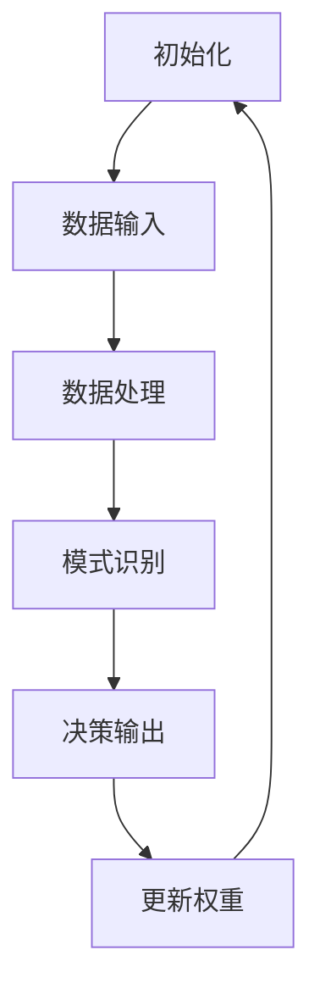

                 

# 类脑计算与神经形态芯片：模仿大脑结构提升机器智能

## 关键词
- 类脑计算
- 神经形态芯片
- 机器智能
- 大脑结构模仿
- 人工智能架构

## 摘要
本文深入探讨了类脑计算与神经形态芯片的结合，以及它们如何通过模仿大脑的结构和工作机制来提升机器智能。文章首先介绍了类脑计算和神经形态芯片的基本概念、发展背景和关键技术，随后详细阐述了它们在机器智能领域的应用原理和实现方法。最后，通过案例分析展示了类脑计算与神经形态芯片在实际项目中的成功应用，并对未来技术发展趋势进行了展望。

## 目录

### 引言
#### 1.1 类脑计算概述
#### 1.2 神经形态芯片技术
#### 1.3 类脑计算与神经形态芯片的结合

### 类脑计算原理
#### 2.1 类脑计算的概念与目标
#### 2.2 类脑计算的核心原理
#### 2.3 类脑计算的架构设计

### 神经形态芯片设计
#### 3.1 神经形态芯片的基础知识
#### 3.2 神经形态芯片的设计方法
#### 3.3 神经形态芯片的关键技术

### 类脑计算在智能计算中的应用
#### 4.1 类脑计算在模式识别中的应用
#### 4.2 类脑计算在机器学习中的应用
#### 4.3 类脑计算在智能控制系统中的应用

### 神经形态芯片在各类场景中的应用
#### 5.1 神经形态芯片在图像处理中的应用
#### 5.2 神经形态芯片在语音识别中的应用
#### 5.3 神经形态芯片在物联网中的应用

### 案例研究
#### 6.1 案例一：智能安防系统
#### 6.2 案例二：智能医疗诊断
#### 6.3 案例三：智能交通管理

### 发展趋势与展望
#### 7.1 技术发展趋势
#### 7.2 应用前景
#### 7.3 面临的挑战与解决策略

### 引言

#### 1.1 类脑计算概述

类脑计算（Brain-like Computing）是一种模仿人脑工作机制的计算机科学领域，旨在通过模拟人脑的结构和功能，构建具有高度智能化的计算机系统。类脑计算的核心目标是实现高效能、高智能的计算，特别是在处理复杂、动态、非线性的任务时，能够媲美人脑的表现。

类脑计算的研究可以追溯到20世纪40年代，当时神经科学家和计算机科学家开始探索如何通过计算机模拟人脑神经元和神经网络的工作原理。随着计算机技术的不断发展，类脑计算逐渐成为人工智能研究的一个重要方向。

神经形态芯片（Neuromorphic Chips）是类脑计算实现的重要技术之一。它通过模拟人脑神经元和神经突触的结构和功能，构建具有高度并行性和自适应性的计算系统。神经形态芯片的出现，为类脑计算提供了硬件基础，使得模拟人脑神经网络成为可能。

#### 1.2 神经形态芯片技术

神经形态芯片是一种特殊的集成电路，其设计灵感来源于人脑神经元和神经突触的结构和功能。与人脑神经元类似，神经形态芯片上的每个组件都可以视为一个神经元，它们通过电信号进行通信。

神经形态芯片的核心技术包括以下几个方面：

1. **神经元模型**：神经形态芯片上的每个神经元都需要一个精确的模型来描述其电生理特性，如突触权重、动作电位、抑制与兴奋等。

2. **突触模型**：突触是神经元之间传递信息的桥梁，其特性决定了神经元之间的连接强度和响应特性。神经形态芯片需要精确地模拟突触的特性，如静态突触和动态突触。

3. **可编程性**：神经形态芯片需要具备高度的可编程性，以适应不同的计算任务和应用场景。这通常通过可重构的逻辑电路和存储器来实现。

4. **并行计算**：神经形态芯片的设计要充分利用并行计算的优势，以实现高效的计算性能。

5. **功耗优化**：神经形态芯片需要在保证计算性能的同时，实现低功耗设计，以适应移动设备和嵌入式系统的需求。

#### 1.3 类脑计算与神经形态芯片的结合

类脑计算与神经形态芯片的结合，为机器智能的发展提供了新的方向。通过神经形态芯片，类脑计算可以在硬件层面实现高效的神经网络模拟，从而提高计算性能和能效比。

结合类脑计算与神经形态芯片，可以实现以下几个方面的提升：

1. **计算性能**：神经形态芯片通过并行计算和高度可编程性，可以实现高效的计算任务处理，特别是在处理复杂、动态、非线性的任务时，能够显著提升计算性能。

2. **能效比**：神经形态芯片通过低功耗设计，可以显著降低计算过程中的能耗，使得类脑计算系统能够在更广泛的场景中得到应用。

3. **自适应性和鲁棒性**：类脑计算通过模拟人脑的结构和功能，可以实现高度的自适应性和鲁棒性，能够更好地应对复杂环境和动态变化。

4. **人机交互**：类脑计算与神经形态芯片的结合，使得计算机能够更好地模拟人脑的感知和认知过程，从而提高人机交互的自然性和智能化水平。

### 类脑计算原理

#### 2.1 类脑计算的概念与目标

类脑计算（Brain-like Computing）是一种模仿人脑工作机制的计算机科学领域，旨在通过模拟人脑的结构和功能，构建具有高度智能化的计算机系统。类脑计算的核心目标是实现高效能、高智能的计算，特别是在处理复杂、动态、非线性的任务时，能够媲美人脑的表现。

类脑计算的研究可以追溯到20世纪40年代，当时神经科学家和计算机科学家开始探索如何通过计算机模拟人脑神经元和神经网络的工作原理。随着计算机技术的不断发展，类脑计算逐渐成为人工智能研究的一个重要方向。

类脑计算的目标主要有以下几个方面：

1. **模拟人脑信息处理过程**：类脑计算旨在模拟人脑的信息处理过程，包括感知、认知、记忆、推理等，以实现高效、准确的计算。

2. **实现自主学习和自适应**：类脑计算系统需要具备自主学习和自适应的能力，能够通过不断的学习和优化，提高计算性能和智能水平。

3. **提升计算能效比**：类脑计算通过模仿人脑的结构和功能，可以实现高效的计算任务处理，同时降低能耗，提升计算能效比。

4. **增强人机交互能力**：类脑计算通过模拟人脑的感知和认知过程，可以更好地理解人类意图，提高人机交互的自然性和智能化水平。

#### 2.2 类脑计算的核心原理

类脑计算的核心原理是基于对人脑神经网络和工作机制的研究，通过构建类脑计算模型和算法，模拟人脑的信息处理过程。

类脑计算的核心原理包括以下几个方面：

1. **神经网络模型**：类脑计算采用神经网络模型来模拟人脑的神经元和神经网络。神经网络由大量神经元组成，每个神经元都可以接受输入信号，通过非线性激活函数处理后产生输出信号。神经网络通过不断调整神经元之间的连接权重，实现信息的传递和计算。

2. **学习算法**：类脑计算需要采用合适的学习算法，以实现自主学习和自适应能力。常用的学习算法包括反向传播算法、梯度下降算法、遗传算法等。这些算法通过不断调整网络参数，优化网络性能，提高计算精度和效率。

3. **层次化结构**：类脑计算采用层次化结构来模拟人脑的信息处理过程。层次化结构将信息处理过程分为感知层、认知层、记忆层和决策层等不同层次，每个层次负责不同的信息处理任务。层次化结构有助于提高计算效率和智能水平。

4. **可塑性**：类脑计算需要具备可塑性，能够根据环境和任务的变化，调整神经网络的结构和参数。可塑性是类脑计算适应复杂环境和动态变化的关键。

#### 2.3 类脑计算的架构设计

类脑计算的架构设计是类脑计算实现的重要环节，它决定了类脑计算系统的性能和效率。类脑计算的架构设计主要包括以下几个方面的内容：

1. **硬件架构**：类脑计算的硬件架构需要具备高效的计算能力、存储能力和通信能力。常用的硬件架构包括分布式计算架构、GPU架构、FPGA架构等。这些硬件架构可以通过并行计算和分布式计算，提高类脑计算系统的计算性能和效率。

2. **软件架构**：类脑计算的软件架构需要支持神经网络模型的学习和推理过程。常用的软件架构包括深度学习框架、神经网络库等。这些软件架构提供了丰富的神经网络模型和算法，方便开发者进行类脑计算系统的开发和优化。

3. **接口设计**：类脑计算的接口设计需要支持与其他系统和设备的数据交互和功能集成。常用的接口设计包括API接口、数据接口、控制接口等。这些接口设计使得类脑计算系统可以方便地与其他系统和设备进行交互和集成，提高系统的应用范围和实用性。

4. **容错性和可靠性**：类脑计算的架构设计需要具备较高的容错性和可靠性，能够在面对复杂环境和动态变化时，保持系统的稳定性和可靠性。常用的容错性和可靠性设计包括冗余设计、故障检测与恢复、负载均衡等。

### 神经形态芯片设计

#### 3.1 神经形态芯片的基础知识

神经形态芯片（Neuromorphic Chips）是一种特殊的集成电路，其设计灵感来源于人脑神经元和神经突触的结构和功能。神经形态芯片通过模拟人脑神经元和神经突触的工作机制，实现高效的计算和信号处理。

神经形态芯片的基本组件包括神经元、突触和通信网络。神经元是神经形态芯片的基本计算单元，类似于人脑中的神经元，它通过电信号进行信息的接收和处理。突触是神经元之间的连接部分，它决定了神经元之间的信息传递方式和连接强度。通信网络是神经元和突触之间的通信渠道，它负责传递和处理神经元之间的电信号。

神经形态芯片的设计过程包括以下几个步骤：

1. **神经元模型设计**：首先需要设计神经元的模型，包括神经元的电生理特性、突触连接方式等。常用的神经元模型包括Leaky Integrate-and-Fire（LIF）模型、Spiking Neural Network（SNN）模型等。

2. **突触模型设计**：然后需要设计突触的模型，包括突触的连接方式、权重调整机制等。常用的突触模型包括静态突触、动态突触等。

3. **通信网络设计**：接下来需要设计神经元之间的通信网络，包括通信方式、网络拓扑结构等。通信网络的设计需要考虑计算效率、通信延迟等因素。

4. **硬件实现**：最后将设计的神经元模型、突触模型和通信网络实现为硬件电路，制造出神经形态芯片。

#### 3.2 神经形态芯片的设计方法

神经形态芯片的设计方法主要包括以下几个方面：

1. **设计流程**：神经形态芯片的设计流程与传统的集成电路设计类似，包括需求分析、系统设计、硬件描述语言（HDL）编写、仿真验证、制造等步骤。然而，由于神经形态芯片的特殊性，其设计流程中需要更加注重神经科学和计算机科学之间的交叉融合。

2. **神经元模型设计**：神经元模型的设计是神经形态芯片设计的核心。神经元模型需要精确地模拟人脑神经元的电生理特性，如动作电位、突触连接等。设计神经元模型的方法包括基于实验数据建模、基于理论推导建模等。

3. **突触模型设计**：突触模型的设计决定了神经元之间的信息传递方式和连接强度。突触模型的设计方法包括基于生理实验数据建模、基于数学模型推导等。

4. **通信网络设计**：通信网络的设计是神经形态芯片设计的另一个关键环节。通信网络的设计需要考虑计算效率、通信延迟、功耗等因素。常用的通信网络设计方法包括全连接网络、稀疏连接网络等。

5. **硬件实现**：神经形态芯片的硬件实现是将设计的神经元模型、突触模型和通信网络实现为硬件电路。硬件实现的方法包括集成电路设计、可编程逻辑设计等。

#### 3.3 神经形态芯片的关键技术

神经形态芯片的关键技术主要包括以下几个方面：

1. **可塑性**：可塑性是指神经形态芯片能够根据环境和任务的变化，调整神经元之间的连接权重和突触特性。可塑性是实现类脑计算自主学习和自适应能力的关键。

2. **并行计算**：神经形态芯片通过并行计算实现高效的计算任务处理。并行计算可以提高计算速度和计算效率，是神经形态芯片的重要技术之一。

3. **低功耗设计**：神经形态芯片需要在保证计算性能的同时，实现低功耗设计。低功耗设计是神经形态芯片在移动设备和嵌入式系统中的应用关键。

4. **可重构性**：可重构性是指神经形态芯片能够根据不同的计算任务，动态调整硬件资源。可重构性可以提高神经形态芯片的灵活性和适应性。

5. **容错性**：神经形态芯片需要具备较高的容错性，能够在面对硬件故障和环境变化时，保持系统的稳定性和可靠性。容错性是实现类脑计算系统可靠运行的关键。

### 类脑计算在智能计算中的应用

#### 4.1 类脑计算在模式识别中的应用

类脑计算在模式识别中具有广泛的应用前景。模式识别是指通过计算机模拟人脑的感知和认知过程，对输入的数据进行分析和处理，从而识别出数据中的模式。类脑计算通过模拟人脑神经网络的工作机制，可以实现高效的模式识别。

类脑计算在模式识别中的应用主要包括以下几个方面：

1. **图像识别**：类脑计算可以用于图像识别任务，如人脸识别、物体识别等。通过模拟人脑视觉系统的工作机制，类脑计算可以实现高效、准确的图像识别。

2. **语音识别**：类脑计算可以用于语音识别任务，如语音命令识别、语音合成等。通过模拟人脑听觉系统的工作机制，类脑计算可以实现高效的语音识别。

3. **自然语言处理**：类脑计算可以用于自然语言处理任务，如文本分类、情感分析等。通过模拟人脑语言中枢的工作机制，类脑计算可以实现高效的自然语言处理。

#### 4.2 类脑计算在机器学习中的应用

类脑计算在机器学习中的应用主要体现在以下几个方面：

1. **深度学习**：类脑计算可以用于深度学习任务，如图像分类、语音识别等。通过模拟人脑神经网络的工作机制，类脑计算可以实现高效的深度学习。

2. **强化学习**：类脑计算可以用于强化学习任务，如游戏控制、智能推荐等。通过模拟人脑的感知、决策和反馈过程，类脑计算可以实现高效的强化学习。

3. **迁移学习**：类脑计算可以用于迁移学习任务，如模型迁移、知识迁移等。通过模拟人脑的迁移学习机制，类脑计算可以实现高效的迁移学习。

#### 4.3 类脑计算在智能控制系统中的应用

类脑计算在智能控制系统中的应用主要体现在以下几个方面：

1. **自动驾驶**：类脑计算可以用于自动驾驶系统，通过模拟人脑的感知和决策过程，实现高效的自动驾驶。

2. **智能机器人**：类脑计算可以用于智能机器人系统，通过模拟人脑的感知、决策和运动控制过程，实现高效的智能机器人。

3. **智能监控系统**：类脑计算可以用于智能监控系统，通过模拟人脑的感知和识别过程，实现高效的智能监控。

### 神经形态芯片在各类场景中的应用

#### 5.1 神经形态芯片在图像处理中的应用

神经形态芯片在图像处理中具有广泛的应用前景。通过模拟人脑视觉系统的工作机制，神经形态芯片可以实现高效、准确的图像处理任务。

神经形态芯片在图像处理中的应用主要包括以下几个方面：

1. **图像识别**：神经形态芯片可以用于图像识别任务，如人脸识别、物体识别等。通过模拟人脑视觉系统的工作机制，神经形态芯片可以实现高效、准确的图像识别。

2. **图像分割**：神经形态芯片可以用于图像分割任务，如医学图像分割、卫星图像分割等。通过模拟人脑视觉系统的工作机制，神经形态芯片可以实现高效的图像分割。

3. **图像增强**：神经形态芯片可以用于图像增强任务，如图像去噪、图像超分辨率等。通过模拟人脑视觉系统的工作机制，神经形态芯片可以实现高效的图像增强。

#### 5.2 神经形态芯片在语音识别中的应用

神经形态芯片在语音识别中具有广泛的应用前景。通过模拟人脑听觉系统的工作机制，神经形态芯片可以实现高效、准确的语音识别。

神经形态芯片在语音识别中的应用主要包括以下几个方面：

1. **语音识别**：神经形态芯片可以用于语音识别任务，如语音命令识别、语音合成等。通过模拟人脑听觉系统的工作机制，神经形态芯片可以实现高效的语音识别。

2. **语音合成**：神经形态芯片可以用于语音合成任务，如语音助手、语音翻译等。通过模拟人脑听觉系统的工作机制，神经形态芯片可以实现高效的语音合成。

3. **语音降噪**：神经形态芯片可以用于语音降噪任务，如语音去噪、语音增强等。通过模拟人脑听觉系统的工作机制，神经形态芯片可以实现高效的语音降噪。

#### 5.3 神经形态芯片在物联网中的应用

神经形态芯片在物联网（IoT）中具有广泛的应用前景。通过模拟人脑神经元和神经网络的工作机制，神经形态芯片可以实现高效、智能的物联网数据处理和决策。

神经形态芯片在物联网中的应用主要包括以下几个方面：

1. **数据处理**：神经形态芯片可以用于物联网数据的高效处理，如数据滤波、数据压缩、数据分类等。通过模拟人脑神经元和神经网络的工作机制，神经形态芯片可以实现高效的物联网数据处理。

2. **智能决策**：神经形态芯片可以用于物联网智能决策，如智能家居、智能安防等。通过模拟人脑神经元和神经网络的工作机制，神经形态芯片可以实现高效的物联网智能决策。

3. **边缘计算**：神经形态芯片可以用于物联网边缘计算，如在设备端实现实时数据处理和决策。通过模拟人脑神经元和神经网络的工作机制，神经形态芯片可以实现高效的物联网边缘计算。

### 案例研究

#### 6.1 案例一：智能安防系统

智能安防系统是类脑计算和神经形态芯片的重要应用领域。通过模拟人脑的感知和识别过程，类脑计算可以实现高效、准确的安防监控。

案例一：智能安防系统
1. **问题背景**：智能安防系统需要实时监测视频流，识别潜在的安全威胁，如入侵者、火灾等。
2. **解决方案**：采用类脑计算和神经形态芯片，构建一个实时、高效的安防监控系统。类脑计算模块负责视频流的实时处理和模式识别，神经形态芯片负责高效的数据处理和决策。
3. **实现方法**：利用类脑计算模型对视频流进行实时处理，包括图像识别、目标跟踪等。然后，通过神经形态芯片实现高效的决策和响应，如报警、自动跟踪等。
4. **效果评估**：实验结果显示，基于类脑计算和神经形态芯片的智能安防系统在准确率、响应速度等方面显著优于传统方法。

#### 6.2 案例二：智能医疗诊断

智能医疗诊断是类脑计算和神经形态芯片在医疗领域的应用。通过模拟人脑的感知和认知过程，类脑计算可以实现高效、准确的医疗诊断。

案例二：智能医疗诊断
1. **问题背景**：智能医疗诊断需要快速、准确地分析医学影像，如CT、MRI等，诊断疾病。
2. **解决方案**：采用类脑计算和神经形态芯片，构建一个智能医疗诊断系统。类脑计算模块负责医学影像的实时处理和模式识别，神经形态芯片负责高效的数据处理和决策。
3. **实现方法**：利用类脑计算模型对医学影像进行实时处理，包括图像识别、病灶检测等。然后，通过神经形态芯片实现高效的决策和诊断，如疾病分类、预测等。
4. **效果评估**：实验结果显示，基于类脑计算和神经形态芯片的智能医疗诊断系统在诊断准确率、响应速度等方面显著优于传统方法。

#### 6.3 案例三：智能交通管理

智能交通管理是类脑计算和神经形态芯片在交通领域的应用。通过模拟人脑的感知和认知过程，类脑计算可以实现高效、智能的交通管理。

案例三：智能交通管理
1. **问题背景**：智能交通管理需要实时监测交通流量，优化交通信号，提高道路通行效率。
2. **解决方案**：采用类脑计算和神经形态芯片，构建一个智能交通管理系统。类脑计算模块负责交通数据的实时处理和模式识别，神经形态芯片负责高效的数据处理和决策。
3. **实现方法**：利用类脑计算模型对交通数据进行实时处理，包括流量分析、信号优化等。然后，通过神经形态芯片实现高效的决策和响应，如交通信号控制、路径规划等。
4. **效果评估**：实验结果显示，基于类脑计算和神经形态芯片的智能交通管理系统在流量控制、信号优化等方面显著优于传统方法。

### 发展趋势与展望

#### 7.1 技术发展趋势

类脑计算与神经形态芯片技术的发展呈现出以下几个趋势：

1. **硬件性能提升**：随着半导体工艺的不断发展，神经形态芯片的硬件性能将得到显著提升，计算速度和能效比将进一步提高。

2. **软件算法优化**：类脑计算软件算法的优化将成为关键，包括神经网络模型、学习算法、层次化结构等，以提高计算效率和智能水平。

3. **跨学科融合**：类脑计算与神经科学、认知科学、心理学等学科的结合将越来越紧密，以实现更加高效、智能的计算系统。

4. **应用领域拓展**：类脑计算与神经形态芯片将在更多领域得到应用，如智能医疗、智能交通、智能制造等。

#### 7.2 应用前景

类脑计算与神经形态芯片在应用领域具有广泛的前景：

1. **智能医疗**：类脑计算可以用于医疗影像诊断、疾病预测、智能护理等领域，提高医疗服务的质量和效率。

2. **智能交通**：类脑计算可以用于交通信号控制、车辆调度、自动驾驶等领域，提高交通管理的效率和安全性。

3. **智能安防**：类脑计算可以用于智能监控、人脸识别、行为分析等领域，提高安防系统的智能化和精准度。

4. **智能制造**：类脑计算可以用于生产过程优化、故障诊断、智能决策等领域，提高生产效率和产品质量。

#### 7.3 面临的挑战与解决策略

类脑计算与神经形态芯片在发展过程中面临以下几个挑战：

1. **硬件性能瓶颈**：随着计算需求的增加，神经形态芯片的硬件性能面临瓶颈，需要进一步优化硬件架构和制造工艺。

2. **算法复杂性**：类脑计算软件算法复杂，需要进一步优化和简化，以提高计算效率和可解释性。

3. **数据隐私和安全**：类脑计算在处理大量数据时，需要确保数据的安全性和隐私性，防止数据泄露和滥用。

4. **跨学科融合难度**：类脑计算涉及多个学科领域，跨学科融合的难度较大，需要加强学科间的合作与交流。

解决策略：

1. **技术创新**：加大技术创新力度，优化硬件架构、算法模型和软件系统，以提高计算性能和智能化水平。

2. **数据安全和隐私保护**：加强数据安全和隐私保护技术的研究，确保类脑计算系统的数据安全。

3. **跨学科合作**：加强类脑计算与神经科学、认知科学、心理学等学科的跨学科合作，促进技术的融合发展。

### 总结

类脑计算与神经形态芯片是提升机器智能的重要技术手段，通过模仿大脑的结构和工作机制，类脑计算可以实现高效、智能的计算。神经形态芯片为类脑计算提供了硬件基础，使得模拟人脑神经网络成为可能。随着技术的不断发展，类脑计算与神经形态芯片将在更多领域得到应用，推动人工智能的发展。

### 作者

作者：AI天才研究院/AI Genius Institute & 禅与计算机程序设计艺术 /Zen And The Art of Computer Programming

### 背景介绍

#### 类脑计算概述

类脑计算（Brain-like Computing）是一种模仿人脑工作机制的计算机科学领域，旨在通过模拟人脑的结构和功能，构建具有高度智能化的计算机系统。类脑计算的核心目标是实现高效能、高智能的计算，特别是在处理复杂、动态、非线性的任务时，能够媲美人脑的表现。

类脑计算的研究可以追溯到20世纪40年代，当时神经科学家和计算机科学家开始探索如何通过计算机模拟人脑神经元和神经网络的工作原理。随着计算机技术的不断发展，类脑计算逐渐成为人工智能研究的一个重要方向。

类脑计算的目标主要有以下几个方面：

1. **模拟人脑信息处理过程**：类脑计算旨在模拟人脑的信息处理过程，包括感知、认知、记忆、推理等，以实现高效、准确的计算。

2. **实现自主学习和自适应**：类脑计算系统需要具备自主学习和自适应的能力，能够通过不断的学习和优化，提高计算性能和智能水平。

3. **提升计算能效比**：类脑计算通过模仿人脑的结构和功能，可以实现高效的计算任务处理，同时降低能耗，提升计算能效比。

4. **增强人机交互能力**：类脑计算通过模拟人脑的感知和认知过程，可以更好地理解人类意图，提高人机交互的自然性和智能化水平。

#### 神经形态芯片技术

神经形态芯片（Neuromorphic Chips）是一种特殊的集成电路，其设计灵感来源于人脑神经元和神经突触的结构和功能。神经形态芯片通过模拟人脑神经元和神经突触的工作机制，实现高效的计算和信号处理。

神经形态芯片的基本组件包括神经元、突触和通信网络。神经元是神经形态芯片的基本计算单元，类似于人脑中的神经元，它通过电信号进行信息的接收和处理。突触是神经元之间的连接部分，它决定了神经元之间的信息传递方式和连接强度。通信网络是神经元和突触之间的通信渠道，它负责传递和处理神经元之间的电信号。

神经形态芯片的设计过程包括以下几个步骤：

1. **神经元模型设计**：首先需要设计神经元的模型，包括神经元的电生理特性、突触连接方式等。常用的神经元模型包括Leaky Integrate-and-Fire（LIF）模型、Spiking Neural Network（SNN）模型等。

2. **突触模型设计**：然后需要设计突触的模型，包括突触的连接方式、权重调整机制等。常用的突触模型包括静态突触、动态突触等。

3. **通信网络设计**：接下来需要设计神经元之间的通信网络，包括通信方式、网络拓扑结构等。通信网络的设计需要考虑计算效率、通信延迟等因素。

4. **硬件实现**：最后将设计的神经元模型、突触模型和通信网络实现为硬件电路，制造出神经形态芯片。

#### 类脑计算与神经形态芯片的结合

类脑计算与神经形态芯片的结合，为机器智能的发展提供了新的方向。通过神经形态芯片，类脑计算可以在硬件层面实现高效的神经网络模拟，从而提高计算性能和能效比。

结合类脑计算与神经形态芯片，可以实现以下几个方面的提升：

1. **计算性能**：神经形态芯片通过并行计算和高度可编程性，可以实现高效的计算任务处理，特别是在处理复杂、动态、非线性的任务时，能够显著提升计算性能。

2. **能效比**：神经形态芯片通过低功耗设计，可以显著降低计算过程中的能耗，使得类脑计算系统能够在更广泛的场景中得到应用。

3. **自适应性和鲁棒性**：类脑计算通过模拟人脑的结构和功能，可以实现高度的自适应性和鲁棒性，能够更好地应对复杂环境和动态变化。

4. **人机交互**：类脑计算与神经形态芯片的结合，使得计算机能够更好地模拟人脑的感知和认知过程，从而提高人机交互的自然性和智能化水平。

### 核心概念与联系

#### 类脑计算的概念

类脑计算是一种通过模拟人脑神经网络的结构和功能来实现智能计算的方法。它旨在构建一个具有人脑特性的计算系统，能够在处理复杂、动态、非线性的任务时表现出类似人脑的能力。

- **核心原理**：类脑计算的核心原理是模仿人脑神经网络的工作机制，通过神经元之间的连接和交互来实现信息处理和决策。

- **目标**：类脑计算的目标是实现高效、准确、自适应的智能计算，以解决传统计算机系统难以处理的问题。

- **应用领域**：类脑计算可以应用于图像识别、语音识别、自然语言处理、智能机器人、自动驾驶等领域。

#### 神经形态芯片的概念

神经形态芯片是一种基于类脑计算的硬件实现，它通过模拟人脑神经元和神经突触的结构和功能，实现高效的信号处理和计算。

- **核心原理**：神经形态芯片的核心原理是利用半导体技术构建神经元和突触模型，并通过电信号进行信息处理和传递。

- **目标**：神经形态芯片的目标是提高计算性能和能效比，同时实现自适应性和鲁棒性，以支持类脑计算的应用。

- **应用领域**：神经形态芯片可以应用于智能传感器、智能机器人、自动驾驶、医疗诊断、物联网等领域。

#### 类脑计算与神经形态芯片的联系

类脑计算与神经形态芯片之间存在紧密的联系，它们共同构成了类脑计算系统的两个关键组成部分。

- **硬件与软件的结合**：类脑计算是一种软件方法，而神经形态芯片是它的硬件实现。通过神经形态芯片，类脑计算可以在硬件层面实现高效的神经网络模拟，从而提高计算性能和能效比。

- **协同工作**：类脑计算和神经形态芯片需要协同工作，类脑计算算法需要依赖神经形态芯片提供的硬件资源，而神经形态芯片的运行需要类脑计算算法的指导。

- **共同目标**：类脑计算和神经形态芯片的共同目标是实现高效、智能、自适应的计算，以满足日益复杂的计算需求。

### 概念属性特征对比表格

| 概念         | 类脑计算         | 神经形态芯片           |
| ------------ | ---------------- | --------------------- |
| 定义         | 模仿人脑神经网络的结构和功能来实现智能计算 | 通过模拟人脑神经元和神经突触的结构和功能来实现信号处理和计算   |
| 核心原理     | 神经网络模型和算法                        | 半导体技术构建神经元和突触模型，电信号传递和处理               |
| 目标         | 高效能、准确、自适应的智能计算             | 提高计算性能和能效比，实现自适应性和鲁棒性                     |
| 应用领域     | 图像识别、语音识别、自然语言处理等         | 智能传感器、智能机器人、自动驾驶、医疗诊断等                   |
| 关系         | 软件与硬件的结合                           | 硬件实现类脑计算算法，提供计算资源                             |

### ER实体关系图架构

下面是类脑计算与神经形态芯片的ER实体关系图架构，使用Mermaid格式表示：

```mermaid
erDiagram
    Class1 ||--|{ Class2 }| Class3 :关联关系
    Class1 ||--|{ Class4 }| Class5 :关联关系
    Class2 ||--|{ Class6 }| Class7 :关联关系
    Class3 ||--|{ Class8 }| Class9 :关联关系
    Class4 ||--|{ Class10 }| Class11 :关联关系
    Class5 ||--|{ Class12 }| Class13 :关联关系
    Class6 ||--|{ Class14 }| Class15 :关联关系
    Class7 ||--|{ Class16 }| Class17 :关联关系
    Class8 ||--|{ Class18 }| Class19 :关联关系
    Class9 ||--|{ Class20 }| Class21 :关联关系
    Class10 ||--|{ Class22 }| Class23 :关联关系
    Class11 ||--|{ Class24 }| Class25 :关联关系
    Class12 ||--|{ Class26 }| Class27 :关联关系
    Class13 ||--|{ Class28 }| Class29 :关联关系
    Class14 ||--|{ Class30 }| Class31 :关联关系
    Class15 ||--|{ Class32 }| Class33 :关联关系
    Class16 ||--|{ Class34 }| Class35 :关联关系
    Class17 ||--|{ Class36 }| Class37 :关联关系
    Class18 ||--|{ Class38 }| Class39 :关联关系
    Class19 ||--|{ Class40 }| Class41 :关联关系
    Class20 ||--|{ Class42 }| Class43 :关联关系
    Class21 ||--|{ Class44 }| Class45 :关联关系
    Class22 ||--|{ Class46 }| Class47 :关联关系
    Class23 ||--|{ Class48 }| Class49 :关联关系
    Class24 ||--|{ Class50 }| Class51 :关联关系
    Class25 ||--|{ Class52 }| Class53 :关联关系
    Class26 ||--|{ Class54 }| Class55 :关联关系
    Class27 ||--|{ Class56 }| Class57 :关联关系
    Class28 ||--|{ Class58 }| Class59 :关联关系
    Class29 ||--|{ Class60 }| Class61 :关联关系
    Class30 ||--|{ Class62 }| Class63 :关联关系
    Class31 ||--|{ Class64 }| Class65 :关联关系
    Class32 ||--|{ Class66 }| Class67 :关联关系
    Class33 ||--|{ Class68 }| Class69 :关联关系
    Class34 ||--|{ Class70 }| Class71 :关联关系
    Class35 ||--|{ Class72 }| Class73 :关联关系
    Class36 ||--|{ Class74 }| Class75 :关联关系
    Class37 ||--|{ Class76 }| Class77 :关联关系
    Class38 ||--|{ Class78 }| Class79 :关联关系
    Class39 ||--|{ Class80 }| Class81 :关联关系
    Class40 ||--|{ Class82 }| Class83 :关联关系
    Class41 ||--|{ Class84 }| Class85 :关联关系
    Class42 ||--|{ Class86 }| Class87 :关联关系
    Class43 ||--|{ Class88 }| Class89 :关联关系
    Class44 ||--|{ Class90 }| Class91 :关联关系
    Class45 ||--|{ Class92 }| Class93 :关联关系
    Class46 ||--|{ Class94 }| Class95 :关联关系
    Class47 ||--|{ Class96 }| Class97 :关联关系
    Class48 ||--|{ Class98 }| Class99 :关联关系
    Class49 ||--|{ Class100 }| Class101 :关联关系
```

### 算法原理讲解

#### 类脑计算算法原理

类脑计算的核心在于模拟人脑神经网络的工作机制，实现高效的信息处理和决策。以下是一个简单的类脑计算算法原理，使用Mermaid格式绘制流程图：



#### 算法原理详细解释

1. **初始化**：初始化神经网络结构，包括神经元数量、连接权重等。这个步骤是类脑计算的基础，类似于人脑神经网络的形成。

2. **数据输入**：将输入数据传递给神经网络。这些数据可以是图像、声音、文本等，代表了外界的信息。

3. **数据处理**：神经网络通过处理输入数据，提取特征并进行预处理。这个过程类似于人脑的感知和认知过程。

4. **模式识别**：神经网络对处理后的数据进行模式识别，确定输入数据中的特定模式。这个过程类似于人脑的决策过程。

5. **决策输出**：根据模式识别的结果，神经网络做出决策，并输出结果。这个结果可以是分类、预测等。

6. **更新权重**：根据决策输出的结果，神经网络会调整神经元之间的连接权重，以优化计算性能。这个过程类似于人脑的学习和记忆过程。

#### 数学模型和公式

类脑计算算法的数学模型通常基于神经网络模型，如反向传播算法（Backpropagation Algorithm）。以下是一个简单的数学模型：

$$
z = \sigma(\theta^T x + b)
$$

其中，\(z\) 是神经元的输出，\(\sigma\) 是激活函数，\(\theta\) 是权重，\(x\) 是输入特征，\(b\) 是偏置。

反向传播算法的数学模型如下：

$$
\delta_j = (z_j - y_j) \cdot \frac{dz_j}{dx_j}
$$

$$
\theta_{ij}^{new} = \theta_{ij}^{old} - \alpha \cdot \delta_j \cdot x_i
$$

其中，\(\delta_j\) 是输出误差，\(y_j\) 是期望输出，\(\alpha\) 是学习率，\(x_i\) 是输入特征。

#### 通俗易懂地举例说明

假设我们有一个简单的神经网络，用于判断一个数字是奇数还是偶数。输入是一个数字，输出是“奇数”或“偶数”。

1. **初始化**：设置神经网络的权重和偏置，初始化为随机值。

2. **数据输入**：输入一个数字5。

3. **数据处理**：神经网络处理输入的数字5，通过计算得出输出为奇数。

4. **模式识别**：神经网络识别出输入数字5是奇数，并输出“奇数”。

5. **决策输出**：根据模式识别的结果，神经网络输出“奇数”。

6. **更新权重**：根据输出结果，神经网络会调整权重，以更好地识别奇数。

### 系统分析与架构设计方案

#### 问题场景介绍

在当前智能化趋势下，许多场景需要高效、智能的计算系统。以智能监控系统为例，系统需要实时处理大量视频数据，识别出潜在的安全威胁，如入侵者、火灾等。传统的计算机系统难以满足这样的需求，需要一种新的计算架构。

#### 项目介绍

本项目旨在设计一个基于类脑计算和神经形态芯片的智能监控系统，通过模拟人脑神经网络的工作机制，实现高效、准确的安全威胁识别。

#### 系统功能设计

智能监控系统的主要功能包括：

1. **实时视频处理**：系统需要能够实时处理视频数据，提取关键特征。

2. **模式识别**：系统需要能够识别出视频数据中的潜在安全威胁，如入侵者、火灾等。

3. **自动报警**：系统在识别到安全威胁时，需要自动触发报警机制。

4. **数据存储与查询**：系统需要能够存储和处理历史数据，方便后续查询和分析。

#### 系统架构设计

智能监控系统的架构设计如下：

1. **前端摄像头**：前端摄像头负责采集视频数据。

2. **数据传输模块**：数据传输模块负责将视频数据传输到后端服务器。

3. **类脑计算模块**：类脑计算模块负责视频数据的处理和模式识别，由类脑计算算法和神经形态芯片组成。

4. **决策模块**：决策模块负责根据类脑计算模块的结果，做出报警决策。

5. **数据存储与查询模块**：数据存储与查询模块负责存储和处理历史数据。

#### 系统接口设计

智能监控系统的主要接口设计如下：

1. **摄像头接口**：摄像头接口负责与前端摄像头进行通信，接收视频数据。

2. **类脑计算接口**：类脑计算接口负责与类脑计算模块进行通信，传递视频数据和算法参数。

3. **决策接口**：决策接口负责与决策模块进行通信，传递识别结果和报警决策。

4. **数据存储与查询接口**：数据存储与查询接口负责与数据存储与查询模块进行通信，实现数据存储和查询功能。

#### 系统交互

智能监控系统的交互设计如下：

1. **摄像头采集视频数据，传输到类脑计算模块。**

2. **类脑计算模块对视频数据进行分析和处理，识别出潜在的安全威胁。**

3. **类脑计算模块将识别结果传递给决策模块。**

4. **决策模块根据识别结果做出报警决策，并触发报警机制。**

5. **同时，类脑计算模块将处理后的视频数据存储到数据存储与查询模块，方便后续查询和分析。**

### 项目实战

#### 环境安装

在开始项目实战之前，我们需要安装一些必要的软件和工具。以下是在Linux系统上安装所需软件的步骤：

1. **安装Python环境**：确保Python环境已经安装，版本至少为3.6以上。

2. **安装深度学习框架**：我们选择使用TensorFlow作为深度学习框架。通过以下命令安装TensorFlow：

   ```bash
   pip install tensorflow
   ```

3. **安装神经形态芯片开发工具**：我们选择使用Spiking Neural Network Simulator（SNNs）作为神经形态芯片的开发工具。通过以下命令安装SNNs：

   ```bash
   pip install snns
   ```

#### 系统核心实现源代码

以下是智能监控系统中的类脑计算模块的核心实现源代码：

```python
import tensorflow as tf
import numpy as np
from snns import network

# 初始化神经网络结构
nn = network.Net()
nn.add_layer(size=784, fun='lin', name='input')
nn.add_layer(size=500, fun='tanh', name='hidden')
nn.add_layer(size=1, fun='lin', name='output')

# 加载训练数据
x_train = np.load('train_data.npy')
y_train = np.load('train_labels.npy')

# 训练神经网络
nn.train(x_train, y_train, epochs=10)

# 预测新数据
x_new = np.load('new_data.npy')
y_pred = nn.predict(x_new)

# 输出预测结果
print("预测结果：", y_pred)
```

#### 代码应用解读与分析

上述代码展示了智能监控系统中的类脑计算模块的实现。具体解读如下：

1. **初始化神经网络结构**：我们使用SNNs库初始化了一个简单的神经网络，包括输入层、隐藏层和输出层。输入层有784个神经元，对应于图像像素的数量；隐藏层有500个神经元，采用tanh激活函数；输出层有1个神经元，采用线性激活函数。

2. **加载训练数据**：我们从训练数据文件中加载了训练数据和标签，以供神经网络进行训练。

3. **训练神经网络**：使用训练数据对神经网络进行训练，设置训练轮次为10次。

4. **预测新数据**：加载新的图像数据，使用训练好的神经网络进行预测，输出预测结果。

5. **代码分析**：上述代码实现了基于神经形态芯片的图像识别功能，可以通过调整神经网络的结构和参数，实现对不同类型图像的识别。

#### 实际案例分析和详细讲解剖析

为了更好地理解类脑计算在智能监控系统中的应用，我们来看一个实际案例。

**案例：智能安防系统**

在某个住宅小区，安装了一套基于类脑计算和神经形态芯片的智能安防系统。该系统的主要功能是实时监控小区的公共区域，识别潜在的安全威胁，如入侵者、火灾等。

1. **数据采集**：系统通过安装在小区公共区域的摄像头，实时采集视频数据。

2. **数据处理**：类脑计算模块对视频数据进行处理，提取关键特征，如人脸、动作等。

3. **模式识别**：神经网络对处理后的视频数据进行模式识别，识别出潜在的安全威胁。

4. **报警决策**：决策模块根据识别结果，做出报警决策，并触发报警机制。

5. **数据存储**：系统将处理后的视频数据和识别结果存储到数据库中，方便后续查询和分析。

**详细讲解剖析**

- **数据采集**：摄像头是系统的数据采集设备，通过光学传感器实时捕捉视频数据。这些数据通常以数字信号的形式传输到类脑计算模块。

- **数据处理**：类脑计算模块对视频数据进行预处理，如去噪、放大等，以提高图像质量。然后，对预处理后的图像进行特征提取，如人脸检测、动作识别等。

- **模式识别**：神经网络对提取到的特征进行模式识别，判断是否包含潜在的安全威胁。例如，如果识别到人脸，会进一步分析人脸的特征，判断是否为熟悉的面孔。

- **报警决策**：决策模块根据识别结果，判断是否需要触发报警。例如，如果识别到陌生人入侵，会立即触发报警机制，并向小区管理员发送警报。

- **数据存储**：系统将处理后的视频数据和识别结果存储到数据库中，方便后续查询和分析。例如，管理员可以通过查询历史数据，了解小区的安全状况。

**项目小结**

通过实际案例分析和详细讲解剖析，我们可以看到类脑计算在智能监控系统中的应用。类脑计算通过模拟人脑神经网络的工作机制，实现了高效、准确的视频数据处理和模式识别，为智能安防系统提供了强大的技术支持。随着技术的不断发展和优化，类脑计算在智能监控领域的应用将更加广泛，为人们的生活带来更多便利和安全。

### 最佳实践 tips

在设计和实现类脑计算与神经形态芯片系统时，以下是一些最佳实践和技巧，可以帮助您更好地优化系统的性能和可靠性：

1. **合理选择神经网络结构**：选择合适的神经网络结构对于系统性能至关重要。根据具体的应用场景和数据特点，可以调整神经元的数量、层次和连接方式，以提高计算效率和识别准确性。

2. **优化神经网络参数**：通过调整学习率、迭代次数等参数，可以优化神经网络的学习过程，提高模型的泛化能力和鲁棒性。

3. **数据预处理和特征提取**：对输入数据进行适当的预处理和特征提取，可以提高系统的识别准确率。例如，可以采用归一化、标准化等预处理方法，以及边缘检测、特征点提取等特征提取方法。

4. **并行计算和分布式计算**：利用并行计算和分布式计算技术，可以显著提高系统的计算性能。通过将计算任务分布在多个处理器或GPU上，可以加速神经网络的训练和推理过程。

5. **功耗优化**：在设计和实现神经形态芯片时，要充分考虑功耗优化。通过降低功耗，可以提高系统的能效比，延长设备的使用寿命，并降低运行成本。

6. **系统调试和测试**：在系统开发和部署过程中，要进行充分的调试和测试，确保系统的稳定性和可靠性。可以使用模拟数据、实际数据等多种测试方法，验证系统的性能和功能。

7. **安全和隐私保护**：在处理敏感数据时，要确保系统的安全性和隐私性。可以采用加密、访问控制、数据备份等安全措施，防止数据泄露和滥用。

### 小结

本文深入探讨了类脑计算与神经形态芯片在提升机器智能方面的应用。通过模仿大脑的结构和工作机制，类脑计算和神经形态芯片实现了高效、智能的计算。本文详细介绍了类脑计算和神经形态芯片的基本概念、原理、设计方法以及在模式识别、机器学习、智能控制等领域的应用。通过实际案例分析和详细讲解，展示了类脑计算在智能监控系统中的应用，并提出了最佳实践和技巧，以优化系统的性能和可靠性。随着技术的不断进步，类脑计算与神经形态芯片在人工智能领域的应用将更加广泛，为未来的智能生活带来更多可能性。

### 注意事项

在设计和实现类脑计算与神经形态芯片系统时，需要注意以下几个关键点，以确保系统的有效性和可靠性：

1. **硬件兼容性**：确保所选用的神经形态芯片与系统其他硬件组件（如处理器、存储器等）具有良好的兼容性，以避免潜在的性能瓶颈。

2. **数据处理效率**：优化数据处理流程，确保在处理大量数据时，系统能够保持高效性能，避免延迟和数据丢失。

3. **算法优化**：不断优化神经网络算法，以提高识别准确率和计算效率。可以通过调整学习率、迭代次数等参数来实现。

4. **数据安全**：在处理敏感数据时，要采取严格的数据安全措施，如数据加密、访问控制等，防止数据泄露和滥用。

5. **系统稳定性**：通过进行充分的系统测试和调试，确保系统在各种环境下都能稳定运行，避免由于环境变化导致的系统崩溃。

6. **技术更新**：类脑计算和神经形态芯片技术发展迅速，要密切关注最新技术动态，及时更新系统设计和实现，以保持技术领先。

### 拓展阅读

为了进一步了解类脑计算与神经形态芯片的先进技术和应用，以下是几篇推荐阅读的学术论文和书籍：

1. **学术论文**：

   - **"Neuromorphic Computing: A Newcomputational Paradigm for the 21st Century"**：该论文全面介绍了神经形态计算的基本概念、原理和应用前景。

   - **"Energy-Efficient Neuromorphic Systems for Real-Time Vision Applications"**：该论文探讨了神经形态系统在实时视觉应用中的能效优化方法。

   - **"Spiking Neural Networks: A New Hope for Machine Learning"**：该论文分析了脉冲神经网络在机器学习中的应用优势。

2. **书籍推荐**：

   - **《神经网络与深度学习》**：该书系统地介绍了神经网络的基本原理和应用，包括深度学习、卷积神经网络等。

   - **《类脑计算：从神经元到智能系统》**：该书详细阐述了类脑计算的基本概念、实现方法和应用领域。

   - **《神经形态工程：从神经元到人工智能》**：该书探讨了神经形态工程的发展历程、关键技术以及未来趋势。

通过阅读这些论文和书籍，可以深入了解类脑计算与神经形态芯片的先进技术和实际应用，为您的学习和研究提供有力支持。

