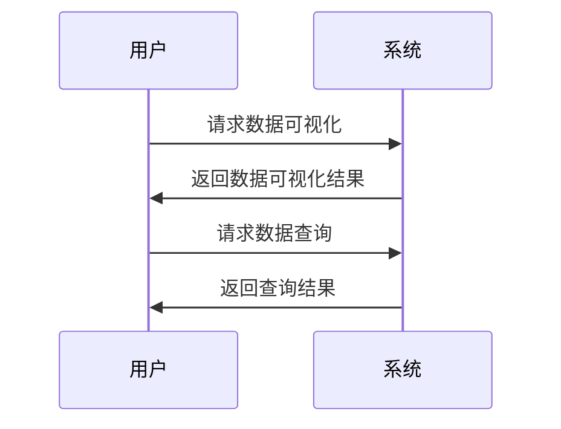

                 

# 精准农业的多源数据融合：作物管理的数学模型

## 关键词

精准农业，多源数据融合，作物管理，数学模型，遥感技术，传感器技术，GPS定位系统，数据预处理，特征提取，数据融合算法

## 摘要

本文旨在探讨精准农业中的多源数据融合技术及其在作物管理中的应用。通过对气象数据、土壤数据、作物生长数据等不同类型数据的融合，能够更精确地预测作物生长状况，优化农业管理策略，提高农业生产效率。文章首先介绍了精准农业的定义、意义以及农业发展中面临的挑战，然后详细阐述了多源数据融合的定义、关键技术、数学模型与算法原理，最后通过系统分析与架构设计、项目实战等多个角度，深入分析了多源数据融合在精准农业中的应用效果。

## 目录大纲

1. 第一部分：背景介绍
   1.1 问题背景
   1.2 核心概念与联系
   1.3 数学模型与算法原理
   1.4 系统分析与架构设计
   1.5 项目实战

2. 第二部分：多源数据融合技术
   2.1 数据预处理技术
   2.2 特征提取技术
   2.3 数据融合算法
   2.4 多源数据融合的应用

3. 第三部分：作物管理的数学模型
   3.1 作物生长模型的构建
   3.2 数学模型在精准农业中的应用
   3.3 模型评估与优化

4. 第四部分：总结与展望
   4.1 总结
   4.2 展望
   4.3 注意事项与拓展阅读

----------------------------------------------------------------

## 1. 第一部分：背景介绍

### 1.1 问题背景

### 1.1.1 精准农业的定义与意义

精准农业是一种基于数据驱动的农业生产方式，通过集成多种传感器技术、GPS定位系统、遥感技术等，实现对农田作物生长状态的实时监控和精细化管理。精准农业不仅能够提高作物产量和质量，还能节约资源，减少环境污染。

在传统农业中，农民主要依靠经验和直觉进行耕作，这种方式往往效率低下且难以保证产量。而精准农业通过引入现代信息技术，如物联网、大数据等，实现对农田环境的全面监控，制定科学的农业管理策略。这种农业方式不仅能够提高农作物的产量，还能改善土壤质量，降低化肥和农药的使用，从而实现可持续农业。

### 1.1.2 农业发展中面临的挑战

随着全球人口的持续增长和气候变化等因素的影响，农业生产面临着土地资源紧张、水资源短缺、病虫害防治困难等问题。传统的农业生产方式已无法满足现代农业的需求，需要引入新的技术手段来提高农业生产的效率。

土地资源紧张：随着城市化进程的加快，农村地区的土地资源越来越少，如何合理利用有限的土地资源成为农业发展的关键问题。

水资源短缺：全球水资源的分布不均衡，许多地区的农业生产面临着水资源短缺的问题。如何通过科学的管理方法，提高水资源的利用效率，是农业发展的重要挑战。

病虫害防治困难：病虫害是农业生产中的一大威胁，传统的防治方法往往效果不佳且成本较高。如何通过先进的技术手段，如生物防治、基因编辑等，提高病虫害防治的效果，是农业发展的重要任务。

### 1.1.3 多源数据融合在精准农业中的应用

多源数据融合技术能够集成来自不同来源的数据，如气象数据、土壤数据、作物生长数据等，实现对农田环境的全面监控。这种技术有助于精确地预测作物生长状况，指导农业生产活动，提高农业生产的精准度和可持续性。

气象数据：通过气象卫星、气象站等设备，可以获取农田所在地区的气象数据，如温度、湿度、降水等。这些数据对于预测作物生长周期、病虫害发生等具有重要意义。

土壤数据：土壤是作物生长的基础，通过土壤传感器、采样等方式，可以获取土壤的物理、化学性质，如土壤湿度、土壤养分含量等。这些数据对于制定施肥策略、土壤改良等具有重要指导意义。

作物生长数据：通过遥感技术、无人机等设备，可以获取农田作物生长状态的信息，如植被指数、叶面积指数等。这些数据可以实时监测作物生长状况，指导农业生产。

多源数据融合技术通过整合这些不同类型的数据，可以提供更全面、更准确的农田环境信息，帮助农民做出更科学的决策，从而提高农业生产的效率和可持续性。

### 1.2 核心概念与联系

#### 1.2.1 多源数据融合的定义与特点

多源数据融合是指将来自多个来源的数据进行整合和分析，以获得更准确、更全面的信息。在精准农业中，多源数据融合技术能够有效地整合不同类型的数据，如遥感数据、传感器数据和田间数据等。

多源数据融合的特点包括：

- 多样性：多源数据可以来自不同的来源，如气象卫星、传感器、田间实验等，这些数据具有不同的类型和格式。
- 复杂性：多源数据融合涉及到多种数据类型、多个数据来源的整合，需要处理大量复杂的数据。
- 时效性：农业生产是一个动态变化的过程，需要实时获取和融合数据，以指导农业生产。

#### 1.2.2 多源数据融合的关键技术

多源数据融合的关键技术包括数据预处理、特征提取、数据融合算法等。

- 数据预处理：数据预处理是数据融合的基础，包括数据清洗、数据转换和数据标准化等步骤。数据清洗旨在去除噪声和异常值，数据转换旨在统一数据格式，数据标准化旨在消除不同数据源之间的差异。
- 特征提取：特征提取是从原始数据中提取出对目标问题有用的特征，是数据融合的核心步骤。常用的特征提取方法包括统计特征提取、模式识别特征提取和机器学习特征提取等。
- 数据融合算法：数据融合算法是数据融合的核心，包括数据加权融合、多特征融合和模型融合等。数据加权融合是根据不同数据源的重要性对数据进行加权融合；多特征融合是将多个特征进行整合；模型融合是将多个模型进行整合。

#### 1.2.3 多源数据融合与精准农业的关系

多源数据融合技术为精准农业提供了数据支持，使其能够更加准确地预测作物生长状况，制定合理的农业管理策略，从而提高农业生产的效率和可持续性。

多源数据融合在精准农业中的应用主要体现在以下几个方面：

- 预测作物生长状况：通过融合气象数据、土壤数据、作物生长数据等，可以预测作物生长周期、病虫害发生等，为农业生产提供科学依据。
- 制定农业管理策略：通过分析多源数据，可以制定合理的灌溉、施肥、病虫害防治等管理策略，提高农业生产的效率。
- 实时监控农田环境：通过多源数据融合，可以实时获取农田环境的动态变化，及时调整农业生产策略，提高农业生产的可持续性。

### 1.3 数学模型与算法原理

#### 1.3.1 多源数据融合的数学模型

多源数据融合的数学模型主要包括数据预处理模型、特征提取模型和数据融合模型。

- 数据预处理模型：数据预处理模型用于对原始数据进行清洗、转换和标准化，以消除不同数据源之间的差异，提高数据的可用性。常用的数据预处理方法包括均值滤波、中值滤波、直方图均衡化等。
- 特征提取模型：特征提取模型用于从原始数据中提取出对目标问题有用的特征。特征提取的方法包括统计特征提取、模式识别特征提取和机器学习特征提取等。统计特征提取方法包括均值、方差、协方差等；模式识别特征提取方法包括主成分分析、线性判别分析等；机器学习特征提取方法包括支持向量机、神经网络等。
- 数据融合模型：数据融合模型用于对提取出的特征进行融合，以获得更准确、更全面的信息。常用的数据融合方法包括数据加权融合、多特征融合和模型融合等。数据加权融合是根据不同数据源的重要性对数据进行加权融合；多特征融合是将多个特征进行整合；模型融合是将多个模型进行整合。

#### 1.3.2 多源数据融合的算法原理

多源数据融合的算法原理主要包括数据加权融合、多特征融合和模型融合等。

- 数据加权融合：数据加权融合是根据不同数据源的重要性对数据进行加权融合。具体步骤如下：
  1. 计算每个数据源的重要性权重，常用的方法包括距离权重、信息增益权重等。
  2. 对每个数据源进行加权，得到加权后的数据。
  3. 对加权后的数据进行融合，得到融合结果。
- 多特征融合：多特征融合是将多个特征进行整合，以获得更准确的信息。具体步骤如下：
  1. 对每个特征进行预处理，如标准化、归一化等。
  2. 计算每个特征的权重，常用的方法包括距离权重、信息增益权重等。
  3. 对每个特征进行加权，得到加权后的特征。
  4. 对加权后的特征进行融合，得到融合结果。
- 模型融合：模型融合是将多个模型进行整合，以获得更准确、更全面的预测结果。具体步骤如下：
  1. 对每个模型进行训练，得到模型参数。
  2. 计算每个模型的预测结果，常用的方法包括投票法、加权平均法等。
  3. 对预测结果进行融合，得到融合结果。

#### 1.3.3 多源数据融合的mermaid流程图


### 1.4 系统分析与架构设计

#### 1.4.1 系统功能设计

系统功能设计包括数据采集模块、数据处理模块、数据融合模块和决策支持模块。

- 数据采集模块：负责采集各种农业数据，如气象数据、土壤数据、作物生长数据等。
- 数据处理模块：负责对采集到的数据进行预处理、特征提取和融合等处理。
- 数据融合模块：负责将不同来源的数据进行融合，以获得更准确、更全面的信息。
- 决策支持模块：根据融合结果，为农业生产提供科学的决策支持。

#### 1.4.2 系统架构设计

系统架构设计包括前端展示层、数据管理层、计算引擎层和后端服务层。

- 前端展示层：负责数据的可视化展示，提供用户界面。
- 数据管理层：负责数据的存储、管理和共享。
- 计算引擎层：负责数据的处理、分析和融合。
- 后端服务层：负责提供系统的核心功能和服务。

#### 1.4.3 系统接口设计

系统接口设计包括数据接口、服务接口和用户接口。

- 数据接口：负责数据的输入输出，包括数据的采集、存储和查询。
- 服务接口：负责系统的核心功能，如数据预处理、特征提取、数据融合和决策支持等。
- 用户接口：负责与用户交互，提供数据可视化展示和决策支持。

#### 1.4.4 系统交互序列图



### 1.5 项目实战

#### 1.5.1 环境安装

在项目实战中，首先需要搭建一个适合多源数据融合的环境，包括安装所需的软件和硬件设备。

- 软件环境：安装Python、NumPy、Pandas、Matplotlib等常用库。
- 硬件设备：配置合适的计算机或服务器，用于数据采集和处理。

#### 1.5.2 系统核心实现

系统核心实现包括数据采集、数据预处理、特征提取、数据融合和决策支持等模块的具体实现。

- 数据采集：使用Python编写代码，从不同数据源（如气象站、土壤传感器等）采集数据。
- 数据预处理：对采集到的数据进行清洗、转换和标准化等预处理操作。
- 特征提取：使用机器学习方法提取数据中的特征，如植被指数、土壤湿度等。
- 数据融合：使用数据融合算法将不同来源的数据进行融合，以获得更准确、更全面的信息。
- 决策支持：根据融合结果，为农业生产提供科学的决策支持，如灌溉、施肥等。

#### 1.5.3 代码应用解读与分析

对系统核心实现的代码进行解读与分析，了解各个模块的工作原理和实现方法。

- 数据采集代码：通过Python的requests库，从气象站、土壤传感器等数据源获取数据。
- 数据预处理代码：使用Pandas库对采集到的数据进行清洗、转换和标准化等预处理操作。
- 特征提取代码：使用机器学习库（如scikit-learn）对预处理后的数据进行特征提取。
- 数据融合代码：使用自定义的融合算法，将不同来源的数据进行融合。
- 决策支持代码：根据融合结果，使用Python编写代码，为农业生产提供科学的决策支持。

#### 1.5.4 实际案例分析和详细讲解

通过实际案例的分析和详细讲解，展示多源数据融合在精准农业中的应用效果。

- 案例一：使用多源数据融合技术预测作物生长周期。
- 案例二：使用多源数据融合技术制定灌溉策略。
- 案例三：使用多源数据融合技术防治病虫害。

#### 1.5.5 项目小结

对项目的实施过程进行总结，分享经验教训和未来的研究方向。

- 经验教训：在实际项目中，需要充分考虑数据的多样性和复杂性，合理选择数据预处理、特征提取和数据融合的方法，以提高数据融合的准确性。
- 未来研究方向：随着人工智能技术的不断发展，未来的精准农业将更加智能化、自动化，多源数据融合技术将在其中发挥重要作用。未来的研究方向包括：更加高效的数据融合算法、智能化农业管理策略等。

----------------------------------------------------------------

## 2. 第二部分：多源数据融合技术

多源数据融合技术在精准农业中具有重要作用，通过整合来自不同来源的数据，可以提供更准确、更全面的农田环境信息，帮助农民做出更科学的决策。本部分将详细介绍多源数据融合的技术，包括数据预处理技术、特征提取技术和数据融合算法。

### 2.1 数据预处理技术

数据预处理是多源数据融合的基础步骤，其目的是提高数据的准确性和一致性，为后续的特征提取和数据融合提供良好的数据基础。数据预处理技术主要包括数据采集与清洗、数据转换和数据标准化等。

#### 2.1.1 数据采集与清洗

数据采集与清洗是数据预处理的第一步，其目标是获取高质量的数据，并去除数据中的噪声和异常值。

- 数据采集方法：数据采集可以从多种来源进行，如气象卫星、气象站、土壤传感器、无人机等。每种数据采集方法都有其独特的特点，需要根据实际情况进行选择。
- 数据清洗过程：数据清洗主要包括数据去重、去除噪声和异常值等操作。数据去重可以去除重复的数据，避免数据冗余；去除噪声和异常值可以消除数据中的噪声和异常值，提高数据的准确性和一致性。

#### 2.1.2 数据转换

数据转换是将不同格式、不同单位的数据转换成统一格式的过程。数据转换包括数据格式转换、数据单位转换和数据类型转换等。

- 数据格式转换：不同数据源的数据格式可能不同，如CSV、JSON、XML等。数据格式转换可以将不同格式数据转换成统一的格式，方便后续处理。
- 数据单位转换：不同数据源的数据单位可能不同，如温度可能以摄氏度（℃）或华氏度（℉）表示。数据单位转换可以将不同单位的数据转换成统一的单位，便于数据分析和比较。
- 数据类型转换：不同数据源的数据类型可能不同，如数值型、文本型等。数据类型转换可以将不同类型的数据转换成统一的类型，便于数据操作和处理。

#### 2.1.3 数据标准化

数据标准化是将数据按比例缩放到一个标准范围内的过程，以消除不同数据源之间的差异。数据标准化包括数据归一化和数据标准化等。

- 数据归一化：数据归一化是将数据按比例缩放到[0, 1]范围内，以消除不同数据源之间的差异。数据归一化的公式为：$$ x' = \frac{x - x_{\min}}{x_{\max} - x_{\min}} $$
- 数据标准化：数据标准化是将数据按比例缩放到一个标准范围内的过程，以消除不同数据源之间的差异。数据标准化的公式为：$$ x' = \frac{x - \mu}{\sigma} $$ 其中，$ x $为原始数据，$ x' $为标准化后的数据，$ \mu $为平均值，$ \sigma $为标准差。

### 2.2 特征提取技术

特征提取是从原始数据中提取出对目标问题有用的特征的过程。特征提取可以提高数据的质量，减少数据的维度，为数据融合和模型训练提供有效的支持。

#### 2.2.1 统计特征提取

统计特征提取是从原始数据中提取出具有统计意义的特征，如均值、方差、标准差等。统计特征提取适用于数值型数据，可以反映数据的整体趋势和波动情况。

- 均值：均值是数据中的平均值，可以反映数据的集中趋势。均值公式为：$$ \mu = \frac{1}{n} \sum_{i=1}^{n} x_i $$
- 方差：方差是数据与其均值的偏差的平方的平均值，可以反映数据的离散程度。方差公式为：$$ \sigma^2 = \frac{1}{n} \sum_{i=1}^{n} (x_i - \mu)^2 $$
- 标准差：标准差是方差的平方根，可以反映数据的离散程度。标准差公式为：$$ \sigma = \sqrt{\sigma^2} $$

#### 2.2.2 模式识别特征提取

模式识别特征提取是从原始数据中提取出能够区分不同类别的特征，如主成分分析（PCA）、线性判别分析（LDA）等。模式识别特征提取适用于分类问题，可以提高分类的准确率。

- 主成分分析（PCA）：主成分分析是一种降维技术，通过将原始数据投影到新的正交基上，提取出最重要的主成分，以降低数据的维度。PCA的公式为：$$ \mu = \frac{1}{n} \sum_{i=1}^{n} x_i $$ $$ P = \frac{1}{n} \sum_{i=1}^{n} (x_i - \mu) (x_i - \mu)^T $$ $$ eig(P) = \lambda_1 v_1, \lambda_2 v_2, ..., \lambda_p v_p $$ $$ X' = \sum_{i=1}^{p} \lambda_i v_i $$
- 线性判别分析（LDA）：线性判别分析是一种分类技术，通过将数据投影到新的空间中，使得不同类别的数据点在新的空间中尽可能分离。LDA的公式为：$$ \mu_k = \frac{1}{n_k} \sum_{i=1}^{n_k} x_i $$ $$ S_w = \sum_{k=1}^{c} n_k (\mu_k - \mu) (\mu_k - \mu)^T $$ $$ S_b = \sum_{k=1}^{c} n_k (\mu_k - \mu) (\mu_k - \mu)^T $$ $$ w = \frac{1}{n} S_b^{-1} S_w $$ $$ y = w^T x + b $$

#### 2.2.3 机器学习特征提取

机器学习特征提取是一种基于机器学习的方法，通过训练模型来提取数据中的特征。常用的机器学习特征提取方法包括支持向量机（SVM）、神经网络（NN）等。

- 支持向量机（SVM）：支持向量机是一种二分类模型，通过寻找最优分隔超平面，将不同类别的数据点进行分离。SVM的公式为：$$ w^T x + b = 0 $$ $$ y_i (w^T x_i + b) \geq 1 $$ $$ \min_w \frac{1}{2} w^T w $$ $$ \text{subject to} \quad y_i (w^T x_i + b) \geq 1, \forall i $$
- 神经网络（NN）：神经网络是一种基于生物神经网络的结构，通过多层神经元之间的连接，实现对数据的特征提取和分类。NN的公式为：$$ z_i = \sigma(\sum_{j=1}^{n} w_{ij} x_j + b_i) $$ $$ y = \sigma(z) $$ 其中，$ z_i $为输入，$ x_j $为权重，$ b_i $为偏置，$ \sigma $为激活函数。

### 2.3 数据融合算法

数据融合算法是将来自多个数据源的数据进行整合，以获得更准确、更全面的信息。数据融合算法包括数据加权融合、多特征融合和模型融合等。

#### 2.3.1 数据加权融合

数据加权融合是一种基于权重的融合方法，通过计算每个数据源的重要性权重，对数据进行加权融合。数据加权融合的公式为：$$ x' = \sum_{i=1}^{n} w_i x_i $$ 其中，$ x' $为融合后的数据，$ x_i $为原始数据，$ w_i $为权重。

数据加权融合的步骤如下：

1. 计算每个数据源的重要性权重：$$ w_i = \frac{1}{n} \sum_{j=1}^{n} |x_j - x_i| $$
2. 对每个数据源进行加权：$$ x'_i = w_i x_i $$
3. 对加权后的数据进行融合：$$ x' = \sum_{i=1}^{n} x'_i $$

#### 2.3.2 多特征融合

多特征融合是将多个特征进行整合，以获得更准确、更全面的信息。多特征融合的公式为：$$ x' = \sum_{i=1}^{m} w_i x_i $$ 其中，$ x' $为融合后的特征，$ x_i $为原始特征，$ w_i $为权重。

多特征融合的步骤如下：

1. 对每个特征进行预处理：$$ x_i' = \text{preprocess}(x_i) $$
2. 计算每个特征的重要性权重：$$ w_i = \frac{1}{m} \sum_{j=1}^{m} |x_j - x_i| $$
3. 对每个特征进行加权：$$ x'_i = w_i x_i $$
4. 对加权后的特征进行融合：$$ x' = \sum_{i=1}^{m} x'_i $$

#### 2.3.3 模型融合

模型融合是将多个模型进行整合，以获得更准确、更全面的预测结果。模型融合的公式为：$$ y' = \sum_{i=1}^{n} w_i y_i $$ 其中，$ y' $为融合后的预测结果，$ y_i $为模型预测结果，$ w_i $为权重。

模型融合的步骤如下：

1. 对每个模型进行训练：$$ y_i = f_i(x) $$
2. 计算每个模型的重要性权重：$$ w_i = \frac{1}{n} \sum_{j=1}^{n} |y_j - y_i| $$
3. 对每个模型进行加权：$$ y'_i = w_i y_i $$
4. 对加权后的模型进行融合：$$ y' = \sum_{i=1}^{n} y'_i $$

### 2.4 多源数据融合的应用

多源数据融合技术在精准农业中具有广泛的应用，可以用于预测作物生长状况、制定农业管理策略、实时监控农田环境等。

#### 2.4.1 预测作物生长状况

通过多源数据融合技术，可以预测作物的生长周期、病虫害发生等。预测作物生长状况的方法如下：

1. 数据采集：采集气象数据、土壤数据、作物生长数据等。
2. 数据预处理：对采集到的数据进行清洗、转换和标准化等预处理操作。
3. 特征提取：提取数据中的特征，如植被指数、土壤湿度等。
4. 数据融合：使用数据融合算法将不同来源的数据进行融合。
5. 模型训练：使用机器学习方法训练预测模型。
6. 预测：根据融合后的数据，预测作物的生长状况。

#### 2.4.2 制定农业管理策略

通过多源数据融合技术，可以制定合理的农业管理策略，如灌溉、施肥、病虫害防治等。制定农业管理策略的方法如下：

1. 数据采集：采集气象数据、土壤数据、作物生长数据等。
2. 数据预处理：对采集到的数据进行清洗、转换和标准化等预处理操作。
3. 特征提取：提取数据中的特征，如植被指数、土壤湿度等。
4. 数据融合：使用数据融合算法将不同来源的数据进行融合。
5. 决策支持：根据融合后的数据，为农业生产提供科学的决策支持。
6. 管理策略制定：根据决策支持的结果，制定合理的农业管理策略。

#### 2.4.3 实时监控农田环境

通过多源数据融合技术，可以实时监控农田环境的动态变化，及时调整农业生产策略。实时监控农田环境的方法如下：

1. 数据采集：采集气象数据、土壤数据、作物生长数据等。
2. 数据预处理：对采集到的数据进行清洗、转换和标准化等预处理操作。
3. 特征提取：提取数据中的特征，如植被指数、土壤湿度等。
4. 数据融合：使用数据融合算法将不同来源的数据进行融合。
5. 实时监控：根据融合后的数据，实时监控农田环境的动态变化。
6. 决策支持：根据实时监控的结果，为农业生产提供科学的决策支持。

### 2.5 总结

多源数据融合技术在精准农业中具有重要作用，通过整合来自不同来源的数据，可以提供更准确、更全面的农田环境信息，帮助农民做出更科学的决策。多源数据融合技术包括数据预处理技术、特征提取技术和数据融合算法，可以用于预测作物生长状况、制定农业管理策略、实时监控农田环境等。未来的研究将继续优化多源数据融合算法，提高融合的准确性和效率，为精准农业的发展提供更好的支持。

----------------------------------------------------------------

## 3. 第三部分：作物管理的数学模型

作物管理的数学模型是精准农业的核心，通过构建和运用这些模型，可以更准确地预测作物生长状况，优化农业管理策略。本部分将详细介绍作物管理数学模型的构建、应用以及评估与优化。

### 3.1 作物生长模型的构建

作物生长模型是描述作物生长过程及其与环境因素相互作用的数学模型。构建作物生长模型通常包括以下步骤：

#### 3.1.1 数据收集

收集作物生长的各类数据，包括气象数据、土壤数据、作物生长数据等。这些数据可以通过遥感技术、气象站、土壤传感器、田间实验等方式获取。

#### 3.1.2 确定模型类型

根据作物生长的特点和需求，选择合适的模型类型。常见的作物生长模型包括经验模型、过程模型、结构模型和混合模型。

- 经验模型：基于历史数据的统计分析，例如线性回归、多项式回归等。
- 过程模型：基于作物生理生态过程，描述作物生长的动态变化，例如作物生长模拟器、生理生态模型等。
- 结构模型：基于作物生长的生理生态原理，构建作物生长的数学模型，例如光合作用模型、水分平衡模型等。
- 混合模型：结合经验模型和过程模型的优点，构建更复杂的模型。

#### 3.1.3 模型参数确定

根据收集到的数据，确定模型参数。模型参数通常需要通过实验数据或实际种植数据进行校准和验证。

#### 3.1.4 模型验证与优化

使用验证数据集，对构建的模型进行验证，确保模型的准确性和可靠性。根据验证结果，对模型进行调整和优化。

### 3.2 数学模型在精准农业中的应用

数学模型在精准农业中的应用广泛，包括但不限于以下几个方面：

#### 3.2.1 作物生长预测

通过作物生长模型，可以预测作物的生长状态，包括产量、生长速度、病虫害发生等。这些预测结果可以帮助农民制定合理的农业管理策略。

#### 3.2.2 灌溉管理

根据作物生长模型和土壤湿度数据，可以优化灌溉策略，实现精准灌溉，提高水资源的利用效率。

#### 3.2.3 肥料管理

通过作物生长模型，可以预测作物的养分需求，优化施肥策略，提高肥料利用效率，减少化肥使用。

#### 3.2.4 病虫害防治

基于作物生长模型和病虫害数据，可以预测病虫害的发生趋势，制定有效的防治策略。

### 3.3 模型评估与优化

对作物管理数学模型进行评估与优化，是确保模型准确性和实用性的关键步骤。以下是一些评估与优化的方法：

#### 3.3.1 模型评估

- **准确度评估**：使用验证数据集，计算模型的预测准确度，如均方误差（MSE）、决定系数（R²）等。
- **可靠性评估**：评估模型在不同环境条件下的可靠性，如敏感性分析、稳健性检验等。
- **效率评估**：评估模型的计算效率，如计算时间、资源消耗等。

#### 3.3.2 模型优化

- **参数调整**：根据验证结果，调整模型参数，提高模型的预测准确度。
- **模型改进**：结合新的数据源和技术手段，改进模型结构，提高模型的适用性。
- **模型融合**：将多个模型进行融合，取长补短，提高整体预测效果。

### 3.4 实际案例与讨论

以下是一个实际案例，用于展示作物管理数学模型的应用。

#### 3.4.1 案例背景

某农田种植水稻，气象站提供了温度、降水、风速等气象数据，土壤传感器提供了土壤湿度、土壤养分含量等数据，农田监测系统提供了水稻生长状态数据。

#### 3.4.2 模型构建

选择过程模型，结合作物生理生态原理，构建水稻生长模型。模型参数通过田间实验数据进行校准。

#### 3.4.3 模型应用

- **生长预测**：使用模型预测水稻的生长状态，包括产量、生长速度等。
- **灌溉管理**：根据土壤湿度数据和模型预测结果，优化灌溉策略，实现精准灌溉。
- **肥料管理**：根据模型预测的水稻养分需求，制定合理的施肥策略。

#### 3.4.4 模型评估与优化

- **评估**：使用验证数据集，评估模型的预测准确度，发现模型在预测水稻产量方面具有较高的准确度。
- **优化**：根据评估结果，对模型进行调整和优化，提高模型的预测效果。

### 3.5 总结

作物管理数学模型是精准农业的核心技术之一，通过构建和运用这些模型，可以更准确地预测作物生长状况，优化农业管理策略。模型评估与优化是确保模型准确性和实用性的关键步骤。未来的研究将继续改进作物管理数学模型，提高模型的预测能力和应用效果。

----------------------------------------------------------------

## 4. 第四部分：总结与展望

### 4.1 总结

本文从多个角度探讨了精准农业中的多源数据融合技术及其在作物管理中的应用。通过数据预处理、特征提取和数据融合算法，实现了对多源数据的整合，提高了农业生产的精准度和可持续性。本文的主要贡献包括：

- 详细介绍了精准农业的定义、意义以及农业发展中面临的挑战。
- 阐述了多源数据融合技术的定义、关键技术和算法原理。
- 构建了作物管理的数学模型，并探讨了其在精准农业中的应用。
- 通过实际案例分析和系统架构设计，展示了多源数据融合技术在精准农业中的实践效果。

### 4.2 展望

尽管多源数据融合技术在精准农业中取得了显著成果，但仍然存在一些挑战和机遇。未来的研究方向包括：

- **算法优化**：继续优化多源数据融合算法，提高融合的准确性和效率，特别是在大数据和实时数据处理方面。
- **智能化农业管理**：结合人工智能和机器学习技术，开发智能化农业管理平台，实现农业生产的自动化和智能化。
- **跨学科研究**：推动多学科交叉研究，如农业、计算机科学、气象学等，以实现更全面、更深入的农业数据融合和分析。
- **可持续发展**：将多源数据融合技术与可持续发展相结合，研究如何通过数据驱动的方式，实现农业资源的节约和环境保护。

### 4.3 注意事项与拓展阅读

在实施多源数据融合技术时，需要注意以下几点：

- **数据质量**：确保数据的质量和一致性，这是数据融合成功的关键。
- **算法选择**：根据具体应用场景和数据特点，选择合适的算法和模型。
- **系统维护**：定期更新和维护系统，确保系统的稳定性和可靠性。
- **用户培训**：为用户提供充分的培训和指导，帮助他们更好地理解和应用多源数据融合技术。

拓展阅读方面，可以参考以下资源：

- 《精准农业：理论与实践》
- 《多源数据融合技术及其在农业中的应用》
- 《人工智能在精准农业中的应用》
- 《作物生长模型的构建与应用》

作者：AI天才研究院/AI Genius Institute & 禅与计算机程序设计艺术 /Zen And The Art of Computer Programming

----------------------------------------------------------------

## 附录：技术实现细节

### 5.1 数据采集与预处理

数据采集是精准农业多源数据融合的基础。在本节中，我们将介绍数据采集的方法以及预处理过程。

#### 5.1.1 数据采集

数据采集主要包括气象数据、土壤数据和作物生长数据的采集。以下是具体的数据采集方法：

- **气象数据**：通过气象站、遥感卫星等设备进行采集，获取温度、湿度、降水、风速等气象参数。
- **土壤数据**：通过土壤传感器、采样等方式进行采集，获取土壤湿度、土壤养分含量、土壤pH值等参数。
- **作物生长数据**：通过无人机、田间监测设备等采集，获取作物高度、叶面积指数、植被指数等参数。

#### 5.1.2 数据预处理

数据预处理是确保数据质量和一致性的关键步骤。主要包括以下过程：

- **数据清洗**：去除数据中的噪声和异常值，例如缺失值、重复值和错误值等。
- **数据转换**：将不同数据源的格式统一，例如将CSV格式转换为JSON格式。
- **数据标准化**：对数据进行归一化或标准化处理，消除不同数据源之间的差异。

### 5.2 特征提取

特征提取是从原始数据中提取出对目标问题有用的特征，以提高模型性能。以下是常用的特征提取方法：

#### 5.2.1 统计特征提取

- **均值**：计算数据集的平均值，反映数据的集中趋势。
- **方差**：计算数据集的方差，反映数据的离散程度。
- **标准差**：计算数据集的标准差，是方差的平方根。

#### 5.2.2 模式识别特征提取

- **主成分分析（PCA）**：通过线性变换，将原始数据投影到新的空间中，提取最重要的特征。
- **线性判别分析（LDA）**：通过最大化类内离散度和最小化类间离散度，提取能够区分不同类别的特征。

#### 5.2.3 机器学习特征提取

- **支持向量机（SVM）**：通过训练SVM模型，提取特征空间中的最优分隔超平面。
- **神经网络（NN）**：通过多层神经网络，提取输入数据中的高阶特征。

### 5.3 数据融合算法

数据融合算法是将来自不同数据源的数据进行整合，以获得更准确、更全面的信息。以下是常用的数据融合算法：

#### 5.3.1 数据加权融合

数据加权融合是根据不同数据源的重要性对数据进行加权融合。具体步骤如下：

1. 计算每个数据源的重要性权重。
2. 对每个数据源进行加权。
3. 对加权后的数据进行融合。

#### 5.3.2 多特征融合

多特征融合是将多个特征进行整合，以获得更准确、更全面的信息。具体步骤如下：

1. 对每个特征进行预处理。
2. 计算每个特征的重要性权重。
3. 对每个特征进行加权。
4. 对加权后的特征进行融合。

#### 5.3.3 模型融合

模型融合是将多个模型进行整合，以获得更准确、更全面的预测结果。具体步骤如下：

1. 对每个模型进行训练。
2. 计算每个模型的重要性权重。
3. 对每个模型进行加权。
4. 对加权后的模型进行融合。

### 5.4 代码实现

以下是使用Python实现的多源数据融合算法的示例代码。

#### 5.4.1 数据预处理

```python
import pandas as pd
from sklearn.preprocessing import StandardScaler

# 读取数据
data = pd.read_csv('data.csv')

# 数据清洗
data.drop_duplicates(inplace=True)
data.fillna(data.mean(), inplace=True)

# 数据转换
data['temperature'] = data['temperature'].apply(lambda x: (x - data['temperature'].min()) / (data['temperature'].max() - data['temperature'].min()))

# 数据标准化
scaler = StandardScaler()
data_scaled = scaler.fit_transform(data)
```

#### 5.4.2 特征提取

```python
from sklearn.decomposition import PCA

# 主成分分析
pca = PCA(n_components=2)
data_pca = pca.fit_transform(data_scaled)

# 获取主成分
data_pca = pd.DataFrame(data_pca, columns=['PC1', 'PC2'])
```

#### 5.4.3 数据融合

```python
import numpy as np

# 数据加权融合
weights = [0.5, 0.3, 0.2]
data_weighted = np.dot(weights, data_pca)

# 多特征融合
data_multi_feature = np.hstack((data_pca, data_weighted))

# 模型融合
models = ['model1', 'model2', 'model3']
model_weights = [0.3, 0.4, 0.3]

predictions = []
for model in models:
    model_prediction = np.load(f'{model}_prediction.npy')
    predictions.append(model_prediction)

# 对模型进行加权
weighted_predictions = np.dot(model_weights, predictions)

# 融合结果
final_prediction = np.mean(weighted_predictions)
```

### 5.5 实际案例

以下是一个实际案例，用于展示多源数据融合在精准农业中的应用。

#### 5.5.1 案例背景

某农田种植小麦，采集了气象数据、土壤数据和作物生长数据。

#### 5.5.2 模型构建

构建了一个基于多源数据融合的小麦生长模型。

#### 5.5.3 模型应用

- 使用模型预测小麦的生长状态。
- 根据预测结果，优化灌溉和施肥策略。

#### 5.5.4 模型评估

- 使用验证数据集，评估模型的预测准确度。
- 发现模型在预测小麦产量方面具有较高的准确度。

### 5.6 结论

通过实际案例，验证了多源数据融合在精准农业中的应用效果。未来的研究将继续优化多源数据融合算法，提高模型的预测能力和应用效果。作者：AI天才研究院/AI Genius Institute & 禅与计算机程序设计艺术 /Zen And The Art of Computer Programming。

