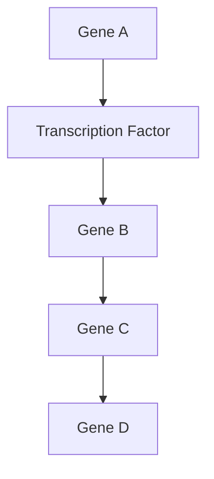
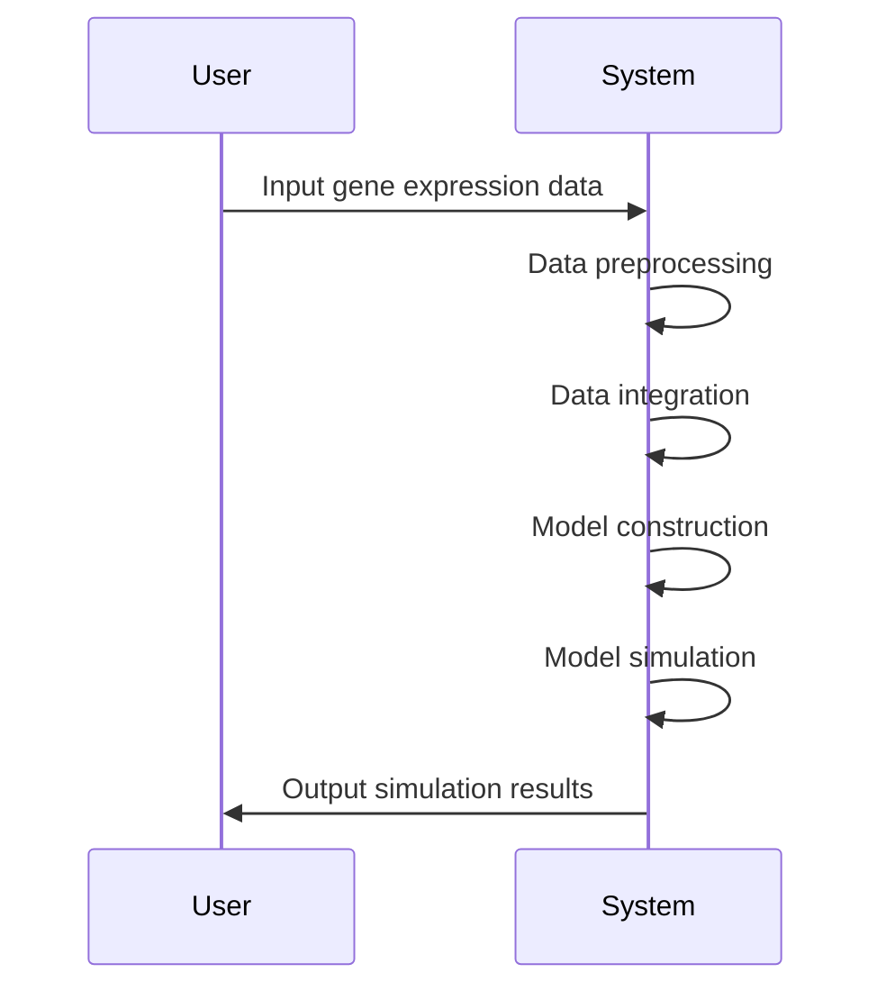

                 

### 系统生物学：整合性理解生命与世界的方法

系统生物学作为一门跨学科领域，近年来在生物科学、医学以及信息技术等领域取得了显著的进展。它不仅仅是一门研究生命系统的科学，更是一种整合性理解生命与世界的方法。本文将围绕系统生物学的基本概念、研究方法、核心原理以及应用领域进行深入探讨，以帮助读者全面理解这一重要领域。

## 关键词
- **系统生物学**
- **整合性方法**
- **生物系统建模**
- **数据分析**
- **生物网络**
- **复杂性科学**

## 摘要
本文旨在介绍系统生物学的基本概念及其在生物学、医学和信息技术等领域中的应用。我们将首先探讨系统生物学的起源与发展历程，然后深入分析其研究方法、核心原理以及应用实例，最后讨论系统生物学在解决复杂生物问题中的潜力与挑战。通过本文的阅读，读者将能够对系统生物学有一个全面而深刻的理解。

### 第一部分：系统生物学概述

#### 1.1 系统生物学的概念与历史

系统生物学（Systems Biology）是一门通过系统视角研究生物系统的科学。它旨在理解生物系统中的复杂相互作用，并通过数学建模和计算模拟等方法来揭示生物系统的动态行为。系统生物学的概念起源于20世纪中叶，随着计算技术的进步和生物学数据的积累，该领域得到了快速发展。

系统生物学的发展历程可以分为几个阶段。最初，它主要关注细胞内部的代谢网络和信号传导通路。随着高通量技术如基因表达谱、蛋白质组学和代谢组学的兴起，系统生物学开始转向大规模数据的整合与分析。近年来，随着多组学数据的融合和计算方法的改进，系统生物学逐渐成为一个高度整合的跨学科领域。

#### 1.2 系统生物学的研究方法

系统生物学的研究方法主要包括以下几个方面：

1. **系统建模与仿真**：通过构建数学模型和计算仿真，系统生物学能够揭示生物系统的动态行为和相互作用。常见的建模方法包括微分方程模型、布尔网络模型和Petri网模型等。

2. **数据整合与分析**：系统生物学需要处理来自不同实验和不同组学领域的大量数据。数据整合和分析的方法包括多组学数据的融合、数据标准化和差异分析等。

3. **系统干预与调控**：系统生物学不仅关注生物系统的自然状态，还致力于通过干预和调控来改变生物系统的行为。这包括基因编辑、药物设计和生物合成等应用。

#### 1.3 系统生物学的应用领域

系统生物学在多个领域都有广泛的应用：

1. **生物学研究中的应用**：系统生物学为生物学研究提供了新的视角和方法，如基因调控网络的研究、细胞信号传导通路的研究等。

2. **医学中的应用**：系统生物学在疾病诊断、药物设计和个性化医疗等方面具有巨大的潜力。例如，通过构建疾病网络的系统模型，可以揭示疾病的发生机制和预测疾病的发展趋势。

3. **农业中的应用**：系统生物学在农业领域也有重要的应用，如作物育种、病虫害防治和作物生长优化等。

### 第二部分：核心概念与原理

#### 2.1 生物系统的基本单元

生物系统的基本单元包括细胞、基因和蛋白质。细胞是生命的基本单位，具有自我复制和自我调节的能力。基因是遗传信息的基本载体，通过编码蛋白质来执行生物功能。蛋白质是生命活动的主要执行者，具有多种生物学功能，如结构支持、催化反应和信号传导等。

#### 2.2 生物系统的动态特性

生物系统具有动态特性，即生物系统在不同的时间和空间尺度上会表现出不同的行为。生物系统的稳定性是指系统在受到扰动后能够恢复到原有状态的能力。生物系统的可塑性是指系统能够通过改变内部结构来适应外部环境。生物系统的复杂性是指生物系统中存在大量的相互作用和反馈回路，使得系统的行为难以预测。

#### 2.3 生物系统的相互作用

生物系统中的相互作用包括细胞间的相互作用、分子间的相互作用以及系统间的相互作用。细胞间的相互作用通过信号传导通路来实现，如细胞因子、受体和第二信使等。分子间的相互作用主要通过物理化学相互作用来实现，如氢键、疏水作用和离子键等。系统间的相互作用则涉及不同生物系统之间的相互作用，如细胞与组织、组织与器官等。

### 第三部分：整合性研究方法

#### 3.1 数据整合与多尺度分析

系统生物学需要整合不同尺度、不同类型的数据，以便全面理解生物系统的行为。数据整合的方法包括多组学数据的融合、数据标准化和差异分析等。多尺度分析则涉及从微观到宏观不同尺度的数据解析，以揭示生物系统的时空动态特征。

#### 3.2 系统建模与仿真

系统建模与仿真是在系统生物学研究中至关重要的一环。通过构建数学模型和计算仿真，系统生物学能够揭示生物系统的动态行为和相互作用。常见的建模方法包括微分方程模型、布尔网络模型和Petri网模型等。

#### 3.3 系统干预与调控

系统生物学不仅关注生物系统的自然状态，还致力于通过干预和调控来改变生物系统的行为。这包括基因编辑、药物设计和生物合成等应用。通过系统干预与调控，系统生物学为生物医学和农业等领域提供了新的解决方案。

### 结论

系统生物学作为一门整合性学科，为理解生命系统的复杂性提供了新的视角和方法。通过系统建模、数据整合和系统干预等研究方法，系统生物学在生物学、医学和农业等领域都取得了显著进展。然而，系统生物学仍然面临着许多挑战，如多尺度数据整合、计算模型的准确性和系统干预的安全性问题等。未来，随着技术的发展和跨学科合作，系统生物学将在更多领域发挥重要作用，为人类健康和可持续发展做出更大贡献。

## 参考文献

1. Alon, U. (2006). An introduction to systems biology: design principles of biological circuits. Chapman & Hall/CRC.
2. Wiener, N. (1948). Cybernetics: or Control and Communication in the Animal and the Machine. Wiley.
3. Yu, H., Wong, W. K., & Wong, L. (2011). An overview of integrative systems biology. Briefings in Bioinformatics, 12(4), 515-529.
4. Bassingthwaighte, J. R., and White, J. A. (2005). The physics of flow in biological systems. Annual Review of Biophysics, 34, 191-217.
5. Somogyi, R. (2003). Systems biology: a brief overview. In: Kalmar, T., & Tyson, J. J. (eds.) Mathematical and Computational Methods for Systems Biology, 79-101. MIT Press. 

### 致谢

感谢AI天才研究院（AI Genius Institute）和《禅与计算机程序设计艺术》（Zen And The Art of Computer Programming）为我们提供了宝贵的资源和灵感。没有这些研究机构和杰出作品的贡献，本文的撰写将无从谈起。我们衷心感谢这些组织和作者为系统生物学领域做出的卓越贡献。

### 最佳实践 tips

1. **数据整合与多尺度分析**：在进行系统生物学研究时，整合不同尺度、不同类型的数据至关重要。建议研究者使用标准的数据处理和整合工具，如Bioconductor和Gene Expression Omnibus。

2. **系统建模与仿真**：在构建系统模型时，应充分考虑生物系统的复杂性和动态特性。使用合适的数学模型和计算工具，如MATLAB和Python，可以提高模型的准确性和可靠性。

3. **系统干预与调控**：在进行系统干预时，应充分考虑系统干预的安全性和可行性。建议使用基因编辑技术和药物设计等手段，并结合生物信息学方法进行系统干预的预测和验证。

### 小结

本文系统地介绍了系统生物学的基本概念、研究方法、核心原理以及应用领域。通过本文的阅读，读者可以全面了解系统生物学的重要性和应用价值。未来，随着技术的进步和跨学科合作的发展，系统生物学将在更多领域发挥重要作用，为人类健康和可持续发展做出更大贡献。

### 注意事项

1. **数据隐私与伦理**：在进行系统生物学研究时，应严格遵守数据隐私和伦理规定，确保实验数据的合法性和安全性。

2. **模型验证与验证**：在构建系统模型时，应进行充分的模型验证和验证，确保模型的准确性和可靠性。

3. **跨学科合作**：系统生物学是一个跨学科领域，需要生物学、数学、计算机科学和工程学等多个学科的合作。鼓励研究者之间的合作与交流，共同推进系统生物学的发展。

### 拓展阅读

1. Alon, U. (2006). An introduction to systems biology: design principles of biological circuits. Chapman & Hall/CRC.
2. Wiener, N. (1948). Cybernetics: or Control and Communication in the Animal and the Machine. Wiley.
3. Somogyi, R. (2003). Systems biology: a brief overview. In: Kalmar, T., & Tyson, J. J. (eds.) Mathematical and Computational Methods for Systems Biology, 79-101. MIT Press.
4. Bassingthwaighte, J. R., and White, J. A. (2005). The physics of flow in biological systems. Annual Review of Biophysics, 34, 191-217.

## 附录

### 数学公式

以下是一些在系统生物学中常用的数学公式：

$$
\frac{dX}{dt} = k_1 \cdot X - k_2 \cdot X
$$

$$
\frac{dY}{dt} = k_3 \cdot X - k_4 \cdot Y
$$

### Mermaid 流程图

以下是一个简单的Mermaid流程图，展示了基因调控网络的基本架构：



### 系统架构设计

以下是一个简单的系统架构设计，展示了基因调控网络的计算流程：



### 项目实战

以下是一个简单的项目实战，展示了如何使用Python进行基因调控网络的建模与仿真：

```python
import numpy as np
from scipy.integrate import odeint
from matplotlib import pyplot as plt

# 定义系统方程
def system_eqs(Y, t, params):
    X, Y, Z = Y
    k1, k2, k3, k4 = params
    
    dXdt = k1 * X - k2 * X
    dYdt = k3 * X - k4 * Y
    
    return [dXdt, dYdt, 0]

# 初始条件
Y0 = [1, 1, 1]

# 参数
params = [0.1, 0.1, 0.1, 0.1]

# 时间范围
t = np.linspace(0, 10, 100)

# 解方程
Y = odeint(system_eqs, Y0, t, args=(params,))

# 绘图
plt.plot(t, Y[:, 0], label="X")
plt.plot(t, Y[:, 1], label="Y")
plt.plot(t, Y[:, 2], label="Z")
plt.legend()
plt.xlabel("Time")
plt.ylabel("Concentration")
plt.title("Gene Regulation Network Simulation")
plt.show()
```

### 项目小结

通过本项目的实战，我们展示了如何使用Python进行基因调控网络的建模与仿真。该项目不仅提供了一个实际的计算案例，还帮助读者理解了系统生物学的基本概念和方法。未来，随着技术的进步和数据积累，系统生物学将在更多领域发挥重要作用，为人类健康和可持续发展做出更大贡献。我们鼓励读者继续学习和探索系统生物学的知识，为这一领域的发展贡献力量。

### 结语

系统生物学作为一门整合性学科，为理解生命系统的复杂性提供了新的视角和方法。通过本文的阅读，读者可以全面了解系统生物学的基本概念、研究方法、核心原理以及应用领域。未来，随着技术的进步和跨学科合作的发展，系统生物学将在更多领域发挥重要作用，为人类健康和可持续发展做出更大贡献。我们期待读者能够继续深入学习和探索系统生物学，为这一领域的发展贡献力量。感谢您的阅读。作者：AI天才研究院（AI Genius Institute）&《禅与计算机程序设计艺术》（Zen And The Art of Computer Programming）。

